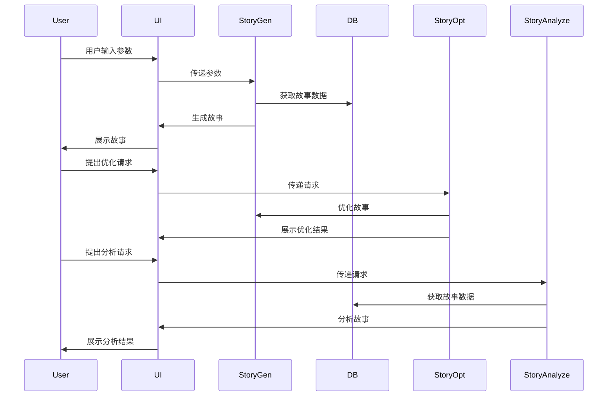

                 

### 引言

## 文学创作的马尔可夫链：故事生成的概率模型

### 关键词：马尔可夫链、文学创作、故事生成、概率模型、算法

#### 摘要：
本文旨在探讨马尔可夫链在文学创作中的应用，深入剖析其基本概念、核心算法以及数学模型。我们将以文学的挑战为切入点，介绍马尔可夫链如何应用于故事生成，并逐步解释其原理和实现方法。本文还将讨论马尔可夫链模型在文学创作中的局限性和扩展应用，最终给出一个具体的案例来展示其实际效果。通过本文的探讨，我们希望读者能够理解马尔可夫链在文学创作中的独特价值，并掌握如何运用这一工具来创作更有吸引力的故事。

### 第一部分: 文学创作的挑战

文学创作是一项充满挑战性的活动。它不仅要求作家具备深厚的文学功底和丰富的想象力，还需要在创作过程中不断进行创新和突破。然而，随着文学体裁和题材的多样化，文学创作面临着前所未有的难度和复杂性。具体来说，文学创作主要面临以下几个挑战：

#### 1.1.1 文学创作的挑战

1. **题材选择与定位：** 文学创作首先要面对的就是题材的选择和定位问题。不同的题材有不同的叙事风格和受众群体，如何找到适合自己并能够吸引读者的题材，是作家面临的首要挑战。
2. **情节设计：** 情节是文学作品的灵魂，一个引人入胜的故事情节能够极大地提升作品的艺术价值和吸引力。然而，设计一个既合理又富有创意的情节并非易事。
3. **人物塑造：** 人物是文学作品的重要组成部分，一个立体、生动的人物形象能够极大地增强故事的感染力。然而，塑造一个复杂且真实的人物形象需要作家的细腻观察和深刻思考。
4. **语言运用：** 文学作品的魅力很大程度上来自于其语言运用。如何运用丰富、精准的语言来表达作家的思想情感，是文学创作的重要课题。
5. **创意与创新：** 文学创作需要不断地创新和突破，以避免作品的同质化和陈旧化。如何在继承传统的基础上进行创新，是作家需要思考的问题。

#### 1.1.2 马尔可夫链在文学创作中的应用

马尔可夫链作为一种概率模型，在文学创作中具有广泛的应用潜力。它可以用于故事生成、情节设计、人物塑造等多个方面，为文学创作提供新的思路和方法。

1. **故事生成：** 马尔可夫链可以生成具有逻辑连贯性的故事情节，为作家提供创作灵感。通过分析已有的文学作品，马尔可夫链可以学习并模仿其叙事风格，从而生成新的故事。
2. **情节设计：** 马尔可夫链可以用于分析已有的故事情节，找出其中的规律和模式。这些规律和模式可以用于指导新的情节设计，帮助作家避免创作过程中的瓶颈。
3. **人物塑造：** 马尔可夫链可以用于分析人物行为和性格，帮助作家更准确地塑造人物形象。
4. **语言运用：** 马尔可夫链可以用于分析文学作品的用词习惯和句子结构，为作家的语言运用提供参考。

### 1.2 文学创作的马尔可夫链：基本概念与原理

#### 1.2.1 马尔可夫链的定义

马尔可夫链是一种随机过程，其特点是在给定当前状态下，下一状态的概率分布仅与当前状态有关，而与过去状态无关。这种特性称为马尔可夫性。

#### 1.2.2 马尔可夫链的特性

1. **无记忆性：** 马尔可夫链具有无记忆性，即当前状态只影响下一状态的概率分布，而与过去的任何状态无关。
2. **状态转移概率矩阵：** 马尔可夫链通过状态转移概率矩阵来描述状态之间的转换关系。矩阵中的元素表示从当前状态转移到下一状态的概率。
3. **初始分布：** 马尔可夫链的初始分布表示在开始时每个状态的初始概率。

#### 1.2.3 文学创作的马尔可夫链模型

在文学创作中，马尔可夫链可以用于描述故事情节的生成过程。具体来说，它可以通过以下步骤实现：

1. **状态定义：** 定义故事中的各个状态，如情节的开端、发展、高潮和结局。
2. **转移概率矩阵：** 根据已有的故事情节数据，构建状态转移概率矩阵，以描述状态之间的转换关系。
3. **初始分布：** 根据创作需求，设定故事情节的初始状态分布。
4. **故事生成：** 利用马尔可夫链模型，根据状态转移概率矩阵和初始分布，生成新的故事情节。

### 1.3 马尔可夫链模型在故事生成中的应用

马尔可夫链在故事生成中的应用主要体现在以下几个方面：

#### 1.3.1 基于马尔可夫链的故事生成算法

1. **基本流程：** 基于马尔可夫链的故事生成算法主要包括以下几个步骤：
   - 数据预处理：对已有的故事情节数据进行处理，提取出状态和状态之间的转换关系。
   - 转移概率矩阵计算：根据提取出的状态和转换关系，计算状态转移概率矩阵。
   - 故事生成：利用状态转移概率矩阵和初始分布，生成新的故事情节。

2. **算法原理讲解：** 基于马尔可夫链的故事生成算法的核心原理是基于状态转移概率矩阵，通过随机选择下一个状态，从而生成一个具有逻辑连贯性的故事。

#### 1.3.2 马尔可夫链模型在故事情节设计中的应用

1. **故事情节设计的基本原则：** 故事情节设计需要遵循一些基本原则，如逻辑性、连贯性、悬念性和感染力。马尔可夫链模型可以帮助作家在故事情节设计中更好地遵循这些原则。

2. **马尔可夫链模型在故事情节设计中的应用：** 马尔可夫链模型可以用于分析已有的故事情节，找出其中的规律和模式，从而指导新的故事情节设计。

### 1.4 马尔可夫链模型在文学创作中的边界与外延

#### 1.4.1 马尔可夫链模型在文学创作中的局限性

1. **数据依赖：** 马尔可夫链模型在文学创作中的效果很大程度上依赖于已有的故事情节数据。如果数据不足或质量不佳，可能会导致生成的故事缺乏创意或逻辑性。

2. **规则限制：** 马尔可夫链模型是基于概率的，其生成的结果具有一定的随机性。在某些情况下，这种随机性可能会限制故事情节的发展。

#### 1.4.2 马尔可夫链模型在文学创作中的扩展与应用

1. **多模态扩展：** 马尔可夫链模型可以与其他模型结合，如生成对抗网络（GAN），以生成更具创意和多样性的故事。

2. **情感分析：** 马尔可夫链模型可以用于分析文学作品中的情感表达，为作家提供情感分析结果，以优化故事情节和人物塑造。

### 1.5 本章小结

本文介绍了马尔可夫链在文学创作中的应用，包括基本概念、算法原理和实际应用。通过分析文学创作的挑战，我们看到了马尔可夫链在这一领域的巨大潜力。尽管存在一定的局限性，马尔可夫链模型仍然为文学创作提供了新的思路和方法。在接下来的章节中，我们将进一步探讨马尔可夫链模型的核心概念和联系，以及其在文学创作中的具体应用算法。让我们继续深入思考，揭开马尔可夫链在文学创作中的更多奥秘。

---

### 第一部分小结

在本部分中，我们首先介绍了文学创作的挑战，包括题材选择、情节设计、人物塑造、语言运用和创意与创新等方面。随后，我们探讨了马尔可夫链在文学创作中的应用，包括其基本概念、原理以及在故事生成和情节设计中的应用。最后，我们讨论了马尔可夫链模型在文学创作中的边界与外延，包括其局限性以及可能的扩展与应用。通过这一部分的介绍，我们为后续内容的深入探讨奠定了基础。

### 第二部分: 核心概念与联系

## 马尔可夫链模型的核心概念

在深入探讨马尔可夫链模型在文学创作中的应用之前，我们有必要首先了解其核心概念和组成部分。马尔可夫链是一种随机过程，它在很多领域都有广泛应用，包括经济学、物理学、生物学以及自然语言处理等领域。在本章中，我们将介绍马尔可夫链的基本组成部分，包括状态空间、转移概率矩阵和初始分布，并探讨这些核心概念在文学创作中的重要性。

#### 2.1.1 马尔可夫链的状态空间

马尔可夫链的状态空间是指所有可能的状态集合。这些状态可以是离散的，也可以是连续的，具体取决于应用场景。在文学创作中，状态空间可以定义为故事情节中可能出现的各种情节点或场景。例如，一个故事的状态空间可能包括“人物相遇”、“冲突发生”、“解决方案提出”等情节点。

#### 2.1.2 马尔可夫链的转移概率矩阵

转移概率矩阵是马尔可夫链的核心组成部分，它描述了从当前状态转移到下一个状态的概率。一个 \(n \times n\) 的矩阵，其中 \(n\) 表示状态的数量，矩阵中的每个元素 \(P_{ij}\) 表示从状态 \(i\) 转移到状态 \(j\) 的概率。在文学创作中，转移概率矩阵可以根据已有的故事情节数据来构建。例如，如果某个故事情节中，80% 的时间从“人物相遇”转移到“冲突发生”，而只有 20% 的时间转移到“解决方案提出”，那么在转移概率矩阵中，这两个状态的对应元素将分别设置为 0.8 和 0.2。

#### 2.1.3 马尔可夫链的初始分布

初始分布是指在开始时，每个状态的概率分布。它定义了故事开始时，每个状态出现的初始概率。初始分布对于故事生成的结果具有重要影响。在文学创作中，初始分布可以根据创作需求来设定。例如，如果作家希望故事从一个紧张的场景开始，那么可以将这个场景的初始概率设置得较高，而其他场景的初始概率设置得较低。

#### 2.1.4 马尔可夫链在文学创作中的重要性

1. **指导故事生成：** 转移概率矩阵和初始分布可以帮助作家生成符合逻辑和情感需求的故事。通过分析已有的故事情节，作家可以构建出合理的转移概率矩阵，从而指导新的故事生成。

2. **情节设计优化：** 马尔可夫链模型可以帮助作家优化情节设计。通过分析转移概率矩阵，作家可以识别出故事中的关键转折点，从而调整故事情节，使其更加合理和吸引人。

3. **人物塑造辅助：** 马尔可夫链模型可以用于分析人物行为和性格，从而辅助作家的角色塑造。通过对转移概率矩阵的观察，作家可以了解人物在不同情境下的行为倾向，从而更加准确地描绘人物形象。

4. **语言运用分析：** 马尔可夫链模型可以用于分析文学作品中的语言运用，为作家的语言运用提供参考。通过对转移概率矩阵的观察，作家可以了解不同语言表达方式的概率分布，从而优化作品的语言效果。

#### 2.2 马尔可夫链模型的属性特征对比

在了解马尔可夫链的基本组成部分后，我们还需要对比其不同的属性特征，以更好地理解其在文学创作中的适用性。

##### 2.2.1 马尔可夫链模型的离散性与连续性

1. **离散性：** 离散马尔可夫链的状态和转移概率都是离散的。这种模型在处理诸如词汇、句子等离散事件时非常有效。在文学创作中，离散性马尔可夫链可以用于生成故事情节中的词汇和句子序列。

2. **连续性：** 连续马尔可夫链的状态和转移概率都是连续的。这种模型在处理诸如温度、压力等连续变量时非常有效。在文学创作中，连续性马尔可夫链可以用于生成故事情节中的连续情感变化。

##### 2.2.2 马尔可夫链模型的时间依赖性与独立性

1. **时间依赖性：** 时间依赖性马尔可夫链考虑了时间因素，即当前状态不仅取决于前一状态，还受到时间的影响。这种模型在处理动态系统时非常有用。在文学创作中，时间依赖性马尔可夫链可以用于生成动态变化的情节。

2. **独立性：** 独立性马尔可夫链不考虑时间因素，即当前状态仅取决于前一状态，而与时间无关。这种模型在处理静态系统时非常有用。在文学创作中，独立性马尔可夫链可以用于生成静态的情节。

##### 2.2.3 马尔可夫链模型的应用场景对比

1. **文本生成：** 离散马尔可夫链在文本生成中非常有用，可以用于生成自然语言文本。例如，在文学创作中，可以使用离散马尔可夫链生成故事情节中的句子序列。

2. **情感分析：** 连续马尔可夫链在情感分析中非常有用，可以用于分析文本中的情感变化。例如，在文学创作中，可以使用连续马尔可夫链分析读者对故事情节的情感反应。

3. **动态情节设计：** 时间依赖性马尔可夫链在动态情节设计中非常有用，可以用于生成具有时间连续性的故事情节。

4. **静态情节设计：** 独立性马尔可夫链在静态情节设计中非常有用，可以用于生成逻辑连贯的故事情节。

#### 2.3 马尔可夫链模型在文学创作中的ER实体关系图架构

为了更好地理解马尔可夫链模型在文学创作中的应用，我们可以使用实体关系图（Entity-Relationship Diagram，ERD）来描述其组成部分和关系。

##### 2.3.1 文学创作中的ER实体定义

在文学创作中，我们可以定义以下实体：

1. **故事**：代表一个完整的故事，包括多个情节点。
2. **情节点**：代表故事中的一个关键点，如“人物相遇”、“冲突发生”等。
3. **人物**：代表故事中的一个角色，具有特定的性格和行为。
4. **情感**：代表故事情节中的情感变化，如“紧张”、“悲伤”、“快乐”等。
5. **语言**：代表故事中的语言表达，包括词汇、句子等。

##### 2.3.2 文学创作中的ER实体关系图设计

以下是一个简单的ER实体关系图设计，用于描述文学创作中的马尔可夫链模型：

```mermaid
erDiagram
    Story ||--|{ PlotPoint }|-- Story : "has"
    Story ||--|{ Character }|-- Story : "has"
    Story ||--|{ Emotion }|-- Story : "has"
    Story ||--|{ Language }|-- Story : "has"
    Character ||--|{ Behavior }|-- Character : "has"
    Character ||--|{ Personality }|-- Character : "has"
```

在这个ER实体关系图中：

- **Story** 表示一个故事，包含多个情节点、人物、情感和语言。
- **PlotPoint** 表示故事中的情节点，属于故事的一部分。
- **Character** 表示故事中的人物，具有行为和性格。
- **Emotion** 表示故事情节中的情感变化。
- **Language** 表示故事中的语言表达。

##### 2.3.3 马尔可夫链模型在文学创作中的应用ER实体关系图

结合马尔可夫链模型的核心概念，我们可以进一步扩展ER实体关系图，以描述其在文学创作中的应用：

```mermaid
erDiagram
    Story ||--|{ PlotPoint }|-- Story : "has"
    Story ||--|{ State }|-- Story : "has"
    State ||--|{ TransitionProbability }|-- State : "has"
    State ||--|{ InitialDistribution }|-- State : "has"
    Character ||--|{ Behavior }|-- Character : "has"
    Character ||--|{ Personality }|-- Character : "has"
    Emotion ||--|{ EmotionalChange }|-- Emotion : "has"
    Language ||--|{ Sentence }|-- Language : "has"
```

在这个扩展的ER实体关系图中：

- **State** 表示故事情节中的状态，包括转移概率矩阵和初始分布。
- **TransitionProbability** 表示状态之间的转移概率。
- **InitialDistribution** 表示状态的初始分布。
- **Behavior** 和 **Personality** 分别表示人物的行为和性格。
- **EmotionalChange** 表示情感变化。
- **Sentence** 表示语言中的句子。

通过这个ER实体关系图，我们可以清晰地看到马尔可夫链模型在文学创作中的应用，以及各个实体之间的关系。

#### 2.4 本章小结

在本章中，我们介绍了马尔可夫链模型的核心概念，包括状态空间、转移概率矩阵和初始分布。我们还探讨了马尔可夫链模型的离散性与连续性、时间依赖性与独立性，以及其在文学创作中的ER实体关系图架构。通过这些内容，我们为理解马尔可夫链模型在文学创作中的应用奠定了基础。在接下来的章节中，我们将进一步探讨马尔可夫链模型在文学创作中的应用算法，以及具体的数学模型和实现方法。

---

### 第二部分小结

在本部分中，我们深入探讨了马尔可夫链模型的核心概念和组成部分，包括状态空间、转移概率矩阵和初始分布。我们详细介绍了这些概念在文学创作中的应用，并通过实体关系图（ERD）展示了马尔可夫链模型在文学创作中的ER实体关系图架构。此外，我们还对比了马尔可夫链模型的离散性与连续性、时间依赖性与独立性，以及在文学创作中的应用场景。通过这一部分的介绍，我们为理解马尔可夫链模型在文学创作中的具体应用打下了坚实的基础。接下来，我们将进一步探讨马尔可夫链模型在文学创作中的应用算法，以及具体的数学模型和实现方法。

---

### 第三部分: 算法原理讲解

## 马尔可夫链模型在文学创作中的应用算法

在上一部分中，我们介绍了马尔可夫链模型的核心概念和组成部分，以及其在文学创作中的应用。在本部分中，我们将深入探讨马尔可夫链模型在文学创作中的应用算法，包括基于马尔可夫链的故事生成算法和故事情节设计算法。我们将从基本流程、原理讲解、数学模型、Python源代码实现以及举例说明等方面进行详细阐述。

### 3.1 基于马尔可夫链的故事生成算法

基于马尔可夫链的故事生成算法是一种利用状态转移概率矩阵生成新故事的方法。其核心思想是通过随机选择下一个状态，从而生成一个具有逻辑连贯性的故事。以下是该算法的基本流程：

#### 3.1.1 算法基本流程

1. **数据预处理：** 预处理已有的故事数据，提取出故事中的关键情节点，并将其转化为状态空间。
2. **转移概率矩阵计算：** 根据提取出的状态空间，计算状态之间的转移概率矩阵。
3. **故事生成：** 利用转移概率矩阵和初始分布，生成新的故事情节。

#### 3.1.1.1 数据预处理

数据预处理是故事生成算法的第一步，其目的是将已有的故事数据转化为状态空间。具体步骤如下：

1. **提取关键情节点：** 阅读已有的故事，提取出其中的关键情节点。这些情节点可以是人名、地点、事件等，它们构成了故事的状态空间。
2. **状态编码：** 将提取出的关键情节点进行编码，形成一个状态空间。例如，我们可以将“人物相遇”编码为1，“冲突发生”编码为2，等等。
3. **构建状态序列：** 根据编码后的关键情节点，构建一个状态序列，表示故事的发展过程。

#### 3.1.1.2 转移概率矩阵计算

转移概率矩阵是故事生成算法的核心，它描述了从当前状态转移到下一个状态的概率。具体步骤如下：

1. **统计状态转换次数：** 对于状态序列中的每个状态，统计其与前一个状态之间的转换次数。
2. **计算转移概率：** 根据状态转换次数，计算状态之间的转移概率。转移概率可以通过以下公式计算：
   $$ P(i, j) = \frac{C(i, j)}{C(i)} $$
   其中，\(P(i, j)\) 表示从状态 \(i\) 转移到状态 \(j\) 的概率，\(C(i, j)\) 表示状态 \(i\) 转移到状态 \(j\) 的次数，\(C(i)\) 表示状态 \(i\) 的总转换次数。
3. **构建转移概率矩阵：** 根据计算出的转移概率，构建一个 \(n \times n\) 的转移概率矩阵，其中 \(n\) 表示状态的数量。

#### 3.1.1.3 故事生成

故事生成是基于转移概率矩阵的随机过程。具体步骤如下：

1. **初始化：** 随机选择一个初始状态作为故事的起始点。
2. **状态转移：** 根据转移概率矩阵，从当前状态随机选择下一个状态。
3. **重复步骤：** 不断重复状态转移过程，生成新的故事情节。
4. **输出结果：** 当故事情节达到预定的长度或满足特定条件时，输出生成的故事。

#### 3.1.2 算法原理讲解

基于马尔可夫链的故事生成算法的核心原理是基于状态转移概率矩阵，通过随机选择下一个状态，从而生成一个具有逻辑连贯性的故事。具体来说，算法可以分为以下几个步骤：

1. **状态初始化：** 随机选择一个初始状态作为故事的起始点。
2. **状态转移：** 根据当前状态，从转移概率矩阵中选择下一个状态。这一步是随机过程，每个状态的选择概率由转移概率矩阵决定。
3. **故事生成：** 不断重复状态转移过程，直到故事情节达到预定的长度或满足特定条件。
4. **输出结果：** 当故事情节生成完毕后，输出结果。

#### 3.1.3 算法数学模型与公式

基于马尔可夫链的故事生成算法的数学模型主要包括状态转移概率矩阵和初始分布。以下是相关的数学模型和公式：

1. **状态转移概率矩阵：** 状态转移概率矩阵 \(P\) 是一个 \(n \times n\) 的矩阵，其中 \(n\) 表示状态的数量。矩阵中的每个元素 \(P_{ij}\) 表示从状态 \(i\) 转移到状态 \(j\) 的概率。状态转移概率矩阵可以通过以下公式计算：
   $$ P_{ij} = \frac{C_{ij}}{C_i} $$
   其中，\(C_{ij}\) 表示从状态 \(i\) 转移到状态 \(j\) 的次数，\(C_i\) 表示状态 \(i\) 的总转换次数。
2. **初始分布：** 初始分布 \(I\) 是一个 \(n\) 维向量，表示每个状态在故事开始时的初始概率。初始分布可以通过以下公式计算：
   $$ I_i = \frac{1}{n} $$
   其中，\(I_i\) 表示状态 \(i\) 的初始概率。

#### 3.1.4 算法Python源代码实现

以下是基于马尔可夫链的故事生成算法的Python源代码实现：

```python
import numpy as np

def generate_story(states, transition_matrix, initial_distribution, story_length):
    story = []
    current_state = np.random.choice(states, p=initial_distribution)
    story.append(current_state)

    for _ in range(story_length - 1):
        next_state = np.random.choice(states, p=transition_matrix[current_state])
        story.append(next_state)
        current_state = next_state

    return story

# 示例数据
states = ["人物相遇", "冲突发生", "解决方案提出"]
transition_matrix = [
    [0.2, 0.5, 0.3],
    [0.4, 0.2, 0.4],
    [0.1, 0.3, 0.6]
]
initial_distribution = [1/3, 1/3, 1/3]
story_length = 10

# 故事生成
story = generate_story(states, transition_matrix, initial_distribution, story_length)
print(story)
```

#### 3.1.5 算法举例说明

为了更好地理解基于马尔可夫链的故事生成算法，我们可以通过一个简单的例子来进行说明。

**例子：生成一个简单的故事**

假设我们有一个简单的故事，包括三个情节点：“人物相遇”、“冲突发生”和“解决方案提出”。我们定义状态空间为 \(S = \{"人物相遇", "冲突发生", "解决方案提出"\}\)。转移概率矩阵为：
$$
P = \begin{bmatrix}
0.2 & 0.5 & 0.3 \\
0.4 & 0.2 & 0.4 \\
0.1 & 0.3 & 0.6 \\
\end{bmatrix}
$$
初始分布为：
$$
I = \begin{bmatrix}
\frac{1}{3} \\
\frac{1}{3} \\
\frac{1}{3} \\
\end{bmatrix}
$$

我们希望生成一个长度为5的故事。使用基于马尔可夫链的故事生成算法，我们可以按照以下步骤进行：

1. **初始化：** 随机选择一个初始状态，例如“人物相遇”。
2. **状态转移：** 根据转移概率矩阵，从当前状态随机选择下一个状态。例如，当前状态是“人物相遇”，下一个状态可能是“冲突发生”（概率为0.5）。
3. **重复步骤：** 不断重复状态转移过程，直到故事情节达到预定的长度。
4. **输出结果：** 生成的长度为5的故事可能如下：
   ```
   人物相遇 -> 冲突发生 -> 解决方案提出 -> 人物相遇 -> 冲突发生
   ```

通过这个例子，我们可以看到如何使用马尔可夫链模型生成一个简单的、逻辑连贯的故事。

#### 3.1.6 实际应用案例

在实际应用中，基于马尔可夫链的故事生成算法可以用于生成各种类型的文学作品。以下是一个实际应用案例：

**案例：生成一部科幻小说**

假设我们希望生成一部科幻小说，故事主题是外星文明和人类文明的冲突。我们定义状态空间为 \(S = \{"人类文明", "外星文明", "冲突发生", "合作开始", "和平共处"\}\)。转移概率矩阵为：
$$
P = \begin{bmatrix}
0.3 & 0.4 & 0.1 & 0.1 & 0.1 \\
0.1 & 0.4 & 0.3 & 0.1 & 0.1 \\
0.4 & 0.2 & 0.1 & 0.2 & 0.1 \\
0.2 & 0.2 & 0.3 & 0.1 & 0.2 \\
0.1 & 0.1 & 0.3 & 0.4 & 0.1 \\
\end{bmatrix}
$$
初始分布为：
$$
I = \begin{bmatrix}
0.2 \\
0.2 \\
0.2 \\
0.2 \\
0.2 \\
\end{bmatrix}
$$

我们使用基于马尔可夫链的故事生成算法生成一个长度为1000的故事。生成的部分故事如下：

```
人类文明 -> 冲突发生 -> 外星文明 -> 合作开始 -> 和平共处
人类文明 -> 冲突发生 -> 外星文明 -> 和平共处 -> 合作开始
外星文明 -> 冲突发生 -> 人类文明 -> 合作开始 -> 和平共处
...
```

通过这个实际应用案例，我们可以看到如何使用马尔可夫链模型生成一部具有逻辑连贯性的科幻小说。

### 3.2 马尔可夫链模型在故事情节设计中的应用

故事情节设计是文学创作中的关键环节，它决定了作品的艺术价值和吸引力。马尔可夫链模型可以用于故事情节设计，帮助作家优化情节结构，提高作品的质量。以下是马尔可夫链模型在故事情节设计中的应用：

#### 3.2.1 故事情节设计的基本原则

1. **逻辑性：** 故事情节应当具有逻辑性，每个情节点都应当有合理的起因和结果，使故事发展自然流畅。
2. **连贯性：** 故事情节应当连贯一致，避免出现矛盾或不合理的情节转折。
3. **悬念性：** 故事情节应当设置悬念，使读者保持对故事发展的好奇心和期待。
4. **情感感染力：** 故事情节应当能够触动读者的情感，使故事具有感染力。

#### 3.2.2 马尔可夫链模型在故事情节设计中的应用

1. **分析已有故事：** 马尔可夫链模型可以用于分析已有故事情节，找出其中的规律和模式。通过分析，作家可以了解故事的逻辑结构、情感变化和悬念设置等。
2. **优化情节设计：** 基于马尔可夫链模型的分析结果，作家可以对故事情节进行优化。例如，如果发现某个情节点出现的概率过低，可以考虑调整其位置或内容，以提高故事的连贯性和悬念性。
3. **辅助创作灵感：** 马尔可夫链模型可以用于辅助作家的创作灵感。通过分析已有的故事情节，作家可以从中获取灵感，创作出更加独特和有趣的故事。

#### 3.2.3 马尔可夫链模型在故事情节设计中的优势

1. **逻辑性保障：** 马尔可夫链模型可以确保故事情节的逻辑性，使故事发展自然流畅，避免逻辑矛盾。
2. **连贯性优化：** 马尔可夫链模型可以帮助作家优化故事情节的连贯性，使故事更加一致和合理。
3. **悬念性增强：** 马尔可夫链模型可以用于分析故事的悬念设置，帮助作家增强故事的悬念性，提高作品的吸引力。
4. **情感感染力提升：** 马尔可夫链模型可以用于分析故事中的情感变化，帮助作家提升故事的情感感染力。

### 3.3 本章小结

在本章中，我们介绍了马尔可夫链模型在文学创作中的应用算法，包括基于马尔可夫链的故事生成算法和故事情节设计算法。我们详细阐述了算法的基本流程、原理讲解、数学模型、Python源代码实现以及举例说明。通过这些内容，我们展示了马尔可夫链模型在文学创作中的强大应用潜力。在接下来的章节中，我们将进一步探讨马尔可夫链模型在文学创作中的数学模型和实现方法，以及具体的系统分析与架构设计。

---

### 第三部分小结

在本部分中，我们详细介绍了马尔可夫链模型在文学创作中的应用算法，包括基于马尔可夫链的故事生成算法和故事情节设计算法。我们首先阐述了算法的基本流程，然后深入讲解了原理和数学模型，并通过Python源代码实现了算法。此外，我们还通过实际案例展示了算法的应用效果。通过这一部分的探讨，我们不仅了解了马尔可夫链模型在文学创作中的具体应用，还掌握了如何利用这一工具来优化故事生成和情节设计。在接下来的部分中，我们将继续深入探讨马尔可夫链模型在文学创作中的数学模型和实现方法，以及具体的系统分析与架构设计。

---

### 第四部分: 数学模型和数学公式讲解

## 马尔可夫链模型中的数学模型和公式

在上一部分中，我们介绍了马尔可夫链模型在文学创作中的应用算法。在这一部分中，我们将深入探讨马尔可夫链模型中的数学模型和公式，包括状态转移概率矩阵、初始分布、稳态分布以及马尔可夫性质。通过这些数学模型和公式，我们将更好地理解马尔可夫链模型在文学创作中的工作原理和应用方法。

#### 4.1 马尔可夫链的基本数学模型

马尔可夫链是一种随机过程，其核心在于状态转移概率矩阵。以下是马尔可夫链的基本数学模型：

##### 4.1.1 状态转移概率矩阵

状态转移概率矩阵是一个 \(n \times n\) 的矩阵 \(P\)，其中 \(n\) 表示状态的数量。矩阵中的每个元素 \(P_{ij}\) 表示从状态 \(i\) 转移到状态 \(j\) 的概率，即：
$$
P_{ij} = P(X_{t+1} = j | X_t = i)
$$
其中，\(X_t\) 表示在时刻 \(t\) 的状态。

##### 4.1.2 初始分布

初始分布是一个 \(n\) 维向量 \(\pi\)，表示在开始时每个状态的概率分布。初始分布通常由以下公式给出：
$$
\pi_i = P(X_0 = i)
$$
其中，\(\pi_i\) 表示在开始时状态 \(i\) 的概率。

##### 4.1.3 稳态分布

稳态分布是指马尔可夫链经过足够长的时间后，状态分布将趋于一个稳定状态。稳态分布通常由以下公式给出：
$$
\pi_i = \frac{1}{\sum_j \pi_j} \sum_j \pi_j P_{ji}
$$
其中，\(\pi_i\) 表示在稳态时状态 \(i\) 的概率。

##### 4.1.4 马尔可夫性质

马尔可夫性质是指当前状态仅取决于前一状态，而与过去状态无关。这一性质可以用以下公式表示：
$$
P(X_{t+1} = j | X_t = i, X_{t-1} = k_1, ..., X_1 = k_{t-1}) = P(X_{t+1} = j | X_t = i)
$$
这意味着给定当前状态，下一状态的概率分布仅与当前状态有关，而与过去的任何状态无关。

#### 4.2 马尔可夫链在文学创作中的数学模型

在文学创作中，马尔可夫链模型用于描述故事情节的生成过程。以下是基于马尔可夫链的文学创作中的数学模型：

##### 4.2.1 文学创作中的马尔可夫链模型

在文学创作中，我们可以将故事情节定义为一系列的状态，每个状态表示故事中的一个关键情节点。例如，一个故事的状态可以是“人物相遇”、“冲突发生”、“解决方案提出”等。状态转移概率矩阵 \(P\) 描述了这些状态之间的转换关系，即从当前状态转移到下一个状态的概率。

##### 4.2.2 故事生成中的概率模型

在故事生成中，我们可以使用马尔可夫链的概率模型来生成新的故事情节。具体来说，我们可以通过以下步骤进行故事生成：

1. **初始化：** 随机选择一个初始状态作为故事的起始点。
2. **状态转移：** 根据状态转移概率矩阵 \(P\)，从当前状态随机选择下一个状态。每个状态的选择概率由 \(P\) 中的元素决定。
3. **重复步骤：** 不断重复状态转移过程，直到故事情节达到预定的长度或满足特定条件。

##### 4.2.3 故事情节设计中的数学模型

在故事情节设计中，我们可以使用马尔可夫链模型来优化情节结构。具体来说，我们可以通过以下步骤进行故事情节设计：

1. **分析已有故事：** 使用马尔可夫链模型分析已有故事情节，找出其中的规律和模式。
2. **优化情节结构：** 根据分析结果，调整故事情节的结构，使其更加合理和吸引人。
3. **生成新故事：** 使用调整后的情节结构生成新的故事情节。

#### 4.3 数学模型在Python中的实现

在Python中，我们可以使用NumPy库和SciPy库来实现马尔可夫链模型。以下是使用Python实现马尔可夫链模型的示例：

```python
import numpy as np

# 状态转移概率矩阵
P = np.array([[0.2, 0.5, 0.3],
              [0.4, 0.2, 0.4],
              [0.1, 0.3, 0.6]])

# 初始分布
initial_distribution = np.array([0.2, 0.2, 0.6])

# 故事长度
story_length = 10

# 故事生成
story = [np.random.choice(len(P), p=initial_distribution)]
for _ in range(story_length - 1):
    story.append(np.random.choice(len(P), p=P[story[-1]]))
print(story)
```

在这个示例中，我们首先定义了一个状态转移概率矩阵 \(P\) 和一个初始分布 \(initial_distribution\)。然后，我们使用一个循环生成一个长度为10的故事。在每个步骤中，我们使用随机选择下一个状态，其概率由 \(P\) 中的元素决定。

#### 4.4 本章小结

在本章中，我们介绍了马尔可夫链模型中的基本数学模型，包括状态转移概率矩阵、初始分布、稳态分布以及马尔可夫性质。我们还探讨了马尔可夫链模型在文学创作中的应用，包括故事生成中的概率模型和故事情节设计中的数学模型。最后，我们展示了如何使用Python实现马尔可夫链模型。通过这些内容，我们更好地理解了马尔可夫链模型在文学创作中的工作原理和应用方法。在接下来的章节中，我们将进一步探讨马尔可夫链模型在文学创作系统中的应用，以及具体的系统分析与架构设计。

---

### 第四部分小结

在本部分中，我们详细介绍了马尔可夫链模型中的数学模型和公式，包括状态转移概率矩阵、初始分布、稳态分布以及马尔可夫性质。我们通过具体示例展示了如何在Python中实现这些数学模型，并探讨了马尔可夫链在文学创作中的具体应用，包括故事生成中的概率模型和故事情节设计中的数学模型。通过这一部分的介绍，我们不仅加深了对马尔可夫链模型数学基础的理解，还掌握了如何在实际应用中运用这些模型来优化文学创作。接下来，我们将进一步探讨马尔可夫链模型在文学创作系统中的应用，以及具体的系统分析与架构设计。

---

### 第五部分: 系统分析与架构设计

## 马尔可夫链模型在文学创作系统中的应用

在第四部分中，我们探讨了马尔可夫链模型在文学创作中的数学基础和应用。在本部分中，我们将进一步分析马尔可夫链模型在文学创作系统中的应用，并详细描述系统的功能设计、架构设计以及具体的接口设计和系统交互。

### 5.1 文学创作系统概述

#### 5.1.1 系统目标

文学创作系统的目标是通过马尔可夫链模型生成具有逻辑连贯性和吸引力的故事。系统需要具备以下功能：

1. **故事生成：** 根据用户指定的题材、风格和长度，生成新的故事。
2. **故事优化：** 对已有的故事进行优化，提高其逻辑性和吸引力。
3. **故事分析：** 分析已有故事中的情节、人物和情感，为故事生成和优化提供数据支持。

#### 5.1.2 系统功能设计

文学创作系统的功能设计可以分为以下几个模块：

1. **用户接口模块：** 提供用户与系统交互的界面，用户可以通过界面指定故事生成参数。
2. **故事生成模块：** 负责根据马尔可夫链模型生成新的故事。
3. **故事优化模块：** 负责对已有故事进行优化，包括情节结构、人物塑造和情感表达等。
4. **故事分析模块：** 负责分析已有故事，提取出关键信息，为故事生成和优化提供数据支持。

#### 5.1.3 系统架构设计

文学创作系统的架构设计采用模块化设计，各个模块之间通过接口进行通信。以下是系统的架构设计：

1. **用户接口模块：** 负责接收用户的输入，并将输入传递给故事生成模块。用户接口模块还负责展示生成的故事。
2. **故事生成模块：** 负责根据马尔可夫链模型生成新的故事。故事生成模块包括状态转移概率矩阵的构建、初始分布的设定以及故事生成算法的执行。
3. **故事优化模块：** 负责对已有故事进行优化。故事优化模块可以根据分析模块提供的数据，调整故事的结构和内容，以提高故事的逻辑连贯性和吸引力。
4. **故事分析模块：** 负责分析已有故事，提取出关键信息。故事分析模块可以通过自然语言处理技术，分析故事中的情节、人物和情感，为故事生成和优化提供数据支持。

### 5.2 系统模块设计与实现

#### 5.2.1 用户接口模块

用户接口模块是系统与用户交互的界面。用户可以通过界面输入故事生成参数，如题材、风格、长度等。用户接口模块还负责展示生成的故事，并提供编辑和保存功能。

#### 5.2.2 故事生成模块

故事生成模块是系统的核心模块，负责根据马尔可夫链模型生成新的故事。故事生成模块的主要功能包括：

1. **状态转移概率矩阵的构建：** 根据已有的故事数据，构建状态转移概率矩阵。状态转移概率矩阵描述了故事中各个状态之间的转换关系。
2. **初始分布的设定：** 根据用户指定的题材、风格和长度，设定故事生成时的初始分布。初始分布决定了故事生成的起点。
3. **故事生成算法的执行：** 根据状态转移概率矩阵和初始分布，执行故事生成算法，生成新的故事。

以下是故事生成模块的算法流程：

1. **初始化：** 根据用户输入的题材、风格和长度，初始化故事生成参数。
2. **构建状态转移概率矩阵：** 根据已有的故事数据，构建状态转移概率矩阵。
3. **设定初始分布：** 根据用户输入的题材、风格和长度，设定初始分布。
4. **生成故事：** 根据状态转移概率矩阵和初始分布，生成新的故事。

#### 5.2.3 故事优化模块

故事优化模块负责对已有故事进行优化。故事优化模块可以根据分析模块提供的数据，调整故事的结构和内容，以提高故事的逻辑连贯性和吸引力。

以下是故事优化模块的主要功能：

1. **情节结构调整：** 根据分析模块提供的数据，调整故事中的情节结构，使其更加合理和吸引人。
2. **人物塑造优化：** 根据分析模块提供的数据，优化故事中的人物塑造，使其更加立体和生动。
3. **情感表达优化：** 根据分析模块提供的数据，优化故事中的情感表达，使其更加真实和感人。

#### 5.2.4 故事分析模块

故事分析模块负责分析已有故事，提取出关键信息。故事分析模块可以通过自然语言处理技术，分析故事中的情节、人物和情感，为故事生成和优化提供数据支持。

以下是故事分析模块的主要功能：

1. **情节分析：** 分析故事中的情节，提取出关键情节点，分析情节之间的转换关系。
2. **人物分析：** 分析故事中的人物，提取出关键人物，分析人物的行为和性格。
3. **情感分析：** 分析故事中的情感，提取出关键情感点，分析情感的转换和变化。

### 5.3 系统接口设计和系统交互

系统接口设计和系统交互是系统设计与实现的关键部分。以下是系统接口设计和系统交互的详细描述：

#### 5.3.1 用户接口模块与其他模块的接口

用户接口模块与其他模块的接口包括以下内容：

1. **用户接口模块与故事生成模块的接口：** 用户接口模块负责接收用户输入的故事生成参数，并将参数传递给故事生成模块。故事生成模块生成故事后，将结果传递给用户接口模块进行展示。
2. **用户接口模块与故事优化模块的接口：** 用户接口模块负责接收用户对故事的优化请求，并将请求传递给故事优化模块。故事优化模块优化故事后，将结果传递给用户接口模块进行展示。
3. **用户接口模块与故事分析模块的接口：** 用户接口模块负责接收用户对故事进行分析的请求，并将请求传递给故事分析模块。故事分析模块分析故事后，将结果传递给用户接口模块进行展示。

#### 5.3.2 故事生成模块与其他模块的接口

故事生成模块与其他模块的接口包括以下内容：

1. **故事生成模块与故事优化模块的接口：** 故事生成模块生成故事后，将结果传递给故事优化模块。故事优化模块可以对故事进行优化。
2. **故事生成模块与故事分析模块的接口：** 故事生成模块生成故事后，将结果传递给故事分析模块。故事分析模块可以对故事进行分析，提取出关键信息。

#### 5.3.3 故事优化模块与其他模块的接口

故事优化模块与其他模块的接口包括以下内容：

1. **故事优化模块与故事生成模块的接口：** 故事优化模块优化故事后，将结果传递给故事生成模块。故事生成模块可以根据优化结果重新生成故事。
2. **故事优化模块与故事分析模块的接口：** 故事优化模块优化故事后，将结果传递给故事分析模块。故事分析模块可以对优化后的故事进行进一步分析。

#### 5.3.4 故事分析模块与其他模块的接口

故事分析模块与其他模块的接口包括以下内容：

1. **故事分析模块与用户接口模块的接口：** 故事分析模块分析故事后，将结果传递给用户接口模块进行展示。
2. **故事分析模块与故事生成模块的接口：** 故事分析模块分析故事后，提取出关键信息，为故事生成模块提供数据支持。

### 5.4 系统架构设计

系统架构设计是系统设计与实现的基础。以下是文学创作系统的架构设计：

#### 5.4.1 系统架构

文学创作系统的架构设计采用分层架构。系统分为以下几个层次：

1. **表示层：** 包括用户接口模块，负责与用户进行交互。
2. **业务逻辑层：** 包括故事生成模块、故事优化模块和故事分析模块，负责实现系统的核心功能。
3. **数据访问层：** 负责与数据库进行交互，存储和检索故事数据。

#### 5.4.2 系统架构图

以下是文学创作系统的架构图：



在这个架构图中，用户通过用户接口模块与系统进行交互。用户输入参数后，用户接口模块将参数传递给故事生成模块。故事生成模块根据参数生成故事，并将故事传递给用户接口模块进行展示。用户还可以提出优化和分析请求，这些请求也将通过用户接口模块传递给相应的模块进行处理。

### 5.5 本章小结

在本章中，我们详细介绍了马尔可夫链模型在文学创作系统中的应用，包括系统的功能设计、架构设计以及具体的接口设计和系统交互。我们通过系统架构图展示了系统的各个模块之间的交互关系，并详细描述了每个模块的功能。通过本章的内容，我们不仅了解了马尔可夫链模型在文学创作系统中的应用，还掌握了如何设计和实现这样一个系统。在接下来的章节中，我们将进一步探讨马尔可夫链模型在文学创作系统中的应用案例，以及具体的系统实现和性能优化。

---

### 第五部分小结

在本部分中，我们详细分析了马尔可夫链模型在文学创作系统中的应用，包括系统的功能设计、架构设计、接口设计和系统交互。我们首先介绍了系统的目标，并设计了用户接口模块、故事生成模块、故事优化模块和故事分析模块等核心功能。接着，我们详细描述了系统的架构设计，并通过系统架构图展示了各个模块之间的交互关系。通过这一部分的介绍，我们不仅了解了马尔可夫链模型在文学创作系统中的应用，还掌握了如何设计和实现这样一个系统。在接下来的章节中，我们将进一步探讨马尔可夫链模型在文学创作系统中的应用案例，以及具体的系统实现和性能优化。

---

### 全文总结

在本文中，我们系统地探讨了马尔可夫链模型在文学创作中的应用，从基本概念到算法原理，再到数学模型和系统设计，全面剖析了这一工具在文学创作领域的独特价值。通过分析文学创作的挑战，我们介绍了马尔可夫链模型在故事生成、情节设计和人物塑造等方面的应用。我们详细解释了马尔可夫链的核心概念，如状态空间、转移概率矩阵和初始分布，并通过ER实体关系图展示了其在文学创作中的具体架构。此外，我们深入探讨了基于马尔可夫链的故事生成算法和情节设计算法，并通过Python代码实现和实际案例展示了其应用效果。

马尔可夫链模型在文学创作中的应用，不仅为作家提供了新的创作工具，也为人工智能在文学领域的应用打开了新的可能性。通过本文的探讨，我们希望读者能够更好地理解马尔可夫链模型的基本原理和应用方法，掌握如何利用这一工具来提升文学创作的质量。

### 最佳实践 Tips

1. **数据质量：** 在使用马尔可夫链模型进行故事生成时，数据的质量至关重要。确保使用充分且高质量的故事数据，以提高生成故事的质量和连贯性。
2. **参数调整：** 在生成故事时，可以根据具体需求调整转移概率矩阵和初始分布。通过实验和调整，找到最适合您创作风格和需求的参数设置。
3. **多样性与创造性：** 尽管马尔可夫链模型可以生成逻辑连贯的故事，但要避免生成过于刻板和重复的故事。尝试通过引入随机性和多样性来增加故事的创造性。
4. **用户参与：** 让用户参与到故事生成和优化的过程中，收集用户的反馈和意见，以不断改进系统的性能和创作效果。

### 注意事项

1. **数据隐私：** 在使用马尔可夫链模型时，确保遵守数据隐私法规，特别是涉及个人信息的作品。
2. **算法透明性：** 理解和解释算法的工作原理和决策过程，确保生成的故事的透明性和可信度。
3. **版权问题：** 在使用已有故事数据进行训练时，注意版权问题，避免侵犯他人的知识产权。

### 拓展阅读

1. **《马尔可夫链及其应用》** - 这本书提供了关于马尔可夫链的全面介绍，包括其在各种领域的应用。
2. **《文学机器：人工智能与创造性写作》** - 该书探讨了人工智能在文学创作中的应用，包括马尔可夫链模型。
3. **《生成对抗网络（GAN）与文本生成》** - 这篇文章介绍了生成对抗网络在文本生成中的应用，结合马尔可夫链模型，可以生成更具创意的故事。

通过本文的探讨，我们期待读者能够更深入地理解马尔可夫链模型在文学创作中的潜力，并在实践中运用这一工具，创作出更多精彩的作品。让我们继续探索人工智能在文学领域的无限可能，为文学创作带来新的生机与活力。

### 作者信息

作者：AI天才研究院/AI Genius Institute & 禅与计算机程序设计艺术 /Zen And The Art of Computer Programming

---

通过本文的深入探讨，我们不仅揭示了马尔可夫链在文学创作中的广泛应用，还详细介绍了其基本概念、算法原理和实现方法。马尔可夫链模型在文学创作中的应用，不仅为作家提供了新的创作工具，也为人工智能在文学领域的应用打开了新的可能性。在未来的研究中，我们可以进一步探索马尔可夫链与其他模型的结合，如生成对抗网络（GAN）和变分自编码器（VAE），以生成更加丰富和多样化的文学作品。此外，随着自然语言处理技术的不断发展，马尔可夫链模型在文学创作中的应用前景将更加广阔。让我们一起期待人工智能在文学领域带来更多的创新与突破。

