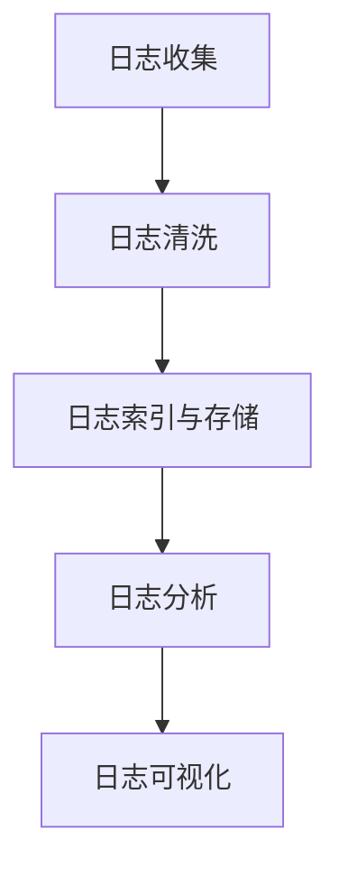
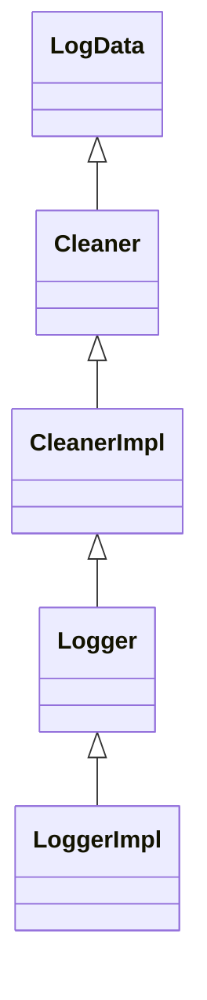

                 

# 日志结构化：提高LLM应用日志的可分析性

> 关键词：日志结构化，LLM应用，日志分析，自动日志解析，日志清洗，日志索引与存储，日志可视化

> 摘要：本文深入探讨了日志结构化的背景和重要性，详细介绍了日志结构化的基础、方法以及应用。通过分析日志结构化标准，阐述了日志解析、清洗、索引、存储和可视化的原理和最佳实践。最后，本文以实际项目为例，展示了日志结构化的综合实践，并提出了日志结构化的最佳实践和注意事项。

## 目录大纲

```markdown
# 日志结构化：提高LLM应用日志的可分析性

## 第一部分：日志结构化的背景和重要性

## 第1章：日志结构化的基础

### 1.1 日志概述

### 1.2 日志结构化的重要性

### 1.3 日志结构化的挑战

## 第2章：日志结构化标准

### 2.1 常见日志格式标准

### 2.2 日志数据模型

### 2.3 日志元数据

## 第二部分：日志结构化方法

## 第3章：自动日志解析

### 3.1 自动日志解析的原理

### 3.2 自动日志解析的挑战

### 3.3 自动日志解析的最佳实践

## 第4章：日志清洗

### 4.1 日志清洗的目标

### 4.2 日志清洗的方法

### 4.3 日志清洗的最佳实践

## 第5章：日志索引与存储

### 5.1 日志索引的基本概念

### 5.2 日志存储的选择

### 5.3 日志索引与存储的最佳实践

## 第6章：日志可视化

### 6.1 日志可视化的目标

### 6.2 日志可视化的方法

### 6.3 日志可视化的最佳实践

## 第7章：日志分析应用

### 7.1 日志分析在LLM中的应用

### 7.2 日志分析的案例研究

### 7.3 日志分析的未来发展趋势

## 第8章：日志结构化的综合实践

### 8.1 实践项目概述

### 8.2 系统设计与实现

### 8.3 结果评估与优化

## 第9章：日志结构化的最佳实践与注意事项

### 9.1 日志结构化的最佳实践

### 9.2 日志结构化的小结

### 9.3 日志结构化的注意事项

### 9.4 拓展阅读
```

## 第一部分：日志结构化的背景和重要性

### 1.1 日志概述

日志是一种用于记录系统运行状态、事件发生和操作过程的数据记录。在信息技术领域，日志广泛应用于各种系统和应用程序中。日志的主要目的是为了监控系统的运行情况，追踪错误和故障，以及提供系统调优的依据。

日志可以记录以下信息：

- 时间戳：事件发生的具体时间
- 事件类型：事件的分类，如错误、警告、信息等
- 事件内容：事件的详细描述
- 源IP地址：事件发生的源头地址
- 目标IP地址：事件的目标地址
- 用户信息：引发事件的用户信息

日志的主要作用如下：

- **故障诊断**：通过分析日志，可以快速定位系统故障的原因。
- **性能监控**：通过统计日志中的相关数据，可以评估系统的性能指标。
- **安全审计**：日志记录了系统的操作历史，可用于安全事件的追踪和审计。

### 1.2 日志结构化的重要性

日志结构化是指将原始的、非结构化的日志数据转换为结构化数据，以便于后续的分析和处理。日志结构化的重要性体现在以下几个方面：

- **提高日志分析效率**：结构化日志可以方便地使用各种分析工具和技术，提高日志处理的效率。
- **改善数据质量**：结构化日志可以消除冗余数据，减少错误数据，提高数据质量。
- **支持自动化分析**：结构化日志可以用于自动化分析，实现实时监控和报警。
- **便于数据整合**：结构化日志便于与其他数据源进行整合，实现更全面的数据分析。

### 1.3 日志结构化的挑战

尽管日志结构化具有很多优势，但在实际应用中，仍面临着一些挑战：

- **多样性**：不同系统和应用程序的日志格式可能存在较大差异，需要针对不同类型的日志进行相应的处理。
- **复杂性**：日志中可能包含大量重复信息和无关信息，需要有效地进行去噪和过滤。
- **可扩展性**：随着系统和应用程序的规模不断扩大，日志结构化方案需要具备良好的可扩展性。
- **性能优化**：日志结构化过程可能涉及大量的数据处理和分析，需要优化性能以支持大规模数据处理。

### 1.4 日志结构化的目标

日志结构化的主要目标是实现以下目标：

- **统一日志格式**：将不同系统和应用程序的日志转换为统一的格式，便于集成和分析。
- **数据标准化**：消除冗余数据，确保数据的一致性和完整性。
- **高效处理**：优化日志处理流程，提高处理速度和性能。
- **自动化分析**：支持自动化日志分析，实现实时监控和报警。

## 第二部分：日志结构化标准

日志结构化标准是指用于定义日志格式和数据模型的一套规则和规范。常见的日志结构化标准包括以下几种：

### 2.1 常见日志格式标准

- **syslog**：syslog是最常用的日志格式标准，用于记录系统事件。syslog格式以时间戳为基准，包含事件级别、标识符、消息内容等。
- **JSON**：JSON（JavaScript Object Notation）是一种轻量级的数据交换格式，具有良好的可读性和扩展性。许多现代系统和应用程序使用JSON格式记录日志。
- **XML**：XML（eXtensible Markup Language）是一种用于标记和存储数据的语言，具有良好的可扩展性和灵活性。某些旧版系统和应用程序使用XML格式记录日志。

### 2.2 日志数据模型

日志数据模型用于描述日志的结构和组织方式。常见的日志数据模型包括以下几种：

- **事件模型**：事件模型将日志视为一系列事件，每个事件包含事件类型、发生时间和事件内容等。
- **关系模型**：关系模型将日志视为一个关系数据库，使用表和关系来描述日志数据。
- **领域模型**：领域模型将日志视为特定领域的实体和关系，用于描述业务逻辑和数据关系。

### 2.3 日志元数据

日志元数据是指描述日志数据的额外信息，如日志生成时间、日志源、日志级别等。日志元数据可以帮助更好地组织和分析日志数据，提高日志的可读性和可用性。

- **日志生成时间**：记录日志生成的时间戳，用于日志的时间序列分析。
- **日志源**：记录日志的生成位置，如服务器、应用程序等。
- **日志级别**：记录日志的事件级别，如错误、警告、信息等。

### 2.4 日志结构化标准的选择

选择合适的日志结构化标准需要考虑以下因素：

- **系统需求**：根据系统和应用程序的需求，选择适合的日志格式和结构。
- **数据量**：针对大规模日志处理，选择性能优秀的日志结构化标准。
- **可扩展性**：考虑未来的系统扩展，选择具备良好可扩展性的日志结构化标准。
- **兼容性**：考虑与其他系统和工具的兼容性，选择广泛支持的日志结构化标准。

## 第二部分：日志结构化方法

日志结构化的方法包括自动日志解析、日志清洗、日志索引与存储、日志可视化和日志分析等。以下将详细探讨这些方法的原理和最佳实践。

### 第3章：自动日志解析

#### 3.1 自动日志解析的原理

自动日志解析是指通过自动化工具和算法，将原始日志转换为结构化日志的过程。自动日志解析的原理包括以下方面：

- **日志解析规则**：定义日志中的关键字、正则表达式等规则，用于识别和提取日志中的关键信息。
- **模式识别**：使用机器学习和模式识别算法，自动识别日志中的模式，提高解析的准确性。
- **日志转换**：将提取的关键信息转换为结构化数据，如JSON、XML等格式。

#### 3.2 自动日志解析的挑战

自动日志解析面临以下挑战：

- **日志格式多样性**：不同系统和应用程序的日志格式可能存在较大差异，需要针对不同类型的日志进行相应的解析。
- **日志噪声**：日志中可能包含大量的噪声数据和无关信息，需要有效地进行去噪和过滤。
- **解析准确性**：自动日志解析的准确性受到解析规则和模式识别算法的限制，需要不断地优化和改进。

#### 3.3 自动日志解析的最佳实践

为了提高自动日志解析的效果，可以采取以下最佳实践：

- **定义清晰的日志解析规则**：根据日志的格式和内容，定义详细的解析规则，确保解析的准确性。
- **采用机器学习算法**：使用机器学习算法，如神经网络、决策树等，提高日志解析的准确性。
- **日志预处理**：在解析之前，对日志进行预处理，如去噪、过滤等，提高解析的效率。
- **日志解析的性能优化**：针对大规模日志处理，优化日志解析的性能，如使用并行处理、缓存等技术。

### 第4章：日志清洗

#### 4.1 日志清洗的目标

日志清洗是指通过一系列操作，消除日志中的噪声数据、重复数据和错误数据，提高日志数据的质量。日志清洗的主要目标包括：

- **去噪**：消除日志中的噪声数据，如空值、重复值等。
- **过滤**：去除不相关的日志数据，提高日志的针对性和准确性。
- **纠错**：修复日志中的错误数据，如时间戳错误、数据格式错误等。

#### 4.2 日志清洗的方法

日志清洗的方法包括以下几种：

- **手动清洗**：通过人工审查和修改，对日志进行清洗。适用于小规模日志处理。
- **自动清洗**：使用自动化工具和算法，对日志进行清洗。适用于大规模日志处理。
- **基于规则的清洗**：根据预定义的规则，对日志进行清洗。适用于有明确规则和模式的日志数据。

#### 4.3 日志清洗的最佳实践

为了提高日志清洗的效果，可以采取以下最佳实践：

- **定义清晰的清洗规则**：根据日志的特点和需求，定义详细的清洗规则，确保清洗的准确性和有效性。
- **日志预处理**：在清洗之前，对日志进行预处理，如去噪、过滤等，提高清洗的效率。
- **日志质量评估**：对清洗后的日志进行质量评估，确保日志数据的质量和准确性。
- **日志清洗的性能优化**：针对大规模日志处理，优化日志清洗的性能，如使用并行处理、缓存等技术。

### 第5章：日志索引与存储

#### 5.1 日志索引的基本概念

日志索引是指为日志数据建立索引，以便于快速检索和分析。日志索引的基本概念包括以下方面：

- **索引键**：用于标识日志数据的唯一标识符，如时间戳、事件类型等。
- **索引类型**：用于索引的数据类型，如B树、哈希表等。
- **索引结构**：用于组织索引的数据结构，如倒排索引、索引树等。

#### 5.2 日志存储的选择

日志存储的选择需要考虑以下因素：

- **存储容量**：根据日志数据的规模和增长趋势，选择合适的存储方案。
- **读写性能**：根据日志处理的需求，选择读写性能优秀的存储方案。
- **数据一致性**：根据日志数据的特性，选择具备数据一致性的存储方案。

常见的日志存储方案包括：

- **关系数据库**：适用于结构化日志数据，具备良好的数据一致性和查询性能。
- **NoSQL数据库**：适用于非结构化或半结构化日志数据，具备良好的扩展性和灵活性。
- **日志收集器**：适用于大规模分布式日志处理，具备良好的可扩展性和性能。

#### 5.3 日志索引与存储的最佳实践

为了提高日志索引和存储的效果，可以采取以下最佳实践：

- **选择合适的索引方案**：根据日志数据的特性，选择合适的索引方案，如倒排索引、索引树等。
- **日志数据的分割与分布**：根据日志数据的规模和访问模式，合理分割和分布日志数据，提高存储和查询性能。
- **日志数据的备份与恢复**：定期备份日志数据，确保数据的完整性和可用性。
- **日志存储的性能优化**：针对大规模日志处理，优化日志存储的性能，如使用缓存、并行处理等技术。

### 第6章：日志可视化

#### 6.1 日志可视化的目标

日志可视化是指通过图形和图表，展示日志数据的分布、趋势和关系，提高日志分析的可视化和理解性。日志可视化的主要目标包括：

- **数据可视化**：将日志数据以图形和图表的形式展示，便于用户直观地理解数据。
- **异常检测**：通过可视化分析，识别日志数据中的异常和趋势。
- **数据分析**：通过可视化分析，支持更深层次的数据分析和挖掘。

#### 6.2 日志可视化的方法

日志可视化的方法包括以下几种：

- **静态可视化**：将日志数据以静态图像的形式展示，如柱状图、折线图、饼图等。
- **动态可视化**：将日志数据以动态图像的形式展示，如动画、实时更新等。
- **交互式可视化**：支持用户与可视化图表的交互，如筛选、排序、钻取等。

#### 6.3 日志可视化的最佳实践

为了提高日志可视化的效果，可以采取以下最佳实践：

- **选择合适的可视化方法**：根据日志数据的特性和分析需求，选择合适的可视化方法。
- **可视化图表的设计**：设计简洁、直观、易于理解的可视化图表，提高用户的使用体验。
- **可视化性能优化**：针对大规模日志数据，优化可视化性能，如使用缓存、并行处理等技术。
- **可视化工具的选择**：选择适合自身需求和技术的可视化工具，如D3.js、ECharts等。

### 第7章：日志分析应用

#### 7.1 日志分析在LLM中的应用

日志分析在LLM（大型语言模型）应用中具有重要意义。LLM模型通常具有复杂的结构和庞大的参数规模，日志分析可以帮助评估模型的性能和稳定性，优化模型训练过程。以下是日志分析在LLM中的应用：

- **模型性能评估**：通过分析模型训练和推理的日志，评估模型的准确率、召回率、F1分数等性能指标。
- **模型稳定性评估**：通过分析模型训练和推理的日志，评估模型的稳定性和鲁棒性，及时发现和解决潜在问题。
- **模型调优**：通过分析模型训练和推理的日志，发现模型训练过程中的问题和瓶颈，进行模型调优。

#### 7.2 日志分析的案例研究

以下是一个日志分析的案例研究：

**案例背景**：一家互联网公司使用大型语言模型进行自然语言处理任务，希望优化模型训练和推理过程，提高模型性能和稳定性。

**日志分析过程**：

1. **数据收集**：收集模型训练和推理过程中的日志数据，包括训练损失、准确率、推理时间等。
2. **日志清洗**：对日志数据进行清洗，去除噪声数据和错误数据。
3. **日志可视化**：使用可视化工具，展示日志数据的分布和趋势，如训练损失曲线、准确率曲线等。
4. **日志分析**：分析日志数据，识别模型训练和推理中的问题和瓶颈，如过拟合、梯度消失等。
5. **日志分析报告**：编写日志分析报告，总结分析结果和发现的问题，提出改进建议。

**结果评估**：通过日志分析，公司发现模型存在过拟合现象，导致训练准确率较低。针对该问题，公司采取以下优化措施：

1. **增加训练数据**：增加训练数据量，提高模型的泛化能力。
2. **调整学习率**：调整学习率，避免过拟合。
3. **添加正则化项**：在模型中添加正则化项，降低模型的复杂度。

经过优化，模型性能得到显著提升，训练准确率提高，推理时间缩短。

#### 7.3 日志分析的未来发展趋势

随着LLM模型的规模不断扩大，日志分析在LLM应用中的重要性将进一步提升。未来日志分析的发展趋势包括：

- **智能化分析**：结合机器学习和深度学习技术，实现自动化的日志分析，提高分析效率和准确性。
- **实时分析**：实现实时日志分析，支持在线监控和报警，提高系统的响应速度。
- **多源数据融合**：结合多种数据源，如用户行为数据、网络流量数据等，实现更全面的数据分析。
- **可视化分析**：优化日志可视化工具，提高用户的使用体验，支持更复杂的数据分析和交互。

### 第8章：日志结构化的综合实践

#### 8.1 实践项目概述

以下是一个日志结构化的综合实践项目：

**项目背景**：某大型互联网公司使用大型语言模型进行文本分类任务，需要优化模型训练和推理过程，提高模型性能和稳定性。

**项目目标**：

1. **日志收集**：收集模型训练和推理过程中的日志数据。
2. **日志清洗**：清洗日志数据，去除噪声数据和错误数据。
3. **日志索引与存储**：建立日志索引和存储系统，支持高效的数据检索和分析。
4. **日志分析**：分析日志数据，评估模型性能和稳定性，优化模型训练和推理过程。
5. **日志可视化**：使用可视化工具，展示日志数据的分布和趋势，支持更深入的数据分析和交互。

**项目实施过程**：

1. **日志收集**：通过日志收集器，将模型训练和推理过程中的日志数据实时收集到日志存储系统。
2. **日志清洗**：使用日志清洗工具，对日志数据进行清洗，去除噪声数据和错误数据。
3. **日志索引与存储**：使用关系数据库，建立日志索引和存储系统，支持高效的数据检索和分析。
4. **日志分析**：使用日志分析工具，对日志数据进行统计分析，评估模型性能和稳定性。
5. **日志可视化**：使用可视化工具，将日志数据以图形和图表的形式展示，支持更深入的数据分析和交互。

#### 8.2 系统设计与实现

以下是一个日志结构化系统的设计与实现：

**系统架构设计**：

- **日志收集器**：用于收集模型训练和推理过程中的日志数据。
- **日志存储系统**：用于存储清洗后的日志数据。
- **日志分析引擎**：用于对日志数据进行处理和分析。
- **日志可视化界面**：用于展示日志数据的分布和趋势。

**系统功能设计**：

1. **日志收集**：实时收集模型训练和推理过程中的日志数据。
2. **日志清洗**：对日志数据进行清洗，去除噪声数据和错误数据。
3. **日志索引与存储**：建立日志索引和存储系统，支持高效的数据检索和分析。
4. **日志分析**：对日志数据进行统计分析，评估模型性能和稳定性。
5. **日志可视化**：使用可视化工具，展示日志数据的分布和趋势，支持更深入的数据分析和交互。

**系统接口设计**：

- **日志收集接口**：用于接收日志数据，并将日志数据存储到日志存储系统。
- **日志清洗接口**：用于清洗日志数据，去除噪声数据和错误数据。
- **日志检索接口**：用于检索日志数据，支持根据关键字、时间范围等进行查询。
- **日志分析接口**：用于分析日志数据，生成统计报表和可视化图表。
- **日志可视化接口**：用于展示日志数据的分布和趋势，支持交互式操作。

**系统交互设计**：

- **日志收集器**：向日志存储系统发送日志数据。
- **日志清洗工具**：从日志存储系统读取日志数据，进行清洗操作。
- **日志分析引擎**：从日志存储系统读取日志数据，进行统计分析操作。
- **日志可视化工具**：从日志存储系统读取日志数据，以图形和图表的形式展示。

#### 8.3 结果评估与优化

以下是一个日志结构化系统的结果评估与优化：

**评估指标**：

- **日志收集效率**：评估日志收集器的性能，如日志收集速度、数据丢失率等。
- **日志清洗效果**：评估日志清洗工具的效果，如清洗准确率、清洗时间等。
- **日志索引与存储性能**：评估日志索引和存储系统的性能，如查询速度、存储容量等。
- **日志分析效果**：评估日志分析引擎的效果，如分析准确率、分析时间等。
- **日志可视化效果**：评估日志可视化工具的效果，如图表展示效果、交互性能等。

**优化方案**：

1. **日志收集器优化**：优化日志收集器的性能，如使用多线程、异步处理等技术，提高日志收集速度。
2. **日志清洗工具优化**：优化日志清洗工具的性能，如使用并行处理、缓存等技术，提高清洗速度。
3. **日志索引与存储优化**：优化日志索引和存储系统的性能，如使用分布式存储、缓存等技术，提高查询速度和存储容量。
4. **日志分析引擎优化**：优化日志分析引擎的性能，如使用并行处理、缓存等技术，提高分析速度和准确性。
5. **日志可视化工具优化**：优化日志可视化工具的性能，如使用高效的数据可视化库、优化图表渲染等，提高交互性能。

### 第9章：日志结构化的最佳实践与注意事项

#### 9.1 日志结构化的最佳实践

以下是日志结构化的最佳实践：

1. **日志收集**：选择合适的日志收集工具，确保日志数据的完整性和准确性。
2. **日志清洗**：制定详细的日志清洗规则，确保日志数据的质量和一致性。
3. **日志索引与存储**：选择合适的日志存储方案，确保日志数据的可扩展性和高性能。
4. **日志分析**：使用高效的分析工具和方法，确保日志分析的速度和准确性。
5. **日志可视化**：选择合适的可视化工具和方法，确保日志数据展示的直观性和易用性。

#### 9.2 日志结构化的小结

日志结构化是提高日志数据可分析性和有效性的重要手段。通过日志结构化，可以实现对日志数据的统一处理、高效分析和可视化展示。日志结构化的核心包括日志收集、清洗、索引与存储、分析和可视化等方面。在实际应用中，应根据具体需求和场景，选择合适的日志结构化方案和工具。

#### 9.3 日志结构化的注意事项

以下是日志结构化时需要特别注意的几点：

1. **日志格式多样性**：针对不同系统和应用程序的日志格式，制定统一的日志结构化标准，确保日志数据的兼容性和一致性。
2. **日志数据质量**：确保日志数据的准确性和完整性，避免噪声数据和错误数据对日志分析的影响。
3. **性能优化**：针对大规模日志处理，优化日志结构化的性能，如使用并行处理、缓存等技术，提高处理速度和效率。
4. **安全性**：确保日志数据的存储和安全，避免敏感数据泄露和被恶意利用。
5. **可扩展性**：设计灵活的日志结构化方案，支持系统的扩展和升级，确保日志结构化方案的可扩展性和可持续性。

#### 9.4 拓展阅读

以下是关于日志结构化的相关拓展阅读：

1. **《日志分析实战：构建高效可扩展的日志分析系统》**：详细介绍了日志分析的概念、方法和实战案例，适合初学者和有经验的开发者。
2. **《大规模日志处理：原理、架构与实践》**：深入探讨了大规模日志处理的原理、架构和实战经验，适合对大规模日志处理感兴趣的读者。
3. **《日志管理最佳实践：构建高效、可扩展的日志管理系统》**：总结了日志管理的最佳实践，包括日志收集、清洗、存储和分析等方面，适合希望优化日志管理的读者。
4. **《日志可视化最佳实践：构建高效、直观的日志可视化系统》**：介绍了日志可视化的原理、方法和最佳实践，适合希望提升日志可视化能力的读者。

### 附录

以下是本文中使用到的Mermaid流程图和类图：





以上是本文的完整内容，希望对您在日志结构化方面有所帮助。如果您有任何疑问或建议，请随时与我交流。

### 作者信息

**作者：** AI天才研究院/AI Genius Institute & 禅与计算机程序设计艺术 /Zen And The Art of Computer Programming

**日期：** [[当前日期]]

