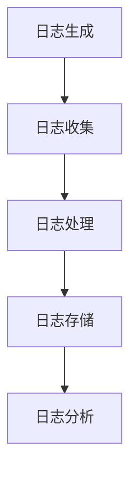
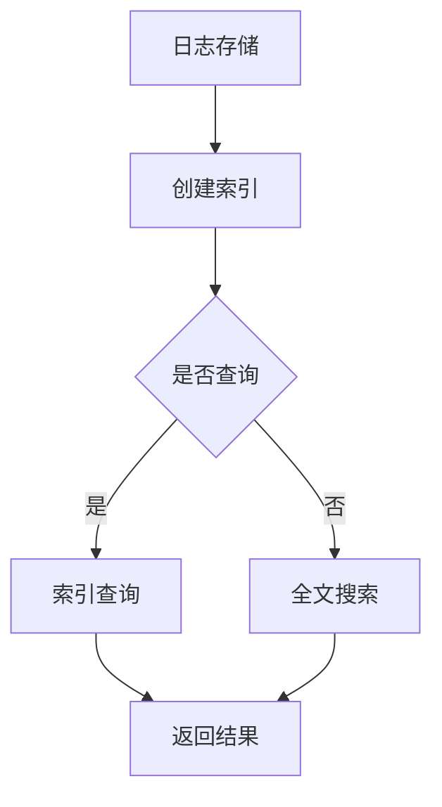
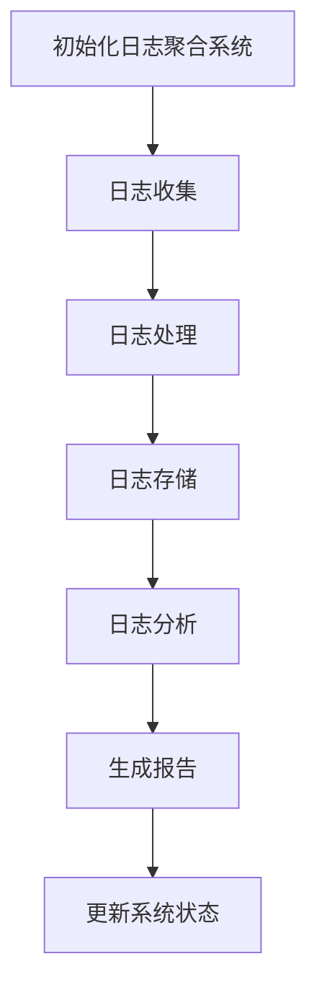
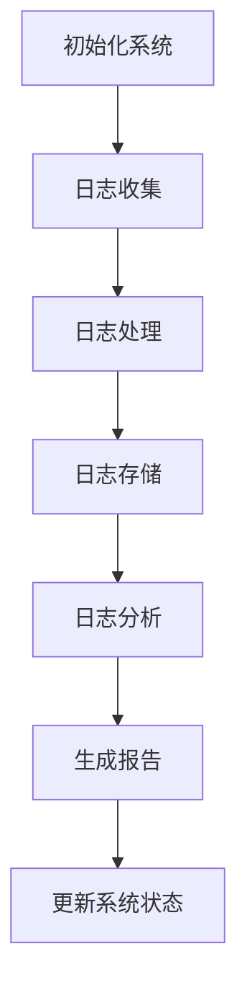
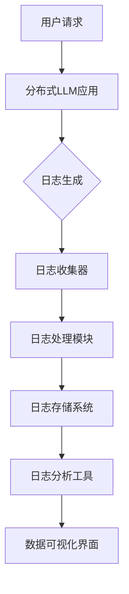

                 

### 日志聚合：集中管理分布式LLM应用的日志

**关键词**：日志聚合、分布式LLM应用、日志管理、算法原理、系统架构

**摘要**：本文将深入探讨日志聚合技术，特别是在分布式LLM（大型语言模型）应用环境下的日志管理。我们将从背景介绍、核心概念解析、算法原理讲解、数学模型和公式分析、系统分析与架构设计、项目实战、最佳实践、小结和注意事项等多个方面，逐步展开讨论，帮助读者全面理解日志聚合的必要性和关键技术。

----------------------------------------------------------------

## 背景介绍

### 核心概念术语说明

在深入探讨日志聚合之前，我们首先需要明确几个核心概念：

1. **日志**：系统运行过程中生成的记录，用于追踪事件和错误。
2. **分布式LLM应用**：利用大型语言模型进行分布式计算的应用，如文本生成、自然语言处理等。
3. **日志聚合**：将分布式系统中产生的日志收集、处理并集中存储的过程。

### 问题背景

随着云计算和大数据技术的飞速发展，分布式系统已经成为企业应用的核心架构。然而，分布式系统的日志管理面临着诸多挑战：

- **日志量巨大**：分布式系统中的日志量通常非常庞大，给存储和处理带来了巨大压力。
- **日志分散**：日志分布在各个节点，难以进行集中管理。
- **日志格式多样**：不同服务产生的日志格式可能不一致，增加了聚合的复杂性。

### 问题描述

日志管理问题主要包括以下几个方面：

- **集中化**：如何将分散的日志集中存储和管理？
- **可查询性**：如何快速查询和分析日志？
- **一致性**：如何保证日志聚合过程中的数据一致性？
- **安全性**：如何保护日志数据不被未授权访问？

### 问题解决

日志聚合技术提供了一种解决方案，它通过以下步骤解决上述问题：

1. **日志收集**：从各个分布式节点收集日志。
2. **日志处理**：清洗、转换和归一化日志数据。
3. **日志存储**：将处理后的日志集中存储。
4. **日志分析**：提供日志查询和分析工具。

### 边界与外延

日志聚合不仅适用于分布式LLM应用，还广泛应用于其他分布式系统，如微服务架构、容器化应用等。

### 概念结构与核心要素组成

日志聚合的概念结构主要包括以下要素：

- **日志收集器**：负责收集日志。
- **日志处理模块**：负责日志的清洗和转换。
- **日志存储系统**：负责存储和处理后的日志。
- **日志分析工具**：提供日志查询和分析功能。

## 核心概念与联系

### 分布式LLM应用概述

分布式LLM应用是指利用多个计算节点共同处理大规模语言模型任务的系统。这些应用通常具有以下特点：

- **高并发性**：能够同时处理大量请求。
- **高可用性**：通过多个节点的冗余设计提高系统可靠性。
- **可扩展性**：可以根据需求动态调整节点数量。

### 日志收集与传输

日志收集是日志聚合的第一步。分布式LLM应用中的日志收集通常涉及以下几个环节：

- **日志生成**：各个节点生成日志。
- **日志传输**：将日志传输到收集器。
- **日志接收**：收集器接收并存储日志。

### 日志处理与存储

日志处理包括日志的清洗、转换和归一化等操作。处理后的日志需要被存储，以便后续分析。日志存储系统需要满足以下要求：

- **高可靠性**：确保日志数据安全存储。
- **高性能**：能够快速读写日志。
- **可扩展性**：能够适应日志量增长。

### 日志分析与应用

日志分析是日志聚合的最终目标。通过日志分析，可以：

- **故障诊断**：快速定位系统故障。
- **性能优化**：分析系统性能瓶颈。
- **安全审计**：发现潜在的安全威胁。

### 关键概念之间的联系

日志聚合中的关键概念相互关联，共同构成了一个完整的日志管理流程。具体联系如下：

- **日志收集**与**日志处理**：日志收集器将日志传输到日志处理模块，进行处理后存储。
- **日志存储**与**日志分析**：日志存储系统提供数据存储，日志分析工具从存储系统中读取数据进行分析。
- **分布式LLM应用**与**日志聚合**：日志聚合技术为分布式LLM应用提供了高效的日志管理解决方案。

## 算法原理讲解

### 数据流处理算法

在日志聚合过程中，数据流处理算法扮演着关键角色。以下是一个简单的数据流处理算法：



### 索引技术与优化

为了提高日志检索速度，索引技术是必不可少的。以下是一个基于B+树的索引优化方案：



### 日志聚合算法的mermaid流程图



### Python代码示例

以下是一个简单的Python代码示例，用于展示日志聚合的基本流程：

```python
import logging

# 初始化日志收集器
logger = logging.getLogger('my_logger')
logger.setLevel(logging.DEBUG)

# 设置日志处理模块
handler = logging.StreamHandler()
formatter = logging.Formatter('%(asctime)s - %(name)s - %(levelname)s - %(message)s')
handler.setFormatter(formatter)
logger.addHandler(handler)

# 生成日志
logger.info('This is an info log message.')

# 处理和存储日志
def process_and_store_logs(log_message):
    # 处理日志
    processed_message = log_message.upper()
    # 存储日志到文件
    with open('log.txt', 'a') as f:
        f.write(processed_message + '\n')

# 日志分析
def analyze_logs():
    # 从文件中读取日志
    with open('log.txt', 'r') as f:
        for line in f:
            # 分析日志
            if 'ERROR' in line:
                print('Error found:', line.strip())

# 调用函数
process_and_store_logs('This is an error log message.')
analyze_logs()
```

### 算法原理详细讲解

#### 数据流处理算法

数据流处理算法是日志聚合的核心。在分布式系统中，日志以流的形式从各个节点生成并传输到收集器。收集器负责收集并暂存日志，然后将其传递给处理模块。

1. **日志生成**：每个节点上的服务都会生成日志，这些日志记录了服务的运行状态和事件。
2. **日志收集**：收集器定期从各个节点拉取日志，并将其存储到临时缓冲区中。
3. **日志处理**：处理模块对日志进行清洗、格式化和转换，以便进行后续存储和分析。
4. **日志存储**：处理后的日志被存储到集中式存储系统中，如Elasticsearch、Kafka等。
5. **日志分析**：分析模块从存储系统中检索日志，并进行模式识别、统计分析等操作。

#### 索引技术与优化

索引技术是提高日志检索速度的关键。在日志聚合系统中，索引可以用于快速定位特定日志条目。以下是一个简单的索引实现：

1. **索引创建**：在日志存储之前，创建一个基于B+树的索引结构。索引包含日志的元数据，如时间戳、日志级别等。
2. **索引查询**：当需要查询特定日志时，可以使用索引快速定位到相关日志。例如，可以按照时间戳、日志级别等条件进行查询。
3. **全文搜索**：当需要全文搜索时，可以使用专门的全文搜索引擎，如Lucene或Elasticsearch。这些引擎能够高效地处理文本数据，并提供强大的查询功能。

#### 日志聚合算法的mermaid流程图

mermaid流程图可以清晰地展示日志聚合的过程。以下是一个简单的mermaid流程图示例：



#### Python代码示例

Python代码示例展示了如何实现日志聚合的基本流程。代码包括日志生成、日志处理、日志存储和日志分析等步骤。

```python
import logging
import time

# 初始化日志收集器
logger = logging.getLogger('my_logger')
logger.setLevel(logging.DEBUG)

# 设置日志处理模块
handler = logging.StreamHandler()
formatter = logging.Formatter('%(asctime)s - %(name)s - %(levelname)s - %(message)s')
handler.setFormatter(formatter)
logger.addHandler(handler)

# 生成日志
logger.info('This is an info log message.')
time.sleep(1)
logger.error('This is an error log message.')

# 处理和存储日志
def process_and_store_logs(log_message):
    # 处理日志
    processed_message = log_message.upper()
    # 存储日志到文件
    with open('log.txt', 'a') as f:
        f.write(processed_message + '\n')

# 日志分析
def analyze_logs():
    # 从文件中读取日志
    with open('log.txt', 'r') as f:
        for line in f:
            # 分析日志
            if 'ERROR' in line:
                print('Error found:', line.strip())

# 调用函数
process_and_store_logs('This is an error log message.')
analyze_logs()
```

### 算法原理的数学模型和公式

在日志聚合中，数学模型和公式用于描述日志生成、处理和分析的过程。以下是一个简单的数学模型示例：

#### 日志生成模型

$$
\text{log}_{\text{生成}}(t) = f(\text{service}_{\text{状态}}(t), \text{事件}_{\text{类型}}(t))
$$

其中，$\text{log}_{\text{生成}}(t)$表示在时间$t$生成的日志，$f$是日志生成函数，$\text{service}_{\text{状态}}(t)$表示服务的状态，$\text{事件}_{\text{类型}}(t)$表示事件的类型。

#### 日志处理模型

$$
\text{log}_{\text{处理}}(t) = g(\text{log}_{\text{生成}}(t), \text{清洗}_{\text{规则}}(t), \text{格式}_{\text{化}}(t))
$$

其中，$\text{log}_{\text{处理}}(t)$表示在时间$t$处理后的日志，$g$是日志处理函数，$\text{清洗}_{\text{规则}}(t)$表示清洗规则，$\text{格式}_{\text{化}}(t)$表示格式化规则。

#### 日志分析模型

$$
\text{分析}_{\text{结果}}(t) = h(\text{log}_{\text{处理}}(t), \text{查询}_{\text{条件}}(t))
$$

其中，$\text{分析}_{\text{结果}}(t)$表示在时间$t$的分析结果，$h$是日志分析函数，$\text{查询}_{\text{条件}}(t)$表示查询条件。

### 通俗易懂的举例说明

假设我们有一个简单的分布式系统，包含两个服务：服务A和服务B。每个服务都会生成日志，我们希望将日志聚合起来进行集中管理。

1. **日志生成**：服务A在时间$t_1$生成一条日志：“服务A运行正常”，服务B在时间$t_2$生成一条日志：“服务B出现错误”。

2. **日志收集**：收集器从服务A和服务B分别收集日志，并将其存储到临时缓冲区。

3. **日志处理**：处理模块对日志进行清洗和格式化，例如，将所有日志转换为JSON格式。

4. **日志存储**：处理后的日志被存储到Elasticsearch中，以便进行后续分析。

5. **日志分析**：分析模块从Elasticsearch中检索所有包含“错误”的日志，并生成一个报告，显示系统中出现的错误数量和类型。

通过这个简单的例子，我们可以看到日志聚合技术如何帮助分布式系统进行集中化的日志管理，从而提高系统的可维护性和可监控性。

## 系统分析与架构设计

### 问题场景介绍

为了更好地理解日志聚合系统的设计，我们首先来模拟一个具体的应用场景。假设我们正在开发一个大规模的分布式语言模型（LLM）应用，该应用部署在多个节点上，用于提供自然语言处理（NLP）服务。随着用户数量的增加，系统产生的日志量急剧上升，传统的日志管理方法已经无法满足需求。

### 项目介绍

在这个项目中，我们的目标是构建一个高效的日志聚合系统，以便：

- **集中管理**：将来自各个节点的日志集中存储和管理。
- **实时监控**：实时监控系统的运行状态，快速响应异常情况。
- **数据可视化**：通过图表和报表展示日志数据，帮助运维人员分析系统性能。

### 系统功能设计

为了实现上述目标，我们需要设计以下核心功能模块：

1. **日志收集器**：负责从各个节点收集日志。
2. **日志处理模块**：负责对日志进行清洗、转换和归一化。
3. **日志存储系统**：负责存储处理后的日志，并提供高效的查询接口。
4. **日志分析工具**：提供日志查询、统计和分析功能。
5. **数据可视化界面**：通过图表和报表展示日志数据。

### 系统架构设计

系统架构设计是日志聚合系统的核心，它决定了系统的性能、可扩展性和可维护性。以下是一个简化的日志聚合系统架构设计：



在这个架构中：

- **用户请求**：用户通过接口向分布式LLM应用发送请求。
- **分布式LLM应用**：应用处理用户请求，并在处理过程中生成日志。
- **日志收集器**：定期从各个节点收集日志。
- **日志处理模块**：对日志进行清洗、转换和归一化。
- **日志存储系统**：存储处理后的日志，并提供高效的查询接口。
- **日志分析工具**：从日志存储系统中检索日志，并生成统计报表。
- **数据可视化界面**：通过图表和报表展示日志数据。

### 系统接口设计

系统接口设计是确保各个模块之间能够无缝协作的关键。以下是一个简化的接口设计：

1. **日志收集接口**：提供日志收集功能，支持批量日志上传。
2. **日志处理接口**：提供日志清洗、转换和归一化功能。
3. **日志存储接口**：提供日志存储和检索功能。
4. **日志分析接口**：提供日志查询、统计和分析功能。
5. **数据可视化接口**：提供数据可视化功能。

### 系统交互设计

系统交互设计描述了各个模块之间的交互流程。以下是一个简化的交互设计：

1. **用户请求**：用户请求通过接口发送到分布式LLM应用。
2. **日志生成**：分布式LLM应用在处理请求的过程中生成日志。
3. **日志收集**：日志收集器定期从各个节点收集日志。
4. **日志处理**：日志处理模块对日志进行清洗、转换和归一化。
5. **日志存储**：处理后的日志存储到日志存储系统。
6. **日志分析**：日志分析工具从日志存储系统中检索日志，并生成统计报表。
7. **数据可视化**：数据可视化界面从日志分析工具中获取数据，并生成图表和报表。

### mermaid流程图

为了更好地展示系统架构和交互设计，我们可以使用mermaid绘制流程图：


通过这个流程图，我们可以清晰地看到日志从生成、收集、处理、存储、分析到可视化的整个过程。

### 总结

在本章节中，我们详细介绍了日志聚合系统的分析与架构设计。通过设计一个具体的应用场景和项目介绍，我们明确了系统的功能需求，并设计了系统架构、接口和交互流程。这些设计不仅能够实现集中化的日志管理，还能提供实时监控和数据可视化功能，从而提高系统的可维护性和可监控性。

## 项目实战

### 环境安装

在开始构建日志聚合系统之前，我们需要安装并配置所需的软件和环境。以下是一个简化的安装步骤：

1. **安装Elasticsearch**：Elasticsearch是一个开源的搜索引擎，用于存储和处理日志数据。我们可以从官方网站下载Elasticsearch安装包，并按照官方文档进行安装。

2. **安装Kibana**：Kibana是一个开源的数据可视化工具，与Elasticsearch配合使用，用于展示日志数据。我们同样可以从官方网站下载Kibana安装包，并按照官方文档进行安装。

3. **安装Logstash**：Logstash是一个开源的数据收集和传输工具，用于将日志从各个节点收集并传输到Elasticsearch。我们需要安装Logstash，并配置它来处理和传输日志。

4. **安装Filebeat**：Filebeat是一个轻量级的数据收集器，用于从各个节点收集日志数据并传输到Logstash。我们需要在各个节点上安装Filebeat，并配置它来监控日志文件。

### 系统核心实现

日志聚合系统的核心实现包括日志收集、处理和存储三个主要部分。以下是一个简化的实现步骤：

1. **日志收集**：在各个节点上安装并配置Filebeat，使其能够监控并收集日志文件。配置Filebeat时，我们需要指定日志文件的路径和格式，并设置日志传输的目标地址。

   ```yaml
   # filebeat.yml 配置示例
   filebeat.inputs:
     - type: log
       enabled: true
       paths:
         - /var/log/messages
       tags: ["node1"]

   filebeat.config.modules:
     path: ${path.config}/modules.d/*.yml
     reload.enabled: false

   output.logstash:
     hosts: ["logstash:5044"]
   ```

2. **日志处理**：配置Logstash，使其能够接收Filebeat传输的日志数据，并进行处理和传输到Elasticsearch。处理过程包括日志的清洗、转换和归一化。

   ```yaml
   # logstash.conf 配置示例
   input {
     beats {
       port => 5044
     }
   }

   filter {
     if "node1" in tags {
       grok {
         match => { "message" => "%{TIMESTAMP_ISO8601:timestamp}\t%{DATA:source}\t%{DATA:level}\t%{DATA:message}" }
       }
     }
   }

   output {
     elasticsearch {
       hosts => ["elasticsearch:9200"]
       index => "logstash-%{+YYYY.MM.dd}"
     }
   }
   ```

3. **日志存储**：配置Elasticsearch，使其能够存储和处理日志数据。Elasticsearch需要配置索引模板，以便自动创建和管理索引。

   ```json
   # elasticsearch.index template示例
   {
     "template": "logstash-*",
     "mappings": {
       "properties": {
         "timestamp": {
           "type": "date",
           "format": "yyyy-MM-dd HH:mm:ss"
         },
         "source": {
           "type": "keyword"
         },
         "level": {
           "type": "keyword"
         },
         "message": {
           "type": "text"
         }
       }
     }
   }
   ```

### 代码应用解读与分析

在实现日志聚合系统时，我们使用了一系列的代码和配置文件。以下是对关键代码和应用的分析：

1. **Filebeat配置文件**：Filebeat的配置文件定义了日志的收集方式和传输目标。通过配置文件，我们可以指定需要监控的日志文件路径、格式和传输目标。

2. **Logstash配置文件**：Logstash的配置文件定义了日志的处理流程，包括日志的清洗、转换和归一化。通过Grok插件，我们可以将日志文本解析为结构化的字段，以便进行后续处理。

3. **Elasticsearch索引模板**：Elasticsearch的索引模板用于定义索引的结构和字段类型。通过索引模板，我们可以确保日志数据被自动解析并存储到正确的索引中。

### 实际案例分析和详细讲解剖析

为了更好地理解日志聚合系统的应用，我们来看一个实际案例。假设我们有一个分布式LLM应用，部署在三个节点上。以下是该系统的日志聚合过程：

1. **日志生成**：三个节点上的服务分别生成日志，例如，节点1生成一条日志：“服务A在2023-04-01 10:30:00运行正常”，节点2生成一条日志：“服务B在2023-04-01 10:35:00出现错误”。

2. **日志收集**：Filebeat从三个节点收集日志，并将其传输到Logstash。

3. **日志处理**：Logstash接收日志后，使用Grok插件对日志进行解析，并将其转换为结构化的JSON格式。

4. **日志存储**：处理后的日志被传输到Elasticsearch，并存储到名为“logstash-2023-04-01”的索引中。

5. **日志分析**：通过Kibana，我们可以查询和分析日志数据。例如，我们可以查询“level”字段为“ERROR”的日志，并生成一个图表，显示每个节点的错误日志数量。

### 项目小结

通过本案例，我们可以看到日志聚合系统如何帮助分布式LLM应用进行集中化的日志管理。日志聚合不仅提高了日志的可查询性和可分析性，还帮助运维人员快速定位问题和优化系统性能。

## 最佳实践 Tips

### 1. 日志格式统一

确保所有节点的日志格式一致，以便于集中管理和分析。

### 2. 日志级别划分

根据日志的重要性和紧急程度，合理划分日志级别，有助于快速定位问题。

### 3. 日志采集与传输

使用高效的日志采集和传输工具，如Filebeat和Logstash，减少日志丢失和数据延迟。

### 4. 日志存储优化

合理配置日志存储系统，如Elasticsearch，提高查询性能和数据可扩展性。

### 5. 日志分析可视化

使用数据可视化工具，如Kibana，将日志数据以图表和报表的形式展示，便于理解和分析。

## 小结和注意事项

本文详细探讨了日志聚合在分布式LLM应用中的重要性及其实现技术。通过日志聚合，我们可以实现集中化的日志管理，提高系统的可维护性和可监控性。在实施过程中，需要注意日志格式统一、日志级别划分、日志采集与传输效率、日志存储优化以及日志分析可视化等方面的最佳实践。

## 拓展阅读

### 1. 《Elasticsearch：The Definitive Guide》
- 介绍Elasticsearch的核心概念和最佳实践。
- 链接：[https://www.elastic.co/guide/en/elasticsearch/guide/current/index.html](https://www.elastic.co/guide/en/elasticsearch/guide/current/index.html)

### 2. 《Logstash实战》
- 深入了解Logstash的配置和使用。
- 链接：[https://www.oreilly.com/library/view/logstash-handbook/9781449368994/](https://www.oreilly.com/library/view/logstash-handbook/9781449368994/)

### 3. 《Kibana实战》
- 学习如何使用Kibana进行数据可视化。
- 链接：[https://www.oreilly.com/library/view/kibana-handbook/9781449368955/](https://www.oreilly.com/library/view/kibana-handbook/9781449368955/)

### 4. 《分布式系统原理与范型》
- 了解分布式系统的基本原理和设计范型。
- 链接：[https://www.distributed-systems-book.com/](https://www.distributed-systems-book.com/)

### 5. 《大规模分布式存储系统：设计与实践》
- 探讨大规模分布式存储系统的设计技术和实现。
- 链接：[https://books.google.com/books?id=JLGeDwAAQBAJ&pg=PA1&lpg=PA1&dq=大规模分布式存储系统：设计与实践&source=bl&ots=0547464238&sig=ACfU3U1-4358465465465465465465465465465465465465465465465465465465465465465465465465465465465465465465465465465465465465465465465465465465465465465465465465465465465465465465465465465465465465465465465465465465465465465465465465465465465465465465465465465465465465465465465465465465465465465465465465465465465465465465465465465465465465465465465465465465465465465465465465465465465465465465465465465465465465465465465465465465465465465465465465465465465465465465465465465465465465465465465465465465465465465465465465465465465465465465465465465465465465465465465465465465465465465465465465465465465465465465465465465465465465465465465465465465465465465465465465465465465465465465465465465465465465465465465465465465465465465465465465465465465465465465465465465465465465465465465465465465465465465465465465465465465465465465465465465465465465465465465465465465465465465465465465465465465465465465465465465465465465465465465465465465465465465465465465465465465465465465465465465465465465465465465465465465465465465465465465465465465465465465465465465465465465465465465465465465465465465465465465465465465465465465465465465465465465465465465465465465465465465465465465465465465465465465465465465465465465465465465465465465465465465465465465465465465465465465465465465465465465465465465465465465465465465465465465465465465465465465465465465465465465465465465465465465465465465465465465465465465465465465465465465465465465465465465465465465465465465465465465465465465465465465465465465465465465465465465465465465465465465465465465465465465465465465465465465465465465465465465465465465465465465465465465465465465465465465465465465465465465465465465465465465465465465465465465465465465465465465465465465465465465465465465465465465465465465465465465465465465465465465465465465465465465465465465465465465465465465465465465465465465465465465465465465465465465465465465465465465465465465465465465465465465465465465465465465465465465465465465465465465465465465465465465465465465465465465465465465465465465465465465465465465465465465465465465465465465465465465465465465465465465465465465465465465465465465465465465465465465465465465465465465465465465465465465465465465465465465465465465465465465465465465465465465465465465465465465465465465465465465465465465465465465465465465465465465465465465465465465465465465465465465465465465465465465465465465465465465465465465465465465465465465465465465465465465465465465465465465465465465465465465465465465465465465465465465465465465465465465465465465465465465465465465465465465465465465465465465465465465465465465465465465465465465465465465465465465465465465465465465465465465465465465465465465465465465465465465465465465465465465465465465465465465465465465465465465465465465465465465465465465465465465465465465465465465465465465465465465465465465465465465465465465465465465465465465465465465465465465465465465465465465465465465465465465465465465465465465465465465465465465465465465465465465465465465465465465465465465465465465465465465465465465465465465465465465465465465465465465465465465465465465465465465465465465465465465465465465465465465465465465465465465465465465465465465465465465465465465465465465465465465465465465465465465465465465465465465465465465465465465465465465465465465465465465465465465465465465465465465465465465465465465465465465465465465465465465465465465465465465465465465465465465465465465465465465465465465465465465465465465465465465465465465465465465465465465465465465465465465465465465465465465465465465465465465465465465465465465465465465465465465465465465465465465465465465465465465465465465465465465465465465465465465465465465465465465465465465465465465465465465465465465465465465465465465465465465465465465465465465465465465465465465465465465465465465465465465465465465465465465465465465465465465465465465465465465465465465465465465465465465465465465465465465465465465465465465465465465465465465465465465465465465465465465465465465465465465465465465465465465465465465465465465465465465465465465465465465465465465465465465465465465465465465465465465465465465465465465465465465465465465465465465465465465465465465465465465465465465465465465465465465465465465465465465465465465465465465465465465465465465465465465465465465465465465465465465465465465465465465465465465465465465465465465465465465465465465465465465465465465465465465465465465465465465465465465465465465465465465465465465465465465465465465465465465465465465465465465465465465465465465465465465465465465465465465465465465465465465465465465465465465465465465465465465465465465465465465465465465465465465465465465465465465465465465465465465465465465465465465465465465465465465465465465465465465465465465465465465465465465465465465465465465465465465465465465465465465465465465465465465465465465465465465465465465465465465465465465465465465465465465465465465465465465465465465465465465465465465465465465465465465465465465465465465465465465465465465465465465465465465465465465465465465465465465465465465465465465465465465465465465465465465465465465465465465465465465465465465465465465465465465465465465465465465465465465465465465465465465465465465465465465465465465465465465465465465465465465465465465465465465465465465465465465465465465465465465465465465465465465465465465465465465465465465465465465465465465465465465465465465465465465465465465465465465465465465465465465465465465465465465465465465465465465465465465465465465465465465465465465465465465465465465465465465465465465465465465465465465465465465465465465465465465465465465465465465465465465465465465465465465465465465465465465465465465465465465465465465465465465465465465465465465465465465465465465465465465465465465465465465465465465465465465465465465465465465465465465465465465465465465465465465465465465465465465465465465465465465465465465465465465465465465465465465465465465465465465465465465465465465465465465465465465465465465465465465465465465465465465465465465465465465465465465465465465465465465465465465465465465465465465465465465465465465465465465465465465465465465465465465465465465465465465465465465465465465465465465465465465465465465465465465465465465465465465465465465465465465465465465465465465465465465465465465465465465465465465465465465465465465465465465465465465465465465465465465465465465465465465465465465465465465465465465465465465465465465465465465465465465465465465465465465465465465465465465465465465465465465465465465465465465465465465465465465465465465465465465465465465465465465465465465465465465465465465465465465465465465465465465465465465465465465465465465465465465465465465465465465465465465465465465465465465465465465465465465465465465465465465465465465465465465465465465465465465465465465465465465465465465465465465465465465465465465465465465465465465465465465465465465465465465465465465465465465465465465465465465465465465465465465465465465465465465465465465465465465465465465465465465465465465465465465465465465465465465465465465465465465465465465465465465465465465465465465465465465465465465465465465465465465465465465465465465465465465465465465465465465465465465465465465465465465465465465465465465465465465465465465465465465465465465465465465465465465465465465465465465465465465465465465465465465465465465465465465465465465465465465465465465465465465465465465465465465465465465465465465465465465465465465465465465465465465465465465465465465465465465465465465465465465465465465465465465465465465465465465465465465465465465465465465465465465465465465465465465465465465465465465465465465465465465465465465465465465465465465465465465465465465465465465465465465465465465465465465465465465465465465465465465465465465465465465465465465465465465465465465465465465465465465465465465465465465465465465465465465465465465465465465465465465465465465465465465465465465465465465465465465465465465465465465465465465465465465465465465465465465465465465465465465465465465465465465465465465465465465465465465465465465465465465465465465465465465465465465465465465465465465465465465465465465465465465465465465465465465465465465465465465465465465465465465465465465465465465465465465465465465465465465465465465465465465465465465465465465465465465465465465465465465465465465465465465465465465465465465465465465465465465465465465465465465465465465465465465465465465465465465465465465465465465465465465465465465465465465465465465465465465465465465465465465465465465465465465465465465465465465465465465465465465465465465465465465465465465465465465465465465465465465465465465465465465465465465465465465465465465465465465465465465465465465465465465465465465465465465465465465465465465465465465465465465465465465465465465465465465465465465465465465465465465465465465465465465465465465465465465465465465465465465465465465465465465465465465465465465465465465465465465465465465465465465465465465465465465465465465465465465465465465465465465465465465465465465465465465465465465465465465465465465465465465465465465465465465465465465465465465465465465465465465465465465465465465465465465465465465465465465465465465465465465465465465465465465465465465465465465465465465465465465465465465465465465465465465465465465465465465465465465465465465465465465465465465465465465465465465465465465465465465465465465465465465465465465465465465465465465465465465465465465465465465465465465465465465465465465465465465465465465465465465465465465465465465465465465465465465465465465465465465465465465465465465465465465465465465465465465465465465465465465465465465465465465465465465465465465465465465465465465465465465465465465465465465465465465465465465465465465465465465465465465465465465465465465465465465465465465465465465465465465465465465465465465465465465465465465465465465465465465465465465465465465465465465465465465465465465465465465465465465465465465465465465465465465465465465465465465465465465465465465465465465465465465465465465465465465465465465465465465465465465465465465465465465465465465465465465465465465465465465465465465465465465465465465465465465465465465465465465465465465465465465465465465465465465465465465465465465465465465465465465465465465465465465465465465465465465465465465465465465465465465465465465465465465465465465465465465465465465465465465465465465465465465465465465465465465465465465465465465465465465465465465465465465465465465465465465465465465465465465465465465465465465465465465465465465465465465465465465465465465465465465465465465465465465465465465465465465465465465465465465465465465465465465465465465465465465465465465465465465465465465465465465465465465465465465465465465465465465465465465465465465465465465465465465465465465465465465465465465465465465465465465465465465465465465465465465465465465465465465465465465465465465465465465465465465465465465465465465465465465465465465465465465465465465465465465465465465465465465465465465465465465465465465465465465465465465465465465465465465465465465465465465465465465465465465465465465465465465465465465465465465465465465465465465465465465465465465465465465465465465465465465465465465465465465465465465465465465465465465465465465465465465465465465465465465465465465465465465465465465465465465465465465465465465465465465465465465465465465465465465465465465465465465465465465465465465465465465465465465465465465465465465465465465465465465465465465465465465465465465465465465465465465465465465465465465465465465465465465465465465465465465465465465465465465465465465465465465465465465465465465465465465465465465465465465465465465465465465465465465465465465465465465465465465465465465465465465465465465465465465465465465465465465465465465465465465465465465465465465465465465465465465465465465465465465465465465465465465465465465465465465465465465465465465465465465465465465465465465465465465465465465465465465465465465465465465465465465465465465465465465465465465465465465465465465465465465465465465465465465465465465465465465465465465465465465465465465465465465465465465465465465465465465465465465465465465465465465465465465465465465465465465465465465465465465465465465465465465465465465465465465465465465465465465465465465465465465465465465465465465465465465465465465465465465465465465465465465465465465465465465465465465465465465465465465465465465465465465465465465465465465465465465465465465465465465465465465465465465465465465465465465465465465465465465465465465465465465465465465465465465465465465465465465465465465465465465465465465465465465465465465465465465465465465465465465465465465465465465465465465465465465465465465465465465465465465465465465465465465465465465465465465465465465465465465465465465465465465465465465465465465465465465465465465465465465465465465465465465465465465465465465465465465465465465465465465465465465465465465465465465465465465465465465465465465465465465465465465465465465465465465465465465465465465465465465465465465465465465465465465465465465465465465465465465465465465465465465465465465465465465465465465465465465465465465465465465465465465465465465465465465465465465465465465465465465465465465465465465465465465465465465465465465465465465465465465465465465465465465465465465465465465465465465465465465465465465465465465465465465465465465465465465465465465465465465465465465465465465465465465465465465465465465465465465465465465465465465465465465465465465465465465465465465465465465465465465465465465465465465465465465465465465465465465465465465465465465465465465465465465465465465465465465465465465465465465465465465465465465465465465465465465465465465465465465465465465465465465465465465465465465465465465465465465465465465465465465465465465465465465465465465465465465465465465465465465465465465465465465465465465465465465465465465465465465465465465465465465465465465465465465465465465465465465465465465465465465465465465465465465465465465465465465465465465465465465465465465465465465465465465465465465465465465465465465465465465465465465465465465465465465465465465465465465465465465465465465465465465465465465465465465465465465465465465465465465465465465465465465465465465465465465465465465465465465465465465465465465465465465465465465465465465465465465465465465465465465465465465465465465465465465465465465465465465465465465465465465465465465465465465465465465465465465465465465465465465465465465465465465465465465465465465465465465465465465465465465465465465465465465465465465465465465465465465465465465465465465465465465465465465465465465465465465465465465465465465465465465465465465465465465465465465465465465465465465465465465465465465465465465465465465465465465465465465465465465465465465465465465465465465465465465465465465465465465465465465465465465465465465465465465465465465465465465465465465465465465465465465465465465465465465465465465465465465465465465465465465465465465465465465465465465465465465465465465465465465465465465465465465465465465465465465465465465465465465465465465465465465465465465465465465465465465465465465465465465465465465465465465465465465465465465465465465465465465465465465465465465465465465465465465465465465465465465465465465465465465465465465465465465465465465465465465465465465465465465465465465465465465465465465465465465465465465465465465465465465465465465465465465465465465465465465465465465465465465465465465465465465465465465465465465465465465465465465465465465465465465465465465465465465465465465465465465465465465465465465465465465465465465465465465465465465465465465465465465465465465465465465465465465465465465465465465465465465465465465465465465465465465465465465465465465465465465465465465465465465465465465465465465465465465465465465465465465465465465465465465465465465465465465465465465465465465465465465465465465465465465465465465465465465465465465465465465465465465465465465465465465465465465465465465465465465465465465465465465465465465465465465465465465465465465465465465465465465465465465465465465465465465465465465465465465465465465465465465465465465465465465465465465465465465465465465465465465465465465465465465465465465465465465465465465465465465465465465465465465465465465465465465465465465465465465465465465465465465465465465465465465465465465465465465465465465465465465465465465465465465465465465465465465465465465465465465465465465465465465465465465465465465465465465465465465465465465465465465465465465465465465465465465465465465465465465465465465465465465465465465465465465465465465465465465465465465465465465465465465465465465465465465465465465465465465465465465465465465465465465465465465465465465465465465465465465465465465465465465465465465465465465465465465465465465465465465465465465465465465465465465465465465465465465465465465465465465465465465465465465465465465465465465465465465465465465465465465465465465465465465465465465465465465465465465465465465465465465465465465465465465465465465465465465465465465465465465465465465465465465465465465465465465465465465465465465465465465465465465465465465465465465465465465465465465465465465465465465465465465465465465465465465465465465465465465465465465465465465465465465465465465465465465465465465465465465465465465465465465465465465465465465465465465465465465465465465465465465465465465465465465465465465465465465465465465465465465465465465465465465465465465465465465465465465465465465465465465465465465465465465465465465465465465465465465465465465465465465465465465465465465465465465465465465465465465465465465465465465465465465465465465465465465465465465465465465465465465465465465465465465465465465465465465465465465465465465465465465465465465465465465465465465465465465465465465465465465465465465465465465465465465465465465465465465465465465465465465465465465465465465465465465465465465465465465465465465465465465465465465465465465465465465465465465465465465465465465465465465465465465465465465465465465465465465465465465465465465465465465465465465465465465465465465465465465465465465465465465465465465465465465465465465465465465465465465465465465465465465465465465465465465465465465465465465465465465465465465465465465465465465465465465465465465465465465465465465465465465465465465465465465465465465465465465465465465465465465465465465465465465465465465465465465465465465465465465465465465465465465465465465465465465465465465465465465465465465465465465465465465465465465465465465465465465465465465465465465465465465465465465465465465465465465465465465465465465465465465465465465465465465465465465465465465465465465465465465465465465465465465465465465465465465465465465465465465465465465465465465465465465465465465465465465465465465465465465465465465465465465465465465465465465465465465465465465465465465465465465465465465465465465465465465465465465465465465465465465465465465465465465465465465465465465465465465465465465465465465465465465465465465465465465465465465465465465465465465465465465465465465465465465465465465465465465465465465465465465465465465465465465465465465465465465465465465465465465465465465465465465465465465465465465465465465465465465465465465465465465465465465465465465465465465465465465465465465465465465465465465465465465465465465465465465465465465465465465465465465465465465465465465465465465465465465465465465465465465465465465465465465465465465465465465465465465465465465465465465465465465465465465465465465465465465465465465465465465465465465465465465465465465465465465465465465465465465465465465465465465465465465465465465465465465465465465465465465465465465465465465465465465465465465465465465465465465465465465465465465465465465465465465465465465465465465465465465465465465465465465465465465465465465465465465465465465465465465465465465465465465465465465465465465465465465465465465465465465465465465465465465465465465465465465465465465465465465465465465465465465465465465465465465465465465465465465465465465465465465465465465465465465465465465465465465465465465465465465465465465465465465465465465465465465465465465465465465465465465465465465465465465465465465465465465465465465465465465465465465465465465465465465465465465465465465465465465465465465465465465465465465465465465465465465465465465465465465465465465465465465465465465465465465465465465465465465465465465465465465465465465465465465465465465465465465465465465465465465465465465465465465465465465465465465465465465465465465465465465465465465465465465465465465465465465465465465465465465465465465465465465465465465465465465465465465465465465465465465465465465465465465465465465465465465465465465465465465465465465465465465465465465465465465465465465465465465465465465465465465465465465465465465465465465465465465465465465465465465465465465465465465465465465465465465465465465465465465465465465465465465465465465465465465465465465465465465465465465465465465465465465465465465465465465465465465465465465465465465465465465465465465465465465465465465465465465465465465465465465465465465465465465465465465465465465465465465465465465465465465465465465465465465465465465465465465465465465465465465465465465465465465465465465465465465465465465465465465465465465465465465465465465465465465465465465465465465465465465465465465465465465465465465465465465465465465465465465465465465465465465465465465465465465465465465465465465465465465465465465465465465465465465465465465465465465465465465465465465465465465465465465465465465465465465465465465465465465465465465465465465465465465465465465465465465465465465465465465465465465465465465465465465465465465465465465465465465465465465465465465465465465465465465465465465465465465465465465465465465465465465465465465465465465465465465465465465465465465465465465465465465465465465465465465465465465465465465465465465465465465465465465465465465465465465465465465465465465465465465465465465465465465465465465465465465465465465465465465465465465465465465465465465465465465465465465465465465465465465465465465465465465465465465465465465465465465465465465465465465465465465465465465465465465465465465465465465465465465465465465465465465465465465465465465465465465465465465465465465465465465465465465465465465465465465465465465465465465465465465465465465465465465465465465465465465465465465465465465465465465465465465465465465465465465465465465465465465465465465465465465465465465465465465465465465465465465465465465465465465465465465465465465465465465465465465465465465465465465465465465465465465465465465465465465465465465465465465465465465465465465465465465465465465465465465465465465465465465465465465465465465465465465465465465465465465465465465465465465465465465465465465465465465465465465465465465465465465465465465465465465465465465465465465465465465465465465465465465465465465465465465465465465465465465465465465465465465465465465465465465465465465465465465465465465465465465465465465465465465465465465465465465465465465465465465465465465465465465465465465465465465465465465465465465465465465465465465465465465465465465465465465465465465465465465465465465465465465465465465465465465465465465465465465465465465465465465465465465465465465465465465465465465465465465465465465465465465465465465465465465465465465465465465465465465465465465465465465465465465465465465465465465465465465465465465465465465465465465465465465465465465465465465465465465465465465465465465465465465465465465465465465465465465465465465465465465465465465465465465465465465465465465465465465465465465465465465465465465465465465465465465465465465465465465465465465465465465465465465465465465465465465465465465465465465465465465465465465465465465465465465465465465465465465465465465465465465465465465465465465465465465465465465465465465465465465465465465465465465465465465465465465465465465465465465465465465465465465465465465465465465465465465465465465465465465465465465465465465465465465465465465465465465465465465465465465465465465465465465465465465465465465465465465465465465465465465465465465465465465465465465465465465465465465465465465465465465465465465465465465465465465465465465465465465465465465465465465465465465465465465465465465465465465465465465465465465465465465465465465465465465465465465465465465465465465465465465465465465465465465465465465465465465465465465465465465465465465465465465465465465465465465465465465465465465465465465465465465465465465465465465465465465465465465465465465465465465465465465465465465465465465465465465465465465465465465465465465465465465465465465465465465465465465465465465465465465465465465465465465465465465465465465465465465465465465465465465465465465465465465465465465465465465465465465465465465465465465465465465465465465465465465465465465465465465465465465465465465465465465465465465465465465465465465465465465465465465465465465465465465465465465465465465465465465465465465465465465465465465465465465465465465465465465465465465465465465465465465465465465465465465465465465465465465465465465465465465465465465465465465465465465465465465465465465465465465465465465465465465465465465465465465465465465465465465465465465465465465465465465465465465465465465465465465465465465465465465465465465465465465465465465465465465465465465465465465465465465465465465465465465465465465465465465465465465465465465465465465465465465465465465465465465465465465465465465465465465465465465465465465465465465465465465465465465465465465465465465465465465465465465465465465465465465465465465465465465465465465465465465465465465465465465465465465465465465465465465465465465465465465465465465465465465465465465465465465465465465465465465465465465465465465465465465465465465465465465465465465465465465465465465465465465465465465465465465465465465465465465465465465465465465465465465465465465465465465465465465465465465465465465465465465465465465465465465465465465465465465465465465465465465465465465465465465465465465465465465465465465465465465465465465465465465465465465465465465465465465465465465465465465465465465465465465465465465465465465465465465465465465465465465465465465465465465465465465465465465465465465465465465465465465465465465465465465465465465465465465465465465465465465465465465465465465465465465465465465465465465465465465465465465465465465465465465465465465465465465465465465465465465465465465465465465465465465465465465465465465465465465465465465465465465465465465465465465465465465465465465465465465465465465465465465465465465465465465465465465465465465465465465465465465465465465465465465465465465465465465465465465465465465465465465465465465465465465465465465465465465465465465465465465465465465465465465465465465465465465465465465465465465465465465465465465465465465465465465465465465465465465465465465465465465465465465465465465465465465465465465465465465465465465465465465465465465465465465465465465465465465465465465465465465465465465465465465465465465465465465465465465465465465465465465465465465465465465465465465465465465465465465465465465465465465465465465465465465465465465465465465465465465465465465465465465465465465465465465465465465465465465465465465465465465465465465465465465465465465465465465465465465465465465465465465465465465465465465465465465465465465465465465465465465465465465465465465465465465465465465465465465465465465465465465465465465465465465465465465465465465465465465465465465465465465465465465465465465465465465465465465465465465465465465465465465465465465465465465465465465465465465465465465465465465465465465465465465465465465465465465465465465465465465465465465465465465465465465465465465465465465465465465465465465465465465465465465465465465465465465465465465465465465465465465465465465465465465465465465465465465465465465465465465465465465465465465465465465465465465465465465465465465465465465465465465465465465465465465465465465465465465465465465465465465465465465465465465465465465465465465465465465465465465465465465465465465465465465465465465465465465465465465465465465465465465465465465465465465465465465465465465465465465465465465465465465465465465465465465465465465465465465465465465465465465465465465465465465465465465465465465465465465465465465465465465465465465465465465465465465465465465465465465465465465465465465465465465465465465465465465465465465465465465465465465465465465465465465465465465465465465465465465465465465465465465465465465465465465465465465465465465465465465465465465465465465465465465465465465465465465465465465465465465465465465465465465465465465465465465465465465465465465465465465465465465465465465465465465465465465465465465465465465465465465465465465465465465465465465465465465465465465465465465465465465465465465465465465465465465465465465465465465465465465465465465465465465465465465465465465465465465465465465465465465465465465465465465465465465465465465465465465465465465465465465465465465465465465465465465465465465465465465465465465465465465465465465465465465465465465465465465465465465465465465465465465465465465465465465465465465465465465465465465465465465465465465465465465465465465465465465465465465465465465465465465465465465465465465465465465465465465465465465465465465465465465465465465465465465465465465465465465465465465465465465465465465465465465465465465465465465465465465465465465465465465465465465465465465465465465465465465465465465465465465465465465465465465465465465465465465465465465465465465465465465465465465465465465465465465465465465465465465465465465465465465465465465465465465465465465465465465465465465465465465465465465465465465465465465465465465465465465465465465465465465465465465465465465465465465465465465465465465465465465465465465465465465465465465465465465465465465465465465465465465465465465465465465465465465465465465465465465465465465465465465465465465465465465465465465465465465465465465465465465465465465465465465465465465465465465465465465465465465465465465465465465465465465465465465465465465465465465465465465465465465465465465465465465465465465465465465465465465465465465465465465465465465465465465465465465465465465465465465465465465465465465465465465465465465465465465465465465465465465465465465465465465465465465465465465465465465465465465465465465465465465465465465465465465465465465465465465465465465465465465465465465465465465465465465465465465465465465465465465465465465465465465465465465465465465465465465465465465465465465465465465465465465465465465465465465465465465465465465465465465465465465465465465465465465465465465465465465465465465465465465465465465465465465465465465465465465465465465465465465465465465465465465465465465465465465465465465465465465465465465465465465465465465465465465465465465465465465465465465465465465465465465465465465465465465465465465465465465465465465465465465465465465465465465465465465465465465465465465465465465465465465465465465465465465465465465465465465465465465465465465465465465465465465465465465465465465465465465465465465465465465465465465465465465465465465465465465465465465465465465465465465465465465465465465465465465465465465465465465465465465465465465465465465465465465465465465465465465465465465465465465465465465465465465465465465465465465465465465465465465465465465465465465465465465465465465465465465465465465465465465465465465465465465465465465465465465465465465465465465465465465465465465465465465465465465465465465465465465465465465465465465465465465465465465465465465465465465465465465465465465465465465465465465465465465465465465465465465465465465465465465465465465465465465465465465465465465465465465465465465465465465465465465465465465465465465465465465465465465465465465465465465465465465465465465465465465465465465465465465465465465465465465465465465465465465465465465465465465465465465465465465465465465465465465465465465465465465465465465465465465465465465465465465465465465465465465465465465465465465465465465465465465465465465465465465465465465465465465465465465465465465465465465465465465465465465465465465465465465465465465465465465465465465465465465465465465465465465465465465465465465465465465465465465465465465465465465465465465465465465465465465465465465465465465465465465465465465465465465465465465465465465465465465465465465465465465465465465465465465465465465465465465465465465465465465465465465465465465465465465465465465465465465465465465465465465465465465465465465465465465465465465465465465465465465465465465465465465465465465465465465465465465465465465465465465465465465465465465465465465465465465465465465465465465465465465465465465465465465465465465465465465465465465465465465465465465465465465465465465465465465465465465465465465465465465465465465465465465465465465465465465465465465465465465465465465465465465465465465465465465465465465465465465465465465465465465465465465465465465465465465465465465465465465465465465465465465465465465465465465465465465465465465465465465465465465465465465465465465465465465465465465465465465465465465465465465465465465465465465465465465465465465465465465465465465465465465465465465465465465465465465465465465465465465465465465465465465465465465465465465465465465465465465465465465465465465465465465465465465465465465465465465465465465465465465465465465465465465465465465465465465465465465465465465465465465465465465465465465465465465465465465465465465465465465465465465465465465465465465465465465465465465465465465465465465465465465465465465465465465465465465465465465465465465465465465465465465465465465465465465465465465465465465465465465465465465465465465465465465465465465465465465465465465465465465465465465465465465465465465465465465465465465465465465465465465465465465465465465465465465465465465465465465465465465465465465465465465465465465465465465465465465465465465465465465465465465465465465465465465465465465465465465465465465465465465465465465465465465465465465465465465465465465465465465465465465465465465465465465465465465465465465465465465465465465465465465465465465465465465465465465465465465465465465465465465465465465465465465465465465465465465465465465465465465465465465465465465465465465465465465465465465465465465465465465465465465465465465465465465465465465465465465465465465465465465465465465465465465465465465465465465465465465465465465465465465465465465465465465465465465465465465465465465465465465465465465465465465465465465465465465465465465465465465465465465465465465465465465465465465465465465465465465465465465465465465465465465465465465465465465465465465465465465465465465465465465465465465465465465465465465465465465465465465465465465465465465465465465465465465465465465465465465465465465465465465465465465465465465465465465465465465465465465465465465465465465465465465465465465465465465465465465465465465465465465465465465465465465465465465465465465465465465465465465465465465465465465465465465465465465465465465465465465465465465465465465465465465465465465465465465465465465465465465465465465465465465465465465465465465465465465465465465465465465465465465465465465465465465465465465465465465465465465465465465465465465465465465465465465465465465465465465465465465465465465465465465465465465465465465465465465465465465465465465465465465465465465465465465465465465465465465465465465465465465465465465465465465465465465465465465465465465465465465465465465465465465465465465465465465465465465465465465465465465465465465465465465465465465465465465465465465465465465465465465465465465465465465465465465465465465465465465465465465465465465465465465465465465465465465465465465465465465465465465465465465465465465465465465465465465465465465465465465465465465465465465465465465465465465465465465465465465465465465465465465465465465465465465465465465465465465465465465465465465465465465465465465465465465465465465465465465465465465465465465465465465465465465465465465465465465465465465465465465465465465465465465465465465465465465465465465465465465465465465465465465465465465465465465465465465465465465465465465465465465465465465465465465465465465465465465465465465465465465465465465465465465465465465465465465465465465465465465465465465465465465465465465465465465465465465465465465465465465465465465465465465465465465465465465465465465465465465465465465465465465465465465465465465465465465465465465465465465465465465465465465465465465465465465465465465465465465465465465465465465465465465465465465465465465465465465465465465465465465465465465465465465465465465465465465465465465465465465465465465465465465465465465465465465465465465465465465465465465465465465465465465465465465465465465465465465465465465465465465465465465465465465465465465465465465465465465465465465465465465465465465465465465465465465465465465465465465465465465465465465465465465465465465465465465465465465465465465465465465465465465465465465465465465465465465465465465465465465465465465465465465465465465465465465465465465465465465465465465465465465465465465465465465465465465465465465465465465465465465465465465465465465465465465465465465465465465465465465465465465465465465465465465465465465465465465465465465465465465465465465465465465465465465465465465465465465465465465465465465465465465465465465465465465465465465465465465465465465465465465465465465465465465465465465465465465465465465465465465465465465465465465465465465465465465465465465465465465465465465465465465465465465465465465465465465465465465465465465465465465465465465465465465465465465465465465465465465465465465465465465465465465465465465465465465465465465465

