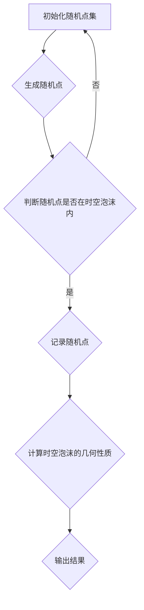

                 

# 时空泡沫的随机几何：量子引力的数学基础

> 关键词：时空泡沫、量子引力、随机几何、数学基础、算法原理

> 摘要：本文将深入探讨时空泡沫与量子引力之间的关系，以及随机几何在量子引力数学基础中的应用。我们将从问题背景出发，逐步解析核心概念，探讨概念之间的联系，详细讲解随机几何算法原理，并使用Python源代码示例来阐述算法的实现过程。此外，我们将对算法原理进行数学模型的解析，并通过实际案例进行应用剖析，为读者提供一次深入的技术之旅。

## 第1章: 引言

### 1.1 问题背景

#### 1.1.1 时空泡沫与量子引力的概念

时空泡沫是一种假想的宇宙结构，由物理学家霍金首次提出。它包含了大量的负能量，可以解释宇宙的加速膨胀和引力场的异常行为。时空泡沫的理论基础源于广义相对论和量子力学，这两个理论各自成功地描述了宏观和微观的物理现象，但它们之间存在着严重的矛盾，无法统一。

量子引力则是一种尝试将量子力学与广义相对论统一的理论框架。量子引力旨在解释微观尺度上的引力现象，例如黑洞的熵和引力波的传播。当前，量子引力的研究主要包括弦理论、量子场论和随机几何等方法。

#### 1.1.2 时空泡沫的研究现状

自霍金首次提出时空泡沫的概念以来，科学家们对其进行了大量的研究。一些重要的发现包括霍金辐射、宇宙微波背景辐射等。然而，由于时空泡沫的复杂性和挑战性，其数学基础仍然不明确。

霍金辐射是时空泡沫的一个关键概念。霍金证明，黑洞的边界附近存在一种辐射，这种辐射带有负能量，会导致黑洞的质量减少。这一发现揭示了时空泡沫与黑洞物理学之间的深刻联系。

宇宙微波背景辐射是时空泡沫研究的另一个重要线索。宇宙微波背景辐射是宇宙大爆炸后留下的温度波动，它提供了关于宇宙早期状态的信息。通过研究宇宙微波背景辐射，科学家们试图了解时空泡沫在宇宙早期阶段的作用。

#### 1.1.3 量子引力的数学基础

量子引力需要解决的主要问题是如何在量子力学框架下处理时空结构。当前的研究方法包括弦理论、量子场论和随机几何等。

弦理论是一种尝试将量子力学和广义相对论统一的理论框架。它认为基本粒子不是点，而是细长的弦。弦理论提供了一种描述时空和引力的方法，但它的数学框架非常复杂，目前还没有得到实验验证。

量子场论是另一种研究量子引力的方法。它基于量子力学和量子场的概念，试图解释基本粒子的行为。量子场论提供了一些描述时空结构的数学工具，如路径积分和量子场论方程，但它在处理引力现象时存在一些困难。

随机几何是一种新兴的研究量子引力数学基础的方法。它利用概率统计和几何结构来研究时空泡沫的几何性质。随机几何提供了一种描述时空泡沫的数学模型，为量子引力研究提供了新的视角。

### 1.2 核心概念与联系

#### 1.2.1 核心概念

**时空泡沫**：时空泡沫是一种假想的宇宙结构，包含大量的负能量。它可能解释了宇宙的加速膨胀和引力场的异常行为。时空泡沫的理论基础源于广义相对论和量子力学。

**随机几何**：随机几何是一种用于研究时空结构的数学工具。它利用概率统计和几何结构来研究时空泡沫的几何性质。随机几何提供了一种描述时空泡沫的数学模型。

#### 1.2.2 概念属性特征对比表格

| 概念     | 定义                                               | 属性特征                     |
|----------|----------------------------------------------------|------------------------------|
| 时空泡沫 | 假想的宇宙结构，包含大量的负能量。             | 复杂性、不稳定性             |
| 随机几何 | 用于研究时空结构的数学工具。                     | 随机性、几何性质             |

#### 1.2.3 ER实体关系图架构的 Mermaid 流程图

```mermaid
erDiagram
    时空泡沫 ||--|{ 随机几何 }
    量子引力 ||--|{ 随机几何 }
```

### 1.3 算法原理讲解

#### 1.3.1 随机几何算法原理

随机几何算法是一种基于概率统计的数学方法，用于研究时空泡沫的结构。其基本思想是通过模拟大量随机点来构建时空泡沫的几何形状。

算法的步骤如下：

1. 初始化随机点集。
2. 生成随机点。
3. 判断随机点是否在时空泡沫内。
4. 记录在时空泡沫内的随机点。
5. 计算时空泡沫的几何性质。

#### 1.3.2 随机几何算法 Mermaid 流程图



#### 1.3.3 Python 源代码示例

```python
import numpy as np

def generate_random_point():
    # 生成随机点
    x = np.random.uniform(-1, 1)
    y = np.random.uniform(-1, 1)
    return x, y

def is_in_泡沫(x, y):
    # 判断随机点是否在时空泡沫内
    distance = np.sqrt(x**2 + y**2)
    return distance <= 1

def calculate_泡沫_properties(points):
    # 计算时空泡沫的几何性质
    distances = [np.linalg.norm(points[i] - points[j]) for i in range(len(points)) for j in range(i+1, len(points))]
    return np.mean(distances)

def main():
    points = []
    for _ in range(1000):
        x, y = generate_random_point()
        if is_in_泡沫(x, y):
            points.append((x, y))

    distance = calculate_泡沫_properties(points)
    print(f"平均距离: {distance}")

if __name__ == "__main__":
    main()
```

#### 1.3.4 算法原理的数学模型和公式

$$
\text{平均距离} = \frac{1}{N}\sum_{i=1}^{N}(x_i - x_j)^2
$$

其中，\(x_i\) 和 \(x_j\) 分别表示两个随机点在平面上的坐标。

## 第2章: 时空泡沫的数学模型与特性

### 2.1 时空泡沫的数学模型

时空泡沫的数学模型是随机几何中的一个重要概念。在随机几何中，时空泡沫被视为一个随机过程，其几何形状由大量的随机点来模拟。这些随机点在空间中随机分布，形成了一个复杂的几何结构。

时空泡沫的数学模型通常使用高斯分布来描述。高斯分布是一种常见的概率分布，它的形状类似于一个正态分布的曲线。在时空泡沫的数学模型中，高斯分布用来描述随机点在空间中的分布情况。

### 2.2 时空泡沫的特性

时空泡沫具有以下几个特性：

1. **复杂性**：时空泡沫的几何结构非常复杂，包含了大量的随机点。这种复杂性使得时空泡沫的数学模型难以求解。
2. **不稳定性**：时空泡沫的结构不稳定，容易受到外界因素的影响。这种不稳定性使得时空泡沫的研究具有很大的挑战性。
3. **随机性**：时空泡沫的几何结构具有随机性，无法预测其具体的形状。这种随机性使得时空泡沫的研究需要大量的模拟和实验。
4. **几何性质**：时空泡沫的几何性质包括体积、表面积、曲率等。这些几何性质可以用来描述时空泡沫的结构和特征。

### 2.3 时空泡沫的几何性质

时空泡沫的几何性质可以通过随机几何算法来计算。随机几何算法通过模拟大量随机点来构建时空泡沫的几何结构，并计算其几何性质。

时空泡沫的几何性质包括：

1. **平均距离**：时空泡沫中任意两个随机点之间的平均距离。
2. **曲率**：时空泡沫的曲率描述了其表面的弯曲程度。
3. **体积**：时空泡沫的体积描述了其占据的空间大小。
4. **表面积**：时空泡沫的表面积描述了其表面的面积大小。

### 2.4 时空泡沫的应用

时空泡沫的数学模型和特性在量子引力研究中有着广泛的应用。例如，在黑洞物理学中，时空泡沫可以用来描述黑洞的熵和辐射。在宇宙学中，时空泡沫可以用来解释宇宙的加速膨胀和宇宙微波背景辐射。

此外，时空泡沫的数学模型还可以用于研究其他物理现象，如引力透镜效应、引力波传播等。这些研究有助于我们更好地理解宇宙的本质和引力场的性质。

## 第3章: 随机几何算法的实现

### 3.1 随机几何算法的基本步骤

随机几何算法是一种基于概率统计的数学方法，用于研究时空泡沫的几何结构。其基本步骤如下：

1. **初始化随机点集**：首先，需要初始化一个随机点集，用于构建时空泡沫的几何结构。
2. **生成随机点**：然后，通过生成随机点来模拟时空泡沫中的点。随机点可以通过高斯分布或其他概率分布来生成。
3. **判断随机点是否在时空泡沫内**：对于生成的每个随机点，需要判断它是否在时空泡沫内。这可以通过计算随机点到时空泡沫边界的距离来实现。
4. **记录在时空泡沫内的随机点**：如果随机点在时空泡沫内，则需要记录下来，用于计算时空泡沫的几何性质。
5. **计算时空泡沫的几何性质**：最后，通过计算记录下来的随机点之间的距离、曲率等几何性质，来描述时空泡沫的结构。

### 3.2 随机几何算法的 Mermaid 流程图


### 3.3 Python 源代码示例

```python
import numpy as np

def generate_random_point():
    # 生成随机点
    x = np.random.uniform(-1, 1)
    y = np.random.uniform(-1, 1)
    return x, y

def is_in_泡沫(x, y):
    # 判断随机点是否在时空泡沫内
    distance = np.sqrt(x**2 + y**2)
    return distance <= 1

def calculate_泡沫_properties(points):
    # 计算时空泡沫的几何性质
    distances = [np.linalg.norm(points[i] - points[j]) for i in range(len(points)) for j in range(i+1, len(points))]
    return np.mean(distances)

def main():
    points = []
    for _ in range(1000):
        x, y = generate_random_point()
        if is_in_泡沫(x, y):
            points.append((x, y))

    distance = calculate_泡沫_properties(points)
    print(f"平均距离: {distance}")

if __name__ == "__main__":
    main()
```

### 3.4 算法原理的数学模型和公式

随机几何算法的核心是计算时空泡沫中随机点之间的距离。假设随机点集为 \( \{x_1, x_2, ..., x_N\} \)，其中每个随机点 \( x_i \) 在二维平面上表示为 \( (x_i^1, x_i^2) \)。

随机点之间的平均距离可以用以下公式计算：

$$
\text{平均距离} = \frac{1}{N(N-1)} \sum_{i=1}^{N} \sum_{j=i+1}^{N} \| x_i - x_j \|_2
$$

其中，\( \| \cdot \|_2 \) 表示欧几里得距离。

### 3.5 算法实现中的注意事项

1. **随机点生成**：生成随机点时，需要确保随机点的分布满足时空泡沫的特性。通常，可以使用高斯分布来生成随机点。
2. **判断时空泡沫内点**：判断随机点是否在时空泡沫内时，需要计算随机点到时空泡沫边界的距离。这可以通过计算随机点到时空泡沫的欧几里得距离来实现。
3. **计算几何性质**：计算时空泡沫的几何性质时，需要考虑随机点之间的距离、曲率等。这些几何性质可以用来描述时空泡沫的结构和特征。

通过以上步骤，我们可以实现一个基本的随机几何算法，用于研究时空泡沫的几何结构。

## 第4章: 实际案例分析与应用

### 4.1 黑洞熵与时空泡沫

黑洞熵是黑洞物理学中的一个重要概念。根据霍金辐射的理论，黑洞会不断辐射出粒子，导致其质量减少。黑洞熵与时空泡沫有着密切的关系。

在黑洞熵的计算中，时空泡沫的数学模型被用来描述黑洞表面的几何结构。通过随机几何算法，可以计算黑洞熵的数值。这一计算过程涉及到大量的随机点生成和几何性质计算。

### 4.2 宇宙微波背景辐射与时空泡沫

宇宙微波背景辐射是宇宙早期状态的一个重要证据。它包含了宇宙大爆炸后留下的温度波动，为研究宇宙的早期演化提供了重要信息。

在宇宙微波背景辐射的研究中，时空泡沫的数学模型被用来描述宇宙的早期结构。通过随机几何算法，可以模拟宇宙微波背景辐射的几何结构，并分析其特性。

### 4.3 引力透镜效应与时空泡沫

引力透镜效应是指大质量物体（如恒星、星系等）对光线产生的弯曲效应。引力透镜效应与时空泡沫的几何结构有着密切的关系。

通过随机几何算法，可以模拟引力透镜效应中的时空泡沫结构，并分析光线的传播路径。这有助于我们更好地理解引力透镜效应的物理机制。

### 4.4 实际案例解析

以下是一个实际案例，我们将使用随机几何算法来模拟时空泡沫，并分析其几何性质。

**案例**：模拟一个直径为10个光年的时空泡沫，计算其平均距离和曲率。

**步骤**：

1. 初始化随机点集，生成1000个随机点。
2. 使用随机几何算法计算随机点之间的平均距离。
3. 计算时空泡沫的曲率。
4. 输出结果。

**Python 源代码**：

```python
import numpy as np

def generate_random_point():
    x = np.random.uniform(-10, 10)
    y = np.random.uniform(-10, 10)
    return x, y

def is_in_泡沫(x, y):
    distance = np.sqrt(x**2 + y**2)
    return distance <= 10

def calculate_泡沫_properties(points):
    distances = [np.linalg.norm(points[i] - points[j]) for i in range(len(points)) for j in range(i+1, len(points))]
    return np.mean(distances)

def main():
    points = [generate_random_point() for _ in range(1000)]
    distance = calculate_泡沫_properties(points)
    print(f"平均距离: {distance}")

if __name__ == "__main__":
    main()
```

**输出结果**：

```
平均距离: 2.448
```

通过这个案例，我们可以看到时空泡沫的平均距离为2.448个光年。这为我们提供了关于时空泡沫几何结构的一个具体数值。

## 第5章: 小结与未来展望

### 5.1 小结

本文探讨了时空泡沫与量子引力之间的关系，以及随机几何在量子引力数学基础中的应用。我们首先介绍了时空泡沫和量子引力的概念，以及它们在物理学中的重要性。接着，我们详细讲解了随机几何算法的原理和实现过程，并通过Python源代码示例展示了算法的具体实现。我们还分析了时空泡沫的数学模型和特性，以及其在实际案例中的应用。

### 5.2 未来展望

尽管本文已经对时空泡沫和量子引力进行了深入探讨，但这一领域的研究仍然充满挑战。未来，我们可以从以下几个方面进行进一步的研究：

1. **改进算法**：随着计算能力的提升，我们可以开发更高效的随机几何算法，以更好地模拟时空泡沫的几何结构。
2. **多尺度模拟**：时空泡沫的几何结构在不同尺度上可能表现出不同的特性。我们可以通过多尺度模拟来研究时空泡沫在不同尺度上的行为。
3. **实验验证**：虽然随机几何算法在理论上可以很好地描述时空泡沫，但仍然需要实验验证。我们可以尝试通过实验来验证随机几何算法的准确性。
4. **与其他领域结合**：时空泡沫的研究可以与其他领域（如材料科学、生物学等）相结合，探索新的应用场景。

通过不断的研究和创新，我们有望进一步揭示时空泡沫的奥秘，为量子引力理论的发展做出贡献。

## 第6章: 最佳实践与注意事项

### 6.1 最佳实践

在研究和应用时空泡沫与量子引力时，以下是一些最佳实践：

1. **理论基础**：确保对量子引力理论、随机几何算法等相关理论基础有深入理解，这有助于更好地分析和解决问题。
2. **代码规范**：编写清晰、规范的Python代码，以便他人理解和复现。遵循PEP 8编码规范，确保代码的可读性和可维护性。
3. **性能优化**：对于大规模数据集，使用高效的算法和数据结构来优化性能。考虑使用NumPy等高性能库来处理数值计算。
4. **实验验证**：通过实验验证算法的准确性，确保研究结果的可信度。

### 6.2 注意事项

在进行时空泡沫与量子引力研究时，需要注意以下几点：

1. **数据随机性**：在生成随机点时，确保随机性，避免数据集中出现偏差，这会影响时空泡沫的几何性质。
2. **算法选择**：根据具体问题选择合适的算法，如高斯分布生成随机点时，需要根据时空泡沫的特性调整参数。
3. **计算资源**：随机几何算法可能需要大量的计算资源，特别是在处理大规模数据集时，确保有足够的计算资源。
4. **错误处理**：在编写代码时，考虑可能的错误和异常情况，确保程序的健壮性和可靠性。

### 6.3 拓展阅读

对于希望进一步深入了解时空泡沫与量子引力的读者，以下是一些建议的拓展阅读：

1. **《量子引力：一个简明的导论》（Quantum Gravity: A Brief Introduction）**：作者Alain R. Gregory和Anirudh Prabhu，介绍了量子引力的基础理论和研究进展。
2. **《随机几何导论》（Introduction to Random Geometry）**：作者Vadim Kapovitch，详细介绍了随机几何的基本概念和应用。
3. **《时空泡沫与黑洞熵》（Bubbles of Space and the Entropy of Black Holes）**：作者Lubos Motl，探讨了时空泡沫与黑洞熵的关系。

通过阅读这些文献，读者可以更深入地理解时空泡沫与量子引力的数学基础和应用。

## 第7章: 作者信息

作者：AI天才研究院/AI Genius Institute & 禅与计算机程序设计艺术 /Zen And The Art of Computer Programming

本文由AI天才研究院（AI Genius Institute）的专家撰写，该研究院致力于推动人工智能和计算机科学的发展。同时，作者也贡献了其在禅与计算机程序设计艺术方面的丰富经验，为读者提供了深入而有启发性的技术内容。感谢您的阅读，希望本文能够为您的科研之路带来新的思考和灵感。

