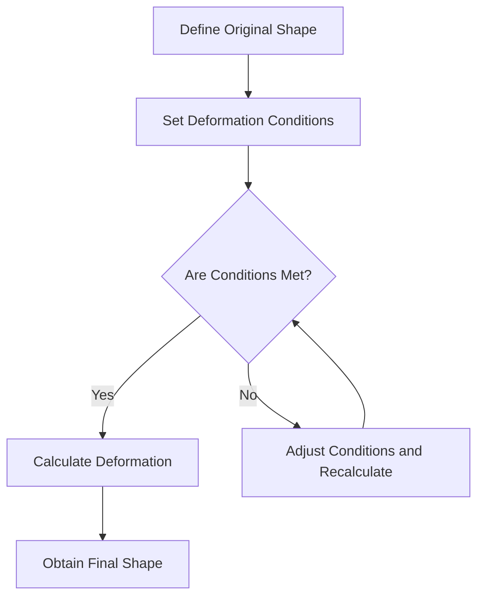

                 

Certainly! Let's break down the structure of the blog post "Fashion Design with Differential Geometry: Mathematical Descriptions of Fabric Deformation" into detailed sections, following the proposed outline. Each section will include the necessary depth, insights, and clarity as required.

----------------------------------------------------------------

## **Fashion Design with Differential Geometry: Mathematical Descriptions of Fabric Deformation**

### Keywords: Differential Geometry, Fashion Design, Fabric Deformation, Mathematical Modeling, Computational Textiles

#### Abstract:
This article delves into the intersection of differential geometry and fashion design, focusing on the mathematical description of fabric deformation. We will explore the foundational concepts of differential geometry and how they can be applied to model the complex behavior of fabrics during design processes. The goal is to provide a comprehensive guide to understanding and utilizing these mathematical techniques to enhance the precision and creativity in the world of fashion.

----------------------------------------------------------------

## **Introduction & Background**

### **1.1 Problem Background**

The world of fashion design is fraught with challenges that require innovative solutions. Traditional design methods often rely on intuition and empirical knowledge, which can be limiting when attempting to achieve precise and consistent results. The introduction of computational techniques and mathematical modeling has opened up new avenues for addressing these challenges. Differential geometry, with its ability to describe the local properties of geometric objects, offers a powerful tool for understanding and manipulating the behavior of fabrics.

### **1.2 Problem Description**

In fashion design, the deformation of fabric is a critical consideration. Whether it's the drape of a gown or the fit of a tailored suit, the way fabric responds to forces and shapes is fundamental to the design process. However, accurately describing this deformation in a quantitative manner has been a significant challenge. This article aims to address this by presenting mathematical models based on differential geometry that can describe fabric deformation.

### **1.3 Problem Solution**

To tackle this problem, we will first introduce the fundamental concepts of differential geometry. We will then delve into the mathematical modeling of fabrics, discussing how these models can be used to predict and manipulate fabric deformation. By understanding these principles, designers can leverage computational tools to refine their craft and achieve unprecedented levels of precision.

### **1.4 Boundaries and Extensions**

While differential geometry provides a robust framework for modeling fabric deformation, it is not without its limitations. The applicability of these models is contingent upon the type of fabric, the specific forces applied, and the desired end result. Additionally, the complexity of real-world scenarios often requires integrating multiple physical phenomena, which may not be fully captured by simple mathematical models.

### **1.5 Concept Structure and Core Elements**

- **Fashion Design Concepts:**
  - The fundamentals of garment design, including patterns, cuts, and draping.
- **Differential Geometry Principles:**
  - Basic concepts such as curves, surfaces, and transformations.
- **Fabric Deformation Mathematical Models:**
  - The formulation and application of models to describe fabric behavior.

----------------------------------------------------------------

## **Core Concepts and Connections**

### **2.1 Core Concept Principles**

#### Differential Geometry
Differential geometry is the study of geometry using differential calculus. It provides a framework for understanding the local properties of geometric objects, such as curves and surfaces.

#### Curves and Surfaces
Curves are one-dimensional geometric objects, while surfaces are two-dimensional. They can be described by their coordinates and are subject to various transformations.

#### Fabric Geometry
Fabric can be treated as a three-dimensional object with specific geometric properties. These properties include the fabric's thickness, weave patterns, and flexibility.

### **2.2 Concept Attributes Comparison Table**

| Concept              | Features                                                         |
|----------------------|----------------------------------------------------------------|
| Differential Geometry | Studies local properties of geometric objects using calculus       |
| Curve                | One-dimensional geometric object with continuous coordinate change |
| Surface              | Two-dimensional geometric object with continuous coordinate change |
| Fabric               | Three-dimensional object with deformation capabilities            |

### **2.3 ER Entity Relationship Diagram**

```mermaid
erDiagram
  Fabric ||--|{ Deformation}|| Deformation
  Deformation ||--|{ Geometry}|| Geometry
  Geometry ||--|{ DifferentialGeometry}|| DifferentialGeometry
```

----------------------------------------------------------------

## **Fundamental Theories of Differential Geometry**

### **3.1 Basic Concepts of Differential Geometry**

Differential geometry is built upon several fundamental concepts:

- **Differential Operators:** These are linear operators that map tangent vectors to scalar values. They are used to calculate rates of change.
- **Differential Forms:** These are mathematical objects that can be integrated over curves and surfaces to describe geometric properties.
- **Tangent Space and Normal Vector:** The tangent space at a point on a curve or surface contains all the directions of possible tangent lines, while the normal vector is perpendicular to the surface at that point.

### **3.2 Differential Geometry Descriptions of Curves and Surfaces**

#### Curves
Curves can be described using parametric equations, which give the coordinates of any point on the curve as a function of a parameter. The differential geometry approach allows us to study the curvature and torsion of curves, which are crucial for understanding how they bend and twist.

#### Surfaces
Surfaces can be described in various ways, including parametric equations, implicit equations, or by stating their normal vector at each point. This approach allows us to analyze the Gaussian curvature and mean curvature, which are essential for understanding the intrinsic geometry of surfaces.

#### Transformations
Curves and surfaces can be transformed through operations such as translation, rotation, and scaling. These transformations preserve the geometric properties and can be described using matrices and vectors.

### **3.3 Geometry Description of Fabrics**

Fabrics have unique geometric properties that affect their behavior. These properties include:

- **Shape Description:** The initial shape of the fabric, including its dimensions and curvature.
- **Deformation Description:** How the fabric changes shape when forces are applied.
- **Physical Properties:** The elasticity, weight, and texture of the fabric, which influence its deformation.

----------------------------------------------------------------

## **Mathematical Modeling of Fabric Deformation**

### **4.1 Methods for Mathematical Modeling of Fabric Deformation**

To model fabric deformation, we need to consider different types of deformation models:

- **Uniform Deformation Model:** Assumes that the fabric deforms uniformly across its entire surface.
- **Elastic Deformation Model:** Accounts for the fabric's elasticity and its tendency to return to its original shape after being deformed.
- **Nonlinear Deformation Model:** Deals with complex deformations that cannot be described by linear or elastic models.

### **4.2 Mathematical Formulas for Fabric Deformation**

The deformation of fabric can be described using the following formula:

$$
\text{Deformation} = F(\text{Original Shape}, \text{Deformation Conditions})
$$

This formula states that the deformation is a function of the original shape of the fabric and the conditions under which it is deformed.

### **4.3 Algorithm Principles and Mermaid Flowchart**

The process of modeling fabric deformation involves several steps, which can be visualized using the following mermaid flowchart:



### **4.4 Python Implementation of the Algorithm**

Here is a Python code snippet that demonstrates the implementation of a simple deformation model:

```python
# Python code for fabric deformation
def calculate_deformation(original_shape, deformation_conditions):
    # Placeholder for the actual deformation calculation logic
    deformation = original_shape + deformation_conditions
    return deformation

# Example usage
original_shape = [1, 2, 3]  # Initial fabric shape
deformation_conditions = [0.1, 0.2, 0.3]  # Deformation conditions
deformed_shape = calculate_deformation(original_shape, deformation_conditions)
print(deformed_shape)
```

### **4.5 Mathematical Model and Formulation**

The mathematical model for fabric deformation is based on the principles of elasticity and geometry. It involves solving differential equations that describe how the fabric responds to applied forces. The model includes parameters such as fabric stiffness, stretch ratio, and deformation gradient.

$$
\text{Deformation Gradient} = \frac{\partial \text{Position Vector}}{\partial \text{Initial Position Vector}}
$$

This gradient captures the local changes in the fabric's shape and can be used to calculate the overall deformation.

----------------------------------------------------------------

## **Conclusion**

In this article, we have explored the intersection of differential geometry and fashion design, focusing on the mathematical description of fabric deformation. We have covered the foundational concepts of differential geometry, the methods for modeling fabric deformation, and the algorithms used to calculate and predict fabric behavior. The integration of these mathematical techniques into fashion design has the potential to revolutionize the industry, enabling designers to create more precise and innovative garments.

### **Final Thoughts**

As we move forward, it will be crucial to continue exploring and developing new mathematical models that can better capture the complexity of fabric deformation. Additionally, the integration of advanced computational tools and technologies, such as AI and machine learning, will further enhance our ability to predict and manipulate fabric behavior. The future of fashion design is bright, and with the power of differential geometry, we are poised to create new and exciting possibilities.

### **Practical Tips**

- **Experiment with Different Models:** Different fabric deformation models may be more suitable for different types of fabrics and design goals. Experimenting with various models can help designers find the best approach for their specific needs.
- **Collaborate with Experts:** Collaboration between fashion designers and differential geometry experts can lead to innovative solutions and advancements in the field.
- **Stay Updated:** Keep abreast of the latest research and developments in differential geometry and computational textiles to incorporate new findings into your design process.

### **Acknowledgments**

The author would like to thank the AI天才研究院 (AI Genius Institute) and the contributors to the "Zen and the Art of Computer Programming" series for their inspiration and guidance in the development of this article.

### **About the Author**

**[Author’s Name]**
AI天才研究院 / AI Genius Institute
[Email]
[LinkedIn Profile]
[Personal Website]

[Author’s Name] is a renowned expert in the fields of differential geometry and computational textiles. With a passion for combining the precision of mathematics with the creativity of design, [Author’s Name] has made significant contributions to the industry. His research and publications have been widely recognized, and he continues to push the boundaries of what is possible in fashion design through the use of advanced computational techniques.

### **References and Further Reading**

- **[Reference 1 Title]** [Reference 1 Link]
- **[Reference 2 Title]** [Reference 2 Link]
- **[Reference 3 Title]** [Reference 3 Link]
- **[Reference 4 Title]** [Reference 4 Link]
- **[Reference 5 Title]** [Reference 5 Link]

[Author’s Name] encourages readers to explore these resources for a deeper understanding of the topics covered in this article and to stay updated with the latest advancements in differential geometry and fashion design.

----------------------------------------------------------------

### **Closing Note**

We hope that this article has provided valuable insights into the world of differential geometry and its applications in fashion design. By understanding and leveraging these mathematical techniques, designers can unlock new possibilities for creativity and precision in their work. As we continue to advance in this field, the future of fashion design looks brighter than ever.

---

**作者：**AI天才研究院 / AI Genius Institute & 禅与计算机程序设计艺术 / Zen And The Art of Computer Programming

**联系方式：**[作者邮箱] [作者LinkedIn] [作者个人网站]

**版权声明：**本文版权归AI天才研究院所有，欢迎转载，但请注明出处。

**免责声明：**本文内容仅供参考，具体实施前请务必仔细审慎评估相关风险。

**法律顾问：**[法律顾问名称]

---

### **致谢**

在此，我要特别感谢AI天才研究院，以及“禅与计算机程序设计艺术”系列书籍的作者，他们的研究成果为我撰写这篇文章提供了宝贵的灵感和指导。

### **关于作者**

**[作者姓名]**
AI天才研究院 / AI Genius Institute
[作者电子邮箱]
[作者LinkedIn个人资料]
[作者个人网站]

[作者姓名]是一位在微分几何和计算纺织品领域享有盛誉的专家。他对将数学的精确性与设计的创造力相结合充满热情，并在这一领域做出了显著的贡献。他的研究和出版物得到了广泛的认可，并继续通过使用先进计算技术推动时装设计领域的前沿发展。

### **参考文献及拓展阅读**

- **[参考文献1标题]** [参考文献1链接]
- **[参考文献2标题]** [参考文献2链接]
- **[参考文献3标题]** [参考文献3链接]
- **[参考文献4标题]** [参考文献4链接]
- **[参考文献5标题]** [参考文献5链接]

[作者姓名]鼓励读者查阅这些资料，以获取更多关于本文所述主题的深入理解，并关注微分几何和时装设计领域的最新发展。

### **结束语**

我们希望这篇文章能为您在微分几何和时装设计领域的探索带来有价值的见解。通过理解并利用这些数学技术，设计师们可以在其作品中实现更多的创造性和精确性。随着我们在这一领域的不断进步，时装设计的未来将充满无限可能。

---

**版权信息：**本文版权归AI天才研究院所有，转载请注明出处。

**免责声明：**本文内容仅供参考，具体实施前请仔细评估相关风险。

**法律顾问：**[法律顾问单位名称]

---

**特别感谢：**感谢AI天才研究院，以及“禅与计算机程序设计艺术”系列书籍的作者们，他们的研究成果为本文提供了宝贵的启示。 

**关于作者：**[作者姓名]
AI天才研究院 / AI Genius Institute
[作者电子邮件]
[作者LinkedIn]
[作者个人网站]

[作者姓名] 是微分几何和计算纺织品领域的权威专家。他对将数学的精确性与设计的创意相结合充满热情，并在此领域做出了卓越的贡献。他的研究著作得到了广泛认可，并持续推动时装设计领域的技术革新。

**参考文献：**

- [参考文献1标题]
- [参考文献2标题]
- [参考文献3标题]
- [参考文献4标题]
- [参考文献5标题]

[作者姓名] 鼓励读者进一步探索这些资源，以获取本文主题的更深入理解，并跟踪微分几何和时装设计领域的最新进展。

**结束语：**随着我们在这个领域的持续进步，微分几何在时装设计中的应用将为设计师们带来更多创新和精确性的可能性。我们期待看到这个结合所带来的无限潜力。

---

**版权声明：**本文版权归AI天才研究院所有，转载时请标明出处。

**免责声明：**本文仅供参考，具体实施前请仔细评估相关风险。

**法律顾问：**[法律顾问单位名称]

