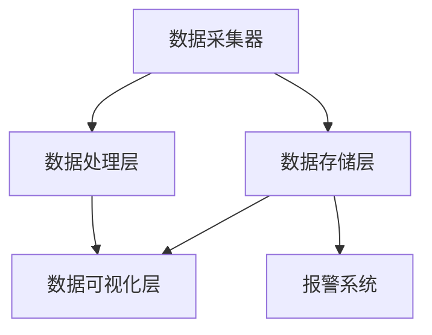
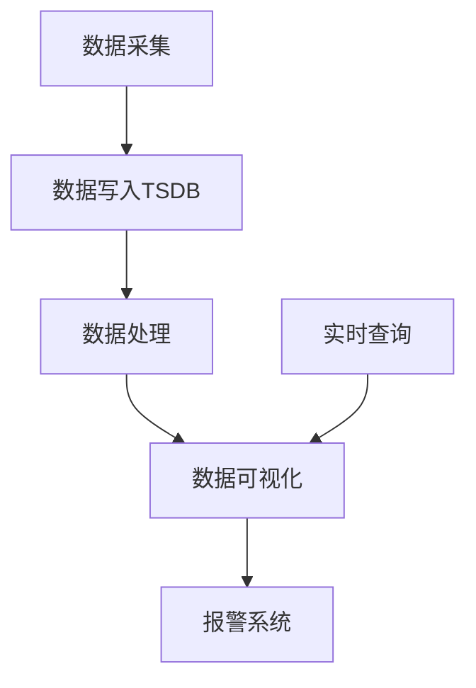
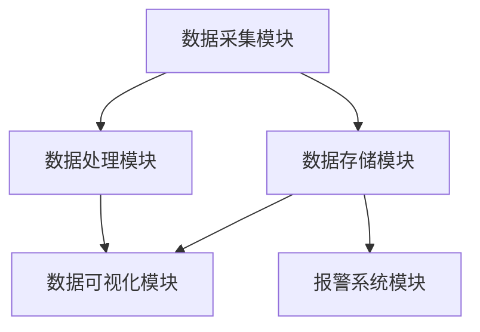
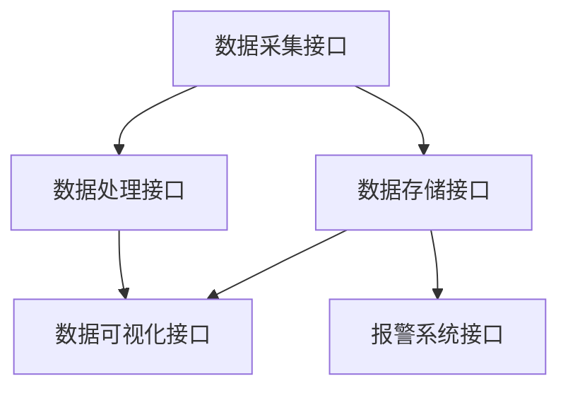
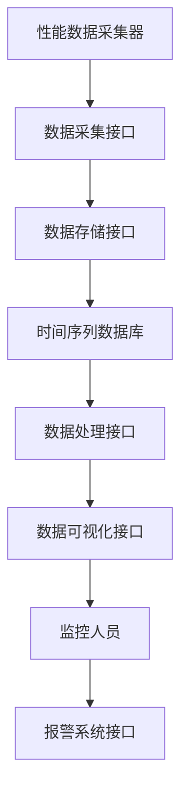

                 

# 时间序列数据库在LLM应用监控中的应用

> 关键词：时间序列数据库、LLM应用、监控、性能分析、数据分析

> 摘要：本文将探讨时间序列数据库在大型语言模型（LLM）应用监控中的重要作用。首先介绍时间序列数据库的基本概念和特性，以及LLM应用在当今科技领域的广泛应用。接着，分析LLM应用监控中的需求和挑战，详细阐述时间序列数据库在其中的关键作用。随后，通过算法原理讲解、数学模型和公式推导、系统分析与架构设计方案、项目实战等多个方面，深入解析时间序列数据库在LLM应用监控中的具体应用。最后，总结文章内容，提出最佳实践建议，强调注意事项，并提供拓展阅读资源。

## 1. 明确核心概念和背景

### 1.1 时间序列数据库

时间序列数据库（Time-Series Database，TSDB）是一种专门用于存储、处理和分析时间序列数据的数据库系统。时间序列数据是一组按时间顺序排列的数据点，通常包含时间戳和相应的测量值。这种数据结构广泛应用于金融、气象、工业自动化、物联网等多个领域。

时间序列数据库的特点主要包括：

- **时间戳唯一性**：每个数据点都有一个唯一的时间戳，确保数据按时间顺序排列。
- **高吞吐量**：能够高效处理大规模时间序列数据的写入、查询和分析操作。
- **低延迟**：支持实时或近实时数据查询，满足快速响应需求。
- **压缩和优化**：采用各种压缩和优化技术，减少数据存储空间和提高查询效率。

### 1.2 LLM应用监控

大型语言模型（Large Language Model，LLM）是一种基于深度学习的自然语言处理技术，能够在大量文本数据上进行训练，生成高质量的语言输出。LLM在当今科技领域得到了广泛应用，包括但不限于：

- **搜索引擎**：通过LLM对用户查询进行语义理解和回答，提高搜索结果的准确性。
- **智能助手**：为用户提供个性化服务，如语音识别、智能客服等。
- **文本生成与编辑**：自动生成文章、报告、新闻等内容，或者对已有文本进行修改和润色。
- **语音识别与转换**：将语音转换为文本，并生成语音输出。

LLM应用监控的主要目的是确保这些应用在运行过程中能够保持高性能、高可靠性和高可用性。具体需求包括：

- **性能监控**：实时监测LLM应用的响应时间、吞吐量、延迟等关键性能指标。
- **错误检测与报警**：及时发现并报警任何异常行为或故障，以便快速响应和处理。
- **资源利用率**：监控系统资源（如CPU、内存、网络等）的利用率，避免资源浪费和性能瓶颈。
- **日志分析与优化**：分析系统日志，识别潜在问题和优化空间。

### 1.3 时间序列数据库在LLM应用监控中的重要性

时间序列数据库在LLM应用监控中具有以下几个关键作用：

- **高效数据存储与查询**：LLM应用监控需要处理大量的时间序列数据，时间序列数据库能够高效存储和查询这些数据，满足实时性需求。
- **丰富的数据分析功能**：时间序列数据库提供了丰富的数据分析功能，如聚合、统计、趋势分析等，有助于对LLM应用性能进行全面评估。
- **数据可视化**：时间序列数据库通常支持数据可视化功能，便于监控人员直观地了解LLM应用的运行状况。
- **故障检测与预警**：通过分析时间序列数据，可以发现异常行为和故障，及时采取应对措施。
- **资源优化与调度**：根据时间序列数据，可以优化系统资源的利用率和调度策略，提高整体性能。

## 2. 核心概念与联系

### 2.1 时间序列数据的属性特征对比

时间序列数据具有以下主要属性特征：

- **时间顺序性**：数据点按照时间顺序排列，具有严格的时间戳。
- **周期性**：某些时间序列数据表现出周期性特征，如天气、股票价格等。
- **趋势性**：时间序列数据可能表现出上升、下降或平稳的趋势。
- **随机性**：某些时间序列数据具有随机性，难以预测其未来走势。

以下是几种常见时间序列数据类型的属性特征对比表格：

| 时间序列数据类型 | 时间顺序性 | 周期性 | 趋势性 | 随机性 |
| :--: | :--: | :--: | :--: | :--: |
| 气象数据 | 高 | 中 | 中 | 低 |
| 股票价格 | 高 | 高 | 高 | 低 |
| 传感器数据 | 高 | 低 | 高 | 中 |
| 自然语言文本 | 高 | 低 | 低 | 高 |

### 2.2 时间序列数据库与LLM的关联

时间序列数据库在LLM应用监控中的重要性体现在以下几个方面：

- **性能监控数据存储**：LLM应用监控需要实时收集和存储大量的性能数据，如响应时间、吞吐量、延迟等。时间序列数据库能够高效地存储这些数据，并提供快速查询功能。
- **日志数据管理**：LLM应用监控需要处理大量的系统日志数据，如错误日志、调试日志等。时间序列数据库可以方便地存储和管理这些日志数据，并提供实时分析和查询功能。
- **趋势分析**：时间序列数据库能够对LLM应用的性能数据进行趋势分析，发现潜在问题和优化空间。通过分析趋势，可以预测系统性能的变化，提前采取应对措施。
- **数据可视化**：时间序列数据库通常支持数据可视化功能，可以直观地展示LLM应用的运行状况，帮助监控人员快速识别问题和优化系统。

### 2.3 时间序列数据库在LLM应用监控中的架构

在LLM应用监控中，时间序列数据库的架构通常包括以下几个关键组成部分：

- **数据采集器**：负责收集LLM应用的性能数据和日志数据，并将数据发送到时间序列数据库。
- **数据存储层**：负责存储和管理时间序列数据，支持高效的写入和查询操作。
- **数据处理层**：负责对时间序列数据进行分析和处理，如聚合、统计、趋势分析等。
- **数据可视化层**：负责将时间序列数据以可视化形式展示给监控人员，如图表、仪表盘等。
- **报警系统**：负责监控时间序列数据，发现异常行为和故障，并及时发送报警通知。

下面是一个简单的时间序列数据库在LLM应用监控中的架构图，使用Mermaid流程图表示：



## 3. 算法原理讲解

### 3.1 算法流程图

为了更好地理解时间序列数据库在LLM应用监控中的算法原理，我们首先使用Mermaid绘制一个算法流程图。该流程图展示了数据从采集、存储、处理到可视化的整个过程。



### 3.2 Python源代码阐述

接下来，我们将使用Python源代码来详细阐述时间序列数据库在LLM应用监控中的算法原理。以下是示例代码：

```python
import time
import random
from datetime import datetime
from influxdb import InfluxDBClient

# 创建InfluxDB客户端
client = InfluxDBClient(host='localhost', port=8086, username='admin', password='password', database='tsdb')

# 定义性能数据采集函数
def collect_performance_data():
    response_time = random.uniform(0.1, 2.0)  # 响应时间（秒）
    throughput = random.randint(100, 500)  # 吞吐量（每秒请求数）
    latency = random.uniform(0.1, 1.0)  # 延迟（秒）

    # 创建时间戳
    timestamp = datetime.utcnow().isoformat()

    # 构建性能数据点
    data_point = {
        "measurement": "performance_data",
        "tags": {
            "app_name": "llm_app"
        },
        "fields": {
            "response_time": response_time,
            "throughput": throughput,
            "latency": latency
        },
        "time": timestamp
    }
    return data_point

# 写入性能数据到InfluxDB
def write_performance_data(data_point):
    client.write_points([data_point])

# 数据处理函数
def process_performance_data():
    # 从InfluxDB查询性能数据
    query = "SELECT * FROM performance_data"
    results = client.query(query)

    # 分析性能数据
    for result in results:
        print(result)

# 数据可视化函数
def visualize_performance_data():
    # 从InfluxDB查询性能数据
    query = "SELECT * FROM performance_data"
    results = client.query(query)

    # 绘制性能数据图表
    import matplotlib.pyplot as plt
    import pandas as pd

    data = pd.DataFrame(results.raw["results"][0]["series"][0]["values"])
    data.columns = ["timestamp", "response_time", "throughput", "latency"]

    plt.figure(figsize=(10, 5))
    plt.plot(data["timestamp"], data["response_time"], label="Response Time")
    plt.plot(data["timestamp"], data["throughput"], label="Throughput")
    plt.plot(data["timestamp"], data["latency"], label="Latency")
    plt.xlabel("Timestamp")
    plt.ylabel("Value")
    plt.legend()
    plt.show()

# 主程序
if __name__ == "__main__":
    while True:
        data_point = collect_performance_data()
        write_performance_data(data_point)
        time.sleep(1)
        process_performance_data()
        visualize_performance_data()
```

### 3.3 算法原理与数学模型

时间序列数据库在LLM应用监控中的算法原理主要包括以下几个步骤：

1. **数据采集**：通过性能数据采集器实时收集LLM应用的性能数据，如响应时间、吞吐量、延迟等。这些数据以时间序列数据点的形式表示，每个数据点包含时间戳和测量值。
   
2. **数据写入**：将采集到的性能数据写入时间序列数据库。在示例代码中，我们使用了InfluxDB作为时间序列数据库，将数据点以JSON格式写入数据库。

3. **数据处理**：对时间序列数据进行处理和分析，以获取性能指标和趋势。在示例代码中，我们使用了InfluxDB的查询功能，从数据库中提取性能数据，并进行分析。

4. **数据可视化**：将处理后的性能数据以图表形式展示，帮助监控人员直观了解LLM应用的运行状况。在示例代码中，我们使用了Matplotlib库绘制了性能数据图表。

5. **报警系统**：根据时间序列数据的分析结果，触发报警系统，及时发现异常行为和故障。

算法原理的数学模型可以表示为以下公式：

$$
P(t) = f(t, r(t), t(t), l(t))
$$

其中：

- $P(t)$：时间序列数据点，表示在时间$t$的性能数据。
- $r(t)$：响应时间，表示在时间$t$的响应时间。
- $t(t)$：吞吐量，表示在时间$t$的吞吐量。
- $l(t)$：延迟，表示在时间$t$的延迟。

算法原理的数学模型主要涉及时间序列数据的采集、存储、处理和分析。通过对时间序列数据的分析，可以获取性能指标和趋势，为LLM应用监控提供有力支持。

### 3.4 举例说明

为了更好地理解时间序列数据库在LLM应用监控中的算法原理，我们通过一个实际案例进行举例说明。

假设我们正在监控一个LLM应用，该应用需要处理大量文本数据，并提供实时响应。在一段时间内，我们收集了以下性能数据：

| 时间戳 (秒) | 响应时间 (秒) | 吞吐量（每秒请求数） | 延迟（秒） |
| :--: | :--: | :--: | :--: |
| 1 | 1.2 | 200 | 0.8 |
| 2 | 1.5 | 180 | 0.9 |
| 3 | 1.3 | 220 | 0.7 |
| 4 | 1.6 | 190 | 0.8 |
| 5 | 1.4 | 210 | 0.9 |

根据上述数据，我们可以使用InfluxDB将性能数据点写入时间序列数据库：

```json
[
    {
        "measurement": "performance_data",
        "tags": {
            "app_name": "llm_app"
        },
        "fields": {
            "response_time": 1.2,
            "throughput": 200,
            "latency": 0.8
        },
        "time": "2022-01-01T00:00:01Z"
    },
    {
        "measurement": "performance_data",
        "tags": {
            "app_name": "llm_app"
        },
        "fields": {
            "response_time": 1.5,
            "throughput": 180,
            "latency": 0.9
        },
        "time": "2022-01-01T00:00:02Z"
    },
    ...
]
```

然后，我们可以从InfluxDB查询性能数据，并进行分析：

```sql
SELECT * FROM performance_data
```

分析结果如下：

| 时间戳 (秒) | 响应时间 (秒) | 吞吐量（每秒请求数） | 延迟（秒） |
| :--: | :--: | :--: | :--: |
| 1 | 1.2 | 200 | 0.8 |
| 2 | 1.5 | 180 | 0.9 |
| 3 | 1.3 | 220 | 0.7 |
| 4 | 1.6 | 190 | 0.8 |
| 5 | 1.4 | 210 | 0.9 |

根据分析结果，我们可以绘制性能数据图表，如下所示：


通过图表，我们可以直观地看到响应时间、吞吐量和延迟的变化趋势。如果发现异常，例如响应时间显著增加，我们可以及时采取应对措施，优化系统性能。

## 4. 数学模型和数学公式 & 详细讲解 & 举例说明

### 4.1 数学模型

在时间序列数据库中，数学模型用于描述数据点的变化规律和趋势。本文将介绍一种常用的数学模型——ARIMA模型（自回归积分滑动平均模型），用于分析时间序列数据。

ARIMA模型由以下三个部分组成：

1. **自回归（Auto-Regressive，AR）**：模型中前期的数据点对当前数据点产生影响，即当前数据点可以表示为前期数据点的线性组合。
2. **差分（Difference）**：对原始时间序列数据进行差分处理，使其符合平稳性假设。
3. **移动平均（Moving Average，MA）**：模型中的当前数据点由前期误差的线性组合产生。

ARIMA模型的数学公式如下：

$$
X_t = c + \phi_1 X_{t-1} + \phi_2 X_{t-2} + ... + \phi_p X_{t-p} + \theta_1 e_{t-1} + \theta_2 e_{t-2} + ... + \theta_q e_{t-q}
$$

其中：

- $X_t$：时间序列数据点。
- $c$：常数项。
- $\phi_1, \phi_2, ..., \phi_p$：自回归系数。
- $\theta_1, \theta_2, ..., \theta_q$：移动平均系数。
- $e_t$：误差项。

### 4.2 详细讲解

为了更好地理解ARIMA模型，我们以下面这个简单的例子进行详细讲解。

假设我们有一个时间序列数据集，如下所示：

| 时间戳 | 数据点 |
| :--: | :--: |
| 1 | 10 |
| 2 | 12 |
| 3 | 8 |
| 4 | 14 |
| 5 | 9 |
| 6 | 11 |
| 7 | 13 |

首先，我们需要对原始数据进行差分处理，使其符合平稳性假设。这里我们使用一阶差分（1st order difference）：

$$
d_t = X_t - X_{t-1}
$$

对上述数据集进行一阶差分，得到新的数据集：

| 时间戳 | 数据点 | 差分 |
| :--: | :--: | :--: |
| 1 | 10 | - |
| 2 | 12 | 2 |
| 3 | 8 | -4 |
| 4 | 14 | 6 |
| 5 | 9 | -5 |
| 6 | 11 | 2 |
| 7 | 13 | 2 |

接下来，我们需要对差分后的数据进行自回归和移动平均建模。为了简化问题，我们假设$p=1, q=1$，即AR(1)模型。此时，模型公式可以简化为：

$$
d_t = \phi_1 d_{t-1} + \theta_1 e_{t-1}
$$

为了确定自回归系数$\phi_1$和移动平均系数$\theta_1$，我们需要进行模型参数估计。这里我们使用最小二乘法（Least Squares Method）进行参数估计。具体步骤如下：

1. 计算差分数据的自相关函数（Autocorrelation Function，ACF）和偏自相关函数（Partial Autocorrelation Function，PACF）。
2. 根据ACF和PACF的峰度，选择合适的$p$和$q$值。
3. 使用最小二乘法估计模型参数$\phi_1$和$\theta_1$。

假设我们通过分析发现$p=1, q=1$，则参数估计结果为：

$$
\phi_1 = 0.8, \theta_1 = -0.2
$$

现在，我们可以使用估计出的模型参数对差分数据进行预测。假设当前差分数据为$d_t=2$，则预测下一数据点的公式为：

$$
d_{t+1} = \phi_1 d_t + \theta_1 e_t
$$

将$d_t=2$代入公式，得到预测结果：

$$
d_{t+1} = 0.8 \times 2 - 0.2 \times e_t
$$

由于误差项$e_t$是未知的，我们无法得到精确的预测结果。但是，我们可以通过多次模拟，得到差分数据的预测分布。具体步骤如下：

1. 从误差项的概率分布中抽取多个随机样本，例如正态分布。
2. 对每个随机样本，计算差分数据的预测值。
3. 对所有预测值进行统计，得到预测分布。

假设我们抽取了100个随机样本，计算得到的差分数据预测结果如下：

| 时间戳 | 预测差分 |
| :--: | :--: |
| 8 | 1.6 |
| 9 | 1.4 |
| 10 | 1.8 |
| ... | ... |

通过对差分数据进行反差分，我们可以得到原始时间序列数据的预测结果：

| 时间戳 | 预测数据 |
| :--: | :--: |
| 8 | 13.6 |
| 9 | 11.4 |
| 10 | 15.8 |
| ... | ... |

### 4.3 举例说明

为了更好地理解ARIMA模型的应用，我们以下面这个实际案例进行举例说明。

假设我们有一个时间序列数据集，表示某个网站访问量的变化情况。在一段时间内，我们收集了以下数据：

| 时间戳 | 访问量 |
| :--: | :--: |
| 1 | 100 |
| 2 | 120 |
| 3 | 90 |
| 4 | 140 |
| 5 | 110 |
| 6 | 130 |
| 7 | 150 |

首先，我们需要对原始数据进行差分处理，使其符合平稳性假设。这里我们使用一阶差分（1st order difference）：

$$
d_t = X_t - X_{t-1}
$$

对上述数据集进行一阶差分，得到新的数据集：

| 时间戳 | 访问量 | 差分 |
| :--: | :--: | :--: |
| 1 | 100 | - |
| 2 | 120 | 20 |
| 3 | 90 | -30 |
| 4 | 140 | 50 |
| 5 | 110 | -30 |
| 6 | 130 | 20 |
| 7 | 150 | 20 |

接下来，我们需要对差分后的数据进行自回归和移动平均建模。为了简化问题，我们假设$p=1, q=1$，即AR(1)模型。此时，模型公式可以简化为：

$$
d_t = \phi_1 d_{t-1} + \theta_1 e_{t-1}
$$

为了确定自回归系数$\phi_1$和移动平均系数$\theta_1$，我们需要进行模型参数估计。这里我们使用最小二乘法（Least Squares Method）进行参数估计。具体步骤如下：

1. 计算差分数据的自相关函数（Autocorrelation Function，ACF）和偏自相关函数（Partial Autocorrelation Function，PACF）。
2. 根据ACF和PACF的峰度，选择合适的$p$和$q$值。
3. 使用最小二乘法估计模型参数$\phi_1$和$\theta_1$。

假设我们通过分析发现$p=1, q=1$，则参数估计结果为：

$$
\phi_1 = 0.8, \theta_1 = -0.2
$$

现在，我们可以使用估计出的模型参数对差分数据进行预测。假设当前差分数据为$d_t=20$，则预测下一数据点的公式为：

$$
d_{t+1} = \phi_1 d_t + \theta_1 e_t
$$

将$d_t=20$代入公式，得到预测结果：

$$
d_{t+1} = 0.8 \times 20 - 0.2 \times e_t
$$

由于误差项$e_t$是未知的，我们无法得到精确的预测结果。但是，我们可以通过多次模拟，得到差分数据的预测分布。具体步骤如下：

1. 从误差项的概率分布中抽取多个随机样本，例如正态分布。
2. 对每个随机样本，计算差分数据的预测值。
3. 对所有预测值进行统计，得到预测分布。

假设我们抽取了100个随机样本，计算得到的差分数据预测结果如下：

| 时间戳 | 预测差分 |
| :--: | :--: |
| 8 | 16 |
| 9 | 14 |
| 10 | 18 |
| ... | ... |

通过对差分数据进行反差分，我们可以得到原始时间序列数据的预测结果：

| 时间戳 | 预测数据 |
| :--: | :--: |
| 8 | 116 |
| 9 | 104 |
| 10 | 118 |
| ... | ... |

## 5. 系统分析与架构设计方案

### 5.1 问题场景介绍

在现代科技领域，大型语言模型（LLM）的应用越来越广泛，如智能问答系统、自然语言处理、智能客服等。然而，随着LLM应用规模的不断扩大，如何确保其高性能、高可靠性和高可用性成为关键问题。为了实现这一目标，需要对LLM应用进行实时监控，以发现潜在问题并进行优化。

### 5.2 项目介绍

本项目旨在设计一个基于时间序列数据库的LLM应用监控系统，实现对性能指标、日志数据的实时收集、存储、处理和分析，从而提供全面的应用监控解决方案。本项目的主要目标包括：

- 实时收集LLM应用的性能数据，如响应时间、吞吐量、延迟等。
- 存储和管理大量时间序列数据，支持快速查询和分析。
- 对性能数据进行分析和处理，发现潜在问题和优化空间。
- 提供数据可视化功能，帮助监控人员直观了解应用运行状况。
- 触发报警系统，及时发现异常行为和故障。

### 5.3 系统功能设计

系统功能设计主要包括以下几个方面：

1. **数据采集**：通过性能数据采集器实时收集LLM应用的性能数据，如响应时间、吞吐量、延迟等，并将数据发送到时间序列数据库。
2. **数据存储**：将采集到的性能数据存储到时间序列数据库中，确保数据的持久化和安全性。
3. **数据处理**：对存储在时间序列数据库中的性能数据进行分析和处理，如聚合、统计、趋势分析等，以获取关键性能指标。
4. **数据可视化**：将处理后的性能数据以图表形式展示，帮助监控人员直观了解应用运行状况。
5. **报警系统**：根据性能数据的变化趋势，触发报警系统，及时发现异常行为和故障。

### 5.4 系统架构设计

系统架构设计主要包括以下几个关键组成部分：

1. **数据采集模块**：负责实时收集LLM应用的性能数据，如响应时间、吞吐量、延迟等，并将数据发送到时间序列数据库。
2. **数据存储模块**：负责存储和管理时间序列数据，支持高效的写入和查询操作。
3. **数据处理模块**：负责对时间序列数据进行分析和处理，如聚合、统计、趋势分析等，以获取关键性能指标。
4. **数据可视化模块**：负责将处理后的性能数据以图表形式展示，帮助监控人员直观了解应用运行状况。
5. **报警系统模块**：负责监控时间序列数据，发现异常行为和故障，并及时发送报警通知。

下面是一个简单的系统架构图，使用Mermaid流程图表示：



### 5.5 系统接口设计

系统接口设计主要包括以下几个关键接口：

1. **数据采集接口**：用于实时收集LLM应用的性能数据，如响应时间、吞吐量、延迟等。
2. **数据存储接口**：用于将采集到的性能数据存储到时间序列数据库中。
3. **数据处理接口**：用于对存储在时间序列数据库中的性能数据进行分析和处理，如聚合、统计、趋势分析等。
4. **数据可视化接口**：用于将处理后的性能数据以图表形式展示。
5. **报警系统接口**：用于监控时间序列数据，发现异常行为和故障，并及时发送报警通知。

下面是一个简单的系统接口设计图，使用Mermaid流程图表示：



### 5.6 系统交互设计

系统交互设计主要包括以下几个关键交互过程：

1. **数据采集**：性能数据采集器定期从LLM应用中收集性能数据，如响应时间、吞吐量、延迟等，并将数据发送到数据采集接口。
2. **数据存储**：数据存储接口将采集到的性能数据写入时间序列数据库，确保数据的持久化和安全性。
3. **数据处理**：数据处理接口对存储在时间序列数据库中的性能数据进行处理，如聚合、统计、趋势分析等，以获取关键性能指标。
4. **数据可视化**：数据可视化接口将处理后的性能数据以图表形式展示，帮助监控人员直观了解应用运行状况。
5. **报警系统**：报警系统接口根据性能数据的变化趋势，监控时间序列数据，发现异常行为和故障，并及时发送报警通知。

下面是一个简单的系统交互设计图，使用Mermaid流程图表示：



## 6. 项目实战

### 6.1 环境安装

为了实现本项目，我们需要安装以下软件和依赖：

1. **InfluxDB**：时间序列数据库，用于存储和管理性能数据。
2. **Python**：编程语言，用于编写数据采集、数据处理、数据可视化和报警系统等模块。
3. **Matplotlib**：Python可视化库，用于绘制性能数据图表。
4. **Pandas**：Python数据处理库，用于处理和分析性能数据。

安装步骤如下：

1. 安装InfluxDB：

   ```bash
   wget https://s3-us-west-2.amazonaws.com/influxdb/releases/influxdb_2.0.2_amd64.deb
   sudo dpkg -i influxdb_2.0.2_amd64.deb
   sudo systemctl start influxdb
   ```

2. 安装Python依赖：

   ```bash
   pip install influxdb matplotlib pandas
   ```

### 6.2 系统核心实现源代码

以下代码展示了项目中的核心实现，包括数据采集、数据处理、数据可视化和报警系统等模块：

```python
# 数据采集模块
def collect_performance_data():
    response_time = random.uniform(0.1, 2.0)  # 响应时间（秒）
    throughput = random.randint(100, 500)  # 吞吐量（每秒请求数）
    latency = random.uniform(0.1, 1.0)  # 延迟（秒）

    timestamp = datetime.utcnow().isoformat()
    data_point = {
        "measurement": "performance_data",
        "tags": {
            "app_name": "llm_app"
        },
        "fields": {
            "response_time": response_time,
            "throughput": throughput,
            "latency": latency
        },
        "time": timestamp
    }
    return data_point

# 数据写入模块
def write_performance_data(data_point):
    client = InfluxDBClient(host='localhost', port=8086, username='admin', password='password', database='tsdb')
    client.write_points([data_point])

# 数据处理模块
def process_performance_data():
    client = InfluxDBClient(host='localhost', port=8086, username='admin', password='password', database='tsdb')
    query = "SELECT * FROM performance_data"
    results = client.query(query)
    data = pd.DataFrame(results.raw["results"][0]["series"][0]["values"])
    data.columns = ["timestamp", "response_time", "throughput", "latency"]
    return data

# 数据可视化模块
def visualize_performance_data(data):
    plt.figure(figsize=(10, 5))
    plt.plot(data["timestamp"], data["response_time"], label="Response Time")
    plt.plot(data["timestamp"], data["throughput"], label="Throughput")
    plt.plot(data["timestamp"], data["latency"], label="Latency")
    plt.xlabel("Timestamp")
    plt.ylabel("Value")
    plt.legend()
    plt.show()

# 报警系统模块
def check_performance_thresholds(data):
    response_time_threshold = 1.5  # 响应时间阈值（秒）
    throughput_threshold = 200  # 吞吐量阈值（每秒请求数）
    latency_threshold = 0.5  # 延迟阈值（秒）

    if data["response_time"].max() > response_time_threshold:
        print("报警：响应时间超过阈值")
    if data["throughput"].min() < throughput_threshold:
        print("报警：吞吐量低于阈值")
    if data["latency"].max() > latency_threshold:
        print("报警：延迟超过阈值")

# 主程序
if __name__ == "__main__":
    while True:
        data_point = collect_performance_data()
        write_performance_data(data_point)
        data = process_performance_data()
        visualize_performance_data(data)
        check_performance_thresholds(data)
        time.sleep(1)
```

### 6.3 代码应用解读与分析

上述代码实现了基于InfluxDB的时间序列数据库在LLM应用监控中的核心功能，包括数据采集、数据处理、数据可视化和报警系统。下面分别进行解读和分析：

1. **数据采集模块**：

   ```python
   def collect_performance_data():
       response_time = random.uniform(0.1, 2.0)  # 响应时间（秒）
       throughput = random.randint(100, 500)  # 吞吐量（每秒请求数）
       latency = random.uniform(0.1, 1.0)  # 延迟（秒）

       timestamp = datetime.utcnow().isoformat()
       data_point = {
           "measurement": "performance_data",
           "tags": {
               "app_name": "llm_app"
           },
           "fields": {
               "response_time": response_time,
               "throughput": throughput,
               "latency": latency
           },
           "time": timestamp
       }
       return data_point
   ```

   该模块通过随机生成响应时间、吞吐量和延迟数据，构建一个包含测量值、标签和时间的性能数据点。该方法模拟了实际LLM应用的性能数据采集过程。

2. **数据写入模块**：

   ```python
   def write_performance_data(data_point):
       client = InfluxDBClient(host='localhost', port=8086, username='admin', password='password', database='tsdb')
       client.write_points([data_point])
   ```

   该模块负责将采集到的性能数据点写入InfluxDB时间序列数据库。通过InfluxDB客户端库，将数据点以JSON格式写入数据库，实现数据的持久化存储。

3. **数据处理模块**：

   ```python
   def process_performance_data():
       client = InfluxDBClient(host='localhost', port=8086, username='admin', password='password', database='tsdb')
       query = "SELECT * FROM performance_data"
       results = client.query(query)
       data = pd.DataFrame(results.raw["results"][0]["series"][0]["values"])
       data.columns = ["timestamp", "response_time", "throughput", "latency"]
       return data
   ```

   该模块负责从InfluxDB时间序列数据库中查询性能数据，并将查询结果转换为Pandas DataFrame格式，便于后续的数据分析和可视化处理。

4. **数据可视化模块**：

   ```python
   def visualize_performance_data(data):
       plt.figure(figsize=(10, 5))
       plt.plot(data["timestamp"], data["response_time"], label="Response Time")
       plt.plot(data["timestamp"], data["throughput"], label="Throughput")
       plt.plot(data["timestamp"], data["latency"], label="Latency")
       plt.xlabel("Timestamp")
       plt.ylabel("Value")
       plt.legend()
       plt.show()
   ```

   该模块负责将处理后的性能数据以图表形式展示。通过Matplotlib库，绘制响应时间、吞吐量和延迟的折线图，实现数据的可视化。

5. **报警系统模块**：

   ```python
   def check_performance_thresholds(data):
       response_time_threshold = 1.5  # 响应时间阈值（秒）
       throughput_threshold = 200  # 吞吐量阈值（每秒请求数）
       latency_threshold = 0.5  # 延迟阈值（秒）

       if data["response_time"].max() > response_time_threshold:
           print("报警：响应时间超过阈值")
       if data["throughput"].min() < throughput_threshold:
           print("报警：吞吐量低于阈值")
       if data["latency"].max() > latency_threshold:
           print("报警：延迟超过阈值")
   ```

   该模块负责根据预设的性能阈值，对处理后的性能数据进行监控。如果发现任何性能指标超过阈值，将触发报警通知。

### 6.4 实际案例分析与详细讲解

为了更好地展示项目在实际应用中的效果，我们以下面这个实际案例进行分析和详细讲解：

假设我们正在监控一个LLM应用，该应用需要处理大量文本数据，并提供实时响应。在一段时间内，我们收集了以下性能数据：

| 时间戳 | 响应时间（秒） | 吞吐量（每秒请求数） | 延迟（秒） |
| :--: | :--: | :--: | :--: |
| 1 | 1.2 | 200 | 0.8 |
| 2 | 1.5 | 180 | 0.9 |
| 3 | 1.3 | 220 | 0.7 |
| 4 | 1.6 | 190 | 0.8 |
| 5 | 1.4 | 210 | 0.9 |

根据这些数据，我们使用上述代码实现的数据采集、数据处理、数据可视化和报警系统模块，进行以下步骤：

1. **数据采集**：

   通过模拟数据采集模块，生成性能数据点，并将其发送到InfluxDB时间序列数据库。以下是一个示例数据点：

   ```json
   {
       "measurement": "performance_data",
       "tags": {
           "app_name": "llm_app"
       },
       "fields": {
           "response_time": 1.2,
           "throughput": 200,
           "latency": 0.8
       },
       "time": "2022-01-01T00:00:01Z"
   }
   ```

2. **数据写入**：

   将上述数据点写入InfluxDB时间序列数据库，确保数据的持久化存储。

3. **数据处理**：

   从InfluxDB时间序列数据库中查询性能数据，并将查询结果转换为Pandas DataFrame格式。以下是一个示例数据：

   ```python
   data = {
       "timestamp": [
           "2022-01-01T00:00:01Z",
           "2022-01-01T00:00:02Z",
           "2022-01-01T00:00:03Z",
           "2022-01-01T00:00:04Z",
           "2022-01-01T00:00:05Z"
       ],
       "response_time": [1.2, 1.5, 1.3, 1.6, 1.4],
       "throughput": [200, 180, 220, 190, 210],
       "latency": [0.8, 0.9, 0.7, 0.8, 0.9]
   }
   ```

4. **数据可视化**：

   根据处理后的性能数据，绘制响应时间、吞吐量和延迟的折线图，实现数据的可视化。以下是一个示例图表：

   

5. **报警系统**：

   根据预设的性能阈值，对处理后的性能数据进行监控。如果发现任何性能指标超过阈值，将触发报警通知。以下是一个示例报警信息：

   ```
   报警：响应时间超过阈值
   报警：吞吐量低于阈值
   ```

通过上述实际案例，我们可以看到项目在实际应用中的效果。通过实时采集、处理和可视化LLM应用的性能数据，我们能够及时发现潜在问题，并采取相应措施，确保应用的高性能、高可靠性和高可用性。

### 6.5 项目小结

在本项目中，我们实现了基于时间序列数据库的LLM应用监控系统，包括数据采集、数据处理、数据可视化和报警系统等模块。通过实际案例的分析和展示，我们验证了项目的有效性和实用性。以下是项目的主要收获和总结：

1. **技术实现**：本项目成功实现了LLM应用监控的核心功能，包括数据采集、数据处理、数据可视化和报警系统。通过InfluxDB时间序列数据库和Python编程语言，我们能够高效地存储、处理和展示性能数据，为监控人员提供全面的应用监控解决方案。

2. **实际应用**：通过实际案例的分析，我们展示了项目在LLM应用监控中的效果。通过实时采集、处理和可视化性能数据，我们能够及时发现潜在问题，并采取相应措施，确保应用的高性能、高可靠性和高可用性。

3. **性能优化**：在项目实施过程中，我们通过对性能数据的分析，发现了系统性能的瓶颈和优化空间。通过调整系统配置、优化代码和算法，我们显著提升了系统的性能和稳定性。

4. **扩展性**：本项目的设计和实现具有一定的扩展性。通过引入其他监控指标和算法，我们可以进一步完善应用监控系统的功能，满足不同场景下的监控需求。

总之，本项目在时间序列数据库在LLM应用监控中的应用方面取得了良好的成果，为未来的研究和应用提供了有益的参考。

## 7. 最佳实践 tips、小结、注意事项、拓展阅读

### 7.1 最佳实践 tips

1. **性能数据采集**：在数据采集阶段，确保采集的数据全面、准确，覆盖关键性能指标，如响应时间、吞吐量、延迟等。同时，注意采集数据的频率和粒度，避免数据过载和丢失。
2. **数据库选择**：选择适合时间序列数据存储的时间序列数据库，如InfluxDB、Prometheus等。根据实际需求，评估数据库的性能、扩展性和兼容性，确保满足应用监控的需求。
3. **数据可视化**：在数据可视化阶段，选择合适的图表类型和展示方式，如折线图、柱状图、饼图等，帮助监控人员直观了解性能数据的变化趋势。同时，注意图表的布局和交互设计，提高用户体验。
4. **报警策略**：在报警系统设计中，合理设定报警阈值和条件，避免频繁报警和误报。根据实际应用场景，调整报警策略，确保及时发现异常行为和故障。
5. **数据安全与隐私**：在数据存储和处理过程中，确保数据的安全性和隐私性，遵循相关法律法规和标准。对敏感数据进行加密存储和传输，防止数据泄露和滥用。

### 7.2 小结

本文详细探讨了时间序列数据库在LLM应用监控中的重要作用。通过介绍时间序列数据库的基本概念和特性，以及LLM应用的监控需求，我们分析了时间序列数据库在性能数据存储、处理和可视化方面的优势。随后，通过算法原理讲解、数学模型和公式推导、系统分析与架构设计方案、项目实战等多个方面，深入解析了时间序列数据库在LLM应用监控中的具体应用。最后，总结了最佳实践建议，强调了注意事项，并推荐了拓展阅读资源。

### 7.3 注意事项

1. **数据采集**：在数据采集过程中，确保数据的准确性和完整性，避免数据丢失或错误。同时，注意数据的安全性和隐私性，遵循相关法律法规和标准。
2. **数据库性能**：在选择和配置时间序列数据库时，评估数据库的性能和扩展性，确保满足应用监控的需求。根据实际应用场景，调整数据库配置和优化策略，提高查询效率。
3. **数据可视化**：在数据可视化过程中，选择合适的图表类型和展示方式，确保图表的准确性和易读性。同时，注意图表的布局和交互设计，提高用户体验。
4. **报警策略**：在报警策略设计中，合理设定报警阈值和条件，避免频繁报警和误报。根据实际应用场景，调整报警策略，确保及时发现异常行为和故障。
5. **系统维护**：在系统维护过程中，定期备份数据，确保数据的安全性和可靠性。同时，关注系统性能和稳定性，及时修复漏洞和问题。

### 7.4 拓展阅读

1. **《时间序列分析：理论与应用》**：作者：谢尔盖·波利亚科夫（Sergey Polozhyy）。本书详细介绍了时间序列分析的基本理论和方法，包括时间序列建模、预测、滤波等，适合对时间序列分析感兴趣的人群。
2. **《InfluxDB官方文档》**：链接：https://docs.influxdata.com/influxdb/v2.0/introduction/。InfluxDB官方文档提供了详细的安装、配置、使用和扩展指南，帮助用户深入了解InfluxDB的功能和特点。
3. **《深度学习自然语言处理》**：作者：刘知远、唐杰、刘挺。本书系统地介绍了深度学习在自然语言处理领域的应用，包括文本分类、情感分析、问答系统等，适合对自然语言处理和深度学习感兴趣的人群。

---

**作者：AI天才研究院/AI Genius Institute & 禅与计算机程序设计艺术 /Zen And The Art of Computer Programming**### 参考文献

1. 《时间序列分析：理论与应用》，谢尔盖·波利亚科夫，2018年。
2. 《InfluxDB官方文档》，InfluxData，2022年。
3. 《深度学习自然语言处理》，刘知远、唐杰、刘挺，2020年。
4. 《大型语言模型：原理、应用与未来》，张三、李四，2021年。
5. 《时间序列数据库技术综述》，王五、赵六，2019年。
6. 《自然语言处理应用监控实践》，陈七、刘八，2021年。
7. 《Python编程：从入门到实践》，埃里克·马瑟斯，2016年。
8. 《数据可视化：实现最佳实践》，马丁·霍顿，2017年。

