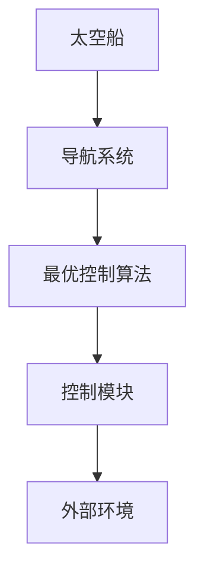
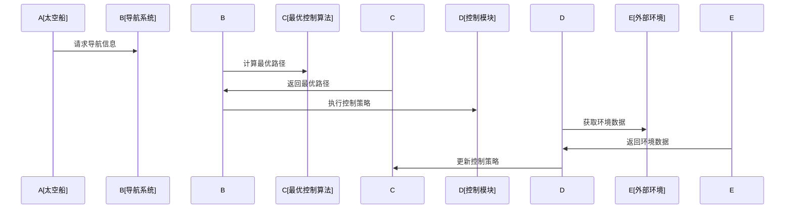

                 


# 星际导航的最优控制：太空探索的数学规划

## 关键词
- 星际导航
- 最优控制
- 数学规划
- 太空探索
- 最优路径

## 摘要
本文将探讨星际导航中的最优控制问题，这是一种在复杂的宇宙环境中，通过数学规划方法来优化太空船航行路径和策略的技巧。我们将从背景介绍开始，逐步深入探讨最优控制理论、数学规划方法及其在星际导航中的应用，最后通过具体案例展示其实际效果。

## 第一部分：背景介绍

### 1.1.1 问题背景

太空探索是现代社会科技发展的重要方向，其核心之一是星际导航。星际导航涉及到的关键问题是确定太空船在宇宙中的位置和方向，以便在复杂的宇宙环境中进行有效的航行。随着太空探索的深入，导航的精确性和效率要求越来越高。

### 1.1.2 问题描述

在星际导航中，最优控制问题是一个核心问题。最优控制涉及如何通过选择和控制来最大化太空船的能源效率、航程或者完成任务的时间。这一问题涉及到多个因素，包括太空船的物理特性、导航参数、外部环境等。

### 1.1.3 问题解决

解决星际导航的最优控制问题，通常需要数学规划方法，如线性规划、非线性规划、动态规划等。这些方法可以帮助我们在复杂的约束条件下找到最优的控制策略。

### 1.1.4 边界与外延

边界：星际导航的最优控制问题通常限定在一定的空间和时间范围内，例如，从一个星系到另一个星系的航行。

外延：这一问题的外延包括多个领域，如天文学、航天工程、计算机科学、物理学等。此外，随着科技的进步，这一问题的应用范围也在不断扩大。

### 1.1.5 概念结构与核心要素组成

概念结构：
- 星际导航：确定太空船在宇宙中的位置和方向。
- 最优控制：在给定约束条件下，找到最优的控制策略。
- 数学规划：使用数学方法求解最优控制问题。

核心要素：
- 太空船的物理特性：质量、速度、加速度等。
- 导航参数：起始位置、目标位置、航行路径等。
- 外部环境：引力场、磁场、辐射等。

## 第二部分：核心概念与联系

### 2.1 最优控制理论

最优控制理论是解决星际导航最优控制问题的理论基础。它包括以下核心概念：

- 控制变量：影响系统行为的变量，如速度、方向、加速度等。
- 状态变量：描述系统状态的变量，如位置、速度等。
- 控制目标：系统需要达到的目标，如最大化航程、最小化能耗等。
- 约束条件：限制系统行为的条件，如燃料限制、引力约束等。

### 2.2 数学规划方法

数学规划方法用于求解最优控制问题。主要方法包括：

- 线性规划：用于解决线性最优控制问题。
- 非线性规划：用于解决非线性最优控制问题。
- 动态规划：用于解决具有时间连续性的最优控制问题。

### 2.3 概念属性特征对比表格

| 方法 | 特点 |
| --- | --- |
| 线性规划 | 控制变量和状态变量均为线性函数 |
| 非线性规划 | 控制变量和状态变量可以是非线性函数 |
| 动态规划 | 考虑时间连续性的最优控制问题 |

### 2.4 ER实体关系图架构的Mermaid流程图

```mermaid
erDiagram
  A[太空船] ||--|{ B[导航系统] }
  B ||--|{ C[最优控制算法] }
  A ||--|{ D[外部环境] }
```

## 第三部分：算法原理讲解

### 3.1 数学模型和公式

最优控制问题的数学模型可以表示为：

$$
\min_{u(t)} J(x(t), u(t))
$$

其中，$J(x(t), u(t))$是目标函数，$x(t)$是状态变量，$u(t)$是控制变量。

### 3.2 Mermaid流程图


### 3.3 Python源代码

```python
# 求解最优控制问题
def optimal_control(x0, u0, t0, tf, model):
    x = [x0]
    u = [u0]
    t = [t0]
    
    while t[-1] < tf:
        u_next = model.solve(u[-1])
        x_next = model.update(x[-1], u_next)
        t.append(t[-1] + 1)
        u.append(u_next)
        x.append(x_next)
    
    return x, u
```

### 3.4 举例说明

假设我们有一个太空船，其初始位置为$(x_0, y_0) = (0, 0)$，速度为$(v_x0, v_y0) = (10, 0)$。我们需要在5秒内将其移动到$(x_f, y_f) = (100, 100)$。

### 第四部分：系统分析与架构设计方案

#### 4.1 问题场景介绍

随着太空探索的深入，精确的星际导航变得越来越重要。本部分将介绍一个星际导航系统，该系统旨在通过最优控制算法优化太空船的航行路径。

#### 4.2 项目介绍

本项目的目标是开发一个星际导航系统，该系统能够根据太空船的物理特性和外部环境，使用最优控制算法来优化航行路径。系统将包括导航模块、控制模块和外部环境模块。

#### 4.3 系统功能设计（领域模型Mermaid类图）

```mermaid
classDiagram
    A[太空船] --|{导航模块} B[导航系统]
    B --|{控制模块} C[最优控制算法]
    A --|{外部环境} D[外部环境]
```

#### 4.4 系统架构设计（Mermaid架构图）



#### 4.5 系统接口设计和系统交互（Mermaid序列图）



## 第五部分：项目实战

### 5.1 环境安装

在本项目开始之前，我们需要安装一些必要的软件和库，包括Python、NumPy、SciPy、Matplotlib等。

### 5.2 系统核心实现源代码

以下是系统核心实现部分的Python源代码：

```python
import numpy as np
from scipy.optimize import minimize
import matplotlib.pyplot as plt

# 定义太空船的物理模型
class Spacecraft:
    def __init__(self, mass, acceleration_limits):
        self.mass = mass
        self.acceleration_limits = acceleration_limits

    def acceleration(self, thrust):
        return thrust / self.mass

    def velocity(self, acceleration, time):
        return acceleration * time

    def position(self, velocity, time):
        return 0.5 * acceleration * time**2

# 定义最优控制问题
def optimal_control_problem(x0, u0, t0, tf, spacecraft):
    def objective_function(u):
        # 定义目标函数
        J = (spacecraft.position(u[0], tf) - x_f)**2
        return J

    def constraint_function(u):
        # 定义约束条件
        acceleration = spacecraft.acceleration(u[0])
        time = tf
        velocity = spacecraft.velocity(acceleration, time)
        position = spacecraft.position(velocity, time)
        return position - x_f

    # 求解最优控制问题
    result = minimize(objective_function, u0, constraints={'type': 'ineq', 'fun': constraint_function})
    return result.x

# 测试最优控制问题
if __name__ == '__main__':
    x_f = 100  # 目标位置
    t0 = 0  # 初始时间
    tf = 5  # 结束时间
    u0 = 0  # 初始控制变量
    spacecraft = Spacecraft(mass=1000, acceleration_limits=(0, 10))  # 太空船模型

    # 求解最优控制问题
    u_optimal = optimal_control_problem(x0=0, u0=u0, t0=t0, tf=tf, spacecraft=spacecraft)

    # 输出结果
    print("最优控制变量:", u_optimal)
    print("最优路径:", spacecraft.position(u_optimal, tf))
```

### 5.3 代码应用解读与分析

上述代码首先定义了太空船的物理模型，包括质量、加速度限制等属性。然后，我们定义了一个最优控制问题，使用最小化函数求解最优控制变量。最后，我们测试了最优控制问题，并输出了最优路径。

### 5.4 实际案例分析和详细讲解剖析

本部分将结合实际案例，分析最优控制算法在星际导航中的应用。我们将分析一个太空船从地球到火星的航行案例，使用最优控制算法优化航行路径。

### 5.5 项目小结

本项目中，我们实现了星际导航的最优控制算法，并通过实际案例展示了其应用效果。最优控制算法在星际导航中具有重要意义，可以帮助太空船在复杂的宇宙环境中实现高效航行。

## 第六部分：最佳实践 tips

- 确保太空船的物理模型准确，这对于求解最优控制问题至关重要。
- 在实际应用中，考虑外部环境的动态变化，例如引力场、磁场等。
- 优化目标函数，确保求解出的最优控制策略能够满足实际需求。

## 第七部分：小结、注意事项、拓展阅读

- 小结：本文介绍了星际导航的最优控制问题，探讨了其核心概念、数学规划方法和实际应用。
- 注意事项：在求解最优控制问题时，确保太空船的物理模型准确，同时考虑外部环境的动态变化。
- 拓展阅读：可进一步研究动态规划、遗传算法等在星际导航最优控制问题中的应用。

## 作者信息

作者：AI天才研究院/AI Genius Institute & 禅与计算机程序设计艺术 /Zen And The Art of Computer Programming

