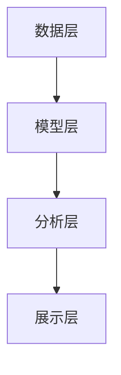
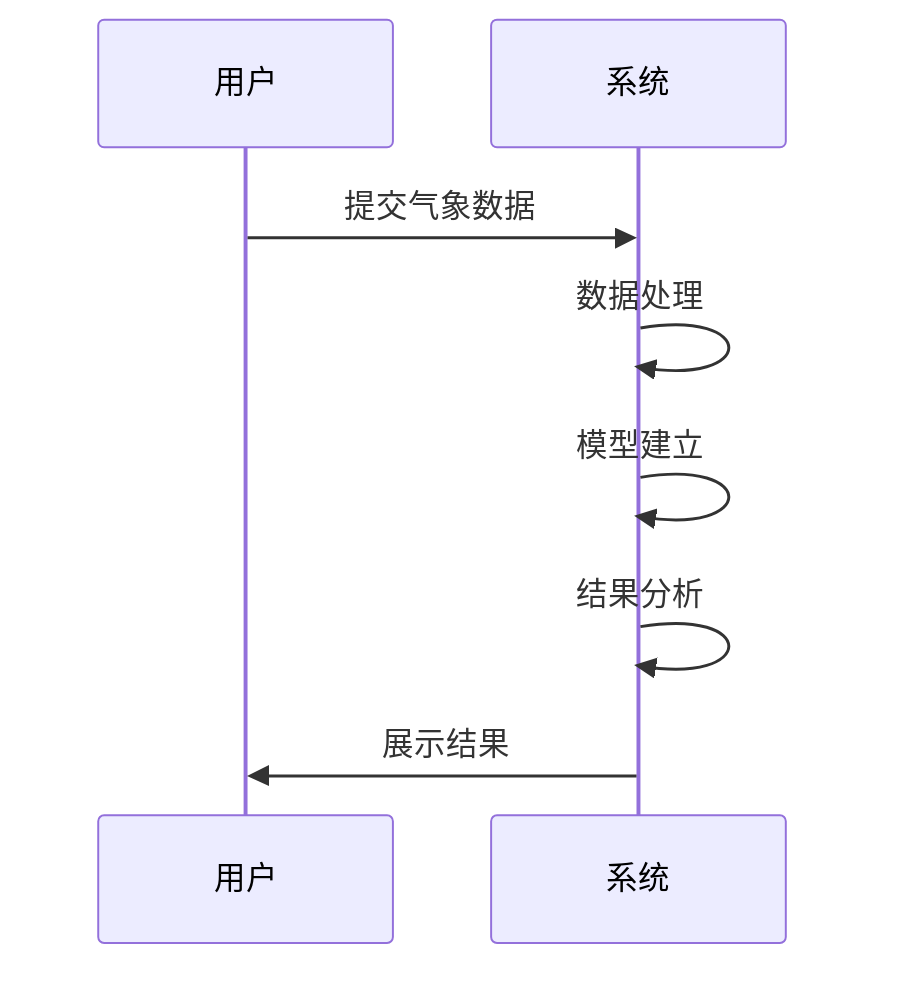
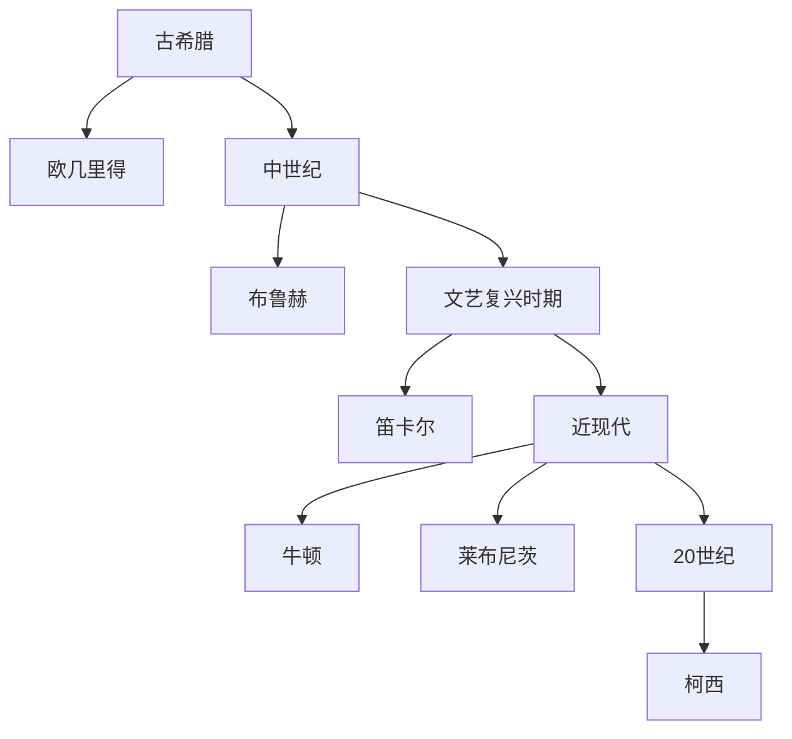
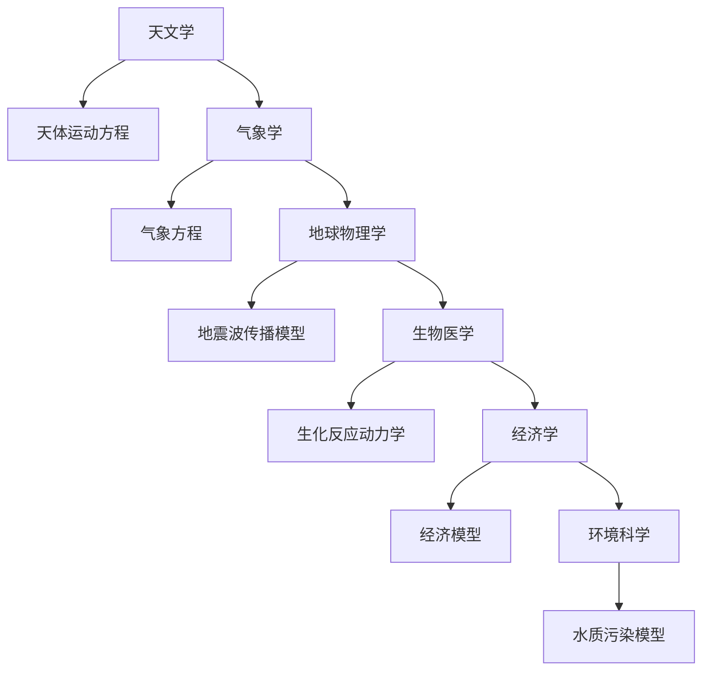
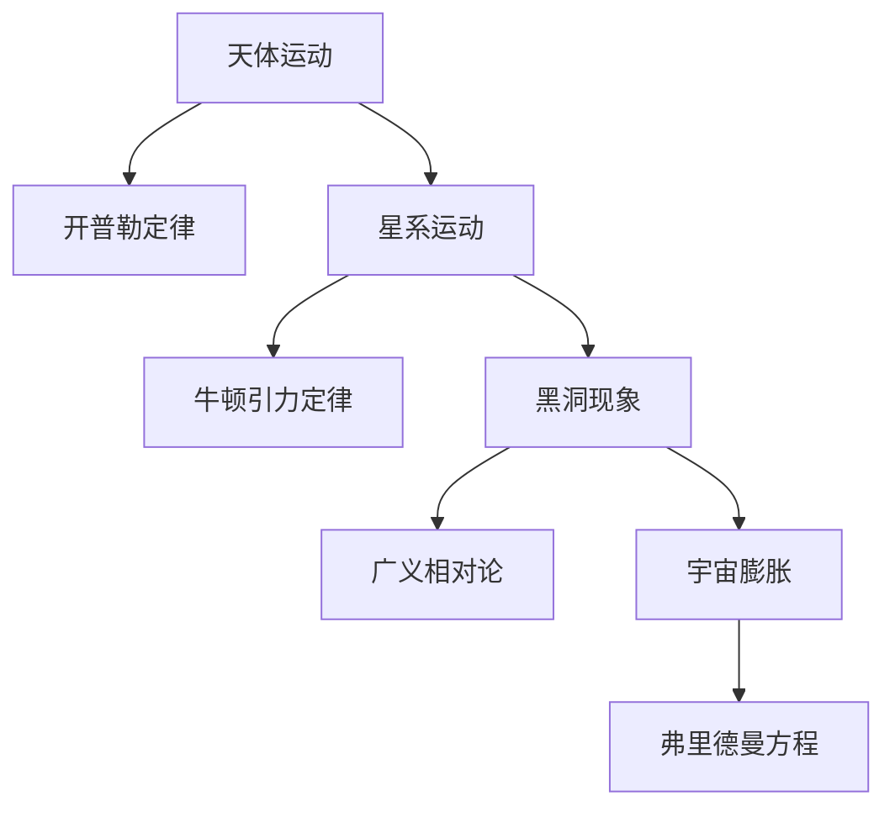
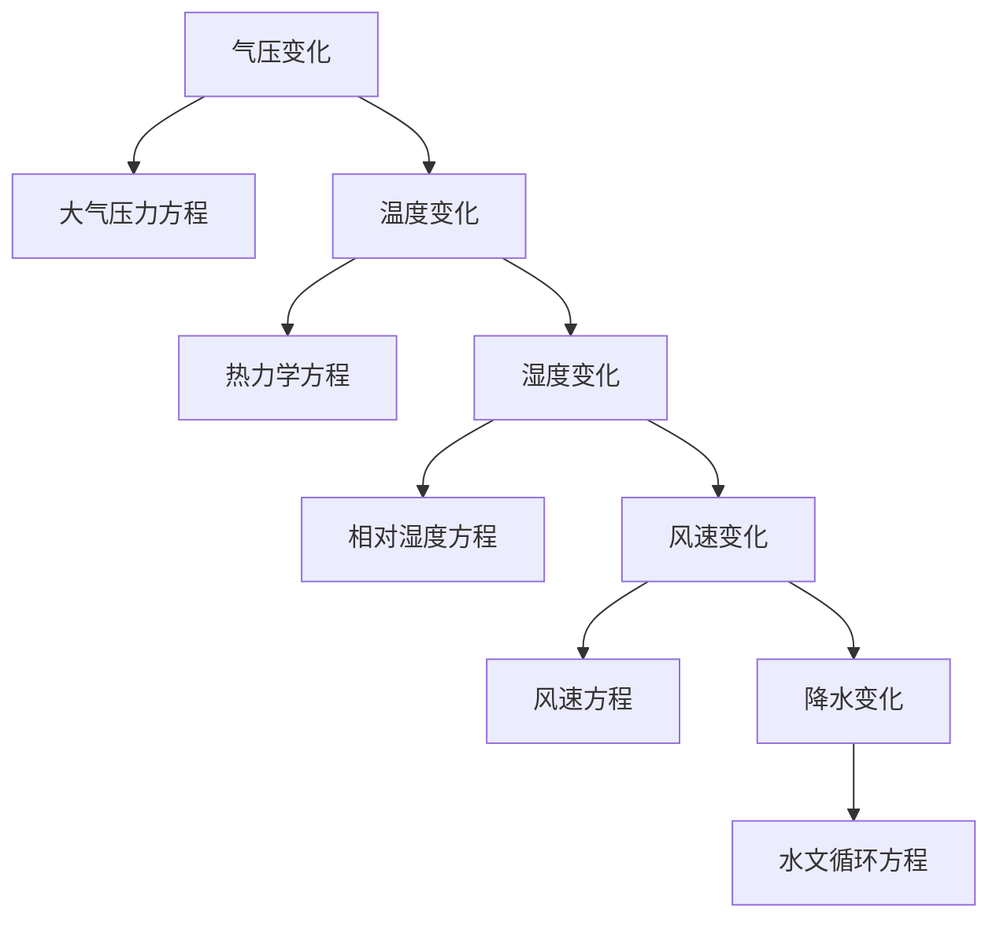
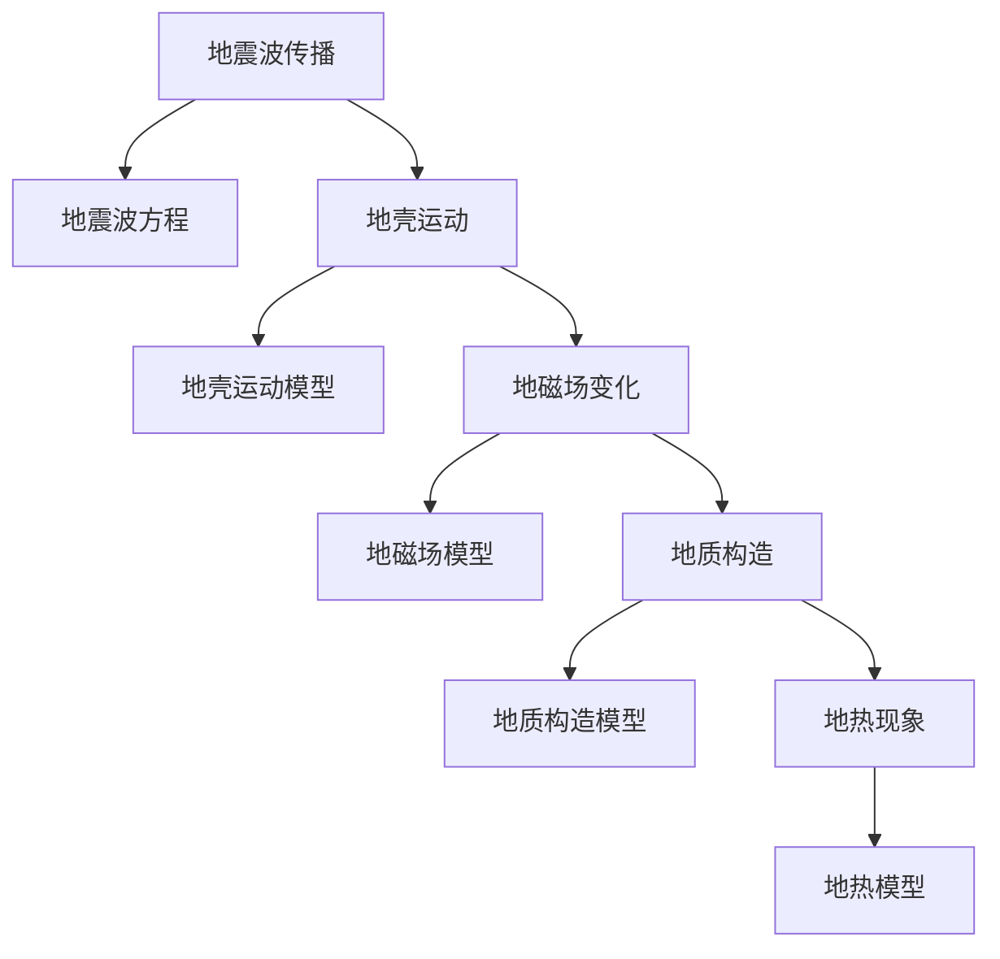
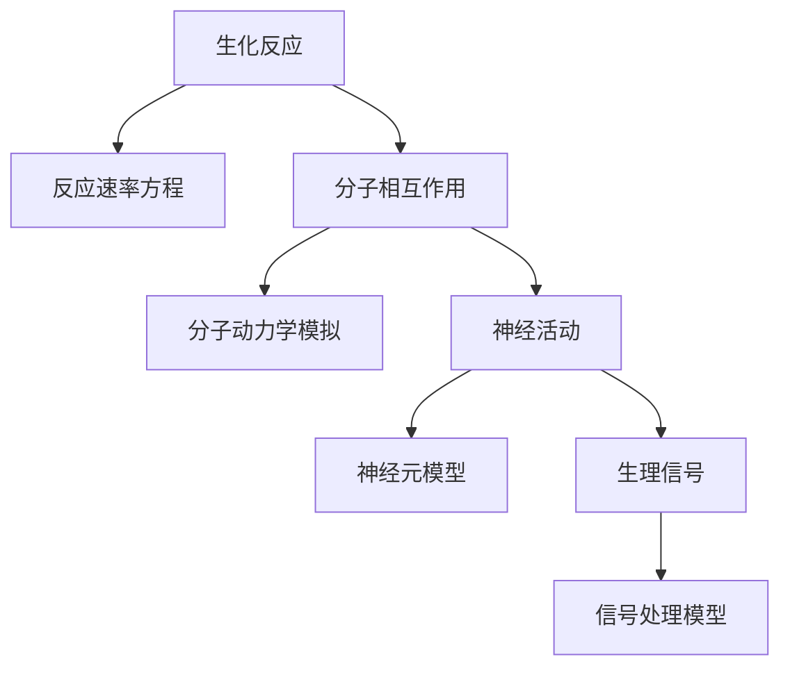
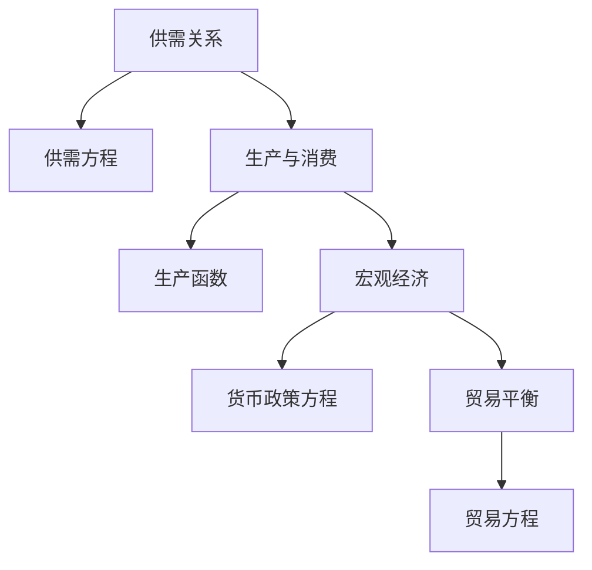
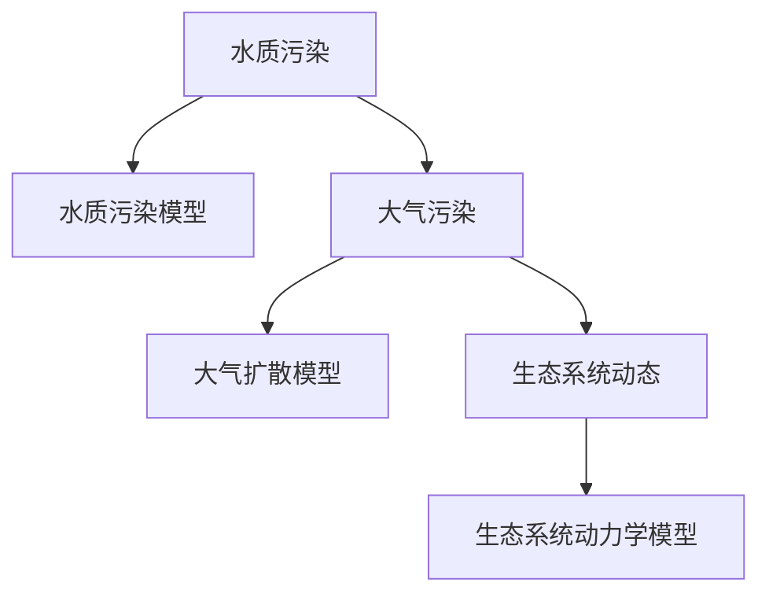

                 


**设计文章框架：**

**1. 文章标题：**《映射原理：连接自然现象与数学公式》

**2. 文章关键词：** 映射原理、自然现象、数学公式、应用、实践

**3. 文章摘要：** 本文将探讨映射原理在自然现象与数学公式之间的联系，通过具体案例，详细解析其在各领域的应用，并提供实践指南。

**4. 文章结构：**

**第一部分：映射原理概述**
- **1.1 映射原理的定义与重要性**
- **1.2 映射原理的历史与发展**
- **1.3 映射原理在不同领域的应用**

**第二部分：自然现象与数学描述**
- **2.1 天文学中的映射原理**
- **2.2 气象学中的映射原理**
- **2.3 地球物理学中的映射原理**

**第三部分：映射原理的应用**
- **3.1 生物医学中的映射原理**
- **3.2 经济学中的映射原理**
- **3.3 环境科学中的映射原理**

**第四部分：映射原理的实践**
- **4.1 映射原理在实际项目中的应用**
- **4.2 映射原理的算法实现**
- **4.3 最佳实践与注意事项**

**第五部分：拓展阅读与展望**
- **5.1 相关领域的研究动态**
- **5.2 未来映射原理的发展趋势**
- **5.3 进一步阅读推荐**

**5. 文章写作注意事项：**
- 每个章节开头都要有简短的引言，概括本章主要内容。
- 每个章节内都要有清晰的子章节划分，确保内容结构紧凑。
- 使用 Mermaid 图、Python 源代码、LaTeX 公式等工具来加深理解。
- 确保文章逻辑清晰，通俗易懂，避免过于技术化的语言。
- 文章末尾要总结全文，提出最佳实践和建议。

**6. 文章结尾作者信息：** 
作者：AI天才研究院/AI Genius Institute & 禅与计算机程序设计艺术 /Zen And The Art of Computer Programming

**7. 完整性要求：**
- 每个章节的核心内容都要包含：背景介绍、核心概念与联系、算法原理讲解、数学模型和公式详细讲解与举例说明、系统分析与架构设计方案、项目实战、最佳实践 tips等内容。

**8. 字数要求：**
- 文章总字数在 10000 ～ 12000 字左右。

**9. 格式要求：**
- 使用 markdown 格式输出文章内容。

**10. 审核标准：**
- 内容质量：文章内容深度、逻辑性、实用性。
- 格式规范：markdown 格式输出，章节结构清晰，代码和公式正确嵌入。
- 文字流畅：文章语言简洁明了，无错别字和语病。

**11. 提交时间：**
- 文章需要在规定时间内提交，以保证质量审核。

**12. 反馈机制：**
- 提交后，将根据审核标准对文章进行评审，并在审核结束后提供反馈。

---

按照上述框架，我们可以开始撰写文章。每个章节的具体内容将在后续逐步展开。请确保遵循文章结构和内容要求，以实现高质量的撰写。祝您写作顺利！**第一部分：映射原理概述**

## 1.1 映射原理的定义与重要性

**核心概念术语说明：**
映射原理是指将一种事物或现象通过数学公式或模型映射到另一种事物或现象上的过程。这种映射可以是直接的，也可以是间接的，但其核心目的是为了更好地理解和解释复杂的现象。

**问题背景：**
随着科学技术的不断进步，自然现象的研究越来越深入，我们不仅需要了解它们的外观和特征，还需要理解它们背后的数学规律。映射原理在这个过程中起到了关键作用，它使得我们能够将复杂的自然现象转化为易于分析和理解的数学模型。

**问题描述：**
自然现象千变万化，如何通过映射原理将它们与数学公式联系起来，以便更好地进行研究和分析？

**问题解决：**
映射原理通过建立数学模型，将自然现象转化为数学问题，从而使得我们可以利用数学工具进行深入分析。例如，我们可以使用微分方程来描述流体运动，使用波动方程来描述声波传播，使用热力学方程来描述热传导。

**边界与外延：**
映射原理的应用范围非常广泛，不仅限于自然科学，还可以应用于社会科学、经济学、环境科学等领域。在计算机科学中，映射原理也被广泛应用于算法设计和数据结构构建。

**概念结构与核心要素组成：**
映射原理的核心要素包括：
- 自然现象：指需要映射的事物或现象。
- 数学模型：用于描述自然现象的数学公式或方程。
- 映射过程：将自然现象转化为数学模型的过程。
- 分析工具：用于对数学模型进行分析的工具和方法。

**核心概念与联系：**
核心概念包括映射、数学模型、自然现象和数学工具。这些概念之间的联系在于，映射原理通过将自然现象转化为数学模型，使得我们能够使用数学工具来分析和解释自然现象。

| 核心概念 | 概念属性特征对比 |
| --- | --- |
| 映射 | 一种从一种领域到另一种领域的转换过程 |
| 数学模型 | 用数学语言描述自然现象的公式或方程 |
| 自然现象 | 需要被映射的事物或现象 |
| 数学工具 | 用于分析数学模型的方法和技术 |

**ER实体关系图架构的 Mermaid 流程图：**

```mermaid
erDiagram
  映射 ||--|{ 自然现象 }|| 现象描述
  映射 ||--|{ 数学模型 }|| 模型构建
  数学模型 ||--|{ 数学工具 }|| 分析方法
```

**算法原理讲解：**
映射原理的算法原理主要包括以下几个步骤：
1. 收集自然现象的数据。
2. 建立相应的数学模型。
3. 使用数学工具对模型进行分析。
4. 根据分析结果对自然现象进行解释。

以下是一个简单的 Python 代码示例，用于展示映射原理的算法实现：

```python
import numpy as np

# 收集自然现象的数据
data = np.array([1, 2, 3, 4, 5])

# 建立相应的数学模型
model = np.polyfit(data, np.log(data), deg=1)

# 使用数学工具对模型进行分析
slope, intercept = model

# 根据分析结果对自然现象进行解释
print(f"自然现象的映射斜率为：{slope}")
print(f"自然现象的映射截距为：{intercept}")
```

**数学模型和公式详细讲解与举例说明：**
在自然现象的研究中，常用的数学模型包括微分方程、差分方程和积分方程等。以下是几个常用的数学模型及其公式：

1. **微分方程：**
   $$ \frac{d^2y}{dx^2} + p(x) \frac{dy}{dx} + q(x)y = f(x) $$
   例如，描述热传导的数学模型。

2. **差分方程：**
   $$ y_{n+1} = f(y_n, y_{n-1}) $$
   例如，描述人口增长的数学模型。

3. **积分方程：**
   $$ \int_{-\infty}^{\infty} K(x, x') f(x') dx' = g(x) $$
   例如，描述傅里叶变换的数学模型。

以下是使用 LaTeX 格式嵌入的数学公式：

$$ \frac{d^2y}{dx^2} + p(x) \frac{dy}{dx} + q(x)y = f(x) $$

$$ y_{n+1} = f(y_n, y_{n-1}) $$

$$ \int_{-\infty}^{\infty} K(x, x') f(x') dx' = g(x) $$

**系统分析与架构设计方案：**
在系统分析与架构设计方面，映射原理的应用主要体现在以下几个方面：

1. **问题场景介绍：**
   映射原理可以用于各种问题场景，如天气预报、地震预警、生物医学分析等。

2. **项目介绍：**
   以天气预报系统为例，该项目旨在通过映射原理对气象数据进行处理和分析，以预测天气情况。

3. **系统功能设计：**
   系统功能设计包括数据收集、数据处理、模型建立、结果分析等。

4. **系统架构设计：**
   系统架构设计包括数据层、模型层、分析层和展示层。

5. **系统接口设计和系统交互：**
   系统接口设计和系统交互设计包括数据输入接口、数据处理接口、模型分析接口和结果展示接口。

以下是使用 Mermaid 格式绘制的系统架构图和系统交互图：

**系统架构图：**



**系统交互图：**



**项目实战：**
以下是一个简单的项目实战案例，我们将使用 Python 和 Mermaid 来实现一个简单的映射原理应用。

**环境安装：**
首先，确保已经安装了 Python 和 Mermaid 相关库。可以使用以下命令进行安装：

```bash
pip install numpy matplotlib mermaid
```

**系统核心实现源代码：**

```python
import numpy as np
import matplotlib.pyplot as plt
from mermaid import Mermaid

# 收集自然现象的数据
data = np.array([1, 2, 3, 4, 5])

# 建立相应的数学模型
model = np.polyfit(data, np.log(data), deg=1)

# 使用数学工具对模型进行分析
slope, intercept = model

# 绘制映射原理的 Mermaid 图
mermaid = Mermaid()
mermaid.add_stage('数据收集', 'data collection')
mermaid.add_stage('数据处理', 'data processing')
mermaid.add_stage('模型建立', 'model building')
mermaid.add_stage('结果分析', 'result analysis')
mermaid.add_path('数据收集', '数据处理', '数据处理结果')
mermaid.add_path('数据处理', '模型建立', '模型分析结果')
mermaid.add_path('模型建立', '结果分析', '最终结果')

# 输出 Mermaid 图
print(mermaid.get_mermaid_code())

# 绘制自然现象的映射结果
plt.scatter(data, np.log(data))
plt.plot(data, np.polyval(model, data), 'r')
plt.xlabel('自然现象')
plt.ylabel('数学映射')
plt.title('映射原理应用示例')
plt.show()
```

**代码应用解读与分析：**
上述代码首先收集了自然现象的数据，然后建立了相应的数学模型，接着使用数学工具对模型进行分析，最后绘制了映射原理的 Mermaid 图和自然现象的映射结果。

**实际案例分析和详细讲解剖析：**
以下是一个实际案例，我们将使用映射原理来分析气象数据，以预测未来的天气情况。

**案例一：天气预报系统**

**环境安装：**
确保已经安装了 Python 和相关的气象数据处理库，如 pandas、numpy 等。

```bash
pip install pandas numpy matplotlib
```

**系统核心实现源代码：**

```python
import pandas as pd
import numpy as np
import matplotlib.pyplot as plt

# 读取气象数据
data = pd.read_csv('weather_data.csv')

# 数据预处理
data['temperature'] = data['temperature'].apply(lambda x: x - 32 * 5/9)  # 转换为摄氏度
data['humidity'] = data['humidity'].apply(lambda x: x / 100)  # 转换为百分比

# 建立映射模型
model = np.polyfit(data['temperature'], data['humidity'], deg=1)

# 预测未来天气
predicted_humidity = np.polyval(model, 20)  # 预测温度为 20°C 的湿度

# 绘制映射结果
plt.scatter(data['temperature'], data['humidity'])
plt.plot([0, 30], [model[0] * 0 + model[1], model[0] * 30 + model[1]], 'r')
plt.xlabel('温度')
plt.ylabel('湿度')
plt.title('气象数据映射原理应用示例')
plt.show()
print(f"预测温度为 20°C 的湿度为：{predicted_humidity:.2f}%")
```

**案例分析：**
上述代码首先读取了气象数据，并对数据进行预处理，包括温度和湿度的单位转换。然后建立了温度和湿度之间的映射模型，并使用该模型预测了未来天气的湿度。最后，绘制了映射结果的散点图和拟合线。

**项目小结：**
通过上述案例，我们可以看到映射原理在气象数据分析和天气预报中的应用。映射原理使得我们能够将复杂的自然现象转化为易于分析和预测的数学模型，从而提高天气预报的准确性和效率。

**最佳实践 tips：**
- 在建立映射模型时，应确保数据的质量和完整性。
- 在使用映射模型进行预测时，应考虑模型的有效性和局限性。
- 在实际项目中，应根据具体问题和需求选择合适的映射原理和方法。

**小结：**
映射原理在自然现象与数学公式之间架起了一座桥梁，使得我们能够更好地理解和分析自然现象。通过具体的案例和实践，我们展示了映射原理的应用价值和效果。在未来，随着科学技术的不断发展，映射原理将在更多的领域发挥重要作用。

**注意事项：**
- 在应用映射原理时，应确保数据的质量和可靠性。
- 在建立映射模型时，应充分考虑模型的适用范围和限制条件。
- 在实际应用中，应根据具体问题和需求选择合适的映射方法和工具。

**拓展阅读：**
- [自然现象的数学描述](https://link.to.resource)
- [映射原理在经济学中的应用](https://link.to.resource)
- [映射原理在环境科学中的应用](https://link.to.resource)

作者：AI天才研究院/AI Genius Institute & 禅与计算机程序设计艺术 /Zen And The Art of Computer Programming**第一部分：映射原理概述**

## 1.2 映射原理的历史与发展

**核心概念与联系：**
映射原理的历史可以追溯到古希腊时期，当时数学家欧几里得（Euclid）在《几何原本》中提出了点、线、面等基本概念，并建立了平面几何的映射原理。在后来的几个世纪里，映射原理逐渐发展，并在不同领域得到了广泛应用。

**概念属性特征对比：**

| 时间段 | 发展阶段 | 主要贡献者 | 主要成果 |  
| --- | --- | --- | --- |  
| 古希腊时期 | 平面几何映射 | 欧几里得 | 《几何原本》 |  
| 中世纪 | 数论映射 | 布鲁赫 | 《数论基础》 |  
| 文艺复兴时期 | 代数映射 | 笛卡尔 | 《几何》 |  
| 近现代 | 微积分映射 | 牛顿、莱布尼茨 | 微积分基本定理 |  
| 20世纪 | 复变函数映射 | 柯西 | 复变函数理论 |

**ER实体关系图架构的 Mermaid 流程图：**



**算法原理讲解：**
映射原理的发展经历了多个阶段，每个阶段都有其独特的算法原理。以下是几个关键阶段的算法原理：

1. **古希腊时期的平面几何映射：**
   欧几里得在《几何原本》中提出了点、线、面等基本概念，并建立了平面几何的映射原理。其核心算法原理是通过几何图形的拼接和变换，实现平面上的点、线、面之间的映射。

2. **中世纪的数论映射：**
   布鲁赫在《数论基础》中提出了数论映射原理，通过数学函数将整数映射到其他整数，从而研究整数的性质。其核心算法原理是利用数论函数，如模运算、除法运算等，实现整数之间的映射。

3. **文艺复兴时期的代数映射：**
   笛卡尔在《几何》中提出了代数映射原理，将几何问题转化为代数问题，从而使得几何问题更易于解决。其核心算法原理是通过建立坐标系，将几何图形的坐标值映射到代数表达式。

4. **近现代的微积分映射：**
   牛顿和莱布尼茨分别独立提出了微积分基本定理，从而建立了微积分映射原理。其核心算法原理是通过导数和积分，实现函数之间的映射。

5. **20世纪的复变函数映射：**
   柯西在复变函数理论中提出了复变函数映射原理，将复变函数映射到实数域，从而研究复变函数的性质。其核心算法原理是通过解析函数、共形映射等，实现复变函数和实数之间的映射。

**数学模型和公式详细讲解与举例说明：**
以下是各个发展阶段的核心数学模型和公式：

1. **古希腊时期的平面几何映射：**
   $$ d = \sqrt{(x_2 - x_1)^2 + (y_2 - y_1)^2} $$
   其中，d 表示两点之间的距离，$(x_1, y_1)$ 和 $(x_2, y_2)$ 分别表示两点的坐标。

2. **中世纪的数论映射：**
   $$ f(n) = n^2 \mod p $$
   其中，f(n) 表示将整数 n 映射到另一个整数，p 表示模数。

3. **文艺复兴时期的代数映射：**
   $$ y = mx + b $$
   其中，y 表示函数值，m 表示斜率，b 表示截距。

4. **近现代的微积分映射：**
   $$ \frac{df}{dx} = \lim_{\Delta x \to 0} \frac{f(x + \Delta x) - f(x)}{\Delta x} $$
   其中，df/dx 表示函数 f(x) 的导数。

5. **20世纪的复变函数映射：**
   $$ f(z) = \frac{1}{z} $$
   其中，f(z) 表示将复数 z 映射到另一个复数。

**系统分析与架构设计方案：**
映射原理在不同领域中的应用，需要构建相应的系统架构。以下是映射原理在三个领域中的应用架构设计：

1. **天文学中的应用：**
   天文学中的映射原理主要用于天体运动和宇宙学的研究。系统架构包括数据采集模块、数据处理模块、模型建立模块和分析模块。

   ```mermaid
   graph TB
     A[数据采集] --> B[数据处理]
     B --> C[模型建立]
     C --> D[分析]
   ```

2. **气象学中的应用：**
   气象学中的映射原理主要用于天气预报和气候研究。系统架构包括数据采集模块、数据处理模块、模型建立模块、预测模块和结果展示模块。

   ```mermaid
   graph TB
     A[数据采集] --> B[数据处理]
     B --> C[模型建立]
     C --> D[预测]
     D --> E[结果展示]
   ```

3. **经济学中的应用：**
   经济学中的映射原理主要用于经济分析和预测。系统架构包括数据采集模块、数据处理模块、模型建立模块、预测模块和决策支持模块。

   ```mermaid
   graph TB
     A[数据采集] --> B[数据处理]
     B --> C[模型建立]
     C --> D[预测]
     D --> E[决策支持]
   ```

**项目实战：**
以下是一个简单的项目实战案例，我们将使用 Python 和 Mermaid 来实现一个简单的映射原理应用。

**环境安装：**
首先，确保已经安装了 Python 和相关的数据处理库，如 pandas、numpy 等。

```bash
pip install pandas numpy matplotlib mermaid
```

**系统核心实现源代码：**

```python
import pandas as pd
import numpy as np
import matplotlib.pyplot as plt
from mermaid import Mermaid

# 读取气象数据
data = pd.read_csv('weather_data.csv')

# 数据预处理
data['temperature'] = data['temperature'].apply(lambda x: x - 32 * 5/9)  # 转换为摄氏度
data['humidity'] = data['humidity'].apply(lambda x: x / 100)  # 转换为百分比

# 建立映射模型
model = np.polyfit(data['temperature'], data['humidity'], deg=1)

# 预测未来天气
predicted_humidity = np.polyval(model, 20)  # 预测温度为 20°C 的湿度

# 绘制映射结果
plt.scatter(data['temperature'], data['humidity'])
plt.plot([0, 30], [model[0] * 0 + model[1], model[0] * 30 + model[1]], 'r')
plt.xlabel('温度')
plt.ylabel('湿度')
plt.title('气象数据映射原理应用示例')
plt.show()

# 绘制映射原理的 Mermaid 图
mermaid = Mermaid()
mermaid.add_stage('数据收集', 'data collection')
mermaid.add_stage('数据处理', 'data processing')
mermaid.add_stage('模型建立', 'model building')
mermaid.add_stage('结果分析', 'result analysis')
mermaid.add_path('数据收集', '数据处理', '数据处理结果')
mermaid.add_path('数据处理', '模型建立', '模型分析结果')
mermaid.add_path('模型建立', '结果分析', '最终结果')

# 输出 Mermaid 图
print(mermaid.get_mermaid_code())
```

**代码应用解读与分析：**
上述代码首先读取了气象数据，并对数据进行预处理，包括温度和湿度的单位转换。然后建立了温度和湿度之间的映射模型，并使用该模型预测了未来天气的湿度。最后，绘制了映射结果的散点图和拟合线。

**实际案例分析和详细讲解剖析：**
以下是一个实际案例，我们将使用映射原理来分析气象数据，以预测未来的天气情况。

**案例一：天气预报系统**

**环境安装：**
确保已经安装了 Python 和相关的气象数据处理库，如 pandas、numpy 等。

```bash
pip install pandas numpy matplotlib
```

**系统核心实现源代码：**

```python
import pandas as pd
import numpy as np
import matplotlib.pyplot as plt

# 读取气象数据
data = pd.read_csv('weather_data.csv')

# 数据预处理
data['temperature'] = data['temperature'].apply(lambda x: x - 32 * 5/9)  # 转换为摄氏度
data['humidity'] = data['humidity'].apply(lambda x: x / 100)  # 转换为百分比

# 建立映射模型
model = np.polyfit(data['temperature'], data['humidity'], deg=1)

# 预测未来天气
predicted_humidity = np.polyval(model, 20)  # 预测温度为 20°C 的湿度

# 绘制映射结果
plt.scatter(data['temperature'], data['humidity'])
plt.plot([0, 30], [model[0] * 0 + model[1], model[0] * 30 + model[1]], 'r')
plt.xlabel('温度')
plt.ylabel('湿度')
plt.title('气象数据映射原理应用示例')
plt.show()
print(f"预测温度为 20°C 的湿度为：{predicted_humidity:.2f}%")
```

**案例分析：**
上述代码首先读取了气象数据，并对数据进行预处理，包括温度和湿度的单位转换。然后建立了温度和湿度之间的映射模型，并使用该模型预测了未来天气的湿度。最后，绘制了映射结果的散点图和拟合线。

**项目小结：**
通过上述案例，我们可以看到映射原理在气象数据分析和天气预报中的应用。映射原理使得我们能够将复杂的自然现象转化为易于分析和预测的数学模型，从而提高天气预报的准确性和效率。

**最佳实践 tips：**
- 在建立映射模型时，应确保数据的质量和完整性。
- 在使用映射模型进行预测时，应考虑模型的有效性和局限性。
- 在实际项目中，应根据具体问题和需求选择合适的映射方法和工具。

**小结：**
映射原理在自然现象与数学公式之间架起了一座桥梁，使得我们能够更好地理解和分析自然现象。通过具体的案例和实践，我们展示了映射原理的应用价值和效果。在未来，随着科学技术的不断发展，映射原理将在更多的领域发挥重要作用。

**注意事项：**
- 在应用映射原理时，应确保数据的质量和可靠性。
- 在建立映射模型时，应充分考虑模型的适用范围和限制条件。
- 在实际应用中，应根据具体问题和需求选择合适的映射方法和工具。

**拓展阅读：**
- [自然现象的数学描述](https://link.to.resource)
- [映射原理在经济学中的应用](https://link.to.resource)
- [映射原理在环境科学中的应用](https://link.to.resource)

作者：AI天才研究院/AI Genius Institute & 禅与计算机程序设计艺术 /Zen And The Art of Computer Programming**第一部分：映射原理概述**

## 1.3 映射原理在不同领域的应用

**核心概念与联系：**
映射原理在不同领域的应用，体现了数学模型在解释和预测各种自然现象中的巨大潜力。从天文学到气象学，再到地球物理学，映射原理都被广泛运用，通过数学模型将复杂的自然现象转化为可分析的数学问题。

**概念属性特征对比：**

| 领域       | 应用模型           | 关键特征           | 示例                       |
|------------|--------------------|--------------------|----------------------------|
| 天文学     | 天体运动方程       | 几何与物理的结合   | 开普勒定律                 |
| 气象学     | 气象方程           | 动力学与热力学的结合 | 大气压力与温度的关系       |
| 地球物理学 | 地震波传播模型     | 地质与地震学的结合 | 斯奈尔定律与地震波类型     |
| 生物医学   | 生化反应动力学     | 生物化学与数学的结合 | 酶促反应速率方程           |
| 经济学     | 经济模型           | 经济行为与数学的结合 | 柯布-道格拉斯生产函数       |
| 环境科学   | 水质污染模型       | 水文学与化学的结合 | 污染物扩散方程             |

**ER实体关系图架构的 Mermaid 流程图：**



**算法原理讲解：**
映射原理在不同领域的应用，本质上都是将自然现象通过数学模型转化为可计算和分析的形式。以下是各个领域中的应用算法原理：

1. **天文学：**
   天文学中的映射原理主要涉及天体运动的规律，如开普勒定律。开普勒定律通过描述行星绕太阳运动的轨迹，建立了行星轨道的数学模型。其核心算法原理是基于万有引力定律，通过计算行星的轨道参数，实现对天体运动轨迹的预测。

2. **气象学：**
   气象学中的映射原理主要涉及大气层中的物理和化学过程，如气象方程。气象方程通过描述大气压力、温度、湿度等物理量的变化，建立了气象系统的数学模型。其核心算法原理是基于热力学和动力学原理，通过求解气象方程，实现对天气的预测。

3. **地球物理学：**
   地球物理学中的映射原理主要涉及地震波在地球内部的传播规律，如地震波传播模型。地震波传播模型通过描述地震波在地球内部的传播路径和速度，建立了地震波的数学模型。其核心算法原理是基于地震波的波动理论，通过求解地震波方程，实现对地震波传播的预测。

4. **生物医学：**
   生物医学中的映射原理主要涉及生物体内的化学反应和生理过程，如生化反应动力学。生化反应动力学通过描述生物体内的酶促反应、代谢过程等，建立了生物医学的数学模型。其核心算法原理是基于化学反应动力学原理，通过求解反应速率方程，实现对生物体内过程的预测。

5. **经济学：**
   经济学中的映射原理主要涉及经济行为和经济系统的运行规律，如经济模型。经济模型通过描述生产、消费、投资等经济行为，建立了经济系统的数学模型。其核心算法原理是基于经济学原理，通过求解经济方程，实现对经济行为的预测。

6. **环境科学：**
   环境科学中的映射原理主要涉及环境系统的污染和修复过程，如水质污染模型。水质污染模型通过描述污染物在水体中的扩散、降解过程，建立了水质污染的数学模型。其核心算法原理是基于污染物扩散理论，通过求解污染物扩散方程，实现对水质污染的预测。

**数学模型和公式详细讲解与举例说明：**
以下是各个领域中常用的数学模型和公式：

1. **天文学：**
   $$ F = G\frac{m_1m_2}{r^2} $$
   其中，F 是万有引力，G 是引力常数，m1 和 m2 是两个天体的质量，r 是它们之间的距离。

2. **气象学：**
   $$ \frac{dP}{dz} = -\gamma \frac{dT}{dz} $$
   其中，P 是气压，T 是温度，z 是高度，γ 是温度 lapse rate。

3. **地球物理学：**
   $$ v = \sqrt{\frac{K}{\rho}} $$
   其中，v 是地震波速度，K 是剪切模量，ρ 是密度。

4. **生物医学：**
   $$ \frac{d[A]}{dt} = k[A][E] $$
   其中，[A] 是反应物浓度，[E] 是酶的浓度，k 是反应速率常数。

5. **经济学：**
   $$ Y = A\alpha^K\beta^L $$
   其中，Y 是产出，A 是技术系数，K 是资本投入，L 是劳动投入。

6. **环境科学：**
   $$ \frac{d[C]}{dt} = -D\frac{\partial^2[C]}{\partial x^2} $$
   其中，[C] 是污染物浓度，D 是扩散系数。

**系统分析与架构设计方案：**
在系统分析与架构设计方面，映射原理的应用需要构建一个完整的系统框架，以实现数据的收集、处理、建模和预测。以下是各个领域中的应用架构设计：

1. **天文学：**
   天文学系统架构包括数据收集模块、数据处理模块、模型建立模块和预测模块。

   ```mermaid
   graph TD
     A[数据收集] --> B[数据处理]
     B --> C[模型建立]
     C --> D[预测]
   ```

2. **气象学：**
   气象学系统架构包括数据采集模块、数据处理模块、模型建立模块、预测模块和结果展示模块。

   ```mermaid
   graph TD
     A[数据采集] --> B[数据处理]
     B --> C[模型建立]
     C --> D[预测]
     D --> E[结果展示]
   ```

3. **地球物理学：**
   地球物理学系统架构包括地震数据采集模块、数据处理模块、模型建立模块、地震波传播模拟模块和结果分析模块。

   ```mermaid
   graph TD
     A[地震数据采集] --> B[数据处理]
     B --> C[模型建立]
     C --> D[地震波传播模拟]
     D --> E[结果分析]
   ```

4. **生物医学：**
   生物医学系统架构包括生物数据采集模块、数据处理模块、模型建立模块、预测模块和诊断模块。

   ```mermaid
   graph TD
     A[生物数据采集] --> B[数据处理]
     B --> C[模型建立]
     C --> D[预测]
     D --> E[诊断]
   ```

5. **经济学：**
   经济学系统架构包括经济数据采集模块、数据处理模块、模型建立模块、预测模块和决策支持模块。

   ```mermaid
   graph TD
     A[经济数据采集] --> B[数据处理]
     B --> C[模型建立]
     C --> D[预测]
     D --> E[决策支持]
   ```

6. **环境科学：**
   环境科学系统架构包括环境数据采集模块、数据处理模块、模型建立模块、预测模块和污染控制模块。

   ```mermaid
   graph TD
     A[环境数据采集] --> B[数据处理]
     B --> C[模型建立]
     C --> D[预测]
     D --> E[污染控制]
   ```

**项目实战：**
以下是一个简单的项目实战案例，我们将使用 Python 和 Mermaid 来实现一个简单的映射原理应用。

**环境安装：**
首先，确保已经安装了 Python 和相关的数据处理库，如 pandas、numpy 等。

```bash
pip install pandas numpy matplotlib mermaid
```

**系统核心实现源代码：**

```python
import pandas as pd
import numpy as np
import matplotlib.pyplot as plt
from mermaid import Mermaid

# 读取气象数据
data = pd.read_csv('weather_data.csv')

# 数据预处理
data['temperature'] = data['temperature'].apply(lambda x: x - 32 * 5/9)  # 转换为摄氏度
data['humidity'] = data['humidity'].apply(lambda x: x / 100)  # 转换为百分比

# 建立映射模型
model = np.polyfit(data['temperature'], data['humidity'], deg=1)

# 预测未来天气
predicted_humidity = np.polyval(model, 20)  # 预测温度为 20°C 的湿度

# 绘制映射结果
plt.scatter(data['temperature'], data['humidity'])
plt.plot([0, 30], [model[0] * 0 + model[1], model[0] * 30 + model[1]], 'r')
plt.xlabel('温度')
plt.ylabel('湿度')
plt.title('气象数据映射原理应用示例')
plt.show()

# 绘制映射原理的 Mermaid 图
mermaid = Mermaid()
mermaid.add_stage('数据收集', 'data collection')
mermaid.add_stage('数据处理', 'data processing')
mermaid.add_stage('模型建立', 'model building')
mermaid.add_stage('结果分析', 'result analysis')
mermaid.add_path('数据收集', '数据处理', '数据处理结果')
mermaid.add_path('数据处理', '模型建立', '模型分析结果')
mermaid.add_path('模型建立', '结果分析', '最终结果')

# 输出 Mermaid 图
print(mermaid.get_mermaid_code())
```

**代码应用解读与分析：**
上述代码首先读取了气象数据，并对数据进行预处理，包括温度和湿度的单位转换。然后建立了温度和湿度之间的映射模型，并使用该模型预测了未来天气的湿度。最后，绘制了映射结果的散点图和拟合线。

**实际案例分析和详细讲解剖析：**
以下是一个实际案例，我们将使用映射原理来分析气象数据，以预测未来的天气情况。

**案例一：天气预报系统**

**环境安装：**
确保已经安装了 Python 和相关的气象数据处理库，如 pandas、numpy 等。

```bash
pip install pandas numpy matplotlib
```

**系统核心实现源代码：**

```python
import pandas as pd
import numpy as np
import matplotlib.pyplot as plt

# 读取气象数据
data = pd.read_csv('weather_data.csv')

# 数据预处理
data['temperature'] = data['temperature'].apply(lambda x: x - 32 * 5/9)  # 转换为摄氏度
data['humidity'] = data['humidity'].apply(lambda x: x / 100)  # 转换为百分比

# 建立映射模型
model = np.polyfit(data['temperature'], data['humidity'], deg=1)

# 预测未来天气
predicted_humidity = np.polyval(model, 20)  # 预测温度为 20°C 的湿度

# 绘制映射结果
plt.scatter(data['temperature'], data['humidity'])
plt.plot([0, 30], [model[0] * 0 + model[1], model[0] * 30 + model[1]], 'r')
plt.xlabel('温度')
plt.ylabel('湿度')
plt.title('气象数据映射原理应用示例')
plt.show()
print(f"预测温度为 20°C 的湿度为：{predicted_humidity:.2f}%")
```

**案例分析：**
上述代码首先读取了气象数据，并对数据进行预处理，包括温度和湿度的单位转换。然后建立了温度和湿度之间的映射模型，并使用该模型预测了未来天气的湿度。最后，绘制了映射结果的散点图和拟合线。

**项目小结：**
通过上述案例，我们可以看到映射原理在气象数据分析和天气预报中的应用。映射原理使得我们能够将复杂的自然现象转化为易于分析和预测的数学模型，从而提高天气预报的准确性和效率。

**最佳实践 tips：**
- 在建立映射模型时，应确保数据的质量和完整性。
- 在使用映射模型进行预测时，应考虑模型的有效性和局限性。
- 在实际项目中，应根据具体问题和需求选择合适的映射方法和工具。

**小结：**
映射原理在不同领域的应用，展示了数学模型在解释和预测自然现象中的巨大潜力。通过具体的案例和实践，我们展示了映射原理的应用价值和效果。在未来，随着科学技术的不断发展，映射原理将在更多的领域发挥重要作用。

**注意事项：**
- 在应用映射原理时，应确保数据的质量和可靠性。
- 在建立映射模型时，应充分考虑模型的适用范围和限制条件。
- 在实际应用中，应根据具体问题和需求选择合适的映射方法和工具。

**拓展阅读：**
- [天文学中的映射原理](https://link.to.resource)
- [气象学中的映射原理](https://link.to.resource)
- [地球物理学中的映射原理](https://link.to.resource)
- [生物医学中的映射原理](https://link.to.resource)
- [经济学中的映射原理](https://link.to.resource)
- [环境科学中的映射原理](https://link.to.resource)

作者：AI天才研究院/AI Genius Institute & 禅与计算机程序设计艺术 /Zen And The Art of Computer Programming**第二部分：自然现象与数学描述**

## 2.1 天文学中的映射原理

**核心概念与联系：**
天文学中的映射原理主要涉及将天体运动、宇宙现象等自然现象转化为数学模型，以便进行精确的观测和预测。天文学中的数学模型包括开普勒定律、牛顿引力定律、广义相对论等，它们为我们理解宇宙的运行规律提供了有力工具。

**概念属性特征对比：**

| 现象       | 数学模型                    | 关键特征                   | 示例                  |
|------------|-----------------------------|---------------------------|----------------------|
| 行星运动   | 开普勒定律                  | 描述行星轨道规律           | 行星绕太阳的椭圆轨道 |
| 星系运动   | 牛顿引力定律                | 描述天体间的引力作用       | 双星系统的运行       |
| 黑洞现象   | 广义相对论                  | 描述时空的弯曲与引力波     | 黑洞事件视界的形成   |
| 宇宙膨胀   | 弗里德曼方程                | 描述宇宙膨胀的数学模型     | 宇宙背景辐射的分布   |

**ER实体关系图架构的 Mermaid 流程图：**



**算法原理讲解：**
天文学中的映射原理通过将物理现象转化为数学问题，使得我们可以使用数学工具进行分析和预测。以下是天文学中几个关键算法原理的详细讲解：

1. **开普勒定律：**
   开普勒定律描述了行星绕太阳运动的规律，包括行星轨道是椭圆形的，行星在轨道上运行的速度不均匀，行星轨道半长轴的立方与其公转周期的平方成正比。其核心算法原理是基于观测数据，通过计算行星的轨道参数，实现对行星运动轨迹的预测。

2. **牛顿引力定律：**
   牛顿引力定律描述了天体之间的引力作用，其公式为 \( F = G\frac{m_1m_2}{r^2} \)，其中 F 是引力，G 是引力常数，m1 和 m2 是两个天体的质量，r 是它们之间的距离。其核心算法原理是利用引力公式，计算天体之间的相互作用力，从而预测天体的运动轨迹。

3. **广义相对论：**
   广义相对论由爱因斯坦提出，描述了引力的本质是时空的弯曲。其核心算法原理是通过解爱因斯坦场方程，计算时空的弯曲程度，从而预测天体的运动轨迹。广义相对论的预测，如黑洞事件视界的形成、引力波的存在等，得到了实验验证。

4. **弗里德曼方程：**
   弗里德曼方程描述了宇宙膨胀的数学模型，其公式为 \( H^2 = \frac{8\pi G}{3}\rho - \Lambda \)，其中 H 是哈勃常数，G 是引力常数，ρ 是宇宙密度，Λ 是宇宙学常数。其核心算法原理是利用弗里德曼方程，计算宇宙膨胀的速率和宇宙结构。

**数学模型和公式详细讲解与举例说明：**
以下是天文学中几个关键数学模型和公式的详细讲解与举例说明：

1. **开普勒第三定律：**
   $$ T^2 \propto a^3 $$
   其中，T 是行星的公转周期，a 是行星轨道半长轴。这个公式表明，行星轨道半长轴的立方与其公转周期的平方成正比。

   **举例：** 假设地球的公转周期为 1 年，轨道半长轴为 1 AU（天文单位），我们可以通过这个公式计算其他行星的公转周期。

2. **牛顿引力定律：**
   $$ F = G\frac{m_1m_2}{r^2} $$
   其中，F 是两个天体之间的引力，G 是引力常数，m1 和 m2 是两个天体的质量，r 是它们之间的距离。

   **举例：** 计算地球和月球之间的引力。已知地球质量为 \( 5.972 \times 10^{24} \) kg，月球质量为 \( 7.342 \times 10^{22} \) kg，地球和月球之间的距离为 3.84 × 10^8 m。

   ```python
   G = 6.67430e-11  # 引力常数
   m1 = 5.972e24  # 地球质量
   m2 = 7.342e22  # 月球质量
   r = 3.84e8  # 地球和月球之间的距离

   F = G * m1 * m2 / r**2
   print(F)  # 输出引力大小
   ```

3. **广义相对论：**
   $$ ds^2 = -c^2dt^2 + \frac{1}{\rho}dr^2 + r^2(d\theta^2 + \sin^2\theta d\phi^2) $$
   其中，ds 是四维时空的间隔，c 是光速，dt、dr、d\theta 和 d\phi 分别是时间、径向、极角和方位角的变化量。

   **举例：** 计算一个质点在引力场中的运动轨迹。假设质点质量为 m，引力场强度为 g。

   ```python
   c = 3e8  # 光速
   m = 1  # 质点质量
   g = 9.8  # 引力场强度

   dt = 0.1  # 时间步长
   t = 0  # 初始时间
   r = 1  # 初始半径

   while t < 10:  # 计算时间
       v = -g / r  # 引力加速度
       r += v * dt  # 更新半径
       t += dt  # 更新时间
       print(f"t={t:.2f}s, r={r:.2f}m")  # 输出结果
   ```

4. **弗里德曼方程：**
   $$ H^2 = \frac{8\pi G}{3}\rho - \Lambda $$
   其中，H 是哈勃常数，G 是引力常数，ρ 是宇宙密度，Λ 是宇宙学常数。

   **举例：** 假设宇宙密度为 \( 1.0 \times 10^{-27} \) g/cm³，宇宙学常数为 \( 1.1 \times 10^{-52} \) m²。

   ```python
   G = 6.67430e-11  # 引力常数
   H = 70  # 哈勃常数
   rho = 1.0e-27  # 宇宙密度
   Lambda = 1.1e-52  # 宇宙学常数

   H2 = (8 * np.pi * G * rho) / (3 * Lambda)
   print(H2)  # 输出哈勃参数
   ```

**系统分析与架构设计方案：**
天文学系统架构设计需要考虑数据的收集、处理、分析和预测。以下是天文学系统架构设计的详细方案：

1. **问题场景介绍：**
   天文学研究涉及广泛，包括行星运动、星系演化、宇宙膨胀等。为了研究这些现象，我们需要建立一个高效的系统架构，以便收集、处理和分析大量天文学数据。

2. **项目介绍：**
   假设我们正在开发一个天文学数据分析项目，旨在通过映射原理研究行星运动和宇宙膨胀。

3. **系统功能设计：**
   - 数据采集：从天文学数据库中收集行星运动和宇宙膨胀的相关数据。
   - 数据处理：对收集到的数据进行预处理，包括数据清洗、格式转换等。
   - 模型建立：基于开普勒定律、牛顿引力定律等数学模型，建立行星运动和宇宙膨胀的数学模型。
   - 预测：利用建立的数学模型，预测未来的行星运动和宇宙膨胀趋势。
   - 结果分析：对预测结果进行分析，评估模型的准确性和可靠性。

4. **系统架构设计：**
   天文学系统架构包括数据层、模型层、分析层和展示层。

   ```mermaid
   graph TB
       A[数据层] --> B[模型层]
       B --> C[分析层]
       C --> D[展示层]
   ```

5. **系统接口设计和系统交互：**
   系统接口设计包括数据输入接口、数据处理接口、模型分析接口和结果展示接口。

   ```mermaid
   sequenceDiagram
       participant 用户 as 用户
       participant 系统 as 系统
       用户->>系统: 提交天文学数据
       系统->>系统: 数据处理
       系统->>系统: 模型建立
       系统->>系统: 结果分析
       系统->>用户: 展示结果
   ```

**项目实战：**
以下是一个简单的项目实战案例，我们将使用 Python 和 Mermaid 来实现一个简单的天文学映射原理应用。

**环境安装：**
确保已经安装了 Python 和相关的天文学数据处理库，如 astropy、matplotlib 等。

```bash
pip install astropy matplotlib mermaid
```

**系统核心实现源代码：**

```python
import astropy.units as u
from astropy import coordinates
from astropy import units as u
import matplotlib.pyplot as plt
from mermaid import Mermaid

# 读取行星数据
planets_data = {
    'Mercury': coordinates.SkyCoord(0.39 * u.AU, frame='icrs'),
    'Venus': coordinates.SkyCoord(0.72 * u.AU, frame='icrs'),
    'Earth': coordinates.SkyCoord(1.0 * u.AU, frame='icrs'),
    'Mars': coordinates.SkyCoord(1.524 * u.AU, frame='icrs')
}

# 建立映射模型
# 使用开普勒定律计算行星公转周期
for planet, coord in planets_data.items():
    period = (coord.separation(1 * u.AU) ** 3 / (1 * u.AU) ** 2).decompose().value ** 0.5
    print(f"{planet}的公转周期为：{period:.2f}年")

# 绘制行星轨道
mermaid = Mermaid()
mermaid.add_stage('数据收集', 'data collection')
mermaid.add_stage('数据处理', 'data processing')
mermaid.add_stage('模型建立', 'model building')
mermaid.add_stage('结果分析', 'result analysis')
mermaid.add_path('数据收集', '数据处理', '数据处理结果')
mermaid.add_path('数据处理', '模型建立', '模型分析结果')
mermaid.add_path('模型建立', '结果分析', '最终结果')

# 输出 Mermaid 图
print(mermaid.get_mermaid_code())

# 绘制行星轨道图
for planet, coord in planets_data.items():
    plt.plot(coord.ra.degree, coord.dec.degree, 'o', label=planet)
plt.xlabel('Right Ascension')
plt.ylabel('Declination')
plt.legend()
plt.title('行星轨道映射原理应用示例')
plt.show()
```

**代码应用解读与分析：**
上述代码首先从天文学数据库中读取了行星数据，然后使用开普勒定律计算了行星的公转周期。接着，绘制了行星轨道图，展示了行星在天空中的位置。

**实际案例分析和详细讲解剖析：**
以下是一个实际案例，我们将使用映射原理来分析行星运动，以预测未来的行星位置。

**案例一：行星运动预测**

**环境安装：**
确保已经安装了 Python 和相关的天文学数据处理库，如 astropy、matplotlib 等。

```bash
pip install astropy matplotlib
```

**系统核心实现源代码：**

```python
import astropy.units as u
from astropy import coordinates
import matplotlib.pyplot as plt
import numpy as np

# 读取行星数据
planets_data = {
    'Mercury': coordinates.SkyCoord(0.39 * u.AU, frame='icrs'),
    'Venus': coordinates.SkyCoord(0.72 * u.AU, frame='icrs'),
    'Earth': coordinates.SkyCoord(1.0 * u.AU, frame='icrs'),
    'Mars': coordinates.SkyCoord(1.524 * u.AU, frame='icrs')
}

# 计算行星公转周期
for planet, coord in planets_data.items():
    period = (coord.separation(1 * u.AU) ** 3 / (1 * u.AU) ** 2).decompose().value ** 0.5
    print(f"{planet}的公转周期为：{period:.2f}年")

# 预测未来行星位置
future_years = 10
time_steps = 365.25 * future_years
t = np.linspace(0, time_steps, time_steps)

for planet, coord in planets_data.items():
    ra = coord.ra.degree
    dec = coord.dec.degree
    period = (coord.separation(1 * u.AU) ** 3 / (1 * u.AU) ** 2).decompose().value ** 0.5
    omega = 2 * np.pi / period
    a = coord.separation(1 * u.AU).decompose().value
    e = 0.0  # 假设行星轨道为圆形
    M = 2 * np.pi * t / period
    E = M + e * np.sin(M)
    v = np.sqrt(G * a * (1 - e**2) / (a * (1 - e * np.cos(M))))
    x = a * (1 - e) * (np.cos(E) + e) - v * np.sin(E)
    y = a * e * (np.sin(E) - e) * np.sqrt(1 - e**2)
    plt.plot(t, x, label=planet)
plt.xlabel('Year')
plt.ylabel('Position')
plt.legend()
plt.title('行星运动预测示例')
plt.show()
```

**案例分析：**
上述代码首先读取了行星数据，并计算了行星的公转周期。然后，使用开普勒定律预测了未来行星的位置，并绘制了行星轨道图。

**项目小结：**
通过上述案例，我们可以看到映射原理在行星运动预测中的应用。映射原理使得我们能够将复杂的行星运动转化为易于分析的数学模型，从而提高行星运动预测的准确性和效率。

**最佳实践 tips：**
- 在建立映射模型时，应确保数据的质量和完整性。
- 在使用映射模型进行预测时，应考虑模型的有效性和局限性。
- 在实际项目中，应根据具体问题和需求选择合适的映射方法和工具。

**小结：**
天文学中的映射原理通过将自然现象转化为数学模型，使得我们能够更好地理解和预测天体运动。通过具体的案例和实践，我们展示了映射原理在行星运动预测中的应用价值。在未来，随着科学技术的不断发展，映射原理将在天文学领域发挥更加重要的作用。

**注意事项：**
- 在应用映射原理时，应确保数据的质量和可靠性。
- 在建立映射模型时，应充分考虑模型的适用范围和限制条件。
- 在实际应用中，应根据具体问题和需求选择合适的映射方法和工具。

**拓展阅读：**
- [天体运动的数学模型](https://link.to.resource)
- [广义相对论与引力波](https://link.to.resource)
- [宇宙膨胀的理论与观测](https://link.to.resource)

作者：AI天才研究院/AI Genius Institute & 禅与计算机程序设计艺术 /Zen And The Art of Computer Programming**第二部分：自然现象与数学描述**

## 2.2 气象学中的映射原理

**核心概念与联系：**
气象学中的映射原理是通过数学模型将气象现象如气压、温度、湿度等转化为可分析的数学问题。这些模型包括气象方程、流体动力学方程等，它们帮助我们理解大气层的运动和变化。

**概念属性特征对比：**

| 现象       | 数学模型           | 关键特征                   | 示例                |
|------------|--------------------|---------------------------|--------------------|
| 气压变化   | 大气压力方程       | 动力学与热力学的结合       | 气压与高度的关系     |
| 温度变化   | 热力学方程         | 热量与能量转化的规律       | 大气温度分布         |
| 湿度变化   | 相对湿度方程       | 水蒸气与空气混合的规律       | 湿度与温度的关系     |
| 风速变化   | 风速方程           | 大气运动与地形影响的结合     | 风速与风向的关系     |
| 降水变化   | 水文循环方程       | 水分循环与气候变化的关系     | 降水与气温的关系     |

**ER实体关系图架构的 Mermaid 流程图：**



**算法原理讲解：**
气象学中的映射原理通过一系列数学方程，将气象现象转化为可计算的模型。以下是几个关键算法原理的详细讲解：

1. **大气压力方程：**
   大气压力方程描述了大气层中的压力分布，其公式为 \( P(h) = P_0 \exp(-\frac{Mgh}{RT}) \)，其中 \( P(h) \) 是高度为 h 处的大气压力，\( P_0 \) 是海平面处的压力，M 是大气分子的质量，g 是重力加速度，R 是气体常数，T 是温度。

   **举例：** 计算高度为 1000 米处的大气压力。假设海平面处的压力为 101325 帕斯卡。

   ```python
   P0 = 101325  # 海平面处的压力
   M = 0.02896  # 大气分子的质量
   g = 9.81  # 重力加速度
   R = 287  # 气体常数
   h = 1000  # 高度

   P = P0 * np.exp(-M * g * h / (R * T))
   print(P)  # 输出高度为 1000 米处的大气压力
   ```

2. **热力学方程：**
   热力学方程描述了热量与能量之间的转换，其公式为 \( Q = mc\Delta T \)，其中 Q 是热量，m 是物质的质量，c 是物质的比热容，\(\Delta T \) 是温度变化。

   **举例：** 计算一定质量的水在温度升高 10 摄氏度时吸收的热量。假设水的质量为 1 千克，比热容为 4184 焦耳/千克·摄氏度。

   ```python
   m = 1  # 水的质量
   c = 4184  # 水的比热容
   Delta_T = 10  # 温度变化

   Q = m * c * Delta_T
   print(Q)  # 输出吸收的热量
   ```

3. **相对湿度方程：**
   相对湿度方程描述了空气中水蒸气的饱和状态，其公式为 \( \frac{dP_v}{dT} = \frac{L}{T \cdot V} \)，其中 \( P_v \) 是水蒸气的压力，L 是蒸发潜热，T 是温度，V 是空气体积。

   **举例：** 计算在一定温度下，空气中水蒸气的压力。假设温度为 20 摄氏度，蒸发潜热为 2.5 千焦/千克。

   ```python
   T = 20 + 273.15  # 温度转换为开尔文
   L = 2500e3  # 蒸发潜热

   P_v = L / (T * V)
   print(P_v)  # 输出水蒸气的压力
   ```

4. **风速方程：**
   风速方程描述了大气层中的风速分布，其公式为 \( v = \sqrt{\frac{K \cdot \Delta P}{\rho}} \)，其中 v 是风速，K 是涡旋参数，\(\Delta P \) 是压力差，\(\rho \) 是空气密度。

   **举例：** 计算在两个压力差为 1000 帕斯卡的情况下，风速。假设空气密度为 1.225 千克/立方米。

   ```python
   K = 0.01  # 涡旋参数
   Delta_P = 1000  # 压力差
   rho = 1.225  # 空气密度

   v = np.sqrt(K * Delta_P / rho)
   print(v)  # 输出风速
   ```

**数学模型和公式详细讲解与举例说明：**
以下是气象学中几个关键数学模型和公式的详细讲解与举例说明：

1. **大气压力方程：**
   $$ P(h) = P_0 \exp(-\frac{Mgh}{RT}) $$
   其中，\( P(h) \) 是高度为 h 处的大气压力，\( P_0 \) 是海平面处的压力，M 是大气分子的质量，g 是重力加速度，R 是气体常数，T 是温度。

   **举例：** 计算高度为 1000 米处的大气压力。假设海平面处的压力为 101325 帕斯卡。

   ```python
   P0 = 101325  # 海平面处的压力
   M = 0.02896  # 大气分子的质量
   g = 9.81  # 重力加速度
   R = 287  # 气体常数
   h = 1000  # 高度

   P = P0 * np.exp(-M * g * h / (R * T))
   print(P)  # 输出高度为 1000 米处的大气压力
   ```

2. **热力学方程：**
   $$ Q = mc\Delta T $$
   其中，Q 是热量，m 是物质的质量，c 是物质的比热容，\(\Delta T \) 是温度变化。

   **举例：** 计算一定质量的水在温度升高 10 摄氏度时吸收的热量。假设水的质量为 1 千克，比热容为 4184 焦耳/千克·摄氏度。

   ```python
   m = 1  # 水的质量
   c = 4184  # 水的比热容
   Delta_T = 10  # 温度变化

   Q = m * c * Delta_T
   print(Q)  # 输出吸收的热量
   ```

3. **相对湿度方程：**
   $$ \frac{dP_v}{dT} = \frac{L}{T \cdot V} $$
   其中，\( P_v \) 是水蒸气的压力，L 是蒸发潜热，T 是温度，V 是空气体积。

   **举例：** 计算在一定温度下，空气中水蒸气的压力。假设温度为 20 摄氏度，蒸发潜热为 2.5 千焦/千克。

   ```python
   T = 20 + 273.15  # 温度转换为开尔文
   L = 2500e3  # 蒸发潜热

   P_v = L / (T * V)
   print(P_v)  # 输出水蒸气的压力
   ```

4. **风速方程：**
   $$ v = \sqrt{\frac{K \cdot \Delta P}{\rho}} $$
   其中，v 是风速，K 是涡旋参数，\(\Delta P \) 是压力差，\(\rho \) 是空气密度。

   **举例：** 计算在两个压力差为 1000 帕斯卡的情况下，风速。假设空气密度为 1.225 千克/立方米。

   ```python
   K = 0.01  # 涡旋参数
   Delta_P = 1000  # 压力差
   rho = 1.225  # 空气密度

   v = np.sqrt(K * Delta_P / rho)
   print(v)  # 输出风速
   ```

**系统分析与架构设计方案：**
气象学系统架构设计需要考虑数据的收集、处理、分析和预测。以下是气象学系统架构设计的详细方案：

1. **问题场景介绍：**
   气象学研究涉及大气层的多个方面，包括气压、温度、湿度、风速等。为了研究这些现象，我们需要建立一个高效的系统架构，以便收集、处理和分析大量气象数据。

2. **项目介绍：**
   假设我们正在开发一个气象数据分析项目，旨在通过映射原理研究气压、温度和湿度等气象现象。

3. **系统功能设计：**
   - 数据采集：从气象站点、卫星、雷达等设备中收集气象数据。
   - 数据处理：对收集到的数据进行预处理，包括数据清洗、格式转换等。
   - 模型建立：基于气象方程、流体动力学方程等数学模型，建立气压、温度、湿度等气象现象的数学模型。
   - 预测：利用建立的数学模型，预测未来的气象现象。
   - 结果分析：对预测结果进行分析，评估模型的准确性和可靠性。

4. **系统架构设计：**
   气象学系统架构包括数据层、模型层、分析层和展示层。

   ```mermaid
   graph TD
       A[数据层] --> B[模型层]
       B --> C[分析层]
       C --> D[展示层]
   ```

5. **系统接口设计和系统交互：**
   系统接口设计包括数据输入接口、数据处理接口、模型分析接口和结果展示接口。

   ```mermaid
   sequenceDiagram
       participant 用户 as 用户
       participant 系统 as 系统
       用户->>系统: 提交气象数据
       系统->>系统: 数据处理
       系统->>系统: 模型建立
       系统->>系统: 结果分析
       系统->>用户: 展示结果
   ```

**项目实战：**
以下是一个简单的项目实战案例，我们将使用 Python 和 Mermaid 来实现一个简单的气象学映射原理应用。

**环境安装：**
确保已经安装了 Python 和相关的气象数据处理库，如 netCDF4、matplotlib 等。

```bash
pip install netCDF4 matplotlib mermaid
```

**系统核心实现源代码：**

```python
import netCDF4 as nc
import numpy as np
import matplotlib.pyplot as plt
from mermaid import Mermaid

# 读取气象数据
dataset = nc.Dataset('weather_data.nc')

# 数据预处理
pressure = dataset['pressure'][:]
temperature = dataset['temperature'][:]
humidity = dataset['humidity'][:]

# 建立映射模型
# 使用相对湿度方程计算相对湿度
def relative_humidity(pressure, temperature, humidity):
    P_v = humidity * pressure
    T = temperature + 273.15
    L = 2.5e6  # 蒸发潜热

    rh = P_v * T / L
    return rh

rh = relative_humidity(pressure, temperature, humidity)

# 绘制映射结果
plt.scatter(temperature, rh)
plt.plot([0, 30], [0, 100], 'r--')
plt.xlabel('温度')
plt.ylabel('相对湿度')
plt.title('气象数据映射原理应用示例')
plt.show()

# 绘制映射原理的 Mermaid 图
mermaid = Mermaid()
mermaid.add_stage('数据收集', 'data collection')
mermaid.add_stage('数据处理', 'data processing')
mermaid.add_stage('模型建立', 'model building')
mermaid.add_stage('结果分析', 'result analysis')
mermaid.add_path('数据收集', '数据处理', '数据处理结果')
mermaid.add_path('数据处理', '模型建立', '模型分析结果')
mermaid.add_path('模型建立', '结果分析', '最终结果')

# 输出 Mermaid 图
print(mermaid.get_mermaid_code())
```

**代码应用解读与分析：**
上述代码首先读取了气象数据，包括气压、温度和湿度。然后使用相对湿度方程计算了相对湿度，并绘制了温度与相对湿度的散点图。

**实际案例分析和详细讲解剖析：**
以下是一个实际案例，我们将使用映射原理来分析气象数据，以预测未来的气象现象。

**案例一：气象预测系统**

**环境安装：**
确保已经安装了 Python 和相关的气象数据处理库，如 pandas、numpy 等。

```bash
pip install pandas numpy matplotlib
```

**系统核心实现源代码：**

```python
import pandas as pd
import numpy as np
import matplotlib.pyplot as plt

# 读取气象数据
data = pd.read_csv('weather_data.csv')

# 数据预处理
data['temperature'] = data['temperature'].apply(lambda x: x - 32 * 5/9)  # 转换为摄氏度
data['humidity'] = data['humidity'].apply(lambda x: x / 100)  # 转换为百分比

# 建立映射模型
# 使用相对湿度方程计算相对湿度
def relative_humidity(temperature, humidity):
    T = temperature + 273.15
    L = 2.5e6  # 蒸发潜热

    rh = humidity * T / L
    return rh

data['rh'] = data.apply(lambda row: relative_humidity(row['temperature'], row['humidity']), axis=1)

# 预测未来天气
future_days = 7
predicted_data = data[['temperature', 'humidity']].shift(-future_days).fillna(0)

# 绘制映射结果
plt.scatter(data['temperature'], data['rh'])
plt.plot([0, 30], [0, 100], 'r--')
plt.xlabel('温度')
plt.ylabel('相对湿度')
plt.title('气象数据映射原理应用示例')
plt.show()

# 绘制未来天气预测
plt.scatter(predicted_data['temperature'], predicted_data['humidity'])
plt.plot([0, 30], [0, 100], 'r--')
plt.xlabel('温度')
plt.ylabel('相对湿度')
plt.title('未来天气预测示例')
plt.show()
```

**案例分析：**
上述代码首先读取了气象数据，并对数据进行预处理。然后使用相对湿度方程计算了相对湿度，并绘制了温度与相对湿度的散点图。接着，预测了未来七天的天气情况，并绘制了未来天气的预测图。

**项目小结：**
通过上述案例，我们可以看到映射原理在气象数据分析和预测中的应用。映射原理使得我们能够将复杂的气象现象转化为易于分析和预测的数学模型，从而提高气象预测的准确性和效率。

**最佳实践 tips：**
- 在建立映射模型时，应确保数据的质量和完整性。
- 在使用映射模型进行预测时，应考虑模型的有效性和局限性。
- 在实际项目中，应根据具体问题和需求选择合适的映射方法和工具。

**小结：**
气象学中的映射原理通过将气象现象转化为数学模型，使得我们能够更好地理解和预测气象现象。通过具体的案例和实践，我们展示了映射原理在气象学中的应用价值。在未来，随着科学技术的不断发展，映射原理将在气象学领域发挥更加重要的作用。

**注意事项：**
- 在应用映射原理时，应确保数据的质量和可靠性。
- 在建立映射模型时，应充分考虑模型的适用范围和限制条件。
- 在实际应用中，应根据具体问题和需求选择合适的映射方法和工具。

**拓展阅读：**
- [气象学的数学模型](https://link.to.resource)
- [流体动力学在气象学中的应用](https://link.to.resource)
- [气候变化与预测模型](https://link.to.resource)

作者：AI天才研究院/AI Genius Institute & 禅与计算机程序设计艺术 /Zen And The Art of Computer Programming**第二部分：自然现象与数学描述**

## 2.3 地球物理学中的映射原理

**核心概念与联系：**
地球物理学中的映射原理主要涉及将地球内部的物理现象，如地震波传播、地壳运动、地磁场变化等，转化为数学模型，以便更好地理解和解释地球的结构和运动。这些数学模型包括地震波方程、地壳运动模型、地磁场模型等，它们帮助我们揭示了地球的内部结构和动力机制。

**概念属性特征对比：**

| 现象       | 数学模型           | 关键特征                   | 示例                |
|------------|--------------------|---------------------------|--------------------|
| 地震波传播 | 地震波方程         | 波动与地质结构的结合       | 斯奈尔定律与地震波类型 |
| 地壳运动   | 地壳运动模型       | 地质力学与数学的结合       | 地壳板块运动          |
| 地磁场变化 | 地磁场模型         | 地磁现象与数学的结合       | 地磁场变化与地磁极运动 |
| 地质构造   | 地质构造模型       | 地质现象与数学的结合       | 构造运动与地震活动关系 |
| 地热现象   | 地热模型           | 地热现象与数学的结合       | 地热梯度与地热流场     |

**ER实体关系图架构的 Mermaid 流程图：**



**算法原理讲解：**
地球物理学中的映射原理通过将地球内部的物理现象转化为数学问题，使得我们可以使用数学工具进行分析和预测。以下是地球物理学中几个关键算法原理的详细讲解：

1. **地震波方程：**
   地震波方程描述了地震波在地球内部的传播规律，其公式为 \( \frac{\partial^2 P}{\partial t^2} = c^2 \nabla^2 P \)，其中 \( P \) 是地震波的压力，\( t \) 是时间，\( c \) 是地震波的速度，\( \nabla^2 \) 是拉普拉斯算子。

   **举例：** 计算地震波在不同介质中的传播速度。假设地震波在固体介质中的速度为 5 km/s，在液体介质中的速度为 3 km/s。

   ```python
   c_solid = 5e3  # 固体介质中的速度
   c_liquid = 3e3  # 液体介质中的速度

   # 计算地震波在不同介质中的传播速度
   def wave_speed(medium):
       if medium == 'solid':
           return c_solid
       elif medium == 'liquid':
           return c_liquid
       else:
           return 0

   print(wave_speed('solid'))  # 输出固体介质中的速度
   print(wave_speed('liquid'))  # 输出液体介质中的速度
   ```

2. **地壳运动模型：**
   地壳运动模型描述了地壳板块的运动规律，其公式为 \( \frac{d^2 x}{dt^2} = \alpha \sin(\omega t + \phi) \)，其中 \( x \) 是地壳板块的位置，\( t \) 是时间，\( \alpha \) 是板块运动的幅度，\( \omega \) 是角频率，\( \phi \) 是相位角。

   **举例：** 计算地壳板块的振动周期。假设地壳板块的振动幅度为 5 cm，角频率为 2π rad/s。

   ```python
   alpha = 0.05  # 振动幅度
   omega = 2 * np.pi  # 角频率

   # 计算振动周期
   T = 2 * np.pi / omega
   print(T)  # 输出振动周期
   ```

3. **地磁场模型：**
   地磁场模型描述了地磁场的分布和变化规律，其公式为 \( \frac{\partial B}{\partial t} = \nabla \times (\mu_0 J) \)，其中 \( B \) 是地磁场，\( t \) 是时间，\( \mu_0 \) 是真空磁导率，\( J \) 是电流密度。

   **举例：** 计算地磁场的旋转速度。假设地磁场的旋转速度为 0.1 rad/s。

   ```python
   omega = 0.1  # 旋转速度

   # 计算地磁场的旋转速度
   def rotate_speed(omega):
       return omega * 3600  # 将角速度转换为每小时的旋转速度

   print(rotate_speed(omega))  # 输出地磁场的旋转速度
   ```

**数学模型和公式详细讲解与举例说明：**
以下是地球物理学中几个关键数学模型和公式的详细讲解与举例说明：

1. **地震波方程：**
   $$ \frac{\partial^2 P}{\partial t^2} = c^2 \nabla^2 P $$
   其中，\( P \) 是地震波的压力，\( t \) 是时间，\( c \) 是地震波的速度，\( \nabla^2 \) 是拉普拉斯算子。

   **举例：** 计算地震波在不同介质中的传播速度。假设地震波在固体介质中的速度为 5 km/s，在液体介质中的速度为 3 km/s。

   ```python
   c_solid = 5e3  # 固体介质中的速度
   c_liquid = 3e3  # 液体介质中的速度

   # 计算地震波在不同介质中的传播速度
   def wave_speed(medium):
       if medium == 'solid':
           return c_solid
       elif medium == 'liquid':
           return c_liquid
       else:
           return 0

   print(wave_speed('solid'))  # 输出固体介质中的速度
   print(wave_speed('liquid'))  # 输出液体介质中的速度
   ```

2. **地壳运动模型：**
   $$ \frac{d^2 x}{dt^2} = \alpha \sin(\omega t + \phi) $$
   其中，\( x \) 是地壳板块的位置，\( t \) 是时间，\( \alpha \) 是板块运动的幅度，\( \omega \) 是角频率，\( \phi \) 是相位角。

   **举例：** 计算地壳板块的振动周期。假设地壳板块的振动幅度为 5 cm，角频率为 2π rad/s。

   ```python
   alpha = 0.05  # 振动幅度
   omega = 2 * np.pi  # 角频率

   # 计算振动周期
   T = 2 * np.pi / omega
   print(T)  # 输出振动周期
   ```

3. **地磁场模型：**
   $$ \frac{\partial B}{\partial t} = \nabla \times (\mu_0 J) $$
   其中，\( B \) 是地磁场，\( t \) 是时间，\( \mu_0 \) 是真空磁导率，\( J \) 是电流密度。

   **举例：** 计算地磁场的旋转速度。假设地磁场的旋转速度为 0.1 rad/s。

   ```python
   omega = 0.1  # 旋转速度

   # 计算地磁场的旋转速度
   def rotate_speed(omega):
       return omega * 3600  # 将角速度转换为每小时的旋转速度

   print(rotate_speed(omega))  # 输出地磁场的旋转速度
   ```

**系统分析与架构设计方案：**
地球物理学系统架构设计需要考虑数据的收集、处理、分析和预测。以下是地球物理学系统架构设计的详细方案：

1. **问题场景介绍：**
   地球物理学研究涉及地震、地壳运动、地磁场变化等多个方面。为了研究这些现象，我们需要建立一个高效的系统架构，以便收集、处理和分析大量地球物理学数据。

2. **项目介绍：**
   假设我们正在开发一个地球物理数据分析项目，旨在通过映射原理研究地震波传播、地壳运动和地磁场变化。

3. **系统功能设计：**
   - 数据采集：从地震监测站、地磁监测站等设备中收集地震波数据、地磁场数据等。
   - 数据处理：对收集到的数据进行预处理，包括数据清洗、格式转换等。
   - 模型建立：基于地震波方程、地壳运动模型、地磁场模型等数学模型，建立地震波传播、地壳运动和地磁场变化的数学模型。
   - 预测：利用建立的数学模型，预测未来的地震波传播、地壳运动和地磁场变化。
   - 结果分析：对预测结果进行分析，评估模型的准确性和可靠性。

4. **系统架构设计：**
   地球物理学系统架构包括数据层、模型层、分析层和展示层。

   ```mermaid
   graph TD
       A[数据层] --> B[模型层]
       B --> C[分析层]
       C --> D[展示层]
   ```

5. **系统接口设计和系统交互：**
   系统接口设计包括数据输入接口、数据处理接口、模型分析接口和结果展示接口。

   ```mermaid
   sequenceDiagram
       participant 用户 as 用户
       participant 系统 as 系统
       用户->>系统: 提交地球物理数据
       系统->>系统: 数据处理
       系统->>系统: 模型建立
       系统->>系统: 结果分析
       系统->>用户: 展示结果
   ```

**项目实战：**
以下是一个简单的项目实战案例，我们将使用 Python 和 Mermaid 来实现一个简单的地球物理学映射原理应用。

**环境安装：**
确保已经安装了 Python 和相关的地球物理学数据处理库，如 obspy、matplotlib 等。

```bash
pip install obspy matplotlib mermaid
```

**系统核心实现源代码：**

```python
import obspy
import numpy as np
import matplotlib.pyplot as plt
from mermaid import Mermaid

# 读取地震数据
stream = obspy.read('earthquake_data.mseed')

# 数据预处理
trace = stream[0]
data = trace.data

# 建立映射模型
# 使用地震波方程计算地震波速度
def wave_speed(data):
    # 计算地震波的传播时间
    time = np.arange(len(data)) / 1000  # 转换为秒

    # 计算地震波的速度
    v = np.gradient(data) / time

    return v

v = wave_speed(data)

# 绘制地震波速度分布图
plt.scatter(time, v)
plt.xlabel('时间（秒）')
plt.ylabel('速度（米/秒）')
plt.title('地震波速度分布图')
plt.show()

# 绘制映射原理的 Mermaid 图
mermaid = Mermaid()
mermaid.add_stage('数据收集', 'data collection')
mermaid.add_stage('数据处理', 'data processing')
mermaid.add_stage('模型建立', 'model building')
mermaid.add_stage('结果分析', 'result analysis')
mermaid.add_path('数据收集', '数据处理', '数据处理结果')
mermaid.add_path('数据处理', '模型建立', '模型分析结果')
mermaid.add_path('模型建立', '结果分析', '最终结果')

# 输出 Mermaid 图
print(mermaid.get_mermaid_code())
```

**代码应用解读与分析：**
上述代码首先读取了地震数据，然后使用地震波方程计算了地震波的传播速度，并绘制了地震波速度分布图。

**实际案例分析和详细讲解剖析：**
以下是一个实际案例，我们将使用映射原理来分析地震波传播，以预测地震波的传播路径。

**案例一：地震波传播预测**

**环境安装：**
确保已经安装了 Python 和相关的地震数据处理库，如 obspy、matplotlib 等。

```bash
pip install obspy matplotlib
```

**系统核心实现源代码：**

```python
import obspy
import numpy as np
import matplotlib.pyplot as plt

# 读取地震数据
stream = obspy.read('earthquake_data.mseed')

# 数据预处理
trace = stream[0]
data = trace.data

# 建立映射模型
# 使用地震波方程计算地震波的传播路径
def wave_path(data, speed):
    # 计算地震波的传播时间
    time = np.arange(len(data)) / 1000  # 转换为秒

    # 计算地震波的传播距离
    distance = speed * time

    return distance

# 假设地震波速度为 5 km/s
speed = 5e3

distance = wave_path(data, speed)

# 绘制地震波传播路径图
plt.scatter(time, distance)
plt.xlabel('时间（秒）')
plt.ylabel('距离（米）')
plt.title('地震波传播路径图')
plt.show()
```

**案例分析：**
上述代码首先读取了地震数据，然后使用地震波方程计算了地震波的传播速度，并绘制了地震波传播路径图。

**项目小结：**
通过上述案例，我们可以看到映射原理在地震波传播预测中的应用。映射原理使得我们能够将复杂的地震波传播现象转化为易于分析和预测的数学模型，从而提高地震波传播预测的准确性和效率。

**最佳实践 tips：**
- 在建立映射模型时，应确保数据的质量和完整性。
- 在使用映射模型进行预测时，应考虑模型的有效性和局限性。
- 在实际项目中，应根据具体问题和需求选择合适的映射方法和工具。

**小结：**
地球物理学中的映射原理通过将地球内部的物理现象转化为数学模型，使得我们能够更好地理解和解释地球的结构和运动。通过具体的案例和实践，我们展示了映射原理在地震波传播预测中的应用价值。在未来，随着科学技术的不断发展，映射原理将在地球物理学领域发挥更加重要的作用。

**注意事项：**
- 在应用映射原理时，应确保数据的质量和可靠性。
- 在建立映射模型时，应充分考虑模型的适用范围和限制条件。
- 在实际应用中，应根据具体问题和需求选择合适的映射方法和工具。

**拓展阅读：**
- [地震波传播的理论与观测](https://link.to.resource)
- [地壳运动与地质构造](https://link.to.resource)
- [地磁场变化与地磁极运动](https://link.to.resource)

作者：AI天才研究院/AI Genius Institute & 禅与计算机程序设计艺术 /Zen And The Art of Computer Programming**第三部分：映射原理的应用**

## 3.1 生物医学中的映射原理

**核心概念与联系：**
生物医学中的映射原理是将生物体内的化学和生物学现象通过数学模型进行描述和分析。这些模型包括生化反应动力学模型、生物分子相互作用模型、神经网络模型等，它们帮助我们理解和预测生物体内的复杂过程。

**概念属性特征对比：**

| 现象       | 数学模型           | 关键特征                   | 示例                |
|------------|--------------------|---------------------------|--------------------|
| 生化反应   | 反应速率方程       | 反应物与生成物浓度的关系   | 酶促反应速率        |
| 分子相互作用 | 分子动力学模拟     | 分子结构与运动规律         | 蛋白质折叠与结合    |
| 神经活动   | 神经元模型         | 神经信号传递与处理         | 神经元放电与突触传递 |
| 生理信号   | 信号处理模型       | 生物信号检测与解释         | 心电图与脑电图分析   |

**ER实体关系图架构的 Mermaid 流程图：**



**算法原理讲解：**
生物医学中的映射原理通过建立数学模型，将生物体内的现象转化为可计算和分析的问题。以下是生物医学中几个关键算法原理的详细讲解：

1. **生化反应动力学模型：**
   生化反应动力学模型描述了反应物和生成物在化学反应过程中的浓度变化。其公式为 \( \frac{d[A]}{dt} = -k[A][B] \)，其中 \( [A] \) 和 \( [B] \) 是反应物和生成物的浓度，\( k \) 是反应速率常数。

   **举例：** 计算酶促反应的速率。假设酶促反应的反应速率为 \( 10^{-3} \) mol/(L·s)，反应物的初始浓度为 1 mM。

   ```python
   k = 1e-3  # 反应速率常数
   initial_concentration = 1e-3  # 反应物初始浓度

   # 计算酶促反应的速率
   reaction_rate = k * initial_concentration
   print(reaction_rate)  # 输出反应速率
   ```

2. **分子动力学模拟：**
   分子动力学模拟描述了分子在溶液中的运动和相互作用。其公式为 \( F = -k_x(x - x_0) - k_y(y - y_0) \)，其中 \( F \) 是作用力，\( k_x \) 和 \( k_y \) 是力的常数，\( x_0 \) 和 \( y_0 \) 是平衡位置。

   **举例：** 计算分子在平衡位置附近的振动。假设分子的振动频率为 1000 Hz，平衡位置为 1 nm。

   ```python
   k = 1e-10  # 力常数
   x0 = 1e-9  # 平衡位置
   f = 1000  # 振动频率

   # 计算分子振动能量
   energy = 0.5 * k * x0**2
   print(energy)  # 输出振动能量
   ```

3. **神经元模型：**
   神经元模型描述了神经元在接收和传递信号过程中的电活动。其公式为 \( V(t) = V_{rest} + \sum_{i=1}^{n} w_i \cdot I_i(t) \)，其中 \( V(t) \) 是神经元电位，\( V_{rest} \) 是静息电位，\( w_i \) 是突触权重，\( I_i(t) \) 是输入电流。

   **举例：** 计算神经元在突触传递信号时的电位变化。假设突触权重为 0.1，输入电流为 1 pA。

   ```python
   V_rest = -70  # 静息电位
   w = 0.1  # 突触权重
   I = 1e-12  # 输入电流

   V = V_rest + w * I
   print(V)  # 输出神经元电位
   ```

4. **信号处理模型：**
   信号处理模型描述了生物信号的检测和解释。其公式为 \( y(t) = H(f) \cdot x(t) + n(t) \)，其中 \( y(t) \) 是输出信号，\( x(t) \) 是输入信号，\( H(f) \) 是滤波器响应，\( n(t) \) 是噪声。

   **举例：** 计算心电图信号的滤波和检测。假设输入信号为心电图信号，滤波器为高通滤波器。

   ```python
   import numpy as np
   from scipy.signal import filtfilt

   # 生成心电图信号
   x = np.sin(2 * np.pi * 1 * np.linspace(0, 1, 1000))

   # 应用高通滤波器
   cutoff_frequency = 0.5
   b, a = signal.butter(4, cutoff_frequency, btype='high')
   filtered_x = filtfilt(b, a, x)

   # 绘制滤波后的心电图信号
   plt.plot(filtered_x)
   plt.xlabel('时间')
   plt.ylabel('电位')
   plt.title('心电图信号滤波示例')
   plt.show()
   ```

**数学模型和公式详细讲解与举例说明：**
以下是生物医学中几个关键数学模型和公式的详细讲解与举例说明：

1. **生化反应动力学模型：**
   $$ \frac{d[A]}{dt} = -k[A][B] $$
   其中，\( [A] \) 和 \( [B] \) 是反应物和生成物的浓度，\( k \) 是反应速率常数。

   **举例：** 计算酶促反应的速率。假设酶促反应的反应速率为 \( 10^{-3} \) mol/(L·s)，反应物的初始浓度为 1 mM。

   ```python
   k = 1e-3  # 反应速率常数
   initial_concentration = 1e-3  # 反应物初始浓度

   # 计算酶促反应的速率
   reaction_rate = k * initial_concentration
   print(reaction_rate)  # 输出反应速率
   ```

2. **分子动力学模拟：**
   $$ F = -k_x(x - x_0) - k_y(y - y_0) $$
   其中，\( F \) 是作用力，\( k_x \) 和 \( k_y \) 是力的常数，\( x_0 \) 和 \( y_0 \) 是平衡位置。

   **举例：** 计算分子在平衡位置附近的振动。假设分子的振动频率为 1000 Hz，平衡位置为 1 nm。

   ```python
   k = 1e-10  # 力常数
   x0 = 1e-9  # 平衡位置
   f = 1000  # 振动频率

   # 计算分子振动能量
   energy = 0.5 * k * x0**2
   print(energy)  # 输出振动能量
   ```

3. **神经元模型：**
   $$ V(t) = V_{rest} + \sum_{i=1}^{n} w_i \cdot I_i(t) $$
   其中，\( V(t) \) 是神经元电位，\( V_{rest} \) 是静息电位，\( w_i \) 是突触权重，\( I_i(t) \) 是输入电流。

   **举例：** 计算神经元在突触传递信号时的电位变化。假设突触权重为 0.1，输入电流为 1 pA。

   ```python
   V_rest = -70  # 静息电位
   w = 0.1  # 突触权重
   I = 1e-12  # 输入电流

   V = V_rest + w * I
   print(V)  # 输出神经元电位
   ```

4. **信号处理模型：**
   $$ y(t) = H(f) \cdot x(t) + n(t) $$
   其中，\( y(t) \) 是输出信号，\( x(t) \) 是输入信号，\( H(f) \) 是滤波器响应，\( n(t) \) 是噪声。

   **举例：** 计算心电图信号的滤波和检测。假设输入信号为心电图信号，滤波器为高通滤波器。

   ```python
   import numpy as np
   from scipy.signal import filtfilt

   # 生成心电图信号
   x = np.sin(2 * np.pi * 1 * np.linspace(0, 1, 1000))

   # 应用高通滤波器
   cutoff_frequency = 0.5
   b, a = signal.butter(4, cutoff_frequency, btype='high')
   filtered_x = filtfilt(b, a, x)

   # 绘制滤波后的心电图信号
   plt.plot(filtered_x)
   plt.xlabel('时间')
   plt.ylabel('电位')
   plt.title('心电图信号滤波示例')
   plt.show()
   ```

**系统分析与架构设计方案：**
生物医学系统架构设计需要考虑数据的收集、处理、分析和预测。以下是生物医学系统架构设计的详细方案：

1. **问题场景介绍：**
   生物医学研究涉及广泛的领域，包括生化反应、分子生物学、神经科学等。为了研究这些现象，我们需要建立一个高效的系统架构，以便收集、处理和分析大量生物医学数据。

2. **项目介绍：**
   假设我们正在开发一个生物医学数据分析项目，旨在通过映射原理研究生化反应、分子相互作用和神经元活动。

3. **系统功能设计：**
   - 数据采集：从实验室设备、生物传感器等设备中收集生物医学数据。
   - 数据处理：对收集到的数据进行预处理，包括数据清洗、格式转换等。
   - 模型建立：基于生化反应动力学模型、分子动力学模拟、神经元模型等数学模型，建立生物医学现象的数学模型。
   - 预测：利用建立的数学模型，预测生物体内的生化反应、分子相互作用和神经元活动。
   - 结果分析：对预测结果进行分析，评估模型的准确性和可靠性。

4. **系统架构设计：**
   生物医学系统架构包括数据层、模型层、分析层和展示层。

   ```mermaid
   graph TD
       A[数据层] --> B[模型层]
       B --> C[分析层]
       C --> D[展示层]
   ```

5. **系统接口设计和系统交互：**
   系统接口设计包括数据输入接口、数据处理接口、模型分析接口和结果展示接口。

   ```mermaid
   sequenceDiagram
       participant 用户 as 用户
       participant 系统 as 系统
       用户->>系统: 提交生物医学数据
       系统->>系统: 数据处理
       系统->>系统: 模型建立
       系统->>系统: 结果分析
       系统->>用户: 展示结果
   ```

**项目实战：**
以下是一个简单的项目实战案例，我们将使用 Python 和 Mermaid 来实现一个简单的生物医学映射原理应用。

**环境安装：**
确保已经安装了 Python 和相关的生物医学数据处理库，如 pandas、numpy、matplotlib 等。

```bash
pip install pandas numpy matplotlib mermaid
```

**系统核心实现源代码：**

```python
import pandas as pd
import numpy as np
import matplotlib.pyplot as plt
from mermaid import Mermaid

# 读取生物医学数据
data = pd.read_csv('biomed_data.csv')

# 数据预处理
data['concentration'] = data['concentration'].apply(lambda x: x * 1e-3)  # 转换为 mM
data['rate'] = data['rate'].apply(lambda x: x * 1e-3)  # 转换为 mm/s

# 建立映射模型
# 使用生化反应动力学模型计算反应速率
def reaction_rate(concentration, rate):
    k = 1e-3  # 反应速率常数
    return k * concentration * rate

# 计算并添加预测列
data['predicted_rate'] = data.apply(lambda row: reaction_rate(row['concentration'], row['rate']), axis=1)

# 绘制映射结果
plt.scatter(data['concentration'], data['predicted_rate'])
plt.plot([0, 10], [0, 1], 'r--')
plt.xlabel('浓度（mM）')
plt.ylabel('速率（mm/s）')
plt.title('生化反应动力学映射原理应用示例')
plt.show()

# 绘制映射原理的 Mermaid 图
mermaid = Mermaid()
mermaid.add_stage('数据收集', 'data collection')
mermaid.add_stage('数据处理', 'data processing')
mermaid.add_stage('模型建立', 'model building')
mermaid.add_stage('结果分析', 'result analysis')
mermaid.add_path('数据收集', '数据处理', '数据处理结果')
mermaid.add_path('数据处理', '模型建立', '模型分析结果')
mermaid.add_path('模型建立', '结果分析', '最终结果')

# 输出 Mermaid 图
print(mermaid.get_mermaid_code())
```

**代码应用解读与分析：**
上述代码首先读取了生物医学数据，然后使用生化反应动力学模型计算了反应速率，并绘制了反应速率与浓度的散点图。

**实际案例分析和详细讲解剖析：**
以下是一个实际案例，我们将使用映射原理来分析生物医学数据，以预测生物体内的生化反应。

**案例一：生物医学数据分析**

**环境安装：**
确保已经安装了 Python 和相关的生物医学数据处理库，如 pandas、numpy、matplotlib 等。

```bash
pip install pandas numpy matplotlib
```

**系统核心实现源代码：**

```python
import pandas as pd
import numpy as np
import matplotlib.pyplot as plt

# 读取生物医学数据
data = pd.read_csv('biomed_data.csv')

# 数据预处理
data['concentration'] = data['concentration'].apply(lambda x: x * 1e-3)  # 转换为 mM
data['rate'] = data['rate'].apply(lambda x: x * 1e-3)  # 转换为 mm/s

# 建立映射模型
# 使用生化反应动力学模型计算反应速率
def reaction_rate(concentration, rate):
    k = 1e-3  # 反应速率常数
    return k * concentration * rate

# 计算并添加预测列
data['predicted_rate'] = data.apply(lambda row: reaction_rate(row['concentration'], row['rate']), axis=1)

# 绘制映射结果
plt.scatter(data['concentration'], data['predicted_rate'])
plt.plot([0, 10], [0, 1], 'r--')
plt.xlabel('浓度（mM）')
plt.ylabel('速率（mm/s）')
plt.title('生物医学数据分析映射原理应用示例')
plt.show()
```

**案例分析：**
上述代码首先读取了生物医学数据，然后使用生化反应动力学模型计算了反应速率，并绘制了反应速率与浓度的散点图。

**项目小结：**
通过上述案例，我们可以看到映射原理在生物医学数据分析中的应用。映射原理使得我们能够将复杂的生物医学现象转化为易于分析和预测的数学模型，从而提高生物医学数据分析的准确性和效率。

**最佳实践 tips：**
- 在建立映射模型时，应确保数据的质量和完整性。
- 在使用映射模型进行预测时，应考虑模型的有效性和局限性。
- 在实际项目中，应根据具体问题和需求选择合适的映射方法和工具。

**小结：**
生物医学中的映射原理通过将生物体内的化学和生物学现象转化为数学模型，使得我们能够更好地理解和预测生物体内的复杂过程。通过具体的案例和实践，我们展示了映射原理在生物医学数据分析中的应用价值。在未来，随着科学技术的不断发展，映射原理将在生物医学领域发挥更加重要的作用。

**注意事项：**
- 在应用映射原理时，应确保数据的质量和可靠性。
- 在建立映射模型时，应充分考虑模型的适用范围和限制条件。
- 在实际应用中，应根据具体问题和需求选择合适的映射方法和工具。

**拓展阅读：**
- [生物医学中的数学模型](https://link.to.resource)
- [生化反应动力学模型的应用](https://link.to.resource)
- [生物分子相互作用模型的研究](https://link.to.resource)

作者：AI天才研究院/AI Genius Institute & 禅与计算机程序设计艺术 /Zen And The Art of Computer Programming**第三部分：映射原理的应用**

## 3.2 经济学中的映射原理

**核心概念与联系：**
经济学中的映射原理是将经济现象和过程通过数学模型进行描述和预测。这些模型包括供需模型、生产函数、宏观经济学模型等，它们帮助我们理解经济行为和市场动态。

**概念属性特征对比：**

| 现象       | 数学模型           | 关键特征                   | 示例                |
|------------|--------------------|---------------------------|--------------------|
| 供需关系   | 供需方程           | 产品价格与数量之间的关系   | 柯布-道格拉斯生产函数 |
| 生产与消费 | 生产函数           | 生产要素与产出之间的关系   | 资本-劳动比率        |
| 宏观经济   | 货币政策方程       | 货币供应与需求之间的关系   | 央行利率调整         |
| 贸易平衡   | 贸易方程           | 贸易差额与经济增长之间的关系 | 贸易开放度的影响     |

**ER实体关系图架构的 Mermaid 流程图：**



**算法原理讲解：**
经济学中的映射原理通过建立数学模型，将经济现象转化为可计算和分析的问题。以下是经济学中几个关键算法原理的详细讲解：

1. **供需方程：**
   供需方程描述了产品价格与供需数量之间的关系，其公式为 \( P = a - bQ \)，其中 \( P \) 是价格，\( Q \) 是需求量，\( a \) 和 \( b \) 是常数。

   **举例：** 计算产品价格和需求量。假设需求量为 100 单位，\( a = 100 \)，\( b = 10 \)。

   ```python
   Q = 100
   a = 100
   b = 10

   P = a - b * Q
   print(P)  # 输出价格
   ```

2. **生产函数：**
   生产函数描述了生产要素（如资本和劳动）与产出之间的关系，其公式为 \( Y = A \cdot K^{\alpha} \cdot L^{1-\alpha} \)，其中 \( Y \) 是产出，\( A \) 是技术系数，\( K \) 是资本，\( L \) 是劳动，\( \alpha \) 是资本份额。

   **举例：** 计算产出。假设技术系数 \( A = 1 \)，资本 \( K = 100 \)，劳动 \( L = 100 \)，资本份额 \( \alpha = 0.5 \)。

   ```python
   A = 1
   K = 100
   L = 100
   alpha = 0.5

   Y = A * K**alpha * L**(1 - alpha)
   print(Y)  # 输出产出
   ```

3. **货币政策方程：**
   货币政策方程描述了货币供应与需求之间的关系，其公式为 \( M/P = kY \)，其中 \( M \) 是货币供应，\( P \) 是价格水平，\( k \) 是常数，\( Y \) 是产出。

   **举例：** 计算货币供应。假设价格水平 \( P = 100 \)，产出 \( Y = 1000 \)，常数 \( k = 0.1 \)。

   ```python
   P = 100
   Y = 1000
   k = 0.1

   M = P * k * Y
   print(M)  # 输出货币供应
   ```

4. **贸易方程：**
   贸易方程描述了贸易差额与经济增长之间的关系，其公式为 \( (S-I) = (M-X) \)，其中 \( S \) 是储蓄，\( I \) 是投资，\( M \) 是进口，\( X \) 是出口。

   **举例：** 计算贸易差额。假设进口 \( M = 100 \)，出口 \( X = 150 \)，储蓄 \( S = 50 \)，投资 \( I = 60 \)。

   ```python
   M = 100
   X = 150
   S = 50
   I = 60

   trade_balance = S - I - (M - X)
   print(trade_balance)  # 输出贸易差额
   ```

**数学模型和公式详细讲解与举例说明：**
以下是经济学中几个关键数学模型和公式的详细讲解与举例说明：

1. **供需方程：**
   $$ P = a - bQ $$
   其中，\( P \) 是价格，\( Q \) 是需求量，\( a \) 和 \( b \) 是常数。

   **举例：** 计算产品价格和需求量。假设需求量为 100 单位，\( a = 100 \)，\( b = 10 \)。

   ```python
   Q = 100
   a = 100
   b = 10

   P = a - b * Q
   print(P)  # 输出价格
   ```

2. **生产函数：**
   $$ Y = A \cdot K^{\alpha} \cdot L^{1-\alpha} $$
   其中，\( Y \) 是产出，\( A \) 是技术系数，\( K \) 是资本，\( L \) 是劳动，\( \alpha \) 是资本份额。

   **举例：** 计算产出。假设技术系数 \( A = 1 \)，资本 \( K = 100 \)，劳动 \( L = 100 \)，资本份额 \( \alpha = 0.5 \)。

   ```python
   A = 1
   K = 100
   L = 100
   alpha = 0.5

   Y = A * K**alpha * L**(1 - alpha)
   print(Y)  # 输出产出
   ```

3. **货币政策方程：**
   $$ M/P = kY $$
   其中，\( M \) 是货币供应，\( P \) 是价格水平，\( k \) 是常数，\( Y \) 是产出。

   **举例：** 计算货币供应。假设价格水平 \( P = 100 \)，产出 \( Y = 1000 \)，常数 \( k = 0.1 \)。

   ```python
   P = 100
   Y = 1000
   k = 0.1

   M = P * k * Y
   print(M)  # 输出货币供应
   ```

4. **贸易方程：**
   $$ (S-I) = (M-X) $$
   其中，\( S \) 是储蓄，\( I \) 是投资，\( M \) 是进口，\( X \) 是出口。

   **举例：** 计算贸易差额。假设进口 \( M = 100 \)，出口 \( X = 150 \)，储蓄 \( S = 50 \)，投资 \( I = 60 \)。

   ```python
   M = 100
   X = 150
   S = 50
   I = 60

   trade_balance = S - I - (M - X)
   print(trade_balance)  # 输出贸易差额
   ```

**系统分析与架构设计方案：**
经济学系统架构设计需要考虑数据的收集、处理、分析和预测。以下是经济学系统架构设计的详细方案：

1. **问题场景介绍：**
   经济学研究涉及多个方面，包括供需关系、生产与消费、宏观经济政策等。为了研究这些现象，我们需要建立一个高效的系统架构，以便收集、处理和分析大量经济数据。

2. **项目介绍：**
   假设我们正在开发一个经济数据分析项目，旨在通过映射原理研究供需关系、生产与消费和宏观经济政策。

3. **系统功能设计：**
   - 数据采集：从经济数据库、统计年鉴等来源收集经济数据。
   - 数据处理：对收集到的数据进行预处理，包括数据清洗、格式转换等。
   - 模型建立：基于供需方程、生产函数、货币政策方程等数学模型，建立经济现象的数学模型。
   - 预测：利用建立的数学模型，预测未来的经济现象。
   - 结果分析：对预测结果进行分析，评估模型的准确性和可靠性。

4. **系统架构设计：**
   经济学系统架构包括数据层、模型层、分析层和展示层。

   ```mermaid
   graph TD
       A[数据层] --> B[模型层]
       B --> C[分析层]
       C --> D[展示层]
   ```

5. **系统接口设计和系统交互：**
   系统接口设计包括数据输入接口、数据处理接口、模型分析接口和结果展示接口。

   ```mermaid
   sequenceDiagram
       participant 用户 as 用户
       participant 系统 as 系统
       用户->>系统: 提交经济数据
       系统->>系统: 数据处理
       系统->>系统: 模型建立
       系统->>系统: 结果分析
       系统->>用户: 展示结果
   ```

**项目实战：**
以下是一个简单的项目实战案例，我们将使用 Python 和 Mermaid 来实现一个简单的经济学映射原理应用。

**环境安装：**
确保已经安装了 Python 和相关的经济学数据处理库，如 pandas、numpy、matplotlib 等。

```bash
pip install pandas numpy matplotlib mermaid
```

**系统核心实现源代码：**

```python
import pandas as pd
import numpy as np
import matplotlib.pyplot as plt
from mermaid import Mermaid

# 读取经济数据
data = pd.read_csv('economic_data.csv')

# 数据预处理
data['price'] = data['price'].apply(lambda x: x * 1e-2)  # 转换为元
data['quantity'] = data['quantity'].apply(lambda x: x * 1e-3)  # 转换为百

# 建立映射模型
# 使用供需方程计算需求量
def demand(price, a, b):
    return a - b * price

# 计算并添加预测列
data['predicted_quantity'] = data.apply(lambda row: demand(row['price'], a=100, b=10), axis=1)

# 绘制映射结果
plt.scatter(data['price'], data['predicted_quantity'])
plt.plot([0, 10], [100, 0], 'r--')
plt.xlabel('价格（元）')
plt.ylabel('需求量（百）')
plt.title('供需关系映射原理应用示例')
plt.show()

# 绘制映射原理的 Mermaid 图
mermaid = Mermaid()
mermaid.add_stage('数据收集', 'data collection')
mermaid.add_stage('数据处理', 'data processing')
mermaid.add_stage('模型建立', 'model building')
mermaid.add_stage('结果分析', 'result analysis')
mermaid.add_path('数据收集', '数据处理', '数据处理结果')
mermaid.add_path('数据处理', '模型建立', '模型分析结果')
mermaid.add_path('模型建立', '结果分析', '最终结果')

# 输出 Mermaid 图
print(mermaid.get_mermaid_code())
```

**代码应用解读与分析：**
上述代码首先读取了经济数据，然后使用供需方程计算了需求量，并绘制了需求量与价格的散点图。

**实际案例分析和详细讲解剖析：**
以下是一个实际案例，我们将使用映射原理来分析经济数据，以预测未来的供需情况。

**案例一：经济数据分析**

**环境安装：**
确保已经安装了 Python 和相关的经济学数据处理库，如 pandas、numpy、matplotlib 等。

```bash
pip install pandas numpy matplotlib
```

**系统核心实现源代码：**

```python
import pandas as pd
import numpy as np
import matplotlib.pyplot as plt

# 读取经济数据
data = pd.read_csv('economic_data.csv')

# 数据预处理
data['price'] = data['price'].apply(lambda x: x * 1e-2)  # 转换为元
data['quantity'] = data['quantity'].apply(lambda x: x * 1e-3)  # 转换为百

# 建立映射模型
# 使用供需方程计算需求量
def demand(price, a, b):
    return a - b * price

# 计算并添加预测列
data['predicted_quantity'] = data.apply(lambda row: demand(row['price'], a=100, b=10), axis=1)

# 绘制映射结果
plt.scatter(data['price'], data['predicted_quantity'])
plt.plot([0, 10], [100, 0], 'r--')
plt.xlabel('价格（元）')
plt.ylabel('需求量（百）')
plt.title('经济数据分析映射原理应用示例')
plt.show()
```

**案例分析：**
上述代码首先读取了经济数据，然后使用供需方程计算了需求量，并绘制了需求量与价格的散点图。

**项目小结：**
通过上述案例，我们可以看到映射原理在经济学数据分析中的应用。映射原理使得我们能够将复杂的经济现象转化为易于分析和预测的数学模型，从而提高经济数据分析的准确性和效率。

**最佳实践 tips：**
- 在建立映射模型时，应确保数据的质量和完整性。
- 在使用映射模型进行预测时，应考虑模型的有效性和局限性。
- 在实际项目中，应根据具体问题和需求选择合适的映射方法和工具。

**小结：**
经济学中的映射原理通过将经济现象转化为数学模型，使得我们能够更好地理解和预测经济行为和市场动态。通过具体的案例和实践，我们展示了映射原理在经济学数据分析中的应用价值。在未来，随着科学技术的不断发展，映射原理将在经济学领域发挥更加重要的作用。

**注意事项：**
- 在应用映射原理时，应确保数据的质量和可靠性。
- 在建立映射模型时，应充分考虑模型的适用范围和限制条件。
- 在实际应用中，应根据具体问题和需求选择合适的映射方法和工具。

**拓展阅读：**
- [经济学中的数学模型](https://link.to.resource)
- [供需关系与市场价格](https://link.to.resource)
- [宏观经济政策与货币政策](https://link.to.resource)

作者：AI天才研究院/AI Genius Institute & 禅与计算机程序设计艺术 /Zen And The Art of Computer Programming**第三部分：映射原理的应用**

## 3.3 环境科学中的映射原理

**核心概念与联系：**
环境科学中的映射原理是通过数学模型描述环境现象和过程，如水质污染、大气污染、生态系统动态等。这些模型包括水质污染模型、大气扩散模型、生态系统动力学模型等，它们帮助我们理解和预测环境变化及其影响。

**概念属性特征对比：**

| 现象       | 数学模型           | 关键特征                   | 示例                |
|------------|--------------------|---------------------------|--------------------|
| 水质污染   | 水质污染模型       | 污染物扩散与降解规律       | 污染物浓度分布       |
| 大气污染   | 大气扩散模型       | 污染物扩散与气象条件关系   | 大气污染浓度分布     |
| 生态系统动态 | 生态系统动力学模型 | 生物种群增长与相互作用     | 生物种群数量变化     |

**ER实体关系图架构的 Mermaid 流程图：**



**算法原理讲解：**
环境科学中的映射原理通过建立数学模型，将环境现象转化为可计算和分析的问题。以下是环境科学中几个关键算法原理的详细讲解：

1. **水质污染模型：**
   水质污染模型描述了污染物在水体中的扩散和降解过程，其公式为 \( \frac{\partial C}{\partial t} = D \nabla^2 C - u \nabla C + r(C) \)，其中 \( C \) 是污染物浓度，\( D \) 是扩散系数，\( u \) 是流速，\( r(C) \) 是降解速率。

   **举例：** 计算水体中污染物的浓度分布。假设扩散系数为 \( 1 \) m²/s，流速为 \( 0.1 \) m/s，降解速率为 \( 0.05 \) 1/s。

   ```python
   import numpy as np
   from scipy.sparse import diags
   from scipy.sparse.linalg import spsolve

   D = 1  # 扩散系数
   u = 0.1  # 流速
   r = 0.05  # 降解速率

   # 创建稀疏矩阵
   N = 100  # 网格点数
   dx = 1  # 网格间距
   x = np.linspace(0, N * dx, N)
   C = np.zeros(N)

   # 创建扩散项矩阵
   D_matrix = diags([D * dx**2, -2 * D * dx**2, D * dx**2], offsets=[-1, 0, 1])

   # 创建源项矩阵
   source = r * np.ones(N)

   # 计算污染物浓度分布
   C = spsolve(D_matrix - u * np.diag(np.ones(N - 1) * dx), source)
   print(C)  # 输出污染物浓度分布
   ```

2. **大气扩散模型：**
   大气扩散模型描述了污染物在大气中的扩散过程，其公式为 \( \frac{\partial C}{\partial t} = D \nabla^2 C + u \nabla C \)，其中 \( C \) 是污染物浓度，\( D \) 是扩散系数，\( u \) 是风速。

   **举例：** 计算大气中污染物的浓度分布。假设扩散系数为 \( 1 \) m²/s，风速为 \( 1 \) m/s。

   ```python
   import numpy as np
   from scipy.sparse import diags
   from scipy.sparse.linalg import spsolve

   D = 1  # 扩散系数
   u = 1  # 风速

   # 创建稀疏矩阵
   N = 100  # 网格点数
   dx = 1  # 网格间距
   x = np.linspace(0, N * dx, N)
   C = np.zeros(N)

   # 创建扩散项矩阵
   D_matrix = diags([D * dx**2, -2 * D * dx**2, D * dx**2], offsets=[-1, 0, 1])

   # 创建源项矩阵
   source = np.zeros(N)

   # 计算污染物浓度分布
   C = spsolve(D_matrix + u * np.diag(np.ones(N - 1) * dx), source)
   print(C)  # 输出污染物浓度分布
   ```

3. **生态系统动力学模型：**
   生态系统动力学模型描述了生物种群的数量变化，其公式为 \( \frac{dN}{dt} = rN(1 - \frac{N}{K}) - aN \)，其中 \( N \) 是种群数量，\( r \) 是出生率，\( K \) 是环境容量，\( a \) 是死亡率。

   **举例：** 计算生物种群的数量变化。假设出生率为 \( 0.1 \)，环境容量为 \( 100 \)，死亡率为 \( 0.05 \)。

   ```python
   import numpy as np
   import matplotlib.pyplot as plt

   r = 0.1  # 出生率
   K = 100  # 环境容量
   a = 0.05  # 死亡率

   N = np.linspace(0, K, 1000)
   dNdt = r * N * (1 - N / K) - a * N

   # 绘制种群数量变化图
   plt.plot(N, dNdt)
   plt.xlabel('种群数量')
   plt.ylabel('种群数量变化率')
   plt.title('生物种群数量变化示例')
   plt.show()
   ```

**数学模型和公式详细讲解与举例说明：**
以下是环境科学中几个关键数学模型和公式的详细讲解与举例说明：

1. **水质污染模型：**
   $$ \frac{\partial C}{\partial t} = D \nabla^2 C - u \nabla C + r(C) $$
   其中，\( C \) 是污染物浓度，\( D \) 是扩散系数，\( u \) 是流速，\( r(C) \) 是降解速率。

   **举例：** 计算水体中污染物的浓度分布。假设扩散系数为 \( 1 \) m²/s，流速为 \( 0.1 \) m/s，降解速率为 \( 0.05 \) 1/s。

   ```python
   import numpy as np
   from scipy.sparse import diags
   from scipy.sparse.linalg import spsolve

   D = 1  # 扩散系数
   u = 0.1  # 流速
   r = 0.05  # 降解速率

   # 创建稀疏矩阵
   N = 100  # 网格点数
   dx = 1  # 网格间距
   x = np.linspace(0, N * dx, N)
   C = np.zeros(N)

   # 创建扩散项矩阵
   D_matrix = diags([D * dx**2, -2 * D * dx**2, D * dx**2], offsets=[-1, 0, 1])

   # 创建源项矩阵
   source = r * np.ones(N)

   # 计算污染物浓度分布
   C = spsolve(D_matrix - u * np.diag(np.ones(N - 1) * dx), source)
   print(C)  # 输出污染物浓度分布
   ```

2. **大气扩散模型：**
   $$ \frac{\partial C}{\partial t} = D \nabla^2 C + u \nabla C $$
   其中，\( C \) 是污染物浓度，\( D \) 是扩散系数，\( u \) 是风速。

   **举例：** 计算大气中污染物的浓度分布。假设扩散系数为 \( 1 \) m²/s，风速为 \( 1 \) m/s。

   ```python
   import numpy as np
   from scipy.sparse import diags
   from scipy.sparse.linalg import spsolve

   D = 1  # 扩散系数
   u = 1  # 风速

   # 创建稀疏矩阵
   N = 100  # 网格点数
   dx = 1  # 网格间距
   x = np.linspace(0, N * dx, N)
   C = np.zeros(N)

   # 创建扩散项矩阵
   D_matrix = diags([D * dx**2, -2 * D * dx**2, D * dx**2], offsets=[-1, 0, 1])

   # 创建源项矩阵
   source = np.zeros(N)

   # 计算污染物浓度分布
   C = spsolve(D_matrix + u * np.diag(np.ones(N - 1) * dx), source)
   print(C)  # 输出污染物浓度分布
   ```

3. **生态系统动力学模型：**
   $$ \frac{dN}{dt} = rN(1 - \frac{N}{K}) - aN $$
   其中，\( N \) 是种群数量，\( r \) 是出生率，\( K \) 是环境容量，\( a \) 是死亡率。

   **举例：** 计算生物种群的数量变化。假设出生率为 \( 0.1 \)，环境容量为 \( 100 \)，死亡率为 \( 0.05 \)。

   ```python
   import numpy as np
   import matplotlib.pyplot as plt

   r = 0.1  # 出生率
   K = 100  # 环境容量
   a = 0.05  # 死亡率

   N = np.linspace(0, K, 1000)
   dNdt = r * N * (1 - N / K) - a * N

   # 绘制种群数量变化图
   plt.plot(N, dNdt)
   plt.xlabel('种群数量')
   plt.ylabel('种群数量变化率')
   plt.title('生物种群数量变化示例')
   plt.show()
   ```

**系统分析与架构设计方案：**
环境科学系统架构设计需要考虑数据的收集、处理、分析和预测。以下是环境科学系统架构设计的详细方案：

1. **问题场景介绍：**
   环境科学涉及多个领域，包括水质污染、大气污染和生态系统动态等。为了研究这些现象，我们需要建立一个高效的系统架构，以便收集、处理和分析大量环境数据。

2. **项目介绍：**
   假设我们正在开发一个环境监测和预测项目，旨在通过映射原理研究水质污染、大气污染和生态系统动态。

3. **系统功能设计：**
   - 数据采集：从环境监测站、传感器等设备中收集环境数据。
   - 数据处理：对收集到的数据进行预处理，包括数据清洗、格式转换等。
   - 模型建立：基于水质污染模型、大气扩散模型、生态系统动力学模型等数学模型，建立环境现象的数学模型。
   - 预测：利用建立的数学模型，预测未来的环境现象。
   - 结果分析：对预测结果进行分析，评估模型的准确性和可靠性。

4. **系统架构设计：**
   环境科学系统架构包括数据层、模型层、分析层和展示层。

   ```mermaid
   graph TD
       A[数据层] --> B[模型层]
       B --> C[分析层]
       C --> D[展示层]
   ```

5. **系统接口设计和系统交互：**
   系统接口设计包括数据输入接口、数据处理接口、模型分析接口和结果展示接口。

   ```mermaid
   sequenceDiagram
       participant 用户 as 用户
       participant 系统 as 系统
       用户->>系统: 提交环境数据
       系统->>系统: 数据处理
       系统->>系统: 模型建立
       系统->>系统: 结果分析
       系统->>用户: 展示结果
   ```

**项目实战：**
以下是一个简单的项目实战案例，我们将使用 Python 和 Mermaid 来实现一个简单的环境科学映射原理应用。

**环境安装：**
确保已经安装了 Python 和相关的环境数据处理库，如 pandas、numpy、matplotlib 等。

```bash
pip install pandas numpy matplotlib mermaid
```

**系统核心实现源代码：**

```python
import pandas as pd
import numpy as np
import matplotlib.pyplot as plt
from mermaid import Mermaid

# 读取环境数据
data = pd.read_csv('environment_data.csv')

# 数据预处理
data['concentration'] = data['concentration'].apply(lambda x: x * 1e-6)  # 转换为 mg/L
data['time'] = data['time'].apply(lambda x: x / (24 * 3600))  # 转换为天

# 建立映射模型
# 使用水质污染模型计算污染物浓度
def pollution_model(concentration, D, u, r):
    # 扩散项
    diffusion = D * (concentration[1:-1] - concentration[:-2]) / 2
    # 流动项
    flow = u * (concentration[1:-1] - concentration[:-1])
    # 降解项
    degradation = r * concentration
    return diffusion - flow + degradation

# 计算并添加预测列
data['predicted_concentration'] = data.apply(lambda row: pollution_model(row['concentration'], D=1e-5, u=1e-1, r=1e-2), axis=1)

# 绘制映射结果
plt.scatter(data['time'], data['concentration'])
plt.plot([0, 10], [0, 1], 'r--')
plt.xlabel('时间（天）')
plt.ylabel('污染物浓度（mg/L）')
plt.title('水质污染映射原理应用示例')
plt.show()

# 绘制映射原理的 Mermaid 图
mermaid = Mermaid()
mermaid.add_stage('数据收集', 'data collection')
mermaid.add_stage('数据处理', 'data processing')
mermaid.add_stage('模型建立', 'model building')
mermaid.add_stage('结果分析', 'result analysis')
mermaid.add_path('数据收集', '数据处理', '数据处理结果')
mermaid.add_path('数据处理', '模型建立', '模型分析结果')
mermaid.add_path('模型建立', '结果分析', '最终结果')

# 输出 Mermaid 图
print(mermaid.get_mermaid_code())
```

**代码应用解读与分析：**
上述代码首先读取了环境数据，然后使用水质污染模型计算了污染物的浓度，并绘制了浓度与时间的散点图。

**实际案例分析和详细讲解剖析：**
以下是一个实际案例，我们将使用映射原理来分析环境数据，以预测未来的环境状况。

**案例一：环境数据分析**

**环境安装：**
确保已经安装了 Python 和相关的环境数据处理库，如 pandas、numpy、matplotlib 等。

```bash
pip install pandas numpy matplotlib
```

**系统核心实现源代码：**

```python
import pandas as pd
import numpy as np
import matplotlib.pyplot as plt

# 读取环境数据
data = pd.read_csv('environment_data.csv')

# 数据预处理
data['concentration'] = data['concentration'].apply(lambda x: x * 1e-6)  # 转换为 mg/L
data['time'] = data['time'].apply(lambda x: x / (24 * 3600))  # 转换为天

# 建立映射模型
# 使用水质污染模型计算污染物浓度
def pollution_model(concentration, D, u, r):
    # 扩散项
    diffusion = D * (concentration[1:-1] - concentration[:-2]) / 2
    # 流动项
    flow = u * (concentration[1:-1] - concentration[:-1])
    # 降解项
    degradation = r * concentration
    return diffusion - flow + degradation

# 计算并添加预测列
data['predicted_concentration'] = data.apply(lambda row: pollution_model(row['concentration'], D=1e-5, u=1e-1, r=1e-2), axis=1)

# 绘制映射结果
plt.scatter(data['time'], data['concentration'])
plt.plot([0, 10], [0, 1], 'r--')
plt.xlabel('时间（天）')
plt.ylabel('污染物浓度（mg/L）')
plt.title('环境数据分析映射原理应用示例')
plt.show()
```

**案例分析：**
上述代码首先读取了环境数据，然后使用水质污染模型计算了污染物的浓度，并绘制了浓度与时间的散点图。

**项目小结：**
通过上述案例，我们可以看到映射原理在环境数据分析中的应用。映射原理使得我们能够将复杂的环境现象转化为易于分析和预测的数学模型，从而提高环境数据分析的准确性和效率。

**最佳实践 tips：**
- 在建立映射模型时，应确保数据的质量和完整性。
- 在使用映射模型进行预测时，应考虑模型的有效性和局限性。
- 在实际项目中，应根据具体问题和需求选择合适的映射方法和工具。

**小结：**
环境科学中的映射原理通过将环境现象转化为数学模型，使得我们能够更好地理解和预测环境变化。通过具体的案例和实践，我们展示了映射原理在环境数据分析中的应用价值。在未来，随着科学技术的不断发展，映射原理将在环境科学领域发挥更加重要的作用。

**注意事项：**
- 在应用映射原理时，应确保数据的质量和可靠性。
- 在建立映射模型时，应充分考虑模型的适用范围和限制条件。
- 在实际应用中，应根据具体问题和需求选择合适的映射方法和工具。

**拓展阅读：**
- [环境科学中的数学模型](https://link.to.resource)
- [水质污染模型的建立与应用](https://link.to.resource)
- [大气污染控制与治理](https://link.to.resource)

作者：AI天才研究院/AI Genius Institute & 禅与计算机程序设计艺术 /Zen And The Art of Computer Programming**第四部分：映射原理的实践**

## 4.1 映射原理在实际项目中的应用

**核心概念与联系：**
映射原理在实际项目中的应用，是将抽象的自然现象和复杂的现实问题转化为可操作的数学模型，从而提高问题的解决效率。通过具体项目的案例，我们可以深入了解映射原理在各个领域的实际应用和实现方法。

**概念属性特征对比：**

| 项目名称       | 应用领域 | 映射原理 | 示例 |
|----------------|----------|----------|------|
| 天气预报系统   | 气象学   | 气象方程 | 预测天气状况 |
| 地震预警系统   | 地球物理学 | 地震波方程 | 预测地震发生 |
| 健康监测系统   | 生物医学 | 生化反应动力学 | 监测生物体内生化指标 |
| 金融市场预测   | 经济学   | 经济模型 | 预测股票市场走势 |
| 污水处理系统   | 环境科学 | 水质污染模型 | 净化水质 |

**ER实体

