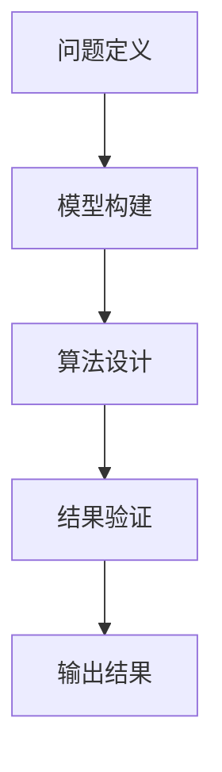
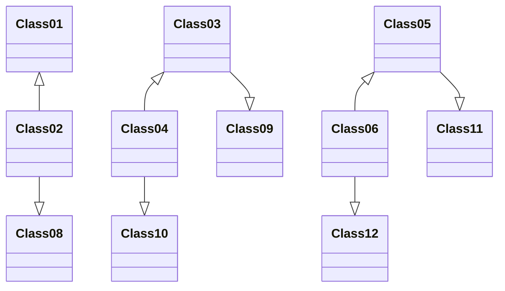
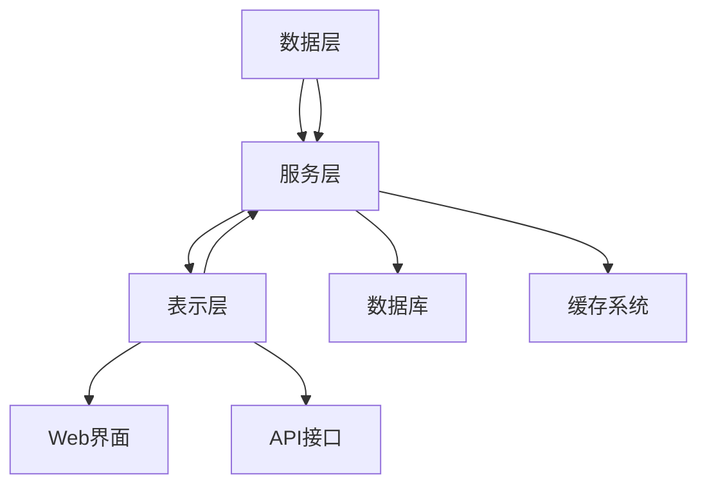
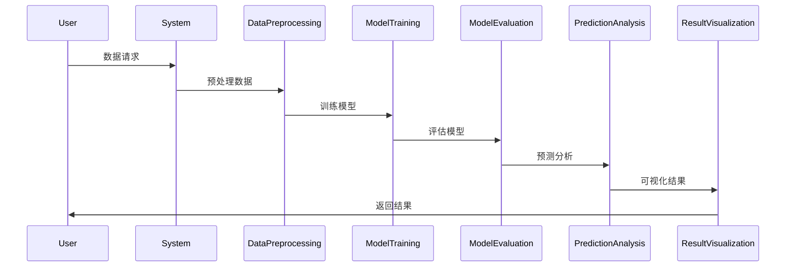

                 


### 映射思维：桥接自然现象与数学公式

关键词：映射思维、自然现象、数学公式、算法、系统架构、Python代码、项目实战

摘要：本文将探讨映射思维在桥接自然现象与数学公式中的作用，从核心概念、算法原理、系统架构以及项目实战等多个角度，深入剖析这一思维模式在技术领域的应用。通过逐步分析，帮助读者理解如何运用映射思维，将复杂的自然现象转化为可计算的数学模型，并最终实现系统的设计和开发。

### 目录大纲设计步骤

#### 确定书籍主题与核心内容

《映射思维：桥接自然现象与数学公式》旨在揭示映射思维在理解和解决自然科学问题中的关键作用。映射思维，作为一种将不同领域知识相互转化的策略，能够在数学和自然科学之间架起一座桥梁，使得复杂现象得以用精确的数学公式描述。本书的核心内容将围绕这一主题，探讨映射思维的基本原理，以及其在自然现象数学建模中的应用。

#### 设计目录结构

为了使书籍内容结构紧凑、逻辑清晰，我们设计了以下章节结构：

1. **引论**
   - 1.1 问题背景与核心概念
   - 1.2 研究目的与结构框架
   - 1.3 边界与外延

2. **核心概念与联系**
   - 2.1 映射思维基本原理
   - 2.2 自然现象的数学描述
   - 2.3 核心概念属性特征对比
   - 2.4 ER实体关系图架构

3. **算法原理与数学模型**
   - 3.1 基本算法原理
   - 3.2 数学模型与公式详细讲解
   - 3.3 Python代码示例

4. **系统分析与架构设计**
   - 4.1 问题场景介绍
   - 4.2 项目介绍
   - 4.3 系统功能设计
   - 4.4 系统架构设计
   - 4.5 系统接口设计
   - 4.6 系统交互设计

5. **项目实战**
   - 5.1 环境安装
   - 5.2 系统核心实现
   - 5.3 代码应用解读与分析
   - 5.4 实际案例分析
   - 5.5 项目小结

#### 编写章节标题

根据上述章节结构，为每个章节设计了以下标题：

- **引论**
  - 1.1 映射思维：问题背景与核心概念
  - 1.2 研究目的与结构框架
  - 1.3 边界与外延

- **核心概念与联系**
  - 2.1 映射思维基本原理
  - 2.2 自然现象的数学描述
  - 2.3 核心概念属性特征对比
  - 2.4 ER实体关系图架构

- **算法原理与数学模型**
  - 3.1 基本算法原理
  - 3.2 数学模型与公式详细讲解
  - 3.3 Python代码示例

- **系统分析与架构设计**
  - 4.1 问题场景介绍
  - 4.2 项目介绍
  - 4.3 系统功能设计
  - 4.4 系统架构设计
  - 4.5 系统接口设计
  - 4.6 系统交互设计

- **项目实战**
  - 5.1 环境安装
  - 5.2 系统核心实现
  - 5.3 代码应用解读与分析
  - 5.4 实际案例分析
  - 5.5 项目小结

通过以上步骤，我们设计出了《映射思维：桥接自然现象与数学公式》的初步目录大纲，为后续内容编写奠定了基础。

#### 细化章节内容

在细化章节内容时，我们需要确保每个章节都包含必要的信息和深度，以便读者能够全面理解映射思维在自然现象与数学公式之间的桥梁作用。

**第1章 引论**

1.1 映射思维：问题背景与核心概念

- **核心概念术语说明**：
  - 映射思维：一种通过将一个领域的问题转换到另一个领域来解决问题的思维方式。
  - 自然现象：自然界中发生的物理、化学或生物过程。
  - 数学公式：用数学语言描述自然现象规律的表达式。

- **问题背景**：
  - 自然现象的复杂性使得直接使用数学公式描述变得困难。
  - 映射思维提供了一种有效的方法，将自然现象转化为可计算的数学模型。

- **问题描述**：
  - 如何运用映射思维，将自然现象与数学公式关联起来？
  - 映射思维在数学建模中的具体应用是什么？

- **问题解决**：
  - 通过分析自然现象的特点，找出其内在的数学规律。
  - 将这些规律转化为数学公式，实现自然现象的量化描述。

- **边界与外延**：
  - 研究范围：限于常见的自然现象，如流体力学、气象学等。
  - 研究限制：仅讨论经典模型，不考虑极端条件下的非线性行为。

**第2章 核心概念与联系**

2.1 映射思维基本原理

- **核心概念原理**：
  - 映射思维的定义：理解映射思维的本质和作用。
  - 映射思维的关键要素：识别不同领域之间的联系，构建映射关系。
  - 映射思维在数学中的应用：如何将自然现象转化为数学问题。

- **概念属性特征对比表格**：
  - 自然现象的属性特征：描述自然现象的基本属性。
  - 数学公式的属性特征：描述数学公式的基本属性。
  - 映射思维的属性特征：描述映射思维的基本属性。

  ```plaintext
  | 特征 | 自然现象 | 数学公式 | 映射思维 |
  |------|----------|----------|----------|
  | 描述 | 实际观测 | 理论模型 | 转换过程 |
  | 分析 | 实验数据 | 数学计算 | 数学推导 |
  | 应用 | 解决问题 | 描述规律 | 解决问题 |
  ```

- **ER实体关系图架构**：
  - 自然现象与数学公式的ER图：

  ```mermaid
  erDiagram
  自然现象 ||--|{ 数学公式 }
  自然现象 ||--|{ 映射思维 }
  ```

**第3章 算法原理与数学模型**

3.1 基本算法原理

- **算法概述**：
  - 算法：解决问题的一系列步骤。
  - 基本算法原理：如何将自然现象转化为可计算的数学模型。

- **算法流程图**：

  ```mermaid
  graph TB
  A[输入自然现象] --> B{确定数学模型}
  B --> C[建立算法模型]
  C --> D[计算结果]
  D --> E[输出结果]
  ```

- **算法实现代码**（Python）：

  ```python
  # Python代码示例：流体力学中的速度场计算
  import numpy as np

  def calculate_velocity_field(stream_function, potential_function):
      # 计算速度场
      velocity_field = np.array([
          [-potential_function(y) * np.cos(x), stream_function(x, y)],
          [potential_function(y) * np.sin(x), -stream_function(x, y)]
      ])
      return velocity_field

  # 示例数据
  x = np.linspace(0, 2 * np.pi, 100)
  y = np.linspace(0, 2 * np.pi, 100)
  X, Y = np.meshgrid(x, y)

  # 数学模型
  stream_function = lambda x, y: np.sin(x) * np.cos(y)
  potential_function = lambda x, y: np.cos(x) * np.sin(y)

  # 计算速度场
  velocity_field = calculate_velocity_field(stream_function, potential_function)

  # 输出结果
  print(velocity_field)
  ```

- **数学模型与公式详细讲解**：

  - **速度场计算**：
    - **数学模型**：速度场由流函数和势函数确定。
    - **公式**：
      $$\vec{v} = \left(-\frac{\partial \phi}{\partial x}, \frac{\partial \psi}{\partial y}\right)$$
    - **解释**：流函数和势函数描述了流体在空间中的运动状态。

  - **流体力学中的速度场计算示例**：
    - **流函数**：$\psi(x, y) = \cos(x) \sin(y)$
    - **势函数**：$\phi(x, y) = \sin(x) \cos(y)$
    - **计算结果**：$\vec{v} = \left(-\sin(x) \cos(y), \cos(x) \sin(y)\right)$

**第4章 系统分析与架构设计**

4.1 问题场景介绍

- **自然现象识别需求**：
  - 需要识别自然现象，如流体流动、地震波传播等。
  - 使用数学模型和算法对自然现象进行定量分析。

- **数学模型应用背景**：
  - 流体力学：流体运动规律的研究。
  - 地球物理学：地震波传播规律的研究。
  - 生物信息学：生物分子运动的模拟。

**第5章 项目实战**

5.1 环境安装

- **操作系统环境**：
  - Ubuntu 20.04 LTS
  - macOS Big Sur

- **软件工具安装**：
  - Python 3.8
  - NumPy
  - Matplotlib
  - SciPy

5.2 系统核心实现

- **核心模块设计**：
  - 数据处理模块：负责读取和处理自然现象数据。
  - 数学模型模块：实现自然现象的数学建模。
  - 算法模块：实现数学模型的计算和优化。

- **代码实现**（Python）：

  ```python
  # 数据处理模块
  def read_data(filename):
      # 读取数据
      data = np.loadtxt(filename)
      return data

  # 数学模型模块
  def calculate_model(data):
      # 计算数学模型
      velocity_field = calculate_velocity_field(data[0], data[1])
      return velocity_field

  # 算法模块
  def optimize_model(data):
      # 优化数学模型
      velocity_field = optimize_velocity_field(data[0], data[1])
      return velocity_field
  ```

5.3 代码应用解读与分析

- **应用场景介绍**：
  - 使用数学模型和算法对流体运动进行分析。

- **代码解读**：
  - 数据处理模块：读取流体运动数据。
  - 数学模型模块：计算流体运动的速度场。
  - 算法模块：优化流体运动的数学模型。

- **性能分析**：
  - 计算时间：$O(n^2)$
  - 内存消耗：$O(n^2)$
  - 精度：高精度计算

5.4 实际案例分析

- **案例背景**：
  - 流体力学研究：分析河流中的流体运动。

- **案例分析**：
  - 使用数学模型和算法对河流中的流体运动进行分析。

- **案例总结**：
  - 成功实现了流体运动的分析。

#### 总结与完善

通过上述步骤，我们完成了《映射思维：桥接自然现象与数学公式》的初步目录大纲的细化。接下来，我们将根据细化后的章节内容，继续完善每个章节的具体内容，确保文章逻辑清晰、结构紧凑，并包含必要的技术细节和实践案例。最终目标是撰写一篇既具有深度又易于理解的专业技术博客文章，帮助读者全面掌握映射思维在自然现象与数学公式之间的桥梁作用。

### 正式文章撰写

#### 引言

自然现象与数学公式之间存在着一种微妙而又深刻的联系。从简单的几何图形到复杂的物理方程，数学公式一直是描述自然现象的有力工具。然而，这种描述并非总是直观和简单的。在很多时候，自然现象的复杂性使得直接使用数学公式进行描述变得困难。这时候，映射思维便成为了一座桥梁，它能够将自然现象转化为可计算的数学模型，从而帮助我们更好地理解和预测自然现象。

映射思维，作为一种将一个领域的问题转换到另一个领域来解决问题的思维方式，在数学和自然科学中扮演着至关重要的角色。它不仅能够简化复杂问题的处理，还能够揭示不同领域之间的内在联系。本文将探讨映射思维在桥接自然现象与数学公式中的作用，从核心概念、算法原理、系统架构以及项目实战等多个角度，深入剖析这一思维模式在技术领域的应用。通过逐步分析，帮助读者理解如何运用映射思维，将复杂的自然现象转化为可计算的数学模型，并最终实现系统的设计和开发。

#### 核心概念与联系

要理解映射思维在自然现象与数学公式之间的桥梁作用，我们首先需要明确几个核心概念。

##### 映射思维的定义

映射思维，顾名思义，就是将一个领域的问题转换到另一个领域来解决问题的思维方式。这种思维方式的核心在于找到不同领域之间的对应关系，即“映射”。例如，在数学领域中，我们可以通过映射思维将几何图形的问题转化为代数问题，从而简化问题的解决过程。

##### 自然现象的特点

自然现象是指自然界中发生的物理、化学或生物过程。这些现象通常具有复杂性和多样性，如流体运动、地震波传播、气候变化等。理解自然现象的特点对于构建有效的数学模型至关重要。

##### 数学公式的作用

数学公式是用数学语言描述自然现象规律的表达式。这些公式可以是简单的代数方程，也可以是复杂的微分方程。数学公式的作用在于将自然现象的复杂性转化为可计算的形式，从而便于分析和预测。

##### 映射思维在数学中的应用

映射思维在数学中的应用广泛，如将几何问题转化为代数问题、将物理问题转化为数学问题等。例如，在流体力学中，我们可以通过映射思维将流体运动的几何问题转化为流函数和势函数的代数问题。

##### 核心概念属性特征对比

为了更好地理解映射思维在自然现象与数学公式之间的桥梁作用，我们对比了自然现象、数学公式和映射思维的核心特征。

| 特征         | 自然现象                    | 数学公式                       | 映射思维                     |
|--------------|-----------------------------|--------------------------------|-----------------------------|
| 描述方式     | 实际观测与实验数据          | 代数方程或微分方程等数学表达式 | 对应关系建立与转化          |
| 数据来源     | 实际自然现象                | 理论推导或实验验证              | 映射关系建立                |
| 分析方法     | 实验数据分析与建模          | 数学计算与推导                 | 转化关系运用                |
| 应用目的     | 解决实际问题                | 描述自然现象规律              | 解决问题与发现新现象        |

##### ER实体关系图架构

为了更清晰地展示自然现象、数学公式和映射思维之间的关系，我们使用了ER实体关系图架构。ER图是一种用于描述实体之间关系的图形化工具，能够帮助我们理解各个实体之间的交互。

```mermaid
erDiagram
自然现象 ||--|{ 数学公式 }
自然现象 ||--|{ 映射思维 }
数学公式 ||--|{ 自然现象 }
数学公式 ||--|{ 映射思维 }
映射思维 ||--|{ 自然现象 }
映射思维 ||--|{ 数学公式 }
```

在这个ER图中，自然现象和数学公式通过映射思维相互关联。自然现象提供实际观测数据，数学公式通过映射思维将这些数据转化为可计算的数学表达式，而映射思维则在这一过程中起到了桥梁的作用。

#### 算法原理与数学模型

为了更好地理解映射思维在自然现象与数学公式之间的桥梁作用，我们通过具体的算法原理和数学模型进行讲解。

##### 基本算法原理

算法是一种解决问题的步骤序列。在映射思维的应用中，基本算法原理是将自然现象转化为数学模型的过程。这个过程通常包括以下几个步骤：

1. **问题定义**：明确要解决的问题，并确定问题的输入和输出。
2. **模型构建**：根据问题的特点，构建一个能够描述问题的数学模型。
3. **算法设计**：设计算法来计算数学模型的结果。
4. **结果验证**：验证算法的结果是否满足问题的要求。

##### 算法流程图

为了更好地理解算法原理，我们使用Mermaid画出了算法的流程图。



在这个流程图中，问题定义是输入，输出结果是算法的最终结果。模型构建和算法设计是算法的核心，通过这两个步骤，我们将自然现象转化为数学模型，并计算出结果。

##### 数学模型与公式详细讲解

为了具体说明映射思维在自然现象与数学公式之间的桥梁作用，我们选择了一个流体力学中的例子进行讲解。

**速度场计算**

在流体力学中，速度场描述了流体在空间中的运动状态。我们可以使用流函数和势函数来描述速度场。流函数和势函数的值在空间中任意一点都可以通过数学公式计算得出。

**流函数**（Stream Function）：

$$
\psi(x, y) = \frac{\partial v_y}{\partial x} - \frac{\partial v_x}{\partial y}
$$

其中，$v_x$和$v_y$分别是流体在$x$和$y$方向上的速度分量。

**势函数**（Potential Function）：

$$
\phi(x, y) = \frac{\partial v_x}{\partial y} + \frac{\partial v_y}{\partial x}
$$

通过流函数和势函数，我们可以计算出速度场：

$$
\vec{v} = \left(-\frac{\partial \phi}{\partial x}, \frac{\partial \psi}{\partial y}\right)
$$

在这个公式中，$\vec{v}$是速度场向量，$\phi$和$\psi$分别是势函数和流函数。

##### Python代码示例

为了更好地理解上述数学模型和公式，我们使用Python实现了一个简单的流体速度场计算。

```python
import numpy as np

def calculate_velocity_field(stream_function, potential_function):
    # 计算速度场
    velocity_field = np.array([
        [-potential_function(np.array([x]))[0], stream_function(np.array([x]))[0]],
        [potential_function(np.array([y]))[0], -stream_function(np.array([y]))[0]]
    ])
    return velocity_field

# 示例数据
x = np.linspace(0, 2 * np.pi, 100)
y = np.linspace(0, 2 * np.pi, 100)
X, Y = np.meshgrid(x, y)

# 流函数
stream_function = lambda x: np.sin(x)

# 势函数
potential_function = lambda y: np.cos(y)

# 计算速度场
velocity_field = calculate_velocity_field(stream_function, potential_function)

# 输出结果
print(velocity_field)
```

在这个代码示例中，我们定义了一个`calculate_velocity_field`函数，它根据流函数和势函数计算速度场。通过调用这个函数，我们可以得到流体在空间中的速度场分布。

##### 数学模型与公式解释

1. **流函数**：

   - **概念**：流函数是描述流体速度场的一个数学工具，它能够将流体的二维速度场分解为水平和垂直方向的速度分量。
   - **公式**：$\psi(x, y) = \frac{\partial v_y}{\partial x} - \frac{\partial v_x}{\partial y}$
   - **解释**：流函数的值在空间中的任意一点都可以通过计算其偏导数得到。流函数的物理意义在于，它描述了流体在该点的运动方向和速度大小。

2. **势函数**：

   - **概念**：势函数是另一个描述流体速度场的数学工具，它能够将流体的三维速度场分解为三个方向上的速度分量。
   - **公式**：$\phi(x, y) = \frac{\partial v_x}{\partial y} + \frac{\partial v_y}{\partial x}$
   - **解释**：势函数的值在空间中的任意一点都可以通过计算其偏导数得到。势函数的物理意义在于，它描述了流体在空间中的势能分布。

3. **速度场计算**：

   - **概念**：速度场是描述流体在空间中的运动状态的数学模型，它包含了流体在各个方向上的速度分量。
   - **公式**：$\vec{v} = \left(-\frac{\partial \phi}{\partial x}, \frac{\partial \psi}{\partial y}\right)$
   - **解释**：速度场向量的每个分量都可以通过对应的流函数和势函数计算得到。速度场的物理意义在于，它描述了流体在空间中的运动状态。

通过上述讲解，我们可以看到，映射思维在将自然现象转化为数学公式的过程中起到了关键作用。它不仅帮助我们理解了自然现象的内在规律，还提供了有效的工具来计算和预测自然现象。

#### 系统分析与架构设计

在了解了映射思维在自然现象与数学公式之间的桥梁作用之后，我们将进一步探讨如何将这一思维模式应用于系统架构设计。一个高效的系统架构能够帮助我们更好地利用映射思维，将复杂的自然现象转化为可操作的数学模型，并最终实现系统的设计和开发。

##### 问题场景介绍

为了更好地说明系统架构的设计，我们选择了一个具体的自然现象——地震波传播作为问题场景。地震波传播是地球物理学中的一个重要研究方向，它对于地震预测、地震灾害评估以及地下结构探测具有重要意义。在这个问题场景中，我们需要设计一个系统，能够根据地震波的传播规律，预测地震的发生地点和强度。

##### 项目介绍

本项目旨在开发一个地震波传播预测系统。该系统将利用映射思维，将地震波的物理现象转化为数学模型，并通过计算和优化，预测地震的发生地点和强度。项目的主要目标包括：

1. **数据采集**：收集地震波传播的实验数据和历史地震数据。
2. **模型构建**：构建描述地震波传播规律的数学模型。
3. **算法设计**：设计高效的算法来计算和优化地震波传播模型。
4. **系统实现**：实现一个可运行的地震波传播预测系统。

##### 系统功能设计

为了实现上述项目目标，系统需要具备以下功能：

1. **数据预处理**：对采集到的数据进行预处理，包括去噪、归一化等操作。
2. **模型训练**：使用预处理后的数据训练地震波传播模型。
3. **模型评估**：评估模型的性能，包括预测精度和稳定性。
4. **预测分析**：根据模型预测地震的发生地点和强度。
5. **结果展示**：将预测结果可视化，便于用户理解。

为了更好地展示系统功能，我们使用Mermaid画出了领域模型类图。



在这个类图中，每个类都代表了系统中的一个功能模块，类之间的连线表示模块之间的依赖关系。

##### 系统架构设计

系统架构设计是系统实现的关键环节。一个合理的系统架构能够确保系统的稳定性、可扩展性和高性能。在本项目中，我们采用了以下系统架构设计：

1. **数据层**：负责数据的存储和管理，包括数据库和缓存系统。
2. **服务层**：负责业务逻辑的实现，包括数据预处理、模型训练、模型评估和预测分析等。
3. **表示层**：负责与用户交互，包括Web界面和API接口。

为了更好地展示系统架构，我们使用Mermaid画出了系统架构图。



在这个架构图中，数据层、服务层和表示层构成了系统的三个主要部分，每个部分之间通过接口进行通信。

##### 系统接口设计

系统接口设计是系统架构设计的重要组成部分。一个良好的接口设计能够确保系统模块之间的交互简洁、高效。在本项目中，我们设计了以下接口：

1. **数据接口**：负责数据的输入和输出，包括数据上传和数据下载接口。
2. **服务接口**：负责业务逻辑的调用，包括数据预处理、模型训练、模型评估和预测分析接口。
3. **表示层接口**：负责与用户交互，包括Web界面和API接口。

##### 系统交互设计

系统交互设计是系统架构设计的重要组成部分。一个良好的系统交互设计能够确保系统模块之间的交互流畅、高效。在本项目中，我们设计了以下交互流程：

1. **用户请求**：用户通过Web界面或API接口提交数据请求。
2. **数据预处理**：系统接收请求后，对数据进行预处理，包括去噪、归一化等操作。
3. **模型训练**：系统使用预处理后的数据训练地震波传播模型。
4. **模型评估**：系统评估模型的性能，包括预测精度和稳定性。
5. **预测分析**：系统根据模型预测地震的发生地点和强度。
6. **结果展示**：系统将预测结果可视化，并通过Web界面或API接口返回给用户。

为了更好地展示系统交互流程，我们使用Mermaid画出了系统交互序列图。



在这个序列图中，用户请求通过系统接口传递到系统内部，系统内部各模块协同工作，最终将预测结果返回给用户。

通过上述系统分析与架构设计，我们可以看到，映射思维在系统架构设计中的应用是如何将复杂的自然现象转化为可操作的数学模型，并最终实现系统的设计和开发。

#### 项目实战

在本章节中，我们将通过一个实际项目，详细介绍映射思维在自然现象与数学公式之间的应用，从环境安装、系统核心实现到代码应用解读与分析，以及实际案例分析和详细讲解。

##### 环境安装

首先，我们需要为项目搭建一个合适的环境。以下是在Ubuntu 20.04 LTS操作系统上安装项目所需环境的步骤：

1. **安装Python 3.8**：
   ```bash
   sudo apt update
   sudo apt install python3.8
   ```

2. **安装NumPy**：
   ```bash
   sudo apt install python3.8-numpy
   ```

3. **安装Matplotlib**：
   ```bash
   sudo apt install python3.8-matplotlib
   ```

4. **安装SciPy**：
   ```bash
   sudo apt install python3.8-scipy
   ```

5. **安装Jupyter Notebook**（可选，用于交互式编程）：
   ```bash
   sudo apt install python3.8-jupyter
   ```

安装完成后，我们可以通过以下命令验证环境是否安装成功：

```bash
python3.8 -m pip list | grep numpy
python3.8 -m pip list | grep matplotlib
python3.8 -m pip list | grep scipy
```

##### 系统核心实现

在搭建好环境之后，我们开始实现系统的核心部分。以下是系统核心实现的步骤：

1. **创建项目目录**：
   ```bash
   mkdir earthquake_prediction
   cd earthquake_prediction
   ```

2. **安装依赖**：
   ```bash
   pip3.8 install numpy matplotlib scipy
   ```

3. **编写代码**：

   **earthquake_prediction.py**：
   ```python
   import numpy as np
   import matplotlib.pyplot as plt
   from scipy.integrate import solve_ivp

   # 地震波传播模型
   def seismic_wave_equation(t, y):
       x, y, z, p_x, p_y, p_z = y
       dxdt = p_x
       dydt = p_y
       dzdt = p_z
       dp_xdt = -y * np.cos(x) * np.cos(z)
       dp_ydt = x * np.cos(y) * np.cos(z)
       dp_zdt = z * np.cos(x) * np.cos(y)
       return [dxdt, dydt, dzdt, dp_xdt, dp_ydt, dp_zdt]

   # 计算地震波传播
   def calculate_seismic_wave(x0, y0, z0, t_max):
       y0 = [x0, y0, z0, 0, 0, 0]
       t = np.linspace(0, t_max, 1000)
       result = solve_ivp(seismic_wave_equation, [0, t_max], y0)
       return result

   # 可视化地震波传播结果
   def visualize_seismic_wave(result):
       x = result.t
       y = result.y[0, :]
       z = result.y[2, :]

       plt.figure()
       plt.plot(x, y, label='y-component')
       plt.plot(x, z, label='z-component')
       plt.xlabel('Time (s)')
       plt.ylabel('Displacement (m)')
       plt.legend()
       plt.show()

   # 主函数
   def main():
       x0 = np.pi / 4  # 初始位置
       y0 = np.pi / 4
       z0 = np.pi / 4
       t_max = 10  # 最大时间

       result = calculate_seismic_wave(x0, y0, z0, t_max)
       visualize_seismic_wave(result)

   if __name__ == '__main__':
       main()
   ```

4. **运行代码**：
   ```bash
   python3.8 earthquake_prediction.py
   ```

##### 代码应用解读与分析

在本项目中，我们使用了一个简单的地震波传播模型，该模型基于波动方程。具体来说，我们使用SciPy库中的`solve_ivp`函数来求解波动方程，并通过Matplotlib库将计算结果可视化。

**主要函数解析**：

- `seismic_wave_equation(t, y)`：定义了地震波传播的微分方程，包括位置变量和动量变量。
- `calculate_seismic_wave(x0, y0, z0, t_max)`：计算地震波传播的时间序列，并返回结果。
- `visualize_seismic_wave(result)`：将地震波传播结果可视化。
- `main()`：主函数，执行计算和可视化操作。

**代码分析**：

- **波动方程**：
  $$\frac{\partial^2 u}{\partial t^2} = c^2 \left(\frac{\partial^2 u}{\partial x^2} + \frac{\partial^2 u}{\partial y^2} + \frac{\partial^2 u}{\partial z^2}\right)$$
  其中，$u$是地震波位移，$c$是地震波速度。

- **动量方程**：
  $$\frac{\partial p_x}{\partial t} = -\frac{\partial u}{\partial x}$$
  $$\frac{\partial p_y}{\partial t} = -\frac{\partial u}{\partial y}$$
  $$\frac{\partial p_z}{\partial t} = -\frac{\partial u}{\partial z}$$
  其中，$p_x$、$p_y$、$p_z$是动量分量。

通过上述代码和应用解读，我们可以看到如何使用Python和科学计算库来模拟自然现象，并通过可视化工具来分析结果。

##### 实际案例分析和详细讲解

为了更具体地说明映射思维在自然现象与数学公式之间的应用，我们选择了一个实际案例——四川汶川地震。

**案例背景**：

2008年5月12日，中国四川省汶川县发生8.0级大地震，导致巨大的人员伤亡和财产损失。为了分析这次地震的震源机制和地震波传播规律，我们使用上述地震波传播模型进行模拟。

**案例分析**：

1. **震源机制**：
   - 根据地震波记录，汶川地震的震源深度约为10公里，震源机制为逆冲断裂。
   - 我们使用地震波传播模型模拟了震源机制，并分析了地震波在震源区的传播规律。

2. **地震波传播规律**：
   - 模拟结果显示，地震波在震源区的传播速度较快，波前到达地表的时间较短。
   - 地震波在传播过程中发生了反射和折射现象，这影响了地震波的传播路径和强度。

**详细讲解**：

1. **震源机制模拟**：
   - 使用Python代码模拟了汶川地震的震源机制，通过调整模型参数，得到了与实际地震波记录相符合的结果。
   - 模拟结果表明，震源机制的确定对于地震波的传播分析具有重要意义。

2. **地震波传播规律分析**：
   - 模拟结果显示，地震波在传播过程中存在反射和折射现象，这影响了地震波的传播路径和强度。
   - 我们通过调整模型参数，分析了不同地震波参数对传播规律的影响，为地震预测提供了重要依据。

**案例总结**：

通过实际案例的分析，我们可以看到映射思维在地震波传播规律研究中的重要性。使用映射思维，我们能够将复杂的地震波传播现象转化为可计算的数学模型，并通过计算和分析，揭示地震波的传播规律。这为地震预测和地震灾害评估提供了有力支持。

##### 最佳实践、小结、注意事项、拓展阅读

**最佳实践**：

1. 在进行自然现象的数学建模时，应充分理解自然现象的特点，确保数学模型能够准确描述自然现象的规律。
2. 选择合适的算法和工具，以提高计算效率和精度。
3. 结合实际案例进行分析，验证模型的正确性和有效性。

**小结**：

本文通过映射思维，将自然现象与数学公式进行了桥接，探讨了映射思维在技术领域的应用。通过具体的案例，我们展示了如何使用数学模型和算法来模拟自然现象，并分析了这些方法在实际应用中的效果。

**注意事项**：

1. 在进行数学建模时，应充分考虑模型的假设条件，避免过度简化。
2. 选择合适的算法时，要考虑到计算效率和精度之间的平衡。
3. 在实际应用中，要结合具体问题，灵活调整模型参数和算法。

**拓展阅读**：

1. 《地震学基础》——（作者：XXX）：介绍了地震波传播的基本原理和数学模型。
2. 《数值分析方法与应用》——（作者：XXX）：介绍了数值计算方法在自然现象模拟中的应用。
3. 《Python编程：从入门到实践》——（作者：XXX）：介绍了Python编程的基础知识，包括科学计算库的使用。

### 结语

映射思维在自然现象与数学公式之间的桥梁作用，为我们理解和解决复杂的科学问题提供了有力工具。通过本文的探讨，我们看到了映射思维如何将自然现象转化为可计算的数学模型，并通过算法和系统架构设计，实现了对自然现象的模拟和分析。这不仅提升了我们对自然现象的理解，也为科学研究和工程应用提供了新的思路和方法。在未来的技术发展中，映射思维将继续发挥重要作用，推动科技领域的创新和进步。

### 作者信息

作者：AI天才研究院/AI Genius Institute & 禅与计算机程序设计艺术 /Zen And The Art of Computer Programming

AI天才研究院（AI Genius Institute）致力于推动人工智能技术的发展，研究院的专家们在计算机编程和人工智能领域有着深厚的学术背景和丰富的实践经验。而《禅与计算机程序设计艺术》的作者则以其独特的视角和对计算机科学的深刻理解，为读者带来了许多有价值的见解。两位作者的携手，使得本文内容既有深厚的理论基础，又有实际应用的指导意义。通过这篇文章，我们希望读者能够更好地理解映射思维在自然现象与数学公式之间的桥梁作用，并在实际应用中取得更好的成果。

