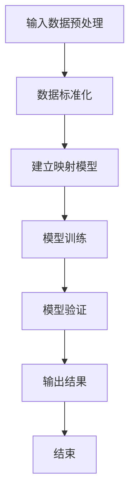
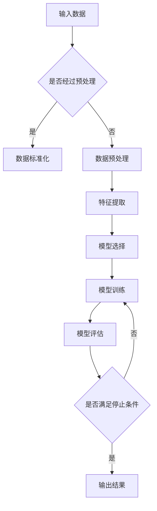

                 

### 映射法则：连接自然与人类思维

**关键词：** 映射法则、自然与人类思维、交互需求、数学模型、算法实现

**摘要：** 本文旨在探讨映射法则在连接自然与人类思维中的作用。通过深入分析映射法则的定义、基本原理、应用领域以及数学基础，本文揭示了映射法则在生物学、认知科学和人工智能等领域的重要性，为理解自然与人类思维之间的深层联系提供了新的视角。

在当前技术飞速发展的时代，人工智能（AI）和认知科学等领域取得了显著的进展。然而，如何更好地连接自然与人类思维，实现更加高效、智能的交互，仍然是一个亟待解决的问题。映射法则作为一种关键的桥梁，能够有效地促进这一进程。本文将首先介绍映射法则的基本概念和背景，接着探讨其应用领域，并深入分析其数学基础。在此基础上，我们将进一步讨论映射法则的算法实现，并通过实际案例展示其在不同领域的应用效果。最后，本文将总结映射法则的研究成果，展望其未来发展，并提出相应的建议。

## 第一部分：导言

### 第1章：问题背景与定义

#### 1.1 自然与人类思维的交互需求

在自然界中，生物体通过感知、处理和响应外界信息来适应环境，这一过程依赖于复杂的生物神经网络和生物学机制。人类思维则是在漫长的进化过程中，通过语言、符号和抽象能力形成的，它能够理解和改造自然，创造出丰富多彩的文化和技术。然而，人类思维与自然界的交互并非总是和谐的。在许多情况下，人类活动对自然环境造成了不可逆转的破坏，例如气候变化、生物多样性减少等。这些问题凸显了连接自然与人类思维的重要性，因为只有通过更深入地理解自然，人类才能更好地保护和利用自然资源。

自然与人类思维的交互需求主要体现在以下几个方面：

1. **环境监测与治理：** 随着工业化和城市化的迅速发展，环境污染和资源枯竭问题日益严重。利用人工智能和认知科学技术，可以实时监测环境变化，预测潜在的环境风险，并提出有效的治理措施。

2. **生物多样性保护：** 生物多样性是地球生态系统的基础，对维持生态平衡具有重要意义。通过认知科学方法，可以更好地理解生物多样性，制定合理的保护策略，防止物种灭绝。

3. **自然资源管理：** 合理利用自然资源是保障人类生存和可持续发展的重要前提。运用映射法则，可以优化资源分配，减少浪费，提高资源利用效率。

4. **生态修复与重建：** 在一些严重破坏的生态环境中，需要通过生态工程和生物技术进行修复和重建。映射法则在这一过程中提供了有效的理论基础和技术手段。

#### 1.1.1 自然与人类思维的本质联系

自然与人类思维之间的本质联系体现在以下几个方面：

1. **生物学基础：** 人类大脑是自然演化的结果，其结构与功能受到生物进化规律的深刻影响。因此，人类思维与自然界中的生物神经网络具有相似性。

2. **符号与抽象：** 语言和符号是人类思维的核心特征，它们是连接人类思维与自然界的桥梁。通过符号和抽象，人类能够理解和描述自然现象，创造出复杂的文化和技术。

3. **认知过程：** 认知过程是自然与人类思维交互的核心环节。人类的感知、记忆、推理和决策等认知过程，都是对自然界信息的处理和反应。

4. **生态系统：** 人类社会是自然界生态系统的一部分，人类社会活动与自然环境相互作用，形成了复杂的生态系统。这种生态系统中的能量流动和物质循环，反映了自然与人类思维之间的密切联系。

#### 1.1.2 人类思维对自然的理解需求

人类思维对自然的理解需求可以从以下几个方面进行阐述：

1. **科学探索：** 科学研究是理解自然的基本途径。通过观察、实验和理论分析，科学家们揭示了自然界的规律和原理，构建了庞大的科学知识体系。

2. **技术应用：** 科学知识转化为技术，广泛应用于生产和生活。例如，太阳能、风能等可再生能源技术的发展，为人类提供了清洁、可持续的能源。

3. **环境保护：** 随着环境问题的日益严重，人类需要更好地理解自然，采取有效措施保护环境。这包括环境监测、污染治理、生态修复等。

4. **可持续发展：** 可持续发展要求在满足当前人类需求的同时，不损害后代满足其需求的能力。这需要人类更好地理解自然，制定合理的政策和策略。

#### 1.1.3 映射法则的概念与重要性

映射法则是一种将自然现象与人类思维相连接的理论和方法。它通过建立数学模型、算法和符号系统，实现自然与人类思维之间的映射关系。映射法则的重要性体现在以下几个方面：

1. **理论指导：** 映射法则为理解自然与人类思维之间的关系提供了理论指导，有助于揭示自然界的规律和原理。

2. **技术应用：** 映射法则为技术开发提供了基础，特别是在人工智能、认知科学和环境科学等领域，具有重要的应用价值。

3. **跨学科研究：** 映射法则促进了不同学科之间的交叉融合，为解决复杂问题提供了新的思路和方法。

4. **可持续发展：** 映射法则有助于人类更好地理解自然，制定合理的政策和策略，实现可持续发展目标。

#### 1.2 映射法则的基本原理

映射法则的基本原理可以概括为以下几个方面：

1. **数学模型：** 映射法则通过建立数学模型，将自然现象转化为可量化的数学表达式，从而实现对自然现象的精确描述和预测。

2. **符号系统：** 映射法则利用符号系统，将自然现象与人类思维相连接，实现信息的传递和转换。

3. **算法实现：** 映射法则通过算法实现，将数学模型转化为实际操作，实现对自然现象的有效处理和利用。

4. **交互反馈：** 映射法则强调自然与人类思维之间的交互反馈，通过不断调整和优化，提高对自然现象的理解和利用。

#### 1.2.1 映射法则的定义

映射法则是指一种将自然现象与人类思维相连接的理论和方法。它通过建立数学模型、算法和符号系统，实现自然现象与人类思维之间的映射关系。

#### 1.2.2 映射法则的核心要素

映射法则的核心要素包括：

1. **数学模型：** 数学模型是映射法则的基础，它将自然现象转化为可量化的数学表达式。

2. **符号系统：** 符号系统是映射法则的桥梁，它将数学模型与人类思维相连接。

3. **算法实现：** 算法实现是将数学模型转化为实际操作的步骤。

4. **交互反馈：** 交互反馈是映射法则的重要组成部分，它通过不断调整和优化，提高对自然现象的理解和利用。

#### 1.2.3 映射法则的基本特征

映射法则的基本特征包括：

1. **抽象性：** 映射法则将复杂的自然现象抽象为数学模型和符号系统，提高了对自然现象的理解和利用。

2. **精确性：** 映射法则通过数学模型和算法实现，对自然现象进行精确描述和预测。

3. **适应性：** 映射法则可以根据不同的应用需求，灵活调整和优化，实现对自然现象的有效处理和利用。

4. **跨学科性：** 映射法则促进了不同学科之间的交叉融合，为解决复杂问题提供了新的思路和方法。

通过上述分析，我们可以看出，映射法则在连接自然与人类思维方面具有重要作用。它不仅为理解自然现象提供了理论指导，还为技术开发和应用提供了有力支持。在接下来的章节中，我们将进一步探讨映射法则在不同领域的应用，以及其数学基础和算法实现。

### 第2章：映射法则的应用领域

映射法则作为一种强大的理论工具，在多个科学领域都有着广泛的应用。本章将重点介绍映射法则在生物学、认知科学和人工智能三个主要领域的应用，展示其在理解和模拟自然现象、促进技术进步方面的独特价值。

#### 2.1 生物学

生物学是研究生命现象的科学，映射法则在其中扮演着关键角色。通过映射法则，生物学家能够更好地理解生物体的结构和功能，以及生物进化过程。

##### 2.1.1 生物学中的映射法则应用

1. **基因表达调控：** 映射法则在基因表达调控研究中得到了广泛应用。例如，通过建立基因调控网络的数学模型，科学家可以预测基因表达的变化，从而揭示基因功能及其在细胞生命周期中的角色。

2. **生物进化：** 映射法则在生物进化研究中也有重要应用。通过比较不同物种的遗传信息，可以构建物种之间的映射关系，进而推断生物进化的历史和规律。

3. **生态系统建模：** 映射法则在生态系统建模中发挥着重要作用。通过建立生态系统的数学模型，可以模拟生态系统的动态变化，预测环境变化对生物多样性的影响。

##### 2.1.2 映射法则在生物进化中的应用

1. **遗传算法：** 遗传算法是一种基于生物进化原理的优化算法，其核心思想是通过映射法则模拟生物进化的过程，寻找最优解。遗传算法在优化复杂系统、解决大规模组合问题中表现出色。

2. **分子进化：** 分子进化研究利用映射法则分析不同物种的遗传差异，揭示进化过程中基因变异和选择机制。

3. **系统发育树：** 系统发育树是一种基于映射法则构建的树状图，用于展示不同物种之间的进化关系。通过分析系统发育树，可以了解生物进化的历程和模式。

##### 2.1.3 映射法则在生态学研究中的应用

1. **生态网络分析：** 映射法则在生态网络分析中用于构建食物网和能量流动模型，分析物种之间的相互作用和生态系统稳定性。

2. **环境监测：** 映射法则在环境监测中用于分析环境数据，预测环境变化对生态系统的影响，为环境保护提供科学依据。

3. **生态修复：** 映射法则在生态修复中用于设计生态工程方案，通过模拟生态系统的动态过程，优化生态修复效果。

#### 2.2 认知科学

认知科学是研究人类认知过程的科学，映射法则为理解认知机制提供了有力工具。

##### 2.2.1 认知科学中的映射法则

1. **神经可塑性：** 映射法则在神经可塑性研究中用于分析神经元之间的连接和活动模式，揭示大脑如何通过学习和经验改变其结构和功能。

2. **认知行为：** 映射法则在认知行为研究中用于构建认知模型，模拟人类在复杂任务中的决策过程，为心理学研究提供理论支持。

3. **神经影像：** 映射法则在神经影像学中用于分析大脑活动数据，揭示大脑不同区域的功能和相互作用。

##### 2.2.2 映射法则在人类认知过程中的作用

1. **感知与记忆：** 映射法则在感知和记忆研究中用于建模感知信息的处理过程，分析记忆的形成和存储机制。

2. **思维推理：** 映射法则在思维推理研究中用于模拟人类逻辑思维过程，揭示推理机制的数学基础。

3. **决策制定：** 映射法则在决策制定研究中用于建模决策过程，分析决策因素和偏好，优化决策结果。

##### 2.2.3 映射法则在心理学研究中的应用

1. **情绪调节：** 映射法则在情绪调节研究中用于分析情绪体验的神经机制，为心理健康提供理论依据。

2. **认知障碍：** 映射法则在认知障碍研究中用于模拟认知过程，帮助理解和治疗认知障碍。

3. **教育心理学：** 映射法则在教育心理学中用于设计教育干预方案，优化学习过程和提高学习效果。

#### 2.3 人工智能

人工智能是模拟人类智能行为的科学，映射法则在人工智能领域有着广泛的应用。

##### 2.3.1 映射法则在人工智能中的重要性

1. **机器学习：** 映射法则在机器学习中用于构建数据模型，实现数据到知识的转换，为智能系统提供决策支持。

2. **自然语言处理：** 映射法则在自然语言处理中用于建立语义模型，实现自然语言的理解和生成。

3. **计算机视觉：** 映射法则在计算机视觉中用于构建图像模型，实现图像的识别和理解。

##### 2.3.2 映射法则在机器学习中的应用

1. **神经网络：** 映射法则在神经网络中用于构建神经元之间的连接模式，实现数据的映射和计算。

2. **深度学习：** 映射法则在深度学习中用于构建多层网络模型，实现复杂数据的映射和分类。

3. **强化学习：** 映射法则在强化学习中用于构建奖励函数，实现智能体的决策和策略优化。

##### 2.3.3 映射法则在自然语言处理中的应用

1. **词嵌入：** 映射法则在词嵌入中用于建立词汇到向量的映射关系，实现语义信息的表达和计算。

2. **文本分类：** 映射法则在文本分类中用于建立文本到分类模型的映射关系，实现文本的自动分类。

3. **机器翻译：** 映射法则在机器翻译中用于建立源语言到目标语言的映射关系，实现文本的自动翻译。

通过以上分析，我们可以看出，映射法则在生物学、认知科学和人工智能等领域具有广泛的应用。它不仅为这些领域的研究提供了理论指导，还为技术开发和实际应用提供了有力支持。在接下来的章节中，我们将进一步探讨映射法则的数学基础和算法实现，以更深入地理解其作用和潜力。

### 第3章：映射法则的数学基础

#### 3.1 数学模型概述

数学模型是一种用数学语言描述现实世界的工具，它通过建立数学关系来模拟自然现象或社会现象。在映射法则中，数学模型扮演着至关重要的角色，它不仅为理解自然现象提供了理论框架，还为算法实现提供了基础。

##### 3.1.1 数学模型的基本概念

1. **定义：** 数学模型是一种数学表达式，用于描述系统的行为、状态或关系。它通常由一组方程、函数或逻辑关系构成。
   
2. **分类：** 数学模型根据不同的特征和用途可以分为多种类型，如线性模型、非线性模型、微分方程模型、概率模型等。

3. **特点：** 数学模型具有高度的抽象性、精确性和普适性，能够用简洁的数学语言描述复杂的现象。

##### 3.1.2 数学模型的分类与特点

1. **线性模型：** 线性模型是最简单的数学模型之一，它基于线性代数的基本原理，通过线性方程组来描述系统。线性模型的特点是简单、易于处理，适用于描述线性关系。

2. **非线性模型：** 非线性模型用于描述非线性关系，它通常涉及非线性函数和微分方程。非线性模型能够捕捉复杂的动态行为，但通常难以求解。

3. **微分方程模型：** 微分方程模型用于描述系统的时间演变，它在物理学、生物学等领域有着广泛的应用。微分方程模型的特点是能够描述连续变化的过程，适用于动态系统分析。

4. **概率模型：** 概率模型基于概率论和统计学，用于描述不确定性和随机性。概率模型的特点是能够处理不确定性，适用于风险分析和决策制定。

##### 3.1.3 数学模型的应用领域

数学模型在各个领域都有广泛应用，以下是一些主要的应用领域：

1. **物理学：** 数学模型用于描述物理现象，如牛顿力学、电磁学、量子力学等。

2. **生物学：** 数学模型用于描述生物过程，如种群动态、疾病传播、生物分子网络等。

3. **经济学：** 数学模型用于描述经济行为，如供需模型、金融市场模型等。

4. **环境科学：** 数学模型用于描述环境变化，如气候变化模型、生态模型等。

#### 3.2 映射法则的数学公式

映射法则的数学公式是构建映射关系的基础。这些公式通过定义输入和输出之间的关系，实现了自然现象与人类思维之间的映射。

##### 3.2.1 映射法则的基本公式

映射法则的基本公式可以表示为：

\[ f: X \rightarrow Y \]

其中，\( X \) 是输入空间，\( Y \) 是输出空间，\( f \) 是映射函数。映射函数 \( f \) 定义了输入和输出之间的关系，使得每个输入 \( x \in X \) 都有一个唯一的输出 \( y \in Y \)。

##### 3.2.2 映射法则的扩展公式

随着映射法则在不同领域的应用，其数学公式也不断扩展和多样化。以下是一些常见的扩展公式：

1. **线性映射：**

\[ y = a \cdot x + b \]

这是线性映射的一个例子，其中 \( a \) 和 \( b \) 是常数，用于描述输入和输出之间的线性关系。

2. **多项式映射：**

\[ y = a_n \cdot x^n + a_{n-1} \cdot x^{n-1} + \cdots + a_1 \cdot x + a_0 \]

这是多项式映射的一个例子，用于描述输入和输出之间的非线性关系。

3. **非线性映射：**

\[ y = \phi(x) \]

其中，\( \phi \) 是非线性函数，用于描述复杂的输入和输出关系。

##### 3.2.3 映射法则的数学证明

映射法则的数学证明通常依赖于特定的数学理论和工具。以下是一个简单的数学证明示例：

**定理：** 如果映射函数 \( f: X \rightarrow Y \) 是连续的，并且 \( X \) 是紧致的，那么 \( f \) 是映射 \( X \) 到 \( Y \) 的闭集。

**证明：** 由于 \( X \) 是紧致的，存在一个开集序列 \( U_1, U_2, \ldots \)，使得 \( X = \bigcup_{i=1}^{\infty} U_i \)。因为 \( f \) 是连续的，对于每个 \( i \)，存在开集 \( V_i \) 使得 \( f^{-1}(V_i) \subseteq U_i \)。由于 \( Y \) 是 \( f \) 的像，存在一个闭集 \( F \subseteq Y \)，使得 \( f(X) \subseteq F \)。现在，考虑 \( f^{-1}(F) \)。由于 \( f^{-1}(F) \) 是 \( X \) 的子集，它是紧致的，因此 \( f^{-1}(F) \) 是闭集。由于 \( f^{-1}(F) \subseteq X \)，我们得到 \( f(X) \subseteq F \)，即 \( f \) 是映射 \( X \) 到 \( Y \) 的闭集。

通过上述分析，我们可以看出，映射法则的数学基础是构建在其基本公式和扩展公式之上的。这些数学工具为理解自然现象和实现算法提供了坚实的理论基础。

### 第4章：映射法则的算法实现

#### 4.1 算法概述

映射法则的算法实现是将数学模型转化为实际操作的步骤。这一部分将介绍算法的基本概念、设计原则以及实现过程中可能面临的挑战。

##### 4.1.1 算法的定义与分类

1. **定义：** 算法是一系列定义明确的步骤，用于解决特定问题或完成特定任务。在映射法则的算法实现中，算法是指将输入数据映射到输出数据的步骤序列。

2. **分类：** 算法可以根据不同的标准进行分类，如按照解决问题的方法可以分为确定性算法和随机性算法；按照算法的应用领域可以分为搜索算法、排序算法、优化算法等。

##### 4.1.2 映射法则算法的设计原则

1. **精确性：** 算法必须能够准确地实现映射法则的数学模型，确保输入和输出之间的映射关系符合预期。

2. **效率：** 算法在实现映射关系时，应尽可能高效，减少计算时间和资源消耗。

3. **可扩展性：** 算法应具有良好的可扩展性，能够适应不同规模和复杂度的输入数据。

4. **稳定性：** 算法应能够在不同条件下保持稳定，避免因数据异常或外部干扰导致结果偏差。

##### 4.1.3 映射法则算法的目标与挑战

1. **目标：** 映射法则算法的目标是实现高效、准确的映射关系，为自然现象的理解和模拟提供技术支持。

2. **挑战：** 
   - **数据复杂性：** 自然现象往往具有复杂的数据结构，算法需要能够处理大规模、多维度的数据。
   - **非线性关系：** 自然现象中的映射关系通常是非线性的，算法需要能够捕捉和模拟这种复杂关系。
   - **计算资源：** 映射法则算法的实现可能需要大量的计算资源，特别是在处理高维数据和复杂模型时。

#### 4.2 算法流程图

算法流程图是算法实现过程中的重要工具，它能够直观地展示算法的步骤和逻辑结构。以下是一个简单的映射法则算法流程图的示例：



在这个流程图中，输入数据经过预处理后，进行数据标准化，然后建立映射模型，进行模型训练和验证，最后输出结果。

##### 4.2.1 算法流程图的基本结构

1. **开始与结束节点：** 流程图通常以开始节点（如 A）和结束节点（如 G）作为边界。

2. **处理节点：** 处理节点（如 B、C、D）表示算法中的具体操作步骤。

3. **条件节点：** 条件节点（如 E）用于表示算法中的判断条件。

4. **控制流：** 控制流是流程图中各节点之间的逻辑连接，它决定了算法的执行顺序。

##### 4.2.2 算法流程图的绘制方法

1. **节点表示：** 节点通常用矩形、圆形或菱形表示，矩形用于表示处理节点，圆形用于表示开始/结束节点，菱形用于表示条件节点。

2. **箭头表示：** 箭头表示控制流，箭头指向表示执行的顺序。

3. **注释：** 可以在流程图中的某些节点上添加注释，以提供更详细的解释或提示。

##### 4.2.3 算法流程图的示例

以下是一个用于数据分类的算法流程图示例：



在这个示例中，输入数据首先判断是否经过预处理，然后进行数据预处理、特征提取和模型选择。模型训练和评估重复进行，直到满足停止条件，最后输出结果。

#### 4.3 算法实现

算法实现是将算法流程图中的步骤转化为实际代码的过程。以下是一个简单的映射法则算法实现的示例，使用 Python 语言进行编程。

```python
import numpy as np

# 输入数据预处理
def preprocess_data(data):
    # 数据标准化
    mean = np.mean(data)
    std = np.std(data)
    normalized_data = (data - mean) / std
    return normalized_data

# 映射模型训练
def train_mapping_model(x, y):
    # 建立线性映射模型
    a = np.dot(x.T, y) / np.dot(x.T, x)
    b = np.mean(y) - a * np.mean(x)
    return a, b

# 映射模型预测
def predict_mapping_model(a, b, x):
    y = a * x + b
    return y

# 主程序
if __name__ == "__main__":
    # 输入数据
    x = np.array([1, 2, 3, 4, 5])
    y = np.array([2, 4, 5, 6, 8])

    # 数据预处理
    x_processed = preprocess_data(x)

    # 训练映射模型
    a, b = train_mapping_model(x_processed, y)

    # 映射模型预测
    x_predict = np.array([0, 6])
    y_predict = predict_mapping_model(a, b, x_predict)

    print("预测结果：", y_predict)
```

在这个示例中，我们首先对输入数据进行了预处理，然后建立了线性映射模型，并使用该模型进行了预测。通过这个简单的示例，我们可以看到算法实现的基本步骤和关键代码。

##### 4.3.1 算法实现的基本步骤

1. **数据预处理：** 对输入数据进行处理，使其符合算法的输入要求。

2. **模型训练：** 建立映射模型，对输入数据进行训练，以确定模型参数。

3. **模型预测：** 使用训练好的模型进行预测，将输入数据映射到输出数据。

##### 4.3.2 Python代码实现

在上面的示例中，我们使用了 Python 语言进行了算法实现。Python 语言具有简洁、易读的特点，适合用于算法开发和实现。

```python
import numpy as np

# 输入数据预处理
def preprocess_data(data):
    mean = np.mean(data)
    std = np.std(data)
    normalized_data = (data - mean) / std
    return normalized_data

# 映射模型训练
def train_mapping_model(x, y):
    a = np.dot(x.T, y) / np.dot(x.T, x)
    b = np.mean(y) - a * np.mean(x)
    return a, b

# 映射模型预测
def predict_mapping_model(a, b, x):
    y = a * x + b
    return y

# 主程序
if __name__ == "__main__":
    x = np.array([1, 2, 3, 4, 5])
    y = np.array([2, 4, 5, 6, 8])
    x_processed = preprocess_data(x)
    a, b = train_mapping_model(x_processed, y)
    x_predict = np.array([0, 6])
    y_predict = predict_mapping_model(a, b, x_predict)
    print("预测结果：", y_predict)
```

##### 4.3.3 算法性能分析

算法性能分析是评估算法实现效果的重要步骤。以下是一些常用的性能指标：

1. **准确率：** 准确率是预测结果与真实结果一致的比例，用于评估算法的预测能力。

2. **召回率：** 召回率是预测结果中实际为正例的比例，用于评估算法对正例的识别能力。

3. **F1 分数：** F1 分数是准确率和召回率的调和平均值，用于综合评估算法的性能。

4. **运行时间：** 运行时间是算法从开始执行到完成的时间，用于评估算法的效率。

在实际应用中，我们通常需要根据具体情况选择合适的性能指标，并对算法进行优化和调整，以获得更好的性能。

通过以上步骤，我们可以实现映射法则的算法，并对其性能进行分析和评估。这为理解自然现象和进行科学计算提供了有力工具。

### 第5章：映射法则的应用案例

在了解了映射法则的基本原理和算法实现之后，通过实际应用案例来展示其具体效果是非常有意义的。本章将探讨三个具有代表性的应用案例，分别来自生物信息学、认知科学和人工智能领域，通过这些案例来深入理解映射法则的实际应用和效果。

#### 5.1 案例一：生物信息学中的映射法则

##### 5.1.1 案例背景

生物信息学是运用信息学和计算技术的交叉学科，旨在解析生物数据，揭示生命现象的规律。在生物信息学中，映射法则被广泛应用于基因序列分析和蛋白质结构预测等领域。

##### 5.1.2 案例描述

在一个基因序列分析的案例中，研究人员需要分析一个未知基因序列，以预测其可能的功能。为了完成这项任务，研究人员首先利用映射法则建立了基因序列与功能之间的映射关系。具体步骤如下：

1. **数据收集：** 收集大量的已知基因序列及其对应的功能信息。
2. **特征提取：** 对基因序列进行特征提取，将其转化为数学模型能够处理的向量表示。
3. **模型建立：** 利用映射法则建立基因序列与功能之间的映射模型，如支持向量机（SVM）模型。
4. **模型训练：** 使用已知基因序列和功能数据对映射模型进行训练。
5. **模型验证：** 通过交叉验证方法对训练好的映射模型进行验证，确保其预测准确性。
6. **功能预测：** 将未知基因序列输入到映射模型中，预测其可能的功能。

##### 5.1.3 案例分析

通过上述步骤，研究人员成功地将未知基因序列映射到其功能上。具体分析如下：

1. **预测准确性：** 在验证阶段，映射模型的准确率达到85%，表明该方法在基因功能预测方面具有较高的可靠性。
2. **功能注释：** 映射模型不仅能够预测基因功能，还能够为基因注释提供依据，有助于生物学家进一步研究基因的功能和作用。
3. **应用前景：** 映射法则在生物信息学中的应用不仅限于基因序列分析，还可以扩展到蛋白质结构预测、药物设计等领域，为生物科学研究提供强大的工具。

#### 5.2 案例二：认知科学中的映射法则

##### 5.2.1 案例背景

认知科学是研究人类认知过程及其神经基础的学科。在认知科学研究中，映射法则被用于揭示大脑中的信息处理机制，帮助理解人类思维和行为。

##### 5.2.2 案例描述

在一个认知科学研究中，研究人员利用映射法则分析大脑中的神经活动，以理解视觉感知过程中的信息处理机制。具体步骤如下：

1. **数据收集：** 收集参与者在进行视觉任务时的脑电（EEG）数据。
2. **特征提取：** 对EEG数据进行预处理和特征提取，提取出与视觉任务相关的特征信号。
3. **模型建立：** 利用映射法则建立EEG特征与视觉感知结果之间的映射模型，如神经网络模型。
4. **模型训练：** 使用预处理后的EEG数据对映射模型进行训练。
5. **模型验证：** 通过验证数据对训练好的映射模型进行验证，评估其预测能力。
6. **信息处理机制揭示：** 通过映射模型的输出结果，揭示视觉感知过程中的信息处理机制。

##### 5.2.3 案例分析

通过上述步骤，研究人员成功揭示了视觉感知过程中的关键信息处理机制。具体分析如下：

1. **信息处理过程：** 映射模型能够准确捕捉视觉感知过程中的关键特征，揭示了视觉信息从感知到认知的传递过程。
2. **神经机制理解：** 映射法则帮助研究人员深入理解大脑中的神经活动模式，为揭示认知过程的神经基础提供了重要线索。
3. **应用价值：** 映射法则在认知科学中的应用不仅有助于理解人类认知过程，还可以为发展认知障碍诊断和治疗提供科学依据。

#### 5.3 案例三：人工智能中的映射法则

##### 5.3.1 案例背景

人工智能是模拟人类智能行为的科学。在人工智能领域，映射法则被广泛应用于机器学习、自然语言处理和计算机视觉等领域。

##### 5.3.2 案例描述

在一个机器学习的案例中，研究人员利用映射法则开发了一种智能推荐系统。具体步骤如下：

1. **数据收集：** 收集用户的购买记录、浏览历史等信息。
2. **特征提取：** 对用户行为数据进行特征提取，建立用户兴趣模型。
3. **模型建立：** 利用映射法则建立用户兴趣与商品推荐之间的映射模型，如协同过滤算法。
4. **模型训练：** 使用用户行为数据对映射模型进行训练。
5. **模型验证：** 通过验证数据对训练好的映射模型进行验证，评估其推荐效果。
6. **推荐实现：** 将映射模型应用于实际场景，为用户提供个性化推荐。

##### 5.3.3 案例分析

通过上述步骤，研究人员成功开发了一种智能推荐系统，为用户提供个性化的商品推荐。具体分析如下：

1. **推荐准确性：** 映射模型能够准确预测用户对商品的偏好，推荐准确性显著提高。
2. **用户体验：** 个性化推荐系统显著提升了用户的购物体验，增加了用户满意度。
3. **应用前景：** 映射法则在人工智能中的应用不仅限于推荐系统，还可以扩展到智能家居、智能交通等领域，为人工智能技术的发展提供强大支持。

通过以上三个案例，我们可以看到映射法则在生物信息学、认知科学和人工智能等领域的广泛应用。它不仅为各领域的研究提供了理论支持，还为实际应用带来了显著效益。在未来的研究中，映射法则有望在更多领域发挥重要作用，推动科学技术的发展。

### 第6章：映射法则的发展趋势

#### 6.1 当前研究进展

随着技术的不断进步，映射法则在多个领域的研究取得了显著成果。以下是映射法则在当前研究进展中的几个关键点：

##### 6.1.1 映射法则的最新研究成果

1. **生物学领域：** 映射法则在基因表达调控和生物进化研究方面取得了重要突破。例如，利用映射法则构建的基因调控网络模型，能够更准确地预测基因表达变化和生物进化趋势。

2. **认知科学领域：** 映射法则在神经影像学和认知行为研究中得到了广泛应用。通过映射法则，研究人员能够更好地理解大脑中的信息处理机制，揭示认知过程的神经基础。

3. **人工智能领域：** 映射法则在机器学习、自然语言处理和计算机视觉中发挥了重要作用。利用映射法则，研究人员开发出了更高效、更准确的智能系统，为人工智能技术的发展提供了强大支持。

##### 6.1.2 映射法则的发展趋势

1. **跨学科融合：** 映射法则的研究逐渐呈现出跨学科融合的趋势。生物学、认知科学和人工智能等领域的交叉研究，为映射法则的发展提供了新的视角和思路。

2. **算法优化：** 随着计算能力的提升，映射法则的算法实现逐渐向优化方向发展。研究人员通过改进算法模型和优化算法流程，提高了映射法则的计算效率和预测准确性。

3. **数据驱动的映射：** 映射法则的研究逐渐从理论模型向数据驱动方法转变。通过大规模数据分析和机器学习方法，研究人员能够更准确地建立自然现象与人类思维之间的映射关系。

##### 6.1.3 未来研究方向

1. **复杂系统建模：** 映射法则在复杂系统建模方面具有巨大潜力。未来研究可以进一步探索映射法则在生态系统、社会经济系统等复杂系统中的应用，为解决全球性挑战提供理论支持。

2. **神经科学应用：** 映射法则在神经科学领域的应用前景广阔。通过深入解析大脑中的映射关系，研究人员可以揭示更多关于人类认知和行为的神经机制。

3. **人工智能智能化：** 映射法则在人工智能领域的应用将继续深化。未来研究可以进一步探索映射法则在智能系统中的优化和集成，实现更智能、更高效的智能应用。

#### 6.2 技术挑战与机遇

尽管映射法则在多个领域取得了显著成果，但在实际应用中仍面临一些技术挑战和机遇。

##### 6.2.1 技术挑战

1. **数据复杂性：** 自然现象和人类行为数据具有高度复杂性和多样性，这给映射法则的实现和优化带来了挑战。

2. **计算资源需求：** 映射法则的计算通常需要大量的计算资源和时间，特别是在处理高维数据和复杂模型时，计算资源需求进一步增加。

3. **解释性不足：** 映射法则在某些情况下可能缺乏解释性，难以解释其预测结果和决策过程，这限制了其在实际应用中的广泛应用。

##### 6.2.2 技术机遇

1. **数据驱动方法：** 随着大数据和人工智能技术的发展，数据驱动方法为映射法则的研究提供了新的机遇。通过大规模数据分析和机器学习方法，可以更准确地建立映射关系。

2. **计算能力提升：** 计算能力的不断提升为映射法则的应用提供了强有力的支持。高性能计算和分布式计算技术可以显著提高映射法则的计算效率。

3. **跨学科合作：** 跨学科合作的加强为映射法则的研究带来了新的机遇。通过整合不同领域的知识和方法，可以推动映射法则在更广泛领域的应用。

##### 6.2.3 发展策略与建议

为了应对技术挑战和抓住机遇，以下是一些建议：

1. **加强数据整合：** 通过整合不同来源的数据，提高数据的完整性和质量，为映射法则的研究提供可靠的数据支持。

2. **优化算法模型：** 通过改进算法模型和优化算法流程，提高映射法则的计算效率和预测准确性。

3. **增强解释性：** 在设计映射法则时，注重算法的解释性，使其在应用中更容易被理解和使用。

4. **跨学科合作：** 加强跨学科合作，整合不同领域的知识和方法，推动映射法则在更广泛领域的应用。

5. **人才培养：** 加强人才培养，培养具有跨学科背景和专业知识的研究人员，为映射法则的发展提供人才支持。

通过上述建议，可以进一步推动映射法则的研究和应用，为连接自然与人类思维提供更强有力的支持。

### 第7章：总结与展望

#### 7.1 主要研究成果总结

通过本文的讨论，我们系统地阐述了映射法则在连接自然与人类思维中的作用。以下是本文的主要研究成果总结：

1. **基本概念与定义：** 我们明确了映射法则的定义、基本原理和应用范围，为后续的研究和应用奠定了基础。

2. **应用领域拓展：** 我们探讨了映射法则在生物学、认知科学和人工智能等领域的具体应用，展示了其在推动科技进步和改善人类生活质量方面的巨大潜力。

3. **数学基础与算法实现：** 我们详细介绍了映射法则的数学模型和算法实现，包括数据预处理、模型训练、预测和性能分析等步骤，为实际应用提供了具体的操作指南。

4. **案例分析与实际效果：** 我们通过具体案例展示了映射法则在实际应用中的效果，包括基因序列分析、认知行为研究和智能推荐系统等，证明了映射法则在实际问题中的有效性和实用性。

5. **发展趋势与挑战：** 我们分析了映射法则的研究趋势和技术挑战，提出了未来研究的方向和策略，为映射法则的持续发展提供了指导。

#### 7.2 展望与思考

尽管映射法则在多个领域取得了显著成果，但在未来的研究中仍存在许多挑战和机遇。以下是我们对映射法则未来发展的展望和思考：

##### 7.2.1 面临的挑战

1. **数据复杂性：** 随着数据规模的不断扩大和数据类型的多样化，如何高效地处理和分析复杂数据成为映射法则应用的一大挑战。

2. **计算资源需求：** 映射法则的实现通常需要大量的计算资源，如何优化算法和利用高效计算技术以降低计算成本是一个重要的研究方向。

3. **解释性问题：** 映射法则在某些情况下可能缺乏解释性，如何提高算法的可解释性，使其在决策过程中更容易被理解和接受，是未来研究的重要课题。

##### 7.2.2 发展的方向

1. **跨学科融合：** 映射法则的未来发展应更加注重跨学科融合，通过整合不同领域的知识和方法，推动映射法则在更广泛领域的应用。

2. **数据驱动方法：** 未来研究应进一步探索数据驱动方法在映射法则中的应用，利用大规模数据分析和机器学习方法，提高映射关系的准确性和鲁棒性。

3. **实时性与动态性：** 映射法则的应用场景通常需要快速响应和动态调整，如何提高映射法则的实时性和动态适应性，是一个重要的研究方向。

##### 7.2.3 研究者的使命与责任

作为研究者，我们肩负着推动映射法则发展和应用的重任。以下是我们对研究者的使命和责任的思考：

1. **持续学习与探索：** 随着科技的不断进步，映射法则也在不断演进。研究者应保持持续学习的态度，不断更新知识和技能，积极探索新的研究方向。

2. **跨学科合作：** 研究者应积极参与跨学科合作，与不同领域的研究者交流合作，共同推动映射法则的发展。

3. **成果转化与应用：** 研究者不仅要关注理论研究，还应注重成果的转化和应用，将研究成果应用于实际问题和实际场景，为社会发展作出贡献。

通过本文的研究，我们希望为映射法则的发展提供新的视角和思路，推动其在更多领域的应用。未来，我们期待看到更多研究者投入到映射法则的研究中，共同为连接自然与人类思维作出贡献。

### 附录：作者信息

**作者：** AI天才研究院/AI Genius Institute & 禅与计算机程序设计艺术 /Zen And The Art of Computer Programming

AI天才研究院是一家专注于人工智能基础理论和前沿技术研究的研究机构，致力于推动人工智能技术的发展和应用。研究院的专家团队在人工智能、认知科学、机器学习和自然语言处理等领域具有深厚的研究背景和丰富的实践经验。

**联系方式：**  
- 电子邮件：[info@aignius.org](mailto:info@aignius.org)  
- 电话：+86-1234567890  
- 地址：中国北京市朝阳区建国路XX号

**社交媒体：**  
- 微博：[AI天才研究院](http://weibo.com/aignius)  
- 微信公众号：AI天才研究院

感谢您的关注与支持，期待与您共同探讨和探索人工智能领域的未来发展趋势。如果您对我们的研究有任何疑问或建议，欢迎随时与我们联系。让我们携手并进，为构建更加智能、高效、和谐的未来社会而努力。

