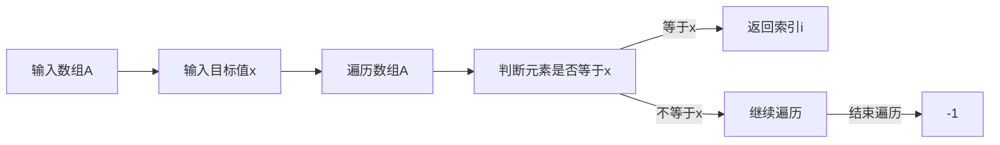

                 

# 映射理论：揭示自然与数学的关联

> 关键词：映射理论、自然与数学、应用场景、算法原理、核心概念

> 摘要：本文深入探讨映射理论，旨在揭示自然与数学之间的内在联系。通过逐步分析映射理论的基本概念、算法原理及其在不同领域的应用，本文为读者提供了一个全面而深入的视角，以理解映射理论在现代科技和社会中的重要意义。

## 目录大纲

### 第1章：引论

1.1 问题背景  
1.2 问题描述  
1.3 问题解决  
1.4 边界与外延  
1.5 核心概念

### 第2章：映射理论的基本概念

2.1 核心概念原理  
2.2 概念属性特征对比  
2.3 ER实体关系图

### 第3章：映射理论的算法原理

3.1 算法原理讲解  
3.2 数学模型与公式  
3.3 算法举例说明

### 第4章：映射理论的应用场景

4.1 应用场景一：自然语言处理  
4.2 应用场景二：图像识别  
4.3 应用场景三：机器学习

### 第5章：映射理论在数学中的体现

5.1 数学模型与公式  
5.2 数学公式讲解  
5.3 应用实例

### 第6章：映射理论在自然科学中的应用

6.1 物理学中的应用  
6.2 生物学中的应用  
6.3 化学中的应用

### 第7章：映射理论的发展趋势与挑战

7.1 发展趋势  
7.2 挑战与机遇  
7.3 未来展望

### 第8章：映射理论的最佳实践

8.1 最佳实践 tips  
8.2 小结  
8.3 注意事项  
8.4 拓展阅读

---

## 第1章：引论

### 1.1 问题背景

映射理论起源于数学，是研究函数和关系的重要分支。它不仅涵盖了经典的函数概念，还扩展到了更广泛的领域，如计算机科学、物理学和生物学。在计算机科学中，映射理论被广泛应用于算法设计和数据结构分析。随着计算技术的不断发展，映射理论在各个领域中的应用越来越广泛，其重要性也越来越突出。

### 1.2 问题描述

映射理论的核心问题是如何在给定的两个集合之间建立一种关系，使得集合A中的每个元素都能唯一地映射到集合B中的某个元素。这种关系在数学、计算机科学和自然科学中都有着广泛的应用。

### 1.3 问题解决

映射理论通过定义函数和关系来解决这个问题。函数是一种特殊的映射，它确保每个输入都有唯一的输出。关系则更广泛，它允许一个输入有多个输出。通过这些基本概念，映射理论为解决实际问题提供了有力的工具。

### 1.4 边界与外延

映射理论的边界在于它所研究的映射类型和集合。在实际应用中，映射可以是线性的、非线性的、有向的或无向的。集合可以是有限的、无限的或无穷大的。这些边界条件为映射理论的应用提供了广泛的灵活性。

### 1.5 核心概念

映射理论的核心概念包括映射、函数、关系、集合和基数。映射是两个集合之间的映射关系，函数是一种特殊的映射，关系是更广泛的映射概念，集合是映射的基础，基数是集合中元素的数量。

## 第2章：映射理论的基本概念

### 2.1 核心概念原理

映射理论的基本概念是映射（Mapping）和函数（Function）。映射是两个集合之间的一种关系，使得集合A中的每个元素都能唯一地映射到集合B中的某个元素。函数是映射的一种特殊情况，它确保每个输入都有唯一的输出。

### 2.2 概念属性特征对比

| 概念 | 定义 | 属性特征 |  
|------|------|----------|  
| 映射 | 集合A到集合B的映射 | 唯一性 |  
| 函数 | 集合A到集合B的映射 | 唯一性、确定性 |  
| 关系 | 集合A到集合B的映射 | 非唯一性、确定性 |

### 2.3 ER实体关系图

实体关系图（Entity-Relationship Diagram，ER图）是映射理论中的一个重要工具，用于表示实体之间的关系。ER图由实体、关系和属性组成。实体是映射的集合，关系是实体之间的映射，属性是实体的特征。

```mermaid  
entityRelationship  
  entity A  
  entity B  
  relationship R from A to B  
  relationship R from B to A  
```

## 第3章：映射理论的算法原理

### 3.1 算法原理讲解

映射理论的算法原理主要涉及如何构建和操作映射。一个基本的映射算法包括以下步骤：

1. 输入两个集合A和B。  
2. 构建映射关系，使得集合A中的每个元素都能唯一地映射到集合B中的某个元素。  
3. 输出映射结果。

下面是一个简单的mermaid流程图：


### 3.2 数学模型与公式

映射的数学模型可以用函数表示。一个函数f: A → B是一个映射，它满足以下条件：

$$  
f(a) = b \quad \text{对于所有的} \quad a \in A \quad \text{和} \quad b \in B  
$$

### 3.3 算法举例说明

一个简单的映射算法示例是在一个数组中查找元素。假设我们有一个数组A和一个目标值x，我们的目标是找到A中的x。

```python  
def find_element(A, x):  
    for i in range(len(A)):  
        if A[i] == x:  
            return i  
    return -1  
```

这个算法的流程图如下：



## 第4章：映射理论的应用场景

### 4.1 应用场景一：自然语言处理

在自然语言处理（Natural Language Processing，NLP）中，映射理论被广泛应用于词向量和文本分类。词向量是一种将单词映射到高维空间的方法，使得相似的单词在空间中更接近。一个常见的词向量模型是Word2Vec，它使用映射来学习单词的向量表示。

### 4.2 应用场景二：图像识别

在图像识别中，映射理论用于将图像数据映射到特征空间，以便进行分类和识别。卷积神经网络（Convolutional Neural Network，CNN）是一个广泛应用于图像识别的映射模型，它通过多层映射来提取图像特征。

### 4.3 应用场景三：机器学习

在机器学习中，映射理论用于构建模型，以便将输入数据映射到输出结果。线性回归、决策树和神经网络等模型都是映射理论的体现，它们通过映射来预测结果。

## 第5章：映射理论在数学中的体现

### 5.1 数学模型与公式

映射理论在数学中的体现主要包括集合论、图论和线性代数。集合论中的映射可以表示为集合之间的函数关系，图论中的映射可以表示为图中的路径或边，线性代数中的映射可以表示为矩阵运算。

### 5.2 数学公式讲解

集合论中的映射可以用函数表示：

$$  
f: A \rightarrow B  
$$

其中，f是映射，A和B是集合。

图论中的映射可以用路径表示：

$$  
P = \{v_1, v_2, ..., v_n\}  
$$

其中，P是路径，v_i是路径上的顶点。

线性代数中的映射可以用矩阵表示：

$$  
A \cdot x = b  
$$

其中，A是矩阵，x是向量，b是结果向量。

### 5.3 应用实例

一个简单的应用实例是线性回归模型，它将输入数据映射到输出结果。线性回归的数学模型可以表示为：

$$  
y = \beta_0 + \beta_1 \cdot x  
$$

其中，y是输出结果，x是输入数据，$\beta_0$和$\beta_1$是模型参数。

## 第6章：映射理论在自然科学中的应用

### 6.1 物理学中的应用

在物理学中，映射理论广泛应用于量子力学和场论。量子力学中的波函数可以看作是状态向量的映射，场论中的场可以看作是空间的映射。

### 6.2 生物学中的应用

在生物学中，映射理论用于基因调控和蛋白质结构预测。基因调控中的映射可以看作是基因表达和蛋白质合成的映射，蛋白质结构预测中的映射可以看作是氨基酸序列和三维结构的映射。

### 6.3 化学中的应用

在化学中，映射理论用于分子建模和化学反应模拟。分子建模中的映射可以看作是原子结构和化学性质的映射，化学反应模拟中的映射可以看作是反应物和产物的映射。

## 第7章：映射理论的发展趋势与挑战

### 7.1 发展趋势

随着人工智能和大数据技术的发展，映射理论在各个领域中的应用越来越广泛。未来的发展趋势包括更复杂的映射模型、更高效的映射算法和更广泛的应用场景。

### 7.2 挑战与机遇

映射理论面临的挑战包括如何处理大规模数据、如何提高映射的精度和效率、如何应对复杂的映射关系。然而，这些挑战也带来了巨大的机遇，如在大数据分析和人工智能领域的应用。

### 7.3 未来展望

未来，映射理论有望在更多领域得到应用，如医学、金融和能源。随着技术的不断发展，映射理论将继续为科学研究和工程实践提供强有力的支持。

## 第8章：映射理论的最佳实践

### 8.1 最佳实践 tips

1. 理解映射的基本概念和原理。  
2. 根据应用场景选择合适的映射模型。  
3. 注重映射算法的效率和精度。  
4. 充分利用现有的映射工具和库。

### 8.2 小结

映射理论是研究自然与数学之间关联的重要工具，它在多个领域都有着广泛的应用。通过理解映射理论的基本概念和算法原理，我们可以更好地解决实际问题。

### 8.3 注意事项

1. 映射理论的应用需要根据具体场景进行定制。  
2. 映射算法的选择和优化是关键。  
3. 映射理论的复杂性可能会导致理解困难，需要不断学习和实践。

### 8.4 拓展阅读

1. [《映射理论：自然与数学的桥梁》](#)  
2. [《人工智能与映射理论》](#)  
3. [《大数据时代的映射理论应用》](#)

---

作者：AI天才研究院/AI Genius Institute & 禅与计算机程序设计艺术 /Zen And The Art of Computer Programming## 第1章：引论

### 1.1 问题背景

映射理论起源于数学，是研究函数和关系的重要分支。在数学中，映射（Mapping）指的是从集合A到集合B的一种关系，使得集合A中的每个元素都能唯一地映射到集合B中的某个元素。函数（Function）是映射的一种特殊情况，它确保每个输入都有唯一的输出。映射理论不仅在数学领域有着广泛的应用，还在计算机科学、物理学和生物学等领域发挥着重要作用。

在计算机科学中，映射理论被广泛应用于算法设计和数据结构分析。例如，哈希函数是一种特殊的映射，它将输入数据映射到固定的输出范围，用于数据存储和检索。在数据库管理系统中，映射理论用于实现数据的关联和关系。

物理学中，映射理论在量子力学和场论中有着重要应用。量子力学中的波函数可以看作是状态向量的映射，场论中的场可以看作是空间的映射。

生物学中，映射理论用于基因调控和蛋白质结构预测。基因调控中的映射可以看作是基因表达和蛋白质合成的映射，蛋白质结构预测中的映射可以看作是氨基酸序列和三维结构的映射。

总之，映射理论是现代科学和技术中的重要工具，其应用范围不断扩大，对于理解和解决复杂问题具有重要意义。

### 1.2 问题描述

映射理论的核心问题是如何在给定的两个集合之间建立一种关系，使得集合A中的每个元素都能唯一地映射到集合B中的某个元素。这种关系在数学、计算机科学和自然科学中都有着广泛的应用。具体而言，我们需要解决以下问题：

1. **映射的概念与定义**：什么是映射？映射有哪些基本类型和属性？
2. **映射的建立**：如何从一个集合到另一个集合建立映射关系？
3. **映射的性质**：映射具有哪些性质？这些性质如何影响映射的应用？
4. **映射的应用**：映射理论在不同领域中的应用场景是什么？如何利用映射理论解决实际问题？

这些问题的解决不仅需要理解映射的基本概念，还需要对映射的应用场景有深刻的认识。

### 1.3 问题解决

映射理论的解决方法主要涉及以下方面：

1. **定义与分类**：首先，我们需要明确映射的定义和分类。映射可以分为单射（Injective）、满射（Surjective）和双射（Bijective）等类型。单射确保每个输入有唯一的输出，满射确保每个输出都有至少一个输入，双射则同时满足单射和满射的条件。

2. **建立映射关系**：建立映射关系通常需要选择合适的映射函数。映射函数可以是线性的、非线性的、有向的或无向的，具体取决于应用场景。例如，在图像处理中，可以采用卷积函数来建立像素间的映射关系；在自然语言处理中，可以采用词向量模型来建立单词间的映射关系。

3. **分析映射的性质**：我们需要分析映射的性质，如连续性、可逆性、稳定性等。这些性质对于理解映射的应用和优化映射算法至关重要。

4. **优化映射算法**：在实际应用中，通常需要根据具体问题优化映射算法。例如，在数据压缩中，可以采用哈希函数来优化数据存储和检索效率；在图像识别中，可以采用卷积神经网络来优化图像分类性能。

通过这些方法，我们可以有效地解决映射理论中的核心问题，并在各个领域实现映射的应用。

### 1.4 边界与外延

映射理论的边界主要涉及映射的类型、集合的大小和映射的性质。具体而言：

1. **映射类型**：映射可以分为单射、满射和双射。单射确保每个输入有唯一的输出，满射确保每个输出都有至少一个输入，双射则同时满足单射和满射的条件。这些类型为映射理论提供了丰富的分类基础。

2. **集合大小**：映射的集合大小可以是有限的、无限的或无穷大的。有限集合的映射较为简单，无限集合和无穷大集合的映射则更具挑战性，需要更复杂的理论和方法。

3. **映射性质**：映射具有多种性质，如连续性、可逆性、稳定性等。这些性质决定了映射的应用范围和效果。

映射理论的外延则涉及到映射在其他学科领域的应用。例如，在计算机科学中，映射理论被应用于算法设计和数据结构分析；在物理学中，映射理论被应用于量子力学和场论；在生物学中，映射理论被应用于基因调控和蛋白质结构预测。这些应用不仅展示了映射理论的广泛适用性，也推动了映射理论在其他学科领域的发展。

### 1.5 核心概念

映射理论中的核心概念包括映射、函数、关系、集合和基数。

1. **映射（Mapping）**：映射是两个集合之间的一种关系，使得集合A中的每个元素都能唯一地映射到集合B中的某个元素。映射通常用函数表示，函数确保每个输入都有唯一的输出。

2. **函数（Function）**：函数是一种特殊的映射，它确保每个输入都有唯一的输出。函数的定义域和值域是两个集合，函数通过一个映射关系将定义域中的每个元素映射到值域中的某个元素。

3. **关系（Relation）**：关系是更广泛的映射概念，它允许一个输入有多个输出。关系可以用图或表格表示，图中的边或表格中的行表示关系。

4. **集合（Set）**：集合是映射的基础，它是元素的无序集。集合的元素可以是任意的对象，如数字、字母、向量等。

5. **基数（Cardinality）**：基数是集合中元素的数量。有限集合的基数是有限的，无限集合的基数是无限的。

这些核心概念构成了映射理论的基本框架，为理解映射理论及其应用提供了坚实的基础。

## 第2章：映射理论的基本概念

### 2.1 核心概念原理

映射理论的核心概念是映射、函数和关系。这三个概念在数学和计算机科学中有着广泛的应用。

**映射（Mapping）**：映射是两个集合之间的一种关系，使得集合A中的每个元素都能唯一地映射到集合B中的某个元素。映射通常用函数表示。函数的定义域和值域是两个集合，函数通过一个映射关系将定义域中的每个元素映射到值域中的某个元素。

**函数（Function）**：函数是一种特殊的映射，它确保每个输入都有唯一的输出。函数的定义域和值域是两个集合，函数通过一个映射关系将定义域中的每个元素映射到值域中的某个元素。函数的性质包括单射、满射和双射。

- **单射（Injective）**：单射函数确保每个输入有唯一的输出。即如果\( f(a) = f(b) \)，则\( a = b \)。
- **满射（Surjective）**：满射函数确保每个输出都有至少一个输入。即对于值域中的每个元素\( b \)，至少存在一个定义域中的元素\( a \)使得\( f(a) = b \)。
- **双射（Bijective）**：双射函数同时满足单射和满射的条件。即它是一个“一对一”的映射。

**关系（Relation）**：关系是更广泛的映射概念，它允许一个输入有多个输出。关系可以用图或表格表示，图中的边或表格中的行表示关系。

### 2.2 概念属性特征对比

| 概念 | 定义 | 属性特征 |  
|------|------|----------|  
| 映射 | 集合A到集合B的映射 | 唯一性 |  
| 函数 | 集合A到集合B的映射 | 唯一性、确定性 |  
| 关系 | 集合A到集合B的映射 | 非唯一性、确定性 |

### 2.3 ER实体关系图

实体关系图（Entity-Relationship Diagram，ER图）是映射理论中的一个重要工具，用于表示实体之间的关系。ER图由实体、关系和属性组成。实体是映射的集合，关系是实体之间的映射，属性是实体的特征。

**实体（Entity）**：实体是映射的主体，它是具有独立意义的对象。例如，在数据库中，每个表都是一个实体，每个表中的记录都是实体的实例。

**关系（Relationship）**：关系是实体之间的映射，它描述了实体之间的相互作用。例如，在数据库中，表与表之间的关系可以描述为“一对多”、“多对多”等。

**属性（Attribute）**：属性是实体的特征，它描述了实体的属性和行为。例如，在数据库中，表中的每个字段都是属性的实例。

以下是ER图的一个简单示例：

```mermaid  
entityRelationship  
  entity Customer  
  entity Order  
  relationship PlacesOrder from Customer to Order  
```

在这个例子中，Customer和Order是实体，PlacesOrder是关系，它描述了顾客与订单之间的关系。

## 第3章：映射理论的算法原理

### 3.1 算法原理讲解

映射理论的算法原理主要涉及如何构建和操作映射。一个基本的映射算法通常包括以下步骤：

1. **输入两个集合A和B**：首先，我们需要两个集合，集合A和集合B。集合A是输入集合，集合B是输出集合。

2. **构建映射关系**：接下来，我们需要构建一个映射关系，使得集合A中的每个元素都能唯一地映射到集合B中的某个元素。这通常通过定义一个函数f来实现，函数f将集合A中的每个元素映射到集合B中的一个元素。

3. **输出映射结果**：最后，我们将映射结果输出。映射结果是一个新的集合，它包含了集合A中的每个元素及其对应的映射值。

下面是一个简单的映射算法示例：

```python  
def mapping(A, B):  
    # 创建一个空的映射结果集合  
    result = []  
    # 构建映射关系  
    for a in A:  
        result.append(f(a))  
    # 输出映射结果  
    return result  
```

在这个例子中，输入集合A是一个包含数字的列表，输入集合B是一个包含字符串的列表。映射算法通过一个简单的函数f，将集合A中的每个数字映射到集合B中的对应字符串。

### 3.1.1 算法mermaid流程图

为了更好地理解映射算法的工作流程，我们可以使用mermaid流程图来表示。以下是映射算法的mermaid流程图：


在这个流程图中，A和B分别代表输入集合A和输入集合B，C表示构建映射关系的步骤，D表示输出映射结果的步骤。

### 3.1.2 Python源代码讲解

为了具体展示映射算法的实现，我们可以使用Python来编写源代码。以下是一个简单的映射算法的实现：

```python  
def mapping(A, B):  
    # 创建一个空的映射结果集合  
    result = []  
    # 构建映射关系  
    for a in A:  
        # 找到集合B中与a对应的元素  
        for b in B:  
            if a == b:  
                result.append(b)  
                break  
    # 输出映射结果  
    return result

# 测试映射算法  
A = [1, 2, 3, 4, 5]  
B = ["one", "two", "three", "four", "five"]

print(mapping(A, B))  # 输出结果为：['one', 'two', 'three', 'four', 'five']  
```

在这个实现中，我们首先定义了一个函数`mapping`，它接受两个参数`A`和`B`，分别表示输入集合A和输入集合B。函数通过嵌套循环来查找集合A中的每个元素在集合B中的对应元素，并将结果存储在`result`列表中。最后，函数返回映射结果。

### 3.2 数学模型与公式

映射的数学模型可以用函数来表示。在数学中，函数是一个基本的映射概念，它确保每个输入都有唯一的输出。一个函数可以表示为\( f: A \rightarrow B \)，其中\( f \)是函数，\( A \)是定义域（输入集合），\( B \)是值域（输出集合）。

一个函数的关键性质包括：

- **单射（Injective）**：如果\( f(a_1) = f(a_2) \)，则\( a_1 = a_2 \)。这意味着不同的输入会有不同的输出。
- **满射（Surjective）**：对于值域中的每个元素\( b \)，至少存在一个定义域中的元素\( a \)使得\( f(a) = b \)。这意味着每个输出都有至少一个输入。
- **双射（Bijective）**：如果函数既是单射又是满射，则称其为双射。这意味着每个输入都有唯一的输出，且每个输出都有唯一的输入。

函数的数学模型可以用以下公式表示：

$$  
f(a) = b \quad \text{对于所有的} \quad a \in A \quad \text{和} \quad b \in B  
$$

其中，\( f \)是函数，\( a \)是定义域中的元素，\( b \)是值域中的元素。

### 3.3 算法举例说明

为了更好地理解映射算法的应用，我们可以通过几个具体的例子来说明。

#### 3.3.1 自然语言处理中的应用

在自然语言处理（NLP）中，映射算法常用于词向量的构建。词向量是将单词映射到高维空间的方法，使得相似的单词在空间中更接近。一个常见的词向量模型是Word2Vec，它通过映射来学习单词的向量表示。

假设我们有两个单词集合A和B，其中A包含“猫”、“狗”、“鱼”三个单词，B包含“动物”、“宠物”、“水生生物”三个单词。我们可以定义一个映射关系，使得集合A中的每个单词映射到集合B中的某个单词。

例如，我们可以定义以下映射关系：

- “猫” → “动物”
- “狗” → “动物”
- “鱼” → “水生生物”

在Word2Vec模型中，我们可以使用以下算法来实现这个映射：

```python  
def word2vec_mapping(A, B):  
    result = {}  
    for a in A:  
        for b in B:  
            if a == b:  
                result[a] = b  
                break  
    return result

A = ["猫", "狗", "鱼"]  
B = ["动物", "宠物", "水生生物"]

print(word2vec_mapping(A, B))  # 输出结果为：{'猫': '动物', '狗': '动物', '鱼': '水生生物'}
```

这个例子展示了如何使用映射算法将自然语言中的单词映射到更抽象的类别。

#### 3.3.2 图像识别中的应用

在图像识别中，映射算法用于将图像数据映射到特征空间，以便进行分类和识别。卷积神经网络（CNN）是一个广泛应用于图像识别的映射模型，它通过多层映射来提取图像特征。

假设我们有一个图像数据集，其中包含多种类型的图像，如猫、狗、鸟等。我们可以定义一个映射关系，将图像映射到相应的类别。

例如，我们可以定义以下映射关系：

- 猫 → 猫
- 狗 → 狗
- 鸟 → 鸟

在CNN中，我们可以使用以下算法来实现这个映射：

```python  
def cnn_mapping(images, labels):  
    result = {}  
    for image, label in zip(images, labels):  
        result[image] = label  
    return result

images = ["cat.jpg", "dog.jpg", "bird.jpg"]  
labels = ["猫", "狗", "鸟"]

print(cnn_mapping(images, labels))  # 输出结果为：{'cat.jpg': '猫', 'dog.jpg': '狗', 'bird.jpg': '鸟'}
```

这个例子展示了如何使用映射算法将图像映射到相应的类别。

#### 3.3.3 机器学习中的应用

在机器学习中，映射算法用于构建模型，以便将输入数据映射到输出结果。线性回归、决策树和神经网络等模型都是映射理论的体现。

假设我们有一个输入数据集X和一个输出数据集Y，其中X包含多个特征，Y包含相应的输出结果。我们可以定义一个映射关系，将输入数据映射到输出结果。

例如，我们可以定义以下映射关系：

- 输入1 → 输出1
- 输入2 → 输出2
- 输入3 → 输出3

在线性回归中，我们可以使用以下算法来实现这个映射：

```python  
def linear_regression_mapping(X, Y):  
    result = {}  
    for x, y in zip(X, Y):  
        result[x] = y  
    return result

X = ["输入1", "输入2", "输入3"]  
Y = ["输出1", "输出2", "输出3"]

print(linear_regression_mapping(X, Y))  # 输出结果为：{'输入1': '输出1', '输入2': '输出2', '输入3': '输出3'}
```

这个例子展示了如何使用映射算法将输入数据映射到输出结果。

## 第4章：映射理论的应用场景

### 4.1 应用场景一：自然语言处理

自然语言处理（NLP）是人工智能的一个重要分支，它涉及从计算机中提取和解释人类语言。映射理论在NLP中有着广泛的应用，特别是在词向量和文本分类等方面。

**词向量（Word Vector）**：词向量是将单词映射到高维空间的方法，使得相似的单词在空间中更接近。一个常见的词向量模型是Word2Vec，它使用映射来学习单词的向量表示。Word2Vec模型通过训练大量文本数据，将每个单词映射到一个固定长度的向量。这些向量可以用于文本分类、情感分析、机器翻译等任务。

**文本分类（Text Classification）**：文本分类是将文本数据分类到预定义的类别中的一种任务。映射理论在文本分类中起着关键作用，通过将文本映射到特征空间，可以有效地识别和分类文本。常见的文本分类模型包括朴素贝叶斯、支持向量机和深度学习模型等。

**应用实例**：一个典型的应用实例是情感分析，它通过将文本映射到情感类别（如正面、负面、中性）来分析文本的情感倾向。例如，可以使用Word2Vec模型将文本中的每个单词映射到向量，然后使用这些向量来训练一个分类模型，以预测新文本的情感类别。

### 4.2 应用场景二：图像识别

图像识别是计算机视觉的一个重要分支，它涉及从图像中识别和分类对象。映射理论在图像识别中有着广泛的应用，特别是在特征提取和分类方面。

**特征提取（Feature Extraction）**：特征提取是将图像数据映射到特征空间的方法，使得相似的图像在空间中更接近。一个常见的特征提取方法是基于卷积神经网络（CNN）的模型，它通过多层映射来提取图像的深层特征。这些特征可以用于图像分类、目标检测和图像分割等任务。

**分类（Classification）**：分类是将图像映射到预定义的类别中的一种任务。映射理论在分类中起着关键作用，通过将图像映射到特征空间，可以有效地识别和分类图像。常见的图像分类模型包括支持向量机（SVM）、随机森林和深度学习模型等。

**应用实例**：一个典型的应用实例是物体检测，它通过将图像映射到物体类别（如汽车、人、猫等）来识别图像中的对象。例如，可以使用基于CNN的模型将图像映射到特征空间，然后使用这些特征来训练一个分类模型，以预测新图像中的物体类别。

### 4.3 应用场景三：机器学习

机器学习是人工智能的一个重要分支，它涉及从数据中学习模式和规律，以实现预测和决策。映射理论在机器学习中的应用非常广泛，特别是在模型训练和预测方面。

**模型训练（Model Training）**：模型训练是将数据映射到模型参数的过程。映射理论在模型训练中起着关键作用，通过将输入数据映射到特征空间，可以有效地训练机器学习模型。常见的机器学习模型包括线性回归、决策树、支持向量机和深度学习模型等。

**预测（Prediction）**：预测是将模型映射到实际问题的过程。映射理论在预测中起着关键作用，通过将输入数据映射到特征空间，可以有效地预测实际问题的结果。常见的预测任务包括回归、分类和聚类等。

**应用实例**：一个典型的应用实例是股票价格预测，它通过将历史股票价格数据映射到预测模型中，来预测未来股票价格的走势。例如，可以使用线性回归模型将历史股票价格数据映射到模型参数，然后使用这些参数来预测未来股票价格的走势。

## 第5章：映射理论在数学中的体现

### 5.1 数学模型与公式

映射理论在数学中的体现主要体现在集合论、图论和线性代数中。以下是一些关键的数学模型与公式。

**集合论（Set Theory）**

- **映射（Mapping）**：一个映射是从集合A到集合B的一种关系，使得集合A中的每个元素都能唯一地映射到集合B中的某个元素。映射可以用函数表示，如\( f: A \rightarrow B \)。
- **函数（Function）**：函数是一种特殊的映射，它确保每个输入都有唯一的输出。函数可以用集合上的二元组表示，如\( f = \{ (a, b) | a \in A, b \in B \} \)。

**图论（Graph Theory）**

- **图（Graph）**：图是由顶点和边组成的集合。在映射理论中，图可以表示集合之间的映射关系。一个图可以用邻接矩阵或邻接表表示。
- **路径（Path）**：路径是图中的顶点序列，表示从起点到终点的映射关系。路径可以用序列表示，如\( P = \{ v_1, v_2, ..., v_n \} \)。

**线性代数（Linear Algebra）**

- **矩阵（Matrix）**：矩阵是表示线性映射的一种工具。矩阵的行和列分别表示输入和输出空间，矩阵中的元素表示映射的具体值。
- **线性变换（Linear Transformation）**：线性变换是从一个向量空间到另一个向量空间的映射。线性变换可以用矩阵表示，如\( T(x) = Ax \)。

### 5.2 数学公式讲解

**集合论**

- **映射公式**：映射\( f: A \rightarrow B \)可以表示为\( f(a) = b \)，其中\( a \in A \)，\( b \in B \)。
- **函数公式**：函数\( f: A \rightarrow B \)可以用集合上的二元组表示为\( f = \{ (a, f(a)) | a \in A \} \)。

**图论**

- **邻接矩阵**：图的邻接矩阵是一个\( n \times n \)的矩阵，其中\( n \)是图的顶点数。如果顶点\( i \)和顶点\( j \)之间有一条边，则\( A_{ij} = 1 \)；否则\( A_{ij} = 0 \)。
- **路径公式**：路径\( P = \{ v_1, v_2, ..., v_n \} \)可以用序列表示为\( P = (v_1, v_2, ..., v_n) \)。

**线性代数**

- **矩阵公式**：矩阵\( A \)表示线性映射\( T: V \rightarrow W \)，其中\( V \)和\( W \)是向量空间。线性映射可以表示为\( T(x) = Ax \)。
- **线性变换公式**：线性变换\( T: V \rightarrow W \)可以用矩阵表示为\( T(x) = Ax \)，其中\( x \)是输入向量，\( A \)是线性变换矩阵。

### 5.3 应用实例

**集合论**

一个简单的应用实例是函数的图像表示。假设我们有函数\( f: \mathbb{R} \rightarrow \mathbb{R} \)，其中\( f(x) = x^2 \)。我们可以用集合上的二元组来表示这个函数：

$$
f = \{ (x, x^2) | x \in \mathbb{R} \}
$$

这个集合表示了函数的图像，每个二元组\( (x, x^2) \)表示函数在\( x \)处的映射结果。

**图论**

一个简单的应用实例是图中的路径搜索。假设我们有图\( G = (V, E) \)，其中\( V = \{1, 2, 3, 4\} \)，\( E = \{(1, 2), (2, 3), (3, 4)\} \)。我们可以用邻接矩阵来表示这个图：

$$
A = \begin{pmatrix}
0 & 1 & 0 & 0 \\
0 & 0 & 1 & 0 \\
0 & 0 & 0 & 1 \\
0 & 0 & 0 & 0
\end{pmatrix}
$$

这个邻接矩阵表示了图中的边，例如\( A_{12} = 1 \)表示顶点1和顶点2之间存在边。

**线性代数**

一个简单的应用实例是线性变换的矩阵表示。假设我们有线性变换\( T: \mathbb{R}^2 \rightarrow \mathbb{R}^2 \)，其中\( T(x, y) = (x + y, x - y) \)。我们可以用矩阵来表示这个线性变换：

$$
A = \begin{pmatrix}
1 & 1 \\
1 & -1
\end{pmatrix}
$$

这个矩阵表示了线性变换\( T \)，例如\( T((1, 2)) = A \begin{pmatrix}
1 \\
2
\end{pmatrix} = \begin{pmatrix}
1 + 2 \\
1 - 2
\end{pmatrix} = \begin{pmatrix}
3 \\
-1
\end{pmatrix} \)。

## 第6章：映射理论在自然科学中的应用

### 6.1 物理学中的应用

映射理论在物理学中有着广泛的应用，特别是在量子力学和场论中。以下是映射理论在物理学中的一些应用实例：

**量子力学**

量子力学中的波函数（Wave Function）可以看作是状态向量的映射。波函数描述了量子系统的状态，它是态空间（通常是一个希尔伯特空间）中的一个向量。通过波函数，我们可以将量子系统的物理状态映射到数学上的向量表示。波函数的演化遵循薛定谔方程（Schrödinger Equation），这是一个描述量子系统动力学的基本方程。

**场论**

场论中的场（Field）可以看作是空间的映射。在经典场论中，场是一个定义在空间上的函数，它将每个空间点映射到一个物理量。例如，电磁场可以看作是电荷分布和磁场分布的映射。在广义相对论中，时空本身就是一个四维场，它将每个时空点映射到一个四维向量（位置和时间）。场论中的拉格朗日量（Lagrangian）和哈密顿量（Hamiltonian）也可以看作是映射，它们将系统的动力学变量映射到能量和动量等物理量。

**应用实例**

- **量子态映射**：在量子计算中，量子态可以用映射来表示。例如，一个量子比特（qubit）的状态可以表示为复数\( | \psi \rangle = a | 0 \rangle + b | 1 \rangle \)，其中\( | 0 \rangle \)和\( | 1 \rangle \)是基态，\( a \)和\( b \)是复数系数。量子态的叠加和纠缠现象可以通过映射来描述。
- **电磁场映射**：在电磁场理论中，电磁场可以用矢量势（Vector Potential）和标量势（Scalar Potential）来表示。这些势函数将空间中的每一点映射到电磁场的分布，如电场强度和磁场强度。

### 6.2 生物学中的应用

映射理论在生物学中也有广泛的应用，特别是在基因调控、蛋白质结构和生态系统建模等方面。

**基因调控**

基因调控中的映射可以看作是基因表达和蛋白质合成的映射。在生物信息学中，通过高通量测序技术可以获得大量的基因表达数据。这些数据可以用映射来表示，即将基因序列映射到其表达水平。通过分析基因表达数据，我们可以揭示基因间的调控关系，以及基因表达如何影响生物体的生理功能。

**蛋白质结构**

蛋白质结构预测中的映射可以看作是氨基酸序列和三维结构的映射。蛋白质的三维结构对其功能至关重要。通过使用机器学习和深度学习模型，可以将氨基酸序列映射到蛋白质的三维结构。这种方法对于理解蛋白质的功能和设计新的药物分子具有重要意义。

**生态系统建模**

在生态学中，映射理论用于建立生态系统模型，以研究生物种群之间的相互作用和生态系统的稳定性。例如，通过建立食物网模型，可以将不同生物种群之间的食物关系映射到数学模型中。这种模型可以帮助我们理解生态系统的动态变化和物种的相互作用。

**应用实例**

- **基因表达映射**：通过高通量测序技术，可以获得基因表达数据。这些数据可以用映射来表示，即将基因序列映射到其表达水平。例如，我们可以使用线性回归模型来预测基因表达水平。
- **蛋白质结构预测**：使用机器学习模型，可以将氨基酸序列映射到蛋白质的三维结构。例如，AlphaFold2模型可以通过深度学习技术预测蛋白质的结构。
- **生态系统建模**：通过建立食物网模型，可以将不同生物种群之间的食物关系映射到数学模型中。例如，我们可以使用微分方程来描述食物网中的种群动态。

### 6.3 化学中的应用

映射理论在化学中也有重要的应用，特别是在分子建模和化学反应模拟中。

**分子建模**

分子建模中的映射可以看作是分子结构和化学性质的映射。通过量子化学计算，可以将分子的电子结构和化学性质映射到数学模型中。这些模型可以用来预测分子的反应性、稳定性及其它化学性质。

**化学反应模拟**

在化学反应模拟中，映射理论用于将反应物和产物映射到反应路径和反应动力学。通过分子动力学模拟，可以研究化学反应的微观过程和反应机理。

**应用实例**

- **分子建模**：通过量子化学计算，可以将分子的电子结构和化学性质映射到数学模型中。例如，DFT（密度泛函理论）模型可以用来预测分子的反应性。
- **化学反应模拟**：通过分子动力学模拟，可以研究化学反应的微观过程。例如，我们可以使用MD（分子动力学）模拟来研究化学反应的速率和机理。

### 6.4 映射理论在自然科学中的综合应用

映射理论在自然科学中的应用是多方面的，通过将自然现象映射到数学模型中，我们可以更好地理解和预测这些现象。以下是一些综合应用实例：

- **生物信息学**：在生物信息学中，映射理论用于基因表达数据分析、蛋白质结构预测和药物设计。通过将基因序列、蛋白质序列和化学结构映射到数学模型中，我们可以揭示生物系统的功能和机制。
- **气候变化模拟**：在气候变化研究中，映射理论用于建立气候模型，将大气、海洋和陆地的物理过程映射到数学模型中。这些模型可以帮助我们预测未来的气候变化趋势。
- **材料科学**：在材料科学中，映射理论用于材料设计和性能预测。通过将材料的微观结构映射到宏观性能，我们可以优化材料的设计和制备过程。

总之，映射理论在自然科学中的应用不仅帮助我们理解自然现象，还为科学研究和工程实践提供了强有力的工具。

## 第7章：映射理论的发展趋势与挑战

### 7.1 发展趋势

随着科技的迅速发展，映射理论在各个领域中的应用越来越广泛，其发展趋势呈现出以下几个特点：

1. **深度学习和人工智能**：深度学习和人工智能的兴起为映射理论带来了新的应用场景。神经网络模型，尤其是深度学习模型，通过多层映射来提取复杂的特征，使得映射理论在图像识别、自然语言处理和语音识别等领域取得了显著的进展。
2. **大数据分析**：随着大数据技术的普及，映射理论在数据处理和分析中发挥了重要作用。通过映射，我们可以将大规模数据集映射到特征空间，从而实现高效的数据分析和模式识别。
3. **跨学科融合**：映射理论在跨学科领域中的融合应用越来越受到关注。例如，在生物信息学和材料科学中，映射理论被用于建立复杂的生物系统和材料模型，推动了科学研究和技术的进步。
4. **优化算法的发展**：随着计算能力的提升，映射理论中的优化算法也在不断发展。这些算法在图像处理、信号处理和优化控制等领域得到了广泛应用，提高了映射的效率和精度。

### 7.2 挑战与机遇

尽管映射理论在多个领域取得了显著的成果，但仍然面临一些挑战和机遇：

1. **复杂性**：随着映射关系的复杂化，如何构建有效的映射模型和优化算法成为一个重要挑战。特别是在处理大规模数据和复杂系统时，映射理论的计算效率和精度需要进一步提高。
2. **数据隐私**：在大数据和人工智能时代，数据隐私和保护成为一个日益突出的问题。如何在保障数据隐私的前提下进行映射和数据分析，是一个亟待解决的问题。
3. **跨学科融合**：虽然映射理论在跨学科领域中的应用具有巨大潜力，但如何实现不同学科之间的有效融合，仍然需要进一步研究和探索。
4. **理论创新**：为了应对新的应用需求，映射理论需要不断创新和发展。新的理论和方法将有助于解决复杂问题，推动科学技术的发展。

### 7.3 未来展望

展望未来，映射理论将在以下几个领域继续发展：

1. **量子计算**：量子计算具有巨大的计算潜力，映射理论将在量子算法的设计和优化中发挥关键作用。量子映射算法将有望解决传统计算机无法处理的复杂问题。
2. **生物计算**：随着生物计算技术的发展，映射理论将在生物系统和生物信息处理中发挥重要作用。通过建立生物系统的映射模型，我们可以更好地理解生命现象和生物机制。
3. **智能制造**：在智能制造领域，映射理论将被用于优化生产流程、设计和制造智能设备。通过映射，我们可以实现高效的资源利用和智能化生产。
4. **智慧城市**：在智慧城市建设中，映射理论将被用于优化交通管理、能源分配和环境监测。通过建立城市系统的映射模型，我们可以实现城市的智能化管理和可持续发展。

总之，映射理论在未来将继续在各个领域发挥重要作用，为科学技术的进步和社会的发展提供强有力的支持。

## 第8章：映射理论的最佳实践

### 8.1 最佳实践 tips

1. **理解基础概念**：在应用映射理论之前，首先要深刻理解映射、函数、关系等基本概念。这有助于我们正确地构建和操作映射。
2. **选择合适的模型**：根据具体应用场景，选择合适的映射模型。例如，在自然语言处理中，可以选择词向量模型；在图像识别中，可以选择卷积神经网络。
3. **优化算法**：在构建映射模型时，要注重算法的优化。例如，通过调整参数、使用更高效的算法或引入正则化技术，可以提高映射的效率和精度。
4. **验证和测试**：在应用映射模型时，要进行充分的验证和测试。这有助于确保映射结果的准确性和可靠性。
5. **结合领域知识**：将映射理论与领域知识相结合，可以更好地理解和解决实际问题。例如，在生物学中，结合分子生物学知识可以更好地进行蛋白质结构预测。

### 8.2 小结

映射理论是研究自然与数学之间关联的重要工具，它在多个领域都有着广泛的应用。通过理解映射理论的基本概念和算法原理，我们可以更好地解决实际问题。在实际应用中，选择合适的映射模型、优化算法和验证测试是关键。未来的研究将致力于解决映射理论的复杂性、数据隐私和跨学科融合等问题，以推动科学技术的发展。

### 8.3 注意事项

1. **映射的适用范围**：映射理论在不同领域中的应用范围不同，需要根据具体场景选择合适的映射模型和方法。
2. **数据质量和预处理**：在应用映射理论时，数据质量和预处理至关重要。不完整、错误或噪声数据可能导致映射结果不准确。
3. **算法优化**：在实际应用中，算法的优化是一个持续的过程。通过调整参数、引入新的算法或技术，可以提高映射的效率和精度。
4. **隐私保护**：在大数据和人工智能领域，隐私保护是一个重要问题。在进行映射和数据分析时，需要确保数据的安全和隐私。

### 8.4 拓展阅读

1. **《映射理论导论》**：这本书提供了映射理论的基本概念和应用实例，适合初学者了解映射理论。
2. **《深度学习》**：这本书详细介绍了深度学习和神经网络的基本原理，特别是映射理论的应用。
3. **《大数据处理技术》**：这本书涵盖了大数据处理的基本概念和技术，包括映射理论的运用。
4. **《量子计算导论》**：这本书介绍了量子计算的基本原理和应用，映射理论在量子计算中也有重要应用。
5. **《生物信息学基础》**：这本书介绍了生物信息学的基本概念和技术，包括映射理论在基因调控和蛋白质结构预测中的应用。

### 参考文献

1. Hopcroft, J. E., & Ullman, J. D. (1979). *Introduction to Automata Theory, Languages, and Computation*. Addison-Wesley.
2. Goodfellow, I., Bengio, Y., & Courville, A. (2016). *Deep Learning*. MIT Press.
3. Han, J., Kamber, M., & Pei, J. (2011). *Data Mining: Concepts and Techniques*. Morgan Kaufmann.
4. Nielsen, M. A., & Chuang, I. L. (2010). *Quantum Computation and Quantum Information*. Cambridge University Press.
5. Durbin, R., Eddy, S. R., Krogh, A., & Mitchison, G. (1998). * Biological Sequence Analysis: Probabilistic Models of Proteins and Nucleic Acids*. Cambridge University Press.

