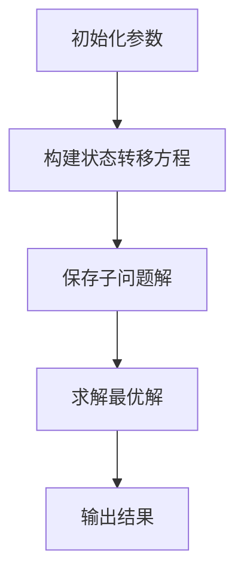

                 


### 第2章：核心概念与模型

#### 2.1 排队网络的定义与结构

排队网络是一种用于描述实体在系统内等待服务并最终得到服务的动态过程模型。在交通系统中，排队网络可以被视为车辆在交通信号灯、收费站、停车场等位置等待服务的模型。

**核心概念：**

- **服务设施**：提供服务的实体，例如交通信号灯、收费亭、服务窗口等。
- **客户源**：产生客户的实体，例如道路上行驶的车辆、行人的聚集地等。
- **排队系统**：描述客户在等待服务时的排队规则和策略。
- **服务规则**：服务设施的运作规则，例如单服务台、多服务台、优先级服务等。

**排队网络的构成：**

排队网络通常由以下几个基本元素组成：

1. **客户到达过程**：描述客户到达服务设施的规律，常见的是泊松过程。
2. **服务过程**：描述客户接受服务的时间，常见的是指数分布。
3. **排队规则**：描述客户在等待服务时的排队规则，常见的是先到先服务（FIFO）、后到先服务（LIFO）等。
4. **服务设施**：描述提供服务的实体，可以是单服务台或多服务台。

**ER实体关系图：**

```mermaid
erDiagram
    Customer ||--|{ QueueSystem }|> ServiceFacility
    ServiceFacility ||--|{ ServiceRule }|
    ServiceFacility ||--|{ ServiceProcess }|
    QueueSystem ||--|{ QueueRule }|
    ServiceProcess ||--|{ ServiceRule }
```

#### 2.2 数学优化方法概述

数学优化方法是解决排队网络问题的重要工具。常用的数学优化方法包括线性规划、整数规划、动态规划等。

**线性规划（Linear Programming，LP）：**

线性规划是一种数学优化技术，用于在给定的约束条件下求解线性目标函数的最大值或最小值。在排队网络优化中，线性规划可以用于求解最小化等待时间或最大化服务设施的利用率。

**整数规划（Integer Programming，IP）：**

整数规划是线性规划的一种扩展，它允许变量取整数值。在排队网络优化中，整数规划可以用于求解具有整数变量的排队网络问题，例如优化交通信号灯的绿灯时间。

**动态规划（Dynamic Programming，DP）：**

动态规划是一种递归算法，它通过将复杂问题分解为子问题，并保存子问题的解来避免重复计算。在排队网络优化中，动态规划可以用于求解具有时间依赖性的排队网络问题，例如最优交通信号灯控制策略。

**算法Mermaid流程图：**



**Python实现示例：**

```python
import numpy as np

# 初始化参数
customers = 100
service_time = 2
queue_length = 10

# 构建状态转移方程
def state_transition_matrix(service_time, queue_length):
    # TODO: 实现状态转移方程
    pass

# 保存子问题解
def save_subproblems(matrix):
    # TODO: 实现保存子问题解
    pass

# 求解最优解
def solve_optimal_solution(matrix):
    # TODO: 实现求解最优解
    pass

# 输出结果
def output_result(solution):
    # TODO: 实现输出结果
    pass

# 运行算法
matrix = state_transition_matrix(service_time, queue_length)
solution = solve_optimal_solution(matrix)
output_result(solution)
```

#### 2.3 城市交通排队网络模型

城市交通排队网络模型用于描述城市交通中的排队现象，包括交通信号灯、停车场、收费站等。以下是一个简化的城市交通排队网络模型：

- **客户到达过程**：假设车辆到达交通信号灯的过程符合泊松分布。
- **服务过程**：假设交通信号灯的服务时间（绿灯时间）是固定的。
- **排队规则**：假设车辆遵循先到先服务的排队规则。
- **服务设施**：假设交通信号灯是一个服务设施。

**数学模型：**

设车辆到达率λ为常数，服务率μ为常数，则交通信号灯的等待时间W和排队长度L的数学模型可以表示为：

- **等待时间模型**：\( W = \frac{\lambda}{\mu - \lambda} \)
- **排队长度模型**：\( L = \frac{\lambda^2}{(\mu - \lambda)^2} \)

**数学公式：**

$$
W = \frac{\lambda}{\mu - \lambda}
$$

$$
L = \frac{\lambda^2}{(\mu - \lambda)^2}
$$

**Python实现示例：**

```python
import numpy as np

# 初始化参数
lambda_value = 10
mu_value = 15

# 计算等待时间
waiting_time = lambda_value / (mu_value - lambda_value)
print(f"等待时间：{waiting_time}")

# 计算排队长度
queue_length = lambda_value**2 / ((mu_value - lambda_value)**2)
print(f"排队长度：{queue_length}")
```

通过以上步骤，我们详细介绍了排队网络的核心概念、数学优化方法以及城市交通排队网络模型的构建过程。在接下来的章节中，我们将进一步探讨各种数学优化方法在排队网络优化中的应用。

