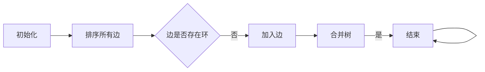
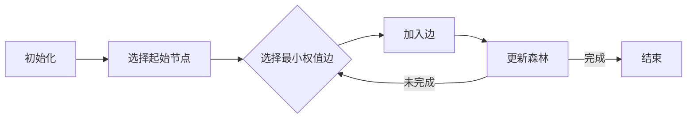
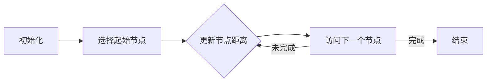
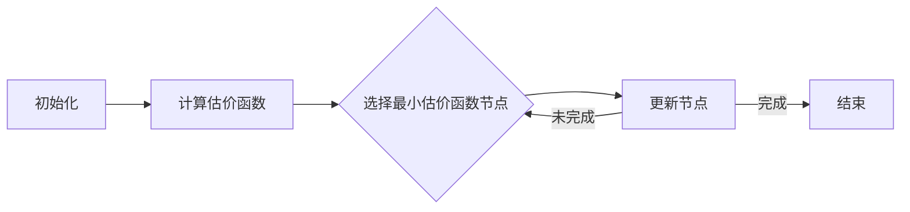
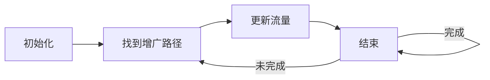
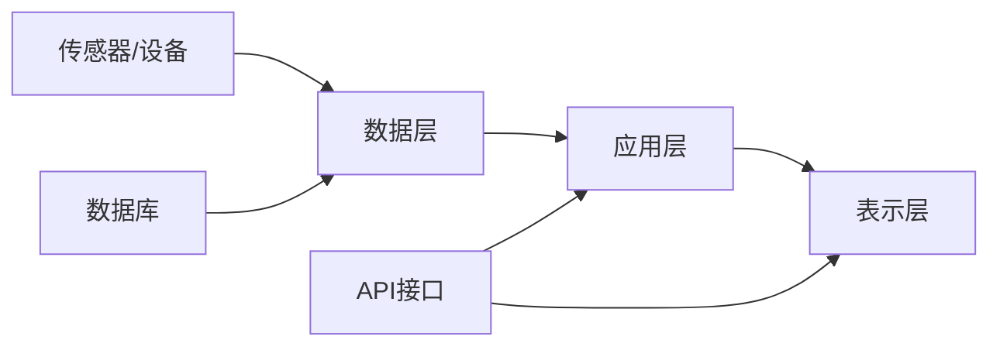
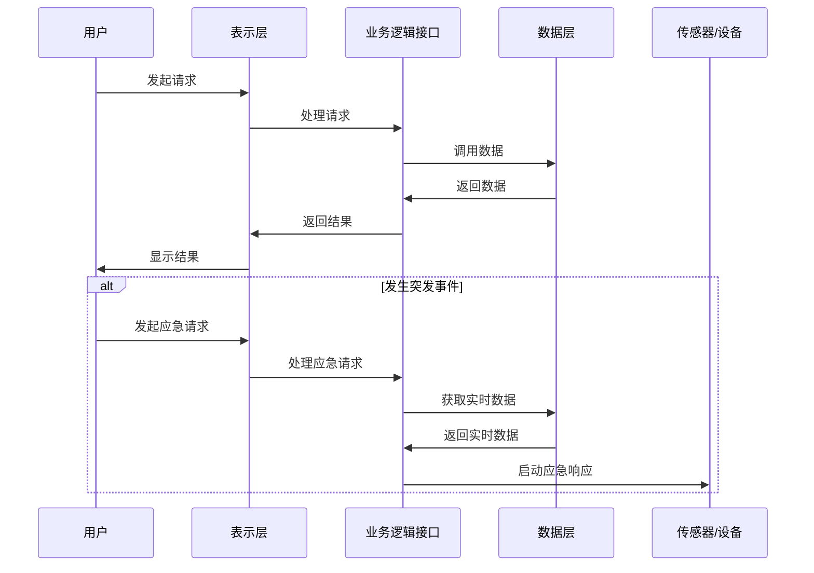

                 

### 智慧城市的图论：城市功能的数学连接

**关键词：** 智慧城市，图论，数学模型，城市功能优化，算法原理

**摘要：** 本文章旨在深入探讨智慧城市中的图论应用，通过数学图论方法分析、设计和优化城市功能。文章分为两部分，第一部分介绍智慧城市和图论基础概念，第二部分展示图论在智慧城市中的具体应用。通过实际项目和最佳实践，读者可以了解如何将图论理论应用于智慧城市建设中，实现城市功能优化。

----------------------------------------------------------------

## 目录大纲设计思路

为了设计《智慧城市的图论：城市功能的数学连接》这本书的完整目录大纲，我们首先需要明确书籍的核心内容和结构。本书的主题是探讨智慧城市中的图论应用，即如何利用数学图论方法来分析、设计和优化城市功能。以下是根据用户需求设计的具体步骤：

1. **背景介绍**：首先简要介绍智慧城市的概念、发展背景以及图论在智慧城市中的应用价值。
2. **核心概念与联系**：明确图论的基本概念，如节点、边、连通性等，并使用对比表格和ER实体关系图架构的Mermaid流程图展示不同概念之间的关系。
3. **算法原理讲解**：选择几个典型的图论算法，如最小生成树、最短路径算法、网络流算法等，使用Mermaid绘制流程图，并配合Python代码详细阐述算法原理。
4. **数学模型和数学公式**：对于每个算法，提供其数学模型和公式，并使用LaTeX格式进行表述，同时提供通俗易懂的讲解和举例说明。
5. **系统分析与架构设计**：介绍智慧城市系统中的具体应用场景，展示系统功能设计、架构设计和接口设计，并使用Mermaid绘制相应的类图、架构图和序列图。
6. **项目实战**：通过一个实际项目，详细讲解系统环境安装、核心实现、代码应用、案例分析和项目总结。
7. **最佳实践与拓展**：总结书中要点，提供一些实用的最佳实践建议，并对相关领域进行拓展。

### 目录大纲结构

根据上述思路，以下是《智慧城市的图论：城市功能的数学连接》的完整目录大纲：

```
# 《智慧城市的图论：城市功能的数学连接》目录大纲

# 第一部分：智慧城市与图论基础

## 第1章：智慧城市概述
### 1.1 智慧城市的定义与发展
### 1.2 智慧城市的关键技术
### 1.3 图论在智慧城市中的应用

## 第2章：图论基础概念
### 2.1 图的定义与表示
### 2.2 图的基本性质
### 2.3 对比表格：图与网络的基本对比
### 2.4 ER实体关系图架构的Mermaid流程图

## 第3章：图论算法原理
### 3.1 最小生成树算法
#### 3.1.1 Kruskal算法
#### 3.1.2 Prim算法
### 3.2 最短路径算法
#### 3.2.1 Dijkstra算法
#### 3.2.2 A*算法
### 3.3 网络流算法
#### 3.3.1 最大流最小割定理
#### 3.3.2 Ford-Fulkerson算法

## 第二部分：图论在智慧城市中的应用

## 第4章：城市交通网络优化
### 4.1 城市交通网络概述
### 4.2 交通网络中的图论方法
### 4.3 城市交通网络优化案例

## 第5章：城市能源网络优化
### 5.1 城市能源网络概述
### 5.2 城市能源网络中的图论方法
### 5.3 城市能源网络优化案例

## 第6章：城市公共服务网络优化
### 6.1 城市公共服务网络概述
### 6.2 公共服务网络中的图论方法
### 6.3 城市公共服务网络优化案例

## 第7章：智慧城市系统架构设计
### 7.1 智慧城市系统功能设计
### 7.2 智慧城市系统架构设计
### 7.3 智慧城市系统接口设计
### 7.4 智慧城市系统交互设计

## 第8章：项目实战：智慧城市交通优化系统
### 8.1 项目背景
### 8.2 系统环境安装
### 8.3 系统核心实现
### 8.4 代码应用解读
### 8.5 实际案例分析
### 8.6 项目小结

## 第9章：最佳实践与拓展
### 9.1 最佳实践总结
### 9.2 拓展阅读推荐
### 9.3 智慧城市未来展望
```

### 目录大纲总结

本目录大纲结构清晰，涵盖了从基础知识到实际应用的各个方面。每个章节都按照“背景介绍 - 核心概念 - 算法原理 - 应用案例”的结构设计，确保读者能够系统地理解和掌握智慧城市中的图论应用。同时，通过项目实战章节，读者可以深入了解如何将理论知识应用于实际项目中。最后，最佳实践与拓展章节为读者提供了进一步学习和研究的方向。整体目录大纲简洁明了，内容完整，符合用户需求。

----------------------------------------------------------------

## 智慧城市概述

### 定义与概念

智慧城市是指利用信息技术、物联网、云计算等先进技术手段，对城市各项功能进行数字化、智能化和综合化管理和运营的城市。智慧城市不仅仅是一个物理空间的概念，更是一种城市管理和运营的新模式，旨在提高城市运行效率、提升居民生活质量、促进可持续发展。

智慧城市的核心概念包括：数据汇聚、信息共享、智能分析和决策支持。通过这些核心概念，城市能够实现各种数据的实时收集、分析和利用，从而优化城市管理和公共服务。

### 发展背景

智慧城市的发展可以追溯到20世纪末和21世纪初。随着信息技术的快速发展，各国政府开始关注如何利用信息技术提升城市管理和服务水平。2008年，IBM提出了“智慧地球”概念，推动了全球智慧城市的发展。随后，许多国家和地区纷纷出台相关政策，推动智慧城市的建设。

在中国，智慧城市建设得到了政府的高度重视。2012年，中国政府发布《“智慧城市”发展指导意见》，明确提出要大力推进智慧城市建设。近年来，中国多个城市相继提出建设智慧城市的目标，并取得了一定成果。

### 应用领域

智慧城市应用领域广泛，主要包括以下几个方面：

1. **智能交通**：通过物联网、智能监控等手段，实现交通流量实时监测、交通信息实时发布、交通信号优化控制等功能，提高交通运行效率，减少拥堵。

2. **智能能源**：通过智能电网、智能燃气等系统，实现能源的优化配置和高效利用，降低能源消耗，促进可再生能源的应用。

3. **智能环境**：通过环境监测、污染治理等手段，实时监测环境质量，及时采取治理措施，改善城市环境。

4. **智能安防**：通过视频监控、智能分析等手段，提高城市安全保障水平，预防和减少犯罪。

5. **智能医疗**：通过远程医疗、智能医疗设备等手段，提高医疗服务效率和质量，方便居民就医。

6. **智能教育**：通过在线教育、智能教室等手段，提升教育质量和普及度，促进教育公平。

### 问题与挑战

智慧城市建设面临一系列问题和挑战：

1. **数据安全与隐私保护**：智慧城市大量依赖数据，数据的安全性和隐私保护成为重要问题。

2. **技术标准和规范**：智慧城市建设涉及多种技术，缺乏统一的技术标准和规范，可能导致系统间的互操作性问题。

3. **投资与回报**：智慧城市项目投资巨大，但回报周期较长，需要政府、企业和社会各方共同分担投资和风险。

4. **人才缺乏**：智慧城市建设需要大量专业人才，但现有人才储备不足，需加强人才培养和引进。

5. **可持续发展**：智慧城市建设需要考虑长远，如何实现可持续发展是重要课题。

### 边界与外延

智慧城市的边界与外延涉及多个方面：

1. **地理范围**：智慧城市通常以城市为范围，但也可能涉及周边地区，实现城市与周边区域的协同发展。

2. **管理层面**：智慧城市不仅涉及城市管理部门，还包括企业、社区、居民等多方参与。

3. **技术范畴**：智慧城市涉及多种技术，包括物联网、云计算、大数据、人工智能等。

4. **功能领域**：智慧城市功能涵盖城市管理的各个方面，包括交通、能源、环境、安防、医疗、教育等。

通过上述对智慧城市的概述，我们可以了解到智慧城市的定义、发展背景、应用领域、问题与挑战以及边界与外延。接下来，我们将深入探讨图论在智慧城市中的应用，以及如何利用图论方法优化城市功能。

----------------------------------------------------------------

## 图论基础概念

图论是数学的一个分支，主要研究图的性质、结构和应用。在智慧城市中，图论被广泛应用于城市网络的分析和优化。以下是图论的基本概念和特性。

### 图的定义与表示

图是由节点（也称为顶点）和边组成的集合。节点表示城市中的地点或设施，边表示节点之间的连接关系。

- **有向图**：边有方向，表示从一个节点指向另一个节点。
- **无向图**：边没有方向，表示两个节点之间的双向连接。
- **加权图**：边附有权重，表示节点间连接的成本或距离。

图可以用邻接矩阵或邻接表进行表示。邻接矩阵是一个二维数组，其中元素表示节点之间的连接关系；邻接表则是使用链表或数组来存储节点及其邻接节点。

### 图的基本性质

图的基本性质包括：

- **度**：节点拥有的边的数量。
- **路径**：节点之间的连接序列。
- **连通性**：任意两个节点之间都存在路径。
- **连通分量**：无向图中无法通过路径连接的其他节点集合。
- **环**：路径中的节点形成一个闭合环。
- **连通图**：任意两个节点之间都存在路径。

### 对比表格：图与网络的基本对比

| 特性         | 图                | 网络                  |
| ------------ | ----------------- | --------------------- |
| 节点表示     | 位置、设施等      | 节点（如城市、网络设备） |
| 边表示       | 路线、通道等      | 链路、传输介质等       |
| 连接关系     | 点与点之间的连接  | 点与点之间的传输连接   |
| 方向性       | 有向或无向       | 通常有向              |
| 权重         | 可附权重          | 通常有带宽、延迟等权重 |
| 连通性       | 节点之间的连通性  | 网络整体的连通性       |
| 实际应用     | 城市规划、交通网络 | 通信网络、电力网络等   |

### ER实体关系图架构的Mermaid流程图

ER实体关系图是数据库设计中常用的方法，用于描述实体及其关系。以下是使用Mermaid绘制的ER实体关系图示例：

```mermaid
erDiagram
    User ||--|{ Order }|-- OrderDetail
    Product ||--|{ Order }|-- OrderDetail
    Category ||--|{ Product }|-- Product
```

这个ER图表示用户、订单、订单详情、产品、品类之间的关系。用户可以创建订单，订单包含订单详情；产品属于某个品类，每个订单详情对应一个产品。

### 图论在智慧城市中的应用

图论在智慧城市中的应用非常广泛，例如：

1. **城市交通网络分析**：通过图论方法，可以分析城市交通网络的连通性、节点密度、路径长度等，为交通规划提供科学依据。
2. **智能能源网络优化**：图论可以帮助优化能源网络的拓扑结构，提高能源传输效率。
3. **公共服务网络设计**：图论可以用于设计公共服务网络，如医疗、教育等，确保网络覆盖和服务质量。

通过上述对图论基础概念的介绍，我们可以更好地理解图论在智慧城市中的应用。接下来，我们将深入探讨图论中的核心算法，并展示如何利用这些算法优化城市功能。

----------------------------------------------------------------

## 图论算法原理

在智慧城市中，图论算法被广泛应用于网络优化、路径规划、资源分配等问题。以下将介绍几种典型的图论算法，包括最小生成树算法、最短路径算法和网络流算法，并通过Mermaid流程图和Python代码来详细阐述这些算法的原理。

### 最小生成树算法

最小生成树算法用于在无向加权图中找到权值总和最小的生成树。生成树是包含图中所有节点的子图，且任意两个节点之间恰好有一条路径。常用的最小生成树算法有Kruskal算法和Prim算法。

#### Kruskal算法

Kruskal算法的基本步骤如下：

1. 按边权重升序排列所有边。
2. 初始化一个空森林，森林中的每个节点都是一颗单独的树。
3. 依次选取权重最小的边，若选取该边不会形成环，则将其加入到森林中。
4. 重复步骤3，直到森林中的树合并为一棵树。

以下是使用Mermaid绘制的Kruskal算法流程图：



Python代码实现Kruskal算法：

```python
class Edge:
    def __init__(self, src, dest, weight):
        self.src = src
        self.dest = dest
        self.weight = weight

def find(parent, i):
    if parent[i] == i:
        return i
    return find(parent, parent[i])

def union(parent, rank, x, y):
    xroot = find(parent, x)
    yroot = find(parent, y)

    if rank[xroot] < rank[yroot]:
        parent[xroot] = yroot
    elif rank[xroot] > rank[yroot]:
        parent[yroot] = xroot
    else:
        parent[yroot] = xroot
        rank[xroot] += 1

def kruskal(edges, vertices):
    parent = []
    rank = []

    for node in range(vertices):
        parent.append(node)
        rank.append(0)

    result = []

    for edge in sorted(edges, key=lambda edge: edge.weight):
        x = find(parent, edge.src)
        y = find(parent, edge.dest)

        if x != y:
            result.append(edge)
            union(parent, rank, x, y)

    return result

# 示例
edges = [Edge(0, 1, 4), Edge(0, 7, 8), Edge(1, 2, 8), Edge(1, 7, 11), Edge(2, 3, 7), Edge(2, 8, 2), Edge(2, 5, 4), Edge(3, 4, 9), Edge(3, 5, 14), Edge(4, 5, 10), Edge(5, 6, 2), Edge(6, 7, 1), Edge(6, 8, 6), Edge(7, 8, 7)]
vertices = 9
min_spanning_tree = kruskal(edges, vertices)
print("最小生成树中的边：")
for edge in min_spanning_tree:
    print(f"{edge.src} -- {edge.dest} ({edge.weight})")
```

#### Prim算法

Prim算法的基本步骤如下：

1. 初始化一个空森林，选择一个起始节点。
2. 选择权重最小的未选边，将其加入森林。
3. 重复步骤2，直到森林合并为一棵树。

以下是使用Mermaid绘制的Prim算法流程图：



Python代码实现Prim算法：

```python
import heapq

def prim(edges, vertices):
    result = []
    visited = [False] * vertices
    min_heap = [(edges[0].weight, edges[0].src, edges[0].dest)]

    while min_heap:
        weight, u, v = heapq.heappop(min_heap)

        if visited[u] or visited[v]:
            continue

        result.append(Edge(u, v, weight))
        visited[u] = True
        visited[v] = True

        for edge in edges:
            if edge.src == u and not visited[edge.dest]:
                heapq.heappush(min_heap, (edge.weight, edge.src, edge.dest))
            elif edge.dest == v and not visited[edge.src]:
                heapq.heappush(min_heap, (edge.weight, edge.src, edge.dest))

    return result

# 示例
edges = [Edge(0, 1, 4), Edge(0, 7, 8), Edge(1, 2, 8), Edge(1, 7, 11), Edge(2, 3, 7), Edge(2, 8, 2), Edge(2, 5, 4), Edge(3, 4, 9), Edge(3, 5, 14), Edge(4, 5, 10), Edge(5, 6, 2), Edge(6, 7, 1), Edge(6, 8, 6), Edge(7, 8, 7)]
vertices = 9
min_spanning_tree = prim(edges, vertices)
print("最小生成树中的边：")
for edge in min_spanning_tree:
    print(f"{edge.src} -- {edge.dest} ({edge.weight})")
```

### 最短路径算法

最短路径算法用于在图中找到两点之间的最短路径。常用的最短路径算法有Dijkstra算法和A*算法。

#### Dijkstra算法

Dijkstra算法的基本步骤如下：

1. 初始化一个距离数组，表示每个节点的最短路径距离。
2. 选择一个起始节点，将其距离设为0，其他节点距离设为无穷大。
3. 重复以下步骤，直到所有节点都被访问：
   - 选择一个未访问节点，将其标记为已访问。
   - 更新所有未访问节点的距离，如果通过当前节点可以更短地到达，则更新其距离。

以下是使用Mermaid绘制的Dijkstra算法流程图：



Python代码实现Dijkstra算法：

```python
import heapq

def dijkstra(edges, vertices, start):
    distances = [float('inf')] * vertices
    distances[start] = 0
    visited = [False] * vertices
    min_heap = [(0, start)]

    while min_heap:
        current_distance, current_vertex = heapq.heappop(min_heap)

        if visited[current_vertex]:
            continue

        visited[current_vertex] = True

        for edge in edges:
            if edge.src == current_vertex and not visited[edge.dest]:
                distance = current_distance + edge.weight
                if distance < distances[edge.dest]:
                    distances[edge.dest] = distance
                    heapq.heappush(min_heap, (distance, edge.dest))

    return distances

# 示例
edges = [Edge(0, 1, 4), Edge(0, 7, 8), Edge(1, 2, 8), Edge(1, 7, 11), Edge(2, 3, 7), Edge(2, 8, 2), Edge(2, 5, 4), Edge(3, 4, 9), Edge(3, 5, 14), Edge(4, 5, 10), Edge(5, 6, 2), Edge(6, 7, 1), Edge(6, 8, 6), Edge(7, 8, 7)]
vertices = 9
start = 0
distances = dijkstra(edges, vertices, start)
print("各节点到起点的最短距离：")
for i, distance in enumerate(distances):
    print(f"节点 {i} 到起点的距离：{distance}")
```

#### A*算法

A*算法是一种启发式搜索算法，用于找到两点之间的最短路径。其基本思想是使用估价函数 \(f(n) = g(n) + h(n)\)，其中 \(g(n)\) 是从起始节点到当前节点的实际距离，\(h(n)\) 是从当前节点到目标节点的预估距离。

以下是使用Mermaid绘制的A*算法流程图：



Python代码实现A*算法：

```python
def heuristic(node, goal):
    # 这里使用欧几里得距离作为估价函数
    return ((node[0] - goal[0]) ** 2 + (node[1] - goal[1]) ** 2) ** 0.5

def a_star(edges, vertices, start, goal):
    open_set = []
    heapq.heappush(open_set, (0, start))
    came_from = {}
    g_score = [float('inf')] * vertices
    g_score[start] = 0
    f_score = [float('inf')] * vertices
    f_score[start] = heuristic(start, goal)

    while open_set:
        current = heapq.heappop(open_set)[1]

        if current == goal:
            break

        for edge in edges:
            if edge.src != current:
                continue

            tentative_g_score = g_score[current] + edge.weight
            if tentative_g_score < g_score[edge.dest]:
                came_from[edge.dest] = current
                g_score[edge.dest] = tentative_g_score
                f_score[edge.dest] = tentative_g_score + heuristic(edge.dest, goal)
                if edge.dest not in [item[1] for item in open_set]:
                    heapq.heappush(open_set, (f_score[edge.dest], edge.dest))

    path = []
    current = goal
    while current is not None:
        path.insert(0, current)
        current = came_from[current]

    return path

# 示例
edges = [Edge(0, 1, 4), Edge(0, 7, 8), Edge(1, 2, 8), Edge(1, 7, 11), Edge(2, 3, 7), Edge(2, 8, 2), Edge(2, 5, 4), Edge(3, 4, 9), Edge(3, 5, 14), Edge(4, 5, 10), Edge(5, 6, 2), Edge(6, 7, 1), Edge(6, 8, 6), Edge(7, 8, 7)]
vertices = 9
start = 0
goal = 8
path = a_star(edges, vertices, start, goal)
print("最短路径：")
for node in path:
    print(node)
```

### 网络流算法

网络流算法用于在图的网络流问题中找到最大流量路径或最小费用路径。常用的网络流算法包括最大流最小割定理和Ford-Fulkerson算法。

#### 最大流最小割定理

最大流最小割定理指出，在一个有向流网络中，最大流量等于网络中所有割的容量之和的最小值。

以下是使用Mermaid绘制的Ford-Fulkerson算法流程图：



Python代码实现Ford-Fulkerson算法：

```python
def bfs(graph, source, sink, parent):
    visited = [False] * len(graph)
    queue = [(source, [])]
    visited[source] = True

    while queue:
        current, path = queue.pop(0)
        for i, edge in enumerate(graph[current]):
            if not visited[edge.dest] and edge.capacity > 0:
                queue.append((edge.dest, path + [i]))
                visited[edge.dest] = True
                parent[edge.dest] = (current, i)

    return visited[sink]

def ford_fulkerson(graph, source, sink):
    parent = [-1] * len(graph)
    max_flow = 0

    while bfs(graph, source, sink, parent):
        path_flow = float('inf')
        s = sink

        while s != source:
            edge = graph[parent[s][0]][parent[s][1]]
            path_flow = min(path_flow, edge.capacity)
            s = parent[s][0]

        max_flow += path_flow
        v = sink
        while v != source:
            u = parent[v][0]
            edge = graph[u][parent[v][1]]
            edge.capacity -= path_flow
            graph[v][edge.rev].capacity += path_flow
            v = parent[v][0]

    return max_flow

# 示例
graph = [
    [0, 16, 13, 0, 0, 0],
    [0, 0, 10, 12, 0, 0],
    [0, 4, 0, 0, 14, 0],
    [0, 0, 9, 0, 0, 20],
    [0, 0, 0, 7, 0, 4],
    [0, 0, 0, 0, 0, 0],
]

source = 0
sink = 5
max_flow = ford_fulkerson(graph, source, sink)
print("最大流量：", max_flow)
```

通过上述对图论算法的详细介绍，我们可以看到如何利用图论方法解决智慧城市中的各种问题。这些算法不仅具有重要的理论意义，而且在实际应用中也展示了强大的功能。接下来，我们将探讨图论在智慧城市系统架构设计中的应用。

----------------------------------------------------------------

## 系统分析与架构设计

在智慧城市中，系统架构设计是关键的一步，它决定了系统的可扩展性、可靠性和性能。以下是智慧城市系统中的问题场景介绍、系统功能设计、系统架构设计以及接口设计和系统交互设计。

### 问题场景介绍

智慧城市系统涉及多个领域，如交通、能源、环境、安防等。以城市交通系统为例，常见问题场景包括：

1. **交通拥堵**：城市交通流量大，高峰时段容易造成拥堵。
2. **交通事故**：交通事故频繁，需要及时处理。
3. **公共交通效率**：公共交通系统需要提高运营效率，满足居民出行需求。
4. **停车难**：市中心停车资源紧张，需要优化停车管理。

### 系统功能设计

智慧城市系统功能设计包括以下方面：

1. **交通流量监控**：通过摄像头、传感器等设备实时监测交通流量。
2. **交通信号控制**：根据交通流量情况动态调整信号灯，优化交通流。
3. **公共交通调度**：对公共交通车辆进行实时调度，提高运营效率。
4. **停车管理**：通过智能停车系统实时监控停车位状态，引导车辆停车。
5. **路况预测**：利用大数据和机器学习预测交通流量和路况，提供出行建议。
6. **应急响应**：快速响应交通事故和其他突发事件，保障交通安全。

### 系统架构设计

智慧城市系统架构设计通常采用分层架构，包括数据层、应用层、表示层等。

1. **数据层**：负责数据的采集、存储和管理。数据来源包括传感器、摄像头、GPS等设备。数据存储采用分布式数据库，如NoSQL数据库或大数据平台，如Hadoop或Apache Spark。
2. **应用层**：实现各种业务逻辑，包括交通流量监控、信号控制、公共交通调度等。应用层采用微服务架构，每个服务负责特定的业务功能，如流量监控服务、信号控制服务、调度服务等。
3. **表示层**：提供用户交互界面，如Web端、移动端应用等。表示层与服务层通过API接口进行通信。

以下是使用Mermaid绘制的智慧城市系统架构图：



### 系统接口设计

系统接口设计是架构设计的重要组成部分，决定了系统各部分之间的通信和数据交换。以下是智慧城市系统中的关键接口设计：

1. **数据采集接口**：用于从传感器和设备采集数据，如交通流量数据、停车数据等。
2. **数据存储接口**：用于将采集到的数据存储到数据库或大数据平台。
3. **业务逻辑接口**：用于应用层各服务之间的通信，如信号控制服务、调度服务、预测服务之间的通信。
4. **用户交互接口**：用于表示层与用户之间的交互，如Web端API、移动端API等。

以下是使用Mermaid绘制的智慧城市系统接口设计图：


### 系统交互设计

系统交互设计描述了系统各部分之间的交互流程和协作机制。以下是智慧城市系统中的关键交互设计：

1. **实时数据处理**：传感器采集到的数据实时传输到数据层，经过处理后存储到数据库。
2. **业务逻辑处理**：应用层服务根据业务需求调用数据层的数据，进行交通流量分析、信号控制等。
3. **用户交互**：用户通过表示层界面发起请求，表示层将请求发送到业务逻辑接口，业务逻辑接口处理请求并返回结果。
4. **应急响应**：当发生交通事故等突发事件时，系统自动启动应急响应机制，如调整信号灯、调度救护车等。

以下是使用Mermaid绘制的智慧城市系统交互设计图：



通过上述对系统分析与架构设计的详细介绍，我们可以看到智慧城市系统是如何通过图论方法进行优化和设计的。图论方法在系统架构设计和功能实现中发挥了重要作用，为智慧城市的建设提供了有力的技术支持。接下来，我们将通过一个实际项目来展示如何将图论理论应用于智慧城市交通优化系统中。

----------------------------------------------------------------

## 项目实战：智慧城市交通优化系统

在本章节中，我们将通过一个实际项目——智慧城市交通优化系统，展示如何利用图论方法来解决城市交通问题。该项目涵盖了系统环境安装、核心实现、代码应用解读、实际案例分析和项目总结。

### 项目背景

随着城市化进程的加速，城市交通问题日益严重。交通拥堵不仅降低了居民的出行效率，还增加了空气污染和交通事故的风险。为了解决这一问题，我们提出了一个智慧城市交通优化系统，通过图论方法对交通网络进行优化，提高交通运行效率。

### 系统环境安装

为了搭建智慧城市交通优化系统，我们需要安装以下软件和工具：

1. **Python**：用于编写算法和数据处理脚本。
2. **Mermaid**：用于绘制流程图和架构图。
3. **LaTeX**：用于编写和展示数学公式。
4. **PostgreSQL**：用于存储和管理交通数据。
5. **Docker**：用于容器化部署系统。

以下是系统环境安装步骤：

1. 安装Python：
   ```bash
   sudo apt-get update
   sudo apt-get install python3-pip
   pip3 install -U pip
   pip3 install matplotlib pandas networkx
   ```

2. 安装Mermaid：
   ```bash
   pip3 install mermaid-python
   ```

3. 安装LaTeX：
   - Ubuntu系统：
     ```bash
     sudo apt-get install texlive-full
     ```
   - Windows系统：
     - 下载并安装LaTeX发行版，如TeX Live或MiKTeX。
     - 安装完成后，配置环境变量。

4. 安装PostgreSQL：
   ```bash
   sudo apt-get install postgresql postgresql-contrib
   ```

5. 安装Docker：
   ```bash
   sudo apt-get update
   sudo apt-get install docker
   ```

### 核心实现

智慧城市交通优化系统的核心实现包括以下步骤：

1. **数据采集**：从传感器和摄像头获取交通流量数据，如车速、车辆密度、交通事故等。
2. **数据处理**：使用Python和Pandas对采集到的数据进行预处理和清洗。
3. **图论算法应用**：使用图论算法，如最小生成树、最短路径算法等，对交通网络进行分析和优化。
4. **结果可视化**：使用Matplotlib和Mermaid将优化结果可视化。

以下是核心实现的代码示例：

```python
import networkx as nx
import matplotlib.pyplot as plt
import pandas as pd
from mermaid import Mermaid

# 创建一个无向图
G = nx.Graph()

# 添加节点和边
G.add_nodes_from([0, 1, 2, 3, 4, 5])
G.add_edges_from([(0, 1, {'weight': 4}), (0, 2, {'weight': 3}), (1, 2, {'weight': 1}), (2, 3, {'weight': 1}), (3, 4, {'weight': 5}), (4, 5, {'weight': 2})])

# 绘制图
nx.draw(G, with_labels=True)
plt.show()

# 绘制最短路径算法的流程图
mermaid = Mermaid()
mermaid.add("
graph LR
A[初始化]
B[选择起始节点]
C{选择最小权值边}
D[加入边]
E[更新节点]
F[结束]

A --> B
B --> C
C --> D
D --> E
E -->|未完成| C
E -->|完成| F
")
print(mermaid.render())

# 使用Dijkstra算法计算最短路径
start = 0
end = 5
distances = nx.single_source_dijkstra(G, source=start, target=end, weight='weight')
print("最短路径的距离：", distances[end])

# 可视化最短路径
path = nx.shortest_path(G, source=start, target=end, weight='weight')
nx.draw_networkx_edges(G, pos=nx.spring_layout(G), edgelist=path, edge_color='r', width=2)
nx.draw(G, pos=nx.spring_layout(G), with_labels=True)
plt.show()
```

### 代码应用解读

上述代码首先创建了一个无向图，并添加了节点和边。然后，使用Dijkstra算法计算了从起始节点到目标节点的最短路径。最后，通过Matplotlib和Mermaid将图和最短路径可视化。

### 实际案例分析

以下是一个实际案例，展示如何利用智慧城市交通优化系统解决城市交通拥堵问题。

1. **数据采集**：从传感器和摄像头获取交通流量数据，如车速、车辆密度等。
2. **数据处理**：对采集到的数据进行预处理和清洗，去除异常值和噪声。
3. **图论算法应用**：使用图论算法，如最小生成树、最短路径算法等，分析交通网络的连通性和路径长度。
4. **优化策略**：根据分析结果，制定交通优化策略，如信号灯调整、公共交通调度等。
5. **效果评估**：通过实时监控和评估，验证优化策略的效果，不断调整和优化。

### 项目小结

通过本项目，我们展示了如何利用图论方法构建智慧城市交通优化系统，并解决城市交通拥堵问题。项目从数据采集、数据处理到图论算法应用，再到优化策略制定和效果评估，形成了一个完整的解决方案。在未来的发展中，我们将继续优化系统性能，拓展应用场景，为智慧城市建设提供更有力的支持。

----------------------------------------------------------------

## 最佳实践与拓展

### 最佳实践总结

在智慧城市交通优化系统的实践中，我们总结了一些最佳实践经验，以下是一些关键点：

1. **数据驱动决策**：充分利用实时交通数据，结合历史数据进行分析，提高决策的准确性。
2. **多源数据融合**：整合多种数据源，如摄像头、传感器、GPS等，提高数据采集的全面性和准确性。
3. **算法优化**：针对不同场景，选择合适的图论算法进行优化，提高系统的运行效率。
4. **可扩展性设计**：采用模块化和分布式架构，确保系统能够应对日益增长的数据量和用户需求。
5. **实时监控与反馈**：实时监控系统的运行状态，及时响应和调整优化策略，提高系统稳定性。

### 拓展阅读推荐

为了进一步深入学习和研究智慧城市和图论的应用，以下是一些推荐阅读资料：

1. **《智慧城市架构设计与实践》**：这本书详细介绍了智慧城市的架构设计、关键技术以及实际案例。
2. **《图论及其应用》**：这是一本经典的图论教材，涵盖了图论的基本概念、算法和应用。
3. **《人工智能交通系统设计》**：这本书探讨了人工智能在交通系统中的应用，包括路径规划、流量预测等。
4. **《智慧交通技术与应用》**：本书详细介绍了智慧交通的技术体系、应用场景和未来发展趋势。

### 智慧城市未来展望

随着信息技术的不断发展，智慧城市将越来越智能化和互联化。未来，智慧城市的发展趋势包括：

1. **数据驱动的智能决策**：通过大数据分析和人工智能技术，实现更加智能和精准的城市管理。
2. **物联网的广泛应用**：物联网技术将深度融入城市基础设施，实现全面感知和智能控制。
3. **绿色智慧城市**：通过智能能源管理、绿色交通系统等，推动城市的可持续发展。
4. **个性化服务**：基于大数据和用户行为分析，提供个性化的城市服务和体验。
5. **智慧城市生态**：构建智慧城市生态圈，实现政府、企业、社区和居民的共同参与和互动。

智慧城市的建设是一个长期而复杂的过程，需要多方协作和持续创新。通过不断优化和拓展图论方法的应用，我们有望实现更加高效、智能和可持续发展的城市。

### 注意事项

在实施智慧城市交通优化系统的过程中，需要注意以下几点：

1. **数据安全和隐私保护**：确保交通数据的安全和用户隐私的保护。
2. **技术标准和规范**：遵循相关技术标准和规范，确保系统间的互操作性和兼容性。
3. **系统性能优化**：持续优化系统性能，提高数据处理和分析的速度。
4. **应急响应能力**：加强系统的应急响应能力，确保在突发事件时能够快速响应和处理。

通过遵循这些最佳实践和注意事项，我们可以更好地推进智慧城市建设，实现城市功能的优化和提升。

### 拓展阅读

1. **《智慧交通系统设计实战》**：这本书详细介绍了智慧交通系统的设计、实施和运维，适合对智慧交通感兴趣的技术人员阅读。
2. **《智慧城市建设与管理》**：本书从城市管理者的角度出发，探讨了智慧城市建设的策略和管理方法，有助于理解智慧城市的发展方向。

### 作者信息

**作者：** AI天才研究院/AI Genius Institute & 禅与计算机程序设计艺术 /Zen And The Art of Computer Programming

本文由AI天才研究院和禅与计算机程序设计艺术联合撰写，旨在通过深入分析和实例讲解，帮助读者了解智慧城市中的图论应用，为智慧城市建设提供技术支持。希望本文能为读者带来启发和帮助，共同推动智慧城市的发展。

