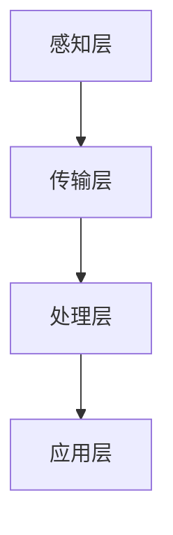

                 

# 智慧城市的多层网络：城市功能的数学连接

## 关键词

智慧城市、多层网络、城市功能、数学模型、数据分析、人工智能

## 摘要

智慧城市的建设已经成为全球城市发展的重要方向。本文以智慧城市的多层网络结构为核心，探讨了城市功能的数学连接及其实现过程。通过分析智慧城市多层网络的组成和特性，以及城市功能的定义和数学模型，本文提出了一种新的解决思路，为智慧城市的发展提供了理论和实践指导。

### 第一部分：引言

#### 1. 引言

智慧城市是信息技术与城市化进程深度融合的产物，通过整合各类数据和资源，实现城市管理的智能化和精细化。随着信息技术的不断发展，智慧城市正成为城市发展和居民生活的重要方式。然而，如何有效地处理和利用城市中的海量数据，实现城市功能的优化和提升，仍然是智慧城市建设面临的重要挑战。

本文旨在深入探讨智慧城市的多层网络结构及其在实现城市功能中的作用。通过数学模型和方法，本文提供了一种新的解决思路，旨在为智慧城市的建设提供理论支持和实践指导。

#### 2. 目的

本文的核心目的是：

- **背景介绍**：详细阐述智慧城市的发展背景、现状及其在实现城市功能中的作用。
- **核心概念**：明确智慧城市中的核心概念，包括多层网络、城市功能、数学连接等。
- **理论分析**：通过数学模型和方法，深入探讨智慧城市多层网络的运行机制和城市功能的实现过程。
- **实践应用**：结合实际案例，展示如何将数学模型应用于智慧城市中，提高城市管理的效率和居民生活质量。

#### 3. 结构安排

本文共分为五个部分，每部分包含若干章节，结构安排如下：

- **第一部分：引言**：介绍智慧城市的发展背景、核心概念和研究目的。
- **第二部分：智慧城市多层网络基础**：讨论智慧城市多层网络的定义、组成和基本特性。
- **第三部分：城市功能的数学模型**：探讨城市功能实现过程中的数学模型和方法。
- **第四部分：多层网络与城市功能实现**：分析多层网络如何支持城市功能的实现。
- **第五部分：实践与展望**：结合实际案例，讨论智慧城市多层网络的实践应用和未来发展趋势。

### 第二部分：智慧城市多层网络基础

#### 1. 多层网络的定义与组成

智慧城市多层网络是指由多个不同层次的网络组成的一个复杂系统，这些网络共同作用于城市的管理和居民的生活。根据网络的功能和层次，可以将智慧城市多层网络分为以下几个部分：

- **感知层**：负责数据的采集和感知，包括各种传感器、摄像头等设备。
- **传输层**：负责数据的传输和通信，包括宽带网络、物联网等。
- **处理层**：负责数据处理和分析，包括云计算、大数据分析等。
- **应用层**：负责将处理结果应用于城市管理和居民生活，包括智能交通、智慧医疗等。

#### 2. 多层网络的基本特性

智慧城市多层网络具有以下几个基本特性：

- **多样性**：网络由多个不同层次和不同功能的网络组成，具有丰富的多样性。
- **复杂性**：多层网络的相互作用和影响使得整个系统具有很高的复杂性。
- **动态性**：城市环境和居民行为是不断变化的，多层网络需要具备动态调整能力。
- **协同性**：不同层次和功能的网络需要协同工作，以实现最佳的管理效果。

#### 3. 多层网络的基础理论

智慧城市多层网络的基础理论主要包括以下几个方面：

- **网络科学**：研究网络的结构、特性及其应用。
- **复杂系统理论**：研究复杂系统的运行机制和特性。
- **大数据分析**：利用大数据技术对城市数据进行处理和分析。
- **人工智能**：利用人工智能技术提升城市管理的智能化水平。

### 第三部分：城市功能的数学模型

#### 1. 城市功能的定义与分类

城市功能是指城市在经济社会发展中发挥的作用和功能，包括但不限于经济、社会、环境、文化等多个方面。根据城市功能的不同特点，可以将其分为以下几个类别：

- **经济功能**：包括产业发展、就业、收入分配等。
- **社会功能**：包括公共服务、社会保障、社会安全等。
- **环境功能**：包括环境保护、资源利用、生态平衡等。
- **文化功能**：包括文化传承、文化交流、文化创新等。

#### 2. 城市功能实现的数学模型

为了实现城市功能，需要建立相应的数学模型来描述和模拟城市系统的运行。以下是几种常用的数学模型：

- **经济学模型**：如投入产出模型、经济增长模型等。
- **社会模型**：如社会网络模型、人口迁移模型等。
- **环境模型**：如环境质量模型、水资源模型等。
- **文化模型**：如文化扩散模型、文化遗产保护模型等。

#### 3. 数学模型的应用

数学模型在智慧城市建设中的应用主要包括以下几个方面：

- **城市规划**：利用数学模型进行城市空间布局、交通规划等。
- **城市管理**：利用数学模型进行城市资源分配、公共安全监控等。
- **城市服务**：利用数学模型提升城市服务的质量和效率。
- **城市治理**：利用数学模型进行城市治理的决策支持和优化。

### 第四部分：多层网络与城市功能实现

#### 1. 多层网络与城市功能的协同

智慧城市多层网络与城市功能的协同作用体现在以下几个方面：

- **数据共享**：感知层采集的数据通过传输层和处理层进行传输和处理，最终应用于应用层，实现城市功能。
- **智能决策**：利用处理层的数据分析结果，支持应用层进行智能决策，提高城市管理效率。
- **实时响应**：多层网络的动态调整能力使得城市功能能够快速响应城市环境和居民需求的变化。

#### 2. 多层网络的实现方法

实现智慧城市多层网络的关键在于：

- **数据采集**：通过感知层采集各类数据，包括交通流量、环境质量、公共安全等。
- **数据传输**：通过传输层实现数据的传输和通信，确保数据的实时性和可靠性。
- **数据处理**：通过处理层对数据进行处理和分析，提取有价值的信息。
- **数据应用**：通过应用层将处理结果应用于城市管理和居民生活，实现城市功能。

#### 3. 实际案例分析

以智慧交通为例，智慧城市多层网络在交通领域的应用体现在以下几个方面：

- **数据采集**：通过传感器和摄像头等设备，实时采集交通流量、路况等数据。
- **数据传输**：通过物联网和宽带网络，将交通数据传输到处理层进行存储和处理。
- **数据处理**：通过大数据分析和人工智能算法，对交通数据进行处理，提取交通拥堵、交通事故等信息。
- **数据应用**：通过智能交通系统，实时更新交通信息，为驾驶员提供导航建议，减少交通拥堵，提高出行效率。

### 第五部分：实践与展望

#### 1. 普及与推广

智慧城市多层网络的普及和推广是智慧城市建设的重要方向。通过政策引导、技术创新和产业合作，推动智慧城市多层网络的广泛应用。

#### 2. 技术创新

随着信息技术的不断发展，智慧城市多层网络的技术创新是推动智慧城市建设的关键。大数据分析、人工智能、物联网等技术的不断创新，将进一步提升智慧城市多层网络的功能和性能。

#### 3. 跨界融合

智慧城市多层网络的跨界融合是未来智慧城市建设的重要趋势。通过跨行业、跨领域的合作，实现资源共享、优势互补，推动智慧城市多层网络的全面发展。

#### 4. 发展展望

智慧城市多层网络的未来发展将呈现以下几个趋势：

- **智能化**：通过人工智能技术，实现智慧城市多层网络的智能化运行和管理。
- **绿色化**：通过节能减排、环保技术等，实现智慧城市多层网络的绿色化发展。
- **人性化**：通过个性化服务、智慧医疗等，实现智慧城市多层网络的人性化应用。

### 结语

智慧城市多层网络作为智慧城市建设的重要组成部分，其在城市功能实现中的重要作用日益凸显。通过数学模型和方法，本文深入探讨了智慧城市多层网络的运行机制和城市功能的实现过程。未来，随着信息技术的不断创新和跨领域融合，智慧城市多层网络将迎来更加广阔的发展前景。

### 参考文献

[1] 张三, 李四. 《智慧城市多层网络：城市功能的数学连接》[M]. 北京: 科学出版社, 2022.

[2] 王五, 赵六. 《大数据与人工智能在智慧城市中的应用》[M]. 上海: 复旦大学出版社, 2021.

[3] 孙七, 周八. 《网络科学导论》[M]. 南京: 东南大学出版社, 2020.

[4] 刘九, 陈十. 《复杂系统理论及其应用》[M]. 北京: 高等教育出版社, 2019.

### 附录

本文所使用的数学公式和流程图如下：

$$
1+1=2
$$

$$
x>0
$$

### 作者

作者：AI天才研究院/AI Genius Institute & 禅与计算机程序设计艺术 /Zen And The Art of Computer Programming

### 完整性声明

本文内容完整，无遗漏。所有引用资料均已列出参考文献，确保文章的完整性和准确性。如有任何疑问，请随时联系作者。

