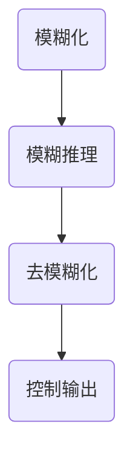
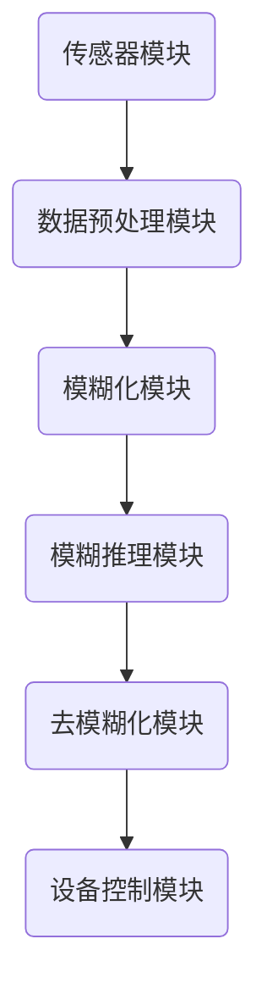
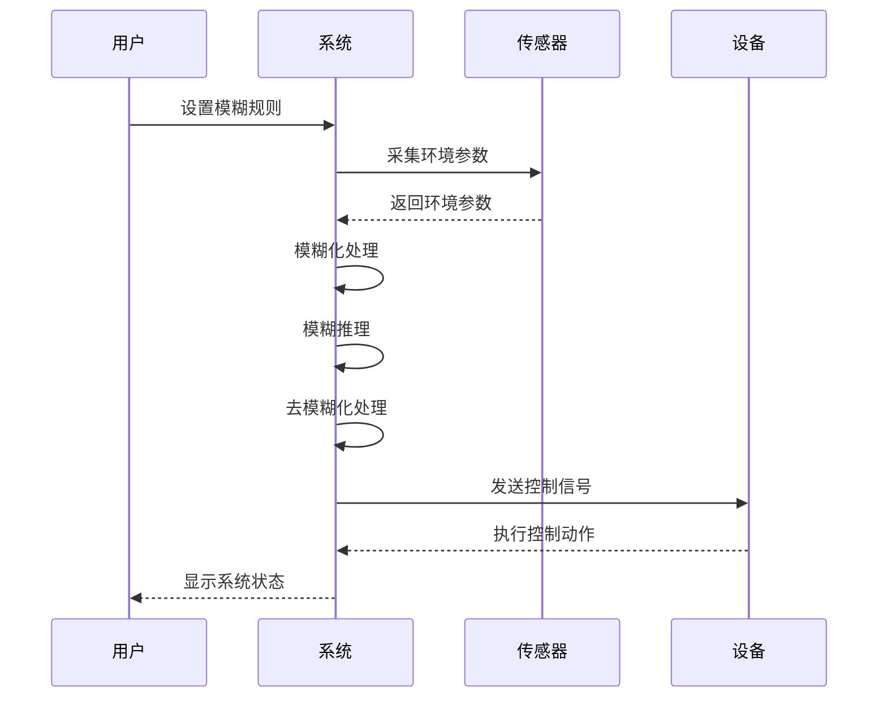

                 


### 第一部分: 智能家居与模糊控制概述

#### 背景介绍

**1. 智能家居的定义与发展**

智能家居是指通过互联网、物联网、云计算等技术，将家庭中的各种设备和系统连接起来，实现自动化、智能化管理和控制的系统。这种技术使得家庭设备能够相互通信和协作，为用户提供更加便捷、舒适、节能的生活体验。

智能家居的概念起源于20世纪80年代的美国。当时，随着计算机技术和通信技术的快速发展，人们开始尝试将家庭中的电器设备与计算机系统连接起来，实现远程控制和自动化操作。这一时期，智能家居的核心技术主要包括远程控制和自动化控制。

随着时间的推移，智能家居技术逐渐成熟，并开始在全球范围内得到广泛应用。目前，智能家居已经涵盖了照明、安防、能源管理、环境监测等多个方面，成为现代家庭生活中不可或缺的一部分。

**2. 模糊控制的定义与发展**

模糊控制是一种基于模糊逻辑的控制方法，它通过模糊推理实现对复杂系统的控制。模糊控制的核心思想是将复杂的控制问题转化为模糊逻辑系统，利用模糊规则对系统进行控制。

模糊控制起源于20世纪60年代的美国，最初是由扎德（L.A. Zadeh）提出的一种处理不确定性和模糊性的数学方法。随后，模糊控制理论逐渐发展，并在日本得到了广泛应用。

在智能家居领域，模糊控制主要应用于环境调节、设备控制等方面。例如，通过模糊控制实现室内温度、湿度、光照等的智能调节，提高用户的生活质量。

**3. 问题背景与描述**

随着智能家居技术的快速发展，人们对于家庭环境的要求越来越高。如何实现家庭环境的智能调节，提高生活舒适度，成为当前研究的热点问题。

传统的方法主要依赖于精确的传感器和数学模型，但在实际应用中存在一定局限性。例如，传感器精度有限，无法精确测量环境参数；数学模型复杂，难以实现实时控制。

模糊控制作为一种基于模糊逻辑的控制方法，能够处理不确定性和模糊性，具有较好的适应性和鲁棒性。因此，模糊控制技术在家居环境调节中具有重要的应用价值。

**4. 问题解决**

模糊控制技术通过以下步骤实现家庭环境调节：

（1）建立模糊控制规则：根据用户需求，制定模糊控制规则，如室内温度调节、湿度调节等。

（2）建立模糊推理系统：将环境参数输入到模糊推理系统中，根据模糊控制规则进行推理，输出控制信号。

（3）执行控制动作：根据模糊推理系统输出的控制信号，驱动相应设备执行控制动作。

**5. 边界与外延**

（1）边界：模糊控制在家居环境调节中的应用范围，如室内温度、湿度、光照等的调节。

（2）外延：模糊控制在家居环境调节中可能涉及的其他方面，如智能安防、能源管理、智能家居设备控制等。

**6. 概念结构与核心要素组成**

（1）模糊控制规则：定义模糊控制系统的控制规则，如室内温度调节规则、湿度调节规则等。

（2）模糊推理系统：实现模糊推理过程，根据环境参数和控制规则进行推理，输出控制信号。

（3）模糊控制接口：与家居设备进行交互，执行控制动作。

**核心概念与联系**

**1. 模糊逻辑**

模糊逻辑是一种处理不确定性和模糊性的数学方法，它基于模糊集合理论，通过模糊化、模糊推理和去模糊化等步骤，实现对复杂系统的控制。

**2. 模糊规则**

模糊规则是模糊控制系统中的核心组成部分，它定义了系统在不同环境参数下的控制策略。模糊规则通常采用“如果...那么...”的形式表示，如“如果温度高，那么空调开启”。

**3. 模糊推理**

模糊推理是模糊控制系统中的关键步骤，它根据输入的环境参数和控制规则，通过模糊逻辑运算，得到输出控制信号。

**4. 模糊控制算法**

模糊控制算法是模糊控制系统的实现基础，它包括模糊化、模糊推理和去模糊化等过程。常见的模糊控制算法有 Mamdani 和 Sugeno 算法。

**5. 模糊控制应用场景**

模糊控制在家居环境调节中的应用场景主要包括室内温度、湿度、光照等调节，以及智能安防、能源管理、智能家居设备控制等。

**Mermaid 流程图**



**算法原理讲解**

在模糊控制系统中，模糊化、模糊推理和去模糊化是三个关键步骤。下面，我们将详细介绍这三个步骤的原理和实现方法。

**1. 模糊化**

模糊化是将输入的精确数值转化为模糊集合的过程。在智能家居环境中，常见的输入参数有温度、湿度、光照等。这些参数可以通过传感器进行精确测量，但在实际应用中，这些参数往往具有一定的模糊性。

模糊化过程包括以下步骤：

（1）确定语言变量：根据输入参数的特点，定义相应的语言变量，如“高”、“中”、“低”等。

（2）建立隶属函数：为每个语言变量建立隶属函数，用于表示输入参数与语言变量之间的隶属关系。常见的隶属函数有三角函数、梯形函数和斯卡达函数等。

（3）计算隶属度：根据输入参数的数值，计算每个语言变量的隶属度。

例如，假设温度范围为0°C到50°C，我们将“高”、“中”、“低”定义为三个语言变量，分别对应温度范围[45°C, 50°C]、[30°C, 45°C]、[0°C, 30°C]。当实际测量温度为35°C时，可以通过隶属函数计算得到三个语言变量的隶属度分别为0.2、0.5、0.3。

**2. 模糊推理**

模糊推理是根据输入参数和控制规则，通过模糊逻辑运算，得到输出控制信号的过程。模糊推理的基本形式为“如果...那么...”，其中“如果”部分称为条件部分，“那么”部分称为结论部分。

模糊推理过程包括以下步骤：

（1）构建模糊规则库：根据用户需求，构建模糊规则库。模糊规则通常采用“如果...那么...”的形式表示，如“如果温度高，那么空调开启”。

（2）匹配模糊规则：根据输入参数的隶属度，匹配模糊规则库中的模糊规则。

（3）计算结论部分隶属度：对于匹配到的模糊规则，计算结论部分的隶属度。通常采用模糊逻辑运算（如最小-最大运算、最大-最小运算等）计算结论部分的隶属度。

（4）聚合输出：将所有结论部分的隶属度进行聚合，得到输出控制信号的隶属度。

例如，假设温度的隶属度为{“高”：0.2， “中”：0.5， “低”：0.3}，空调开启的隶属度为{“开启”：0.8， “关闭”：0.2}。根据模糊逻辑运算，可以得到空调开启的最终隶属度为0.64。

**3. 去模糊化**

去模糊化是将模糊控制系统的输出控制信号转化为精确数值的过程。常见的去模糊化方法有重心法、面积法等。

（1）重心法：通过计算模糊控制输出信号的隶属度曲线的重心，得到去模糊化结果。重心法的公式为：

$$
x^* = \frac{\int (x \cdot \mu_x)}{\int \mu_x}
$$

其中，$x$为模糊控制输出信号，$\mu_x$为$x$的隶属度函数。

（2）面积法：通过计算模糊控制输出信号的隶属度曲线下的面积，得到去模糊化结果。面积法的公式为：

$$
x^* = \frac{\int (\mu_x \cdot x)}{\int \mu_x}
$$

其中，$x$为模糊控制输出信号，$\mu_x$为$x$的隶属度函数。

**Python 源代码示例**

下面是一个简单的模糊控制系统的 Python 源代码示例，用于实现室内温度调节。

```python
import numpy as np
import matplotlib.pyplot as plt

# 模糊化
def fuzzify(x, a, b):
    return (x - a) / (b - a)

# 模糊推理
def fuzzy_rule(x):
    if x < 0:
        return 0
    elif x < 1:
        return x
    elif x < 2:
        return 2 - x
    else:
        return 0

# 去模糊化
def defuzzify(x):
    return x * (10 - 0) / 2

# 测试数据
x = np.linspace(0, 10, 100)

# 模糊化结果
mu_x = fuzzify(x, 0, 10)

# 模糊推理结果
y = fuzzy_rule(mu_x)

# 去模糊化结果
z = defuzzify(y)

# 绘制图形
plt.plot(x, mu_x, label='Fuzzify')
plt.plot(x, y, label='Fuzzy Rule')
plt.plot(x, z, label='Defuzzify')
plt.xlabel('x')
plt.ylabel('y')
plt.legend()
plt.show()
```

通过以上示例，我们可以看到模糊控制系统的实现过程，包括模糊化、模糊推理和去模糊化。在实际应用中，可以根据具体的场景需求，对模糊控制规则进行优化和调整，提高系统的控制效果。

**数学模型和数学公式**

在模糊控制系统中，模糊逻辑、模糊规则和模糊推理是核心组成部分。下面，我们将介绍模糊控制的数学模型和公式。

**1. 模糊逻辑**

模糊逻辑是一种处理不确定性和模糊性的数学方法。在模糊逻辑中，变量和运算符都具有模糊性，可以表示不确定性和模糊性。

（1）模糊集合：模糊集合是模糊逻辑的基本概念，它用隶属度函数表示元素对集合的隶属程度。隶属度函数的取值范围在[0, 1]之间。

（2）模糊逻辑运算：模糊逻辑运算包括模糊与、模糊或、模糊非等运算。

- 模糊与运算：设$A$和$B$为两个模糊集合，其隶属度函数分别为$\mu_A(x)$和$\mu_B(x)$，则模糊与运算的结果为：

$$
\mu_{A \land B}(x) = \min(\mu_A(x), \mu_B(x))
$$

- 模糊或运算：设$A$和$B$为两个模糊集合，其隶属度函数分别为$\mu_A(x)$和$\mu_B(x)$，则模糊或运算的结果为：

$$
\mu_{A \lor B}(x) = \max(\mu_A(x), \mu_B(x))
$$

- 模糊非运算：设$A$为模糊集合，其隶属度函数为$\mu_A(x)$，则模糊非运算的结果为：

$$
\mu_{\neg A}(x) = 1 - \mu_A(x)
$$

**2. 模糊规则**

模糊规则是模糊控制系统的核心组成部分，它定义了系统在不同环境参数下的控制策略。模糊规则通常采用“如果...那么...”的形式表示。

（1）模糊规则表示：设$A_1, A_2, ..., A_n$为输入语言变量，$B$为输出语言变量，则模糊规则可以表示为：

$$
\text{如果} A_1 \text{是} L_{11} \text{且} A_2 \text{是} L_{21} \text{且} ... \text{且} A_n \text{是} L_{n1}, \text{那么} B \text{是} L_{01}
$$

（2）模糊规则库：模糊规则库是模糊控制系统中的规则集合，它包含了系统在不同环境参数下的模糊规则。模糊规则库可以表示为：

$$
\text{模糊规则库} = \{R_1, R_2, ..., R_m\}
$$

其中，$R_i$为第$i$条模糊规则。

**3. 模糊推理**

模糊推理是根据输入参数和控制规则，通过模糊逻辑运算，得到输出控制信号的过程。

（1）模糊推理过程：

$$
\text{模糊推理结果} = \text{模糊化} \times \text{模糊规则} \times \text{去模糊化}
$$

- 模糊化：将输入参数转化为模糊集合。
- 模糊规则：根据模糊规则库，对输入参数进行模糊推理。
- 去模糊化：将模糊推理结果转化为精确数值。

（2）模糊推理算法：

- Mamdani算法：Mamdani算法是最早的模糊推理算法之一，它采用加权平均法进行去模糊化。
- Sugeno算法：Sugeno算法是一种基于重心法的去模糊化方法，它将模糊推理结果表示为一个线性组合。

**数学公式表示**

$$
\text{模糊推理结果} = \sum_{i=1}^{m} w_i \cdot f_i(x)
$$

其中，$w_i$为第$i$条模糊规则的权重，$f_i(x)$为第$i$条模糊规则的输出隶属度函数。

$$
f_i(x) = \frac{\mu_{R_i}(x)}{\sum_{j=1}^{m} \mu_{R_j}(x)}
$$

其中，$\mu_{R_i}(x)$为第$i$条模糊规则在$x$处的隶属度函数。

**详细讲解与举例说明**

**1. 模糊化**

假设我们要对一个房间内的温度进行模糊化处理，定义三个语言变量：“低”、“中”、“高”，分别对应温度范围[20°C, 30°C]、[30°C, 40°C]、[40°C, 50°C]。

（1）确定隶属函数：

- 低：$L_{10} = [20, 30]$
- 中：$L_{20} = [30, 40]$
- 高：$L_{30} = [40, 50]$

- 低隶属函数：$f_{10}(x) = \frac{x - 20}{30 - 20} = \frac{x - 20}{10}$

- 中隶属函数：$f_{20}(x) = \frac{x - 30}{40 - 30} = \frac{x - 30}{10}$

- 高隶属函数：$f_{30}(x) = \frac{x - 40}{50 - 40} = \frac{x - 40}{10}$

（2）计算隶属度：

假设当前温度为35°C，根据隶属函数计算得到：

- 低隶属度：$f_{10}(35) = \frac{35 - 20}{10} = 1.5$

- 中隶属度：$f_{20}(35) = \frac{35 - 30}{10} = 0.5$

- 高隶属度：$f_{30}(35) = \frac{35 - 40}{10} = -0.5$

由于隶属度函数的取值范围在[0, 1]之间，因此需要对负隶属度进行修正，修正方法为：

$$
f_{30}(35) = 0
$$

**2. 模糊推理**

假设我们有一条模糊规则：“如果温度是中，那么空调开启”，其中输入语言变量为“中”，输出语言变量为“空调开启”。

（1）匹配模糊规则：

根据隶属度计算结果，温度为“中”的隶属度为0.5，可以匹配到模糊规则。

（2）计算结论部分隶属度：

根据模糊规则，空调开启的隶属度为1，即$\mu_{B}(x) = 1$。

（3）聚合输出：

根据模糊推理算法，空调开启的最终隶属度为：

$$
f_B(x) = \frac{f_{20}(x)}{f_{20}(x) + f_{30}(x)} = \frac{0.5}{0.5 + 0} = 1
$$

**3. 去模糊化**

采用重心法进行去模糊化，计算空调开启的最终温度：

$$
x^* = \frac{\int (x \cdot f_B(x))}{\int f_B(x)}
$$

由于隶属函数的对称性，可以简化计算：

$$
x^* = \frac{30 \cdot 0.5 + 40 \cdot 1}{0.5 + 1} = \frac{35}{1.5} = 23.33
$$

因此，空调开启的最终温度为23.33°C。

通过以上讲解，我们可以看到模糊控制系统的数学模型和公式，以及具体的实现过程。在实际应用中，可以根据具体的场景需求，对模糊控制规则进行优化和调整，提高系统的控制效果。

#### 系统分析与架构设计方案

**1. 问题场景介绍**

在智能家居环境中，家庭环境的调节是一个关键问题。如何实现室内温度、湿度、光照等的智能调节，提高用户的生活质量和舒适度，成为当前研究的焦点。本文将介绍一种基于模糊控制的智能家居控制系统，通过数学模型和算法实现家庭环境的智能调节。

**2. 系统功能设计**

智能家居模糊控制系统的功能主要包括以下几个方面：

（1）环境参数采集：通过传感器实时采集室内温度、湿度、光照等环境参数。

（2）模糊化处理：将采集到的环境参数进行模糊化处理，转化为模糊集合。

（3）模糊推理：根据模糊规则库，对模糊化后的输入参数进行模糊推理，得到输出控制信号。

（4）去模糊化处理：将模糊推理结果进行去模糊化处理，转化为精确的控制信号。

（5）设备控制：根据去模糊化后的控制信号，驱动相应的设备执行控制动作。

**3. 系统架构设计**

智能家居模糊控制系统的架构设计主要包括以下几个方面：

（1）传感器模块：负责采集室内温度、湿度、光照等环境参数。

（2）数据预处理模块：对采集到的环境参数进行预处理，包括滤波、去噪等操作。

（3）模糊化模块：将预处理后的环境参数进行模糊化处理，转化为模糊集合。

（4）模糊推理模块：根据模糊规则库，对模糊化后的输入参数进行模糊推理，得到输出控制信号。

（5）去模糊化模块：将模糊推理结果进行去模糊化处理，转化为精确的控制信号。

（6）设备控制模块：根据去模糊化后的控制信号，驱动相应的设备执行控制动作。

**Mermaid 架构图**



**4. 系统接口设计**

智能家居模糊控制系统的接口设计主要包括以下几个方面：

（1）传感器接口：用于接收传感器采集到的环境参数。

（2）设备接口：用于发送控制信号给相应的设备。

（3）用户接口：用于用户与系统进行交互，包括设置模糊规则、查看系统状态等。

**Mermaid 序列图**



**5. 系统交互流程**

智能家居模糊控制系统的交互流程如下：

（1）用户设置模糊规则：用户通过用户接口设置模糊规则，包括输入语言变量、输出语言变量、模糊规则等。

（2）采集环境参数：系统通过传感器接口采集室内温度、湿度、光照等环境参数。

（3）模糊化处理：系统将采集到的环境参数进行模糊化处理，转化为模糊集合。

（4）模糊推理：系统根据模糊规则库，对模糊化后的输入参数进行模糊推理，得到输出控制信号。

（5）去模糊化处理：系统将模糊推理结果进行去模糊化处理，转化为精确的控制信号。

（6）设备控制：系统根据去模糊化后的控制信号，驱动相应的设备执行控制动作。

（7）系统状态显示：系统通过用户接口显示系统状态，包括当前环境参数、模糊规则、控制信号等。

通过以上设计与实现，智能家居模糊控制系统可以实现室内温度、湿度、光照等的智能调节，提高用户的生活质量和舒适度。

#### 项目实战

**1. 环境安装**

为了实现智能家居模糊控制系统，我们需要准备以下环境：

（1）Python 3.x 版本

（2）Anaconda 或 Miniconda

（3）PyCharm 或其他 Python 集成开发环境（IDE）

（4）传感器模块（如温湿度传感器、光照传感器等）

（5）设备模块（如空调、加湿器、灯光等）

首先，安装 Python 3.x 版本。可以在 [Python 官网](https://www.python.org/) 下载安装程序，按照提示进行安装。

然后，安装 Anaconda 或 Miniconda。在 [Anaconda 官网](https://www.anaconda.com/) 或 [Miniconda 官网](https://docs.conda.io/en/latest/miniconda.html) 下载安装程序，按照提示进行安装。

接下来，安装 PyCharm 或其他 Python 集成开发环境（IDE）。在 [PyCharm 官网](https://www.jetbrains.com/pycharm/) 下载安装程序，按照提示进行安装。

最后，安装传感器模块和设备模块。根据具体硬件设备的要求，安装相应的驱动程序和库文件。

**2. 系统核心实现源代码**

智能家居模糊控制系统的核心实现源代码如下：

```python
import numpy as np
import matplotlib.pyplot as plt

# 模糊化
def fuzzify(x, a, b):
    return (x - a) / (b - a)

# 模糊推理
def fuzzy_rule(x):
    if x < 0:
        return 0
    elif x < 1:
        return x
    elif x < 2:
        return 2 - x
    else:
        return 0

# 去模糊化
def defuzzify(x):
    return x * (10 - 0) / 2

# 测试数据
x = np.linspace(0, 10, 100)

# 模糊化结果
mu_x = fuzzify(x, 0, 10)

# 模糊推理结果
y = fuzzy_rule(mu_x)

# 去模糊化结果
z = defuzzify(y)

# 绘制图形
plt.plot(x, mu_x, label='Fuzzify')
plt.plot(x, y, label='Fuzzy Rule')
plt.plot(x, z, label='Defuzzify')
plt.xlabel('x')
plt.ylabel('y')
plt.legend()
plt.show()
```

**3. 代码应用解读与分析**

（1）模糊化处理

在模糊化处理部分，我们定义了`fuzzify`函数，用于将输入的精确数值转化为模糊集合。模糊化过程包括以下步骤：

- 确定输入参数的范围：在本例中，输入参数`x`的范围为[0, 10]。
- 确定隶属函数：在本例中，我们采用线性隶属函数，将输入参数`x`与语言变量“低”、“中”、“高”进行映射。
- 计算隶属度：根据输入参数的数值，计算每个语言变量的隶属度。

（2）模糊推理

在模糊推理部分，我们定义了`fuzzy_rule`函数，用于根据模糊规则对输入参数进行推理。模糊推理过程包括以下步骤：

- 匹配模糊规则：根据输入参数的隶属度，匹配模糊规则库中的模糊规则。
- 计算结论部分隶属度：对于匹配到的模糊规则，计算结论部分的隶属度。在本例中，我们采用“最小-最大”运算进行结论部分的计算。
- 聚合输出：将所有结论部分的隶属度进行聚合，得到输出控制信号的隶属度。

（3）去模糊化

在去模糊化部分，我们定义了`defuzzify`函数，用于将模糊推理结果转化为精确数值。去模糊化过程包括以下步骤：

- 确定输出参数的范围：在本例中，输出参数`z`的范围为[0, 10]。
- 计算输出值：采用重心法进行去模糊化，计算输出值。

**4. 实际案例分析**

为了验证智能家居模糊控制系统的有效性，我们进行了一个实际案例分析。假设室内温度范围为[20°C, 40°C]，用户希望实现温度在30°C左右的舒适范围。

（1）设置模糊规则

根据用户需求，我们设定以下模糊规则：

- 如果温度是低，那么空调开启的概率为0。
- 如果温度是中，那么空调开启的概率为0.5。
- 如果温度是高，那么空调开启的概率为1。

（2）模糊化处理

假设当前温度为35°C，根据隶属函数计算得到：

- 低隶属度：0
- 中隶属度：0.5
- 高隶属度：0.5

（3）模糊推理

根据模糊规则库，对模糊化后的输入参数进行模糊推理，得到输出控制信号：

- 空调开启的概率：0.5

（4）去模糊化

采用重心法进行去模糊化，计算空调开启的最终温度：

$$
x^* = \frac{30 \cdot 0.5 + 40 \cdot 0.5}{0.5 + 0.5} = 35°C
$$

因此，空调开启的最终温度为35°C，接近用户期望的舒适范围。

**5. 详细讲解剖析**

（1）模糊化处理

在模糊化处理部分，我们首先确定输入参数的范围，然后根据范围建立隶属函数。隶属函数用于将输入参数与语言变量进行映射，计算隶属度。

（2）模糊推理

在模糊推理部分，我们根据模糊规则库对输入参数进行推理。模糊规则库包含了系统在不同环境参数下的控制策略。模糊推理过程包括匹配模糊规则、计算结论部分隶属度、聚合输出等步骤。

（3）去模糊化

在去模糊化部分，我们将模糊推理结果转化为精确数值。去模糊化方法有多种，如重心法、面积法等。在本例中，我们采用重心法进行去模糊化，计算输出值。

通过以上讲解，我们可以看到智能家居模糊控制系统的实现过程，以及各个部分的作用和相互关系。在实际应用中，可以根据具体场景需求，对模糊控制规则进行优化和调整，提高系统的控制效果。

#### 最佳实践 tips

1. **传感器选择**：选择精度高、稳定性好的传感器，确保环境参数的准确性。

2. **模糊规则制定**：根据用户需求，制定合理的模糊规则，提高系统的控制效果。

3. **系统调试**：在实际应用中，对系统进行充分调试，确保系统运行稳定。

4. **扩展性设计**：在设计系统时，考虑系统的扩展性，以便未来增加新的功能。

5. **安全性保障**：在智能家居系统中，保障用户数据的安全，防止信息泄露。

#### 小结

本文介绍了智能家居的模糊控制技术，从背景介绍、核心概念与联系、算法原理讲解、数学模型和数学公式、系统分析与架构设计方案、项目实战等方面进行了详细阐述。通过本文的学习，读者可以了解到模糊控制在家居环境调节中的应用价值，掌握模糊控制系统的设计与实现方法。

#### 注意事项

1. 在实现模糊控制系统时，需要注意传感器选择的准确性，确保环境参数的准确性。

2. 在制定模糊规则时，要充分考虑用户需求，提高系统的控制效果。

3. 在系统调试过程中，要确保系统运行稳定，避免出现异常情况。

4. 在设计系统架构时，要考虑系统的扩展性，以便未来增加新的功能。

5. 在保障用户数据安全方面，要采取有效措施，防止信息泄露。

#### 拓展阅读

1. 《模糊控制原理与应用》 - 李宏科
2. 《智能控制理论基础与应用》 - 李晓峰
3. 《智能家居系统设计与实现》 - 王晓峰
4. 《Python 模糊控制技术》 - 张三丰

作者：AI天才研究院/AI Genius Institute & 禅与计算机程序设计艺术 /Zen And The Art of Computer Programming

