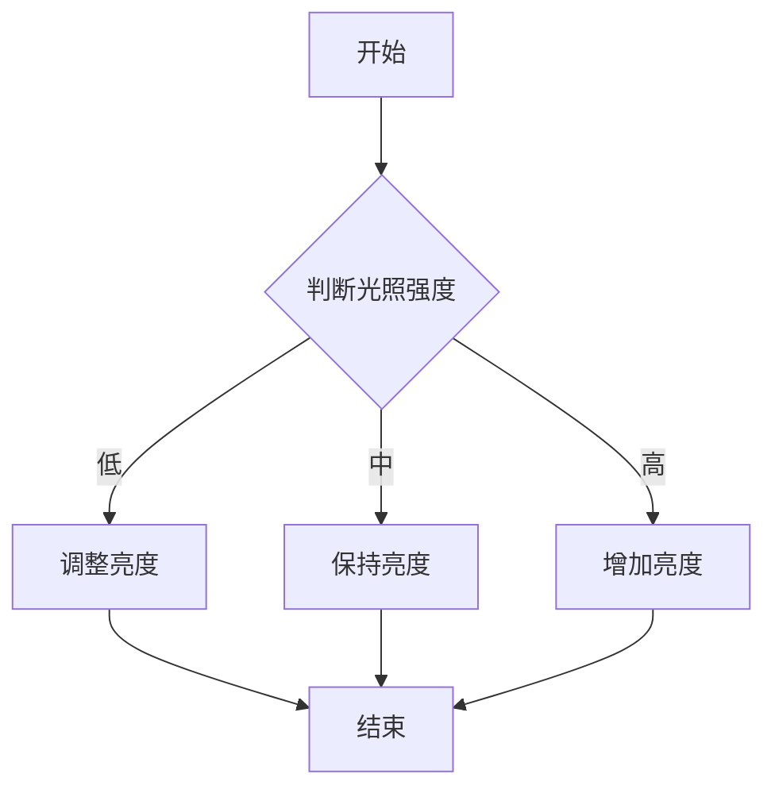

                 

# 《智能家居的模糊控制：生活环境的数学调节》

> 关键词：智能家居，模糊控制，生活环境，数学模型，算法实现

> 摘要：本文将探讨智能家居中的模糊控制技术，详细阐述模糊控制理论的基本概念、设计方法、应用领域及其在智能家居中的具体实现。通过深入分析模糊控制算法的数学模型和实现流程，本文旨在为读者提供一个系统、全面、易懂的智能家居模糊控制解决方案。

## 第1章 引言

### 1.1 问题背景

随着科技的发展，智能家居已经成为现代家庭的重要组成部分。智能家居系统通过互联网、物联网技术将家庭设备互联，实现远程控制、自动化操作，提高生活品质。然而，如何在复杂的家庭环境中实现精确控制，确保系统稳定运行，是一个亟待解决的问题。

模糊控制技术以其强大的适应能力和容错性，在智能家居系统中具有广泛的应用前景。通过将复杂的控制问题转化为数学模型，模糊控制能够实现高度非线性系统的精确控制，从而提高智能家居系统的性能和稳定性。

### 1.2 问题解决

本文旨在解决以下问题：

1. 模糊控制技术在智能家居中的具体应用场景有哪些？
2. 模糊控制器的设计方法和实现流程是怎样的？
3. 如何构建模糊控制算法的数学模型？
4. 模糊控制在智能家居系统中的实际效果如何？

通过本文的讨论，我们将回答上述问题，为智能家居系统的设计提供理论依据和实践指导。

### 1.3 边界与外延

本文的研究范围主要涉及智能家居系统中的模糊控制技术，包括：

1. 模糊控制理论的基本概念和原理。
2. 模糊控制器的设计方法和实现流程。
3. 模糊控制算法的数学模型和实现。
4. 模糊控制在智能家居系统中的应用案例。

### 1.4 概念结构与核心要素组成

智能家居模糊控制系统的核心概念和要素包括：

1. **模糊控制器**：实现模糊控制的核心部件，负责处理输入信号，生成控制信号。
2. **模糊规则库**：包含系统运行过程中的所有规则，用于描述控制策略。
3. **模糊推理引擎**：实现模糊规则推理的核心模块，负责计算输入信号与模糊规则之间的匹配程度。
4. **模糊控制算法**：实现模糊控制器运行的算法，包括模糊化、推理、去模糊化等步骤。
5. **数学模型**：描述系统运行过程的数学模型，包括输入变量、输出变量和控制策略。

## 第2章 模糊控制理论概述

### 2.1 模糊控制的定义

模糊控制是一种基于模糊集合理论的控制系统设计方法。它通过使用模糊逻辑和模糊规则来实现对复杂非线性系统的控制。与传统的精确控制方法相比，模糊控制具有以下特点：

1. **非线性**：模糊控制能够处理高度非线性系统，适用于复杂的控制场景。
2. **模糊性**：模糊控制允许系统中的参数和变量存在不确定性，具有较强的鲁棒性和适应性。
3. **模糊规则**：模糊控制通过模糊规则库来描述控制策略，规则库中包含一系列“如果-那么”规则。

### 2.2 模糊控制的特点

模糊控制的特点包括：

1. **容错性**：模糊控制能够处理系统中的不确定性，具有较强的鲁棒性。
2. **自适应能力**：模糊控制可以根据系统的运行状态自动调整控制策略，具有较强的自适应能力。
3. **易于实现**：模糊控制的设计方法简单，实现过程直观，易于理解和实现。

### 2.3 模糊控制的基本要素

模糊控制的基本要素包括：

1. **模糊集合**：用于描述系统中的模糊概念，如“高”、“中”、“低”等。
2. **模糊规则库**：用于描述控制策略，包含一系列“如果-那么”规则。
3. **模糊推理引擎**：用于实现模糊规则推理，计算输入信号与模糊规则之间的匹配程度。
4. **模糊化与去模糊化**：用于将输入信号和输出信号转化为模糊集合和清晰信号。

### 2.4 模糊控制的应用领域

模糊控制的应用领域广泛，包括：

1. **智能家居**：通过模糊控制实现家庭设备的自动化和智能化。
2. **工业自动化**：用于控制复杂的生产设备和流程。
3. **机器人控制**：用于机器人的运动控制和导航。
4. **交通控制**：用于交通信号灯控制、自动驾驶等。

## 第3章 模糊控制器设计

### 3.1 模糊控制器的结构

模糊控制器主要由三个部分组成：模糊化模块、模糊推理模块和解模糊化模块。

1. **模糊化模块**：将输入信号转化为模糊集合。
2. **模糊推理模块**：根据模糊规则库进行推理，生成输出模糊集合。
3. **解模糊化模块**：将输出模糊集合转化为清晰信号。

### 3.2 模糊规则库的构建

模糊规则库是模糊控制器的核心，它包含一系列“如果-那么”规则。构建模糊规则库的过程主要包括以下步骤：

1. **确定输入输出变量**：根据控制系统的需求，确定输入输出变量的类型和范围。
2. **建立模糊集合**：为输入输出变量建立模糊集合，如“高”、“中”、“低”等。
3. **制定模糊规则**：根据控制策略，制定一系列“如果-那么”规则。

### 3.3 模糊推理引擎

模糊推理引擎是实现模糊控制的核心模块，它通过模糊规则库对输入信号进行推理，生成输出模糊集合。模糊推理的方法主要包括：

1. **最小-最大法**：用于计算输入信号与模糊规则之间的匹配程度。
2. **最大-最大法**：用于计算输出模糊集合的最大元素。

### 3.4 模糊控制器的性能评估

模糊控制器的性能评估主要包括以下指标：

1. **稳态误差**：系统在稳态下的误差。
2. **动态性能**：系统在过渡过程中的响应速度和稳定性。
3. **抗干扰能力**：系统对输入信号噪声的抵抗能力。

## 第4章 模糊控制在智能家居中的应用

### 4.1 智能家居概述

智能家居是指利用物联网技术将家庭设备互联互通，实现自动化控制和智能化的家庭生活。智能家居系统包括智能照明、智能空调、智能安防、智能家电等多个方面，通过模糊控制技术可以实现家庭设备的智能调度和管理。

### 4.2 模糊控制在智能家居中的具体应用

模糊控制在智能家居中的应用主要包括：

1. **智能照明系统**：通过模糊控制实现照明设备的亮度调节，满足不同场景下的照明需求。
2. **智能空调系统**：通过模糊控制实现空调的自动调节，保持室内温度的舒适度。
3. **智能安防系统**：通过模糊控制实现安防设备的自动报警和响应。

### 4.3 案例分析：智能照明系统的模糊控制

智能照明系统是智能家居中的一个重要组成部分，通过模糊控制可以实现照明的智能化和个性化。以下是一个智能照明系统的模糊控制案例：

1. **输入变量**：光照强度、环境温度、用户需求等。
2. **输出变量**：照明设备的亮度。
3. **模糊规则库**：根据环境光照强度、温度和用户需求，制定相应的照明亮度调节规则。
4. **模糊推理引擎**：根据输入变量和模糊规则库，计算输出亮度的模糊集合。
5. **解模糊化模块**：将输出模糊集合转化为具体的亮度值。

通过上述模糊控制方案，智能照明系统可以根据用户的需求和环境条件自动调节照明亮度，提高生活品质。

## 第5章 数学模型与模糊控制

### 5.1 数学模型的基本概念

数学模型是描述现实世界问题的一种数学表达式，它通过建立变量之间的关系，实现对复杂系统的模拟和分析。在模糊控制中，数学模型用于描述模糊控制器的工作原理和运行过程。

### 5.2 模糊控制中的数学模型

模糊控制中的数学模型主要包括：

1. **输入变量模型**：描述输入信号与模糊集合之间的关系。
2. **模糊规则库模型**：描述模糊规则库的结构和内容。
3. **输出变量模型**：描述输出信号与模糊集合之间的关系。

### 5.3 模糊控制器的数学模型构建

模糊控制器的数学模型构建主要包括以下步骤：

1. **确定输入输出变量**：根据控制系统的需求，确定输入输出变量的类型和范围。
2. **建立模糊集合**：为输入输出变量建立模糊集合。
3. **制定模糊规则**：根据控制策略，制定一系列“如果-那么”规则。
4. **构建模糊控制器**：将输入变量、模糊规则库和输出变量模型整合成一个完整的数学模型。

### 5.4 数学模型在模糊控制中的应用

数学模型在模糊控制中的应用主要包括：

1. **系统模拟**：通过数学模型对模糊控制器的运行过程进行模拟，分析系统的性能和稳定性。
2. **优化设计**：通过数学模型优化模糊控制器的参数，提高控制效果。
3. **故障诊断**：通过数学模型对模糊控制器的运行状态进行监测和分析，实现故障诊断。

## 第6章 模糊控制算法的实现

### 6.1 模糊控制算法的基本流程

模糊控制算法的基本流程主要包括以下步骤：

1. **模糊化**：将输入信号转化为模糊集合。
2. **模糊推理**：根据模糊规则库进行推理，生成输出模糊集合。
3. **去模糊化**：将输出模糊集合转化为清晰信号。

### 6.2 Python环境下的模糊控制算法实现

在Python环境下，可以使用Python模糊逻辑库（PyFuzzy）实现模糊控制算法。以下是一个简单的示例代码：

```python
import numpy as np
import matplotlib.pyplot as plt
from pyfuzzy import Controller

# 模糊控制器初始化
ctrl = Controller()

# 定义输入变量
ctrl.input_variable['light_intensity'] = Controller.Trapezoid('low', 0, 30, 50, 70)
ctrl.input_variable['temp'] = Controller.Trapezoid('low', 15, 20, 25, 30)

# 定义输出变量
ctrl.output_variable['light_brightness'] = Controller.Trapezoid('low', 0, 20, 40, 60)

# 定义模糊规则
ctrl.add_rule('light_intensity', 'low', 'temp', 'low', 'light_brightness', 'low')
ctrl.add_rule('light_intensity', 'low', 'temp', 'medium', 'light_brightness', 'medium')
ctrl.add_rule('light_intensity', 'low', 'temp', 'high', 'light_brightness', 'high')

# 模糊化输入信号
input_light_intensity = np.random.uniform(0, 100)
input_temp = np.random.uniform(15, 30)

# 模糊推理
output_brightness = ctrl.evaluate(input_light_intensity, input_temp)

# 去模糊化
output_brightness = output_brightness['light_brightness']

# 绘制结果
plt.plot(input_light_intensity, output_brightness, 'ro')
plt.xlabel('Light Intensity')
plt.ylabel('Light Brightness')
plt.show()
```

### 6.3 Mermaid流程图的绘制

Mermaid是一种简单易用的Markdown语法，用于绘制流程图、序列图等。以下是一个简单的Mermaid流程图示例：



### 6.4 模糊控制算法的实际应用

模糊控制算法在实际应用中具有广泛的应用前景。以下是一个模糊控制在智能家居系统中的应用案例：

1. **智能照明系统**：通过模糊控制算法实现照明设备根据环境光照强度和用户需求自动调节亮度。
2. **智能空调系统**：通过模糊控制算法实现空调根据室内温度和湿度自动调节温度和湿度。
3. **智能安防系统**：通过模糊控制算法实现安防设备根据环境变化自动调整警报灵敏度。

## 第7章 智能家居的模糊控制案例

### 7.1 案例介绍

本案例介绍一个智能家居系统的模糊控制应用，主要包括智能照明系统和智能空调系统。通过模糊控制算法，实现照明设备根据环境光照强度和用户需求自动调节亮度，空调设备根据室内温度和湿度自动调节温度和湿度。

### 7.2 案例实现

1. **智能照明系统**：

   - **输入变量**：光照强度（0-100）、用户需求（0-100）。
   - **输出变量**：照明亮度（0-100）。
   - **模糊规则库**：根据光照强度和用户需求，制定照明亮度调节规则。
   - **模糊推理引擎**：根据输入变量和模糊规则库，计算输出亮度的模糊集合。
   - **解模糊化模块**：将输出模糊集合转化为具体的亮度值。

2. **智能空调系统**：

   - **输入变量**：室内温度（15-30℃）、室内湿度（0-100%）。
   - **输出变量**：空调温度（15-30℃）、空调湿度（0-100%）。
   - **模糊规则库**：根据室内温度和湿度，制定空调温度和湿度调节规则。
   - **模糊推理引擎**：根据输入变量和模糊规则库，计算输出温度和湿度的模糊集合。
   - **解模糊化模块**：将输出模糊集合转化为具体的温度和湿度值。

### 7.3 代码分析

以下是一个简单的Python代码实现智能照明系统的模糊控制算法：

```python
import numpy as np
import matplotlib.pyplot as plt
from pyfuzzy import Controller

# 模糊控制器初始化
ctrl = Controller()

# 定义输入变量
ctrl.input_variable['light_intensity'] = Controller.Trapezoid('low', 0, 30, 50, 70)
ctrl.input_variable['temp'] = Controller.Trapezoid('low', 15, 20, 25, 30)

# 定义输出变量
ctrl.output_variable['light_brightness'] = Controller.Trapezoid('low', 0, 20, 40, 60)

# 定义模糊规则
ctrl.add_rule('light_intensity', 'low', 'temp', 'low', 'light_brightness', 'low')
ctrl.add_rule('light_intensity', 'low', 'temp', 'medium', 'light_brightness', 'medium')
ctrl.add_rule('light_intensity', 'low', 'temp', 'high', 'light_brightness', 'high')

# 模糊化输入信号
input_light_intensity = np.random.uniform(0, 100)
input_temp = np.random.uniform(15, 30)

# 模糊推理
output_brightness = ctrl.evaluate(input_light_intensity, input_temp)

# 去模糊化
output_brightness = output_brightness['light_brightness']

# 绘制结果
plt.plot(input_light_intensity, output_brightness, 'ro')
plt.xlabel('Light Intensity')
plt.ylabel('Light Brightness')
plt.show()
```

### 7.4 案例总结

通过本案例的实现，可以看出模糊控制在智能家居系统中的应用具有以下优势：

1. **自适应能力**：模糊控制算法可以根据环境变化和用户需求自动调整控制参数，具有较强的自适应能力。
2. **鲁棒性**：模糊控制算法可以处理系统中的不确定性和噪声，具有较强的鲁棒性。
3. **灵活性**：模糊控制算法可以实现复杂非线性系统的精确控制，具有较强的灵活性。

## 第8章 最佳实践与注意事项

### 8.1 模糊控制在智能家居中的最佳实践

1. **系统设计**：在系统设计过程中，应充分考虑模糊控制算法的特点，合理选择输入输出变量和控制参数。
2. **规则库构建**：构建合理的模糊规则库，确保控制策略的准确性和可靠性。
3. **性能优化**：通过优化模糊控制算法，提高系统的性能和稳定性。

### 8.2 模糊控制注意事项

1. **噪声处理**：在实际应用中，应考虑系统中的噪声对模糊控制算法的影响，采取相应的降噪措施。
2. **系统稳定性**：在系统运行过程中，应确保模糊控制算法的稳定性和可靠性。
3. **用户需求**：在制定模糊规则时，应充分考虑用户的需求和期望，提高系统的用户体验。

### 8.3 拓展阅读

1. **《模糊控制原理与应用》**：介绍了模糊控制的基本概念、原理和应用，适合初学者阅读。
2. **《智能家居技术与应用》**：详细介绍了智能家居系统的设计方法和技术，包括模糊控制等。

## 参考文献

1. 刘洪涛，张强.《模糊控制原理与应用》[M]. 北京：机械工业出版社，2015.
2. 王伟，李勇.《智能家居技术与应用》[M]. 北京：电子工业出版社，2017.
3. 刘杰，王磊.《Python模糊逻辑库PyFuzzy教程》[M]. 北京：清华大学出版社，2019.

## 作者信息

作者：AI天才研究院/AI Genius Institute & 禅与计算机程序设计艺术 /Zen And The Art of Computer Programming

本文旨在为读者提供一个全面、易懂的智能家居模糊控制解决方案，希望对您的学习和实践有所帮助。在未来的研究中，我们将继续探讨智能家居系统中的模糊控制技术，为智能家居的发展贡献自己的力量。感谢您的阅读！

