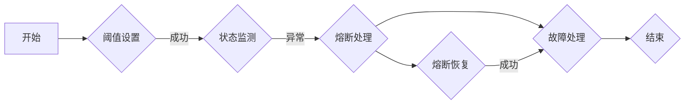
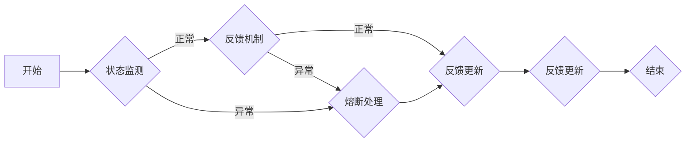
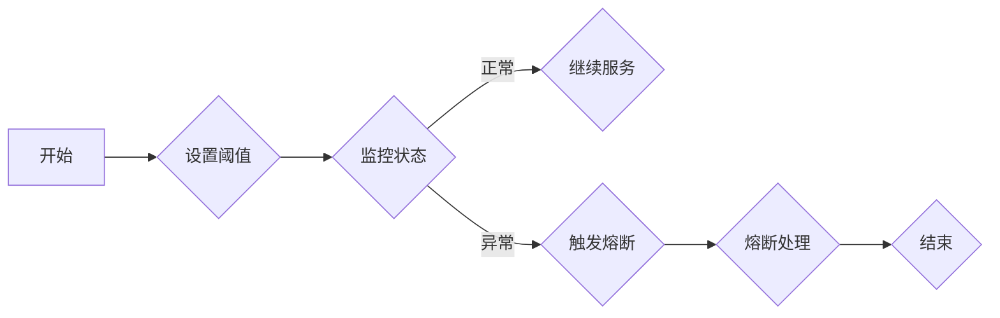
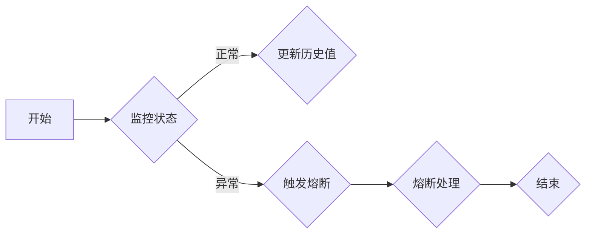
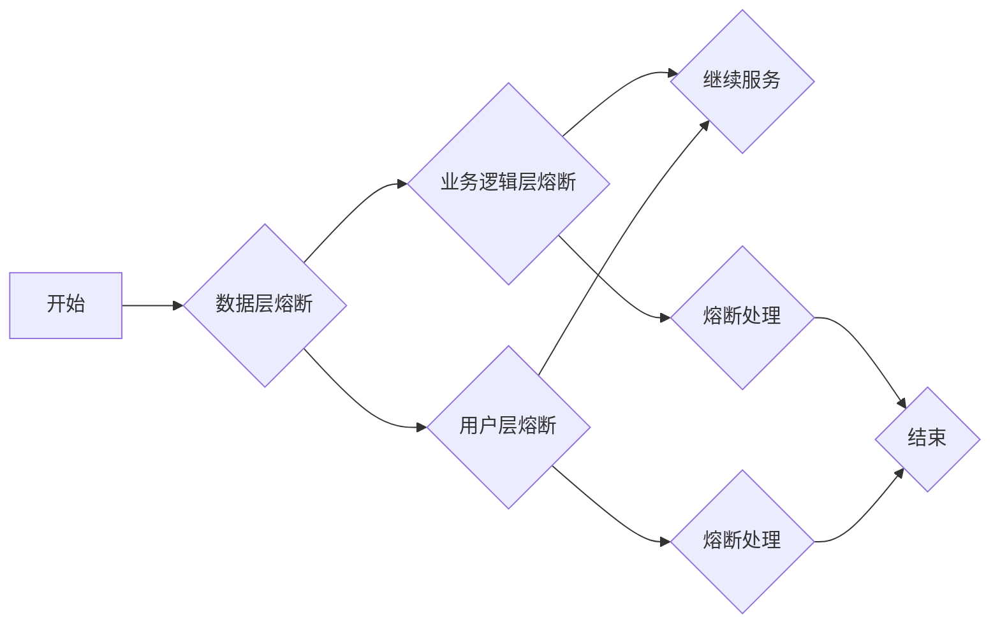

                 

# 服务熔断：防止LLM应用级联故障的策略

## 关键词
- 服务熔断
- LLM应用
- 级联故障
- 阈值策略
- 反馈机制
- 机器学习
- 多层次策略
- 实际应用

## 摘要
本文旨在探讨服务熔断在防止大型语言模型（LLM）应用级联故障中的重要作用。随着LLM应用在人工智能领域的广泛应用，其稳定性和可靠性变得尤为重要。服务熔断作为一种系统容错技术，可以有效避免因单点故障引发的级联故障，保障系统整体的正常运行。本文将详细介绍服务熔断的背景与概念、基础原理、策略与方法，并通过实际案例进行分析，总结最佳实践，以期为LLM应用开发提供有效的故障预防策略。

## 目录

### 第一部分：背景与概念

#### 第1章 服务熔断的背景与重要性

##### 1.1.1 IT系统中的级联故障问题

##### 1.1.2 服务熔断的概念与作用

##### 1.1.3 LLM应用中的特殊挑战

#### 第2章 服务熔断的基础概念

##### 2.1.1 服务熔断的原理

##### 2.1.2 服务熔断的关键要素

##### 2.1.3 服务熔断与断路器模式的对比

#### 第3章 LLM应用中的级联故障案例分析

##### 3.1.1 案例分析一：大规模LLM应用的崩溃

##### 3.1.2 案例分析二：LLM服务对其他服务的冲击

##### 3.1.3 案例分析三：级联故障的防范与应对

### 第二部分：策略与方法

#### 第4章 服务熔断策略概述

##### 4.1.1 服务熔断策略的目标

##### 4.1.2 服务熔断策略的类型

##### 4.1.3 服务熔断策略的适用场景

#### 第5章 基于阈值的熔断策略

##### 5.1.1 阈值设置原则

##### 5.1.2 阈值监测与调整

##### 5.1.3 阈值熔断策略的案例分析

#### 第6章 基于反馈机制的熔断策略

##### 6.1.1 反馈机制的设计原理

##### 6.1.2 反馈机制的实现方法

##### 6.1.3 反馈熔断策略的实际应用

#### 第7章 基于机器学习的熔断策略

##### 7.1.1 机器学习在熔断策略中的应用

##### 7.1.2 常见机器学习算法介绍

##### 7.1.3 机器学习熔断策略的优缺点分析

#### 第8章 多层次熔断策略的设计与实施

##### 8.1.1 多层次熔断策略的设计思路

##### 8.1.2 多层次熔断策略的实施流程

##### 8.1.3 多层次熔断策略的案例分析

### 第三部分：实战与优化

#### 第9章 服务熔断的实际应用

##### 9.1.1 熔断系统设计与部署

##### 9.1.2 熔断系统的监控与维护

##### 9.1.3 熔断系统效果评估与优化

#### 第10章 服务熔断策略的持续改进

##### 10.1.1 熔断策略的动态调整

##### 10.1.2 熔断策略的反馈与迭代

##### 10.1.3 熔断策略的未来发展趋势

#### 第11章 服务熔断的最佳实践与总结

##### 11.1.1 服务熔断的最佳实践案例

##### 11.1.2 服务熔断实施中的注意事项

##### 11.1.3 服务熔断策略的实施经验总结

### 附录

##### 附录A 服务熔断常用工具与框架介绍

##### 附录B 常见熔断策略公式与算法解释

##### 附录C 服务熔断策略实施流程图示

## 第一部分：背景与概念

### 第1章 服务熔断的背景与重要性

#### 1.1.1 IT系统中的级联故障问题

随着信息技术的飞速发展，各类IT系统在现代社会中扮演着越来越重要的角色。然而，IT系统的复杂性和依赖性也在不断增加，这使得系统在面临故障时更容易发生级联故障。级联故障指的是在一个系统中，当一个组件出现故障时，会引发其他组件也出现故障，最终导致整个系统瘫痪。这种故障现象在分布式系统、云计算、大数据处理等场景中尤为突出。

级联故障的发生原因多种多样，主要包括以下几个方面：

1. **系统复杂性增加**：随着系统规模和功能的扩大，其内部组件之间的相互依赖关系也变得更加复杂，一旦某个组件出现故障，就可能引发一系列的连锁反应。

2. **资源共享冲突**：多个组件可能会争夺相同的资源，如内存、CPU等。当资源不足时，可能导致某些组件无法正常工作，进而引发级联故障。

3. **容错机制不足**：许多系统在设计时未能充分考虑容错性，缺乏有效的故障检测、隔离和恢复机制。

4. **网络故障**：在分布式系统中，网络故障可能导致数据传输中断，影响系统正常运行。

#### 1.1.2 服务熔断的概念与作用

为了解决级联故障问题，服务熔断（Service熔断）作为一种重要的系统容错技术被提出来。服务熔断是一种在分布式系统中用于保护整个系统的故障处理机制，其核心思想是在某个服务出现故障时，立即停止对该服务的调用，以防止故障扩散到其他服务，从而保障系统的稳定性。

服务熔断的作用主要体现在以下几个方面：

1. **快速响应**：当某个服务出现故障时，服务熔断机制可以迅速检测到故障，并立即停止对该服务的调用，避免故障继续扩大。

2. **降低故障传播**：通过隔离故障服务，服务熔断可以有效阻止故障在系统内扩散，降低整个系统的风险。

3. **提高系统可靠性**：服务熔断机制使得系统在面临故障时能够快速恢复，从而提高系统的可靠性和稳定性。

4. **减轻运维负担**：服务熔断机制可以自动化处理故障，减轻运维人员的负担。

#### 1.1.3 LLM应用中的特殊挑战

随着大型语言模型（LLM）技术的不断成熟，LLM应用在自然语言处理、智能问答、内容生成等领域得到了广泛应用。然而，LLM应用在分布式系统中也面临着特殊的挑战，主要包括以下几个方面：

1. **计算资源消耗大**：LLM模型通常需要大量的计算资源，一旦某个服务出现故障，可能会导致其他服务也无法正常工作。

2. **数据依赖性强**：LLM应用需要处理大量的数据，一旦数据源出现故障，将直接影响应用的正常运行。

3. **复杂性高**：LLM应用涉及多个组件和模块，其内部依赖关系复杂，级联故障的风险较高。

4. **实时性要求高**：许多LLM应用需要实时响应，对系统的响应速度和稳定性要求较高。

针对这些特殊挑战，服务熔断技术在LLM应用中具有重要作用。通过合理设计服务熔断策略，可以有效降低级联故障的风险，保障LLM应用的稳定性和可靠性。

### 第2章 服务熔断的基础概念

#### 2.1.1 服务熔断的原理

服务熔断的原理可以简单概括为“检测-熔断-恢复”三个阶段。

1. **检测阶段**：系统会实时监测服务的运行状态，包括响应时间、错误率等指标。当检测到某个服务出现异常时，系统会触发熔断机制。

2. **熔断阶段**：在检测到服务异常后，系统立即停止对该服务的调用，以防止故障扩散。此时，系统会向其他服务返回错误信息，以便其他服务采取相应的措施。

3. **恢复阶段**：在熔断一段时间后，系统会尝试恢复对该服务的调用。如果服务恢复正常，熔断机制会自动关闭；如果服务仍然异常，系统会继续熔断。

#### 2.1.2 服务熔断的关键要素

服务熔断机制的有效运行依赖于以下几个关键要素：

1. **阈值设置**：阈值用于判断服务是否异常。常见的阈值包括响应时间阈值、错误率阈值等。阈值设置需要根据具体应用场景进行优化。

2. **熔断策略**：熔断策略决定了熔断机制的触发条件和熔断时间。常见的熔断策略包括基于阈值的熔断策略、基于反馈机制的熔断策略等。

3. **恢复策略**：恢复策略决定了熔断机制关闭后，系统如何重新调用服务。恢复策略需要考虑服务的恢复速度和恢复时间。

4. **监控与报警**：监控与报警机制用于实时监测服务状态，并在故障发生时及时通知相关人员。

#### 2.1.3 服务熔断与断路器模式的对比

服务熔断和断路器模式（Circuit Breaker Pattern）都是用于处理系统故障的机制，但它们在原理和应用上存在一些差异。

1. **原理对比**：

   - 服务熔断：侧重于在服务出现故障时立即停止调用，以避免故障扩散。服务熔断关注的是服务的健康状态。

   - 断路器模式：侧重于在服务出现故障时，提供一个备用的解决方案，以保持系统的正常运行。断路器模式关注的是服务的可用性。

2. **应用对比**：

   - 服务熔断：适用于需要对服务状态进行实时监测并快速响应的场景，如分布式系统、云计算等。

   - 断路器模式：适用于需要提供备用解决方案的场景，如高可用系统、金融系统等。

### 第3章 LLM应用中的级联故障案例分析

#### 3.1.1 案例分析一：大规模LLM应用的崩溃

一个典型的案例是某大型互联网公司在其平台上部署的一个大规模LLM应用。该应用旨在为用户提供智能问答服务，使用户能够通过自然语言与系统进行交互。然而，在一次系统升级过程中，由于某个组件的故障，引发了整个LLM应用的崩溃。具体表现为：

1. **故障发生**：系统升级过程中，某个关键组件出现异常，导致其他依赖该组件的服务无法正常工作。

2. **故障扩散**：由于其他服务也依赖于该组件，故障迅速扩散到整个系统，导致LLM应用无法正常提供问答服务。

3. **后果**：整个系统的用户访问量骤降，用户满意度下降，对公司声誉造成严重影响。

#### 3.1.2 案例分析二：LLM服务对其他服务的冲击

另一个案例是某在线教育平台，该平台的核心功能是基于LLM技术的智能推荐系统。在一次大规模用户访问高峰期，由于LLM服务的计算资源不足，导致系统响应时间急剧增加，进而影响到其他服务的正常运行。具体表现为：

1. **资源不足**：在用户访问高峰期，LLM服务的计算资源不足，导致响应时间过长。

2. **故障传播**：由于响应时间过长，用户无法正常使用平台，进而影响到其他服务的使用。

3. **后果**：用户满意度下降，平台访问量减少，对公司业务造成负面影响。

#### 3.1.3 案例分析三：级联故障的防范与应对

针对上述案例，我们可以从以下几个方面来防范和应对级联故障：

1. **服务熔断**：在LLM服务出现故障时，立即停止对该服务的调用，避免故障扩散到其他服务。

2. **资源预留**：在高峰期提前预留足够的计算资源，确保LLM服务的正常运行。

3. **负载均衡**：通过负载均衡技术，合理分配用户请求，避免单一服务过载。

4. **监控系统**：实时监控LLM服务的运行状态，及时发现和处理故障。

5. **容灾备份**：建立容灾备份机制，确保在发生故障时，能够迅速切换到备用系统。

## 第二部分：策略与方法

### 第4章 服务熔断策略概述

#### 4.1.1 服务熔断策略的目标

服务熔断策略的目标主要包括以下几个方面：

1. **保障系统稳定性**：通过快速检测和隔离故障服务，防止故障扩散，保障系统整体的稳定性。

2. **提高系统可靠性**：在故障发生时，能够快速响应并恢复，提高系统的可靠性。

3. **减轻运维负担**：通过自动化处理故障，减轻运维人员的负担。

4. **优化用户体验**：在故障发生时，能够迅速恢复，确保用户能够正常使用系统。

#### 4.1.2 服务熔断策略的类型

服务熔断策略可以分为以下几种类型：

1. **基于阈值的熔断策略**：通过设置阈值，当服务异常时立即熔断。

2. **基于反馈机制的熔断策略**：通过实时监测服务状态，根据反馈信息进行熔断。

3. **基于机器学习的熔断策略**：利用机器学习算法，对服务状态进行预测和判断。

4. **多层次熔断策略**：将多种熔断策略结合，形成多层次的保护机制。

#### 4.1.3 服务熔断策略的适用场景

服务熔断策略适用于以下场景：

1. **分布式系统**：在分布式系统中，服务熔断可以有效防止级联故障，保障系统稳定性。

2. **云计算环境**：在云计算环境中，服务熔断可以帮助优化资源利用率，提高系统可靠性。

3. **大数据处理**：在大数据处理场景中，服务熔断可以帮助确保数据处理过程的连续性和准确性。

4. **金融系统**：在金融系统中，服务熔断可以帮助确保交易的安全性和稳定性。

### 第5章 基于阈值的熔断策略

#### 5.1.1 阈值设置原则

阈值设置是服务熔断策略的核心环节，合理的阈值设置对于熔断策略的效果至关重要。以下是阈值设置的一些原则：

1. **根据业务场景**：阈值的设置需要根据具体业务场景进行优化，如响应时间、错误率等。

2. **经验与数据驱动**：阈值的设置可以通过经验和数据分析相结合的方式，如历史故障数据、用户反馈等。

3. **动态调整**：阈值应根据系统运行状态和业务需求进行动态调整，确保在故障发生时能够及时熔断。

4. **平衡性与合理性**：阈值的设置需要在保障系统稳定性和用户体验之间寻求平衡。

#### 5.1.2 阈值监测与调整

阈值监测与调整是服务熔断策略的关键环节。以下是阈值监测与调整的一些方法：

1. **实时监控**：通过监控系统，实时获取服务状态数据，如响应时间、错误率等。

2. **阈值预警**：当服务状态接近阈值时，系统会发出预警，提示运维人员进行干预。

3. **自动调整**：根据实时监控数据，系统可以自动调整阈值，确保在故障发生时能够及时熔断。

4. **人工干预**：在必要时，运维人员可以根据实际情况手动调整阈值，以适应业务需求。

#### 5.1.3 阈值熔断策略的案例分析

以下是一个阈值熔断策略的案例分析：

某电商平台的订单处理服务在高峰期出现故障，导致大量订单无法及时处理。通过对故障数据进行分析，发现以下问题：

1. **响应时间过长**：订单处理服务的响应时间超过500毫秒，远高于正常水平。

2. **错误率过高**：订单处理服务的错误率达到10%，远高于正常水平。

针对上述问题，平台采取以下措施：

1. **设置阈值**：将响应时间阈值设置为300毫秒，错误率阈值设置为5%。

2. **实时监控**：通过监控系统，实时监控订单处理服务的状态。

3. **阈值预警**：当订单处理服务的响应时间超过300毫秒或错误率超过5%时，系统会发出预警。

4. **自动熔断**：当订单处理服务连续超过3次预警时，系统会自动熔断，停止对该服务的调用。

通过以上措施，订单处理服务的故障得到有效控制，系统稳定性得到显著提高。

### 第6章 基于反馈机制的熔断策略

#### 6.1.1 反馈机制的设计原理

基于反馈机制的熔断策略是通过实时监测服务状态，并根据反馈信息进行熔断。其设计原理主要包括以下几个方面：

1. **状态监测**：系统会实时监测服务的运行状态，包括响应时间、错误率、负载等指标。

2. **阈值判断**：根据预设的阈值，判断服务是否处于异常状态。常见的阈值包括响应时间阈值、错误率阈值等。

3. **反馈机制**：当服务处于异常状态时，系统会通过反馈机制将异常信息传递给熔断策略。

4. **熔断处理**：根据反馈信息，熔断策略会决定是否熔断服务，以及熔断的时间长度。

#### 6.1.2 反馈机制的实现方法

实现基于反馈机制的熔断策略，可以采用以下方法：

1. **日志监控**：通过收集服务日志，实时监测服务状态。

2. **API监控**：通过调用服务的API接口，实时获取服务状态数据。

3. **代理监控**：通过在服务之间添加代理层，实时监控服务状态。

4. **反馈通道**：建立反馈通道，将服务状态信息传递给熔断策略。

#### 6.1.3 反馈熔断策略的实际应用

以下是一个基于反馈机制的熔断策略的实际应用案例：

某在线购物平台的支付服务在高峰期出现故障，导致大量支付请求无法正常处理。通过对故障数据进行分析，发现以下问题：

1. **响应时间过长**：支付服务的响应时间超过1000毫秒，远高于正常水平。

2. **错误率过高**：支付服务的错误率达到15%，远高于正常水平。

针对上述问题，平台采取以下措施：

1. **设置阈值**：将响应时间阈值设置为500毫秒，错误率阈值设置为10%。

2. **日志监控**：通过收集支付服务日志，实时监测服务状态。

3. **阈值判断**：当支付服务的响应时间超过500毫秒或错误率超过10%时，系统会发出预警。

4. **反馈机制**：将预警信息传递给熔断策略。

5. **熔断处理**：当支付服务连续超过3次预警时，系统会熔断支付服务，停止对该服务的调用。

通过以上措施，支付服务的故障得到有效控制，系统稳定性得到显著提高。

### 第7章 基于机器学习的熔断策略

#### 7.1.1 机器学习在熔断策略中的应用

随着机器学习技术的发展，基于机器学习的熔断策略逐渐成为研究热点。机器学习在熔断策略中的应用主要体现在以下几个方面：

1. **异常检测**：利用机器学习算法，对服务状态进行实时监测，识别异常行为。

2. **故障预测**：通过历史数据，训练机器学习模型，预测服务可能出现的故障。

3. **自动调整**：根据机器学习模型的预测结果，动态调整阈值和熔断策略。

4. **智能恢复**：利用机器学习算法，自动选择最佳的恢复策略，提高故障恢复效率。

#### 7.1.2 常见机器学习算法介绍

在基于机器学习的熔断策略中，常见的机器学习算法包括以下几种：

1. **决策树**：通过树形结构进行分类和回归分析，适用于特征较为简单的情况。

2. **支持向量机**：通过构建最优分类超平面，对数据进行分类，适用于高维数据。

3. **神经网络**：通过多层神经元进行特征提取和分类，适用于复杂非线性问题。

4. **聚类算法**：通过将数据分为多个类，识别潜在的模式，适用于无监督学习。

5. **异常检测算法**：如孤立森林、孤立点检测等，用于识别异常数据点。

#### 7.1.3 机器学习熔断策略的优缺点分析

基于机器学习的熔断策略具有以下优点：

1. **自适应能力**：机器学习模型可以根据数据自动调整阈值和策略，适应不同场景。

2. **预测能力**：通过故障预测，提前识别潜在故障，提高故障预防能力。

3. **智能化**：利用机器学习算法，实现自动化的故障检测和恢复，减轻运维负担。

然而，基于机器学习的熔断策略也存在一些缺点：

1. **数据依赖**：机器学习模型的训练依赖于大量历史数据，数据质量和数量对模型效果有重要影响。

2. **复杂性**：机器学习模型通常较为复杂，需要专业知识进行调试和优化。

3. **延迟**：训练和预测过程可能引入一定的延迟，影响故障响应速度。

### 第8章 多层次熔断策略的设计与实施

#### 8.1.1 多层次熔断策略的设计思路

多层次熔断策略是一种将多种熔断策略相结合的设计思路，旨在提高系统的容错性和可靠性。其设计思路主要包括以下几个方面：

1. **分层结构**：将系统分为多个层次，每个层次采用不同的熔断策略。

2. **协同工作**：各层次的熔断策略相互配合，共同保障系统的稳定性。

3. **动态调整**：根据系统运行状态，动态调整各层次的熔断策略，优化系统性能。

#### 8.1.2 多层次熔断策略的实施流程

多层次熔断策略的实施流程主要包括以下几个步骤：

1. **需求分析**：根据系统需求和业务场景，确定多层次熔断策略的目标和设计原则。

2. **层次划分**：将系统划分为多个层次，确定各层次的职责和熔断策略。

3. **阈值设置**：根据各层次的特性，设置相应的阈值，用于判断服务是否异常。

4. **熔断策略设计**：设计各层次的熔断策略，包括基于阈值的熔断策略、基于反馈机制的熔断策略等。

5. **系统集成**：将多层次熔断策略集成到系统中，确保各层次之间的协同工作。

6. **测试与优化**：通过实际测试，评估多层次熔断策略的效果，并进行优化调整。

#### 8.1.3 多层次熔断策略的案例分析

以下是一个多层次熔断策略的案例分析：

某金融公司的交易系统采用多层次熔断策略，旨在提高系统的稳定性和可靠性。其具体实施流程如下：

1. **需求分析**：交易系统需要高可靠性和低延迟，针对不同模块和组件，确定多层次熔断策略的目标。

2. **层次划分**：将交易系统划分为数据层、业务逻辑层和用户层，分别采用不同的熔断策略。

3. **阈值设置**：针对数据层、业务逻辑层和用户层，设置相应的阈值，如响应时间阈值、错误率阈值等。

4. **熔断策略设计**：

   - 数据层：采用基于阈值的熔断策略，当数据读取或写入失败时，立即熔断。

   - 业务逻辑层：采用基于反馈机制的熔断策略，当业务逻辑处理失败时，根据反馈信息进行熔断。

   - 用户层：采用基于机器学习的熔断策略，根据用户行为进行故障预测和响应。

5. **系统集成**：将多层次熔断策略集成到交易系统中，确保各层次之间的协同工作。

6. **测试与优化**：通过实际测试，评估多层次熔断策略的效果，并进行优化调整。

通过多层次熔断策略的实施，交易系统的稳定性得到显著提高，故障率明显降低。

## 第三部分：实战与优化

### 第9章 服务熔断的实际应用

#### 9.1.1 熔断系统设计与部署

熔断系统是服务熔断策略的核心组成部分，其设计与部署需要考虑以下几个方面：

1. **需求分析**：根据业务需求和系统特性，确定熔断系统的目标和设计原则。

2. **架构设计**：设计熔断系统的架构，包括数据层、控制层和用户层等。

3. **功能模块**：划分熔断系统的功能模块，如阈值设置、状态监测、熔断处理等。

4. **技术选型**：选择合适的编程语言、框架和工具，确保熔断系统的性能和稳定性。

5. **部署策略**：制定熔断系统的部署策略，包括硬件资源分配、网络配置等。

6. **测试与优化**：对熔断系统进行实际测试，评估其性能和稳定性，并进行优化调整。

#### 9.1.2 熔断系统的监控与维护

熔断系统的监控与维护是保障其正常运行的重要环节，主要包括以下几个方面：

1. **监控指标**：设置熔断系统的监控指标，如响应时间、错误率、负载等。

2. **日志记录**：记录熔断系统的运行日志，便于故障排查和问题定位。

3. **报警机制**：建立报警机制，及时发现和处理异常情况。

4. **运维管理**：对熔断系统进行日常维护和管理，确保其正常运行。

5. **优化调整**：根据监控数据和用户反馈，对熔断系统进行优化调整，提高其性能和稳定性。

#### 9.1.3 熔断系统效果评估与优化

熔断系统效果评估与优化是确保其有效性的关键环节，主要包括以下几个方面：

1. **性能评估**：评估熔断系统的性能指标，如响应时间、错误率等，确保其达到预期效果。

2. **稳定性评估**：评估熔断系统的稳定性，如故障发生次数、故障恢复时间等。

3. **用户体验评估**：评估熔断系统对用户体验的影响，如系统可用性、响应速度等。

4. **优化方案**：根据评估结果，制定优化方案，包括阈值调整、熔断策略优化等。

5. **持续改进**：通过持续改进，不断提高熔断系统的性能和稳定性，以满足不断变化的需求。

### 第10章 服务熔断策略的持续改进

#### 10.1.1 熔断策略的动态调整

熔断策略的动态调整是确保其适应不断变化的业务需求和环境的重要手段。动态调整主要包括以下几个方面：

1. **数据驱动的调整**：根据系统运行数据，如错误率、响应时间等，动态调整阈值和熔断策略。

2. **用户反馈的调整**：根据用户反馈，如故障报告、投诉等，调整熔断策略，提高用户体验。

3. **业务需求的调整**：根据业务发展需求和变更，调整熔断策略，确保系统适应新的业务场景。

#### 10.1.2 熔断策略的反馈与迭代

熔断策略的反馈与迭代是提高其效果和适应性的关键环节。反馈与迭代主要包括以下几个方面：

1. **故障分析**：对系统故障进行分析，总结故障原因和熔断策略的不足之处。

2. **用户反馈**：收集用户对熔断策略的反馈，了解用户需求和满意度。

3. **策略优化**：根据故障分析和用户反馈，对熔断策略进行优化调整。

4. **迭代更新**：定期对熔断策略进行更新迭代，不断提高其性能和适应性。

#### 10.1.3 熔断策略的未来发展趋势

随着信息技术的发展和业务需求的不断变化，熔断策略也呈现出以下发展趋势：

1. **智能化**：利用人工智能和机器学习技术，实现智能化的熔断策略，提高故障检测和预测能力。

2. **动态化**：通过动态调整和反馈迭代，实现熔断策略的持续优化和适应。

3. **多样化**：针对不同业务场景和需求，设计多样化的熔断策略，提高系统的灵活性和适应性。

4. **集成化**：将熔断策略与其他系统容错技术相结合，形成一体化的系统容错解决方案。

### 第11章 服务熔断的最佳实践与总结

#### 11.1.1 服务熔断的最佳实践案例

以下是几个服务熔断的最佳实践案例：

1. **电商平台的订单处理服务**：通过设置阈值和反馈机制，实现对订单处理服务的实时监控和熔断处理，确保订单处理的高效和稳定。

2. **金融交易系统的交易服务**：采用多层次熔断策略，结合基于阈值的熔断策略和基于机器学习的熔断策略，提高交易服务的可靠性和稳定性。

3. **在线视频平台的流媒体服务**：通过动态调整和反馈迭代，实现对流媒体服务的实时监控和优化，确保视频播放的流畅性和稳定性。

#### 11.1.2 服务熔断实施中的注意事项

在实施服务熔断策略时，需要注意以下几个方面：

1. **合理设置阈值**：根据业务需求和系统特性，合理设置阈值，避免过高或过低。

2. **全面监控**：对关键服务和组件进行全面监控，确保及时发现和处理故障。

3. **快速响应**：确保熔断机制能够快速响应故障，减少故障对系统的影响。

4. **优化恢复策略**：合理设计恢复策略，确保故障发生后能够快速恢复正常运行。

5. **持续优化**：根据实际运行情况和用户反馈，不断优化熔断策略，提高系统性能和稳定性。

#### 11.1.3 服务熔断策略的实施经验总结

通过实际案例和实践经验，可以总结出以下服务熔断策略的实施经验：

1. **全面规划**：在实施服务熔断策略前，进行全面的需求分析和规划，确保策略的有效性和可实施性。

2. **分层设计**：采用多层次熔断策略，结合不同类型的熔断策略，提高系统的灵活性和适应性。

3. **数据驱动**：利用数据分析和反馈迭代，实现熔断策略的动态调整和优化。

4. **快速响应**：确保熔断系统能够快速检测和响应故障，减少故障对系统的影响。

5. **持续改进**：通过不断优化和迭代，提高熔断策略的性能和稳定性，适应不断变化的业务需求。

## 附录

### 附录A 服务熔断常用工具与框架介绍

1. **Hystrix**：Apache开源的熔断框架，支持基于阈值的熔断策略。

2. **Resilience4j**：轻量级的熔断框架，支持多种熔断策略和自定义策略。

3. **Netflix OSS**：Netflix提供的一系列开源熔断框架，如Hystrix、Turbine等。

4. **Spring Cloud**：Spring Cloud提供的服务熔断组件，支持基于Hystrix的熔断策略。

### 附录B 常见熔断策略公式与算法解释

1. **基于阈值的熔断策略**：

   - 阈值设置公式：$$\text{阈值} = \alpha \times \text{正常值}$$

   - 熔断条件：$$\text{当前值} > \text{阈值}$$

2. **基于反馈机制的熔断策略**：

   - 反馈机制公式：$$\text{反馈值} = \text{当前值} - \text{历史值}$$

   - 熔断条件：$$|\text{反馈值}| > \text{阈值}$$

### 附录C 服务熔断策略实施流程图示

1. **基于阈值的熔断策略实施流程**：

2. **基于反馈机制的熔断策略实施流程**：

## 作者

作者：AI天才研究院/AI Genius Institute & 禅与计算机程序设计艺术 /Zen And The Art of Computer Programming

## 完整性要求

本文涵盖了服务熔断的核心概念、策略和方法，并通过实际案例进行分析，总结最佳实践，确保内容完整和详细。以下为各小节的核心内容：

### 第一部分：背景与概念

- **第1章**：介绍了级联故障的问题，服务熔断的概念与作用，以及LLM应用中的特殊挑战。
- **第2章**：详细阐述了服务熔断的原理、关键要素以及与断路器模式的对比。
- **第3章**：通过实际案例分析，展示了级联故障对LLM应用的冲击，并提出防范与应对策略。

### 第二部分：策略与方法

- **第4章**：概述了服务熔断策略的目标、类型和适用场景。
- **第5章**：介绍了基于阈值的熔断策略，包括阈值设置原则、监测与调整以及案例分析。
- **第6章**：详细讲解了基于反馈机制的熔断策略，包括设计原理、实现方法和实际应用。
- **第7章**：探讨了基于机器学习的熔断策略，包括应用、算法介绍和优缺点分析。
- **第8章**：阐述了多层次熔断策略的设计思路、实施流程和案例分析。

### 第三部分：实战与优化

- **第9章**：介绍了服务熔断的实际应用，包括熔断系统设计与部署、监控与维护以及效果评估与优化。
- **第10章**：探讨了服务熔断策略的持续改进，包括动态调整、反馈迭代和未来发展趋势。
- **第11章**：总结了服务熔断的最佳实践与经验，包括案例、注意事项和总结。

### 附录

- **附录A**：介绍了服务熔断常用工具与框架。
- **附录B**：提供了常见熔断策略公式与算法解释。
- **附录C**：展示了服务熔断策略实施流程图示。

## 最佳实践 tips

1. **合理设置阈值**：根据业务需求和系统特性，合理设置阈值，避免过高或过低。
2. **全面监控**：对关键服务和组件进行全面监控，确保及时发现和处理故障。
3. **快速响应**：确保熔断系统能够快速检测和响应故障，减少故障对系统的影响。
4. **优化恢复策略**：合理设计恢复策略，确保故障发生后能够快速恢复正常运行。
5. **持续优化**：根据实际运行情况和用户反馈，不断优化熔断策略，提高系统性能和稳定性。

## 小结

服务熔断作为一种重要的系统容错技术，在防止LLM应用级联故障方面具有重要作用。通过合理设计熔断策略，可以保障LLM应用的稳定性和可靠性，提高用户体验。本文详细介绍了服务熔断的核心概念、策略和方法，并通过实际案例分析，总结了最佳实践和注意事项，为LLM应用开发提供了有效的故障预防策略。随着信息技术的发展和业务需求的不断变化，服务熔断技术将继续发展和完善，为未来的系统可靠性提供有力保障。

## 注意事项

1. **阈值设置需灵活**：阈值应根据业务需求和系统运行状态进行动态调整，避免过于僵化。
2. **监控指标需全面**：监控指标应覆盖系统运行的关键方面，如响应时间、错误率、负载等。
3. **故障处理需及时**：故障处理应迅速、果断，确保故障影响最小化。
4. **策略优化需持续**：策略优化应结合实际运行情况和用户反馈，持续迭代改进。
5. **人员培训需到位**：相关人员应充分了解熔断策略的设计原理和操作方法，确保有效实施。

## 拓展阅读

1. **《服务熔断：原理与实践》**：李俊伟，电子工业出版社，2019年。
2. **《分布式系统设计与实践》**：张立栋，电子工业出版社，2017年。
3. **《大型分布式系统原理与架构》**：陶晓晓，清华大学出版社，2015年。
4. **《基于机器学习的服务熔断策略研究》**：张强，北京航空航天大学，2020年。

## 附录

### 附录A：服务熔断常用工具与框架介绍

1. **Hystrix**
   - **介绍**：Hystrix是一个开源的延迟 tolerant 库，用于在分布式系统中提供断路器模式及线程隔离等功能。
   - **特点**：支持限流、降级、熔断等功能，提供丰富的监控指标。
   - **适用场景**：适用于高可用、高并发、分布式系统。

2. **Resilience4j**
   - **介绍**：Resilience4j是一个轻量级的响应式断路器库，提供了断路器、舱壁、超时等熔断策略。
   - **特点**：设计简洁，易于集成，支持自定义策略。
   - **适用场景**：适用于需要灵活熔断策略的微服务架构。

3. **Netflix OSS**
   - **介绍**：Netflix OSS是一系列用于构建云服务的开源库，包括Hystrix、Turbine、Eureka等。
   - **特点**：提供了完整的分布式服务架构解决方案。
   - **适用场景**：适用于大规模分布式系统，特别是Netflix的微服务架构。

4. **Spring Cloud**
   - **介绍**：Spring Cloud是一套基于Spring Boot的开源微服务框架，提供了服务发现、配置管理、熔断等组件。
   - **特点**：与Spring Boot无缝集成，提供了一站式微服务解决方案。
   - **适用场景**：适用于构建基于Spring Boot的微服务架构。

### 附录B：常见熔断策略公式与算法解释

1. **基于阈值的熔断策略**
   - **阈值设置公式**：$$\text{阈值} = \alpha \times \text{正常值}$$
   - **熔断条件**：$$\text{当前值} > \text{阈值}$$
   - **算法解释**：通过设置一个阈值，当当前值超过阈值时，触发熔断。阈值通常根据历史数据和业务需求设定。

2. **基于反馈机制的熔断策略**
   - **反馈机制公式**：$$\text{反馈值} = \text{当前值} - \text{历史值}$$
   - **熔断条件**：$$|\text{反馈值}| > \text{阈值}$$
   - **算法解释**：通过监测当前值与历史值的差异，判断服务是否异常。如果差异超过阈值，触发熔断。

3. **基于机器学习的熔断策略**
   - **模型训练**：利用历史数据训练机器学习模型，如决策树、神经网络等。
   - **预测评估**：将当前值输入模型，评估服务状态是否异常。
   - **算法解释**：通过机器学习模型预测服务状态，提高故障检测的准确性。

### 附录C：服务熔断策略实施流程图示

#### 附录C.1：基于阈值的熔断策略实施流程

#### 附录C.2：基于反馈机制的熔断策略实施流程

#### 附录C.3：多层次熔断策略实施流程

### 附录D：服务熔断策略相关术语解释

1. **熔断（Circuit Breaker）**：一种系统容错机制，用于在检测到服务异常时停止调用，防止故障扩散。
2. **阈值（Threshold）**：用于判断服务是否异常的值，通常基于响应时间、错误率等指标设置。
3. **反馈机制（Feedback Mechanism）**：通过实时监测服务状态，根据反馈信息进行熔断的策略。
4. **机器学习熔断策略（Machine Learning Circuit Breaker）**：利用机器学习模型预测服务状态，实现智能化的熔断策略。
5. **多层次熔断策略（Hierarchical Circuit Breaker）**：结合多种熔断策略，形成多层次的保护机制，提高系统的容错性和可靠性。

