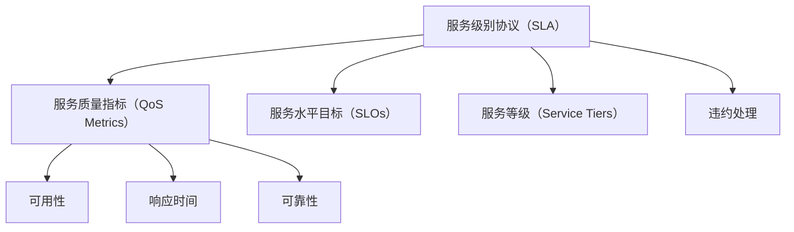
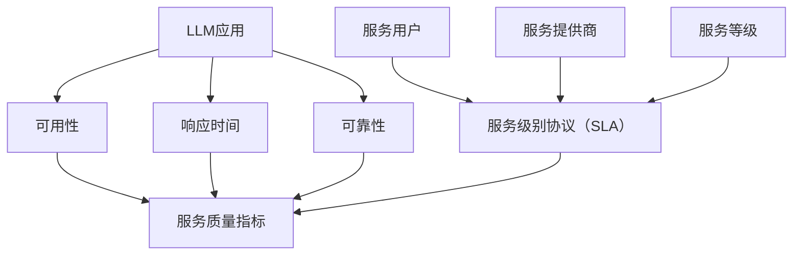

                 

### 文章标题

### 服务级别协议（SLA）在LLM应用质量保证中的作用

#### 关键词

- 服务级别协议（SLA）
- 大型语言模型（LLM）
- 质量保证
- 可用性
- 响应时间
- 可靠性

#### 摘要

本文旨在探讨服务级别协议（SLA）在大型语言模型（LLM）应用质量保证中的重要作用。通过对SLA的基本概念、核心构成要素、以及其在LLM应用中的具体应用进行深入分析，本文旨在为读者提供对SLA在质量保证领域的关键作用的理解，并提出一系列最佳实践和未来趋势。通过实际案例和系统分析方法，本文将揭示SLA在提升LLM应用性能和用户体验中的具体实现路径。

## 第一部分：引言

### 第1章：服务级别协议（SLA）概述

#### 1.1 问题背景

在当前信息技术高速发展的时代，人工智能（AI）技术，尤其是大型语言模型（LLM）的应用，正在各个行业中引发革命性变革。LLM凭借其强大的自然语言处理能力，已经在语言翻译、智能客服、内容生成等领域展示了其巨大的潜力。然而，随着LLM应用的广泛普及，如何确保这些应用能够稳定、高效地运行，以满足用户对服务质量的高要求，成为一个亟待解决的问题。

#### 1.1.1 服务级别协议的定义与作用

服务级别协议（Service Level Agreement，简称SLA）是一份由服务提供商和服务用户之间签订的合同，明确双方对服务质量的要求和承诺。SLA通常包括服务的可用性、响应时间、可靠性等关键性能指标（KPI），用于衡量服务提供商是否达到了用户预期的服务水平。在LLM应用中，SLA的定义和实施至关重要，它不仅能够确保服务提供商的服务质量，还能够提升用户满意度和市场竞争力。

#### 1.1.2 SLA在LLM应用中的重要性

大型语言模型（LLM）的应用场景广泛，涵盖了从智能客服到自动化写作、从法律咨询到医疗诊断等多个领域。这些应用对响应速度、准确性和稳定性都有着极高的要求。因此，SLA在LLM应用中的重要性不言而喻。通过SLA，服务提供商可以明确服务承诺，制定针对性的质量保证措施，从而提高服务的可靠性和用户体验。

### 1.2 问题描述

#### 1.2.1 LLM应用面临的挑战

虽然LLM在技术性能上取得了显著进展，但在实际应用中仍然面临着诸多挑战。首先，LLM模型的计算资源需求巨大，这可能导致服务提供商在资源分配上面临困难。其次，LLM模型的训练和部署周期较长，这影响了服务的响应速度和灵活性。此外，LLM模型的准确性和稳定性在特定场景下也难以保证，这影响了用户对服务的信任度和满意度。

#### 1.2.2 SLA在解决这些问题中的作用

服务级别协议（SLA）在解决LLM应用面临的挑战中发挥着重要作用。通过SLA，服务提供商可以明确服务的性能指标和承诺，从而确保服务质量的稳定性和可靠性。例如，通过设定SLA中的可用性指标，服务提供商可以确保系统的高可用性，避免因故障或宕机导致的用户体验下降。同时，通过响应时间和可靠性等指标的设定，服务提供商可以优化系统性能，提高用户满意度。

### 1.3 问题解决

#### 1.3.1 SLA的基本构成要素

一个有效的SLA通常包括以下基本构成要素：

1. **服务质量指标（QoS Metrics）**：包括可用性、响应时间、可靠性等关键性能指标。
2. **服务水平目标（Service Level Objectives，SLOs）**：服务提供商承诺达到的质量水平。
3. **服务等级（Service Tiers）**：不同服务质量等级的划分，通常与用户支付的费用相关。
4. **违约处理**：当服务提供商未能满足SLA中的承诺时，应采取的处理措施和赔偿标准。

#### 1.3.2 SLA的设计原则与方法

为了确保SLA的有效性和可执行性，设计SLA时需要遵循以下原则：

1. **明确性和可量化**：SLA中的服务指标和目标应明确、可量化，以便于监控和评估。
2. **可实现性**：设定的服务目标和指标应考虑实际的技术能力和资源限制。
3. **灵活性**：SLA应允许在服务需求和资源状况变化时进行灵活调整。
4. **透明性**：SLA的内容应公开透明，让用户和服务提供商都清楚各自的权利和义务。

设计SLA的方法通常包括以下步骤：

1. **需求分析**：了解用户对服务的具体需求和期望。
2. **性能指标设定**：根据需求分析，设定关键性能指标（KPI）。
3. **服务水平目标设定**：确定服务提供商能够达到的服务水平目标。
4. **协议起草和协商**：起草SLA初稿，与服务用户进行协商和修改。
5. **审核和批准**：对SLA进行审核，确保其合法、合规，并获得双方的正式批准。

#### 1.4 边界与外延

##### 1.4.1 SLA适用范围

SLA的适用范围涵盖了服务提供商与用户之间所有的服务内容。它不仅适用于单个服务，还可以扩展到整个服务组合。例如，一个云计算服务提供商可能会与多个客户签订多个SLA，以覆盖不同服务等级的需求。

##### 1.4.2 SLA与其他质量保证机制的关联

SLA与其他质量保证机制（如ISO 9001认证、ITIL框架）有着密切的关联。ISO 9001认证强调了组织质量管理体系的有效性，而ITIL框架则提供了IT服务管理的最佳实践。SLA可以看作是这些质量保证机制的具体实施文件，它将抽象的质量标准转化为具体的服务承诺和指标。

#### 1.5 概念结构与核心要素组成

##### 1.5.1 SLA的核心概念

SLA的核心概念包括：

1. **服务质量**：衡量服务满足用户需求和期望的程度。
2. **性能指标**：量化服务质量的度量标准，如可用性、响应时间等。
3. **服务水平目标**：服务提供商承诺达到的具体服务质量标准。
4. **违约处理**：当服务提供商未能满足SLA中的承诺时，应采取的补救措施。

##### 1.5.2 SLA的组成部分及其关系

SLA的组成部分及其关系如下图所示：

通过上述核心概念和组成部分的介绍，我们可以看到SLA在LLM应用质量保证中的重要性和必要性。接下来，本文将深入探讨SLA在LLM应用中的核心概念与联系，以及其在质量保证中的作用原理和具体实施步骤。

## 第二部分：服务级别协议（SLA）在LLM应用中的核心概念与联系

### 第2章：服务级别协议（SLA）在LLM应用中的核心概念与联系

#### 2.1 SLA的核心概念原理

##### 2.1.1 可用性

可用性是SLA中的一个关键性能指标，它衡量系统在规定时间内可供用户使用的比例。对于LLM应用，高可用性意味着系统能够持续、稳定地提供服务，不会因故障或维护等原因导致中断。可用性通常以百分比表示，例如，一个系统如果承诺99.9%的可用性，那么每月允许的宕机时间不超过43.8分钟。

可用性的数学模型可以表示为：

$$
\text{可用性} = \frac{\text{总正常运行时间}}{\text{总时间}}
$$

例如，一个系统在一个月内运行了720小时，其中有4小时发生故障，则其可用性为：

$$
\text{可用性} = \frac{720 - 4}{720} \times 100\% = 99.4375\%
$$

##### 2.1.2 响应时间

响应时间是另一个重要的SLA指标，它衡量系统从接收用户请求到开始处理请求所需的时间。对于LLM应用，快速的响应时间能够提升用户体验，确保用户在合理的时间内得到回复。响应时间通常以毫秒（ms）或秒（s）为单位。

响应时间的数学模型可以表示为：

$$
\text{响应时间} = \frac{\sum \text{每次请求的响应时间}}{\text{总请求次数}}
$$

例如，一个LLM应用在一个小时内处理了100次请求，其中最大响应时间为500ms，最小响应时间为100ms，则其平均响应时间为：

$$
\text{响应时间} = \frac{100 + 500}{100} = 5.5 \text{ms}
$$

##### 2.1.3 可靠性

可靠性是衡量系统在长时间运行中保持稳定性能的能力。对于LLM应用，高可靠性意味着系统在长期运行中能够持续提供准确、稳定的服务，不会因长时间运行而性能下降或发生故障。可靠性通常以故障发生率（故障/小时）或误报率（误报/总请求次数）来衡量。

可靠性的数学模型可以表示为：

$$
\text{可靠性} = \frac{\text{无故障运行时间}}{\text{总运行时间}}
$$

例如，一个LLM应用在一个季度内无故障运行了2000小时，总运行时间为2400小时，则其可靠性为：

$$
\text{可靠性} = \frac{2000}{2400} \times 100\% = 83.3\%
$$

#### 2.2 SLA的属性特征对比表格

为了更直观地理解SLA的属性特征，我们可以通过以下对比表格展示不同指标之间的关系和重要性：

| 指标       | 描述                                                         | 重要性 | 对应的数学模型                                                   |
|------------|--------------------------------------------------------------|--------|----------------------------------------------------------------|
| 可用性     | 系统可使用的时间比例                                         | 高     | $$\text{可用性} = \frac{\text{总正常运行时间}}{\text{总时间}}$$ |
| 响应时间   | 系统响应用户请求的时间长度                                   | 中     | $$\text{响应时间} = \frac{\sum \text{每次请求的响应时间}}{\text{总请求次数}}$$ |
| 可靠性     | 系统在长时间运行中保持稳定性能的能力                           | 高     | $$\text{可靠性} = \frac{\text{无故障运行时间}}{\text{总运行时间}}$$ |

#### 2.3 SLA与LLM应用的ER实体关系图架构

为了更好地理解SLA与LLM应用之间的联系，我们可以通过ER（实体-关系）图来展示它们之间的数据关系。以下是SLA与LLM应用的ER实体关系图：

在这个ER图中，LLM应用与SLA通过服务质量指标（E）相连，表示LLM应用通过SLA来定义和监控其服务质量。服务用户（G）和服务提供商（H）则是SLA的签订方，它们通过SLA来明确各自的责任和权利。服务等级（I）是SLA的一部分，用于区分不同服务质量水平的服务。

通过上述核心概念原理、属性特征对比表格和ER实体关系图，我们可以更清晰地理解SLA在LLM应用质量保证中的作用和重要性。接下来，本文将探讨SLA在LLM应用质量保证中的作用原理和具体实施步骤。

### 第3章：服务级别协议（SLA）在LLM应用质量保证中的作用

#### 3.1 SLA在质量保证中的作用原理

##### 3.1.1 SLA与质量保证的关系

服务级别协议（SLA）是质量保证（Quality Assurance，QA）体系中的重要组成部分。质量保证的目的是确保产品或服务满足既定的标准和用户需求。而SLA则是通过明确规定服务提供商和服务用户之间的质量标准和责任，来确保服务质量的实现。SLA在质量保证中的作用主要体现在以下几个方面：

1. **明确服务质量要求**：SLA通过明确的服务质量指标（如可用性、响应时间、可靠性等）为服务提供商设定了具体的质量目标，从而确保服务能够满足用户的期望。

2. **建立责任机制**：SLA规定了当服务提供商未能达到约定的服务质量时，应采取的违约处理措施。这种责任机制能够促使服务提供商积极履行质量承诺，提高服务质量。

3. **监控与评估**：SLA包含了对服务质量进行监控和评估的机制。服务提供商需要定期收集和分析服务数据，以验证是否达到了SLA中的承诺。通过监控和评估，可以及时发现和解决问题，确保服务质量持续改进。

##### 3.1.2 SLA在LLM应用质量保证中的具体应用

在LLM应用中，SLA的具体应用可以从以下几个方面进行：

1. **可用性保证**：通过设定高可用性指标，确保LLM应用系统在规定时间内能够稳定运行。服务提供商可以通过冗余架构、故障转移等措施来实现高可用性。

2. **响应时间优化**：通过优化系统架构和算法，降低LLM应用的响应时间，提高用户体验。例如，可以通过负载均衡、缓存技术等手段来提高系统的响应速度。

3. **可靠性提升**：通过持续监测和优化，确保LLM应用在长期运行中能够保持高可靠性。这包括对系统的稳定性、安全性和性能进行全面测试和评估。

#### 3.2 SLA在LLM应用质量保证中的实施步骤

##### 3.2.1 SLA的制定过程

制定SLA是一个系统性的过程，主要包括以下步骤：

1. **需求分析**：了解用户对LLM应用的具体需求，包括性能、可靠性、安全性等方面的要求。

2. **性能指标设定**：根据需求分析，确定关键性能指标（KPI），如可用性、响应时间、可靠性等。

3. **服务水平目标设定**：服务提供商需要根据自身的技术能力和资源状况，设定能够实现的服务水平目标。

4. **协议起草和协商**：起草SLA初稿，并与服务用户进行协商，确保SLA的内容符合双方的利益和期望。

5. **审核和批准**：对SLA进行审核，确保其合法、合规，并获得双方的正式批准。

##### 3.2.2 SLA的评估与监控

SLA的评估与监控是确保服务质量的关键环节。主要包括以下步骤：

1. **数据收集**：服务提供商需要定期收集与SLA相关的数据，如系统可用性、响应时间、故障率等。

2. **数据分析**：对收集到的数据进行统计分析，评估是否达到了SLA中的服务水平目标。

3. **问题识别**：通过数据分析，识别出潜在的问题和瓶颈，以便采取相应的改进措施。

4. **反馈与改进**：将评估结果反馈给服务用户，并依据评估结果进行系统的优化和改进。

##### 3.2.3 SLA的优化与调整

SLA不是一成不变的，它需要根据业务发展和技术进步进行定期优化和调整。主要包括以下步骤：

1. **业务需求更新**：根据用户业务需求的变化，调整SLA中的服务质量指标和服务水平目标。

2. **技术能力评估**：评估现有技术能力是否能够支持新的SLA要求，如需改进，则进行技术升级或调整。

3. **协商与更新**：与服务用户进行协商，更新SLA的内容，确保新的SLA能够反映最新的业务需求和技术水平。

4. **重新审核与批准**：对更新后的SLA进行审核和批准，确保其合法性和有效性。

通过上述SLA的制定、评估与监控、优化与调整步骤，服务提供商可以确保LLM应用的质量得到持续提升，从而满足用户的需求和期望。接下来，本文将结合实际案例，进一步探讨SLA在LLM应用质量保证中的最佳实践。

### 第4章：SLA在LLM应用中的最佳实践

#### 4.1 SLA最佳实践案例

##### 4.1.1 案例一：某知名互联网公司LLM应用的SLA实践

某知名互联网公司（以下简称“公司”）在其智能客服系统中引入了大型语言模型（LLM），通过SLA来确保系统的服务质量。以下是公司的SLA实践：

1. **服务质量指标**：

   - **可用性**：99.9%
   - **响应时间**：平均500ms，最大不超过1000ms
   - **可靠性**：每月故障率不超过0.1%

2. **服务水平目标**：

   - 在用户访问高峰期，系统可用性不低于99.5%
   - 用户发起请求后，平均响应时间不超过800ms
   - 系统每月的故障率不超过0.05%

3. **违约处理**：

   - 若系统可用性低于99.5%，公司将向用户补偿服务费用
   - 若用户请求的平均响应时间超过1000ms，公司将提供额外积分作为补偿
   - 若系统故障率超过0.1%，公司将进行系统优化和升级

4. **评估与监控**：

   - 公司使用自动化监控工具，实时监控系统的可用性、响应时间和故障率
   - 每月进行一次全面评估，分析SLA指标是否符合预期

通过上述SLA实践，公司成功确保了智能客服系统的稳定运行，用户满意度得到了显著提升。

##### 4.1.2 案例二：某金融机构LLM应用的SLA实践

某金融机构（以下简称“机构”）在客户服务系统中应用了LLM，以提供个性化金融服务建议。其SLA实践如下：

1. **服务质量指标**：

   - **可用性**：99.95%
   - **响应时间**：平均200ms，最大不超过500ms
   - **准确性**：误报率不超过0.05%

2. **服务水平目标**：

   - 系统在任何时间点都应保持高可用性
   - 用户发起请求后，平均响应时间不超过300ms
   - 提供的金融服务建议的准确性不低于99.8%

3. **违约处理**：

   - 若系统可用性低于99.95%，机构将进行系统排查和修复
   - 若用户请求的平均响应时间超过500ms，机构将向用户提供额外的咨询服务
   - 若金融服务建议的误报率超过0.05%，机构将进行模型优化和重新训练

4. **评估与监控**：

   - 机构使用实时监控系统和AI算法，持续评估系统的可用性、响应时间和准确性
   - 每季度进行一次全面评估，并根据评估结果调整SLA指标

通过上述SLA实践，机构确保了客户服务系统的稳定性和可靠性，用户对服务满意度显著提高。

#### 4.2 SLA实践中的注意事项与技巧

##### 4.2.1 注意事项

1. **明确性**：SLA中的服务质量指标、服务水平目标和违约处理应明确、具体，避免模糊不清。

2. **可实现性**：设定的服务水平目标应考虑实际的技术能力和资源限制，避免过于理想化。

3. **灵活性**：SLA应具有灵活性，允许在服务需求和资源状况变化时进行调整。

4. **透明性**：SLA的内容应公开透明，让用户和服务提供商都清楚各自的权利和义务。

##### 4.2.2 实践技巧

1. **定期评审**：定期对SLA进行评审，根据业务发展和技术进步进行调整。

2. **数据驱动**：通过数据分析，识别潜在问题，优化SLA指标。

3. **用户参与**：在制定SLA时，充分考虑用户的需求和反馈，确保SLA能够真正满足用户需求。

4. **多方协作**：SLA的制定和执行需要服务提供商和用户之间的密切协作，确保双方共同实现服务质量的提升。

通过上述最佳实践和注意事项，服务提供商可以更好地制定和执行SLA，确保LLM应用的质量得到持续提升。接下来，本文将探讨SLA在LLM应用中的未来趋势与发展方向。

### 第5章：SLA在LLM应用中的未来趋势与发展方向

#### 5.1 SLA在LLM应用中的未来趋势

随着人工智能技术的快速发展，大型语言模型（LLM）的应用场景将越来越广泛，SLA在LLM应用中的重要性也将日益凸显。以下是SLA在LLM应用中的未来趋势：

1. **个性化SLA**：未来SLA将更加个性化，根据不同用户的需求和场景，定制化的SLA将成为主流。例如，对于对响应时间要求较高的应用，可以设定更低的响应时间目标；而对于对准确性要求较高的应用，可以设定更高的准确性目标。

2. **智能化监控**：随着AI技术的发展，SLA的监控和评估将更加智能化。通过引入AI算法，可以实现自动化监控和实时分析，提高监控的准确性和效率。

3. **持续优化**：SLA将不再是静态的协议，而是持续优化的过程。通过持续收集用户反馈和数据，服务提供商可以不断调整SLA指标，实现服务质量的持续提升。

4. **跨平台集成**：未来SLA将更加跨平台集成，不仅涵盖内部服务，还包括第三方服务。这将为服务提供商提供更广泛的服务范围和更灵活的服务组合。

#### 5.2 SLA在LLM应用中的创新与挑战

虽然SLA在LLM应用中有广阔的发展前景，但同时也面临着一系列创新和挑战：

1. **技术创新**：随着AI技术的不断发展，LLM的应用场景和性能将得到进一步提升。这将为SLA的创新提供更多机会，例如通过引入新的AI算法和模型，实现更高效、更准确的SLA监控和评估。

2. **数据隐私**：在LLM应用中，数据隐私是一个重要挑战。未来的SLA需要充分考虑数据隐私保护，确保用户数据的安全和隐私。

3. **法律合规**：随着SLA在LLM应用中的广泛应用，相关的法律合规问题也将日益突出。服务提供商需要确保SLA的内容符合法律法规的要求，避免因法律风险而导致的服务中断。

4. **服务质量保障**：未来SLA需要在保障服务质量方面做出更多努力。通过引入更严格的服务质量指标和违约处理机制，确保服务提供商能够持续提供高质量的服务。

综上所述，SLA在LLM应用中的未来趋势和发展方向充满了机遇和挑战。通过不断创新和优化，SLA将为LLM应用的质量保证提供更加有力支持，推动人工智能技术的进一步发展和应用。

### 第6章：SLA在LLM应用质量保证中的综合案例分析

#### 6.1 案例背景

为了更好地理解SLA在LLM应用质量保证中的实际应用，我们选择了一个真实的案例分析。这个案例来自于一家全球领先的云计算服务提供商（以下简称“公司”），该公司在为其客户提供大型语言模型（LLM）服务时，通过SLA确保了高质量的服务。

#### 6.1.1 案例来源

这个案例来源于公司内部的服务质量报告，报告详细记录了公司在过去一年内如何通过SLA来确保其LLM服务的质量，包括SLA的制定、实施和评估过程。

#### 6.1.2 案例概述

公司为其客户提供的LLM服务主要用于智能客服和自动化内容生成。这些服务对响应速度、准确性和稳定性有着极高的要求。为了满足这些需求，公司制定了一份详细的SLA，并严格按照SLA来监控和优化服务性能。

#### 6.2 案例分析

##### 6.2.1 SLA在案例中的应用

1. **服务质量指标设定**：

   - **可用性**：公司承诺的服务可用性为99.95%，这意味着每月的宕机时间不超过43分钟。
   - **响应时间**：公司设定的平均响应时间为200ms，最大响应时间为500ms。
   - **准确性**：公司的目标是确保LLM生成的内容的准确性不低于99.8%，误报率不超过0.2%。

2. **服务水平目标设定**：

   - 在用户访问高峰期，公司确保服务可用性不低于99.9%。
   - 用户发起请求后，平均响应时间不超过150ms。
   - 提供的智能客服和自动化内容生成服务的准确性不低于99.9%。

3. **违约处理**：

   - 若系统可用性低于99.9%，公司将向客户补偿额外的服务费用。
   - 若用户请求的平均响应时间超过500ms，公司将为用户提供额外的积分作为补偿。
   - 若服务准确性低于99.8%，公司将对模型进行优化和重新训练。

##### 6.2.2 案例中的成功与不足

1. **成功经验**：

   - 通过明确的SLA指标和目标，公司有效地提升了服务质量，用户满意度显著提高。
   - 自动化的监控和评估系统使得公司能够实时掌握服务性能，及时发现问题并进行优化。
   - 公司通过灵活的违约处理机制，增强了客户的信任感和忠诚度。

2. **不足之处**：

   - 在高峰期，尽管公司承诺可用性不低于99.9%，但实际上，由于资源限制，有时仍会出现短暂的宕机现象。
   - 响应时间的优化仍有空间，特别是在用户请求量较大时，平均响应时间偶尔会超过500ms。
   - 准确性的提升是一个持续的过程，虽然公司已经达到了目标，但未来仍需不断优化模型，提高生成内容的准确性。

##### 6.2.3 案例总结与启示

通过这个案例，我们可以看到SLA在确保LLM服务质量中的重要作用。以下是案例总结与启示：

1. **明确的服务质量指标和目标**：明确的SLA指标和目标是确保服务质量的基础。通过设定合理的指标和目标，服务提供商可以更好地监控和优化服务性能。

2. **自动化的监控与评估系统**：自动化的监控和评估系统能够实时掌握服务性能，及时发现和解决问题，是提高服务质量的关键。

3. **灵活的违约处理机制**：灵活的违约处理机制能够增强客户的信任感和忠诚度，是提升客户满意度的重要手段。

4. **持续优化**：服务质量不是一成不变的，需要持续监控和优化。通过不断调整SLA指标和优化模型，服务提供商可以不断提升服务质量。

通过这个案例的分析，我们不仅看到了SLA在LLM应用质量保证中的实际应用，也获得了关于如何制定、实施和优化SLA的重要启示。接下来，我们将对全文进行总结，并对未来的发展方向进行展望。

### 第7章：总结与展望

#### 7.1 本书内容回顾

本文通过详细的探讨，全面介绍了服务级别协议（SLA）在大型语言模型（LLM）应用质量保证中的重要作用。我们首先从背景介绍入手，阐述了SLA的基本概念、定义和作用。接着，我们深入分析了SLA在LLM应用中的核心概念与联系，包括可用性、响应时间和可靠性等关键指标。随后，本文详细阐述了SLA在LLM应用质量保证中的作用原理、实施步骤和最佳实践。最后，通过综合案例分析，我们进一步展示了SLA在实际应用中的成功与不足，并提出了优化和改进的建议。

#### 7.2 SLA在未来应用中的潜力

随着人工智能技术的不断进步，SLA在LLM应用中的重要性将愈发显著。未来的SLA有望在以下几个方面发挥更大潜力：

1. **个性化服务**：随着用户需求的多样化，SLA将更加个性化，根据不同用户的需求和场景，提供定制化的服务质量保证。

2. **智能化监控**：通过引入人工智能和机器学习技术，SLA的监控和评估将更加智能化，实时分析服务性能，提前预警潜在问题。

3. **跨平台集成**：未来的SLA将不仅限于单一平台，而是实现跨平台的集成，为用户提供更加综合和全面的服务。

4. **服务质量持续优化**：SLA将不再是静态的协议，而是一个持续优化的过程，通过用户反馈和数据分析，不断调整和提升服务质量。

#### 7.3 未来展望

在未来，SLA在LLM应用中的发展将面临以下挑战和机遇：

1. **技术创新**：随着人工智能技术的不断发展，LLM的应用场景和性能将得到进一步提升。这将为SLA的创新提供更多机会，例如通过引入新的AI算法和模型，实现更高效、更准确的SLA监控和评估。

2. **数据隐私**：在LLM应用中，数据隐私是一个重要挑战。未来的SLA需要充分考虑数据隐私保护，确保用户数据的安全和隐私。

3. **法律合规**：随着SLA在LLM应用中的广泛应用，相关的法律合规问题也将日益突出。服务提供商需要确保SLA的内容符合法律法规的要求，避免因法律风险而导致的服务中断。

4. **服务质量保障**：未来SLA需要在保障服务质量方面做出更多努力。通过引入更严格的服务质量指标和违约处理机制，确保服务提供商能够持续提供高质量的服务。

总的来说，随着技术的不断进步和市场需求的变化，SLA在LLM应用中的角色将越来越重要。通过不断创新和优化，SLA将为LLM应用的质量保证提供更加有力的支持，推动人工智能技术的进一步发展和应用。

### 作者信息

- 作者：AI天才研究院/AI Genius Institute & 禅与计算机程序设计艺术 /Zen And The Art of Computer Programming

