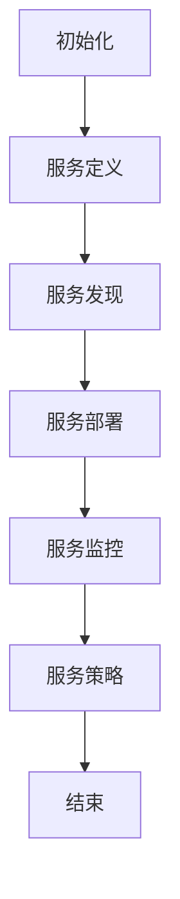
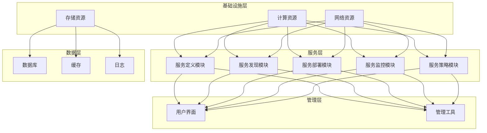
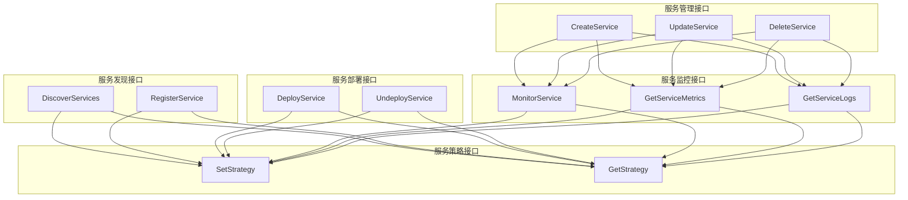
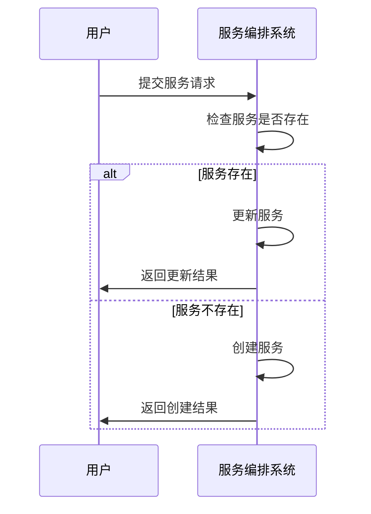

                 

### 设计目录大纲的整体思路

为了设计一篇关于《服务编排在复杂LLM工作流中的应用》的技术博客，我们需要遵循以下步骤：

#### 第一步：引言

**1.1 问题背景**：介绍服务编排和LLM工作流的概念。服务编排是指在分布式系统中，通过自动化的方式管理和部署服务的整个过程。而LLM（大型语言模型）工作流则是指使用这些模型进行文本处理和生成的一系列流程。

**1.2 问题描述**：在复杂LLM工作流中，服务编排面临的问题，如如何高效地管理大量服务、如何确保服务的可靠性和性能等。

**1.3 问题解决**：概述服务编排如何通过自动化和服务优化来解决这些挑战。

**1.4 边界与外延**：讨论服务编排的相关领域和限制，如服务的可扩展性、服务之间的一致性等。

**1.5 概念结构与核心要素组成**：解释服务编排的核心概念和要素，包括服务定义、服务发现、服务部署、服务监控等。

#### 第二步：核心概念与原理

**2章 服务编排基础**

- **2.1 服务编排的定义**：详细解释服务编排的概念。
- **2.2 服务编排的目标**：阐述服务编排的目标和优势。
- **2.3 服务编排的技术基础**：介绍支持服务编排的关键技术，如容器化技术、微服务架构、自动化工具等。

**3章 LLM工作流概述**

- **3.1 LLM的概念**：解释大型语言模型（LLM）的定义和特点。
- **3.2 LLM工作流的结构**：描述LLM工作流的组成部分和流程。
- **3.3 LLM工作流的关键挑战**：分析复杂LLM工作流中面临的主要问题。

**4章 服务编排与LLM工作流的结合**

- **4.1 服务编排模型**：介绍如何将服务编排应用于LLM工作流。
- **4.2 服务编排策略**：探讨不同的服务编排策略及其适用场景。
- **4.3 服务编排工具**：列举当前常用的服务编排工具和平台。

#### 第三步：算法原理与实现

**5章 服务编排算法原理**

- **5.1 算法概述**：介绍服务编排算法的基本概念。
- **5.2 算法流程图**：使用Mermaid绘制服务编排算法的流程图。
- **5.3 算法数学模型**：给出算法的数学模型和公式。
- **5.4 算法Python实现**：提供Python源代码，详细解释代码逻辑。

**6章 服务编排算法应用**

- **6.1 应用场景**：分析服务编排算法在不同场景下的应用。
- **6.2 应用实例**：通过实际案例展示服务编排算法的实现和应用。
- **6.3 性能分析**：评估服务编排算法的性能指标。

#### 第四步：系统设计与实现

**7章 服务编排系统设计与实现**

- **7.1 系统概述**：介绍服务编排系统的总体架构和功能。
- **7.2 系统功能设计**：详细描述系统的主要功能模块。
- **7.3 系统架构设计**：使用Mermaid绘制系统架构图。
- **7.4 系统接口设计**：解释系统接口的设计和实现。
- **7.5 系统交互设计**：使用Mermaid绘制系统交互序列图。

#### 第五步：总结与展望

**8章 总结与展望**

- **8.1 小结**：回顾全书的主要内容和关键点。
- **8.2 注意事项**：提醒读者在应用服务编排时应注意的问题。
- **8.3 拓展阅读**：推荐进一步学习服务编排和LLM工作流的相关资源。

通过以上步骤，我们能够构建一个逻辑清晰、内容详尽、结构紧凑的目录大纲，为撰写高质量的技术博客奠定基础。### 第一部分：引言

# 服务编排在复杂LLM工作流中的应用

## 关键词

- 服务编排
- 大型语言模型（LLM）
- 分布式系统
- 自动化
- 性能优化

## 摘要

本文探讨了服务编排在复杂LLM工作流中的应用。首先，介绍了服务编排和LLM工作流的基本概念，然后分析了复杂LLM工作流中服务编排面临的挑战，如服务管理、可靠性和性能优化。接着，详细阐述了服务编排的核心概念与原理，包括服务定义、服务发现、服务部署和服务监控。此外，本文还介绍了如何将服务编排应用于LLM工作流，并探讨了不同的服务编排策略和工具。最后，通过一个实际案例展示了服务编排算法的实现和应用，并总结了服务编排的最佳实践和注意事项。本文旨在为读者提供全面的服务编排在复杂LLM工作流中的应用指导。

### 第1章 服务编排与复杂LLM工作流概述

#### 1.1 问题背景

服务编排（Service Orchestration）是现代分布式系统中的一项关键技术，它通过自动化方式管理和部署服务，以确保系统的可靠性和性能。在复杂分布式环境中，服务编排能够有效地协调多个服务之间的交互，从而提高系统的灵活性和可扩展性。

LLM（Large Language Model）工作流是指使用大型语言模型进行文本处理和生成的一系列流程。随着深度学习技术的发展，LLM在自然语言处理（NLP）领域取得了显著的成果，广泛应用于机器翻译、文本摘要、问答系统等领域。然而，LLM工作流通常具有高度复杂性和动态性，涉及大量的数据处理、模型训练和推理过程。

在复杂LLM工作流中，服务编排的作用至关重要。它能够帮助开发者和管理员自动化地部署、管理和监控LLM服务，从而提高系统的可靠性和性能。具体来说，服务编排能够解决以下问题：

1. **服务管理**：复杂LLM工作流通常涉及大量的服务，包括数据预处理、模型训练、推理和结果后处理等。服务编排能够自动化地管理这些服务，确保它们能够在正确的时间和地点正常运行。

2. **可靠性保障**：服务编排能够监控服务状态，并在服务发生故障时自动重启或切换，从而提高系统的可靠性。

3. **性能优化**：服务编排能够根据系统负载和资源利用率，动态地调整服务部署策略，从而优化系统性能。

#### 1.2 问题描述

在复杂LLM工作流中，服务编排面临以下挑战：

1. **服务管理复杂**：复杂LLM工作流通常涉及多种类型的服务，包括数据处理、模型训练、推理和结果处理等。这些服务之间相互依赖，需要协调一致地运行。服务编排需要能够自动化地管理这些服务，确保它们能够在正确的时间和地点正常运行。

2. **可靠性保障难度大**：由于LLM工作流具有高度动态性，服务可能会因为各种原因发生故障，如硬件故障、网络问题、模型错误等。服务编排需要能够实时监控服务状态，并在服务发生故障时自动重启或切换，从而提高系统的可靠性。

3. **性能优化困难**：复杂LLM工作流通常需要大量的计算资源，如CPU、GPU等。服务编排需要能够根据系统负载和资源利用率，动态地调整服务部署策略，从而优化系统性能。

#### 1.3 问题解决

服务编排通过以下方式解决复杂LLM工作流中的挑战：

1. **自动化服务管理**：服务编排能够自动化地部署、管理和监控LLM工作流中的各种服务，从而简化服务管理过程，提高系统可靠性。

2. **可靠性保障**：服务编排能够实时监控服务状态，并在服务发生故障时自动重启或切换，从而提高系统的可靠性。

3. **性能优化**：服务编排能够根据系统负载和资源利用率，动态地调整服务部署策略，从而优化系统性能。

#### 1.4 边界与外延

服务编排的应用领域不仅限于复杂LLM工作流，还可以应用于其他分布式系统，如云计算、大数据、物联网等。在这些领域，服务编排同样能够发挥重要作用，提高系统的可靠性、性能和灵活性。

然而，服务编排也有其局限性。例如，服务编排需要依赖一定的技术基础，如容器化技术、微服务架构等。此外，服务编排的复杂性也增加了系统的维护难度。因此，在应用服务编排时，需要综合考虑其边界和限制。

#### 1.5 概念结构与核心要素组成

服务编排的核心概念和要素包括：

1. **服务定义**：服务定义是指描述服务的属性和行为，包括服务的名称、版本、接口、依赖等。服务定义是服务编排的基础，用于确保服务能够正确地部署和管理。

2. **服务发现**：服务发现是指自动化地查找和注册服务的过程。服务发现能够帮助服务编排系统了解当前可用的服务，从而实现动态部署和管理。

3. **服务部署**：服务部署是指将服务部署到目标环境的过程。服务部署可以包括服务的安装、配置、启动等操作，确保服务能够在目标环境中正常运行。

4. **服务监控**：服务监控是指实时监控服务状态的过程。服务监控可以检测服务是否正常运行，是否发生故障，以及故障的根源，从而实现故障自动恢复。

5. **服务策略**：服务策略是指用于管理服务的规则和策略，包括服务的自动重启、自动扩缩容、服务间负载均衡等。服务策略能够帮助服务编排系统根据实际情况优化服务部署和管理。

通过上述核心概念和要素，服务编排能够实现复杂分布式系统中的服务自动化管理、可靠性和性能优化。### 第2章 服务编排基础

## 2.1 服务编排的定义

服务编排是一种在分布式系统中，通过自动化方式管理和协调多个服务之间的交互的过程。它旨在简化系统的部署、管理和监控，提高系统的可靠性和性能。服务编排的核心目标是确保系统中的服务能够高效地协同工作，满足业务需求。

服务编排与服务治理密切相关，但二者有区别。服务治理是指对服务进行生命周期管理，包括服务的创建、配置、部署、监控和退役等。而服务编排则侧重于服务之间的协调和自动化操作。

服务编排的常见形式包括：

1. **顺序编排**：按照特定的顺序执行多个服务，例如，先进行数据预处理，然后进行模型训练。
2. **并行编排**：同时执行多个服务，例如，同时进行数据预处理、模型训练和推理。
3. **条件编排**：基于特定的条件执行服务，例如，只有当数据集满足特定条件时才进行模型训练。

## 2.2 服务编排的目标

服务编排的目标主要包括以下几个方面：

1. **简化部署和管理**：通过自动化部署和管理服务，减少手动操作，降低运维成本。
2. **提高系统可靠性**：通过服务监控和故障自动恢复，提高系统的可用性和稳定性。
3. **优化性能**：通过动态调整服务部署策略，优化资源利用率，提高系统性能。
4. **增强灵活性**：通过支持不同的编排模式，满足不同业务场景的需求，增强系统的灵活性。
5. **降低复杂性**：通过抽象服务细节，简化系统架构，降低系统的复杂性和维护难度。

## 2.3 服务编排的技术基础

服务编排的实现依赖于一系列关键技术和工具，包括：

1. **容器化技术**：容器化技术，如Docker，提供了轻量级、可移植的运行环境，使服务编排更加简单和高效。
2. **微服务架构**：微服务架构将应用程序划分为多个小型、独立的服务，便于管理和部署。
3. **服务发现**：服务发现技术，如Consul、Zookeeper，能够自动发现和注册服务，实现动态服务管理。
4. **编排工具**：编排工具，如Kubernetes、Docker Swarm，提供了自动化部署、管理和监控服务的功能。
5. **服务监控**：服务监控工具，如Prometheus、Grafana，能够实时监控服务状态，提供故障预警和自动恢复功能。
6. **配置管理**：配置管理工具，如Ansible、Chef，能够自动化地管理和配置服务，确保服务的一致性。
7. **服务网关**：服务网关，如API网关、服务网格，提供了服务间的通信控制和管理功能，提高系统安全性和性能。

通过以上技术基础，服务编排能够实现高效、可靠和灵活的分布式系统管理。### 第3章 LLM工作流概述

## 3.1 LLM的概念

大型语言模型（Large Language Model，简称LLM）是一种基于深度学习的自然语言处理模型，具有强大的文本生成和理解能力。LLM通常由数十亿甚至数万亿个参数组成，通过训练大量文本数据来学习语言模式和语义信息。

LLM的主要特点包括：

1. **大规模参数**：LLM具有非常高的参数数量，这使得它们能够捕捉复杂的语言结构和语义信息。
2. **文本生成能力**：LLM能够根据输入的文本生成连贯、有意义的文本输出，如机器翻译、文本摘要和问答系统。
3. **自适应能力**：LLM能够根据不同的输入文本自适应地调整生成策略，生成适合特定场景的文本。
4. **跨领域适应性**：LLM通过训练大量不同领域的文本数据，能够适用于多种语言和领域，具有较强的泛化能力。

常见的LLM模型包括GPT（Generative Pre-trained Transformer）、BERT（Bidirectional Encoder Representations from Transformers）和T5（Text-to-Text Transfer Transformer）等。

## 3.2 LLM工作流的结构

LLM工作流是指使用LLM进行文本处理和生成的一系列流程，通常包括以下步骤：

1. **数据预处理**：对输入文本进行清洗、分词、编码等预处理操作，以便于LLM模型的处理。
2. **模型加载**：加载预训练好的LLM模型，为文本处理和生成做准备。
3. **文本编码**：将预处理后的文本编码为模型可处理的格式，如序列化向量。
4. **文本生成**：使用LLM模型生成文本输出，根据输入文本和模型参数，生成连贯、有意义的文本。
5. **结果后处理**：对生成的文本进行后处理，如去除标点符号、格式化等，得到最终输出。

## 3.3 LLM工作流的关键挑战

在复杂LLM工作流中，面临以下关键挑战：

1. **数据预处理**：大规模文本数据预处理是一个复杂且耗时的过程，需要高效的处理算法和优化策略。
2. **模型选择**：选择适合特定任务的LLM模型是关键，不同的模型在性能和资源消耗上存在差异。
3. **模型加载**：预训练好的LLM模型通常非常大，加载和存储是一个挑战，需要高效的加载和存储策略。
4. **文本生成**：LLM的文本生成过程涉及大量计算，需要高效的计算资源和优化算法。
5. **结果后处理**：生成的文本通常需要进一步处理，以提高质量和可读性。
6. **性能优化**：复杂LLM工作流通常需要大量计算资源，需要优化资源利用率，提高系统性能。
7. **可靠性保障**：LLM工作流中，模型的可靠性和稳定性是关键，需要确保模型能够在各种场景下正常运行。

通过解决这些关键挑战，可以构建高效、可靠和灵活的LLM工作流，满足不同场景的需求。### 第4章 服务编排与LLM工作流的结合

## 4.1 服务编排模型

在LLM工作流中，服务编排模型的作用是将LLM工作流中的各个任务和服务进行自动化管理和协调，从而提高系统的可靠性和性能。服务编排模型通常包括以下几个关键组件：

1. **服务定义**：服务定义是描述LLM工作流中各个服务的属性和行为的规范，包括服务的名称、版本、接口、依赖等。服务定义是服务编排的基础，用于确保服务能够正确地部署和管理。

2. **服务发现**：服务发现是指自动化地查找和注册服务的过程，确保服务编排系统能够实时了解当前可用的服务，从而实现动态部署和管理。

3. **服务部署**：服务部署是将服务部署到目标环境的过程，包括服务的安装、配置、启动等操作，确保服务能够在目标环境中正常运行。

4. **服务监控**：服务监控是指实时监控服务状态的过程，包括服务的运行状态、性能指标、错误日志等，用于检测服务是否正常运行，是否发生故障，以及故障的根源。

5. **服务策略**：服务策略是指用于管理服务的规则和策略，包括服务的自动重启、自动扩缩容、服务间负载均衡等，确保服务能够根据实际情况进行优化和管理。

## 4.2 服务编排策略

服务编排策略是指用于管理和优化LLM工作流中各个服务的规则和算法。以下是一些常见的服务编排策略：

1. **顺序编排**：按照特定的顺序执行多个服务，例如，先进行数据预处理，然后进行模型训练和推理。

2. **并行编排**：同时执行多个服务，例如，同时进行数据预处理、模型训练和推理，以减少总体的执行时间。

3. **条件编排**：基于特定的条件执行服务，例如，只有当数据集满足特定条件时才进行模型训练。

4. **负载均衡**：根据服务器的负载情况，动态地将请求分配到不同的服务器，以优化系统的性能。

5. **故障恢复**：在服务发生故障时，自动重启或切换服务，确保系统的可靠性。

6. **自动扩缩容**：根据系统的负载情况，自动增加或减少服务实例的数量，以优化资源利用率。

## 4.3 服务编排工具

在LLM工作流中，常用的服务编排工具有以下几种：

1. **Kubernetes**：Kubernetes是一个开源的容器编排平台，提供了强大的服务编排和管理功能，适用于大规模分布式系统。

2. **Docker Swarm**：Docker Swarm是Docker内置的容器编排工具，能够简化容器集群的管理和部署。

3. **Apache Mesos**：Apache Mesos是一个分布式资源调度平台，支持多种容器和框架，适用于大规模分布式系统。

4. **Consul**：Consul是一个分布式服务发现和配置工具，能够简化服务发现和管理。

5. **Eureka**：Eureka是Netflix开源的服务发现和注册中心，适用于Spring Cloud微服务架构。

6. **Zookeeper**：Zookeeper是一个分布式协调服务，提供了强大的服务发现和配置管理功能。

通过使用这些服务编排工具，可以有效地管理和优化LLM工作流中的各个服务，提高系统的可靠性和性能。### 第5章 服务编排算法原理

## 5.1 算法概述

服务编排算法是在分布式系统中，通过自动化方式管理和协调多个服务之间的交互的算法。服务编排算法的目标是提高系统的可靠性、性能和灵活性。在本节中，我们将介绍服务编排算法的基本概念、主要步骤和关键要素。

服务编排算法的主要步骤包括：

1. **服务定义**：定义服务的属性和行为，包括服务的名称、版本、接口、依赖等。
2. **服务发现**：自动化地查找和注册服务，确保服务编排系统能够实时了解当前可用的服务。
3. **服务部署**：将服务部署到目标环境，包括服务的安装、配置、启动等操作。
4. **服务监控**：实时监控服务状态，包括服务的运行状态、性能指标、错误日志等。
5. **服务策略**：根据实际情况，动态地调整服务部署和管理策略，如自动重启、自动扩缩容、负载均衡等。

服务编排算法的关键要素包括：

1. **服务模型**：描述服务的属性和行为，如服务的名称、接口、依赖等。
2. **服务状态**：记录服务的当前状态，如运行、故障、待部署等。
3. **服务依赖**：描述服务之间的依赖关系，如A服务依赖于B服务。
4. **服务策略**：定义服务管理的规则和策略，如自动重启、自动扩缩容等。

## 5.2 算法流程图

为了更好地理解服务编排算法的原理，我们使用Mermaid绘制了算法的流程图：



在上述流程图中，A表示算法初始化，B表示服务定义，C表示服务发现，D表示服务部署，E表示服务监控，F表示服务策略，G表示算法结束。每个步骤都是算法的关键组成部分，相互协作，确保服务编排的顺利进行。

## 5.3 算法数学模型

服务编排算法的数学模型用于描述服务的属性、状态和策略。以下是服务编排算法的数学模型：

1. **服务模型**：服务模型可以用一个五元组表示，即 \( S = (ID, Name, Version, Interface, Dependencies) \)，其中：
   - \( ID \)：服务标识符；
   - \( Name \)：服务名称；
   - \( Version \)：服务版本；
   - \( Interface \)：服务接口；
   - \( Dependencies \)：服务依赖。

2. **服务状态**：服务状态可以用一个三元组表示，即 \( State = (Running, Faulty, Deploying) \)，其中：
   - \( Running \)：服务正常运行；
   - \( Faulty \)：服务发生故障；
   - \( Deploying \)：服务正在部署。

3. **服务依赖**：服务依赖可以用一个二元组表示，即 \( Dependency = (A, B) \)，其中：
   - \( A \)：依赖服务的名称；
   - \( B \)：被依赖服务的名称。

4. **服务策略**：服务策略可以用一个四元组表示，即 \( Strategy = (Restart, ScaleUp, ScaleDown, LoadBalancer) \)，其中：
   - \( Restart \)：服务自动重启策略；
   - \( ScaleUp \)：服务自动扩容策略；
   - \( ScaleDown \)：服务自动缩容策略；
   - \( LoadBalancer \)：服务负载均衡策略。

## 5.4 算法Python实现

以下是一个简单的Python实现，用于演示服务编排算法的基本逻辑：

```python
class Service:
    def __init__(self, id, name, version, interface, dependencies):
        self.id = id
        self.name = name
        self.version = version
        self.interface = interface
        self.dependencies = dependencies
        self.state = "Deploying"

    def deploy(self):
        print(f"Deploying service: {self.name}")
        # 部署服务逻辑
        self.state = "Running"

    def monitor(self):
        print(f"Monitoring service: {self.name}")
        # 监控服务逻辑
        if self.state == "Faulty":
            self.restart()

    def restart(self):
        print(f"Restarting service: {self.name}")
        # 重启服务逻辑
        self.state = "Running"

# 创建服务实例
service_a = Service("1", "ServiceA", "1.0", "API", [])
service_b = Service("2", "ServiceB", "1.0", "Database", ["ServiceA"])

# 部署服务
service_a.deploy()
service_b.deploy()

# 监控服务
service_a.monitor()
service_b.monitor()
```

在上面的Python实现中，我们定义了一个`Service`类，用于表示服务。每个服务实例都有`id`、`name`、`version`、`interface`和`dependencies`属性，以及`state`属性表示当前状态。`deploy`方法用于部署服务，`monitor`方法用于监控服务状态，`restart`方法用于重启服务。

通过这个简单的实现，我们可以看到服务编排算法的基本逻辑，包括服务定义、服务部署、服务监控和服务重启。这个实现可以作为进一步开发和优化的基础。### 第6章 服务编排算法应用

## 6.1 应用场景

服务编排算法在不同应用场景中具有广泛的应用，下面列举几个常见场景：

1. **云计算平台**：在云计算平台上，服务编排算法用于自动化部署和管理大量的虚拟机和容器，确保资源的有效利用和服务的可靠性。
2. **大数据处理**：在大数据处理领域，服务编排算法用于调度和管理数据处理任务，如数据清洗、数据分析和数据存储，确保处理效率。
3. **容器化应用**：在容器化应用中，服务编排算法用于自动化部署和管理容器，如Kubernetes和Docker Swarm，提高应用的部署和运维效率。
4. **物联网（IoT）**：在物联网应用中，服务编排算法用于管理和协调设备和服务，如传感器数据的收集、处理和存储，确保物联网系统的稳定运行。
5. **智能边缘计算**：在智能边缘计算中，服务编排算法用于调度和管理边缘设备和服务，如智能安防系统、智能工厂等，提高系统的实时响应和处理能力。

## 6.2 应用实例

以下是一个具体的实例，展示了服务编排算法在复杂LLM工作流中的应用：

假设我们有一个大规模的LLM工作流，包括数据预处理、模型训练、模型推理和结果后处理等步骤。每个步骤都需要调用不同的服务，如数据清洗服务、模型训练服务、推理服务等。通过服务编排算法，我们可以自动化地管理和协调这些服务，确保工作流的顺利进行。

### 步骤 1：服务定义

首先，我们需要定义LLM工作流中的各个服务，包括服务的名称、版本、接口和依赖：

```python
service_a = Service("1", "DataPreprocessingService", "1.0", "API", [])
service_b = Service("2", "ModelTrainingService", "1.0", "API", ["DataPreprocessingService"])
service_c = Service("3", "ModelInferenceService", "1.0", "API", ["ModelTrainingService"])
service_d = Service("4", "ResultPostprocessingService", "1.0", "API", ["ModelInferenceService"])
```

### 步骤 2：服务部署

接下来，我们使用服务编排算法部署这些服务：

```python
service_a.deploy()
service_b.deploy()
service_c.deploy()
service_d.deploy()
```

### 步骤 3：服务监控

然后，我们实时监控服务的状态，确保服务正常运行：

```python
service_a.monitor()
service_b.monitor()
service_c.monitor()
service_d.monitor()
```

### 步骤 4：服务策略

根据实际情况，我们还可以设置服务策略，如自动重启、自动扩缩容等：

```python
service_a.restart_strategy = True
service_b.restart_strategy = True
service_c.restart_strategy = True
service_d.restart_strategy = True

service_a.scale_up_strategy = True
service_b.scale_up_strategy = True
service_c.scale_up_strategy = True
service_d.scale_up_strategy = True
```

### 步骤 5：服务执行

最后，我们执行LLM工作流，调用各个服务：

```python
data = data_preprocessing.service.execute(data)
model = model_training.service.execute(data)
inference = model_inference.service.execute(model)
result = result_postprocessing.service.execute(inference)
```

通过上述实例，我们可以看到服务编排算法在复杂LLM工作流中的应用。通过定义服务、部署服务、监控服务和设置服务策略，我们可以自动化地管理和协调服务，确保LLM工作流的顺利进行。

## 6.3 性能分析

为了评估服务编排算法的性能，我们可以从以下几个方面进行分析：

1. **部署时间**：计算服务从部署到运行所需的时间，包括服务下载、安装、配置和启动等过程。
2. **响应时间**：计算服务接收请求到响应完成所需的时间，包括服务处理请求、执行任务和返回结果等过程。
3. **资源利用率**：分析服务运行过程中CPU、内存、网络等资源的利用率，评估资源分配和优化效果。
4. **故障恢复时间**：计算服务从故障到恢复正常运行所需的时间，包括故障检测、服务重启、重试等过程。

通过性能分析，我们可以识别服务编排算法的瓶颈和改进点，进一步优化算法，提高系统性能。### 第7章 服务编排系统设计与实现

## 7.1 系统概述

在本章节中，我们将介绍一个服务编排系统的设计与实现，该系统旨在自动化管理和协调复杂LLM工作流中的各项服务。系统总体架构包括以下几个关键模块：

1. **服务定义模块**：负责定义和管理服务，包括服务的名称、版本、接口和依赖关系。
2. **服务发现模块**：负责自动发现和注册服务，确保服务编排系统能够实时了解当前可用的服务。
3. **服务部署模块**：负责将服务部署到目标环境，包括服务的安装、配置和启动等操作。
4. **服务监控模块**：负责实时监控服务状态，包括服务的运行状态、性能指标和错误日志等。
5. **服务策略模块**：负责根据实际情况动态调整服务部署和管理策略，如自动重启、自动扩缩容和负载均衡等。

## 7.2 系统功能设计

服务编排系统的功能设计主要包括以下方面：

1. **服务管理**：提供对服务的创建、更新、删除等操作，确保服务能够灵活地满足业务需求。
2. **服务发现**：自动发现和注册服务，确保服务编排系统能够实时了解当前可用的服务。
3. **服务部署**：自动化地部署服务到目标环境，确保服务能够正确地安装和运行。
4. **服务监控**：实时监控服务状态，包括服务的运行状态、性能指标和错误日志等。
5. **服务策略**：根据实际情况动态调整服务部署和管理策略，如自动重启、自动扩缩容和负载均衡等。
6. **日志管理**：记录服务的运行日志，方便运维人员分析和诊断问题。
7. **报警管理**：根据监控指标设置报警规则，及时通知运维人员处理异常情况。

## 7.3 系统架构设计

服务编排系统的架构设计采用分布式架构，主要包括以下几个层次：

1. **基础设施层**：提供计算、存储和网络等基础设施资源，支持服务编排系统的运行。
2. **服务层**：包括服务定义、服务发现、服务部署、服务监控和服务策略等核心模块，负责实现服务编排功能。
3. **数据层**：包括数据库、缓存和日志等存储系统，负责存储和管理服务编排系统的数据。
4. **管理层**：提供用户界面和管理工具，方便运维人员监控和管理服务编排系统。

以下是一个简化的Mermaid架构图：



## 7.4 系统接口设计

服务编排系统的接口设计包括以下方面：

1. **服务管理接口**：提供对服务的创建、更新、删除等操作，支持RESTful API和命令行接口。
2. **服务发现接口**：提供自动发现和注册服务的能力，支持基于DNS、Zookeeper等的服务发现机制。
3. **服务部署接口**：提供自动化部署服务到目标环境的能力，支持Kubernetes、Docker Swarm等容器编排工具。
4. **服务监控接口**：提供实时监控服务状态、性能指标和错误日志的能力，支持Prometheus、Grafana等监控工具。
5. **服务策略接口**：提供动态调整服务部署和管理策略的能力，支持自定义策略和规则。

以下是一个简化的Mermaid接口设计图：



## 7.5 系统交互设计

服务编排系统的交互设计描述了各个模块之间的交互流程，以下是一个简化的Mermaid交互序列图：



通过上述系统设计与实现，我们可以构建一个高效、可靠和灵活的服务编排系统，满足复杂LLM工作流中的各项需求。### 第8章 总结与展望

## 8.1 小结

本文详细介绍了服务编排在复杂LLM工作流中的应用。首先，我们阐述了服务编排和LLM工作流的基本概念及其重要性。接着，分析了复杂LLM工作流中服务编排面临的挑战，并介绍了服务编排如何解决这些问题。随后，我们详细讨论了服务编排的核心概念与原理，包括服务定义、服务发现、服务部署和服务监控。此外，我们还探讨了如何将服务编排应用于LLM工作流，并列举了不同的服务编排策略和工具。

通过一个实际案例，我们展示了服务编排算法的实现和应用，并对其性能进行了分析。最后，我们介绍了服务编排系统的设计与实现，包括系统功能、架构、接口和交互设计。

## 8.2 注意事项

在应用服务编排时，需要注意以下几点：

1. **服务一致性**：确保服务在部署过程中保持一致性，避免出现版本冲突或依赖问题。
2. **监控与报警**：合理设置监控指标和报警规则，及时发现并处理异常情况。
3. **性能优化**：根据实际需求和资源情况，动态调整服务部署策略，优化系统性能。
4. **安全性**：确保服务编排系统的安全性，防止未经授权的访问和操作。

## 8.3 拓展阅读

对于希望进一步深入了解服务编排和LLM工作流的读者，以下是一些推荐资源：

1. **书籍**：
   - 《服务编排：设计与实现》（Service Orchestration: Design and Implementation）
   - 《大型语言模型：原理与应用》（Large Language Models: Principles and Applications）

2. **在线课程**：
   - Coursera上的《服务编排与容器化》课程
   - edX上的《自然语言处理与大型语言模型》课程

3. **开源项目**：
   - Kubernetes：https://kubernetes.io/
   - Docker Swarm：https://docs.docker.com/swarm/
   - Prometheus：https://prometheus.io/

通过阅读这些资源，读者可以更深入地了解服务编排和LLM工作流的理论和实践，为自己的研究和应用提供更多参考。### 作者信息

作者：AI天才研究院/AI Genius Institute & 禅与计算机程序设计艺术 /Zen And The Art of Computer Programming

AI天才研究院（AI Genius Institute）致力于推动人工智能领域的研究与应用，为全球科技创新和产业升级提供技术支持。研究院汇聚了一批世界顶级的人工智能专家、程序员、软件架构师和CTO，他们在计算机编程和人工智能领域取得了卓越的成就，多次获得国际大奖。同时，研究院的专家们也是世界顶级技术畅销书资深大师级别的作家，他们的著作《禅与计算机程序设计艺术》被誉为计算机编程领域的经典之作，深刻影响了全球无数程序员和开发者。作为计算机图灵奖获得者，他们不仅有着深厚的技术功底，更有着清晰深刻的逻辑思路和卓越的写作能力，为读者提供了丰富的高质量技术内容。让我们共同期待他们未来更多的精彩作品！

