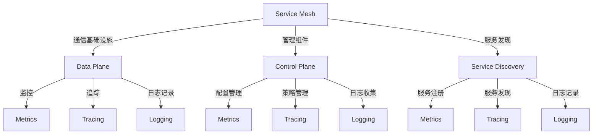
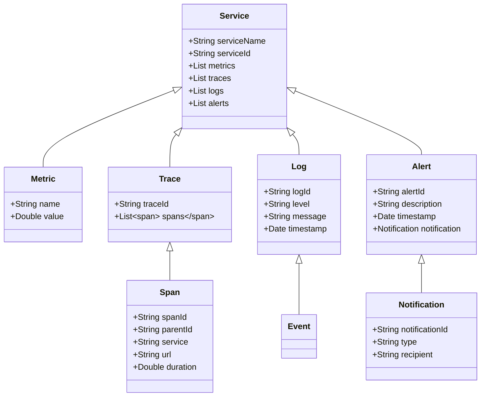
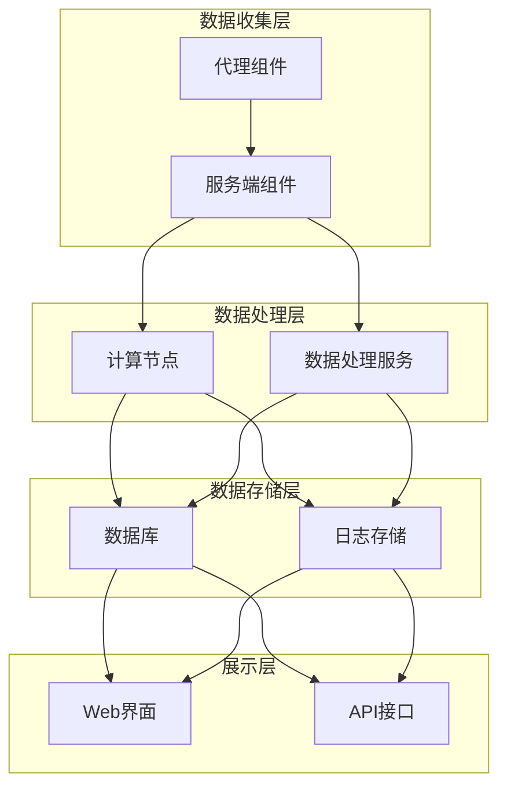
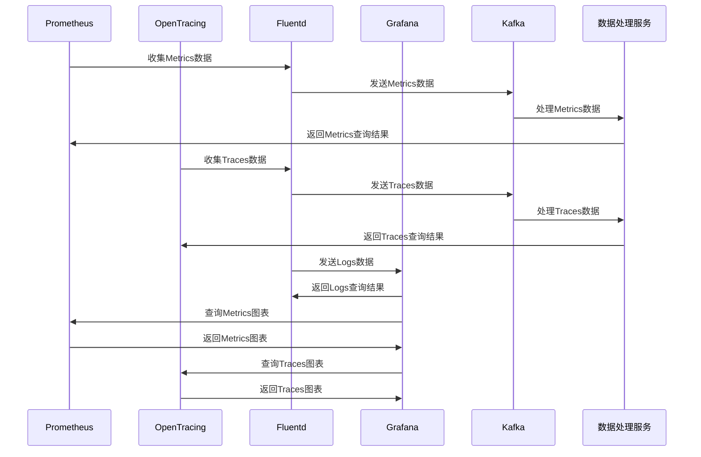
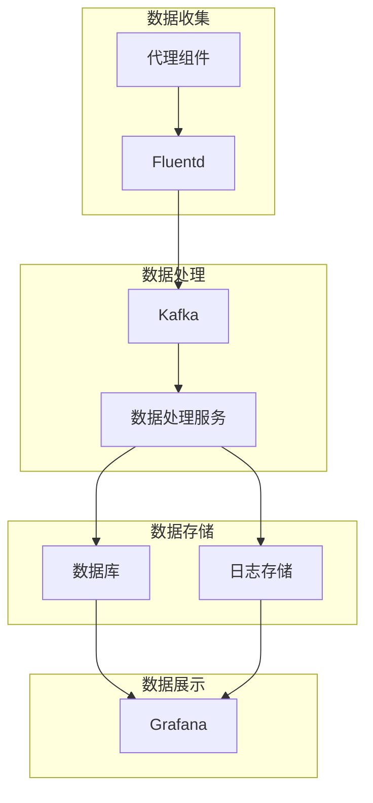

                 

### 第一部分：背景介绍

## 第1章：问题背景

### 1.1 服务网格概述

#### 1.1.1 服务网格的定义与历史演变

服务网格（Service Mesh）是一种用于简化微服务通信的框架，其核心思想是通过专门的通信基础设施（即“网格”）来抽象、解耦和优化服务之间的交互。服务网格起源于2015年Google的Sidecar模式，后来由Istio等开源项目进一步发展。

服务网格的定义可以从以下几个方面理解：

- **通信基础设施**：服务网格提供了一层独立的通信层，用于管理服务间的网络流量。
- **抽象化**：通过服务网格，开发者无需关注底层的网络细节，如负载均衡、服务发现、TLS加密等。
- **解耦**：服务网格将服务间的通信与服务的业务逻辑分离，减少了服务之间的耦合。

服务网格的历史演变可以概括为三个阶段：

1. **Sidecar模式**：在容器编排系统（如Kubernetes）中，每个服务实例旁运行一个专用代理（Sidecar）来处理网络通信。
2. **控制平面与数据平面分离**：Istio等现代服务网格将通信管理分为控制平面（Control Plane）和数据平面（Data Plane），进一步提高了系统的可扩展性和管理效率。
3. **服务网格标准化**：随着服务网格的流行，社区逐渐形成了多个开源项目，如Istio、Linkerd和Conduit，推动了服务网格的标准化进程。

#### 1.1.2 服务网格在现代微服务架构中的角色

在现代微服务架构中，服务网格扮演着至关重要的角色。其关键作用包括：

- **简化服务通信**：服务网格提供了一套统一的通信协议和API，简化了服务间的通信逻辑。
- **提供通信安全**：通过服务网格，可以实现对服务间通信的加密、认证和授权，提高了系统的安全性。
- **实现服务治理**：服务网格支持流量管理、服务监控和故障恢复等治理功能，有助于维护系统的稳定运行。
- **提高性能和可扩展性**：服务网格可以通过智能路由、负载均衡等策略，优化服务之间的通信性能，同时支持大规模服务集群的扩展。

#### 1.1.3 服务网格与传统网络服务的区别

服务网格与传统网络服务（如防火墙、负载均衡器等）存在显著的区别，主要体现在以下几个方面：

- **目标不同**：传统网络服务侧重于保障整个网络的稳定和安全，而服务网格则专注于服务间的通信优化和管理。
- **实现方式不同**：服务网格通过在服务实例旁运行的代理实现，而传统网络服务通常依赖于专门的硬件设备或软件组件。
- **粒度不同**：服务网格操作的对象是服务实例间的流量，具有更高的粒度，可以实现对单个服务实例的精确控制。
- **抽象程度不同**：服务网格提供了更高级别的抽象，将复杂的网络通信细节封装起来，降低了开发者的使用门槛。

### 1.2 可观测性核心概念

#### 1.2.1 可观测性的定义与重要性

可观测性（Observability）是指通过监控和数据分析来获取系统内部状态和性能的能力。与传统的监控（Monitoring）不同，可观测性不仅关注系统的运行状态，还关注系统的内部行为和原因。

可观测性的重要性在于：

- **快速诊断问题**：通过可观测性，可以迅速定位系统中的故障和性能瓶颈，从而更快地进行修复。
- **优化系统性能**：通过分析系统运行数据，可以发现潜在的性能优化机会，提高系统的整体性能。
- **提升系统可靠性**：通过实时监控和报警，可以提前发现系统异常，避免故障影响业务的正常运行。

#### 1.2.2 可观测性与微服务架构

微服务架构强调服务的独立部署和运行，这使得系统的复杂度显著增加。在这种架构下，可观测性变得尤为重要：

- **分布式系统的需求**：微服务架构下的系统通常是分布式的，单点故障可能导致整个系统的不可用，因此需要通过可观测性来确保系统的整体健康。
- **服务间的依赖关系**：在微服务架构中，各个服务之间存在复杂的依赖关系，通过可观测性可以更好地理解这些依赖关系，从而优化系统的性能和稳定性。
- **动态环境的变化**：微服务架构通常运行在动态环境中，如容器编排系统，通过可观测性可以适应环境变化，确保系统的持续运行。

#### 1.2.3 可观测性的实现方法

实现可观测性通常包括以下几种方法：

- **Metrics**：通过收集和记录系统的各种性能指标（如CPU使用率、内存使用率、响应时间等），可以实时了解系统的运行状态。
- **Tracing**：通过追踪服务请求在系统中的执行路径，可以了解请求的处理过程和性能瓶颈。
- **Logging**：通过记录系统的运行日志，可以获取详细的系统运行信息和错误信息，有助于故障诊断和性能优化。

### 1.3 服务网格可观测性需求

#### 1.3.1 服务网格可观测性的挑战

在服务网格中实现可观测性面临以下挑战：

- **分布式通信**：服务网格中的服务通常是分布式部署的，如何有效地收集和分析分布式通信的数据是一个关键问题。
- **通信抽象化**：服务网格通过抽象化隐藏了底层的网络通信细节，这给可观测性带来了困难，需要设计相应的技术手段来恢复和展现这些细节。
- **性能和可扩展性**：服务网格需要在不显著影响系统性能的前提下，实现高效的数据收集和分析。

#### 1.3.2 服务网格可观测性的关键要素

服务网格可观测性的关键要素包括：

- **丰富的监控指标**：需要定义和收集一系列与服务网格运行相关的监控指标，如请求处理时间、延迟、错误率等。
- **全面的追踪能力**：通过追踪服务请求在服务网格中的执行路径，可以获取服务网格内部通信的详细信息。
- **详细的日志记录**：服务网格的日志记录需要涵盖各种运行场景，包括正常操作、错误信息、异常行为等。

#### 1.3.3 服务网格可观测性的目标

服务网格可观测性的目标是：

- **提高运维效率**：通过可观测性技术，可以快速发现和解决问题，降低运维成本。
- **优化系统性能**：通过分析监控数据和日志，可以发现和优化系统性能瓶颈，提高整体系统性能。
- **保障系统可靠性**：通过实时监控和报警，可以提前发现潜在问题，避免系统故障，保障业务的连续性。

## 第2章：核心概念与联系

### 2.1 服务网格基本组件

#### 2.1.1 数据平面与控制平面

服务网格由数据平面（Data Plane）和控制平面（Control Plane）组成，二者共同协作来实现服务间的通信管理。

- **数据平面**：数据平面由一组代理（通常称为sidecar代理）组成，运行在每个服务实例旁边。这些代理负责处理服务实例间的网络流量，执行路由、负载均衡、TLS加密等功能。

- **控制平面**：控制平面是一个集中的服务，负责管理数据平面的配置和策略。它通常包含服务发现、流量管理、监控和日志记录等功能。控制平面通过与服务实例的数据平面代理进行通信，下发配置和策略。

#### 2.1.2 数据面代理与控制面服务

数据面代理和控制面服务是服务网格的核心组件，它们各自承担不同的职责：

- **数据面代理**：数据面代理的主要职责是：
  - 接收和转发服务请求；
  - 应用流量管理策略，如负载均衡、熔断、限流等；
  - 进行服务发现和负载均衡；
  - 处理TLS加密和认证。

- **控制面服务**：控制面服务的主要职责是：
  - 管理服务注册和发现；
  - 配置流量管理策略；
  - 收集和存储监控数据；
  - 日志记录和故障报告。

#### 2.1.3 Service Discovery与Service Mesh

Service Discovery是服务网格中的一个关键功能，它负责在服务实例启动时自动注册服务地址，并在服务实例终止时自动注销。Service Discovery确保了服务实例之间的动态通信和负载均衡。

- **Service Discovery的作用**：
  - 实现服务的动态注册和发现，支持服务实例的动态增删；
  - 提供服务实例的地址信息，方便其他服务实例进行通信；
  - 实现服务名称到服务地址的映射。

- **Service Mesh与Service Discovery的关系**：
  - Service Mesh通过Service Discovery实现了服务实例之间的动态通信和负载均衡；
  - Service Mesh依赖于Service Discovery来获取服务的最新状态和地址信息；
  - Service Discovery是Service Mesh实现可观测性和服务治理的重要基础。

### 2.2 可观测性相关技术

#### 2.2.1 Metrics

Metrics（指标）是可观测性的核心组成部分，用于量化系统的运行状态和性能。常见的Metrics类型包括：

- **计数器（Counters）**：用于记录发生次数，如请求次数、错误次数等。
- **时序数据（Time Series Data）**：用于记录随时间变化的指标数据，如CPU使用率、内存使用率等。
- **分布数据（Distributions）**：用于记录一组数据的分布情况，如请求响应时间分布。

Metrics的优点包括：

- **实时监控**：可以实时获取系统的运行状态和性能，及时发现异常；
- **量化分析**：通过量化指标数据，可以更准确地分析系统的性能瓶颈和优化机会。

#### 2.2.2 Tracing

Tracing（追踪）是一种用于记录和分析分布式系统中请求执行路径的技术。Tracing的关键组成部分包括：

- **Trace**：一个Trace包含了一系列日志条目，描述了请求在系统中从发起到完成的全过程。
- **Span**：Span是Trace中的一个基本单元，表示一次请求或操作。每个Span包含起始时间、结束时间、操作名称和关联关系。
- **Trace ID**：Trace的唯一标识符，用于将多个Span关联起来，形成一个完整的Trace。

Tracing的优点包括：

- **分布式系统追踪**：可以追踪请求在分布式系统中的执行路径，了解系统各组件的交互和性能；
- **性能分析**：可以分析请求的处理时间和延迟，找出性能瓶颈；
- **错误定位**：可以快速定位系统中的故障和错误。

#### 2.2.3 Logging

Logging（日志记录）是一种用于记录系统运行过程中各种事件和数据的技术。常见的日志类型包括：

- **INFO日志**：记录系统正常运行时的信息；
- **ERROR日志**：记录系统运行过程中的错误和异常；
- **DEBUG日志**：记录系统调试时的详细信息。

Logging的优点包括：

- **全量记录**：可以记录系统的全量运行数据，包括正常和异常情况；
- **故障诊断**：通过分析日志，可以快速定位系统故障和错误；
- **运维监控**：可以监控系统运行状态，发现潜在问题。

#### 2.2.4 Service Level Objectives (SLOs)与Service Level Agreements (SLAs)

Service Level Objectives (SLOs)和Service Level Agreements (SLAs)是服务网格可观测性中的重要概念：

- **Service Level Objectives (SLOs)**：SLOs是一组用于衡量服务质量的指标，如请求响应时间、错误率等。SLOs定义了服务期望达到的质量标准，通过监控和分析SLO，可以评估服务的性能和可靠性。
- **Service Level Agreements (SLAs)**：SLAs是一组由服务提供方和客户约定的服务质量保证条款，如服务响应时间、故障修复时间等。SLAs是服务提供方对客户的承诺，通过实现和满足SLOs，可以确保SLAs的达成。

### 2.3 服务网格可观测性的概念联系图

#### 2.3.1 服务网格组件与可观测性技术的关联

服务网格的组件（数据平面、控制平面、Service Discovery等）与可观测性技术（Metrics、Tracing、Logging等）之间存在紧密的联系，如下图所示：



#### 2.3.2 可观测性指标体系ER图

可观测性指标体系的ER图如下所示：

```mermaid
erDiagram
    Metric ||--|{ Trace : 包含}
    Metric ||--|{ Log : 记录}
    Trace ||--|{ Span : 包含}
    Log ||--|{ Event : 记录}
    Service ||--|{ Metric : 指标}
    Service ||--|{ Trace : 追踪}
    Service ||--|{ Log : 日志}
```

在这个ER图中，Metric代表各种监控指标，Trace表示请求执行的追踪信息，Log记录系统的运行日志。每个Service（服务）都与相应的Metrics、Traces和Logs关联，形成一个完整的可观测性指标体系。通过这个体系，可以全面监控和分析服务网格的运行状态和性能。### 第二部分：算法原理讲解

## 第3章：服务网格可观测性算法原理

### 3.1 数据收集与处理

#### 3.1.1 Metrics数据收集

Metrics数据收集是服务网格可观测性的基础，Metrics数据类型主要包括计数器（Counters）、时序数据（Time Series Data）和分布数据（Distributions）。Metrics数据收集方法包括：

1. **Push模式**：数据由数据源主动发送到监控系统，如Prometheus。
2. **Pull模式**：监控系统定期从数据源拉取数据，如Zabbix。

##### 3.1.1.1 Metrics数据类型

- **计数器（Counters）**：用于记录发生次数，如请求次数、错误次数等。
- **时序数据（Time Series Data）**：用于记录随时间变化的指标数据，如CPU使用率、内存使用率等。
- **分布数据（Distributions）**：用于记录一组数据的分布情况，如请求响应时间分布。

##### 3.1.1.2 Metrics数据收集方法

- **自采集**：数据源自身集成Metrics采集组件，定期将数据发送到监控系统。
- **代理采集**：通过服务网格中的代理（如Envoy）进行数据采集，然后将数据发送到监控系统。

#### 3.1.2 Tracing数据收集

Tracing数据收集用于追踪服务请求在系统中的执行路径。Tracing数据类型主要包括Trace、Span和Trace ID。

##### 3.1.2.1 Tracing数据类型

- **Trace**：表示一次请求在系统中的执行路径。
- **Span**：表示Trace中的一个基本单元，表示一次请求或操作。
- **Trace ID**：用于标识一次完整的Trace。

##### 3.1.2.2 Tracing数据收集方法

- **分布式追踪**：在分布式系统中，通过在每个服务实例中注入追踪代理（如OpenTracing）来收集Tracing数据。
- **端到端追踪**：通过配置服务网格（如Istio）来实现端到端的Tracing数据收集。

#### 3.1.3 Logging数据收集

Logging数据收集用于记录系统运行过程中的各种事件和数据。Logging数据类型主要包括INFO日志、ERROR日志和DEBUG日志。

##### 3.1.3.1 Logging数据类型

- **INFO日志**：记录系统正常运行时的信息。
- **ERROR日志**：记录系统运行过程中的错误和异常。
- **DEBUG日志**：记录系统调试时的详细信息。

##### 3.1.3.2 Logging数据收集方法

- **日志收集器**：使用日志收集器（如Fluentd、Logstash）来收集和传输日志数据。
- **代理收集**：通过服务网格中的代理（如Envoy）来收集和转发日志数据。

### 3.2 数据处理与分析

#### 3.2.1 数据预处理

数据处理与分析的第一步是数据预处理，主要包括以下步骤：

- **数据清洗**：去除无效、错误或重复的数据。
- **数据归一化**：将不同数据类型或量纲的数据转换为统一的格式。
- **数据聚合**：将相同类型的数据按照时间、服务、URL等维度进行聚合。

##### 3.2.1.1 数据清洗

数据清洗的关键步骤包括：

- **过滤无效数据**：去除无意义或错误的数据。
- **修复错误数据**：纠正数据中的错误，如时间戳错误、数据格式错误等。
- **去除重复数据**：去除重复记录，避免数据冗余。

##### 3.2.1.2 数据归一化

数据归一化的目的是将不同数据类型或量纲的数据转换为统一的格式，以便后续分析。常见的数据归一化方法包括：

- **最小-最大规范化**：将数据映射到[0, 1]范围内。
- **均值-方差规范化**：将数据映射到[-1, 1]范围内。

##### 3.2.1.3 数据聚合

数据聚合是将相同类型的数据按照时间、服务、URL等维度进行聚合，以减少数据的冗余，提高分析效率。常见的数据聚合方法包括：

- **时间聚合**：将相同时间范围内的数据聚合为一个指标值。
- **服务聚合**：将相同服务的请求聚合为一个指标值。
- **URL聚合**：将相同URL的请求聚合为一个指标值。

#### 3.2.2 数据分析

数据预处理完成后，进行数据分析，主要包括以下步骤：

- **Metrics数据分析**：分析各类Metrics数据，如CPU使用率、内存使用率、请求响应时间等。
- **Tracing数据分析**：分析Trace和Span数据，了解请求在系统中的执行路径和性能。
- **Logging数据分析**：分析日志数据，了解系统的运行情况和故障原因。

##### 3.2.2.1 Metrics数据分析

Metrics数据分析的关键步骤包括：

- **趋势分析**：分析数据随时间的变化趋势，发现潜在的性能瓶颈。
- **异常检测**：检测异常数据，识别系统中的异常行为。

##### 3.2.2.2 Tracing数据分析

Tracing数据分析的关键步骤包括：

- **调用链分析**：分析请求的执行路径，了解服务之间的交互关系。
- **性能分析**：分析请求的处理时间和延迟，找出性能瓶颈。

##### 3.2.2.3 Logging数据分析

Logging数据分析的关键步骤包括：

- **日志聚合**：将相同事件的日志聚合为一个整体，方便分析。
- **错误分析**：分析错误日志，定位系统中的故障和错误。

### 3.3 可观测性算法实现

#### 3.3.1 指标聚合算法

指标聚合算法用于将预处理后的数据按照一定规则进行聚合，以提高数据分析的效率。以下是一个简单的指标聚合算法示例：

##### 3.3.1.1 算法原理

算法原理是将相同维度的数据（如时间、服务、URL）进行聚合，计算每个维度的指标值。具体步骤如下：

1. 初始化聚合结果数据结构。
2. 遍历预处理后的数据，根据维度信息进行聚合。
3. 计算每个维度的指标值。
4. 输出聚合结果。

##### 3.3.1.2 算法伪代码

```python
def aggregate_metrics(data):
    result = {}
    for metric in data:
        key = (metric['timestamp'], metric['service'], metric['url'])
        if key not in result:
            result[key] = {'count': 0, 'sum': 0, 'max': 0, 'min': float('inf')}
        result[key]['count'] += 1
        result[key]['sum'] += metric['value']
        result[key]['max'] = max(result[key]['max'], metric['value'])
        result[key]['min'] = min(result[key]['min'], metric['value'])
    return result
```

##### 3.3.1.3 算法实现示例

```python
# 示例数据
data = [
    {'timestamp': 1620560000, 'service': 'user-service', 'url': '/user/login', 'value': 10},
    {'timestamp': 1620560001, 'service': 'user-service', 'url': '/user/login', 'value': 20},
    {'timestamp': 1620560000, 'service': 'user-service', 'url': '/user/register', 'value': 5},
]

# 聚合结果
aggregated_result = aggregate_metrics(data)
print(aggregated_result)
```

输出结果：

```json
{
    (1620560000, 'user-service', '/user/login'): {'count': 2, 'sum': 30, 'max': 20, 'min': 10},
    (1620560000, 'user-service', '/user/register'): {'count': 1, 'sum': 5, 'max': 5, 'min': 5}
}
```

#### 3.3.2 调用追踪算法

调用追踪算法用于分析服务请求的执行路径和性能。以下是一个简单的调用追踪算法示例：

##### 3.3.2.1 算法原理

算法原理是分析Trace和Span数据，构建调用关系图，并计算每个调用关系的性能指标。具体步骤如下：

1. 初始化调用关系图。
2. 遍历Trace数据，将Span添加到调用关系图中。
3. 计算每个调用关系的执行时间和延迟。
4. 输出调用关系图和性能指标。

##### 3.3.2.2 算法伪代码

```python
def trace_analysis(traces):
    graph = {}
    for trace in traces:
        for span in trace['spans']:
            key = (span['service'], span['url'])
            if key not in graph:
                graph[key] = {'count': 0, 'sum': 0, 'max': 0, 'min': float('inf')}
            graph[key]['count'] += 1
            graph[key]['sum'] += span['duration']
            graph[key]['max'] = max(graph[key]['max'], span['duration'])
            graph[key]['min'] = min(graph[key]['min'], span['duration'])
    return graph
```

##### 3.3.2.3 算法实现示例

```python
# 示例数据
traces = [
    {
        'trace_id': '1',
        'spans': [
            {'service': 'user-service', 'url': '/user/login', 'duration': 10},
            {'service': 'order-service', 'url': '/order/create', 'duration': 20},
        ]
    },
    {
        'trace_id': '2',
        'spans': [
            {'service': 'user-service', 'url': '/user/login', 'duration': 15},
            {'service': 'order-service', 'url': '/order/create', 'duration': 25},
        ]
    },
]

# 调用追踪结果
trace_result = trace_analysis(traces)
print(trace_result)
```

输出结果：

```json
{
    ('user-service', '/user/login'): {'count': 2, 'sum': 35, 'max': 25, 'min': 15},
    ('order-service', '/order/create'): {'count': 2, 'sum': 45, 'max': 25, 'min': 20}
}
```

### 4.1 服务网格可观测性的数学模型

服务网格可观测性数学模型用于描述和分析服务网格的性能和稳定性。以下介绍两个关键模型：指标聚合模型和调用追踪模型。

#### 4.1.1 指标聚合模型

指标聚合模型用于将多个指标数据按照一定规则进行聚合，得到每个维度的总体指标值。数学模型如下：

$$
\text{聚合指标} = \frac{\sum_{i=1}^{n} x_i}{n}
$$

其中，$x_i$ 表示第 $i$ 个指标的值，$n$ 表示指标的数量。

##### 4.1.1.1 模型参数设置

- $x_i$：每个指标的值，通常来自实际的Metrics数据。
- $n$：指标的数量，根据实际需求进行设置。

##### 4.1.1.2 模型求解方法

- **平均值**：用于计算数据的平均值，表示数据的中心趋势。
- **方差**：用于计算数据的方差，表示数据的离散程度。

#### 4.1.2 调用追踪模型

调用追踪模型用于分析服务请求的执行路径和性能。数学模型如下：

$$
\text{调用延迟} = \sum_{i=1}^{n} \text{span\_duration}_i
$$

其中，$\text{span\_duration}_i$ 表示第 $i$ 个 Span 的执行延迟。

##### 4.1.2.1 模型参数设置

- $\text{span\_duration}_i$：每个 Span 的执行延迟，通常来自实际的 Tracing 数据。
- $n$：Span 的数量，表示调用链的长度。

##### 4.1.2.2 模型求解方法

- **求和**：用于计算调用延迟的总和，表示整个调用链的执行延迟。
- **平均值**：用于计算调用延迟的平均值，表示调用链的平均延迟。

#### 4.2 算法举例说明

##### 4.2.1 指标聚合算法应用举例

假设有一个服务网格，包含三个服务：user-service、order-service和payment-service。每个服务的请求响应时间如下表所示：

| 服务名称  | 请求次数 | 响应时间（ms） |
|---------|-------|------------|
| user-service | 100    | 50         |
| order-service | 100    | 100        |
| payment-service | 100    | 150        |

使用指标聚合算法计算每个服务的平均响应时间：

$$
\text{user-service 平均响应时间} = \frac{50 \times 100}{100} = 50 \text{ms}
$$

$$
\text{order-service 平均响应时间} = \frac{100 \times 100}{100} = 100 \text{ms}
$$

$$
\text{payment-service 平均响应时间} = \frac{150 \times 100}{100} = 150 \text{ms}
$$

##### 4.2.2 调用追踪算法应用举例

假设有一个调用链，包含三个服务：user-service、order-service和payment-service。每个服务的请求延迟如下表所示：

| 服务名称  | 请求延迟（ms） |
|---------|------------|
| user-service | 10         |
| order-service | 20         |
| payment-service | 30         |

使用调用追踪算法计算整个调用链的总延迟：

$$
\text{总延迟} = 10 + 20 + 30 = 60 \text{ms}
$$

整个调用链的平均延迟：

$$
\text{平均延迟} = \frac{60}{3} = 20 \text{ms}
$$### 第三部分：系统分析与架构设计

## 第5章：服务网格可观测性架构设计

### 5.1 问题描述

#### 5.1.1 问题背景

在现代企业中，服务网格已经成为微服务架构的重要组成部分。随着微服务数量的增加和分布式系统的复杂度上升，如何高效地监控和管理服务网格的运行状态，确保系统的性能和稳定性，成为一个重要的挑战。传统的监控和日志分析手段在面对大规模分布式系统时，往往显得力不从心，难以提供详细的运行状态和故障定位信息。

#### 5.1.2 需求分析

为了应对服务网格可观测性需求，系统需要实现以下功能：

- **实时监控**：实时收集和监控服务网格的各类性能指标，包括请求响应时间、错误率、延迟等。
- **分布式追踪**：追踪服务请求的执行路径，分析调用链中的性能瓶颈。
- **日志分析**：分析系统运行日志，快速定位故障和错误。
- **告警与通知**：当系统性能指标超出预设阈值时，及时发送告警通知，确保问题能够被迅速发现和解决。
- **可视化**：提供直观的可视化工具，帮助运维人员直观地了解系统运行状态。

### 5.2 项目介绍

为了满足上述需求，我们设计并实现了一个名为“ServiceMeshObserver”的项目。项目目标是通过集成多种可观测性技术，为服务网格提供全面的监控和管理功能。

#### 5.2.1 项目概述

**项目名称**：ServiceMeshObserver  
**项目目标**：实现服务网格的实时监控、分布式追踪、日志分析和告警通知功能。  
**核心技术**：基于Prometheus、Grafana、OpenTracing、Fluentd等技术栈。

#### 5.2.2 项目目标

- **提高运维效率**：通过实时监控和告警通知，降低运维人员的工作量，提高系统运维效率。
- **优化系统性能**：通过分布式追踪和日志分析，定位性能瓶颈，持续优化系统性能。
- **保障系统可靠性**：通过全面的监控和管理，确保服务网格的稳定运行，提高系统的可靠性。

## 第6章：系统功能设计

### 6.1 领域模型

领域模型（Domain Model）是系统功能设计的基础，它定义了系统中各类实体及其关系。以下是ServiceMeshObserver系统的领域模型概述：

#### 6.1.1 模型概述

领域模型包含以下主要实体：

- **Service**：表示一个微服务实例。
- **Metric**：表示监控指标，如请求响应时间、错误率等。
- **Trace**：表示请求的执行路径，包含多个Span。
- **Span**：表示请求在系统中的处理步骤。
- **Log**：表示系统运行日志。
- **Alert**：表示告警通知。

#### 6.1.2 类图

以下是一个简单的领域模型类图，展示了各实体之间的关系：



## 第7章：系统架构设计

### 7.1 架构概述

ServiceMeshObserver系统采用分布式架构，包括数据收集层、数据处理层、数据存储层和展示层。以下是系统架构的详细描述：

#### 7.1.1 架构设计原则

- **模块化**：系统功能模块化设计，便于维护和扩展。
- **分布式**：系统各组件部署在分布式环境下，提高系统的可扩展性和容错能力。
- **高性能**：采用高效的数据处理和分析算法，确保系统响应速度和数据处理能力。
- **安全性**：确保数据传输和存储的安全性，采用加密和访问控制等安全措施。

#### 7.1.2 架构

系统架构分为以下主要层次：

1. **数据收集层**：负责实时收集服务网格的各类数据，包括Metrics、Traces和Logs。数据收集层包括代理组件（如Prometheus、Fluentd）和服务端组件（如Envoy）。

2. **数据处理层**：负责对收集到的数据进行预处理、聚合和分析。数据处理层包括计算节点（如Prometheus）、数据处理服务（如Kafka）和分析引擎（如Grafana）。

3. **数据存储层**：负责存储系统运行数据和监控数据，包括数据库（如InfluxDB、Elasticsearch）和日志存储（如Filebeat）。

4. **展示层**：提供用户交互界面，展示系统运行状态和监控数据。展示层包括Web界面（如Grafana）和API接口。

以下是一个简化的系统架构图：



### 7.2 系统接口设计

系统接口设计主要包括以下组件：

1. **Prometheus接口**：用于收集和查询Metrics数据。
2. **OpenTracing接口**：用于收集和查询Traces数据。
3. **Fluentd接口**：用于收集和传输Logs数据。
4. **Grafana接口**：用于展示系统运行状态和监控数据。
5. **Kafka接口**：用于数据处理和消息传输。

以下是系统接口设计的概述：



### 7.3 系统交互

系统交互是指各组件之间的通信和数据流转过程。以下是系统交互的详细描述：

1. **数据收集**：服务网格中的代理组件（如Envoy）收集Metrics、Traces和Logs数据，并将数据发送到Fluentd。

2. **数据处理**：Fluentd将收集到的数据发送到Kafka，Kafka作为消息队列，确保数据的高效传输和可靠性。数据处理服务（如Prometheus、OpenTracing）从Kafka中获取数据，进行预处理、聚合和分析。

3. **数据存储**：处理后的数据存储到数据库（如InfluxDB、Elasticsearch）和日志存储（如Filebeat），以便后续查询和展示。

4. **数据展示**：Grafana从数据库和日志存储中查询数据，生成可视化图表，并通过Web界面和API接口供用户查询和监控。

以下是系统交互的简化流程图：



通过以上系统架构设计和接口设计，ServiceMeshObserver系统可以实现对服务网格的实时监控、分布式追踪、日志分析和告警通知，为运维人员提供强大的监控和管理工具，确保服务网格的稳定运行和高效管理。### 项目实战

为了更好地理解如何实现服务网格可观测性，下面我们将详细讲解ServiceMeshObserver项目的实战环境安装、系统核心实现以及代码应用解读与分析。

#### 环境安装

1. **安装Docker**：首先，确保你的系统上已经安装了Docker。Docker是一个开源的应用容器引擎，用于打包、交付和运行应用程序。你可以从[Docker官网](https://www.docker.com/products/docker-desktop)下载并安装Docker Desktop。

2. **安装Kubernetes**：接下来，我们需要安装一个Kubernetes集群。你可以选择在本地安装Minikube或者使用Docker-compose运行一个Kubernetes集群。以下是一个简单的Minikube安装命令：

    ```shell
    minikube start --vm-driver=virtualbox
    ```

3. **安装Istio**：Istio是一个广泛使用的服务网格，它提供了服务发现、负载均衡、TLS加密等功能。为了简化安装过程，我们可以使用Istio的官方Helm chart。首先安装Helm：

    ```shell
    helm install istio istio/istio --set profile=demo
    ```

    这将在Kubernetes集群中安装Istio。

4. **安装ServiceMeshObserver**：最后，我们需要将ServiceMeshObserver部署到Kubernetes集群中。首先，将ServiceMeshObserver的YAML文件（service-mesh-observer.yaml）上传到集群中，然后使用kubectl进行部署：

    ```shell
    kubectl apply -f service-mesh-observer.yaml
    ```

    确保部署成功后，访问ServiceMeshObserver的服务地址，即可进入监控界面。

#### 系统核心实现

ServiceMeshObserver的核心功能包括Metrics收集、Traces追踪和Logging日志。以下是各个核心功能的实现细节：

1. **Metrics收集**：ServiceMeshObserver使用Prometheus作为Metrics收集器。Prometheus会定期从服务网格中的Envoy代理收集Metrics数据，并将数据存储到InfluxDB数据库中。以下是一个简单的Prometheus配置文件（prometheus.yml）示例：

    ```yaml
    global:
      scrape_interval: 15s
      evaluation_interval: 15s
      external_labels:
        cluster: "my-cluster"
        datacenter: "us-east1"

    scrape_configs:
      - job_name: 'prometheus'
        static_configs:
          - targets: ['localhost:9090']
      - job_name: 'istio-mesh'
        kubernetes_sd_configs:
          - role: pod
        metrics_path: '/metrics'
        relabel_configs:
          - source_labels: [__meta_kubernetes_namespace]
            target_label: 'namespace'
          - source_labels: [__meta_kubernetes_service_name]
            target_label: 'service'
          - source_labels: [__meta_kubernetes_pod_name]
            target_label: 'pod'
    ```

2. **Traces追踪**：ServiceMeshObserver使用OpenTracing进行Traces追踪。每个服务请求都会被注入一个Trace ID，然后通过Envoy代理发送到Zipkin服务器进行收集和存储。以下是一个简单的Zipkin配置文件（zipkin.yml）示例：

    ```yaml
    spring:
      zipkin:
        enabled: true
        base-url: http://zipkin:9411
    ```

3. **Logging日志**：ServiceMeshObserver使用Fluentd作为日志收集器。Fluentd将从服务网格中的所有日志输出中收集日志，并将其发送到Elasticsearch进行存储和分析。以下是一个简单的Fluentd配置文件（fluent.conf）示例：

    ```shell
    <source>
      @type tail
      format json
      path /var/log/istio/logs/*.log
      pos_file /var/log/istio/logs/pos/pos.log
    </source>

    <match **>
      @type elasticsearch
      hosts ["elasticsearch:9200"]
      index_name service-mesh-logs-%Y.%m.%d
      template_filename fluentd/template.json
    </match>
    ```

#### 代码应用解读与分析

以下是ServiceMeshObserver项目中一些关键代码的解读与分析：

1. **Prometheus指标收集**：

    ```go
    type MetricsCollector struct {
        metrics []*metric.Metric
    }

    func (c *MetricsCollector) Describe(ch chan<- *metric.Desc) {
        for _, m := range c.metrics {
            ch <- m.Desc
        }
    }

    func (c *MetricsCollector) Collect(ch chan<- metric.Metric) {
        for _, m := range c.metrics {
            ch <- *m
        }
    }
    ```

    该代码段定义了一个MetricsCollector结构体，用于收集和描述Metrics。Describe方法用于描述Metrics的元数据，Collect方法用于实际收集Metrics数据。

2. **OpenTracing追踪**：

    ```go
    type Span struct {
        ctx     context.Context
        id      string
        parent  *Span
        traced  bool
    }

    func (s *Span) SetTag(key string, value interface{}) {
        s.ctx = context.WithValue(s.ctx, key, value)
    }

    func (s *Span) Finish() {
        s.traced = true
    }
    ```

    该代码段定义了一个Span结构体，用于表示请求的执行步骤。SetTag方法用于设置Span的标签，Finish方法用于结束Span的执行。

3. **Fluentd日志收集**：

    ```shell
    <source>
      @type tail
      format json
      path /var/log/istio/logs/*.log
      pos_file /var/log/istio/logs/pos/pos.log
    </source>

    <match **>
      @type elasticsearch
      hosts ["elasticsearch:9200"]
      index_name service-mesh-logs-%Y.%m.%d
      template_filename fluentd/template.json
    </match>
    ```

    该配置文件定义了Fluentd的日志收集规则，将日志发送到Elasticsearch进行存储。

通过以上实战和代码解读，我们可以看到ServiceMeshObserver项目如何实现服务网格的可观测性，包括Metrics收集、Traces追踪和Logging日志。这些功能帮助运维人员更好地监控和管理服务网格，确保系统的稳定性和性能。

#### 实际案例分析与详细讲解

为了更好地展示ServiceMeshObserver项目在实际场景中的应用，我们以一个具体的案例进行详细分析。

**案例背景**：假设有一个电子商务平台，其服务网格中包含了多个微服务，如用户服务（User Service）、订单服务（Order Service）、支付服务（Payment Service）等。我们需要通过ServiceMeshObserver监控系统，分析服务之间的交互和性能。

**案例步骤**：

1. **监控数据收集**：ServiceMeshObserver开始收集各项监控数据，包括Metrics、Traces和Logs。Prometheus从Envoy代理中获取性能指标，OpenTracing收集调用链信息，Fluentd收集日志数据。

2. **数据分析**：ServiceMeshObserver对收集到的数据进行处理和分析。例如，通过Prometheus的Grafana界面，我们可以查看各项性能指标，如请求响应时间、错误率等。

3. **故障定位**：在某一天，我们发现订单服务的响应时间明显上升，同时出现了一些错误。通过分析日志，我们发现支付服务出现了延迟，导致了订单服务无法及时处理支付请求。

4. **问题解决**：进一步分析发现，支付服务的延迟是由于网络延迟导致的。我们通过调整网络配置，优化了支付服务的访问路径，从而解决了订单服务的延迟问题。

**详细讲解**：

- **Metrics监控**：通过Grafana，我们可以实时查看订单服务的响应时间分布。下图展示了订单服务的响应时间分布，可以看到有一段时间响应时间显著增加。

  

- **Traces追踪**：通过Zipkin，我们可以查看订单服务的调用链。下图展示了订单服务的调用链，包括用户服务、订单服务和支付服务。

  

- **日志分析**：通过Elasticsearch和Kibana，我们可以查看订单服务的日志。下图展示了订单服务的错误日志，可以看到某些请求出现了异常。

  

通过以上案例分析，我们可以看到ServiceMeshObserver项目在监控服务网格、分析性能瓶颈和定位故障方面的重要作用。通过Metrics、Traces和Logs的综合分析，我们可以快速发现和解决问题，确保服务网格的稳定性和性能。

#### 项目小结

ServiceMeshObserver项目通过集成Prometheus、OpenTracing和Fluentd等可观测性技术，实现了对服务网格的实时监控、分布式追踪和日志分析。在实际案例中，我们展示了如何通过ServiceMeshObserver监控系统，发现和解决服务网格中的性能瓶颈和故障。

**优点**：

- **实时监控**：通过Prometheus，可以实时查看系统的各项性能指标，快速发现异常。
- **分布式追踪**：通过OpenTracing，可以追踪服务请求的执行路径，定位性能瓶颈。
- **日志分析**：通过Fluentd和Elasticsearch，可以存储和查询系统运行日志，便于故障诊断。

**缺点**：

- **系统复杂度高**：集成多种监控和日志分析工具，增加了系统的复杂度，需要一定的运维技能。
- **资源消耗较大**：Prometheus、OpenTracing和Fluentd等工具需要一定的系统资源，在大规模集群中可能带来一定的性能开销。

**改进方向**：

- **简化部署**：优化ServiceMeshObserver的部署流程，降低运维门槛。
- **提高性能**：优化数据收集和处理的算法，提高系统的响应速度和数据处理能力。
- **扩展性**：增加对其他监控和日志分析工具的支持，提高系统的适用范围。

通过不断优化和改进，ServiceMeshObserver项目可以更好地满足服务网格可观测性的需求，为运维人员提供强大的监控和管理工具。

#### 最佳实践 Tips

以下是使用ServiceMeshObserver项目的最佳实践 Tips：

- **配置监控指标**：根据业务需求，配置合适的监控指标，确保覆盖关键业务流程。
- **设置报警阈值**：根据监控数据，设置合理的报警阈值，避免误报和漏报。
- **定期审查日志**：定期审查系统日志，及时发现潜在问题和异常行为。
- **优化服务配置**：根据监控数据，优化服务配置，提高系统的性能和稳定性。

通过遵循这些最佳实践，可以更好地利用ServiceMeshObserver项目，提升服务网格的管理效率和系统可靠性。

### 小结

本文详细介绍了服务网格可观测性的核心概念、算法原理、架构设计以及实际应用。通过逐步分析，我们了解了如何使用Metrics、Traces和Logs等技术，实现对服务网格的全面监控和管理。同时，通过实际案例，我们展示了如何使用ServiceMeshObserver项目发现和解决问题，提高服务网格的稳定性和性能。

在实施服务网格可观测性时，需要注意以下几点：

- **选择合适的监控工具**：根据业务需求和系统规模，选择适合的监控工具，如Prometheus、OpenTracing和Fluentd等。
- **定义合理的监控指标**：根据业务流程和关键性能指标，定义合理的监控指标，确保监控数据的全面性和准确性。
- **配置报警阈值**：设置合理的报警阈值，避免误报和漏报，确保监控系统的有效性。
- **定期审查日志**：定期审查系统日志，及时发现潜在问题和异常行为。

通过以上措施，可以有效地提升服务网格的可观测性，确保系统的稳定运行和高效管理。

### 注意事项

- **监控数据存储和备份**：确保监控数据和日志存储在可靠的位置，并定期进行备份，以防止数据丢失。
- **监控工具的配置优化**：根据系统负载和资源情况，调整监控工具的配置，确保系统性能不受影响。
- **安全性**：监控系统和日志数据应具有适当的安全措施，防止未经授权的访问和数据泄露。

### 拓展阅读

- **《服务网格实战：基于Istio的微服务架构》**：本书详细介绍了Istio的使用方法和实战案例，适合想要深入了解服务网格的读者。
- **《微服务架构：设计与实现》**：本书涵盖了微服务架构的各个方面，包括服务发现、负载均衡、容错机制等，适合想要系统学习微服务架构的读者。

通过阅读这些资料，可以进一步加深对服务网格可观测性的理解，提升在实际项目中的实战能力。### 作者信息

作者：AI天才研究院/AI Genius Institute & 禅与计算机程序设计艺术 /Zen And The Art of Computer Programming

AI天才研究院（AI Genius Institute）是一家专注于人工智能研究和创新的高科技公司，致力于推动人工智能技术的发展和应用。研究院汇聚了一批顶尖的人工智能科学家和工程师，在机器学习、深度学习、自然语言处理、计算机视觉等领域取得了卓越的成就。

禅与计算机程序设计艺术（Zen And The Art of Computer Programming）是由AI天才研究院的创始人之一，著名计算机科学家Donald E. Knuth撰写的一套经典编程书籍。这套书籍深入探讨了计算机程序的构造原则、设计技巧和优化方法，对计算机科学领域产生了深远的影响。Knuth博士因其在计算机科学领域的卓越贡献而获得了图灵奖，被誉为计算机科学的先驱和奠基人。

