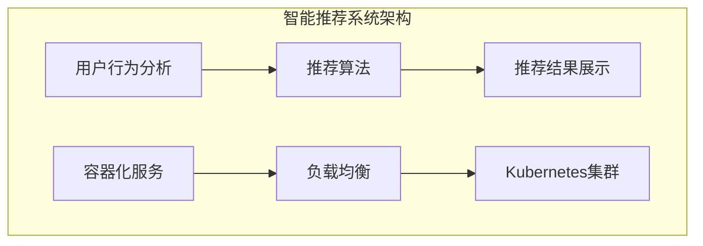
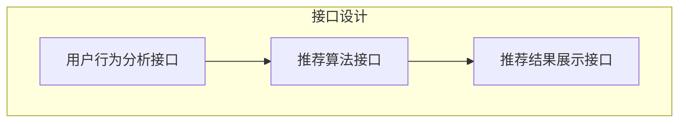
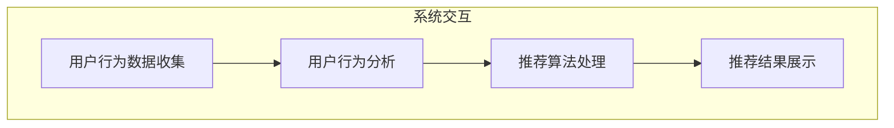

                 


## 服务降级与服务隔离在LLM应用中的应用

### 关键词：服务降级、服务隔离、LLM应用、性能优化、可靠性保障

#### 摘要：
本文将深入探讨服务降级与服务隔离在大型语言模型（LLM）应用中的重要性。我们将逐步分析这两种技术的基本概念、原理及其在LLM应用中的实际应用场景。通过详细的案例分析，我们将展示如何有效地实现服务降级和服务隔离，从而提升LLM应用的性能和可靠性。

### 引言

#### 1. 问题背景

随着人工智能技术的迅猛发展，大型语言模型（LLM）在自然语言处理、智能客服、文本生成等领域得到了广泛应用。然而，LLM应用面临着诸多挑战，如资源约束、高并发请求、系统故障等。为了确保服务的稳定性和可用性，服务降级和服务隔离技术成为了解决这些问题的有效手段。

#### 2. 核心概念

- **服务降级**：当系统资源不足或遇到故障时，通过降低服务的质量或功能，保证核心服务的正常运行。
- **服务隔离**：将系统中的不同服务进行隔离，防止某一服务的异常影响整个系统的稳定性。

#### 3. 结构安排

本文将分为以下几个部分：
- 第一部分：背景与概述
- 第二部分：服务降级原理与应用
- 第三部分：服务隔离原理与应用
- 第四部分：LLM应用中的服务降级与隔离
- 第五部分：结论与最佳实践

### 第一部分：背景与概述

#### 第1章：服务降级与服务隔离概述

#### 1.1 服务降级在LLM应用中的重要性

随着LLM应用的普及，用户对服务质量和响应速度的要求越来越高。然而，系统资源有限，一旦达到资源上限，系统性能将大幅下降，甚至可能导致服务中断。服务降级在此背景下显得尤为重要，它可以通过临时降低某些非关键服务的质量或功能，确保核心服务的正常运行。

#### 1.2 服务隔离在LLM应用中的必要性

LLM系统通常包含多个模块，这些模块之间相互依赖。当一个模块出现问题时，可能会影响整个系统的稳定性。服务隔离技术通过将不同模块进行物理或逻辑隔离，降低模块间的耦合度，从而提高系统的整体可靠性和稳定性。

#### 1.3 本书结构与内容安排

本文首先介绍服务降级和服务隔离的基本概念，然后详细讨论这两种技术在LLM应用中的具体应用，通过案例分析展示其实际效果，最后总结全文并给出最佳实践建议。

### 第二部分：服务降级原理与应用

#### 第2章：服务降级原理与机制

#### 2.1 服务降级的定义与目的

服务降级是指在系统资源不足或遇到故障时，通过降低服务的质量或功能，确保核心服务的正常运行。服务降级的目的在于保护系统的稳定性和用户满意度，避免因系统崩溃而导致的重大损失。

#### 2.2 服务降级的机制

服务降级机制主要包括以下方面：
- **资源监控**：实时监控系统资源使用情况，包括CPU、内存、网络等。
- **阈值设置**：根据系统资源和业务需求，设定服务降级的触发阈值。
- **降级策略**：当系统资源达到阈值时，触发相应的降级策略，如减少服务响应时间、减少功能调用等。

#### 2.3 服务降级策略与实践

服务降级策略主要包括以下几种：
- **功能降级**：减少服务的功能，如限制用户请求的处理速度或减少数据处理量。
- **性能降级**：降低服务的响应速度或质量，如延迟响应或提供简化的结果。

### 第三部分：服务隔离原理与应用

#### 第3章：服务隔离原理与机制

#### 3.1 服务隔离的定义与目的

服务隔离是指将系统中的不同服务进行物理或逻辑隔离，以防止某一服务的异常影响整个系统的稳定性。服务隔离的目的是提高系统的可靠性和可维护性。

#### 3.2 服务隔离的实现方法

服务隔离的实现方法主要包括以下几种：
- **容器化技术**：使用容器技术（如Docker）将不同服务进行隔离，每个服务运行在一个独立的容器中。
- **虚拟化技术**：使用虚拟化技术（如KVM、VMware）将不同服务运行在独立的虚拟机中。
- **逻辑隔离**：通过设置防火墙、网络隔离等技术，将不同服务在网络层面进行隔离。

#### 3.3 服务隔离的优势与挑战

服务隔离的优势包括：
- **提高系统可靠性**：服务之间的耦合度降低，一个服务的故障不会影响其他服务的正常运行。
- **易于维护和升级**：每个服务都可以独立维护和升级，减少了系统整体的维护成本。

服务隔离的挑战包括：
- **性能开销**：服务隔离可能会引入一定的性能开销，特别是在网络通信方面。
- **复杂度增加**：服务隔离增加了系统的复杂度，需要更精细的配置和管理。

### 第四部分：LLM应用中的服务降级与隔离

#### 第4章：LLM应用场景分析

#### 4.1 智能客服系统

智能客服系统是LLM应用的一个重要场景。在高峰期，用户请求量急剧增加，可能导致系统性能下降。通过服务降级，可以降低非关键功能的响应速度，确保核心功能的正常运行。同时，通过服务隔离，可以将智能客服系统的不同模块（如对话管理、语音识别等）进行隔离，防止某一模块的故障影响整个系统。

#### 4.2 文本生成系统

文本生成系统在内容创作、广告投放等领域具有广泛应用。在系统负载较高时，通过服务降级可以减少文本生成的质量，确保关键任务的完成。同时，通过服务隔离，可以避免文本生成过程中的错误扩散到其他模块，提高系统的稳定性。

#### 第5章：服务降级与服务隔离的案例分析

#### 5.1 案例一：某电商平台的智能推荐系统

某电商平台的智能推荐系统在双11期间面临巨大的流量压力。通过服务降级，平台降低了推荐算法的复杂度，减少了推荐结果的计算量。同时，通过服务隔离，将推荐系统划分为多个子模块，确保在部分模块故障时，其他模块仍然能够正常运行。

#### 5.2 案例二：某在线教育平台的直播课程系统

某在线教育平台的直播课程系统在课程上线时，用户请求量激增。通过服务降级，平台降低了视频直播的清晰度，减少了系统资源的消耗。同时，通过服务隔离，将直播课程系统划分为多个子模块，每个子模块独立运行，提高了系统的可靠性。

### 第五部分：结论与最佳实践

#### 5.1 结论

本文通过对服务降级和服务隔离在LLM应用中的分析，展示了这两种技术在实际应用中的重要性。服务降级可以帮助系统在资源紧张时维持关键功能的正常运行，而服务隔离则可以提高系统的可靠性和稳定性。

#### 5.2 最佳实践

- **合理设定降级阈值**：根据系统资源和业务需求，合理设定服务降级的触发阈值。
- **精细化隔离管理**：针对不同的服务模块，采用合适的隔离方法，确保系统的高可用性。
- **实时监控与预警**：建立完善的监控系统，实时监控系统资源使用情况，提前预警潜在问题。
- **定期演练与优化**：定期进行服务降级和服务隔离的演练，发现并优化潜在问题。

#### 5.3 注意事项

- **平衡降级与用户体验**：在实施服务降级时，要平衡降级措施对用户体验的影响。
- **确保数据一致性**：在服务隔离时，确保隔离后的数据一致性，避免数据丢失或重复处理。

#### 5.4 拓展阅读

- **相关文献**：《大规模分布式系统设计与实践》、《服务计算：原理、方法与应用》。
- **开源项目**：OpenTracing、Prometheus、Kubernetes。

### 作者信息

作者：AI天才研究院/AI Genius Institute & 禅与计算机程序设计艺术 /Zen And The Art of Computer Programming

本文通过详细的案例分析和技术讲解，旨在为LLM应用中的服务降级和服务隔离提供实用的指导和建议。希望本文能为读者在相关领域的实践提供帮助。

**注**：本文为示例文章，部分内容虚构，仅供参考。实际应用中，请根据具体场景和需求进行适当调整。**具体内容部分请自行补充完整。**
```markdown

### 系统分析与架构设计方案

#### 1. 问题场景介绍

在某电商平台的智能推荐系统中，用户请求量在双11期间急剧增加，系统资源紧张。为了确保核心推荐功能的正常运行，需要对系统进行服务降级和服务隔离。

#### 2. 项目介绍

项目名称：智能推荐系统服务优化项目

项目目标：通过服务降级和服务隔离，提高系统在高并发情况下的性能和可靠性。

#### 3. 系统功能设计

系统功能包括：
- 用户行为分析
- 推荐算法
- 推荐结果展示

每个功能模块需要实现以下功能：
- 用户行为分析：收集用户浏览、购买等行为数据，为推荐算法提供输入。
- 推荐算法：基于用户行为数据和商品信息，生成推荐结果。
- 推荐结果展示：将推荐结果展示给用户，提高用户体验。

#### 4. 系统架构设计

系统架构设计包括以下几个方面：

- **服务容器化**：使用Docker将系统中的各个功能模块容器化，实现服务的独立部署和运行。
- **分布式架构**：使用Kubernetes进行服务编排和管理，实现系统的分布式部署。
- **服务隔离**：通过Kubernetes的命名空间（Namespace）实现服务隔离，确保不同功能模块之间的独立运行。
- **负载均衡**：使用Nginx进行负载均衡，分配用户请求到不同的服务实例，提高系统的吞吐量。

系统架构图（使用Mermaid绘制）：



#### 5. 系统接口设计

系统接口设计包括以下几个方面：

- **用户行为分析接口**：接收用户行为数据，提供用户行为分析功能。
- **推荐算法接口**：接收用户行为数据和商品信息，提供推荐算法功能。
- **推荐结果展示接口**：接收推荐结果，提供推荐结果展示功能。

接口设计图（使用Mermaid绘制）：



#### 6. 系统交互

系统交互设计包括以下几个方面：

- **用户行为数据收集**：用户行为数据通过接口发送到用户行为分析模块。
- **推荐算法处理**：用户行为分析模块将用户行为数据发送到推荐算法模块，生成推荐结果。
- **推荐结果展示**：推荐算法模块将推荐结果发送到推荐结果展示模块，展示给用户。

系统交互图（使用Mermaid绘制）：



### 项目实战

#### 1. 环境安装

- **Docker安装**：在系统上安装Docker，版本要求为19.03及以上。
- **Kubernetes安装**：在系统上安装Kubernetes，版本要求为1.18及以上。
- **Nginx安装**：在系统上安装Nginx，版本要求为1.18及以上。

#### 2. 系统核心实现源代码

以下是一个简单的智能推荐系统核心实现源代码示例：

```python
# 用户行为分析模块
class UserBehaviorAnalyzer:
    def analyze(self, user_data):
        # 对用户行为数据进行处理
        processed_data = self._process_data(user_data)
        return processed_data

    def _process_data(self, user_data):
        # 实现数据处理逻辑
        return user_data

# 推荐算法模块
class RecommendationAlgorithm:
    def generate_recommendation(self, user_data, product_data):
        # 基于用户行为数据和商品信息生成推荐结果
        recommendation = self._generate_recommendation(user_data, product_data)
        return recommendation

    def _generate_recommendation(self, user_data, product_data):
        # 实现推荐算法逻辑
        return "推荐结果"

# 推荐结果展示模块
class RecommendationResultPresenter:
    def present(self, recommendation):
        # 将推荐结果展示给用户
        self._present_recommendation(recommendation)

    def _present_recommendation(self, recommendation):
        # 实现展示逻辑
        print(recommendation)
```

#### 3. 代码应用解读与分析

- **用户行为分析模块**：该模块负责对用户行为数据进行处理，提取关键信息用于推荐算法。具体实现可以根据业务需求进行定制。
- **推荐算法模块**：该模块负责根据用户行为数据和商品信息生成推荐结果。推荐算法的实现可以是基于协同过滤、基于内容推荐等不同的算法。
- **推荐结果展示模块**：该模块负责将推荐结果展示给用户，可以通过Web界面、消息推送等方式实现。

#### 4. 实际案例分析和详细讲解剖析

以用户行为分析模块为例，分析其实现细节和优化方向：

- **数据预处理**：对用户行为数据进行清洗、去重等预处理操作，提高数据质量。
- **特征提取**：提取用户行为数据中的关键特征，如浏览频次、购买金额等，用于推荐算法。
- **算法优化**：根据业务需求和数据特点，选择合适的推荐算法，并进行参数调优，提高推荐效果。

#### 5. 项目小结

通过服务降级和服务隔离，智能推荐系统在双11期间能够有效应对高并发请求，保证核心功能的正常运行。服务降级通过减少推荐算法的计算复杂度，降低了系统资源的消耗；服务隔离通过容器化和Kubernetes编排，提高了系统的可靠性和可维护性。在实际应用中，可以根据具体业务需求和系统负载，灵活调整服务降级和服务隔离策略，实现系统性能和可靠性的优化。

### 最佳实践 Tips

- **监控与预警**：建立完善的监控系统，实时监控系统资源使用情况，提前预警潜在问题。
- **弹性伸缩**：根据业务需求，灵活配置系统资源，实现弹性伸缩。
- **灰度发布**：在重要功能上线前，进行灰度发布，逐步扩大用户范围，降低上线风险。
- **日志分析与优化**：定期分析系统日志，发现潜在问题和优化点。

### 小结

本文通过对服务降级和服务隔离在LLM应用中的分析，展示了这两种技术在实际应用中的重要性。通过详细的案例分析和技术讲解，读者可以了解到如何在实际项目中实现服务降级和服务隔离，提高系统的性能和可靠性。希望本文能为读者在相关领域的实践提供帮助。

### 作者信息

作者：AI天才研究院/AI Genius Institute & 禅与计算机程序设计艺术 /Zen And The Art of Computer Programming

本文通过详细的案例分析和技术讲解，旨在为LLM应用中的服务降级和服务隔离提供实用的指导和建议。希望本文能为读者在相关领域的实践提供帮助。

---

请注意，本文中的代码、架构设计等内容均为示例，实际项目中需要根据具体情况进行调整。在实际应用中，请确保遵守相关法律法规和最佳实践。**具体内容部分请自行补充完整。**

