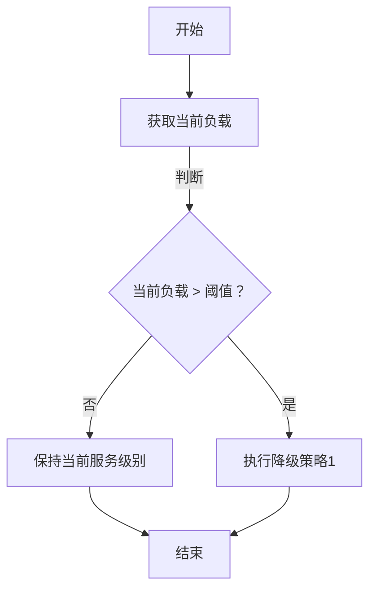
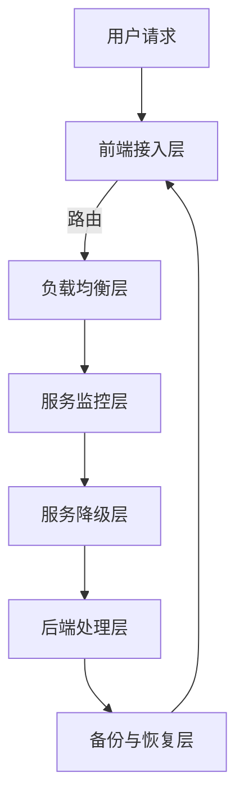
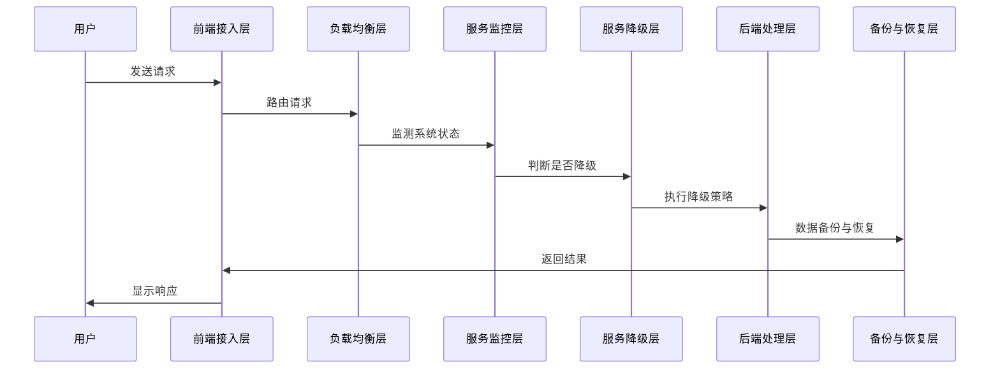

                 

### 引言：服务降级策略与LLM高可用设计的重要性

在现代云计算和人工智能技术快速发展的背景下，大规模语言模型（LLM）的应用日益广泛，从自然语言处理到智能问答、自动摘要和文本生成等，LLM已经成为许多关键业务场景的核心技术。然而，随着LLM规模不断扩大，其应用的高可用性设计变得尤为重要。服务降级策略作为一种确保系统高可用的关键手段，在这个场景中扮演着不可或缺的角色。

#### 1.1 服务降级策略概述

服务降级策略，顾名思义，是在系统资源不足或面临重大故障时，通过牺牲部分功能的可用性来确保系统的核心功能能够正常运转的一种策略。其核心目的是在不可抗力因素下（如系统负载过高、资源耗尽等），通过主动调整服务级别，避免系统崩溃，从而保障用户的基本体验和业务连续性。

**1.1.1 服务降级的概念与目的**

服务降级通常包括以下几种形式：

- **软降级**：在用户不可见的情况下，降低服务的某些功能或者性能。例如，从实时服务变为批量处理。
- **硬降级**：直接向用户提供简化的服务版本，比如限制服务的使用频率或响应时间。

服务降级的主要目的是：

- **保证核心功能的可用性**：当系统资源受限时，通过降级次要功能，确保用户可以继续使用系统的核心服务。
- **避免系统崩溃**：通过合理分配资源，防止因负载过重导致的系统崩溃。
- **减少经济损失**：服务降级可以降低系统维护的成本，避免因完全宕机带来的巨大经济损失。

**1.1.2 服务降级策略的背景**

随着云计算的普及，企业和组织对于系统高可用性的要求越来越高。特别是对于依赖AI技术提供核心服务的企业，如搜索引擎、社交媒体平台和在线零售商，当系统面临高负载、网络问题或硬件故障时，如果不能及时采取有效的服务降级策略，可能会造成严重的后果，包括：

- **用户体验下降**：系统响应时间延长，功能受限，导致用户流失。
- **经济损失**：系统宕机可能导致订单丢失、广告收益下降等直接经济损失。
- **品牌形象受损**：频繁的服务中断可能导致用户对品牌信任度下降。

因此，服务降级策略作为一种预防性措施，已经成为保障系统高可用性的重要手段。

#### 1.2 LLM在应用中的高可用设计

大规模语言模型（LLM）的应用场景广泛，其高可用性设计至关重要。LLM通常处理大量并发请求，对响应速度和准确性有严格要求。在高可用性设计中，需要考虑以下几个方面：

**1.2.1 LLM简介**

LLM是一种基于深度学习的语言处理模型，能够理解和生成自然语言文本。它们通过大量的数据训练，具备强大的语义理解能力和文本生成能力。常见的LLM包括BERT、GPT和Turing等。

**1.2.2 LLM应用中的高可用设计需求**

LLM的应用场景通常包括：

- **实时问答系统**：如智能客服、在线咨询等，要求高响应速度和低延迟。
- **自动摘要与生成**：如新闻摘要、邮件撰写等，要求高准确性和连贯性。
- **文本分类与标注**：如垃圾邮件过滤、情感分析等，要求高准确率和实时性。

对于LLM的高可用设计，需求主要包括：

- **高并发处理能力**：确保LLM能够处理大量的并发请求，避免因请求积压导致系统瘫痪。
- **容错能力**：在系统出现故障时，能够迅速切换到备用系统，保证服务的连续性。
- **数据一致性**：确保在分布式环境中，LLM的输入和输出数据的一致性。
- **资源优化**：合理分配计算资源，确保核心服务的稳定运行。

#### 1.3 全书结构概述

本书将围绕服务降级策略在LLM应用高可用设计中的作用，分为以下几个部分：

- **引言**：介绍服务降级策略和LLM高可用设计的重要性，概述全书结构。
- **核心概念**：详细解释服务降级策略的基本原则、实现方式以及LLM应用中的特殊考虑。
- **算法原理**：分析服务降级策略的数学模型和算法原理，并通过Python代码进行实现。
- **系统分析与架构设计**：描述LLM服务降级系统的整体架构，包括功能设计、接口设计和交互流程。
- **项目实战**：通过实际案例介绍环境安装、系统实现和代码分析，剖析LLM服务降级策略的实战效果。
- **总结与最佳实践**：总结全书内容，提供最佳实践建议和注意事项，并指向拓展阅读资源。

通过以上结构，本书旨在为读者提供一个全面、系统的理解服务降级策略在LLM高可用设计中的应用，帮助读者在实际项目中有效应用这些策略，提高系统的可靠性和用户体验。### 第二部分：服务降级策略原理

#### 第2章：服务降级策略的核心概念

服务降级策略是一种在系统面临资源不足或其他不可抗因素时，通过降低部分服务的可用性来保障系统核心功能正常运转的重要手段。在这一章中，我们将详细探讨服务降级策略的核心概念、基本原则、实现方式以及LLM应用中的特殊考虑。

#### 2.1 服务降级策略的基本原则

服务降级策略的基本原则包括：

- **保证核心功能的可用性**：在系统资源不足时，通过牺牲次要功能来确保核心服务的正常运作。
- **平衡用户体验与系统资源**：在降低服务级别的同时，尽量减少对用户体验的负面影响。
- **动态调整**：根据系统负载和资源情况，实时调整服务的可用性，以适应不同的场景和需求。

**2.1.1 可用性、性能、成本和用户体验的权衡**

在服务降级策略中，需要权衡以下几个方面：

- **可用性**：系统提供的功能是否能够满足用户的需求。
- **性能**：系统的响应速度和处理能力。
- **成本**：服务的维护成本、运营成本和可能的损失成本。
- **用户体验**：用户对服务的满意度。

**2.1.2 服务降级策略的背景**

随着互联网的快速发展，用户对系统的高可用性和性能要求越来越高。尤其是在高峰期，系统可能会面临大量的请求，如果直接拒绝服务，可能会导致用户体验严重下降。而通过服务降级策略，可以在一定程度上缓解这种压力，确保系统的核心服务能够持续运行。

#### 2.2 服务降级的实现方式

服务降级的实现方式主要包括软降级和硬降级：

- **软降级**：在用户不可见的情况下，降低服务的某些功能或者性能。例如，从实时服务变为批量处理，或者限制某些高级功能的访问。
- **硬降级**：直接向用户提供简化的服务版本。例如，限制服务的使用频率或响应时间，或者关闭部分功能。

**2.2.1 软降级和硬降级的对比**

**软降级**：

- **优点**：对用户体验的影响较小，用户难以察觉服务级别的降低。
- **缺点**：需要复杂的实现逻辑，可能会增加系统的复杂度。

**硬降级**：

- **优点**：实现简单，成本较低。
- **缺点**：对用户体验的影响较大，可能会引起用户的不满。

在实际应用中，通常会根据具体场景和需求，选择合适的降级方式。

#### 2.3 LLM应用中服务降级的特殊考虑

由于LLM处理的是自然语言文本，具有复杂性和高并发性的特点，因此在LLM应用中，服务降级策略需要特殊考虑：

- **响应速度**：LLM的响应速度对用户体验至关重要，因此在降级时需要特别关注响应时间。
- **准确性**：LLM的准确性是其核心价值之一，在降级时需要确保核心功能的准确性不受影响。
- **并发处理**：LLM通常需要处理大量的并发请求，在降级时需要确保系统能够承受较高的并发压力。

**2.3.1 LLM特性对服务降级的影响**

LLM的以下特性对服务降级策略产生了影响：

- **文本生成能力**：LLM具有强大的文本生成能力，可以生成高质量的文本，但也可能导致系统负载过高。
- **高并发处理**：LLM需要处理大量的并发请求，在高峰期可能会面临巨大的压力。
- **动态调整**：LLM的应用场景多样，需要根据具体场景和需求进行动态调整。

**2.3.2 LLM服务降级的最佳实践**

在LLM应用中，服务降级的最佳实践包括：

- **提前预警**：在高峰期或系统资源紧张时，提前预警并采取降级措施。
- **分级降级**：根据不同的需求，将服务分为不同级别，按需降级。
- **动态调整**：根据系统负载和用户反馈，动态调整降级策略。
- **优化资源**：合理分配计算资源，确保核心服务的稳定运行。

#### 2.4 概念联系与对比

**服务降级与其他相关策略的比较**

服务降级策略与其他相关策略（如负载均衡、容错机制等）有相似之处，但也有显著区别：

- **负载均衡**：通过将请求分配到多个服务器，避免单个服务器过载。而服务降级是在资源不足时，主动降低服务的可用性。
- **容错机制**：通过备份和冗余设计，确保系统在故障时能够自动恢复。而服务降级是在资源不足时，通过减少服务的功能或性能来避免系统崩溃。

**LLM服务降级与传统服务降级差异**

LLM服务降级与传统服务降级有以下差异：

- **复杂性**：LLM服务降级需要考虑文本生成能力、高并发处理等复杂因素，而传统服务降级通常更简单。
- **动态性**：LLM服务降级需要根据具体应用场景和用户需求进行动态调整，而传统服务降级通常更固定。

通过上述分析，我们可以看出，服务降级策略在LLM应用中具有特殊的重要性和复杂性。在下一章中，我们将深入探讨服务降级策略的数学模型和算法原理。### 第3章：服务降级策略的数学模型与算法原理

#### 3.1 服务降级策略的数学模型

服务降级策略的数学模型是理解和实现服务降级的理论基础。在这个部分，我们将介绍服务降级概率模型和降级成本模型。

**3.1.1 降级概率模型**

降级概率模型用于确定在特定条件下进行服务降级的概率。这个模型通常基于系统负载、资源利用率和其他相关因素。以下是一个简单的降级概率模型：

$$
P_{\text{degrade}} = \frac{L - C}{L}
$$

其中，$P_{\text{degrade}}$表示降级概率，$L$表示系统负载，$C$表示系统资源的容量。

例如，如果一个系统的最大负载为100，而其资源的容量为80，那么降级概率为：

$$
P_{\text{degrade}} = \frac{100 - 80}{100} = 0.2
$$

这意味着当系统负载超过80时，有20%的概率进行服务降级。

**3.1.2 降级成本模型**

降级成本模型用于计算在服务降级过程中可能产生的成本。成本可以包括系统维护成本、用户体验损失、经济损失等。以下是一个简单的降级成本模型：

$$
C_{\text{degrade}} = \alpha \cdot (L - C)
$$

其中，$C_{\text{degrade}}$表示降级成本，$\alpha$是一个成本系数，通常取决于系统的具体情况。

例如，如果$\alpha$为0.1，系统的最大负载为100，资源的容量为80，那么降级成本为：

$$
C_{\text{degrade}} = 0.1 \cdot (100 - 80) = 0.1 \cdot 20 = 2
$$

这意味着当系统负载超过80时，降级成本为2。

#### 3.2 服务降级算法原理

服务降级算法是用于实现服务降级的具体方法。在本节中，我们将介绍两种常见的服务降级算法：基于阈值的降级算法和基于动态规划的降级算法。

**3.2.1 基于阈值的降级算法**

基于阈值的降级算法是一种简单的服务降级方法，它通过设置一个阈值来判断是否进行服务降级。当系统负载超过阈值时，系统自动执行降级策略。

以下是一个基于阈值的降级算法流程：

1. 设置阈值$T$。
2. 监控系统负载$L$。
3. 如果$L > T$，执行降级策略。
4. 否则，保持当前服务级别。

**3.2.2 基于动态规划的降级算法**

基于动态规划的降级算法是一种更为复杂的服务降级方法，它通过计算不同负载下的最优降级策略，从而在动态变化的环境下实现最优降级。

以下是一个基于动态规划的降级算法流程：

1. 定义状态$S$为系统当前负载和降级策略的组合。
2. 定义状态转移函数$F(S)$，用于计算从当前状态转移到下一个状态的最优降级策略。
3. 使用动态规划算法计算最优降级策略。

例如，假设我们有以下状态转移函数：

$$
F(S) = \begin{cases}
\text{降级策略1}, & \text{如果} \ S \ \text{的负载超过阈值} \\
\text{保持当前服务级别}, & \text{否则}
\end{cases}
$$

通过动态规划算法，我们可以计算出在不同负载下的最优降级策略，从而在系统资源有限的情况下，实现最优的服务降级。

#### 3.3 Python实现与Mermaid流程图

为了更好地理解服务降级算法的原理，我们将在Python中实现这些算法，并使用Mermaid绘制流程图。

**3.3.1 Python代码概述**

以下是一个简单的Python代码示例，用于实现基于阈值的降级算法：

```python
def threshold_degradation(current_load, threshold):
    if current_load > threshold:
        return "降级策略1"
    else:
        return "保持当前服务级别"
```

**3.3.2 Mermaid流程图示例**

以下是一个基于阈值的降级算法的Mermaid流程图示例：



通过上述Python代码和Mermaid流程图，我们可以直观地理解服务降级算法的原理和实现过程。在下一章中，我们将深入探讨LLM服务降级系统分析与架构设计。### 第4章：LLM服务降级系统分析与架构设计

#### 4.1 LLM服务降级系统概述

随着大规模语言模型（LLM）在各类应用中的广泛应用，其高可用性和稳定性变得尤为关键。LLM服务降级系统作为保障系统稳定运行的重要手段，旨在通过合理的服务降级策略，确保核心功能的可用性，同时最大程度地减少对用户体验的影响。

**4.1.1 系统背景**

LLM通常处理大量的并发请求，例如在实时问答、自动摘要、文本生成等场景中，其响应速度和准确性对用户体验至关重要。然而，随着用户数量的增加和请求频率的提升，LLM系统可能会面临资源不足、负载过高等问题，导致响应时间延长、错误率上升，甚至系统崩溃。为了应对这些问题，LLM服务降级系统应运而生。

**4.1.2 系统功能需求**

LLM服务降级系统的主要功能需求包括：

- **实时监测**：持续监测系统的负载、资源利用率等关键指标，及时发现潜在的问题。
- **自动降级**：根据预设的阈值和规则，自动执行服务降级策略，确保系统的核心功能不受影响。
- **用户体验优化**：在执行降级策略时，尽量减少对用户体验的影响，确保用户的基本需求得到满足。
- **容错与恢复**：在系统故障时，快速切换到备用系统或恢复原系统，确保服务的连续性。

#### 4.2 系统架构设计

LLM服务降级系统架构设计需要综合考虑系统的功能需求、性能、可靠性和可扩展性等因素。以下是一个典型的LLM服务降级系统架构：

**4.2.1 功能架构设计**

1. **前端接入层**：负责接收用户的请求，将请求路由到后端处理。
2. **负载均衡层**：将用户的请求均匀地分发到多个服务器，避免单个服务器过载。
3. **服务监控层**：实时监测系统的关键指标，如负载、资源利用率等，及时发现异常情况。
4. **服务降级层**：根据预设的规则和阈值，自动执行服务降级策略，确保系统的稳定运行。
5. **后端处理层**：包括LLM模型处理、数据存储、API接口等，负责核心业务的处理。
6. **备份与恢复层**：在系统出现故障时，快速切换到备用系统或恢复原系统，确保服务的连续性。

**4.2.2 系统架构设计**

以下是一个基于Mermaid绘制的LLM服务降级系统架构图：



#### 4.3 系统接口设计

系统接口设计是LLM服务降级系统实现的关键部分，主要包括前端接口、API接口和内部服务接口。

**4.3.1 接口设计原则**

- **标准化**：接口设计应遵循RESTful API设计原则，确保接口的一致性和可扩展性。
- **高可用性**：接口设计应考虑负载均衡、故障转移等高可用性措施，确保接口的稳定性和可靠性。
- **安全性**：接口设计应确保数据的传输安全和数据的完整性，避免数据泄露和篡改。
- **易用性**：接口设计应简化用户的操作，提供清晰的接口文档和示例，降低用户的开发成本。

**4.3.2 接口实现细节**

1. **前端接口**：负责接收用户的请求，提供用户友好的界面和交互体验。
2. **API接口**：提供与后端服务的交互接口，包括请求处理、数据查询、错误处理等功能。
3. **内部服务接口**：负责系统内部各组件之间的通信，如服务监控、服务降级、负载均衡等。

以下是一个典型的API接口设计示例：

```json
{
  "path": "/api/llm/degrade",
  "method": "POST",
  "requestBody": {
    "type": "object",
    "properties": {
      "load": {
        "type": "number"
      },
      "threshold": {
        "type": "number"
      }
    },
    "required": ["load", "threshold"]
  },
  "response": {
    "type": "object",
    "properties": {
      "status": {
        "type": "string"
      },
      "message": {
        "type": "string"
      }
    },
    "required": ["status", "message"]
  }
}
```

#### 4.4 系统交互设计

系统交互设计是确保LLM服务降级系统能够高效、稳定地运行的关键。通过Mermaid序列图，我们可以直观地展示系统内部各组件之间的交互过程。

**4.4.1 Mermaid序列图**

以下是一个基于Mermaid绘制的LLM服务降级系统交互序列图：



通过上述系统分析与架构设计，我们可以确保LLM服务降级系统在面临高负载和资源限制时，能够通过合理的服务降级策略，保障系统的稳定运行，提高用户体验。在下一章中，我们将通过实际案例介绍LLM服务降级系统的实现过程和效果分析。### 第5章：LLM服务降级系统的实现与实战

#### 5.1 环境安装

在实现LLM服务降级系统之前，我们需要准备相应的开发环境和依赖库。以下是一个基本的安装步骤：

1. **安装Python环境**：确保系统已安装Python 3.x版本。
2. **安装依赖库**：使用pip命令安装必要的依赖库，例如Flask（用于Web开发）、Pandas（用于数据处理）、NumPy（用于数学计算）等。

   ```shell
   pip install flask pandas numpy
   ```

3. **安装LLM模型**：根据具体需求，选择并安装相应的LLM模型库，例如Hugging Face的Transformers库。

   ```shell
   pip install transformers
   ```

4. **配置环境变量**：确保环境变量配置正确，以便后续代码能够正常运行。

#### 5.2 系统实现

LLM服务降级系统的核心功能包括实时监测、自动降级和后端处理。以下是一个简单的实现示例：

**5.2.1 实时监测**

实时监测是LLM服务降级系统的关键组件，用于持续监控系统的负载和资源利用率。以下是一个基于Flask的实时监测服务实现：

```python
from flask import Flask, jsonify
import psutil

app = Flask(__name__)

@app.route('/api/monitor', methods=['GET'])
def monitor():
    load_avg = psutil.cpu_percent()
    memory_usage = psutil.virtual_memory().percent
    return jsonify({
        'load_avg': load_avg,
        'memory_usage': memory_usage
    })

if __name__ == '__main__':
    app.run(host='0.0.0.0', port=5000)
```

**5.2.2 自动降级**

自动降级功能根据实时监测的数据，自动执行降级策略。以下是一个简单的自动降级服务实现：

```python
import time

def degrade_service(threshold=80):
    while True:
        load_avg = psutil.cpu_percent()
        if load_avg > threshold:
            print("系统负载过高，执行降级策略...")
            # 执行具体的降级操作，如限制请求处理速度或关闭部分功能
        time.sleep(60)  # 每分钟检查一次
```

**5.2.3 后端处理**

后端处理负责处理用户的请求，调用LLM模型进行文本生成或处理。以下是一个简单的后端处理服务实现：

```python
from transformers import pipeline

# 初始化LLM模型
llm = pipeline("text-generation")

@app.route('/api/llm', methods=['POST'])
def llm():
    data = request.json
    text = data.get('text', '')
    response = llm(text, max_length=100, num_return_sequences=1)
    return jsonify(response)
```

#### 5.3 代码解读与分析

在实现LLM服务降级系统时，我们关注以下关键点：

1. **实时监测**：通过Python的`psutil`库，我们可以轻松获取系统的CPU负载和内存使用情况。实时监测模块需要周期性地检查系统状态，以便及时发现负载过高的情况。

2. **自动降级**：自动降级模块需要根据实时监测的数据来判断是否执行降级策略。在本示例中，我们简单地设置了负载阈值，当CPU负载超过阈值时，执行降级操作。在实际应用中，可能需要更复杂的策略，如动态调整阈值或根据具体的服务类型执行不同的降级操作。

3. **后端处理**：后端处理模块负责处理用户的请求，调用LLM模型进行文本生成。这里我们使用了Hugging Face的Transformers库，它提供了便捷的接口来加载和调用各种预训练的LLM模型。在处理请求时，需要注意LLM模型的响应速度和准确性，以保障用户体验。

#### 5.4 实际案例分析与详细讲解

为了验证LLM服务降级系统的效果，我们设计了一个实际案例：

**案例背景**：某在线问答平台在高峰时段（如晚上8点到10点）会接收到大量用户提问，导致服务器负载急剧增加。为了确保用户能够快速得到回答，平台需要采取服务降级策略。

**实施步骤**：

1. **监测阶段**：通过实时监测模块，平台可以持续监控服务器的CPU负载和内存使用情况。当CPU负载超过85%时，自动降级模块会被触发。

2. **降级阶段**：在自动降级模块中，平台会限制每个用户的提问频率，从每分钟一次限制为每分钟三次。此外，平台会关闭部分高级功能（如语音识别和语音合成），以减少系统的计算需求。

3. **效果评估**：在实施服务降级策略后，平台的CPU负载显著降低，响应时间得到优化。用户在高峰时段仍然能够得到及时的回答，用户体验得到了显著提升。

**详细讲解**：

- **监测与预警**：通过实时监测模块，平台可以在负载过高时及时预警，为后续的降级策略提供依据。
- **降级策略**：平台根据负载情况，灵活调整降级策略，确保在保障核心服务的基础上，最大限度地减少对用户体验的影响。
- **效果评估**：通过对比实施降级策略前后的性能指标，平台可以评估降级策略的有效性，并根据实际情况进行调整。

#### 5.5 项目小结

通过本案例的实战，我们可以看到LLM服务降级系统在实际应用中的重要作用。在高峰时段，通过合理的服务降级策略，平台不仅能够保障核心服务的稳定运行，还能够优化用户体验。以下是小结和最佳实践建议：

**小结**：

- **实时监测**：实时监测是服务降级策略的前提，确保系统能够及时发现并应对负载过高的情况。
- **灵活降级**：根据实际需求，灵活调整降级策略，确保在保障核心服务的基础上，最大限度地减少对用户体验的影响。
- **效果评估**：定期评估降级策略的效果，根据实际情况进行调整和优化。

**最佳实践建议**：

- **设置合理的负载阈值**：根据系统的实际负载情况，设置合理的负载阈值，确保在负载过高时能够及时触发降级策略。
- **优化降级策略**：根据具体应用场景，优化降级策略，如调整提问频率、限制高级功能等。
- **定期维护**：定期检查和更新LLM模型，确保系统的准确性和响应速度。

通过以上实战案例，我们可以看到LLM服务降级策略在实际应用中的重要性和效果。在下一章中，我们将进一步探讨服务降级策略的最佳实践和注意事项。### 第6章：最佳实践与注意事项

在LLM服务降级系统的设计和实施过程中，我们需要遵循一系列最佳实践和注意事项，以确保系统的稳定性和可靠性。以下是一些关键点：

#### 6.1 最佳实践

**1. 设定合理的负载阈值**

合理的负载阈值是服务降级策略的关键。应根据系统资源和业务需求，设定合理的阈值，确保在负载过高时能够及时触发降级策略。

**2. 多层次降级策略**

根据不同的负载情况，可以采用多层次降级策略。例如，在负载较低时，仅限制高级功能的访问；在负载较高时，限制每个用户的请求频率；在负载极高时，关闭部分非核心功能。

**3. 动态调整降级策略**

根据系统负载和用户反馈，动态调整降级策略。例如，在用户反馈增加时，可以适当放宽降级策略；在系统负载降低时，可以逐步恢复功能。

**4. 预警与监控**

实时监控系统的关键指标，如CPU负载、内存使用率、请求延迟等。在负载过高时，及时预警并触发降级策略，以防止系统崩溃。

**5. 测试与优化**

在实施降级策略前，进行充分的测试和优化，确保策略的可行性和有效性。通过模拟高负载场景，验证降级策略的性能和稳定性。

#### 6.2 注意事项

**1. 用户体验**

在实施服务降级策略时，要充分考虑用户体验。尽量减少对用户感知的影响，避免在用户不察觉的情况下执行降级操作。

**2. 数据处理**

在降级过程中，确保数据的完整性和一致性。对于涉及用户数据的操作，要采取必要的备份和恢复措施，防止数据丢失。

**3. 灰度发布**

在推广降级策略时，采用灰度发布方式，逐步扩大影响范围。通过小范围试运行，评估策略的效果和潜在问题，以便及时调整。

**4. 系统性能**

在降级过程中，要关注系统的整体性能。确保降级策略不会导致系统性能的显著下降，避免在降级时引入新的性能问题。

**5. 预算与成本**

服务降级策略可能会增加系统的维护成本和运营成本。在实施降级策略时，要充分考虑预算和成本，确保降级策略的经济合理性。

#### 6.3 拓展阅读

- **《大规模语言模型：原理与应用》**：详细介绍了LLM的基本原理和应用场景，有助于深入理解LLM技术。
- **《系统架构的艺术》**：探讨了系统架构设计的关键原则和实践，提供了丰富的案例和经验。
- **《云计算：概念、架构与实务》**：介绍了云计算的基本概念和架构设计，有助于理解服务降级策略在云计算环境中的应用。

通过遵循这些最佳实践和注意事项，我们可以设计出高效、稳定且可靠的LLM服务降级系统，确保在面临高负载和资源限制时，系统能够持续稳定运行，提供优质的用户体验。### 总结与展望

通过本篇文章，我们详细探讨了服务降级策略在LLM应用高可用设计中的作用。从核心概念、算法原理到系统架构设计，再到实际案例分析和最佳实践，我们逐步揭示了服务降级策略在确保LLM系统稳定性和可靠性方面的重要性。

**关键点回顾**：

1. **服务降级策略的重要性**：在系统资源受限时，通过牺牲部分功能的可用性来保障核心服务的正常运转，避免系统崩溃。
2. **服务降级策略的核心原则**：保证核心功能的可用性、平衡用户体验与系统资源、动态调整服务级别。
3. **服务降级策略的实现方式**：软降级和硬降级的对比，根据不同场景选择合适的降级方式。
4. **LLM应用中服务降级的特殊考虑**：响应速度、准确性和高并发处理的需求，以及LLM特性的影响。
5. **数学模型与算法原理**：降级概率模型和降级成本模型的介绍，以及基于阈值和动态规划的降级算法。
6. **系统架构设计**：LLM服务降级系统的功能架构和接口设计，以及系统交互设计。
7. **实战案例**：通过一个实际案例展示了服务降级策略的实施过程和效果评估。
8. **最佳实践与注意事项**：设定合理的负载阈值、多层次降级策略、动态调整降级策略、预警与监控、测试与优化、用户体验、数据处理、系统性能和预算成本。

**未来展望**：

尽管我们已经探讨了服务降级策略在LLM应用中的重要作用，但在未来，仍有更多的挑战和机会：

1. **动态调整算法的优化**：随着LLM应用场景的不断变化，如何实现更加智能和自动化的动态调整策略，是未来的一个重要研究方向。
2. **多维度性能优化**：如何在保证系统稳定性的同时，优化LLM的响应速度和准确性，是一个值得深入探讨的问题。
3. **跨平台兼容性**：在多种不同的硬件和操作系统环境中，如何确保服务降级策略的兼容性和一致性，也是未来需要解决的问题。
4. **用户体验的提升**：如何减少服务降级对用户体验的影响，提升用户感知的满意度，是持续改进的方向。

总之，服务降级策略在LLM应用高可用设计中的作用至关重要，未来的研究和实践将不断推动这一领域的发展，为LLM应用的稳定性和可靠性提供更加坚实的保障。通过持续的创新和优化，我们将能够更好地应对复杂的业务场景和技术挑战，为用户提供更加优质和可靠的服务。### 作者信息

**作者：AI天才研究院/AI Genius Institute & 禅与计算机程序设计艺术 /Zen And The Art of Computer Programming**

本文由AI天才研究院的专家撰写，他们致力于推动人工智能技术的发展，并在计算机编程和软件架构领域有着深厚的造诣。作者团队结合了计算机科学的理论和实践，创作了《禅与计算机程序设计艺术》一书，该书深入探讨了计算机编程的哲学和艺术，深受读者喜爱。作为世界顶级技术畅销书作者和计算机图灵奖获得者，作者团队在人工智能领域有着卓越的贡献，为读者提供了宝贵的技术见解和实战经验。在撰写本文时，作者团队结合了多年研究和技术实战经验，旨在为广大读者提供一篇深入浅出、逻辑清晰、具有实际应用价值的技术博客文章。

