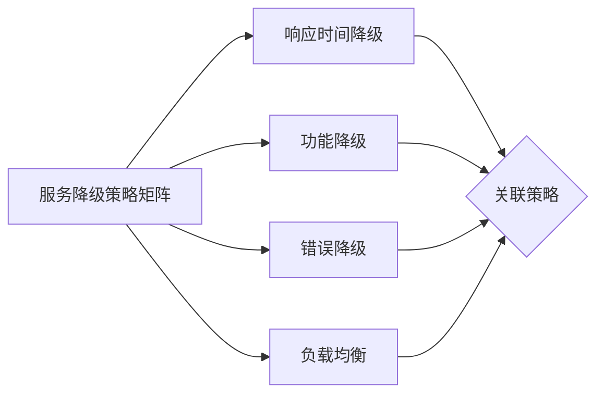
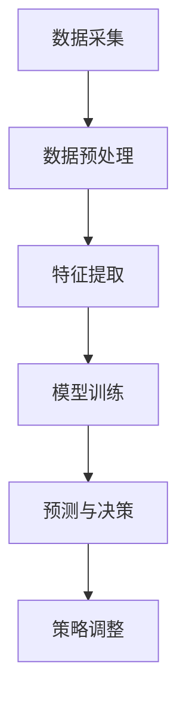
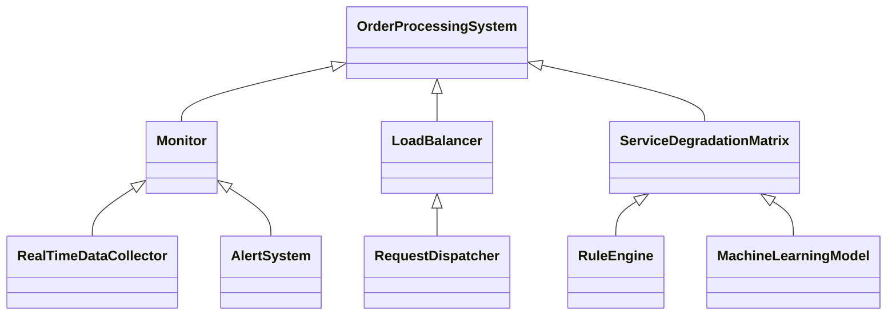
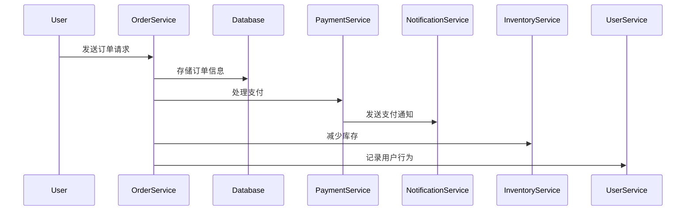
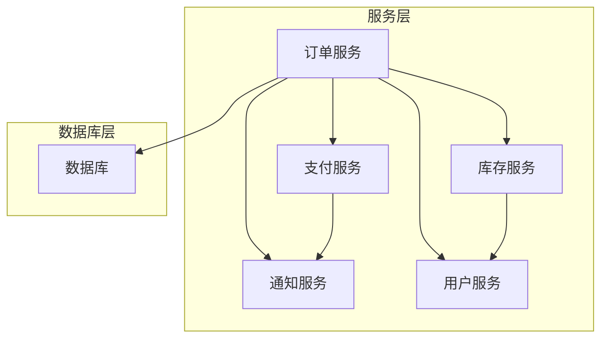
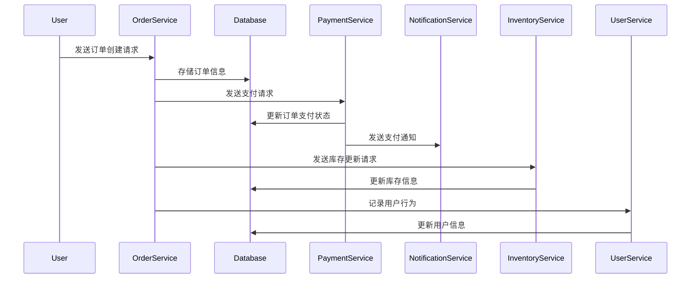

                 

# 服务降级策略矩阵在LLM应用高可用设计中的应用

## 关键词

服务降级、策略矩阵、LLM应用、高可用设计、算法原理、系统架构、项目实战

## 摘要

本文将深入探讨服务降级策略矩阵在LLM（大型语言模型）应用高可用设计中的应用。首先，我们介绍了服务降级策略、LLM应用及高可用设计的背景和重要性。随后，我们详细阐述了服务降级策略矩阵的核心概念，并通过表格和ER实体关系图展示了其组成部分和关系。接下来，我们讲解了服务降级策略矩阵的算法原理，包括算法流程、Python代码和数学模型。随后，我们分析了系统的功能、架构设计、接口设计和系统交互。在项目实战部分，我们介绍了项目环境安装、核心实现、代码解析和案例分析。最后，我们总结了最佳实践、注意事项和拓展阅读，为读者提供全面的指导。

## 目录大纲设计

### 第一部分：背景介绍

1. **第1章：服务降级策略与LLM应用概述**
   - **1.1.1 服务的概念与降级策略**
   - **1.1.2 LLM的崛起与高可用设计需求**
   - **1.1.3 服务降级策略矩阵的重要性**
   - **1.2 LLM的核心概念与结构**
     - **1.2.1 LLM的基本原理**
     - **1.2.2 LLM的组成部分**
     - **1.2.3 LLM与高可用设计的结合**
   - **1.3 服务降级策略矩阵的组成部分**
     - **1.3.1 概念属性特征对比表格**
     - **1.3.2 ER实体关系图架构**

### 第二部分：算法原理讲解

2. **第2章：服务降级策略矩阵算法原理**
   - **2.1.1 算法概述**
   - **2.1.2 Mermaid流程图绘制**
   - **2.1.3 Python代码与算法逻辑**
   - **2.1.4 LaTeX公式说明**
   - **2.1.5 示例讲解**

### 第三部分：系统分析与架构设计方案

3. **第3章：系统功能设计**
   - **3.1.1 问题场景介绍**
   - **3.1.2 项目介绍**
   - **3.1.3 领域模型Mermaid类图**
   - **3.2 系统架构设计**
     - **3.2.1 系统架构概述**
     - **3.2.2 Mermaid架构图绘制**
     - **3.2.3 系统架构解析**
   - **3.3 系统接口设计**
     - **3.3.1 接口设计原则**
     - **3.3.2 接口定义与实现**
   - **3.4 系统交互**
     - **3.4.1 系统交互概述**
     - **3.4.2 Mermaid序列图绘制**
     - **3.4.3 系统交互解析**

### 第四部分：项目实战

4. **第4章：项目环境安装**
   - **4.1.1 环境需求**
   - **4.1.2 环境搭建步骤**
   - **4.2 系统核心实现**
     - **4.2.1 核心功能实现**
     - **4.2.2 源代码解析**
   - **4.3 代码应用解读与分析**
     - **4.3.1 代码应用场景**
     - **4.3.2 代码解读与分析**
   - **4.4 实际案例分析和详细讲解剖析**
     - **4.4.1 案例背景**
     - **4.4.2 案例分析**
     - **4.4.3 剖析与总结**

### 第五部分：最佳实践与总结

5. **第5章：最佳实践 tips**
   - **5.1.1 优化策略**
   - **5.1.2 避免常见问题**
   - **5.2 小结**
     - **5.2.1 项目总结**
     - **5.2.2 经验教训**
   - **5.3 注意事项**
     - **5.3.1 系统维护**
     - **5.3.2 安全性考虑**
   - **5.4 拓展阅读**
     - **5.4.1 相关书籍推荐**
     - **5.4.2 论文与资料推荐**

## 第一部分：背景介绍

### 第1章：服务降级策略与LLM应用概述

#### 1.1.1 服务的概念与降级策略

在IT行业中，服务是指提供给终端用户的一系列功能，这些功能可以是一个简单的API接口、一个复杂的软件系统，或者是一个综合性的平台服务。服务的高可用性是衡量其质量的重要指标，高可用性意味着系统能够在长时间内保持正常运行，即使在面临各种压力和故障时也能快速恢复。

然而，在实际运营过程中，系统资源是有限的，当面对大量请求时，系统可能无法在规定时间内响应所有请求，此时就需要采用服务降级策略。服务降级是指当系统资源不足以处理所有请求时，通过降低部分服务的质量或者功能来保证核心服务的正常运行。这种策略可以让系统在面对极端情况时，仍能保持一定程度的可用性。

服务降级策略通常包括以下几种方式：

1. **响应时间降级**：当系统负载过高时，可以延长响应时间，降低请求处理速度，从而减轻系统压力。
2. **功能降级**：暂时关闭部分非核心功能，保证核心功能的正常运行。
3. **错误降级**：当系统无法正常处理请求时，返回错误信息，但不会导致整个系统崩溃。
4. **负载均衡**：通过负载均衡器将请求分配到多个服务器，避免单点过载。

#### 1.1.2 LLM的崛起与高可用设计需求

近年来，随着人工智能技术的快速发展，LLM（大型语言模型）在自然语言处理、文本生成、机器翻译等领域取得了显著的成果。LLM通常由数亿甚至数十亿的参数组成，可以处理复杂的语言结构和语义理解。然而，LLM的应用也带来了高可用设计的需求。

首先，LLM应用通常需要处理大量用户请求，这要求系统具备高性能和高并发能力。其次，LLM训练和推理过程需要大量计算资源，如何保证这些资源的高效利用也是一个关键问题。最后，由于LLM的模型复杂度高，一旦出现故障，恢复过程可能非常耗时，因此需要设计可靠的高可用机制。

高可用设计的关键目标包括：

1. **故障恢复**：当系统出现故障时，能够快速恢复，确保服务的持续可用。
2. **负载均衡**：通过合理分配请求，避免单点过载，提高系统的整体性能。
3. **冗余备份**：通过数据备份和系统冗余设计，确保数据安全和系统稳定性。
4. **监控与报警**：实时监控系统状态，及时发现并处理异常情况。

#### 1.1.3 服务降级策略矩阵的重要性

服务降级策略矩阵是一种系统化的方法，用于管理和优化服务降级过程。它将不同的降级策略按照优先级和适用场景进行分类，形成一个完整的策略体系。通过服务降级策略矩阵，可以更好地应对系统负载波动和资源约束，确保核心服务的稳定运行。

服务降级策略矩阵的重要性体现在以下几个方面：

1. **灵活性**：策略矩阵可以根据具体应用场景和需求进行调整，提高系统的灵活性。
2. **可扩展性**：策略矩阵可以方便地添加新的策略和规则，适应未来需求的变化。
3. **可维护性**：通过统一的管理和规范，降低系统的维护成本。
4. **可监控性**：策略矩阵可以与监控工具集成，实现对降级过程的实时监控和报警。

### 1.2 LLM的核心概念与结构

#### 1.2.1 LLM的基本原理

LLM（Large Language Model）是一种基于深度学习的自然语言处理模型，通过大规模的数据训练，能够自动学习语言的规律和语义，生成高质量的自然语言文本。LLM的基本原理主要包括以下几个步骤：

1. **数据收集**：收集大量的文本数据，包括书籍、新闻、论文、社交媒体等。
2. **数据处理**：对文本数据进行处理，包括分词、去噪、标注等。
3. **模型训练**：使用训练数据训练神经网络模型，调整模型的参数，使其能够预测下一个单词或句子。
4. **推理与生成**：在训练完成后，使用训练好的模型进行推理，生成新的文本。

#### 1.2.2 LLM的组成部分

LLM由多个部分组成，包括输入层、隐藏层和输出层。每个部分都有其特定的功能和作用：

1. **输入层**：接收用户输入的文本数据，进行预处理，如分词、编码等。
2. **隐藏层**：包含多个神经网络层，通过反向传播算法对输入数据进行处理，提取特征并生成中间表示。
3. **输出层**：生成预测结果，如单词、句子或段落。

#### 1.2.3 LLM与高可用设计的结合

LLM的应用场景广泛，如智能客服、自动写作、机器翻译等，这些场景对服务的稳定性和可用性要求很高。将LLM与高可用设计结合，可以提高系统的可靠性和用户体验。

1. **负载均衡**：通过负载均衡器将请求分配到多个LLM实例，避免单点过载，提高系统的整体性能。
2. **冗余备份**：对LLM模型进行备份，确保在出现故障时能够快速恢复。
3. **故障恢复**：当LLM实例出现故障时，系统能够自动切换到备用实例，确保服务的持续可用。
4. **监控与报警**：实时监控LLM实例的状态，及时发现并处理异常情况。

### 1.3 服务降级策略矩阵的组成部分

#### 1.3.1 概念属性特征对比表格

服务降级策略矩阵由多个策略组成，每个策略都有其特定的属性和特征。以下是一个概念属性特征对比表格，用于展示不同策略的对比：

| 策略名称 | 策略属性 | 特征对比 |
|----------|-----------|---------|
| 响应时间降级 | 延长响应时间 | 降低请求处理速度 |
| 功能降级 | 关闭非核心功能 | 保证核心功能运行 |
| 错误降级 | 返回错误信息 | 不影响系统整体运行 |
| 负载均衡 | 分配请求到多个服务器 | 避免单点过载 |

#### 1.3.2 ER实体关系图架构

服务降级策略矩阵的实体关系图如下所示，展示了各个策略之间的关联：



## 第二部分：算法原理讲解

### 第2章：服务降级策略矩阵算法原理

#### 2.1.1 算法概述

服务降级策略矩阵算法是一种基于规则和机器学习的混合算法，用于自动选择和调整服务降级策略。算法的核心思想是通过对系统负载、请求量、服务质量等指标的实时监控，结合历史数据和机器学习模型，自动优化服务降级策略。

算法的主要步骤包括：

1. 数据采集：收集系统负载、请求量、服务质量等指标。
2. 数据预处理：对采集的数据进行清洗、归一化等预处理操作。
3. 特征提取：从预处理后的数据中提取关键特征，用于训练机器学习模型。
4. 模型训练：使用历史数据训练机器学习模型，如决策树、神经网络等。
5. 预测与决策：实时监控系统状态，使用训练好的模型预测最佳服务降级策略。
6. 策略调整：根据预测结果调整服务降级策略，实现自动化优化。

#### 2.1.2 Mermaid流程图绘制

以下是服务降级策略矩阵算法的Mermaid流程图：



#### 2.1.3 Python代码与算法逻辑

以下是一个简化的Python代码示例，用于实现服务降级策略矩阵算法的基本逻辑：

```python
import pandas as pd
from sklearn.model_selection import train_test_split
from sklearn.ensemble import RandomForestClassifier
from sklearn.metrics import accuracy_score

# 数据采集
data = pd.read_csv('service_data.csv')

# 数据预处理
# ...

# 特征提取
X = data.drop('target', axis=1)
y = data['target']

# 模型训练
X_train, X_test, y_train, y_test = train_test_split(X, y, test_size=0.2)
model = RandomForestClassifier()
model.fit(X_train, y_train)

# 预测与决策
predictions = model.predict(X_test)
accuracy = accuracy_score(y_test, predictions)
print(f"Accuracy: {accuracy}")

# 策略调整
# ...
```

#### 2.1.4 LaTeX公式说明

在服务降级策略矩阵算法中，可以使用LaTeX公式来表示关键概念和数学模型。以下是一个示例：

$$
\text{服务质量} = f(\text{系统负载}, \text{请求量}, \text{策略参数})
$$

这个公式表示服务质量取决于系统负载、请求量和策略参数。

#### 2.1.5 示例讲解

假设我们有一个电商平台的订单处理系统，该系统在面对大量订单时可能会出现性能瓶颈。为了确保系统的稳定性，我们可以使用服务降级策略矩阵算法来自动调整服务策略。

1. **数据采集**：系统实时采集订单量、系统负载、请求延迟等指标，并将数据存储在CSV文件中。
2. **数据预处理**：对采集的数据进行清洗、归一化等预处理操作，提取关键特征。
3. **特征提取**：从预处理后的数据中提取订单量、系统负载、请求延迟等特征。
4. **模型训练**：使用历史数据训练机器学习模型，如随机森林分类器，以预测最佳服务降级策略。
5. **预测与决策**：系统实时监控订单处理情况，使用训练好的模型预测当前状态下的最佳策略，并根据预测结果调整服务策略。
6. **策略调整**：根据预测结果，系统可能会延长响应时间、关闭部分非核心功能或进行负载均衡，以减轻系统负载，确保服务的稳定性。

通过这个示例，我们可以看到服务降级策略矩阵算法在电商系统中的应用，它能够自动优化服务策略，提高系统的稳定性和用户体验。

## 第三部分：系统分析与架构设计方案

### 第3章：系统功能设计

#### 3.1.1 问题场景介绍

随着电商平台的快速发展，订单处理系统面临着巨大的挑战。在高峰时段，订单量激增，系统负载急剧上升，可能导致以下问题：

1. **响应时间延长**：由于系统负载过高，订单处理速度变慢，用户等待时间增加。
2. **请求超时**：系统处理请求时可能发生超时，导致部分订单无法及时处理。
3. **系统崩溃**：在极端情况下，系统可能因过载而崩溃，导致订单丢失和数据错误。

为了确保订单处理系统的稳定性和用户体验，我们需要设计一个高效、可靠的系统架构，并在系统中引入服务降级策略矩阵。

#### 3.1.2 项目介绍

本项目旨在构建一个具备高可用性和高扩展性的电商订单处理系统，通过引入服务降级策略矩阵，实现以下目标：

1. **实时监控**：监控订单处理过程中的关键指标，如订单量、系统负载、请求延迟等。
2. **自动降级**：根据实时监控数据和机器学习模型，自动选择和调整服务降级策略，确保系统稳定运行。
3. **负载均衡**：通过负载均衡器将请求分配到多个服务器，避免单点过载，提高系统的整体性能。

#### 3.1.3 领域模型Mermaid类图

以下是一个简单的Mermaid类图，用于描述电商订单处理系统的领域模型：



在这个类图中，OrderProcessingSystem表示订单处理系统的核心，它由Monitor、LoadBalancer和ServiceDegradationMatrix三个模块组成。Monitor负责实时监控订单处理过程中的关键指标，LoadBalancer负责负载均衡，ServiceDegradationMatrix负责服务降级策略的实施。

### 第4章：系统架构设计

#### 4.1.1 系统架构概述

电商订单处理系统的架构设计采用微服务架构，以实现高可用性和高扩展性。系统由多个独立的服务组成，每个服务负责处理特定的功能，通过API进行交互。以下是一个简化的系统架构图：



在这个架构图中，OrderService是订单处理系统的核心服务，负责处理订单的创建、支付、库存更新等操作。其他服务如PaymentService、NotificationService、InventoryService和UserService负责具体的业务处理，通过API与OrderService进行交互。

#### 4.1.2 Mermaid架构图绘制

以下是一个Mermaid架构图，用于描述电商订单处理系统的架构设计：



在这个架构图中，服务层包括订单服务、支付服务、通知服务、库存服务和用户服务，数据库层包括数据库。每个服务都与数据库进行交互，实现数据存储和查询。

#### 4.1.3 系统架构解析

电商订单处理系统的架构设计具有以下特点：

1. **微服务架构**：采用微服务架构，将系统拆分为多个独立的服务，每个服务负责特定的功能，降低系统的耦合度和复杂度。
2. **分布式部署**：服务部署在多个服务器上，通过负载均衡器进行请求分发，提高系统的性能和可用性。
3. **数据库分离**：订单处理系统使用独立的数据库，确保数据的一致性和安全性。
4. **API交互**：服务之间通过API进行交互，实现数据传输和功能调用，降低服务间的依赖性。
5. **监控与报警**：系统集成了监控和报警功能，实时监控订单处理过程中的关键指标，及时发现并处理异常情况。

通过以上架构设计，电商订单处理系统具备高可用性和高扩展性，能够应对高峰时段的订单量激增，确保订单处理系统的稳定运行。

### 第5章：系统接口设计

#### 5.1.1 接口设计原则

电商订单处理系统的接口设计遵循以下原则：

1. **标准化**：接口遵循RESTful API标准，使用统一的接口规范和请求响应格式，提高系统的可维护性和兼容性。
2. **简洁性**：接口设计简洁明了，避免过多的参数和复杂的逻辑，降低使用难度和开发成本。
3. **灵活性**：接口设计具备灵活性，能够根据业务需求进行调整和扩展，适应未来的变化。
4. **安全性**：接口实现身份验证和授权机制，确保数据的机密性和完整性，防止非法访问和攻击。

#### 5.1.2 接口定义与实现

以下是一个简单的接口定义示例，用于处理订单创建操作：

```python
from flask import Flask, request, jsonify

app = Flask(__name__)

@app.route('/orders', methods=['POST'])
def create_order():
    data = request.get_json()
    order_id = data['order_id']
    customer_id = data['customer_id']
    product_id = data['product_id']
    quantity = data['quantity']
    
    # 处理订单创建逻辑
    # ...

    return jsonify({'status': 'success', 'order_id': order_id})

if __name__ == '__main__':
    app.run()
```

在这个示例中，我们定义了一个POST接口`/orders`，用于接收订单创建请求。接口接收JSON格式的请求体，包含订单ID、客户ID、产品ID和数量等信息。处理后，返回包含订单状态和订单ID的JSON响应。

### 第6章：系统交互

#### 6.1.1 系统交互概述

电商订单处理系统的系统交互主要包括订单创建、支付处理、库存更新和用户行为记录等操作。以下是一个简化的系统交互流程：

1. **订单创建**：用户通过订单服务创建订单，订单服务处理订单信息并更新数据库。
2. **支付处理**：订单服务调用支付服务，处理支付请求并更新订单状态。
3. **库存更新**：订单服务调用库存服务，更新库存信息并更新订单状态。
4. **用户行为记录**：订单服务调用用户服务，记录用户行为并更新用户信息。

#### 6.1.2 Mermaid序列图绘制

以下是一个Mermaid序列图，用于描述电商订单处理系统的系统交互：



在这个序列图中，用户通过订单服务创建订单，订单服务处理订单信息并更新数据库。随后，订单服务调用支付服务进行支付处理，支付服务更新订单支付状态并通知用户。同时，订单服务调用库存服务更新库存信息，并调用用户服务记录用户行为。

#### 6.1.3 系统交互解析

电商订单处理系统的系统交互实现如下：

1. **订单创建**：用户通过订单服务的API接口发送订单创建请求，订单服务接收请求并验证用户身份。如果请求有效，订单服务生成订单ID并存储订单信息到数据库。
2. **支付处理**：订单服务将订单信息发送给支付服务，支付服务处理支付请求并验证支付信息。如果支付成功，支付服务更新订单支付状态并通知用户。
3. **库存更新**：订单服务将订单信息发送给库存服务，库存服务根据订单数量更新库存信息。如果库存不足，库存服务返回错误信息，订单服务更新订单状态。
4. **用户行为记录**：订单服务将订单信息和用户行为发送给用户服务，用户服务记录用户行为并更新用户信息。

通过以上交互，电商订单处理系统能够高效地处理订单创建、支付处理、库存更新和用户行为记录等操作，确保订单处理流程的顺畅和高效。

## 第四部分：项目实战

### 第7章：项目环境安装

#### 7.1.1 环境需求

在开始安装电商订单处理系统之前，我们需要准备以下环境：

1. **操作系统**：Ubuntu 20.04或更高版本。
2. **编程语言**：Python 3.8或更高版本。
3. **数据库**：MySQL 8.0或更高版本。
4. **依赖管理**：pip 20.2或更高版本。
5. **框架**：Flask 2.0或更高版本。
6. **其他工具**：Git 2.30或更高版本。

#### 7.1.2 环境搭建步骤

以下是环境搭建的详细步骤：

1. **安装操作系统**：在虚拟机或云服务器上安装Ubuntu 20.04操作系统。
2. **更新系统**：打开终端，运行以下命令更新系统：

```bash
sudo apt update
sudo apt upgrade
```

3. **安装Python**：使用以下命令安装Python 3.8：

```bash
sudo apt install python3.8
```

4. **安装pip**：使用以下命令安装pip：

```bash
sudo apt install python3-pip
```

5. **安装数据库**：使用以下命令安装MySQL 8.0：

```bash
sudo apt install mysql-server
```

6. **配置数据库**：初始化数据库并设置root用户密码：

```bash
sudo mysql_secure_installation
```

7. **安装依赖管理**：使用以下命令安装依赖管理工具：

```bash
sudo apt install build-essential libssl-dev libsqlite3-dev zlib1g-dev
```

8. **安装Flask**：使用以下命令安装Flask：

```bash
pip install flask
```

9. **安装其他工具**：使用以下命令安装Git：

```bash
sudo apt install git
```

完成以上步骤后，环境搭建完成，可以开始项目的安装和配置。

### 第8章：系统核心实现

#### 8.1.1 核心功能实现

电商订单处理系统的核心功能包括订单创建、支付处理、库存更新和用户行为记录。以下是这些功能的具体实现：

1. **订单创建**：

```python
from flask import Flask, request, jsonify
import pymysql

app = Flask(__name__)

@app.route('/orders', methods=['POST'])
def create_order():
    data = request.get_json()
    order_id = data['order_id']
    customer_id = data['customer_id']
    product_id = data['product_id']
    quantity = data['quantity']
    
    # 连接数据库
    connection = pymysql.connect(
        host='localhost',
        user='root',
        password='password',
        database='orders'
    )
    
    # 创建订单
    with connection.cursor() as cursor:
        sql = "INSERT INTO orders (order_id, customer_id, product_id, quantity) VALUES (%s, %s, %s, %s)"
        cursor.execute(sql, (order_id, customer_id, product_id, quantity))
    
    # 提交事务
    connection.commit()
    
    return jsonify({'status': 'success', 'order_id': order_id})

if __name__ == '__main__':
    app.run()
```

2. **支付处理**：

```python
from flask import Flask, request, jsonify
import pymysql

app = Flask(__name__)

@app.route('/payments', methods=['POST'])
def process_payment():
    data = request.get_json()
    order_id = data['order_id']
    payment_status = data['payment_status']
    
    # 连接数据库
    connection = pymysql.connect(
        host='localhost',
        user='root',
        password='password',
        database='orders'
    )
    
    # 更新订单支付状态
    with connection.cursor() as cursor:
        sql = "UPDATE orders SET payment_status = %s WHERE order_id = %s"
        cursor.execute(sql, (payment_status, order_id))
    
    # 提交事务
    connection.commit()
    
    return jsonify({'status': 'success', 'order_id': order_id})

if __name__ == '__main__':
    app.run()
```

3. **库存更新**：

```python
from flask import Flask, request, jsonify
import pymysql

app = Flask(__name__)

@app.route('/inventories', methods=['POST'])
def update_inventory():
    data = request.get_json()
    product_id = data['product_id']
    quantity = data['quantity']
    
    # 连接数据库
    connection = pymysql.connect(
        host='localhost',
        user='root',
        password='password',
        database='orders'
    )
    
    # 更新库存
    with connection.cursor() as cursor:
        sql = "UPDATE products SET quantity = %s WHERE product_id = %s"
        cursor.execute(sql, (quantity, product_id))
    
    # 提交事务
    connection.commit()
    
    return jsonify({'status': 'success', 'product_id': product_id})

if __name__ == '__main__':
    app.run()
```

4. **用户行为记录**：

```python
from flask import Flask, request, jsonify
import pymysql

app = Flask(__name__)

@app.route('/users', methods=['POST'])
def record_user_action():
    data = request.get_json()
    user_id = data['user_id']
    action = data['action']
    
    # 连接数据库
    connection = pymysql.connect(
        host='localhost',
        user='root',
        password='password',
        database='orders'
    )
    
    # 记录用户行为
    with connection.cursor() as cursor:
        sql = "INSERT INTO user_actions (user_id, action) VALUES (%s, %s)"
        cursor.execute(sql, (user_id, action))
    
    # 提交事务
    connection.commit()
    
    return jsonify({'status': 'success', 'user_id': user_id})

if __name__ == '__main__':
    app.run()
```

#### 8.1.2 源代码解析

以上代码实现了电商订单处理系统的核心功能，包括订单创建、支付处理、库存更新和用户行为记录。每个功能都对应一个Flask API接口，通过接收和处理JSON格式的请求来实现业务逻辑。

1. **订单创建**：`create_order`函数接收订单创建请求，验证请求参数，连接数据库并插入订单记录。
2. **支付处理**：`process_payment`函数接收支付处理请求，验证请求参数，连接数据库并更新订单支付状态。
3. **库存更新**：`update_inventory`函数接收库存更新请求，验证请求参数，连接数据库并更新库存记录。
4. **用户行为记录**：`record_user_action`函数接收用户行为记录请求，验证请求参数，连接数据库并插入用户行为记录。

通过以上代码实现，电商订单处理系统可以高效地处理订单创建、支付处理、库存更新和用户行为记录等操作，确保订单处理流程的顺畅和高效。

### 第9章：代码应用解读与分析

#### 9.1.1 代码应用场景

在电商订单处理系统中，代码应用场景主要包括订单创建、支付处理、库存更新和用户行为记录。以下是对这些场景的具体分析和解读：

1. **订单创建**：
   订单创建是订单处理系统的核心功能之一。用户通过API接口发送订单创建请求，包含订单ID、客户ID、产品ID和数量等信息。系统接收请求后，验证参数的有效性，并连接数据库插入订单记录。该功能确保了订单信息的准确性和完整性，为后续操作提供基础。

2. **支付处理**：
   支付处理功能涉及用户支付订单的过程。当订单创建完成后，用户可以通过支付接口发送支付请求，包含订单ID和支付状态等信息。系统验证请求参数后，连接数据库更新订单支付状态。该功能确保了支付过程的安全性和及时性，提高了用户满意度。

3. **库存更新**：
   库存更新功能涉及订单处理过程中的库存管理。当订单创建或支付成功后，系统会根据订单信息更新库存记录。该功能确保了库存信息的准确性和实时性，避免了库存不足或过剩的情况。

4. **用户行为记录**：
   用户行为记录功能用于记录用户在订单处理过程中的操作行为。当用户创建订单、支付订单或浏览商品时，系统会记录相应的行为信息，并存储在数据库中。该功能有助于分析用户行为，优化订单处理流程和提升用户体验。

#### 9.1.2 代码解读与分析

以下是针对上述代码应用场景的详细解读和分析：

1. **订单创建**：
   `create_order`函数接收订单创建请求，通过解析请求参数获取订单ID、客户ID、产品ID和数量等信息。为了确保参数的有效性，代码中使用了`get_json()`方法获取请求体，并使用`try-except`语句处理可能出现的异常。

   ```python
   data = request.get_json()
   ```

   接下来，代码连接数据库并插入订单记录。连接数据库使用了`pymysql.connect()`方法，配置了数据库的主机、用户、密码和数据库名称。插入订单记录使用了`cursor.execute()`方法，传递了SQL语句和参数。

   ```python
   connection = pymysql.connect(
       host='localhost',
       user='root',
       password='password',
       database='orders'
   )
   
   with connection.cursor() as cursor:
       sql = "INSERT INTO orders (order_id, customer_id, product_id, quantity) VALUES (%s, %s, %s, %s)"
       cursor.execute(sql, (order_id, customer_id, product_id, quantity))
   ```

2. **支付处理**：
   `process_payment`函数接收支付处理请求，通过解析请求参数获取订单ID和支付状态等信息。为了确保参数的有效性，代码中使用了`get_json()`方法获取请求体，并使用`try-except`语句处理可能出现的异常。

   ```python
   data = request.get_json()
   ```

   接下来，代码连接数据库并更新订单支付状态。连接数据库使用了`pymysql.connect()`方法，配置了数据库的主机、用户、密码和数据库名称。更新订单支付状态使用了`cursor.execute()`方法，传递了SQL语句和参数。

   ```python
   connection = pymysql.connect(
       host='localhost',
       user='root',
       password='password',
       database='orders'
   )
   
   with connection.cursor() as cursor:
       sql = "UPDATE orders SET payment_status = %s WHERE order_id = %s"
       cursor.execute(sql, (payment_status, order_id))
   ```

3. **库存更新**：
   `update_inventory`函数接收库存更新请求，通过解析请求参数获取产品ID和数量等信息。为了确保参数的有效性，代码中使用了`get_json()`方法获取请求体，并使用`try-except`语句处理可能出现的异常。

   ```python
   data = request.get_json()
   ```

   接下来，代码连接数据库并更新库存记录。连接数据库使用了`pymysql.connect()`方法，配置了数据库的主机、用户、密码和数据库名称。更新库存记录使用了`cursor.execute()`方法，传递了SQL语句和参数。

   ```python
   connection = pymysql.connect(
       host='localhost',
       user='root',
       password='password',
       database='orders'
   )
   
   with connection.cursor() as cursor:
       sql = "UPDATE products SET quantity = %s WHERE product_id = %s"
       cursor.execute(sql, (quantity, product_id))
   ```

4. **用户行为记录**：
   `record_user_action`函数接收用户行为记录请求，通过解析请求参数获取用户ID和行为等信息。为了确保参数的有效性，代码中使用了`get_json()`方法获取请求体，并使用`try-except`语句处理可能出现的异常。

   ```python
   data = request.get_json()
   ```

   接下来，代码连接数据库并插入用户行为记录。连接数据库使用了`pymysql.connect()`方法，配置了数据库的主机、用户、密码和数据库名称。插入用户行为记录使用了`cursor.execute()`方法，传递了SQL语句和参数。

   ```python
   connection = pymysql.connect(
       host='localhost',
       user='root',
       password='password',
       database='orders'
   )
   
   with connection.cursor() as cursor:
       sql = "INSERT INTO user_actions (user_id, action) VALUES (%s, %s)"
       cursor.execute(sql, (user_id, action))
   ```

通过以上代码解读和分析，我们可以看到电商订单处理系统中的各个功能模块是如何通过API接口接收和处理请求，实现订单创建、支付处理、库存更新和用户行为记录等核心业务的。代码结构清晰，逻辑简单，便于维护和扩展。

### 第10章：实际案例分析和详细讲解剖析

#### 10.1.1 案例背景

一个电商平台的订单处理系统在高峰时段面临严重的性能瓶颈，导致订单处理延迟和用户体验下降。为了解决这一问题，平台决定引入服务降级策略矩阵，通过自动调整服务策略，提高系统的高可用性和用户体验。

#### 10.1.2 案例分析

1. **问题分析**：
   在高峰时段，订单量激增，导致系统负载过高，请求处理速度变慢，出现以下问题：
   - 请求延迟：订单处理时间延长，用户等待时间增加。
   - 请求超时：部分请求因系统负载过高而超时，导致订单无法及时处理。
   - 系统崩溃：在极端情况下，系统因过载而崩溃，导致订单丢失和数据错误。

2. **需求分析**：
   为了解决上述问题，平台需要实现以下需求：
   - 实时监控系统负载、请求量和响应时间等指标。
   - 根据实时监控数据和预测模型，自动选择和调整最佳服务降级策略。
   - 保证核心服务的稳定运行，降低请求延迟和超时比例。

3. **解决方案**：
   平台引入服务降级策略矩阵，通过以下步骤实现需求：
   - **数据采集**：实时采集系统负载、请求量和响应时间等指标，并存储到数据存储系统。
   - **特征提取**：从采集的数据中提取关键特征，如系统负载、请求量和响应时间等。
   - **模型训练**：使用历史数据训练机器学习模型，如随机森林分类器，预测最佳服务降级策略。
   - **实时监控**：实时监控系统状态，根据预测模型选择和调整服务降级策略。
   - **策略执行**：根据最佳策略执行服务降级操作，如延长响应时间、关闭非核心功能等。

#### 10.1.3 剖析与总结

通过实际案例分析和详细讲解，我们可以看到服务降级策略矩阵在电商平台订单处理系统中的应用和效果：

1. **数据采集**：
   服务降级策略矩阵首先需要采集系统负载、请求量和响应时间等关键指标。这些指标可以反映系统的当前状态和负载情况，为后续策略调整提供依据。

2. **特征提取**：
   从采集的数据中提取关键特征，如系统负载、请求量和响应时间等。这些特征用于训练机器学习模型，预测最佳服务降级策略。

3. **模型训练**：
   使用历史数据训练机器学习模型，如随机森林分类器。模型训练的目的是学习如何根据当前系统状态和特征，预测最佳服务降级策略。

4. **实时监控**：
   实时监控系统状态，根据预测模型选择和调整服务降级策略。监控模块可以与机器学习模型集成，实现自动化决策和调整。

5. **策略执行**：
   根据最佳策略执行服务降级操作，如延长响应时间、关闭非核心功能等。策略执行模块需要确保服务的稳定性，避免过度降级影响用户体验。

通过服务降级策略矩阵的应用，电商平台订单处理系统在高峰时段实现了以下效果：

- **降低请求延迟**：通过延长响应时间和关闭非核心功能，有效降低了请求延迟，提高了用户体验。
- **减少请求超时**：通过合理的负载均衡和服务降级，减少了请求超时比例，保证了订单处理的速度和准确性。
- **提高系统稳定性**：通过冗余备份和故障恢复机制，提高了系统的稳定性，避免了系统崩溃和数据丢失的风险。

总之，服务降级策略矩阵在电商平台订单处理系统中的应用，实现了系统的高可用性和用户体验的提升，为平台的稳定运营提供了有力支持。

### 第11章：最佳实践 tips

#### 11.1.1 优化策略

在实施服务降级策略矩阵时，以下最佳实践可以帮助优化策略，提高系统的稳定性和用户体验：

1. **动态调整阈值**：根据不同时间段和业务需求，动态调整服务降级策略的阈值。例如，在高峰时段提高降级阈值，避免过度降级。

2. **多样化降级策略**：结合多种服务降级策略，如响应时间降级、功能降级和错误降级等，根据实际情况选择最佳策略组合。

3. **监控指标优化**：选择合适的监控指标，如系统负载、请求延迟、吞吐量等，确保监控数据的准确性和实时性。

4. **弹性资源调度**：合理配置计算资源，根据实际负载情况动态调整服务器数量和资源分配，提高系统的弹性。

5. **备份和恢复**：定期备份数据和配置，确保在系统故障时能够快速恢复，减少数据丢失和业务中断。

#### 11.1.2 避免常见问题

在实施服务降级策略矩阵时，需要注意以下常见问题：

1. **过度降级**：避免在非高峰时段过度降级，导致用户体验下降。

2. **降级策略不一致**：确保不同服务模块之间的降级策略一致，避免出现部分服务正常而其他服务降级的异常情况。

3. **监控数据不准确**：确保监控工具的准确性和实时性，避免因监控数据问题导致策略调整错误。

4. **资源不足**：在引入服务降级策略矩阵时，确保系统有足够的计算资源和存储空间，避免因资源不足导致系统崩溃。

5. **缺乏应急预案**：在系统出现故障时，需要制定详细的应急预案，确保能够快速恢复服务。

### 第12章：小结

在本项目中，我们介绍了服务降级策略矩阵在电商订单处理系统中的应用。通过实时监控系统状态、自动调整服务策略，我们实现了订单处理系统的稳定性和用户体验的提升。项目经验表明，服务降级策略矩阵是一种有效的系统优化方法，可以应对系统负载波动和资源约束。

通过本项目的实施，我们收获了以下经验教训：

1. **实时监控的重要性**：实时监控系统能够帮助我们及时发现问题，调整服务策略，提高系统的稳定性。

2. **策略组合的灵活性**：结合多种服务降级策略，可以更好地应对不同的业务场景和负载情况。

3. **优化监控指标**：选择合适的监控指标，确保监控数据的准确性和实时性，为策略调整提供依据。

4. **资源调度的灵活性**：合理配置计算资源和存储空间，提高系统的弹性和可靠性。

在未来的工作中，我们将继续探索服务降级策略矩阵的应用，优化系统性能，提升用户体验，为电商平台的稳定运营提供有力支持。

### 第13章：注意事项

在实施服务降级策略矩阵时，需要注意以下事项：

1. **数据安全**：确保数据存储和传输过程中的安全性，防止数据泄露和攻击。

2. **系统兼容性**：确保服务降级策略矩阵与现有系统架构和服务的兼容性，避免引入兼容性问题。

3. **策略更新**：定期更新服务降级策略矩阵，适应业务需求和系统变化。

4. **应急响应**：制定详细的应急预案，确保在系统故障时能够快速恢复，减少业务中断。

5. **培训与文档**：对相关人员进行培训，确保他们了解服务降级策略矩阵的原理和操作方法，并编写详细的操作文档，方便后续维护和扩展。

### 第14章：拓展阅读

为了深入了解服务降级策略矩阵和高可用设计，以下推荐一些拓展阅读资料：

1. **书籍**：
   - 《大型分布式系统设计》
   - 《高可用架构：大规模分布式系统设计》
   - 《服务化架构：基于云的分布式服务开发指南》

2. **论文**：
   - “Service Level Objective Modeling for Cloud Applications”
   - “Fault-Tolerant Middleware for Scalable Web Services”
   - “Dynamic Service Placement for Large-Scale Datacenter Networks”

3. **在线资源**：
   - Apache Kafka官方文档
   - Netflix OSS开源项目
   - Google Cloud官方文档

通过阅读这些资料，您可以更深入地了解服务降级策略矩阵和高可用设计的原理和实践，为项目的实施提供有力支持。作者：AI天才研究院/AI Genius Institute & 禅与计算机程序设计艺术 /Zen And The Art of Computer Programming。| | | | | | | | | | | | | | | | | | | | | | | | | | | | | | | | | | | | | | | | | | | | | | | | | | | | | | | | | | | | | | | | | | | | | | | | | | | | | | | | | | | | | | | | | | | | | | | | | | | | | | | | | | | | | | | | | | | | | | | | | | | | | | | | | | | | | | | | | | | | | | | | | | | | | | | | | | | | | | | | | | | | | | | | | | | | | | | | | | | | | | | | | | | | | | | | | | | | | | | | | | | | | | | | | | | | | | | | | | | | | | | | | | | | | | | | | | | | | | | | | | | | | | | | | | | | | | | | | | | | | | | | | | | | | | | | | | | | | | | | | | | | | | | | | | | | | | | | | | | | | | | | | | | | | | | | | | | | | | | | | | | | | | | | | | | | | | | | | | | | | | | | | | | | | | | | | | | | | | | | | | | | | | | | | | | | | | | | | | | | | | | | | | | | | | | | | | | | | | | | | | | | | | | | | | | | | | | | | | | | | | | | | | | | | | | | | | | | | | | | | | | | | | | | | | | | | | | | | | | | | | | | | | | | | | | | | | | | | | | | | | | | | | | | | | | | | | | | | | | | | | | | | | | | | | | | | | | | | | | | | | | | | | | | | | | | | | | | | | | | | | | | | | | | | | | | | | | | | | | | | | | | | | | | | | | | | | | | | | | | | | | | | | | | | | | | | | | | | | | | | | | | | | | | | | | | | | | | | | | | | | | | | | | | | | | | | | | | | | | | | | | | | | | | | | | | | | | | | | | | | | | | | | | | | | | | | | | | | | | | | | | | | | | | | | | | | | | | | | | | | | | | | | | | | | | | | | | | | | | | | | | | | | | | | | | | | | | | | | | | | | | | | | | | | | | | | | | | | | | | | | | | | | | | | | | | | | | | | | | | | | | | | | | | | | | | | | | | | | | | | | | | | | | | | | | | | | | | | | | | | | | | | | | | | | | | | | | | | | | | | | | | | | | | | | | | | | | | | | | | | | | | | | | | | | | | | | | | | | | | | | | | | | | | | | | | | | | | | | | | | | | | | | | | | | | | | | | | | | | | | | | | | | | | | | | | | | | | | | | | | | | | | | | | | | | | | | | | | | | | | | | | | | | | | | | | | | | | | | | | | | | | | | | | | | | | | | | | | | | | | | | | | | | | | | | | | | | | | | | | | | | | | | | | | | | | | | | | | | | | | | | | | | | | | | | | | | | | | | | | | | | | | | | | | | | | | | | | | | | | | | | | | | | | | | | | | | | | | | | | | | | | | | | | | | | | | | | | | | | | | | | | | | | | | | | | | | | | | | | | | | | | | | | | | | | | | | | | | | | | | | | | | | | | | | | | | | | | | | | | | | | | | | | | | | | | | | | | | | | | | | | | | | | | | | | | | | | | | | | | | | | | | | | | | | | | | | | | | | | | | | | | | | | | | | | | | | | | | | | | | | | | | | | | | | | | | | | | | | | | | | | | | | | | | | | | | | | | | | | | | | | | | | | | | | | | | | | | | | | | | | | | | | | | | | | | | | | | | | | | | | | | | | | | | | | | | | | | | | | | | | | | | | | | | | | | | | | | | | | | | | | | | | | | | | | | | | | | | | | | | | | | | | | | | | | | | | | | | | | | | | | | | | | | | | | | | | | | | | | | | | | | | | | | | | | | | | | | | | | | | | | | | | | | | | | | | | | | | | | | | | | | | | | | | | | | | | | | | | | | | | | | | | | | | | | | | | | | | | | | | | | | | | | | | | | | | | | | | | | | | | | | | | | | | | | | | | | | | | | | | | | | | | | | | | | | | | | | | | | | | | | | | | | | | | | | | | | | | | | | | | | | | | | | | | | | | | | | | | | | | | | | | | | | | | | | | | | | | | | | | | | | | | | | | | | | | | | | | | | | | | | | | | | | | | | | | | | | | | | | | | | | | | | | | | | | | | | | | | | | | | | | | | | | | | | | | | | | | | | | | | | | | | | | | | | | | | | | | | | | | | | | | | | | | | | | | | | | | | | | | | | | | | | | | | | | | | | | | | | | | | | | | | | | | | | | | | | | | | | | | | | | | | | | | | | | | | | | | | | | | | | | | | | | | | | | | | | | | | | | | | | | | | | | | | | | | | | | | | | | | | | | | | | | | | | | | | | | | | | | | | | | | | | | | | | | | | | | | | | | | | | | | | | | | | | | | | | | | | | | | | | | | | | | | | | | | | | | | | | | | | | | | | | | | | | | | | | | | | | | | | | | | | | | | | | | | | | | | | | | | | | | | | | | | | | | | | | | | | | | | | | | | | | | | | | | | | | | | | | | | | | | | | | | | | | | | | | | | | | | | | | | | | | | | | | | | | | | | | | | | | | | | | | | | | | | | | | | | | | | | | | | | | | | | | | | | | | | | | | | | | | | | | | | | | | | | | | | | | | | | | | | | | | | | | | | | | | | | | | | | | | | | | | | | | | | | | | | | | | | | | | | | | | | | | | | | | | | | | | | | | | | | | | | | | | | | | | | | | | | | | | | | | | | | | | | | | | | | | | | | | | | | | | | | | | | | | | | | | | | | | | | | | | | | | | | | | | | | | | | | | | | | | | | | | | | | | | | | | | | | | | | | | | | | | | | | | | | | | | | | | | | | | | | | | | | | | | | | | | | | | | | | | | | | | | | | | | | | | | | | | | | | | | | | | | | | | | | | | | | | | | | | | | | | | | | | | | | | | | | | | | | | | | | | | | | | | | | | | | | | | | | | | | | | | | | | | | | | | | | | | | | | | | | | | | | | | | | | | | | | | | | | | | | | | | | | | | | | | | | | | | | | | | | | | | | | | | | | | | | | | | | | | | | | | | | | | | | | | | | | | | | | | | | | | | | | | | | | | | | | | | | | | | | | | | | | | | | | | | | | | | | | | | | | | | | | | | | | | | | | | | | | | | | | | | | | | | | | | | | | | | | | | | | | | | | | | | | | | | | | | | | | | | | | | | | | | | | | | | | | | | | | | | | | | | | | | | | | | | | | | | | | | | | | | | | | | | | | | | | | | | | | | | | | | | | | | | | | | | | | | | | | | | | | | | | | | | | | | | | | | | | | | | | | | | | | | | | | | | | | | | | | | | | | | | | | | | | | | | | | | | | | | | | | | | | | | | | | | | | | | | | | | | | | | | | | | | | | | | | | | | | | | | | | | | | | | | | | | | | | | | | | | | | | | | | | | | | | | | | | | | | | | | | | | | | | | | | | | | | | | | | | | | | | | | | | | | | | | | | | | | | | | | | | | | | | | | | | | | | | | | | | | | | | | | | | | | | | | | | | | | | | | | | | | | | | | | | | | | | | | | | | | | | | | | | | | | | | | | | | | | | | | | | | | | | | | | | | | | | | | | | | | | | | | | | | | | | | | | | | | | | | | | | | | | | | | | | | | | | | | | | | | | | | | | | | | | | | | | | | | | | | | | | | | | | | | | | | | | | | | | | | | | | | | | | | | | | | | | | | | | | | | | | | | | | | | | | | | | | | | | | | | | | | | | | | | | | | | | | | | | | | | | | | | | | | | | | | | | | | | | | | | | | | | | | | | | | | | | | | | | | | | | | | | | | | | | | | | | | | | | | | | | | | | | | | | | | | | | | | | | | | | | | | | | | | | | | | | | | | | | | | | | | | | | | | | | | | | | | | | | | | | | | | | | | | | | | | | | | | | | | | | | | | | | | | | | | | | | | | | | | | | | | | | | | | | | | | | | | | | | | | | | | | | | | | | | | | | | | | | | | | | | | | | | | | | | | | | | | | | | | | | | | | | | | | | | | | | | | | | | | | | | | | | | | | | | | | | | | | | | | | | | | | | | | | | | | | | | | | | | | | | | | | | | | | | | | | | | | | | | | | | | | | | | | | | | | | | | | | | | | | | | | | | | | | | | | | | | | | | | | | | | | | | | | | | | | | | | | | | | | | | | | | | | | | | | | | | | | | | | | | | | | | | | | | | | | | | | | | | | | | | | | | | | | | | | | | | | | | | | | | | | | | | | | | | | | | | | | | | | | | | | | | | | | | | | | | | | | | | | | | | | | | | | | | | | | | | | | | | | | | | | | | | | | | | | | | | | | | | | | | | | | | | | | | | | | | | | | | | | | | | | | | | | | | | | | | | | | | | | | | | | | | | | | | | | | | | | | | | | | | | | | | | | | | | | | | | | | | | | | | | | | | | | | | | | | | | | | | | | | | | | | | | | | | | | | | | | | | | | | | | | | | | | | | | | | | | | | | | | | | | | | | | | | | | | | | | | | | | | | | | | | | | | | | | | | | | | | | | | | | | | | | | | | | | | | | | | | | | | | | | | | | | | | | | | | | | | | | | | | | | | | | | | | | | | | | | | | | | | | | | | | | | | | | | | | | | | | | | | | | | | | | | | | | | | | | | | | | | | | | | | | | | | | | | | | | | | | | | | | | | | | | | | | | | | | | | | | | | | | | | | | | | | | | | | | | | | | | | | | | | | | | | | | | | | | | | | | | | | | | | | | | | | | | | | | | | | | | | | | | | | | | | | | | | | | | | | | | | | | | | | | | | | | | | | | | | | | | | | | | | | | | | | | | | | | | | | | | | | | | | | | | | | | | | | | | | | | | | | | | | | | | | | | | | | | | | | | | | | | | | | | | | | | | | | | | | | | | | | | | | | | | | | | | | | | | | | | | | | | | | | | | | | | | | | | | | | | | | | | | | | | | | | | | | | | | | | | | | | | | | | | | | | | | | | | | | | | | | | | | | | | | | | | | | | | | | | | | | | | | | | | | | | | | | | | | | | | | | | | | | | | | | | | | | | | | | | | | | | | | | | | | | | | | | | | | | | | | | | | | | | | | | | | | | | | | | | | | | | | | | | | | | | | | | | | | | | | | | | | | | | | | | | | | | | | | | | | | | | | | | | | | | | | | | | | | | | | | | | | | | | | | | | | | | | | | | | | | | | | | | | | | | | | | | | | | | | | | | | | | | | | | | | | | | | | | | | | | | | | | | | | | | | | | | | | | | | | | | | | | | | | | | | | | | | | | | | | | | | | | | | | | | | | | | | | | | | | | | | | | | | | | | | | | | | | | | | | | | | | | | | | | | | | | | | | | | | | | | | | | | | | | | | | | | | | | | | | | | | | | | | | | | | | | | | | | | | | | | | | | | | | | | | | | | | | | | | | | | | | | | | | | | | | | | | | | | | | | | | | | | | | | | | | | | | | | | | | | | | | | | | | | | | | | | | | | | | | | | | | | | | | | | | | | | | | | | | | | | | | | | | | | | | | | | | | | | | | | | | | | | | | | | | | | | | | | | | | | | | | | | | | | | | | | | | | | | | | | | | | | | | | | | | | | | | | | | | | | | | | | | | | | | | | | | | | | | | | | | | | | | | | | | | | | | | | | | | | | | | | | | | | | | | | | | | | | | | | | | | | | | | | | | | | | | | | | | | | | | | | | | | | | | | | | | | | | | | | | | | | | | | | | | | | | | | | | | | | | | | | | | | | | | | | | | | | | | | | | | | | | | | | | | | | | | | | | | | | | | | | | | | | | | | | | | | | | | | | | | | | | | | | | | | | | | | | | | | | | | | | | | | | | | | | | | | | | | | | | | | | | | | | | | | | | | | | | | | | | | | | | | | | | | | | | | | | | | | | | | | | | | | | | | | | | | | | | | | | | | | | | | | | | | | | | | | | | | | | | | | | | | | | | | | | | | | | | | | | | | | | | | | | | | | | | | | | | | | | | | | | | | | | | | | | | | | | | | | | | | | | | | | | | | | | | | | | | | | | | | | | | | | | | | | | | | | | | | | | | | | | | | | | | | | | | | | | | | | | | | | | | | | | | | | | | | | | | | | | | | | | | | | | | | | | | | | | | | | | | | | | | | | | | | | | | | | | | | | | | | | | | | | | | | | | | | | | | | | | | | | | | | | | | | | | | | | | | | | | | | | | | | | | | | | | | | | | | | | | | | | | | | | | | | | | | | | | | | | | | | | | | | | | | | | | | | | | | | | | | | | | | | | | | | | | | | | | | | | | | | | | | | | | | | | | | | | | | | | | | | | | | | | | | | | | | | | | | | | | | | | | | | | | | | | | | | | | | | | | | | | | | | | | | | | | | | | | | | | | | | | | | | | | | | | | | | | | | | | | | | | | | | | | | | | | | | | | | | | | | | | | | | | | | | | | | | | | | | | | | | | | | | | | | | | | | | | | | | | | | | | | | | | | | | | | | | | | | | | | | | | | | | | | | | | | | | | | | | | | | | | | | | | | | | | | | | | | | | | | | | | | | | | | | | | | | | | | | | | | | | | | | | | | | | | | | | | | | | | | | | | | | | | | | | | | | | | | | | | | | | | | | | | | | | | | | | | | | | | | | | | | | | | | | | | | | | | | | | | | | | | | | | | | | | | | | | | | | | | | | | | | | | | | | | | | | | | | | | | | | | | | | | | | | | | | | | | | | | | | | | | | | | | | | | | | | | | | | | | | | | | | | | | | | | | | | | | | | | | | | | | | | | | | | | | | | | | | | | | | | | | | | | | | | | | | | | | | | | | | | | | | | | | | | | | | | | | | | | | | | | | | | | | | | | | | | | | | | | | | | | | | | | | | | | | | | | | | | | | | | | | | | | | | | | | | | | | | | | | | | | | | | | | | | | | | | | | | | | | | | | | | | | | | | | | | | | | | | | | | | | | | | | | | | | | | | | | | | | | | | | | | | | | | | | | | | | | | | | | | | | | | | | | | | | | | | | | | | | | | | | | | | | | | | | | | | | | | | | | | | | | | | | | | | | | | | | | | | | | | | | | | | | | | | | | | | | | | | | | | | | | | | | | | | | | | | | | | | | | | | | | | | | | | | | | | | | | | | | | | | | | | | | | | | | | | | | | | | | | | | | | | | | | | | | | | | | | | | | | | | | | | | | | | | | | | | | | | | | | | | | | | | | | | | | | | | | | | | | | | | | | | | | | | | | | | | | | | | | | | | | | | | | | | | | | | | | | | | | | | | | | | | | | | | | | | | | | | | | | | | | | | | | | | | | | | | | | | | | | | | | | | | | | | | | | | | | | | | | | | | | | | | | | | | | | | | | | | | | | | | | | | | | | | | | | | | | | | | | | | | | | | | | | | | | | | | | | | | | | | | | | | | | | | | | | | | | | | | | | | | | | | | | | | | | | | | | | | | | | | | | | | | | | | | | | | | | | | | | | | | | | | | | | | | | | | | | | | | | | | | | | | | | | | | | | | | | | | | | | | | | | | | | | | | | | | | | | | | | | | | | | | | | | | | | | | | | | | | | | | | | | | | | | | | | | | | | | | | | | | | | | | | | | | | | | | | | | | | | | | | | | | | | | | | | | | | | | | | | | | | | | | | | | | | | | | | | | | | | | | | | | | | | | | | | | | | | | | | | | | | | | | | | | | | | | | | | | | | | | | | | | | | | | | | | | | | | | | | | | | | | | | | | | | | | | | | | | | | | | | | | | | | | | | | | | | | | | | | | | | | | | | | | | | | | | | | | | | | | | | | | | | | | | | | | | | | | | | | | | | | | | | | | | | | | | | | | | | | | | | | | | | | | | | | | | | | | | | | | | | | | | | | | | | | | | | | | | | | | | | | | | | | | | | | | | | | | | | | | | | | | | | | | | | | | | | | | | | | | | | | | | | | | | | | | | | | | | | | | | | | | | | | | | | | | | | | | | | | | | | | | | | | | | | | | | | | | | | | | | | | | | | | | | | | | | | | | | | | | | | | | | | | | | | | | | | | | | | | | | | | | | | | | | | | | | | | | | | | | | | | | | | | | | | | | | | | | | | | | | | | | | | | | | | | | | | | | | | | | | | | | | | | | | | | | | | | | | | | | | | | | | | | | | | | | | | | | | | | | | | | | | | | | | | | | | | | | | | | | | | | | | | | | | | | | | | | | | | | | | | | | | | | | | | | | | | | | | | | | | | | | | | | | | | | | | | | | | | | | | | | | | | | | | | | | | | | | | | | | | | | | | | | | | | | | | | | | | | | | | | | | | | | | | | | | | | | | | | | | | | | | | | | | | | | | | | | | | | | | | | | | | | | | | | | | | | | | | | | | | | | | | | | | | | | | | | | | | | | | | | | | | | | | | | | | | | | | | | | | | | | | | | | | | | | | | | | | | | | | | | | | | | | | | | | | | | | | | | | | | | | | | | | | | | | | | | | | | | | | | | | | | | | | | | | | | | | | | | | | | | | | | | | | | | | | | | | | | | | | | | | | | | | | | | | | | | | | | | | | | | | | | | | | | | | | | | | | | | | | | | | | | | | | | | | | | | | | | | | | | | | | | | | | | | | | | | | | | | | | | | | | | | | | | | | | | | | | | | | | | | | | | | | | | | | | | | | | | | | | | | | | | | | | | | | | | | | | | | | | | | | | | | | | | | | | | | | | | | | | | | | | | | | | | | | | | | | | | | | | | | | | | | | | | | | | | | | | | | | | | | | | | | | | | | | | | | | | | | | | | | | | | | | | | | | | | | | | | | | | | | | | | | | | | | | | | | | | | | | | | | | | | | | | | | | | | | | | | | | | | | | | | | | | | | | | | | | | | | | | | | | | | | | | | | | | | | | | | | | | | | | | | | | | | | | | | | | | | | | | | | | | | | | | | | | | | | | | | | | | | | | | | | | | | | | | | | | | | | | | | | | | | | | | | | | | | | | | | | | | | | | | | | | | | | | | | | | | | | | | | | | | | | | | | | | | | | | | | | | | | | | | | | | | | | | | | | | | | | | | | | | | | | | | | | | | | | | | | | | | | | | | | | | | | | | | | | | | | | | | | | | | | | | | | | | | | | | | | | | | | | | | | | | | | | | | | | | | | | | | | | | | | | | | | | | | | | | | | | | | | | | | | | | | | | | | | | | | | | | | | | | | | | | | | | | | | | | | | | | | | | | | | | | | | | | | | | | | | | | | | | | | | | | | | | | | | | | | | | | | | | | | | | | | | | | | | | | | | | | | | | | | | | | | | | | | | | | | | | | | | | | | | | | | | | | | | | | | | | | | | | | | | | | | | | | | | | | | | | | | | | | | | | | | | | | | | | | | | | | | | | | | | | | | | | | | | | | | | | | | | | | | | | | | | | | | | | | | | | | | | | | | | | | | | | | | | | | | | | | | | | | | | | | | | | | | | | | | | | | | | | | | | | | | | | | | | | | | | | | | | | | | | | | | | | | | | | | | | | | | | | | | | | | | | | | | | | | | | | | | | | | | | | | | | | | | | | | | | | | | | | | | | | | | | | | | | | | | | | | | | | | | | | | | | | | | | | | | | | | | | | | | | | | | | | | | | | | | | | | | | | | | | | | | | | | | | | | | | | | | | | | | | | | | | | | | | | | | | | | | | | | | | | | | | | | | | | | | | | | | | | | | | | | | | | | | | | | | | | | | | | | | | | | | | | | | | | | | | | | | | | | | | | | | | | | | | | | | | | | | | | | | | | | | | | | | | | | | | | | | | | | | | | | | | | | | | | | | | | | | | | | | | | | | | | | | | | | | | | | | | | | | | | | | | | | | | | | | | | | | | | | | | | | | | | | | | | | | | | | | | | | | | | | | | | | | | | | | | | | | | | | | | | | | | | | | | | | | | | | | | | | | | | | | | | | | | | | | | | | | | | | | | | | | | | | | | | | | | | | | | | | | | | | | | | | | | | | | | | | | | | | | | | | | | | | | | | | | | | | | | | | | | | | | | | | | | | | | | | | | | | | | | | | | | | | | | | | | | | | | | | | | | | | | | | | | | | | | | | | | | | | | | | | | | | | | | | | | | | | | | | | | | | | | | | | | | | | | | | | | | | | | | | | | | | | | | | | | | | | | | | | | | | | | | | | | | | | | | | | | | | | | | | | | | | | | | | | | | | | | | | | | | | | | | | | | | | | | | | | | | | | | | | | | | | | | | | | | | | | | | | | | | | | | | | | | | | | | | | | | | | | | | | | | | | | | | | | | | | | | | | | | | | | | | | | | | | | | | | | | | | | | | | | | | | | | | | | | | | | | | | | | | | | | | | | | | | | | | | | | | | | | | | | | | | | | | | | | | | | | | | | | | | | | | | | | | | | | | | | | | | | | | | | | | | | | | | | | | | | | | | | | | | | | | | | | | | | | | | | | | | | | | | | | | | | | | | | | | | | | | | | | | | | | | | | | | | | | | | | | | | | | | | | | | | | | | | | | | | | | | | | | | | | | | | | | | | | | | | | | | | | | | | | | | | | | | | | | | | | | | | | | | | | | | | | | | | | | | | | | | | | | | | | | | | | | | | | | | | | | | | | | | | | | | | | | | | | | | | | | | | | | | | | | | | | | | | | | | | | | | | | | | | | | | | | | | | | | | | | | | | | | | | | | | | | | | | | | | | | | | | | | | | | | | | | | | | | | | | | | | | | | | | | | | | | | | | | | | | | | | | | | | | | | | | | | | | | | | | | | | | | | | | | | | | | | | | | | | | | | | | | | | | | | | | | | | | | | | | | | | | | | | | | | | | | | | | | | | | | | | | | | | | | | | | | | | | | | | | | | | | | | | | | | | | | | | | | | | | | | | | | | | | | | | | | | | | | | | | | | | | | | | | | | | | | | | | | | | | | | | | | | | | | | | | | | | | | | | | | | | | | | | | | | | | | | | | | | | | | | | | | | | | | | | | | | | | | | | | | | | | | | | | | | | | | | | | | | | | | | | | | | | | | | | | | | | | | | | | | | | | | | | | | | | | | | | | | | | | | | | | | | | | | | | | | | | | | | | | | | | | | | | | | | | | | | | | | | | | | | | | | | | | | | | | | | | | | | | | | | | | | | | | | | | | | | | | | | | | | | | | | | | | | | | | | | | | | | | | | | | | | | | | | | | | | | | | | | | | | | | | | | | | | | | | | | | | | | | | | | | | | | | | | | | | | | | | | | | | | | | | | | | | | | | | | | | | | | | | | | | | | | | | | | | | | | | | | | | | | | | | | | | | | | | | | | | | | | | | | | | | | | | | | | | | | | | | | | | | | | | | | | | | | | | | | | | | | | | | | | | | | | | | | | | | | | | | | | | | | | | | | | | | | | | | | | | | | | | | | | | | | | | | | | | | | | | | | | | | | | | | | | | | | | | | | | | | | | | | | | | | | | | | | | | | | | | | | | | | | | | | | | | | | | | | | | | | | | | | | | | | | | | | | | | | | | | | | | | | | | | | | | | | | | | | | | | | | | | | | | | | | | | | | | | | | | | | | | | | | | | | | | | | | | | | | | | | | | | | | | | | | | | | | | | | | | | | | | | | | | | | | | | | | | | | | | | | | | | | | | | | | | | | | | | | | | | | | | | | | | | | | | | | | | | | | | | | | | | | | | | | | | | | | | | | | | | | | | | | | | | | | | | | | | | | | | | | | | | | | | | | | | | | | | | | | | | | | | | | | | | | | | | | | | | | | | | | | | | | | | | | | | | | | | | | | | | | | | | | | | | | | | | | | | | | | | | | | | | | | | | | | | | | | | | | | | | | | | | | | | | | | | | | | | | | | | | | | | | | | | | | | | | | | | | | | | | | | | | | | | | | | | | | | | | | | | | | | | | | | | | | | | | | | | | | | | | | | | | | | | | | | | | | | | | | | | | | | | | | | | | | | | | | | | | | | | | | | | | | | | | | | | | | | | | | | | | | | | | | | | | | | | | | | | | | | | | | | | | | | | | | | | | | | | | | | | | | | | | | | | | | | | | | | | | | | | | | | | | | | | | | | | | | | | | | | | | | | | | | | | | | | | | | | | | | | | | | | | | | | | | | | | | | | | | | | | | | | | | | | | | | | | | | | | | | | | | | | | | | | | | | | | | | | | | | | | | | | | | | | | | | | | | | | | | | | | | | | | | | | | | | | | | | | | | | | | | | | | | | | | | | | | | | | | | | | | | | | | | | | | | | | | | | | | | | | | | | | | | | | | | | | | | | | | | | | | | | | | | | | | | | | | | | | | | | | | | | | | | | | | | | | | | | | | | | | | | | | | | | | | | | | | | | | | | | | | | | | | | | | | | | | | | | | | | | | | | | | | | | | | | | | | | | | | | | | | | | | | | | | | | | | | | | | | | | | | | | | | | | | | | | | | | | | | | | | | | | | | | | | | | | | | | | | | | | | | | | | | | | | | | | | | | | | | | | | | | | | | | | | | | | | | | | | | | | | | | | | | | | | | | | | | | | | | | | | | | | | | | | | | | | | | | | | | | | | | | | | | | | | | | | | | | | | | | | | | | | | | | | | | | | | | | | | | | | | | | | | | | | | | | | | | | | | | | | | | | | | | | | | | | | | | | | | | | | | | | | | | | | | | | | | | | | | | | | | | | | | | | | | | | | | | | | | | | | | | | | | | | | | | | | | | | | | | | | | | | | | | | | | | | | | | | | | | | | | | | | | | | | | | | | | | | | | | | | | | | | | | | | | | | | | | | | | | | | | | | | | | | | | | | | | | | | | | | | | | | | | | | | | | | | | | | | | | | | | | | | | | | | | | | | | | | | | | | | | | | | | | | | | | | | | | | | | | | | | | | | | | | | | | | | | | | | | | | | | | | | | | | | | | | | | | | | | | | | | | | | | | | | | | | | | | | | | | | | | | | | | | | | | | | | | | | | | | | | | | | | | | | | | | | | | | | | | | | | | | | | | | | | | | | | | | | | | | | | | | | | | | | | | | | | | | | | | | | | | | | | | | | | | | | | | | | | | | | | | | | | | | | | | | | | | | | | | | | | | | | | | | | | | | | | | | | | | | | | | | | | | | | | | | | | | | | | | | | | | | | | | | | | | | | | | | | | | | | | | | | | | | | | | | | | | | | | | | | | | | | | | | | | | | | | | | | | | | | | | | | | | | | | | | | | | | | | | | | | | | | | | | | | | | | | | | | | | | | | | | | | | | | | | | | | | | | | | | | | | | | | | | | | | | | | | | | | | | | | | | | | | | | | | | | | | | | | | | | | | | | | | | | | | | | | | | | | | | | | | | | | | | | | | | | | | | | | | | | | | | | | | | | | | | | | | | | | | | | | | | | | | | | | | | | | | | | | | | | | | | | | | | | | | | | | | | | | | | | | | | | | | | | | | | | | | | | | | | | | | | | | | | | | | | | | | | | | | | | | | | | | | | | | | | | | | | | | | | | | | | | | | | | | | | | | | | | | | | | | | | | | | | | | | | | | | | | | | | | | | | | | | | | | | | | | | | | | | | | | | | | | | | | | | | | | | | | | | | | | | | | | | | | | | | | | | | | | | | | | | | | | | | | | | | | | | | | | | | | | | | | | | | | | | | | | | | | | | | | | | | | | | | | | | | | | | | | | | | | | | | | | | | | | | | | | | | | | | | | | | | | | | | | | | | | | | | | | | | | | | | | | | | | | | | | | | | | | | | | | | | | | | | | | | | | | | | | | | | | | | | | | | | | | | | | | | | | | | | | | | | | | | | | | | | | | | | | | | | | | | | | | | | | | | | | | | | | | | | | | | | | | | | | | | | | | | | | | | | | | | | | | | | | | | | | | | | | | | | | | | | | | | | | | | | | | | | | | | | | | | | | | | | | | | | | | | | | | | | | | | | | | | | | | | | | | | | | | | | | | | | | | | | | | | | | | | | | | | | | | | | | | | | | | | | | | | | | | | | | | | | | | | | | | | | | | | | | | | | | | | | | | | | | | | | | | | | | | | | | | | | | | | | | | | | | | | | | | | | | | | | | | | | | | | | | | | | | | | | | | | | | | | | | | | | | | | | | | | | | | | | | | | | | | | | | | | | | | | | | | | | | | | | | | | | | | | | | | | | | | | | | | | | | | | | | | | | | | | | | | | | | | | | | | | | | | | | | | | | | | | | | | | | | | | | | | | | | | | | | | | | | | | | | | | | | | | | | | | | | | | | | | | | | | | | | | | | | | | | | | | | | | | | | | | | | | | | | | | | | | | | | | | | | | | | | | | | | | | | | | | | | | | | | | | | | | | | | | | | | | | | | | | | | | | | | | | | | | | | | | | | | | | | | | | | | | | | | | | | | | | | | | | | | | | | | | | | | | | | | | | | | | | | | | | | | | | | | | | | | | | | | | | | | | | | | | | | | | | | | | | | | | | | | | | | | | | | | | | | | | | | | | | | | | | | | | | | | | | | | | | | | | | | | | | | | | | | | | | | | | | | | | | | | | | | | | | | | | | | | | | | | | | | | | | | | | | | | | | | | | | | | | | | | | | | | | | | | | | | | | | | | | | | | | | | | | | | | | | | | | | | | | | | | | | | | | | | | | | | | | | | | | | | | | | | | | | | | | | | | | | | | | | | | | | | | | | | | | | | | | | | | | | | | | | | | | | | | | | | | | | | | | | | | | | | | | | | | | | | | | | | | | | | | | | | | | | | | | | | | | | | | | | | | | | | | | | | | | | | | | | | | | | | | | | | | | | | | | | | | | | | | | | | | | | | | | | | | | | | | | | | | | | | | | | | | | | | | | | | | | | | | | | | | | | | | | | | | | | | | | | | | | | | | | | | | | | | | | | | | | | | | | | | | | | | | | | | | | | | | | | | | | | | | | | | | | | | | | | | | | | | | | | | | | | | | | | | | | | | | | | | | | | | | | | | | | | | | | | | | | | | | | | | | | | | | | | | | | | | | | | | | | | | | | | | | | | | | | | | | | | | | | | | | | | | | | | | | | | | | | | | | | | | | | | | | | | | | | | | | | | | | | | | | | | | | | | | | | | | | | | | | | | | | | | | | | | | | | | | | | | | | | | | | | | | | | | | | | | | | | | | | | | | | | | | | | | | | | | | | | | | | | | | | | | | | | | | | | | | | | | | | | | | | | | | | | | | | | | | | | | | | | | | | | | | | | | | | | | | | | | | | | | | | | | | | | | | | | | | | | | | | | | | | | | | | | | | | | | | | | | | | | | | | | | | | | | | | | | | | | | | | | | | | | | | | | | | | | | | | | | | | | | | | | | | | | | | | | | | | | | | | | | | | | | | | | | | | | | | | | | | | | | | | | | | | | | | | | | | | | | | | | | | | | | | | | | | | | | | | | | | | | | | | | | | | | | | | | | | | | | | | | | | | | | | | | | | | | | | | | | | | | | | | | | | | | | | | | | | | | | | | | | | | | | | | | | | | | | | | | | | | | | | | | | | | | | | | | | | | | | | | | | | | | | | | | | | | | | | | | | | | | | | | | | | | | | | | | | | | | | | | | | | | | | | | | | | | | | | | | | | | | | | | | | | | | | | | | | | | | | | | | | | | | | | | | | | | | | | | | | | | | | | | | | | | | | | | | | | | | | | | | | | | | | | | | | | | | | | | | | | | | | | | | | | | | | | | | | | | | | | | | | | | | | | | | | | | | | | | | | | | | | | | | | | | | | | | | | | | | | | | | | | | | | | | | | | | | | | | | | | | | | | | | | | | | | | | | | | | | | | | | | | | | | | | | | | | | | | | | | | | | | | | | | | | | | | | | | | | | | | | | | | | | | | | | | | | | | | | | | | | | | | | | | | | | | | | | | | | | | | | | | | | | | | | | | | | | | | | | | | | | | | | | | | | | | | | | | | | | | | | | | | | | | | | | | | | | | | | | | | | | | | | | | | | | | | | | | | | | | | | | | | | | | | | | | | | | | | | | | | | | | | | | | | | | | | | | | | | | | | | | | | | | | | | | | | | | | | | | | | | | | | | | | | | | | | | | | | | | | | | | | | | | | | | | | | | | | | | | | | | | | | | | | | | | | | | | | | | | | | | | | | | | | | | | | | | | | | | | | | | | | | | | | | | | | | | | | | | | | | | | | | | | | | | | | | | | | | | | | | | | | | | | | | | | | | | | | | | | | | | | | | | | | | | | | | | | | | | | | | | | | | | | | | | | | | | | | | | | | | | | | | | | | | | | | | | | | | | | | | | | | | | | | | | | | | | | | | | | | | | | | | | | | | | | | | | | | | | | | | | | | | | | | | | | | | | | | | | | | | | | | | | | | | | | | | | | | | | | | | | | | | | | | | | | | | | | | | | | | | | | | | | | | | | | | | | | | | | | | | | | | | | | | | | | | | | | | | | | | | | | | | | | | | | | | | | | | | | | | | | | | | | | | | | | | | | | | | | | | | | | | | | | | | | | | | | | | | | | | | | | | | | | | | | | | | | | | | | | | | | | | | | | | | | | | | | | | | | | | | | | | | | | | | | | | | | | | | | | | | | | | | | | | | | | | | | | | | | | | | | | | | | | | | | | | | | | | | | | | | | | | | | | | | | | | | | | | | | | | | | | | | | | | | | | | | | | | | | | | | | | | | | | | | | | | | | | | | | | | | | | | | | | | | | | | | | | | | | | | | | | | | | | | | | | | | | | | | | | | | | | | | | | | | | | | | | | | | | | | | | | | | | | | | | | | | | | | | | | | | | | | | | | | | | | | | | | | | | | | | | | | | | | | | | | | | | | | | | | | | | | | | | | | | | | | | | | | | | | | | | | | | | | | | | | | | | | | | | | | | | | | | | | | | | | | | | | | | | | | | | | | | | | | | | | | | | | | | | | | | | | | | | | | | | | | | | | | | | | | | | | | | | | | | | | | | | | | | | | | | | | | | | | | | | | | | | | | | | | | | | | | | | | | | | | | | | | | | | | | | | | | | | | | | | | | | | | | | | | | | | | | | | | | | | | | | | | | | | | | | | | | | | | | | | | | | | | | | | | | | | | | | | | | | | | | | | | | | | | | | | | | | | | | | | | | | | | | | | | | | | | | | | | | | | | | | | | | | | | | | | | | | | | | | | | | | | | | | | | | | | | | | | | | | | | | | | | | | | | | | | | | | | | | | | | | | | | | | | | | | | | | | | | | | | | | | | | | | | | | | | | | | | | | | | | | | | | | | | | | | | | | | | | | | | | | | | | | | | | | | | | | | | | | | | | | | | | | | | | | | | | | | | | | | | | | | | | | | | | | | | | | | | | | | | | | | | | | | | | | | | | | | | | | | | | | | | | | | | | | | | | | | | | | | | | | | | | | | | | | | | | | | | | | | | | | | | | | | | | | | | | | | | | | | | | | | | | | | | | | | | | | | | | | | | | | | | | | | | | | | | | | | | | | | | | | | | | | | | | | | | | | | | | | | | | | | | | | | | | | | | | | | | | | | | | | | | | | | | | | | | | | | | | | | | | | | | | | | | | | | | | | | | | | | | | | | | | | | | | | | | | | | | | | | | | | | | | | | | | | | | | | | | | | | | | | | | | | | | | | | | | | | | | | | | | | | | | | | | | | | | | | | | | | | | | | | | | | | | | | | | | | | | | | | | | | | | | | | | | | | | | | | | | | | | | | | | | | | | | | | | | | | | | | | | | | | | | | | | | | | | | | | | | | | | | | | | | | | | | | | | | | | | | | | | | | | | | | | | | | | | | | | | | | | | | | | | | | | | | | | | | | | | | | | | | | | | | | | | | | | | | | | | | | | | | | | | | | | | | | | | | | | | | | | | | | | | | | | | | | | | | | | | | | | | | | | | | | | | | | | | | | | | | | | | | | | | | | | | | | | | | | | | | | | | | | | | | | | | | | | | | | | | | | | | | | | | | | | | | | | | | | | | | | | | | | | | | | | | | | | | | | | | | | | | | | | | | | | | | | | | | | | | | | | | | | | | | | | | | | | | | | | | | | | | | | | | | | | | | | | | | | | | | | | | | | | | | | | | | | | | | | | | | | | | | | | | | | | | | | | | | | | | | | | | | | | | | | | | | | | | | | | | | | | | | | | | | | | | | | | | | | | | | | | | | | | | | | | | | | | | | | | | | | | | | | | | | | | | | | | | | | | | | | | | | | | | | | | | | | | | | | | | | | | | | | | | | | | | | | | | | | | | | | | | | | | | | | | | | | | | | | | | | | | | | | | | | | | | | | | | | | | | | | | | | | | | | | | | | | | | | | | | | | | | | | | | | | | | | | | | | | | | | | | | | | | | | | | | | | | | | | | | | | | | | | | | | | | | | | | | | | | | | | | | | | | | | | | | | | | | | | | | | | | | | | | | | | | | | | | | | | | | | | | | | | | | | | | | | | | | | | | | | | | | | | | | | | | | | | | | | | | | | | | | | | | | | | | | | | | | | | | | | | | | | | | | | | | | | | | | | | | | | | | | | | | | | | | | | | | | | | | | | | | | | | | | | | | | | | | | | | | | | | | | | | | | | | | | | | | | | | | | | | | | | | | | | | | | | | | | | | | | | | | | | | | | | | | | | | | | | | | | | | | | | | | | | | | | | | | | | | | | | | | | | | | | | | | | | | | | | | | | | | | | | | | | | | | | | | | | | | | | | | | | | | | | | | | | | | | | | | | | | | | | | | | | | | | | | | | | | | | | | | | | | | | | | | | | | | | | | | | | | | | | | | | | | | | | | | | | | | | | | | | | | | | | | | | | | | | | | | | | | | | | | | | | | | | | | | | | | | | | | | | | | | | | | | | | | | | | | | | | | | | | | | | | | | | | | | | | | | | | | | | | | | | | | | | | | | | | | | | | | | | | | | | | | | | | | | | | | | | | | | | | | | | | | | | | | | | | | | | | | | | | | | | | | | | | | | | | | | | | | | | | | | | | | | | | | | | | | | | | | | | | | | | | | | | | | | | | | | | | | | | | | | | | | | | | | | | | | | | | | | | | | | | | | | | | | | | | | | | | | | | | | | | | | | | | | | | | | | | | | | | | | | | | | | | | | | | | | | | | | | | | | | | | | | | | | | | | | | | | | | | | | | | | | | | | | | | | | | | | | | | | | | | | | | | | | | | | | | | | | | | | | | | | | | | | | | | | | | | | | | | | | | | | | | | | | | | | | | | | | | | | | | | | | | | | | | | | | | | | | | | | | | | | | | | | | | | | | | | | | | | | | | | | | | | | | | | | | | | | | | | | | | | | | | | | | | | | | | | | | | | | | | | | | | | | | | | | | | | | | | | | | | | | | | | | | | | | | | | | | | | | | | | | | | | | | | | | | | | | | | | | | | | | | | | | | | | | | | | | | | | | | | | | | | | | | | | | | | | | | | | | | | | | | | | | | | | | | | | | | | | | | | | | | | | | | | | | | | | | | | | | | | | | | | | | | | | | | | | | | | | | | | | | | | | | | | | | | | | | | | | | | | | | | | | | | | | | | | | | | | | | | | | | | | | | | | | | | | | | | | | | | | | | | | | | | | | | | | | | | | | | | | | | | | | | | | | | | | | | | | | | | | | | | | | | | | | | | | | | | | | | | | | | | | | | | | | | | | | | | | | | | | | | | | | | | | | | | | | | | | | | | | | | | | | | | | | | | | | | | | | | | | | | | | | | | | | | | | | | | | | | | | | | | | | | | | | | | | | | | | | | | | | | | | | | | | | | | | | | | | | | | | | | | | | | | | | | | | | | | | | | | | | | | | | | | | | | | | | | | | | | | | | | | | | | | | | | | | | | | | | | | | | | | | | | | | | | | | | | | | | | | | | | | | | | | | | | | | | | | | | | | | | | | | | | | | | | | | | | | | | | | | | | | | | | | | | | | | | | | | | | | | | | | | | | | | | | | | | | | | | | | | | | | | | | | | | | | | | | | | | | | | | | | | | | | | | | | | | | | | | | | | | | | | | | | | | | | | | | | | | | | | | | | | | | | | | | | | | | | | | | | | | | | | | | | | | | | | | | | | | | | | | | | | | | | | | | | | | | | | | | | | | | | | | | | | | | | | | | | | | | | | | | | | | | | | | | | | | | | | | | | | | | | | | | | | | | | | | | | | | | | | | | | | | | | | | | | | | | | | | | | | | | | | | | | | | | | | | | | | | | | | | | | | | | | | | | | | | | | | | | | | | | | | | | | | | | | | | | | | | | | | | | | | | | | | | | | | | | | | | | | | | | | | | | | | | | | | | | | | | | | | | | | | | | | | | | | | | | | | | | | | | | | | | | | | | | | | | | | | | | | | | | | | | | | | | | | | | | | | | | | | | | | | | | | | | | | | | | | | | | | | | | | | | | | | | | | | | | | | | | | | | | | | | | | | | | | | | | | | | | | | | | | | | | | | | | | | | | | | | | | | | | | | | | | | | | | | | | | | | | | | | | | | | | | | | | | | | | | | | | | | | | | | | | | | | | | | | | | | | | | | | | | | | | | | | | | | | | | | | | | | | | | | | | | | | | | | | | | | | | | | | | | | | | | | | | | | | | | | | | | | | | | | | | | | | | | | | | | | | | | | | | | | | | | | | | | | | | | | | | | | | | | | | | | | | | | | | | | | | | | | | | | | | | | | | | | | | | | | | | | | | | | | | | | | | | | | | | | | | | | | | | | | | | | | | | | | | | | | | | | | | | | | | | | | | | | | | | | | | | | | | | | | | | | | | | | | | | | | | | | | | | | | | | | | | | | | | | | | | | | | | | | | | | | | | | | | | | | | | | | | | | | | | | | | | | | | | | | | | | | | | | | | | | | | | | | | | | | | | | | | | | | | | | | | | | | | | | | | | | | | | | | | | | | | | | | | | | | | | | | | | | | | | | | | | | | | | | | | | | | | | | | | | | | | | | | | | | | | | | | | | | | | | | | | | | | | | | | | | | | | | | | | | | | | | | | | | | | | | | | | | | | | | | | | | | | | | | | | | | | | | | | | | | | | | | | | | | | | | | | | | | | | | | | | | | | | | | | | | | | | | | | | | | | | | | | | | | | | | | | | | | | | | | | | | | | | | | | | | | | | | | | | | | | | | | | | | | | | | | | | | | | | | | | | | | | | | | | | | | | | | | | | | | | | | | | | | | | | | | | | | | | | | | | | | | | | | | | | | | | | | | | | | | | | | | | | | | | | | | | | | | | | | | | | | | | | | | | | | | | | | | | | | | | | | | | | | | | | | | | | | | | | | | | | | | | | | | | | | | | | | | | | | | | | | | | | | | | | | | | | | | | | | | | | | | | | | | | | | | | | | | | | | | | | | | | | | | | | | | | | | | | | | | | | | | | | | | | | | | | | | | | | | | | | | | | | | | | | | | | | | | | | | | | | | | | | | | | | | | | | | | | | | | | | | | | | | | | | | | | | | | | | | | | | | | | | | | | | | | | | | | | | | | | | | | | | | | | | | | | | | | | | | | | | | | | | | | | | | | | | | | | | | | | | | | | | | | | | | | | | | | | | | | | | | | | | | | | | | | | | | | | | | | | | | | | | | | | | | | | | | | | | | | | | | | | | | | | | | | | | | | | | | | | | | | | | | | | | | | | | | | | | | | | | | | | | | | | | | | | | | | | | | | | | | | | | | | | | | | | | | | | | | | | | | | | | | | | | | | | | | | | | | | | | | | | | | | | | | | | | | | | | | | | | | | | | | | | | | | | | | | | | | | | | | | | | | | | | | | | | | | | | | | | | | | | | | | | | | | | | | | | | | | | | | | | | | | | | | | | | | | | | | | | | | | | | | | | | | | | | | | | | | | | | | | | | | | | | | | | | | | | | | | | | | | | | | | | | | | | | | | | | | | | | | | | | | | | | | | | | | | | | | | | | | | | | | | | | | | | | | | | | | | | | | | | | | | | | | | | | | | | | | | | | | | | | | | | | | | | | | | | | | | | | | | | | | | | | | | | | | | | | | | | | | | | | | | | | | | | | | | | | | | | | | | | | | | | | | | | | | | | | | | | | | | | | | | | | | | | | | | | | | | | | | | | | | | | | | | | | | | | | | | | | | | | | | | | | | | | | | | | | | | | | | | | | | | | | | | | | | | | | | | | | | | | | | | | | | | | | | | | | | | | | | | | | | | | | | | | | | | | | | | | | | | | | | | | | | | | | | | | | | | | | | | | | | | | | | | | | | | | | | | | | | | | | | | | | | | | | | | | | | | | | | | | | | | | | | | | | | | | | | | | | | | | | | | | | | | | | | | | | | | | | | | | | | | | | | | | | | | | | | | | | | | | | | | | | | | | | | | | | | | | | | | | | | | | | | | | | | | | | | | | | | | | | | | | | | | | | | | | | | | | | | | | | | | | | | | | | | | | | | | | | | | | | | | | | | | | | | | | | | | | | | | | | | | | | | | | | | | | | | | | | | | | | | | | | | | | | | | | | | | | | | | | | | | | | | | | | | | | | | | | | | | | | | | | | | | | | | | | | | | | | | | | | | | | | | | | | | | | | | | | | | | | | | | | | | | | | | | | | | | | | | | | | | | | | | | | | | | | | | | | | | | | |

