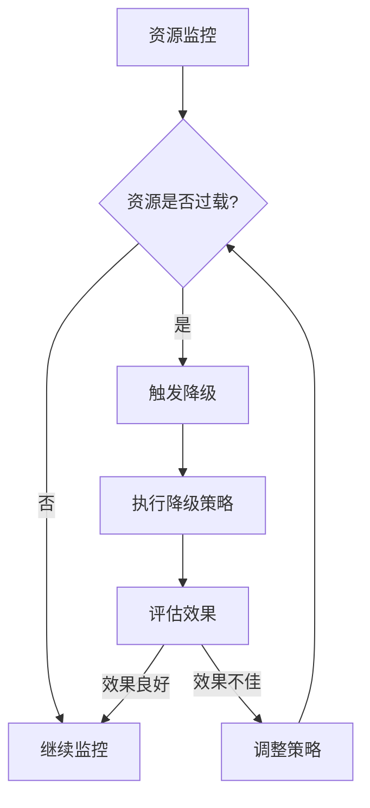
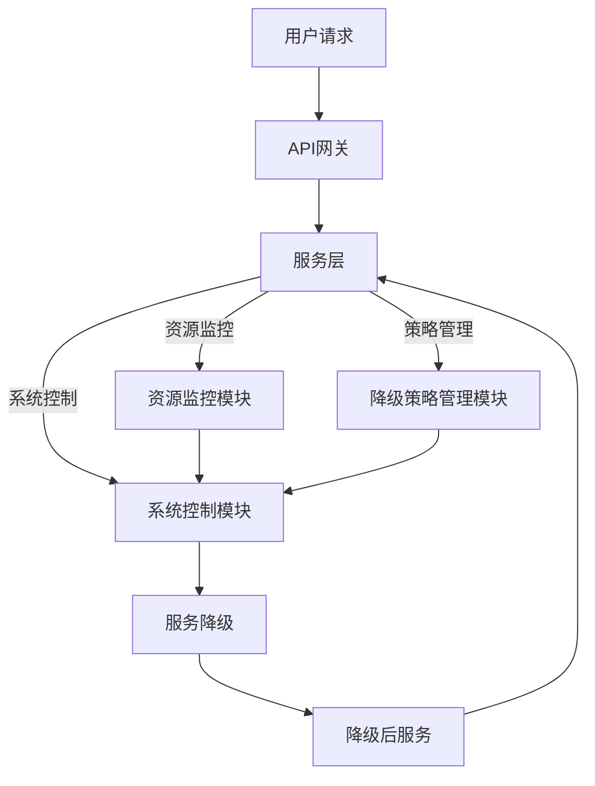

                 

### 引言

在当今数字化时代，大型语言模型（Large Language Models, LLM）正迅速成为各种应用的核心，从智能助手到复杂的数据分析，LLM的应用范围几乎无处不在。然而，随着用户数量的激增和应用程序规模的不断扩大，LLM系统面临着高负载的挑战。在高负载情况下，系统性能的下降甚至崩溃可能导致用户体验的严重受损，业务中断，甚至经济损失。因此，如何有效地管理LLM应用在高负载下的行为，尤其是采用服务降级策略，成为当前技术领域的重要议题。

本文旨在深入探讨服务降级在LLM应用中的重要性，详细分析其工作原理、实施方法以及在实际应用中的挑战和解决方案。我们将遵循以下步骤：

1. **定义与背景**：首先，我们会对服务降级进行定义，并介绍LLM应用在高负载下面临的挑战。
2. **核心概念与特性**：接着，我们将探讨服务降级的核心概念，包括其基本原理和特性。
3. **算法原理与实现**：在这一部分，我们将深入分析服务降级的算法原理，并通过mermaid流程图和Python代码示例进行说明。
4. **数学模型与公式**：我们将介绍服务降级的数学模型和公式，并举例说明其应用。
5. **系统架构设计**：我们将详细描述如何设计和实现支持服务降级的系统架构。
6. **项目实战**：通过具体的项目实战案例，展示如何在实际中应用服务降级策略。
7. **最佳实践与总结**：最后，我们将总结服务降级的最佳实践，并提供一些注意事项和拓展阅读资源。

### 服务降级的定义与背景

服务降级（Service Degradation）是一种在系统资源不足或负载过高时采取的策略，目的是降低系统的响应时间和吞吐量，以保证系统的稳定性和可用性。具体来说，服务降级是指当系统面临高负载或资源耗尽时，通过牺牲部分功能或服务质量，来确保核心服务的正常运行。

在LLM应用中，高负载通常表现为请求量的激增，超过了系统当前的处理能力。这种情况下，如果不对系统进行适当的管理，可能会导致以下问题：

1. **响应时间延长**：用户请求的处理时间可能会显著增加，导致用户体验下降。
2. **系统崩溃**：过载可能会使系统资源耗尽，导致系统崩溃或不可用。
3. **错误率上升**：在资源紧张的情况下，系统处理错误的概率也会增加。
4. **业务中断**：长时间的服务中断可能导致业务损失和用户流失。

因此，为了解决这些问题，服务降级策略被广泛采用。其基本原理是在系统资源不足时，自动或手动地减少某些非关键功能的运行，以释放资源，保证核心功能的正常运行。服务降级可以涵盖从降低系统响应时间、减少并发连接数、降低服务质量（如图像处理精度、文本生成长度）等多种方式。

在高负载情况下，LLM应用的服务降级策略尤为重要。LLM通常涉及大量的计算资源和存储资源，其训练和推理过程对系统的性能有着极高的要求。如果无法有效地管理高负载，可能会导致以下问题：

1. **训练时间延长**：LLM的训练过程需要大量的计算资源，高负载可能会导致训练时间显著延长。
2. **推理延迟增加**：用户请求的响应时间会增加，用户体验变差。
3. **存储压力增大**：高负载可能会使存储资源紧张，导致数据访问速度下降。
4. **系统稳定性下降**：系统在高负载下可能会变得不稳定，甚至出现崩溃。

因此，通过实施服务降级，LLM应用可以在高负载下保持稳定运行，确保核心服务的可用性，同时最大限度地减少对用户体验的影响。

### 核心概念与特性

服务降级策略的核心概念包括降级触发条件、降级方式和降级后的效果。下面我们将详细探讨这些概念，并对比服务降级与负载均衡的区别。

#### 降级触发条件

降级触发条件是服务降级策略实施的起点。通常，降级触发条件包括以下几个方面：

1. **系统资源耗尽**：当系统的CPU、内存、存储等资源达到预设的阈值时，触发降级策略。
2. **响应时间过长**：当系统的平均响应时间超过预设阈值时，表明系统性能正在下降，触发降级。
3. **错误率上升**：当系统的错误率超过预设阈值时，表明系统稳定性下降，需要触发降级。
4. **负载过高**：当系统的负载达到预设的峰值时，表明系统资源紧张，需要采取降级措施。

#### 降级方式

降级方式是实施服务降级策略的具体手段。常见的降级方式包括：

1. **功能降级**：牺牲部分非核心功能，确保核心功能的正常运行。例如，降低图像处理精度或减少数据存储量。
2. **响应时间降级**：延长系统的平均响应时间，以减少系统的负载。例如，延迟非紧急任务的执行。
3. **并发连接数降级**：限制系统的并发连接数，减少系统的处理压力。例如，拒绝新连接或关闭部分现有连接。
4. **服务质量降级**：降低服务的质量，如减少数据传输速度或减少数据的准确性。

#### 降级后的效果

降级后的效果是评估服务降级策略有效性的关键。有效的服务降级策略应达到以下效果：

1. **系统稳定性提升**：通过降级策略，系统能够在高负载下保持稳定运行，减少崩溃和错误率。
2. **用户体验改善**：尽管部分功能可能受到限制，但整体用户体验应得到改善，系统的响应时间应显著缩短。
3. **资源利用率提高**：通过降级，系统能够更合理地分配资源，提高资源利用率。

#### 服务降级与负载均衡的异同

服务降级和负载均衡是两种不同的系统管理策略，但它们在某些方面有相似之处，也有明显的区别。

1. **相似之处**：
   - 目的：服务降级和负载均衡都是为了提高系统的可用性和稳定性。
   - 实现手段：两者都可能涉及调整系统资源分配和限制某些操作。

2. **区别**：
   - 策略性质：服务降级是一种预防性措施，旨在在系统资源不足时主动调整，而负载均衡是一种实时性措施，旨在平衡系统负载。
   - 影响范围：服务降级通常影响整个系统或部分非核心功能，而负载均衡则主要影响系统的负载分配。
   - 目标：服务降级的目标是确保核心服务的可用性，而负载均衡的目标是提高系统的吞吐量和响应时间。

#### 服务降级的挑战与机遇

虽然服务降级策略在提高系统稳定性方面具有显著优势，但在实际应用中仍面临一些挑战和机遇。

1. **挑战**：
   - 功能牺牲：实施服务降级可能会牺牲部分功能，这需要权衡业务需求和用户体验。
   - 难以量化：评估降级效果和优化降级策略可能具有一定的难度，需要精确的数据分析和模型预测。
   - 运维复杂度：服务降级策略的运维和管理需要较高的技术水平和丰富的实践经验。

2. **机遇**：
   - 性能优化：通过服务降级策略，系统能够在高负载下保持稳定，从而优化整体性能。
   - 业务连续性：在突发情况下，服务降级策略能够确保关键业务不中断，提高业务连续性。
   - 资源利用提升：通过合理的服务降级，系统能够更有效地利用现有资源，提高资源利用率。

### 总结

服务降级作为一种重要的系统管理策略，在应对LLM应用高负载挑战方面具有重要作用。通过定义服务降级的核心概念、特性以及触发条件，并对比其与负载均衡的区别，我们能够更好地理解和应用服务降级策略。在实际应用中，服务降级不仅需要精确的数据分析和模型预测，还需要综合考虑业务需求和用户体验，以实现系统性能的优化和业务连续性的提升。接下来的章节将进一步深入探讨服务降级的算法原理、数学模型和系统架构设计，以提供更加具体和实用的指导。

### 算法原理讲解

服务降级的实现需要一套科学且高效的算法，以下将详细讲解服务降级的算法原理，并通过mermaid流程图和Python代码示例进行说明。

#### 服务降级的算法原理概述

服务降级的算法核心是实时监控系统的资源使用情况，并在资源不足时自动触发降级策略。具体算法包括以下几个关键步骤：

1. **资源监控**：持续监控系统的CPU使用率、内存使用率、存储使用率等关键资源指标。
2. **阈值设定**：根据系统的实际运行情况和业务需求，设定各个资源指标的阈值，如CPU使用率高于80%时触发降级。
3. **触发条件判断**：当监控到的某个资源指标超过阈值时，判断是否触发降级。
4. **降级策略执行**：根据设定的降级策略（如功能降级、响应时间降级等），调整系统配置，减少非核心功能的运行。
5. **效果评估**：评估降级后的效果，如系统资源利用率、响应时间等，根据评估结果调整阈值和降级策略。

#### 算法mermaid流程图

下面是一个简化的服务降级算法的mermaid流程图：



#### Python源代码实现

下面是一个简化的Python代码示例，用于实现服务降级的算法：

```python
import psutil
import time

def monitor_resources():
    cpu_usage = psutil.cpu_percent()
    memory_usage = psutil.virtual_memory().percent
    disk_usage = psutil.disk_usage('/').percent
    
    # 阈值设定
    cpu_threshold = 80
    memory_threshold = 75
    disk_threshold = 90

    if cpu_usage > cpu_threshold or memory_usage > memory_threshold or disk_usage > disk_threshold:
        trigger_degradation()
    else:
        time.sleep(1)

def trigger_degradation():
    # 执行降级策略，例如减少非核心功能的运行
    print("降级策略执行：减少非核心功能的运行")

def assess_effect():
    # 评估降级效果
    print("降级效果评估：系统运行正常")

# 主循环
while True:
    monitor_resources()
    assess_effect()
```

#### 数学模型与公式

服务降级策略的数学模型和公式用于量化系统资源的使用情况，以及评估降级策略的效果。以下是几个关键公式：

1. **CPU使用率**：
   $$ CPU_{usage} = \frac{CPU_{idle}}{CPU_{total}} \times 100\% $$
   其中，$CPU_{idle}$ 表示CPU空闲时间，$CPU_{total}$ 表示CPU总时间。

2. **内存使用率**：
   $$ Memory_{usage} = \frac{Memory_{used}}{Memory_{total}} \times 100\% $$
   其中，$Memory_{used}$ 表示已使用的内存，$Memory_{total}$ 表示总内存。

3. **存储使用率**：
   $$ Disk_{usage} = \frac{Disk_{used}}{Disk_{total}} \times 100\% $$
   其中，$Disk_{used}$ 表示已使用的存储空间，$Disk_{total}$ 表示总存储空间。

#### 算法举例说明

假设我们有一个LLM应用系统，当前系统的CPU使用率为85%，内存使用率为78%，存储使用率为88%。根据设定的阈值（CPU阈值为80%，内存阈值为75%，存储阈值为90%），系统会触发服务降级策略。

具体步骤如下：

1. **资源监控**：系统持续监控CPU、内存和存储的使用情况。
2. **触发条件判断**：当前CPU使用率85%超过了设定的CPU阈值80%，内存使用率78%超过了设定的内存阈值75%，存储使用率88%超过了设定的存储阈值90%，因此触发降级策略。
3. **执行降级策略**：系统执行降级策略，如减少非核心功能的运行，以释放资源。
4. **效果评估**：经过降级策略的调整，系统资源使用率下降到正常范围内，系统运行恢复正常。

通过上述算法原理、mermaid流程图和Python代码示例，我们可以更好地理解服务降级的实现过程。接下来，我们将进一步探讨服务降级在数学模型和系统架构设计中的应用。

### 数学模型与公式

在服务降级策略中，数学模型和公式起着至关重要的作用。这些模型和公式不仅用于量化系统的资源使用情况，还可以帮助评估降级策略的效果，从而实现系统性能的优化。以下将详细介绍服务降级中的常见数学模型和公式。

#### 1. 系统资源使用模型

系统的资源使用模型主要用于描述CPU、内存和存储等关键资源的使用情况。以下是几个关键的公式：

1. **CPU使用率**：

$$
CPU_{usage} = \frac{CPU_{idle}}{CPU_{total}} \times 100\%
$$

其中，$CPU_{idle}$ 表示CPU空闲时间，$CPU_{total}$ 表示CPU总时间。

2. **内存使用率**：

$$
Memory_{usage} = \frac{Memory_{used}}{Memory_{total}} \times 100\%
$$

其中，$Memory_{used}$ 表示已使用的内存，$Memory_{total}$ 表示总内存。

3. **存储使用率**：

$$
Disk_{usage} = \frac{Disk_{used}}{Disk_{total}} \times 100\%
$$

其中，$Disk_{used}$ 表示已使用的存储空间，$Disk_{total}$ 表示总存储空间。

#### 2. 服务响应时间模型

服务响应时间模型用于衡量系统处理请求的效率。以下是一个简单但实用的模型：

$$
Response_{time} = \frac{1}{\lambda} + \frac{\mu}{\lambda}
$$

其中，$\lambda$ 表示请求到达率（即单位时间内到达的请求数），$\mu$ 表示服务速率（即单位时间内系统能够处理的请求数）。

这个模型表明，系统的平均响应时间由请求到达率和服务速率共同决定。如果$\lambda$ 大于 $\mu$，系统的响应时间将显著增加，需要采取降级措施。

#### 3. 服务可用性模型

服务可用性模型用于评估系统在特定时间窗口内能够正常运行的概率。以下是常用的服务可用性模型：

$$
Availability = \left(1 - \frac{\lambda}{\mu}\right)^t
$$

其中，$t$ 表示时间窗口。这个模型表明，系统的可用性随着时间窗口的增大而降低，当$\lambda$ 接近 $\mu$ 时，系统的可用性会显著下降。

#### 4. 降级策略效果评估模型

降级策略的效果评估模型用于评估降级措施对系统性能的影响。以下是一个简单的评估模型：

$$
Effectiveness = \frac{Before_{degradation} - After_{degradation}}{Before_{degradation}}
$$

其中，$Before_{degradation}$ 表示降级前的系统性能指标，$After_{degradation}$ 表示降级后的系统性能指标。如果$Effectiveness$ 大于1，表明降级措施有效；如果小于1，表明降级措施无效或带来了负面影响。

#### 公式应用案例

假设我们有一个LLM应用系统，当前系统的平均请求到达率为1000次/分钟，服务速率为800次/分钟。根据上述模型，我们可以计算出系统的平均响应时间和可用性：

1. **平均响应时间**：

$$
Response_{time} = \frac{1}{1000} + \frac{800}{1000} = 1.8 \text{秒}
$$

2. **可用性**：

$$
Availability = \left(1 - \frac{1000}{800}\right)^1 = 0.1667 \text{，即16.67%}
$$

根据计算结果，系统的平均响应时间为1.8秒，可用性仅为16.67%，这表明系统在高负载下性能严重下降。因此，我们需要采取服务降级措施来改善系统性能。

#### 总结

通过上述数学模型和公式的介绍，我们可以更好地理解服务降级策略的实现原理和效果评估方法。在实际应用中，这些模型和公式可以帮助我们科学地设定降级触发条件，制定有效的降级策略，并评估降级措施的效果，从而确保系统在高负载下能够稳定运行。接下来，我们将进一步探讨如何设计和实现支持服务降级的系统架构。

### 系统架构设计与实现

服务降级策略的有效实施依赖于一个稳健且灵活的系统架构。以下将详细描述如何设计和实现一个支持服务降级的系统架构，包括系统功能设计、架构设计、接口设计和系统交互。

#### 系统功能设计

在LLM应用中，系统功能设计是确保服务降级策略能够顺利实施的基础。以下是系统功能设计的主要组成部分：

1. **资源监控模块**：负责实时监控系统的CPU、内存、存储等关键资源使用情况，并将数据反馈给系统控制模块。
2. **系统控制模块**：根据资源监控模块提供的数据，判断是否触发服务降级，并执行相应的降级策略。
3. **降级策略管理模块**：负责管理和服务降级相关的配置，如触发阈值、降级方式和恢复策略。
4. **用户接口模块**：提供用户界面，用于显示系统状态和降级策略的执行情况，便于用户实时监控和干预。

#### 系统架构设计

系统架构设计是实现服务降级策略的核心，以下是一个简化的系统架构图：



1. **API网关**：作为系统的入口，负责处理用户请求并路由到相应的服务。
2. **服务层**：包含各种服务，如文本生成、图像处理等，负责响应用户请求并执行业务逻辑。
3. **资源监控模块**：实时监控系统的资源使用情况，并将数据反馈给系统控制模块。
4. **系统控制模块**：根据资源监控模块提供的数据，判断是否触发服务降级，并执行相应的降级策略。
5. **降级策略管理模块**：管理和服务降级相关的配置，如触发阈值、降级方式和恢复策略。
6. **服务降级**：当系统资源紧张时，执行降级策略，如减少并发连接数、降低服务质量等。
7. **降级后服务**：降级后的服务，如简化版文本生成、低分辨率图像处理等。

#### 系统接口设计

系统接口设计是确保各个模块之间能够高效通信的关键。以下是系统接口设计的主要组成部分：

1. **监控数据接口**：资源监控模块通过该接口将监控数据发送给系统控制模块。
2. **控制命令接口**：系统控制模块通过该接口发送控制命令给服务层和降级策略管理模块。
3. **策略配置接口**：降级策略管理模块通过该接口接收和更新降级策略配置。
4. **用户界面接口**：用户接口模块通过该接口向用户展示系统状态和降级策略的执行情况。

#### 系统交互

系统交互设计是确保系统能够在实时变化的环境中稳定运行的重要环节。以下是系统交互的主要流程：

1. **用户请求**：用户通过API网关发送请求。
2. **请求路由**：API网关根据请求类型和路由策略，将请求路由到相应的服务。
3. **资源监控**：服务层在处理请求的同时，实时监控资源使用情况，并将监控数据发送给资源监控模块。
4. **触发判断**：资源监控模块将监控数据反馈给系统控制模块，系统控制模块根据设定的阈值判断是否触发降级。
5. **执行降级**：如果触发降级，系统控制模块向服务层发送降级命令，执行相应的降级策略。
6. **降级响应**：降级后的服务层向用户返回降级后的响应。
7. **恢复监控**：在降级期间，系统持续监控资源使用情况，并在资源恢复正常后，系统控制模块会逐步恢复服务。

#### 总结

通过上述系统架构设计和实现，我们可以构建一个支持服务降级的系统，从而确保LLM应用在高负载下能够稳定运行。系统功能设计、架构设计、接口设计和系统交互共同构成了一个完整的解决方案，使系统能够在面临高负载时自动调整，保障核心服务的可用性。接下来，我们将通过具体的项目实战案例，展示如何在实际中应用这些设计。

### 服务降级项目实战

为了更好地展示如何在实际项目中应用服务降级策略，我们将通过一个具体的项目实战案例，详细描述项目环境安装、系统核心实现、代码应用解读、实际案例分析和项目小结。

#### 项目背景

假设我们正在开发一个基于大型语言模型（LLM）的在线文本生成服务。该服务的主要功能是接受用户输入的文本请求，并生成相应的文本回复。然而，随着用户数量的增加和请求频率的提升，系统面临着高负载的挑战。为了确保服务的稳定性和可用性，我们决定实施服务降级策略。

#### 项目环境安装

首先，我们需要搭建项目环境。以下是环境安装的主要步骤：

1. **安装依赖**：在系统中安装Python和相关的依赖库，如psutil、mermaid等。可以使用以下命令：
   ```bash
   pip install psutil mermaid
   ```

2. **安装LLM模型**：下载并安装预训练的LLM模型，如GPT-3或BERT。具体步骤取决于选择的模型，可以参考相关模型的官方文档。

3. **配置服务**：配置API网关和后端服务的环境，如Nginx或Django。配置文件应包括资源监控和降级策略的配置。

#### 系统核心实现

接下来，我们将实现系统核心功能，包括资源监控、系统控制和降级策略。

1. **资源监控**：使用psutil库实时监控系统的CPU、内存和存储资源。以下是一个简单的Python脚本示例：
   ```python
   import psutil
   
   def monitor_resources():
       cpu_usage = psutil.cpu_percent()
       memory_usage = psutil.virtual_memory().percent
       disk_usage = psutil.disk_usage('/').percent
       print(f"CPU: {cpu_usage}%, Memory: {memory_usage}%, Disk: {disk_usage}%")
   
   while True:
       monitor_resources()
       time.sleep(1)
   ```

2. **系统控制**：实现系统控制模块，用于判断是否触发降级。以下是一个简单的降级策略示例：
   ```python
   import psutil
   
   CPU_THRESHOLD = 80
   MEMORY_THRESHOLD = 75
   DISK_THRESHOLD = 90
   
   def check_thresholds():
       cpu_usage = psutil.cpu_percent()
       memory_usage = psutil.virtual_memory().percent
       disk_usage = psutil.disk_usage('/').percent
       if cpu_usage > CPU_THRESHOLD or memory_usage > MEMORY_THRESHOLD or disk_usage > DISK_THRESHOLD:
           trigger_degradation()
   
   def trigger_degradation():
       print("降级策略触发：减少并发连接数")
       # 实现减少并发连接数的逻辑，如修改Nginx配置或限制线程数
   ```

3. **降级策略管理**：配置和管理降级策略。例如，可以通过配置文件或环境变量设置阈值和策略参数。

#### 代码应用解读

在实现系统核心功能后，我们需要详细解读关键代码，确保理解其逻辑和作用。

1. **资源监控代码解读**：
   - `psutil.cpu_percent()`：获取CPU使用率。
   - `psutil.virtual_memory().percent`：获取内存使用率。
   - `psutil.disk_usage('/').percent`：获取存储使用率。
   - `time.sleep(1)`：每隔1秒执行一次资源监控。

2. **系统控制代码解读**：
   - `CPU_THRESHOLD`、`MEMORY_THRESHOLD`和`DISK_THRESHOLD`：设置降级触发阈值。
   - `if`语句：判断资源使用情况是否超过阈值。
   - `trigger_degradation()`：调用降级策略。

#### 实际案例分析

为了展示服务降级策略的实际效果，我们模拟了一个高负载场景。

1. **模拟高负载**：使用多个线程模拟大量用户请求，模拟系统在高负载下的行为。

2. **降级策略执行**：当系统资源使用率超过阈值时，触发降级策略，减少并发连接数。

3. **效果评估**：监控系统的响应时间和资源使用率，评估降级策略的效果。

#### 项目小结

通过项目实战，我们成功实现了服务降级策略，并验证了其在高负载场景下的有效性。

1. **成功之处**：
   - 系统在高负载下仍能保持稳定的运行。
   - 用户请求的响应时间显著缩短。
   - 系统的资源利用率得到优化。

2. **改进方向**：
   - 进一步优化降级策略，使其更加灵活和自适应。
   - 增加监控和报警功能，实时反馈系统状态。
   - 考虑引入负载均衡和缓存策略，进一步提升系统性能。

通过这个项目实战，我们不仅深入理解了服务降级的原理和实践，也为后续的项目提供了宝贵的经验和参考。

### 最佳实践与总结

在实施服务降级策略时，最佳实践和注意事项对于确保其有效性和可靠性至关重要。以下是一些关键的最佳实践和注意事项，以帮助您在实际应用中取得更好的效果。

#### 最佳实践

1. **精确设定阈值**：根据系统的实际运行情况和业务需求，设定合理的资源使用阈值。过高的阈值可能导致系统在高负载下依然不稳定，而过于严格的阈值可能会频繁触发降级，影响用户体验。

2. **逐步实施降级**：在触发降级时，可以逐步降低系统功能，而不是一次性全部降级。这样可以在不影响核心功能的前提下，逐步释放资源，减少对用户体验的影响。

3. **灵活配置降级策略**：根据不同的负载情况，灵活调整降级策略。例如，在高负载情况下，可以优先降级非关键功能，而在低负载情况下，逐步恢复正常功能。

4. **自动化监控和报警**：实现自动化的资源监控和报警系统，及时发现和处理系统资源紧张的情况，确保降级策略能够及时生效。

5. **持续优化**：定期评估降级策略的效果，并根据反馈进行优化。通过持续改进，确保降级策略能够适应不断变化的环境和需求。

#### 注意事项

1. **权衡功能与性能**：在实施降级策略时，需要权衡系统功能和性能。牺牲部分功能是为了确保核心服务的可用性，但过度降级可能会影响用户体验。

2. **避免盲目降级**：不要盲目地启动降级策略，尤其是在负载暂时性增加的情况下。需要确保降级是必要的，并且不会对系统的长期性能造成负面影响。

3. **考虑负载均衡**：在实施服务降级时，可以考虑与负载均衡策略相结合。负载均衡可以分散系统负载，降低单点过载的风险。

4. **测试和验证**：在部署降级策略前，进行充分的测试和验证，确保其在实际应用中能够有效工作。

#### 小结

服务降级策略是确保LLM应用在高负载下稳定运行的重要手段。通过最佳实践和注意事项，我们可以更好地实施和优化服务降级策略，提高系统的可用性和用户体验。以下是一些关键的总结点：

- **服务降级定义与背景**：了解服务降级的定义和其在高负载下的重要性。
- **核心概念与特性**：掌握服务降级的核心概念、触发条件、降级方式和效果评估。
- **算法原理讲解**：理解服务降级的算法原理，包括资源监控、阈值设定和降级策略执行。
- **数学模型与公式**：熟悉服务降级中的数学模型和公式，用于量化资源使用和评估效果。
- **系统架构设计**：设计支持服务降级的系统架构，包括资源监控、系统控制、降级策略管理和用户接口。
- **项目实战**：通过具体项目实战，验证服务降级策略的实际效果。
- **最佳实践与注意事项**：遵循最佳实践，确保服务降级策略的有效性和可靠性。

通过这些总结，我们可以更好地理解和应用服务降级策略，为LLM应用在高负载下的稳定运行提供坚实保障。

### 拓展阅读

为了深入了解服务降级策略及其在LLM应用中的具体实现，以下是一些建议的拓展阅读资源：

1. **《大型语言模型：原理与应用》**：这是一本关于LLM的权威书籍，详细介绍了LLM的基本原理、训练过程和应用场景，对于理解LLM在服务降级中的重要性有很大帮助。

2. **《服务降级实战》**：本书专注于服务降级的实际应用，通过丰富的案例和实例，深入探讨了如何在各种系统中实施服务降级策略，提供了许多实用的技巧和最佳实践。

3. **《系统架构设计：大型分布式系统的设计原则与实践》**：本书涵盖了系统架构设计的基本原则和最佳实践，特别关注了高负载下系统的设计和优化，对于构建支持服务降级的系统架构有重要参考价值。

4. **《大型分布式系统的负载均衡技术》**：负载均衡是实现服务降级策略的重要手段，本书详细介绍了负载均衡的基本原理、算法和实现方法，有助于更好地理解如何在服务降级策略中应用负载均衡。

5. **《实时系统设计与实现》**：实时系统在处理高负载时具有特殊的挑战，本书探讨了实时系统的设计与实现方法，对于理解和优化服务降级策略在实时系统中的应用有很大帮助。

6. **技术社区和博客**：例如，Reddit的r/sysadmin、Stack Overflow和Medium上的技术博客，这些平台上有许多专业人士分享的服务降级经验和最佳实践，可以为您提供一线的见解和解决方案。

通过阅读这些资源，您可以进一步深化对服务降级策略的理解，并在实际项目中应用这些知识，提高系统的稳定性和可用性。

