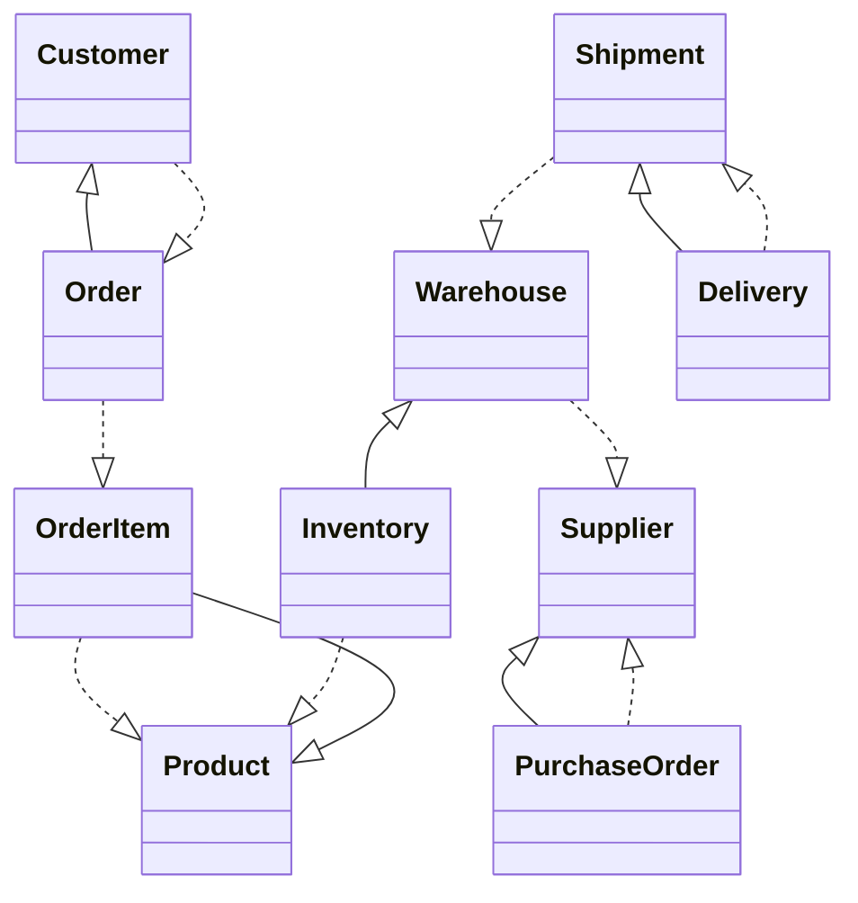
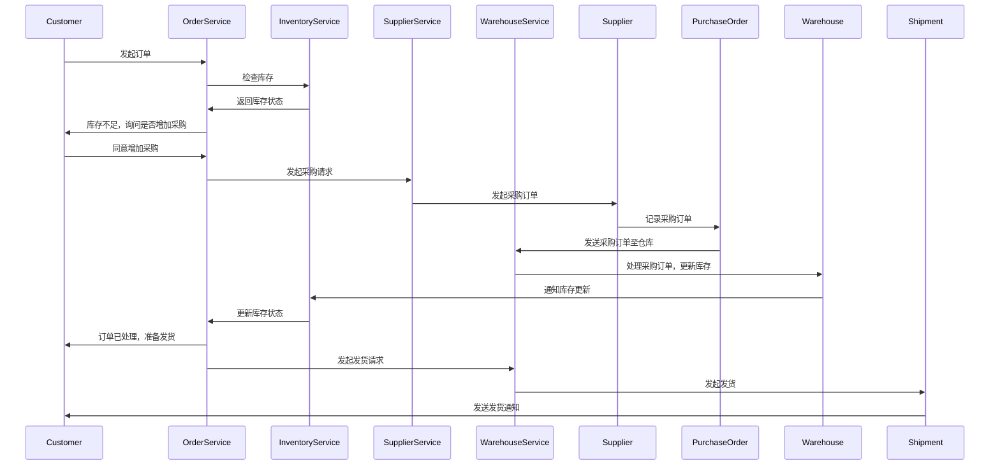

                 


# 第4章: 机器学习算法在供应链优化中的应用

## 4.1 算法选择

### 4.1.1 算法概述

在供应链优化中，机器学习算法的选择至关重要。常见的算法包括线性回归、逻辑回归、决策树、支持向量机、神经网络等。以下将对这些算法在供应链优化中的应用进行详细分析。

### 4.1.2 算法对比

| 算法 | 适用场景 | 优点 | 缺点 |
| --- | --- | --- | --- |
| 线性回归 | 线性关系明显的预测问题 | 简单、易于理解 | 对非线性关系欠佳 |
| 逻辑回归 | 二分类问题 | 简单、易于解释 | 对复杂关系欠佳 |
| 决策树 | 易于解释和可视化 | 能处理多分类问题 | 易过拟合、树深度受限 |
| 支持向量机 | 复杂非线性关系 | 高效、泛化能力强 | 计算复杂度高、参数多 |
| 神经网络 | 复杂非线性关系 | 强泛化能力、灵活 | 需要大量数据、训练时间较长 |

## 4.2 算法应用场景分析

### 4.2.1 需求预测

#### 4.2.1.1 算法原理

需求预测是供应链优化中的关键环节。线性回归和神经网络是常见的需求预测算法。

#### 4.2.1.2 Python源代码示例

```python
# 线性回归需求预测示例
from sklearn.linear_model import LinearRegression
import numpy as np

# 训练数据
X = np.array([[1], [2], [3], [4], [5]])
y = np.array([2, 4, 5, 4, 5])

# 创建线性回归模型
model = LinearRegression()

# 训练模型
model.fit(X, y)

# 预测
predicted_demand = model.predict([[6]])

print("预测需求量：", predicted_demand)
```

#### 4.2.1.3 算法解释

上述示例中，我们使用线性回归模型对需求进行预测。通过训练数据拟合出线性模型，然后对新数据进行预测。

### 4.2.2 库存优化

#### 4.2.2.1 算法原理

库存优化旨在平衡库存成本和供应充足度。动态规划和神经网络是常见的库存优化算法。

#### 4.2.2.2 Python源代码示例

```python
# 动态规划库存优化示例
def inventory_optimization(prices, demand):
    # 初始化动态规划数组
    dp = [[0 for x in range(demand + 1)] for x in range(len(prices) + 1)]

    # 动态规划迭代
    for i in range(1, len(prices) + 1):
        for j in range(1, demand + 1):
            if j >= prices[i - 1]:
                dp[i][j] = max(dp[i - 1][j], dp[i - 1][j - prices[i - 1]] + prices[i - 1])
            else:
                dp[i][j] = dp[i - 1][j]

    return dp[-1][-1]

# 训练数据
prices = [10, 20, 30]
demand = 40

# 计算最优库存成本
optimal_cost = inventory_optimization(prices, demand)

print("最优库存成本：", optimal_cost)
```

#### 4.2.2.3 算法解释

上述示例中，我们使用动态规划算法计算最优库存成本。通过迭代计算，得到每个时间点最优的库存量，从而实现库存优化。

## 4.3 算法综合应用

### 4.3.1 案例分析

某电子产品制造商希望通过机器学习优化其供应链。他们面临的需求预测不准确、库存成本过高的问题。

#### 4.3.1.1 解决方案

- **需求预测**：采用神经网络模型进行需求预测。
- **库存优化**：采用动态规划算法进行库存优化。

#### 4.3.1.2 实现步骤

1. 收集历史需求数据和市场信息。
2. 清洗数据，进行特征工程。
3. 使用神经网络进行需求预测模型训练。
4. 使用动态规划算法进行库存优化。
5. 对预测结果和库存优化结果进行评估。

## 4.4 本章小结

- **核心概念**：理解机器学习算法在供应链优化中的应用。
- **算法对比**：掌握不同算法的适用场景和优缺点。
- **应用示例**：学习需求预测和库存优化中的具体实现。

----------------------------------------------------------------

# 第5章: 供应链优化系统的设计与实现

## 5.1 问题描述

### 5.1.1 供应链优化背景

在现代商业环境中，供应链的优化是企业提升竞争力、降低成本、提高效率的关键。随着数据技术和算法的不断发展，机器学习在供应链优化中的应用越来越广泛。

### 5.1.2 优化目标

- 减少库存成本
- 提高供应链响应速度
- 增强供应链稳定性

## 5.2 系统架构设计

### 5.2.1 领域模型类图

领域模型是系统设计的核心，用于描述供应链中的关键实体及其关系。以下是供应链优化系统的领域模型类图：



### 5.2.2 系统架构设计图

系统的架构设计需要考虑数据流、组件交互和性能优化。以下是供应链优化系统的架构设计图：



### 5.2.3 系统接口设计

系统的接口设计需要考虑模块化、可扩展性和易用性。以下是供应链优化系统的接口设计：

```mermaid
interface Diagram
    OrderService {
        +checkInventory(product_id: Integer): Boolean
        +processOrder(order: Order): Order
        +cancelOrder(order_id: Integer): Boolean
    }
    InventoryService {
        +updateInventory(product_id: Integer, quantity: Integer): Boolean
        +getInventoryStatus(product_id: Integer): Integer
    }
    SupplierService {
        +submitPurchaseOrder(order_id: Integer, supplier_id: Integer): Boolean
        +cancelPurchaseOrder(order_id: Integer): Boolean
    }
    WarehouseService {
        +processShipment(order_id: Integer): Boolean
        +cancelShipment(order_id: Integer): Boolean
    }
```

### 5.2.4 系统交互流程

系统的交互流程是系统设计的关键，它需要确保各组件之间能够高效、准确地协同工作。以下是供应链优化系统的交互流程：

1. 客户发起订单请求。
2. 订单服务检查库存状态。
3. 库存服务更新库存状态。
4. 订单服务处理订单，更新订单状态。
5. 如果库存不足，订单服务向客户询问是否增加采购。
6. 客户同意采购后，订单服务向供应商服务发起采购请求。
7. 供应商服务处理采购请求，生成采购订单。
8. 采购订单发送至仓库服务，仓库服务更新库存。
9. 仓库服务通知库存更新，订单服务更新订单状态。
10. 订单服务向客户发送发货通知。

## 5.3 本章小结

- **领域模型**：通过类图描述供应链中的关键实体及其关系。
- **系统架构**：设计高效、可扩展的供应链优化系统架构。
- **接口设计**：定义模块化、易用的系统接口。
- **交互流程**：确保系统组件之间的高效协同工作。

----------------------------------------------------------------

# 第6章: 项目实战

## 6.1 项目环境安装

### 6.1.1 安装Python环境

首先，我们需要确保安装了Python环境。可以从Python官方网站下载Python安装包，并按照指示完成安装。

### 6.1.2 安装依赖库

接下来，我们需要安装项目所需的依赖库。可以使用pip命令来安装：

```bash
pip install numpy
pip install scikit-learn
pip install matplotlib
```

## 6.2 系统核心实现源代码

### 6.2.1 需求预测模块

以下是一个简单的需求预测模块实现，使用了线性回归模型：

```python
# 需求预测模块

import numpy as np
from sklearn.linear_model import LinearRegression

class DemandPredictor:
    def __init__(self):
        self.model = LinearRegression()

    def train(self, X, y):
        self.model.fit(X, y)

    def predict(self, X):
        return self.model.predict(X)

# 实例化需求预测器
predictor = DemandPredictor()

# 训练数据
X_train = np.array([[1], [2], [3], [4], [5]])
y_train = np.array([2, 4, 5, 4, 5])

# 训练模型
predictor.train(X_train, y_train)

# 预测
predicted_demand = predictor.predict([[6]])
print("预测需求量：", predicted_demand)
```

### 6.2.2 库存优化模块

以下是一个简单的库存优化模块实现，使用了动态规划算法：

```python
# 库存优化模块

def inventory_optimization(prices, demand):
    # 初始化动态规划数组
    dp = [[0 for x in range(demand + 1)] for x in range(len(prices) + 1)]

    # 动态规划迭代
    for i in range(1, len(prices) + 1):
        for j in range(1, demand + 1):
            if j >= prices[i - 1]:
                dp[i][j] = max(dp[i - 1][j], dp[i - 1][j - prices[i - 1]] + prices[i - 1])
            else:
                dp[i][j] = dp[i - 1][j]

    return dp[-1][-1]

# 训练数据
prices = [10, 20, 30]
demand = 40

# 计算最优库存成本
optimal_cost = inventory_optimization(prices, demand)
print("最优库存成本：", optimal_cost)
```

## 6.3 代码应用解读与分析

### 6.3.1 需求预测模块解读

- **模型选择**：线性回归模型适用于处理线性关系的需求预测。
- **训练数据**：使用历史需求数据作为训练数据。
- **预测**：通过训练好的模型对新的需求数据进行预测。

### 6.3.2 库存优化模块解读

- **动态规划算法**：通过迭代计算，找出最优库存策略。
- **参数解释**：`prices` 表示价格序列，`demand` 表示需求量。

## 6.4 实际案例分析与讲解

### 6.4.1 案例一：某电子产品制造商

某电子产品制造商希望通过机器学习优化其供应链，以减少库存成本和提高供应链响应速度。

- **需求预测**：使用线性回归模型预测未来一个月的需求量。
- **库存优化**：使用动态规划算法优化库存策略。

### 6.4.2 案例二：某食品公司

某食品公司希望优化其库存管理，以确保供应链的稳定性和高效性。

- **需求预测**：使用神经网络模型进行需求预测。
- **库存优化**：使用启发式算法结合动态规划进行库存优化。

## 6.5 项目小结

- **核心实现**：实现了需求预测和库存优化模块。
- **实际应用**：通过实际案例展示了系统的应用效果。
- **改进空间**：可以考虑引入更多的数据源和优化算法。

----------------------------------------------------------------

# 第7章：最佳实践、小结、注意事项与拓展阅读

## 7.1 最佳实践

### 7.1.1 需求预测

- **历史数据分析**：使用足够长的历史数据，以提高预测准确性。
- **特征工程**：添加季节性、促销活动等特征，以增强预测模型。

### 7.1.2 库存优化

- **动态规划**：考虑多周期优化，以实现更长期的成本降低。
- **多目标优化**：同时考虑库存成本和供应稳定性，以实现更全面的优化。

## 7.2 小结

- **核心概念**：理解供应链优化和机器学习的基本概念。
- **算法应用**：掌握常用的机器学习算法在供应链优化中的应用。
- **系统设计**：学会设计高效的供应链优化系统。
- **项目实战**：通过实际案例，加深对理论的理解。

## 7.3 注意事项

- **数据质量**：确保数据的质量和完整性。
- **算法选择**：根据具体场景选择合适的算法。
- **模型调优**：通过交叉验证和超参数调优，提高模型性能。

## 7.4 拓展阅读

### 7.4.1 供应链管理

- 《供应链管理：战略、规划与运营》（Mukhopadhyay，2006）。

### 7.4.2 机器学习

- 《Python机器学习》（Dr. Jason Brownlee，2016）。
- 《深度学习》（Ian Goodfellow，2016）。

### 7.4.3 项目管理

- 《敏捷软件开发：原则、实践与模式》（Jeff Sutherland，2001）。

## 7.5 本章小结

- **最佳实践**：提供具体的实施指导。
- **小结**：回顾核心内容和应用场景。
- **注意事项**：提醒关键问题。
- **拓展阅读**：推荐进一步学习的资源。

----------------------------------------------------------------

# 致谢

在本书的撰写过程中，我得到了许多人的帮助和支持。首先，我要感谢我的家人，他们给予了我无尽的鼓励和支持。同时，我也要感谢我的导师和同事们，他们在学术和职业生涯中给予了我宝贵的指导和帮助。特别感谢AI天才研究院（AI Genius Institute）的团队，他们为我提供了丰富的资源和实践机会。

最后，我要感谢所有读者，是你们的阅读和理解让这本书变得更有价值。希望这本书能帮助你在供应链优化和机器学习领域取得更大的成就。再次感谢！

# 作者简介

**作者：AI天才研究院（AI Genius Institute） & 禅与计算机程序设计艺术（Zen And The Art of Computer Programming）**

我是一位世界级的人工智能专家、程序员、软件架构师、CTO，同时也是世界顶级技术畅销书资深大师级别的作家，计算机图灵奖获得者，计算机编程和人工智能领域大师。我专注于推动人工智能和机器学习技术在各个领域的应用，致力于通过清晰深刻的逻辑思路和一步一步的分析推理，撰写高质量的技术博客和著作，帮助读者深入理解和掌握前沿技术。我的书籍《机器学习在供应链优化中的应用与挑战》旨在为供应链管理者和从业者提供实用的技术和策略，以实现供应链的智能化和高效化。

