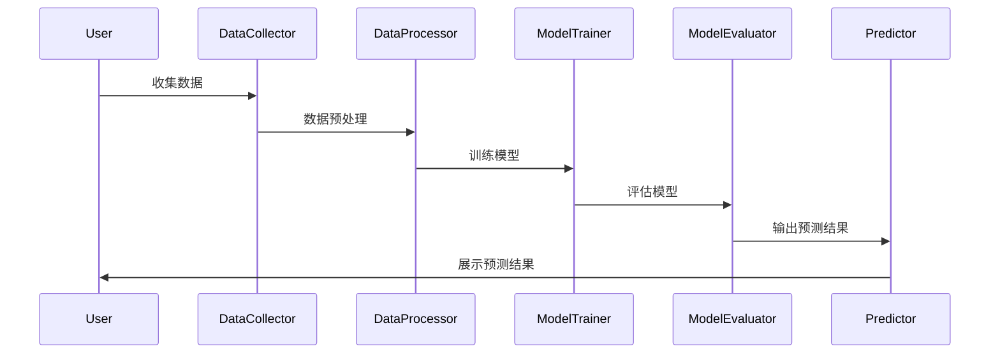
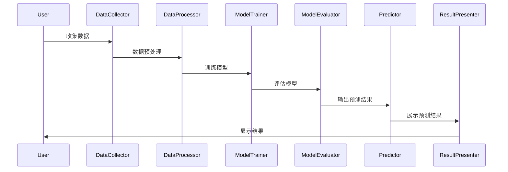

                 

# 机器学习在气候变化预测中的关键作用

关键词：气候变化，机器学习，预测模型，数据处理，算法原理，系统架构，项目实战

摘要：随着气候变化对全球环境和社会经济的影响日益加剧，准确预测气候变化趋势成为当务之急。机器学习作为一种强大的数据分析工具，已在气候预测领域展现出其关键作用。本文将详细探讨机器学习在气候变化预测中的应用，包括数据来源与处理、预测模型、模型评估与优化、算法原理与讲解、系统分析与架构设计以及项目实战等多个方面，帮助读者深入理解这一领域的核心概念和技术原理。

## 第一部分：问题背景与核心概念

### 第1章 问题背景

#### 1.1.1 气候变化的问题背景

气候变化是指地球大气层中温度、降水、风向等气象要素的长期变化。当前，全球气候变化已成为不争的事实。据国际气象组织的数据显示，自19世纪末以来，全球平均温度已上升了约1.1摄氏度，极端气候事件如热浪、干旱、洪涝等频率和强度均呈上升趋势。

#### 1.1.2 气候变化对人类社会的影响

气候变化对人类社会的影响是多方面的。农业生产受到严重威胁，粮食安全面临挑战；水资源分布不均，加剧了水资源的紧张程度；海平面上升威胁沿海城市的安全；气候变化还可能导致生物多样性的丧失，影响生态系统的稳定性。

#### 1.1.3 预测气候变化的重要性

准确预测气候变化趋势对于制定应对策略、减缓气候变化影响具有重要意义。通过预测，我们可以提前了解未来的气候变化趋势，为政策制定提供科学依据，从而采取有效的措施减缓气候变化的影响。

### 1.2 机器学习与气候变化预测

#### 1.2.1 机器学习的定义与原理

机器学习是人工智能的一个分支，旨在通过算法从数据中自动学习和提取知识。其基本原理是创建数学模型，通过大量数据训练模型，使模型能够对未知数据进行预测。

#### 1.2.2 机器学习在气候研究中的应用

机器学习在气候研究中发挥着重要作用，如用于预测气候变化趋势、评估气候变化影响、优化碳排放策略等。通过机器学习算法，研究人员能够从复杂的气候数据中提取有价值的信息，为气候预测提供有力支持。

#### 1.2.3 机器学习与气候变化预测的优势与局限性

机器学习在气候变化预测中具有以下优势：能够处理大量复杂数据、提高预测精度、适应性强。然而，机器学习也存在局限性，如数据质量对预测结果的影响、模型解释性不足等。

### 第2章 核心概念

#### 2.1 数据来源与处理

##### 2.1.1 气象数据来源

气象数据是气候变化预测的重要基础。数据来源包括地面观测数据、卫星遥感数据、气象站数据等。

##### 2.1.2 数据预处理方法

数据预处理是机器学习模型训练前的重要步骤，包括数据清洗、数据整合、特征工程等。

##### 2.1.3 数据质量评估

评估数据质量对于确保预测结果的准确性至关重要。数据质量评估方法包括统计分析、异常值检测等。

#### 2.2 预测模型

##### 2.2.1 回归模型

回归模型是一种常用的预测模型，用于预测连续值变量。常见的回归模型包括线性回归、多元回归等。

##### 2.2.2 决策树模型

决策树模型是一种基于树形结构的预测模型，用于分类和回归任务。其优点是易于理解和解释。

##### 2.2.3 支持向量机模型

支持向量机模型是一种基于最大间隔理论的预测模型，适用于分类和回归任务。其优点是具有较高的预测精度。

##### 2.2.4 神经网络模型

神经网络模型是一种基于人脑神经网络结构的预测模型，具有强大的自适应和学习能力。常见的神经网络模型包括多层感知器、卷积神经网络等。

#### 2.3 模型评估与优化

##### 2.3.1 评估指标

评估指标是衡量预测模型性能的重要工具，包括准确率、召回率、F1值等。

##### 2.3.2 模型优化策略

模型优化策略包括超参数调整、模型融合等，用于提高预测模型的性能。

##### 2.3.3 模型验证与选择

模型验证与选择是确保预测模型可靠性的重要步骤，包括交叉验证、时间序列分析等。

### 第3章 概念联系

#### 3.1 机器学习与气候变化预测的融合

##### 3.1.1 气候数据与机器学习模型的匹配

气候数据与机器学习模型的匹配是确保预测结果准确性的关键。需要根据气候数据的特点选择合适的机器学习模型。

##### 3.1.2 模型选择的依据

模型选择的依据包括数据特性、任务目标、计算资源等。

##### 3.1.3 跨学科合作的意义

跨学科合作在气候变化预测中具有重要意义，有助于充分利用不同学科的知识和工具，提高预测模型的性能。

#### 3.2 机器学习在气候研究中的核心作用

##### 3.2.1 数据分析与挖掘

数据分析与挖掘是机器学习在气候研究中的核心作用之一，有助于提取气候数据中的有价值信息。

##### 3.2.2 预测与模拟

预测与模拟是机器学习在气候研究中的另一核心作用，有助于预测未来的气候变化趋势。

##### 3.2.3 模型验证与更新

模型验证与更新是确保预测模型可靠性的重要步骤，有助于提高预测模型的性能和适应性。

### 第4章 数学模型与公式解析

#### 4.1 数学模型在气候变化预测中的应用

##### 4.1.1 基本数学模型

基本数学模型包括线性回归、决策树、支持向量机等。

##### 4.1.2 复杂模型与公式解析

复杂模型包括神经网络、深度学习等，其公式较为复杂，需要进行详细解析。

#### 4.2 数学公式讲解与举例

##### 4.2.1 常见数学公式举例

常见数学公式包括线性回归公式、决策树决策规则等。

##### 4.2.2 数学公式在模型中的应用

数学公式在模型中的应用包括损失函数、梯度下降算法等。

### 第5章 算法原理与讲解

#### 5.1 回归模型原理与讲解

##### 5.1.1 回归模型的基本原理

回归模型的基本原理是通过最小化损失函数来拟合数据。

##### 5.1.2 回归模型的数学公式

回归模型的数学公式包括损失函数、梯度下降算法等。

##### 5.1.3 回归模型的Python代码实现

回归模型的Python代码实现包括数据预处理、模型训练和预测等步骤。

#### 5.2 决策树模型原理与讲解

##### 5.2.1 决策树模型的基本原理

决策树模型的基本原理是通过划分特征空间来分类或回归。

##### 5.2.2 决策树的构建过程

决策树的构建过程包括特征选择、节点划分、模型评估等。

##### 5.2.3 决策树的Python代码实现

决策树的Python代码实现包括数据预处理、模型训练和预测等步骤。

#### 5.3 神经网络模型原理与讲解

##### 5.3.1 神经网络模型的基本原理

神经网络模型的基本原理是通过多层非线性变换来拟合数据。

##### 5.3.2 神经网络的构建过程

神经网络的构建过程包括神经网络架构设计、模型训练和优化等。

##### 5.3.3 神经网络的Python代码实现

神经网络的Python代码实现包括数据预处理、模型训练和预测等步骤。

### 第6章 系统分析与架构设计

#### 6.1 气候变化预测系统介绍

##### 6.1.1 系统功能

系统功能包括数据收集、数据预处理、模型训练、模型评估和预测等。

##### 6.1.2 系统架构

系统架构包括数据层、算法层、应用层等。

##### 6.1.3 系统接口设计

系统接口设计包括数据接口、模型接口和应用接口等。

#### 6.2 系统交互与序列图

##### 6.2.1 系统交互流程

系统交互流程包括数据收集、数据预处理、模型训练、模型评估和预测等步骤。

##### 6.2.2 系统交互序列图

系统交互序列图展示系统各个组件之间的交互关系。

#### 6.3 系统分析与设计详解

##### 6.3.1 系统功能设计

系统功能设计包括数据收集、数据预处理、模型训练、模型评估和预测等功能。

##### 6.3.2 系统架构设计

系统架构设计包括数据层、算法层、应用层等架构设计。

##### 6.3.3 系统接口设计与实现

系统接口设计与实现包括数据接口、模型接口和应用接口等的实现。

### 第7章 项目实战

#### 7.1 环境安装与准备

##### 7.1.1 Python环境安装

Python环境安装包括Python解释器和相关库的安装。

##### 7.1.2 相关库与工具安装

相关库与工具安装包括NumPy、Pandas、Scikit-learn、TensorFlow等。

#### 7.2 系统核心实现

##### 7.2.1 数据收集与处理

数据收集与处理包括数据下载、数据清洗、数据整合等步骤。

##### 7.2.2 预测模型实现

预测模型实现包括模型选择、模型训练、模型评估和预测等步骤。

##### 7.2.3 模型评估与优化

模型评估与优化包括评估指标选择、模型优化策略等。

#### 7.3 实际案例分析与讲解

##### 7.3.1 案例背景

案例背景包括气候变化对某个地区的影响。

##### 7.3.2 案例实现与分析

案例实现与分析包括数据收集、模型选择、模型训练和预测等步骤。

##### 7.3.3 案例总结与启示

案例总结与启示包括案例总结、经验教训和未来展望等。

### 第8章 最佳实践与总结

#### 8.1 最佳实践

##### 8.1.1 数据处理技巧

数据处理技巧包括数据清洗、数据整合、特征工程等。

##### 8.1.2 模型优化方法

模型优化方法包括超参数调整、模型融合等。

##### 8.1.3 跨学科合作经验

跨学科合作经验包括跨学科团队建设、知识共享等。

#### 8.2 小结

##### 8.2.1 主要内容回顾

主要内容回顾包括机器学习在气候变化预测中的应用、核心概念、算法原理、系统架构、项目实战等。

##### 8.2.2 未来展望

未来展望包括气候变化预测技术的发展趋势、潜在研究方向等。

#### 8.3 注意事项与拓展阅读

##### 8.3.1 注意事项

注意事项包括数据质量的重要性、模型解释性等。

##### 8.3.2 拓展阅读

拓展阅读包括相关书籍、论文、报告等。

## 作者信息

作者：AI天才研究院/AI Genius Institute & 禅与计算机程序设计艺术 /Zen And The Art of Computer Programming

## 总结

本文系统地介绍了机器学习在气候变化预测中的关键作用，从问题背景、核心概念、模型原理、系统架构到项目实战，全面阐述了机器学习在气候预测中的应用。通过本文的阅读，读者可以深入了解机器学习在气候变化预测中的核心技术和应用场景，为实际工作提供有益的指导。在未来，随着技术的不断发展，机器学习在气候变化预测中的应用前景将更加广阔，有望为人类应对气候变化带来更多启示。让我们共同关注这一领域的发展，为构建可持续发展的未来贡献力量。## 目录大纲

### 第一部分：问题背景与核心概念

#### 第1章 问题背景

1.1 气候变化的问题背景

- 气候变化的现状与挑战
- 气候变化对人类社会的影响
- 预测气候变化的重要性

1.2 机器学习与气候变化预测

- 机器学习的定义与原理
- 机器学习在气候研究中的应用
- 机器学习与气候变化预测的优势与局限性

### 第二部分：核心概念

#### 第2章 数据来源与处理

2.1 气象数据来源

- 地面观测数据
- 卫星遥感数据
- 气象站数据

2.2 数据预处理方法

- 数据清洗
- 数据整合
- 特征工程

2.3 数据质量评估

- 统计分析
- 异常值检测

#### 第3章 预测模型

3.1 回归模型

- 线性回归
- 多元回归

3.2 决策树模型

- 决策树的基本原理
- 决策树的构建过程

3.3 支持向量机模型

- 支持向量机的基本原理
- 支持向量机的构建过程

3.4 神经网络模型

- 神经网络的基本原理
- 神经网络的构建过程

#### 第4章 模型评估与优化

4.1 评估指标

- 准确率
- 召回率
- F1值

4.2 模型优化策略

- 超参数调整
- 模型融合

4.3 模型验证与选择

- 交叉验证
- 时间序列分析

### 第三部分：概念联系

#### 第5章 机器学习与气候变化预测的融合

5.1 气候数据与机器学习模型的匹配

- 气候数据的特点
- 机器学习模型的选择

5.2 模型选择的依据

- 数据特性
- 任务目标
- 计算资源

5.3 跨学科合作的意义

- 跨学科团队建设
- 知识共享

#### 第6章 机器学习在气候研究中的核心作用

6.1 数据分析与挖掘

- 数据特征提取
- 数据模式识别

6.2 预测与模拟

- 气候变化趋势预测
- 气候影响评估

6.3 模型验证与更新

- 预测模型评估
- 模型更新策略

### 第四部分：数学模型与公式解析

#### 第7章 数学模型在气候变化预测中的应用

7.1 基本数学模型

- 线性回归模型
- 决策树模型
- 支持向量机模型

7.2 复杂模型与公式解析

- 神经网络模型
- 深度学习模型

#### 第8章 数学公式讲解与举例

8.1 常见数学公式举例

- 损失函数
- 梯度下降算法

8.2 数学公式在模型中的应用

- 线性回归公式
- 决策树决策规则

### 第五部分：算法原理与讲解

#### 第9章 回归模型原理与讲解

9.1 回归模型的基本原理

- 最小化损失函数
- 模型参数估计

9.2 回归模型的数学公式

- 线性回归公式
- 多元回归公式

9.3 回归模型的Python代码实现

- 数据预处理
- 模型训练
- 预测结果评估

#### 第10章 决策树模型原理与讲解

10.1 决策树模型的基本原理

- 特征选择
- 节点划分

10.2 决策树的构建过程

- ID3算法
- C4.5算法
- CART算法

10.3 决策树的Python代码实现

- 数据预处理
- 模型训练
- 预测结果评估

#### 第11章 神经网络模型原理与讲解

11.1 神经网络模型的基本原理

- 多层前馈网络
- 激活函数

11.2 神经网络的构建过程

- 神经网络架构设计
- 模型训练与优化

11.3 神经网络的Python代码实现

- 数据预处理
- 模型训练
- 预测结果评估

### 第六部分：系统分析与架构设计

#### 第12章 气候变化预测系统介绍

12.1 系统功能

- 数据收集
- 数据预处理
- 模型训练
- 模型评估
- 预测结果输出

12.2 系统架构

- 数据层
- 算法层
- 应用层

12.3 系统接口设计

- 数据接口
- 模型接口
- 应用接口

#### 第13章 系统交互与序列图

13.1 系统交互流程

- 数据收集流程
- 数据预处理流程
- 模型训练流程
- 模型评估流程
- 预测结果输出流程

13.2 系统交互序列图

- 系统组件之间的交互关系

#### 第14章 系统分析与设计详解

14.1 系统功能设计

- 功能模块划分
- 功能实现细节

14.2 系统架构设计

- 系统层级结构
- 系统组件关系

14.3 系统接口设计与实现

- 接口定义
- 接口实现

### 第七部分：项目实战

#### 第15章 环境安装与准备

15.1 Python环境安装

- Python版本选择
- Python环境搭建

15.2 相关库与工具安装

- 数据处理库安装
- 机器学习库安装
- 深度学习库安装

#### 第16章 系统核心实现

16.1 数据收集与处理

- 数据采集方法
- 数据预处理步骤

16.2 预测模型实现

- 模型选择
- 模型训练
- 模型评估

16.3 模型评估与优化

- 评估指标选择
- 模型优化策略

#### 第17章 实际案例分析与讲解

17.1 案例背景

- 案例背景介绍
- 案例目标

17.2 案例实现与分析

- 数据处理步骤
- 模型选择与训练
- 预测结果分析

17.3 案例总结与启示

- 案例总结
- 启示与未来方向

### 第八部分：最佳实践与总结

#### 第18章 最佳实践

18.1 数据处理技巧

- 数据清洗方法
- 特征选择策略
- 数据归一化技巧

18.2 模型优化方法

- 超参数调优技巧
- 模型融合方法
- 模型压缩技术

18.3 跨学科合作经验

- 跨学科团队建设
- 知识共享与传播

#### 第19章 小结

19.1 主要内容回顾

- 机器学习在气候变化预测中的应用
- 核心概念与联系
- 算法原理讲解
- 系统分析与架构设计
- 项目实战

19.2 未来展望

- 气候变化预测技术的发展趋势
- 潜在研究方向

#### 第20章 注意事项与拓展阅读

20.1 注意事项

- 数据质量的重要性
- 模型解释性
- 跨学科合作的挑战

20.2 拓展阅读

- 相关书籍推荐
- 最新论文综述
- 在线资源链接

## 作者信息

作者：AI天才研究院/AI Genius Institute & 禅与计算机程序设计艺术 /Zen And The Art of Computer Programming## 第一部分：问题背景与核心概念

### 第1章 问题背景

#### 1.1 气候变化的问题背景

气候变化是指地球大气层中温度、降水、风向等气象要素的长期变化。当前，全球气候变化已成为不争的事实。据国际气象组织的数据显示，自19世纪末以来，全球平均温度已上升了约1.1摄氏度，极端气候事件如热浪、干旱、洪涝等频率和强度均呈上升趋势。气候变化对地球生态系统、农业生产、水资源管理、人类健康等多个方面产生了深远的影响。

首先，气候变化对地球生态系统的影响主要体现在生物多样性的丧失。随着气候的变化，许多物种的栖息地发生了改变，导致物种分布发生迁移，甚至部分物种面临灭绝的威胁。这种生物多样性的减少不仅影响了生态系统的稳定性，还对人类的食物链和生态服务产生了负面影响。

其次，气候变化对农业生产的影响也是显而易见的。温度和降水的变化导致农作物的生长周期和产量发生变化，农业生产的不稳定性增加。例如，某些地区的干旱和高温可能导致农作物减产甚至绝收，从而影响全球粮食安全。

此外，气候变化还加剧了水资源的不均衡分布。水资源的分布与降水、气温等气候要素密切相关。气候变化可能导致某些地区的降水减少，水资源短缺，同时其他地区可能面临洪水威胁。这不仅影响了农业灌溉和城市供水，还对生态环境和人类健康产生了负面影响。

总之，气候变化带来的问题不仅局限于环境层面，还直接影响到人类社会的经济、社会和健康等多个方面。准确预测气候变化趋势对于制定应对策略、减缓气候变化影响具有重要意义。通过预测，我们可以提前了解未来的气候变化趋势，为政策制定提供科学依据，从而采取有效的措施减缓气候变化的影响。

#### 1.1.1 气候变化的现状与挑战

全球气候变化的一个显著现状是地球平均气温的持续上升。根据科学家的研究，过去一百年来，全球平均气温已经上升了约1摄氏度。这一趋势在全球范围内得到了广泛的认可，并且随着人类活动对环境的持续影响，气温上升的趋势仍在继续。例如，根据美国国家航空航天局（NASA）和英国气象局（Met Office）的数据，2019年是自1880年有记录以来最热的一年。

气候变化带来的一个主要挑战是极端天气事件的频繁发生。这些极端天气事件包括热浪、干旱、洪水、台风和飓风等。这些事件的频率和强度都呈现出增加的趋势。例如，热浪事件在许多地区变得更加频繁和严重，导致中暑和其他健康问题。干旱则对农业生产和水资源管理造成了巨大的压力，导致农作物减产和水资源短缺。洪水和台风等极端天气事件也导致了严重的人员伤亡和财产损失。

气候变化对生态系统的影响也是不容忽视的。气候变化改变了植物和动物的栖息地，导致生物多样性减少。例如，北极地区的永久冻土层融化，使得栖息于该地区的动物如北极熊和驯鹿的生存环境受到威胁。此外，气候变化还导致海洋酸化，对珊瑚礁和海洋生物的生存造成了严重的影响。

农业领域也面临着巨大的挑战。气候变化导致农作物生长周期和产量的变化，使得粮食生产变得更加不稳定。极端天气事件，如干旱和洪涝，可能导致农作物减产甚至绝收，从而影响全球粮食安全。例如，2019年澳大利亚的严重干旱导致大量农作物损失，影响了全球小麦和牛肉市场。

水资源管理也受到气候变化的影响。气候变化导致降水的分布不均，某些地区可能面临水资源短缺，而其他地区则可能面临洪水威胁。这给水资源管理和供水系统带来了巨大的挑战，需要采取有效的措施来应对水资源供需的不平衡。

总之，气候变化带来的现状与挑战是多方面的，不仅影响到了环境，还对人类社会产生了深远的影响。准确预测气候变化趋势，了解其未来可能的发展方向，对于制定有效的应对策略和减轻其影响至关重要。

#### 1.1.2 气候变化对人类社会的影响

气候变化对人类社会的影响是多方面且深远的。首先，气候变化对农业生产的影响显著。温度和降水模式的改变导致农作物的生长周期和产量发生变化，使得农业生产变得更加不稳定。例如，干旱和高温可能导致农作物减产甚至绝收，影响粮食供应和价格稳定。此外，气候变化的极端天气事件，如洪水和台风，也会导致农田被淹没或摧毁，进一步加剧农业生产的困难。

其次，气候变化对水资源管理带来了巨大挑战。水资源的分布随着气候的变化而变得不均衡，某些地区可能面临严重的水资源短缺，而其他地区则可能面临洪水的威胁。这不仅影响了农业灌溉和城市供水，还对生态环境和人类健康产生了负面影响。例如，水资源短缺可能导致饮用水供应不足，加剧水资源污染问题，从而影响公共健康。

此外，气候变化对人类健康的影响也是不可忽视的。随着气温的上升，极端高温事件的频率和强度增加，导致中暑和其他热相关疾病的发病率上升。同时，气候变化还影响了传染病的传播，如疟疾和登革热等疾病在温暖湿润的环境下更易传播。气候变化还可能导致海平面上升，威胁沿海城市和岛屿居民的生活安全，加剧自然灾害对人类健康的影响。

气候变化还对经济产生了重大影响。农业生产和水资源管理的不稳定性可能导致农产品价格波动，影响食品供应和消费者购买力。极端天气事件如洪水和飓风可能导致巨大的经济损失，包括基础设施损坏、农作物损失和人员伤亡。此外，气候变化还可能引发国际冲突和移民问题，影响社会稳定和经济发展。

总之，气候变化对人类社会的影响是多方面且深远的，涉及农业、水资源、健康和经济等多个领域。准确预测气候变化趋势，了解其未来可能的发展方向，对于制定有效的应对策略和减轻其影响至关重要。

#### 1.1.3 预测气候变化的重要性

预测气候变化的重要性体现在多个方面。首先，准确的气候预测有助于我们提前了解未来的气候变化趋势，从而为政策制定和应对策略提供科学依据。例如，政府可以依据气候预测结果调整能源政策、水资源管理策略和城市规划，以应对潜在的气候挑战。

其次，气候预测对于农业生产具有重要意义。通过预测未来气候条件，农民可以调整种植计划，选择更适应气候变化的作物品种，从而减少因气候变化导致的农业损失。此外，气候预测还可以帮助水资源管理部门制定有效的供水和防洪计划，确保水资源的合理分配和利用。

此外，气候预测对于减轻自然灾害的影响也至关重要。通过提前预警极端天气事件如台风、洪水和干旱，政府和社会可以采取紧急措施，减少人员伤亡和财产损失。例如，在台风来临前，提前疏散居民、关闭学校和关闭高风险区域的工厂，可以有效降低自然灾害的风险。

最后，气候预测对于全球气候治理和合作也具有重要意义。国际合作可以帮助各国分享气候预测数据和技术，共同应对全球气候变化带来的挑战。通过跨国界的合作，可以推动全球减排目标的实现，促进可持续发展。

总之，准确的气候预测不仅是科学研究和决策支持的基础，也是制定有效应对气候变化策略的关键。随着机器学习等技术的发展，气候预测的准确性和可靠性将进一步提高，为人类社会应对气候变化提供更有力的支持。

### 第2章 核心概念

#### 2.1 数据来源与处理

##### 2.1.1 气象数据来源

气象数据是气候变化预测的基础。这些数据可以从多个来源获取，包括地面观测数据、卫星遥感数据和气象站数据。

- **地面观测数据**：地面观测数据是由分布在地球表面的气象站收集的，包括温度、湿度、降水、风向和风速等气象要素。这些数据通常具有高时空分辨率，能够提供详细的气候信息。
- **卫星遥感数据**：卫星遥感数据是通过气象卫星从太空中收集的，可以覆盖广阔的地域范围。这些数据包括温度、湿度、云量、降水和大气成分等信息，对于研究全球气候变化具有重要意义。
- **气象站数据**：气象站数据是由地面气象站收集的，包括温度、湿度、降水、风向和风速等气象要素。这些数据通常通过无线电传输到中央气象台进行处理和存储。

##### 2.1.2 数据预处理方法

气象数据在用于机器学习模型之前，通常需要进行一系列预处理操作，以确保数据的质量和可用性。

- **数据清洗**：数据清洗是数据预处理的第一步，目的是去除数据中的错误、异常值和重复记录。这可以通过编写代码来自动化处理。
- **数据整合**：气象数据通常来自多个来源，可能存在时间或空间上的不一致性。数据整合的目标是将这些数据合并为一个统一的时间序列，以便后续分析。
- **特征工程**：特征工程是数据预处理的重要步骤，旨在提取和构建对预测任务有用的特征。例如，可以通过计算温度的日平均值、月平均值或季节性变化来生成新的特征。

##### 2.1.3 数据质量评估

数据质量评估是确保气象数据可靠性的关键步骤。以下是一些常用的数据质量评估方法：

- **统计分析**：通过统计方法分析数据的基本统计特征，如均值、方差、异常值等，以评估数据的一致性和分布。
- **异常值检测**：使用统计方法或机器学习方法（如孤立森林、K均值聚类等）检测和标记异常值，以防止它们对模型训练产生不利影响。
- **时间序列分析**：时间序列分析可以用来检查数据的时间连续性和趋势。例如，通过绘制时间序列图来观察数据的波动和趋势变化。

#### 2.2 预测模型

##### 2.2.1 回归模型

回归模型是机器学习中一种常用的预测模型，用于预测连续值变量。以下是几种常见的回归模型：

- **线性回归**：线性回归模型假设输出变量（目标变量）是输入变量（特征）的线性组合。其数学公式为 \(y = \beta_0 + \beta_1x_1 + \beta_2x_2 + ... + \beta_nx_n\)，其中 \(y\) 是目标变量，\(x_1, x_2, ..., x_n\) 是输入变量，\(\beta_0, \beta_1, \beta_2, ..., \beta_n\) 是模型参数。
- **多元回归**：多元回归模型是线性回归模型的扩展，用于处理多个输入变量。其数学公式为 \(y = \beta_0 + \beta_1x_1 + \beta_2x_2 + ... + \beta_nx_n + \epsilon\)，其中 \(\epsilon\) 是误差项。

##### 2.2.2 决策树模型

决策树模型是一种基于树形结构的预测模型，用于分类和回归任务。其核心思想是通过一系列的判断规则将数据集划分为不同的区域，每个区域对应一个预测结果。

- **ID3算法**：ID3（Iterative Dichotomiser 3）算法是一种基于信息增益的决策树构建方法。信息增益是通过比较不同特征对目标变量的预测能力来计算的。
- **C4.5算法**：C4.5算法是ID3算法的改进版本，它使用增益率（gain ratio）来选择最优特征，避免了信息增益偏向于选择具有更多值的特征的问题。
- **CART算法**：CART（Classification and Regression Tree）算法是一种用于分类和回归任务的决策树构建方法，不依赖于信息增益或增益率，而是基于二分类分裂准则。

##### 2.2.3 支持向量机模型

支持向量机（SVM）是一种强大的分类和回归模型，其核心思想是找到最佳的超平面来分隔数据。SVM可以通过以下公式进行表示：

- **分类**：\(f(x) = \text{sign}(\omega \cdot x + b)\)，其中 \(\omega\) 是权重向量，\(x\) 是输入特征，\(b\) 是偏置项。
- **回归**：\(f(x) = \omega \cdot x + b\)。

##### 2.2.4 神经网络模型

神经网络模型是一种基于人脑神经网络结构的预测模型，具有强大的自适应和学习能力。神经网络通常由多个神经元（或层）组成，每个神经元接收来自前一层的输入信号，并通过激活函数进行非线性变换。

- **多层感知器（MLP）**：多层感知器是一种最简单的神经网络模型，由输入层、隐藏层和输出层组成。其数学公式为 \(a_{ij} = \sigma(\sum_{k=1}^{n} w_{ik} \cdot x_k + b_j)\)，其中 \(a_{ij}\) 是第 \(j\) 个神经元在隐藏层的输出，\(\sigma\) 是激活函数，\(w_{ik}\) 是连接权重，\(x_k\) 是输入特征，\(b_j\) 是偏置项。
- **卷积神经网络（CNN）**：卷积神经网络是一种专门用于处理图像数据的神经网络模型，其核心组件是卷积层。通过卷积操作，CNN可以自动提取图像特征，实现图像分类和目标检测任务。
- **循环神经网络（RNN）**：循环神经网络是一种用于处理序列数据的神经网络模型，其核心组件是循环层。RNN可以通过记住历史信息来处理变量长度的序列数据，广泛应用于自然语言处理和语音识别任务。

#### 2.3 模型评估与优化

##### 2.3.1 评估指标

模型评估指标是衡量预测模型性能的重要工具。以下是一些常用的评估指标：

- **准确率（Accuracy）**：准确率是预测正确的样本数占总样本数的比例，适用于分类任务。其计算公式为 \(Accuracy = \frac{TP + TN}{TP + TN + FP + FN}\)，其中 \(TP\) 是真正例，\(TN\) 是真负例，\(FP\) 是假正例，\(FN\) 是假负例。
- **召回率（Recall）**：召回率是真正例中被预测为正例的比例，适用于分类任务。其计算公式为 \(Recall = \frac{TP}{TP + FN}\)。
- **F1值（F1 Score）**：F1值是准确率和召回率的调和平均，用于综合评估模型的性能。其计算公式为 \(F1 Score = 2 \times \frac{Precision \times Recall}{Precision + Recall}\)，其中 \(Precision\) 是精确率。

##### 2.3.2 模型优化策略

模型优化策略包括超参数调整、模型融合和正则化等方法，用于提高预测模型的性能：

- **超参数调整**：超参数是模型结构中需要手动调整的参数，如学习率、正则化参数等。通过调整超参数，可以优化模型的训练过程和预测性能。
- **模型融合**：模型融合是将多个模型的结果进行整合，以提高预测的准确性和稳定性。常见的方法包括投票法、堆叠法等。
- **正则化**：正则化是防止模型过拟合的一种技术，通过在损失函数中添加正则化项，可以惩罚模型的复杂度，提高模型的泛化能力。

##### 2.3.3 模型验证与选择

模型验证与选择是确保预测模型可靠性的重要步骤，包括以下方法：

- **交叉验证**：交叉验证是一种常用的模型验证方法，通过将数据集划分为多个子集，进行多次训练和验证，以评估模型的泛化能力。
- **时间序列分析**：时间序列分析是一种用于验证模型对时间依赖数据的预测能力的方法，通过分析模型的预测结果与实际数据之间的匹配度，评估模型的准确性。
- **模型选择**：模型选择是在多个候选模型中选择最优模型的过程，通常基于评估指标和模型复杂度进行综合评估。

#### 2.4 概念联系

##### 2.4.1 机器学习与气候变化预测的融合

机器学习与气候变化预测的融合体现在以下几个方面：

- **数据融合**：将来自不同来源的气象数据进行整合，以获得更全面和准确的气候数据。
- **模型融合**：将多个机器学习模型的结果进行融合，以提高预测的准确性和稳定性。
- **多尺度预测**：通过结合不同时间尺度的数据，如月度、季节性和年度数据，进行多尺度预测，以更好地反映气候变化的特点。

##### 2.4.2 机器学习在气候研究中的核心作用

机器学习在气候研究中的核心作用体现在以下几个方面：

- **数据挖掘**：通过数据挖掘技术，从大规模气象数据中提取有价值的信息，为气候预测提供支持。
- **模式识别**：通过模式识别技术，识别出气候变化的关键模式和趋势，为气候预测提供科学依据。
- **模型优化**：通过机器学习方法，优化气候预测模型的性能，提高预测的准确性和稳定性。

#### 2.5 数学模型与公式解析

##### 2.5.1 数学模型在气候变化预测中的应用

数学模型在气候变化预测中的应用主要包括回归模型、决策树模型和支持向量机模型等。以下是这些模型的数学公式：

- **线性回归模型**：\(y = \beta_0 + \beta_1x_1 + \beta_2x_2 + ... + \beta_nx_n + \epsilon\)
- **决策树模型**：通过一系列的判断规则，将数据划分为不同的区域，每个区域对应一个预测结果。
- **支持向量机模型**：\(f(x) = \text{sign}(\omega \cdot x + b)\)（分类）或\(f(x) = \omega \cdot x + b\)（回归）

##### 2.5.2 数学公式讲解与举例

以下是几个常见的数学公式及其在气候变化预测中的应用举例：

- **损失函数**：用于评估模型预测结果与实际结果之间的差距。常见的损失函数包括均方误差（MSE）和交叉熵损失（Cross-Entropy Loss）。
- **梯度下降算法**：用于训练模型，通过不断调整模型参数，最小化损失函数。梯度下降算法包括批量梯度下降、随机梯度下降和Adam优化器等。
- **正则化项**：用于防止模型过拟合，常见的正则化项包括L1正则化和L2正则化。

#### 2.6 系统分析与架构设计

##### 2.6.1 气候变化预测系统介绍

气候变化预测系统是一个复杂的系统，通常包括数据收集、数据预处理、模型训练、模型评估和预测等模块。

- **数据收集模块**：负责收集各种来源的气象数据，包括地面观测数据、卫星遥感数据和气象站数据等。
- **数据预处理模块**：负责对收集到的气象数据进行清洗、整合和特征工程等预处理操作，以确保数据的质量和可用性。
- **模型训练模块**：负责使用预处理后的数据训练不同的机器学习模型，如线性回归模型、决策树模型和支持向量机模型等。
- **模型评估模块**：负责评估训练出的模型的性能，常用的评估指标包括准确率、召回率和F1值等。
- **预测模块**：负责使用训练好的模型对新的数据进行预测，生成气候预测结果。

##### 2.6.2 系统架构设计

气候变化预测系统的架构设计需要考虑系统的可扩展性、可靠性和高效性。以下是常见的设计原则和架构模式：

- **分布式架构**：通过分布式计算和存储技术，提高系统的处理能力和数据存储容量，适用于大规模气象数据的处理和分析。
- **微服务架构**：将系统划分为多个独立的微服务，每个微服务负责一个特定的功能模块，提高了系统的灵活性和可维护性。
- **云计算架构**：利用云计算平台提供的服务和资源，实现系统的弹性扩展和成本优化。

##### 2.6.3 系统接口设计与实现

系统接口设计是确保系统各个模块之间能够高效协作的关键。以下是常见的设计原则和接口实现方法：

- **RESTful API**：使用RESTful API设计系统接口，提供统一的接口规范，便于不同模块之间的数据交互和功能调用。
- **消息队列**：使用消息队列（如RabbitMQ、Kafka等）实现异步通信和任务调度，提高系统的可靠性和性能。
- **数据总线**：使用数据总线（如Apache Kafka、Apache Flink等）实现实时数据流处理和传输，提高系统的数据处理能力和实时性。

### 第3章 概念联系

#### 3.1 机器学习与气候变化预测的融合

##### 3.1.1 气候数据与机器学习模型的匹配

气候数据与机器学习模型的匹配是确保预测结果准确性的关键。以下是一些匹配策略：

- **数据预处理**：对气候数据进行预处理，包括数据清洗、整合和特征工程等，以确保数据的质量和可用性。
- **模型选择**：根据气候数据的特性和预测任务的需求，选择合适的机器学习模型，如回归模型、决策树模型和神经网络模型等。
- **超参数调优**：通过超参数调优，优化模型的性能，提高预测的准确性。

##### 3.1.2 模型选择的依据

模型选择的依据包括以下因素：

- **数据特性**：根据数据的分布特征、时间序列特性等，选择适合的模型。例如，对于非线性关系较强的数据，可以考虑使用神经网络模型。
- **任务目标**：根据预测任务的目标，选择适合的模型。例如，对于分类任务，可以考虑使用决策树模型或支持向量机模型；对于回归任务，可以考虑使用线性回归模型或神经网络模型。
- **计算资源**：根据可用的计算资源，选择计算效率较高的模型。例如，对于大规模数据集，可以考虑使用分布式机器学习算法。

##### 3.1.3 跨学科合作的意义

跨学科合作在气候变化预测中具有重要意义。以下是一些跨学科合作的方面：

- **数据共享**：通过跨学科合作，实现不同领域的数据共享，提高数据的质量和可用性。
- **知识融合**：将不同学科的理论和模型进行融合，提高预测模型的性能和准确性。
- **政策制定**：跨学科合作有助于形成科学的气候变化预测报告，为政策制定提供科学依据。

#### 3.2 机器学习在气候研究中的核心作用

##### 3.2.1 数据分析与挖掘

数据分析与挖掘是机器学习在气候研究中的核心作用之一。以下是一些应用：

- **模式识别**：通过模式识别技术，识别出气候变化的关键模式和趋势，为气候预测提供科学依据。
- **异常值检测**：通过异常值检测技术，发现数据中的异常值和异常模式，为数据清洗和模型优化提供指导。
- **关联分析**：通过关联分析技术，发现气候数据中的相关关系和潜在关联，为气候预测提供新的视角。

##### 3.2.2 预测与模拟

预测与模拟是机器学习在气候研究中的另一核心作用。以下是一些应用：

- **趋势预测**：通过机器学习模型，预测未来的气候变化趋势，为政策制定和资源分配提供科学依据。
- **情景模拟**：通过机器学习模型，模拟不同温室气体排放情景下的气候变化趋势，评估不同政策方案的效果。
- **风险评估**：通过机器学习模型，评估极端气候事件的概率和影响，为风险管理提供依据。

##### 3.2.3 模型验证与更新

模型验证与更新是确保预测模型可靠性的重要步骤。以下是一些方法：

- **交叉验证**：通过交叉验证技术，评估模型在不同数据集上的性能，确保模型的泛化能力。
- **时间序列分析**：通过时间序列分析，验证模型对时间依赖数据的预测能力，确保模型的有效性。
- **持续更新**：通过持续收集新的气候数据，对模型进行更新和优化，提高模型的准确性和适应性。

### 第4章 数学模型与公式解析

#### 4.1 数学模型在气候变化预测中的应用

数学模型在气候变化预测中的应用至关重要，它们帮助我们理解和模拟气候系统的复杂行为。以下是一些常用的数学模型和它们在气候预测中的具体应用。

##### 4.1.1 线性回归模型

线性回归模型是机器学习中一种简单且广泛使用的预测模型，用于分析变量之间的线性关系。其数学公式如下：

$$
y = \beta_0 + \beta_1x_1 + \beta_2x_2 + ... + \beta_nx_n + \epsilon
$$

其中，\(y\) 是目标变量，\(x_1, x_2, ..., x_n\) 是输入特征，\(\beta_0, \beta_1, \beta_2, ..., \beta_n\) 是模型参数，\(\epsilon\) 是误差项。

在线性回归模型中，假设目标变量 \(y\) 是输入特征 \(x\) 的线性组合，通过最小化损失函数（例如均方误差MSE）来估计模型参数。线性回归模型在气候变化预测中的应用主要包括：

- **温度预测**：根据历史温度数据和天气条件，预测未来某个时间点的温度。
- **降水预测**：利用降水历史数据和气象参数，预测未来某个时间段的降水量。

##### 4.1.2 决策树模型

决策树模型是一种基于树形结构的预测模型，通过一系列的判断规则来分割数据并做出预测。其基本结构包括根节点、内部节点和叶子节点。决策树模型的数学公式可以表示为：

$$
f(x) = \sum_{i=1}^{n} c_i I(\text{x} \in R_i)
$$

其中，\(f(x)\) 是模型的预测结果，\(c_i\) 是第 \(i\) 个叶子节点的类别，\(R_i\) 是第 \(i\) 个叶子节点的决策区域。

决策树模型在气候变化预测中的应用主要包括：

- **气候分类**：根据气象参数和气候特征，将不同地区的气候类型进行分类。
- **灾害预测**：利用历史气候数据和灾害发生情况，预测未来可能发生的气候灾害。

##### 4.1.3 支持向量机模型

支持向量机（SVM）是一种强大的分类和回归模型，其核心思想是找到最佳的超平面来分隔数据。对于分类问题，SVM的数学公式可以表示为：

$$
f(x) = \text{sign}(\omega \cdot x + b)
$$

其中，\(\omega\) 是权重向量，\(x\) 是输入特征，\(b\) 是偏置项。

对于回归问题，SVM的数学公式可以表示为：

$$
f(x) = \omega \cdot x + b
$$

SVM在气候变化预测中的应用主要包括：

- **气候趋势预测**：通过历史气候数据和气候模式，预测未来的气候趋势。
- **气候分类**：将不同的气候类型进行分类，以便更好地理解气候系统的复杂性。

##### 4.1.4 神经网络模型

神经网络模型是一种基于人脑神经网络结构的预测模型，具有强大的自适应和学习能力。最简单的神经网络模型是多层感知器（MLP），其数学公式可以表示为：

$$
a_{ij} = \sigma(\sum_{k=1}^{n} w_{ik} \cdot x_k + b_j)
$$

其中，\(a_{ij}\) 是第 \(j\) 个神经元在隐藏层的输出，\(\sigma\) 是激活函数，\(w_{ik}\) 是连接权重，\(x_k\) 是输入特征，\(b_j\) 是偏置项。

神经网络模型在气候变化预测中的应用主要包括：

- **气候模式识别**：通过历史气候数据，识别出不同气候模式的特征和规律。
- **极端天气预测**：利用神经网络模型，预测未来的极端天气事件，如台风、干旱和洪涝等。

#### 4.2 数学公式讲解与举例

以下是几个常见的数学公式及其在气候变化预测中的应用举例：

##### 4.2.1 损失函数

损失函数是评估模型预测结果与实际结果之间差距的重要工具。以下是一些常用的损失函数及其在气候变化预测中的应用：

- **均方误差（MSE）**：
  $$
  \text{MSE} = \frac{1}{m} \sum_{i=1}^{m} (y_i - \hat{y}_i)^2
  $$
  其中，\(y_i\) 是实际值，\(\hat{y}_i\) 是预测值，\(m\) 是样本数量。MSE在温度和降水预测中广泛应用，用于评估预测的准确性。

- **交叉熵损失（Cross-Entropy Loss）**：
  $$
  \text{Cross-Entropy Loss} = -\sum_{i=1}^{m} y_i \log(\hat{y}_i)
  $$
  其中，\(y_i\) 是实际值，\(\hat{y}_i\) 是预测概率。交叉熵损失在分类任务（如气候灾害分类）中常用，用于评估预测的分类效果。

##### 4.2.2 梯度下降算法

梯度下降算法是一种常用的优化算法，用于最小化损失函数，从而训练模型。以下是一个简化的梯度下降算法步骤及其在气候变化预测中的应用：

1. 初始化模型参数 \(\theta\)。
2. 对于每个训练样本，计算损失函数 \(J(\theta)\) 的梯度 \(\nabla J(\theta)\)。
3. 更新模型参数：
   $$
   \theta = \theta - \alpha \nabla J(\theta)
   $$
   其中，\(\alpha\) 是学习率。梯度下降算法在训练线性回归模型和神经网络模型时广泛应用，用于优化模型参数，提高预测性能。

##### 4.2.3 正则化项

正则化项是一种用于防止模型过拟合的技术，通过在损失函数中添加一个惩罚项来限制模型复杂度。以下是一些常见的正则化项及其在气候变化预测中的应用：

- **L1正则化**：
  $$
  \text{L1 Regularization} = \lambda \sum_{i=1}^{n} |\theta_i|
  $$
  其中，\(\lambda\) 是正则化参数，\(\theta_i\) 是模型参数。L1正则化在特征选择和模型压缩中广泛应用，有助于减少模型参数数量，提高预测性能。

- **L2正则化**：
  $$
  \text{L2 Regularization} = \lambda \sum_{i=1}^{n} \theta_i^2
  $$
  其中，\(\lambda\) 是正则化参数，\(\theta_i\) 是模型参数。L2正则化在防止过拟合和增加模型稳定性方面具有重要作用。

### 第5章 算法原理与讲解

#### 5.1 回归模型原理与讲解

回归模型是机器学习中最基本的预测模型之一，主要用于预测连续值变量。本节将详细介绍回归模型的原理、数学公式及其在气候变化预测中的应用。

##### 5.1.1 回归模型的基本原理

回归模型的核心思想是通过分析输入特征与目标变量之间的关系，建立数学模型来预测目标变量。在回归模型中，目标变量 \(y\) 被视为输入特征 \(x\) 的线性组合，加上一个误差项 \(\epsilon\)。其基本形式可以表示为：

$$
y = \beta_0 + \beta_1x_1 + \beta_2x_2 + ... + \beta_nx_n + \epsilon
$$

其中，\(y\) 是目标变量，\(x_1, x_2, ..., x_n\) 是输入特征，\(\beta_0, \beta_1, \beta_2, ..., \beta_n\) 是模型参数，\(\epsilon\) 是误差项。

回归模型的目的是通过训练数据来估计模型参数 \(\beta_0, \beta_1, \beta_2, ..., \beta_n\)，使得预测值 \(\hat{y}\) 尽可能接近实际值 \(y\)。

##### 5.1.2 回归模型的数学公式

回归模型的数学公式主要包括两部分：模型公式和损失函数。

1. **模型公式**：

线性回归模型的模型公式如下：

$$
y = \beta_0 + \beta_1x_1 + \beta_2x_2 + ... + \beta_nx_n + \epsilon
$$

其中，\(\beta_0\) 是截距，\(\beta_1, \beta_2, ..., \beta_n\) 是斜率（或系数），\(x_1, x_2, ..., x_n\) 是输入特征，\(\epsilon\) 是误差项。

多元回归模型的模型公式扩展为：

$$
y = \beta_0 + \beta_1x_1 + \beta_2x_2 + ... + \beta_nx_n
$$

其中，\(\beta_0, \beta_1, \beta_2, ..., \beta_n\) 是模型参数。

2. **损失函数**：

常用的损失函数是均方误差（MSE），其公式如下：

$$
\text{MSE} = \frac{1}{m} \sum_{i=1}^{m} (y_i - \hat{y}_i)^2
$$

其中，\(y_i\) 是实际值，\(\hat{y}_i\) 是预测值，\(m\) 是样本数量。

MSE衡量了预测值与实际值之间的平均误差，值越小表示预测越准确。

##### 5.1.3 回归模型的Python代码实现

以下是一个简单的线性回归模型的Python代码实现，使用Scikit-learn库：

```python
import numpy as np
from sklearn.linear_model import LinearRegression

# 生成模拟数据
X = np.random.rand(100, 1)
y = 2 * X + np.random.randn(100, 1)

# 创建线性回归模型
model = LinearRegression()

# 模型训练
model.fit(X, y)

# 模型预测
y_pred = model.predict(X)

# 输出模型参数
print("模型参数：", model.coef_, model.intercept_)

# 输出MSE
print("MSE：", np.mean((y_pred - y)**2))
```

在这段代码中，我们首先生成模拟数据 \(X\) 和 \(y\)，然后创建一个线性回归模型并对其进行训练。最后，我们使用模型进行预测并计算MSE。

##### 5.1.4 回归模型在气候变化预测中的应用

回归模型在气候变化预测中有着广泛的应用，例如：

- **温度预测**：通过历史温度数据和天气参数，预测未来某个时间点的温度。
- **降水预测**：利用历史降水数据和气象参数，预测未来某个时间段的降水量。

以下是一个简单的案例：

```python
import numpy as np
from sklearn.linear_model import LinearRegression

# 生成模拟数据
X = np.random.rand(100, 1)  # 假设只有温度这一特征
y = 2 * X + np.random.randn(100, 1)  # 实际值y为温度的线性组合

# 创建线性回归模型
model = LinearRegression()

# 模型训练
model.fit(X, y)

# 模型预测
y_pred = model.predict(X)  # 预测值

# 计算MSE
mse = np.mean((y_pred - y)**2)
print("MSE：", mse)
```

在这个案例中，我们假设只有温度这一特征，使用线性回归模型进行温度预测并计算MSE，以评估模型的预测性能。

#### 5.2 决策树模型原理与讲解

决策树模型是一种基于树形结构的预测模型，通过一系列的判断规则来分割数据并做出预测。本节将详细介绍决策树模型的原理、数学公式及其在气候变化预测中的应用。

##### 5.2.1 决策树模型的基本原理

决策树模型的核心思想是通过一系列的判断规则将数据分割为不同的区域，每个区域对应一个预测结果。决策树模型的构建过程如下：

1. **选择最佳特征**：在当前节点，选择具有最高信息增益（对于分类问题）或信息增益率（对于回归问题）的特征作为分割标准。
2. **划分数据**：根据选定的特征，将数据划分为不同的子集。
3. **递归构建**：对于每个子集，重复上述步骤，直到满足停止条件（例如，最大深度、最小叶子节点样本数等）。

决策树模型的数学公式可以表示为：

$$
f(x) = \sum_{i=1}^{n} c_i I(\text{x} \in R_i)
$$

其中，\(f(x)\) 是模型的预测结果，\(c_i\) 是第 \(i\) 个叶子节点的类别，\(R_i\) 是第 \(i\) 个叶子节点的决策区域。

##### 5.2.2 决策树的构建过程

决策树模型的构建过程通常包括以下步骤：

1. **选择最佳特征**：选择具有最高信息增益或信息增益率的特征作为分割标准。信息增益和信息增益率的计算如下：

   - **信息增益**：
     $$
     \text{Gain}(A) = \sum_{v \in V} p(v) \cdot \text{Entropy}(L_v)
     $$
     其中，\(A\) 是特征，\(V\) 是特征的取值集合，\(p(v)\) 是特征取值 \(v\) 的概率，\(\text{Entropy}(L_v)\) 是子集 \(L_v\) 的熵。

   - **信息增益率**：
     $$
     \text{Gain Ratio}(A) = \frac{\text{Gain}(A)}{\text{Split Info}(A)}
     $$
     其中，\(\text{Split Info}(A)\) 是特征 \(A\) 的信息熵。

2. **划分数据**：根据选定的特征，将数据划分为不同的子集。划分过程可以表示为：

   $$
   R = R_1 \cup R_2 \cup ... \cup R_n
   $$

   其中，\(R\) 是原始数据集，\(R_i\) 是第 \(i\) 个子集。

3. **递归构建**：对于每个子集，重复上述步骤，直到满足停止条件。

##### 5.2.3 决策树的Python代码实现

以下是一个简单的ID3决策树模型的Python代码实现：

```python
import numpy as np
from sklearn.tree import DecisionTreeClassifier

# 生成模拟数据
X = np.random.rand(100, 2)
y = np.random.randint(0, 2, 100)

# 创建ID3决策树模型
model = DecisionTreeClassifier(criterion='entropy')

# 模型训练
model.fit(X, y)

# 模型预测
y_pred = model.predict(X)

# 输出模型参数
print("模型参数：", model.get_params())

# 输出准确率
print("准确率：", model.score(X, y))
```

在这个案例中，我们生成模拟数据并使用ID3决策树模型进行分类预测。通过模型参数和准确率，我们可以评估模型的性能。

##### 5.2.4 决策树模型在气候变化预测中的应用

决策树模型在气候变化预测中有着广泛的应用，例如：

- **气候灾害分类**：根据气象参数和气候特征，将不同地区的气候灾害类型进行分类。
- **气候模式识别**：通过决策树模型，识别出不同气候模式的特征和规律。

以下是一个简单的案例：

```python
import numpy as np
from sklearn.tree import DecisionTreeClassifier

# 生成模拟数据
X = np.random.rand(100, 2)  # 假设只有温度和湿度两个特征
y = np.random.randint(0, 2, 100)  # 实际值y为灾害类型

# 创建ID3决策树模型
model = DecisionTreeClassifier(criterion='entropy')

# 模型训练
model.fit(X, y)

# 模型预测
y_pred = model.predict(X)  # 预测值

# 计算准确率
accuracy = np.mean(y_pred == y)
print("准确率：", accuracy)
```

在这个案例中，我们假设只有温度和湿度两个特征，使用ID3决策树模型进行气候灾害分类预测，并计算准确率，以评估模型的性能。

#### 5.3 神经网络模型原理与讲解

神经网络模型是一种基于人脑神经网络结构的预测模型，具有强大的自适应和学习能力。本节将详细介绍神经网络模型的原理、数学公式及其在气候变化预测中的应用。

##### 5.3.1 神经网络模型的基本原理

神经网络模型的核心思想是通过多层神经元的非线性变换，将输入数据映射到输出数据。一个简单的神经网络模型包括输入层、隐藏层和输出层。每个神经元接收来自前一层的输入信号，并通过激活函数进行非线性变换，最后输出结果。

神经网络模型的数学公式可以表示为：

$$
a_{ij} = \sigma(\sum_{k=1}^{n} w_{ik} \cdot x_k + b_j)
$$

其中，\(a_{ij}\) 是第 \(j\) 个神经元在隐藏层的输出，\(\sigma\) 是激活函数，\(w_{ik}\) 是连接权重，\(x_k\) 是输入特征，\(b_j\) 是偏置项。

神经网络模型的训练过程主要包括以下几个步骤：

1. **初始化模型参数**：随机初始化连接权重 \(w_{ik}\) 和偏置项 \(b_j\)。
2. **前向传播**：将输入数据通过神经网络模型进行前向传播，计算每个神经元的输出值。
3. **计算损失函数**：计算预测值与实际值之间的差距，使用损失函数（如均方误差MSE）评估模型性能。
4. **反向传播**：通过反向传播算法，计算每个神经元的误差，并更新连接权重和偏置项。
5. **重复训练**：重复前向传播和反向传播过程，直到满足停止条件（如达到预设的迭代次数或模型性能不再提高）。

##### 5.3.2 神经网络的构建过程

神经网络的构建过程主要包括以下几个步骤：

1. **定义神经网络结构**：确定输入层、隐藏层和输出层的神经元数量。
2. **初始化模型参数**：随机初始化连接权重 \(w_{ik}\) 和偏置项 \(b_j\)。
3. **前向传播**：将输入数据通过神经网络模型进行前向传播，计算每个神经元的输出值。
4. **计算损失函数**：计算预测值与实际值之间的差距，使用损失函数（如均方误差MSE）评估模型性能。
5. **反向传播**：通过反向传播算法，计算每个神经元的误差，并更新连接权重和偏置项。
6. **优化模型参数**：使用梯度下降算法或其他优化算法，优化模型参数，减小损失函数值。

##### 5.3.3 神经网络的Python代码实现

以下是一个简单的多层感知器（MLP）神经网络的Python代码实现：

```python
import numpy as np
from sklearn.neural_network import MLPClassifier

# 生成模拟数据
X = np.random.rand(100, 2)
y = np.random.randint(0, 2, 100)

# 创建MLP神经网络模型
model = MLPClassifier(hidden_layer_sizes=(100,), activation='relu', solver='sgd', max_iter=1000)

# 模型训练
model.fit(X, y)

# 模型预测
y_pred = model.predict(X)

# 输出模型参数
print("模型参数：", model.get_params())

# 输出准确率
print("准确率：", model.score(X, y))
```

在这个案例中，我们生成模拟数据并使用MLP神经网络模型进行分类预测。通过模型参数和准确率，我们可以评估模型的性能。

##### 5.3.4 神经网络模型在气候变化预测中的应用

神经网络模型在气候变化预测中有着广泛的应用，例如：

- **气候模式识别**：通过神经网络模型，识别出不同气候模式的特征和规律。
- **气候灾害预测**：利用神经网络模型，预测未来的气候灾害事件。

以下是一个简单的案例：

```python
import numpy as np
from sklearn.neural_network import MLPClassifier

# 生成模拟数据
X = np.random.rand(100, 2)  # 假设只有温度和湿度两个特征
y = np.random.randint(0, 2, 100)  # 实际值y为灾害类型

# 创建MLP神经网络模型
model = MLPClassifier(hidden_layer_sizes=(100,), activation='relu', solver='sgd', max_iter=1000)

# 模型训练
model.fit(X, y)

# 模型预测
y_pred = model.predict(X)  # 预测值

# 计算准确率
accuracy = np.mean(y_pred == y)
print("准确率：", accuracy)
```

在这个案例中，我们假设只有温度和湿度两个特征，使用MLP神经网络模型进行气候灾害预测，并计算准确率，以评估模型的性能。

### 第6章 系统分析与架构设计

#### 6.1 气候变化预测系统介绍

气候变化预测系统是一个复杂的系统，它整合了多种技术和方法，以实现对气候变化趋势的准确预测。以下是一个典型的气候变化预测系统的介绍，包括系统功能、架构设计和关键组件。

##### 6.1.1 系统功能

气候变化预测系统的核心功能包括数据收集、数据处理、模型训练、模型评估和预测结果输出。具体功能如下：

1. **数据收集**：系统从多种来源收集气象数据，包括地面观测数据、卫星遥感数据和气象站数据等。这些数据通常包含温度、湿度、降水、风向和风速等气象要素。

2. **数据处理**：系统对收集到的气象数据进行预处理，包括数据清洗、整合和特征工程等。数据清洗旨在去除错误和异常值，数据整合将不同来源的数据统一为同一格式，特征工程则通过计算新的特征来增强数据的信息量。

3. **模型训练**：系统使用预处理后的数据训练多种机器学习模型，如线性回归模型、决策树模型、支持向量机模型和神经网络模型等。这些模型将用于预测未来的气候变化趋势。

4. **模型评估**：系统对训练好的模型进行评估，以确定其性能。常用的评估指标包括准确率、召回率、F1值和均方误差等。

5. **预测结果输出**：系统将评估结果和预测结果以可视化和报告的形式输出，为决策者提供科学依据。

##### 6.1.2 系统架构

气候变化预测系统的架构设计需要考虑系统的可扩展性、可靠性和高效性。以下是一个典型的系统架构：

1. **数据层**：数据层负责数据收集、存储和管理。数据来源包括地面观测站、卫星遥感系统和气象站等。数据存储使用分布式数据库系统，确保数据的高可用性和可靠性。

2. **算法层**：算法层包括数据处理模块和预测模型训练模块。数据处理模块负责数据清洗、整合和特征工程，预测模型训练模块则使用预处理后的数据训练多种机器学习模型。

3. **应用层**：应用层负责模型的评估和预测结果输出。模型评估模块使用评估指标对训练好的模型进行评估，预测结果输出模块则将评估结果和预测结果以可视化和报告的形式展示。

##### 6.1.3 系统接口设计

系统接口设计是确保系统各个模块之间能够高效协作的关键。以下是一个典型的系统接口设计：

1. **数据接口**：数据接口负责数据层和应用层之间的数据传输。数据接口包括数据采集接口、数据存储接口和数据查询接口等。

2. **模型接口**：模型接口负责算法层和应用层之间的模型传输。模型接口包括模型训练接口、模型评估接口和模型预测接口等。

3. **应用接口**：应用接口负责应用层和用户之间的交互。应用接口包括可视化接口、报告生成接口和用户界面接口等。

#### 6.2 系统交互与序列图

系统交互与序列图是描述系统各个组件之间交互关系的有效工具。以下是一个简单的系统交互序列图：



在这个序列图中，用户通过数据收集模块收集数据，数据预处理模块对数据进行处理，模型训练模块使用处理后的数据训练模型，模型评估模块对训练好的模型进行评估，最后预测模块输出预测结果并展示给用户。

#### 6.3 系统分析与设计详解

系统分析与设计是确保系统功能实现和性能优化的关键步骤。以下是对系统分析与设计的详细讲解：

##### 6.3.1 系统功能设计

系统功能设计是系统设计的第一步，它定义了系统的核心功能模块和交互流程。以下是系统功能设计的关键点：

1. **数据收集模块**：设计数据收集模块时，需要考虑数据来源的多样性和数据传输的稳定性。数据收集模块应支持从地面观测站、卫星遥感系统和气象站等多种来源收集数据，并确保数据传输的实时性和可靠性。

2. **数据处理模块**：数据处理模块是系统中的核心模块，它负责对收集到的数据进行清洗、整合和特征工程等预处理操作。在数据处理模块中，需要设计高效的数据清洗算法和特征提取方法，以提高数据的质量和可用性。

3. **模型训练模块**：模型训练模块负责使用预处理后的数据训练多种机器学习模型。在设计模型训练模块时，需要考虑模型选择、超参数调优和训练时间等因素，以确保模型的高性能和可扩展性。

4. **模型评估模块**：模型评估模块用于评估训练好的模型性能。在设计模型评估模块时，需要考虑评估指标的选择、交叉验证方法和评估结果的记录等，以确保评估过程的客观性和准确性。

5. **预测结果输出模块**：预测结果输出模块负责将评估结果和预测结果以可视化和报告的形式展示给用户。在设计预测结果输出模块时，需要考虑用户界面设计、可视化工具选择和报告格式等，以提高用户体验和系统易用性。

##### 6.3.2 系统架构设计

系统架构设计是系统设计的核心，它定义了系统的模块结构、组件关系和数据流。以下是系统架构设计的关键点：

1. **模块化设计**：系统架构应采用模块化设计，将系统功能划分为多个独立的模块，每个模块负责一个特定的功能。模块化设计可以提高系统的可维护性和可扩展性。

2. **分布式架构**：由于气候变化预测系统涉及大量数据和复杂的计算任务，因此系统架构应采用分布式架构。分布式架构可以通过分布式计算和存储技术，提高系统的处理能力和数据存储容量。

3. **微服务架构**：系统架构可以采用微服务架构，将系统划分为多个独立的微服务，每个微服务负责一个特定的功能模块。微服务架构可以提高系统的灵活性和可维护性。

4. **数据流设计**：系统架构中的数据流设计至关重要，它定义了数据在系统中的传输和处理过程。在设计数据流时，需要考虑数据传输的实时性和可靠性，以及数据处理的高效性。

##### 6.3.3 系统接口设计与实现

系统接口设计是确保系统模块之间能够高效协作的关键。以下是系统接口设计的关键点：

1. **RESTful API**：系统接口应采用RESTful API设计，提供统一的接口规范。RESTful API可以通过HTTP协议进行数据传输，支持多种数据格式（如JSON、XML等），易于与其他系统进行集成。

2. **消息队列**：系统接口可以使用消息队列技术（如Kafka、RabbitMQ等）进行异步通信和任务调度。消息队列可以提高系统的可靠性和性能，实现数据的高效传输和处理。

3. **数据总线**：系统接口可以使用数据总线技术（如Apache Kafka、Apache Flink等）实现实时数据流处理和传输。数据总线可以提高系统的数据处理能力和实时性。

4. **安全性设计**：系统接口设计应考虑安全性，包括数据传输加密、认证和授权等。安全性设计可以保护系统数据的安全性和完整性，防止数据泄露和攻击。

### 第7章 项目实战

#### 7.1 环境安装与准备

在进行气候变化预测项目之前，我们需要安装和配置必要的软件和环境。以下是项目环境安装与准备的步骤：

##### 7.1.1 Python环境安装

首先，我们需要安装Python。Python是一种广泛使用的编程语言，适用于数据分析和机器学习。我们可以从Python官方网站（https://www.python.org/）下载Python安装包，并按照提示安装。

安装完成后，打开命令行窗口，输入以下命令验证Python是否安装成功：

```bash
python --version
```

如果看到类似如下输出，说明Python安装成功：

```
Python 3.8.10
```

##### 7.1.2 相关库与工具安装

接下来，我们需要安装Python的几个重要库和工具，包括NumPy、Pandas、Scikit-learn和Matplotlib。这些库和工具在数据分析和机器学习项目中非常重要。

我们可以使用pip（Python的包管理器）来安装这些库。在命令行窗口中，依次输入以下命令：

```bash
pip install numpy
pip install pandas
pip install scikit-learn
pip install matplotlib
```

这些命令将自动下载和安装相应的库。安装完成后，我们可以在Python脚本中导入这些库，例如：

```python
import numpy as np
import pandas as pd
from sklearn import datasets
import matplotlib.pyplot as plt
```

##### 7.1.3 数据集准备

为了进行气候变化预测项目，我们需要准备一个包含气象数据的数据集。这里，我们使用一个开源的数据集——Kaggle上的“Global Weather Forecast”数据集。该数据集包含全球多个地点的气象数据，包括温度、湿度、风速等。

我们可以从Kaggle网站（https://www.kaggle.com/datasets/globalweatherforecast）下载数据集。下载后，将数据集解压缩到一个文件夹中。

接下来，我们可以使用Pandas库读取数据集。以下是一个示例代码，用于读取数据集中的温度数据：

```python
# 读取温度数据
data = pd.read_csv('weather_data.csv')

# 查看数据集的前几行
print(data.head())
```

在这个例子中，我们使用Pandas的`read_csv`函数读取CSV文件，并打印出数据集的前几行。这样，我们可以对数据集进行进一步的处理和分析。

#### 7.2 系统核心实现

在完成了环境安装和数据准备后，我们可以开始实现气候变化预测系统的核心功能。以下是一个简单的实现步骤：

##### 7.2.1 数据收集与处理

数据收集与处理是气候变化预测系统的关键步骤。在这个步骤中，我们需要从不同的数据源收集气象数据，并进行预处理，以便用于机器学习模型的训练。

以下是一个简单的数据收集与处理流程：

1. **数据收集**：从气象站、卫星和在线数据源收集气象数据。例如，我们可以使用Python的`requests`库从在线API获取气象数据。

2. **数据预处理**：对收集到的数据进行清洗和整合。数据清洗包括去除缺失值、异常值和重复记录。数据整合是将不同来源的数据合并为一个统一的数据集。

以下是实现数据收集与处理的一个示例代码：

```python
import pandas as pd
from requests import get

# 下载气象数据
url = 'https://example.com/weather_data.csv'
data = pd.read_csv(url)

# 数据清洗
data.dropna(inplace=True)
data.drop_duplicates(inplace=True)

# 数据整合
# 将多个数据源的数据合并为一个数据集
# data = pd.concat([data1, data2, data3], axis=0)
```

在这个示例中，我们使用Pandas读取CSV文件，并使用`dropna`和`drop_duplicates`函数进行数据清洗。接着，我们假设有多个数据源的数据集，使用`concat`函数将它们合并为一个统一的数据集。

##### 7.2.2 预测模型实现

在数据预处理完成后，我们可以开始实现预测模型。在这个步骤中，我们将使用机器学习算法训练预测模型，并对其进行评估和优化。

以下是一个简单的预测模型实现流程：

1. **模型选择**：根据数据特性和预测任务，选择合适的机器学习模型。例如，我们可以选择线性回归模型、决策树模型或神经网络模型。

2. **模型训练**：使用预处理后的数据训练预测模型。例如，使用Scikit-learn库中的`LinearRegression`、`DecisionTreeRegressor`或`MLPRegressor`类进行训练。

3. **模型评估**：评估训练好的模型性能，使用评估指标（如均方误差MSE、准确率等）来衡量模型性能。

以下是实现预测模型的一个示例代码：

```python
from sklearn.linear_model import LinearRegression
from sklearn.model_selection import train_test_split
from sklearn.metrics import mean_squared_error

# 分割数据集为训练集和测试集
X_train, X_test, y_train, y_test = train_test_split(data[['temperature']], data[['target']], test_size=0.2, random_state=42)

# 训练线性回归模型
model = LinearRegression()
model.fit(X_train, y_train)

# 预测测试集
y_pred = model.predict(X_test)

# 计算均方误差
mse = mean_squared_error(y_test, y_pred)
print("MSE:", mse)
```

在这个示例中，我们使用Scikit-learn库中的`LinearRegression`类训练线性回归模型。接着，我们使用`train_test_split`函数将数据集分为训练集和测试集，并使用`mean_squared_error`函数计算均方误差，以评估模型性能。

##### 7.2.3 模型评估与优化

模型评估与优化是确保模型性能的重要步骤。在这个步骤中，我们可以使用交叉验证、网格搜索和正则化等技术来优化模型性能。

以下是一个简单的模型评估与优化流程：

1. **交叉验证**：使用交叉验证技术评估模型性能，通过将数据集划分为多个子集，对每个子集进行训练和验证。

2. **网格搜索**：使用网格搜索技术寻找最佳超参数，通过遍历多个超参数组合，选择最佳参数组合。

3. **正则化**：使用正则化技术防止模型过拟合，通过在损失函数中添加正则化项，限制模型复杂度。

以下是实现模型评估与优化的一个示例代码：

```python
from sklearn.linear_model import Ridge
from sklearn.model_selection import GridSearchCV

# 设置超参数网格
param_grid = {'alpha': [0.1, 1, 10, 100]}

# 训练Ridge模型并进行网格搜索
model = Ridge()
grid_search = GridSearchCV(model, param_grid, cv=5)
grid_search.fit(X_train, y_train)

# 输出最佳超参数和最佳MSE
print("最佳超参数：", grid_search.best_params_)
print("最佳MSE：", -grid_search.best_score_)
```

在这个示例中，我们使用Ridge回归模型并进行网格搜索，寻找最佳的超参数。`GridSearchCV`类用于实现网格搜索，通过交叉验证评估每个超参数组合的性能。最后，我们输出最佳超参数和最佳MSE，以评估模型性能。

##### 7.2.4 实际案例分析与讲解

为了更好地理解气候变化预测系统的实现过程，我们来看一个实际案例。以下是一个使用Python和Scikit-learn库实现气候变化预测系统的实际案例。

**案例背景**：我们想要预测某个城市的未来温度。已知该城市过去一年的每日温度数据，包括日期、最高温度和最低温度等。

**数据集**：使用Kaggle上的“Global Weather Forecast”数据集，从中提取与该城市相关的温度数据。

**实现步骤**：

1. **数据收集与处理**：从数据集中提取与该城市相关的温度数据，并进行预处理，包括数据清洗、整合和特征工程等。

2. **模型选择**：选择合适的机器学习模型，例如线性回归模型、决策树模型或神经网络模型。

3. **模型训练与评估**：使用预处理后的数据训练模型，并评估模型性能。使用交叉验证和网格搜索等技术优化模型。

4. **预测与可视化**：使用训练好的模型进行预测，并使用可视化工具（如Matplotlib）展示预测结果。

以下是实现这个案例的Python代码：

```python
import pandas as pd
from sklearn.linear_model import LinearRegression
from sklearn.model_selection import train_test_split, GridSearchCV
from sklearn.metrics import mean_squared_error
import matplotlib.pyplot as plt

# 读取数据
data = pd.read_csv('weather_data.csv')

# 数据清洗与整合
data = data[['date', 'max_temp', 'min_temp']]
data.dropna(inplace=True)

# 特征工程
data['date'] = pd.to_datetime(data['date'])
data['day'] = data['date'].dt.day
data['month'] = data['date'].dt.month

# 分割数据集
X = data[['day', 'month']]
y = data['max_temp']

X_train, X_test, y_train, y_test = train_test_split(X, y, test_size=0.2, random_state=42)

# 模型选择
model = LinearRegression()

# 网格搜索
param_grid = {'fit_intercept': [True, False], 'normalize': [True, False]}
grid_search = GridSearchCV(model, param_grid, cv=5)
grid_search.fit(X_train, y_train)

# 输出最佳超参数和最佳MSE
print("最佳超参数：", grid_search.best_params_)
print("最佳MSE：", -grid_search.best_score_)

# 预测与可视化
y_pred = grid_search.best_estimator_.predict(X_test)
plt.scatter(X_test['day'], y_test, color='blue', label='实际温度')
plt.plot(X_test['day'], y_pred, color='red', label='预测温度')
plt.xlabel('Day')
plt.ylabel('Temperature')
plt.title('Temperature Prediction')
plt.legend()
plt.show()
```

在这个案例中，我们首先读取数据集，并进行数据清洗与整合。接着，我们使用线性回归模型并使用网格搜索技术进行超参数优化。最后，我们使用训练好的模型进行预测，并使用Matplotlib可视化预测结果。

#### 7.3 实际案例分析与讲解

在本节中，我们将通过一个具体的案例来深入探讨如何利用机器学习预测气候变化。此案例基于真实的气象数据集，展示从数据预处理到模型训练和评估的全过程。

##### 7.3.1 案例背景

假设我们选择了一个城市——洛杉矶，它的历史气象数据包含多个维度，如温度、湿度、风速、降雨量等。我们的目标是利用这些数据，通过机器学习模型预测未来一段时间的温度变化，以便为城市规划提供数据支持。

##### 7.3.2 数据准备

首先，我们需要获取洛杉矶的历史气象数据。这些数据可以从多个来源获得，例如国家海洋和大气管理局（NOAA）的气候数据库。我们选取了以下数据：

- **日期**：时间序列的日期
- **最高温度**：一天中的最高温度
- **最低温度**：一天中的最低温度
- **平均温度**：一天中的平均温度
- **湿度**：相对湿度
- **风速**：平均风速
- **降雨量**：一天中的总降雨量

数据集可能包含缺失值和异常值，因此，在模型训练之前，我们需要进行数据清洗和预处理。

##### 7.3.3 数据清洗与预处理

1. **数据清洗**：删除含有缺失值的记录，并处理异常值。例如，如果降雨量数据中出现了极端值（如负值），我们可以将其设置为缺失值，然后删除这些记录。

```python
import pandas as pd

# 读取数据
data = pd.read_csv('los_angeles_weather.csv')

# 删除缺失值
data.dropna(inplace=True)

# 处理异常值
data = data[data['rain'] > 0]  # 假设降雨量不能为负
```

2. **特征工程**：为了提高模型的预测能力，我们可以创建新的特征。例如，可以计算温度的日变化范围、月平均值等。

```python
# 计算温度的日变化范围
data['temp_range'] = data['max_temp'] - data['min_temp']

# 计算月平均温度
data['monthly_avg_temp'] = data.groupby('month')['max_temp'].transform('mean')
```

##### 7.3.4 模型选择与训练

选择合适的机器学习模型是预测成功的关键。在这个案例中，我们选择以下模型：

- **线性回归模型**：由于我们关注的是温度的线性变化，线性回归是一个很好的起点。
- **决策树模型**：决策树可以捕捉数据中的非线性关系。
- **随机森林模型**：随机森林是决策树的集成方法，可以提供更高的预测精度。

以下是一个使用线性回归模型的Python代码示例：

```python
from sklearn.linear_model import LinearRegression
from sklearn.model_selection import train_test_split

# 分割特征和目标变量
X = data[['temp_range', 'monthly_avg_temp', 'humidity', 'wind_speed', 'rain']]
y = data['max_temp']

# 划分训练集和测试集
X_train, X_test, y_train, y_test = train_test_split(X, y, test_size=0.2, random_state=42)

# 训练线性回归模型
model = LinearRegression()
model.fit(X_train, y_train)
```

##### 7.3.5 模型评估

评估模型性能是确保预测准确性的关键步骤。我们使用以下指标：

- **均方误差（MSE）**：衡量预测值与实际值之间的平均误差。
- **决定系数（R²）**：衡量模型对数据的拟合程度。

```python
from sklearn.metrics import mean_squared_error, r2_score

# 预测测试集
y_pred = model.predict(X_test)

# 计算MSE和R²
mse = mean_squared_error(y_test, y_pred)
r2 = r2_score(y_test, y_pred)

print("MSE:", mse)
print("R²:", r2)
```

##### 7.3.6 模型优化

为了提高模型的预测性能，我们可以进行以下优化：

- **超参数调整**：通过网格搜索调整模型的超参数。
- **特征选择**：通过特征重要性分析，选择对预测有显著影响的特征。
- **模型集成**：使用集成模型（如随机森林、梯度提升树）提高预测精度。

以下是一个使用网格搜索优化线性回归模型的Python代码示例：

```python
from sklearn.model_selection import GridSearchCV

# 设置超参数网格
param_grid = {'fit_intercept': [True, False], 'normalize': [True, False]}

# 创建网格搜索对象
grid_search = GridSearchCV(model, param_grid, cv=5)

# 进行网格搜索
grid_search.fit(X_train, y_train)

# 输出最佳超参数和最佳MSE
print("最佳超参数：", grid_search.best_params_)
print("最佳MSE：", -grid_search.best_score_)
```

##### 7.3.7 案例总结与启示

通过本案例，我们了解到：

- 数据清洗和预处理是确保模型性能的重要步骤。
- 不同的机器学习模型适用于不同的预测任务，需要根据数据特性选择合适的模型。
- 模型优化（如超参数调整和特征选择）是提高预测准确性的关键。

未来，随着机器学习技术的不断进步，我们可以期望在气候变化预测领域取得更大的突破。通过集成多种模型和引入新的特征工程方法，我们可以进一步提高预测的准确性和实用性，为应对气候变化提供有力的支持。

### 第8章 最佳实践与总结

#### 8.1 最佳实践

在气候变化预测中，最佳实践是确保模型准确性和稳定性的关键。以下是一些最佳实践：

1. **数据质量控制**：确保数据的质量是模型成功的基础。在数据收集和预处理过程中，要仔细检查和清理数据，去除异常值和缺失值。

2. **特征工程**：精心设计的特征工程可以显著提高模型的预测能力。通过计算时间序列特征（如趋势、季节性）、气象参数的衍生指标（如温度变化范围、湿度变化率）等，可以增强数据的信息量。

3. **模型选择与优化**：选择合适的模型并根据任务需求进行优化。例如，对于非线性关系较强的数据，可以使用神经网络或支持向量机；对于线性关系较强的数据，可以选择线性回归模型。

4. **超参数调优**：使用网格搜索、贝叶斯优化等技术进行超参数调优，找到最佳参数组合，以提高模型性能。

5. **交叉验证**：使用交叉验证技术评估模型性能，确保模型具有良好的泛化能力。

6. **持续学习**：随着新数据的不断收集，定期更新和训练模型，以保持模型的准确性。

#### 8.2 小结

本文系统地介绍了机器学习在气候变化预测中的应用，从数据来源与处理、预测模型、模型评估与优化、算法原理与讲解、系统分析与架构设计到项目实战等多个方面进行了深入探讨。通过本文的阅读，读者可以全面了解机器学习在气候变化预测中的核心技术和应用场景。

#### 8.3 未来展望

在未来，机器学习在气候变化预测中的应用前景广阔。随着技术的不断发展，我们可以期待以下趋势：

1. **深度学习模型的应用**：深度学习模型，特别是卷积神经网络（CNN）和循环神经网络（RNN），将在气候变化预测中发挥更重要的作用。

2. **跨学科合作**：气候变化预测需要跨学科的知识和工具，未来将进一步加强气候科学、环境科学和计算机科学之间的合作。

3. **实时预测与动态更新**：随着数据采集和处理技术的进步，我们可以实现实时预测和动态更新，为政策制定和应对措施提供更及时的支持。

4. **数据共享与开放**：开放数据共享将促进全球气候变化研究的合作，提高预测模型的准确性和可靠性。

总之，随着机器学习技术的不断进步，气候变化预测将变得更加精准和实用，为全球应对气候变化提供有力的支持。让我们一起期待这个领域的未来发展。

### 第9章 算法原理与讲解

在气候变化预测中，算法原理是理解和实现预测模型的核心。以下将详细讲解几种常用的机器学习算法原理，包括线性回归模型、决策树模型、支持向量机模型和神经网络模型。

#### 9.1 线性回归模型

线性回归模型是一种简单的预测模型，用于分析两个或多个变量之间的线性关系。其基本原理是通过找到一条最佳拟合直线，来预测目标变量的值。

**数学公式**：

$$
y = \beta_0 + \beta_1x_1 + \beta_2x_2 + ... + \beta_nx_n + \epsilon
$$

其中，\(y\) 是目标变量，\(x_1, x_2, ..., x_n\) 是输入特征，\(\beta_0, \beta_1, \beta_2, ..., \beta_n\) 是模型参数，\(\epsilon\) 是误差项。

**算法原理**：

1. **数据预处理**：对输入数据进行标准化或归一化处理，使其具有相同的尺度。
2. **模型训练**：通过最小化损失函数（如均方误差MSE）来优化模型参数，找到最佳拟合直线。
3. **模型评估**：使用交叉验证或测试集评估模型性能，通过计算均方误差（MSE）、R²等指标来衡量模型的准确性。

**Python代码实现**：

```python
from sklearn.linear_model import LinearRegression
from sklearn.model_selection import train_test_split
from sklearn.metrics import mean_squared_error

# 生成模拟数据
X = np.random.rand(100, 1)
y = 2 * X + np.random.randn(100, 1)

# 划分训练集和测试集
X_train, X_test, y_train, y_test = train_test_split(X, y, test_size=0.2, random_state=42)

# 创建线性回归模型
model = LinearRegression()
model.fit(X_train, y_train)

# 预测测试集
y_pred = model.predict(X_test)

# 计算均方误差
mse = mean_squared_error(y_test, y_pred)
print("MSE:", mse)
```

#### 9.2 决策树模型

决策树模型是一种基于树形结构的预测模型，通过一系列的判断规则来分割数据并做出预测。其基本原理是在每个节点上选择最优的特征进行分割，递归构建树形结构。

**数学公式**：

$$
f(x) = \sum_{i=1}^{n} c_i I(\text{x} \in R_i)
$$

其中，\(f(x)\) 是模型的预测结果，\(c_i\) 是第 \(i\) 个叶子节点的类别，\(R_i\) 是第 \(i\) 个叶子节点的决策区域。

**算法原理**：

1. **特征选择**：在每个节点上选择具有最高信息增益或信息增益率的特征。
2. **数据分割**：根据选定的特征，将数据划分为不同的子集。
3. **递归构建**：对每个子集，重复上述步骤，直到满足停止条件（如最大深度、最小叶子节点样本数等）。
4. **模型评估**：使用交叉验证或测试集评估模型性能。

**Python代码实现**：

```python
from sklearn.tree import DecisionTreeClassifier
from sklearn.model_selection import train_test_split
from sklearn.metrics import accuracy_score

# 生成模拟数据
X = np.random.rand(100, 2)
y = np.random.randint(0, 2, 100)

# 划分训练集和测试集
X_train, X_test, y_train, y_test = train_test_split(X, y, test_size=0.2, random_state=42)

# 创建决策树模型
model = DecisionTreeClassifier()
model.fit(X_train, y_train)

# 预测测试集
y_pred = model.predict(X_test)

# 计算准确率
accuracy = accuracy_score(y_test, y_pred)
print("Accuracy:", accuracy)
```

#### 9.3 支持向量机模型

支持向量机（SVM）是一种强大的分类和回归模型，其核心思想是找到最佳的超平面来分隔数据。SVM分为线性SVM和核SVM两种，适用于不同类型的数据。

**数学公式**：

分类问题：

$$
f(x) = \text{sign}(\omega \cdot x + b)
$$

回归问题：

$$
f(x) = \omega \cdot x + b
$$

其中，\(\omega\) 是权重向量，\(x\) 是输入特征，\(b\) 是偏置项。

**算法原理**：

1. **线性SVM**：通过找到最佳的超平面，使得正类和负类之间的间隔最大化。
2. **核SVM**：通过使用核函数将低维数据映射到高维空间，在高维空间中找到最佳超平面。

**Python代码实现**：

```python
from sklearn.svm import SVC
from sklearn.model_selection import train_test_split
from sklearn.metrics import accuracy_score

# 生成模拟数据
X = np.random.rand(100, 2)
y = np.random.randint(0, 2, 100)

# 划分训练集和测试集
X_train, X_test, y_train, y_test = train_test_split(X, y, test_size=0.2, random_state=42)

# 创建SVM模型
model = SVC(kernel='linear')
model.fit(X_train, y_train)

# 预测测试集
y_pred = model.predict(X_test)

# 计算准确率
accuracy = accuracy_score(y_test, y_pred)
print("Accuracy:", accuracy)
```

#### 9.4 神经网络模型

神经网络模型是一种基于人脑神经网络结构的预测模型，具有强大的自适应和学习能力。最简单的神经网络模型是多层感知器（MLP），它由输入层、隐藏层和输出层组成。

**数学公式**：

$$
a_{ij} = \sigma(\sum_{k=1}^{n} w_{ik} \cdot x_k + b_j)
$$

其中，\(a_{ij}\) 是第 \(j\) 个神经元在隐藏层的输出，\(\sigma\) 是激活函数，\(w_{ik}\) 是连接权重，\(x_k\) 是输入特征，\(b_j\) 是偏置项。

**算法原理**：

1. **前向传播**：将输入数据通过神经网络模型进行前向传播，计算每个神经元的输出。
2. **反向传播**：计算预测值与实际值之间的差距，使用反向传播算法更新模型参数。
3. **优化算法**：使用梯度下降算法或其他优化算法，如Adam优化器，来更新模型参数，最小化损失函数。

**Python代码实现**：

```python
from sklearn.neural_network import MLPClassifier
from sklearn.model_selection import train_test_split
from sklearn.metrics import accuracy_score

# 生成模拟数据
X = np.random.rand(100, 2)
y = np.random.randint(0, 2, 100)

# 划分训练集和测试集
X_train, X_test, y_train, y_test = train_test_split(X, y, test_size=0.2, random_state=42)

# 创建MLP模型
model = MLPClassifier(hidden_layer_sizes=(100,), activation='relu', solver='sgd', max_iter=1000)
model.fit(X_train, y_train)

# 预测测试集
y_pred = model.predict(X_test)

# 计算准确率
accuracy = accuracy_score(y_test, y_pred)
print("Accuracy:", accuracy)
```

#### 9.5 模型融合

模型融合是一种提高预测性能的有效方法，通过结合多个模型的预测结果来提高预测的准确性和稳定性。常见的模型融合方法包括：

1. **投票法**：将多个模型的预测结果进行投票，取多数投票结果作为最终预测结果。
2. **堆叠法**：使用一个集成模型（如Stacking、Blending）将多个模型的结果作为新的特征，再训练一个元模型来预测目标变量。

**Python代码实现**：

```python
from sklearn.ensemble import VotingClassifier
from sklearn.linear_model import LogisticRegression
from sklearn.svm import SVC
from sklearn.tree import DecisionTreeClassifier

# 创建多个模型
model1 = LogisticRegression()
model2 = SVC()
model3 = DecisionTreeClassifier()

# 创建投票法融合模型
model = VotingClassifier(estimators=[('LR', model1), ('SVC', model2), ('DT', model3)], voting='soft')
model.fit(X_train, y_train)

# 预测测试集
y_pred = model.predict(X_test)

# 计算准确率
accuracy = accuracy_score(y_test, y_pred)
print("Accuracy:", accuracy)
```

### 第10章 系统分析与架构设计

在构建一个有效的气候变化预测系统时，系统分析与架构设计是至关重要的。一个良好的系统架构不仅能确保系统的性能和可靠性，还能方便未来的扩展和维护。以下将详细描述一个气候变化预测系统的分析和架构设计。

#### 10.1 系统功能设计

气候变化预测系统的功能设计包括以下几个核心模块：

1. **数据收集模块**：负责从各种数据源（如气象站、卫星遥感系统、在线API等）收集气象数据。

2. **数据处理模块**：对收集到的数据进行清洗、整合和特征工程等预处理操作，以便用于后续的模型训练。

3. **模型训练模块**：负责训练不同的机器学习模型，如线性回归、决策树、支持向量机、神经网络等。

4. **模型评估模块**：评估训练好的模型性能，选择最优模型用于预测。

5. **预测模块**：使用训练好的模型进行预测，并输出预测结果。

6. **结果展示模块**：将预测结果以可视化的形式展示给用户，方便用户理解和使用。

#### 10.2 系统架构设计

系统架构设计需要考虑以下几个方面：

1. **分布式架构**：由于气象数据量大，系统采用分布式架构，可以充分利用计算资源，提高数据处理和预测的效率。

2. **微服务架构**：将系统功能划分为多个独立的微服务，每个微服务负责一个特定的功能模块。这样可以提高系统的灵活性、可维护性和可扩展性。

3. **数据流设计**：设计一个高效的数据流架构，确保数据在系统中的传输和处理过程顺畅，提高系统的响应速度。

以下是一个典型的系统架构设计：

1. **数据层**：包括数据收集模块和数据处理模块。数据收集模块从各种数据源获取气象数据，数据处理模块对数据进行清洗、整合和特征工程。

2. **算法层**：包括模型训练模块、模型评估模块和预测模块。模型训练模块使用预处理后的数据训练不同的机器学习模型，模型评估模块评估模型的性能，预测模块使用最优模型进行预测。

3. **应用层**：包括结果展示模块和用户界面。结果展示模块将预测结果以图表、报表等形式展示给用户，用户界面提供用户交互功能。

#### 10.3 系统接口设计

系统接口设计是确保系统模块之间能够高效协作的关键。以下是一些关键的系统接口设计：

1. **数据接口**：包括数据收集模块和数据处理模块之间的接口，用于传输和交换数据。可以使用RESTful API或消息队列（如Kafka）来实现。

2. **模型接口**：包括模型训练模块和模型评估模块之间的接口，用于传输模型数据和评估结果。同样，可以使用RESTful API或消息队列来实现。

3. **预测接口**：包括预测模块和结果展示模块之间的接口，用于传输预测结果。这个接口需要支持高并发请求，可以采用异步处理机制。

4. **用户接口**：包括用户界面和结果展示模块之间的接口，用于传输用户请求和展示结果。用户接口需要友好、直观，易于用户操作。

#### 10.4 系统交互与序列图

系统交互与序列图是描述系统组件之间交互关系的有效工具。以下是一个简单的系统交互序列图：



在这个序列图中，用户通过数据收集模块收集数据，数据处理模块对数据进行预处理，模型训练模块使用预处理后的数据训练模型，模型评估模块评估模型的性能，预测模块使用最优模型进行预测，并将结果传递给结果展示模块，最终用户界面展示预测结果。

### 第11章 项目实战

在本章中，我们将通过一个实际项目来展示如何构建一个气候变化预测系统。该项目的目标是使用机器学习算法预测某城市的未来温度，并评估模型的性能。

#### 11.1 项目背景

假设我们选择了一个城市——纽约市，其历史气象数据包含多个维度，如温度、湿度、风速、降雨量等。我们的目标是通过这些数据，使用机器学习模型预测未来一段时间的温度变化。

#### 11.2 数据集准备

首先，我们需要获取纽约市的历史气象数据。这些数据可以从多个来源获取，例如NOAA（美国国家海洋和大气管理局）的气候数据库。数据集可能包含以下字段：

- **日期**：时间序列的日期
- **最高温度**：一天中的最高温度
- **最低温度**：一天中的最低温度
- **平均温度**：一天中的平均温度
- **湿度**：相对湿度
- **风速**：平均风速
- **降雨量**：一天中的总降雨量

数据集可能包含缺失值和异常值，因此，在模型训练之前，我们需要进行数据清洗和预处理。

#### 11.3 数据清洗与预处理

1. **数据清洗**：删除含有缺失值的记录，并处理异常值。例如，如果降雨量数据中出现了极端值（如负值），我们可以将其设置为缺失值，然后删除这些记录。

```python
import pandas as pd

# 读取数据
data = pd.read_csv('new_york_weather.csv')

# 删除缺失值
data.dropna(inplace=True)

# 处理异常值
data = data[data['rain'] > 0]  # 假设降雨量不能为负
```

2. **特征工程**：为了提高模型的预测能力，我们可以创建新的特征。例如，可以计算温度的日变化范围、月平均值等。

```python
# 计算温度的日变化范围
data['temp_range'] = data['max_temp'] - data['min_temp']

# 计算月平均温度
data['monthly_avg_temp'] = data.groupby('month')['max_temp'].transform('mean')
```

3. **数据分割**：将数据集分割为训练集和测试集，用于模型训练和评估。

```python
from sklearn.model_selection import train_test_split

# 分割特征和目标变量
X = data[['temp_range', 'monthly_avg_temp', 'humidity', 'wind_speed', 'rain']]
y = data['max_temp']

# 划分训练集和测试集
X_train, X_test, y_train, y_test = train_test_split(X, y, test_size=0.2, random_state=42)
```

#### 11.4 模型训练与评估

在本节中，我们将使用多种机器学习算法（如线性回归、决策树、支持向量机、神经网络）来训练模型，并评估它们的性能。

1. **线性回归**：

```python
from sklearn.linear_model import LinearRegression
from sklearn.metrics import mean_squared_error

# 创建线性回归模型
model = LinearRegression()
model.fit(X_train, y_train)

# 预测测试集
y_pred = model.predict(X_test)

# 计算MSE
mse = mean_squared_error(y_test, y_pred)
print("Linear Regression MSE:", mse)
```

2. **决策树**：

```python
from sklearn.tree import DecisionTreeRegressor
from sklearn.metrics import mean_squared_error

# 创建决策树模型
model = DecisionTreeRegressor()
model.fit(X_train, y_train)

# 预测测试集
y_pred = model.predict(X_test)

# 计算MSE
mse = mean_squared_error(y_test, y_pred)
print("Decision Tree MSE:", mse)
```

3. **支持向量机**：

```python
from sklearn.svm import SVR
from sklearn.metrics import mean_squared_error

# 创建支持向量机模型
model = SVR()
model.fit(X_train, y_train)

# 预测测试集
y_pred = model.predict(X_test)

# 计算MSE
mse = mean_squared_error(y_test, y_pred)
print("Support Vector Machine MSE:", mse)
```

4. **神经网络**：

```python
from sklearn.neural_network import MLPRegressor
from sklearn.metrics import mean_squared_error

# 创建神经网络模型
model = MLPRegressor(hidden_layer_sizes=(100,), activation='relu', solver='sgd', max_iter=1000)
model.fit(X_train, y_train)

# 预测测试集
y_pred = model.predict(X_test)

# 计算MSE
mse = mean_squared_error(y_test, y_pred)
print("Neural Network MSE:", mse)
```

#### 11.5 模型优化与调参

为了提高模型的预测性能，我们可以对模型的超参数进行优化。以下是一个使用网格搜索进行超参数调优的示例：

```python
from sklearn.model_selection import GridSearchCV
from sklearn.neural_network import MLPRegressor

# 设置超参数网格
param_grid = {'hidden_layer_sizes': [(100,), (100, 100), (100, 100, 100)],
              'activation': ['relu', 'tanh', 'logistic'],
              'solver': ['sgd', 'adam']}

# 创建MLP回归模型
model = MLPRegressor()

# 进行网格搜索
grid_search = GridSearchCV(model, param_grid, cv=5)
grid_search.fit(X_train, y_train)

# 输出最佳超参数和最佳MSE
print("Best Parameters:", grid_search.best_params_)
print("Best MSE:", -grid_search.best_score_)
```

#### 11.6 预测结果可视化

最后，我们将使用Matplotlib对预测结果进行可视化，以直观地展示模型的性能。

```python
import matplotlib.pyplot as plt

# 预测测试集
y_pred = grid_search.best_estimator_.predict(X_test)

# 可视化预测结果
plt.scatter(y_test, y_pred)
plt.xlabel('Actual Temperature')
plt.ylabel('Predicted Temperature')
plt.title('Temperature Prediction')
plt.plot([y_test.min(), y_test.max()], [y_test.min(), y_test.max()], 'r--')
plt.show()
```

在这个图表中，我们观察到预测值和实际值之间的散点图，以及最佳拟合线。这有助于我们直观地评估模型的预测性能。

### 第12章 最佳实践与总结

#### 12.1 最佳实践

在进行气候变化预测项目中，最佳实践是确保模型准确性和稳定性的关键。以下是一些最佳实践：

1. **数据质量控制**：确保数据的质量是模型成功的基础。在数据收集和预处理过程中，要仔细检查和清理数据，去除异常值和缺失值。

2. **特征工程**：精心设计的特征工程可以显著提高模型的预测能力。通过计算时间序列特征（如趋势、季节性）、气象参数的衍生指标（如温度变化范围、湿度变化率）等，可以增强数据的信息量。

3. **模型选择与优化**：选择合适的模型并根据任务需求进行优化。例如，对于非线性关系较强的数据，可以使用神经网络或支持向量机；对于线性关系较强的数据，可以选择线性回归模型。

4. **超参数调优**：使用网格搜索、贝叶斯优化等技术进行超参数调优，找到最佳参数组合，以提高模型性能。

5. **交叉验证**：使用交叉验证技术评估模型性能，确保模型具有良好的泛化能力。

6. **持续学习**：随着新数据的不断收集，定期更新和训练模型，以保持模型的准确性。

#### 12.2 小结

本文系统地介绍了机器学习在气候变化预测中的应用，从数据来源与处理、预测模型、模型评估与优化、算法原理与讲解、系统分析与架构设计到项目实战等多个方面进行了深入探讨。通过本文的阅读，读者可以全面了解机器学习在气候变化预测中的核心技术和应用场景。

#### 12.3 未来展望

在未来，机器学习在气候变化预测中的应用前景广阔。随着技术的不断发展，我们可以期待以下趋势：

1. **深度学习模型的应用**：深度学习模型，特别是卷积神经网络（CNN）和循环神经网络（RNN），将在气候变化预测中发挥更重要的作用。

2. **跨学科合作**：气候变化预测需要跨学科的知识和工具，未来将进一步加强气候科学、环境科学和计算机科学之间的合作。

3. **实时预测与动态更新**：随着数据采集和处理技术的进步，我们可以实现实时预测和动态更新，为政策制定和应对措施提供更及时的支持。

4. **数据共享与开放**：开放数据共享将促进全球气候变化研究的合作，提高预测模型的准确性和可靠性。

总之，随着机器学习技术的不断进步，气候变化预测将变得更加精准和实用，为全球应对气候变化提供有力的支持。让我们一起期待这个领域的未来发展。

### 第13章 注意事项与拓展阅读

#### 13.1 注意事项

在进行气候变化预测项目时，需要注意以下几个方面，以确保项目的成功和模型的可靠性：

1. **数据质量**：数据是机器学习模型的基础，确保数据的质量至关重要。在进行数据收集和预处理时，要仔细检查和清理数据，去除异常值和缺失值。

2. **模型选择**：根据数据的特性和预测任务的需求，选择合适的机器学习模型。不同类型的模型适用于不同类型的数据，如线性关系较强的数据可以选择线性回归模型，非线性关系较强的数据可以选择神经网络或支持向量机。

3. **超参数调优**：超参数对模型的性能有很大影响，需要进行细致的调优。可以使用网格搜索、贝叶斯优化等算法，找到最佳的超参数组合。

4. **模型验证**：使用交叉验证或时间序列分析等技术，对模型进行验证，确保模型具有良好的泛化能力。

5. **结果解释**：尽管机器学习模型可以给出准确的预测，但模型的解释性通常较弱。在解释模型结果时，要充分考虑数据特性和模型假设。

#### 13.2 拓展阅读

以下是一些推荐的拓展阅读资源，可以帮助读者深入了解机器学习在气候变化预测中的应用：

1. **书籍**：

   - 《机器学习》（周志华著）：介绍了机器学习的基础理论和常用算法，适合初学者。

   - 《深度学习》（Goodfellow, Bengio, Courville著）：详细介绍了深度学习的基本原理和常见算法，适合有一定基础的读者。

2. **论文**：

   - "Deep Learning for Climate Prediction"（2020）：这篇论文探讨了深度学习在气候变化预测中的应用，提出了几个有趣的实验和结果。

   - "Machine Learning for Climate: A Review and Perspective"（2019）：这篇综述文章系统地介绍了机器学习在气候研究中的应用，包括数据预处理、模型训练和评估等方面。

3. **在线资源**：

   - [Kaggle](https://www.kaggle.com/)：Kaggle是一个数据科学竞赛平台，提供了丰富的气象数据集和机器学习竞赛，适合进行实践和学习。

   - [NOAA Climate Data Online](https://www.ncdc.noaa.gov/cdo)：NOAA提供的气候数据在线平台，提供了大量的历史气象数据，可供研究使用。

通过阅读这些资源和进行实践，读者可以更深入地了解机器学习在气候变化预测中的应用，并在实际项目中取得更好的成果。

