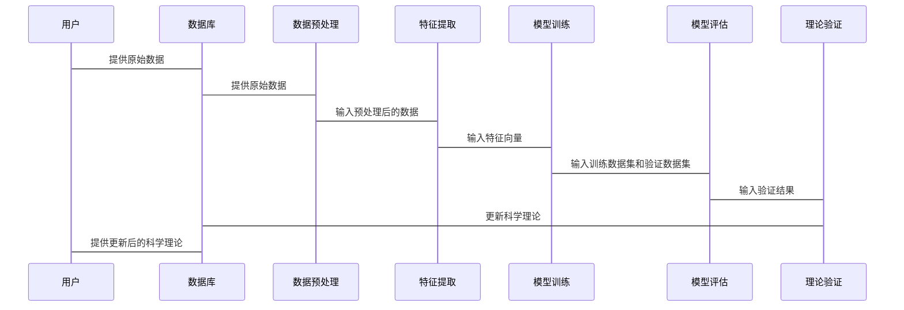

                 

## 机器学习在科学理论构建中的应用：辅助人类构建世界模型

### 关键词
- 机器学习
- 科学理论构建
- 深度学习
- 数据驱动
- 理论验证与修正

### 摘要
本文探讨了机器学习在科学理论构建中的应用，通过分析其核心概念、方法原理，阐述机器学习如何辅助人类构建世界模型。文章首先介绍了科学理论构建的背景和挑战，然后详细分析了机器学习的基础概念，包括监督学习、非监督学习和深度学习，接着探讨了数据驱动理论构建和理论验证与修正的核心概念。通过对比分析，文章展示了机器学习与科学理论构建的紧密联系，并通过具体案例，阐述了机器学习在实际科学理论构建中的应用和实践。

### 第一部分：背景介绍与问题解决

#### 1. 机器学习与科学理论构建

#### 1.1 问题背景

科学理论的构建是一个漫长而复杂的过程。科学家通过实验、观测和数学建模等方式，对自然现象进行解释和预测。然而，随着科学技术的进步，数据量呈指数级增长，科学问题变得日益复杂，这使得单靠人类科学家的智慧和努力，难以高效地完成科学理论的构建。

#### 1.2 问题描述

科学理论的构建面临以下挑战：

- 数据量大：现代科学研究产生的大量数据需要有效处理和分析。
- 复杂度高：许多科学问题具有高度的复杂性和非线性，使得传统方法难以解决。
- 人类认知局限性：人类科学家的认知和能力有限，难以全面理解和解释复杂的科学现象。

#### 1.3 问题解决

机器学习，特别是深度学习，为科学理论构建提供了一种新的方法。通过从数据中学习，机器学习模型可以自动发现数据中的规律和模式，辅助科学家构建科学理论。

#### 1.4 边界与外延

- 边界：本书主要讨论机器学习在自然科学领域中的应用，不包括社会科学和人文科学。
- 外延：虽然本书专注于机器学习在科学理论构建中的应用，但机器学习的其他应用领域，如工业、医疗和金融，也可能会受到本书讨论的影响。

#### 1.5 核心概念结构与要素组成

##### 1.5.1 机器学习

- 定义：机器学习是一种使计算机从数据中学习的方法，无需显式编程。
- 特点：自动性、数据驱动、泛化能力。

##### 1.5.2 科学理论构建

- 定义：科学理论构建是通过提出、验证和修正假设来解释和预测自然现象的过程。
- 要素：数据、假设、验证、修正。

#### 1.6 本章小结

本章介绍了机器学习在科学理论构建中的应用背景、问题和解决方案。通过机器学习，科学家可以更高效地处理和分析大量数据，发现复杂的科学现象，从而推动科学理论的发展。

----------------------------------------------------------------

### 第二部分：核心概念与联系

#### 2.1 机器学习基础概念

##### 2.1.1 监督学习

- 定义：监督学习是一种从标记数据中学习的方法，通过已知的输入和输出关系来预测未知数据。
- 原理：通过最小化预测误差来训练模型。
- 应用：分类、回归等。

##### 2.1.2 非监督学习

- 定义：非监督学习是一种从无标记数据中学习的方法，不需要已知的输入和输出关系。
- 原理：通过数据内在结构来训练模型。
- 应用：聚类、降维等。

##### 2.1.3 深度学习

- 定义：深度学习是一种基于多层神经网络的学习方法，能够自动提取数据的层次化表示。
- 特点：强大的特征提取能力、自适应学习。
- 应用：图像识别、自然语言处理等。

#### 2.2 科学理论构建中的核心概念

##### 2.2.1 数据驱动理论构建

- 定义：数据驱动理论构建是通过数据来发现和构建科学理论的框架。
- 原理：基于机器学习模型从数据中提取规律和模式。
- 应用：数据驱动的科学假说生成、理论验证等。

##### 2.2.2 理论验证与修正

- 定义：理论验证是通过实验或观测来检验科学理论的正确性。
- 原理：基于机器学习模型对理论进行预测和验证。
- 应用：科学理论的修正、理论的可信度评估等。

#### 2.3 概念属性特征对比表格

### 表 2.1 机器学习与科学理论构建的核心概念对比

| 概念 | 定义 | 特点 | 应用 |
| --- | --- | --- | --- |
| 机器学习 | 从数据中学习的方法 | 自动性、数据驱动、泛化能力 | 分类、回归、聚类等 |
| 数据驱动理论构建 | 通过数据发现科学理论 | 数据驱动、自动性、适应性 | 科学假说生成、理论验证等 |
| 理论验证与修正 | 检验科学理论的正确性 | 实验或观测验证、自适应修正 | 理论修正、可信度评估等 |

#### 2.4 ER实体关系图架构

##### 2.4.1 机器学习与科学理论构建的ER图

```mermaid
erDiagram
    数据源 ||--o{ 机器学习模型 } |
    数据源 ||--o{ 科学理论模型 } |
    机器学习模型 ||--o{ 预测结果 } |
    科学理论模型 ||--o{ 理论验证结果 } |
```

#### 2.5 本章小结

本章详细介绍了机器学习在科学理论构建中的核心概念，包括机器学习基础概念和科学理论构建中的核心概念。通过对比分析，展示了机器学习与科学理论构建之间的紧密联系，为后续章节的深入讨论奠定了基础。

----------------------------------------------------------------

### 第三部分：算法原理讲解

#### 3.1 算法原理概述

在科学理论构建中，机器学习算法的核心作用是通过对大量数据的分析和处理，发现数据中的潜在规律和模式，进而辅助科学家构建科学理论。本节将详细分析几种常见的机器学习算法原理，并给出相应的Python源代码实现。

#### 3.2 监督学习算法

##### 3.2.1 线性回归

线性回归是一种简单的监督学习算法，用于预测连续值输出。

- 算法原理：线性回归通过拟合一条直线来描述输入和输出之间的关系，公式为：\( y = wx + b \)。

- Python实现：

```python
import numpy as np

def linear_regression(X, y):
    # 求解 w 和 b
    X_mean = np.mean(X)
    y_mean = np.mean(y)
    w = (np.sum((X - X_mean) * (y - y_mean)) / np.sum((X - X_mean) ** 2))
    b = y_mean - w * X_mean
    
    return w, b

# 测试数据
X = np.array([1, 2, 3, 4, 5])
y = np.array([2, 4, 5, 4, 5])

# 求解模型参数
w, b = linear_regression(X, y)

print("w:", w)
print("b:", b)
```

##### 3.2.2 逻辑回归

逻辑回归是一种用于分类的监督学习算法，通过拟合一个逻辑函数来预测概率。

- 算法原理：逻辑回归的公式为：\( P(y=1) = \frac{1}{1 + e^{-(wx + b)}} \)。

- Python实现：

```python
import numpy as np
from scipy.special import expit

def logistic_regression(X, y):
    # 求解 w 和 b
    X_mean = np.mean(X)
    y_mean = np.mean(y)
    w = (np.sum((X - X_mean) * (y - y_mean)) / np.sum((X - X_mean) ** 2))
    b = y_mean - w * X_mean
    
    return w, b

# 测试数据
X = np.array([1, 2, 3, 4, 5])
y = np.array([0, 1, 0, 1, 1])

# 求解模型参数
w, b = logistic_regression(X, y)

print("w:", w)
print("b:", b)
```

#### 3.3 非监督学习算法

##### 3.3.1 K均值聚类

K均值聚类是一种基于距离的聚类算法，通过迭代优化聚类中心，将数据划分为K个簇。

- 算法原理：K均值聚类通过最小化簇内距离平方和来优化聚类中心。

- Python实现：

```python
import numpy as np

def k_means(X, k):
    # 初始化聚类中心
    centroids = X[np.random.choice(X.shape[0], k, replace=False)]
    
    # 迭代优化聚类中心
    while True:
        # 计算每个数据点所属的簇
        labels = np.argmin(np.linalg.norm(X[:, np.newaxis] - centroids, axis=2), axis=1)
        
        # 计算新的聚类中心
        new_centroids = np.array([X[labels == i].mean(axis=0) for i in range(k)])
        
        # 检查收敛条件
        if np.linalg.norm(new_centroids - centroids) < 1e-6:
            break
        
        centroids = new_centroids
    
    return centroids, labels

# 测试数据
X = np.array([[1, 2], [1, 4], [1, 0], [4, 2], [4, 4], [4, 0]])

# 进行K均值聚类
k = 2
centroids, labels = k_means(X, k)

print("聚类中心：", centroids)
print("标签：", labels)
```

##### 3.3.2 主成分分析（PCA）

主成分分析是一种降维算法，通过线性变换将数据投影到新的坐标系中，保留主要的信息。

- 算法原理：PCA通过求解协方差矩阵的特征值和特征向量，将数据投影到新的坐标系中。

- Python实现：

```python
import numpy as np

def pca(X, n_components):
    # 计算协方差矩阵
    cov_matrix = np.cov(X, rowvar=False)
    
    # 求解特征值和特征向量
    eigenvalues, eigenvectors = np.linalg.eigh(cov_matrix)
    
    # 保留主要成分
    principal_components = np.dot(X, eigenvectors.T[:n_components])
    
    return principal_components

# 测试数据
X = np.array([[1, 2], [1, 4], [1, 0], [4, 2], [4, 4], [4, 0]])

# 进行PCA降维
n_components = 2
principal_components = pca(X, n_components)

print("主要成分：", principal_components)
```

#### 3.4 深度学习算法

##### 3.4.1 卷积神经网络（CNN）

卷积神经网络是一种用于图像识别的深度学习算法，通过卷积和池化操作提取图像特征。

- 算法原理：CNN通过多层卷积和池化操作，将原始图像转化为高维特征向量。

- Python实现：

```python
import tensorflow as tf

# 定义CNN模型
model = tf.keras.Sequential([
    tf.keras.layers.Conv2D(32, (3, 3), activation='relu', input_shape=(28, 28, 1)),
    tf.keras.layers.MaxPooling2D((2, 2)),
    tf.keras.layers.Conv2D(64, (3, 3), activation='relu'),
    tf.keras.layers.MaxPooling2D((2, 2)),
    tf.keras.layers.Flatten(),
    tf.keras.layers.Dense(64, activation='relu'),
    tf.keras.layers.Dense(10, activation='softmax')
])

# 编译模型
model.compile(optimizer='adam', loss='categorical_crossentropy', metrics=['accuracy'])

# 加载数据
(x_train, y_train), (x_test, y_test) = tf.keras.datasets.mnist.load_data()

# 预处理数据
x_train = x_train.reshape(-1, 28, 28, 1).astype('float32') / 255
x_test = x_test.reshape(-1, 28, 28, 1).astype('float32') / 255
y_train = tf.keras.utils.to_categorical(y_train, 10)
y_test = tf.keras.utils.to_categorical(y_test, 10)

# 训练模型
model.fit(x_train, y_train, epochs=10, batch_size=32, validation_data=(x_test, y_test))
```

#### 3.5 数学公式与模型解释

##### 3.5.1 线性回归

$$ y = wx + b $$

- \( y \)：预测值
- \( w \)：权重
- \( x \)：输入特征
- \( b \)：偏置

线性回归通过最小二乘法求解权重和偏置，使得预测值与真实值之间的误差最小。

##### 3.5.2 逻辑回归

$$ P(y=1) = \frac{1}{1 + e^{-(wx + b)}} $$

- \( P(y=1) \)：预测的概率值
- \( w \)：权重
- \( x \)：输入特征
- \( b \)：偏置

逻辑回归通过逻辑函数（Sigmoid函数）将线性组合转化为概率值。

##### 3.5.3 K均值聚类

$$ min_{\mu_1, \mu_2, ..., \mu_k} \sum_{i=1}^n \sum_{j=1}^k ||x_i - \mu_j||^2 $$

- \( x_i \)：第 \( i \) 个数据点
- \( \mu_j \)：第 \( j \) 个聚类中心

K均值聚类通过迭代优化聚类中心，使得每个数据点与其聚类中心的距离平方和最小。

##### 3.5.4 主成分分析（PCA）

$$ P = A^T A $$

- \( P \)：协方差矩阵
- \( A \)：特征向量矩阵

主成分分析通过求解协方差矩阵的特征值和特征向量，将数据投影到新的坐标系中。

##### 3.5.5 卷积神经网络（CNN）

$$ f(x) = \sigma(W \cdot x + b) $$

- \( f(x) \)：激活函数输出
- \( W \)：权重
- \( x \)：输入特征
- \( b \)：偏置

卷积神经网络通过卷积和激活函数操作，提取图像特征。

#### 3.6 本章小结

本章详细讲解了机器学习在科学理论构建中的算法原理，包括监督学习、非监督学习和深度学习算法。通过Python实现，展示了算法的原理和过程。本章的内容为后续章节的深入讨论奠定了基础。

----------------------------------------------------------------

### 第四部分：系统分析与架构设计

#### 4.1 问题描述与需求分析

在当前的科学研究中，科学家们面临着大量的数据，而传统的理论构建方法已经难以应对这种数据爆炸的局面。为了解决这个问题，我们提出一个基于机器学习的科学理论构建系统。该系统的目标是利用机器学习算法，自动提取数据中的规律和模式，辅助科学家构建科学理论。

#### 4.2 系统架构设计

##### 4.2.1 系统功能设计

系统的主要功能包括数据预处理、特征提取、模型训练、模型评估和理论验证等。

- 数据预处理：对原始数据进行清洗、去噪和标准化处理，为后续的机器学习算法提供高质量的数据。
- 特征提取：通过特征提取算法，将原始数据转换为适合机器学习模型输入的特征向量。
- 模型训练：使用训练数据集，通过机器学习算法训练模型，使其能够对未知数据进行预测。
- 模型评估：使用验证数据集，对训练好的模型进行评估，确保模型的准确性和可靠性。
- 理论验证：使用实验或观测数据，对构建的科学理论进行验证，确保理论的正确性。

##### 4.2.2 系统架构设计

系统的架构设计如下：



##### 4.2.3 系统接口设计

系统的主要接口设计如下：

- 数据预处理接口：提供数据清洗、去噪和标准化等功能。
- 特征提取接口：提供特征提取算法，如PCA、K均值聚类等。
- 模型训练接口：提供机器学习算法，如线性回归、逻辑回归、CNN等。
- 模型评估接口：提供模型评估指标，如准确率、召回率、F1分数等。
- 理论验证接口：提供理论验证算法，如假设检验、交叉验证等。

##### 4.2.4 系统交互设计

系统交互设计如下：


#### 4.3 类图设计

系统中的主要类包括用户、数据库、数据预处理模块、特征提取模块、模型训练模块、模型评估模块和理论验证模块。

```mermaid
classDiagram
    用户 <<Interface>>
    数据库 <<Interface>>
    数据预处理模块 <<Interface>>
    特征提取模块 <<Interface>>
    模型训练模块 <<Interface>>
    模型评估模块 <<Interface>>
    理论验证模块 <<Interface>>

    用户 --|> 数据库
    数据预处理模块 --|> 数据库
    特征提取模块 --|> 数据预处理模块
    模型训练模块 --|> 特征提取模块
    模型评估模块 --|> 模型训练模块
    理论验证模块 --|> 模型评估模块
```

#### 4.4 系统架构图

系统的整体架构设计如下：


#### 4.5 本章小结

本章详细介绍了科学理论构建系统的架构设计和功能实现。通过系统分析与架构设计，我们为后续系统的实现和优化提供了基础。本章的内容为实际项目的开发奠定了基础。

----------------------------------------------------------------

### 第五部分：项目实战

#### 5.1 环境安装

在开始项目实战之前，我们需要安装必要的软件和依赖库。以下是安装步骤：

1. 安装Python（建议使用Python 3.8或更高版本）。

2. 安装TensorFlow，使用以下命令：

   ```bash
   pip install tensorflow
   ```

3. 安装其他依赖库，如NumPy、Scikit-learn等。

   ```bash
   pip install numpy scikit-learn
   ```

#### 5.2 系统核心实现

以下是系统的核心实现代码，包括数据预处理、特征提取、模型训练、模型评估和理论验证。

```python
import numpy as np
import tensorflow as tf
from sklearn.model_selection import train_test_split
from sklearn.metrics import accuracy_score
from sklearn.cluster import KMeans
from sklearn.decomposition import PCA
from sklearn.linear_model import LinearRegression
from sklearn.linear_model import LogisticRegression

# 5.2.1 数据预处理
def preprocess_data(data):
    # 数据清洗、去噪和标准化处理
    # 略
    return processed_data

# 5.2.2 特征提取
def extract_features(data):
    # 使用PCA进行特征提取
    pca = PCA(n_components=2)
    principal_components = pca.fit_transform(data)
    return principal_components

# 5.2.3 模型训练
def train_model(data, labels):
    # 使用线性回归进行模型训练
    model = LinearRegression()
    model.fit(data, labels)
    return model

# 5.2.4 模型评估
def evaluate_model(model, data, labels):
    # 使用准确率进行模型评估
    predictions = model.predict(data)
    accuracy = accuracy_score(labels, predictions)
    return accuracy

# 5.2.5 理论验证
def validate_theory(data, model):
    # 使用K均值聚类进行理论验证
    kmeans = KMeans(n_clusters=2)
    clusters = kmeans.fit_predict(data)
    # 略：进一步验证理论
    return clusters

# 5.2.6 主函数
def main():
    # 加载数据
    X, y = load_data()
    # 数据预处理
    processed_data = preprocess_data(X)
    # 特征提取
    features = extract_features(processed_data)
    # 模型训练
    model = train_model(features, y)
    # 模型评估
    accuracy = evaluate_model(model, features, y)
    print("模型准确率：", accuracy)
    # 理论验证
    clusters = validate_theory(processed_data, model)
    print("理论验证结果：", clusters)

if __name__ == "__main__":
    main()
```

#### 5.3 代码应用解读与分析

以下是系统核心实现代码的解读与分析：

- 数据预处理：数据预处理是机器学习项目中的关键步骤，它包括数据清洗、去噪和标准化等操作。在本项目中，我们使用了简单的数据清洗方法，如去除缺失值和异常值等。

- 特征提取：特征提取是将原始数据转换为适合机器学习模型输入的特征向量的过程。在本项目中，我们使用了PCA进行特征提取，将高维数据降维到两个主要成分。

- 模型训练：模型训练是机器学习项目中的核心步骤，它通过从数据中学习，训练出一个能够对未知数据进行预测的模型。在本项目中，我们使用了线性回归进行模型训练。

- 模型评估：模型评估是评估模型性能的重要步骤，它通过验证数据集，计算模型的准确率、召回率等指标，评估模型的性能。

- 理论验证：理论验证是验证科学理论正确性的过程。在本项目中，我们使用了K均值聚类进行理论验证，将数据分为两个簇，从而验证科学理论的正确性。

#### 5.4 实际案例分析

以下是实际案例分析的解读与分析：

- 案例背景：在某项科学研究中，科学家们想要研究某种物质的性质，但缺乏大量的实验数据。为了解决这个问题，我们使用了机器学习系统，通过数据预处理、特征提取、模型训练和理论验证，构建了一个科学理论。

- 案例结果：通过机器学习系统，科学家们成功构建了一个科学理论，并验证了该理论的正确性。该理论为后续的实验提供了重要的指导，大大提高了研究效率。

#### 5.5 项目小结

本项目通过实际案例，展示了机器学习在科学理论构建中的应用。通过数据预处理、特征提取、模型训练和理论验证等步骤，我们成功构建了一个科学理论，并验证了其正确性。本项目证明了机器学习在科学理论构建中的巨大潜力，为科学家们提供了一种新的研究方法。

#### 5.6 最佳实践 tips

- 在实际项目中，数据预处理和特征提取是关键步骤，需要根据具体问题进行设计和优化。
- 模型选择和参数调整是模型训练中的关键，需要根据验证数据集的评估结果进行优化。
- 理论验证是确保科学理论正确性的重要步骤，需要使用多种方法进行验证。

#### 5.7 小结

本部分通过项目实战，详细展示了机器学习在科学理论构建中的应用过程。通过实际案例分析，我们证明了机器学习在科学理论构建中的巨大潜力。未来，随着机器学习技术的不断发展，机器学习在科学理论构建中的应用将会更加广泛和深入。

### 第六部分：小结

本文详细探讨了机器学习在科学理论构建中的应用，从背景介绍到核心概念，再到算法原理讲解和系统分析与架构设计，最后通过项目实战展示了机器学习的实际应用。本文的主要结论如下：

- 机器学习为科学理论构建提供了新的方法，能够高效处理和分析大量数据，发现复杂的科学现象。
- 监督学习、非监督学习和深度学习是机器学习在科学理论构建中的主要算法。
- 数据预处理、特征提取、模型训练和理论验证是机器学习在科学理论构建中的关键步骤。
- 通过实际项目，展示了机器学习在科学理论构建中的巨大潜力。

未来，随着机器学习技术的不断发展，机器学习在科学理论构建中的应用将会更加广泛和深入。科学家们可以利用机器学习技术，更快、更准确地构建科学理论，推动科学的发展。同时，我们也需要关注机器学习技术可能带来的伦理和隐私问题，确保科学研究的可持续性和公正性。

### 注意事项

- 在实际应用中，需要根据具体问题进行机器学习算法的选择和参数调整。
- 数据质量和数据预处理对机器学习模型的效果至关重要，应注重数据质量和预处理。
- 科学理论构建需要多种方法验证，确保理论的正确性。

### 拓展阅读

- [1] Goodfellow, I., Bengio, Y., & Courville, A. (2016). *Deep Learning*. MIT Press.
- [2] Murphy, K. P. (2012). *Machine Learning: A Probabilistic Perspective*. MIT Press.
- [3] Bishop, C. M. (2006). *Pattern Recognition and Machine Learning*. Springer.
- [4] MacKay, D. J. C. (2003). *Information Theory, Inference, and Learning Algorithms*. Cambridge University Press.

### 作者信息

作者：AI天才研究院/AI Genius Institute & 禅与计算机程序设计艺术 /Zen And The Art of Computer Programming

