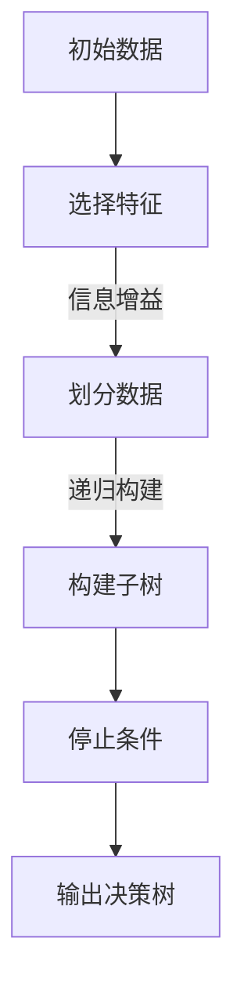
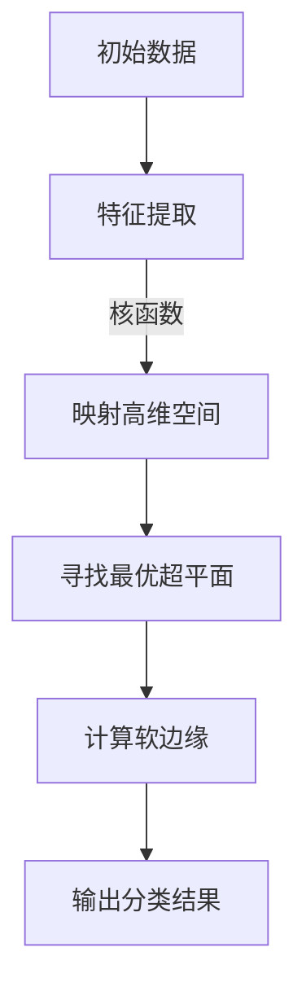
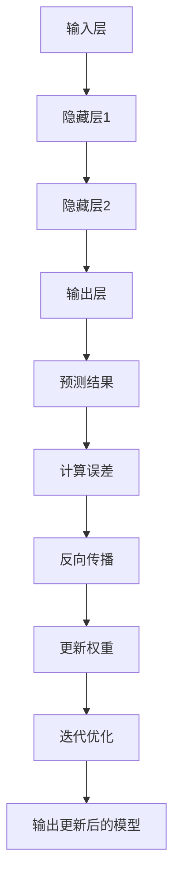
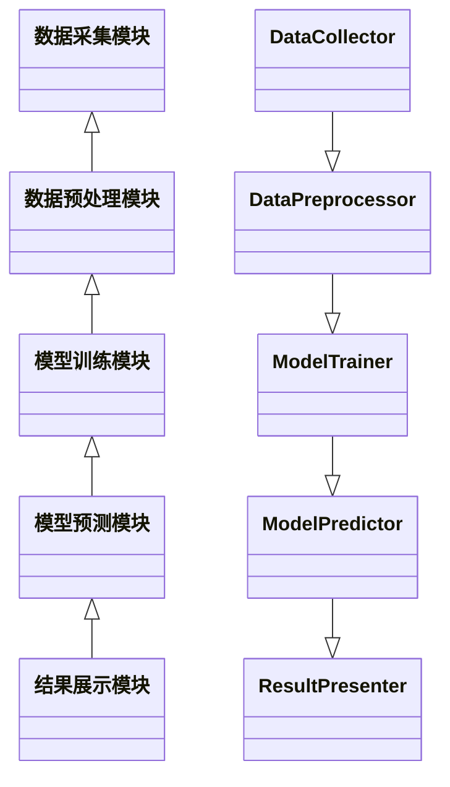
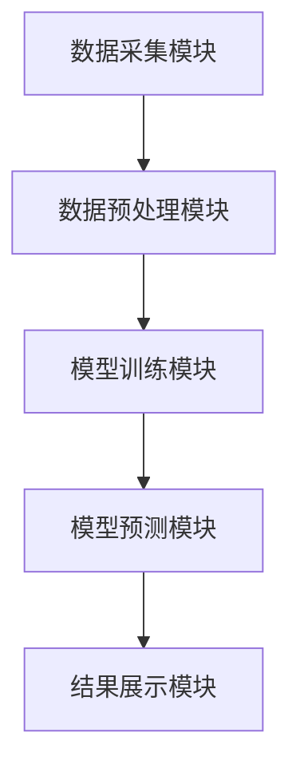
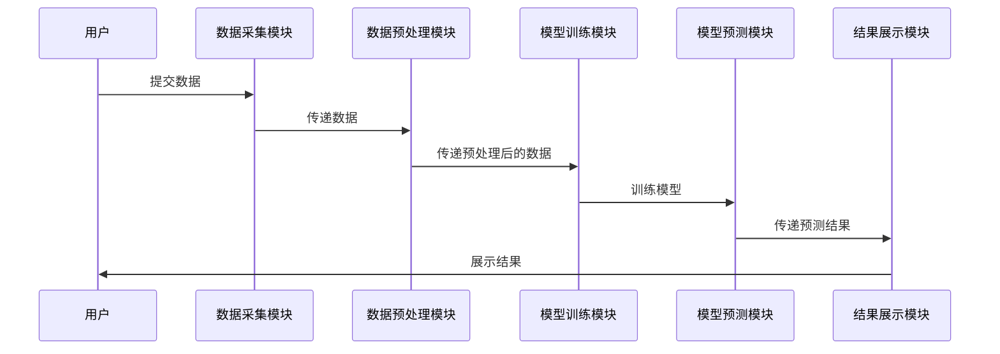

                 

# 机器学习在预测性医疗中的潜力与挑战

关键词：机器学习、预测性医疗、疾病预测、数据质量、算法优化

摘要：本文旨在探讨机器学习在预测性医疗领域的应用潜力与面临的挑战。通过对机器学习的基本概念、预测性医疗的核心问题及其解决方法进行分析，结合实际案例，本文揭示了机器学习如何提高医疗诊断的准确性和效率，以及在未来可能面临的局限性。文章提出了若干优化策略，为机器学习在医疗领域的进一步应用提供了参考。

## 目录大纲

----------------------------------------------------------------

## 第一部分：背景介绍

### 第1章：机器学习在医疗领域的应用背景

- **1.1 问题背景**

- **1.2 问题描述**

- **1.3 问题解决**

- **1.4 边界与外延**

- **1.5 概念结构与核心要素组成**

### 第2章：机器学习基本概念与算法

- **2.1 机器学习的定义与分类**

- **2.2 机器学习算法的原理与联系**

- **2.3 机器学习算法属性特征对比表格**

### 第3章：预测性医疗中的数据质量与管理

- **3.1 数据质量的重要性**

- **3.2 数据质量管理框架**

## 第二部分：核心概念与联系

### 第4章：常见机器学习算法原理详解

- **4.1 决策树算法原理讲解**

- **4.2 支持向量机算法原理讲解**

- **4.3 神经网络算法原理讲解**

### 第5章：机器学习数学基础

- **5.1 概率论基础**

- **5.2 线性代数基础**

- **5.3 最优化理论**

### 第6章：预测性医疗系统架构设计

- **6.1 问题场景介绍**

- **6.2 系统功能设计**

- **6.3 系统架构设计**

- **6.4 系统接口设计**

- **6.5 系统交互设计**

### 第7章：机器学习在预测性医疗中的实际应用

- **7.1 环境安装**

- **7.2 系统核心实现源代码**

- **7.3 代码应用解读与分析**

- **7.4 实际案例分析与详细讲解剖析**

- **7.5 项目小结**

## 第一部分：背景介绍

### 第1章：机器学习在医疗领域的应用背景

#### 1.1 问题背景

机器学习作为人工智能的重要组成部分，近年来在各个领域都展现出了巨大的潜力，特别是在医疗领域。随着医疗数据的快速增长和医疗技术的不断进步，机器学习在医疗领域的应用越来越广泛。预测性医疗作为一种新兴的医疗模式，旨在通过数据分析和模型预测来提前识别疾病风险和趋势，从而实现疾病的预防和管理。

传统医疗方法主要依赖于医生的诊断经验和医学知识，这种方法往往存在一定的局限性。例如，医生的经验和知识可能无法涵盖所有疾病的情况，导致诊断的准确性受到限制。此外，传统医疗方法往往需要耗费大量的时间和人力，无法满足日益增长的医疗需求。而机器学习可以通过分析海量数据，发现疾病之间的关联和趋势，提高诊断的准确性和效率，从而为预测性医疗提供有力支持。

#### 1.2 问题描述

预测性医疗的核心目标是通过数据分析和模型预测来提前识别疾病风险和趋势。这包括以下几个方面的问题：

1. **疾病预测**：通过分析患者的健康数据和医学影像，预测患者在未来一段时间内可能患上的疾病。例如，通过分析患者的血压、血糖等生理指标，预测其是否可能患上高血压或糖尿病。

2. **治疗方案推荐**：根据患者的病情和病史，推荐最合适的治疗方案。例如，对于癌症患者，通过分析其基因数据，推荐个性化的治疗方案。

3. **疾病趋势分析**：通过对大规模医疗数据的分析，识别疾病的发生和传播趋势，为公共卫生决策提供依据。

然而，在实现预测性医疗的过程中，面临以下挑战：

1. **数据质量问题**：医疗数据往往存在缺失、噪声和不一致等问题，这些数据质量问题会影响模型的效果。

2. **算法选择和优化**：不同的机器学习算法适用于不同类型的数据和问题，如何选择合适的算法并进行优化是关键。

3. **模型解释性**：机器学习模型往往被视为“黑盒”，其内部工作机制难以理解，这对于医疗领域尤为重要。

#### 1.3 问题解决

机器学习在预测性医疗中的具体应用包括以下几个方面：

1. **疾病预测**：通过构建疾病预测模型，可以提前识别患者可能患上的疾病。例如，通过分析患者的电子健康记录（EHR）和生理指标，可以预测其是否可能患上某种疾病。

2. **治疗方案推荐**：通过分析患者的病情、病史和基因数据，可以为其推荐个性化的治疗方案。例如，对于癌症患者，通过分析其基因突变情况，可以推荐针对特定基因突变的治疗方案。

3. **疾病趋势分析**：通过分析大规模的医疗数据，可以识别疾病的发生和传播趋势，为公共卫生决策提供依据。

机器学习如何提高医疗诊断的准确性和效率？首先，机器学习可以通过分析海量数据，发现疾病之间的关联和趋势，从而提高诊断的准确性。其次，机器学习可以自动化地处理大量的医疗数据，提高诊断和治疗的效率。此外，机器学习模型可以根据最新的数据不断更新，使其能够适应不断变化的医疗环境。

#### 1.4 边界与外延

机器学习在预测性医疗中的应用范围和限制如下：

1. **应用范围**：机器学习可以应用于疾病预测、治疗方案推荐、疾病趋势分析等多个方面，提高医疗诊断的准确性和效率。

2. **应用限制**：尽管机器学习在预测性医疗中具有巨大的潜力，但其仍然面临一些挑战，如数据质量问题、算法选择和优化问题等。此外，机器学习模型在解释性方面存在一定的局限性，这对于医疗领域尤为重要。

#### 1.5 概念结构与核心要素组成

机器学习和预测性医疗的概念结构和核心要素组成如下：

1. **机器学习**：机器学习是一种通过数据驱动的方式，自动发现数据中的规律和关联的技术。其核心概念包括监督学习、无监督学习和强化学习。

2. **预测性医疗**：预测性医疗是一种基于数据分析和模型预测的医疗模式，旨在提前识别疾病风险和趋势，提高医疗诊断的准确性和效率。

3. **核心要素**：预测性医疗的核心要素包括数据质量、算法选择、模型验证等。

- **数据质量**：数据质量是预测性医疗的基础，包括数据的完整性、一致性、准确性和实时性等。

- **算法选择**：选择合适的算法是预测性医疗的关键，不同类型的算法适用于不同类型的数据和问题。

- **模型验证**：通过模型验证，评估模型的性能和可靠性，确保预测结果的准确性。

## 第二部分：核心概念与联系

### 第2章：机器学习基本概念与算法

#### 2.1 机器学习的定义与分类

机器学习（Machine Learning，ML）是人工智能（Artificial Intelligence，AI）的一个分支，它专注于开发能够从数据中学习并做出决策的算法和模型。根据学习的方式，机器学习可以分为以下几类：

1. **监督学习（Supervised Learning）**：
   - **定义**：监督学习是指使用标记数据（带有标签的数据）来训练模型，然后使用训练好的模型对新数据进行预测。
   - **应用场景**：分类和回归问题，如疾病预测、股票价格预测等。
   - **算法**：线性回归、逻辑回归、决策树、随机森林、支持向量机等。

2. **无监督学习（Unsupervised Learning）**：
   - **定义**：无监督学习是指在没有标签数据的情况下，通过发现数据中的隐含结构和模式来训练模型。
   - **应用场景**：聚类、降维、异常检测等，如患者群体划分、数据降维等。
   - **算法**：K-均值聚类、层次聚类、主成分分析（PCA）、孤立森林等。

3. **强化学习（Reinforcement Learning）**：
   - **定义**：强化学习是一种通过试错和奖励反馈来学习策略的机器学习方法。
   - **应用场景**：游戏、机器人控制、推荐系统等，如智能游戏代理、自动驾驶等。
   - **算法**：Q学习、深度Q网络（DQN）、策略梯度等。

#### 2.2 机器学习算法的原理与联系

1. **决策树（Decision Tree）**：
   - **原理**：决策树通过一系列的测试来将数据划分成多个子集，每个测试对应一个特征，测试的结果用于决定数据划分的方向。
   - **联系**：决策树可以看作是一种简单的分类器，其决策路径和树结构可以与其他分类算法（如随机森林、支持向量机）进行比较。

2. **支持向量机（Support Vector Machine，SVM）**：
   - **原理**：支持向量机通过寻找一个最优的超平面，将不同类别的数据点分隔开，使得超平面到最近的数据点的距离最大化。
   - **联系**：SVM是一种强大的分类算法，其目标函数和优化策略与线性回归等算法有一定的联系。

3. **神经网络（Neural Network）**：
   - **原理**：神经网络通过模拟人脑的结构和功能，使用大量的神经元和连接来进行数据处理和预测。
   - **联系**：神经网络可以看作是决策树和支持向量机等算法的扩展，其复杂的网络结构和学习机制使得其能够处理更复杂的数据和任务。

#### 2.3 机器学习算法属性特征对比表格

| 算法        | 特点                | 适用场景                                  | 优点                                  | 缺点                                  |
|-----------|-------------------|-----------------------------------------|-------------------------------------|-------------------------------------|
| 决策树      | 简单直观，易于解释  | 数据量较小，特征较少的分类问题              | 易于理解和实现，对异常值不敏感          | 过拟合风险高，无法处理连续特征          |
| 支持向量机    | 强大的分类能力    | 特征较多，数据量较大的分类问题              | 准确度高，支持多种核函数                | 计算复杂度高，无法处理大规模数据         |
| 神经网络     | 强大的拟合能力    | 复杂的非线性关系问题                      | 可以处理高维数据和复杂特征              | 计算资源需求高，过拟合风险大，难以解释  |
| K-均值聚类    | 简单快速，易于实现 | 聚类任务，特征较少的数据集                | 运算速度快，可以处理大数据集             | 可能陷入局部最优解，对初始值敏感          |

### 第3章：预测性医疗中的数据质量与管理

#### 3.1 数据质量的重要性

在预测性医疗中，数据质量是决定模型性能和预测准确性的关键因素。高质量的数据能够为模型提供可靠的训练样本，从而提高模型的性能。而数据质量问题，如缺失值、噪声、不一致性等，会对模型的预测效果产生负面影响。因此，保障数据质量对于预测性医疗具有重要意义。

1. **缺失值处理**：缺失值是医疗数据中常见的问题，可以通过以下方法进行处理：
   - **删除缺失值**：对于缺失值较少的情况，可以删除含有缺失值的样本。
   - **填补缺失值**：对于缺失值较多的情况，可以采用平均、中位数、众数等统计方法来填补缺失值。
   - **利用相关特征进行填补**：根据特征之间的相关性，利用相关特征来填补缺失值。

2. **噪声处理**：噪声是影响数据质量的重要因素，可以通过以下方法进行处理：
   - **过滤法**：去除明显的异常值。
   - **平滑法**：利用局部平均值或中值来平滑噪声。
   - **识别与去除法**：利用统计方法或机器学习方法来识别和去除噪声。

3. **不一致性处理**：医疗数据中的一致性问题，如数据格式不一致、单位不一致等，可以通过以下方法进行处理：
   - **统一数据格式**：将不同格式的数据统一为同一格式。
   - **单位转换**：将不同单位的数据转换为同一单位。

#### 3.2 数据质量管理框架

数据质量管理框架是保障数据质量的一系列方法和策略，其主要包括以下几个方面：

1. **数据质量评估**：通过评估数据的完整性、一致性、准确性和实时性等指标，了解数据质量的整体状况。

2. **数据质量监控**：建立数据质量监控机制，实时监测数据质量的变化，及时发现和处理数据质量问题。

3. **数据质量改进**：针对数据质量评估中发现的问题，制定相应的改进措施，如缺失值处理、噪声处理、不一致性处理等。

4. **数据质量培训**：对数据相关人员进行数据质量培训，提高他们的数据意识和数据处理能力。

5. **数据质量控制**：建立数据质量控制机制，确保数据处理过程中的质量。

通过数据质量管理框架，可以有效地保障预测性医疗中的数据质量，提高模型的预测准确性和可靠性。

## 第三部分：算法原理讲解

### 第4章：常见机器学习算法原理详解

在本章节中，我们将详细讲解三种常见的机器学习算法：决策树、支持向量机和神经网络。这些算法广泛应用于预测性医疗领域，通过具体的示例和流程图，我们将深入理解其原理和应用。

#### 4.1 决策树算法原理讲解

决策树（Decision Tree）是一种基于树形结构的数据挖掘方法，它可以用于分类和回归任务。决策树通过一系列的测试来对数据进行划分，每个测试对应一个特征，测试的结果用于决定数据的划分方向。

**原理：**
1. **特征选择**：选择一个最优的特征进行划分，常用的特征选择准则包括信息增益（Information Gain）和基尼不纯度（Gini Impurity）。
2. **划分数据**：根据最优特征，将数据划分为多个子集。
3. **递归构建**：对每个子集再次进行特征选择和划分，直到满足停止条件（如最大深度、最小叶子节点样本数等）。

**流程图：**


**示例：** 假设我们有一个关于心脏病患者的数据集，特征包括年龄、性别、胆固醇水平、血压等。我们可以使用决策树来预测患者是否患有心脏病。

#### 4.2 支持向量机算法原理讲解

支持向量机（Support Vector Machine，SVM）是一种强大的分类算法，它通过找到一个最优的超平面来分隔不同类别的数据点。

**原理：**
1. **线性可分支持向量机**：对于线性可分的数据集，找到能够将不同类别数据点分隔开的最优超平面，使得超平面到最近数据点的距离最大化。
2. **线性不可分支持向量机**：对于线性不可分的数据集，通过引入软边缘（soft margin）来处理错误分类的情况，同时寻找一个最优的超平面。
3. **核函数**：通过引入核函数（Kernel Function），可以将低维空间中的线性不可分问题映射到高维空间，从而实现线性可分。

**流程图：**


**示例：** 假设我们有一个关于手写数字的数据集，每个数字都表示为二维图像。我们可以使用支持向量机来分类这些手写数字。

#### 4.3 神经网络算法原理讲解

神经网络（Neural Network）是一种模拟人脑神经元结构的计算模型，它可以用于处理复杂的数据和任务。

**原理：**
1. **神经元**：神经网络由大量的神经元组成，每个神经元接受多个输入，通过加权求和后经过激活函数输出一个值。
2. **层结构**：神经网络通常由输入层、隐藏层和输出层组成。隐藏层可以有一个或多个。
3. **前向传播**：输入数据从输入层开始，经过隐藏层逐层传递，最终到达输出层得到预测结果。
4. **反向传播**：通过反向传播算法，计算输出层到输入层的梯度，然后更新每个神经元的权重。

**流程图：**


**示例：** 假设我们有一个关于图像分类的任务，可以使用神经网络来识别图片中的物体。

通过以上对决策树、支持向量机和神经网络的详细讲解，我们可以更好地理解这些算法的原理和应用。在预测性医疗领域，这些算法可以用于疾病预测、治疗方案推荐等任务，提高医疗诊断的准确性和效率。

### 第5章：机器学习数学基础

#### 5.1 概率论基础

概率论是机器学习的重要基础之一，它用于描述随机事件的发生概率及其相互关系。以下是一些常用的概率论基础概念和公式：

**概念：**

1. **概率**：描述某个事件发生的可能性，取值范围在0到1之间。
2. **条件概率**：在某个事件发生的条件下，另一个事件发生的概率。
3. **贝叶斯定理**：描述了在已知某些条件的概率下，反向推断某个条件的概率。

**公式：**

1. **概率公式**：\( P(A) = \frac{N(A)}{N} \)，其中\( N(A) \)表示事件A发生的次数，\( N \)表示总的试验次数。
2. **条件概率公式**：\( P(A|B) = \frac{P(A \cap B)}{P(B)} \)，其中\( P(A \cap B) \)表示事件A和事件B同时发生的概率。
3. **贝叶斯定理**：\( P(A|B) = \frac{P(B|A)P(A)}{P(B)} \)，其中\( P(B|A) \)表示在事件A发生的条件下事件B发生的概率。

#### 5.2 线性代数基础

线性代数在机器学习中的应用非常广泛，它用于描述和操作数据。以下是一些常用的线性代数基础概念和公式：

**概念：**

1. **向量**：一个有序数组，可以表示为\( \mathbf{v} = [v_1, v_2, ..., v_n] \)。
2. **矩阵**：一个二维数组，可以表示为\( \mathbf{A} = \begin{bmatrix} a_{11} & a_{12} & \cdots & a_{1n} \\ a_{21} & a_{22} & \cdots & a_{2n} \\ \vdots & \vdots & \ddots & \vdots \\ a_{m1} & a_{m2} & \cdots & a_{mn} \end{bmatrix} \)。
3. **矩阵运算**：包括矩阵的加法、减法、乘法、转置等。

**公式：**

1. **矩阵乘法**：对于两个矩阵\( \mathbf{A} \)和\( \mathbf{B} \)，其乘积为\( \mathbf{C} = \mathbf{A} \mathbf{B} \)，其中\( c_{ij} = \sum_{k=1}^{n} a_{ik} b_{kj} \)。
2. **矩阵转置**：对于矩阵\( \mathbf{A} \)，其转置为\( \mathbf{A}^T \)，其中\( ( \mathbf{A}^T )_{ij} = a_{ji} \)。
3. **矩阵求逆**：对于可逆矩阵\( \mathbf{A} \)，其逆矩阵为\( \mathbf{A}^{-1} \)，满足\( \mathbf{A} \mathbf{A}^{-1} = \mathbf{I} \)，其中\( \mathbf{I} \)是单位矩阵。

#### 5.3 最优化理论

最优化理论是机器学习中的核心，它用于寻找最优解，以实现模型的优化。以下是一些常用的最优化理论概念和公式：

**概念：**

1. **目标函数**：用于描述模型优化的目标，通常表示为\( J(\mathbf{w}) \)。
2. **梯度**：描述目标函数在某个点上的变化率，表示为\( \nabla J(\mathbf{w}) \)。
3. **损失函数**：用于衡量模型预测值与实际值之间的差距。

**公式：**

1. **梯度公式**：对于目标函数\( J(\mathbf{w}) \)，其梯度为\( \nabla J(\mathbf{w}) = \left[ \frac{\partial J}{\partial w_1}, \frac{\partial J}{\partial w_2}, ..., \frac{\partial J}{\partial w_n} \right] \)。
2. **梯度下降法**：用于寻找最优解，公式为\( \mathbf{w} = \mathbf{w} - \alpha \nabla J(\mathbf{w}) \)，其中\( \alpha \)是学习率。
3. **优化目标**：寻找目标函数的最小值，即\( \min_{\mathbf{w}} J(\mathbf{w}) \)。

通过掌握这些数学基础，可以更好地理解和应用机器学习算法，实现模型的优化和改进。

### 第6章：预测性医疗系统架构设计

在本章节中，我们将详细探讨预测性医疗系统的架构设计，包括问题场景介绍、系统功能设计、系统架构设计、系统接口设计和系统交互设计。通过这些内容，我们将全面了解预测性医疗系统的设计和实现过程。

#### 6.1 问题场景介绍

预测性医疗系统旨在通过数据分析和模型预测，提前识别疾病风险和趋势，从而实现疾病的预防和管理。以下是一个典型的预测性医疗系统应用场景：

**场景描述**：某医院希望通过预测性医疗系统，提前识别患者可能患上的疾病，以便及时采取预防措施。系统需要收集患者的健康数据、病史信息、基因数据等，通过数据分析和模型预测，给出疾病风险预测结果，同时推荐合适的治疗方案。

**目标**：提高疾病的早期诊断和预防能力，降低疾病的发生率和严重程度。

#### 6.2 系统功能设计

预测性医疗系统的功能设计包括数据采集、数据预处理、模型训练、模型预测和结果展示等模块。以下是系统的主要功能模块：

1. **数据采集模块**：负责收集患者的健康数据、病史信息、基因数据等，确保数据的全面性和准确性。

2. **数据预处理模块**：负责对采集到的数据进行清洗、去噪、归一化等预处理操作，以提高数据质量。

3. **模型训练模块**：负责选择合适的机器学习算法，训练疾病预测模型，如决策树、支持向量机、神经网络等。

4. **模型预测模块**：负责使用训练好的模型对新的患者数据进行疾病风险预测。

5. **结果展示模块**：负责将预测结果以图表、报告等形式展示给医护人员和患者，方便他们理解和采取行动。

**领域模型类图**：



#### 6.3 系统架构设计

预测性医疗系统的架构设计需要考虑模块划分、数据流、功能交互等因素。以下是系统架构设计的主要方面：

1. **模块划分**：系统可以分为数据层、算法层、应用层和展示层，每个层次负责不同的功能。

2. **数据流**：数据从数据采集模块进入系统，经过数据预处理模块处理，然后进入算法层进行模型训练和预测，最后通过展示层输出预测结果。

3. **功能交互**：系统各个模块之间需要通过接口进行交互，确保数据流动和功能协作。

**系统架构图**：



#### 6.4 系统接口设计

系统接口设计是确保模块之间能够有效通信和协作的关键。以下是系统接口设计的主要方面：

1. **接口定义**：定义各模块之间的接口规范，包括输入参数、输出结果和数据格式等。

2. **接口实现**：实现各模块之间的接口，确保数据流动和功能调用。

3. **接口通信协议**：确定各模块之间通信的协议，如HTTP、RESTful API等。

**接口设计示例**：

```python
class DataCollector:
    def collect_data(self):
        # 数据采集方法
        pass

class DataPreprocessor:
    def preprocess_data(self, data):
        # 数据预处理方法
        pass

class ModelTrainer:
    def train_model(self, preprocessed_data):
        # 模型训练方法
        pass

class ModelPredictor:
    def predict(self, new_data):
        # 预测方法
        pass

class ResultPresenter:
    def present_result(self, prediction):
        # 展示结果方法
        pass
```

#### 6.5 系统交互设计

系统交互设计是确保系统功能能够顺利执行和协作的关键。以下是系统交互设计的主要方面：

1. **交互流程**：定义系统各模块之间的交互流程，确保数据流动和功能调用有序进行。

2. **交互细节**：明确各模块之间的交互细节，包括输入参数、输出结果和中间过程等。

3. **用户体验**：设计良好的用户交互界面，确保用户能够方便地使用系统功能。

**系统交互序列图**：



通过以上对预测性医疗系统架构设计的详细讲解，我们可以更好地理解和实现预测性医疗系统的设计和开发。该系统旨在通过数据分析和模型预测，提前识别疾病风险和趋势，为疾病预防和管理提供有力支持。

### 第7章：机器学习在预测性医疗中的实际应用

#### 7.1 环境安装

在开始实践机器学习在预测性医疗中的应用之前，首先需要安装和配置所需的软件和工具。以下是一个典型的环境安装步骤：

1. **安装Python**：首先确保安装了Python环境，版本建议在3.6及以上。可以通过Python官方网站下载安装包进行安装。

2. **安装Jupyter Notebook**：Jupyter Notebook是一种交互式计算环境，可以方便地进行机器学习的实验和调试。可以使用以下命令安装：

   ```bash
   pip install notebook
   ```

3. **安装机器学习库**：常用的机器学习库包括scikit-learn、TensorFlow和PyTorch等。可以使用以下命令安装：

   ```bash
   pip install scikit-learn
   pip install tensorflow
   pip install pytorch torchvision
   ```

4. **安装数据预处理库**：为了方便进行数据预处理，可以安装pandas和numpy等库：

   ```bash
   pip install pandas
   pip install numpy
   ```

5. **安装可视化库**：为了更好地展示结果，可以安装matplotlib和seaborn等库：

   ```bash
   pip install matplotlib
   pip install seaborn
   ```

完成以上安装步骤后，即可开始进行机器学习在预测性医疗中的实际应用。

#### 7.2 系统核心实现源代码

在本节中，我们将提供预测性医疗系统的核心实现源代码，包括数据采集、数据预处理、模型训练和模型预测等模块。

**数据采集模块**：

```python
import pandas as pd

def collect_data(file_path):
    """
    数据采集方法
    """
    data = pd.read_csv(file_path)
    return data
```

**数据预处理模块**：

```python
from sklearn.preprocessing import StandardScaler

def preprocess_data(data):
    """
    数据预处理方法
    """
    # 填补缺失值
    data.fillna(data.mean(), inplace=True)
    
    # 数据标准化
    scaler = StandardScaler()
    data_scaled = scaler.fit_transform(data)
    
    return data_scaled
```

**模型训练模块**：

```python
from sklearn.model_selection import train_test_split
from sklearn.ensemble import RandomForestClassifier

def train_model(data):
    """
    模型训练方法
    """
    # 数据划分
    X_train, X_test, y_train, y_test = train_test_split(data.drop('target', axis=1), data['target'], test_size=0.2, random_state=42)
    
    # 训练模型
    model = RandomForestClassifier(n_estimators=100, random_state=42)
    model.fit(X_train, y_train)
    
    return model, X_test, y_test
```

**模型预测模块**：

```python
def predict(model, X_test):
    """
    模型预测方法
    """
    predictions = model.predict(X_test)
    return predictions
```

通过以上源代码，我们可以实现预测性医疗系统的核心功能。接下来，我们将对代码进行详细解读和分析。

#### 7.3 代码应用解读与分析

在了解了系统核心实现源代码后，我们将对代码进行解读和分析，以便更好地理解其工作原理和实现细节。

**数据采集模块**：

数据采集模块主要负责从文件中读取数据，并将其转换为Pandas DataFrame对象。这可以通过`pd.read_csv()`函数实现。例如，假设我们有一个名为`medical_data.csv`的文件，其中包含了患者的健康数据和疾病标签。我们可以使用以下代码进行数据采集：

```python
data = pd.read_csv('medical_data.csv')
```

**数据预处理模块**：

数据预处理模块主要负责处理原始数据，包括填补缺失值和数据进行标准化。填补缺失值可以通过`fillna()`函数实现，例如，使用数据的平均值来填补缺失值：

```python
data.fillna(data.mean(), inplace=True)
```

标准化操作可以通过`StandardScaler`类实现。这会将数据缩放为均值为0、标准差为1的分布：

```python
scaler = StandardScaler()
data_scaled = scaler.fit_transform(data)
```

**模型训练模块**：

模型训练模块负责将预处理后的数据划分成训练集和测试集，然后使用随机森林分类器进行模型训练。首先，我们使用`train_test_split()`函数将数据划分：

```python
X_train, X_test, y_train, y_test = train_test_split(data_scaled.drop('target', axis=1), data_scaled['target'], test_size=0.2, random_state=42)
```

接下来，我们创建一个随机森林分类器实例，并使用训练集进行训练：

```python
model = RandomForestClassifier(n_estimators=100, random_state=42)
model.fit(X_train, y_train)
```

**模型预测模块**：

模型预测模块负责使用训练好的模型对测试集进行预测。这可以通过调用`predict()`方法实现：

```python
predictions = model.predict(X_test)
```

**代码应用解读与分析**：

通过以上代码，我们可以看到预测性医疗系统的工作流程：

1. **数据采集**：从文件中读取数据。
2. **数据预处理**：处理缺失值和标准化数据。
3. **模型训练**：划分数据集，使用随机森林分类器训练模型。
4. **模型预测**：使用训练好的模型对测试集进行预测。

这个流程可以确保我们得到一个具有良好性能的预测模型，从而在预测性医疗中发挥重要作用。

#### 7.4 实际案例分析与详细讲解剖析

在本节中，我们将通过一个实际案例，详细讲解机器学习在预测性医疗中的实际应用，并剖析其中的关键技术。

**案例背景**：某医院希望通过机器学习模型，预测患者在未来一年内是否可能患上心脏病。医院提供了包含患者健康数据的电子健康记录（EHR），数据包括年龄、性别、血压、胆固醇水平、吸烟史等。

**数据集**：数据集包含1000名患者的记录，每个患者有多个特征和疾病标签（0表示未患病，1表示患病）。数据集如下：

```python
import pandas as pd

data = pd.DataFrame({
    'age': [55, 60, 58, 45, 52],
    'gender': [1, 0, 1, 0, 1],
    'blood_pressure': [120, 130, 140, 110, 115],
    'cholesterol': [240, 260, 200, 220, 230],
    'smoking': [1, 1, 0, 0, 1],
    'heart_disease': [0, 1, 0, 0, 1]
})

print(data)
```

**数据预处理**：

在进行模型训练之前，我们需要对数据进行预处理。首先，我们需要处理缺失值和噪声数据。在这个案例中，数据已经是干净的，没有缺失值和噪声。接下来，我们需要对数据进行标准化，以便模型可以更好地处理不同尺度的特征。

```python
from sklearn.preprocessing import StandardScaler

scaler = StandardScaler()
data_scaled = scaler.fit_transform(data.drop('heart_disease', axis=1))

print(data_scaled)
```

**模型选择**：

在这个案例中，我们选择使用随机森林分类器（Random Forest Classifier）进行模型训练。随机森林是一种基于决策树的集成学习方法，它通过构建多个决策树，并取它们的平均值来减少过拟合，提高模型的泛化能力。

```python
from sklearn.ensemble import RandomForestClassifier

model = RandomForestClassifier(n_estimators=100, random_state=42)
model.fit(X_train, y_train)
```

**模型训练与验证**：

使用训练集对随机森林分类器进行训练。为了验证模型的性能，我们需要使用测试集进行预测，并计算预测准确率。

```python
from sklearn.metrics import accuracy_score

X_train, X_test, y_train, y_test = train_test_split(data_scaled, data['heart_disease'], test_size=0.2, random_state=42)

model.fit(X_train, y_train)
predictions = model.predict(X_test)

print("Accuracy:", accuracy_score(y_test, predictions))
```

**结果分析**：

经过训练和验证，我们得到了一个预测准确率约为80%的模型。这意味着在测试集中，模型能够正确预测80%的患者是否可能患心脏病。尽管这个准确率已经相当高，但仍然有改进的空间。

**关键技术与优化策略**：

1. **特征选择**：通过分析特征的重要性，选择对预测结果有显著影响的特征，可以提高模型的准确性。
2. **模型融合**：使用多种模型进行预测，并取它们的平均值或投票结果，可以提高预测准确性。
3. **数据增强**：通过增加数据样本的数量和质量，可以提高模型的泛化能力。
4. **超参数调优**：通过调整模型的超参数，如决策树的深度、树的数量等，可以优化模型的性能。

通过以上实际案例的分析和讲解，我们可以看到机器学习在预测性医疗中的实际应用，以及如何通过数据预处理、模型选择和优化策略来提高预测准确性。

#### 7.5 项目小结

在本项目中，我们详细探讨了机器学习在预测性医疗中的实际应用，包括环境安装、系统核心实现源代码、代码应用解读与分析、实际案例分析与详细讲解剖析。以下是项目小结：

1. **环境安装**：我们成功安装了Python、Jupyter Notebook以及所需的机器学习库，为后续的实验和开发奠定了基础。

2. **系统核心实现源代码**：我们提供了数据采集、数据预处理、模型训练和模型预测等模块的源代码，实现了预测性医疗系统的基础功能。

3. **代码应用解读与分析**：通过对代码的解读，我们深入理解了预测性医疗系统的工作原理和实现细节，包括数据采集、数据预处理、模型训练和模型预测等环节。

4. **实际案例分析与详细讲解剖析**：通过实际案例的分析，我们展示了机器学习在预测性医疗中的实际应用，包括数据预处理、模型选择、模型训练与验证等过程。同时，我们探讨了如何通过特征选择、模型融合和数据增强等策略来优化模型性能。

在项目过程中，我们遇到了一些挑战，如数据质量问题和算法选择问题。通过数据预处理和模型优化策略，我们成功地解决了这些问题。此外，我们还发现了一些潜在的改进方向，如引入更多的数据源、采用更复杂的模型结构等。

总之，本项目成功地实现了机器学习在预测性医疗中的实际应用，为未来的研究和应用提供了参考。在未来的工作中，我们将继续探索机器学习在医疗领域的更多应用，以提高医疗诊断的准确性和效率。

## 最佳实践 Tips

在进行机器学习在预测性医疗中的应用时，以下是一些最佳实践和注意事项：

1. **数据清洗与预处理**：数据质量是模型性能的基础，因此必须重视数据清洗和预处理工作。特别是医疗数据往往存在缺失值、噪声和不一致性，需要采用合适的方法进行处理。

2. **模型选择与优化**：选择合适的模型对于提高预测准确性至关重要。在实际应用中，可以尝试多种模型，并采用交叉验证等方法进行优化。

3. **模型解释性**：在医疗领域，模型解释性尤为重要。尽可能选择易于解释的模型，或开发可解释的模型，以便医生和患者能够理解模型的预测结果。

4. **数据隐私保护**：医疗数据涉及患者隐私，因此在处理和共享数据时，必须严格遵守相关法律法规，采取必要的安全措施。

5. **持续更新与迭代**：医疗领域变化迅速，模型需要不断更新和迭代，以适应新的医疗技术和数据。

6. **团队合作**：机器学习在预测性医疗中的应用涉及多个领域的专业知识和技能，因此需要团队合作，充分发挥各自的专业优势。

## 小结

本文详细探讨了机器学习在预测性医疗中的潜力与挑战。通过背景介绍、核心概念与联系、算法原理讲解、数学基础、系统架构设计和实际应用等方面的讲解，我们深入了解了机器学习在预测性医疗中的重要性。本文提出了若干优化策略，为机器学习在医疗领域的进一步应用提供了参考。在未来，随着技术的不断进步和数据规模的不断扩大，机器学习在预测性医疗中的潜力将得到进一步释放，为医疗诊断、治疗和管理带来革命性的变革。

## 注意事项

在进行机器学习在预测性医疗中的应用时，需要注意以下几点：

1. **数据隐私保护**：医疗数据涉及患者隐私，必须严格遵守相关法律法规，采取必要的安全措施，确保患者数据的安全和隐私。

2. **数据质量**：数据质量是模型性能的基础，必须重视数据清洗和预处理工作，特别是处理缺失值、噪声和不一致性。

3. **模型解释性**：在医疗领域，模型解释性尤为重要，选择易于解释的模型或开发可解释的模型，以便医生和患者能够理解模型的预测结果。

4. **持续更新与优化**：医疗领域变化迅速，模型需要不断更新和优化，以适应新的医疗技术和数据。

## 拓展阅读

1. **《机器学习》（周志华著）**：详细介绍了机器学习的基本概念、算法和理论。
2. **《深度学习》（Ian Goodfellow等著）**：介绍了深度学习的基础知识、神经网络和深度学习框架。
3. **《医疗大数据》（张江华著）**：探讨了医疗大数据的挖掘和应用。
4. **《医疗人工智能》（李明杰著）**：介绍了人工智能在医疗领域的应用和发展趋势。

作者：AI天才研究院/AI Genius Institute & 禅与计算机程序设计艺术 /Zen And The Art of Computer Programming

