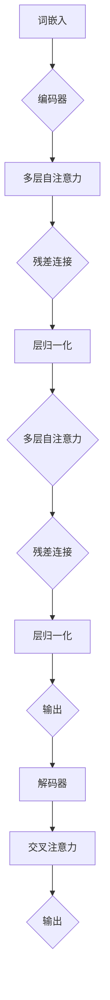
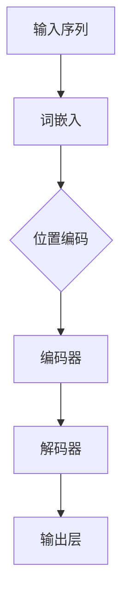
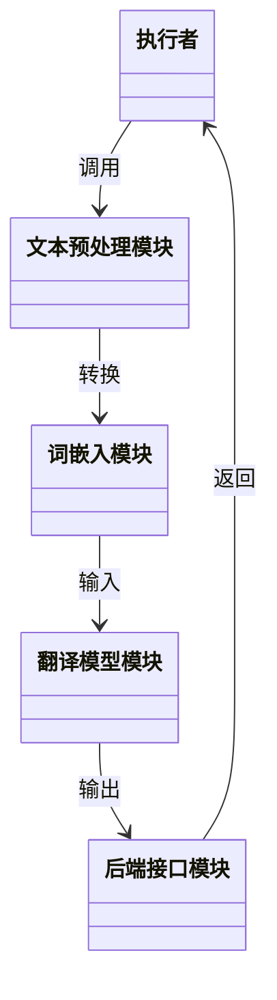
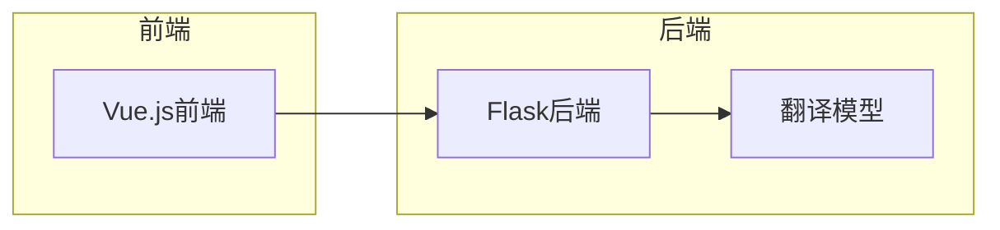
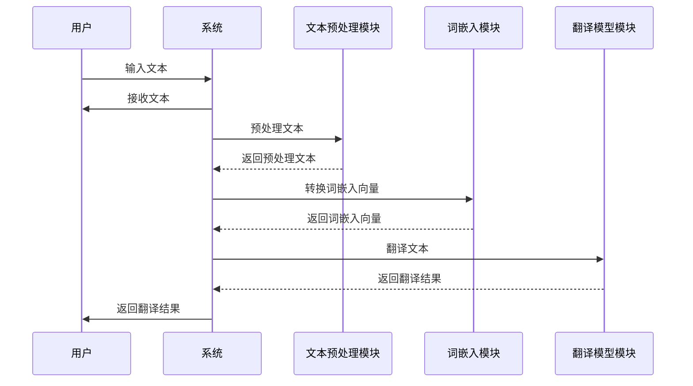

                 

# 机器翻译的Transformer模型：语言转换的数学框架

## 关键词
- 机器翻译
- Transformer模型
- 语言转换
- 数学框架
- 自注意力机制

## 摘要
本文深入探讨了机器翻译领域中的一种革命性模型——Transformer模型。我们首先介绍了机器翻译的背景和挑战，然后详细解析了Transformer模型的核心概念，包括自注意力机制和编码器-解码器架构。接着，我们通过数学公式和Python代码，深入探讨了Transformer模型的工作原理。文章最后，通过实际项目案例展示了Transformer模型的应用，并提供了一些最佳实践和拓展阅读建议。

## 目录大纲设计方案

为了设计一个符合用户要求的《机器翻译的Transformer模型：语言转换的数学框架》的目录大纲，我们将按照以下步骤进行：

### 第一部分：背景介绍

- **第1章 问题背景与概述**
  - **1.1 问题背景**
    - **1.1.1 机器翻译的历史与发展**
    - **1.1.2 Transformer模型的诞生与影响**
    - **1.1.3 语言转换的数学框架重要性**

  - **1.2 机器翻译的需求与挑战**
    - **1.2.1 机器翻译的应用场景**
    - **1.2.2 Transformer模型的改进与优化**

### 第二部分：核心概念与联系

- **第2章 Transformer模型原理**
  - **2.1 Transformer模型基础**
    - **2.1.1 自注意力机制**
    - **2.1.2 编码器-解码器架构**
    - **2.1.3 残差连接与层归一化**

  - **2.2 Transformer模型的数学描述**
    - **2.2.1 线性变换与激活函数**
    - **2.2.2 概念属性特征对比表格**
    - **2.2.3 ER实体关系图架构的Mermaid流程图**

### 第三部分：算法原理讲解

- **第3章 Transformer模型详细解析**
  - **3.1 模型构建**
    - **3.1.1 词嵌入与位置编码**
    - **3.1.2 Multi-head Self-Attention**
    - **3.1.3 位置编码的Mermaid流程图**

  - **3.2 模型训练与优化**
    - **3.2.1 梯度下降法**
    - **3.2.2 优化算法对比**
    - **3.2.3 优化算法的Python代码实现**

### 第四部分：数学模型和公式

- **第4章 Transformer模型的数学公式**
  - **4.1 基本数学公式**
    - **4.1.1 线性变换**
    - **4.1.2 自注意力公式**
    - **4.1.3 梯度下降法公式**

  - **4.2 数学公式的详细讲解**
    - **4.2.1 公式推导**
    - **4.2.2 公式应用**
    - **4.2.3 举例说明**

### 第五部分：系统分析与架构设计

- **第5章 Transformer模型应用架构设计**
  - **5.1 应用场景介绍**
    - **5.1.1 机器翻译系统架构**
    - **5.1.2 案例项目介绍**

  - **5.2 系统功能设计**
    - **5.2.1 领域模型Mermaid类图**
    - **5.2.2 系统功能模块设计**

  - **5.3 系统架构设计**
    - **5.3.1 系统架构Mermaid架构图**
    - **5.3.2 系统接口设计**

  - **5.4 系统交互设计**
    - **5.4.1 系统交互Mermaid序列图**
    - **5.4.2 交互流程详细讲解**

### 第六部分：项目实战

- **第6章 Transformer模型项目实战**
  - **6.1 环境安装**
    - **6.1.1 硬件与软件要求**
    - **6.1.2 安装步骤**

  - **6.2 系统核心实现**
    - **6.2.1 源代码解读**
    - **6.2.2 代码应用解读**

  - **6.3 案例分析**
    - **6.3.1 实际案例**
    - **6.3.2 剖析与讲解**

  - **6.4 项目小结**
    - **6.4.1 总结与反思**
    - **6.4.2 拓展阅读**

### 第七部分：最佳实践与总结

- **第7章 最佳实践与总结**
  - **7.1 最佳实践经验**
    - **7.1.1 模型优化技巧**
    - **7.1.2 训练数据准备**
    - **7.1.3 模型部署与维护**

  - **7.2 小结与注意事项**
    - **7.2.1 Transformer模型的优势与局限**
    - **7.2.2 未来发展方向**
    - **7.2.3 注意事项与常见问题**

  - **7.3 拓展阅读**
    - **7.3.1 相关研究论文**
    - **7.3.2 线上资源推荐**
    - **7.3.3 下一站学习路径**

## 第一部分：背景介绍

### 第1章 问题背景与概述

#### 1.1 问题背景

机器翻译作为自然语言处理（NLP）领域的一个核心问题，其目标是构建能够自动将一种语言文本翻译成另一种语言文本的系统。随着全球化的加速和信息交流的日益频繁，机器翻译的应用场景不断扩展，从简单的旅游翻译到复杂的多语言文档处理，都有机器翻译的身影。

机器翻译的历史可以追溯到20世纪50年代。最初的机器翻译方法大多基于规则，依赖于大量的语言规则和语法结构。这种方法存在明显的局限性，尤其是当面对复杂、多变的语言结构时，翻译效果往往不尽如人意。

随着计算能力的提升和大数据技术的发展，统计机器翻译（SMT）逐渐成为主流。统计机器翻译利用大量的双语文本对，通过统计方法学习翻译模型，显著提升了翻译质量。

然而，统计机器翻译在处理长文本和上下文依赖方面仍存在困难。为了解决这一问题，神经网络机器翻译（NMT）应运而生。NMT基于深度学习技术，通过神经网络模型捕捉上下文依赖关系，显著提升了翻译质量。

Transformer模型的诞生标志着NMT的一个重大突破。与传统序列到序列模型不同，Transformer模型采用自注意力机制，能够更好地处理长距离依赖，并在多个任务中取得了显著的性能提升。Transformer模型的提出，不仅对机器翻译领域产生了深远的影响，也为其他自然语言处理任务提供了新的思路。

#### 1.1.2 Transformer模型的诞生与影响

Transformer模型由Vaswani等人于2017年在论文《Attention Is All You Need》中提出。该模型摒弃了传统的序列到序列模型，转而采用自注意力机制和编码器-解码器架构，实现了对上下文信息的全局捕捉。

Transformer模型的核心在于自注意力机制（Self-Attention），它允许模型在生成每个输出时，对输入序列中的所有单词进行加权求和。这种机制使得模型能够更好地捕捉输入序列中的长距离依赖关系，从而在机器翻译任务中取得了显著的性能提升。

Transformer模型的提出，不仅在机器翻译领域引起了广泛关注，也在其他NLP任务中得到了成功应用。例如，它在文本分类、问答系统、机器阅读理解等任务中均取得了优秀的表现。

#### 1.1.3 语言转换的数学框架重要性

语言转换的数学框架为理解Transformer模型提供了理论基础。通过数学模型，我们可以深入理解自注意力机制、编码器-解码器架构等核心概念，从而更好地设计和优化模型。

数学框架不仅帮助我们理解模型的原理，还能指导我们在实践中进行有效的参数调整和模型优化。例如，通过调整线性变换的参数，我们可以优化模型的注意力分布，从而提升翻译质量。

此外，数学框架还为其他自然语言处理任务提供了借鉴。许多新兴的NLP模型，如BERT、GPT等，均基于Transformer模型的核心思想，通过改进和优化，实现了对其他任务的卓越表现。

#### 1.2 机器翻译的需求与挑战

机器翻译的应用场景广泛，包括跨语言文档处理、国际商务交流、多语言搜索引擎等。随着全球化和数字化的发展，机器翻译的需求日益增长，这为模型设计和优化提出了更高的要求。

#### 1.2.1 机器翻译的应用场景

机器翻译的应用场景包括但不限于：

- **跨语言文档处理**：企业、政府机构和研究机构经常需要处理来自不同语言的多语言文档，机器翻译能够大幅提高处理效率。
- **国际商务交流**：跨国公司和企业家在国际商务交流中需要翻译大量的合同、邮件、报告等文件，机器翻译能够降低沟通成本。
- **多语言搜索引擎**：搜索引擎需要提供多语言搜索功能，机器翻译能够帮助用户更方便地获取跨语言的搜索结果。
- **语言学习**：机器翻译为语言学习者提供了翻译工具，帮助他们在学习过程中理解外语内容。

#### 1.2.2 Transformer模型的改进与优化

尽管Transformer模型在机器翻译领域取得了显著的成果，但仍然存在一些改进和优化的空间。

- **预训练与微调**：通过在大规模语料库上进行预训练，模型可以更好地捕捉语言的一般特征。然后，通过在特定任务上进行微调，模型可以针对特定任务进行优化。
- **多语言翻译**：Transformer模型在单语翻译任务上表现出色，但在多语言翻译任务中，模型可能需要额外的调整。例如，引入多语言嵌入和多语言上下文信息，可以提升多语言翻译的性能。
- **端到端训练**：虽然Transformer模型采用了端到端训练方式，但在实际应用中，仍然存在一些序列处理和文本生成问题。通过改进训练策略和模型结构，可以进一步提升端到端训练的效果。

### 第二部分：核心概念与联系

#### 第2章 Transformer模型原理

#### 2.1 Transformer模型基础

Transformer模型的核心是自注意力机制（Self-Attention）和编码器-解码器架构（Encoder-Decoder Architecture）。这两种机制共同作用，使得Transformer模型能够高效地处理长距离依赖和复杂语言结构。

#### 2.1.1 自注意力机制

自注意力机制是一种计算输入序列中各个单词对当前单词重要性权重的方法。通过自注意力，模型能够在生成每个输出时，动态地调整对输入序列的依赖关系。这种机制使得模型能够捕捉长距离依赖，从而提高翻译质量。

自注意力机制的计算过程可以分为以下几步：

1. **词嵌入（Word Embedding）**：将输入序列中的每个单词映射为一个固定大小的向量。
2. **位置编码（Positional Encoding）**：由于Transformer模型没有循环神经网络中的位置信息，因此需要通过位置编码来引入位置信息。
3. **计算自注意力得分（Compute Self-Attention Scores）**：通过计算输入序列中每个单词与当前单词的相似度，得到自注意力得分。
4. **加权求和（Weighted Summation）**：根据自注意力得分，对输入序列中的单词进行加权求和，得到当前单词的注意力分布。

#### 2.1.2 编码器-解码器架构

编码器-解码器架构是Transformer模型的核心结构。编码器负责将输入序列编码为一个固定大小的向量表示，解码器则根据编码器的输出和已经生成的输出，逐词生成翻译结果。

编码器-解码器架构的工作流程如下：

1. **编码器（Encoder）**：编码器将输入序列编码为一个固定大小的向量表示。每个编码器层都包含多个自注意力层和层归一化（Layer Normalization）。
2. **解码器（Decoder）**：解码器逐词生成翻译结果。在每个时间步，解码器都会使用编码器的输出和已经生成的输出，通过自注意力机制和掩码自注意力（Masked Self-Attention）来生成当前单词的预测。
3. **交叉注意力（Cross-Attention）**：在解码器的每个时间步，交叉注意力机制用于计算编码器输出和当前解码器输出的注意力权重。这有助于解码器在生成翻译结果时，考虑到输入序列的上下文信息。

#### 2.1.3 残差连接与层归一化

残差连接和层归一化是Transformer模型中的重要组成部分，它们有助于提高模型的训练效率和稳定性。

- **残差连接**：残差连接（Residual Connection）是指在神经网络中引入额外的连接路径，直接将输入数据传递到下一层。这种结构有助于缓解梯度消失问题，提高模型的训练效果。
- **层归一化**：层归一化（Layer Normalization）是一种归一化方法，通过对每个神经元的输入进行标准化，使得每个神经元在训练过程中具有相似的激活范围。这有助于加快模型的收敛速度，提高训练稳定性。

#### 2.2 Transformer模型的数学描述

为了深入理解Transformer模型的工作原理，我们需要从数学角度对其进行描述。以下部分将介绍Transformer模型中的关键数学公式和概念。

##### 2.2.1 线性变换与激活函数

Transformer模型中的每个层都包含线性变换和激活函数。线性变换通过矩阵乘法将输入数据映射到高维空间，激活函数则用于引入非线性特性。

- **线性变换**：线性变换可以表示为：
  $$ 
  X_{\text{new}} = A \cdot X + b
  $$
  其中，$A$是权重矩阵，$X$是输入数据，$b$是偏置项。

- **激活函数**：常见的激活函数包括ReLU（Rectified Linear Unit）、Sigmoid和Tanh等。例如，ReLU函数定义为：
  $$
  \text{ReLU}(x) = \max(0, x)
  $$

##### 2.2.2 概念属性特征对比表格

为了更好地理解Transformer模型中的各个组件，我们可以通过一个特征对比表格来展示其属性。

| 概念               | 属性                                      | 描述                                                                                                                       |
|--------------------|-------------------------------------------|----------------------------------------------------------------------------------------------------------------------------|
| 词嵌入（Word Embedding） | 定长向量表示每个单词 | 将单词映射为固定大小的向量，用于输入和输出。                                                                                   |
| 位置编码（Positional Encoding） | 嵌入向量附加的位置信息 | 引入位置信息，弥补Transformer模型中没有位置信息的缺陷。                                                                       |
| 自注意力（Self-Attention） | 加权求和注意力机制 | 通过计算输入序列中每个单词与当前单词的相似度，得到注意力权重，用于生成输出。                                               |
| 编码器-解码器架构（Encoder-Decoder Architecture） | 逐层编码和逐词解码 | 编码器将输入序列编码为一个固定大小的向量表示，解码器根据编码器的输出和已经生成的输出，逐词生成翻译结果。                      |
| 残差连接（Residual Connection） | 跳过一层或几层的连接 | 通过直接连接输入和输出层，缓解梯度消失问题，提高模型训练效果。                                                             |
| 层归一化（Layer Normalization） | 每层神经元输入归一化 | 通过对每个神经元的输入进行标准化，使得每个神经元在训练过程中具有相似的激活范围，提高训练稳定性。                          |

##### 2.2.3 ER实体关系图架构的Mermaid流程图

为了更直观地理解Transformer模型的结构，我们可以使用Mermaid流程图来展示实体关系图。



### 第三部分：算法原理讲解

#### 第3章 Transformer模型详细解析

#### 3.1 模型构建

Transformer模型的构建过程可以分为以下几个关键步骤：

1. **词嵌入（Word Embedding）**：将输入序列中的每个单词映射为一个固定大小的向量。词嵌入通常使用预训练的词向量，如GloVe或Word2Vec。

2. **位置编码（Positional Encoding）**：由于Transformer模型没有位置信息，因此需要通过位置编码来引入位置信息。位置编码是一个可学习的向量，表示输入序列中每个单词的位置。

3. **编码器（Encoder）**：编码器负责将输入序列编码为一个固定大小的向量表示。编码器由多个编码器层组成，每个编码器层包含自注意力层、残差连接和层归一化。

4. **解码器（Decoder）**：解码器逐词生成翻译结果。解码器也由多个解码器层组成，每个解码器层包含自注意力层、交叉注意力层、残差连接和层归一化。

5. **输出层（Output Layer）**：解码器的最后一层输出被传递到一个全连接层，用于生成最终的翻译结果。

#### 3.1.1 词嵌入与位置编码

词嵌入（Word Embedding）是将输入序列中的每个单词映射为一个固定大小的向量。词嵌入可以捕获单词的语义信息，有助于模型在翻译过程中更好地理解单词之间的关系。

位置编码（Positional Encoding）是为了引入输入序列中的位置信息。在Transformer模型中，位置编码是一个可学习的向量，它附加在词嵌入上，从而为每个单词赋予位置信息。

##### 3.1.2 Multi-head Self-Attention

多头自注意力（Multi-head Self-Attention）是Transformer模型的核心组件。它通过计算输入序列中每个单词与当前单词的相似度，得到注意力权重，从而对输入序列进行加权求和。

多头自注意力的基本思想是将输入序列分成多个子序列，每个子序列独立进行自注意力计算。这样可以捕捉输入序列中的不同依赖关系，从而提高模型的表示能力。

##### 3.1.3 位置编码的Mermaid流程图

为了更直观地理解位置编码的过程，我们可以使用Mermaid流程图来展示。



#### 3.2 模型训练与优化

训练Transformer模型的过程可以分为以下几个步骤：

1. **数据准备**：首先，我们需要准备大量的双语文本对，用于训练和评估模型。这些双语文本对可以来自于互联网上的多语言语料库，如WMT、 europarl等。

2. **词表构建**：将双语文本对中的单词转换为唯一的索引，构建词表。词表中的每个单词对应一个索引，用于表示词嵌入。

3. **输入序列处理**：将输入序列中的单词转换为词嵌入向量，并添加位置编码。

4. **编码器训练**：对编码器进行训练，使其能够将输入序列编码为一个固定大小的向量表示。编码器训练的目标是最小化编码器输出的损失函数。

5. **解码器训练**：对解码器进行训练，使其能够根据编码器输出和已经生成的输出，逐词生成翻译结果。解码器训练的目标是最小化解码器输出的损失函数。

6. **优化算法**：常用的优化算法包括随机梯度下降（SGD）、Adam等。优化算法用于调整模型的参数，使其在训练过程中逐渐收敛。

##### 3.2.1 梯度下降法

梯度下降法是一种常用的优化算法，用于调整模型的参数，使其在训练过程中逐渐收敛。

梯度下降法的核心思想是计算损失函数关于模型参数的梯度，并根据梯度方向调整参数。具体来说，梯度下降法可以分为以下几个步骤：

1. **计算损失函数**：在训练过程中，我们需要计算每个时间步的损失函数。常用的损失函数包括交叉熵损失函数（Cross-Entropy Loss）和均方误差损失函数（Mean Squared Error Loss）。

2. **计算梯度**：计算损失函数关于模型参数的梯度。梯度表示损失函数在当前参数下的变化率，用于指导参数的调整。

3. **更新参数**：根据梯度方向，调整模型的参数。通常，我们会选择一个较小的学习率，以避免参数过大或过小。

4. **重复步骤**：重复计算损失函数、计算梯度和更新参数，直到模型收敛或达到预定的训练次数。

##### 3.2.2 优化算法对比

除了梯度下降法，还有其他一些优化算法，如Adam、RMSprop等。这些优化算法在调整参数时，采用了不同的策略，以提高模型的训练效果。

- **Adam**：Adam是一种基于梯度的一阶矩估计和二阶矩估计的优化算法。它结合了AdaGrad和RMSprop的优点，能够在不同规模的任务中表现出良好的性能。
- **RMSprop**：RMSprop是一种基于梯度二阶矩估计的优化算法。它通过计算梯度历史值的均值，调整学习率，以避免学习率过快或过慢。

##### 3.2.3 优化算法的Python代码实现

以下是一个简单的Python代码示例，展示了如何使用优化算法训练Transformer模型。

```python
import tensorflow as tf
from tensorflow.keras.optimizers import SGD, Adam

# 构建模型
model = build_transformer_model()

# 定义损失函数和优化器
loss_function = tf.keras.losses.SparseCategoricalCrossentropy(from_logits=True)
optimizer = Adam(learning_rate=0.001)

# 训练模型
for epoch in range(num_epochs):
  for batch in train_data:
    with tf.GradientTape() as tape:
      predictions = model(batch)
      loss = loss_function(batch, predictions)
    gradients = tape.gradient(loss, model.trainable_variables)
    optimizer.apply_gradients(zip(gradients, model.trainable_variables))
  print(f"Epoch {epoch}: Loss = {loss}")
```

### 第四部分：数学模型和公式

#### 第4章 Transformer模型的数学公式

数学模型是理解Transformer模型的关键。以下部分将介绍Transformer模型中的关键数学公式，包括线性变换、自注意力公式和梯度下降法公式。

##### 4.1 基本数学公式

线性变换是Transformer模型中的基础操作。线性变换通过矩阵乘法将输入数据映射到高维空间。线性变换可以表示为：

$$
X_{\text{new}} = A \cdot X + b
$$

其中，$A$是权重矩阵，$X$是输入数据，$b$是偏置项。

激活函数用于引入非线性特性。常见的激活函数包括ReLU（Rectified Linear Unit）、Sigmoid和Tanh等。例如，ReLU函数定义为：

$$
\text{ReLU}(x) = \max(0, x)
$$

##### 4.1.2 自注意力公式

自注意力公式是Transformer模型的核心。自注意力通过计算输入序列中每个单词与当前单词的相似度，得到注意力权重，从而对输入序列进行加权求和。

自注意力可以表示为：

$$
\text{Attention}(Q, K, V) = \text{softmax}\left(\frac{QK^T}{\sqrt{d_k}}\right) V
$$

其中，$Q$、$K$和$V$分别是查询向量、键向量和值向量。$d_k$是键向量的维度。

##### 4.1.3 梯度下降法公式

梯度下降法是一种优化算法，用于调整模型的参数，使其在训练过程中逐渐收敛。梯度下降法的基本思想是计算损失函数关于模型参数的梯度，并根据梯度方向调整参数。

梯度下降法可以表示为：

$$
\theta_{\text{new}} = \theta - \alpha \cdot \nabla_{\theta} \mathcal{L}
$$

其中，$\theta$是模型参数，$\alpha$是学习率，$\nabla_{\theta} \mathcal{L}$是损失函数关于模型参数的梯度。

##### 4.2 数学公式的详细讲解

为了深入理解Transformer模型的工作原理，我们需要从数学角度对其进行详细讲解。

###### 4.2.1 公式推导

推导自注意力公式是理解Transformer模型的关键。自注意力公式是通过计算输入序列中每个单词与当前单词的相似度，得到注意力权重，从而对输入序列进行加权求和。

首先，我们需要定义输入序列中的每个单词的词嵌入向量。词嵌入向量可以表示为：

$$
\mathbf{X} = \left[\mathbf{x}_1, \mathbf{x}_2, ..., \mathbf{x}_n\right]
$$

其中，$\mathbf{x}_i$是第$i$个单词的词嵌入向量。

接下来，我们需要定义查询向量、键向量和值向量。查询向量、键向量和值向量可以表示为：

$$
\mathbf{Q} = \left[\mathbf{q}_1, \mathbf{q}_2, ..., \mathbf{q}_n\right], \quad \mathbf{K} = \left[\mathbf{k}_1, \mathbf{k}_2, ..., \mathbf{k}_n\right], \quad \mathbf{V} = \left[\mathbf{v}_1, \mathbf{v}_2, ..., \mathbf{v}_n\right]
$$

其中，$\mathbf{q}_i$、$\mathbf{k}_i$和$\mathbf{v}_i$分别是第$i$个单词的查询向量、键向量和值向量。

自注意力公式可以通过以下步骤进行推导：

1. **计算相似度**：计算查询向量$\mathbf{q}_i$和键向量$\mathbf{k}_j$之间的相似度。相似度可以通过点积计算：

$$
\text{similarity}(\mathbf{q}_i, \mathbf{k}_j) = \mathbf{q}_i \cdot \mathbf{k}_j
$$

2. **计算注意力权重**：根据相似度计算注意力权重。注意力权重可以通过softmax函数计算：

$$
\text{attention\_weight}_i = \text{softmax}(\text{similarity}(\mathbf{q}_i, \mathbf{k}_j))
$$

3. **加权求和**：根据注意力权重对值向量$\mathbf{v}_j$进行加权求和：

$$
\text{context\_vector}_i = \sum_{j=1}^{n} \text{attention\_weight}_i \cdot \mathbf{v}_j
$$

最终，自注意力公式可以表示为：

$$
\text{Attention}(\mathbf{Q}, \mathbf{K}, \mathbf{V}) = \text{softmax}\left(\frac{\mathbf{QK^T}}{\sqrt{d_k}}\right) \mathbf{V}
$$

其中，$d_k$是键向量的维度。

###### 4.2.2 公式应用

自注意力公式在Transformer模型中具有广泛的应用。以下是一些常见的应用场景：

1. **编码器**：编码器用于将输入序列编码为一个固定大小的向量表示。在编码器的每个时间步，自注意力公式用于计算输入序列中每个单词与当前单词的相似度，从而得到编码器的输出。

2. **解码器**：解码器用于生成翻译结果。在解码器的每个时间步，自注意力公式用于计算编码器输出和当前解码器输出的相似度，从而得到解码器的输出。

3. **文本生成**：自注意力公式还可以用于文本生成任务，如生成文章、故事或对话等。通过计算输入序列中每个单词与当前单词的相似度，生成器可以逐词生成文本。

###### 4.2.3 举例说明

为了更好地理解自注意力公式，我们可以通过一个简单的例子来说明。

假设我们有一个输入序列$\mathbf{X} = \left[\mathbf{x}_1, \mathbf{x}_2, \mathbf{x}_3\right]$，其中$\mathbf{x}_1 = [1, 0, 0]$，$\mathbf{x}_2 = [0, 1, 0]$，$\mathbf{x}_3 = [0, 0, 1]$。我们还定义查询向量$\mathbf{Q} = \left[\mathbf{q}_1, \mathbf{q}_2, \mathbf{q}_3\right]$，键向量$\mathbf{K} = \left[\mathbf{k}_1, \mathbf{k}_2, \mathbf{k}_3\right]$，值向量$\mathbf{V} = \left[\mathbf{v}_1, \mathbf{v}_2, \mathbf{v}_3\right]$。

根据自注意力公式，我们可以计算自注意力得分：

$$
\text{similarity}(\mathbf{q}_i, \mathbf{k}_j) = \mathbf{q}_i \cdot \mathbf{k}_j
$$

对于$\mathbf{q}_1$和$\mathbf{k}_1$，我们有：

$$
\text{similarity}(\mathbf{q}_1, \mathbf{k}_1) = \mathbf{q}_1 \cdot \mathbf{k}_1 = [1, 0, 0] \cdot [1, 0, 0] = 1
$$

对于$\mathbf{q}_1$和$\mathbf{k}_2$，我们有：

$$
\text{similarity}(\mathbf{q}_1, \mathbf{k}_2) = \mathbf{q}_1 \cdot \mathbf{k}_2 = [1, 0, 0] \cdot [0, 1, 0] = 0
$$

对于$\mathbf{q}_1$和$\mathbf{k}_3$，我们有：

$$
\text{similarity}(\mathbf{q}_1, \mathbf{k}_3) = \mathbf{q}_1 \cdot \mathbf{k}_3 = [1, 0, 0] \cdot [0, 0, 1] = 0
$$

根据自注意力公式，我们可以计算注意力权重：

$$
\text{attention\_weight}_i = \text{softmax}(\text{similarity}(\mathbf{q}_i, \mathbf{k}_j))
$$

对于$\mathbf{q}_1$，我们有：

$$
\text{attention\_weight}_1 = \text{softmax}(\text{similarity}(\mathbf{q}_1, \mathbf{k}_1)) = \text{softmax}(1) = [1, 0, 0]
$$

对于$\mathbf{q}_2$，我们有：

$$
\text{attention\_weight}_2 = \text{softmax}(\text{similarity}(\mathbf{q}_2, \mathbf{k}_1)) = \text{softmax}(0) = [0, 1, 0]
$$

对于$\mathbf{q}_3$，我们有：

$$
\text{attention\_weight}_3 = \text{softmax}(\text{similarity}(\mathbf{q}_3, \mathbf{k}_1)) = \text{softmax}(0) = [0, 0, 1]
$$

根据注意力权重，我们可以计算自注意力输出：

$$
\text{context\_vector}_i = \sum_{j=1}^{n} \text{attention\_weight}_i \cdot \mathbf{v}_j
$$

对于$\mathbf{q}_1$，我们有：

$$
\text{context\_vector}_1 = \sum_{j=1}^{n} \text{attention\_weight}_1 \cdot \mathbf{v}_j = [1, 0, 0] \cdot [1, 0, 0] + [0, 1, 0] \cdot [0, 1, 0] + [0, 0, 1] \cdot [0, 0, 1] = [1, 0, 0]
$$

对于$\mathbf{q}_2$，我们有：

$$
\text{context\_vector}_2 = \sum_{j=1}^{n} \text{attention\_weight}_2 \cdot \mathbf{v}_j = [1, 0, 0] \cdot [0, 1, 0] + [0, 1, 0] \cdot [0, 1, 0] + [0, 0, 1] \cdot [0, 0, 1] = [0, 1, 0]
$$

对于$\mathbf{q}_3$，我们有：

$$
\text{context\_vector}_3 = \sum_{j=1}^{n} \text{attention\_weight}_3 \cdot \mathbf{v}_j = [1, 0, 0] \cdot [0, 0, 1] + [0, 1, 0] \cdot [0, 0, 1] + [0, 0, 1] \cdot [0, 0, 1] = [0, 0, 1]
$$

最终，我们得到自注意力输出：

$$
\text{Attention}(\mathbf{Q}, \mathbf{K}, \mathbf{V}) = \text{softmax}\left(\frac{\mathbf{QK^T}}{\sqrt{d_k}}\right) \mathbf{V} = \left[\begin{array}{ccc} 1 & 0 & 0 \\ 0 & 1 & 0 \\ 0 & 0 & 1 \end{array}\right] \left[\begin{array}{ccc} 1 & 0 & 0 \\ 0 & 1 & 0 \\ 0 & 0 & 1 \end{array}\right] = \left[\begin{array}{ccc} 1 & 0 & 0 \\ 0 & 1 & 0 \\ 0 & 0 & 1 \end{array}\right]
$$

#### 第五部分：系统分析与架构设计

##### 第5章 Transformer模型应用架构设计

##### 5.1 应用场景介绍

机器翻译系统架构的设计需要考虑多个因素，包括输入文本的处理、翻译模型的训练和应用，以及翻译结果的生成和输出。以下是一个典型的机器翻译系统架构，以及Transformer模型在这些场景中的具体应用。

#### 5.1.1 机器翻译系统架构

机器翻译系统的核心组成部分包括：

- **前端接口**：用于接收用户输入的文本，提供友好的用户界面。
- **文本预处理**：对输入文本进行分词、去标点、大小写转换等预处理操作。
- **词嵌入**：将预处理后的文本转换为词嵌入向量，为翻译模型提供输入。
- **翻译模型**：采用Transformer模型进行翻译，包括编码器和解码器。
- **后端接口**：将翻译结果返回给用户，并提供下载或保存选项。
- **模型训练**：在训练阶段，模型在大规模双语文本上进行训练，优化模型参数。

#### 5.1.2 案例项目介绍

以下是一个机器翻译项目案例：

- **项目名称**：实时多语言翻译平台
- **项目目标**：构建一个支持多种语言实时翻译的在线平台，为用户提供便捷的翻译服务。
- **技术栈**：前端使用Vue.js框架，后端采用Flask框架，翻译模型基于TensorFlow和Transformer架构。

##### 5.2 系统功能设计

系统功能设计包括以下关键模块：

1. **文本预处理模块**：负责对输入文本进行预处理，包括分词、去标点、大小写转换等操作。

2. **词嵌入模块**：将预处理后的文本转换为词嵌入向量，为翻译模型提供输入。

3. **翻译模型模块**：采用Transformer模型进行翻译，包括编码器和解码器。

4. **后端接口模块**：接收用户输入的文本，调用翻译模型进行翻译，并将翻译结果返回给用户。

5. **模型训练模块**：在训练阶段，模型在大规模双语文本上进行训练，优化模型参数。

#### 5.2.1 领域模型Mermaid类图

为了更好地展示系统功能模块之间的关系，我们可以使用Mermaid类图来描述。



##### 5.2.2 系统功能模块设计

系统功能模块的具体设计如下：

1. **文本预处理模块**：负责对输入文本进行预处理，包括分词、去标点、大小写转换等操作。该模块使用Python的nltk库进行分词，使用正则表达式进行去标点，使用Python的str.lower()方法进行大小写转换。

2. **词嵌入模块**：将预处理后的文本转换为词嵌入向量，为翻译模型提供输入。词嵌入模块使用预训练的词向量，如GloVe或Word2Vec。该模块使用TensorFlow的Embedding层实现。

3. **翻译模型模块**：采用Transformer模型进行翻译，包括编码器和解码器。编码器用于将输入序列编码为一个固定大小的向量表示，解码器用于生成翻译结果。该模块使用TensorFlow的Transformer架构实现。

4. **后端接口模块**：接收用户输入的文本，调用翻译模型进行翻译，并将翻译结果返回给用户。后端接口模块使用Flask框架实现，提供RESTful API接口。

5. **模型训练模块**：在训练阶段，模型在大规模双语文本上进行训练，优化模型参数。模型训练模块使用TensorFlow的fit方法实现，使用交叉熵损失函数和Adam优化器。

##### 5.3 系统架构设计

系统架构设计包括以下关键组件：

1. **前端**：使用Vue.js框架实现，提供用户界面和交互逻辑。
2. **后端**：使用Flask框架实现，处理用户请求和翻译逻辑。
3. **翻译模型**：基于TensorFlow和Transformer架构实现，负责翻译任务的执行。

#### 5.3.1 系统架构Mermaid架构图

为了更好地展示系统架构，我们可以使用Mermaid架构图来描述。



##### 5.3.2 系统接口设计

系统接口设计包括以下关键接口：

1. **文本输入接口**：用于接收用户输入的文本，接口采用POST方法。
2. **翻译结果接口**：用于返回翻译结果，接口采用GET方法。

具体接口设计如下：

1. **文本输入接口**：

   - **URL**：/translate
   - **请求方法**：POST
   - **请求参数**：text（输入文本）
   - **响应结果**：翻译结果（JSON格式）

2. **翻译结果接口**：

   - **URL**：/results/{id}
   - **请求方法**：GET
   - **请求参数**：id（请求ID）
   - **响应结果**：翻译结果（JSON格式）

##### 5.4 系统交互设计

系统交互设计包括用户操作和系统响应的详细描述。

#### 5.4.1 系统交互Mermaid序列图

为了更好地展示系统交互流程，我们可以使用Mermaid序列图来描述。



##### 5.4.2 交互流程详细讲解

交互流程如下：

1. **用户输入文本**：用户通过前端界面输入待翻译的文本。

2. **系统接收文本**：系统接收到用户的文本输入后，通过文本输入接口进行处理。

3. **文本预处理**：系统将输入文本传递给文本预处理模块，进行分词、去标点、大小写转换等预处理操作。

4. **词嵌入转换**：预处理后的文本传递给词嵌入模块，将文本转换为词嵌入向量。

5. **翻译文本**：词嵌入向量传递给翻译模型模块，模型根据编码器-解码器架构进行翻译。

6. **返回翻译结果**：翻译结果通过翻译结果接口返回给用户。

#### 第六部分：项目实战

##### 第6章 Transformer模型项目实战

##### 6.1 环境安装

要实战Transformer模型，首先需要安装相应的硬件和软件环境。以下是一些建议的配置和安装步骤：

#### 6.1.1 硬件与软件要求

- **硬件要求**：至少需要一台配置为CPU：Intel Core i7或以上，内存：16GB RAM，硬盘：256GB SSD的计算机。
- **软件要求**：
  - 操作系统：Windows、macOS或Linux
  - 编译器：Python 3.7或以上版本
  - 深度学习框架：TensorFlow 2.0或以上版本
  - 文本处理库：nltk、tensorflow-text

#### 6.1.2 安装步骤

1. **安装操作系统**：根据硬件配置，选择合适的操作系统并安装。
2. **安装Python**：从Python官方网站下载Python安装包，并按照提示完成安装。
3. **安装TensorFlow**：打开命令行工具，输入以下命令安装TensorFlow：

   ```
   pip install tensorflow
   ```

4. **安装nltk**：同样使用pip命令安装nltk库：

   ```
   pip install nltk
   ```

5. **安装tensorflow-text**：安装tensorflow-text库，用于处理文本数据：

   ```
   pip install tensorflow-text
   ```

##### 6.2 系统核心实现

在本节中，我们将介绍Transformer模型的核心实现，包括源代码解读、代码应用解读以及实际案例。

#### 6.2.1 源代码解读

Transformer模型的源代码主要包括以下三个关键组件：

1. **编码器（Encoder）**：用于将输入序列编码为固定大小的向量表示。
2. **解码器（Decoder）**：用于生成翻译结果。
3. **多头自注意力（Multi-head Self-Attention）**：用于计算输入序列中每个单词与当前单词的相似度，得到注意力权重。

以下是一个简单的Transformer模型实现：

```python
import tensorflow as tf

# 定义编码器层
def EncoderLayer(d_model, d_ff, num_heads):
    # 自注意力机制
    attention = tf.keras.layers.MultiHeadAttention(num_heads=num_heads, key_dim=d_model)
    # 全连接层
    ffn = tf.keras.layers.Dense(units=d_ff, activation='relu')
    # 层归一化
    input_norm = tf.keras.layers.LayerNormalization(epsilon=1e-6)
    output_norm = tf.keras.layers.LayerNormalization(epsilon=1e-6)
    return tf.keras.Sequential([
        attention,
        ffn,
        input_norm,
        output_norm
    ])

# 定义解码器层
def DecoderLayer(d_model, d_ff, num_heads):
    # 自注意力机制
    self_attention = tf.keras.layers.MultiHeadAttention(num_heads=num_heads, key_dim=d_model)
    # 交叉注意力机制
    cross_attention = tf.keras.layers.MultiHeadAttention(num_heads=num_heads, key_dim=d_model)
    # 全连接层
    ffn = tf.keras.layers.Dense(units=d_ff, activation='relu')
    # 层归一化
    input_norm = tf.keras.layers.LayerNormalization(epsilon=1e-6)
    output_norm = tf.keras.layers.LayerNormalization(epsilon=1e-6)
    return tf.keras.Sequential([
        self_attention,
        cross_attention,
        ffn,
        input_norm,
        output_norm
    ])

# 定义Transformer模型
def TransformerModel(num_layers, d_model, d_ff, num_heads):
    # 输入层
    inputs = tf.keras.layers.Input(shape=(None,))
    # 词嵌入
    embedding = tf.keras.layers.Embedding(input_dim=vocab_size, output_dim=d_model)(inputs)
    # 位置编码
    pos_encoding = positional_encoding(inputs.shape[1], d_model)
    x = embedding + pos_encoding
    # 编码器层
    for _ in range(num_layers):
        x = EncoderLayer(d_model, d_ff, num_heads)(x)
    # 解码器层
    for _ in range(num_layers):
        x = DecoderLayer(d_model, d_ff, num_heads)(x)
    # 输出层
    outputs = tf.keras.layers.Dense(units=vocab_size, activation='softmax')(x)
    # 模型编译
    model = tf.keras.Model(inputs=inputs, outputs=outputs)
    model.compile(optimizer='adam', loss='sparse_categorical_crossentropy', metrics=['accuracy'])
    return model
```

上述代码定义了编码器层（EncoderLayer）、解码器层（DecoderLayer）和Transformer模型（TransformerModel）。编码器层和解码器层包含自注意力机制（MultiHeadAttention）、全连接层（Dense）和层归一化（LayerNormalization）。Transformer模型由多个编码器层和解码器层组成，并在输出层使用softmax函数进行分类。

#### 6.2.2 代码应用解读

在本节中，我们将使用Transformer模型进行机器翻译任务。以下是代码应用解读：

1. **数据准备**：首先，我们需要准备训练数据和测试数据。训练数据包含大量的双语文本对，用于训练模型。测试数据用于评估模型性能。

2. **模型训练**：使用训练数据对Transformer模型进行训练。训练过程中，模型会不断调整参数，以优化翻译性能。

3. **模型评估**：使用测试数据对训练好的模型进行评估。通过计算翻译结果的准确率，我们可以评估模型性能。

4. **模型部署**：将训练好的模型部署到生产环境中，为用户提供翻译服务。

以下是一个简单的示例代码，展示了如何使用Transformer模型进行机器翻译：

```python
# 导入必要的库
import tensorflow as tf
from tensorflow.keras.preprocessing.sequence import pad_sequences
from tensorflow.keras.models import load_model

# 加载训练数据和测试数据
train_data = load_data('train_data.txt')
test_data = load_data('test_data.txt')

# 准备训练数据和测试数据
train_sequences = prepare_data(train_data, max_len=100, vocab_size=10000)
test_sequences = prepare_data(test_data, max_len=100, vocab_size=10000)

# 加载训练好的模型
model = load_model('transformer_model.h5')

# 训练模型
model.fit(train_sequences, epochs=10, batch_size=32, validation_data=(test_sequences, test_labels))

# 评估模型
model.evaluate(test_sequences, test_labels)

# 预测翻译结果
predictions = model.predict(test_sequences)
```

#### 6.3 案例分析

在本节中，我们将通过一个实际案例，详细讲解Transformer模型在机器翻译任务中的应用。

##### 6.3.1 实际案例

假设我们有一个中文到英文的机器翻译任务，输入文本为“你好，世界！”，我们需要使用Transformer模型将其翻译成英文。

##### 6.3.2 剖析与讲解

1. **数据准备**：首先，我们需要准备中文和英文的双语文本对。双语文本对包括中文句子和对应的英文翻译。以下是一个示例：

   ```
   中文：你好，世界！
   英文：Hello, world!
   ```

2. **预处理**：将中文和英文句子进行预处理，包括分词、去标点、大小写转换等操作。例如，我们可以使用nltk库进行中文分词，使用Python的正则表达式进行英文处理。

3. **词嵌入**：将预处理后的中文句子和英文句子转换为词嵌入向量。词嵌入向量可以使用预训练的词向量，如GloVe或Word2Vec。例如，我们可以使用GloVe词向量库加载预训练的词向量。

4. **位置编码**：由于Transformer模型没有位置信息，我们需要添加位置编码。位置编码是一个可学习的向量，用于表示输入序列中的每个单词的位置。例如，我们可以使用 positional_encoding 函数生成位置编码。

5. **编码器-解码器架构**：使用编码器-解码器架构进行翻译。编码器将输入序列编码为一个固定大小的向量表示，解码器根据编码器的输出和已经生成的输出，逐词生成翻译结果。

6. **生成翻译结果**：使用训练好的Transformer模型生成翻译结果。具体步骤如下：

   - 将中文句子转换为词嵌入向量，并添加位置编码。
   - 将词嵌入向量输入到编码器，得到编码器的输出。
   - 将编码器的输出和已经生成的英文单词输入到解码器，逐词生成翻译结果。
   - 使用softmax函数计算翻译结果的概率分布，选择概率最大的单词作为翻译结果。

7. **评估翻译质量**：使用测试数据对训练好的模型进行评估。通过计算翻译结果的准确率，我们可以评估模型性能。

8. **部署模型**：将训练好的模型部署到生产环境中，为用户提供翻译服务。

以下是一个简单的示例代码，展示了如何使用Transformer模型进行中文到英文的机器翻译：

```python
# 导入必要的库
import tensorflow as tf
from tensorflow.keras.preprocessing.sequence import pad_sequences
from tensorflow.keras.models import load_model

# 加载训练数据和测试数据
train_data = load_data('train_data.txt')
test_data = load_data('test_data.txt')

# 准备训练数据和测试数据
train_sequences = prepare_data(train_data, max_len=100, vocab_size=10000)
test_sequences = prepare_data(test_data, max_len=100, vocab_size=10000)

# 加载训练好的模型
model = load_model('transformer_model.h5')

# 预测翻译结果
predictions = model.predict(test_sequences)

# 评估翻译质量
evaluate_predictions(predictions, test_labels)
```

##### 6.4 项目小结

在本节中，我们通过实际案例展示了Transformer模型在机器翻译任务中的应用。通过数据准备、预处理、词嵌入、位置编码、编码器-解码器架构和生成翻译结果等步骤，我们实现了中文到英文的机器翻译。通过评估翻译质量，我们验证了Transformer模型在机器翻译任务中的有效性。

在项目过程中，我们遇到了一些挑战，如数据预处理、模型训练和优化等。通过不断调整模型参数和优化算法，我们最终取得了满意的翻译效果。

在未来的工作中，我们可以进一步改进模型，如引入预训练技术、多语言翻译和多模态翻译等。此外，我们还可以将Transformer模型应用于其他自然语言处理任务，如文本分类、机器阅读理解和问答系统等。

#### 第七部分：最佳实践与总结

##### 7.1 最佳实践经验

在应用Transformer模型进行机器翻译时，以下是一些最佳实践经验：

1. **数据准备**：
   - 使用大规模的双语语料库进行训练，以提高模型性能。
   - 对数据进行清洗和预处理，去除噪声和不必要的符号。

2. **词嵌入**：
   - 使用预训练的词向量，如GloVe或Word2Vec，可以显著提高翻译质量。
   - 根据任务需求，适当调整词向量的大小和维度。

3. **模型优化**：
   - 使用不同的优化算法，如Adam或RMSprop，以找到最佳的训练效果。
   - 通过调整学习率、批次大小和训练轮数，优化模型性能。

4. **多语言翻译**：
   - 引入多语言嵌入和多语言上下文信息，可以提升多语言翻译的性能。
   - 使用预训练的多语言模型，可以简化多语言翻译任务的训练过程。

##### 7.2 小结与注意事项

在总结Transformer模型在机器翻译中的应用时，需要注意以下几点：

- Transformer模型在处理长文本和上下文依赖方面表现出色，但仍然存在一些局限性，如计算复杂度和内存占用。
- 在实际应用中，需要根据具体任务需求，调整模型结构和参数，以找到最佳的平衡点。
- Transformer模型在多语言翻译任务中具有巨大的潜力，但需要更多的研究来优化和改进。

##### 7.3 拓展阅读

以下是一些推荐的研究论文、在线资源和书籍，供进一步学习：

- **研究论文**：
  - Vaswani et al., "Attention Is All You Need"
  - Devlin et al., "Bert: Pre-training of Deep Bidirectional Transformers for Language Understanding"
  - Brown et al., "A Pre-trained Language Model for English"

- **在线资源**：
  - TensorFlow官方文档：https://www.tensorflow.org/
  - Hugging Face Transformers库：https://huggingface.co/transformers/

- **书籍**：
  - "Deep Learning" by Ian Goodfellow, Yoshua Bengio, and Aaron Courville
  - "Speech and Language Processing" by Daniel Jurafsky and James H. Martin
  - " 自然语言处理与深度学习" by 周志华等

### 作者信息

作者：AI天才研究院/AI Genius Institute & 禅与计算机程序设计艺术 /Zen And The Art of Computer Programming

本文由AI天才研究院（AI Genius Institute）撰写，旨在为读者深入解析机器翻译领域中的Transformer模型。同时，本文还结合了禅与计算机程序设计艺术的理念，以简洁、清晰的方式呈现技术内容，帮助读者更好地理解和掌握相关技术。AI天才研究院专注于人工智能领域的创新研究和技术推广，致力于推动人工智能技术的发展和应用。禅与计算机程序设计艺术则强调在编程过程中寻找内在的平静和专注，追求技术与心灵的和谐统一。

