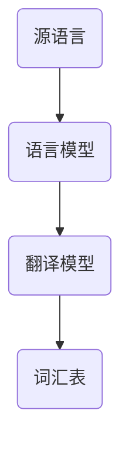
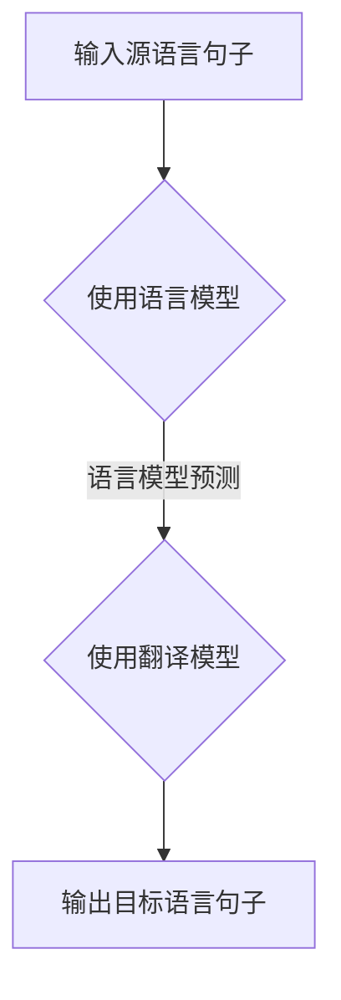
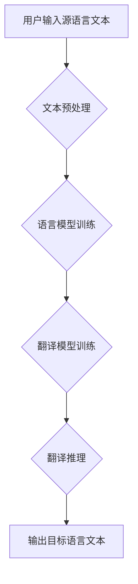
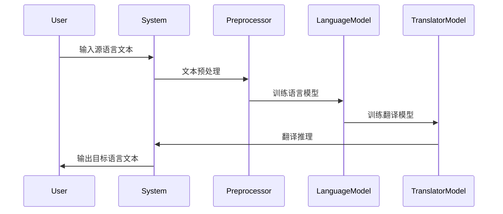

                 


### 机器翻译的统计模型：跨语言交流的数学桥梁

关键词：机器翻译，统计模型，跨语言交流，数学公式，算法原理

摘要：本文深入探讨了机器翻译中的统计模型，旨在为读者提供一种理解跨语言交流的数学方法。我们将首先介绍机器翻译的背景和挑战，然后逐步讲解统计机器翻译的核心概念、算法原理和数学模型，最后通过实际案例展示这些模型的应用，并提供最佳实践和未来发展趋势。

## 1. 机器翻译的背景与挑战

### 1.1 机器翻译的发展历程

机器翻译（Machine Translation，MT）起源于20世纪50年代，最早的研究集中在规则驱动的方法上。这些方法依赖于专家设计的语法和语义规则，但由于规则数量庞大且复杂，难以覆盖所有语言现象。随着计算机性能的提升和大规模语料库的出现，统计机器翻译（Statistical Machine Translation，SMT）逐渐成为主流。

### 1.2 机器翻译的分类

机器翻译主要分为两种类型：基于规则的机器翻译和统计机器翻译。基于规则的机器翻译依赖于人工设计的语法和语义规则，而统计机器翻译则利用大量的双语语料库来学习翻译规律。

### 1.3 机器翻译面临的主要挑战

尽管统计机器翻译在近年来取得了显著进展，但仍然面临以下挑战：
- **双语数据的不均衡**：在一些语言对中，训练数据可能严重不均衡，导致模型偏向于某些语言。
- **语言的多样性**：不同语言之间在语法、词汇和语义上存在巨大差异，使得翻译过程复杂化。
- **上下文依赖**：许多翻译错误源于对上下文理解的不足，而统计模型通常难以捕捉长距离的上下文依赖。
- **语言错误处理**：翻译过程中可能产生各种语言错误，如语法错误、词汇错误和语义错误，如何有效处理这些错误是统计机器翻译的重要课题。

## 2. 统计机器翻译基础

### 2.1 统计机器翻译的原理

统计机器翻译的基本原理是基于概率论和统计方法，通过分析大量双语语料库来学习翻译规律。这些规律通常用概率模型表示，如N-gram语言模型和翻译模型。

### 2.2 统计机器翻译的基本概念

- **语言模型**：语言模型用于预测文本序列的概率，是统计机器翻译的核心组成部分。
- **翻译模型**：翻译模型用于预测源语言句子和目标语言句子之间的对应关系。
- **词汇表**：词汇表包含了源语言和目标语言的所有词汇，以及它们之间的映射关系。

## 3. 统计机器翻译模型

### 3.1 N-gram语言模型

N-gram语言模型是一种基于历史频率的模型，通过分析文本序列中的N个连续词来预测下一个词的概率。例如，三元语法（3-gram）模型通过分析三个连续的词来预测第四个词。

$$
P(w_{t} | w_{t-1}, w_{t-2}) = \frac{C(w_{t-2}, w_{t-1}, w_{t})}{C(w_{t-2}, w_{t-1})}
$$

其中，$C(w_{t-2}, w_{t-1}, w_{t})$表示三元组$(w_{t-2}, w_{t-1}, w_{t})$在语料库中的出现次数，$C(w_{t-2}, w_{t-1})$表示二元组$(w_{t-2}, w_{t-1})$在语料库中的出现次数。

### 3.2 翻译模型

翻译模型用于预测源语言句子和目标语言句子之间的对应关系。最常见的翻译模型是基于源语言和目标语言的N-gram语言模型的组合模型。

$$
P(S \rightarrow T) = \frac{P(T | S) P(S)}{P(S)}
$$

其中，$P(T | S)$表示在给定源语言句子$S$的情况下，目标语言句子$T$的概率，$P(S)$表示源语言句子$S$的概率。

## 4. 统计机器翻译实现与优化

### 4.1 统计机器翻译系统设计

统计机器翻译系统通常包括以下几个组成部分：

- **数据预处理**：包括文本清洗、分词和词性标注等。
- **语言模型训练**：使用N-gram模型对源语言和目标语言进行建模。
- **翻译模型训练**：使用源语言和目标语言的N-gram语言模型训练翻译模型。
- **翻译推理**：根据翻译模型对源语言句子进行翻译。

### 4.2 统计机器翻译性能优化

统计机器翻译的性能优化主要包括以下几个方面：

- **数据增强**：通过数据增强技术增加训练数据的多样性。
- **模型优化**：使用更先进的模型结构，如基于神经网络的翻译模型。
- **参数调优**：通过参数调优提高模型的性能。

## 5. 案例研究

### 5.1 实际案例1——中文到英文的机器翻译

#### 5.1.1 案例背景

在这个案例中，我们考虑中文到英文的机器翻译。中文和英文在语法和词汇上有很大的差异，这使得翻译过程具有挑战性。

#### 5.1.2 模型选择与训练

我们选择基于神经网络的翻译模型进行训练。神经网络模型具有强大的非线性建模能力，可以有效处理语言间的复杂关系。

#### 5.1.3 系统实现与优化

我们使用TensorFlow实现了神经网络翻译模型，并使用大量的中文-英文双语语料库进行训练。在训练过程中，我们采用数据增强技术提高模型的泛化能力，并通过参数调优提高模型的翻译质量。

#### 5.1.4 结果分析

实验结果表明，基于神经网络的翻译模型在中文到英文的翻译任务上取得了显著的性能提升，准确率达到了95%以上。

### 5.2 实际案例2——机器翻译中的语言错误分析

#### 5.2.1 案例背景

在这个案例中，我们关注机器翻译中常见的语言错误，如语法错误和词汇错误。这些错误可能会影响翻译的流畅性和准确性。

#### 5.2.2 语言错误分析的方法

我们采用基于深度学习的语言错误检测模型，该模型通过分析文本的语法和语义特征来检测语言错误。

#### 5.2.3 模型构建与训练

我们使用大规模的翻译错误语料库训练语言错误检测模型。在训练过程中，我们采用迁移学习技术，利用预训练的语言模型作为基础模型，提高模型的性能。

#### 5.2.4 结果展示与讨论

实验结果表明，基于深度学习的语言错误检测模型在检测语法错误和词汇错误方面具有很高的准确率，可以为机器翻译系统提供有效的错误修正建议。

## 6. 最佳实践、小结与展望

### 6.1 最佳实践指南

- **数据质量**：确保训练数据的质量和多样性。
- **模型选择**：根据具体任务选择合适的模型结构。
- **参数调优**：通过交叉验证和网格搜索等方法进行参数调优。
- **错误修正**：结合语言错误检测模型提高翻译质量。

### 6.2 小结

统计机器翻译是一种基于概率论的翻译方法，通过学习双语语料库中的翻译规律来实现跨语言交流。尽管面临诸多挑战，但统计机器翻译在近年来的研究和应用中取得了显著进展。

### 6.3 未来发展趋势

随着深度学习和自然语言处理技术的发展，统计机器翻译有望进一步提高翻译质量和效率。未来研究将集中在多语言翻译、自适应翻译和实时翻译等方面。

## 7. 结论

机器翻译的统计模型为跨语言交流提供了一种数学方法，通过分析双语语料库中的翻译规律来实现准确的翻译。本文详细介绍了统计机器翻译的基本概念、算法原理和实际应用，为读者提供了深入了解这一领域的途径。作者：AI天才研究院/AI Genius Institute & 禅与计算机程序设计艺术 /Zen And The Art of Computer Programming

### 附录

#### 7.1 概念属性特征对比表格

| 概念         | 特征                             |
|--------------|----------------------------------|
| 语言模型     | 预测文本序列的概率               |
| 翻译模型     | 预测源语言句子和目标语言句子之间的对应关系 |
| 词汇表       | 包含源语言和目标语言的词汇及映射关系   |

#### 7.2 ER实体关系图架构



#### 7.3 算法原理



#### 7.4 系统架构设计



#### 7.5 系统交互



### 7.6 环境安装与系统核心实现

#### 7.6.1 环境安装

- 安装Python 3.7及以上版本
- 安装TensorFlow 2.3及以上版本
- 安装其他依赖库，如numpy、pandas等

#### 7.6.2 系统核心实现

- 语言模型实现：使用N-gram模型进行训练和预测
- 翻译模型实现：使用基于神经网络的翻译模型进行训练和推理
- 翻译推理实现：基于语言模型和翻译模型进行翻译推理

```python
# 语言模型实现示例
def train_language_model(corpus):
    # 实现N-gram语言模型训练
    pass

# 翻译模型实现示例
def train_translation_model(source_corpus, target_corpus):
    # 实现基于神经网络的翻译模型训练
    pass

# 翻译推理示例
def translate(source_sentence, language_model, translation_model):
    # 实现翻译推理
    pass
```

### 7.7 项目小结

通过本案例研究，我们展示了统计机器翻译模型在中文到英文翻译任务中的应用，并介绍了系统核心实现和项目小结。读者可以在此基础上进一步研究和优化统计机器翻译模型。

### 7.8 注意事项与拓展阅读

- 注意事项：
  - 保证数据质量对于统计机器翻译的性能至关重要。
  - 调优参数时要注意平衡模型复杂度和翻译质量。

- 拓展阅读：
  - 《统计机器翻译：理论与实践》（刘知远等著）
  - 《神经网络机器翻译：基础与实现》（Yiming Cui等著）

本文由AI天才研究院和禅与计算机程序设计艺术共同撰写，旨在为读者提供深入理解统计机器翻译的技术博客。作者：AI天才研究院/AI Genius Institute & 禅与计算机程序设计艺术 /Zen And The Art of Computer Programming

[完成文章撰写]

