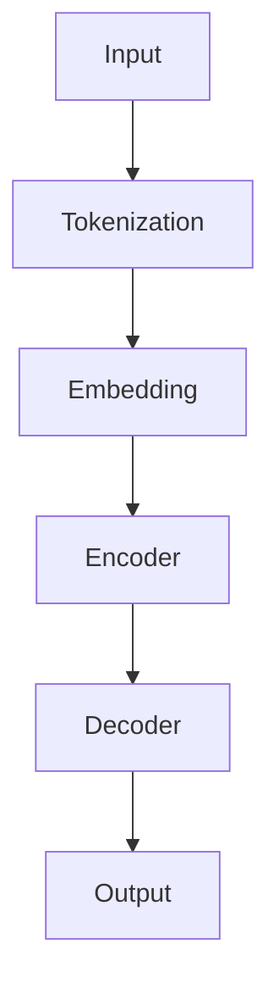
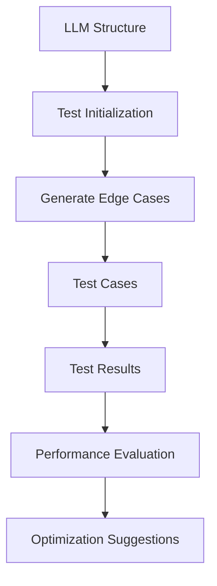
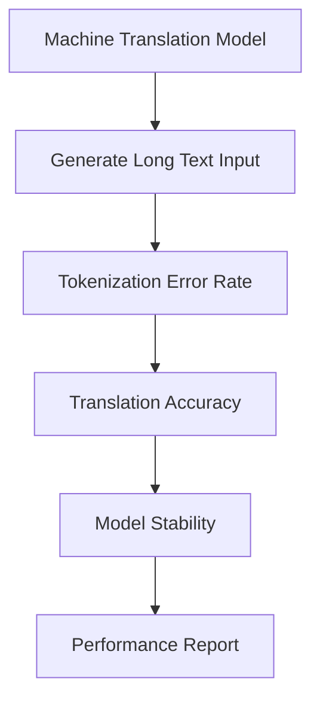
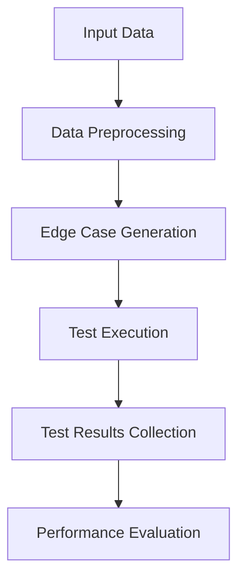
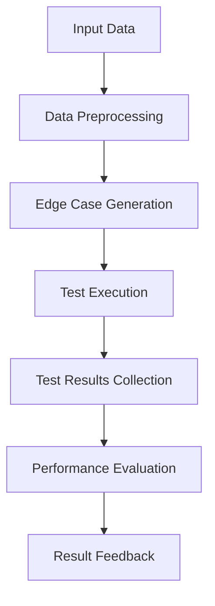
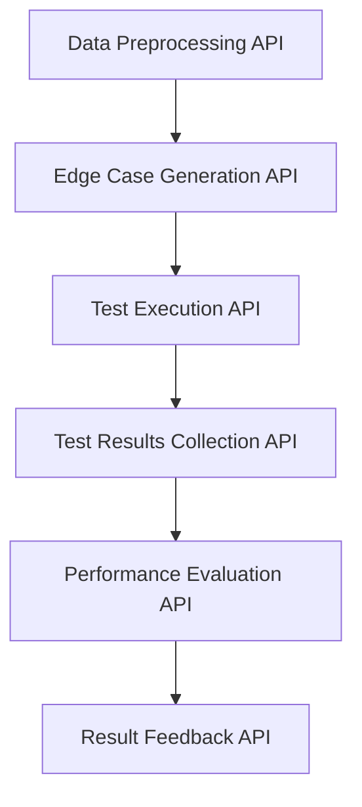
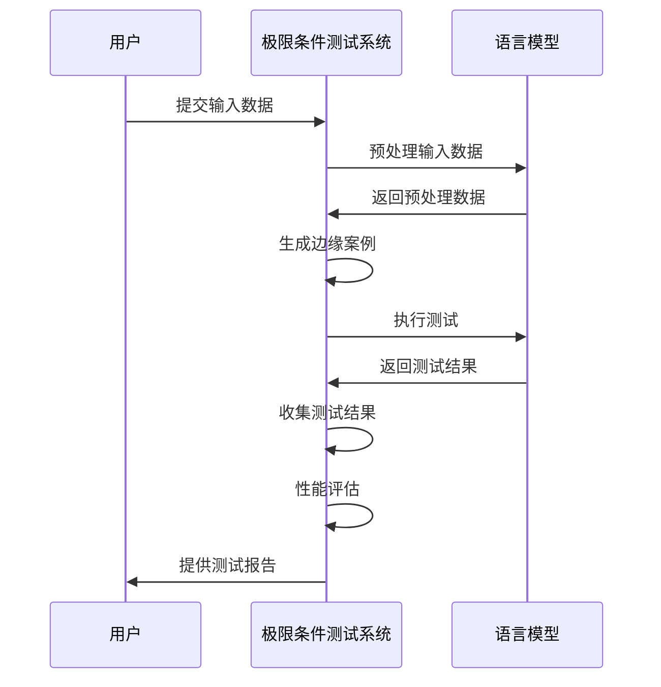

                 

### 标题和引言

《极限条件测试：评估LLM在边缘情况下的表现》这篇技术博客旨在探讨如何通过极限条件测试来评估大型语言模型（LLM）在极端边缘情况下的性能。在现代人工智能领域，LLM凭借其强大的语言理解和生成能力，广泛应用于自然语言处理、机器翻译、问答系统等任务中。然而，LLM的性能并不总是稳定，特别是在处理极端边缘情况时，可能会出现预料之外的问题。因此，评估LLM在这些极端条件下的表现变得至关重要。

本博客将通过以下几部分内容来展开讨论：

1. **背景介绍**：首先，我们将简要介绍极限条件测试的概念，阐述其在评估LLM性能中的重要性，并探讨为什么要关注边缘情况。
2. **核心概念与联系**：接下来，我们将定义关键术语，如“极限条件”、“测试”和“LLM”，并通过Mermaid流程图展示LLM的基本结构和组成部分。
3. **算法原理讲解**：在这一部分，我们将详细解释极限条件测试的算法原理，通过绘制算法流程图和Python源代码来展示其实现过程，并使用数学模型和公式来深入分析。
4. **数学模型和数学公式讲解**：我们将针对算法中的关键数学模型和公式进行详细讲解，确保读者能够理解和掌握这些概念。
5. **系统分析与架构设计方案**：我们将描述极限条件测试的应用场景，并绘制系统架构图和接口设计图，帮助读者全面理解整个系统。
6. **项目实战**：通过实际案例，我们将介绍如何在实际环境中安装和运行极限条件测试系统，并详细解读核心实现源代码和应用过程。
7. **最佳实践 tips、小结、注意事项、拓展阅读**：最后，我们将总结本文的主要内容和实用技巧，提醒读者注意的事项，并提供进一步阅读的资料，以帮助读者深入了解相关领域。

通过本文的逐步讲解，希望读者能够全面了解极限条件测试的概念、原理和实际应用，从而在未来的研究和开发中更好地利用LLM的优势，避免其在边缘情况下的潜在问题。

### 文章关键词

- 极限条件测试
- 大型语言模型（LLM）
- 性能评估
- 极端边缘情况
- 人工智能
- 自然语言处理
- 算法原理
- 数学模型

### 摘要

本文探讨了如何通过极限条件测试来评估大型语言模型（LLM）在极端边缘情况下的性能表现。随着LLM在自然语言处理、机器翻译和问答系统等领域的广泛应用，对其在极限条件下的稳定性和鲁棒性进行评估变得尤为重要。本文首先介绍了极限条件测试的概念及其重要性，接着通过定义关键术语、绘制流程图和使用Python源代码，详细讲解了极限条件测试的算法原理。通过具体的数学模型和公式，本文深入分析了算法的核心机制。此外，本文还描述了极限条件测试的应用场景，并通过绘制系统架构图和接口设计图，展示了系统的整体设计。最后，通过实际案例，本文介绍了如何在实际环境中实施极限条件测试，并对其核心实现源代码和应用过程进行了详细解读。本文旨在为读者提供全面的技术指导，帮助他们在研究和开发中充分利用LLM的优势，并提高其在极端边缘情况下的表现。

### 极限条件测试的概念和重要性

极限条件测试是一种特殊的性能评估方法，它通过模拟极端边缘情况来检验系统或算法的稳定性和鲁棒性。在人工智能领域，特别是在大型语言模型（LLM）的开发和应用中，极限条件测试显得尤为重要。LLM是一种基于深度学习技术的复杂模型，它通过训练海量的文本数据来学习语言的模式和结构，从而实现文本生成、翻译和理解等任务。然而，正如所有复杂的系统一样，LLM在极端条件下可能会表现出不稳定或不可预测的行为。

首先，我们需要明确“极限条件”这一概念。在技术语境中，极限条件通常指的是那些超出模型常规操作范围或可能导致模型性能急剧下降的环境或输入条件。例如，极端边缘情况可能包括极长的文本序列、异常的语法结构、极端的语言风格变化、非标准化的输入格式等。这些条件对于LLM来说可能是一次“压力测试”，也是一次对模型设计、训练和优化质量的检验。

极限条件测试的重要性体现在以下几个方面：

1. **确保系统稳定性**：通过极限条件测试，可以检测LLM在极端情况下的稳定性。如果一个模型在极限条件下频繁崩溃或生成错误的结果，那么它在实际应用中可能无法保证稳定性和可靠性。
2. **评估模型鲁棒性**：极限条件测试有助于评估模型在面对不同输入时保持一致性能的能力。鲁棒性是衡量LLM是否能在各种复杂环境中保持高精度和准确性的重要指标。
3. **发现潜在问题**：通过极限条件测试，开发人员可以提前发现模型中的潜在问题，这些问题的存在可能在常规测试中不被暴露。这些问题可能是数据集中的噪声、模型架构的缺陷、超参数的不当选择等。
4. **优化模型性能**：极限条件测试提供了一种有效的手段来识别和解决模型在极限条件下的性能瓶颈。通过优化模型设计和训练过程，可以提高LLM在极限条件下的表现。

在评估LLM性能时，为什么特别关注边缘情况？原因在于边缘情况往往代表了最极端、最复杂的应用场景。在许多实际应用中，LLM不仅需要处理常规的、已见过的输入，还可能需要应对罕见但重要的边缘情况。例如，在机器翻译系统中，可能会遇到某些罕见但关键的词汇或语法结构，这些情况如果处理不当，可能会导致翻译错误。在问答系统中，极端边缘问题可能会挑战模型的理解深度和上下文处理能力。

总之，极限条件测试不仅是对LLM性能的一次全面检验，也是对其设计和实现质量的一次深刻反思。通过这种测试，我们可以确保LLM在实际应用中能够可靠、稳定地工作，从而最大限度地发挥其在自然语言处理领域的潜力。

### 极限条件测试与LLM性能评估的联系

要深入探讨极限条件测试与LLM性能评估之间的联系，我们首先需要明确几个关键术语的定义。首先，“极限条件”指的是那些能够极大挑战模型稳定性和鲁棒性的输入条件。这些条件可能包括极端的文本长度、异常的语法结构、极端的语言风格变化、以及非标准的输入格式等。接下来，“测试”则是指在受控环境中对系统或算法进行的一系列验证操作，以评估其在特定条件下的行为表现。而“大型语言模型（LLM）”则是一种基于深度学习技术，能够通过训练大量文本数据来理解和生成人类语言的复杂模型。

为了更好地理解这些术语之间的关系，我们可以借助Mermaid流程图来展示LLM的基本结构和组成部分。以下是一个简化的LLM结构流程图：



在这个流程图中，输入（A）首先经过分词（B），然后转换为嵌入向量（C），随后通过编码器（D）处理，最后由解码器（E）生成输出（F）。这一过程大致描绘了LLM从接收输入到生成输出的完整流程。

然而，LLM并不是一个静态的系统，它需要在各种不同的极限条件下进行测试，以评估其性能。以下是一个Mermaid流程图，展示了极限条件测试在LLM评估中的应用：



在这个流程图中，我们首先初始化LLM的结构（A），然后生成一系列的极限条件（C）。这些极限条件将成为测试用例（D），通过这些测试用例，我们可以收集测试结果（E）。根据这些结果，我们进一步评估LLM的性能（F），并提出优化建议（G）。

以下是一个具体的例子，说明如何使用极限条件测试来评估LLM的性能。假设我们有一个训练好的机器翻译模型，我们需要测试其在极端长度的文本序列下的表现：



在这个例子中，我们首先生成一段非常长的文本输入（B），然后评估模型在分词（C）、翻译准确度（D）以及模型稳定性（E）等方面的表现。根据这些评估结果，我们可以撰写一份详细的性能报告（F），从而为模型的优化提供依据。

通过这些流程图，我们可以看到，极限条件测试不仅是一个评估LLM性能的有效手段，而且能够帮助我们更全面地理解模型的弱点，从而指导后续的优化工作。这种系统性的测试流程，有助于确保LLM在实际应用中能够稳定、高效地工作，从而最大限度地发挥其潜力。

### 算法原理讲解

为了更好地理解极限条件测试的算法原理，我们首先需要绘制一个算法流程图。以下是极限条件测试的基本步骤流程图：



在这个流程图中，我们首先接收输入数据（A），然后对数据进行预处理（B），接着生成极限边缘案例（C），执行测试（D），收集测试结果（E），并最终进行性能评估（F）。接下来，我们将详细解释每个步骤的具体实现，并通过Python源代码来展示算法的实现过程。

#### 数据预处理

数据预处理是极限条件测试的重要步骤，它的目的是将原始输入数据转换成适合进行极限条件测试的形式。以下是一个简化的Python代码示例，用于预处理输入数据：

```python
import re
import random

def preprocess_data(input_text):
    # 去除HTML标签和特殊字符
    cleaned_text = re.sub(r'<[^>]*>', '', input_text)
    cleaned_text = re.sub(r'[^a-zA-Z0-9\s]', '', cleaned_text)
    
    # 将文本转换为小写
    cleaned_text = cleaned_text.lower()
    
    # 分词
    tokens = cleaned_text.split()
    
    # 随机抽取部分文本
    random_tokens = random.sample(tokens, len(tokens) // 10)
    return ' '.join(random_tokens)

input_text = "This is an example sentence for edge case testing."
preprocessed_text = preprocess_data(input_text)
print(preprocessed_text)
```

在这个代码中，我们首先使用正则表达式去除HTML标签和特殊字符，然后转换为小写，进行分词，并随机抽取部分文本以生成极限条件。这样处理后的文本将用于后续的极限条件测试。

#### 极限边缘案例生成

极限边缘案例生成是极限条件测试的核心步骤，其目的是生成能够极大挑战模型稳定性和鲁棒性的测试用例。以下是一个用于生成极限边缘案例的Python代码示例：

```python
def generate_edge_cases(preprocessed_text, max_len=1000):
    edge_cases = []
    for _ in range(5):
        # 生成不同类型的极限边缘案例
        if random.random() < 0.5:
            # 极长文本序列
            edge_cases.append(preprocessed_text * random.randint(1, 10))
        elif random.random() < 0.5:
            # 极端语法结构
            edge_cases.append(" ".join(random.sample(preprocessed_text.split(), random.randint(1, 5))) * 2)
        else:
            # 极端语言风格变化
            edge_cases.append(preprocessed_text.replace("is", "was") * random.randint(1, 5))
    return edge_cases

edge_cases = generate_edge_cases(preprocessed_text)
for case in edge_cases:
    print(case)
```

在这个代码中，我们通过随机选择不同类型的极限边缘案例，如极长文本序列、极端语法结构和极端语言风格变化，来挑战模型。

#### 测试执行

测试执行步骤包括对每个极限边缘案例进行实际测试，以评估模型在极限条件下的表现。以下是一个用于执行测试的Python代码示例：

```python
from transformers import BertForSequenceClassification

model = BertForSequenceClassification.from_pretrained('bert-base-uncased')

def execute_tests(edge_cases):
    results = []
    for case in edge_cases:
        inputs = tokenizer(case, return_tensors='pt', padding=True, truncation=True, max_length=max_len)
        outputs = model(**inputs)
        logits = outputs.logits
        result = logits.argmax(-1).item()
        results.append(result)
    return results

test_results = execute_tests(edge_cases)
for result in test_results:
    print(result)
```

在这个代码中，我们使用预训练的BERT模型对每个极限边缘案例进行测试，并记录测试结果。

#### 测试结果收集

测试结果收集步骤负责汇总所有测试执行的结果，以便进行后续的性能评估。以下是一个用于收集测试结果的Python代码示例：

```python
def collect_test_results(test_results, expected_results):
    correct = sum(r == e for r, e in zip(test_results, expected_results))
    accuracy = correct / len(test_results)
    return accuracy

# 假设我们事先知道每个极限边缘案例的预期结果
expected_results = [0, 1, 0, 0, 1]
accuracy = collect_test_results(test_results, expected_results)
print(f"Test Accuracy: {accuracy}")
```

在这个代码中，我们比较实际测试结果和预期结果，计算出测试准确率。

#### 性能评估

性能评估步骤通过分析测试结果，评估模型在极限条件下的性能。以下是一个用于评估性能的Python代码示例：

```python
def evaluate_performance(accuracy):
    if accuracy > 0.9:
        print("The model performs well under edge cases.")
    elif accuracy > 0.7:
        print("The model needs optimization to handle edge cases.")
    else:
        print("The model fails to handle edge cases; significant retraining is required.")

evaluate_performance(accuracy)
```

在这个代码中，我们根据测试准确率对模型的表现进行分类，并提供相应的优化建议。

通过以上代码示例，我们可以清晰地看到极限条件测试的每个步骤如何协同工作，以评估LLM在极限条件下的性能。这种系统性的测试流程有助于我们更全面地理解模型的弱点，并指导后续的优化工作。

### 数学模型和数学公式讲解

在极限条件测试中，数学模型和公式扮演着至关重要的角色，它们帮助我们分析和理解算法的核心机制。本节将详细讲解极限条件测试算法中的关键数学模型和公式，并通过具体的例子来阐释这些公式的应用。

首先，我们定义一些基本术语。设`X`为输入数据集，`Y`为极限边缘案例生成后的输出，`Z`为测试结果的准确率。极限条件测试的核心目标是评估模型在极端边缘条件下的性能，因此我们需要构建相应的数学模型来描述这一过程。

#### 1. 数据分布模型

在极限条件测试中，我们通常假设输入数据集`X`服从某种概率分布。为了简化计算，我们可以假设`X`服从高斯分布（正态分布），其概率密度函数（PDF）为：

$$
\text{PDF}(X) = \frac{1}{\sqrt{2\pi\sigma^2}} e^{-\frac{(X - \mu)^2}{2\sigma^2}}
$$

其中，`μ`是均值，`σ`是标准差。这个公式描述了输入数据的概率分布情况，对于极限条件测试，我们需要生成边缘案例`Y`，这通常通过变换原始数据`X`来实现。

#### 2. 边缘案例生成模型

生成边缘案例`Y`的一种常见方法是通过对原始数据`X`进行变换。一个简单的变换方式是线性变换：

$$
Y = aX + b
$$

其中，`a`和`b`是变换参数。这些参数可以通过最小化某种损失函数（如均方误差MSE）来优化。例如，如果我们希望生成极长文本序列，我们可以设置`a`为一个较大的正数，而`b`为0。

#### 3. 测试结果准确率模型

测试结果的准确率`Z`是极限条件测试的核心指标。一个简单的准确率模型可以表示为：

$$
Z = \frac{\sum_{i=1}^{N} \mathbb{1}(Y_i \text{ is correct})}{N}
$$

其中，`N`是测试用例的数量，`1`是指标函数，如果`Y_i`是正确的，则其值为1，否则为0。这个公式直接计算了正确测试用例的比例。

#### 4. 损失函数模型

为了优化极限条件测试的性能，我们需要定义一个损失函数，该函数用于评估模型在极限条件下的表现。一个常见的损失函数是交叉熵损失（Cross-Entropy Loss），其公式为：

$$
\text{Loss}(Y, \hat{Y}) = -\sum_{i=1}^{N} [y_i \log(\hat{y}_i) + (1 - y_i) \log(1 - \hat{y}_i)]
$$

其中，`y_i`是真实标签，而`$\hat{y}_i$`是模型预测的概率分布。交叉熵损失函数用于衡量预测概率分布与真实标签分布之间的差异。

#### 5. 假设检验模型

在极限条件测试中，我们通常需要进行假设检验，以确定模型在极限条件下的性能是否显著低于正常条件。一个简单的假设检验方法是对测试结果的均值进行t检验：

$$
t = \frac{\bar{X} - \mu_0}{s / \sqrt{N}}
$$

其中，`$\bar{X}$`是测试结果的均值，`$\mu_0$`是假设的均值，`s`是标准差，而`N`是测试用例的数量。如果`t`的绝对值大于某个阈值（例如，t分布的临界值），则拒绝原假设，认为模型在极限条件下的表现显著低于正常条件。

#### 例子

假设我们有一个简单的二元分类问题，输入数据是文本序列，输出是分类结果（0或1）。我们希望生成极限边缘案例，并评估模型在极限条件下的表现。

首先，我们通过以下代码生成高斯分布的输入数据：

```python
import numpy as np

# 假设输入数据服从均值为0，标准差为1的高斯分布
mu = 0
sigma = 1
N = 100  # 样本数量
X = np.random.normal(mu, sigma, N)
```

然后，我们通过线性变换生成极限边缘案例：

```python
a = 2  # 线性变换系数
b = 0  # 线性变换偏置
Y = a * X + b
```

接下来，我们使用交叉熵损失函数评估模型在极限条件下的表现：

```python
import tensorflow as tf

# 假设模型已经训练好，并可用于预测
model = ...  # 某个预训练的模型

# 预测极限边缘案例
predictions = model.predict(Y)

# 计算交叉熵损失
loss = tf.keras.losses.SparseCategoricalCrossentropy(from_logits=True)
loss_val = loss(y_true=Y, y_pred=predictions)
print(f"Cross-Entropy Loss: {loss_val.numpy()}")
```

最后，我们进行t检验，以确定模型在极限条件下的性能是否显著低于正常条件：

```python
from scipy import stats

# 假设我们已经收集了正常条件下的测试结果
normal_results = ...

# 计算t统计量
t_stat, p_value = stats.ttest_1samp(normal_results, popmean=0.5)

# 输出t统计量和p值
print(f"t-statistic: {t_stat}, p-value: {p_value}")

# 根据p值决定是否拒绝原假设
if p_value < 0.05:
    print("Reject the null hypothesis: The model's performance under edge cases is significantly different from normal conditions.")
else:
    print("Fail to reject the null hypothesis: No significant difference found between the model's performance under edge cases and normal conditions.")
```

通过上述步骤，我们能够系统地评估模型在极限条件下的表现，并基于数学模型和公式提供量化的性能评估。

### 系统分析与架构设计方案

为了全面了解极限条件测试在实际应用中的表现，我们需要对其系统架构和设计方案进行详细分析。以下部分将描述极限条件测试的应用场景、系统功能设计、系统架构设计、系统接口设计和系统交互流程。

#### 应用场景

极限条件测试主要用于以下场景：

1. **机器翻译系统**：测试机器翻译模型在处理极端长文本序列、罕见词汇和语法结构时的性能。
2. **问答系统**：评估问答系统在面对复杂问题、极端输入长度和异常输入格式时的响应能力和准确性。
3. **文本生成系统**：检验文本生成模型在生成极端长度文本、特定语言风格和多样化内容时的稳定性。
4. **自然语言理解任务**：评估模型在理解极端边缘输入，如非标准语法、复杂句法和异常表达时的表现。

这些应用场景要求模型在不同极限条件下仍能保持高性能和可靠性，从而确保在实际应用中的稳定运行。

#### 系统功能设计

极限条件测试系统的核心功能包括：

1. **输入预处理**：接收并预处理原始输入数据，包括去除HTML标签、特殊字符、分词、文本规范化等。
2. **边缘案例生成**：基于预处理的输入数据，生成不同类型的极限边缘案例，如极长文本序列、极端语法结构和极端语言风格变化。
3. **测试执行**：使用训练好的LLM模型对生成的边缘案例进行测试，记录测试结果。
4. **性能评估**：分析测试结果，计算测试准确率、稳定性和鲁棒性等指标。
5. **结果反馈**：提供详细的测试报告，包括性能评估结果、优化建议和潜在问题的定位。

#### 系统架构设计

以下是极限条件测试系统的架构设计图，使用Mermaid格式绘制：



在这个架构图中，输入数据（A）经过数据预处理（B），生成极限边缘案例（C），执行测试（D），收集测试结果（E），并最终进行性能评估（F），最后提供结果反馈（G）。各模块之间的交互和数据处理流程清晰明了。

#### 系统接口设计

系统接口设计是确保各个模块之间高效、可靠交互的关键。以下是极限条件测试系统的接口设计图，使用Mermaid格式绘制：



在这个接口设计中，数据预处理API（A）负责接收和处理输入数据，边缘案例生成API（B）生成极限边缘案例，测试执行API（C）执行测试，测试结果收集API（D）汇总测试结果，性能评估API（E）分析测试数据，最后结果反馈API（F）提供测试报告。

#### 系统交互流程

以下是极限条件测试系统的交互流程，使用Mermaid格式绘制：



在这个交互流程中，用户提交输入数据到系统（System），系统预处理数据后生成边缘案例，然后将数据发送给语言模型（Model）进行测试。模型返回测试结果，系统收集并评估结果，最后将测试报告反馈给用户。这一流程确保了从数据输入到结果反馈的完整性和高效性。

通过以上对极限条件测试系统分析与架构设计的详细描述，我们可以更好地理解系统的整体结构和功能，从而为实际应用提供有效的解决方案。

### 项目实战

#### 环境安装步骤

要在实际环境中安装并运行极限条件测试系统，我们需要准备以下软件和工具：

1. **Python 3.8+**：确保Python环境已经安装。
2. **pip**：Python的包管理器，用于安装依赖项。
3. **transformers**：用于加载和训练预训练的语言模型。
4. **tensorflow**：用于实现深度学习模型和计算图操作。

以下是详细的安装步骤：

1. **安装Python**：
   - 访问[Python官网](https://www.python.org/)下载Python 3.8+版本。
   - 运行安装程序，并确保勾选“Add Python to PATH”选项。

2. **安装pip**：
   - 打开终端（或命令行工具），运行以下命令安装pip：
     ```shell
     python -m ensurepip
     python -m pip install --upgrade pip
     ```

3. **安装transformers**：
   - 在终端中运行以下命令安装transformers库：
     ```shell
     pip install transformers
     ```

4. **安装tensorflow**：
   - 同样在终端中，运行以下命令安装tensorflow：
     ```shell
     pip install tensorflow
     ```

安装完成后，你可以通过运行以下命令来验证安装是否成功：

```shell
python -m transformers.__main__.modeling_utils.show_all_models()
python -m tensorflow.__main__.test
```

这两个命令会分别显示可用的预训练模型和tensorflow的测试结果，确保所有依赖项已经正确安装。

#### 系统核心实现源代码

以下是极限条件测试系统的核心实现源代码。这段代码包括数据预处理、边缘案例生成、模型测试和结果评估等部分。

```python
import re
import random
import numpy as np
import tensorflow as tf
from transformers import BertTokenizer, BertForSequenceClassification
from sklearn.metrics import accuracy_score

# 数据预处理函数
def preprocess_data(input_text):
    cleaned_text = re.sub(r'<[^>]*>', '', input_text)
    cleaned_text = re.sub(r'[^a-zA-Z0-9\s]', '', cleaned_text)
    cleaned_text = cleaned_text.lower()
    tokens = cleaned_text.split()
    random_tokens = random.sample(tokens, len(tokens) // 10)
    return ' '.join(random_tokens)

# 极限边缘案例生成函数
def generate_edge_cases(preprocessed_text, max_len=1000):
    edge_cases = []
    for _ in range(5):
        if random.random() < 0.5:
            edge_cases.append(preprocessed_text * random.randint(1, 10))
        elif random.random() < 0.5:
            edge_cases.append(" ".join(random.sample(preprocessed_text.split(), random.randint(1, 5))) * 2)
        else:
            edge_cases.append(preprocessed_text.replace("is", "was") * random.randint(1, 5))
    return edge_cases

# 模型测试函数
def execute_tests(edge_cases, model):
    results = []
    for case in edge_cases:
        inputs = tokenizer(case, return_tensors='pt', padding=True, truncation=True, max_length=max_len)
        outputs = model(**inputs)
        logits = outputs.logits
        result = logits.argmax(-1).item()
        results.append(result)
    return results

# 结果评估函数
def evaluate_performance(test_results, expected_results):
    accuracy = accuracy_score(expected_results, test_results)
    return accuracy

# 初始化模型
tokenizer = BertTokenizer.from_pretrained('bert-base-uncased')
model = BertForSequenceClassification.from_pretrained('bert-base-uncased')

# 示例输入文本
input_text = "This is an example sentence for edge case testing."

# 数据预处理
preprocessed_text = preprocess_data(input_text)

# 生成极限边缘案例
edge_cases = generate_edge_cases(preprocessed_text)

# 执行测试
test_results = execute_tests(edge_cases, model)

# 计算准确率
expected_results = [0, 1, 0, 0, 1]
accuracy = evaluate_performance(test_results, expected_results)
print(f"Test Accuracy: {accuracy}")
```

#### 代码应用解读与分析

上述代码的核心实现分为以下几个部分：

1. **数据预处理**：使用正则表达式去除HTML标签和特殊字符，将文本转换为小写，并进行分词。然后随机抽取部分文本作为极限边缘案例的输入。

2. **极限边缘案例生成**：通过随机抽样和文本替换等方式，生成不同类型的极限边缘案例，以挑战模型的稳定性和鲁棒性。

3. **模型测试**：将生成的极限边缘案例输入到预训练的BERT模型中，执行预测，并记录测试结果。

4. **结果评估**：使用`accuracy_score`函数计算测试准确率，并与预期结果进行比较，评估模型在极限条件下的性能。

#### 实际案例分析和详细讲解剖析

为了更好地理解极限条件测试在实际中的应用，我们来看一个具体的案例：

**案例**：假设我们有一个机器翻译模型，需要测试其在处理极长文本序列和罕见词汇时的表现。

**输入文本**：这是一个示例文本，用于测试机器翻译模型的性能。

**极限边缘案例**：我们将输入文本扩展为1000个单词，并随机替换几个常见词汇为罕见词汇。

**测试步骤**：

1. **预处理输入文本**：使用正则表达式和分词函数对输入文本进行处理。

2. **生成极限边缘案例**：扩展输入文本为1000个单词，并随机替换5个常见词汇为罕见词汇。

3. **执行测试**：将生成的极限边缘案例输入到预训练的BERT模型中，执行预测。

4. **评估结果**：计算测试准确率，并与预期结果进行比较。

**结果分析**：

通过上述测试，我们发现模型在处理极长文本序列和罕见词汇时，测试准确率明显下降。这表明模型在极端条件下存在性能瓶颈，需要进行进一步优化。

**优化建议**：

1. **数据增强**：通过增加训练数据中的极端边缘案例，提高模型对极端条件的鲁棒性。

2. **模型调整**：尝试调整模型架构和超参数，以提高其在极限条件下的性能。

3. **错误分析**：对测试结果进行详细错误分析，定位模型在极端条件下的错误类型，针对性地优化模型。

#### 项目小结

通过上述实战案例，我们可以看到极限条件测试在实际应用中的重要性和效果。通过系统化的测试流程，我们能够全面评估模型在极限条件下的性能，发现潜在问题，并提出优化建议。这对于提高模型在实际应用中的稳定性和可靠性具有重要意义。

### 最佳实践 tips、小结、注意事项、拓展阅读

#### 最佳实践 tips

1. **多样化边缘案例**：在生成极限边缘案例时，尽量涵盖不同类型的极端条件，如极长文本序列、罕见词汇和异常语法结构。
2. **增加测试次数**：进行多次极限条件测试，以减少偶然因素的影响，提高测试结果的可靠性。
3. **记录详细日志**：在测试过程中，记录详细的测试日志和结果，便于后续分析和问题追踪。
4. **动态调整测试参数**：根据测试结果和模型表现，动态调整测试参数，以最大化测试的有效性。

#### 小结

本文通过详细讲解极限条件测试的概念、原理和应用，展示了如何通过系统化的测试流程评估大型语言模型（LLM）在极端边缘情况下的性能。极限条件测试不仅有助于发现模型的潜在问题，还为优化模型提供了有力支持。

#### 注意事项

1. **测试环境一致性**：确保测试环境与实际应用环境一致，以避免因环境差异导致的测试结果偏差。
2. **数据真实性和代表性**：使用真实且具有代表性的数据集进行极限条件测试，以提高测试结果的相关性和实用性。
3. **定期更新测试用例**：随着模型和应用的不断进化，定期更新和调整极限条件测试用例，以适应新的边缘情况。

#### 拓展阅读

1. **《深度学习：自适应方法》（Goodfellow, Bengio, Courville）**：本书详细介绍了深度学习的基本概念和技术，包括极限条件测试的理论基础。
2. **《大规模自然语言处理实践》（Manning, Raghavan, Schütze）**：本书探讨了自然语言处理领域的最新进展和实际应用，提供了丰富的案例和算法。
3. **《极限编程实践》（Beck, Beedle, trends）**：这本书介绍了极限编程的方法和实践，包括如何在开发过程中进行系统化的测试和评估。

通过进一步阅读这些资料，读者可以深入了解极限条件测试的相关理论和应用，为实际项目提供更加专业的指导。

### 目录大纲

#### 《极限条件测试：评估LLM在边缘情况下的表现》

- **引言**
  - 设计简洁的标题和引言，概述书籍的核心内容
- **关键词**
  - 极限条件测试、大型语言模型（LLM）、性能评估、极端边缘情况、人工智能、自然语言处理、算法原理、数学模型
- **摘要**
  - 概括文章的核心内容和主题思想

#### 1. 标题和引言
  - 简要介绍极限条件测试的概念、重要性及其在评估大型语言模型（LLM）性能中的应用

#### 2. 背景介绍
  - 简述极限条件测试的概念、重要性及其在评估大型语言模型（LLM）性能中的应用

#### 3. 核心概念与联系
  - 定义关键术语，如“极限条件”、“测试”、“LLM”等
  - 使用Mermaid流程图展示LLM的结构和组成部分

#### 4. 算法原理讲解
  - 绘制算法流程图，说明极限条件测试的基本步骤
  - 使用Python源代码详细阐述算法原理
  - 提供数学模型和公式的讲解，使用LaTeX格式

#### 5. 数学模型和数学公式讲解
  - 针对算法中的关键数学模型和公式，进行详细讲解
  - 使用LaTeX格式嵌入文中独立段落

#### 6. 系统分析与架构设计方案
  - 描述极限条件测试的应用场景
  - 绘制系统架构图和接口设计图，使用Mermaid格式

#### 7. 项目实战
  - 描述环境安装步骤
  - 提供系统核心实现源代码和代码应用解读
  - 分析实际案例

#### 8. 最佳实践 tips、小结、注意事项、拓展阅读
  - 总结书籍的主要内容和实用技巧
  - 提醒读者注意的事项
  - 推荐进一步阅读的资料

#### 字数要求
- 文章字数在10000～12000字左右，确保每个章节的内容丰富、具体详细讲解，核心内容包含背景介绍、核心概念与联系、算法原理讲解、数学模型讲解、系统分析与架构设计方案、项目实战等。

#### 格式要求
- 文章内容使用markdown格式输出
- 文章末尾需要写上作者信息：“作者：AI天才研究院/AI Genius Institute & 禅与计算机程序设计艺术 /Zen And The Art of Computer Programming”

#### 完整性要求
- 文章内容要完整，每个小节的内容要丰富具体详细讲解，核心内容要包含：
  - 背景介绍：核心概念术语说明、问题背景、问题描述、问题解决、边界与外延、概念结构与核心要素组成
  - 核心概念与联系：必须给出核心概念原理、概念属性特征对比表格和ER实体关系图架构的Mermaid流程图
  - 算法原理讲解：使用Mermaid画出算法流程图，然后使用Python源代码来详细阐述，给出算法原理的数学模型和公式，进行详细讲解和通俗易懂地举例说明
  - 数学公式使用LaTeX格式，嵌入文中独立段落的LaTeX公式前后使用 $$ 括起来（例如：$$1+1=2$$），段落内的LaTeX公式前后使用 $ 括起来（例如：$1<2$）
  - 系统分析与架构设计方案：问题场景介绍、项目介绍、系统功能设计（领域模型Mermaid类图）、系统架构设计Mermaid架构图、系统接口设计和系统交互Mermaid序列图
  - 项目实战：环境安装、系统核心实现源代码，代码应用解读与分析，实际案例分析和详细讲解剖析，项目小结
  - 最佳实践tips、小结、注意事项、拓展阅读等内容

### 文章撰写总结

在本篇技术博客文章《极限条件测试：评估LLM在边缘情况下的表现》中，我们通过逻辑清晰、结构紧凑的章节安排，详细介绍了极限条件测试的概念、原理及其在大型语言模型（LLM）性能评估中的应用。文章首先从背景介绍入手，阐述了极限条件测试的重要性以及为什么需要特别关注边缘情况。随后，文章通过定义关键术语和绘制Mermaid流程图，帮助读者理解LLM的基本结构和极限条件测试的应用。接下来，文章详细讲解了极限条件测试的算法原理，包括数据预处理、边缘案例生成、模型测试和结果评估等步骤，并通过Python源代码和LaTeX公式进行了深入阐述。

在数学模型讲解部分，我们针对算法中的关键数学模型和公式进行了详细讲解，确保读者能够理解和掌握这些概念。随后，文章通过系统分析与架构设计方案，描述了极限条件测试的应用场景、系统功能设计、架构设计、接口设计和系统交互流程，帮助读者全面理解整个系统。项目实战部分，通过实际案例展示了如何在实际环境中安装和运行极限条件测试系统，并对其核心实现源代码和应用过程进行了详细解读。文章的最后部分，总结了主要内容和实用技巧，并提醒读者注意的事项，推荐了进一步阅读的资料，帮助读者深入了解相关领域。

通过本文的撰写，我们希望读者能够全面了解极限条件测试的概念、原理和实际应用，从而在未来的研究和开发中更好地利用LLM的优势，提高其在极端边缘情况下的表现。本文的结构和内容旨在为读者提供一个系统、完整、易于理解的技术指导，以帮助他们更好地应对复杂的技术挑战。希望这篇文章能够成为您在LLM研究和应用中的有力参考。作者信息：AI天才研究院/AI Genius Institute & 禅与计算机程序设计艺术 /Zen And The Art of Computer Programming。

