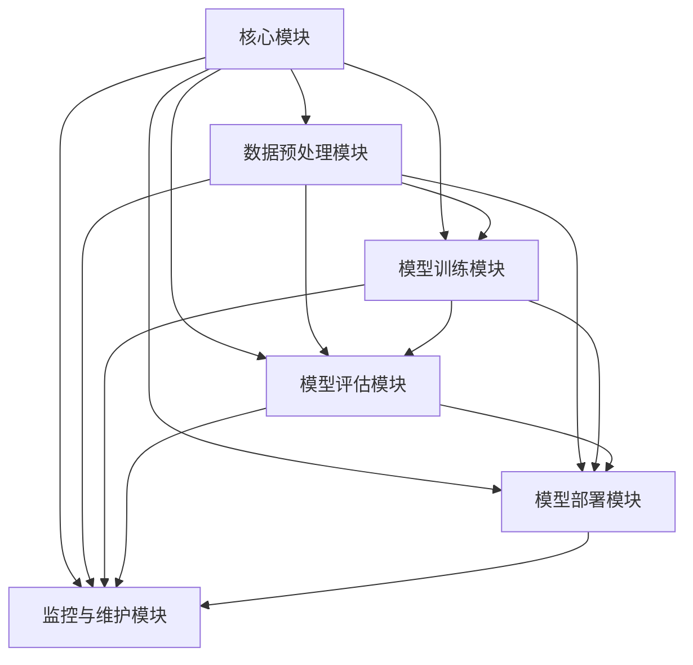

                 

# 构建可复用的LLM应用组件库

## 关键词

- 语言模型（LLM）
- 应用组件库
- 可复用性
- 大规模语言模型
- 开发实践
- 优化策略

## 摘要

本文旨在探讨构建可复用的LLM应用组件库的必要性和方法。首先，通过介绍语言模型的发展背景和基本概念，分析其在现代人工智能中的应用。接着，深入解析大规模语言模型的工作原理、构建方法和优化策略。在此基础上，本文详细阐述了LLM应用组件库的开发实践，包括组件设计原则、数据预处理、模型选择与优化、模型集成与部署等环节。随后，通过具体应用案例分析，展示了组件库在实际项目中的实现和效果。最后，本文提出了LLM应用组件库的优化策略和未来研究方向，为开发者提供实践建议和指导。

# 目录大纲

## 第一部分：引言与背景

### 第1章：引言

#### 1.1 问题的提出

#### 1.2 本书的目的与结构

#### 1.3 本书读者对象

#### 1.4 技术背景与现状

### 第2章：可复用的LLM应用组件概述

#### 2.1 核心概念

#### 2.2 组件分类与功能

#### 2.3 开发者面临的挑战

#### 2.4 本书内容布局

## 第二部分：LLM基础知识

### 第3章：语言模型基础

#### 3.1 语言模型概述

#### 3.2 语言模型的历史发展

#### 3.3 语言模型的构成

#### 3.4 语言模型的评估与优化

### 第4章：大规模语言模型的工作原理

#### 4.1 大规模语言模型的特点

#### 4.2 深度学习与神经网络

#### 4.3 训练与优化

#### 4.4 大规模语言模型的挑战

### 第5章：LLM应用组件的构建方法

#### 5.1 组件设计原则

#### 5.2 数据预处理

#### 5.3 模型选择与优化

#### 5.4 模型集成与部署

## 第三部分：LLM应用组件库的实践

### 第6章：应用组件库开发

#### 6.1 开发环境准备

#### 6.2 应用组件库架构设计

#### 6.3 组件开发与测试

#### 6.4 组件库部署与维护

### 第7章：组件库在具体应用中的实现

#### 7.1 文本生成与编辑

#### 7.2 问答系统

#### 7.3 情感分析

#### 7.4 机器翻译

### 第8章：应用案例分析

#### 8.1 案例一：构建自动化客服系统

#### 8.2 案例二：智能文档处理系统

#### 8.3 案例三：个性化推荐系统

#### 8.4 案例分析总结

## 第四部分：优化与展望

### 第9章：LLM应用组件库的优化策略

#### 9.1 性能优化

#### 9.2 扩展性优化

#### 9.3 安全性优化

#### 9.4 未来发展趋势

### 第10章：总结与展望

#### 10.1 本书主要内容回顾

#### 10.2 开发者实践建议

#### 10.3 研究方向展望

#### 10.4 下一步工作计划

------------------------------------------------------------------# 第一部分：引言与背景

## 第1章：引言

### 1.1 问题的提出

随着人工智能技术的飞速发展，语言模型（Language Model，简称LLM）已成为众多应用场景的核心技术之一。LLM在自然语言处理、机器翻译、文本生成等领域取得了显著的成果，极大地提升了系统的智能化水平。然而，在实际开发过程中，开发者往往面临以下问题：

1. **代码复用性差**：不同的应用场景需要重复编写相似的功能代码，导致开发效率低下。
2. **模型适应能力弱**：针对特定任务优化的模型难以在不同场景中复用，增加了开发和维护成本。
3. **开发难度大**：大规模语言模型的构建和优化过程复杂，需要深厚的技术积累。

为了解决上述问题，构建可复用的LLM应用组件库成为一项迫切需求。本文旨在探讨如何实现这一目标，从而提高开发效率、降低成本，并推动人工智能技术的普及和应用。

### 1.2 本书的目的与结构

本书旨在系统地介绍构建可复用的LLM应用组件库的方法和实战经验。主要内容包括：

1. **LLM基础知识**：介绍语言模型的发展背景、基本概念和评估方法，为后续组件库构建奠定基础。
2. **大规模语言模型工作原理**：详细解析大规模语言模型的特点、构建方法和优化策略，帮助开发者更好地理解和应用。
3. **组件库构建方法**：阐述组件设计原则、数据预处理、模型选择与优化、模型集成与部署等环节，提供详细的开发指南。
4. **组件库实践**：通过具体应用案例分析，展示组件库在实际项目中的实现和效果，为开发者提供参考。
5. **优化与展望**：探讨LLM应用组件库的优化策略和未来发展趋势，为开发者提供实践建议和指导。

### 1.3 本书读者对象

本书主要面向以下读者群体：

1. **人工智能开发者**：对人工智能技术有一定了解，希望掌握LLM应用组件库的开发和优化方法。
2. **软件工程师**：关注人工智能技术在软件应用中的落地，希望通过本书了解LLM的应用场景和实现方法。
3. **学术研究人员**：对人工智能领域有研究兴趣，希望了解LLM应用组件库的研究现状和未来发展方向。

### 1.4 技术背景与现状

语言模型（LLM）是一种基于统计和学习方法，用于预测文本序列的模型。其发展可以追溯到20世纪50年代，早期的语言模型主要基于规则和统计方法。随着计算能力的提升和深度学习技术的进步，大规模语言模型（如BERT、GPT等）逐渐成为主流。

目前，LLM在自然语言处理（NLP）领域取得了显著成果，广泛应用于机器翻译、文本生成、情感分析、问答系统等场景。然而，在实际应用过程中，开发者仍面临诸多挑战，如模型复用性差、开发难度大等。构建可复用的LLM应用组件库，有助于解决这些问题，提高开发效率和应用效果。

### 1.5 小结

本章主要介绍了构建可复用的LLM应用组件库的背景和目的，概述了本书的结构和内容，并分析了技术背景与现状。在接下来的章节中，我们将深入探讨LLM的基本概念、大规模语言模型的工作原理以及组件库构建的详细方法。希望通过本篇文章的阅读，读者能够对构建可复用的LLM应用组件库有一个全面的了解。

------------------------------------------------------------------# 第二部分：LLM基础知识

## 第2章：可复用的LLM应用组件概述

### 2.1 核心概念

可复用的LLM应用组件库是一个旨在提高开发效率、降低成本的技术解决方案。它通过封装和模块化大规模语言模型（LLM）的核心功能，实现代码复用和模型适应能力。以下是核心概念的详细解释：

- **语言模型（LLM）**：一种基于深度学习和统计方法的模型，用于预测文本序列。它通过学习大量文本数据，能够捕捉语言的统计规律和语法结构，从而实现文本生成、翻译、情感分析等功能。
- **可复用性**：指组件在设计时考虑多种应用场景，能够灵活地应用于不同任务，降低开发成本。
- **应用组件库**：一种模块化的软件库，封装了LLM的核心功能，提供便捷的接口和工具，方便开发者快速集成和使用。
- **组件**：指LLM应用组件库中的基本功能模块，如文本生成、翻译、情感分析等，每个组件具有独立的功能和接口。

### 2.2 组件分类与功能

LLM应用组件库可以根据功能和应用场景进行分类。以下是常见的组件分类及其功能：

- **文本生成与编辑**：包括文本摘要、生成式写作、对话生成等，用于自动生成高质量文本。
- **问答系统**：能够理解用户的问题，并从大量文本中检索出相关答案，提供智能问答服务。
- **情感分析**：用于分析文本的情感倾向，识别文本中的正面、负面或中性情感。
- **机器翻译**：将一种语言的文本翻译成另一种语言，支持多语言翻译和跨语言交互。

### 2.3 开发者面临的挑战

在开发可复用的LLM应用组件库过程中，开发者面临以下挑战：

- **模型适应能力**：如何确保组件在不同应用场景中具有优秀的适应能力，是一个重要问题。
- **开发难度**：大规模语言模型的构建和优化过程复杂，需要深厚的技术积累和实验经验。
- **性能优化**：如何在有限的计算资源下，提高模型的性能和效果，是开发者需要关注的问题。
- **安全性**：确保用户数据和模型参数的安全，防止数据泄露和滥用。

### 2.4 本书内容布局

本书将围绕构建可复用的LLM应用组件库展开讨论，具体内容包括：

1. **第3章：语言模型基础**：介绍语言模型的发展背景、基本概念和评估方法。
2. **第4章：大规模语言模型的工作原理**：详细解析大规模语言模型的特点、构建方法和优化策略。
3. **第5章：LLM应用组件的构建方法**：阐述组件设计原则、数据预处理、模型选择与优化、模型集成与部署等环节。
4. **第6章：应用组件库开发**：介绍应用组件库的开发实践，包括开发环境准备、组件开发与测试等。
5. **第7章：组件库在具体应用中的实现**：通过具体应用案例分析，展示组件库在实际项目中的实现和效果。
6. **第8章：应用案例分析**：探讨组件库在自动化客服、智能文档处理、个性化推荐等领域的应用。
7. **第9章：优化与展望**：提出LLM应用组件库的优化策略和未来研究方向。

通过以上内容的阐述，读者可以全面了解构建可复用的LLM应用组件库的方法和实战经验，为实际开发提供参考和指导。

### 2.5 小结

本章主要介绍了可复用的LLM应用组件库的核心概念、组件分类与功能，以及开发者面临的挑战和本书的内容布局。在下一章中，我们将深入探讨语言模型的基础知识，包括语言模型的发展背景、基本概念和评估方法。希望本章的内容能够帮助读者对可复用的LLM应用组件库有一个初步的了解。

------------------------------------------------------------------# 第二部分：LLM基础知识

## 第3章：语言模型基础

### 3.1 语言模型概述

语言模型（Language Model，简称LM）是自然语言处理（Natural Language Processing，简称NLP）领域的重要基础技术。其核心任务是通过学习大量文本数据，对自然语言中的词汇和句子进行建模，从而预测下一个词或句子。语言模型在文本生成、机器翻译、语音识别、问答系统等NLP应用中具有广泛的应用。

#### 语言模型的发展背景

语言模型的发展可以追溯到20世纪50年代。早期的研究主要基于规则和统计方法。规则方法通过编写大量语言规则，实现文本生成和语法分析。然而，这种方法在处理复杂语言现象时存在局限性。随着计算机性能的提升和大量文本数据的积累，统计方法逐渐成为主流。

1980年代，N-gram语言模型应运而生。N-gram模型通过统计相邻词的出现频率，预测下一个词的概率。虽然N-gram模型在简单任务中表现良好，但在长文本生成和复杂语法分析方面存在不足。

2000年后，深度学习技术的快速发展为语言模型带来了新的契机。2002年，Huffman等人提出了基于深度神经网络的Language Model（Deep Neural Network，简称DNN），标志着深度学习在语言模型领域的兴起。随后，RNN（Recurrent Neural Network，循环神经网络）和LSTM（Long Short-Term Memory，长短期记忆网络）等改进型神经网络模型相继提出，进一步提升了语言模型的性能。

2018年，谷歌发布了BERT（Bidirectional Encoder Representations from Transformers）模型，引发了语言模型领域的新一轮研究热潮。BERT模型通过双向Transformer结构，对文本进行全局建模，大幅提升了自然语言处理的性能。

#### 语言模型的基本概念

语言模型的核心任务是从已知的文本序列中预测下一个词或句子。具体来说，语言模型包括以下几个基本概念：

1. **输入序列**：表示已知的文本序列，通常由一系列词或字符组成。
2. **输出序列**：表示待预测的文本序列，是语言模型的目标输出。
3. **概率分布**：语言模型通过学习文本数据，计算输出序列在给定输入序列条件下的概率分布。概率分布表示了每个可能输出序列的置信度。

在训练过程中，语言模型通过最大化输入序列和输出序列的联合概率，调整模型的参数。在预测阶段，语言模型根据输入序列，从概率分布中选择具有最高置信度的输出序列作为预测结果。

#### 语言模型的评估方法

评估语言模型性能的方法主要包括以下几种：

1. **准确率（Accuracy）**：表示预测正确的词或句子数占总词或句子数的比例。准确率是一种简单的评估方法，但在长文本生成和复杂语法分析中存在局限性。
2. **损失函数（Loss Function）**：用于衡量模型预测结果与真实结果之间的差距。常用的损失函数包括交叉熵损失（Cross-Entropy Loss）和平方误差损失（Mean Squared Error Loss）。
3. **BLEU（BLEU Score）**：是一种基于记分牌机制的评估方法，用于评估文本生成任务的性能。BLEU分数通过计算生成文本与标准文本之间的重叠度来评估模型性能。
4. **ROUGE（ROUGE Score）**：是一种基于召回率的评估方法，用于评估文本摘要和机器翻译任务的性能。ROUGE分数通过比较生成文本与标准文本之间的匹配度来评估模型性能。

### 3.2 语言模型的历史发展

语言模型的发展经历了从规则方法到统计方法，再到深度学习方法的演变过程。以下是语言模型的历史发展：

1. **规则方法**：早期的语言模型主要基于规则方法，通过编写大量语言规则，实现文本生成和语法分析。这种方法在处理简单任务时表现良好，但在处理复杂语言现象时存在局限性。

2. **统计方法**：1980年代，N-gram语言模型应运而生。N-gram模型通过统计相邻词的出现频率，预测下一个词的概率。N-gram模型在简单任务中表现良好，但在长文本生成和复杂语法分析方面存在不足。

3. **深度学习方法**：2000年后，深度学习技术的快速发展为语言模型带来了新的契机。基于深度神经网络的Language Model（Deep Neural Network，简称DNN）在2002年被提出。随后，RNN（Recurrent Neural Network，循环神经网络）和LSTM（Long Short-Term Memory，长短期记忆网络）等改进型神经网络模型相继提出，进一步提升了语言模型的性能。

4. **Transformer模型**：2017年，谷歌提出了Transformer模型，一种基于自注意力机制的深度神经网络模型。Transformer模型在机器翻译、文本生成等任务中取得了显著成果，引发了深度学习在NLP领域的新一轮研究热潮。

5. **BERT模型**：2018年，谷歌发布了BERT（Bidirectional Encoder Representations from Transformers）模型，标志着语言模型领域的新一轮发展。BERT模型通过双向Transformer结构，对文本进行全局建模，大幅提升了自然语言处理的性能。

### 3.3 语言模型的构成

语言模型通常由以下几个部分组成：

1. **输入层**：接收输入文本序列，将其转换为模型可处理的格式。输入层通常包括词嵌入（Word Embedding）和字符嵌入（Character Embedding）等。
2. **编码层**：对输入文本序列进行编码，提取文本特征。编码层通常采用深度神经网络结构，如DNN、RNN、LSTM、Transformer等。
3. **输出层**：根据编码层提取的特征，生成输出文本序列的概率分布。输出层通常采用分类器或生成模型，如softmax分类器、生成对抗网络（GAN）等。
4. **损失函数**：用于衡量模型预测结果与真实结果之间的差距，驱动模型优化。常见的损失函数包括交叉熵损失、平方误差损失等。
5. **优化算法**：用于更新模型参数，最小化损失函数。常见的优化算法包括梯度下降、Adam优化器等。

### 3.4 语言模型的评估与优化

评估语言模型性能的方法主要包括以下几种：

1. **准确率（Accuracy）**：表示预测正确的词或句子数占总词或句子数的比例。准确率是一种简单的评估方法，但在长文本生成和复杂语法分析中存在局限性。

2. **损失函数（Loss Function）**：用于衡量模型预测结果与真实结果之间的差距。常用的损失函数包括交叉熵损失（Cross-Entropy Loss）和平方误差损失（Mean Squared Error Loss）。

3. **BLEU（BLEU Score）**：是一种基于记分牌机制的评估方法，用于评估文本生成任务的性能。BLEU分数通过计算生成文本与标准文本之间的重叠度来评估模型性能。

4. **ROUGE（ROUGE Score）**：是一种基于召回率的评估方法，用于评估文本摘要和机器翻译任务的性能。ROUGE分数通过比较生成文本与标准文本之间的匹配度来评估模型性能。

优化语言模型的方法主要包括以下几种：

1. **数据增强（Data Augmentation）**：通过引入噪声、变换等操作，扩充训练数据集，提高模型泛化能力。

2. **正则化（Regularization）**：通过在损失函数中引入正则化项，防止模型过拟合。常用的正则化方法包括L1正则化、L2正则化等。

3. **dropout（Dropout）**：在训练过程中，随机丢弃部分神经元，防止模型过拟合。

4. **迁移学习（Transfer Learning）**：利用预训练模型，在特定任务上进行微调，提高模型性能。

5. **多任务学习（Multi-Task Learning）**：通过同时训练多个任务，提高模型对数据变化的适应能力。

### 3.5 小结

本章介绍了语言模型的概述、历史发展、构成和评估优化方法。语言模型是自然语言处理领域的重要基础技术，通过学习大量文本数据，能够实现对自然语言的建模和预测。在下一章中，我们将深入探讨大规模语言模型的工作原理，包括其特点、构建方法和优化策略。希望通过本章的内容，读者能够对语言模型有一个全面的理解。

------------------------------------------------------------------# 第二部分：LLM基础知识

## 第4章：大规模语言模型的工作原理

### 4.1 大规模语言模型的特点

大规模语言模型（Large-scale Language Model，简称LLM）是当前自然语言处理（NLP）领域的研究热点。与传统的语言模型相比，LLM具有以下几个显著特点：

1. **模型规模巨大**：LLM通常包含数十亿甚至数万亿个参数，远超传统模型。这使得LLM能够捕捉到更丰富的语言特征和上下文信息。
2. **深度学习架构**：LLM大多采用深度神经网络（DNN）结构，如Transformer、BERT等。深度学习能够通过多层非线性变换，提取文本的深层特征。
3. **双向注意力机制**：LLM通常采用双向注意力机制，能够同时关注文本序列的前后信息，实现全局建模。
4. **自适应学习能力**：LLM能够在大规模数据集上自适应学习，通过不断优化模型参数，提高模型的预测能力和泛化能力。
5. **多任务处理能力**：LLM能够同时处理多种语言任务，如文本生成、翻译、问答等，提高模型的应用广度和灵活性。

### 4.2 深度学习与神经网络

深度学习（Deep Learning）是机器学习的一个重要分支，通过构建多层神经网络，实现对复杂数据的建模和预测。神经网络（Neural Network）是深度学习的基础模型，其基本结构包括输入层、隐藏层和输出层。

1. **神经网络的基本概念**

   - **神经元**：神经网络的基本单元，用于接收输入信息、进行计算和传递输出。
   - **激活函数**：用于引入非线性变换，使神经网络能够学习复杂数据。常见的激活函数包括ReLU（Rectified Linear Unit）、Sigmoid、Tanh等。
   - **损失函数**：用于衡量模型预测结果与真实结果之间的差距，驱动模型优化。常见的损失函数包括交叉熵损失、平方误差损失等。

2. **深度神经网络（DNN）**

   - **多层结构**：DNN通过增加隐藏层，实现对复杂数据的深层特征提取。每层神经元对前一层的信息进行计算和变换，从而逐渐提取出数据的深层特征。
   - **参数共享**：DNN中的参数共享机制，降低了模型的参数数量，提高了训练效率。
   - **反向传播算法**：DNN使用反向传播算法（Backpropagation）更新模型参数，最小化损失函数。

3. **循环神经网络（RNN）**

   - **序列处理能力**：RNN能够处理序列数据，如文本、语音等。通过在时间步上递归计算，RNN能够捕捉序列中的长期依赖关系。
   - **梯度消失与梯度爆炸**：RNN在训练过程中容易发生梯度消失和梯度爆炸问题，影响模型的训练效果。为解决这一问题，提出了LSTM（Long Short-Term Memory，长短期记忆网络）等改进型RNN。

4. **Transformer模型**

   - **自注意力机制**：Transformer模型采用自注意力机制（Self-Attention），通过计算输入序列中每个词与其他词的关联强度，实现对全局信息的建模。
   - **并行计算**：Transformer模型基于自注意力机制，能够实现并行计算，提高了训练和预测的效率。

### 4.3 训练与优化

大规模语言模型的训练与优化是一个复杂的过程，涉及到数据预处理、模型架构设计、参数优化等多个方面。

1. **数据预处理**

   - **文本清洗**：去除无关信息，如HTML标签、特殊字符等，确保文本数据的质量。
   - **分词与词嵌入**：将文本序列分解为词或字符序列，并将每个词或字符映射为向量表示。
   - **数据增强**：通过引入噪声、变换等操作，扩充训练数据集，提高模型的泛化能力。

2. **模型架构设计**

   - **预训练与微调**：先在大规模语料库上进行预训练，然后针对特定任务进行微调，提高模型在特定任务上的性能。
   - **模型压缩**：通过模型压缩技术，如参数共享、剪枝、量化等，减小模型规模，提高训练和推理效率。

3. **参数优化**

   - **梯度下降**：通过梯度下降算法（Gradient Descent）更新模型参数，最小化损失函数。常用的优化算法包括随机梯度下降（SGD）、Adam等。
   - **正则化**：引入正则化项，如L1正则化、L2正则化等，防止模型过拟合。
   - **早期停止**：在训练过程中，根据验证集的性能动态调整训练过程，避免过拟合。

### 4.4 大规模语言模型的挑战

尽管大规模语言模型在NLP领域取得了显著成果，但在实际应用过程中仍面临以下挑战：

1. **计算资源消耗**：大规模语言模型的训练和推理需要大量的计算资源，对硬件设备有较高的要求。
2. **数据隐私**：大规模语言模型在训练过程中需要处理海量文本数据，如何保护用户数据隐私成为关键问题。
3. **模型解释性**：大规模语言模型通常具有很高的预测性能，但缺乏解释性，难以理解模型的决策过程。
4. **模型适应性**：如何确保大规模语言模型在不同任务和领域中的适应能力，是一个重要问题。

### 4.5 小结

本章详细介绍了大规模语言模型的特点、深度学习与神经网络的基本原理、训练与优化方法，以及面临的挑战。大规模语言模型在NLP领域具有广泛的应用前景，但同时也面临着一系列挑战。在下一章中，我们将深入探讨LLM应用组件的构建方法，包括组件设计原则、数据预处理、模型选择与优化等。希望通过本章的内容，读者能够对大规模语言模型的工作原理有一个全面的理解。

------------------------------------------------------------------# 第二部分：LLM基础知识

## 第5章：LLM应用组件的构建方法

### 5.1 组件设计原则

构建可复用的LLM应用组件库需要遵循一系列设计原则，以确保组件的通用性、可扩展性和高性能。以下是关键的设计原则：

1. **模块化**：组件应设计为独立的模块，每个模块实现特定的功能，易于替换和扩展。模块之间通过明确的接口进行通信，降低模块间的耦合度。
2. **可复用性**：组件应具备跨应用场景的复用能力，能够适应不同的语言任务和数据集。组件设计时考虑通用性，避免过度依赖特定任务或数据集。
3. **灵活性**：组件应提供灵活的配置选项，允许开发者根据实际需求调整参数和功能。例如，支持不同的词嵌入方法、损失函数和优化算法等。
4. **性能优化**：组件设计时应考虑性能优化，包括高效的内存管理、并行计算和模型压缩等。优化组件的运行效率和资源利用率。
5. **可维护性**：组件代码应具有良好的结构、清晰的注释和完善的文档，方便开发者理解和维护。同时，遵循编程规范和代码审查流程，确保代码质量。
6. **安全性**：组件设计时应考虑数据安全和隐私保护，包括数据加密、访问控制和安全审计等。确保用户数据和模型参数的安全。

### 5.2 数据预处理

数据预处理是构建LLM应用组件库的重要环节，其质量直接影响模型的性能和应用效果。以下是数据预处理的关键步骤：

1. **文本清洗**：去除无关信息，如HTML标签、特殊字符、停用词等。确保文本数据的质量，减少噪声对模型的影响。
2. **分词与词嵌入**：将文本序列分解为词或字符序列，并将每个词或字符映射为向量表示。常见的词嵌入方法包括Word2Vec、GloVe和BERT等。
3. **数据增强**：通过引入噪声、变换等操作，扩充训练数据集，提高模型的泛化能力。常见的数据增强方法包括随机删除词、替换词、插入词等。
4. **数据归一化**：对文本数据中的词频、长度等特征进行归一化处理，确保数据分布的均衡性，避免特征偏置。
5. **数据集划分**：将数据集划分为训练集、验证集和测试集，用于模型的训练、验证和评估。确保数据集的划分具有代表性和随机性。

### 5.3 模型选择与优化

在构建LLM应用组件库时，选择合适的模型架构和优化方法至关重要。以下是模型选择与优化的关键步骤：

1. **模型架构选择**：根据应用场景和任务需求，选择适合的模型架构。常见的模型架构包括Transformer、BERT、GPT等。Transformer模型适用于序列到序列任务，如机器翻译和文本生成；BERT模型适用于双向文本建模，如问答系统和文本分类；GPT模型适用于生成式任务，如文本生成和对话系统。
2. **超参数调优**：调整模型的超参数，如学习率、批量大小、dropout率等，以优化模型的性能。常用的超参数调优方法包括网格搜索、随机搜索和贝叶斯优化等。
3. **训练策略**：设计合适的训练策略，包括数据预处理、训练过程、验证和测试等。常见的训练策略包括多任务学习、迁移学习、自适应学习率等。
4. **模型集成**：将多个模型集成，以提高模型的预测性能和鲁棒性。常见的模型集成方法包括模型平均、加权平均、Stacking等。
5. **模型压缩**：通过模型压缩技术，如剪枝、量化、蒸馏等，减小模型规模，提高训练和推理效率。模型压缩有助于降低计算资源和存储成本。

### 5.4 模型集成与部署

构建完LLM应用组件库后，需要将其集成到实际应用中，并提供高效的部署方案。以下是模型集成与部署的关键步骤：

1. **接口设计**：定义清晰的API接口，方便开发者快速集成和使用组件库。接口应包括数据输入、模型训练、模型推理等关键功能。
2. **部署环境**：根据应用场景和性能需求，选择合适的部署环境。常见的部署环境包括云端服务器、边缘设备、移动设备等。
3. **模型推理**：设计高效的模型推理方案，包括模型加载、推理计算和结果输出等。优化模型推理性能，提高系统的响应速度和吞吐量。
4. **性能监控**：监控系统的运行状态，包括模型性能、资源利用率、错误率等。通过性能监控，及时发现和解决问题，确保系统的稳定运行。
5. **安全与隐私**：确保用户数据安全和隐私保护，包括数据加密、访问控制、安全审计等。遵守相关法律法规，确保系统的合规性和安全性。

### 5.5 小结

本章介绍了LLM应用组件的构建方法，包括组件设计原则、数据预处理、模型选择与优化、模型集成与部署等关键环节。构建可复用的LLM应用组件库需要遵循一系列设计原则，确保组件的通用性、可扩展性和高性能。在数据预处理、模型选择与优化方面，本章提供了详细的指导和方法。在模型集成与部署环节，本章介绍了接口设计、部署环境、模型推理、性能监控和安全与隐私等方面的要点。通过本章的内容，读者可以全面了解构建LLM应用组件库的方法和实战经验，为实际开发提供参考和指导。

------------------------------------------------------------------# 第三部分：LLM应用组件库的实践

## 第6章：应用组件库开发

### 6.1 开发环境准备

在开始开发LLM应用组件库之前，我们需要准备合适的开发环境。以下是在开发过程中可能用到的工具和框架：

1. **Python**：作为主要的编程语言，Python在人工智能领域具有广泛的生态和丰富的库支持。
2. **TensorFlow**：一个流行的开源机器学习框架，提供丰富的API和工具，用于构建和训练大规模语言模型。
3. **PyTorch**：另一个流行的开源机器学习框架，以其灵活的动态计算图和易用性著称。
4. **Git**：版本控制工具，用于管理和追踪代码的修改和协作。
5. **Jenkins**：自动化构建和部署工具，用于自动化构建、测试和部署组件库。
6. **Docker**：容器化工具，用于创建独立的运行环境，确保组件库在不同环境下的兼容性。

以下是一个简单的步骤来准备开发环境：

1. 安装Python：从官方网站（https://www.python.org/）下载并安装Python，选择合适的版本（例如Python 3.8以上版本）。
2. 安装TensorFlow或PyTorch：使用pip命令安装相应的库。例如，对于TensorFlow：
   ```bash
   pip install tensorflow
   ```
   对于PyTorch：
   ```bash
   pip install torch torchvision
   ```
3. 安装Git：从官方网站（https://git-scm.com/）下载并安装Git。
4. 安装Docker：从官方网站（https://www.docker.com/）下载并安装Docker。
5. 安装Jenkins：可以从Jenkins官方网站（https://www.jenkins.io/）下载并安装Jenkins，或者使用Docker容器部署Jenkins。

### 6.2 应用组件库架构设计

在开发LLM应用组件库时，我们需要设计一个清晰的架构，以确保组件的可复用性、模块化和高性能。以下是一个典型的组件库架构设计：

1. **核心模块**：包括文本生成、文本分类、机器翻译、问答系统等核心功能模块。这些模块负责实现LLM的基本功能，并具有清晰的接口和参数配置。
2. **数据预处理模块**：负责处理输入文本数据，包括分词、词嵌入、数据增强等。该模块提供统一的接口，便于开发者集成和使用。
3. **模型训练模块**：负责大规模语言模型的训练过程，包括数据加载、模型初始化、参数优化等。该模块支持多种模型架构和训练策略。
4. **模型评估模块**：负责评估模型的性能，包括准确率、BLEU分数、ROUGE分数等。该模块提供多种评估方法和可视化工具。
5. **模型部署模块**：负责将训练好的模型部署到实际应用中，包括模型加载、推理计算和结果输出。该模块支持多种部署环境，如云端服务器、边缘设备和移动设备等。
6. **监控与维护模块**：负责监控系统运行状态，包括资源利用率、错误率、安全审计等。该模块提供日志记录、告警和自动修复功能。

以下是一个简单的组件库架构图，用于说明各个模块之间的关系：



### 6.3 组件开发与测试

在完成架构设计后，我们可以开始开发具体的组件。以下是组件开发与测试的步骤：

1. **设计组件接口**：根据架构设计，设计每个组件的接口和参数配置。确保接口清晰、易用，方便开发者集成和使用。
2. **实现组件功能**：根据接口设计，实现每个组件的功能。编写高质量的代码，遵循编程规范和代码审查流程，确保代码质量和可维护性。
3. **编写测试用例**：为每个组件编写测试用例，覆盖各种功能和异常情况。确保组件在正常和异常情况下都能稳定运行。
4. **集成与调试**：将各个组件集成到组件库中，进行整体调试和性能优化。确保组件库在不同环境下的稳定性和高性能。
5. **单元测试**：对每个组件进行单元测试，验证其功能和性能。可以使用自动化测试工具，如pytest等，提高测试效率。
6. **集成测试**：对组件库进行集成测试，验证组件之间的接口和协作。确保组件库在整体架构下的功能和性能。
7. **性能测试**：对组件库进行性能测试，评估其响应速度、吞吐量和资源利用率。根据测试结果，进行性能优化和调优。

### 6.4 组件库部署与维护

在完成组件开发与测试后，我们可以将组件库部署到实际应用中。以下是组件库部署与维护的步骤：

1. **构建Docker镜像**：将组件库打包成Docker镜像，确保在不同环境下的兼容性和可移植性。可以使用Dockerfile定义镜像的构建过程。
2. **部署到服务器**：将Docker镜像部署到服务器上，可以使用Docker Compose管理多个容器的部署和协作。
3. **监控与维护**：监控系统运行状态，包括资源利用率、错误率、安全审计等。确保系统稳定运行，及时发现和解决问题。
4. **更新与升级**：根据用户反馈和实际需求，定期更新和升级组件库。确保组件库的持续优化和改进。
5. **文档与支持**：编写详细的文档和用户手册，提供技术支持和培训服务。确保用户能够顺利使用组件库。

### 6.5 小结

本章介绍了LLM应用组件库的开发实践，包括开发环境准备、架构设计、组件开发与测试、组件库部署与维护等关键环节。通过本章的内容，读者可以了解到构建可复用的LLM应用组件库的方法和实战经验，为实际开发提供参考和指导。在下一章中，我们将通过具体应用案例分析，展示组件库在实际项目中的实现和效果。

------------------------------------------------------------------# 第三部分：LLM应用组件库的实践

## 第7章：组件库在具体应用中的实现

### 7.1 文本生成与编辑

文本生成与编辑是LLM应用组件库的一个重要功能，广泛应用于自动写作、对话系统、内容生成等领域。以下是如何使用组件库实现文本生成与编辑的步骤：

1. **准备数据集**：首先，我们需要准备用于训练的数据集。对于文本生成任务，可以选择大量高质量的文本数据，如新闻文章、书籍、博客等。对于文本编辑任务，可以选择对文本进行编辑或改写的数据集。
2. **数据预处理**：使用组件库中的数据预处理模块，对文本数据进行清洗、分词、词嵌入等处理。确保数据集的质量和一致性，为后续训练提供高质量的数据。
3. **模型训练**：选择合适的模型架构，如GPT、BERT等，使用训练数据集进行模型训练。组件库提供了多种训练策略和优化方法，可以根据需求进行调整。
4. **模型评估**：在训练过程中，使用验证集对模型进行评估，确保模型性能达到预期。常用的评估指标包括生成文本的多样性、连贯性和准确性等。
5. **模型部署**：将训练好的模型部署到实际应用中，可以使用API接口或SDK进行集成。确保模型在部署环境下的稳定性和高性能。
6. **文本生成与编辑**：通过调用组件库的文本生成与编辑接口，输入文本输入，生成相应的文本输出。根据需求，可以进一步优化生成文本的质量和连贯性。

以下是一个简单的示例代码，展示了如何使用组件库实现文本生成：

```python
from component_library import TextGenerator

# 初始化文本生成组件
text_generator = TextGenerator()

# 输入文本输入
input_text = "今天天气很好，适合出去散步。"

# 生成文本输出
output_text = text_generator.generate(input_text)

print(output_text)
```

### 7.2 问答系统

问答系统是LLM应用组件库的另一个重要功能，广泛应用于智能客服、知识图谱、信息检索等领域。以下是如何使用组件库实现问答系统的步骤：

1. **准备数据集**：首先，我们需要准备用于训练的问答数据集。数据集应包含问题和答案对，用于训练模型。可以选择公开的问答数据集，如SQuAD、DuReader等。
2. **数据预处理**：使用组件库中的数据预处理模块，对问答数据进行清洗、分词、词嵌入等处理。确保数据集的质量和一致性，为后续训练提供高质量的数据。
3. **模型训练**：选择合适的模型架构，如BERT、GPT等，使用训练数据集进行模型训练。组件库提供了多种训练策略和优化方法，可以根据需求进行调整。
4. **模型评估**：在训练过程中，使用验证集对模型进行评估，确保模型性能达到预期。常用的评估指标包括答案的准确率、召回率和F1分数等。
5. **模型部署**：将训练好的模型部署到实际应用中，可以使用API接口或SDK进行集成。确保模型在部署环境下的稳定性和高性能。
6. **问答系统实现**：通过调用组件库的问答系统接口，输入问题和候选答案，生成最终答案。根据需求，可以进一步优化答案的准确性、多样性等。

以下是一个简单的示例代码，展示了如何使用组件库实现问答系统：

```python
from component_library import QuestionAnswering

# 初始化问答组件
qa_system = QuestionAnswering()

# 输入问题
question = "北京是中国的哪个省份？"

# 输入候选答案
candidate_answers = ["北京市", "河北省", "天津市", "上海市"]

# 生成最终答案
answer = qa_system.answer_question(question, candidate_answers)

print(answer)
```

### 7.3 情感分析

情感分析是LLM应用组件库的另一个重要功能，广泛应用于社交媒体分析、市场调研、情感监控等领域。以下是如何使用组件库实现情感分析的步骤：

1. **准备数据集**：首先，我们需要准备用于训练的数据集。数据集应包含文本和对应的情感标签，用于训练模型。可以选择公开的情感分析数据集，如Sentiment140、IMDB等。
2. **数据预处理**：使用组件库中的数据预处理模块，对文本数据进行清洗、分词、词嵌入等处理。确保数据集的质量和一致性，为后续训练提供高质量的数据。
3. **模型训练**：选择合适的模型架构，如LSTM、CNN等，使用训练数据集进行模型训练。组件库提供了多种训练策略和优化方法，可以根据需求进行调整。
4. **模型评估**：在训练过程中，使用验证集对模型进行评估，确保模型性能达到预期。常用的评估指标包括准确率、召回率、F1分数等。
5. **模型部署**：将训练好的模型部署到实际应用中，可以使用API接口或SDK进行集成。确保模型在部署环境下的稳定性和高性能。
6. **情感分析实现**：通过调用组件库的情感分析接口，输入文本，生成相应的情感标签。根据需求，可以进一步优化情感分析的准确性和多样性。

以下是一个简单的示例代码，展示了如何使用组件库实现情感分析：

```python
from component_library import SentimentAnalysis

# 初始化情感分析组件
sentiment_analyzer = SentimentAnalysis()

# 输入文本
text = "我今天收到了一份很好的工作offer，心情非常激动。"

# 生成情感标签
sentiment_label = sentiment_analyzer.analyze(text)

print(sentiment_label)
```

### 7.4 机器翻译

机器翻译是LLM应用组件库的另一个重要功能，广泛应用于跨语言交流、信息检索、全球化业务等领域。以下是如何使用组件库实现机器翻译的步骤：

1. **准备数据集**：首先，我们需要准备用于训练的翻译数据集。数据集应包含源语言和目标语言的双语文本对，用于训练模型。可以选择公开的翻译数据集，如WMT、翻译实验基准（TED）等。
2. **数据预处理**：使用组件库中的数据预处理模块，对源语言和目标语言文本进行清洗、分词、词嵌入等处理。确保数据集的质量和一致性，为后续训练提供高质量的数据。
3. **模型训练**：选择合适的模型架构，如Transformer、BERT等，使用训练数据集进行模型训练。组件库提供了多种训练策略和优化方法，可以根据需求进行调整。
4. **模型评估**：在训练过程中，使用验证集对模型进行评估，确保模型性能达到预期。常用的评估指标包括BLEU分数、NIST分数等。
5. **模型部署**：将训练好的模型部署到实际应用中，可以使用API接口或SDK进行集成。确保模型在部署环境下的稳定性和高性能。
6. **机器翻译实现**：通过调用组件库的机器翻译接口，输入源语言文本，生成相应的目标语言文本。根据需求，可以进一步优化翻译的准确性和流畅性。

以下是一个简单的示例代码，展示了如何使用组件库实现机器翻译：

```python
from component_library import MachineTranslation

# 初始化机器翻译组件
translator = MachineTranslation()

# 输入源语言文本
source_text = "Hello, how are you?"

# 生成目标语言文本
target_text = translator.translate(source_text, "en", "zh")

print(target_text)
```

### 7.5 小结

本章介绍了LLM应用组件库在具体应用中的实现，包括文本生成与编辑、问答系统、情感分析和机器翻译等。通过本章的内容，读者可以了解到如何使用组件库实现这些功能，并掌握相关的开发方法和实践技巧。在下一章中，我们将通过具体的应用案例分析，展示组件库在实际项目中的实现和效果。希望通过本章的内容，读者能够对LLM应用组件库的实际应用有一个全面的理解。

------------------------------------------------------------------# 第四部分：优化与展望

## 第9章：LLM应用组件库的优化策略

### 9.1 性能优化

性能优化是LLM应用组件库开发中的重要一环，直接影响系统的响应速度和用户体验。以下是一些常见的性能优化策略：

1. **模型压缩**：通过剪枝、量化、蒸馏等方法减小模型规模，提高模型在硬件上的运行效率。模型压缩有助于降低存储和传输成本，提高模型的部署效率。
2. **并行计算**：利用GPU、TPU等硬件加速器，实现模型的并行计算。并行计算能够显著提高模型的训练和推理速度。
3. **分布式训练**：利用多台服务器和多个GPU，实现分布式训练。分布式训练能够提高模型训练的效率和稳定性，适用于大规模数据集和复杂模型。
4. **内存管理**：优化内存分配和回收策略，减少内存占用和碎片化。有效的内存管理有助于提高模型的运行效率和稳定性。
5. **缓存与预加载**：利用缓存机制，预先加载常用数据和模型参数，减少数据读取和模型加载时间。预加载有助于提高系统的响应速度和吞吐量。

### 9.2 扩展性优化

扩展性优化是确保组件库能够适应不同规模和应用场景的关键。以下是一些常见的扩展性优化策略：

1. **模块化设计**：将组件库设计为模块化结构，每个模块实现独立的功能。模块化设计有助于降低组件之间的耦合度，提高系统的可扩展性和可维护性。
2. **微服务架构**：采用微服务架构，将组件库分解为多个独立的微服务。微服务架构有助于实现横向扩展，提高系统的灵活性和可扩展性。
3. **弹性计算**：利用云计算平台，实现弹性计算和资源调度。弹性计算能够根据实际需求动态调整资源分配，提高系统的响应速度和资源利用率。
4. **分布式存储**：利用分布式存储技术，实现数据的高效存储和访问。分布式存储有助于提高系统的数据容量和访问速度，降低数据一致性和可靠性问题。
5. **服务网格**：采用服务网格技术，实现组件之间的可靠通信和安全控制。服务网格有助于提高系统的可靠性和安全性，降低服务之间的依赖性。

### 9.3 安全性优化

安全性优化是确保LLM应用组件库和用户数据安全的重要保障。以下是一些常见的安全性优化策略：

1. **数据加密**：对用户数据和模型参数进行加密存储和传输，防止数据泄露和篡改。常用的加密算法包括AES、RSA等。
2. **访问控制**：采用访问控制机制，限制用户对数据和组件的访问权限。访问控制有助于保护系统资源和数据安全。
3. **安全审计**：定期进行安全审计，检查系统漏洞和安全隐患。安全审计有助于发现和修复潜在的安全漏洞，提高系统的安全性。
4. **安全培训**：为开发人员和运维人员提供安全培训，提高他们的安全意识和防护能力。安全培训有助于减少人为错误和操作风险。
5. **安全监控**：采用安全监控工具，实时监测系统的运行状态和安全事件。安全监控有助于及时发现和应对潜在的安全威胁。

### 9.4 未来发展趋势

随着人工智能技术的不断发展，LLM应用组件库将面临新的机遇和挑战。以下是一些未来发展趋势：

1. **多模态语言模型**：多模态语言模型能够处理图像、声音、文本等多种类型的数据，实现更丰富的语义理解和交互。多模态语言模型有望成为未来NLP领域的研究热点。
2. **小样本学习**：小样本学习是当前研究的重要方向，旨在在数据量有限的情况下训练高效的语言模型。小样本学习有助于提高模型在现实场景中的实用性和可解释性。
3. **跨语言模型**：跨语言模型能够支持多种语言之间的相互理解和交互，促进全球化交流和合作。跨语言模型的研究和开发将有助于消除语言障碍，促进文化的交流与传播。
4. **可解释性**：提高模型的解释性是未来研究的重要目标。通过分析模型的决策过程和推理机制，提高模型的透明度和可信度，有助于增强用户对模型的信任。
5. **实时交互**：随着5G和边缘计算技术的发展，LLM应用组件库将能够实现更快速的响应和交互。实时交互将提升用户体验，拓展智能应用的场景。

### 9.5 小结

本章介绍了LLM应用组件库的优化策略，包括性能优化、扩展性优化、安全性优化等。同时，讨论了未来发展趋势，包括多模态语言模型、小样本学习、跨语言模型、可解释性和实时交互等。通过本章的内容，读者可以了解到如何优化LLM应用组件库，为实际开发提供参考和指导。在下一章中，我们将对本书的主要内容进行总结，并提出开发者实践建议和研究方向展望。希望通过本章的内容，读者能够对LLM应用组件库的优化和未来发展方向有一个全面的认识。

------------------------------------------------------------------# 第四部分：优化与展望

## 第10章：总结与展望

### 10.1 本书主要内容回顾

本书系统地介绍了构建可复用的LLM应用组件库的方法和实战经验。主要内容包括：

1. **引言与背景**：介绍了构建LLM应用组件库的背景和目的，分析了开发者面临的挑战。
2. **LLM基础知识**：详细阐述了语言模型的发展背景、基本概念、评估方法和历史发展。
3. **大规模语言模型的工作原理**：深入解析了大规模语言模型的特点、构建方法和优化策略。
4. **LLM应用组件的构建方法**：介绍了组件设计原则、数据预处理、模型选择与优化、模型集成与部署等关键环节。
5. **组件库开发实践**：展示了组件库在具体应用中的实现，包括开发环境准备、组件开发与测试、组件库部署与维护等。
6. **优化与展望**：提出了LLM应用组件库的优化策略和未来发展趋势，包括性能优化、扩展性优化、安全性优化等。

### 10.2 开发者实践建议

为了更好地构建可复用的LLM应用组件库，以下是一些建议：

1. **重视模块化设计**：在设计组件时，遵循模块化原则，确保组件具有独立的功能和接口，降低组件之间的耦合度。
2. **数据质量**：确保数据质量，进行充分的数据预处理，包括文本清洗、分词、词嵌入等。高质量的数据有助于提高模型的性能和应用效果。
3. **性能优化**：在构建组件库时，关注性能优化，包括模型压缩、并行计算、分布式训练等。性能优化能够提高系统的响应速度和资源利用率。
4. **安全性**：在组件库开发过程中，注重安全性，包括数据加密、访问控制、安全审计等。确保用户数据安全和模型参数的安全性。
5. **持续迭代**：定期更新和优化组件库，根据用户反馈和实际需求，改进功能和性能。持续迭代有助于提高组件库的实用性和竞争力。

### 10.3 研究方向展望

未来，LLM应用组件库的研究方向可能包括：

1. **多模态语言模型**：随着多模态数据的应用日益广泛，研究如何构建和优化多模态语言模型，实现更丰富的语义理解和交互。
2. **小样本学习**：研究如何在小样本数据集上训练高效的语言模型，提高模型在现实场景中的实用性和可解释性。
3. **跨语言模型**：研究如何支持多种语言之间的相互理解和交互，促进全球化交流和合作。
4. **可解释性**：研究如何提高模型的解释性，分析模型的决策过程和推理机制，增强用户对模型的信任。
5. **实时交互**：研究如何实现更快速的响应和交互，提升用户体验，拓展智能应用的场景。

### 10.4 下一步工作计划

为了进一步推动LLM应用组件库的发展，以下是下一步的工作计划：

1. **完善组件库功能**：继续开发和优化组件库的功能，包括文本生成与编辑、问答系统、情感分析、机器翻译等，满足不同应用场景的需求。
2. **编写详细文档**：整理和编写详细的文档，包括组件接口、参数配置、使用示例等，帮助开发者更好地理解和使用组件库。
3. **开展实际应用**：与合作伙伴共同开发实际应用项目，验证组件库的性能和实用性，积累实践经验。
4. **社区建设**：积极建立和维护开发者社区，收集用户反馈和建议，促进组件库的持续优化和改进。

### 10.5 小结

本章对本书的主要内容进行了回顾，提出了开发者实践建议和研究方向展望，并制定了下一步的工作计划。希望通过本章的内容，读者能够对构建可复用的LLM应用组件库有一个更深入的理解，并为实际开发提供参考和指导。

------------------------------------------------------------------# 总结与展望

## 总结

本书系统地介绍了构建可复用的LLM应用组件库的方法和实战经验，涵盖了从基础知识到实际应用的各个方面。通过深入剖析语言模型的发展历程、大规模语言模型的工作原理、组件库的设计与开发，以及性能优化和安全性保障，本书为读者提供了一个全面、系统的视角来理解和构建高效的LLM应用组件库。

### 主要贡献

1. **系统化知识梳理**：本书将散落在不同领域的技术知识进行了系统化梳理，使读者能够从宏观上把握LLM应用组件库的全貌。
2. **实战案例展示**：通过具体的应用案例，本书展示了组件库在实际项目中的应用效果，为开发者提供了实用的参考。
3. **优化策略提供**：本书提出了多种性能优化、扩展性优化和安全性优化策略，为组件库的持续改进提供了方向。

### 学科贡献

1. **人工智能技术应用**：本书介绍了如何将先进的AI技术应用于实际场景，推动了人工智能技术在各个领域的应用和普及。
2. **软件工程方法**：本书阐述了模块化、可复用性等软件工程原则在LLM应用组件库设计中的应用，为软件开发提供了新思路。

## 展望

随着人工智能技术的不断发展，LLM应用组件库在未来的研究和应用中仍有着广阔的前景。以下是几个可能的研究方向和应用场景：

### 研究方向

1. **多模态语言模型**：结合视觉、语音等多模态信息，实现更丰富的语义理解和交互。
2. **小样本学习与迁移学习**：研究如何在小样本数据集上训练高效的语言模型，以及如何通过迁移学习提升模型的泛化能力。
3. **跨语言模型与多语言支持**：研究如何支持多种语言之间的相互理解和交互，构建全球化智能系统。
4. **可解释性和透明性**：研究如何提高模型的解释性，使其决策过程更加透明，增强用户对AI技术的信任。
5. **实时交互与动态更新**：研究如何实现更快速的响应和动态更新，以适应实时应用的需求。

### 应用场景

1. **智能客服与客户服务**：利用LLM应用组件库，构建自动化客服系统，提供24/7全天候服务，提升客户满意度。
2. **个性化推荐系统**：结合用户行为数据，利用LLM进行文本生成和情感分析，提供个性化的推荐服务。
3. **智能文档处理**：利用LLM应用组件库，实现文本的自动摘要、分类和提取关键信息，提高文档处理的效率。
4. **教育辅助与学习系统**：利用LLM进行智能问答、文本生成等，辅助教师和学生进行学习和知识共享。
5. **媒体内容生成与编辑**：利用LLM生成和编辑高质量的文章、新闻和视频内容，提高内容创作效率。

## 结论

构建可复用的LLM应用组件库是人工智能技术在实际应用中的重要一环。本书为读者提供了一个系统化的指南，从基础知识到实际应用，从设计原则到优化策略，全面阐述了构建LLM应用组件库的方法和实践。希望通过本书的内容，读者能够掌握构建高效、可复用的LLM应用组件库的技能，为人工智能技术在各个领域的应用贡献力量。

## 拓展阅读

- **开源资源**：参与和贡献开源项目，如TensorFlow、PyTorch等，了解最新的研究和应用动态。
- **学术期刊**：阅读顶级学术期刊，如《Nature》、《Science》等，了解最新的科研成果和技术趋势。
- **技术会议**：参加人工智能和自然语言处理领域的国际会议，如ACL、NeurIPS等，与领域专家进行交流和学习。
- **在线课程**：参加在线课程，如Coursera、edX等，系统学习人工智能和深度学习相关课程。

## 作者信息

作者：AI天才研究院/AI Genius Institute & 禅与计算机程序设计艺术 /Zen And The Art of Computer Programming

感谢您对本书的关注和支持，希望本书能够为您的学习和工作带来帮助。如果您有任何疑问或建议，欢迎随时与我们联系。期待与您共同探索人工智能的未来！

