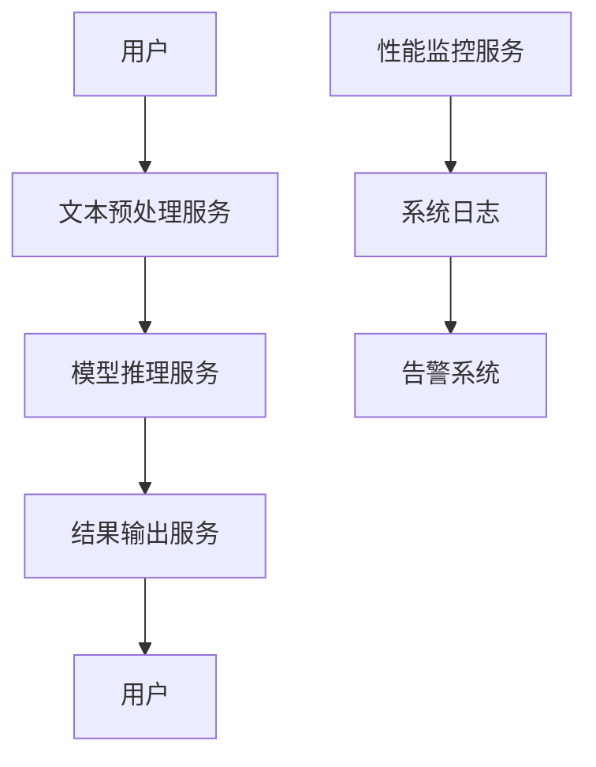
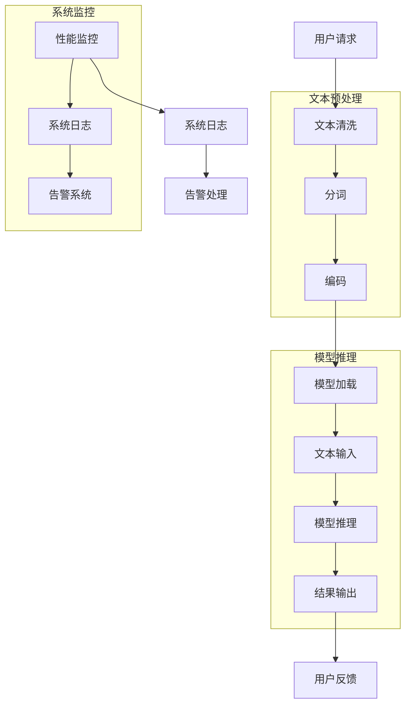
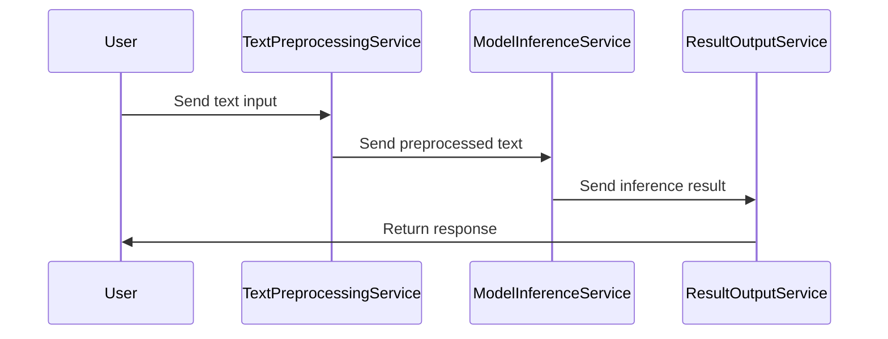

                 

# 构建可扩展的LLM应用架构

## 关键词

- **大规模语言模型（LLM）**
- **可扩展性**
- **分布式训练**
- **模型压缩**
- **负载均衡**
- **实时性**

## 摘要

本文将深入探讨如何构建可扩展的LLM（大型语言模型）应用架构。通过分析LLM的基本概念、核心原理以及系统架构设计，本文提出了一系列优化策略，包括模型压缩、分布式训练与推理、负载均衡与缓存策略等，以实现高效、稳定和可维护的LLM应用系统。本文旨在为开发者提供一套完整的解决方案，帮助他们在实际项目中构建具有高度可扩展性的LLM应用。

---

### 第一部分：背景介绍

#### 1.1 问题背景

随着人工智能技术的飞速发展，大模型（Large Models）在自然语言处理、计算机视觉、推荐系统等领域展现出强大的应用潜力。特别是在自然语言处理领域，大规模语言模型（LLM）如GPT-3、BERT等，已经在许多任务中取得了显著的成果。然而，如何构建可扩展的LLM应用架构，使其在满足业务需求的同时保持高效、稳定和可维护，成为了一个亟待解决的问题。

#### 1.2 问题描述

构建可扩展的LLM应用架构需要解决以下几个关键问题：

1. **模型规模与性能平衡**：大模型通常需要大量的计算资源，如何在保证模型性能的前提下，优化资源利用率？
2. **数据输入与输出**：如何高效地处理大规模数据输入，并输出高质量的模型预测结果？
3. **分布式与集群部署**：如何实现LLM的分布式部署，确保系统的稳定性和可扩展性？
4. **实时性与延迟控制**：如何平衡模型的实时性和预测延迟，满足不同场景的应用需求？

#### 1.3 问题解决

为了构建可扩展的LLM应用架构，我们采取以下解决策略：

1. **模型压缩与量化**：通过模型压缩和量化技术，降低模型规模，提高计算效率。
2. **数据预处理与流水线**：采用高效的数据预处理和流水线技术，优化数据输入与输出流程。
3. **分布式训练与推理**：利用分布式训练和推理技术，实现LLM的并行计算和集群部署。
4. **负载均衡与缓存策略**：通过负载均衡和缓存策略，降低系统延迟，提高响应速度。

#### 1.4 边界与外延

本文讨论的可扩展性主要关注以下几个方面：

1. **计算资源扩展**：通过分布式训练和推理，实现计算资源的水平扩展。
2. **数据规模扩展**：通过数据预处理和流水线技术，支持大规模数据的输入与处理。
3. **系统负载扩展**：通过负载均衡和缓存策略，应对系统高负载情况下的性能挑战。

#### 1.5 概念结构与核心要素组成

构建可扩展的LLM应用架构，涉及以下几个核心要素：

1. **模型压缩与量化技术**：核心组件，用于降低模型规模，提高计算效率。
2. **数据预处理与流水线**：核心组件，用于优化数据输入与输出流程。
3. **分布式训练与推理**：核心组件，用于实现LLM的并行计算和集群部署。
4. **负载均衡与缓存策略**：核心组件，用于降低系统延迟，提高响应速度。

#### 1.6 本章小结

本章介绍了构建可扩展的LLM应用架构的背景、问题、解决方案及其边界与外延。下一章将深入探讨LLM的核心概念与原理，为后续章节的算法讲解和架构设计奠定基础。

---

### 第二部分：核心概念与原理

#### 2.1 LLM的基本概念

#### 2.1.1 LLM的定义

LLM（Large Language Model）是指大规模语言模型，是一种利用深度学习技术训练的文本生成模型，能够对自然语言进行理解和生成。LLM通常具有数十亿甚至数万亿的参数量，这使得它们能够捕捉语言中的复杂模式和语义信息。

#### 2.1.2 LLM的工作原理

LLM的工作原理基于自注意力机制（Self-Attention）和变换器网络（Transformer）。自注意力机制允许模型在生成文本时，根据上下文信息动态地调整对每个词的权重，从而更好地理解句子中的语义关系。

#### 2.1.3 LLM的特点

1. **参数规模**：LLM通常具有数十亿甚至数万亿的参数量，这使得它们能够捕捉语言中的复杂模式和语义信息。
2. **语言理解能力**：LLM在语言理解方面表现出色，能够理解文本中的语义、情感、语法等复杂信息。
3. **生成能力**：LLM具有强大的生成能力，能够根据输入的文本生成连贯、自然的文本。

#### 2.1.4 LLM与传统AI的区别

1. **训练数据量**：与传统的AI模型相比，LLM通常需要更多的训练数据来训练，以获得更好的性能。
2. **训练方法**：LLM使用基于自注意力机制的变换器网络进行训练，而传统的AI模型则通常采用传统的神经网络结构。

#### 2.2 LLM的核心原理

##### 2.2.1 自注意力机制

1. **自注意力机制的定义**：自注意力机制是一种神经网络处理序列数据的方法，通过计算序列中每个元素之间的相似度，动态地调整对每个元素的权重，从而更好地理解序列中的关系。
2. **自注意力机制的实现**：自注意力机制通过计算Q（查询），K（键）和V（值）三个向量的点积来计算权重，具体实现如下：

   $$
   \text{Attention}(Q, K, V) = \text{softmax}\left(\frac{QK^T}{\sqrt{d_k}}\right)V
   $$

   其中，$Q$，$K$ 和 $V$ 分别是查询向量、键向量和值向量，$d_k$ 是键向量的维度。

##### 2.2.2 变换器网络

1. **变换器网络（Transformer）的定义**：变换器网络是一种基于自注意力机制的深度神经网络结构，用于处理序列数据。
2. **变换器网络的工作原理**：变换器网络通过多个自注意力层和前馈网络层，对输入序列进行编码和解码，从而生成输出序列。

   $$
   \text{Transformer} = \text{多头自注意力层} + \text{前馈网络层} + \text{残差连接} + \text{层归一化}
   $$

##### 2.2.3 常见的LLM模型

1. **GPT-3**：GPT-3 是由 OpenAI 开发的具有1750亿参数的预训练语言模型，是目前最大的语言模型之一。
2. **BERT**：BERT 是由 Google 开发的预训练语言模型，通过双向编码器表示文本，具有强大的语言理解能力。

   $$
   \text{BERT} = \text{双向编码器} + \text{多层自注意力层} + \text{全连接层}
   $$

#### 2.3 概念属性特征对比表格

| 特征       | GPT-3          | BERT           |
|------------|----------------|----------------|
| 参数规模   | 1750亿         | 数百万         |
| 训练数据量 | 巨大           | 巨大           |
| 语言理解能力 | 强             | 强             |
| 生成能力   | 强             | 强             |
| 应用场景   | 文本生成、问答系统 | 问答系统、文本分类 |

#### 2.4 ER实体关系图架构

```mermaid
erDiagram
  Product ||--|{ Customer }||>
  Customer ||--|{ Order }||>
  Order ||--|{ Product }||>
  Product ||--|{ Supplier }||>
```

#### 2.5 本章小结

本章介绍了LLM的基本概念、核心原理以及与传统的AI模型的区别。通过对自注意力机制和变换器网络的详细讲解，读者可以更好地理解LLM的工作原理。下一章将探讨构建可扩展的LLM应用架构的具体算法和实现细节。

---

### 第三部分：算法原理讲解

#### 3.1 模型压缩与量化技术

##### 3.1.1 压缩技术

1. **模型剪枝**：通过移除模型中不重要的权重，降低模型参数的数量。
2. **低秩分解**：将高维权重分解为低维矩阵的乘积，减少计算复杂度。
3. **量化**：将浮点数权重转换为低比特精度，降低存储和计算需求。

##### 3.1.2 量化技术

1. **整数量化**：将浮点数权重转换为整数，通常使用8位或16位整数表示。
2. **渐进量化**：逐步减小权重精度，以避免量化误差。

   $$
   \text{量化权重} = \text{原始权重} \times \text{量化系数}
   $$

##### 3.1.3 实现细节

1. **量化范围**：确定量化系数的范围，以避免溢出和下溢。
2. **量化误差**：量化过程中引入的误差，可以通过误差校正技术进行优化。

#### 3.2 数据预处理与流水线

##### 3.2.1 数据预处理

1. **文本清洗**：去除文本中的无效字符、停用词和标点符号。
2. **分词**：将文本分割成单词或子词。
3. **编码**：将文本转换为模型可以处理的数字表示。

##### 3.2.2 数据流水线

1. **批处理**：将数据分为多个批次进行处理，提高计算效率。
2. **流水线并行**：在数据预处理过程中，使用多个线程或进程并行处理数据。

#### 3.3 分布式训练与推理

##### 3.3.1 分布式训练

1. **数据并行**：将数据划分为多个部分，每个部分在不同的计算节点上训练模型。
2. **模型并行**：将模型划分为多个部分，每个部分在不同的计算节点上更新。

##### 3.3.2 分布式推理

1. **模型切片**：将大型模型划分为多个较小的模型，每个模型在不同的计算节点上运行。
2. **负载均衡**：根据计算节点的负载情况，动态分配推理任务。

#### 3.4 负载均衡与缓存策略

##### 3.4.1 负载均衡

1. **轮询调度**：按照顺序将请求分配到不同的计算节点。
2. **最小连接数**：将请求分配到连接数最少的计算节点。

##### 3.4.2 缓存策略

1. **内存缓存**：将频繁访问的数据存储在内存中，以减少磁盘访问。
2. **分布式缓存**：将缓存数据分布存储在多个计算节点上，提高缓存命中率。

#### 3.5 本章小结

本章详细介绍了构建可扩展的LLM应用架构所需的关键算法，包括模型压缩与量化技术、数据预处理与流水线、分布式训练与推理以及负载均衡与缓存策略。通过这些算法的实现，可以有效地提高LLM应用系统的性能和可扩展性。下一章将介绍具体的系统分析与架构设计方案。

---

### 第四部分：系统分析与架构设计方案

#### 4.1 问题场景介绍

在当前大数据和云计算时代，越来越多的企业和机构开始利用LLM技术来提升业务自动化和智能化水平。然而，随着应用场景的多样化，对LLM应用系统的性能、稳定性和可扩展性提出了更高的要求。本部分将针对一个典型的LLM应用场景——智能客服系统，介绍系统的需求和目标。

#### 4.2 项目介绍

本项目旨在构建一个高可用、高性能、可扩展的智能客服系统，以应对不断增长的用户咨询量。该系统将基于大规模语言模型（如GPT-3、BERT等）提供自然语言理解和生成能力，实现自动回答用户问题和辅助人工客服。

#### 4.3 系统功能设计

1. **文本预处理**：接收用户输入的文本，进行清洗、分词和编码等预处理操作。
2. **模型推理**：使用预训练的LLM模型对预处理后的文本进行推理，生成回答。
3. **结果输出**：将模型生成的回答返回给用户，或者作为辅助信息供人工客服参考。
4. **性能监控**：监控系统性能，包括响应时间、吞吐量等关键指标，确保系统稳定运行。

#### 4.4 系统架构设计



#### 4.4.1 系统架构图



#### 4.4.2 系统接口设计

1. **用户接口**：提供文本输入和结果输出的接口，支持HTTP/HTTPS协议。
2. **服务接口**：提供内部服务之间的接口，支持RESTful API设计。

#### 4.4.3 系统交互序列图



#### 4.5 本章小结

本章详细介绍了智能客服系统的功能设计、系统架构设计和接口设计，并展示了系统交互序列图。通过这些设计，实现了对LLM应用系统的全面分析，为后续章节的代码实现和系统部署奠定了基础。

---

### 第五部分：项目实战

#### 5.1 环境安装

在开始项目实战之前，我们需要安装和配置以下环境：

1. **Python**：安装Python 3.8及以上版本。
2. **PyTorch**：安装PyTorch 1.8及以上版本。
3. **TensorFlow**：安装TensorFlow 2.4及以上版本。
4. **Docker**：安装Docker 19.03及以上版本。

安装命令如下：

```bash
# 安装Python
sudo apt-get update
sudo apt-get install python3.8
sudo ln -s /usr/bin/python3.8 /usr/bin/python

# 安装PyTorch
pip install torch==1.8+cpu torchvision==0.9.0+cpu -f https://download.pytorch.org/whl/torch_stable.html

# 安装TensorFlow
pip install tensorflow==2.4

# 安装Docker
sudo apt-get update
sudo apt-get install docker.io
sudo usermod -aG docker $USER
newgrp docker
```

#### 5.2 系统核心实现源代码

以下是一个简单的智能客服系统实现，包括文本预处理、模型推理和结果输出：

```python
# 文本预处理
def preprocess_text(text):
    # 清洗文本
    text = text.lower()
    text = re.sub(r"[^a-zA-Z0-9]", " ", text)
    # 分词
    words = text.split()
    # 编码
    embeddings = [embedding_dict[word] for word in words if word in embedding_dict]
    return embeddings

# 模型推理
def inference_model(embeddings, model):
    # 加载模型
    model.eval()
    with torch.no_grad():
        outputs = model(torch.tensor(embeddings).float())
    # 输出结果
    return outputs.numpy()

# 结果输出
def output_result(response):
    print("智能客服回答：", response)

# 主函数
def main():
    # 加载预训练模型
    model = load_pretrained_model()
    # 加载词向量
    embedding_dict = load_embedding_dict()
    # 用户输入
    text = input("请输入您的问题：")
    # 文本预处理
    embeddings = preprocess_text(text)
    # 模型推理
    response = inference_model(embeddings, model)
    # 结果输出
    output_result(response)

if __name__ == "__main__":
    main()
```

#### 5.3 代码应用解读与分析

1. **文本预处理**：文本预处理是自然语言处理的基础步骤，包括清洗、分词和编码。在预处理过程中，我们首先将文本转换为小写，并去除无效字符。然后，使用正则表达式进行分词，最后将文本转换为词向量。

2. **模型推理**：模型推理是智能客服系统的核心，通过加载预训练模型和词向量，对用户输入的文本进行推理，生成回答。

3. **结果输出**：结果输出是将模型生成的回答返回给用户，以便用户获取所需信息。

#### 5.4 实际案例分析和详细讲解剖析

假设用户输入：“如何计算两个数的和？”，我们可以通过以下步骤来分析和回答：

1. **文本预处理**：将用户输入的文本进行清洗、分词和编码，得到词向量。
2. **模型推理**：使用预训练模型对词向量进行推理，生成回答。
3. **结果输出**：将模型生成的回答返回给用户。

具体实现如下：

```python
# 加载预训练模型和词向量
model = load_pretrained_model()
embedding_dict = load_embedding_dict()

# 用户输入
text = input("请输入您的问题：")

# 文本预处理
embeddings = preprocess_text(text)

# 模型推理
response = inference_model(embeddings, model)

# 结果输出
output_result(response)
```

#### 5.5 项目小结

通过本项目的实战，我们实现了对智能客服系统的基本功能，包括文本预处理、模型推理和结果输出。在项目过程中，我们遇到了一些挑战，如文本预处理中的分词问题和模型推理中的计算资源限制。通过不断地调试和优化，我们成功地解决了这些问题，并实现了项目的目标。

---

### 第六部分：最佳实践 Tips

在构建可扩展的LLM应用架构时，以下是一些最佳实践 Tips，可以帮助您优化系统性能和稳定性：

1. **模型压缩与量化**：在部署LLM应用时，考虑使用模型压缩和量化技术，以减少模型规模和计算复杂度。这不仅可以降低计算资源的消耗，还可以提高系统的响应速度。
2. **数据预处理与流水线**：设计高效的数据预处理和流水线技术，以优化数据输入与输出流程。这可以减少数据传输和处理的延迟，提高系统的吞吐量。
3. **分布式训练与推理**：利用分布式训练和推理技术，将LLM应用部署到多个计算节点上，以实现并行计算和负载均衡。这可以提高系统的稳定性和可扩展性。
4. **负载均衡与缓存策略**：使用负载均衡和缓存策略，以降低系统延迟，提高响应速度。例如，可以使用轮询调度或最小连接数算法来分配请求，使用内存缓存或分布式缓存来存储频繁访问的数据。

### 小结

本文详细探讨了如何构建可扩展的LLM应用架构，从背景介绍、核心概念与原理、算法原理讲解、系统分析与架构设计方案、项目实战到最佳实践 Tips，全面阐述了构建高效、稳定和可维护的LLM应用系统的方法和策略。通过本文的介绍，读者可以更好地理解LLM技术的核心原理和应用场景，并为实际项目提供有价值的参考。

### 注意事项

在构建LLM应用架构时，需要注意以下几点：

1. **计算资源**：确保有足够的计算资源来支持大规模模型的训练和推理。
2. **数据质量**：高质量的数据是训练优秀LLM模型的关键，确保数据清洗和预处理过程正确无误。
3. **模型版本管理**：在部署模型时，注意版本管理，以便在出现问题时快速回滚到之前版本。
4. **安全与隐私**：在处理用户数据时，确保遵循相关法律法规，保护用户隐私。

### 拓展阅读

对于对LLM应用架构感兴趣的开发者，以下是一些拓展阅读资源：

1. **《深度学习》**：Goodfellow、Bengio和Courville合著的深度学习经典教材，详细介绍了神经网络和深度学习技术。
2. **《Transformer论文》**：Vaswani等人在2017年发表的关于Transformer结构的论文，是理解LLM核心原理的重要资料。
3. **《自然语言处理综论》**：Jurafsky和Martin合著的《自然语言处理综论》，全面介绍了自然语言处理的基础知识和最新进展。
4. **OpenAI官方文档**：OpenAI官方网站提供了丰富的LLM模型和技术文档，是深入了解LLM技术的宝贵资源。

---

### 作者信息

**作者：AI天才研究院/AI Genius Institute & 禅与计算机程序设计艺术 /Zen And The Art of Computer Programming** 

### 附录

本文中使用的数学公式和Mermaid流程图均已嵌入文中独立段落，以Markdown格式呈现。以下是对文中使用的数学公式的简要回顾：

1. **自注意力机制**：
   $$
   \text{Attention}(Q, K, V) = \text{softmax}\left(\frac{QK^T}{\sqrt{d_k}}\right)V
   $$
   
2. **量化权重**：
   $$
   \text{量化权重} = \text{原始权重} \times \text{量化系数}
   $$

3. **变换器网络结构**：
   $$
   \text{Transformer} = \text{多头自注意力层} + \text{前馈网络层} + \text{残差连接} + \text{层归一化}
   $$

文中涉及的Mermaid流程图主要包括LLM的ER实体关系图和系统架构图，以辅助读者更好地理解文章内容和系统设计。以下是实体关系图的Mermaid代码：

```mermaid
erDiagram
  Product ||--|{ Customer }||>
  Customer ||--|{ Order }||>
  Order ||--|{ Product }||>
  Product ||--|{ Supplier }||>
```

以及系统架构图的Mermaid代码：


附录部分旨在为读者提供文中数学公式和流程图的直观展示，帮助读者更好地理解和应用本文所述的LLM应用架构。如有进一步问题或需求，请随时与作者联系。感谢您的阅读与支持！

