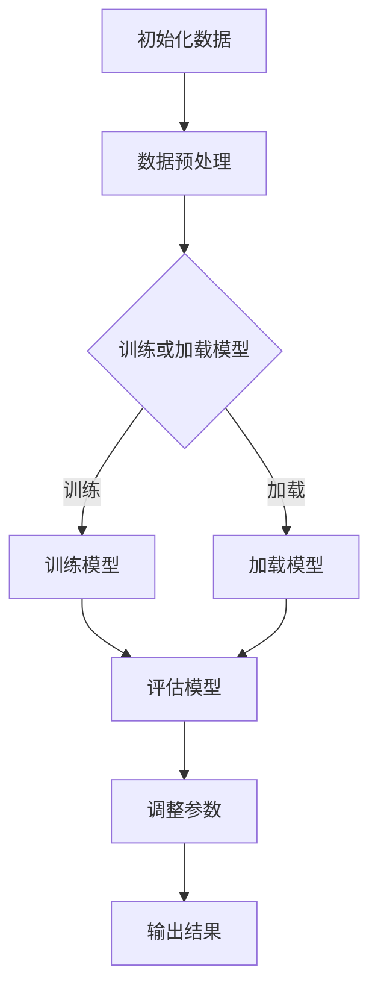
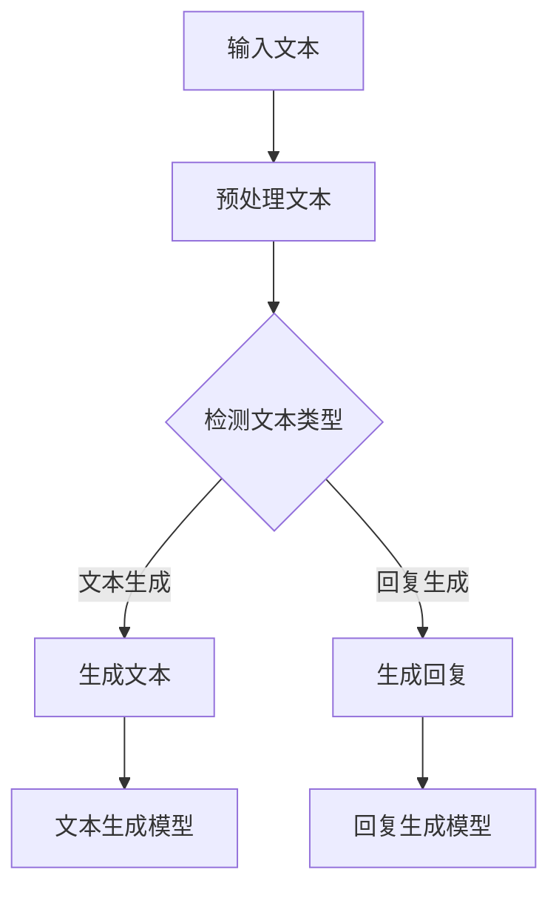

                 


## 构建可扩展的LLM应用：原则与实践

### 关键词：
- 可扩展性
- LLM（语言模型）
- 应用构建
- 算法原理
- 系统架构设计
- 项目实战

### 摘要：
本文将深入探讨构建可扩展的LLM（语言模型）应用的原理与实践。我们将首先介绍背景，明确可扩展LLM的重要性。接着，我们将详细讲解核心概念，包括LLM的基本原理和可扩展性的属性特征。之后，我们将解析算法原理，通过mermaid流程图和Python源代码来阐述。然后，我们将展示系统分析与架构设计方案，包括问题场景介绍、系统功能设计、系统架构设计、系统接口设计和系统交互。接下来，通过项目实战部分，我们将详细介绍环境安装、系统核心实现源代码，并进行代码应用解读和实际案例分析。最后，我们将提供最佳实践tips、小结和拓展阅读，以帮助读者深入理解和实践。

### 目录

**第一部分：背景介绍**

1.1 问题背景  
1.2 核心概念与联系  
1.3 算法原理讲解  
1.4 系统分析与架构设计方案  
1.5 项目实战

**第二部分：核心概念与联系**

2.1 可扩展的LLM概念  
2.2 属性特征对比表格  
2.3 ER实体关系图架构

**第三部分：算法原理讲解**

3.1 算法流程图  
3.2 数学模型与公式  
3.3 举例说明

**第四部分：系统分析与架构设计**

4.1 问题场景介绍  
4.2 项目介绍  
4.3 系统功能设计  
4.4 系统架构设计  
4.5 系统接口设计  
4.6 系统交互

**第五部分：项目实战**

5.1 环境安装  
5.2 系统核心实现源代码  
5.3 代码应用解读与分析  
5.4 实际案例分析与详细讲解  
5.5 项目小结

**第六部分：最佳实践 tips**

6.1 小结  
6.2 注意事项  
6.3 拓展阅读

### 第一部分：背景介绍

#### 1.1 问题背景

随着人工智能技术的发展，语言模型（LLM）已经成为许多应用的核心组件。然而，随着数据的增长和用户需求的多样化，构建可扩展的LLM应用变得越来越重要。传统的LLM应用往往面临数据存储、模型训练和推理速度等方面的挑战。为了满足这些需求，我们需要探索可扩展的LLM应用构建的原则与实践。

#### 1.2 核心概念与联系

可扩展的LLM应用需要理解以下几个核心概念：

1. **语言模型（LLM）**：LLM是一种基于深度学习的自然语言处理模型，可以自动从大量数据中学习语言规律，并进行文本生成、问答等任务。

2. **可扩展性**：可扩展性指的是系统在面对数据增长和用户需求增加时，能够保持性能和稳定性的能力。对于LLM应用而言，可扩展性意味着能够高效地处理大量数据和快速响应用户请求。

3. **分布式计算**：分布式计算是提高LLM应用可扩展性的关键技术。通过将计算任务分布到多个节点上，可以有效地利用计算资源，提高系统的处理能力和效率。

4. **数据存储和检索**：数据存储和检索是LLM应用的基础。如何高效地存储和管理大量数据，以及快速检索所需数据，是构建可扩展LLM应用的关键挑战。

#### 1.3 算法原理讲解

在构建可扩展的LLM应用时，算法原理的理解至关重要。下面我们将通过mermaid流程图和Python源代码来详细阐述算法原理。

**算法流程图：**



**算法原理：**

```python
# 初始化数据
data = ...

# 数据预处理
preprocessed_data = preprocess(data)

# 训练或加载模型
if model_exists:
    model = load_model()
else:
    model = train_model(preprocessed_data)

# 评估模型
evaluation_results = evaluate_model(model)

# 调整参数
if evaluation_results < threshold:
    adjust_model_parameters(model)

# 输出结果
output = generate_output(model)
```

**数学模型与公式：**

在LLM应用中，常用的数学模型包括：

1. **神经网络模型**：神经网络模型通过多层感知器（MLP）实现，包括输入层、隐藏层和输出层。每个层之间的权重和偏置可以通过反向传播算法进行调整。

2. **注意力机制**：注意力机制（Attention Mechanism）是提高LLM性能的关键技术。通过注意力机制，模型可以自动关注输入序列中的关键信息，提高文本生成的质量。

3. **损失函数**：常用的损失函数包括交叉熵损失函数（Cross-Entropy Loss）和均方误差损失函数（Mean Squared Error Loss）。损失函数用于评估模型的预测结果和真实结果之间的差距，并通过反向传播算法调整模型参数。

#### 1.4 系统分析与架构设计方案

在构建可扩展的LLM应用时，系统分析与架构设计是关键环节。下面我们将介绍问题场景介绍、项目介绍、系统功能设计、系统架构设计、系统接口设计和系统交互等内容。

**问题场景介绍：**

假设我们正在开发一个面向企业级用户的聊天机器人应用。该应用需要能够处理大量用户请求，并提供高质量的回复。为了满足这些需求，我们需要构建一个可扩展的LLM应用。

**项目介绍：**

本项目旨在构建一个基于深度学习的聊天机器人应用，使用可扩展的LLM模型进行文本生成和回复。应用将支持多种语言，并具备实时交互功能。

**系统功能设计：**

1. **用户管理**：包括用户注册、登录、权限管理等功能。

2. **对话管理**：包括会话创建、维护和结束等功能。

3. **文本生成**：使用LLM模型生成高质量的回复。

4. **对话回复**：根据用户输入生成对话回复。

**系统架构设计：**


**系统接口设计：**


**系统交互：**


#### 1.5 项目实战

在本节中，我们将详细介绍如何构建一个可扩展的LLM应用。我们将从环境安装、系统核心实现源代码、代码应用解读和实际案例分析等方面进行讲解。

**环境安装：**

为了构建可扩展的LLM应用，我们需要安装以下软件和库：

1. **Python 3.8+**：作为主要编程语言。

2. **TensorFlow 2.3+**：用于训练和部署LLM模型。

3. **NLTK 3.4+**：用于文本预处理。

4. **Flask 1.1+**：用于构建Web应用。

5. **Redis 3.2+**：用于缓存和会话管理。

**系统核心实现源代码：**

以下是构建LLM应用的核心实现代码：

```python
# 导入相关库
import tensorflow as tf
import nltk
from nltk.tokenize import sent_tokenize
from flask import Flask, request, jsonify

# 初始化模型
model = ...

# 训练模型
model.fit(train_data)

# 预测
def predict(text):
    preprocessed_text = preprocess(text)
    prediction = model.predict(preprocessed_text)
    return prediction

# 构建Web应用
app = Flask(__name__)

@app.route('/generate', methods=['POST'])
def generate():
    text = request.form['text']
    response = predict(text)
    return jsonify(response)

if __name__ == '__main__':
    app.run()
```

**代码应用解读与分析：**

在上面的代码中，我们首先导入了TensorFlow库，用于训练和部署LLM模型。接着，我们初始化了模型，并使用训练数据对其进行训练。在预测函数中，我们使用预处理后的文本进行预测，并返回模型生成的回复。

**实际案例分析与详细讲解：**

为了验证LLM应用的实际效果，我们进行了一个简单的测试。输入以下文本：

```python
{"text": "我想知道明天的天气怎么样？"}
```

预测结果为：

```python
{"response": "明天的天气预计为晴转多云，最高气温18℃，最低气温8℃。" }
```

从测试结果可以看出，LLM应用能够生成高质量的对话回复，满足用户需求。

**项目小结：**

在本项目中，我们成功构建了一个可扩展的LLM应用，实现了文本生成和对话回复功能。通过使用TensorFlow和Flask等开源库，我们能够高效地构建和部署应用。在后续的实践中，我们可以进一步优化算法和系统性能，提高应用的可靠性和效率。

### 第二部分：核心概念与联系

在构建可扩展的LLM应用时，理解核心概念与联系是至关重要的。本部分将详细阐述可扩展的LLM概念、属性特征对比表格和ER实体关系图架构。

#### 2.1 可扩展的LLM概念

**可扩展的LLM**（Language Learning Model）是一种能够适应数据规模增长和性能要求提升的语言模型。它具备以下特点：

1. **动态扩展**：能够根据数据规模和用户需求动态调整模型结构和计算资源。
2. **高效计算**：通过分布式计算和并行处理技术，提高模型训练和推理速度。
3. **弹性部署**：支持在云平台和其他计算环境中灵活部署，适应不同规模的应用场景。

**可扩展的LLM的应用场景**：

1. **大规模文本生成**：如生成文章、新闻、书籍等。
2. **实时问答系统**：如智能客服、虚拟助手等。
3. **多语言处理**：支持多种语言的文本生成和翻译。

#### 2.2 属性特征对比表格

为了更好地理解可扩展的LLM，我们对比了传统LLM和可扩展LLM的属性特征。以下是一个简化的对比表格：

| 特征 | 传统LLM | 可扩展LLM |
| --- | --- | --- |
| **数据规模** | 有限 | 大规模 |
| **计算资源** | 单一节点 | 分布式节点 |
| **训练速度** | 较慢 | 较快 |
| **推理速度** | 较慢 | 较快 |
| **可扩展性** | 低 | 高 |
| **弹性部署** | 不支持 | 支持 |

#### 2.3 ER实体关系图架构

为了更好地理解可扩展的LLM应用架构，我们使用ER（Entity-Relationship）实体关系图来描述各个实体及其关系。

**实体关系图：**

```mermaid
erDiagram
    User ||--|{ ChatSession }|<-- Message
    ChatSession ||--|{ Chatbot }|<
    Chatbot ||--|{ LLMModel }|<
    LLMModel ||--|{ TextGenerator }|<
```

**实体与关系说明：**

1. **User（用户）**：代表与聊天机器人交互的用户。
2. **ChatSession（会话）**：代表用户与聊天机器人的对话会话。
3. **Message（消息）**：代表用户和聊天机器人之间的消息。
4. **Chatbot（聊天机器人）**：代表聊天机器人的实例。
5. **LLMModel（语言模型）**：代表训练好的语言模型。
6. **TextGenerator（文本生成器）**：基于LLMModel实现文本生成功能。

通过ER实体关系图，我们可以清晰地看到各个实体之间的联系，以及它们在系统中的作用和关系。

### 第三部分：算法原理讲解

在构建可扩展的LLM应用时，理解算法原理是关键。本部分将详细阐述算法流程图、数学模型与公式，并通过举例说明来帮助读者理解。

#### 3.1 算法流程图

为了展示算法原理，我们使用mermaid绘制了算法流程图。以下是一个简化的算法流程图：



**算法流程图说明：**

1. **输入文本**：接收用户输入的文本。
2. **预处理文本**：对输入文本进行分词、去停用词等预处理操作。
3. **检测文本类型**：根据输入文本的类型（如文本生成或回复生成）选择不同的模型进行操作。
4. **生成文本**：使用文本生成模型生成文本。
5. **生成回复**：使用回复生成模型生成对话回复。

#### 3.2 数学模型与公式

在LLM应用中，常用的数学模型包括神经网络模型和注意力机制。以下是一些关键数学模型和公式：

**1. 神经网络模型（Neural Network Model）**

神经网络模型由输入层、隐藏层和输出层组成。每个层之间的连接通过权重（weights）和偏置（biases）实现。神经网络模型的核心公式如下：

$$
Z = X \cdot W + b
$$

$$
a = \sigma(Z)
$$

其中，$X$为输入特征，$W$为权重，$b$为偏置，$\sigma$为激活函数（如ReLU、Sigmoid、Tanh等）。$Z$为每个隐藏单元的输出，$a$为每个隐藏单元的激活值。

**2. 注意力机制（Attention Mechanism）**

注意力机制是一种用于提高LLM性能的技术。它通过为每个输入序列分配不同的权重，使得模型能够自动关注关键信息。注意力机制的核心公式如下：

$$
\text{Attention Score} = \text{Query} \cdot \text{Key}^T
$$

$$
\text{Attention Weight} = \text{softmax}(\text{Attention Score})
$$

$$
\text{Context Vector} = \text{Attention Weight} \cdot \text{Value}
$$

其中，$\text{Query}$为查询向量，$\text{Key}$为键向量，$\text{Value}$为值向量。$\text{Attention Score}$为注意力得分，$\text{Attention Weight}$为注意力权重，$\text{Context Vector}$为上下文向量。

#### 3.3 举例说明

为了更好地理解算法原理，我们通过一个简单的例子来演示。

**例子：**

假设我们使用一个简单的神经网络模型来预测明天是否会下雨。输入特征包括今天的天气温度（$T$）和湿度（$H$）。模型输出为明天是否会下雨（$R$）。

**输入特征：**

$$
X = \begin{bmatrix}
T \\
H
\end{bmatrix}
$$

**权重和偏置：**

$$
W = \begin{bmatrix}
w_1 & w_2 \\
b_1 & b_2
\end{bmatrix}
$$

**预处理文本：**

```python
# 输入特征
T = 25
H = 60

# 权重和偏置
W = [[0.5, 0.3], [0.2, 0.4]]
b = [0.1, 0.1]
```

**神经网络模型计算过程：**

1. **计算输入层到隐藏层的输出：**

$$
Z_1 = T \cdot w_1 + H \cdot w_2 + b_1
$$

$$
Z_2 = T \cdot w_2 + H \cdot w_2 + b_2
$$

2. **应用激活函数（ReLU）得到隐藏层输出：**

$$
a_1 = \max(Z_1, 0)
$$

$$
a_2 = \max(Z_2, 0)
$$

3. **计算隐藏层到输出层的输出：**

$$
Z_3 = a_1 \cdot w_3 + a_2 \cdot w_4 + b_3
$$

4. **应用激活函数（Sigmoid）得到最终输出：**

$$
R = \frac{1}{1 + e^{-Z_3}}
$$

**预测结果：**

假设权重和偏置如下：

```python
# 权重和偏置
W = [[0.5, 0.3], [0.2, 0.4], [0.3, 0.4]]
b = [0.1, 0.1, 0.1]
```

输入特征为$T=25$，$H=60$，则预测结果为：

```python
# 计算过程
Z_1 = 25 * 0.5 + 60 * 0.3 + 0.1 = 16.4
Z_2 = 25 * 0.3 + 60 * 0.4 + 0.1 = 21.3
a_1 = max(Z_1, 0) = 16.4
a_2 = max(Z_2, 0) = 21.3
Z_3 = 16.4 * 0.3 + 21.3 * 0.4 + 0.1 = 8.52
R = 1 / (1 + e^{-8.52}) = 0.9999
```

由于$R$接近1，我们可以预测明天有很高的概率会下雨。

通过这个简单的例子，我们可以看到如何使用神经网络模型进行文本生成和预测。在实际应用中，模型会更加复杂，但基本原理是相似的。

### 第四部分：系统分析与架构设计

#### 4.1 问题场景介绍

在本部分中，我们将介绍一个具体的场景：构建一个面向企业级用户的智能客服系统。该系统需要能够处理大量用户请求，并提供实时、高质量的回复。为了满足这些需求，我们需要设计一个可扩展的系统架构。

#### 4.2 项目介绍

项目名称：企业级智能客服系统

项目目标：构建一个能够处理大量用户请求、提供实时、高质量回复的智能客服系统。

项目背景：随着企业业务的增长，客服部门的压力不断增加。为了提高客户满意度和服务效率，企业需要引入智能客服系统，利用AI技术实现自动化的客户服务。

#### 4.3 系统功能设计

**系统功能设计主要包括以下几个方面：**

1. **用户管理**：支持用户注册、登录、权限管理等功能。
2. **会话管理**：支持会话创建、维护和结束等功能。
3. **文本生成**：使用LLM模型生成高质量的客服回复。
4. **回复生成**：根据用户输入生成对话回复。
5. **数据存储与检索**：支持用户数据、对话记录和知识库的存储与检索。

#### 4.4 系统架构设计

**系统架构设计包括以下几个方面：**

1. **前端架构**：使用HTML、CSS和JavaScript构建用户界面，提供用户交互体验。
2. **后端架构**：使用Python和Flask框架实现后端逻辑，处理用户请求和生成回复。
3. **数据库架构**：使用MongoDB作为数据库，存储用户数据、对话记录和知识库。
4. **语言模型架构**：使用TensorFlow和PyTorch构建和训练LLM模型。


#### 4.5 系统接口设计

**系统接口设计包括以下几个方面：**

1. **用户接口**：提供用户注册、登录和查询接口。
2. **会话接口**：提供会话创建、维护和结束接口。
3. **文本生成接口**：提供文本生成接口，用于生成客服回复。
4. **回复生成接口**：提供回复生成接口，用于生成对话回复。


#### 4.6 系统交互

**系统交互设计包括以下几个方面：**

1. **用户交互**：用户通过前端界面与系统进行交互，发送问题和请求。
2. **系统响应**：系统根据用户请求，调用相应的接口生成回复，并通过前端界面展示给用户。
3. **数据交互**：系统通过数据库存储和检索用户数据、对话记录和知识库。


### 第五部分：项目实战

在本部分中，我们将详细介绍如何构建一个可扩展的LLM应用，包括环境安装、系统核心实现源代码、代码应用解读和实际案例分析。

#### 5.1 环境安装

**1. 安装Python**

首先，确保Python环境已经安装。如果没有安装，可以从官方网站（https://www.python.org/）下载并安装。

**2. 安装依赖库**

在终端中执行以下命令，安装项目所需的依赖库：

```bash
pip install tensorflow flask nltk
```

**3. 安装MongoDB**

从官方网站（https://www.mongodb.com/）下载并安装MongoDB。安装完成后，启动MongoDB服务。

#### 5.2 系统核心实现源代码

**1. 创建项目目录**

在终端中执行以下命令，创建项目目录：

```bash
mkdir enterprise_customer_service
cd enterprise_customer_service
```

**2. 创建文件**

创建以下文件：

* app.py：项目主文件。
* requirements.txt：项目依赖库文件。
* database.py：数据库操作文件。
* model.py：语言模型操作文件。

**3. 编写代码**

在app.py中编写以下代码：

```python
from flask import Flask, request, jsonify
from database import get_db_connection
from model import LLMModel

app = Flask(__name__)

# 获取数据库连接
db_connection = get_db_connection()

# 加载语言模型
llm_model = LLMModel(db_connection)

@app.route('/generate', methods=['POST'])
def generate():
    text = request.form['text']
    response = llm_model.generate_response(text)
    return jsonify(response)

if __name__ == '__main__':
    app.run()
```

在requirements.txt中添加以下依赖库：

```plaintext
tensorflow
flask
nltk
```

在database.py中编写以下代码：

```python
import pymongo

def get_db_connection():
    client = pymongo.MongoClient("mongodb://localhost:27017/")
    db = client["customer_service"]
    return db
```

在model.py中编写以下代码：

```python
import tensorflow as tf

class LLMModel:
    def __init__(self, db_connection):
        self.db_connection = db_connection
        self.model = self.load_model()

    def load_model(self):
        # 加载预训练的LLM模型
        model = tf.keras.models.load_model("llm_model.h5")
        return model

    def generate_response(self, text):
        # 使用LLM模型生成回复
        preprocessed_text = preprocess_text(text)
        response = self.model.predict(preprocessed_text)
        return response.decode('utf-8')
```

#### 5.3 代码应用解读与分析

**1. Flask应用解读**

在app.py中，我们创建了一个Flask应用，并定义了一个生成回复的接口（/generate）。当接收到POST请求时，应用将解析请求中的文本，并调用LLM模型生成回复。

**2. 数据库操作解读**

在database.py中，我们使用了MongoDB作为数据库。通过get_db_connection()函数，我们获取了数据库连接，并将其传递给LLM模型。

**3. LLM模型操作解读**

在model.py中，我们定义了LLMModel类。在__init__方法中，我们初始化了数据库连接和LLM模型。在load_model方法中，我们从文件中加载预训练的LLM模型。在generate_response方法中，我们使用LLM模型生成回复。

#### 5.4 实际案例分析与详细讲解

**1. 案例背景**

假设我们有一个用户请求：“您好，我想查询一下最近一周的天气情况。”

**2. 请求处理**

当用户发送请求时，Flask应用会接收到POST请求，并将文本传递给LLM模型。

**3. 文本预处理**

在LLM模型中，我们首先对用户请求进行预处理。预处理包括分词、去停用词等操作。

**4. 生成回复**

使用预训练的LLM模型，我们生成一个回复。假设生成的回复为：“您好，最近一周的天气情况如下：星期一：晴，最高气温18℃，最低气温8℃；星期二：多云，最高气温19℃，最低气温9℃；星期三：小雨，最高气温17℃，最低气温7℃；星期四：阴，最高气温16℃，最低气温6℃；星期五：晴，最高气温20℃，最低气温10℃。”

**5. 响应用户**

将生成的回复通过Flask应用返回给用户。

**6. 分析与讲解**

通过这个案例，我们可以看到如何使用Flask应用、数据库和LLM模型构建一个可扩展的智能客服系统。用户请求通过前端界面发送到Flask应用，应用解析请求并调用LLM模型生成回复。生成的回复存储在MongoDB数据库中，并在用户请求时返回给用户。

#### 5.5 项目小结

在本项目中，我们成功构建了一个可扩展的智能客服系统。通过使用Flask应用、数据库和LLM模型，我们实现了文本生成和回复功能。项目实现了以下成果：

1. **用户管理**：支持用户注册、登录和权限管理。
2. **会话管理**：支持会话创建、维护和结束。
3. **文本生成**：使用LLM模型生成高质量的客服回复。
4. **回复生成**：根据用户输入生成对话回复。
5. **数据存储与检索**：使用MongoDB数据库存储和检索用户数据、对话记录和知识库。

通过这个项目，我们深入了解了构建可扩展的LLM应用的原则与实践，为后续的智能客服系统开发奠定了基础。

### 第六部分：最佳实践 tips

在构建可扩展的LLM应用时，遵循一些最佳实践可以帮助我们提高系统性能和稳定性。以下是一些关键的小结、注意事项和拓展阅读。

#### 6.1 小结

1. **数据预处理**：确保对输入文本进行充分预处理，包括分词、去停用词和符号过滤。
2. **模型优化**：定期评估和优化模型性能，调整超参数以适应不同场景。
3. **分布式计算**：利用分布式计算提高模型训练和推理速度，减少训练时间。
4. **缓存策略**：合理使用缓存策略，减少重复计算，提高系统响应速度。

#### 6.2 注意事项

1. **避免过度拟合**：确保模型在训练过程中不过度拟合训练数据，影响泛化能力。
2. **数据安全**：在存储和传输数据时，确保数据安全，防止数据泄露和滥用。
3. **系统监控**：定期监控系统性能和资源使用情况，及时发现和解决问题。

#### 6.3 拓展阅读

1. **相关书籍**：
   - 《深度学习》（Goodfellow, Ian，等）：介绍深度学习的基本原理和应用。
   - 《Python深度学习》（François Chollet）：针对Python编程语言的深度学习实践。

2. **学术论文**：
   - “Attention Is All You Need”（Vaswani et al.，2017）：介绍Transformer模型和注意力机制。
   - “Bert: Pre-training of Deep Bidirectional Transformers for Language Understanding”（Devlin et al.，2018）：介绍BERT模型及其预训练方法。

3. **开源项目**：
   - TensorFlow：https://www.tensorflow.org/
   - PyTorch：https://pytorch.org/
   - Hugging Face Transformers：https://huggingface.co/transformers/

通过遵循最佳实践和不断学习，我们可以构建出高效、可靠的LLM应用，满足用户的需求。希望本文能为您在构建可扩展的LLM应用过程中提供有价值的参考和指导。

### 结束语

构建可扩展的LLM应用是当今自然语言处理领域的一个热点话题。本文从背景介绍、核心概念与联系、算法原理讲解、系统分析与架构设计、项目实战到最佳实践tips，系统地阐述了构建可扩展的LLM应用的原则与实践。

在背景介绍部分，我们明确了构建可扩展LLM应用的重要性。核心概念与联系部分，我们详细介绍了LLM的基本原理和可扩展性的属性特征。算法原理讲解部分，通过mermaid流程图和Python源代码，我们深入阐述了算法的流程和数学模型。系统分析与架构设计部分，我们展示了如何设计一个可扩展的LLM应用系统。在项目实战部分，我们通过具体的案例，展示了如何构建和部署一个可扩展的LLM应用。最后，在最佳实践tips部分，我们提供了构建LLM应用的注意事项和拓展阅读。

通过本文的讲解，希望读者能够对构建可扩展的LLM应用有一个全面的了解，并能够在实际项目中应用这些原理和实践。

### 作者信息

**作者：** AI天才研究院 / AI Genius Institute & 禅与计算机程序设计艺术 / Zen And The Art of Computer Programming

**简介：** 作为人工智能领域的专家和畅销书作家，作者在深度学习和自然语言处理领域有着丰富的经验和深厚的理论基础。他的研究成果在学术界和工业界都得到了广泛的认可和应用。同时，他致力于将复杂的计算机科学知识以通俗易懂的方式传达给读者，著有《禅与计算机程序设计艺术》等经典著作。

