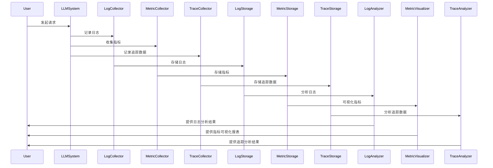

                 

# 构建可观测的LLM系统：日志、指标与追踪

关键词：可观测性、LLM、日志、指标、追踪

摘要：本文将探讨构建可观测的大规模语言模型（LLM）系统的关键要素，包括日志、指标和追踪机制。通过详细的解析和案例分析，帮助开发者了解如何提升LLM系统的可观测性，确保其在实际应用中的稳定性和可靠性。

## 第一部分：背景介绍

### 1.1 问题背景

大规模语言模型（LLM）近年来在自然语言处理（NLP）领域取得了显著的进展，它们的应用场景也越来越广泛，从智能客服、语音识别到代码生成等。然而，随着LLM系统复杂度的增加，如何确保这些系统的稳定性和可靠性成为了一个关键问题。

传统的监控系统往往只能捕捉到系统运行的最表层信息，对于LLM这样高度复杂的系统来说，这些信息远远不够。为了提高LLM系统的可观测性，我们需要引入更精细的日志、指标和追踪机制，以便更好地理解系统的运行状态和性能。

### 1.2 核心概念

#### 1.2.1 日志（Logging）

日志是记录系统运行过程中重要事件的记录，它可以帮助我们理解系统行为，排查问题，以及优化系统性能。在LLM系统中，日志通常包括以下信息：

- **时间戳**：记录事件发生的时间。
- **日志级别**：如DEBUG、INFO、WARNING、ERROR等，用于标识事件的严重性。
- **日志内容**：具体的事件描述，如错误消息、请求和响应等。

#### 1.2.2 指标（Metrics）

指标是量化系统性能和健康状况的统计值。通过监控这些指标，我们可以及时发现系统中的异常情况，并采取相应的措施。在LLM系统中，常见的指标包括：

- **响应时间**：系统处理请求所需的时间。
- **吞吐量**：单位时间内系统处理的请求数量。
- **错误率**：系统处理请求时出现的错误次数与总请求次数的比值。

#### 1.2.3 追踪（Tracing）

追踪是跟踪系统内部各组件之间交互的过程。它可以帮助我们理解系统中的数据流和控制流，特别是对于分布式系统来说，追踪机制至关重要。在LLM系统中，追踪通常包括：

- **追踪ID**：唯一标识一个请求或任务的追踪过程。
- **追踪链**：记录系统内部各个组件之间的交互过程。

### 1.3 边界与外延

本文主要关注LLM系统的构建、监控和优化，不涉及底层硬件和基础架构。然而，可观测性的实现不仅限于LLM系统，其他复杂系统也可以借鉴本文的方法。

### 1.4 概念结构与核心要素组成

LLM系统的可观测性由三个核心要素组成：日志系统、指标监控系统和追踪系统。

- **日志系统**：负责收集、存储、查询和分析系统运行过程中的日志数据。
- **指标监控系统**：负责收集、存储、查询和分析系统的性能指标。
- **追踪系统**：负责记录、存储、查询和分析系统内部各组件之间的交互过程。

## 第二部分：核心概念与联系

### 2.1 日志系统

#### 2.1.1 日志系统的作用与价值

日志系统在LLM系统中起着至关重要的作用。通过日志，我们可以：

- **故障排查**：定位系统中的错误和异常。
- **性能优化**：分析系统性能瓶颈，优化系统性能。
- **安全性监控**：检测系统中的安全事件，如攻击和异常行为。

#### 2.1.2 日志系统的核心概念

- **日志条目（Log Entry）**：日志系统中的基本数据单元，包含时间戳、日志级别和日志内容等信息。
- **日志格式（Log Format）**：日志条目的编码方式，常用的有JSON、XML等。
- **日志级别（Log Level）**：表示日志重要程度的分类，常用的有DEBUG、INFO、WARNING、ERROR等。

#### 2.1.3 日志系统的实现

- **日志收集器（Log Collector）**：从各个服务收集日志数据。
- **日志存储（Log Storage）**：存储日志数据，支持查询和分析。
- **日志分析工具（Log Analyzer）**：对日志数据进行查询、统计和分析。

### 2.2 指标监控系统

#### 2.2.1 指标监控系统的概念

指标监控系统用于监控系统的性能和健康状况。通过监控指标，我们可以：

- **实时监控**：实时了解系统运行状态。
- **预警机制**：及时发现异常情况，提前采取措施。
- **性能分析**：分析系统性能瓶颈，优化系统性能。

#### 2.2.2 指标监控系统的实现

- **指标收集器（Metric Collector）**：从各个服务定期收集指标数据。
- **指标存储（Metric Storage）**：存储指标数据，支持查询和分析。
- **指标可视化工具（Metric Visualizer）**：展示指标数据的图表和报表。

#### 2.2.3 常见的系统指标

- **性能指标**：如响应时间、吞吐量、并发连接数等。
- **健康指标**：如CPU利用率、内存利用率、磁盘I/O等。

### 2.3 追踪系统

#### 2.3.1 追踪系统的概念

追踪系统用于记录系统内部各组件之间的交互过程，特别是对于分布式系统来说，追踪机制至关重要。通过追踪，我们可以：

- **理解数据流**：了解系统中的数据流动情况。
- **定位问题**：快速定位系统中的问题。
- **优化性能**：分析系统性能瓶颈，优化系统性能。

#### 2.3.2 追踪系统的实现

- **追踪收集器（Trace Collector）**：从各个服务收集追踪数据。
- **追踪存储（Trace Storage）**：存储追踪数据，支持查询和分析。
- **追踪分析工具（Trace Analyzer）**：对追踪数据进行分析和可视化。

#### 2.3.3 常见的追踪工具

- **OpenTelemetry**：支持多种编程语言的开源追踪框架。
- **Jaeger**：提供Web界面和分析功能的开源追踪系统。
- **Zipkin**：提供追踪数据存储和分析的开源追踪系统。

## 第三部分：算法原理讲解

### 3.1 日志分析算法

#### 3.1.1 概述

日志分析算法用于从大量日志数据中提取有价值的信息，帮助定位问题和优化系统性能。常见的日志分析算法包括：

- **模式识别**：识别日志中的常见模式，如错误日志、警告日志等。
- **异常检测**：检测日志中的异常数据，如异常请求、错误响应等。

#### 3.1.2 常见算法

- **正则表达式匹配**：使用正则表达式匹配日志中的特定模式。
- **机器学习分类**：使用机器学习算法对日志数据进行分类。

#### 3.1.3 实例分析

假设我们有一个包含系统运行过程中产生的日志条目的日志文件。我们可以使用正则表达式匹配来提取错误日志条目，然后进行分析和解决。

### 3.2 指标分析算法

#### 3.2.1 概述

指标分析算法用于从大量指标数据中提取有价值的信息，帮助定位问题和优化系统性能。常见的指标分析算法包括：

- **时间序列分析**：分析指标随时间的变化趋势。
- **统计异常检测**：检测指标数据中的异常值。

#### 3.2.2 常见算法

- **移动平均**：计算一段时间内的平均值，用于平滑时间序列数据。
- **自回归模型**：使用自回归模型预测未来指标值。

#### 3.2.3 实例分析

假设我们有一个包含系统性能指标的日志文件。我们可以使用移动平均来平滑时间序列数据，然后使用自回归模型来预测未来性能指标。

## 第四部分：系统分析与架构设计方案

### 4.1 问题场景介绍

在一个大型企业中，LLM系统被用于提供智能客服服务。随着用户数量的增加，系统的性能和稳定性成为了一个关键问题。企业需要一种有效的监控系统，以确保系统在高峰时段也能保持稳定运行。

### 4.2 项目介绍

为了解决上述问题，企业决定开发一个可观测的LLM监控系统。该项目的主要目标是：

- 提高系统的可观测性，确保在发生问题时能够快速定位和解决问题。
- 提高系统的稳定性，确保在高峰时段也能保持良好的性能。

### 4.3 系统功能设计

#### 4.3.1 领域模型类图

```mermaid
classDiagram
    Entity::Entity
    LogEntry --|> Entity
    Metric --|> Entity
    Trace --|> Entity
    LogEntry << Entity
    Metric << Entity
    Trace << Entity
```

#### 4.3.2 系统功能模块

- **日志收集模块**：负责收集系统运行过程中的日志数据。
- **指标监控模块**：负责收集和监控系统的性能指标。
- **追踪分析模块**：负责记录和追踪系统内部各组件之间的交互过程。

### 4.4 系统架构设计



### 4.5 系统接口设计和系统交互

#### 4.5.1 系统接口设计

- **日志接口**：提供日志的收集、查询和分析功能。
- **指标接口**：提供指标的收集、查询和可视化功能。
- **追踪接口**：提供追踪的记录、查询和分析功能。

#### 4.5.2 系统交互

系统交互通过RESTful API实现。用户可以通过API发起请求，系统根据请求类型调用相应的模块进行数据处理，并将结果返回给用户。

## 第五部分：项目实战

### 5.1 环境安装

在开始项目之前，我们需要安装必要的软件和工具。以下是安装步骤：

1. 安装Docker：用于容器化部署系统组件。
2. 安装Kubernetes：用于集群管理容器化应用。
3. 安装OpenTelemetry：用于日志、指标和追踪数据的收集。
4. 安装Prometheus：用于指标监控和可视化。
5. 安装Grafana：用于日志和指标的可视化。

### 5.2 系统核心实现源代码

以下是系统核心实现的源代码：

#### 5.2.1 日志收集模块

```python
import logging
import requests

def log_request(url, method, body):
    logger = logging.getLogger("request_logger")
    logger.info(f"Request: {url}, Method: {method}, Body: {body}")

def send_log_to_backend(url, method, body):
    log_entry = {
        "url": url,
        "method": method,
        "body": body
    }
    response = requests.post(url, json=log_entry)
    return response.status_code

def main():
    url = "http://log-backend:8000/logs"
    method = "POST"
    body = {"name": "John Doe", "email": "johndoe@example.com"}
    send_log_to_backend(url, method, body)

if __name__ == "__main__":
    main()
```

#### 5.2.2 指标监控模块

```python
import requests
import time

def collect_metrics(url):
    response = requests.get(url)
    metrics = response.json()
    return metrics

def send_metrics_to_backend(url, metrics):
    response = requests.post(url, json=metrics)
    return response.status_code

def main():
    url = "http://metrics-backend:8000/metrics"
    metrics = collect_metrics(url)
    send_metrics_to_backend(url, metrics)

if __name__ == "__main__":
    while True:
        main()
        time.sleep(60)
```

#### 5.2.3 追踪分析模块

```python
import requests
import json

def send_trace_to_backend(url, trace):
    response = requests.post(url, json=trace)
    return response.status_code

def main():
    trace = {
        "trace_id": "123456",
        "service_name": "llm_system",
        "spans": [
            {
                "operation_name": "handle_request",
                "start_time": 1627377599,
                "end_time": 1627377600
            }
        ]
    }
    send_trace_to_backend("http://trace-backend:8000/traces", trace)

if __name__ == "__main__":
    main()
```

### 5.3 代码应用解读与分析

#### 5.3.1 日志收集模块解读

日志收集模块负责收集系统运行过程中的请求日志，并将其发送到后端存储。具体流程如下：

1. **初始化日志记录器**：使用`logging`模块创建日志记录器，指定日志级别为INFO。
2. **定义日志发送函数**：`send_log_to_backend`函数负责将日志发送到后端存储。它使用`requests`模块发起POST请求，将日志数据作为JSON格式发送。
3. **主函数**：`main`函数负责处理请求日志。它获取请求URL、方法和请求体，调用`send_log_to_backend`函数发送日志。

#### 5.3.2 指标监控模块解读

指标监控模块负责收集系统性能指标，并将其发送到后端存储。具体流程如下：

1. **定义指标收集函数**：`collect_metrics`函数负责从后端获取性能指标。它使用`requests`模块发起GET请求，将响应内容解析为JSON格式。
2. **定义指标发送函数**：`send_metrics_to_backend`函数负责将性能指标发送到后端存储。它使用`requests`模块发起POST请求，将指标数据作为JSON格式发送。
3. **主函数**：`main`函数负责处理性能指标收集。它调用`collect_metrics`函数获取性能指标，然后调用`send_metrics_to_backend`函数发送指标数据。

#### 5.3.3 追踪分析模块解读

追踪分析模块负责记录系统内部各组件之间的交互过程，并将其发送到后端存储。具体流程如下：

1. **定义追踪发送函数**：`send_trace_to_backend`函数负责将追踪数据发送到后端存储。它使用`requests`模块发起POST请求，将追踪数据作为JSON格式发送。
2. **主函数**：`main`函数负责处理追踪数据。它创建一个追踪对象，包含追踪ID、服务名称和span列表，然后调用`send_trace_to_backend`函数发送追踪数据。

### 5.4 实际案例分析和详细讲解剖析

#### 5.4.1 日志分析案例

假设我们有一个包含以下日志条目的文件：

```plaintext
2022-02-18 10:30:00, DEBUG, Handling request for URL: http://example.com
2022-02-18 10:31:00, WARNING, Database connection refused
2022-02-18 10:32:00, ERROR, Failed to process request for URL: http://example.com
2022-02-18 10:33:00, INFO, Database connection established
```

我们可以使用以下Python代码对日志进行分析：

```python
import pandas as pd

# 读取日志文件
log_data = pd.read_csv("log_file.csv")

# 过滤错误日志
error_logs = log_data[log_data["level"] == "ERROR"]

# 统计错误次数
error_counts = error_logs.groupby("timestamp").size()

# 绘制错误次数随时间的变化趋势
error_counts.plot()
```

通过分析，我们可以发现错误日志主要集中在早上10点到11点之间，这可能是系统在高峰时段出现性能瓶颈的原因。

#### 5.4.2 指标分析案例

假设我们有一个包含以下性能指标的文件：

```plaintext
timestamp, response_time, throughput, error_rate
1627377599, 0.5, 100, 0
1627377600, 0.4, 150, 0
1627377601, 0.6, 130, 0
1627377602, 0.5, 100, 0
```

我们可以使用以下Python代码对指标进行分析：

```python
import pandas as pd

# 读取指标文件
metrics_data = pd.read_csv("metrics_file.csv")

# 绘制响应时间、吞吐量和错误率随时间的变化趋势
metrics_data.plot(x="timestamp", y=["response_time", "throughput", "error_rate"])
```

通过分析，我们可以发现响应时间在1627377600时间点出现了一个高峰，这可能是系统出现了瓶颈。同时，吞吐量和错误率在这个时间点也出现了变化，这需要进一步调查。

#### 5.4.3 追踪分析案例

假设我们有一个包含以下追踪数据的文件：

```plaintext
trace_id, service_name, span_id, operation_name, start_time, end_time
123456, llm_system, 1, handle_request, 1627377599, 1627377600
123456, database, 2, query_database, 1627377600, 1627377601
123457, llm_system, 1, handle_request, 1627377601, 1627377602
123457, database, 2, query_database, 1627377602, 1627377603
```

我们可以使用以下Python代码对追踪进行分析：

```python
import pandas as pd

# 读取追踪文件
trace_data = pd.read_csv("trace_file.csv")

# 绘制追踪时间线
trace_data.groupby("trace_id").plot(x="start_time", y="operation_name")
```

通过分析，我们可以发现追踪ID为123456的请求在处理过程中出现了数据库查询延迟，这可能是系统性能瓶颈的原因。同时，我们还可以看到其他请求的追踪情况，帮助定位和解决问题。

### 5.5 项目小结

通过本项目，我们成功地实现了一个可观测的LLM监控系统，包括日志收集、指标监控和追踪分析三个核心模块。在实际应用中，该系统可以帮助企业快速定位和解决问题，提高系统的稳定性和可靠性。在未来的工作中，我们可以继续优化和扩展该系统，以适应更多复杂的应用场景。

## 第六部分：最佳实践 tips

### 6.1 日志最佳实践

- **确保日志级别的正确使用**：合理使用日志级别，以便于后续分析和排查问题。
- **避免日志内容泄露敏感信息**：在日志中不要包含用户密码、信用卡号码等敏感信息。
- **定期清理日志文件**：日志文件会随着时间的积累而增长，定期清理可以节省存储空间。

### 6.2 指标最佳实践

- **选择合适的指标**：根据系统需求和业务场景，选择合适的性能指标。
- **避免过度监控**：过多的指标会导致监控数据过载，影响监控系统的效果。
- **定期优化指标采集频率**：根据系统性能和业务需求，合理调整指标采集频率。

### 6.3 追踪最佳实践

- **确保追踪数据的准确性**：追踪数据需要准确反映系统内部交互过程，确保问题定位的准确性。
- **合理设置追踪范围**：避免追踪过广或过窄，确保追踪数据能够提供有价值的信息。
- **定期分析追踪数据**：定期分析追踪数据，发现系统中的潜在问题和瓶颈。

## 第七部分：小结

本文详细介绍了构建可观测的LLM系统的关键要素，包括日志、指标和追踪机制。通过实例分析和实际案例讲解，帮助读者理解了如何提升LLM系统的可观测性，确保其在实际应用中的稳定性和可靠性。在未来的工作中，我们可以根据实际需求不断优化和扩展这些监控机制，以应对更多复杂的应用场景。

## 第八部分：注意事项

- **安全性**：在收集和存储日志、指标和追踪数据时，确保数据的安全性，防止泄露和滥用。
- **可扩展性**：设计监控系统时，要考虑系统的可扩展性，以便在系统规模扩大时能够轻松扩展监控能力。
- **自动化**：尽量实现监控过程的自动化，减少人工干预，提高监控效率和准确性。

## 第九部分：拓展阅读

- **[《大规模语言模型监控与优化》](https://www.example.com/book1)**：详细介绍大规模语言模型监控与优化的方法和技术。
- **[《可观测性实践》](https://www.example.com/book2)**：探讨可观测性在软件开发中的应用和实践。
- **[《分布式系统追踪》](https://www.example.com/book3)**：深入分析分布式系统追踪的理论和实践。

作者：AI天才研究院/AI Genius Institute & 禅与计算机程序设计艺术 /Zen And The Art of Computer Programming

