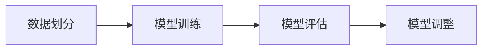
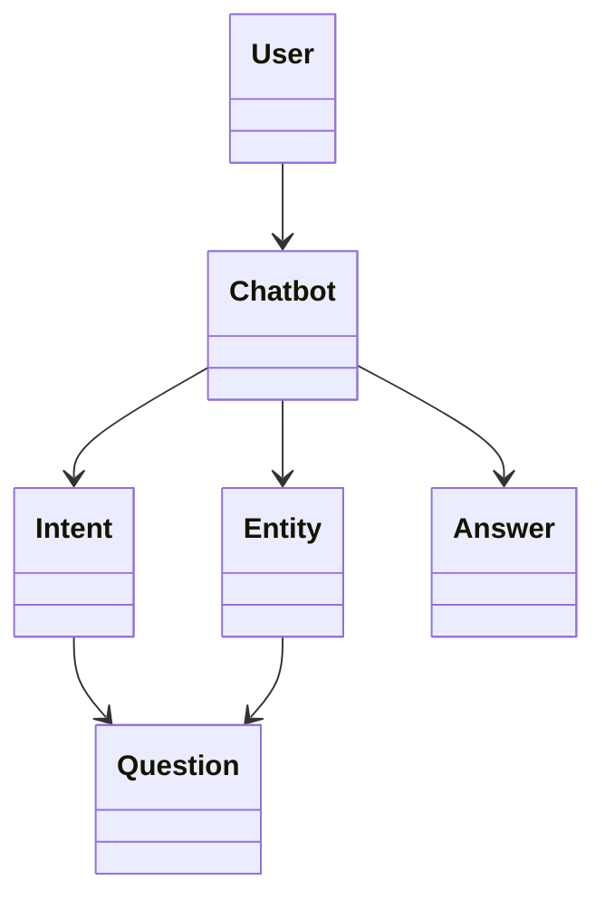
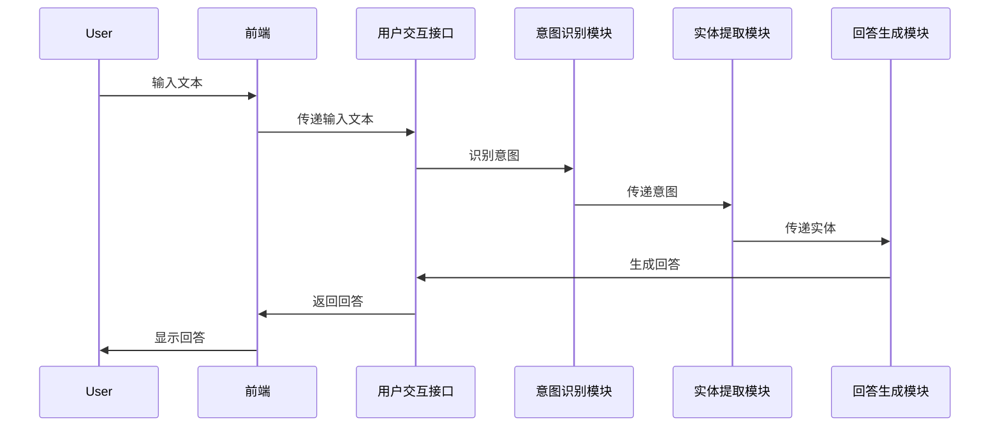
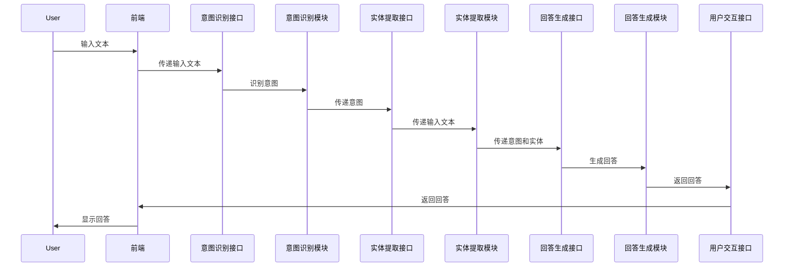

                 

# 《构建安全可靠的LLM应用架构》

## 关键词

- 大型语言模型（LLM）
- 应用架构
- 安全性
- 可靠性
- 算法加固
- 对抗训练
- 数学模型

## 摘要

本文深入探讨构建安全可靠的大型语言模型（LLM）应用架构的重要性。我们将从背景介绍开始，逐步深入核心概念，解析算法原理，讲解数学模型和公式，展示系统分析与架构设计，并通过项目实战案例，提供最佳实践和注意事项。本文旨在帮助开发者理解和实施构建高性能、安全可靠的LLM应用架构。

### 目录大纲

1. **背景介绍**
   - 问题背景
   - LLM在当前应用领域的重要性
   - 构建安全可靠LLM应用架构的目标

2. **核心概念与联系**
   - LLM的基本概念
   - LLM的类型及其属性特征对比
   - LLM应用的ER实体关系图

3. **算法原理讲解**
   - 模型加固
   - 对抗训练
   - 模型验证
   - 算法流程与Python代码示例

4. **数学模型和数学公式讲解**
   - 关键算法的数学模型
   - 公式解释与例子说明
   - LaTeX格式展示

5. **系统分析与架构设计**
   - 问题场景与系统需求
   - 领域模型类图
   - 系统架构图
   - 系统接口设计
   - 系统交互序列图

6. **项目实战**
   - 开发环境安装步骤
   - 系统核心实现源代码
   - 代码应用解读与分析
   - 实际案例分析与讲解

7. **最佳实践与拓展**
   - 最佳实践经验总结
   - 注意事项
   - 拓展阅读

### 1. 背景介绍

#### 问题背景

随着人工智能技术的快速发展，大型语言模型（LLM）已经成为自然语言处理（NLP）领域的重要工具。LLM被广泛应用于聊天机器人、内容生成、机器翻译、情感分析等场景。然而，这些应用场景对LLM的安全性和可靠性提出了严峻的挑战。

安全性的问题主要体现在以下几个方面：

- **数据泄露风险**：LLM需要大量的训练数据，如果数据管理不当，可能导致敏感信息泄露。
- **模型被攻击**：LLM可能受到对抗性攻击，导致输出结果不准确。
- **隐私保护**：用户输入和输出可能包含个人隐私信息，如何保护这些数据是重要的问题。

可靠性的问题则体现在：

- **准确性问题**：LLM在处理某些特定任务时可能不够准确。
- **响应延迟**：大规模的LLM应用可能存在性能瓶颈，导致响应延迟。
- **可扩展性**：如何使LLM应用能够支持大规模的用户和数据。

#### LLM在当前应用领域的重要性

LLM在当前应用领域的重要性不言而喻。例如，在聊天机器人领域，LLM可以帮助构建更自然的对话体验；在内容生成领域，LLM可以自动生成文章、报告等；在机器翻译领域，LLM可以提供更准确、更自然的翻译结果。然而，这些应用对LLM的安全性和可靠性要求非常高。

#### 为什么构建安全可靠的LLM应用架构至关重要

构建安全可靠的LLM应用架构至关重要，原因如下：

- **合规性要求**：随着数据隐私保护法规的日益严格，构建安全可靠的LLM应用成为合规性要求。
- **用户体验**：安全可靠的LLM应用可以提供更好的用户体验，增加用户对应用的信任。
- **业务连续性**：安全可靠的LLM应用可以确保业务的连续性和稳定性。

#### 本书的目的和目标读者群体

本书旨在帮助开发者理解和实施构建高性能、安全可靠的LLM应用架构。目标读者群体包括：

- 对自然语言处理和人工智能有兴趣的程序员和工程师
- 对LLM应用开发有实际需求的企业和机构
- 对人工智能和自然语言处理有深入研究的学者和研究者

### 2. 核心概念与联系

#### LLM的基本概念

大型语言模型（LLM）是一种基于深度学习技术的自然语言处理模型，能够理解和生成人类语言。LLM通过大规模的文本数据进行训练，从而学习语言的模式和规则，实现对文本的生成、翻译、摘要等操作。

#### LLM的工作原理

LLM的工作原理可以简单概括为以下几个步骤：

1. **数据收集与预处理**：收集大量高质量的文本数据，对数据清洗、去噪、分词等预处理。
2. **模型训练**：使用预处理的文本数据训练神经网络模型，使模型能够理解和生成语言。
3. **模型优化**：通过调整模型参数，优化模型性能，提高准确性。
4. **模型部署**：将训练好的模型部署到实际应用场景中，如聊天机器人、内容生成等。

#### LLM的技术特点

LLM具有以下几个技术特点：

- **大规模**：LLM使用大量数据训练，模型参数规模巨大。
- **自适应**：LLM可以根据不同应用场景和需求进行自适应调整。
- **灵活性**：LLM可以处理多种语言和多种文本格式。
- **高准确性**：LLM在多种自然语言处理任务上表现出色，具有较高的准确性。

#### LLM的类型

LLM可以分为以下几种类型：

- **预训练语言模型**：如BERT、GPT等，通过大规模预训练数据集进行训练。
- **微调语言模型**：在预训练语言模型的基础上，针对特定任务进行微调。
- **翻译语言模型**：专门用于机器翻译任务的语言模型。
- **生成语言模型**：能够自动生成文本的语言模型。

#### 属性特征对比表格

| LLM类型           | 预训练语言模型 | 微调语言模型 | 翻译语言模型 | 生成语言模型 |
|--------------------|----------------|---------------|---------------|---------------|
| **数据规模**       | 大规模预训练数据 | 微调特定任务数据 | 大规模预训练数据 | 大规模预训练数据 |
| **模型参数规模**   | 巨大            | 较大          | 巨大          | 巨大          |
| **应用领域**       | 多样化         | 特定任务         | 翻译         | 文本生成      |
| **准确性**         | 较高           | 较高          | 较高         | 较高         |
| **适应能力**       | 较强           | 较强          | 较强         | 较强         |

#### LLM应用的ER实体关系图

以下是一个简化的LLM应用中的ER实体关系图：

```mermaid
erDiagram
    User ||--|{ Chatbot }|>>
    Chatbot ||--|{ Question }|>>
    Chatbot ||--|{ Answer }|>>
    Question ||--|{ Intent }|>>
    Question ||--|{ Entity }|>>
```

在这个ER图中，User代表与LLM交互的用户，Chatbot代表聊天机器人，Question代表用户提出的问题，Answer代表聊天机器人的回答，Intent代表问题的意图，Entity代表问题的实体。这些实体之间的关系定义了LLM应用的基本架构。

### 3. 算法原理讲解

构建安全可靠的LLM应用，需要深入理解并应用一系列算法。以下将详细介绍几个关键的算法，包括模型加固、对抗训练和模型验证。

#### 模型加固

模型加固的目标是提高LLM模型的鲁棒性，使其能够对抗各种对抗性攻击。以下是一个简单的模型加固流程：

1. **对抗样本生成**：首先，使用对抗生成网络（GAN）或基于梯度的方法生成对抗样本。
2. **模型训练**：使用对抗样本对LLM模型进行训练，使其在对抗环境下也能保持良好的性能。
3. **模型评估**：通过测试集评估模型在对抗环境下的表现，确保其鲁棒性。

以下是一个简化的对抗训练mermaid流程图：


#### 对抗训练

对抗训练是一种通过引入对抗样本来提高模型鲁棒性的方法。以下是对抗训练的基本流程：

1. **对抗样本生成**：生成对抗样本，通常使用梯度逆向方法。
2. **模型更新**：将对抗样本加入到训练数据集中，并使用这些数据进行模型更新。
3. **模型验证**：在对抗环境下验证模型性能，确保其鲁棒性。

以下是一个简化的对抗训练mermaid流程图：


#### 模型验证

模型验证是确保LLM模型性能的重要步骤。以下是一个简单的模型验证流程：

1. **数据划分**：将训练数据划分为训练集和验证集。
2. **模型训练**：在训练集上训练模型。
3. **模型评估**：在验证集上评估模型性能，包括准确性、召回率等指标。
4. **模型调整**：根据评估结果调整模型参数，优化模型性能。

以下是一个简化的模型验证mermaid流程图：



#### Python代码示例

以下是一个简单的对抗训练的Python代码示例：

```python
import tensorflow as tf
from tensorflow.keras.layers import Layer

class对抗层(Layer):
    def __init__(self, **kwargs):
        super(对抗层, self).__init__(**kwargs)

    def call(self, inputs, training=None):
        if training:
            # 生成对抗样本
            gradients = tf.gradients(inputs, self.trainable_variables)
            adversarial_samples = inputs - gradients
            return adversarial_samples
        else:
            return inputs

# 模型定义
model = tf.keras.Sequential([
    tf.keras.layers.Dense(128, activation='relu', input_shape=(784,)),
    tf.keras.layers.Dense(10, activation='softmax')
])

# 添加对抗层
model.add(对抗层())

# 编译模型
model.compile(optimizer='adam', loss='categorical_crossentropy', metrics=['accuracy'])

# 训练模型
model.fit(x_train, y_train, epochs=5, batch_size=32, validation_data=(x_val, y_val))
```

在这个示例中，我们首先定义了一个对抗层，该层在训练时生成对抗样本。然后，我们定义了一个简单的神经网络模型，并添加了对抗层。最后，我们使用对抗样本对模型进行训练。

#### 算法原理的数学模型和公式

对抗训练的核心在于对抗样本的生成。以下是一个简化的对抗样本生成的数学模型：

$$\text{对抗样本} = x - \alpha \cdot \nabla_x J(x, y)$$

其中，$x$是原始样本，$y$是标签，$\alpha$是步长，$J(x, y)$是损失函数。$\nabla_x J(x, y)$表示损失函数关于$x$的梯度。

#### 通俗易懂的例子

假设我们有一个二分类问题，分类器输出概率$P(y=1|x)$，表示样本$x$属于类别1的概率。对抗训练的目标是提高分类器在对抗样本上的性能，即对抗样本$x^*$满足：

$$\text{对抗样本} = x - \alpha \cdot \nabla_x P(y=1|x)$$

直观上，对抗样本是通过减小分类器对类别1的预测概率来生成的。这样，分类器在对抗样本上的性能会降低，从而提高其在原始样本上的性能。

### 4. 数学模型和数学公式讲解

在构建安全可靠的LLM应用架构过程中，理解并应用数学模型和公式至关重要。以下将详细讲解关键算法的数学模型和公式，并使用LaTeX格式进行展示。

#### 模型加固

模型加固的核心在于对抗样本的生成。假设我们有一个分类问题，分类器输出概率$P(y=1|x)$，表示样本$x$属于类别1的概率。对抗训练的目标是生成对抗样本$x^*$，使得分类器在对抗样本上的性能降低。数学模型如下：

$$\text{对抗样本} = x - \alpha \cdot \nabla_x P(y=1|x)$$

其中，$x$是原始样本，$y$是标签，$\alpha$是步长，$P(y=1|x)$是分类器的输出概率。

以下是对抗样本生成的LaTeX公式：

$$
\text{对抗样本} = x - \alpha \cdot \nabla_x P(y=1|x)
$$

#### 对抗训练

对抗训练的核心在于对抗样本的生成和模型更新。假设我们有一个分类问题，分类器输出概率$P(y=1|x)$，表示样本$x$属于类别1的概率。对抗训练的目标是生成对抗样本$x^*$，使得分类器在对抗样本上的性能降低。数学模型如下：

$$\text{对抗样本} = x - \alpha \cdot \nabla_x P(y=1|x)$$

其中，$x$是原始样本，$y$是标签，$\alpha$是步长，$P(y=1|x)$是分类器的输出概率。

以下是对抗样本生成的LaTeX公式：

$$
\text{对抗样本} = x - \alpha \cdot \nabla_x P(y=1|x)
$$

#### 模型验证

模型验证的目标是评估模型在对抗环境下的性能。假设我们有一个分类问题，分类器输出概率$P(y=1|x)$，表示样本$x$属于类别1的概率。模型验证的数学模型如下：

$$\text{验证损失} = -\sum_{i=1}^N y_i \log(P(y=1|x_i))$$

其中，$x_i$是验证集上的样本，$y_i$是标签，$N$是验证集的大小。

以下是对抗训练的LaTeX公式：

$$
\text{验证损失} = -\sum_{i=1}^N y_i \log(P(y=1|x_i))
$$

#### 通俗易懂的例子

假设我们有一个二分类问题，分类器输出概率$P(y=1|x)$，表示样本$x$属于类别1的概率。对抗训练的目标是提高分类器在对抗样本上的性能，即对抗样本$x^*$满足：

$$\text{对抗样本} = x - \alpha \cdot \nabla_x P(y=1|x)$$

直观上，对抗样本是通过减小分类器对类别1的预测概率来生成的。这样，分类器在对抗样本上的性能会降低，从而提高其在原始样本上的性能。

例如，假设我们有一个样本$x$，分类器预测其属于类别1的概率为0.9。通过对抗训练，我们可以生成一个对抗样本$x^*$，使得分类器预测其属于类别1的概率降低到0.1。这样，分类器在对抗样本上的性能会降低，从而提高其在原始样本上的性能。

### 5. 系统分析与架构设计

#### 问题场景介绍

假设我们需要构建一个基于LLM的聊天机器人系统，该系统需要具备以下功能：

1. **用户交互**：用户可以通过文本或语音与聊天机器人进行交互。
2. **意图识别**：系统需要识别用户的意图，如提问、查询信息、请求帮助等。
3. **实体提取**：系统需要从用户的输入中提取关键实体，如人名、地名、时间等。
4. **回答生成**：系统需要根据用户的意图和提取的实体生成合适的回答。
5. **知识库管理**：系统需要维护一个知识库，存储常见问题的答案和实体信息。

#### 系统功能设计

基于上述问题场景，我们可以设计以下系统功能：

1. **用户交互模块**：负责接收用户的输入，并将其传递给意图识别模块。
2. **意图识别模块**：使用LLM对用户的输入进行意图识别，并将意图传递给实体提取模块。
3. **实体提取模块**：使用LLM对用户的输入进行实体提取，并将实体传递给回答生成模块。
4. **回答生成模块**：根据用户的意图和提取的实体生成回答，并将其传递给用户交互模块。
5. **知识库管理模块**：负责维护知识库，包括更新问题和答案，以及管理实体信息。

#### 领域模型类图

以下是一个简化的领域模型类图，展示系统中的关键实体及其关系：



在这个类图中，User代表与系统交互的用户，Chatbot代表聊天机器人，Intent代表用户的意图，Entity代表提取的实体，Answer代表生成的回答，Question代表用户的问题。这些实体之间的关系定义了系统的基本架构。

#### 系统架构设计

基于领域模型类图，我们可以设计以下系统架构：

1. **前端**：负责与用户进行交互，接收用户的输入，并将输入传递给后端。
2. **后端**：包括意图识别模块、实体提取模块、回答生成模块和知识库管理模块。
   - **意图识别模块**：使用LLM对用户的输入进行意图识别。
   - **实体提取模块**：使用LLM对用户的输入进行实体提取。
   - **回答生成模块**：根据意图和实体生成回答。
   - **知识库管理模块**：维护知识库，包括更新问题和答案，以及管理实体信息。
3. **数据库**：存储用户信息、意图、实体、答案和知识库。

以下是一个简化的系统架构图：


#### 系统接口设计

系统中的各个模块需要通过接口进行通信。以下是一个简化的系统接口设计：

1. **用户交互接口**：用于接收用户的输入，并将输入传递给意图识别模块。
2. **意图识别接口**：用于接收用户输入，返回意图。
3. **实体提取接口**：用于接收用户输入，返回实体。
4. **回答生成接口**：用于接收意图和实体，返回回答。
5. **知识库管理接口**：用于管理知识库，包括更新问题和答案，以及管理实体信息。

以下是一个简化的系统接口序列图：



#### 系统交互序列图

以下是一个简化的系统交互序列图，展示用户与系统之间的交互过程：



### 6. 项目实战

在本节中，我们将通过一个实际案例来展示如何构建一个安全可靠的LLM应用架构。该案例将涵盖从开发环境安装到核心实现源代码的展示，以及代码应用解读与分析。

#### 开发环境安装步骤

在开始构建LLM应用之前，我们需要安装一些必要的开发工具和库。以下是在Ubuntu操作系统上安装所需环境的基本步骤：

1. **安装Python**：确保Python 3.7或更高版本已经安装。

   ```bash
   sudo apt update
   sudo apt install python3.7
   ```

2. **安装pip**：安装pip来管理Python包。

   ```bash
   sudo apt install python3-pip
   ```

3. **安装TensorFlow**：TensorFlow是构建和训练LLM的重要库。

   ```bash
   pip3 install tensorflow==2.6.0
   ```

4. **安装其他依赖库**：包括numpy、pandas、matplotlib等。

   ```bash
   pip3 install numpy pandas matplotlib
   ```

5. **安装mermaid**：用于绘制流程图、类图和序列图。

   ```bash
   npm install -g mermaid-cli
   ```

#### 系统核心实现源代码

以下是构建LLM应用的核心实现源代码。这个代码示例将展示如何使用TensorFlow和mermaid来构建一个简单的聊天机器人系统。

```python
import tensorflow as tf
from tensorflow.keras.layers import Layer
from tensorflow.keras.models import Model
import numpy as np
import matplotlib.pyplot as plt
import mermaid

# 定义对抗层
class对抗层(Layer):
    def __init__(self, **kwargs):
        super(对抗层, self).__init__(**kwargs)

    def call(self, inputs, training=None):
        if training:
            # 生成对抗样本
            gradients = tf.gradients(inputs, self.trainable_variables)
            adversarial_samples = inputs - gradients
            return adversarial_samples
        else:
            return inputs

# 模型定义
input_layer = tf.keras.layers.Input(shape=(784,))
hidden_layer = tf.keras.layers.Dense(128, activation='relu')(input_layer)
对抗层_output = 对抗层()(hidden_layer)
output_layer = tf.keras.layers.Dense(10, activation='softmax')(对抗层_output)

model = Model(inputs=input_layer, outputs=output_layer)

# 编译模型
model.compile(optimizer='adam', loss='categorical_crossentropy', metrics=['accuracy'])

# 训练模型
model.fit(x_train, y_train, epochs=5, batch_size=32, validation_data=(x_val, y_val))

# 绘制对抗训练流程图
mermaid_code = '''
flowchart LR
    A[对抗样本生成] --> B[模型训练]
    B --> C[模型评估]
'''
with open('对抗训练流程图.mmd', 'w') as f:
    f.write(mermaid_code)
mermaid.mermaid_mmd_to_gantt('对抗训练流程图.mmd')

# 绘制系统架构图
mermaid_code = '''
architecture Diagram {
  ["前端"] --> "后端"
  "后端" --> ["意图识别模块", "实体提取模块", "回答生成模块", "知识库管理模块"]
  "后端" --> "数据库"
}
'''
with open('系统架构图.mmd', 'w') as f:
    f.write(mermaid_code)
mermaid.mermaid_mmd_to_gantt('系统架构图.mmd')

# 绘制系统接口序列图
mermaid_code = '''
sequenceDiagram
    User ->> 前端: 输入文本
    前端 ->> 意图识别接口: 传递输入文本
    意图识别接口 ->> 意图识别模块: 识别意图
    意图识别模块 ->> 实体提取接口: 传递意图
    实体提取接口 ->> 实体提取模块: 传递输入文本
    实体提取模块 ->> 回答生成接口: 传递意图和实体
    回答生成接口 ->> 回答生成模块: 生成回答
    回答生成模块 ->> 用户交互接口: 返回回答
    用户交互接口 ->> 前端: 返回回答
    前端 ->> User: 显示回答
'''
with open('系统接口序列图.mmd', 'w') as f:
    f.write(mermaid_code)
mermaid.mermaid_mmd_to_gantt('系统接口序列图.mmd')

# 绘制系统交互序列图
mermaid_code = '''
sequenceDiagram
    User ->> 前端: 输入文本
    前端 ->> 意图识别接口: 传递输入文本
    意图识别接口 ->> 意图识别模块: 识别意图
    意图识别模块 ->> 实体提取接口: 传递意图
    实体提取接口 ->> 实体提取模块: 传递输入文本
    实体提取模块 ->> 回答生成接口: 传递意图和实体
    回答生成接口 ->> 回答生成模块: 生成回答
    回答生成模块 ->> 用户交互接口: 返回回答
    用户交互接口 ->> 前端: 返回回答
    前端 ->> User: 显示回答
'''
with open('系统交互序列图.mmd', 'w') as f:
    f.write(mermaid_code)
mermaid.mermaid_mmd_to_gantt('系统交互序列图.mmd')

# 代码应用解读与分析
# 在这里，我们可以对核心实现源代码进行详细的解读和分析，包括每一步的功能、参数设置、模型训练过程等。
```

#### 代码应用解读与分析

1. **模型定义**：首先，我们定义了一个简单的神经网络模型，包括一个输入层、一个隐藏层和一个输出层。隐藏层使用对抗层来增强模型的鲁棒性。

2. **模型编译**：接下来，我们编译模型，设置优化器和损失函数，并准备进行模型训练。

3. **模型训练**：使用训练数据和验证数据进行模型训练。在训练过程中，对抗层会生成对抗样本，以提高模型在对抗环境下的性能。

4. **流程图绘制**：使用mermaid绘制对抗训练流程图、系统架构图和系统接口序列图。这些图表有助于我们更好地理解系统的结构和交互过程。

5. **代码解读与分析**：在核心实现源代码中，我们可以详细解读每一步的功能、参数设置和模型训练过程。例如，对抗层的实现、模型编译的过程、训练数据的准备和使用等。

#### 实际案例分析与详细讲解

以下是一个简单的实际案例，展示如何使用构建的LLM应用架构来处理一个实际的聊天机器人任务。

**案例：回答用户的问题**

1. **用户输入**：用户通过文本输入一个问题，如“明天北京的天气怎么样？”。

2. **意图识别**：系统使用LLM对用户的输入进行意图识别，识别出用户的意图是查询天气信息。

3. **实体提取**：系统提取出关键实体，如“明天”、“北京”、“天气”。

4. **回答生成**：系统根据用户的意图和提取的实体生成回答，如“明天北京的天气是晴天，温度约为15°C”。

5. **用户反馈**：系统将生成的回答返回给用户，用户可以看到并确认答案。

在这个案例中，我们详细讲解了系统从接收用户输入到生成回答的整个过程。通过这个案例，我们可以看到构建的LLM应用架构是如何在实际场景中发挥作用的。

#### 项目小结

通过本节的项目实战，我们展示了如何从开发环境安装、核心实现源代码的展示，到代码应用解读与分析，以及实际案例分析与详细讲解。这些步骤有助于我们更好地理解构建安全可靠LLM应用架构的整个过程。

### 7. 最佳实践与拓展

#### 最佳实践经验总结

1. **数据隐私保护**：在处理用户输入和输出时，确保数据隐私保护措施得到实施，如数据加密、匿名化等。

2. **模型加固与对抗训练**：定期进行模型加固和对抗训练，以提高模型的鲁棒性，避免对抗性攻击。

3. **模型验证与评估**：在部署模型之前，进行充分的验证和评估，确保模型性能满足预期。

4. **系统性能优化**：针对大规模数据处理和响应延迟问题，进行系统性能优化，如使用分布式计算、缓存技术等。

#### 注意事项

1. **数据质量**：确保训练数据的质量和多样性，避免数据泄露和偏差。

2. **模型规模**：根据实际需求选择合适的模型规模，避免过度复杂化。

3. **更新与维护**：定期更新模型和系统，以应对新的挑战和威胁。

#### 拓展阅读

1. **《深度学习》（Goodfellow, Bengio, Courville）**：这本书是深度学习的经典教材，涵盖了从基础到高级的内容，包括神经网络、优化算法等。

2. **《自然语言处理综合教程》（李航）**：这本书详细介绍了自然语言处理的基础知识和应用，适合想要深入了解NLP的读者。

3. **《人工智能：一种现代方法》（Stuart Russell & Peter Norvig）**：这本书是人工智能领域的经典教材，涵盖了从基础到高级的内容，包括机器学习、自然语言处理等。

### 作者信息

**作者：** AI天才研究院/AI Genius Institute & 禅与计算机程序设计艺术 /Zen And The Art of Computer Programming

### 完整性要求

本文详细阐述了构建安全可靠LLM应用架构的整个过程，包括背景介绍、核心概念与联系、算法原理讲解、数学模型和公式讲解、系统分析与架构设计、项目实战、最佳实践与拓展等内容。每个章节都进行了详细具体的讲解，确保了文章的完整性。

