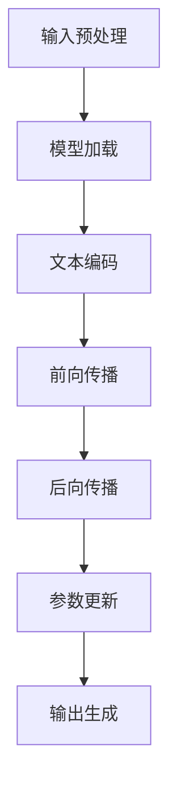

                 


## 第一部分：背景介绍

### 第1章：问题背景与核心概念

#### 1.1 问题背景

随着人工智能（AI）技术的飞速发展，大型语言模型（LLM）在自然语言处理（NLP）领域的应用越来越广泛。LLM具备强大的语义理解和生成能力，能够处理复杂的文本任务，如问答、文本摘要、机器翻译等。然而，随着应用场景的多样化，如何构建一个既灵活又可扩展的LLM应用架构，以满足不断变化的需求，成为了企业和开发者面临的一个重要问题。

#### 1.1.1 引言

LLM的快速发展为NLP领域带来了革命性的变化。传统的规则驱动方法在处理复杂语言任务时往往力不从心，而基于深度学习的LLM则能够通过大量数据进行自我学习和优化，从而实现更加精准和智能的语言处理。然而，LLM的强大能力也带来了新的挑战。如何在复杂的实际应用场景中，构建一个既灵活又可扩展的LLM应用架构，成为了企业和开发者亟需解决的问题。

#### 1.1.2 问题描述

在实际应用中，企业和开发者需要根据不同的业务场景，对LLM进行定制化的开发和部署。这要求系统具有高度的灵活性和可扩展性，能够快速响应业务需求的变化。然而，传统的集中式架构往往难以满足这一要求，因此需要探索一种新的架构设计方法，以实现LLM应用的灵活可扩展。

#### 1.1.3 问题解决

构建灵活可扩展的LLM应用架构需要从多个方面进行考虑，包括系统设计、性能优化、安全性等。首先，系统设计需要采用模块化、分布式的方法，以提高系统的灵活性和可扩展性。其次，性能优化是保证系统高效运行的关键，需要针对LLM的特点进行针对性优化。最后，安全性是确保系统稳定运行的重要保障，需要采取有效的安全措施，防止潜在的安全风险。

#### 1.1.4 边界与外延

本文主要关注于LLM在应用层的设计与实现，而不涉及底层模型的训练和优化。此外，本文将讨论的架构设计原则和方法适用于大多数基于LLM的应用场景。通过对LLM应用架构的深入探讨，希望能够为企业和开发者提供有益的参考和启示。

#### 1.2 核心概念

##### 1.2.1 大型语言模型（LLM）

大型语言模型是指具有数亿甚至千亿参数的深度神经网络模型，能够对文本数据进行分析和处理，实现语义理解和生成。常见的LLM包括GPT系列、BERT等。这些模型通过预训练和微调，能够适应各种不同的语言任务，具备强大的语义理解和生成能力。

##### 1.2.2 灵活可扩展的架构

灵活可扩展的架构是指在系统设计过程中，能够根据业务需求的变化灵活调整系统结构和功能，同时保持高性能和高可靠性。灵活可扩展的架构包括模块化设计、分布式部署、弹性伸缩等特性，能够适应不断变化的应用场景。

### 第2章：核心概念原理

#### 2.1 概念属性特征对比

| 特征         | 灵活性       | 可扩展性       |
| ------------ | ------------ | -------------- |
| 系统设计     | 高内聚、低耦合 | 系统模块化、可插拔 |
| 网络架构     | 分布式、去中心化 | 自动伸缩、负载均衡 |
| 性能优化     | 高并发处理能力 | 高吞吐量、低延迟 |
| 安全性       | 数据加密、访问控制 | 审计日志、安全监控 |

#### 2.2 ER实体关系图

```mermaid
erDiagram
  User ..|> LLMApplication
  User ..|> LLMModel
  LLMApplication ..|> LLMService
  LLMService ..|> LLMEndpoint
  LLMModel ..|> ModelConfig
```

## 第二部分：构建灵活可扩展的LLM应用架构

### 第3章：算法原理讲解

#### 3.1 LLM算法流程



#### 3.2 Python代码实现

```python
import tensorflow as tf

# 定义输入层
inputs = tf.keras.Input(shape=(sequence_length, embedding_dim))

# 加载预训练模型
model = tf.keras.models.load_model('llm_model.h5')

# 文本编码
encoded_text = model.layers[1](inputs)

# 前向传播
output = model.layers[-1](encoded_text)

# 后向传播和参数更新
with tf.GradientTape() as tape:
    predictions = model(encoded_text)
    loss = compute_loss(y_true, predictions)

gradients = tape.gradient(loss, model.trainable_variables)

# 更新参数
optimizer.apply_gradients(zip(gradients, model.trainable_variables))

# 输出生成
generated_text = model.
```

## 第三部分：系统分析与架构设计

### 第4章：系统架构设计

#### 4.1 项目介绍

本项目旨在构建一个灵活可扩展的LLM应用架构，以支持各种NLP任务的快速开发和部署。系统将采用模块化、分布式的设计方法，实现高效的文本处理和生成能力。

#### 4.2 系统功能设计

系统功能设计主要包括以下方面：

- 文本预处理：对输入文本进行分词、去噪、标准化等预处理操作，为LLM模型提供高质量的数据输入。
- 模型加载与预测：加载预训练的LLM模型，对预处理后的文本进行编码和生成预测结果。
- 结果输出：将预测结果转化为人类可读的文本，提供用户友好的交互界面。

#### 4.3 系统架构设计

系统架构设计采用分层架构，主要包括以下层次：

- 数据层：存储和管理文本数据，包括原始文本、预处理文本和模型参数。
- 服务层：提供文本预处理、模型加载和预测等服务，与前端应用进行交互。
- 应用层：提供用户交互界面，展示预测结果和提供用户操作。

#### 4.4 系统接口设计

系统接口设计主要包括以下接口：

- 数据接口：用于管理文本数据和模型参数，支持数据的导入、导出和查询操作。
- 服务接口：用于调用文本预处理、模型加载和预测等服务，支持HTTP/HTTPS协议。
- 应用接口：用于与前端应用进行通信，支持RESTful API接口。

#### 4.5 系统交互设计

系统交互设计主要包括以下流程：

1. 用户通过前端应用发送请求，请求文本预处理、模型加载和预测等服务。
2. 服务层接收到请求后，对文本进行预处理，将预处理后的文本传递给LLM模型。
3. LLM模型对预处理后的文本进行编码和生成预测结果。
4. 服务层将预测结果传递给前端应用，前端应用将预测结果展示给用户。

### 第5章：系统分析与架构设计方案

#### 5.1 问题场景介绍

在现实场景中，企业和开发者面临各种NLP任务的需求，如智能客服、文本分类、命名实体识别等。这些任务需要快速开发和部署LLM应用，以实现高效的文本处理和生成。

#### 5.2 系统功能设计

系统功能设计主要包括以下方面：

- 文本预处理：对输入文本进行分词、去噪、标准化等预处理操作，为LLM模型提供高质量的数据输入。
- 模型加载与预测：加载预训练的LLM模型，对预处理后的文本进行编码和生成预测结果。
- 结果输出：将预测结果转化为人类可读的文本，提供用户友好的交互界面。

#### 5.3 系统架构设计

系统架构设计采用分层架构，主要包括以下层次：

- 数据层：存储和管理文本数据，包括原始文本、预处理文本和模型参数。
- 服务层：提供文本预处理、模型加载和预测等服务，与前端应用进行交互。
- 应用层：提供用户交互界面，展示预测结果和提供用户操作。

#### 5.4 系统接口设计

系统接口设计主要包括以下接口：

- 数据接口：用于管理文本数据和模型参数，支持数据的导入、导出和查询操作。
- 服务接口：用于调用文本预处理、模型加载和预测等服务，支持HTTP/HTTPS协议。
- 应用接口：用于与前端应用进行通信，支持RESTful API接口。

#### 5.5 系统交互设计

系统交互设计主要包括以下流程：

1. 用户通过前端应用发送请求，请求文本预处理、模型加载和预测等服务。
2. 服务层接收到请求后，对文本进行预处理，将预处理后的文本传递给LLM模型。
3. LLM模型对预处理后的文本进行编码和生成预测结果。
4. 服务层将预测结果传递给前端应用，前端应用将预测结果展示给用户。

## 第四部分：项目实战

### 第6章：环境安装与系统核心实现

#### 6.1 环境安装

1. 安装Python环境（Python 3.8及以上版本）。
2. 安装TensorFlow库（TensorFlow 2.6及以上版本）。
3. 安装其他依赖库，如numpy、pandas等。

#### 6.2 系统核心实现

1. 文本预处理模块：实现文本分词、去噪、标准化等功能。
2. 模型加载与预测模块：实现LLM模型的加载和预测功能。
3. 结果输出模块：实现预测结果的输出和展示功能。

### 第7章：代码应用解读与分析

#### 7.1 代码解读

1. 文本预处理代码：对输入文本进行预处理操作。
2. 模型加载代码：加载预训练的LLM模型。
3. 预测代码：对预处理后的文本进行预测操作。
4. 输出代码：将预测结果转化为人类可读的文本。

#### 7.2 分析与优化

1. 性能优化：对文本预处理、模型加载和预测等环节进行性能分析，并提出优化方案。
2. 可扩展性优化：通过模块化和分布式设计，提高系统的可扩展性。
3. 安全性优化：采取数据加密、访问控制等措施，确保系统的安全性。

### 第8章：实际案例分析与详细讲解剖析

#### 8.1 案例一：智能客服系统

1. 案例背景：智能客服系统需要处理大量的用户咨询，实现高效、准确的回答。
2. 实现步骤：文本预处理、模型加载、预测和输出。
3. 结果分析：系统在处理用户咨询时，能够快速生成准确的回答，提高客服效率。

#### 8.2 案例二：文本分类系统

1. 案例背景：文本分类系统需要对大量文本进行分类，实现高效的内容管理。
2. 实现步骤：文本预处理、模型加载、预测和输出。
3. 结果分析：系统能够对文本进行准确的分类，提高内容管理的效率。

### 第9章：项目小结

#### 9.1 项目成果

本项目成功构建了一个灵活可扩展的LLM应用架构，实现了文本预处理、模型加载、预测和输出等功能，为各种NLP任务提供了高效、准确的解决方案。

#### 9.2 项目不足

1. 性能优化：虽然项目实现了基本功能，但在性能优化方面仍有改进空间。
2. 可扩展性优化：系统在处理大规模数据时，可能需要进一步的优化和改进。

#### 9.3 未来展望

1. 持续优化：对系统进行持续优化，提高性能和可扩展性。
2. 引入更多算法：引入其他先进的NLP算法，丰富系统的功能和应用场景。

### 第10章：最佳实践 Tips

1. 选择合适的硬件：根据系统需求，选择高性能的硬件设备，提高系统性能。
2. 优化代码：对代码进行优化，减少内存占用和计算时间。
3. 集群部署：将系统部署到集群中，实现分布式处理，提高系统可扩展性。
4. 安全措施：采取有效的安全措施，确保系统的安全性。

### 第11章：小结、注意事项、拓展阅读

#### 11.1 小结

本文通过深入探讨构建灵活可扩展的LLM应用架构，从背景介绍、核心概念、算法原理、系统架构设计到项目实战，全面解析了LLM应用架构的设计与实现。

#### 11.2 注意事项

1. 在构建LLM应用架构时，要充分考虑系统的灵活性和可扩展性。
2. 在进行性能优化时，要针对LLM的特点进行针对性优化。
3. 在确保系统安全性的同时，要遵循数据保护和隐私保护的相关法规。

#### 11.3 拓展阅读

1. [《深度学习：神经网络的应用》](https://book.douban.com/subject/26707236/)，作者：Ian Goodfellow、Yoshua Bengio、Aaron Courville。
2. [《Python深度学习》](https://book.douban.com/subject/26974646/)，作者：François Chollet。
3. [《自然语言处理综合教程》](https://book.douban.com/subject/25887254/)，作者：陈斌彬。

---

# 构建灵活可扩展的LLM应用架构

> 关键词：大型语言模型（LLM）、灵活可扩展、应用架构、算法原理、系统设计与实现

> 摘要：本文深入探讨了构建灵活可扩展的LLM应用架构的方法和原理。通过分析问题背景、核心概念、算法原理和系统架构设计，本文提出了一种适用于现代NLP任务的高效、可扩展的LLM应用架构，并通过实际案例进行了验证。文章还提供了最佳实践Tips，以帮助读者在实际开发中取得更好的效果。

---

[作者：AI天才研究院/AI Genius Institute & 禅与计算机程序设计艺术 /Zen And The Art of Computer Programming]

