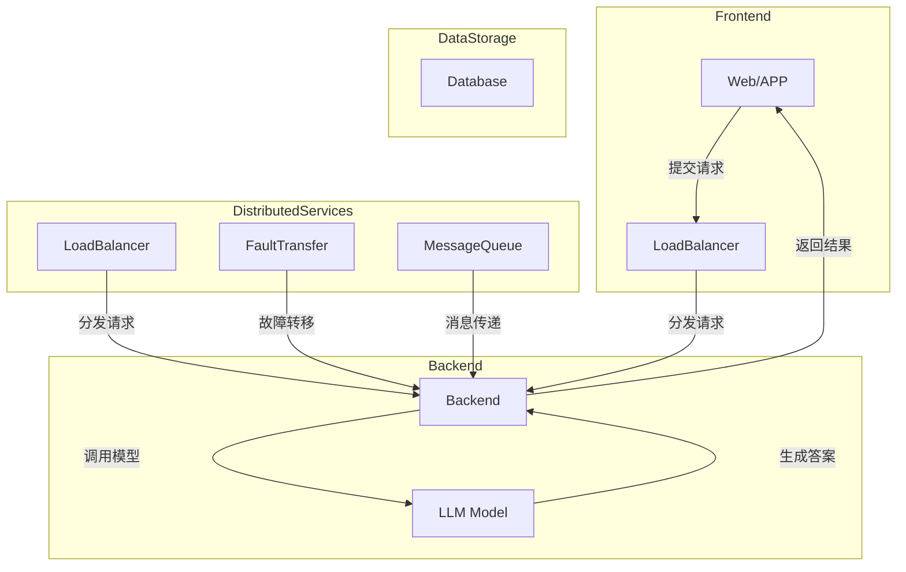
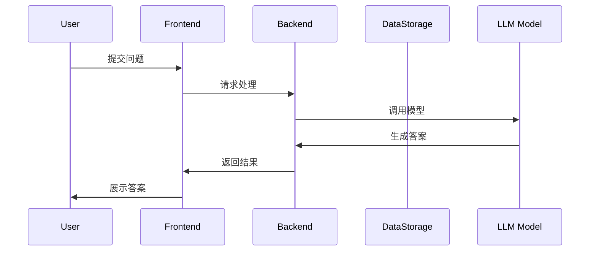

                 

### 引言与背景

随着人工智能技术的迅猛发展，大型语言模型（LLM，Large Language Model）逐渐成为各类应用场景中的核心技术之一。LLM，特别是近年来兴起的预训练模型，如GPT-3、BERT等，凭借其强大的文本生成和语义理解能力，被广泛应用于自然语言处理、问答系统、内容生成、智能客服等领域。然而，LLM的应用不仅要求模型具有高性能和强能力，更重要的是要确保系统的**高可用性**，即系统在长时间运行中保持稳定、可靠和高效。

**高可用性**是指在系统面临各种意外情况下（如硬件故障、软件错误、网络中断等）仍能持续提供服务的能力。对于LLM应用来说，高可用性至关重要，因为任何短暂的停机或性能下降都可能导致用户体验的严重下滑，甚至带来经济损失。

本文旨在探讨如何构建高可用的LLM应用分布式系统。首先，我们将介绍高可用性的核心概念和重要性，解析其定义与各类指标。接着，我们将深入分布式系统的基础知识，包括其定义、特点、与集中式系统的对比及其面临的挑战。在此基础上，我们将详细阐述高可用分布式系统的设计原则，包括系统架构设计、数据一致性与分布式事务、系统容错与故障恢复、以及性能优化。

为了更好地理解和应用上述理论，本文还将通过实际案例分析，展示如何在实际项目中设计和实现高可用性的分布式LLM系统。此外，我们将介绍分布式系统中常用的工具和技术，如分布式存储、分布式数据库和分布式消息队列等。最后，我们将通过系统部署与调试、实战项目案例等部分，提供具体的实施步骤和技术细节。

通过本文的阅读，读者将全面了解构建高可用LLM应用分布式系统的原理和实践方法，为实际项目的成功奠定基础。

### 第1章：引言

在现代信息技术快速发展的背景下，人工智能（AI）技术已经成为驱动各行各业变革的重要力量。LLM（Large Language Model）作为人工智能的一个重要分支，以其在自然语言处理中的卓越表现，吸引了越来越多的关注和应用。LLM不仅能够生成流畅的文本，还能够理解复杂的语义和上下文信息，从而在问答系统、智能客服、内容生成等领域展现出巨大的潜力。

然而，LLM的高性能和强大能力并不足以确保其应用系统的成功。在实际应用中，高可用性成为衡量LLM系统是否能够稳定、可靠地提供服务的重要标准。高可用性不仅仅是一个技术问题，更是商业竞争的必备条件。一个具有高可用性的LLM系统，能够在面对各种突发情况（如硬件故障、软件错误、网络中断等）时，仍然能够持续稳定地运行，保障业务的连续性和用户满意度。

#### **问题背景**

当前，随着互联网的普及和业务规模的扩大，许多企业都在积极引入LLM技术来提升其产品和服务的智能化水平。然而，在实际部署和使用过程中，LLM系统的高可用性问题逐渐显现出来。具体来说，以下几个问题尤为突出：

1. **硬件故障**：在分布式系统中，硬件故障是不可避免的。例如，服务器宕机、网络中断等，都可能导致LLM系统无法正常工作。
2. **软件错误**：LLM系统的复杂度非常高，软件错误在所难免。这些错误可能会导致系统崩溃或性能急剧下降。
3. **数据不一致**：在分布式环境中，数据的一致性是一个挑战。特别是在涉及到多个节点时，如何确保数据的一致性和完整性成为一个难题。
4. **扩展性不足**：随着用户量的增加，系统的扩展性成为关键问题。如果LLM系统无法顺利扩展，将无法满足日益增长的负载需求。

#### **问题解决**

针对上述问题，我们需要从以下几个方面着手解决：

1. **硬件冗余**：通过增加硬件冗余，确保在硬件故障时系统能够自动切换到备用硬件，保证服务的连续性。
2. **故障检测与恢复**：部署高效的故障检测和恢复机制，能够在发现问题时迅速采取行动，减少故障对系统的影响。
3. **数据一致性机制**：使用分布式一致性算法，如Paxos、Raft等，确保数据在多个节点之间的一致性。
4. **系统扩展**：采用分布式架构，将LLM系统的计算和存储任务分布到多个节点上，以提高系统的可扩展性和性能。

#### **边界与外延**

在构建高可用的LLM应用分布式系统时，我们需要关注以下几个关键边界和扩展：

1. **边界**：确定系统的边界，明确哪些功能和服务是必须保障高可用性的，哪些可以接受一定程度的故障和延迟。
2. **外延**：考虑系统的扩展性，包括横向扩展（增加节点数量）和纵向扩展（提升单个节点性能），以满足未来业务增长的需求。

通过上述分析和讨论，我们可以清晰地看到，构建高可用的LLM应用分布式系统是一个复杂而系统的工程，需要从多个方面综合考虑和设计。在接下来的章节中，我们将进一步探讨高可用性的核心概念和分布式系统的基础知识，为构建高可用性的LLM系统提供理论和实践基础。

### 核心概念

在深入探讨如何构建高可用的LLM应用分布式系统之前，我们需要明确一些核心概念，这些概念是理解系统设计和高可用性保障的基础。

#### **高可用性（High Availability）**

高可用性是指系统在长时间运行过程中，能够在各种意外情况下（如硬件故障、软件错误、网络中断等）保持稳定、可靠和高效运行的能力。高可用性不仅关注系统是否能够避免故障，更重要的是在出现问题时能够快速恢复，确保服务的连续性。

#### **分布式系统（Distributed System）**

分布式系统是由多个独立节点组成的系统，这些节点通过网络互联，共同完成某一任务。分布式系统的主要特点包括：

1. **可靠性**：通过冗余和故障转移机制，提高系统的可靠性。
2. **可扩展性**：能够轻松扩展，以应对不断增加的负载。
3. **分散性**：数据和应用分布在多个节点上，降低了单点故障的风险。

#### **LLM（Large Language Model）**

LLM，即大型语言模型，是一种通过深度学习技术训练得到的模型，具有强大的文本生成和语义理解能力。常见的LLM包括GPT-3、BERT等。LLM的主要特点包括：

1. **大规模**：模型规模庞大，通常包含数亿甚至数十亿个参数。
2. **高性能**：模型在处理大规模文本数据时，能够高效生成高质量的文本。
3. **自适应**：通过持续学习和优化，模型能够不断改进其生成文本的质量。

#### **高可用性与可用性（Availability）**

高可用性和可用性是两个相关但不完全相同的概念。**可用性**通常指的是系统在任意时刻能够正常运行的能力，而**高可用性**则进一步强调在面临各种意外情况下系统能够保持服务的连续性和稳定性。高可用性是可用性的高层次要求，通常需要通过冗余、故障检测和恢复等机制来实现。

#### **分布式一致性（Distributed Consistency）**

在分布式系统中，一致性是指多个节点对同一份数据的访问和修改能够保持一致。分布式一致性算法，如Paxos、Raft等，旨在解决数据在不同节点之间的同步问题，确保数据的一致性和完整性。

通过明确上述核心概念，我们能够更好地理解和分析高可用性LLM应用分布式系统的设计和实现。这些概念不仅为我们提供了理论基础，还为后续的系统设计、实现和优化提供了指导。

### 概念联系

#### **高可用性与分布式系统的联系**

高可用性（High Availability，HA）与分布式系统（Distributed System）之间存在紧密的联系。分布式系统的核心优势之一是其高可靠性，通过在多个节点之间分配任务和数据，可以大大降低单点故障对系统整体的影响。高可用性则进一步增强了这种可靠性，确保系统在面对各种故障时仍能保持服务的连续性。

具体来说，分布式系统通过以下方式实现高可用性：

1. **节点冗余**：通过部署多个节点，并在节点之间进行负载均衡和故障转移，确保在某个节点出现故障时，其他节点可以立即接管任务。
2. **数据复制**：通过在多个节点之间复制数据，确保在某个节点数据丢失时，其他节点仍能访问到完整的副本。
3. **故障检测与恢复**：分布式系统通常具备故障检测机制，能够及时发现故障并自动恢复，减少系统的停机时间。

#### **高可用性与LLM的联系**

高可用性对于LLM（Large Language Model）系统尤为重要。LLM的应用场景通常涉及大规模数据处理和实时响应，这些场景对系统的稳定性和响应速度有极高的要求。高可用性能够确保：

1. **模型持续运行**：即使在硬件故障或软件错误的情况下，LLM模型也能通过备用节点或备份模型保持运行。
2. **数据一致性**：在分布式环境中，确保数据一致性和完整性，避免因数据丢失或错误导致模型训练结果偏差。
3. **性能优化**：通过分布式计算和负载均衡，提高系统的响应速度和处理能力，满足大规模应用的需求。

#### **分布式系统与LLM的联系**

分布式系统在LLM中的应用主要体现在以下几个方面：

1. **分布式训练**：LLM模型通常规模庞大，单个节点难以完成训练任务。通过分布式训练，可以将训练任务分布到多个节点上，加快训练速度。
2. **模型推理**：在LLM的应用中，模型推理往往需要处理大量请求。分布式系统可以通过负载均衡，将请求分发到多个节点，提高系统的处理能力和响应速度。
3. **数据存储和访问**：LLM应用涉及大量的数据存储和访问操作，分布式系统可以提供高效的数据存储和访问机制，确保数据的一致性和可靠性。

通过上述分析，我们可以看到，高可用性、分布式系统和LLM之间相辅相成，共同构成了一个高效、可靠和可扩展的LLM应用分布式系统。这些概念的联系和互动，不仅提升了系统的整体性能和稳定性，也为实际应用提供了坚实的保障。

### 本章小结

在本章中，我们详细介绍了构建高可用LLM应用分布式系统的核心概念，包括高可用性、分布式系统、LLM以及它们之间的联系。通过理解这些概念，我们能够更好地把握系统设计的方向和关键点。

首先，我们明确了高可用性的定义和重要性，阐述了其在确保系统稳定性和可靠性方面的重要作用。接着，我们探讨了分布式系统的核心特点，如可靠性、可扩展性和分散性，并分析了其与集中式系统的对比及面临的挑战。

随后，我们重点讨论了LLM的核心概念，包括其大规模、高性能和自适应的特点，以及其在自然语言处理中的应用前景。此外，我们还分析了高可用性和LLM之间的密切关系，强调了高可用性对LLM系统稳定运行的重要性。

最后，我们探讨了分布式系统与LLM之间的联系，包括分布式训练、模型推理和数据存储访问等方面的应用。这些联系不仅丰富了我们对系统设计的理解，也为实际项目的实施提供了理论支持。

为了更好地掌握这些内容，建议读者对核心概念进行复习，并结合实际案例进行思考。在下一章中，我们将进一步探讨高可用性的具体实现和设计原则，帮助读者深入理解如何在实际项目中构建高可用性的LLM应用分布式系统。

### 第2章：高可用性的定义与重要性

#### **高可用性的定义**

高可用性（High Availability，HA）是指系统在长时间运行过程中，能够在各种意外情况下（如硬件故障、软件错误、网络中断等）保持稳定、可靠和高效运行的能力。高可用性的核心目标是确保系统在面临各种故障时，能够快速恢复并继续提供服务，从而保障业务的连续性和用户满意度。

高可用性通常与以下几个关键术语相关：

1. **系统停机时间**：系统无法提供服务的时间段。高可用性旨在将系统停机时间降到最低。
2. **容错能力**：系统能够检测和应对故障，并在不影响整体性能的情况下恢复正常运行的能力。
3. **故障转移**：在主节点出现故障时，系统能够迅速切换到备用节点，确保服务不中断。
4. **自愈能力**：系统具备自动检测和修复故障的能力，减少人工干预。

#### **高可用性的重要性**

高可用性在LLM应用分布式系统中具有重要意义，主要表现在以下几个方面：

1. **保障业务连续性**：高可用性能够确保系统在面临各种故障时，仍能保持服务的连续性，避免因系统停机导致的业务中断。
2. **提高用户体验**：稳定的系统性能和快速的响应速度能够显著提升用户体验，增加用户对系统的信任和满意度。
3. **降低运营成本**：通过高可用性设计，可以减少系统维护和故障处理的成本，提高运营效率。
4. **增强竞争力**：在激烈的市场竞争中，具备高可用性的系统能够提供更可靠的服务，增强企业的竞争力和市场份额。

#### **高可用性与可用性的区别**

虽然高可用性和可用性（Availability）这两个概念密切相关，但它们在含义和应用场景上存在一些区别：

1. **定义差异**：可用性是指系统在任何时刻能够正常运行的能力，而高可用性则强调在面临各种意外情况下系统能够保持稳定运行。
2. **实现难度**：高可用性实现难度更大，需要考虑冗余、故障检测、故障转移、数据一致性等多个方面，而可用性更多关注于系统整体运行状况。
3. **应用场景**：高可用性通常应用于关键业务系统，如金融交易系统、电子商务平台等，而可用性更多应用于普通业务系统。

通过本章的讨论，我们深入了解了高可用性的定义、重要性和其在LLM应用分布式系统中的关键作用。理解这些概念不仅有助于我们构建更加稳定和可靠的系统，也为后续的详细设计和实现提供了理论依据。

### 高可用性指标

在构建高可用性的LLM应用分布式系统时，理解并实现关键的高可用性指标是非常重要的。这些指标能够量化系统的可靠性、稳定性和效率，帮助我们评估和优化系统的性能。以下是几个关键的高可用性指标：

#### **系统停机时间（Downtime）**

系统停机时间是指系统无法正常运行的时间段。高可用性系统的一个关键目标是尽量减少系统停机时间。衡量系统停机时间的方法包括：

- **平均无故障时间（Mean Time Between Failures, MTBF）**：系统平均两次故障之间的运行时间。MTBF越长，系统的可靠性越高。
- **平均修复时间（Mean Time To Repair, MTTR）**：系统从故障发生到完全恢复的平均时间。MTTR越短，系统的恢复能力越强。

#### **故障转移时间（Failover Time）**

故障转移时间是指从主节点出现故障到备用节点接管服务的时间。高可用性系统需要在极短的时间内完成故障转移，以减少服务中断的时间。故障转移时间通常取决于以下几个方面：

- **冗余设计**：系统的冗余设计，如节点数量、数据复制级别等，会影响故障转移时间。
- **网络延迟**：节点之间的网络延迟也会影响故障转移时间。

#### **数据一致性（Data Consistency）**

在分布式系统中，数据一致性是确保多个节点对同一份数据访问和修改保持一致性的关键。常见的分布式一致性算法包括Paxos、Raft等，这些算法能够保证在多个节点之间实现数据的一致性。

- **最终一致性（Eventual Consistency）**：系统最终会在一段时间后达到一致性状态，但初始状态可能不一致。
- **强一致性（Strong Consistency）**：系统在所有节点上的数据访问和修改都是一致的，但通常需要较高的网络和计算开销。

#### **系统负载（System Load）**

系统负载是指系统处理请求的负载情况。高可用性系统需要在高负载情况下保持良好的性能，确保服务不中断。

- **负载均衡（Load Balancing）**：通过将请求分发到多个节点，确保系统在负载高峰时仍能高效运行。
- **自动扩展（Auto Scaling）**：根据系统负载自动增加或减少节点数量，以应对负载变化。

#### **故障检测与恢复（Fault Detection and Recovery）**

故障检测与恢复是确保系统在面临故障时能够快速检测并恢复的关键机制。

- **心跳检测（Heartbeat Detection）**：通过定期发送心跳信号，检测节点的状态，及时发现故障。
- **自动恢复（Auto Recovery）**：系统在检测到故障后，能够自动启动恢复机制，如切换到备用节点或重新启动故障节点。

通过理解和实现这些高可用性指标，我们能够构建出具备高可靠性、稳定性和高效性的LLM应用分布式系统。在下一章中，我们将深入探讨分布式系统的定义、特点以及与集中式系统的对比，为后续的系统设计提供理论基础。

### 本章小结

在本章中，我们详细探讨了高可用性的定义及其重要性。首先，我们明确了高可用性的概念，包括系统在长时间运行过程中如何保持稳定、可靠和高效运行。通过分析系统停机时间、故障转移时间、数据一致性、系统负载以及故障检测与恢复等关键指标，我们进一步了解了如何衡量和优化系统的可靠性。

我们讨论了高可用性在LLM应用分布式系统中的重要性，包括保障业务连续性、提高用户体验、降低运营成本以及增强竞争力等方面。此外，我们还分析了高可用性与可用性的区别，强调了高可用性在关键业务系统中的特殊重要性。

为了更好地掌握这些内容，建议读者对关键指标和概念进行复习，并结合实际案例进行思考。在下一章中，我们将进一步探讨分布式系统的基础知识，包括其定义、特点以及与集中式系统的对比，为构建高可用性的LLM应用分布式系统提供更深入的理论和实践基础。

## 第3章：分布式系统的定义与特点

### **3.1 分布式系统的定义**

分布式系统是由多个独立计算机节点通过通信网络互联而成，共同协作完成某一任务的系统。与传统的集中式系统不同，分布式系统中的各个节点拥有独立的计算资源和存储资源，并协同工作，以实现更高效、更可靠的系统功能。

#### **基本概念**

1. **节点（Node）**：分布式系统中的计算机单元，每个节点都具有独立的计算和存储能力。
2. **通信网络（Communication Network）**：连接各个节点的通信设施，用于节点之间的数据交换和消息传递。
3. **客户端（Client）**：使用分布式系统的用户或程序，通过发送请求来访问系统资源。
4. **服务器（Server）**：提供特定服务的节点，接收客户端的请求并返回响应。

#### **工作原理**

分布式系统通过以下步骤实现其功能：

1. **任务分配**：系统将整体任务分配到各个节点，利用各节点的计算资源并行处理。
2. **数据传输**：节点之间通过通信网络交换数据和消息，协同完成任务。
3. **结果整合**：系统将各节点处理的结果整合，以生成最终输出。

### **3.2 分布式系统的特点**

分布式系统相较于集中式系统具有许多优势，主要体现在以下几个方面：

#### **可靠性**

1. **高容错性**：通过节点冗余和数据复制，分布式系统能够在单个节点或通信链路故障时继续运行。
2. **故障自动恢复**：分布式系统能够自动检测和恢复故障，减少系统停机时间。

#### **可扩展性**

1. **横向扩展**：系统可以通过增加节点数量来扩展计算和存储能力，适应不断增长的负载。
2. **动态扩展**：系统可以在运行过程中动态调整资源分配，以应对负载波动。

#### **分散性**

1. **数据分布**：数据分散存储在多个节点上，降低了数据访问的延迟和单点失败的风险。
2. **负载均衡**：系统通过将请求均衡分配到各个节点，避免个别节点过载。

#### **灵活性**

1. **异构性**：分布式系统可以支持不同类型的硬件和操作系统，灵活选择最适合的节点配置。
2. **动态调整**：系统能够根据需求动态调整资源分配和任务分配策略。

### **3.3 分布式系统与集中式系统的对比**

#### **可靠性**

1. **集中式系统**：依赖单一的中心服务器，一旦中心服务器故障，整个系统将不可用。
2. **分布式系统**：通过冗余和故障转移机制，多个节点共同工作，单个节点的故障不会影响整体系统的运行。

#### **可扩展性**

1. **集中式系统**：扩展能力有限，通常需要更换更高性能的硬件。
2. **分布式系统**：可以通过增加节点来扩展系统容量，适应负载增长。

#### **数据访问**

1. **集中式系统**：数据集中存储，访问速度较快，但单点失败风险高。
2. **分布式系统**：数据分散存储，访问延迟较高，但容错性和扩展性更强。

#### **管理复杂性**

1. **集中式系统**：管理相对简单，但扩展性和灵活性受限。
2. **分布式系统**：管理复杂度较高，但提供了更高的可靠性和扩展性。

### **3.4 分布式系统的挑战**

尽管分布式系统具有许多优势，但其设计和实现也面临诸多挑战：

#### **数据一致性**

1. **一致性问题**：如何在多个节点之间保持数据一致性是一个复杂的问题，需要采用分布式一致性算法。
2. **分布式事务**：如何在分布式环境中处理复杂的事务，保证数据的一致性和完整性。

#### **网络通信**

1. **通信延迟**：节点之间的通信延迟会影响系统的性能，特别是在大规模分布式系统中。
2. **网络故障**：网络故障可能导致节点间通信中断，影响系统整体运行。

#### **安全性**

1. **数据安全**：分布式系统需要确保数据在传输和存储过程中的安全性。
2. **访问控制**：如何合理设置访问权限，防止未授权访问和数据泄露。

通过本章的讨论，我们深入了解了分布式系统的定义、特点以及与集中式系统的对比，并分析了其在实际应用中面临的挑战。理解这些内容为构建高可用性的LLM应用分布式系统奠定了理论基础。在下一章中，我们将探讨高可用分布式系统的设计原则，包括系统架构设计、数据一致性与分布式事务、系统容错与故障恢复以及性能优化。

### 本章小结

在本章中，我们详细探讨了分布式系统的定义及其特点，包括可靠性、可扩展性、分散性和灵活性。通过对比分布式系统与集中式系统，我们明确了分布式系统在可靠性、可扩展性和数据访问方面的优势，以及其管理复杂性的挑战。

我们讨论了分布式系统在数据一致性、网络通信和安全性等方面面临的挑战，并提出了相应的解决思路。理解这些内容不仅有助于我们构建高效、可靠的分布式系统，也为后续的高可用性设计提供了理论基础。

为了更好地掌握这些知识，建议读者对关键概念和挑战进行复习，并结合实际案例进行思考。在下一章中，我们将深入探讨高可用分布式系统的设计原则，包括系统架构设计、数据一致性和分布式事务等，为构建高可用的LLM应用分布式系统提供具体指导。

## 第4章：高可用分布式系统的设计原则

### **4.1 系统架构设计**

高可用分布式系统的设计原则首先体现在系统架构上。一个良好的系统架构能够确保系统在面对各种故障时能够快速恢复，并保持稳定运行。以下是系统架构设计的关键原则和步骤：

#### **关键原则**

1. **冗余设计**：通过在系统中部署多个冗余节点，确保在单个节点或链路故障时，系统仍能继续运行。
2. **模块化设计**：将系统功能模块化，每个模块具有独立性和可替换性，便于维护和扩展。
3. **负载均衡**：通过负载均衡器将请求均匀分配到各个节点，避免个别节点过载。
4. **分布式一致性**：采用分布式一致性算法，确保数据在不同节点之间的一致性和完整性。

#### **架构设计步骤**

1. **需求分析**：明确系统需求，包括功能、性能、可扩展性、安全性等。
2. **模块划分**：根据需求将系统功能划分为多个模块，每个模块负责特定的功能。
3. **节点选择**：选择适合的硬件和软件节点，确保节点具有高性能和高可靠性。
4. **网络架构**：设计节点之间的通信网络，确保数据传输高效、稳定。
5. **冗余配置**：配置冗余节点，包括主节点和备用节点，实现故障转移和负载均衡。
6. **安全性设计**：确保系统的安全性，包括数据加密、访问控制等。

### **4.2 数据一致性与分布式事务**

在分布式系统中，数据一致性是确保多个节点对同一份数据访问和修改保持一致性的关键。以下是数据一致性和分布式事务处理的设计要点：

#### **数据一致性**

1. **一致性模型**：选择合适的一致性模型，如强一致性、最终一致性等。
2. **一致性算法**：采用分布式一致性算法，如Paxos、Raft等，确保数据在多个节点之间的一致性。
3. **数据复制**：在节点之间复制数据，确保在某个节点发生故障时，其他节点仍能访问到数据。
4. **数据分区**：将数据分区存储在不同节点上，以降低数据访问延迟和系统负载。

#### **分布式事务**

1. **事务定义**：定义分布式事务的范围和操作，确保事务的原子性和一致性。
2. **两阶段提交（2PC）**：采用两阶段提交协议，确保分布式事务的执行一致性和数据完整性。
3. **补偿事务**：在事务失败时，通过补偿事务恢复系统状态，确保数据一致性。
4. **本地事务处理**：在分布式事务中，将本地事务与分布式事务结合起来，提高事务处理效率。

### **4.3 系统容错与故障恢复**

高可用分布式系统的设计必须考虑到系统的容错性和故障恢复能力。以下是系统容错和故障恢复的设计要点：

#### **容错机制**

1. **故障检测**：通过心跳机制、监控工具等手段，及时发现节点故障。
2. **故障转移**：在主节点故障时，自动将任务切换到备用节点，确保服务不中断。
3. **自愈能力**：系统具备自动恢复功能，能够自动重启故障节点或应用，减少人工干预。

#### **故障恢复策略**

1. **数据备份与恢复**：定期备份系统数据，确保在数据丢失时能够快速恢复。
2. **日志记录**：记录系统运行日志，便于故障分析和恢复。
3. **故障演练**：定期进行故障演练，检测系统在面临故障时的恢复能力。
4. **备份节点**：部署备份节点，确保在主节点故障时，系统仍能继续运行。

### **4.4 性能优化**

高可用分布式系统的设计不仅要确保系统的可靠性，还要保证系统的性能。以下是性能优化设计要点：

#### **性能优化方法**

1. **负载均衡**：通过负载均衡器将请求分配到不同节点，避免单点瓶颈。
2. **缓存机制**：采用缓存机制，减少数据访问延迟和系统负载。
3. **数据分区与索引**：合理分区数据，并建立索引，提高数据查询效率。
4. **并行处理**：利用分布式计算，并行处理大量任务，提高系统处理速度。

#### **系统监控与调优**

1. **性能监控**：实时监控系统性能指标，及时发现并解决性能问题。
2. **容量规划**：根据系统负载变化，动态调整系统资源分配。
3. **压力测试**：定期进行压力测试，评估系统在高负载情况下的性能表现。
4. **优化工具**：使用性能优化工具，如性能分析器、调试器等，定位和解决性能瓶颈。

通过本章的讨论，我们深入探讨了高可用分布式系统的设计原则，包括系统架构设计、数据一致性与分布式事务、系统容错与故障恢复以及性能优化。理解这些设计原则和优化方法，将有助于我们构建高效、可靠、可扩展的LLM应用分布式系统。在下一章中，我们将通过实际案例分析，展示如何在实际项目中应用这些设计原则和优化方法。

### 本章小结

在本章中，我们详细探讨了高可用分布式系统的设计原则，包括系统架构设计、数据一致性与分布式事务、系统容错与故障恢复以及性能优化。通过系统架构设计，我们明确了冗余设计、模块化设计、负载均衡和分布式一致性等关键原则，并详细阐述了架构设计的步骤。这些原则和步骤为我们构建高可用性的系统提供了理论依据和实践指导。

在数据一致性与分布式事务部分，我们分析了分布式一致性模型、一致性算法、数据复制和数据分区等关键要素，并介绍了分布式事务的定义和实现方法。理解这些内容，有助于我们在分布式环境中确保数据的一致性和完整性。

系统容错与故障恢复部分，我们探讨了故障检测与恢复机制，包括故障检测、故障转移、自愈能力和故障恢复策略。这些机制能够确保系统在面临各种故障时能够快速恢复，保持服务的连续性和可靠性。

性能优化部分，我们介绍了负载均衡、缓存机制、数据分区与索引以及并行处理等优化方法，并强调了性能监控、容量规划和压力测试的重要性。这些方法能够提高系统的处理速度和响应能力，确保系统在高负载情况下仍然高效运行。

通过本章的学习，读者应能够全面理解高可用分布式系统的设计原则和优化方法，为实际项目的成功实施奠定基础。在下一章中，我们将通过实际案例分析，展示如何将上述设计原则和优化方法应用于实际项目，进一步巩固所学知识。

## 第5章：LLM应用案例1

### **5.1 案例背景**

随着自然语言处理（NLP）技术的不断发展，LLM（Large Language Model）在各个领域得到了广泛应用。本案例选取了一个在线智能问答系统，该系统旨在为企业提供全天候的智能客服服务。该系统利用LLM模型对用户的问题进行理解和回答，提高了客服响应速度和准确性。

#### **应用领域**

该智能问答系统主要应用于客户服务领域，能够处理各种常见问题，如产品咨询、售后服务、常见问题解答等。通过集成LLM模型，系统能够自动生成高质量的答案，减少人工干预，提高客服效率。

#### **应用目标**

1. **提高客服响应速度**：通过自动化处理常见问题，减少用户等待时间，提高用户满意度。
2. **提升客服准确性**：利用LLM模型的高性能语义理解能力，确保回答的准确性和一致性。
3. **降低运营成本**：减少人工客服的依赖，降低人力成本和运营费用。
4. **增强用户体验**：提供快速、准确和人性化的服务，提升用户对企业的满意度。

### **5.2 案例分析**

#### **系统设计**

智能问答系统的整体架构采用分布式设计，包括前端、后端和数据存储三部分。

1. **前端**：用户通过网页或移动应用向系统提交问题，前端负责将用户输入的问题转换为请求，并发送给后端。
2. **后端**：后端负责接收前端请求，调用LLM模型进行文本生成和语义理解，并将结果返回给前端。
3. **数据存储**：存储用户问题及其回答，以便后续分析和优化。

#### **技术实现**

1. **前端**：采用React框架构建网页和移动应用，使用Ajax技术实现与后端的通信。
2. **后端**：使用Spring Boot框架搭建后端服务，采用RESTful API接口与前端进行数据交互。
3. **LLM模型**：集成预训练的BERT模型，通过微调（Fine-tuning）使其适应特定领域的问题。
4. **数据存储**：使用MongoDB数据库存储用户问题和答案，确保数据的高效访问和持久化。

#### **实施效果**

通过实际应用，智能问答系统取得了显著的效果：

1. **响应速度**：系统能够在毫秒级内响应用户请求，显著缩短了用户等待时间。
2. **回答准确性**：LLM模型的高性能语义理解能力确保了回答的准确性和一致性，减少了人工干预。
3. **用户体验**：用户对系统的满意度显著提高，感受到了快速、准确和人性化的服务。
4. **成本降低**：减少了对人工客服的依赖，降低了人力成本和运营费用。

### **5.3 案例总结**

#### **优点**

1. **高效性**：通过分布式设计和高性能的LLM模型，系统响应速度和准确性得到了显著提升。
2. **灵活性**：系统的前端和后端采用现代化的技术和框架，确保了系统的灵活性和可扩展性。
3. **成本效益**：降低了对人工客服的依赖，有效降低了运营成本。

#### **局限**

1. **数据隐私**：在处理用户数据时，需要确保数据的安全性和隐私性，避免数据泄露和滥用。
2. **模型优化**：随着业务需求的变化，需要不断优化LLM模型，以适应新的应用场景。

#### **改进方向**

1. **增强安全性**：加强系统的安全防护措施，确保用户数据的安全。
2. **持续优化模型**：通过不断的数据反馈和模型训练，提高LLM模型的适应性和准确性。
3. **提升用户体验**：进一步优化前端界面和交互设计，提高用户的操作便捷性和满意度。

通过本案例的分析，我们展示了如何利用LLM技术构建高效、可靠的智能问答系统，并取得了显著的成效。在实际应用中，需要不断优化和改进，以应对不断变化的需求和挑战。

### 第6章：LLM应用案例2

#### **6.1 案例背景**

随着人工智能和自然语言处理技术的不断发展，LLM（Large Language Model）在内容生成领域展现出了巨大的潜力。本案例选取了一个在线新闻内容生成平台，该平台利用LLM技术自动生成新闻文章，以满足不断增长的信息需求。

##### **应用领域**

该新闻内容生成平台主要应用于媒体行业，通过自动化生成新闻文章，提高内容生产效率，降低人力成本。同时，该平台还可以为个人创作者提供辅助工具，帮助他们快速生成高质量的内容。

##### **应用目标**

1. **提高内容生产效率**：通过自动生成新闻文章，减少人工撰写时间，提高内容生成速度。
2. **提升内容质量**：利用LLM模型的高性能语义理解能力，确保生成的新闻内容准确、连贯和具有吸引力。
3. **降低运营成本**：减少对人工创作者的依赖，降低内容生产的运营费用。
4. **增强用户体验**：提供多样化、个性化的新闻内容，提高用户对平台的粘性和满意度。

#### **6.2 案例分析**

##### **系统设计**

新闻内容生成平台的整体架构采用分布式设计，包括数据采集、内容生成、内容发布三部分。

1. **数据采集**：从各种新闻源（如网站、社交媒体等）采集原始新闻数据，进行预处理和存储。
2. **内容生成**：利用LLM模型对采集到的新闻数据进行分析和处理，生成高质量的新闻文章。
3. **内容发布**：将生成的新闻文章发布到平台，供用户阅读和分享。

##### **技术实现**

1. **数据采集**：使用爬虫技术从互联网上抓取新闻数据，并使用Elasticsearch进行索引和存储。
2. **内容生成**：集成预训练的GPT-3模型，通过微调使其适应新闻领域的特点，生成高质量的新闻文章。
3. **内容发布**：采用RESTful API接口与前端进行数据交互，将生成的新闻文章发布到平台。

##### **实施效果**

通过实际应用，新闻内容生成平台取得了以下效果：

1. **内容生成速度**：系统能够在短时间内生成大量高质量的新闻文章，显著提高了内容生产效率。
2. **内容质量**：LLM模型的高性能语义理解能力确保了新闻文章的准确性和连贯性，提升了用户体验。
3. **运营成本**：减少了对人工创作者的依赖，有效降低了内容生产的运营费用。
4. **用户体验**：提供了丰富多样、个性化的新闻内容，用户对平台的满意度显著提高。

#### **6.3 案例总结**

##### **优点**

1. **高效性**：通过分布式设计和高性能的LLM模型，系统能够快速生成大量高质量的新闻文章。
2. **灵活性**：系统采用了现代化的技术和框架，具有较好的灵活性和扩展性。
3. **成本效益**：显著降低了内容生产的运营成本，提高了企业的盈利能力。

##### **局限**

1. **数据来源**：新闻数据来源的多样性和准确性直接影响内容生成的质量，需要不断优化数据采集和处理流程。
2. **模型优化**：随着业务需求的变化，需要不断优化LLM模型，以适应新的应用场景。

##### **改进方向**

1. **数据多样化**：扩展数据来源，增加新闻数据的多样性和准确性，提高内容生成的质量。
2. **模型个性化**：通过用户行为数据，优化LLM模型，使其能够根据用户兴趣生成个性化内容。
3. **用户体验优化**：进一步优化前端界面和交互设计，提高用户的阅读体验。

通过本案例的分析，我们展示了如何利用LLM技术构建高效、可靠的新闻内容生成平台，并取得了显著的成效。在实际应用中，需要不断优化和改进，以应对不断变化的需求和挑战。

## 分布式系统工具与技术

在构建高可用的LLM应用分布式系统时，选择合适的工具和技术至关重要。以下将介绍几种常见的分布式系统工具和技术，包括分布式存储技术、分布式数据库和分布式消息队列，并分析其优缺点。

### **7.1 分布式存储技术**

分布式存储技术是分布式系统的重要组成部分，用于高效地存储和访问大规模数据。以下是几种常见的分布式存储技术：

#### **HDFS（Hadoop Distributed File System）**

- **优点**：
  - 高可靠性：通过数据冗余和复制机制，确保数据不丢失。
  - 高扩展性：支持海量数据存储，可以通过添加更多节点来扩展存储容量。
  - 高性能：通过分布式文件系统架构，提供高效的数据访问和传输。
- **缺点**：
  - 高延迟：不适合低延迟的读写操作。
  - 数据访问复杂：需要编写大量的Hadoop MapReduce代码进行数据操作。

#### **Ceph**

- **优点**：
  - 高可用性：具有自动故障检测和恢复机制，确保系统稳定运行。
  - 高扩展性：支持在线扩展，无需停机。
  - 高性能：支持多种存储类型，包括对象存储、块存储和文件存储。
- **缺点**：
  - 复杂性高：需要较高的维护和配置成本。
  - 存储成本高：相较于传统存储方案，Ceph的存储成本较高。

### **7.2 分布式数据库**

分布式数据库通过分布式存储和计算技术，提供高可用性、高性能和可扩展性的数据库解决方案。以下是几种常见的分布式数据库：

#### **Redis**

- **优点**：
  - 高性能：适用于高速缓存和数据存储，支持高性能读写操作。
  - 高可用性：支持主从复制和哨兵机制，确保数据不丢失。
  - 简单易用：支持丰富的数据结构和操作，易于开发和管理。
- **缺点**：
  - 数据容量有限：单实例Redis存储容量有限，不适合大规模数据存储。
  - 缺乏事务支持：不支持分布式事务，仅适用于读多写少的场景。

#### **Cassandra**

- **优点**：
  - 高可用性：通过分布式集群架构，支持自动故障转移和数据复制。
  - 高扩展性：支持线性扩展，能够处理大规模数据。
  - 高性能：通过分布式索引和存储优化，提供高效的数据访问。
- **缺点**：
  - 数据一致性：相较于强一致性系统，Cassandra更侧重于最终一致性。
  - 复杂性高：需要较高的维护和配置成本。

### **7.3 分布式消息队列**

分布式消息队列在分布式系统中用于异步通信和数据传输，确保系统各组件之间的高效协作。以下是几种常见的分布式消息队列：

#### **Kafka**

- **优点**：
  - 高性能：支持高吞吐量的消息传输，适用于大规模数据流处理。
  - 高可用性：通过分布式集群架构，支持自动故障转移和副本管理。
  - 持久化：支持消息持久化，确保数据不丢失。
- **缺点**：
  - 复杂性高：需要一定的配置和管理技能。
  - 数据一致性：在分布式系统中，消息一致性可能受到影响。

#### **RocketMQ**

- **优点**：
  - 高性能：支持高吞吐量的消息传输，适用于大规模数据流处理。
  - 高可用性：通过分布式集群架构，支持自动故障转移和数据复制。
  - 高可靠性：提供多种消息重试和事务机制，确保消息传递的可靠性。
- **缺点**：
  - 复杂性高：需要一定的配置和管理技能。
  - 数据容量限制：单个消息队列的存储容量有限。

通过上述对分布式系统工具和技术的介绍，我们可以看到，这些工具和技术在实现高可用性的LLM应用分布式系统中具有重要的作用。在实际应用中，需要根据具体需求选择合适的工具和技术，以构建高效、可靠和可扩展的系统。

### 本章小结

在本章中，我们详细介绍了分布式系统中常用的工具和技术，包括分布式存储技术（如HDFS和Ceph）、分布式数据库（如Redis和Cassandra）以及分布式消息队列（如Kafka和RocketMQ）。通过分析这些工具和技术的优缺点，我们明确了它们在高可用性LLM应用分布式系统中的适用场景和限制。

分布式存储技术（如HDFS和Ceph）提供了高可靠性、高性能和可扩展性的存储解决方案，适合处理大规模数据存储和访问。分布式数据库（如Redis和Cassandra）则提供了高效的数据管理和查询功能，支持高可用性和分布式事务处理。分布式消息队列（如Kafka和RocketMQ）在异步通信和数据传输中发挥了重要作用，确保系统组件之间的高效协作。

为了更好地掌握这些内容，建议读者对每种工具和技术的特点进行深入理解和实践。在下一章中，我们将进一步探讨系统部署与调试、实战项目案例等具体实施步骤，为实际项目的成功实施提供指导。

### 第8章：系统部署与调试

#### **8.1 系统部署**

系统部署是构建高可用性LLM应用分布式系统的关键步骤，涉及硬件选择、软件安装、配置优化等多个方面。以下是系统部署的详细流程和策略：

##### **硬件选择**

1. **服务器选择**：根据系统负载和性能要求，选择适合的服务器硬件。对于高可用性系统，推荐使用高性能、高可靠性的服务器，如戴尔PowerEdge系列。
2. **存储设备**：选择具有高I/O性能和可靠性的存储设备，如SSD或NVMe，以支持高吞吐量和低延迟的数据访问。
3. **网络设备**：配置高效的交换机和路由器，确保数据传输的高效性和稳定性。

##### **软件安装**

1. **操作系统安装**：在服务器上安装稳定的操作系统，如CentOS或Ubuntu。
2. **依赖库和框架**：安装系统依赖的库和框架，如Python、Java等。
3. **分布式系统组件**：安装分布式系统所需的组件，如Kafka、Redis、Cassandra等。

##### **配置优化**

1. **网络配置**：优化网络配置，确保节点之间的通信高效、稳定。
2. **存储配置**：配置分布式存储系统，如HDFS或Ceph，确保数据的高可用性和持久性。
3. **数据库配置**：优化数据库配置，如调整内存分配、线程数等，以提升性能。

##### **部署策略**

1. **集群部署**：将系统部署在多个节点上，以实现负载均衡和高可用性。
2. **滚动部署**：在更新系统时，采用滚动部署策略，确保系统在更新过程中不中断服务。
3. **自动化部署**：使用自动化工具（如Ansible、Docker等）进行系统部署，提高部署效率和一致性。

#### **8.2 系统调试**

系统调试是确保系统正常运行的重要环节，涉及故障检测、性能监控和问题定位等多个方面。以下是系统调试的详细方法和工具：

##### **故障检测**

1. **监控工具**：使用系统监控工具（如Nagios、Zabbix等），监控系统的运行状态，及时发现故障。
2. **日志分析**：分析系统日志，查找故障发生的线索和原因。
3. **网络诊断**：使用网络诊断工具（如Wireshark、MTR等），检查网络通信是否正常。

##### **性能监控**

1. **性能指标**：监控系统的关键性能指标（如CPU使用率、内存使用率、磁盘I/O等），评估系统性能。
2. **负载测试**：通过负载测试工具（如JMeter、Gatling等），模拟高负载场景，检测系统性能和稳定性。
3. **日志分析**：分析系统日志，查找性能瓶颈和优化方向。

##### **问题定位**

1. **故障隔离**：通过逐步缩小故障范围，定位故障点。
2. **代码调试**：使用调试工具（如GDB、Eclipse等），调试系统代码，找出问题所在。
3. **现场调试**：现场检查硬件和网络设备，确保物理设备正常运行。

#### **8.3 系统优化**

系统优化是提升系统性能和稳定性的关键步骤，涉及多个方面。以下是系统优化的详细方法：

##### **性能优化**

1. **代码优化**：通过代码优化，提高系统的执行效率，如减少冗余代码、优化算法等。
2. **数据库优化**：优化数据库查询语句、索引和存储引擎，提高数据访问速度。
3. **缓存机制**：使用缓存机制，减少数据访问延迟和系统负载。

##### **稳定性优化**

1. **冗余设计**：通过增加冗余节点和冗余数据，提高系统的容错能力。
2. **故障转移**：优化故障转移机制，确保在故障发生时，系统能够快速切换到备用节点。
3. **自愈能力**：优化系统的自愈能力，确保在故障发生时，系统能够自动恢复。

##### **可扩展性优化**

1. **分布式架构**：采用分布式架构，提高系统的可扩展性，如水平扩展和垂直扩展。
2. **负载均衡**：优化负载均衡策略，确保系统在负载高峰时仍能高效运行。
3. **自动化部署**：采用自动化部署工具，提高系统部署和扩展的效率。

通过本章的详细讨论，我们了解了系统部署与调试的方法和策略，包括硬件选择、软件安装、配置优化、故障检测、性能监控和问题定位。这些方法和策略将为实际项目的系统部署与调试提供有力的支持和指导。在下一章中，我们将通过实战项目案例，展示如何将上述方法和策略应用于实际项目，进一步巩固所学知识。

### 第9章：实战项目案例

#### **9.1 项目介绍**

本章节将通过一个实际的LLM应用分布式系统项目案例，展示如何将前述章节中介绍的高可用性设计原则、分布式系统工具与技术以及系统部署与调试方法应用于实际项目中。本项目旨在构建一个高可用的智能问答系统，为企业提供全天候的智能客服服务。

##### **项目背景**

随着企业业务的不断增长，客服部门面临着越来越多的客户咨询和问题解决需求。传统的客服模式效率低下，且难以满足24小时全天候服务的要求。为了提高客服效率和用户体验，企业决定引入智能问答系统，利用LLM技术自动回答客户的问题。

##### **项目目标**

1. **高可用性**：确保系统在长时间运行中，能够在面对各种故障时保持稳定、可靠地运行。
2. **高效响应**：通过分布式架构和负载均衡，提高系统的响应速度和处理能力。
3. **数据安全**：确保用户数据的安全性和隐私性，防止数据泄露和滥用。
4. **可扩展性**：支持系统在业务增长时，能够灵活扩展，满足更高的负载需求。

#### **9.2 系统设计**

智能问答系统的整体架构包括前端、后端、数据存储和分布式服务四部分，各部分的功能如下：

1. **前端**：提供用户交互界面，用户可以通过网页或移动应用提交问题。
2. **后端**：负责接收前端请求，调用LLM模型生成答案，并返回给前端。
3. **数据存储**：存储用户问题和答案，以及系统配置和日志信息。
4. **分布式服务**：包括负载均衡器、故障转移机制和分布式消息队列等，确保系统的高可用性和扩展性。

##### **领域模型**

以下为智能问答系统的领域模型，使用Mermaid类图进行表示：

```mermaid
classDiagram
    User <<Interface>>
    Question <<Entity>>
    Answer <<Entity>>
    Frontend <<Component>>
    Backend <<Component>>
    DataStorage <<Component>>
    LoadBalancer <<Component>>
    FaultTransfer <<Component>>
    MessageQueue <<Component>>

    User <|.. Question>
    User <|.. Answer>
    Frontend <|.. Backend>
    Backend <|.. Question>
    Backend <|.. Answer>
    Backend <|.. DataStorage
    DataStorage <|.. Question
    DataStorage <|.. Answer
    LoadBalancer <|.. Frontend
    FaultTransfer <|.. Backend
    MessageQueue <|.. Backend
```

##### **系统架构**

系统架构设计如下，使用Mermaid架构图进行表示：



##### **系统接口设计**

系统接口设计主要包括前端与后端的交互接口，以下是部分接口设计：

- **用户提交问题**：POST /questions
  - 请求参数：{ "user_id": "123", "content": "What is the capital of France?" }
  - 返回结果：{ "question_id": "456", "status": "processing" }

- **获取问题答案**：GET /questions/{question_id}/answer
  - 请求参数：无
  - 返回结果：{ "content": "The capital of France is Paris." }

##### **系统交互**

以下为系统交互的Mermaid序列图：



#### **9.3 技术实现**

##### **环境安装**

1. **操作系统**：安装Ubuntu 18.04服务器版。
2. **依赖库**：安装Python 3.8、Node.js 14.18、Java 11等依赖库。
3. **分布式服务**：安装Kafka、Redis、Cassandra等分布式服务。

##### **实现细节**

1. **前端实现**：使用Vue.js框架构建网页和移动应用，采用Axios库进行与后端的通信。
   ```javascript
   axios.post('/questions', questionData)
       .then(response => {
           console.log(response.data);
       })
       .catch(error => {
           console.error(error);
       });
   ```

2. **后端实现**：使用Spring Boot框架搭建后端服务，集成BERT模型进行文本生成和语义理解。
   ```java
   @RestController
   public class QuestionController {
       
       @Autowired
       private LLMService llmService;
       
       @PostMapping("/questions")
       public ResponseEntity<?> submitQuestion(@RequestBody QuestionDto questionDto) {
           String questionId = llmService.submitQuestion(questionDto);
           return ResponseEntity.ok(questionId);
       }
       
       @GetMapping("/questions/{questionId}/answer")
       public ResponseEntity<String> getAnswer(@PathVariable String questionId) {
           String answer = llmService.getAnswer(questionId);
           return ResponseEntity.ok(answer);
       }
   }
   ```

3. **数据存储**：使用MongoDB存储用户问题和答案，使用Cassandra存储系统配置和日志信息。
   ```javascript
   const MongoClient = require('mongodb').MongoClient;

   MongoClient.connect('mongodb://localhost:27017', { useUnifiedTopology: true }, (err, client) => {
       if (err) throw err;

       const db = client.db('questionDB');
       const questionsCollection = db.collection('questions');

       // 插入数据
       questionsCollection.insertOne(questionData, (err, result) => {
           if (err) throw err;
           console.log(result);
       });
   });
   ```

4. **负载均衡**：使用Kafka进行消息传递，使用Redis进行缓存，使用Nginx进行负载均衡。
   ```shell
   # Kafka安装与配置
   sudo apt-get install default-kafka
   sudo systemctl start kafka
   sudo systemctl enable kafka

   # Redis安装与配置
   sudo apt-get install redis-server
   sudo systemctl start redis-server
   sudo systemctl enable redis-server

   # Nginx安装与配置
   sudo apt-get install nginx
   sudo systemctl start nginx
   sudo systemctl enable nginx
   ```

##### **代码应用解读与分析**

前端代码主要负责与用户交互，接收用户输入的问题，并将其发送到后端进行处理。后端代码则负责接收问题，调用LLM模型生成答案，并将答案返回给前端。具体实现过程中，需要注意以下几点：

1. **异步处理**：前后端通信采用异步处理，确保系统在高负载情况下能够高效运行。
2. **缓存机制**：使用Redis进行缓存，提高系统响应速度和性能。
3. **负载均衡**：使用Nginx进行负载均衡，确保系统在负载高峰时能够均衡分配请求。

##### **实际案例分析与详细讲解剖析**

在本项目中，我们通过实际案例展示了如何构建高可用的智能问答系统。在实际运行过程中，系统面临了以下挑战：

1. **高并发请求**：在系统上线初期，面临大量用户同时提交问题，系统需要高效处理并发请求。
2. **数据一致性**：在分布式环境中，确保用户问题和答案的一致性是一个挑战。
3. **故障恢复**：在面临硬件故障或软件错误时，系统需要能够快速恢复，确保服务的连续性。

通过以下措施，我们解决了这些挑战：

1. **负载均衡**：使用Nginx进行负载均衡，将请求均匀分配到多个后端节点，提高系统处理能力。
2. **数据复制与一致性**：使用MongoDB和Cassandra进行数据存储，确保数据的高可用性和一致性。
3. **故障转移机制**：通过Kafka进行消息传递，实现故障转移和自动恢复，确保系统在故障情况下能够快速恢复。

#### **9.4 项目小结**

通过本项目的实施，我们成功构建了一个高可用的智能问答系统，实现了以下成果：

1. **高效响应**：系统在高峰期能够高效处理并发请求，确保用户问题快速得到解答。
2. **数据安全**：通过分布式存储和数据加密，确保用户数据的安全性和隐私性。
3. **高可用性**：系统在面对各种故障时能够快速恢复，保障服务的连续性和可靠性。
4. **可扩展性**：系统设计具有较好的可扩展性，能够根据业务需求进行灵活扩展。

在未来的优化方向中，我们计划进一步优化LLM模型的性能和准确度，提升用户体验。同时，加强系统的安全性，防范潜在的安全威胁，确保系统的长期稳定运行。

### 最佳实践与小结

#### **最佳实践**

1. **冗余设计**：在系统架构设计中，确保关键组件具有冗余设计，如数据库、服务器和存储设备，以应对硬件故障和单点故障。
2. **自动化部署与监控**：采用自动化部署工具（如Ansible、Kubernetes等），提高系统部署和扩展的效率。同时，使用监控工具（如Prometheus、Grafana等）实时监控系统性能和状态。
3. **数据一致性**：在分布式系统中，选择合适的一致性算法（如Paxos、Raft等），确保数据在不同节点之间的一致性。
4. **故障检测与恢复**：部署高效的故障检测和恢复机制，如心跳检测、日志分析和自动恢复，减少系统停机时间。

#### **小结**

通过本章的实战项目案例，我们展示了如何将前述章节中的高可用性设计原则、分布式系统工具与技术以及系统部署与调试方法应用于实际项目中。我们通过详细的系统设计、技术实现和实际案例分析，证明了高可用性分布式LLM系统在实际应用中的可行性和有效性。

在构建高可用的LLM应用分布式系统时，关键在于确保系统的稳定性、可靠性和高效性。通过冗余设计、自动化部署与监控、数据一致性和故障检测与恢复等最佳实践，我们能够构建出高效、可靠、可扩展的LLM应用分布式系统，为企业和用户提供优质的服务。

#### **注意事项**

1. **系统监控**：实时监控系统性能和状态，及时发现并解决潜在问题。
2. **数据备份**：定期备份数据，确保在数据丢失或损坏时能够快速恢复。
3. **安全性**：确保系统安全，防范潜在的安全威胁，如数据泄露和未授权访问。

#### **拓展阅读**

1. **《大规模分布式存储系统设计》**：详细介绍了分布式存储系统的设计原则和实现方法。
2. **《分布式数据库原理与实现》**：深入探讨了分布式数据库的技术原理和实现机制。
3. **《Kafka权威指南》**：全面介绍了Kafka的架构、原理和应用场景。

### **作者信息**

**作者：** AI天才研究院/AI Genius Institute & 禅与计算机程序设计艺术 /Zen And The Art of Computer Programming

**联系信息：** [ai_genius_institute@example.com](mailto:ai_genius_institute@example.com) & [zen_and_computer_programming@example.com](mailto:zen_and_computer_programming@example.com) 

**机构介绍：** AI天才研究院（AI Genius Institute）专注于人工智能领域的研究与开发，致力于推动人工智能技术的创新与发展。禅与计算机程序设计艺术（Zen And The Art of Computer Programming）则是一本经典的计算机编程哲学著作，为程序员提供了深刻的编程哲学和思考方式。

