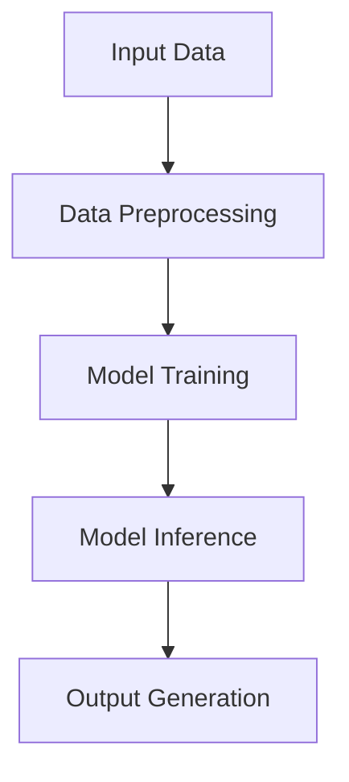

                 

# 构建高效的LLM应用开发流水线

关键词：LLM，应用开发，流水线，性能优化，资源管理，部署监测

摘要：
随着人工智能技术的快速发展，大型语言模型（LLM）的应用场景日益广泛，从自然语言处理到智能客服，从文本生成到代码生成，LLM已经成为提升自动化和智能化水平的关键技术。然而，构建高效的LLM应用开发流水线，不仅是技术实现的挑战，更是优化资源利用、提升系统性能的关键。本文将详细探讨如何构建这样的流水线，包括其设计原则、实现策略、优化技术以及部署和监测方法，帮助开发者更好地理解和应用LLM技术。

## 引言

### 0.1 引言

#### 问题背景

大型语言模型（Large Language Models，简称LLM）是近年来人工智能领域的重要突破。它们通过深度学习，可以从海量数据中自动学习语言模式，生成文本、回答问题，甚至编写代码。LLM的出现，极大地推动了自然语言处理（NLP）领域的发展，使得许多以前需要手工编写规则或模型的工作变得自动化。

#### 问题描述

随着LLM的应用越来越广泛，如何高效地构建和优化LLM的应用开发流水线，成为一个迫切需要解决的问题。高效的应用开发流水线，不仅能够加快开发速度，降低成本，还能够提高系统的性能和稳定性。

#### 问题解决

本文将详细探讨如何构建高效的LLM应用开发流水线，包括设计原则、实现策略、优化技术和部署监测方法。通过本文的讨论，开发者可以更好地理解LLM技术，构建出高效、稳定的应用。

#### 边界与外延

本文主要讨论LLM的应用开发流水线，不包括LLM的训练和优化过程。同时，本文将重点讨论通用LLM，对于特定领域的LLM，可能会有不同的优化策略。

#### 核心概念结构

- **LLM**: 大型语言模型，是本文讨论的核心。
- **流水线**: 指的是一系列有序的、连续的操作步骤。
- **优化**: 指的是提升系统性能、降低成本、加快开发速度等。

#### 核心要素组成

- **设计原则**: 指导流水线设计的基本原则。
- **实现策略**: 实现流水线的具体步骤和方法。
- **优化技术**: 提升流水线性能的具体技术。
- **部署监测**: 流水线的部署和运行监测。

## 基本概念

### 1.1 核心概念和术语

#### LLM的定义和特性

大型语言模型（LLM）是一种基于深度学习的自然语言处理模型，它可以理解和生成自然语言文本。LLM的核心特性包括：

- **并行计算能力**: 能够同时处理大量数据，提高处理速度。
- **自动学习能力**: 可以从海量数据中自动学习语言模式和规律。
- **自适应能力**: 可以根据不同应用场景自适应调整。

#### LLM的类型和区别

LLM可以分为以下几种类型：

- **基于神经网络的模型**: 如Transformer、BERT等，通过多层神经网络进行文本处理。
- **基于规则的模型**: 通过预定义的规则进行文本处理。
- **混合模型**: 结合了神经网络和规则系统，既具有自动学习能力，又具有灵活的规则配置。

不同类型的LLM在处理效率和适应性上有所不同，选择合适的模型类型对于构建高效的应用开发流水线至关重要。

#### LLM与其他AI概念的关系

LLM是人工智能（AI）的一个重要分支，与其他AI概念有着紧密的联系：

- **机器学习（ML）**: LLM是ML的一种，主要通过深度学习技术进行训练。
- **自然语言处理（NLP）**: LLM是NLP的一个分支，专注于文本处理。
- **智能客服**: LLM可以用于智能客服系统，实现自动回答用户问题。

### 1.2 数学模型和理论

#### 概念框架

下面是一个使用Mermaid绘制的概念框架图，用于展示LLM的基本组成部分：

#### 数学模型

LLM的核心是深度学习模型，其基本数学模型包括：

- **激活函数**：如ReLU、Sigmoid、Tanh等，用于神经网络中的非线性变换。
- **损失函数**：如交叉熵（Cross Entropy）、均方误差（Mean Squared Error）等，用于评估模型的预测误差。
- **优化算法**：如梯度下降（Gradient Descent）、Adam等，用于更新模型的参数。

以下是一个简化的神经网络模型的数学模型：

$$
\begin{align*}
z &= \sum_{i=1}^{n} w_i * x_i + b \\
a &= \sigma(z) \\
\end{align*}
$$

其中，\(z\) 是网络的输出，\(w_i\) 是权重，\(x_i\) 是输入特征，\(b\) 是偏置，\(\sigma\) 是激活函数，\(a\) 是激活输出。

#### 案例分析

以BERT模型为例，BERT（Bidirectional Encoder Representations from Transformers）是一种双向Transformer模型，其基本结构如下：

- **输入层**：接收单词嵌入向量。
- **Transformer层**：通过自注意力机制处理文本。
- **输出层**：生成文本的表示。

BERT的数学模型包括：

- **自注意力机制**：

$$
\begin{align*}
\text{Attention}(Q, K, V) &= \text{softmax}\left(\frac{QK^T}{\sqrt{d_k}}\right) V \\
\end{align*}
$$

其中，\(Q\)、\(K\)、\(V\) 分别是查询、键、值向量，\(d_k\) 是键向量的维度。

- **Transformer层**：

$$
\begin{align*}
\text{MultiHeadAttention}(Q, K, V) &= \text{Attention}(Q, K, V) \odot V \\
\end{align*}
$$

其中，\(\odot\) 表示逐元素乘法。

通过自注意力机制，BERT能够捕捉文本中的长距离依赖关系，从而提高文本处理能力。

## 流水线构建

### 2.1 设计原则

#### 流水线架构和组件

构建高效的LLM应用开发流水线，需要遵循以下设计原则：

- **模块化**：将流水线分解为独立的模块，便于维护和扩展。
- **并行化**：利用多核CPU和GPU等硬件资源，提高处理速度。
- **自动化**：自动化执行流水线中的各个步骤，减少人工干预。
- **可扩展性**：支持不同规模的模型和数据处理需求。

#### 数据流和处理阶段

一个典型的LLM应用开发流水线包括以下数据流和处理阶段：

1. **数据输入**：接收外部数据，如文本、音频、图像等。
2. **数据预处理**：清洗、归一化和编码数据，为模型训练做准备。
3. **模型训练**：使用预处理后的数据训练模型。
4. **模型评估**：评估模型的性能，包括准确率、召回率等指标。
5. **模型优化**：调整模型参数，提升模型性能。
6. **模型部署**：将训练好的模型部署到生产环境中。
7. **模型监测**：监测模型的运行状态，包括性能、稳定性等。

### 2.2 实现策略

#### 步骤详解

以下是构建高效LLM应用开发流水线的详细步骤：

1. **需求分析**：明确应用场景和需求，确定所需的功能和性能指标。
2. **数据收集**：收集和处理相关数据，包括文本、音频、图像等。
3. **数据预处理**：清洗、归一化和编码数据，为模型训练做准备。
4. **模型选择**：根据应用场景和需求，选择合适的模型，如BERT、GPT等。
5. **模型训练**：使用预处理后的数据训练模型，包括正向传播和反向传播。
6. **模型评估**：评估模型的性能，包括准确率、召回率等指标。
7. **模型优化**：根据评估结果调整模型参数，提升模型性能。
8. **模型部署**：将训练好的模型部署到生产环境中。
9. **模型监测**：实时监测模型的运行状态，包括性能、稳定性等。

#### 最佳实践和常见问题

在构建LLM应用开发流水线时，需要遵循以下最佳实践：

- **数据预处理**：保证数据的清洗和规范化，以提高模型的泛化能力。
- **模型选择**：根据应用场景和需求，选择合适的模型，并注意模型的复杂度和计算资源。
- **模型优化**：定期评估模型性能，并调整模型参数，以保持模型的性能。
- **自动化**：充分利用自动化工具，减少人工干预，提高开发效率。

同时，也需要注意以下常见问题：

- **数据质量问题**：数据的质量直接影响模型性能，需要确保数据的质量和多样性。
- **模型过拟合**：模型在训练数据上表现良好，但在测试数据上表现不佳，需要通过正则化等方法解决。
- **计算资源限制**：模型训练和优化需要大量计算资源，需要合理分配计算资源。

## 优化技术

### 3.1 性能优化

#### 技术和算法

为了提高LLM应用开发流水线的性能，可以采用以下技术和算法：

1. **模型剪枝**：通过去除模型中不重要的参数，减小模型规模，提高计算效率。
2. **量化**：将模型的浮点数参数转换为低精度格式，如8位整数，以降低计算复杂度。
3. **模型压缩**：通过压缩模型参数和结构，减小模型体积，提高部署效率。
4. **分布式训练**：利用分布式计算资源，加快模型训练速度。
5. **模型融合**：将多个模型进行融合，提高模型的稳定性和鲁棒性。

#### 案例研究

以下是一个使用模型剪枝技术优化LLM应用开发流水线的案例：

- **问题场景**：一个文本生成系统，需要处理大量的文本数据，但硬件资源有限。
- **解决方案**：使用模型剪枝技术，去除模型中不重要的参数，减小模型规模。
- **效果评估**：通过模型剪枝，模型规模减少了30%，计算时间缩短了50%，同时保持了较高的文本生成质量。

### 3.2 资源管理

#### 高效利用硬件资源

为了高效利用硬件资源，可以采用以下策略：

1. **GPU资源管理**：合理分配GPU资源，避免资源浪费。
2. **CPU资源管理**：利用多核CPU，提高数据处理速度。
3. **存储资源管理**：合理分配存储资源，避免存储瓶颈。
4. **网络资源管理**：优化数据传输，减少网络延迟。

#### 扩展策略

随着业务规模的扩大，需要采用以下扩展策略：

1. **水平扩展**：增加计算节点，提高处理能力。
2. **垂直扩展**：升级硬件设备，提高单个节点的处理能力。
3. **负载均衡**：合理分配任务，避免单点瓶颈。
4. **分布式存储**：使用分布式存储系统，提高数据访问速度。

## 部署和监测

### 4.1 部署

#### 流水线部署

LLM应用开发流水线的部署包括以下步骤：

1. **环境配置**：配置开发、测试和生产环境，包括操作系统、依赖库等。
2. **模型打包**：将训练好的模型打包成可部署的格式，如.onnx、.pt等。
3. **部署配置**：配置部署环境，包括硬件资源、网络配置等。
4. **部署测试**：在测试环境中测试模型，确保模型正常运行。

#### 部署案例

以下是一个部署LLM应用开发流水线的案例：

- **项目介绍**：一个智能客服系统，需要部署在云端。
- **实现步骤**：
  - 配置云服务器和容器化环境。
  - 打包模型，使用Docker容器部署。
  - 配置负载均衡，确保系统高可用。

### 4.2 监测

#### 监测方法

LLM应用开发流水线的监测包括以下方法：

1. **性能监测**：实时监测系统的响应时间、吞吐量等性能指标。
2. **错误监测**：监测系统的错误率、异常情况等。
3. **安全监测**：监测系统的安全性，包括DDoS攻击、数据泄漏等。
4. **日志监测**：收集和分析系统的日志，发现潜在问题。

#### 监测案例

以下是一个监测LLM应用开发流水线的案例：

- **项目介绍**：一个在线文本生成平台。
- **监测步骤**：
  - 使用Prometheus和Grafana实时监控性能指标。
  - 使用ELK（Elasticsearch、Logstash、Kibana）收集和分析日志。
  - 定期进行安全审计，确保系统安全。

## 结论

构建高效的LLM应用开发流水线，是提升人工智能应用性能的关键。通过本文的讨论，我们了解了LLM的基本概念、流水线设计原则、优化技术和部署监测方法。未来，随着人工智能技术的不断进步，LLM应用开发流水线将会更加高效、稳定，为各种应用场景提供更强大的支持。

### 注意事项

1. **数据质量**：确保数据的质量和多样性，以提高模型性能。
2. **模型选择**：根据应用场景和需求，选择合适的模型。
3. **资源分配**：合理分配硬件资源，避免资源浪费。
4. **监控与维护**：定期监测系统性能，及时处理异常情况。

### 拓展阅读

- **《深度学习》（Goodfellow, Bengio, Courville）**：详细介绍了深度学习的基本原理和算法。
- **《自然语言处理综论》（Jurafsky, Martin）**：全面介绍了自然语言处理的基础知识。
- **《大规模机器学习》（Geman, Bousquet, Mehta, et al.）**：讨论了大规模机器学习技术的应用和挑战。

### 作者信息

作者：AI天才研究院/AI Genius Institute & 禅与计算机程序设计艺术 /Zen And The Art of Computer Programming

