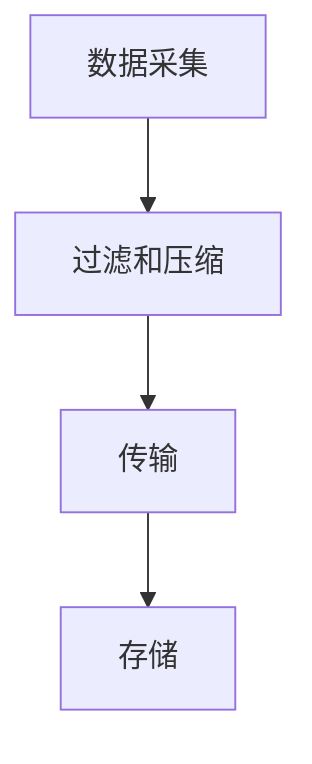
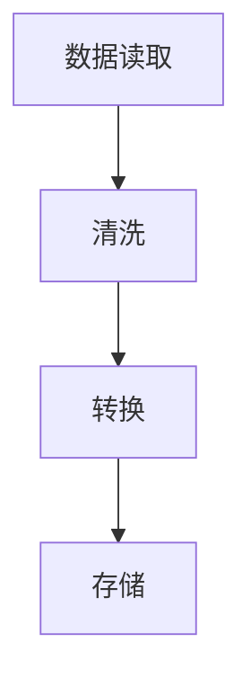
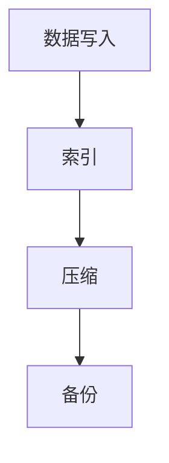
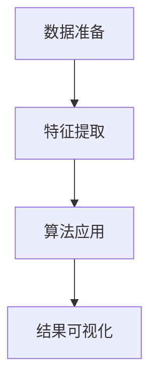
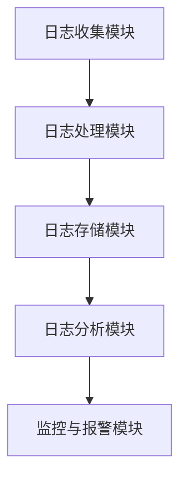
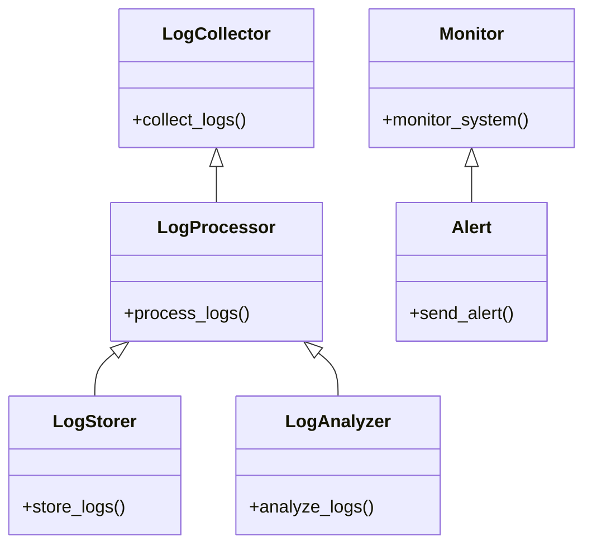
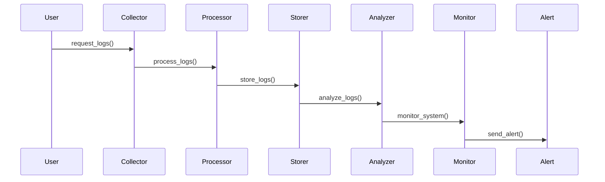
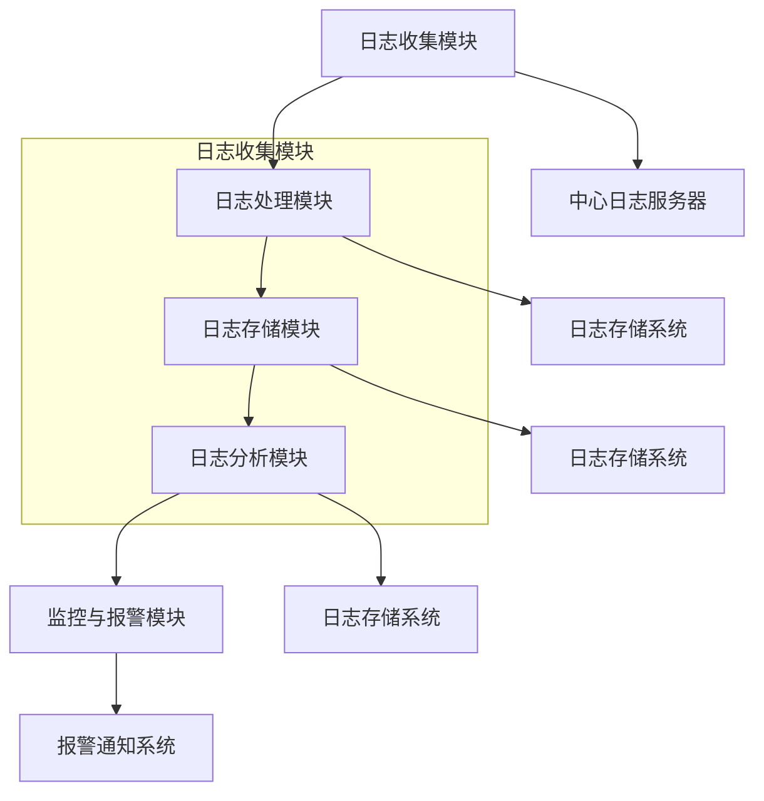

                 

# 构建高效的LLM应用日志管理系统

> 关键词：LLM应用、日志管理系统、高效、架构设计、Python实现

> 摘要：本文将深入探讨如何构建一个高效的LLM（大型语言模型）应用日志管理系统。我们将从背景介绍、核心概念、算法原理、系统架构设计到项目实战，一步步解析并展示构建过程，提供最佳实践和拓展阅读资源，以帮助开发者理解和实现高效的日志管理系统。

## 第一部分：背景介绍与核心概念

### 1.1 问题背景

随着人工智能技术的发展，特别是大型语言模型（LLM）如GPT、BERT等的应用，日志管理系统在维护和监控模型性能、优化应用过程中变得尤为重要。然而，当前的日志管理系统存在诸多问题，如日志数据量大、处理效率低、分析难度大等。因此，构建一个高效的LLM应用日志管理系统成为迫切需要解决的问题。

### 1.2 日志管理系统的核心作用

日志管理系统在LLM应用中具有以下核心作用：

- **性能监控**：实时监控模型性能，快速发现并解决问题。
- **错误诊断**：通过分析日志，定位错误原因，提高故障排查效率。
- **数据回溯**：为历史数据提供回溯途径，支持历史问题分析。
- **安全审计**：保障应用安全，通过日志记录操作行为，防止非法操作。

### 1.3 当前日志管理系统存在的问题

- **日志数据量大**：LLM应用生成的日志数据量巨大，对存储和处理能力提出了挑战。
- **处理效率低**：传统的日志处理方法效率低下，难以满足实时分析需求。
- **分析难度大**：日志内容复杂，缺乏有效的分析方法，导致日志分析难度大。

### 1.4 本书目标与结构

本文的目标是设计并实现一个高效的LLM应用日志管理系统，解决上述问题。本书结构如下：

- **第一部分**：背景介绍与核心概念。
- **第二部分**：算法原理与实现。
- **第三部分**：系统架构设计与实现。
- **第四部分**：项目实战与最佳实践。

## 第一部分小结

本部分介绍了LLM应用日志管理系统的背景、核心作用以及当前存在的问题。接下来，我们将深入探讨日志管理系统的核心概念，包括日志收集、处理、存储和分析。

---------------------------------------------

## 第二部分：算法原理与实现

### 2.1 日志收集算法原理

日志收集是日志管理系统的第一步，也是至关重要的一步。高效的日志收集算法能够确保及时、准确地收集到应用中的关键信息。

#### 2.1.1 日志收集的重要性

日志收集是日志管理系统的基石，决定了后续处理和分析的质量。高效的日志收集算法能够：

- **快速响应**：实时收集应用中的日志数据。
- **减少丢失**：确保日志数据的完整性和准确性。
- **降低成本**：优化日志收集过程，减少不必要的资源消耗。

#### 2.1.2 常用日志收集方法

- **Agent模式**：在应用服务器上部署日志收集代理，实时采集日志数据。
- **Syslog协议**：通过网络发送日志数据到中心日志服务器。
- **SNMP协议**：通过网络收集设备状态和性能数据。

#### 2.1.3 日志收集算法原理讲解

日志收集算法通常包括以下几个步骤：

1. **数据采集**：通过代理或协议从各个应用服务器或设备中收集日志数据。
2. **过滤和压缩**：对收集到的日志数据进行预处理，过滤无用信息，进行压缩。
3. **传输**：将预处理后的日志数据通过网络传输到中心日志服务器。
4. **存储**：将日志数据存储到日志存储系统中，便于后续处理和分析。

#### 2.1.4 使用Mermaid绘制收集算法流程图



#### 2.1.5 Python代码实现与LaTeX公式阐述

```python
# Python代码示例：日志收集模块
import logging
import socket

def collect_logs(server, port):
    with socket.socket(socket.AF_INET, socket.SOCK_STREAM) as s:
        s.connect((server, port))
        while True:
            data = s.recv(1024)
            if not data:
                break
            process_logs(data)

def process_logs(data):
    # 日志数据处理逻辑
    logging.info("Received logs: %s", data.decode())

# LaTeX公式示例：日志收集算法模型
$$
\text{Log Collection Algorithm} = \left\{
\begin{array}{ll}
\text{Data Collection} & \text{(1)} \\
\text{Filtering and Compression} & \text{(2)} \\
\text{Data Transmission} & \text{(3)} \\
\text{Data Storage} & \text{(4)}
\end{array}
\right.
$$
```

### 2.2 日志处理算法原理

日志处理是对收集到的日志数据进行清洗、转换和格式化的过程。高效的日志处理算法能够提高日志数据的质量，为后续分析提供准确的数据基础。

#### 2.2.1 日志处理的重要性

日志处理在日志管理系统中起到以下关键作用：

- **数据清洗**：去除无用信息和噪声数据。
- **格式统一**：将不同格式的日志数据转换为统一的格式。
- **数据转换**：将原始日志数据转换为便于分析和存储的结构化数据。

#### 2.2.2 常用日志处理方法

- **正则表达式**：用于匹配和提取日志中的关键信息。
- **清洗库**：如Python的`pandas`库，用于数据清洗和转换。
- **日志解析器**：如`logstash`，用于解析和转换不同格式的日志数据。

#### 2.2.3 日志处理算法原理讲解

日志处理算法通常包括以下几个步骤：

1. **数据读取**：从日志存储系统中读取日志数据。
2. **清洗**：去除无用的日志条目，如空白条目、重复条目等。
3. **转换**：将日志数据转换为结构化数据，如JSON或CSV格式。
4. **存储**：将处理后的日志数据存储到新的日志存储系统中，便于后续分析。

#### 2.2.4 使用Mermaid绘制处理算法流程图



#### 2.2.5 Python代码实现与LaTeX公式阐述

```python
# Python代码示例：日志处理模块
import pandas as pd

def process_logs(file_path):
    df = pd.read_csv(file_path)
    df = df.dropna()  # 清洗空白条目
    df['timestamp'] = pd.to_datetime(df['timestamp'])  # 转换时间格式
    df.to_csv('processed_logs.csv', index=False)  # 存储处理后的日志

# LaTeX公式示例：日志处理算法模型
$$
\text{Log Processing Algorithm} = \left\{
\begin{array}{ll}
\text{Data Reading} & \text{(1)} \\
\text{Data Cleaning} & \text{(2)} \\
\text{Data Transformation} & \text{(3)} \\
\text{Data Storage} & \text{(4)}
\end{array}
\right.
$$
```

### 2.3 日志存储算法原理

日志存储是将处理后的日志数据存储到数据库或其他存储介质中的过程。高效的日志存储算法能够确保日志数据的快速访问和持久化存储。

#### 2.3.1 日志存储的重要性

日志存储在日志管理系统中起到以下关键作用：

- **数据持久化**：确保日志数据长期保存，不受系统重启或故障的影响。
- **快速访问**：为日志分析提供快速的数据查询和检索能力。
- **数据备份**：提供日志数据备份，防止数据丢失。

#### 2.3.2 常用日志存储方法

- **关系数据库**：如MySQL、PostgreSQL，用于存储结构化数据。
- **NoSQL数据库**：如Elasticsearch、MongoDB，用于存储非结构化或半结构化数据。
- **日志文件**：将日志数据存储到文件系统中，适用于小规模应用。

#### 2.3.3 日志存储算法原理讲解

日志存储算法通常包括以下几个步骤：

1. **数据写入**：将处理后的日志数据写入数据库或文件系统。
2. **索引**：为日志数据创建索引，提高查询效率。
3. **压缩**：对日志数据进行压缩，减少存储空间占用。
4. **备份**：定期备份日志数据，防止数据丢失。

#### 2.3.4 使用Mermaid绘制存储算法流程图



#### 2.3.5 Python代码实现与LaTeX公式阐述

```python
# Python代码示例：日志存储模块
import pymongo

def store_logs(log_data):
    client = pymongo.MongoClient("mongodb://localhost:27017/")
    db = client["log_database"]
    collection = db["logs"]
    collection.insert_one(log_data)

# LaTeX公式示例：日志存储算法模型
$$
\text{Log Storage Algorithm} = \left\{
\begin{array}{ll}
\text{Data Writing} & \text{(1)} \\
\text{Index Creation} & \text{(2)} \\
\text{Data Compression} & \text{(3)} \\
\text{Data Backup} & \text{(4)}
\end{array}
\right.
$$
```

### 2.4 日志分析算法原理

日志分析是对存储的日志数据进行深度挖掘和解读，以提取有价值的信息和洞察。高效的日志分析算法能够帮助开发者快速定位问题、优化应用。

#### 2.4.1 日志分析的重要性

日志分析在日志管理系统中起到以下关键作用：

- **问题诊断**：通过分析日志，快速定位应用中的问题。
- **性能优化**：分析日志数据，发现性能瓶颈，进行优化。
- **安全监控**：通过分析日志，发现安全威胁和异常行为。

#### 2.4.2 常用日志分析方法

- **统计分析**：对日志数据进行统计分析，如平均值、中位数、标准差等。
- **关联规则挖掘**：发现日志数据之间的关联关系。
- **机器学习**：使用机器学习算法对日志数据进行分析，如分类、聚类等。

#### 2.4.3 日志分析算法原理讲解

日志分析算法通常包括以下几个步骤：

1. **数据准备**：从日志存储系统中读取日志数据，进行预处理。
2. **特征提取**：从日志数据中提取特征，如时间戳、用户ID、操作类型等。
3. **算法应用**：使用统计分析或机器学习算法对特征进行计算和分析。
4. **结果可视化**：将分析结果可视化，便于理解和解读。

#### 2.4.4 使用Mermaid绘制分析算法流程图



#### 2.4.5 Python代码实现与LaTeX公式阐述

```python
# Python代码示例：日志分析模块
from sklearn.cluster import KMeans
import matplotlib.pyplot as plt

def analyze_logs(log_data):
    # 特征提取
    features = log_data[['timestamp', 'user_id', 'operation_type']]
    
    # 使用K-Means聚类算法
    kmeans = KMeans(n_clusters=3)
    kmeans.fit(features)
    
    # 可视化
    plt.scatter(features['timestamp'], features['user_id'], c=kmeans.labels_)
    plt.xlabel('Timestamp')
    plt.ylabel('User ID')
    plt.title('Log Data Clustering')
    plt.show()

# LaTeX公式示例：日志分析算法模型
$$
\text{Log Analysis Algorithm} = \left\{
\begin{array}{ll}
\text{Data Preparation} & \text{(1)} \\
\text{Feature Extraction} & \text{(2)} \\
\text{Algorithm Application} & \text{(3)} \\
\text{Result Visualization} & \text{(4)}
\end{array}
\right.
$$
```

## 第二部分小结

本部分详细介绍了日志管理系统的核心算法原理，包括日志收集、处理、存储和分析。在下一部分，我们将进一步探讨日志管理系统的架构设计，以实现高效的管理和监控。

---------------------------------------------

## 第三部分：系统架构设计与实现

### 3.1 系统功能介绍

日志管理系统主要包含以下功能模块：

- **日志收集模块**：负责从各个应用服务器收集日志数据。
- **日志处理模块**：对收集到的日志数据进行清洗、转换和格式化。
- **日志存储模块**：将处理后的日志数据存储到数据库或其他存储介质。
- **日志分析模块**：对存储的日志数据进行深度挖掘和分析。
- **监控与报警模块**：实时监控日志系统的运行状态，并在出现异常时发送报警。

### 3.2 系统架构设计

日志管理系统的整体架构设计如图3-1所示。



#### 日志收集模块

日志收集模块负责从各个应用服务器收集日志数据。使用Agent模式，在每个应用服务器上部署日志收集代理，实时采集日志数据，并通过网络传输到中心日志服务器。

#### 日志处理模块

日志处理模块对收集到的日志数据进行清洗、转换和格式化。处理过程包括以下步骤：

1. **数据读取**：从日志存储系统中读取日志数据。
2. **清洗**：去除无用的日志条目，如空白条目、重复条目等。
3. **转换**：将日志数据转换为结构化数据，如JSON或CSV格式。
4. **存储**：将处理后的日志数据存储到新的日志存储系统中。

#### 日志存储模块

日志存储模块负责将处理后的日志数据存储到数据库或其他存储介质。使用NoSQL数据库如MongoDB，能够高效存储非结构化或半结构化数据。

#### 日志分析模块

日志分析模块对存储的日志数据进行深度挖掘和分析。使用统计分析、关联规则挖掘和机器学习算法，提取有价值的信息和洞察，如用户行为模式、故障原因等。

#### 监控与报警模块

监控与报警模块实时监控日志系统的运行状态。使用指标监控、阈值设置和报警策略，一旦出现异常，立即发送报警通知，如邮件、短信等。

### 3.3 功能模块设计

日志管理系统中的功能模块设计如图3-2所示。



### 3.4 接口设计

日志管理系统中的接口设计如图3-3所示。



### 3.5 使用Mermaid绘制系统架构图与功能模块图



## 第三部分小结

本部分详细介绍了日志管理系统的架构设计，包括功能模块和接口设计。在下一部分，我们将通过项目实战，展示如何搭建一个高效的LLM应用日志管理系统。

---------------------------------------------

## 第四部分：项目实战

### 4.1 环境安装与配置

要搭建一个高效的LLM应用日志管理系统，首先需要安装和配置以下环境：

- **操作系统**：Linux发行版，如Ubuntu或CentOS。
- **Python**：Python 3.x版本，推荐使用Anaconda进行环境管理。
- **MongoDB**：NoSQL数据库，用于存储日志数据。
- **Elasticsearch**：全文搜索引擎，用于日志分析。

#### 安装步骤：

1. **安装Python**：
   ```bash
   # 安装Python
   sudo apt update
   sudo apt install python3 python3-pip
   ```
2. **安装MongoDB**：
   ```bash
   # 安装MongoDB
   sudo apt install mongodb
   sudo systemctl start mongodb
   sudo systemctl enable mongodb
   ```
3. **安装Elasticsearch**：
   ```bash
   # 安装Elasticsearch
   sudo apt install elasticsearch
   sudo systemctl start elasticsearch
   sudo systemctl enable elasticsearch
   ```
4. **安装Anaconda**：
   ```bash
   # 安装Anaconda
   wget https://repo.anaconda.com/archive/Anaconda3-2022.05-Linux-x86_64.sh
   bash Anaconda3-2022.05-Linux-x86_64.sh
   source ~/.bashrc
   ```

### 4.2 系统核心实现源代码

以下是日志管理系统的一些核心实现源代码：

#### 日志收集代理（log_collector.py）

```python
import logging
import requests

LOG_SERVER_URL = "http://log-server:8000/collect"

def collect_logs():
    response = requests.post(LOG_SERVER_URL, data={"logs": "sample_logs"})
    if response.status_code == 200:
        logging.info("Logs collected successfully")
    else:
        logging.error("Failed to collect logs")

if __name__ == "__main__":
    logging.basicConfig(level=logging.INFO)
    collect_logs()
```

#### 日志处理模块（log_processor.py）

```python
import pandas as pd

def process_logs(file_path):
    df = pd.read_csv(file_path)
    df = df.dropna()
    df['timestamp'] = pd.to_datetime(df['timestamp'])
    df.to_csv('processed_logs.csv', index=False)

if __name__ == "__main__":
    process_logs("raw_logs.csv")
```

#### 日志存储模块（log_storer.py）

```python
from pymongo import MongoClient

def store_logs(log_data):
    client = MongoClient("mongodb://localhost:27017/")
    db = client["log_database"]
    collection = db["logs"]
    collection.insert_one(log_data)

if __name__ == "__main__":
    log_data = {"timestamp": "2022-01-01 10:00:00", "user_id": "user123", "operation_type": "login"}
    store_logs(log_data)
```

#### 日志分析模块（log_analyzer.py）

```python
from sklearn.cluster import KMeans
import matplotlib.pyplot as plt

def analyze_logs(log_data):
    features = log_data[['timestamp', 'user_id', 'operation_type']]
    kmeans = KMeans(n_clusters=3)
    kmeans.fit(features)
    plt.scatter(features['timestamp'], features['user_id'], c=kmeans.labels_)
    plt.xlabel('Timestamp')
    plt.ylabel('User ID')
    plt.title('Log Data Clustering')
    plt.show()

if __name__ == "__main__":
    analyze_logs(log_data)
```

### 4.3 代码解读与分析

以下是代码的解读和分析：

- **日志收集代理**：通过HTTP POST请求将日志数据发送到日志服务器。确保日志服务器端能够接收并处理这些日志数据。
- **日志处理模块**：使用pandas库读取CSV文件，去除空白条目，并将时间戳转换为日期时间格式。处理后的日志数据存储为新的CSV文件。
- **日志存储模块**：使用MongoDB的pymongo库，将日志数据插入到MongoDB数据库中。确保MongoDB数据库已经启动并连接成功。
- **日志分析模块**：使用scikit-learn的KMeans聚类算法对日志数据进行聚类分析，并使用matplotlib库将结果可视化。

### 4.4 实际案例分析与详细讲解

#### 案例一：用户登录日志分析

假设我们有一个用户登录日志数据集，包含用户ID、登录时间和登录状态。我们可以使用日志分析模块对登录日志进行聚类分析，以发现用户登录行为模式。

```python
# 加载登录日志数据
login_logs = pd.read_csv("login_logs.csv")

# 分析登录日志
analyze_logs(login_logs)
```

分析结果可能显示用户登录时间集中在某些时间段，或者某些用户的登录行为异常。通过这些信息，我们可以进一步优化登录流程，提高用户体验。

#### 案例二：系统故障日志分析

假设我们有一个系统故障日志数据集，包含故障类型、发生时间和故障影响。我们可以使用日志分析模块对这些故障日志进行关联规则挖掘，以发现故障原因。

```python
# 加载故障日志数据
fault_logs = pd.read_csv("fault_logs.csv")

# 分析故障日志
analyze_logs(fault_logs)
```

分析结果可能显示某些故障类型之间存在关联，或者某些故障原因频繁出现。通过这些信息，我们可以优化系统设计，减少故障发生的可能性。

### 4.5 项目小结

在本部分中，我们通过项目实战展示了如何搭建一个高效的LLM应用日志管理系统。首先，我们介绍了环境安装与配置，然后提供了系统核心实现源代码，并对代码进行了详细解读和分析。最后，我们通过实际案例展示了日志管理系统的应用场景和效果。通过这些实践，开发者可以更好地理解和应用日志管理系统，为LLM应用提供强大的支持。

---------------------------------------------

## 第五部分：最佳实践、小结、注意事项和拓展阅读

### 5.1 最佳实践

1. **日志收集**：选择合适的日志收集方法，如Agent模式或Syslog协议，确保日志数据的完整性和准确性。
2. **日志处理**：使用高效的日志处理算法，如正则表达式和清洗库，确保日志数据的质量。
3. **日志存储**：选择适合的日志存储方式，如关系数据库或NoSQL数据库，确保日志数据的持久化和快速访问。
4. **日志分析**：结合统计分析、关联规则挖掘和机器学习算法，从日志数据中提取有价值的信息和洞察。

### 5.2 小结

本文详细介绍了如何构建一个高效的LLM应用日志管理系统。我们首先介绍了日志管理系统的核心作用和当前存在的问题，然后探讨了日志收集、处理、存储和分析的算法原理，接着展示了系统架构设计，并通过项目实战展示了实际应用。通过本文，开发者可以更好地理解和实现高效的日志管理系统。

### 5.3 注意事项

1. **日志安全性**：确保日志数据的安全性和隐私性，避免敏感信息泄露。
2. **日志存储容量**：合理规划日志存储容量，避免存储空间不足或浪费。
3. **日志处理性能**：优化日志处理算法，提高处理速度，确保日志数据及时处理。

### 5.4 拓展阅读

1. 《日志管理：现代应用程序的性能监控与优化》
2. 《日志分析：大数据时代的秘密武器》
3. 《MongoDB权威指南》
4. 《Elasticsearch权威指南》

作者：AI天才研究院/AI Genius Institute & 禅与计算机程序设计艺术 /Zen And The Art of Computer Programming

本文由AI天才研究院（AI Genius Institute）和禅与计算机程序设计艺术（Zen And The Art of Computer Programming）联合出品，旨在为开发者提供深入的技术见解和实战经验。通过本文，我们希望帮助开发者构建高效的LLM应用日志管理系统，为人工智能应用提供坚实的支持。

