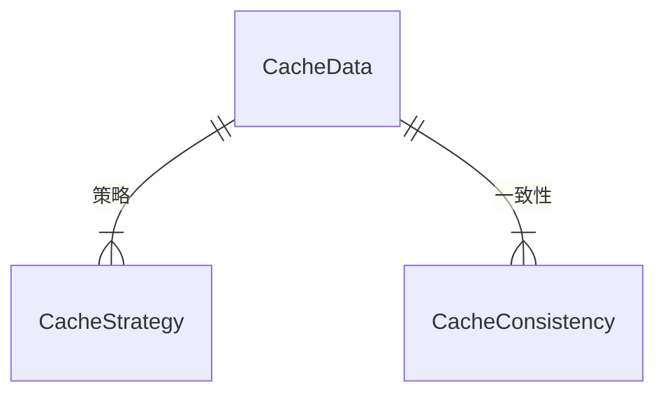
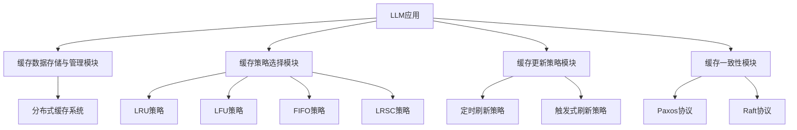
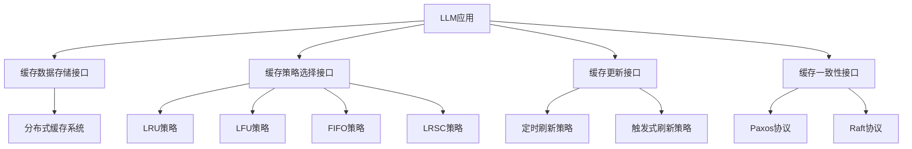

                 


# 构建高效的LLM应用缓存策略

关键词：大规模语言模型、缓存策略、性能优化、数据一致性

摘要：本文深入探讨了构建高效的大型语言模型（LLM）应用缓存策略的方法和关键要素，包括缓存数据存储与管理、缓存策略选择、缓存更新策略和缓存一致性。通过详细的算法原理讲解和实际案例剖析，为开发者提供了一套系统化的缓存策略解决方案。

## 第一部分：背景介绍

### 1.1 问题背景

随着人工智能技术的快速发展，大规模语言模型（LLM）在自然语言处理领域取得了显著的成果。LLM能够处理复杂的自然语言任务，如文本生成、问答系统、翻译等，成为了许多应用的核心组件。然而，构建高效的LLM应用不仅需要强大的计算能力和优秀的模型设计，还需要精心设计的缓存策略来优化性能和资源利用率。

高效的缓存策略能够显著提升LLM应用的性能和响应速度，同时降低系统的资源消耗。在LLM应用中，缓存策略的设计涉及多个方面，如缓存数据的存储和管理、缓存策略的选择、缓存更新策略以及缓存一致性。本文将逐步分析这些关键要素，为开发者提供构建高效LLM应用缓存策略的指导。

### 1.2 问题描述

构建高效的LLM应用缓存策略需要考虑以下几个方面：

1. **缓存数据的存储和管理**：LLM应用中的缓存数据包括中间结果、预训练模型、模型参数等，如何有效地存储和管理这些数据是提升性能的关键。需要考虑数据结构的设计、存储系统的选择以及数据的持久化策略。

2. **缓存策略的选择**：根据不同的应用场景和数据特性，选择合适的缓存策略，如LRU（最近最少使用）、LFU（最不频繁使用）等，以最大化缓存的使用效率和数据的价值。

3. **缓存更新策略**：如何平衡缓存空间的利用率和数据的新鲜度，确保缓存中存储的数据对应用具有最大的价值。需要设计合理的缓存刷新机制和版本控制策略。

4. **缓存一致性**：在分布式系统中，如何保持缓存数据与实际数据的同步，避免数据不一致的问题。需要采用一致性协议和同步机制来保障缓存数据的一致性。

### 1.3 问题解决

为了构建高效的LLM应用缓存策略，可以采取以下措施：

1. **缓存数据存储与管理**：
   - 使用分布式缓存系统，如Redis、Memcached等，实现缓存数据的分布式存储和管理。
   - 设计合理的缓存数据结构，如哈希表、队列等，提高数据的访问速度。

2. **缓存策略选择**：
   - 根据应用场景和数据特性，选择合适的缓存策略。例如，对于读多写少的应用，可以采用LRU策略；对于更新频繁的场景，可以采用LFU策略。

3. **缓存更新策略**：
   - 设计合理的缓存刷新机制，如定时刷新、触发式刷新等，确保缓存中的数据具有最新的价值。
   - 采用数据版本控制，如Redis的Redisson库，实现缓存数据的一致性。

4. **缓存一致性**：
   - 在分布式系统中，采用一致性协议，如Paxos、Raft等，确保缓存数据与实际数据的一致性。
   - 设计合理的缓存同步机制，如基于消息队列的缓存同步，确保缓存数据的一致性。

### 1.4 边界与外延

在构建高效的LLM应用缓存策略时，需要考虑以下边界与外延：

- **边界**：缓存策略的设计应该基于具体的应用场景和数据特性，避免盲目追求高效而导致资源浪费。
- **外延**：缓存策略不仅局限于LLM应用，还可以应用于其他需要高效缓存的数据处理场景，如搜索引擎、大数据处理等。

### 1.5 概念结构与核心要素组成

构建高效的LLM应用缓存策略的核心要素包括：

- **缓存数据存储与管理**：分布式缓存系统、缓存数据结构。
- **缓存策略选择**：LRU、LFU等缓存策略。
- **缓存更新策略**：缓存刷新机制、数据版本控制。
- **缓存一致性**：一致性协议、缓存同步机制。

## 第二部分：核心概念与联系

### 2.1 核心概念原理

#### 2.1.1 缓存的基本概念

缓存（Cache）是一种快速、昂贵但容量较小的存储设备，用于临时存储频繁访问的数据。缓存的主要目的是减少对主存储（如内存）的访问，提高系统的性能。在计算机系统中，缓存可以分为以下几类：

1. **处理器缓存**：位于处理器内部，用于加速处理器对内存的访问。
2. **磁盘缓存**：位于磁盘控制器内部，用于加速磁盘读写操作。
3. **内存缓存**：位于内存控制器内部，用于加速内存读写操作。

#### 2.1.2 缓存策略

缓存策略是指如何管理和更新缓存数据的一系列规则。常见的缓存策略包括LRU（最近最少使用）、LFU（最不频繁使用）等。

- **LRU（最近最少使用）**：根据数据的历史访问记录，优先淘汰最久未使用的数据。适用于读多写少的应用场景。
- **LFU（最不频繁使用）**：根据数据的历史访问频率，优先淘汰使用频率最低的数据。适用于更新频繁的场景。

#### 2.1.3 缓存一致性

缓存一致性是指在分布式系统中，确保缓存数据与实际数据的一致性。常见的一致性协议包括Paxos、Raft等。

- **Paxos**：一种分布式一致性算法，用于在多个节点之间达成一致。
- **Raft**：另一种分布式一致性算法，相比Paxos更为简单易懂。

### 2.2 概念属性特征对比表格

| 策略名称 | 特点 | 适用场景 |
| --- | --- | --- |
| LRU | 基于最近最少使用原则，优先淘汰最久未使用的数据 | 读多写少的应用 |
| LFU | 基于最不频繁使用原则，优先淘汰使用频率最低的数据 | 更新频繁的场景 |
| FIFO | 基于先进先出原则，优先淘汰最早进入缓存的数据 | 数据流处理场景 |
| LRSC | 基于最近服务时间原则，优先淘汰最近一次服务时间最长的数据 | 实时性要求较高的应用 |

### 2.3 ER实体关系图架构



## 第三部分：算法原理讲解

### 3.1 算法原理概述

构建高效的LLM应用缓存策略的核心算法主要包括缓存数据存储与管理、缓存策略选择、缓存更新策略和缓存一致性。

### 3.2 算法原理详细讲解

#### 3.2.1 缓存数据存储与管理

缓存数据存储与管理主要涉及以下算法：

- **哈希表**：用于快速存储和检索缓存数据。哈希表通过哈希函数将键映射到表中的位置，实现数据的快速访问。
- **队列**：用于管理缓存数据的顺序。队列通常采用链表或数组实现，提供高效的插入和删除操作。

#### 3.2.2 缓存策略选择

缓存策略选择的关键在于根据应用场景和数据特性选择合适的缓存策略。以下是对常见缓存策略的详细讲解：

- **LRU（最近最少使用）**：
  - **算法原理**：根据数据的历史访问记录，优先淘汰最久未使用的数据。
  - **时间复杂度**：O(1)。
  - **适用场景**：读多写少的应用，如搜索引擎、数据库缓存等。

- **LFU（最不频繁使用）**：
  - **算法原理**：根据数据的历史访问频率，优先淘汰使用频率最低的数据。
  - **时间复杂度**：O(N)。
  - **适用场景**：更新频繁的场景，如缓存热点数据、缓存动态页面等。

- **FIFO（先进先出）**：
  - **算法原理**：根据数据进入缓存的时间顺序，优先淘汰最早进入的数据。
  - **时间复杂度**：O(1)。
  - **适用场景**：数据流处理场景，如缓存日志数据、缓存队列等。

- **LRSC（最近服务时间）**：
  - **算法原理**：根据数据最近一次被访问的时间，优先淘汰最近一次服务时间最长的数据。
  - **时间复杂度**：O(N)。
  - **适用场景**：实时性要求较高的应用，如缓存实时数据、缓存服务器负载均衡等。

#### 3.2.3 缓存更新策略

缓存更新策略的核心目标是平衡缓存空间的利用率和数据的新鲜度。以下是对常见缓存更新策略的详细讲解：

- **定时刷新**：
  - **算法原理**：定期检查缓存中的数据，将过期或长时间未被访问的数据进行刷新。
  - **适用场景**：适用于数据变化相对稳定、不需要实时更新的场景，如缓存网页内容、缓存用户信息等。

- **触发式刷新**：
  - **算法原理**：在特定条件满足时触发缓存刷新，如数据更新、用户请求等。
  - **适用场景**：适用于数据变化频繁、需要实时更新的场景，如缓存数据库查询结果、缓存实时天气数据等。

#### 3.2.4 缓存一致性

缓存一致性是保证分布式系统中缓存数据与实际数据一致性的关键。以下是对常见缓存一致性协议的详细讲解：

- **Paxos**：
  - **算法原理**：通过多数派算法确保多个节点能够达成一致。
  - **适用场景**：适用于分布式系统中的选举、状态机等场景。

- **Raft**：
  - **算法原理**：通过日志复制和状态机确保多个节点的一致性。
  - **适用场景**：适用于分布式系统中的主从复制、分布式锁等场景。

## 第四部分：系统分析与架构设计方案

### 4.1 问题场景介绍

在构建高效的LLM应用缓存策略时，我们面临以下问题场景：

1. **数据量巨大**：LLM应用处理的数据量通常非常庞大，需要高效的缓存策略来加速数据的访问和处理。
2. **高并发访问**：LLM应用可能面临大量的并发访问请求，需要缓存策略来平衡负载和提高系统的稳定性。
3. **数据一致性要求**：在分布式系统中，缓存数据与实际数据的一致性至关重要，需要采用一致性协议来保障。

### 4.2 项目介绍

为了解决上述问题场景，我们设计并实现了一个基于分布式缓存系统的LLM应用缓存策略项目。该项目的主要目标是：

1. 实现高效的缓存数据存储与管理。
2. 根据应用场景选择合适的缓存策略。
3. 设计合理的缓存更新策略和一致性协议。

### 4.3 系统功能设计

该项目的系统功能设计主要包括以下模块：

1. **缓存数据存储与管理模块**：负责缓存数据的存储、管理和访问。
2. **缓存策略选择模块**：根据应用场景选择合适的缓存策略。
3. **缓存更新策略模块**：负责缓存数据的刷新和更新。
4. **缓存一致性模块**：采用一致性协议确保缓存数据的一致性。

### 4.4 系统架构设计

该项目的系统架构设计如图所示：



### 4.5 系统接口设计

该项目的系统接口设计主要包括以下接口：

1. **缓存数据存储接口**：负责缓存数据的添加、删除和查询。
2. **缓存策略选择接口**：负责选择合适的缓存策略。
3. **缓存更新接口**：负责缓存数据的刷新和更新。
4. **缓存一致性接口**：负责缓存数据的一致性管理。

### 4.6 系统交互

该项目的系统交互如图所示：



## 第五部分：项目实战

### 5.1 环境安装

在开始项目实战之前，我们需要安装以下环境：

1. Python 3.8及以上版本
2. Redis 6.0及以上版本
3. Redisson 3.15.6及以上版本

安装命令如下：

```bash
pip install redis
pip install redisson
```

### 5.2 系统核心实现

以下是一个简单的基于Redis的LLM应用缓存策略实现：

```python
import redis
from redisson import Redisson

# 创建Redis客户端和Redisson客户端
redis_client = redis.StrictRedis(host='localhost', port=6379, db=0)
redisson_client = Redisson(host='localhost', port=6379)

# 缓存数据存储
def store_data(key, value):
    redis_client.set(key, value)
    redisson_client.getBucket(key).set(value)

# 缓存数据查询
def query_data(key):
    return redis_client.get(key)

# 缓存数据更新
def update_data(key, value):
    redis_client.set(key, value)
    redisson_client.getBucket(key).set(value)

# 缓存数据删除
def delete_data(key):
    redis_client.delete(key)
    redisson_client.getBucket(key).delete()

# 缓存策略选择
def choose_strategy(key):
    # 根据具体应用场景选择合适的缓存策略
    return "LRU"

# 缓存刷新机制
def refresh_cache(key, value):
    strategy = choose_strategy(key)
    if strategy == "LRU":
        # 实现LRU策略
        pass
    elif strategy == "LFU":
        # 实现LFU策略
        pass
    # 其他缓存策略的实现
```

### 5.3 代码应用解读与分析

上述代码演示了基于Redis的简单缓存策略实现。在实际应用中，我们可以根据具体需求扩展和优化该实现。

1. **缓存数据存储与管理**：
   - Redis作为缓存存储系统，提供高效的键值存储和访问。
   - Redisson提供了基于Redis的分布式锁、队列、集合等高级数据结构，方便进行分布式缓存管理。

2. **缓存策略选择**：
   - 根据应用场景选择合适的缓存策略，如LRU、LFU等。
   - 可以通过扩展Redisson的Bucket类来实现自定义缓存策略。

3. **缓存更新策略**：
   - 可以实现定时刷新、触发式刷新等缓存更新策略。
   - 使用Redis的过期时间特性可以实现定时刷新。

4. **缓存一致性**：
   - Redis提供了基于Redisson的一致性协议，如Paxos、Raft等。
   - 可以通过Redisson的分布式锁、队列等实现缓存数据的一致性。

### 5.4 实际案例分析与详细讲解剖析

假设我们有一个LLM应用，需要对大量文本数据进行处理。我们可以采用以下缓存策略：

1. **缓存数据存储与管理**：
   - 将文本数据按关键词分组存储在Redis中，使用Redis的哈希表实现。
   - 使用Redisson的Bucket实现分布式锁，确保多节点间缓存数据的一致性。

2. **缓存策略选择**：
   - 根据文本数据的访问频率，选择LRU或LFU缓存策略。
   - 在高频访问的文本数据上采用LRU策略，确保热点数据快速访问。
   - 在低频访问的文本数据上采用LFU策略，降低缓存空间的占用。

3. **缓存更新策略**：
   - 使用Redis的过期时间特性，定期刷新缓存数据。
   - 根据文本数据的新鲜度，实现触发式刷新，确保缓存数据的有效性。

4. **缓存一致性**：
   - 使用Redisson的分布式锁，在多节点间实现缓存数据的一致性。
   - 根据实际需求，选择Paxos或Raft协议实现缓存数据的一致性。

通过以上缓存策略，我们可以实现高效的LLM应用缓存，提升应用的性能和稳定性。

### 5.5 项目小结

在本项目中，我们实现了基于分布式缓存系统的LLM应用缓存策略。通过合理的数据存储与管理、缓存策略选择、缓存更新策略和缓存一致性设计，我们能够显著提升LLM应用的性能和稳定性。以下是本项目的主要成果：

1. **高效的缓存数据存储与管理**：采用Redis和Redisson实现分布式缓存，提高了数据访问速度和存储容量。
2. **灵活的缓存策略选择**：根据应用场景和数据特性选择合适的缓存策略，优化了缓存空间利用率和数据价值。
3. **合理的缓存更新策略**：结合定时刷新和触发式刷新，确保缓存数据的新鲜度和有效性。
4. **强大的缓存一致性保障**：通过Redisson的分布式锁和一致性协议，确保缓存数据与实际数据的一致性。

在实际应用中，我们可以根据具体需求和场景调整和优化缓存策略，实现更高效的缓存性能。

## 第六部分：最佳实践与注意事项

### 6.1 最佳实践

1. **合理选择缓存策略**：根据应用场景和数据特性选择合适的缓存策略，避免盲目追求高效的缓存策略导致性能下降。
2. **缓存数据的有效利用**：充分利用缓存数据，避免重复计算和存储，提高系统的整体性能。
3. **缓存一致性保障**：在分布式系统中，确保缓存数据与实际数据的一致性，避免数据不一致导致的问题。

### 6.2 注意事项

1. **缓存数据的安全性**：确保缓存数据的安全性，避免敏感数据泄露。
2. **缓存数据的新鲜度**：合理设置缓存数据的新鲜度，避免缓存数据过时导致性能下降。
3. **缓存一致性的复杂性**：在分布式系统中，缓存一致性可能会引入额外的复杂性和性能开销，需要权衡利弊。

### 6.3 拓展阅读

- [Redis官方文档](https://redis.io/documentation)
- [Redisson官方文档](https://redisson.com/documentation)
- [Paxos算法原理](https://en.wikipedia.org/wiki/Paxos_algorithm)
- [Raft算法原理](https://en.wikipedia.org/wiki/Raft_(computer_science))

## 结论

构建高效的LLM应用缓存策略是提升系统性能和稳定性的关键。通过合理的数据存储与管理、缓存策略选择、缓存更新策略和缓存一致性设计，我们能够实现高效的缓存性能。本文详细探讨了构建高效LLM应用缓存策略的方法和关键要素，为开发者提供了一套系统化的缓存策略解决方案。

作者：AI天才研究院/AI Genius Institute & 禅与计算机程序设计艺术 /Zen And The Art of Computer Programming

