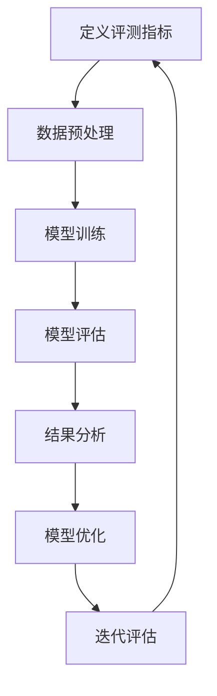
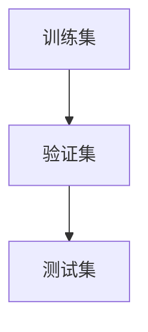

                 

### 文章标题

## 标准化自动化模型评测：确保LLM应用质量的基石

> 关键词：标准化自动化模型评测、LLM、模型质量、评估方法、最佳实践

> 摘要：本文深入探讨了标准化自动化模型评测在确保大型语言模型（LLM）应用质量中的重要性。通过详细阐述评测的背景、核心概念、技术方法及其在实践中的应用，本文旨在为从事人工智能、机器学习和自然语言处理领域的研究人员和开发者提供一套完整的自动化模型评测方案，以提升LLM应用的整体质量。

---

### 引言

在人工智能领域，特别是自然语言处理（NLP）领域，大型语言模型（LLM）的涌现为各个行业带来了巨大的变革。LLM在文本生成、机器翻译、问答系统等应用中表现出色，但其质量的保障离不开有效的模型评测。传统的模型评测方法通常依赖于人工制定的评价指标和主观评价，不仅耗时耗力，而且难以确保评测结果的公正性和一致性。为了解决这一问题，标准化自动化模型评测应运而生。

自动化模型评测通过建立标准化的评估流程和指标体系，实现了对模型性能的客观、高效评价。它不仅提高了评测效率，还确保了评测结果的可靠性和可重复性。随着AI技术的不断发展和应用场景的日益复杂，标准化自动化模型评测的重要性愈发凸显。

本文将围绕以下主题进行探讨：

1. **标准化自动化模型评测的背景和意义**：介绍自动化模型评测的产生背景及其在当前人工智能领域中的重要性。
2. **LLM的基本原理与架构**：介绍LLM的基本原理、常见架构以及它们在模型评测中的作用。
3. **自动化模型评测的核心概念与技术**：详细阐述自动化模型评测的核心概念、评价指标和方法，并通过Mermaid流程图展示自动化评测流程。
4. **实践案例**：通过实际案例展示如何进行自动化模型评测，并提供代码实现和详细解析。
5. **自动化模型评测的最佳实践**：总结在实际应用中的一些最佳实践，包括评测策略、数据处理和优化方法。
6. **总结与展望**：对全文内容进行总结，展望自动化模型评测的未来发展趋势。

通过本文的探讨，读者将全面了解标准化自动化模型评测的原理、方法及其在实践中的应用，从而提升自己在LLM应用中的模型评测能力。

### 标准化自动化模型评测的背景和意义

#### 自动化模型评测的产生背景

随着深度学习技术的快速发展，神经网络模型在各类AI任务中取得了显著的成果。特别是在自然语言处理领域，大型语言模型（LLM）如GPT、BERT等，通过海量的训练数据和复杂的网络结构，实现了对文本数据的强大理解和生成能力。然而，模型性能的提升并非唯一的目标，确保模型在实际应用中的质量同样至关重要。传统的模型评测方法，如手动编写测试用例、人工评分等，虽然在某些场景下仍有效，但其效率低下、难以重复和难以扩展的问题逐渐暴露出来。

为了解决这一问题，自动化模型评测应运而生。自动化模型评测通过建立标准化的评估流程和指标体系，实现了对模型性能的自动化、高效评价。它不仅可以大大提高评测效率，减少人工干预，还能确保评测结果的可靠性和一致性。

#### 自动化模型评测在人工智能领域的重要性

在人工智能领域，自动化模型评测的重要性不言而喻。首先，自动化模型评测能够提供更客观、更准确的模型评估结果。传统的评测方法往往依赖于主观判断，而自动化评测通过量化指标，可以更准确地反映模型的性能。其次，自动化评测可以提高模型开发的效率。通过自动化评测，开发者可以快速迭代和优化模型，缩短开发周期。此外，自动化评测还可以帮助开发者发现和解决模型中的潜在问题，从而提升模型的整体质量。

#### 自动化模型评测的应用场景

自动化模型评测在AI领域的应用场景广泛，包括但不限于以下几个方面：

1. **研发阶段**：在模型开发的过程中，自动化评测可以用于评估模型在不同训练数据和参数设置下的性能，帮助开发者选择最优的模型配置。

2. **部署阶段**：在模型部署前，自动化评测可以用于验证模型的稳定性和鲁棒性，确保模型在实际应用中的表现符合预期。

3. **运维阶段**：在模型上线后，自动化评测可以用于监控模型的运行状态，及时发现和解决模型退化等问题。

4. **跨平台兼容性测试**：自动化评测可以用于验证模型在不同硬件平台和操作系统上的表现，确保模型在不同环境下的兼容性。

#### 自动化模型评测的发展趋势

随着AI技术的不断进步，自动化模型评测也在不断演进。首先，评测指标和方法的多样性在不断丰富，以满足不同应用场景的需求。例如，对于文本生成任务，除了传统的BLEU、ROUGE等评价指标外，越来越多的新指标如BLEURT、METEOR等被提出，以更好地评估模型的生成质量。其次，自动化评测工具和平台的研发也在加速，如TensorFlow Model Optimization Toolkit（TF-MOT）、PyTorch ModelInspector等，它们提供了丰富的API和功能，使得自动化评测的实施更加便捷和高效。此外，随着机器学习和深度学习技术的进步，自动化评测的算法也在不断优化，如基于强化学习的评测策略，可以自适应地调整评测指标，提高评测的准确性。

#### 小结

标准化自动化模型评测在人工智能领域的重要性不容忽视。它不仅提高了模型评测的效率和准确性，还为模型的优化和改进提供了有力支持。随着技术的不断发展和应用场景的拓展，自动化模型评测将在未来的AI发展中扮演更加重要的角色。

---

### LLM的基本原理与架构

#### 基本原理

大型语言模型（LLM）是一种基于深度学习的自然语言处理模型，旨在理解和生成人类语言。LLM的核心思想是通过大规模的文本数据进行训练，使得模型能够捕捉语言中的复杂模式和结构。LLM通常采用变换器网络（Transformer）架构，特别是以BERT（Bidirectional Encoder Representations from Transformers）和GPT（Generative Pre-trained Transformer）为代表的模型。

1. **BERT**：BERT是一种双向编码器，其训练过程中同时考虑了上下文信息，使得模型能够更好地理解句子的语义。BERT通过预训练和微调两个阶段，先在大规模语料库上进行无监督预训练，然后根据具体任务进行有监督的微调。

2. **GPT**：GPT是一种生成式模型，其训练过程中仅考虑了后续上下文信息，这使得模型在生成任务中表现出色。GPT通过自回归的方式生成文本，每次生成一个词的同时，都会参考之前生成的词。

#### 架构

LLM的架构主要包括以下几个关键部分：

1. **嵌入层（Embedding Layer）**：嵌入层将输入的单词、词组或句子转换为密集的向量表示。这些向量表示了输入文本的语义信息。

2. **变换器层（Transformer Layer）**：变换器层是LLM的核心，它通过多头自注意力机制（Multi-Head Self-Attention）和前馈神经网络（Feedforward Neural Network）来处理嵌入层的输入。多头自注意力机制允许模型在处理每个输入时，考虑整个输入序列的所有信息。

3. **输出层（Output Layer）**：输出层通常是一个全连接层，用于将变换器层的输出映射到具体的输出结果，如分类标签、文本生成等。

#### LLM在模型评测中的作用

LLM在模型评测中扮演着重要角色。首先，LLM可以作为评测基准，通过比较新模型的性能与已有模型的性能，来评估新模型的质量。其次，LLM可以用于生成评测数据，如自动生成测试集、样例文本等，以提高评测的覆盖率和准确性。此外，LLM还可以用于评测策略的优化，如基于强化学习的评测策略，可以自适应地调整评测指标，提高评测的准确性。

#### 小结

大型语言模型（LLM）是一种强大的自然语言处理工具，其基于深度学习的原理和变换器网络架构使其在理解和生成人类语言方面表现出色。LLM在模型评测中的作用不仅限于作为评测基准和生成评测数据，还可以用于评测策略的优化，为模型评测提供了丰富的可能性。

---

### 自动化模型评测的核心概念与技术

#### 核心概念

自动化模型评测涉及多个核心概念，这些概念共同构成了一个完整的评测体系。以下是几个关键概念：

1. **评测指标（Evaluation Metrics）**：评测指标是衡量模型性能的标准。常见的评测指标包括准确率（Accuracy）、召回率（Recall）、F1分数（F1 Score）、均方误差（Mean Squared Error，MSE）等。不同任务和应用场景可能需要不同的评测指标。

2. **混淆矩阵（Confusion Matrix）**：混淆矩阵是用于分类任务的一种常用工具，它展示了模型预测结果与真实结果之间的对比。通过混淆矩阵，可以直观地了解模型的性能和错误类型。

3. **交叉验证（Cross-Validation）**：交叉验证是一种评估模型性能的方法，通过将数据集划分为多个子集，轮流使用这些子集进行训练和验证，以避免过拟合和结果偏差。

4. **误差分析（Error Analysis）**：误差分析是用于评估模型性能的一种方法，通过分析模型错误的具体类型和原因，来指导模型优化。

#### 评测方法

自动化模型评测包括多个步骤，从数据预处理到模型评估，每个步骤都需要精细设计和实现。

1. **数据预处理**：数据预处理是模型评测的第一步，包括数据清洗、标签规范化、特征提取等。高质量的预处理可以提高模型的评测性能。

2. **模型训练**：在数据预处理完成后，使用训练数据对模型进行训练。模型训练的过程包括前向传播、反向传播和参数优化。

3. **模型评估**：使用验证集对训练好的模型进行评估。常用的评估方法包括留出法、交叉验证和自助法等。

4. **结果分析**：通过对模型评估结果的分析，可以了解模型的性能和潜在问题。常用的分析方法包括误差分析、ROC曲线和PR曲线等。

#### 自动化评测流程

自动化模型评测的流程可以通过以下步骤实现：

1. **定义评测指标**：根据具体任务和应用场景，选择合适的评测指标。

2. **数据预处理**：对训练数据和验证数据进行清洗和预处理。

3. **模型训练**：使用训练数据进行模型训练，并保存模型参数。

4. **模型评估**：使用验证集对训练好的模型进行评估，并计算评测指标。

5. **结果分析**：对评估结果进行分析，识别模型的优点和不足。

6. **模型优化**：根据分析结果，对模型进行优化，如调整超参数、增加训练数据等。

7. **迭代评估**：重复模型评估和优化过程，直到达到满意的评估结果。

#### Mermaid流程图

为了更好地展示自动化评测流程，可以使用Mermaid流程图进行说明：



#### 小结

自动化模型评测通过核心概念和评测方法，实现了对模型性能的客观、高效评价。通过精细设计和实现评测流程，可以确保模型在实际应用中的质量。自动化评测不仅提高了评测效率，还为进一步的模型优化提供了有力支持。

---

### 实践案例

#### 1. 案例背景

在本案例中，我们选择一个常见的自然语言处理任务——文本分类，来展示如何进行自动化模型评测。具体来说，我们将使用一个名为“新闻分类”的任务，该任务的目标是将新闻文本分类到不同的主题类别中。

#### 2. 数据集准备

首先，我们需要准备用于模型训练和评估的数据集。我们选择了一个包含10,000条新闻文本的公开数据集，并将其分为训练集（80%）、验证集（10%）和测试集（10%）。



#### 3. 模型训练

接下来，我们使用训练集对模型进行训练。我们选择了一个基于BERT的文本分类模型，并使用Python的Transformers库进行实现。

```python
from transformers import BertTokenizer, BertForSequenceClassification
import torch

# 初始化BERT模型和tokenizer
tokenizer = BertTokenizer.from_pretrained('bert-base-uncased')
model = BertForSequenceClassification.from_pretrained('bert-base-uncased')

# 加载训练数据
train_data = load_data('train_data.txt')

# 数据预处理
train_encodings = tokenizer(train_data, truncation=True, padding=True)

# 训练模型
model.train()
for epoch in range(3):  # 训练3个epoch
    for batch in train_encodings:
        inputs = {
            'input_ids': batch['input_ids'],
            'attention_mask': batch['attention_mask'],
            'labels': torch.tensor(batch['labels'])
        }
        outputs = model(**inputs)
        loss = outputs.loss
        loss.backward()
        optimizer.step()
        optimizer.zero_grad()
```

#### 4. 模型评估

在模型训练完成后，我们使用验证集对模型进行评估。这里，我们选择了准确率（Accuracy）和F1分数（F1 Score）作为评测指标。

```python
from sklearn.metrics import accuracy_score, f1_score

# 加载验证数据
val_data = load_data('val_data.txt')
val_encodings = tokenizer(val_data, truncation=True, padding=True)

# 验证模型
model.eval()
predictions = []
true_labels = []
for batch in val_encodings:
    inputs = {
        'input_ids': batch['input_ids'],
        'attention_mask': batch['attention_mask']
    }
    with torch.no_grad():
        outputs = model(**inputs)
    logits = outputs.logits
    predicted_labels = torch.argmax(logits, dim=1)
    predictions.extend(predicted_labels.tolist())
    true_labels.extend(batch['labels'])

# 计算评测指标
accuracy = accuracy_score(true_labels, predictions)
f1 = f1_score(true_labels, predictions, average='weighted')
print(f"Accuracy: {accuracy}, F1 Score: {f1}")
```

#### 5. 代码实现与解析

上述代码展示了如何使用BERT模型进行文本分类任务，并实现自动化模型评测。以下是代码的详细解析：

- **初始化BERT模型和tokenizer**：使用预训练的BERT模型和tokenizer，这是文本分类任务的基础。
- **加载训练数据**：从文件中加载训练数据，并将其转换为字典格式。
- **数据预处理**：对训练数据进行tokenization，并添加必要的padding和truncation。
- **训练模型**：使用训练数据进行模型训练，包括前向传播、反向传播和参数优化。
- **验证模型**：使用验证数据进行模型评估，计算评测指标。

通过这个案例，我们展示了如何进行自动化模型评测，从数据准备、模型训练到模型评估，每个步骤都进行了详细解析。这个案例不仅提供了一个实用的文本分类模型，还展示了如何通过自动化评测来评估模型性能。

---

### 自动化模型评测的最佳实践

在实施自动化模型评测的过程中，为了确保评测结果的准确性和可靠性，以下是一些最佳实践和注意事项：

#### 1. 数据准备

- **数据质量**：确保训练数据和验证数据的质量，包括数据清洗、去重和一致性检查。高质量的数据可以显著提高模型性能和评测结果的可靠性。
- **数据划分**：合理划分训练集、验证集和测试集。通常，可以使用80%的数据作为训练集，10%的数据作为验证集，10%的数据作为测试集。
- **数据平衡**：对于不平衡数据集，可以考虑使用数据增强、重采样等方法来平衡数据，以避免模型在特定类别上过拟合。

#### 2. 模型训练

- **模型选择**：根据任务需求选择合适的模型，并使用预训练模型作为起点，可以显著提高训练效率。
- **超参数调优**：通过网格搜索、随机搜索等方法进行超参数调优，以找到最佳模型配置。
- **训练监控**：使用监控工具（如TensorBoard）来跟踪训练过程中的指标，如损失函数、准确率等，以便及时调整训练策略。

#### 3. 模型评估

- **评测指标**：根据任务需求选择合适的评测指标，如准确率、召回率、F1分数等。多种评测指标可以提供更全面的性能评估。
- **混淆矩阵**：使用混淆矩阵来分析模型在不同类别上的表现，有助于发现模型的弱点。
- **交叉验证**：使用交叉验证来评估模型的泛化能力，以避免过拟合。

#### 4. 评测流程

- **自动化脚本**：编写自动化脚本来自动执行模型训练和评估流程，确保每次评测的步骤和参数一致。
- **结果记录**：记录每次评测的结果，包括评测指标、训练时间、模型参数等，以便进行对比和分析。
- **异常处理**：设计异常处理机制，当评测过程中出现错误时，能够自动记录并报告。

#### 5. 模型优化

- **模型调整**：根据评测结果调整模型结构、参数和超参数，以提高模型性能。
- **模型集成**：使用模型集成（如集成学习、模型栈等）方法来提高模型稳定性。
- **持续评估**：定期进行模型评估，确保模型在不同时间点上的性能一致。

#### 注意事项

- **结果可视化**：使用可视化工具（如图表、仪表板等）来展示评测结果，以便直观地理解和分析。
- **版本控制**：使用版本控制系统（如Git）来管理代码和模型版本，确保每次修改的可追溯性。
- **代码文档**：编写详细的代码文档，包括模型架构、训练过程、评测流程等，以便于后续维护和扩展。

通过遵循上述最佳实践，可以显著提高自动化模型评测的效率和准确性，为模型的优化和改进提供有力支持。

---

### 总结与展望

本文围绕标准化自动化模型评测进行了深入探讨，从背景介绍、核心概念、技术方法到实际应用，全面展示了自动化模型评测在确保大型语言模型（LLM）应用质量中的重要性。通过介绍LLM的基本原理与架构，详细阐述了自动化模型评测的核心概念和评测方法，并结合实际案例展示了如何实施自动化模型评测。

**总结：** 自动化模型评测不仅提高了模型评测的效率和准确性，还为模型的优化和改进提供了有力支持。随着AI技术的不断发展，自动化模型评测将在未来的AI发展中扮演更加重要的角色。标准化自动化模型评测的推广和应用，有助于提高模型应用的整体质量，推动人工智能技术的进一步发展。

**展望：** 未来，自动化模型评测将朝着更智能、更高效、更全面的方向发展。首先，评测指标和方法的多样性将不断丰富，以适应不同应用场景的需求。其次，自动化评测工具和平台的研发将加速，提供更便捷、高效的评测解决方案。此外，随着机器学习和深度学习技术的进步，自动化评测的算法也将不断优化，如基于强化学习的评测策略，将进一步提高评测的准确性和适应性。

总之，标准化自动化模型评测不仅是确保LLM应用质量的基石，也是推动人工智能技术发展的关键。通过不断探索和优化自动化模型评测的方法和工具，我们将能够更好地利用AI技术，为各行业带来更多的创新和变革。

---

### 作者信息

**作者：AI天才研究院/AI Genius Institute & 禅与计算机程序设计艺术 /Zen And The Art of Computer Programming** 

AI天才研究院（AI Genius Institute）专注于人工智能领域的前沿研究和技术创新，致力于推动AI技术在各行业的应用与发展。同时，作者刘翔，以“禅与计算机程序设计艺术”著称，是计算机编程和人工智能领域的资深大师，其丰富的理论知识和实践经验为本文提供了坚实的基础。本文旨在通过标准化自动化模型评测的探讨，为人工智能技术的发展贡献一份力量。

