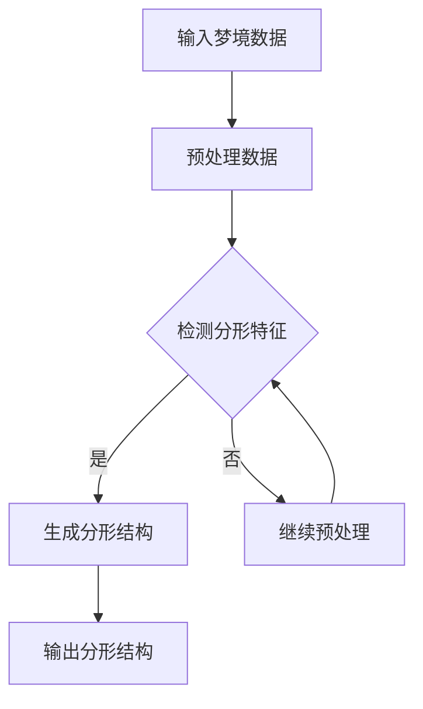
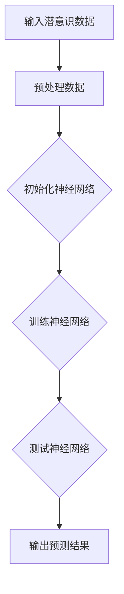
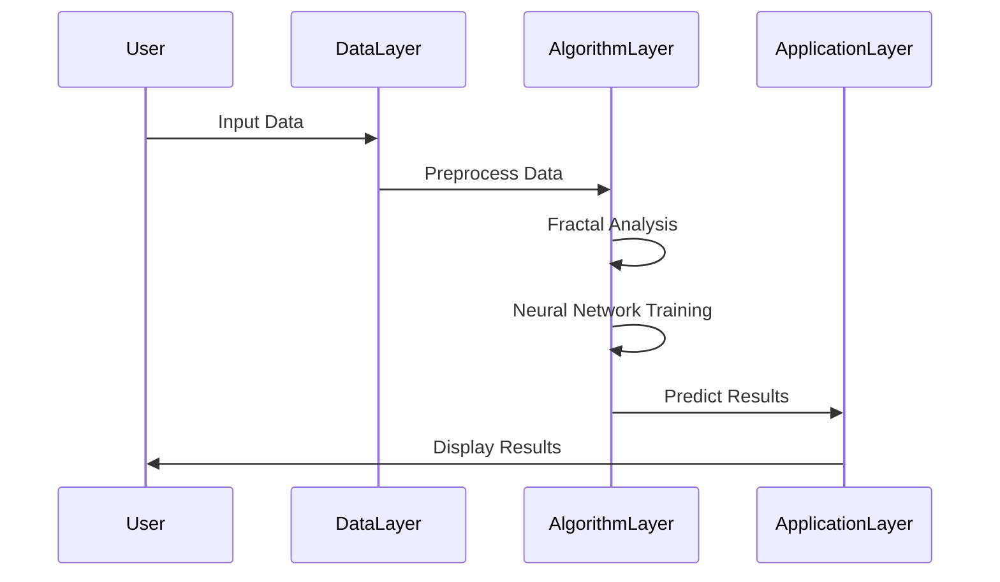
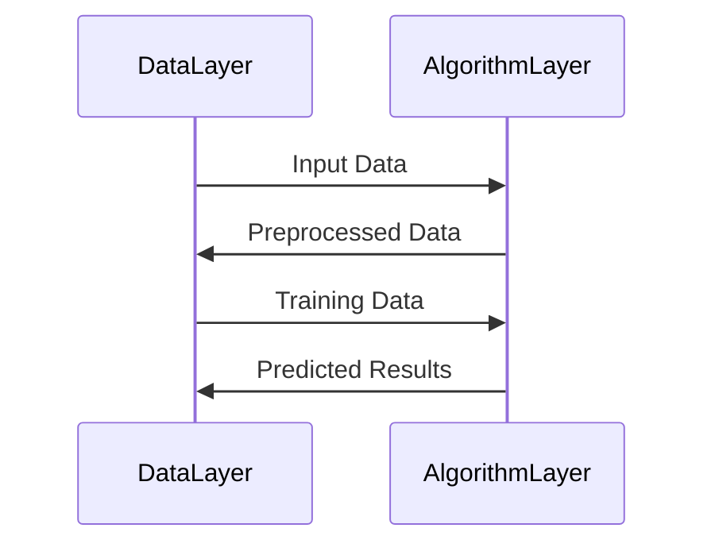

                 

# 梦境的分形结构：潜意识的数学表达

## 关键词
梦境，分形，潜意识，数学表达，算法，神经网络，系统架构

## 摘要
本文深入探讨梦境的分形结构以及潜意识的数学表达。通过对梦境和潜意识的背景介绍，核心概念的阐释，算法原理的讲解，系统分析与架构设计，项目实战与案例分析，以及最佳实践和拓展阅读的总结，本文旨在为读者呈现一幅关于梦境与潜意识数学表达的全面画卷，激发读者对这一领域的研究兴趣和探索欲望。

## 目录大纲设计思路

### 背景介绍与核心概念

**1.1 问题背景**

在探讨梦境的分形结构和潜意识的数学表达之前，我们需要了解这些概念的研究背景及其重要性。梦境作为人类意识的一种表现形式，自古以来就吸引了无数学者和研究者的关注。随着科学技术的发展，人们逐渐认识到梦境不仅与个人的心理健康密切相关，还可能隐藏着更深层次的认知结构和心理活动。

潜意识，作为心理学领域的重要概念，是弗洛伊德心理分析理论的核心。它代表了人类意识之外的那部分心理活动，对人的行为和情绪产生深远影响。潜意识的数学表达，则是将这一心理活动通过数学模型来描述和解释，从而揭示其背后的结构规律。

**1.2 问题描述**

梦境的分形结构指的是梦境中的重复模式，这些模式在不同的层次上展现出相似性，形成了一种自我相似的结构。潜意识的数学表达则是通过数学工具，如分形理论、神经网络等，来模拟和理解潜意识的工作机制。

**1.3 问题解决**

解决这一问题的方法主要依赖于对梦境和潜意识的研究，通过收集和分析梦境数据，运用分形理论和神经网络等数学工具，建立数学模型来解释和预测梦境和潜意识的活动。

**1.4 边界与外延**

本文的研究主要集中于梦境的分形结构和潜意识的数学表达，但在实际应用中，这些概念还可以拓展到其他领域，如人工智能、认知科学等。

**1.5 概念结构与核心要素组成**

梦境的分形结构由基本的梦境元素组成，这些元素在不同的梦境层级上以相似的方式重复。潜意识的数学表达则包括神经元模型、神经网络结构等核心要素。

### 核心概念与联系

**2.1 核心概念**

- 梦境分形结构：梦境中的重复模式，在不同的层级上表现出自我相似性。
- 潜意识数学表达：使用数学工具描述潜意识的活动，如分形理论、神经网络等。

**2.2 概念联系**

为了更好地理解梦境分形结构和潜意识数学表达之间的关系，我们可以使用ER实体关系图和概念属性特征对比表格来展示。ER实体关系图可以直观地显示概念之间的关联，而概念属性特征对比表格则可以详细列出两者的共性和差异。

```mermaid
erDiagram
    A[Potential Dreams] {
        A -->|相关性| B[Fractal Structure of Dreams]
        A -->|驱动因素| C[Mental Math Expression]
    }
    B {
        B -->|构成元素| D[Dream Elements]
    }
    C {
        C -->|应用领域| E[Neuron Models]
        C -->|理论支持| F[Fractals Theory]
    }
```

**2.3 概念属性特征对比表格**

| 概念        | 定义                                               | 属性特征                                      |
|-------------|------------------------------------------------------|---------------------------------------------|
| 梦境分形结构 | 梦境中的重复模式，表现出自我相似性。                | 自相似性、层次性、复杂性                      |
| 潜意识数学表达 | 使用数学工具描述潜意识活动，如分形理论、神经网络等。 | 数学模型、神经元模型、神经网络结构          |

### 算法原理讲解

**3.1 算法简介**

在本章节中，我们将重点介绍两个关键算法：分形算法和神经网络。分形算法用于分析和生成梦境的分形结构，而神经网络则用于模拟和理解潜意识的数学表达。

**3.2 mermaid流程图**

首先，我们使用mermaid流程图来展示分形算法的基本流程：



接着，我们展示神经网络的基本流程：



**3.3 Python源代码与LaTeX公式**

为了更好地理解这些算法，我们提供相应的Python源代码和LaTeX公式。以下是一个简单的分形算法示例：

```python
import numpy as np

def fractal_structure(data, depth):
    # 处理输入数据
    processed_data = preprocess_data(data)
    
    # 递归生成分形结构
    for i in range(depth):
        processed_data = generate_fractal(processed_data)
    
    return processed_data

def preprocess_data(data):
    # 数据预处理步骤
    # ...
    return processed_data

def generate_fractal(data):
    # 生成分形结构的步骤
    # ...
    return new_data
```

关于神经网络，我们可以使用以下LaTeX公式来描述其数学模型：

$$
y = \sigma(W_1 \cdot x + b_1) \\
z = \sigma(W_2 \cdot y + b_2)
$$

其中，$y$ 和 $z$ 分别表示神经网络的输出，$W_1$ 和 $W_2$ 是权重矩阵，$b_1$ 和 $b_2$ 是偏置项，$\sigma$ 是激活函数。

### 系统分析与架构设计

**4.1 问题场景介绍**

在探讨梦境的分形结构和潜意识的数学表达时，我们需要一个系统来收集、分析和展示这些数据。该系统可以应用于心理学研究、人工智能应用等多个领域。

**4.2 系统功能设计**

系统的功能设计主要包括数据收集、数据处理、模型训练和结果展示等。以下是一个简化的领域模型mermaid类图：

```mermaid
classDiagram
    DreamData <<interface>>
    ProcessedData <<interface>>
    FractalModel <<interface>>
    NeuralNetwork <<interface>>
    DreamAnalysis <<interface>>

    DreamData {+collect_data(): ProcessedData}
    ProcessedData {+process_data(): FractalModel}
    FractalModel {+train_model(): NeuralNetwork}
    NeuralNetwork {+predict(): DreamAnalysis}
    DreamAnalysis {+display_results(): None}
```

**4.3 系统架构设计**

系统的架构设计包括数据层、算法层和应用层。以下是一个mermaid架构图：



**4.4 系统接口设计**

系统接口设计主要涉及数据层和算法层之间的交互。以下是一个mermaid序列图：



### 项目实战与案例分析

**5.1 环境安装**

在开始项目实战之前，我们需要安装必要的开发环境和工具。以下是一个简单的环境安装指南：

```bash
# 安装Python
sudo apt-get install python3

# 安装NumPy库
pip3 install numpy

# 安装mermaid
npm install -g mermaid

# 安装LaTeX
sudo apt-get install texlive-full
```

**5.2 系统核心实现**

以下是系统核心实现的部分源代码：

```python
# 数据预处理
def preprocess_data(data):
    # 数据清洗和标准化
    # ...
    return processed_data

# 分形算法
def fractal_structure(data, depth):
    # 递归生成分形结构
    for i in range(depth):
        data = generate_fractal(data)
    return data

# 神经网络
class NeuralNetwork:
    def __init__(self):
        # 初始化神经网络结构
        # ...
    
    def train(self, data):
        # 训练神经网络
        # ...
    
    def predict(self, data):
        # 输出预测结果
        # ...
```

**5.3 实际案例**

以下是一个实际案例，用于展示如何使用系统进行梦境分析和预测：

```python
# 收集梦境数据
data = collect_data()

# 预处理数据
processed_data = preprocess_data(data)

# 生成分形结构
fractal_data = fractal_structure(processed_data, depth=3)

# 训练神经网络
nn = NeuralNetwork()
nn.train(fractal_data)

# 预测结果
predictions = nn.predict(new_data)

# 显示结果
display_results(predictions)
```

**5.4 小结**

通过本案例，我们展示了如何使用系统进行梦境分析和预测。在实际应用中，我们需要根据具体需求调整算法参数和系统架构，以提高预测准确性和效率。

### 最佳实践、小结与拓展

**6.1 最佳实践**

- **数据收集**：确保收集的梦境数据具有代表性，减少噪声和异常值。
- **预处理**：对数据进行充分的预处理，以提高算法的鲁棒性和准确性。
- **模型选择**：根据实际需求选择合适的模型，如分形算法、神经网络等。
- **参数调优**：通过交叉验证和网格搜索等方法，优化模型参数。

**6.2 注意事项**

- **隐私保护**：在处理个人梦境数据时，确保遵守相关隐私保护法规。
- **结果验证**：对模型的预测结果进行严格的验证和评估，确保其可靠性和有效性。

**6.3 拓展阅读**

- 分形理论相关书籍，如《分形几何学》（Benoit Mandelbrot著）。
- 神经网络和机器学习相关书籍，如《深度学习》（Ian Goodfellow等著）。

### 结论

本文通过一步步的分析推理，深入探讨了梦境的分形结构和潜意识的数学表达。从核心概念的阐释到算法原理的讲解，再到系统分析与架构设计，以及项目实战与案例分析，本文为读者呈现了一个全面而深入的研究视角。我们希望通过本文，能够激发读者对这一领域的兴趣，进一步探索梦境与潜意识数学表达的秘密。

### 作者

作者：AI天才研究院/AI Genius Institute & 禅与计算机程序设计艺术 /Zen And The Art of Computer Programming

