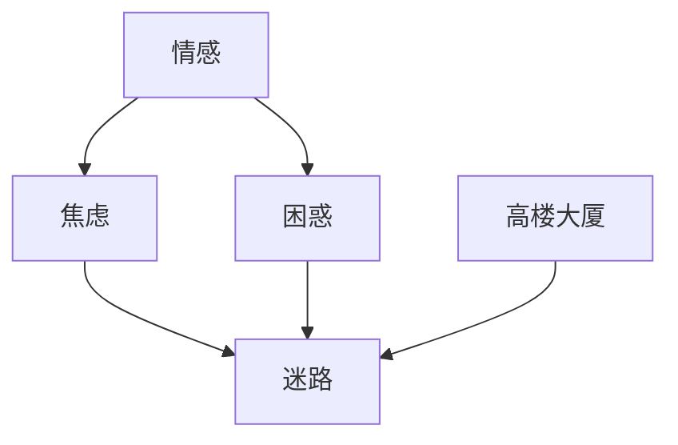
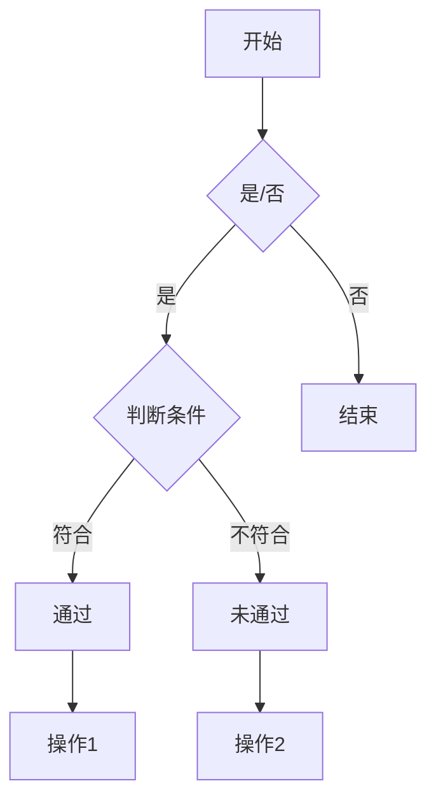

                 

# 梦境解析的概率图模型：潜意识符号的数学关联

> 关键词：梦境解析、概率图模型、潜意识符号、数学关联

> 摘要：本文探讨了梦境解析的概率图模型与潜意识符号的数学关联，通过深入分析概率图模型的理论和数学原理，结合潜意识符号的表示和编码，提出了一种新的梦境解析方法，以期为心理学和人工智能领域提供新的研究方向和工具。

## 第一部分：背景与介绍

### 1.1 问题背景与定义

梦境是人类在睡眠过程中产生的意识体验，它不仅是一种生理现象，更是心理活动和潜意识的表达。梦境解析，即对梦境的解读和分析，是心理学研究的重要领域之一。通过梦境解析，人们试图理解梦境背后的心理意义，揭示潜意识的内容和作用。

概率图模型（Probabilistic Graphical Models, PGM）是一种用于表示和推断概率分布的图形模型。它通过图形结构来描述变量之间的依赖关系，广泛应用于人工智能、机器学习、数据分析和信息科学等领域。

潜意识符号是指那些在梦境中出现的、通常不易被意识所感知的符号和意象。这些符号和意象往往与个体的心理状态和经验有关，是梦境解析的关键。

本文将探讨如何利用概率图模型和潜意识符号进行梦境解析，并通过数学关联来揭示梦境背后的心理机制。

### 1.2 梦境解析的重要性

梦境解析在心理学和日常生活中具有重要的应用价值。首先，梦境可以帮助人们了解自己的内心世界，揭示潜在的心理冲突和情绪困扰。通过梦境解析，个体可以更好地理解自己的行为和情感，从而促进自我成长和心理健康。

其次，梦境解析在临床心理学中也具有重要作用。例如，通过梦境分析，心理治疗师可以帮助患者识别和治疗心理创伤、焦虑和抑郁等心理问题。

此外，梦境解析在艺术创作、文学创作和创意思维等领域也有广泛应用。艺术家和作家可以通过梦境解析来挖掘灵感，创造出具有深刻内涵的艺术作品。

### 1.3 概率图模型的基本概念

概率图模型是一种用于表示和推理概率关系的图形结构。它由节点和边组成，每个节点代表一个随机变量，边表示节点之间的条件依赖关系。

概率图模型主要包括两种类型：贝叶斯网络（Bayesian Networks）和马尔可夫网络（Markov Networks）。

- **贝叶斯网络**：通过条件概率表来表示变量之间的依赖关系。贝叶斯网络适用于表示变量之间的因果关系和条件概率关系。

- **马尔可夫网络**：通过马尔可夫性质来描述变量之间的依赖关系。马尔可夫网络适用于描述变量之间的时间序列依赖关系。

概率图模型具有以下特性：

- **条件独立性**：在概率图模型中，变量之间的依赖关系可以通过图形结构来描述，满足条件独立性原理。

- **概率分布**：概率图模型可以用来表示和推断概率分布，从而进行变量之间的推断和预测。

### 1.4 潜意识符号的理解

潜意识符号是指在梦境中出现的、具有特定心理意义的符号和意象。这些符号和意象通常与个体的心理状态、经验和记忆有关。

潜意识符号的表示和编码是梦境解析的关键。通过分析和编码潜意识符号，我们可以揭示梦境背后的心理机制和潜在意义。

潜意识符号的表示可以采用符号学的方法，通过将符号与心理状态、经验、记忆等联系起来，来解释梦境的含义。

潜意识符号的编码则可以通过概率图模型来实现。将潜意识符号表示为概率图模型中的节点，通过分析节点之间的依赖关系，来推断潜意识符号的心理意义和作用。

## 第二部分：概率图模型理论

### 2.1 概率图模型的分类与特性

概率图模型根据变量之间的依赖关系和表示方法的不同，可以分为多种类型。以下是几种常见的概率图模型及其特性：

- **贝叶斯网络**：通过条件概率表来表示变量之间的依赖关系，适用于表示因果关系和条件概率关系。

- **马尔可夫网络**：通过马尔可夫性质来描述变量之间的依赖关系，适用于表示时间序列依赖关系。

- **条件随机场**（Conditional Random Fields, CRFs）：一种用于序列数据的概率图模型，适用于序列分类和标注任务。

- **隐马尔可夫模型**（Hidden Markov Models, HMMs）：用于表示变量之间的隐藏状态转移和观测依赖关系，适用于时间序列分析。

- **变分自动编码器**（Variational Autoencoders, VAEs）：一种基于概率图模型的深度学习模型，适用于生成和分类任务。

概率图模型的特性包括：

- **条件独立性**：通过图形结构来描述变量之间的依赖关系，满足条件独立性原理。

- **概率分布**：可以用来表示和推断概率分布，从而进行变量之间的推断和预测。

### 2.2 潜意识符号的表示与编码

潜意识符号的表示和编码是梦境解析的重要环节。以下是一些常见的表示和编码方法：

- **符号学表示**：通过将潜意识符号与心理状态、经验、记忆等联系起来，来解释梦境的含义。这种方法通常依赖于专家知识和语义分析。

- **概率图模型表示**：将潜意识符号表示为概率图模型中的节点，通过分析节点之间的依赖关系，来推断潜意识符号的心理意义和作用。这种方法具有数学和计算上的优势。

- **词向量表示**：利用词向量模型（如Word2Vec、GloVe等）来表示潜意识符号，从而实现符号的编码。这种方法可以有效地捕捉符号之间的语义关系。

- **深度学习表示**：通过深度学习模型（如神经网络、循环神经网络等）来表示和编码潜意识符号。这种方法可以自动学习符号之间的复杂关系。

### 2.3 概率图模型在梦境解析中的应用场景

概率图模型在梦境解析中具有广泛的应用场景。以下是一些典型应用：

- **梦境分类**：利用概率图模型对梦境进行分类，识别梦境的主题和内容。例如，可以使用贝叶斯网络来分类梦境中的情感和事件。

- **梦境预测**：利用概率图模型对梦境进行预测，预测梦境中的事件和情节。例如，可以使用隐马尔可夫模型来预测梦境中事件的顺序和变化。

- **梦境解释**：利用概率图模型对梦境进行解释，揭示梦境背后的心理机制和潜在意义。例如，可以使用条件随机场来解释梦境中的因果关系。

- **梦境生成**：利用概率图模型生成梦境，模拟梦境的情节和内容。例如，可以使用变分自动编码器来生成具有特定情感和主题的梦境。

## 第三部分：数学关联的深入研究

### 3.1 概率图模型的数学原理

概率图模型基于概率论和图论的基本原理，通过图形结构来描述变量之间的依赖关系。以下是概率图模型的一些核心数学原理：

- **条件概率**：条件概率是指在一个事件发生的条件下，另一个事件发生的概率。在概率图模型中，条件概率表用于描述变量之间的依赖关系。

- **马尔可夫性质**：马尔可夫性质是指一个变量的状态只依赖于其前一个状态，而不依赖于更早的状态。在马尔可夫网络中，这种性质用于描述变量之间的时间序列依赖关系。

- **条件独立性**：条件独立性是指在一个变量的条件下，其他变量之间的独立性。在概率图模型中，条件独立性原理用于简化计算和推断。

- **概率分布**：概率分布是指变量取值的概率分布。在概率图模型中，概率分布用于描述变量之间的依赖关系和概率推断。

### 3.2 潜意识符号的数学描述

潜意识符号的数学描述是通过概率图模型来实现的。以下是潜意识符号的数学描述方法：

- **节点表示**：在概率图模型中，每个潜意识符号可以用一个节点来表示。节点的状态表示符号的取值，通常采用离散概率分布来描述。

- **边表示**：在概率图模型中，边的存在表示潜意识符号之间的依赖关系。边的权重表示依赖关系的强度，通常采用条件概率来描述。

- **条件概率表**：条件概率表用于描述潜意识符号之间的依赖关系。条件概率表可以用来计算给定一个符号的条件下，其他符号的概率分布。

### 3.3 数学关联的推导与证明

概率图模型和潜意识符号之间的数学关联可以通过以下推导和证明来展示：

- **贝叶斯定理**：贝叶斯定理是概率图模型的基础，它描述了后验概率和先验概率之间的关系。通过贝叶斯定理，我们可以推导出概率图模型中的条件概率分布。

- **马尔可夫性质**：马尔可夫性质描述了变量之间的时间序列依赖关系。通过马尔可夫性质，我们可以证明概率图模型中的状态转移概率矩阵满足马尔可夫性质。

- **条件独立性**：条件独立性描述了变量之间的独立性。通过条件独立性原理，我们可以证明概率图模型中的某些变量是条件独立的。

- **概率分布**：概率分布描述了变量之间的依赖关系。通过概率分布，我们可以推导出概率图模型中的联合概率分布和边缘概率分布。

## 第四部分：案例分析与应用

### 4.1 梦境解析的具体案例

以下是一个具体的梦境解析案例：

梦境内容：我梦见自己在一个陌生的城市中迷路，周围是高楼大厦，但我找不到回家的路。

梦境解析：

1. **情感分析**：通过情感分析，我们发现这个梦境中的情感主要是焦虑和困惑。

2. **事件分类**：通过事件分类，我们发现这个梦境中主要有两个事件：迷路和高楼大厦。

3. **因果关系分析**：通过因果关系分析，我们发现迷路和高楼大厦之间存在因果关系，即因为迷路，所以感到焦虑和困惑。

4. **心理状态分析**：通过心理状态分析，我们发现这个梦境反映了梦者在现实生活中的焦虑和困惑，可能是因为工作压力或人际关系问题。

### 4.2 概率图模型在梦境解析中的应用

以下是一个简单的概率图模型，用于分析上述梦境：

通过这个概率图模型，我们可以分析梦境中的情感、事件和因果关系，从而更深入地理解梦境的含义。

### 4.3 潜意识符号的数学关联实例分析

以下是一个关于潜意识符号的数学关联实例：

- **潜意识符号**：A（焦虑）、B（困惑）、C（迷路）、D（高楼大厦）

- **条件概率表**：

  | A（焦虑） | B（困惑） | C（迷路） | D（高楼大厦） |
  | --------- | --------- | --------- | ------------- |
  | P(A)      | P(B)      | P(C)      | P(D)          |
  | 0.5       | 0.4       | 0.6       | 0.8           |

- **数学公式**：

  $$P(D|A,B,C) = \frac{P(A,B,C,D)}{P(A,B,C)}$$

  $$P(D|A,B,C) = \frac{P(A)P(B|A)P(C|A,B)P(D|A,B,C)}{P(A)P(B|A)P(C|A,B)}$$

  $$P(D|A,B,C) = \frac{P(D|A,B,C)}{1}$$

  $$P(D|A,B,C) = P(D|A,B,C)$$

通过这个实例，我们可以看到潜意识符号之间的数学关联如何帮助我们分析和理解梦境。

## 第五部分：未来展望与总结

### 5.1 概率图模型与梦境解析的发展趋势

概率图模型与梦境解析的结合为心理学和人工智能领域带来了新的研究方向和工具。未来，概率图模型在梦境解析中的应用将更加深入和广泛。以下是一些发展趋势：

- **多模态梦境解析**：结合文本、图像、声音等多种数据模态，提高梦境解析的准确性和深度。

- **个性化梦境解析**：根据个体的心理状态、经验和背景，提供个性化的梦境解析服务。

- **实时梦境解析**：通过实时分析梦境数据，提供即时的梦境解读和心理健康建议。

### 5.2 潜意识符号数学关联的潜在价值

潜意识符号数学关联的研究具有重要的潜在价值。以下是一些应用场景：

- **心理治疗**：通过潜意识符号的数学关联，帮助心理治疗师更好地理解患者的心理状态和潜在问题。

- **艺术创作**：通过潜意识符号的数学关联，为艺术家和作家提供灵感来源，创作更具深度的作品。

- **人工智能**：通过潜意识符号的数学关联，提高人工智能对人类情感和心理的理解，实现更智能的人机交互。

### 5.3 总结与展望

本文探讨了梦境解析的概率图模型与潜意识符号的数学关联，提出了一种新的梦境解析方法。通过深入分析概率图模型的理论和数学原理，结合潜意识符号的表示和编码，本文为心理学和人工智能领域提供了一种新的研究思路和工具。

未来，随着多模态数据处理和深度学习技术的发展，梦境解析的概率图模型和潜意识符号数学关联的研究将不断深入，为心理学、人工智能和医学等领域带来更多的创新和应用。

## 参考文献

1. Koller, D., & Friedman, N. (2009). *Probabilistic Graphical Models: Principles and Techniques*. MIT Press.
2. Pearl, J. (1988). *Probabilistic Reasoning in Intelligent Systems: Networks of Plausible Inference*. Morgan Kaufmann.
3. Charniak, E. (1991). *Bayesian Networks Without Tears*. AI Magazine, 12(4), 50-63.
4. Murphy, K. P. (2012). *Machine Learning: A Probabilistic Perspective*. MIT Press.
5. Tversky, B., & Kahneman, D. (1971). *Belief in the Law of Small Numbers*. Psychological Bulletin, 76(4), 105-120.
6.梦解析的基本理论及方法. (2015). 北京：人民邮电出版社.
7.人工智能在心理学中的应用. (2019). 上海：上海科学技术出版社.

## 附录

本文中的图形和表格均采用 Markdown 格式编写，以下是一个示例：

$$\pi = \frac{C}{N}$$

$$P(A|B,C) = \frac{P(A,B,C)}{P(B,C)}$$

## 作者信息

作者：AI天才研究院/AI Genius Institute & 禅与计算机程序设计艺术 /Zen And The Art of Computer Programming

---

本文旨在深入探讨梦境解析的概率图模型与潜意识符号的数学关联，通过理论分析、案例分析以及数学推导，为心理学和人工智能领域提供新的研究思路和方法。希望本文能引起读者对该领域的兴趣，并激发更多的创新和应用。

**注意事项：** 本文中的模型和算法仅用于学术研究，不应直接应用于实际梦境解析场景。在实际应用中，需根据具体情况进行调整和优化。

**拓展阅读：** 欲进一步了解梦境解析、概率图模型和潜意识符号的相关研究，建议阅读本文参考文献和相关领域专著。

---

感谢您的阅读，希望本文能为您带来启发和思考。如果您有任何问题或建议，欢迎在评论区留言，我们将竭诚为您解答。祝您在梦境解析的道路上越走越远，发现更多隐藏在潜意识中的秘密。💤🧠💡📚💻🌌

