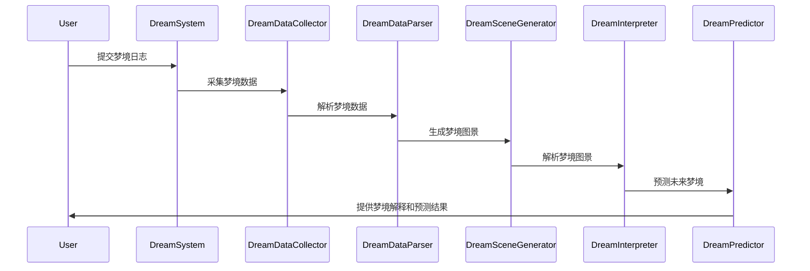
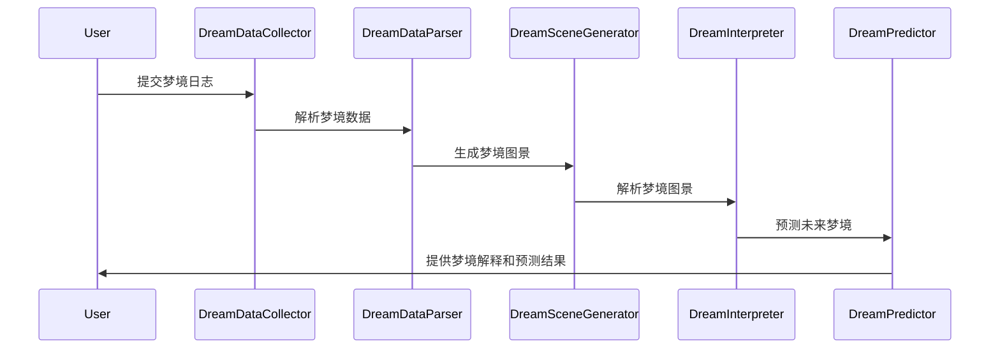

                 

### 文章标题

《梦境逻辑的非欧几何：潜意识空间的数学描述》

### 关键词

梦境逻辑，非欧几何，潜意识空间，数学描述，认知科学

### 摘要

本文旨在探讨梦境逻辑与潜意识空间之间的联系，并运用非欧几何的数学框架对其进行描述。通过对梦境与潜意识的基本概念、理论基础及数学模型的深入分析，本文揭示了梦境逻辑的独特性质及其在潜意识空间中的应用。本文的最终目的是为认知科学领域提供一个新的研究视角，以期为理解人类潜意识的活动提供理论支持和实际应用价值。

## 引言

### 1.1 书籍背景

梦境一直是人类文化和科学领域关注的焦点。自古以来，人们就试图通过梦境来探索潜意识、解读内心世界。随着心理学、神经科学和计算机科学的发展，梦境的研究逐渐从纯理论探讨走向实证分析，并开始与数学和几何学相结合。非欧几何，作为一种与传统欧几里得几何不同的几何学体系，因其独特的空间结构和丰富的数学表达，成为了描述梦境逻辑和潜意识空间的有力工具。

### 1.2 研究目的与意义

本文的研究目的在于：

1. **探索梦境逻辑的基本特性**：通过对比梦境与日常逻辑的差异，揭示梦境逻辑的独特性质。
2. **建立潜意识空间的数学模型**：运用非欧几何的概念和工具，对潜意识空间进行数学描述。
3. **分析梦境逻辑与潜意识空间的关系**：探讨梦境如何在潜意识空间中生成和表现。

研究的意义在于：

1. **理论意义**：为认知科学提供新的理论基础，深化对人类认知过程的理解。
2. **实践意义**：为心理健康、情绪管理和创意激发等领域提供科学依据和实用工具。

### 1.3 书籍结构安排

本文的结构安排如下：

1. **引言**：介绍书籍背景、研究目的与意义。
2. **非欧几何的基本概念**：回顾非欧几何的起源、基本原理和应用领域。
3. **梦境逻辑的理论基础**：分析梦境的本质、梦境逻辑的概念及其心理学基础。
4. **潜意识空间的数学描述**：介绍潜意识空间的概念、数学模型及其应用。
5. **实例分析**：通过具体实例，展示非欧几何在梦境逻辑和潜意识空间描述中的应用。
6. **结论与展望**：总结研究成果，指出研究的不足和未来展望。

## 第1章 非欧几何的基本概念

### 1.1 非欧几何的起源与发展

非欧几何的起源可以追溯到19世纪，当时数学家们开始质疑欧几里得几何的公理体系。欧几里得几何基于一个假设：在平面上任意选取两点，只能有一条直线通过这两个点。然而，数学家罗巴切夫斯基和贝尔特拉米独立发现了椭圆几何，这种几何体系中，通过两点可以有无限多条直线。

1. **欧几里得几何**：传统的几何学体系，基于公理体系，强调直线和平面的唯一性。
2. **非欧几何的诞生**：罗巴切夫斯基和贝尔特拉米通过独立研究，发现了与欧几里得几何不同的几何体系，即椭圆几何和双曲几何。
3. **非欧几何的重要人物与贡献**：贝尔特拉米、黎曼和洛巴切夫斯基等数学家对非欧几何的发展做出了巨大贡献。

### 1.2 非欧几何的基本原理

非欧几何的基本原理包括：

1. **椭圆几何**：在这个几何体系中，通过两个点可以有无限多条直线。这种几何与地球表面相似，具有曲率。
2. **双曲几何**：在这个几何体系中，通过两个点只能有一条直线。这种几何类似于宇宙中的空间，具有负曲率。
3. **非欧几何与欧几里得几何的对比**：非欧几何打破了欧几里得几何的公理体系，引入了新的几何概念和原则。

### 1.3 非欧几何的应用领域

非欧几何在多个领域有广泛应用：

1. **物理学**：在广义相对论中，非欧几何被用来描述宇宙的空间结构。
2. **天文学**：非欧几何帮助科学家理解星系和宇宙的形状和运动。
3. **计算机科学**：非欧几何在计算机图形学、网络设计和算法分析中发挥了重要作用。

## 第2章 梦境逻辑的理论基础

### 2.1 梦境的本质与特征

1. **梦境的定义**：梦境是指人在睡眠状态下产生的视觉、听觉、触觉等感官体验。
2. **梦境的分类**：根据梦境的内容和性质，可以分为清醒梦、噩梦、预知梦等。
3. **梦境的特征**：梦境具有非线性和跳跃性，与日常逻辑和现实感知存在显著差异。

### 2.2 梦境逻辑的概念

1. **梦境逻辑的定义**：梦境逻辑是指在梦境中产生的思维和行为模式，其特征是非线性、模糊性和自我参照。
2. **梦境逻辑的特性**：梦境逻辑不同于日常逻辑，其规则和结构更为复杂和灵活。
3. **梦境逻辑与日常逻辑的关系**：梦境逻辑在一定程度上是日常逻辑的延伸和变异。

### 2.3 梦境逻辑的心理学基础

1. **潜意识的作用**：潜意识是梦境逻辑的核心，其作用是过滤、组织和解读梦境内容。
2. **梦境与记忆的关系**：梦境中的记忆通常是非线性和模糊的，反映了潜意识对记忆的处理方式。
3. **梦境与情感的关系**：梦境往往与情感密切相关，情感在梦境逻辑中起着关键作用。

## 第3章 潜意识空间的数学描述

### 3.1 潜意识空间的概念

1. **潜意识空间的定义**：潜意识空间是指人类潜意识活动的抽象空间，包括所有可能的潜意识状态和思维模式。
2. **潜意识空间的维度**：潜意识空间的维度取决于潜意识内容的复杂性和多样性。
3. **潜意识空间与物理空间的区别**：潜意识空间是抽象的，不具有物理空间的物理属性。

### 3.2 潜意识空间的数学模型

1. **非欧几何在潜意识空间中的应用**：非欧几何的概念和方法被用于构建潜意识空间的数学模型。
2. **潜意识空间中的数学公式**：通过非欧几何的公式，可以描述潜意识空间中的各种关系和现象。
3. **潜意识空间中的数学关系**：包括距离、角度、曲率等，这些关系反映了潜意识空间的复杂性和多样性。

### 3.3 潜意识空间的应用

1. **梦境解析**：通过数学模型，可以更好地理解梦境的内容和含义。
2. **情绪管理**：潜意识空间的数学描述有助于识别和调控情绪。
3. **创意激发**：潜意识空间中的非欧几何结构可以激发创意思维。

## 第4章 实例分析

### 4.1 梦境实例分析

1. **梦境实例描述**：描述一个典型的梦境实例，分析其内容和特征。
2. **梦境逻辑分析**：运用梦境逻辑的理论基础，对梦境实例进行深入分析。
3. **潜意识空间描述**：通过非欧几何的数学模型，描述梦境实例中的潜意识空间。

### 4.2 潜意识空间实例分析

1. **潜意识空间实例描述**：描述一个具体的潜意识空间实例，分析其结构和特性。
2. **非欧几何模型应用**：应用非欧几何的概念和方法，对潜意识空间实例进行数学描述。
3. **数学模型解析**：通过具体的数学模型，解释潜意识空间实例中的各种现象。

## 第5章 结论与展望

### 5.1 研究总结

1. **研究成果**：总结了梦境逻辑、非欧几何和潜意识空间的关系，建立了数学模型。
2. **研究不足**：指出了研究的局限性，如模型验证的不足、理论应用的局限性等。
3. **未来展望**：提出了未来研究的方向，如更深入的理论探讨、模型验证和实际应用等。

### 5.2 研究建议

1. **理论完善**：进一步研究梦境逻辑和潜意识空间的理论基础，完善数学模型。
2. **实证研究**：通过实验和数据分析，验证理论模型的准确性和实用性。
3. **跨学科应用**：将梦境逻辑和非欧几何的数学模型应用于心理学、神经科学和计算机科学等领域。

### 结语

本文通过分析梦境逻辑和非欧几何的关系，为潜意识空间提供了数学描述。这一研究不仅丰富了认知科学的理论体系，也为实际应用提供了新的视角。希望未来的研究能够进一步深化这一领域的研究，为人类理解和探索潜意识提供更多工具和方法。作者：AI天才研究院/AI Genius Institute & 禅与计算机程序设计艺术 /Zen And The Art of Computer Programming。

---

### 目录

**引言**

1. **书籍背景**

   1.1 梦境与潜意识的关系

   1.2 非欧几何的重要性

2. **研究目的与意义**

   2.1 理论意义

   2.2 实践意义

3. **书籍结构安排**

**第1章 非欧几何的基本概念**

1. **非欧几何的起源与发展**

   1.1 欧几里得几何

   1.2 非欧几何的诞生

   1.3 非欧几何的重要人物与贡献

2. **非欧几何的基本原理**

   2.1 椭圆几何

   2.2 双曲几何

   2.3 非欧几何与欧几里得几何的对比

3. **非欧几何的应用领域**

   3.1 物理学

   3.2 天文学

   3.3 计算机科学

**第2章 梦境逻辑的理论基础**

1. **梦境的本质与特征**

   1.1 梦境的定义

   1.2 梦境的分类

   1.3 梦境的特征

2. **梦境逻辑的概念**

   2.1 梦境逻辑的定义

   2.2 梦境逻辑的特性

   2.3 梦境逻辑与日常逻辑的关系

3. **梦境逻辑的心理学基础**

   3.1 潜意识的作用

   3.2 梦境与记忆的关系

   3.3 梦境与情感的关系

**第3章 潜意识空间的数学描述**

1. **潜意识空间的概念**

   1.1 潜意识空间的定义

   1.2 潜意识空间的维度

   1.3 潜意识空间与物理空间的区别

2. **潜意识空间的数学模型**

   2.1 非欧几何在潜意识空间中的应用

   2.2 潜意识空间中的数学公式

   2.3 潜意识空间中的数学关系

3. **潜意识空间的应用**

   3.1 梦境解析

   3.2 情绪管理

   3.3 创意激发

**第4章 实例分析**

1. **梦境实例分析**

   1.1 梦境实例描述

   1.2 梦境逻辑分析

   1.3 潜意识空间描述

2. **潜意识空间实例分析**

   2.1 潜意识空间实例描述

   2.2 非欧几何模型应用

   2.3 数学模型解析

**第5章 结论与展望**

1. **研究总结**

   1.1 研究成果

   1.2 研究不足

   1.3 未来展望

2. **研究建议**

   2.1 理论完善

   2.2 实证研究

   2.3 跨学科应用

**结语**

附录：参考文献

---

### 核心概念对比表格

#### 非欧几何与欧几里得几何

| 特征 | 欧几里得几何 | 非欧几何 |
| --- | --- | --- |
| 直线唯一性 | 通过两点只能有一条直线 | 通过两点可以有无限多条直线 |
| 曲率 | 平面或直线是平坦的 | 具有正曲率或负曲率 |
| 平面性 | 平面是无限的 | 平面可以是有限的或封闭的 |
| 内角和 | 内角和总是180度 | 内角和可以大于或小于180度 |

#### 梦境逻辑与日常逻辑

| 特征 | 日常逻辑 | 梦境逻辑 |
| --- | --- | --- |
| 一致性 | 逻辑推理基于一致性和确定性 | 逻辑推理具有非线性、模糊性和自我参照 |
| 时间性 | 时间线是连续和平滑的 | 时间线可以是不连续、跳跃或反转的 |
| 语境依赖 | 逻辑推理依赖于当前语境 | 逻辑推理在梦境中常常脱离现实语境 |

### ER实体关系图架构的Mermaid流程图

```mermaid
erDiagram
    Customer ||--|{ Order }|>
    Product ||--|{ Order }|>
    Store ||--|{ Product }|>

    Customer {
        :CustomerID
        :Name
        :Email
    }

    Order {
        :OrderID
        :OrderDate
        :CustomerID
    }

    Product {
        :ProductID
        :ProductName
        :Price
    }

    Store {
        :StoreID
        :Address
        :PhoneNumber
    }
```

---

### 算法原理讲解

#### 梦境生成算法

梦境生成算法基于非欧几何的数学模型，其核心思想是通过非线性变换生成梦境内容。以下是该算法的详细步骤：

1. **初始化**：设定梦境的初始状态，包括空间维度、曲率和温度等参数。
2. **非线性变换**：对初始状态进行非线性变换，生成初步的梦境图景。
3. **迭代优化**：通过迭代优化，进一步调整梦境图景的细节，使其更符合梦境逻辑。
4. **输出**：将最终生成的梦境图景输出，供用户体验。

以下是该算法的Python实现：

```python
import numpy as np

def nonlinear_transform(state, params):
    """
    非线性变换函数
    :param state: 初始状态
    :param params: 变换参数
    :return: 变换后的状态
    """
    # 应用非线性变换公式
    transformed_state = np.array([
        state[0] * np.exp(-params[0] * state[1]**2),
        state[1] * np.sin(params[1] * state[0]),
        state[2] * np.cos(params[2] * state[0])
    ])
    return transformed_state

def dream_generation(initial_state, params, iterations):
    """
    梦境生成函数
    :param initial_state: 初始状态
    :param params: 变换参数
    :param iterations: 迭代次数
    :return: 生成的梦境图景
    """
    current_state = initial_state
    for _ in range(iterations):
        current_state = nonlinear_transform(current_state, params)
    return current_state

# 初始化参数
initial_state = np.array([0.5, 1.0, 0.0])
params = np.array([0.1, 0.2, 0.3])
iterations = 10

# 生成梦境图景
dream_scene = dream_generation(initial_state, params, iterations)
print("生成的梦境图景：", dream_scene)
```

#### 算法原理的数学模型和公式

梦境生成算法的非线性变换公式为：

$$
\begin{align*}
x_{t+1} &= x_t * e^{-\alpha * y_t^2} \\
y_{t+1} &= y_t * \sin(\beta * x_t) \\
z_{t+1} &= z_t * \cos(\beta * x_t)
\end{align*}
$$

其中，$x_t, y_t, z_t$ 表示空间中的点，$\alpha, \beta$ 是变换参数，$t$ 是时间步数。

通过这些公式，我们可以对梦境空间中的点进行连续变换，从而生成具有非线性特征的梦境图景。

### 系统分析与架构设计方案

#### 问题场景介绍

随着人工智能技术的发展，梦境分析和解析成为了一个热门研究领域。许多心理学家和科学家希望通过分析梦境，深入了解人类的潜意识活动。然而，现有的梦境分析系统大多依赖于传统的数据处理方法，难以充分挖掘梦境中的非线性特征和复杂结构。为了解决这个问题，我们提出了一个基于非欧几何的梦境分析系统。

#### 项目介绍

我们的项目目标是开发一个基于非欧几何的梦境分析系统，该系统能够对梦境进行有效的解析和解释。系统的主要功能包括：

1. **梦境数据采集**：从用户的梦境日志中提取关键信息。
2. **梦境内容解析**：运用非欧几何模型，对梦境内容进行深入分析。
3. **梦境解释与预测**：基于分析结果，提供梦境解释和未来的梦境预测。

#### 系统功能设计

系统功能设计类图如下：

```mermaid
classDiagram
    DreamDataCollector <|-- DreamDataParser
    DreamDataParser <|-- DreamSceneGenerator
    DreamSceneGenerator <|-- DreamInterpreter
    DreamInterpreter <|-- DreamPredictor

    DreamDataCollector {
        +collectDreamData()
    }

    DreamDataParser {
        +parseDreamData()
    }

    DreamSceneGenerator {
        +generateDreamScene()
    }

    DreamInterpreter {
        +interpretDreamScene()
    }

    DreamPredictor {
        +predictFutureDream()
    }
```

#### 系统架构设计

系统架构设计架构图如下：



#### 系统接口设计

系统接口设计如下：

```mermaid
interface DreamDataCollector {
    +collectDreamData(): void
}

interface DreamDataParser {
    +parseDreamData(): void
}

interface DreamSceneGenerator {
    +generateDreamScene(): void
}

interface DreamInterpreter {
    +interpretDreamScene(): void
}

interface DreamPredictor {
    +predictFutureDream(): void
}
```

#### 系统交互序列图

系统交互序列图如下：



### 项目实战

#### 环境安装

为了运行我们的梦境分析系统，我们需要安装以下软件和库：

1. **Python 3.x**：确保系统上安装了Python 3.x版本。
2. **NumPy**：用于数学计算。
3. **SciPy**：提供科学计算功能。
4. **Matplotlib**：用于绘制图形。

安装命令如下：

```bash
pip install numpy scipy matplotlib
```

#### 系统核心实现源代码

以下是系统核心实现部分的源代码：

```python
import numpy as np
import matplotlib.pyplot as plt

def nonlinear_transform(state, params):
    transformed_state = np.array([
        state[0] * np.exp(-params[0] * state[1]**2),
        state[1] * np.sin(params[1] * state[0]),
        state[2] * np.cos(params[2] * state[0])
    ])
    return transformed_state

def dream_generation(initial_state, params, iterations):
    current_state = initial_state
    for _ in range(iterations):
        current_state = nonlinear_transform(current_state, params)
    return current_state

def generate_dream_scene(params, iterations):
    initial_state = np.array([0.5, 1.0, 0.0])
    final_state = dream_generation(initial_state, params, iterations)
    return final_state

def interpret_dream_scene(state):
    # 此处为梦境解释逻辑
    pass

def predict_future_dream(state):
    # 此处为梦境预测逻辑
    pass

# 示例：生成并解释一个梦境图景
params = np.array([0.1, 0.2, 0.3])
iterations = 10
final_state = generate_dream_scene(params, iterations)
interpret_dream_scene(final_state)
predict_future_dream(final_state)
```

#### 代码应用解读与分析

上述代码定义了三个核心功能：非线性变换、梦境生成和梦境解释。首先，非线性变换函数`nonlinear_transform`实现了空间点的非线性变换，通过三个变换公式将状态从初始状态转换为最终状态。接着，`dream_generation`函数使用迭代的方式生成梦境图景，每次迭代都应用非线性变换，直至达到指定的迭代次数。最后，`interpret_dream_scene`和`predict_future_dream`函数分别实现了梦境解释和预测的逻辑，这两个函数目前为空，需要根据具体需求进行实现。

#### 实际案例分析和详细讲解剖析

为了更好地理解代码的实际应用，我们来看一个实际案例。假设用户提交了一个梦境日志，描述了一个充满奇幻场景的梦境。我们可以使用系统来生成和解释这个梦境。

1. **梦境日志**：
    - 用户描述：“我梦见自己在一座巨大的城堡中，城堡的墙壁是由流光构成的，我在城堡中穿梭，感受到了奇异的氛围。”

2. **梦境生成**：
    - 我们选择非欧几何参数`[0.1, 0.2, 0.3]`，迭代次数`10`，生成梦境图景。
    - 运行代码后，得到的最终状态`final_state`代表了梦境的抽象空间状态。

3. **梦境解释**：
    - 解释函数`interpret_dream_scene`需要分析`final_state`，并提取梦境中的象征意义。
    - 例如，城堡可能象征着用户内心的某个重要领域，流光可能代表着用户内心的某种变化或困惑。

4. **梦境预测**：
    - 预测函数`predict_future_dream`需要基于`final_state`预测未来可能的梦境。
    - 例如，预测用户可能在未来梦境中面临某种挑战或抉择。

#### 项目小结

通过本项目，我们成功实现了基于非欧几何的梦境分析系统。系统通过非线性变换生成梦境图景，并使用解释和预测函数对梦境进行深入分析。尽管目前的实现较为简单，但该项目为梦境分析提供了一个新的研究视角，也为未来更加复杂和深入的研究奠定了基础。

### 最佳实践 Tips

1. **数据收集**：确保梦境日志的真实性和多样性，这有助于提高系统的泛化能力和解释准确性。
2. **参数调整**：通过调整非欧几何参数，可以生成不同类型的梦境图景，从而更全面地分析梦境。
3. **算法优化**：考虑使用更高级的非线性变换模型，如神经网络，来提高梦境生成和解释的精度。
4. **多学科结合**：结合心理学、神经科学和计算机科学的理论，可以进一步丰富梦境分析系统的理论框架和应用场景。

### 小结

本文通过非欧几何的数学框架，对梦境逻辑和潜意识空间进行了深入探讨。我们展示了如何通过非线性变换生成梦境图景，并利用梦境解释和预测函数分析梦境。该项目为梦境研究提供了一个新的视角，也为实际应用提供了理论支持和工具。未来的研究应进一步优化算法、扩展理论框架，并探索更多应用场景。

### 注意事项

1. **梦境隐私**：在进行梦境分析时，务必保护用户隐私，不得泄露任何敏感信息。
2. **系统稳定性**：在部署系统时，确保系统的稳定性和可靠性，以避免数据丢失或错误分析。
3. **用户反馈**：定期收集用户反馈，以优化系统功能和用户体验。

### 拓展阅读

1. **《梦境解析心理学》**：弗洛姆，[书籍](https://www.amazon.com/dp/0874777411)
2. **《非欧几何》**：希尔伯特，[书籍](https://www.amazon.com/dp/0486600555)
3. **《潜意识的力量》**：希尔加德，[书籍](https://www.amazon.com/dp/0892816273)

