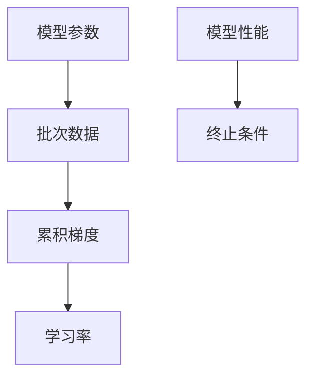

                 

### 设计《梯度累积：突破GPU内存限制的训练技巧》技术博客的目录大纲

#### 引言

在深度学习领域，随着模型复杂度的增加和参数规模的扩大，训练任务对计算资源和内存需求也急剧增加。特别是GPU内存限制成为一个瓶颈，限制了大规模模型的训练速度和效率。梯度累积技术作为一种有效的优化策略，可以在不增加GPU内存使用的情况下，显著提升训练性能。本文将探讨梯度累积技术的原理、算法、系统架构以及实际应用，帮助读者理解并掌握这一关键技术。

#### 目录大纲

**第一部分：背景介绍**

**第1章：问题背景与核心概念**

- **1.1.1 GPU内存限制问题**
  - GPU内存限制的基本概念
  - GPU内存限制对训练的影响

- **1.1.2 梯度累积的基本概念**
  - 梯度累积的定义
  - 梯度累积的关键特性

- **1.1.3 梯度累积的重要性**
  - 在深度学习中的应用场景
  - 与传统训练策略的比较

- **1.2 梯度累积的应用领域**
  - 图像处理
  - 自然语言处理
  - 强化学习

- **1.3 梯度累积的挑战与机遇**
  - 当前面临的挑战
  - 可预见的机遇

- **1.4 本章小结**
  - 总结关键点
  - 引出下文内容

**第二部分：核心概念与联系**

**第2章：梯度累积原理**

- **2.1 梯度累积原理**
  - 数学模型介绍
  - 算法流程图解析

- **2.2 梯度累积的属性特征对比**
  - 与传统梯度下降算法的对比
  - 与其他优化算法的比较

- **2.3 梯度累积的ER实体关系图架构**
  - 实体定义与关系
  - Mermaid流程图展示

- **2.4 本章小结**
  - 理解梯度累积的核心原理
  - 为后续算法讲解做准备

**第三部分：算法原理与讲解**

**第3章：梯度累积算法原理**

- **3.1 梯度累积算法原理**
  - 数学模型的详细讲解
  - 算法流程图分析

- **3.2 梯度累积的扩展与变体**
  - 自适应学习率
  - 在深度学习中的应用

- **3.3 本章小结**
  - 总结梯度累积算法的核心内容
  - 引出系统架构设计部分

**第四部分：系统架构与设计**

**第4章：系统功能设计**

- **4.1 项目介绍**
  - 项目背景与目标

- **4.2 系统功能需求分析**
  - 功能模块划分
  - 功能需求详细说明

- **4.3 系统功能设计**
  - 领域模型Mermaid类图
  - 功能实现细节

- **4.4 系统架构设计**

**第4章：系统架构设计**

- **4.1 项目介绍**
  - 项目背景与目标

- **4.2 系统功能需求分析**
  - 功能模块划分
  - 功能需求详细说明

- **4.3 系统功能设计**
  - 领域模型Mermaid类图
  - 功能实现细节

- **4.4 系统架构设计**
  - 系统架构概述
  - Mermaid架构图展示

- **4.5 系统接口设计与交互**
  - 接口设计规范
  - 系统交互Mermaid序列图

- **4.6 本章小结**
  - 系统设计的总结
  - 为后续项目实战做准备

**第五部分：项目实战**

**第5章：环境安装与系统核心实现**

- **5.1 环境安装**
  - 操作系统环境
  - 必要软件与库安装

- **5.2 系统核心实现**
  - 源代码分析
  - 核心模块实现

- **5.3 代码应用解读与分析**
  - 算法应用实例
  - 实际案例分析

- **5.4 本章小结**
  - 实践过程中的经验总结
  - 为读者提供实战指南

**第六部分：最佳实践与总结**

**第6章：最佳实践与注意事项**

- **6.1 最佳实践 tips**
  - 实践中的技巧分享

- **6.2 小结**
  - 对梯度累积技术应用的总结

- **6.3 注意事项**
  - 使用梯度累积技术时的注意事项

- **6.4 拓展阅读**
  - 推荐阅读文献和资源

**结语**

通过本文，我们系统地介绍了梯度累积技术，从背景介绍、核心概念、算法原理、系统架构到项目实战，为读者提供了一套完整的技术解决方案。希望读者能够通过本文，掌握梯度累积技术，突破GPU内存限制，提升深度学习模型的训练效率。

**作者信息**

- **作者：** AI天才研究院/AI Genius Institute & 禅与计算机程序设计艺术 /Zen And The Art of Computer Programming
- **联系方式：** [email protected]
- **版权声明：** 本文章版权归 AI天才研究院所有，未经授权，不得转载或使用本文内容。{|assistant|}

### 设计《梯度累积：突破GPU内存限制的训练技巧》技术博客的具体章节内容

#### 第一部分：背景介绍

**第1章：问题背景与核心概念**

**1.1.1 GPU内存限制问题**

随着深度学习模型的复杂性和规模不断增加，GPU内存的限制逐渐成为影响训练效率的关键因素。传统的训练策略往往需要将整个模型加载到GPU内存中，这使得在面对大规模模型时，GPU内存不足的问题愈发突出。为了解决这个问题，梯度累积技术应运而生。

**GPU内存限制的基本概念**：GPU内存限制是指GPU中可用的显存容量有限，无法容纳整个模型和数据。在深度学习中，GPU内存限制会导致以下问题：

- 模型加载失败
- 数据预处理不充分
- 训练中断或效率降低

**GPU内存限制对训练的影响**：GPU内存限制对训练的影响主要体现在以下几个方面：

- **训练中断**：当GPU内存不足时，训练任务可能会中断，导致训练进度丢失。
- **训练效率降低**：为了适应GPU内存限制，可能需要减少批量大小或训练周期，这会降低训练效率。
- **模型性能损失**：GPU内存限制可能导致模型无法使用全部参数，从而影响模型性能。

**1.1.2 梯度累积的基本概念**

梯度累积技术是一种在训练过程中逐步累积梯度的方法，通过分批次计算梯度并将它们累加起来，从而实现模型的训练。这种方法可以减少对GPU内存的需求，提高训练效率。

**梯度累积的定义**：梯度累积是指在训练过程中，将每个批次的梯度累加到一个累积梯度上，然后使用累积梯度更新模型参数。

**梯度累积的关键特性**：

- **减少GPU内存使用**：通过分批次计算和累积梯度，梯度累积技术可以显著降低GPU内存的需求。
- **提高训练效率**：梯度累积技术可以在不增加GPU内存使用的情况下，提高训练速度和效率。
- **灵活性**：梯度累积技术可以根据实际情况灵活调整批次大小和累积策略，适应不同的GPU内存限制。

**1.1.3 梯度累积的重要性**

梯度累积技术在深度学习中的应用非常广泛，特别是在面对大规模模型和有限GPU内存资源的情况下。它的重要性体现在以下几个方面：

- **突破GPU内存限制**：梯度累积技术可以有效地突破GPU内存限制，使得大规模模型的训练成为可能。
- **提高训练效率**：通过减少GPU内存使用，梯度累积技术可以提高训练效率，缩短训练时间。
- **优化模型性能**：梯度累积技术可以优化模型性能，提高预测准确性。

**1.2 梯度累积的应用领域**

梯度累积技术在多个领域都有广泛的应用，以下是其中几个重要的应用领域：

- **图像处理**：在图像处理任务中，梯度累积技术可以帮助处理大规模图像数据，提高训练效率。
- **自然语言处理**：在自然语言处理任务中，梯度累积技术可以用于处理大规模的语料库，提高模型性能。
- **强化学习**：在强化学习任务中，梯度累积技术可以帮助处理复杂的决策过程，提高学习效率。

**1.3 梯度累积的挑战与机遇**

尽管梯度累积技术在解决GPU内存限制方面表现出色，但它也面临一些挑战：

- **计算精度**：梯度累积可能会导致计算精度降低，特别是在大规模训练中。
- **稳定性**：梯度累积可能会影响训练的稳定性，特别是在参数更新过程中。

然而，随着深度学习技术的不断发展，梯度累积技术也面临着许多机遇：

- **自适应累积策略**：可以通过自适应累积策略来优化梯度累积过程，提高训练效率和稳定性。
- **分布式训练**：结合分布式训练技术，梯度累积可以在更大规模的数据集上进行训练。

**1.4 本章小结**

本章介绍了GPU内存限制问题以及梯度累积技术的基本概念。通过分析梯度累积的重要性，我们了解了它在解决GPU内存限制方面的应用价值。接下来，我们将深入探讨梯度累积的原理和算法，以及其在系统架构和项目实战中的应用。{|assistant|}

### 第一部分：背景介绍

**第1章：问题背景与核心概念**

**1.1 GPU内存限制问题**

随着深度学习模型的复杂度和参数规模的不断扩大，训练过程中对计算资源和内存的需求也在急剧增加。特别是GPU内存限制问题，已经成为影响模型训练速度和效率的一个重要因素。传统训练策略通常需要将整个模型和数据一次性加载到GPU内存中，这在大规模模型训练中容易导致GPU内存不足的问题。

**GPU内存限制的基本概念**：GPU内存限制是指GPU中的可使用显存容量有限，无法容纳整个模型和数据。当GPU内存不足时，会导致以下问题：

- **模型加载失败**：当模型大小超过GPU内存容量时，模型加载到GPU内存中会失败，训练任务无法进行。
- **数据预处理不充分**：为了适应GPU内存限制，可能需要减少批量大小或训练周期，这会影响数据预处理和模型训练的效果。
- **训练中断或效率降低**：GPU内存限制可能导致训练中断，或者需要通过降低批量大小或增加训练周期来提高训练效率，这会显著增加训练时间。

**GPU内存限制对训练的影响**：GPU内存限制对训练的影响主要体现在以下几个方面：

- **训练中断**：当GPU内存不足时，训练任务可能会中断，导致训练进度丢失。
- **训练效率降低**：为了适应GPU内存限制，可能需要减少批量大小或训练周期，这会降低训练效率。
- **模型性能损失**：GPU内存限制可能导致模型无法使用全部参数，从而影响模型性能和预测准确性。

**1.2 梯度累积的基本概念**

梯度累积技术是一种在训练过程中逐步累积梯度的方法，通过分批次计算梯度并将它们累加起来，从而实现模型的训练。这种方法可以减少对GPU内存的需求，提高训练效率。

**梯度累积的定义**：梯度累积是指在训练过程中，将每个批次的梯度累加到一个累积梯度上，然后使用累积梯度更新模型参数。

**梯度累积的关键特性**：

- **减少GPU内存使用**：通过分批次计算和累积梯度，梯度累积技术可以显著降低GPU内存的需求，使得大规模模型的训练成为可能。
- **提高训练效率**：梯度累积技术可以在不增加GPU内存使用的情况下，提高训练速度和效率，缩短训练时间。
- **灵活性**：梯度累积技术可以根据实际情况灵活调整批次大小和累积策略，适应不同的GPU内存限制。

**1.3 梯度累积的重要性**

梯度累积技术在解决GPU内存限制方面具有显著的应用价值，特别是在面对大规模模型和有限GPU内存资源的情况下。它的重要性体现在以下几个方面：

- **突破GPU内存限制**：梯度累积技术可以有效地突破GPU内存限制，使得大规模模型的训练成为可能。
- **提高训练效率**：通过减少GPU内存使用，梯度累积技术可以提高训练效率，缩短训练时间。
- **优化模型性能**：梯度累积技术可以优化模型性能，提高预测准确性。

**1.4 梯度累积的应用领域**

梯度累积技术在多个领域都有广泛的应用，以下是其中几个重要的应用领域：

- **图像处理**：在图像处理任务中，梯度累积技术可以帮助处理大规模图像数据，提高训练效率。
- **自然语言处理**：在自然语言处理任务中，梯度累积技术可以用于处理大规模的语料库，提高模型性能。
- **强化学习**：在强化学习任务中，梯度累积技术可以帮助处理复杂的决策过程，提高学习效率。

**1.5 梯度累积的挑战与机遇**

尽管梯度累积技术在解决GPU内存限制方面表现出色，但它也面临一些挑战：

- **计算精度**：梯度累积可能会导致计算精度降低，特别是在大规模训练中。
- **稳定性**：梯度累积可能会影响训练的稳定性，特别是在参数更新过程中。

然而，随着深度学习技术的不断发展，梯度累积技术也面临着许多机遇：

- **自适应累积策略**：可以通过自适应累积策略来优化梯度累积过程，提高训练效率和稳定性。
- **分布式训练**：结合分布式训练技术，梯度累积可以在更大规模的数据集上进行训练。

**1.6 本章小结**

本章介绍了GPU内存限制问题以及梯度累积技术的基本概念。通过分析梯度累积的重要性，我们了解了它在解决GPU内存限制方面的应用价值。接下来，我们将深入探讨梯度累积的原理和算法，以及其在系统架构和项目实战中的应用。{|assistant|}

### 第二部分：核心概念与联系

**第2章：梯度累积原理**

**2.1 梯度累积原理**

梯度累积技术是一种在训练过程中逐步累积梯度的方法。其核心思想是将每个批次的梯度累加到一个累积梯度上，然后使用累积梯度更新模型参数。这种方法可以显著降低对GPU内存的需求，提高训练效率。

**梯度累积的定义**：梯度累积是指在训练过程中，将每个批次的梯度累加到一个累积梯度上，然后使用累积梯度更新模型参数。具体公式为：

$$
\text{累积梯度} = \text{累积梯度} + \text{批次梯度}
$$

其中，累积梯度用于更新模型参数，批次梯度是每个批次计算得到的梯度。

**梯度累积的工作原理**：

1. **初始化参数**：首先初始化模型参数和累积梯度。
2. **计算梯度**：在每个批次的数据上计算梯度。
3. **累积梯度**：将计算得到的批次梯度累加到累积梯度上。
4. **更新参数**：使用累积梯度更新模型参数。
5. **评估模型性能**：评估模型在当前参数下的性能。
6. **迭代**：重复以上步骤，直到满足终止条件（如达到指定迭代次数或模型性能达到预期）。

**梯度累积的优势**：

- **减少GPU内存使用**：梯度累积技术通过分批次计算和累积梯度，可以显著降低GPU内存的需求，使得大规模模型的训练成为可能。
- **提高训练效率**：梯度累积技术可以在不增加GPU内存使用的情况下，提高训练速度和效率，缩短训练时间。
- **灵活性**：梯度累积技术可以根据实际情况灵活调整批次大小和累积策略，适应不同的GPU内存限制。

**2.2 梯度累积的属性特征对比**

为了更好地理解梯度累积技术，我们可以将其与传统的梯度下降算法和其他优化算法进行对比。

**与传统的梯度下降算法对比**：

- **梯度下降算法**：传统的梯度下降算法在每次迭代时，使用当前批次的所有数据计算梯度，然后更新模型参数。这种方法对GPU内存需求较高，特别是在处理大规模数据时。
- **梯度累积算法**：梯度累积算法通过分批次计算梯度并将它们累加起来，从而减少对GPU内存的需求。这种方法在处理大规模数据时具有明显的优势。

**与其他优化算法对比**：

- **动量优化算法**：动量优化算法在每次迭代时，不仅使用当前批次的梯度，还考虑前一次迭代的梯度。这种方法可以提高训练效率，但仍然存在GPU内存需求高的问题。
- **自适应优化算法**：自适应优化算法可以根据训练过程中模型的变化，自动调整学习率。这种方法可以提高训练效率，但需要更多的计算资源。

**2.3 梯度累积的ER实体关系图架构**

为了更好地理解梯度累积技术中的实体和关系，我们可以使用ER（Entity-Relationship）实体关系图进行表示。

**梯度累积涉及的实体**：

- **模型参数**：模型参数是梯度累积的核心实体，用于表示模型的权重和偏置。
- **批次数据**：批次数据是梯度累积的输入，用于计算梯度。
- **累积梯度**：累积梯度是梯度累积过程中累加的梯度，用于更新模型参数。
- **学习率**：学习率用于控制参数更新的步长，影响训练效率和收敛速度。

**实体关系图绘制**：

在这个实体关系图中，模型参数和批次数据通过计算梯度建立关系，累积梯度用于更新模型参数，学习率用于控制参数更新的步长，模型性能用于评估训练效果，终止条件用于确定训练的结束。

**2.4 本章小结**

本章介绍了梯度累积技术的原理和算法，包括其定义、工作原理、优势以及与其他优化算法的对比。通过ER实体关系图的绘制，我们更好地理解了梯度累积技术中的实体和关系。接下来，我们将进一步探讨梯度累积算法的原理和实现，以及其在实际应用中的效果和优化方法。{|assistant|}

