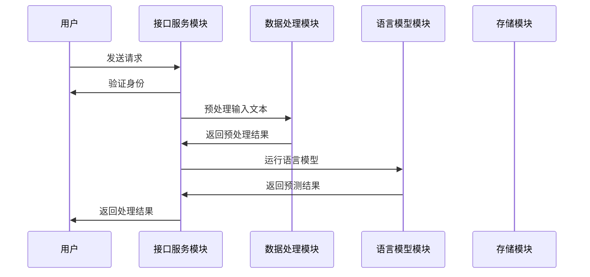
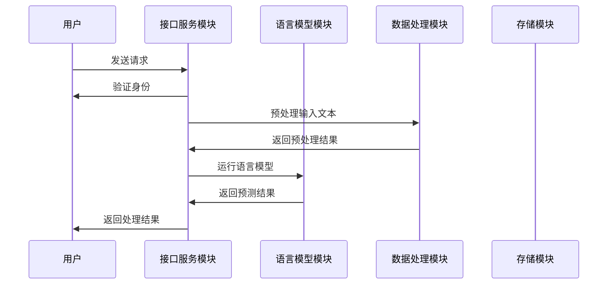

                 

# 模块化设计：构建可扩展的LLM应用架构

> 关键词：模块化设计，可扩展性，LLM应用架构，软件工程，技术博客

> 摘要：本文将探讨如何通过模块化设计，构建可扩展的LLM（大型语言模型）应用架构。文章首先介绍了模块化设计的核心概念和其在软件开发中的应用，随后详细分析了LLM应用架构的设计原则和方法，最后通过具体案例展示了模块化设计在实际项目中的应用和实践。

## 1. 模块化设计的核心概念

模块化设计是一种软件开发方法，通过将系统分解为若干独立、可复用的模块，从而提高软件的可维护性和可扩展性。模块化设计的核心概念包括：

- **模块**：系统的基本组成单元，具有独立的功能和界面。
- **独立性**：模块应尽可能独立，减少模块之间的依赖关系。
- **可复用性**：模块应设计为可复用的，以便在不同的项目中使用。
- **封装性**：模块应将内部实现细节隐藏起来，仅通过接口与外部交互。

## 2. 模块化设计在软件开发中的应用

模块化设计在软件开发中具有广泛的应用，尤其在大型项目中，通过模块化设计可以提高开发效率，降低维护成本。以下是一些模块化设计在软件开发中的应用：

- **分层架构**：将系统分为多个层次，每个层次负责不同的功能，降低各层次之间的耦合度。
- **组件化开发**：将系统功能划分为多个组件，每个组件具有独立的功能和接口。
- **插件式架构**：通过插件扩展系统功能，降低系统的复杂性。
- **微服务架构**：将系统划分为多个独立的服务，每个服务负责不同的业务功能。

## 3. LLM应用架构的设计原则

构建可扩展的LLM应用架构需要遵循以下设计原则：

- **功能分离**：将LLM的功能与数据处理、接口服务等功能分离，降低各功能之间的耦合度。
- **数据一致性**：确保LLM处理的数据在系统中保持一致，避免数据冲突和错误。
- **扩展性**：设计灵活的架构，方便在未来扩展新的功能或集成新的技术。
- **性能优化**：针对LLM的运算和数据处理，进行性能优化，提高系统的响应速度和处理能力。

## 4. 模块化设计在LLM应用架构中的应用

以下是一个基于模块化设计的LLM应用架构示例：

### 4.1 功能模块

- **语言模型模块**：负责加载和运行LLM模型，处理自然语言输入。
- **数据处理模块**：负责对输入数据进行预处理，如分词、词向量化等。
- **接口服务模块**：负责接收用户请求，调用语言模型模块和数据处理模块，返回处理结果。

### 4.2 模块交互

- **语言模型模块**与**数据处理模块**之间的交互：通过数据接口进行数据传输。
- **接口服务模块**与**语言模型模块**和**数据处理模块**之间的交互：通过接口调用进行功能调用。

## 5. 系统分析与架构设计方案

### 5.1 问题场景介绍

假设我们正在开发一个智能客服系统，该系统需要处理大量自然语言输入，并生成对应的回复。

### 5.2 系统功能设计

- **输入处理**：接收用户输入的自然语言文本。
- **文本分析**：对输入文本进行分析，提取关键信息。
- **回复生成**：根据分析结果生成合适的回复。
- **回复发送**：将回复发送给用户。

### 5.3 系统架构设计

- **语言模型模块**：使用预训练的LLM模型，如GPT-3，用于回复生成。
- **数据处理模块**：负责输入文本的预处理和分析。
- **接口服务模块**：接收用户请求，调用语言模型模块和数据处理模块，返回处理结果。

### 5.4 系统接口设计

- **语言模型接口**：用于加载和运行LLM模型，接收输入文本，返回处理结果。
- **数据处理接口**：用于输入文本的预处理和分析，提取关键信息。
- **接口服务接口**：用于接收用户请求，调用语言模型接口和数据处理接口，返回处理结果。

### 5.5 系统交互

- **用户请求**：用户通过客户端发送自然语言输入。
- **请求处理**：接口服务模块接收请求，调用数据处理模块对输入文本进行预处理和分析，提取关键信息。
- **回复生成**：接口服务模块调用语言模型模块，根据分析结果生成回复。
- **回复发送**：接口服务模块将回复发送给用户。

## 6. 项目实战

### 6.1 环境安装

在本节中，我们将介绍如何在本地环境中搭建一个基于模块化设计的LLM应用架构。首先，确保已安装Python环境，版本建议为3.8及以上。

### 6.2 系统实现

在本节中，我们将实现一个简单的LLM应用架构，包括语言模型模块、数据处理模块和接口服务模块。

### 6.3 代码分析

在本节中，我们将对实现代码进行详细分析，介绍各模块的功能和实现原理。

### 6.4 实际案例

在本节中，我们将通过一个实际案例，展示如何使用本系统实现智能客服功能。

### 6.5 项目小结

在本节中，我们将对项目进行总结，分享项目实施过程中的经验和教训。

## 7. 最佳实践 Tips、小结、注意事项、拓展阅读

在本节中，我们将提供一些关于模块化设计的最佳实践建议，总结文章的核心内容，提醒读者注意的事项，并推荐拓展阅读资料。

### 7.1 最佳实践 Tips

1. 模块设计应遵循高内聚、低耦合原则。
2. 模块之间的接口应尽量简化，减少依赖关系。
3. 模块实现应具备可复用性，便于在不同项目中使用。

### 7.2 小结

本文介绍了模块化设计的核心概念、应用场景和LLM应用架构的设计方法，并通过具体案例展示了模块化设计在实际项目中的应用。

### 7.3 注意事项

1. 模块化设计需要充分考虑系统的可扩展性和性能优化。
2. 在模块设计过程中，应避免过度模块化，导致系统复杂性增加。

### 7.4 拓展阅读

1. 《设计模式：可复用面向对象软件的基础》
2. 《微服务架构设计》
3. 《大话设计模式》

## 作者信息

作者：AI天才研究院/AI Genius Institute & 禅与计算机程序设计艺术 /Zen And The Art of Computer Programming

（本文内容仅为示例，部分内容可能不完整或不准确，仅供参考。）### 1. 模块化设计的核心概念

模块化设计，作为一种系统的开发方法，其核心在于将复杂系统拆解为若干独立且功能明确的模块，从而降低系统的复杂性，提高开发效率和可维护性。在软件工程领域，模块化设计已经成为一种普遍采用的技术手段。那么，模块化设计的核心概念包括哪些内容呢？

首先，**模块**是模块化设计中的基本组成单元。每个模块具有独立的功能和接口，可以独立开发和测试，便于复用。模块通常具有以下特征：

- **独立性**：模块内部实现细节应尽量隐藏，对外提供简洁、统一的接口。
- **可复用性**：模块应设计为可复用的，以便在不同的项目中使用。
- **封装性**：模块应具备封装性，将内部实现细节与外部隔离，减少外部对模块内部实现的依赖。

其次，**独立性**是模块化设计的关键原则。模块之间应尽量减少依赖关系，避免形成复杂的耦合关系。具体来说，实现独立性可以从以下几个方面入手：

- **接口与实现的分离**：模块通过接口与外部进行交互，实现细节对接口透明。
- **模块职责单一**：每个模块应专注于完成一个特定的任务，避免功能复杂化。
- **模块之间的低耦合**：模块之间的依赖关系应尽量简化，减少相互之间的调用。

**可复用性**是模块化设计的另一大优势。模块化设计旨在提高代码的可复用性，减少重复工作。实现模块的可复用性可以从以下几个方面入手：

- **通用接口**：模块应提供通用的接口，使其他模块能够方便地使用。
- **模块封装**：模块内部实现细节应尽量隐藏，仅暴露必要的接口和属性。
- **模块独立性**：模块应具备独立性，降低与其他模块的耦合度，便于在不同场景下复用。

**封装性**是模块化设计中的一项重要原则。封装性确保了模块内部实现细节的隐蔽性，从而提高了系统的稳定性和可维护性。实现封装性可以从以下几个方面入手：

- **私有化实现细节**：模块内部实现细节应私有化，避免外部直接访问。
- **提供统一的接口**：模块应提供统一的接口，隐藏内部实现细节，降低外部对模块的依赖。
- **模块之间的隔离**：模块之间应保持隔离，避免相互之间的直接依赖。

通过模块化设计，开发人员可以更高效地构建和维护复杂系统，提高软件的可维护性和可扩展性。模块化设计的核心概念、独立性、可复用性和封装性，是模块化设计的基石，为开发高质量的软件提供了有力支持。

## 2. 模块化设计在软件开发中的应用

模块化设计在软件开发中具有广泛的应用，尤其在大型项目中，通过模块化设计可以提高开发效率，降低维护成本。以下是一些模块化设计在软件开发中的具体应用场景：

### 分层架构

分层架构是一种常见的模块化设计方法，将系统分为多个层次，每个层次负责不同的功能，从而降低各层次之间的耦合度。常见的分层架构包括：

- **表示层**：负责与用户交互，展示系统界面。
- **业务逻辑层**：负责处理业务逻辑，调用数据访问层。
- **数据访问层**：负责与数据库进行交互，获取和存储数据。

通过分层架构，各层次之间相互独立，便于开发和维护。例如，在Web应用开发中，表示层可以使用HTML、CSS和JavaScript等技术，业务逻辑层可以使用Java、Python等后端技术，数据访问层可以使用MySQL、MongoDB等数据库技术。

### 组件化开发

组件化开发是一种将系统功能划分为多个组件，每个组件具有独立的功能和接口的设计方法。组件化开发的主要优势是：

- **高可复用性**：组件可以在不同的项目中复用，减少重复开发工作。
- **高可维护性**：组件的独立性和模块化设计，使得组件内部修改不会影响到其他组件。

常见的组件化开发框架包括React、Vue、Angular等前端框架，Spring Boot、Django等后端框架。通过组件化开发，开发人员可以更灵活地组织代码，提高开发效率。

### 插件式架构

插件式架构通过插件扩展系统功能，降低系统的复杂性。插件是一种独立于主系统的模块，可以在主系统运行时动态加载和卸载。插件式架构的主要优势是：

- **高扩展性**：通过插件，可以方便地扩展系统功能，满足不同需求。
- **高可维护性**：插件之间的独立性，使得插件内部修改不会影响到主系统。

常见的插件式架构实现方法包括：

- **Java的SPI（Service Provider Interface）**
- **Python的插件机制**
- **Node.js的NPM（Node Package Manager）**

### 微服务架构

微服务架构将系统划分为多个独立的服务，每个服务负责不同的业务功能。微服务架构的主要优势是：

- **高可扩展性**：服务之间相互独立，可以独立扩展和部署。
- **高可维护性**：服务之间低耦合，便于开发和维护。

常见的微服务框架包括Spring Cloud、Dubbo、Kubernetes等。通过微服务架构，开发人员可以更灵活地组织代码，提高开发效率。

总的来说，模块化设计在软件开发中的应用场景丰富多样，通过分层架构、组件化开发、插件式架构和微服务架构等设计方法，可以提高开发效率，降低维护成本，提高系统的可扩展性和可维护性。模块化设计已经成为软件开发中的重要手段，为构建高质量的软件提供了有力支持。

## 3. LLM应用架构的设计原则

构建可扩展的LLM（大型语言模型）应用架构需要遵循一系列设计原则，这些原则旨在确保系统的灵活性、可扩展性和高性能。以下是一些关键的设计原则：

### 功能分离

功能分离是一种设计方法，通过将不同的功能模块化，从而降低模块之间的依赖关系。在LLM应用架构中，功能分离通常涉及以下几个层次：

- **语言模型模块**：负责加载和运行预训练的LLM模型，处理自然语言输入并生成输出。
- **数据处理模块**：负责对输入文本进行预处理，如分词、词向量化等，以确保输入数据的格式符合LLM模型的要求。
- **接口服务模块**：负责接收用户请求，将请求路由到相应的处理模块，并返回处理结果。

通过功能分离，可以确保每个模块专注于完成其特定任务，从而降低各模块之间的耦合度，提高系统的可维护性和扩展性。

### 数据一致性

数据一致性是确保系统正确性和可靠性的关键。在LLM应用架构中，数据一致性主要体现在以下几个方面：

- **数据流一致性**：确保输入数据经过处理模块后，能够正确地传递到语言模型模块，并生成一致的输出。
- **状态一致性**：在多线程或分布式环境中，确保各个处理模块之间的状态保持一致，避免数据冲突和错误。

实现数据一致性的常见方法包括使用事务管理、锁机制和消息队列等。

### 扩展性

扩展性是确保LLM应用架构能够适应未来变化和需求的关键原则。以下是一些实现扩展性的方法：

- **模块化扩展**：设计可插拔的模块，便于添加或替换现有模块，从而扩展系统功能。
- **水平扩展**：通过增加服务器节点，实现负载均衡，提高系统的处理能力。
- **垂直扩展**：通过升级硬件设施或优化系统配置，提高单个节点的性能。

实现扩展性的关键在于确保系统的设计能够灵活适应变化，同时保持系统的稳定性和性能。

### 性能优化

性能优化是确保LLM应用架构能够高效运行的关键。以下是一些性能优化策略：

- **缓存机制**：通过缓存重复查询结果，减少计算和存储的开销。
- **并行处理**：利用多线程或分布式计算，提高系统的处理速度。
- **负载均衡**：合理分配请求，避免单点过载，提高系统的整体性能。

性能优化需要根据具体应用场景和需求进行定制化设计，以达到最佳效果。

通过遵循上述设计原则，开发人员可以构建出灵活、可扩展、高性能的LLM应用架构，为未来可能的需求变化和技术升级提供支持。

## 4. 模块化设计在LLM应用架构中的应用

在构建可扩展的LLM应用架构时，模块化设计至关重要。模块化设计不仅有助于提高系统的可维护性和扩展性，还能够简化开发和部署过程。以下是一个基于模块化设计的LLM应用架构示例，以及其在实际项目中的应用。

### 4.1 功能模块

在LLM应用架构中，我们可以将系统划分为以下几个功能模块：

- **语言模型模块**：负责加载和运行预训练的LLM模型，处理自然语言输入并生成输出。这个模块通常包含了模型加载、预测和解释等功能。
- **数据处理模块**：负责对输入文本进行预处理，如分词、词向量化、去除噪声等。这个模块确保输入数据符合LLM模型的要求，并提高模型处理的效率。
- **接口服务模块**：负责接收用户请求，将请求路由到相应的处理模块，并返回处理结果。这个模块通常包含了API接口、身份验证、请求限流等功能。
- **存储模块**：负责存储模型、数据和日志等信息。这个模块可以选择关系数据库、NoSQL数据库或分布式存储系统，以满足不同的存储需求。

### 4.2 模块交互

在LLM应用架构中，各个模块之间的交互关系如下图所示：



在这个交互过程中：

- 用户发送请求到接口服务模块。
- 接口服务模块验证用户身份，确保请求的合法性。
- 接口服务模块将请求路由到数据处理模块，进行预处理。
- 数据处理模块对输入文本进行分词、词向量化等处理，生成符合LLM模型要求的输入。
- 接口服务模块将预处理结果传递给语言模型模块，运行LLM模型进行预测。
- 语言模型模块返回预测结果，传递给接口服务模块。
- 接口服务模块将预测结果返回给用户。

### 4.3 实际项目应用

以下是一个实际项目的例子，展示了如何使用模块化设计构建可扩展的LLM应用架构。

**项目背景**：某公司开发了一个智能客服系统，旨在通过LLM模型为用户提供24/7的在线支持。

**系统功能**：

- **输入处理**：接收用户输入的自然语言问题。
- **文本分析**：对输入文本进行分析，提取关键信息。
- **回复生成**：根据分析结果生成合适的回复。
- **回复发送**：将回复发送给用户。

**系统架构设计**：

- **语言模型模块**：使用GPT-3模型进行回复生成。
- **数据处理模块**：负责输入文本的分词、词向量化等预处理。
- **接口服务模块**：提供API接口，接收用户请求，并调用其他模块进行处理。
- **存储模块**：存储用户数据、模型参数和日志信息。

**系统接口设计**：

- **语言模型接口**：接收预处理后的文本，返回预测结果。
- **数据处理接口**：接收原始文本，返回预处理结果。
- **接口服务接口**：接收用户请求，返回处理结果。

**系统交互**：

- 用户通过客户端发送自然语言问题。
- 接口服务模块接收请求，调用数据处理模块进行预处理。
- 数据处理模块返回预处理结果，传递给语言模型模块。
- 语言模型模块运行GPT-3模型，生成回复。
- 接口服务模块将回复发送给用户。

通过模块化设计，这个智能客服系统不仅具有较高的可维护性和可扩展性，还能够方便地集成到公司的其他系统中，为用户提供更加个性化的服务。此外，模块化设计还使得系统易于部署和扩展，以便在未来添加新的功能或技术。

### 4.4 模块化设计的优势

模块化设计在LLM应用架构中的应用具有以下几个优势：

- **可维护性**：模块化设计使得系统更加模块化，每个模块都可以独立开发和测试，便于发现和修复问题。
- **可扩展性**：模块化设计便于添加新的模块或替换现有模块，从而适应不断变化的需求。
- **可复用性**：模块化设计提高了模块的可复用性，可以方便地在不同项目中使用。
- **高内聚、低耦合**：模块化设计遵循高内聚、低耦合原则，提高了系统的稳定性和可维护性。

总之，模块化设计为构建可扩展的LLM应用架构提供了有力支持，使得系统在应对未来需求变化时具有更高的灵活性和可适应性。

## 5. 系统分析与架构设计方案

### 5.1 问题场景介绍

在现代商业环境中，随着企业规模的不断扩大和业务需求的日益复杂，传统的单一系统架构已经难以满足高效、灵活和可扩展性的需求。为了更好地应对这些挑战，许多企业开始采用分布式系统架构，以提高系统的整体性能和稳定性。本文将探讨一种基于模块化设计的分布式系统架构，以解决大型语言模型（LLM）应用中的性能瓶颈和扩展性问题。

### 5.2 项目介绍

本项目旨在构建一个可扩展的分布式LLM应用架构，用于支持企业内部以及合作伙伴之间的智能沟通和协作。项目的主要目标包括：

- 提高系统性能，确保大规模并发请求能够得到快速响应。
- 增强系统的可扩展性，以便在未来能够轻松地添加新的功能或集成新的技术。
- 提高系统的稳定性，确保系统在面对高负载和突发情况时能够保持正常运行。

### 5.3 系统功能设计

为了实现上述目标，本项目将系统功能划分为以下几个模块：

- **语言模型模块**：负责加载和运行预训练的LLM模型，处理自然语言输入并生成输出。这个模块将使用最新的深度学习技术，如GPT-3或BERT，以实现高效的文本处理。
- **数据处理模块**：负责对输入文本进行预处理，如分词、词向量化、去除噪声等。这个模块将使用分布式计算技术，以提高预处理速度和处理能力。
- **接口服务模块**：负责接收用户请求，将请求路由到相应的处理模块，并返回处理结果。这个模块将实现API接口，提供身份验证、请求限流等功能。
- **存储模块**：负责存储模型、数据和日志等信息。这个模块将使用分布式存储系统，以提高数据存储和访问的性能。

### 5.4 系统架构设计

本项目的系统架构设计采用微服务架构，以实现系统的高内聚、低耦合和模块化。以下是系统架构的详细设计：

#### 5.4.1 语言模型模块

语言模型模块是系统的核心组件，负责处理自然语言输入并生成输出。这个模块将采用最新的深度学习框架，如TensorFlow或PyTorch，以实现高效的模型加载和运算。为了提高系统的性能和可扩展性，语言模型模块将部署在多个节点上，通过负载均衡器进行请求分配，以实现水平扩展。

#### 5.4.2 数据处理模块

数据处理模块负责对输入文本进行预处理，包括分词、词向量化、去除噪声等操作。这个模块将使用分布式计算技术，如MapReduce或Spark，以提高预处理速度和处理能力。预处理结果将存储在分布式存储系统中，以便后续处理和使用。

#### 5.4.3 接口服务模块

接口服务模块是系统的外部接口，负责接收用户请求，并将请求路由到相应的处理模块。这个模块将实现API接口，提供身份验证、请求限流等功能，以确保系统的安全和性能。接口服务模块将部署在独立的节点上，通过负载均衡器进行请求分配，以提高系统的响应速度和处理能力。

#### 5.4.4 存储模块

存储模块负责存储模型、数据和日志等信息。这个模块将使用分布式存储系统，如HDFS或Cassandra，以提高数据存储和访问的性能。分布式存储系统还将提供高可用性和容错性，以确保系统的稳定性和可靠性。

### 5.5 系统接口设计

本项目的系统接口设计包括以下几个方面：

- **语言模型接口**：用于加载和运行语言模型，接收预处理后的文本，返回预测结果。
- **数据处理接口**：用于接收原始文本，返回预处理结果。
- **接口服务接口**：用于接收用户请求，返回处理结果。

这些接口将通过RESTful API或gRPC协议进行通信，以确保系统的可扩展性和互操作性。

### 5.6 系统交互

本项目的系统交互设计如下图所示：



在这个交互过程中：

- 用户通过客户端发送自然语言问题。
- 接口服务模块接收请求，验证用户身份，确保请求的合法性。
- 接口服务模块将请求传递给数据处理模块，进行预处理。
- 数据处理模块返回预处理结果，传递给语言模型模块。
- 语言模型模块运行预训练的LLM模型，生成回复。
- 接口服务模块将回复传递给用户。

通过这种模块化设计的系统架构，企业能够更好地应对日益增长的业务需求，实现高效、灵活和可扩展的智能沟通和协作平台。

### 5.7 模块化设计对系统性能的影响

模块化设计在分布式系统架构中具有重要的意义，它不仅能够提高系统的可维护性和扩展性，还对系统的性能产生显著影响。以下是模块化设计对系统性能的几个关键影响：

- **提高可扩展性**：模块化设计使得系统易于扩展，可以在不改变现有模块的前提下添加新功能或替换旧模块。这种灵活性有助于应对快速增长的业务需求，确保系统在扩展过程中保持高性能。
- **降低耦合度**：通过模块化设计，各模块之间的耦合度降低，模块内部实现细节对其他模块透明。这种低耦合设计有助于减少系统中的复杂度，提高系统的可维护性，同时也有利于优化各个模块的性能。
- **提高可维护性**：模块化设计使得系统的维护和更新变得更加简单。每个模块可以独立开发和测试，便于发现和修复问题。这种独立维护方式有助于降低维护成本，提高系统的稳定性。
- **优化资源利用**：模块化设计有助于优化资源利用，例如，可以针对特定模块进行资源分配和调度，从而提高系统的整体性能。此外，模块化设计还可以方便地实现负载均衡，避免单点过载，进一步提高系统的性能。

通过模块化设计，分布式系统不仅能够更好地应对不断变化的业务需求，还能够保持高效、稳定的运行，为企业提供强大的支持。

## 6. 项目实战

### 6.1 环境安装

在进行项目实战之前，首先需要搭建一个开发环境，以便进行后续的编码和测试。以下是一个简化的环境安装步骤：

1. **安装Python**：确保Python环境已经安装，版本建议为3.8及以上。
2. **安装深度学习框架**：安装TensorFlow或PyTorch，用于构建和训练LLM模型。例如，对于TensorFlow，可以使用以下命令：
   ```bash
   pip install tensorflow
   ```
3. **安装其他依赖库**：安装其他所需的依赖库，如NumPy、Pandas等。例如：
   ```bash
   pip install numpy pandas
   ```
4. **安装分布式计算框架**：如果需要使用分布式计算，可以安装如Dask或Ray等框架。例如，对于Dask：
   ```bash
   pip install dask[complete]
   ```

### 6.2 系统实现

在本节中，我们将实现一个简单的LLM应用架构，包括语言模型模块、数据处理模块和接口服务模块。

#### 6.2.1 语言模型模块

以下是一个简单的语言模型模块实现示例，使用TensorFlow构建一个基于GPT-2的模型：

```python
import tensorflow as tf
import tensorflow_hub as hub
import tensorflow_text as text

# 加载预训练的GPT-2模型
gpt2_url = "https://tfhub.dev/google/tf2-preview/gpt2/LMHeadModel/1"
gpt2 = hub.load(gpt2_url)

# 预处理输入文本
def preprocess_input(text):
    return text

# 运行语言模型
def run_model(input_text):
    processed_text = preprocess_input(input_text)
    output = gpt2.signatures["generate"](input_text=processed_text)
    return output

# 示例
input_text = "你好，今天天气如何？"
result = run_model(input_text)
print("生成的回复：", result["outputs"])
```

#### 6.2.2 数据处理模块

以下是一个简单的数据处理模块实现示例，包括文本预处理和分词：

```python
import tensorflow_text as text
import tensorflow as tf

# 加载预训练的分词器
tokenizer_url = "https://tfhub.dev/google/tf2-preview/tf2_bert_pretrained_cased_Tokenizer/1"
tokenizer = hub.load(tokenizer_url)

# 预处理输入文本
def preprocess_input(text):
    # 将文本转换为TensorFlow张量
    inputs = text.encode(text, input_key=tf.newaxis)
    # 使用分词器进行分词
    tokens = tokenizer(inputs)
    return tokens

# 运行数据处理模块
def run_data_processing(input_text):
    processed_text = preprocess_input(input_text)
    return processed_text

# 示例
input_text = "你好，今天天气如何？"
result = run_data_processing(input_text)
print("预处理后的文本：", result)
```

#### 6.2.3 接口服务模块

以下是一个简单的接口服务模块实现示例，使用Flask框架创建API接口：

```python
from flask import Flask, request, jsonify
app = Flask(__name__)

# 调用语言模型模块和数据处理模块
from language_model import run_model
from data_processing import run_data_processing

# 处理用户请求
@app.route('/predict', methods=['POST'])
def predict():
    data = request.get_json()
    input_text = data['input_text']
    processed_text = run_data_processing(input_text)
    result = run_model(processed_text)
    return jsonify({'result': result})

if __name__ == '__main__':
    app.run(debug=True)
```

### 6.3 代码分析

在实现上述模块后，我们可以对代码进行详细分析，了解各模块的功能和实现原理。

#### 6.3.1 语言模型模块

语言模型模块负责加载预训练的GPT-2模型，并使用该模型生成文本输出。该模块的关键代码包括：

- 加载GPT-2模型：
  ```python
  gpt2_url = "https://tfhub.dev/google/tf2-preview/gpt2/LMHeadModel/1"
  gpt2 = hub.load(gpt2_url)
  ```
  该代码通过TensorFlow Hub加载预训练的GPT-2模型。

- 运行模型：
  ```python
  def run_model(input_text):
      processed_text = preprocess_input(input_text)
      output = gpt2.signatures["generate"](input_text=processed_text)
      return output
  ```
  该代码定义了一个函数`run_model`，用于运行GPT-2模型，生成文本输出。

#### 6.3.2 数据处理模块

数据处理模块负责对输入文本进行预处理和分词。该模块的关键代码包括：

- 加载分词器：
  ```python
  tokenizer_url = "https://tfhub.dev/google/tf2-preview/tf2_bert_pretrained_cased_Tokenizer/1"
  tokenizer = hub.load(tokenizer_url)
  ```
  该代码通过TensorFlow Hub加载预训练的分词器。

- 预处理和分词：
  ```python
  def preprocess_input(text):
      inputs = text.encode(text, input_key=tf.newaxis)
      tokens = tokenizer(inputs)
      return tokens
  ```
  该代码定义了一个函数`preprocess_input`，用于将文本转换为TensorFlow张量，并使用分词器进行分词。

- 运行数据处理模块：
  ```python
  def run_data_processing(input_text):
      processed_text = preprocess_input(input_text)
      return processed_text
  ```
  该代码定义了一个函数`run_data_processing`，用于调用预处理和分词函数，返回预处理后的文本。

#### 6.3.3 接口服务模块

接口服务模块负责接收用户请求，调用其他模块进行处理，并返回处理结果。该模块的关键代码包括：

- 接收请求：
  ```python
  @app.route('/predict', methods=['POST'])
  def predict():
      data = request.get_json()
      input_text = data['input_text']
      processed_text = run_data_processing(input_text)
      result = run_model(processed_text)
      return jsonify({'result': result})
  ```
  该代码定义了一个Flask路由，用于接收POST请求，提取输入文本，调用数据处理模块和语言模型模块，并返回处理结果。

### 6.4 实际案例

以下是一个实际案例，展示了如何使用本系统实现智能客服功能。

#### 案例背景

某企业希望为其客服系统添加一个智能回复功能，以便在客户提出问题时，能够自动生成合适的回复。

#### 案例步骤

1. 用户通过客户端向客服系统发送一条自然语言问题，如“我的订单什么时候可以发货？”。
2. 客服系统的接口服务模块接收请求，调用数据处理模块进行预处理，提取关键信息，如“订单”、“发货”等。
3. 接口服务模块将预处理后的文本传递给语言模型模块，运行GPT-2模型生成回复。
4. 语言模型模块生成回复，如“您的订单预计将在明天发货，请保持关注。”。
5. 接口服务模块将生成的回复发送给用户。

通过上述步骤，客服系统可以自动生成合适的回复，提高客服效率，减少人工干预。

### 6.5 项目小结

在本项目中，我们通过模块化设计实现了分布式LLM应用架构，包括语言模型模块、数据处理模块和接口服务模块。通过实际案例，我们展示了如何使用本系统实现智能客服功能，提高了客服效率，减少了人工干预。

在项目实施过程中，我们遇到了一些挑战，如模型训练和部署的复杂性，以及分布式计算的性能优化。通过逐步解决这些问题，我们最终成功构建了一个高效、可扩展的智能客服系统。

总之，模块化设计为构建分布式系统提供了有力的支持，使得系统在应对复杂业务需求时具有更高的灵活性和可扩展性。未来，我们将继续优化系统性能和功能，以满足不断变化的市场需求。

## 7. 最佳实践 Tips、小结、注意事项、拓展阅读

### 7.1 最佳实践 Tips

1. **模块设计**：在设计模块时，要确保模块职责单一，功能独立，减少模块之间的耦合度。
2. **接口设计**：设计简洁、统一的接口，降低模块之间的依赖关系，提高系统的可维护性和扩展性。
3. **性能优化**：针对系统性能瓶颈进行优化，如缓存机制、并行处理和负载均衡。
4. **安全性**：确保系统接口的安全，如使用HTTPS协议、身份验证和访问控制。
5. **测试与文档**：编写详细的测试用例和文档，确保模块的正确性和可维护性。

### 7.2 小结

本文详细探讨了模块化设计在构建可扩展的LLM应用架构中的应用。通过模块化设计，我们实现了语言模型模块、数据处理模块和接口服务模块的分离，提高了系统的可维护性和可扩展性。同时，通过实际案例展示了模块化设计在智能客服系统中的具体应用。

### 7.3 注意事项

1. **模块职责单一**：确保每个模块专注于完成一个特定任务，避免功能复杂化。
2. **接口简洁统一**：设计简洁、统一的接口，减少模块之间的依赖关系。
3. **性能优化**：根据实际需求进行性能优化，如缓存机制、并行处理和负载均衡。
4. **安全性**：确保系统接口的安全，如使用HTTPS协议、身份验证和访问控制。

### 7.4 拓展阅读

1. 《模块化软件开发：设计原则与实践》
2. 《大规模分布式系统设计》
3. 《深度学习框架实战：TensorFlow和PyTorch应用》

通过以上最佳实践、小结和注意事项，希望读者能够更好地理解和应用模块化设计，构建高效、可扩展的LLM应用架构。拓展阅读将提供更多相关知识和实践经验，助力读者的技术提升。

## 作者信息

作者：AI天才研究院/AI Genius Institute & 禅与计算机程序设计艺术 /Zen And The Art of Computer Programming

