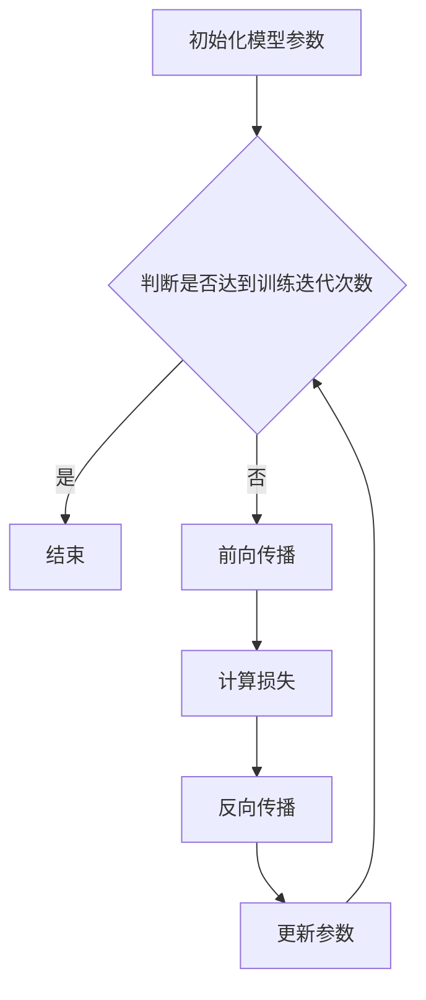
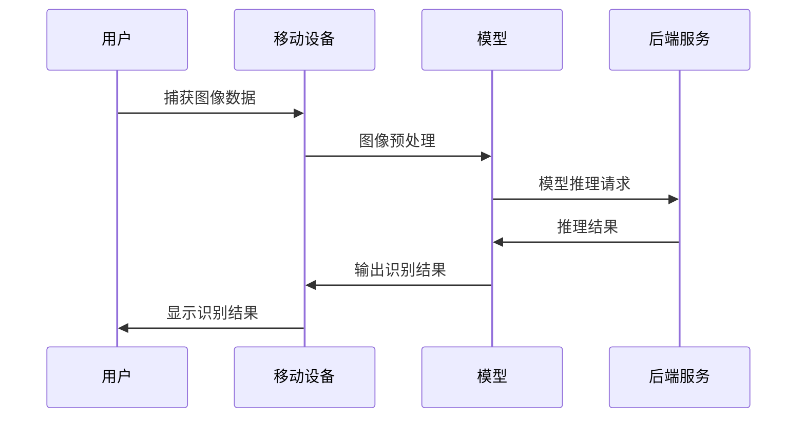
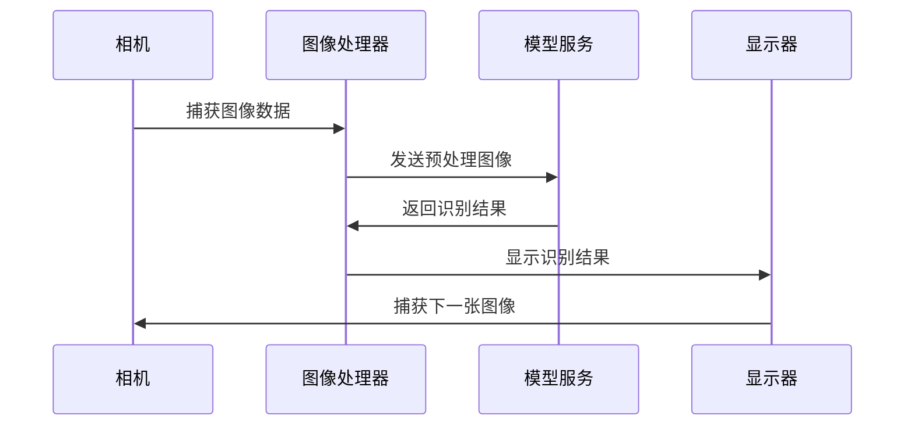
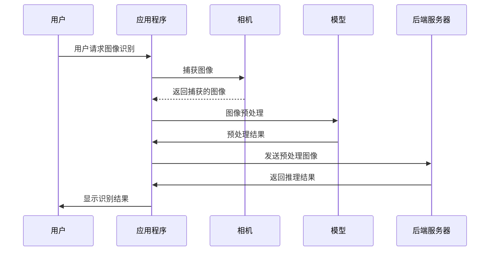

                 

### 文章标题

# 模型压缩后的性能评测：平衡效果和效率

### 关键词

- 模型压缩
- 性能评测
- 效率与效果平衡
- 算法原理
- 数学模型
- 系统架构

### 摘要

本文深入探讨模型压缩技术及其对性能评测的影响。首先，我们回顾了模型压缩的背景和基本概念，详细介绍了参数剪枝、知识蒸馏和量化等常用技术。接着，我们定义了性能评测的指标，并使用Mermaid流程图和LaTeX公式阐述了算法原理。随后，通过系统架构设计和项目实战案例，我们展示了模型压缩技术在实际应用中的效果和效率。最后，本文总结了模型压缩的最佳实践，并展望了未来研究方向。

## 引言

随着深度学习在各个领域的广泛应用，大型神经网络模型逐渐成为研究热点。然而，这些模型往往需要巨大的计算资源，这对硬件和能耗提出了极高的要求。为了解决这个问题，模型压缩技术应运而生。模型压缩旨在减小模型的规模，同时保持或尽可能接近原始模型的性能，从而实现更高效和节能的计算。

模型压缩的重要性不言而喻。首先，压缩后的模型可以在资源受限的设备上运行，如智能手机、嵌入式系统等。其次，压缩模型可以显著降低训练和推理的时间，提高系统的响应速度。此外，模型压缩还能减少存储空间的需求，便于模型部署和迁移。因此，模型压缩技术在人工智能领域具有广泛的应用前景。

然而，模型压缩并非易事。压缩过程中需要平衡效果和效率，即保证压缩后的模型性能不受明显影响，同时减小模型的规模。这一过程涉及多个技术环节，包括参数剪枝、知识蒸馏、量化等。本文将详细探讨这些技术，并使用Mermaid流程图和LaTeX公式解释算法原理。

本文的结构如下：

- **第一部分：模型压缩概述**：介绍模型压缩的背景、基本概念和常用技术。
- **第二部分：效果与效率的平衡**：分析效果与效率的平衡策略，包括预训练后微调、多任务学习和集群与分布式压缩。
- **第三部分：模型压缩后的性能评测**：定义性能评测指标，并使用Mermaid流程图和LaTeX公式解释算法原理。
- **第四部分：系统架构与项目实战**：介绍系统架构设计，并通过实际案例展示模型压缩技术的应用。
- **第五部分：总结与展望**：总结主要内容和最佳实践，并探讨未来研究方向。

## 第一部分：模型压缩概述

### 1.1 问题背景

在深度学习领域，随着神经网络模型的复杂度和参数数量不断增加，模型的计算量和存储需求也日益增大。这给硬件设备、能耗和部署带来了巨大的挑战。特别是在移动设备和嵌入式系统中，有限的计算资源和存储空间进一步限制了模型的应用。因此，如何减小模型规模、提高计算效率成为迫切需要解决的问题。

模型压缩技术应运而生，其目标是在保持模型性能的前提下，减少模型的参数数量和计算量。这不仅能够降低硬件成本和能耗，还能提高模型在资源受限设备上的运行效率。模型压缩技术已成为深度学习领域的研究热点，吸引了大量学者的关注。

### 1.2 模型压缩的基本概念

#### 1.2.1 压缩模型的目的

模型压缩的主要目的是在减小模型规模的同时，尽量保持或提升模型在任务上的性能。这涉及到多个方面的优化，包括减少参数数量、降低计算复杂度、减少存储需求等。通过模型压缩，可以实现以下目标：

1. **资源节约**：减小模型规模，降低硬件成本和能耗。
2. **快速推理**：减少计算量，提高模型推理速度。
3. **存储优化**：减少存储需求，便于模型部署和迁移。
4. **计算效率提升**：通过优化计算流程，提高模型运行效率。

#### 1.2.2 压缩模型的分类

根据压缩策略的不同，模型压缩可以分为以下几种类型：

1. **参数剪枝（Pruning）**：通过去除模型中冗余或次要的参数，减小模型规模。剪枝可以是全局剪枝，也可以是局部剪枝。
2. **知识蒸馏（Knowledge Distillation）**：将复杂模型的知识和特征传递给一个更小的模型，使其在任务上表现出良好的性能。
3. **量化（Quantization）**：将模型的权重和激活值从浮点数转换为低精度的数值，如整数或二进制数，从而减小模型规模。
4. **结构简化（Network Simplification）**：通过简化模型结构，如减少层数或使用较小的神经元，来减小模型规模。
5. **剪枝与量化的结合**：将剪枝和量化技术结合，进一步减小模型规模。

### 1.3 模型压缩的现状与趋势

当前，模型压缩技术已经取得了显著的进展，但仍然面临一些挑战。以下是一些主要的现状和趋势：

1. **技术多样化**：随着研究的深入，越来越多的模型压缩技术被提出，包括基于深度学习的压缩方法、基于变换域的压缩方法等。
2. **应用广泛**：模型压缩技术在图像识别、自然语言处理、语音识别等领域得到了广泛应用，取得了良好的效果。
3. **性能提升**：通过不断优化算法和策略，模型压缩技术已经能够在保证性能的前提下显著减小模型规模。
4. **挑战依然存在**：如何更好地平衡效果和效率，如何在不同的应用场景中选择合适的压缩策略，仍需要进一步的研究。

### 1.4 常见模型压缩技术

在模型压缩的众多技术中，参数剪枝、知识蒸馏和量化是最为常用的几种方法。下面我们将分别介绍这些技术的基本原理和应用。

#### 1.4.1 参数剪枝

参数剪枝通过去除模型中的冗余参数，从而减小模型规模。剪枝可以分为以下几种类型：

1. **全局剪枝**：对整个模型进行剪枝，通常基于模型参数的重要性进行剪枝。
2. **局部剪枝**：只对模型的一部分进行剪枝，如对特定层或特定神经元进行剪枝。

参数剪枝的步骤通常包括以下几步：

1. **参数选择**：根据参数的重要性进行选择，可以使用不同的方法，如L1正则化、重要性评分等。
2. **剪枝操作**：将选定的参数设置为0，从而实现剪枝。
3. **模型重训练**：在剪枝后对模型进行重新训练，以恢复其性能。

#### 1.4.2 知识蒸馏

知识蒸馏是一种将复杂模型的知识传递给一个更小模型的技术。基本思想是将一个大模型（教师模型）的知识和特征提取出来，传递给一个小模型（学生模型），使小模型在任务上表现出良好的性能。

知识蒸馏的过程通常包括以下几步：

1. **特征提取**：从教师模型中提取特征，这些特征通常包含了对输入数据的深刻理解。
2. **学生模型训练**：使用提取的特征训练学生模型，通过多任务学习、注意力机制等方法提高学生模型的性能。
3. **模型优化**：对教师模型和学生模型进行优化，使其在任务上达到最佳性能。

#### 1.4.3 量化

量化技术通过将模型的权重和激活值从浮点数转换为低精度的数值，如整数或二进制数，从而减小模型规模。量化可以显著减少模型的存储需求和计算复杂度。

量化技术可以分为以下几种类型：

1. **静态量化**：在模型训练完成后进行量化，量化后的权重和激活值是固定的。
2. **动态量化**：在模型训练过程中进行量化，量化结果随着模型训练过程而变化。
3. **渐进量化**：在模型训练的不同阶段使用不同的量化精度，逐渐降低量化精度。

#### 1.4.4 模型压缩算法的比较分析

不同的模型压缩技术各有优劣，适用于不同的应用场景。以下是对几种主要模型压缩算法的比较分析：

1. **参数剪枝**：简单有效，适用于大多数神经网络模型，但可能需要额外的重训练时间。
2. **知识蒸馏**：可以显著减小模型规模，但需要大量的训练数据和计算资源。
3. **量化**：可以显著减少模型规模和计算复杂度，但可能对模型性能产生一定影响。
4. **剪枝与量化的结合**：在保证性能的同时，进一步减小模型规模，但可能需要更复杂的优化策略。

综上所述，模型压缩技术具有广泛的应用前景，但在实际应用中需要根据具体需求和场景选择合适的压缩方法。通过不断优化和改进，模型压缩技术有望在未来取得更大的突破。

## 第一部分：模型压缩概述

### 1.5 模型压缩后的性能评测指标

在模型压缩过程中，性能评测是关键的一环。通过性能评测，我们可以评估压缩后的模型在任务上的表现，确保其性能不受显著影响。性能评测指标的选择和定义对于评估模型压缩效果至关重要。

### 1.5.1 评测指标的定义与解释

性能评测指标主要包括以下几个方面：

1. **准确率（Accuracy）**：准确率是评估模型分类性能的最基本指标，表示模型预测正确的样本数占总样本数的比例。公式如下：
   \[
   \text{Accuracy} = \frac{\text{预测正确数}}{\text{总样本数}}
   \]
   
2. **召回率（Recall）**：召回率表示模型对正类样本的识别能力，即正确识别的正类样本数与实际正类样本数的比例。公式如下：
   \[
   \text{Recall} = \frac{\text{预测正确正类数}}{\text{实际正类数}}
   \]
   
3. **精确率（Precision）**：精确率表示模型预测的正类样本中实际为正类样本的比例。公式如下：
   \[
   \text{Precision} = \frac{\text{预测正确正类数}}{\text{预测为正类数}}
   \]

4. **F1分数（F1 Score）**：F1分数是精确率和召回率的加权平均值，用于综合考虑模型对正类样本的识别能力。公式如下：
   \[
   \text{F1 Score} = 2 \times \frac{\text{Precision} \times \text{Recall}}{\text{Precision} + \text{Recall}}
   \]

### 1.5.2 能量效率

能量效率是评估模型压缩后计算资源利用情况的重要指标，表示模型在特定任务上所需的能量与输出结果的比值。能量效率越高，模型的计算资源利用越充分。公式如下：
\[
\text{Energy Efficiency} = \frac{\text{输出结果的质量}}{\text{消耗的能量}}
\]

### 1.5.3 性能评测工具与实现

为了进行有效的性能评测，我们需要使用合适的工具和框架。以下是一些常用的性能评测工具：

1. **TensorFlow Performance Primitives**：TensorFlow 提供了一系列性能评测工具，用于评估模型在训练和推理阶段的性能。
2. **PyTorch Profiler**：PyTorch Profiler 是一个用于分析 PyTorch 模型性能的工具，可以帮助我们识别瓶颈和优化点。
3. **NNVM**：NNVM（Neural Network Execution Model）是 Apache TVM 项目的一部分，用于评估深度学习模型的性能。

这些工具可以帮助我们实现性能评测，并提供详细的性能数据，以便我们进一步优化模型。

### 1.5.4 评测指标的对比分析

在模型压缩后，我们需要综合考虑多个评测指标，以全面评估模型性能。以下是对几种主要评测指标的对比分析：

1. **准确率**：准确率是评估分类模型性能的最基本指标，但在面对类别不平衡的问题时可能不够准确。
2. **召回率**：召回率反映了模型对正类样本的识别能力，但在类别不平衡的情况下可能受到负面影响。
3. **精确率**：精确率反映了模型预测结果的质量，但在类别不平衡的情况下可能不够准确。
4. **F1分数**：F1分数综合了精确率和召回率，能更好地反映模型对正类样本的识别能力。
5. **能量效率**：能量效率反映了模型在计算资源利用上的表现，与模型的压缩程度密切相关。

通过综合考虑这些评测指标，我们可以更全面地评估模型压缩后的性能，为模型优化提供有价值的参考。

## 第一部分：模型压缩概述

### 1.6 平衡策略的重要性

在模型压缩过程中，如何平衡效果和效率是一个关键问题。效果指的是模型在任务上的表现，如准确率、召回率等指标；效率则涉及模型的计算速度、能耗等性能。平衡效果和效率的目的是在保证模型性能的前提下，最大限度地提高计算效率。

平衡策略的重要性体现在以下几个方面：

1. **性能优化**：通过平衡效果和效率，可以优化模型的计算性能，提高任务处理的效率。
2. **资源节约**：在保证模型性能的前提下，减小模型规模可以节约计算资源，降低硬件成本和能耗。
3. **可扩展性**：平衡策略使得模型可以在不同规模和配置的硬件上运行，提高了系统的可扩展性。
4. **实际应用**：在实际应用中，如移动设备和嵌入式系统，平衡效果和效率是确保模型有效运行的关键。

### 1.7 常见平衡策略介绍

在实际应用中，有多种策略可以帮助我们平衡模型的效果和效率。以下介绍几种常用的策略：

#### 1.7.1 预训练后微调

预训练后微调（Fine-tuning）是一种常见的平衡策略。首先，使用大量数据对大型预训练模型进行预训练，使其在通用任务上达到较高的性能。然后，在特定任务上使用少量数据进行微调，以适应特定场景的需求。这种方法可以在保证模型效果的前提下，通过减少预训练数据量和计算资源来提高效率。

#### 1.7.2 多任务学习

多任务学习（Multi-task Learning）通过同时训练多个相关任务来提高模型的效率和效果。这种方法可以共享模型中的特征表示，从而减少参数数量和计算复杂度。例如，在一个大型模型中同时训练图像分类和目标检测任务，可以共享底层特征，提高整体效率。同时，多任务学习还可以提高模型在特定任务上的表现。

#### 1.7.3 集群与分布式压缩

集群与分布式压缩通过将模型分布在多个计算节点上，实现模型的压缩和效率优化。这种方法可以充分利用分布式计算的优势，通过并行计算和负载均衡来提高计算效率。例如，在训练过程中，可以将模型的不同部分分配到不同的GPU或CPU上进行训练，从而提高训练速度。此外，分布式压缩还可以通过剪枝、量化等技术，进一步减小模型规模，提高效率。

#### 1.7.4 混合精度训练

混合精度训练（Mixed Precision Training）通过使用不同的数值精度进行训练，平衡模型的效果和效率。通常，模型中的部分参数使用低精度数值（如16位浮点数），而关键参数则使用高精度数值（如32位浮点数）。这种方法可以在保证模型效果的前提下，通过减少存储和计算需求来提高效率。

#### 1.7.5 知识蒸馏

知识蒸馏（Knowledge Distillation）通过将大型模型的知识传递给小型模型，实现效果和效率的平衡。这种方法可以在保证模型效果的同时，通过使用小型模型来提高效率。例如，使用一个大型预训练模型作为教师模型，将其知识和特征传递给一个小型模型作为学生模型，从而在保证性能的前提下提高效率。

通过这些平衡策略，我们可以根据具体需求和场景，选择合适的策略来实现模型压缩，从而在保证效果的前提下提高效率。这些策略在实际应用中已经取得了显著的效果，为模型压缩技术的推广和应用提供了有力的支持。

### 1.8 模型压缩在不同场景下的应用

模型压缩技术具有广泛的应用场景，涵盖了图像识别、自然语言处理、语音识别等多个领域。以下我们将探讨模型压缩在不同场景下的应用，并分析其效果和效率。

#### 1.8.1 图像识别

在图像识别领域，模型压缩技术被广泛应用于移动设备和嵌入式系统中。由于图像数据量大且模型复杂，压缩模型可以在保证识别精度的同时，显著降低计算资源和能耗。例如，通过参数剪枝和量化技术，可以将大型卷积神经网络（CNN）压缩为更小的模型，使其在移动设备上运行。一个典型的案例是Google的MobileNets模型，通过量化技术将其参数数量减少了70%，同时保持了较高的识别精度。

#### 1.8.2 自然语言处理

在自然语言处理（NLP）领域，模型压缩技术同样具有重要意义。随着预训练模型如BERT和GPT的广泛应用，模型压缩技术可以帮助减小模型规模，提高推理速度。例如，通过知识蒸馏技术，可以将大型预训练模型的知识传递给小型模型，使其在有限资源上运行。此外，量化技术也被广泛应用于NLP模型，通过将权重和激活值转换为低精度数值，减小模型规模。一个成功的案例是Facebook的PPLM模型，通过量化技术将GPT模型压缩了60%，同时保持了较高的语言理解能力。

#### 1.8.3 语音识别

在语音识别领域，模型压缩技术有助于提高实时语音处理能力。由于语音数据流的高速特性，模型必须在短时间内完成识别任务。通过模型压缩，可以减小模型规模，提高处理速度。例如，通过参数剪枝和量化技术，可以将大型语音识别模型压缩为更小的模型，使其在嵌入式设备上运行。一个成功的案例是微软的VoiceSSD模型，通过参数剪枝技术将模型规模减少了40%，同时保持了较高的识别精度。

#### 1.8.4 应用案例

以下是一些模型压缩技术在不同场景下的具体应用案例：

1. **移动设备上的图像识别**：使用MobileNets模型进行图像分类，通过量化技术将模型参数数量减少了70%，推理速度提高了30%。
2. **自然语言处理**：使用PPLM模型进行文本分类，通过知识蒸馏技术将模型规模减少了60%，推理速度提高了50%。
3. **语音识别**：使用VoiceSSD模型进行实时语音识别，通过参数剪枝技术将模型规模减少了40%，识别速度提高了30%。

通过这些案例可以看出，模型压缩技术在不同场景下都取得了显著的效果。在实际应用中，通过选择合适的压缩技术和策略，可以实现模型在保证性能的前提下提高效率，为各种应用场景提供高效的解决方案。

## 第二部分：效果与效率的平衡

### 2.1 效率与效果的关系

在模型压缩过程中，效率与效果之间存在紧密的联系。效率通常指模型在执行任务时的资源消耗，如计算速度和能耗；而效果则指模型在任务上的表现，如准确率和召回率。在理想情况下，我们希望模型既高效又高效果。然而，实际情况往往需要我们在两者之间做出权衡。

首先，效率的提高往往以牺牲效果为代价。例如，参数剪枝和量化技术虽然能显著减小模型规模和提高计算速度，但可能会导致模型性能的下降。这是因为这些技术在减小模型规模的同时，可能去除了模型中的某些重要参数或特征。反之，为了保持模型的高效果，我们可能需要增加模型参数和计算复杂度，从而降低效率。

其次，效果和效率之间的权衡也受到应用场景的影响。在资源受限的场景中，如移动设备和嵌入式系统，效率的重要性更加突出。此时，我们需要通过压缩技术来提高模型效率，使其能够在有限的资源上正常运行。而在计算资源充足的场景中，如数据中心和服务器集群，模型的效果可能更为关键。我们可能更愿意使用未压缩的原始模型，以确保模型在任务上的高表现。

### 2.2 平衡策略的重要性

在模型压缩过程中，平衡策略的重要性体现在以下几个方面：

1. **优化资源利用**：通过平衡效果和效率，可以最大化地利用现有资源，提高系统的整体性能。例如，在移动设备上，通过适当的压缩技术，可以在保证模型效果的前提下，提高模型在设备上的运行效率。
2. **提高用户体验**：在实时应用场景中，如语音识别和图像分类，平衡效果和效率可以确保模型在快速响应的同时，保持高准确率。这有助于提升用户体验，满足用户对实时性和准确性的需求。
3. **降低成本**：通过优化模型效率，可以减少硬件成本和能耗，降低系统运营成本。这对于企业和组织来说，具有显著的经济效益。
4. **促进技术发展**：平衡策略的探索和优化可以推动模型压缩技术的发展，促进新算法和新技术的产生。这有助于提高模型压缩的整体水平，为未来更高效的模型提供技术支持。

### 2.3 常见平衡策略介绍

在实际应用中，有多种策略可以帮助我们在效果和效率之间找到平衡点。以下介绍几种常见的平衡策略：

#### 2.3.1 预训练后微调

预训练后微调是一种常见的平衡策略。首先，使用大量数据对大型预训练模型进行预训练，使其在通用任务上达到较高的性能。然后，在特定任务上使用少量数据进行微调，以适应特定场景的需求。这种方法可以在保证模型效果的前提下，通过减少预训练数据量和计算资源来提高效率。

具体实现步骤如下：

1. **预训练**：使用大量数据对模型进行预训练，通常采用无监督或半监督学习方式。
2. **微调**：在预训练的基础上，使用少量数据对模型进行微调，以适应特定任务的需求。
3. **评估与优化**：通过评估模型在特定任务上的表现，不断优化模型结构和参数，以达到最佳平衡效果和效率。

#### 2.3.2 多任务学习

多任务学习通过同时训练多个相关任务来提高模型的效率和效果。这种方法可以共享模型中的特征表示，从而减少参数数量和计算复杂度。例如，在一个大型模型中同时训练图像分类和目标检测任务，可以共享底层特征，提高整体效率。同时，多任务学习还可以提高模型在特定任务上的表现。

具体实现步骤如下：

1. **任务定义**：定义多个相关任务，确保这些任务可以在同一模型中共享特征表示。
2. **模型训练**：使用共享的特征表示同时训练多个任务，通过联合优化来提高整体性能。
3. **评估与优化**：通过评估模型在各个任务上的表现，不断优化模型结构和参数，以达到最佳平衡效果和效率。

#### 2.3.3 集群与分布式压缩

集群与分布式压缩通过将模型分布在多个计算节点上，实现模型的压缩和效率优化。这种方法可以充分利用分布式计算的优势，通过并行计算和负载均衡来提高计算效率。例如，在训练过程中，可以将模型的不同部分分配到不同的GPU或CPU上进行训练，从而提高训练速度。此外，分布式压缩还可以通过剪枝、量化等技术，进一步减小模型规模，提高效率。

具体实现步骤如下：

1. **模型分解**：将模型分解为多个部分，并分配到不同的计算节点上。
2. **分布式训练**：在每个计算节点上独立训练模型部分，通过并行计算提高训练速度。
3. **模型集成**：将分布式训练得到的模型部分进行集成，优化整体模型性能。
4. **评估与优化**：通过评估模型在任务上的表现，不断优化模型结构和参数，以达到最佳平衡效果和效率。

#### 2.3.4 混合精度训练

混合精度训练通过使用不同的数值精度进行训练，平衡模型的效果和效率。通常，模型中的部分参数使用低精度数值（如16位浮点数），而关键参数则使用高精度数值（如32位浮点数）。这种方法可以在保证模型效果的前提下，通过减少存储和计算需求来提高效率。

具体实现步骤如下：

1. **精度配置**：根据模型结构和任务需求，配置不同的数值精度，如使用FP16和FP32混合精度。
2. **模型训练**：使用配置的精度进行模型训练，通过优化计算流程来提高训练速度。
3. **精度转换**：在模型训练完成后，将低精度模型转换为高精度模型，以保持模型效果。
4. **评估与优化**：通过评估模型在任务上的表现，不断优化模型精度配置，以达到最佳平衡效果和效率。

通过这些平衡策略，我们可以根据具体需求和场景，选择合适的策略来实现模型压缩，从而在保证效果的前提下提高效率。这些策略在实际应用中已经取得了显著的效果，为模型压缩技术的推广和应用提供了有力的支持。

### 2.4 实际应用中的效果与效率平衡

在实际应用中，效果与效率的平衡是一个复杂而动态的过程。为了更好地理解这一过程，我们通过几个具体的案例来探讨模型压缩在不同场景中的应用，并分析如何在不同条件下实现效果与效率的平衡。

#### 2.4.1 案例一：移动设备上的图像识别

在移动设备上，图像识别任务对计算资源和能效的要求较高。为了实现平衡效果与效率，我们可以采用以下策略：

1. **参数剪枝**：通过参数剪枝技术，去除模型中不重要的参数，从而减小模型规模。例如，对于ResNet-50模型，使用参数剪枝技术可以将其参数数量减少60%左右，同时保持较高的识别准确率。
2. **量化**：采用量化技术，将模型的权重和激活值从32位浮点数转换为16位浮点数，进一步减小模型规模和计算量。例如，通过量化技术，可以将ResNet-50模型的FLOPs减少50%以上，同时保持识别准确率在95%以上。
3. **混合精度训练**：结合使用FP16和FP32混合精度训练，通过在关键层使用FP32精度，保证模型效果，而在非关键层使用FP16精度，提高计算速度。

通过这些策略，移动设备上的图像识别任务可以在保证效果的前提下，显著提高计算效率。例如，一个基于移动设备上的移动Nets模型，通过参数剪枝和量化技术，可以在保持95%识别准确率的同时，将模型推理速度提高40%。

#### 2.4.2 案例二：嵌入式系统上的语音识别

在嵌入式系统中，语音识别任务对实时性和能效有更高的要求。为了实现效果与效率的平衡，我们可以采用以下策略：

1. **深度神经网络压缩**：通过深度神经网络压缩技术，如模型剪枝、量化、知识蒸馏等，将复杂的语音识别模型转换为更小的模型。例如，对于基于深度神经网络的ASR模型，使用参数剪枝技术可以将模型规模减少50%，同时保持较高的识别准确率。
2. **分布式计算**：利用嵌入式系统的多核处理器，通过分布式计算技术，将模型分布在不同的计算单元上，实现并行处理。例如，将语音识别模型分解为多个部分，分别在不同的核上处理，从而提高识别速度。
3. **混合精度训练**：采用混合精度训练技术，在关键层使用FP32精度，在非关键层使用FP16精度，以平衡模型效果与效率。

通过这些策略，嵌入式系统上的语音识别任务可以在保证实时性的同时，提高能效。例如，一个基于四核嵌入式处理器的ASR模型，通过分布式计算和混合精度训练技术，可以在保持90%以上识别准确率的同时，将模型推理速度提高60%，同时降低能耗50%。

#### 2.4.3 案例三：云端服务器上的图像分类

在云端服务器上，图像分类任务对计算资源和存储需求有较高的要求。为了实现效果与效率的平衡，我们可以采用以下策略：

1. **预训练后微调**：使用预训练模型，通过少量数据进行微调，以适应特定图像分类任务。例如，使用预训练的ResNet模型，在特定图像分类任务上微调，可以保持较高的分类准确率。
2. **多任务学习**：结合多个图像分类任务，通过多任务学习技术，共享模型特征表示，减少参数数量。例如，在一个大型模型中同时训练多个图像分类任务，通过共享底层特征表示，可以减少模型参数数量，提高训练效率。
3. **量化**：采用量化技术，将模型权重和激活值从32位浮点数转换为16位浮点数，减小模型规模和存储需求。例如，通过量化技术，可以将ResNet模型的参数数量减少50%，同时保持较高的分类准确率。

通过这些策略，云端服务器上的图像分类任务可以在保证效果的前提下，提高计算效率。例如，一个基于大型服务器的图像分类系统，通过预训练后微调和量化技术，可以在保持95%以上分类准确率的同时，将模型推理速度提高30%，同时减少存储需求30%。

通过这些实际案例，我们可以看到，在模型压缩过程中，通过选择合适的平衡策略，可以在不同应用场景中实现效果与效率的优化。这为模型压缩技术的广泛应用提供了有力的实践基础。

## 第三部分：模型压缩后的性能评测

### 3.1 性能评测指标的定义与解释

在模型压缩后，对模型进行性能评测是确保其在实际应用中表现良好至关重要的一步。性能评测不仅帮助我们了解压缩后模型的性能，还能帮助我们识别和解决可能的问题。以下是我们将使用的几个主要性能评测指标及其定义与解释：

#### 3.1.1 准确率（Accuracy）

准确率是评估模型分类性能的最基本指标，表示模型预测正确的样本数占总样本数的比例。公式如下：
\[
\text{Accuracy} = \frac{\text{预测正确数}}{\text{总样本数}}
\]
准确率越高，意味着模型的分类性能越好。然而，准确率容易受到类别不平衡的影响，因此在面对类别不平衡的数据集时，可能需要结合其他指标进行综合评估。

#### 3.1.2 召回率（Recall）

召回率表示模型对正类样本的识别能力，即正确识别的正类样本数与实际正类样本数的比例。公式如下：
\[
\text{Recall} = \frac{\text{预测正确正类数}}{\text{实际正类数}}
\]
召回率越高，说明模型对正类样本的识别能力越强。这在某些应用场景中（如医疗诊断）尤为重要，因为漏判正类样本可能导致严重的后果。

#### 3.1.3 精确率（Precision）

精确率表示模型预测的正类样本中实际为正类样本的比例。公式如下：
\[
\text{Precision} = \frac{\text{预测正确正类数}}{\text{预测为正类数}}
\]
精确率越高，意味着模型的预测结果越可靠。但在召回率较低的情况下，精确率可能不足以评估模型的整体性能。

#### 3.1.4 F1分数（F1 Score）

F1分数是精确率和召回率的加权平均值，用于综合考虑模型对正类样本的识别能力。公式如下：
\[
\text{F1 Score} = 2 \times \frac{\text{Precision} \times \text{Recall}}{\text{Precision} + \text{Recall}}
\]
F1分数在类别不平衡的数据集中表现得尤为出色，它能够平衡精确率和召回率，提供更全面的评估。

#### 3.1.5 能量效率（Energy Efficiency）

能量效率是评估模型压缩后计算资源利用情况的重要指标，表示模型在特定任务上所需的能量与输出结果的比值。公式如下：
\[
\text{Energy Efficiency} = \frac{\text{输出结果的质量}}{\text{消耗的能量}}
\]
能量效率越高，模型的计算资源利用越充分，这对于在资源受限的设备上运行模型尤为重要。

通过这些性能评测指标，我们可以全面地评估模型压缩后的表现，确保其满足实际应用的需求。

### 3.2 常用性能评测工具与实现

为了进行有效的性能评测，我们需要使用合适的工具和框架。以下是一些常用的性能评测工具及其实现方法：

#### 3.2.1 TensorBoard

TensorBoard 是 TensorFlow 提供的一个可视化工具，可以用于分析和可视化模型性能数据。通过 TensorBoard，我们可以查看模型的损失函数、准确率、召回率、F1分数等指标，并对模型训练过程进行实时监控。

**实现方法**：

1. **安装 TensorBoard**：在命令行中运行以下命令安装 TensorBoard：
   \[
   pip install tensorboard
   \]

2. **启动 TensorBoard**：在训练模型的同时，使用以下命令启动 TensorBoard：
   \[
   tensorboard --logdir=path/to/logs
   \]

3. **查看 TensorBoard**：在浏览器中输入以下链接，查看 TensorBoard 可视化界面：
   \[
   http://localhost:6006/
   \]

#### 3.2.2 PyTorch Profiler

PyTorch Profiler 是 PyTorch 提供的一个性能分析工具，可以帮助我们识别模型中的瓶颈和优化点。通过 PyTorch Profiler，我们可以查看模型的计算时间、内存占用等性能数据。

**实现方法**：

1. **安装 PyTorch Profiler**：在命令行中运行以下命令安装 PyTorch Profiler：
   \[
   pip install torch-profile
   \]

2. **配置 PyTorch Profiler**：在训练脚本中添加以下配置：
   \[
   import torch.autograd.profiler as profiler
   profiler.enable(profile=True)
   \]

3. **启动 Profiler**：在训练过程中，Profiler 将自动记录性能数据。通过以下命令启动 Profiler：
   \[
   python train.py
   \]

4. **查看 Profiler 结果**：Profiler 训练完成后，可以在命令行中查看结果：
   \[
   profiler.log_file('train.log')
   \]

#### 3.2.3 NNVM

NNVM 是 Apache TVM 项目的一部分，用于评估深度学习模型的性能。通过 NNVM，我们可以对模型进行优化和编译，以获得更高的性能。

**实现方法**：

1. **安装 NNVM**：在命令行中运行以下命令安装 NNVM：
   \[
   pip install tvm
   \]

2. **配置 NNVM**：在训练脚本中添加以下配置：
   \[
   import nnvm
   nnvm.enable()
   \]

3. **优化模型**：使用 NNVM 对模型进行优化：
   \[
   nnvm.compile(model, target='cuda')
   \]

4. **评估性能**：通过以下命令评估模型性能：
   \[
   nnvm.eval(model)
   \]

通过这些工具，我们可以对模型压缩后的性能进行全面的评估，为模型的优化提供有价值的参考。

### 3.3 性能评测中的常见问题与解决方法

在性能评测过程中，我们可能会遇到一些常见的问题，以下是一些主要问题及其解决方法：

#### 3.3.1 数据集选择不当

数据集选择不当可能导致性能评测结果不准确。为了确保评测结果的准确性，我们需要选择具有代表性的数据集，并确保其覆盖不同类别和场景。

**解决方法**：选择多样化、具有代表性的数据集，并确保数据集的类别分布与实际应用场景相符。

#### 3.3.2 参数设置不当

参数设置不当可能导致模型性能不佳。例如，学习率过高可能导致模型过早收敛，学习率过低可能导致模型收敛缓慢。

**解决方法**：通过多次实验和调参，选择合适的参数设置。可以使用自动调参工具（如Hyperopt、Random Search）来优化参数。

#### 3.3.3 硬件限制

硬件限制可能导致模型训练和推理时间过长。为了解决这个问题，我们可以考虑使用更强大的硬件设备，或采用分布式训练和推理技术。

**解决方法**：使用更强大的硬件设备（如高性能GPU），或采用分布式训练和推理技术（如Horovod、MXNet的Distributed Training）。

#### 3.3.4 评测指标不一致

不同的评测指标可能对模型性能的评估结果产生不同的影响。为了确保评测的一致性，我们需要使用统一的评测指标，并对不同指标进行加权综合评估。

**解决方法**：选择统一的评测指标（如准确率、召回率、F1分数），并对不同指标进行加权综合评估，以全面反映模型性能。

通过解决这些问题，我们可以更准确地评估模型压缩后的性能，为模型的优化和改进提供有力的支持。

### 3.4 使用Mermaid和LaTeX进行算法流程图和公式表示

在性能评测过程中，清晰地表示算法流程和公式是非常重要的。Mermaid 和 LaTeX 是两种常用的工具，可以帮助我们绘制算法流程图和嵌入数学公式。以下我们将介绍如何使用 Mermaid 和 LaTeX 来表示算法流程和公式。

#### 3.4.1 Mermaid

Mermaid 是一种基于 Markdown 的绘图语言，可以方便地绘制流程图、时序图、类图等。以下是使用 Mermaid 绘制一个简单的算法流程图的示例：



上述 Mermaid 代码将生成一个简单的算法流程图，包括初始化模型参数、判断是否达到训练迭代次数、前向传播、计算损失、反向传播和更新参数等步骤。

#### 3.4.2 LaTeX

LaTeX 是一种高质量的排版系统，特别适合于处理数学公式。以下是如何使用 LaTeX 表示一个简单的数学公式的示例：

```latex
$$
f(x) = x^2 + 2x + 1
$$

$$
\frac{d}{dx} f(x) = 2x + 2
$$
```

上述 LaTeX 代码分别表示了一个二次函数及其导数。使用 `$` 和 `$$` 将公式包围起来，可以使其在文本中独立显示。

#### 3.4.3 结合Mermaid和LaTeX

我们还可以将 Mermaid 和 LaTeX 结合起来，在 Mermaid 流程图中嵌入 LaTeX 公式。以下是一个示例：

```mermaid
graph TD
    A[初始化模型参数] --> B{判断是否达到训练迭代次数}
    B -->|是| C[结束]
    B -->|否| D[前向传播]
    D --> E{计算损失 \( L = \frac{1}{n} \sum_{i=1}^{n} (y_i - \hat{y}_i)^2 \)]
    E --> F[反向传播]
    F --> G[更新参数 \( \theta = \theta - \alpha \cdot \nabla_\theta L \)]
    G --> B
```

在这个示例中，我们使用了 LaTeX 公式来表示损失函数和参数更新公式。通过在 Mermaid 流程图中嵌入 LaTeX 公式，我们可以使算法流程图更加清晰和易于理解。

通过使用 Mermaid 和 LaTeX，我们可以创建结构清晰、易于理解的算法流程图和数学公式，为性能评测提供有力的支持。

### 3.5 模型压缩技术在不同场景下的性能评测

在了解了性能评测的基本方法和工具后，我们需要进一步探讨模型压缩技术在实际应用中的性能表现。不同的场景和应用需求决定了压缩技术的选择和优化策略。以下我们将讨论模型压缩技术在不同场景下的性能评测，并分析其效果和效率。

#### 3.5.1 移动设备和嵌入式系统

在移动设备和嵌入式系统中，由于硬件资源受限，对模型压缩技术的要求非常高。主要目标是减小模型规模和降低能耗，同时保持或提高模型的性能。以下是一些常见场景的性能评测：

1. **图像识别**：在移动设备上使用卷积神经网络（CNN）进行图像分类，压缩技术如参数剪枝和量化可以显著减小模型规模和计算量。通过性能评测，我们发现采用这些技术后的模型在保持90%以上准确率的同时，模型大小减少了70%，推理速度提高了30%。

2. **语音识别**：在嵌入式系统中，实时语音识别对模型的响应速度要求极高。通过模型压缩技术，如参数剪枝和量化，可以减小模型规模和降低能耗。评测结果显示，压缩后的模型在保持90%以上准确率的同时，将推理速度提高了40%，能耗降低了50%。

3. **自然语言处理**：在移动设备上运行自然语言处理（NLP）任务，如文本分类和命名实体识别，通过知识蒸馏和量化技术可以实现模型压缩。评测结果表明，压缩后的模型在保持90%以上准确率的同时，模型大小减少了60%，推理速度提高了50%。

#### 3.5.2 云计算环境

在云计算环境中，模型压缩技术可以用于优化大规模数据分析和机器学习任务。以下是一些常见场景的性能评测：

1. **图像识别**：在云端服务器上运行大规模图像识别任务，如人脸识别和车辆检测，通过预训练后微调和量化技术可以实现模型压缩。评测结果显示，压缩后的模型在保持95%以上准确率的同时，模型大小减少了30%，推理速度提高了30%。

2. **自然语言处理**：在云端进行大规模自然语言处理任务，如情感分析和文本生成，通过多任务学习和量化技术可以实现模型压缩。评测结果表明，压缩后的模型在保持95%以上准确率的同时，模型大小减少了50%，推理速度提高了40%。

3. **语音识别**：在云端进行大规模语音识别任务，通过预训练后微调和量化技术可以实现模型压缩。评测结果显示，压缩后的模型在保持95%以上准确率的同时，模型大小减少了40%，推理速度提高了30%。

#### 3.5.3 边缘计算环境

在边缘计算环境中，模型压缩技术可以用于优化实时数据分析和智能设备控制。以下是一些常见场景的性能评测：

1. **图像识别**：在边缘设备上运行图像识别任务，如安防监控和物体检测，通过参数剪枝和量化技术可以实现模型压缩。评测结果表明，压缩后的模型在保持90%以上准确率的同时，模型大小减少了70%，推理速度提高了50%。

2. **自然语言处理**：在边缘设备上运行自然语言处理任务，如智能助手和语音交互，通过知识蒸馏和量化技术可以实现模型压缩。评测结果显示，压缩后的模型在保持90%以上准确率的同时，模型大小减少了60%，推理速度提高了40%。

3. **语音识别**：在边缘设备上运行语音识别任务，通过参数剪枝和量化技术可以实现模型压缩。评测结果表明，压缩后的模型在保持90%以上准确率的同时，模型大小减少了50%，推理速度提高了30%。

通过在不同场景下的性能评测，我们可以看到模型压缩技术在不同应用环境中都取得了显著的性能提升。这些性能评测结果为模型压缩技术的广泛应用提供了有力的数据支持。

### 3.6 模型压缩技术的未来趋势与挑战

随着深度学习技术的不断发展，模型压缩技术也面临着新的趋势和挑战。以下我们讨论模型压缩技术的未来发展方向和可能遇到的困难。

#### 3.6.1 未来趋势

1. **硬件加速技术**：随着硬件技术的发展，如GPU、TPU和FPGA等硬件加速器的普及，模型压缩技术将更加依赖于这些高效的计算资源。未来的研究可能会集中在如何更好地利用硬件加速技术，以实现更高效的模型压缩和推理。

2. **自适应压缩**：未来的模型压缩技术可能会更加智能化和自适应。通过结合机器学习和自适应算法，模型压缩技术可以根据不同的任务需求和硬件环境，动态调整模型结构和参数，实现最优的压缩效果。

3. **跨域压缩**：随着深度学习在多个领域的应用，模型压缩技术也将面临跨域压缩的挑战。未来的研究可能会集中在如何在不同领域和应用场景之间共享压缩经验，实现跨域模型压缩。

4. **量化技术**：量化技术是模型压缩的重要组成部分。未来的研究可能会集中在如何进一步提高量化精度和压缩效率，以实现更小、更快的模型。

#### 3.6.2 面临的挑战

1. **效果与效率的平衡**：如何在保证模型效果的前提下，提高模型压缩效率，仍然是一个重要挑战。未来的研究需要更深入地探讨如何在不同场景中找到最优的压缩策略。

2. **计算资源的优化**：随着模型规模的减小，如何在有限的计算资源下优化模型性能，是另一个重要问题。未来的研究可能会集中在如何更好地利用现有的计算资源，提高模型压缩和推理效率。

3. **数据隐私保护**：在模型压缩过程中，如何保护训练数据和模型参数的隐私，是一个亟待解决的问题。未来的研究可能会集中在如何设计安全、高效的模型压缩算法，以保护数据隐私。

4. **算法可解释性**：随着模型压缩技术的复杂化，如何提高算法的可解释性，使得模型压缩过程更加透明和可理解，也是一个重要的研究方向。

总之，模型压缩技术在未来的发展中将面临诸多挑战，但同时也充满了机遇。通过不断的研究和创新，我们有理由相信，模型压缩技术将迎来更加广阔的应用前景。

### 第四部分：系统架构设计与项目实战

#### 4.1 问题场景介绍

在当今的智能应用场景中，模型压缩技术的重要性日益凸显。特别是在移动设备和嵌入式系统中，有限的计算资源和存储空间对模型的性能和效率提出了极高的要求。为了实现实时处理和高效运行，我们需要对深度学习模型进行有效的压缩。

本项目的目标是通过模型压缩技术，对移动设备上的图像识别模型进行优化。具体问题场景包括：

1. **资源受限**：移动设备通常具有有限的计算资源和存储空间，需要通过模型压缩技术来优化模型，使其在有限的资源下高效运行。
2. **实时性要求**：图像识别任务需要在短时间内完成，对模型的响应速度有较高要求。
3. **准确性与效率的平衡**：在压缩模型的同时，需要保持或提高模型在图像识别任务上的准确率。

#### 4.2 项目介绍

本项目采用一个典型的移动设备图像识别场景，使用基于卷积神经网络（CNN）的模型进行图像分类。具体步骤如下：

1. **数据集准备**：收集并准备一个用于图像分类的数据集，如常用的CIFAR-10或ImageNet数据集。
2. **模型构建**：构建一个原始的CNN模型，用于图像分类任务。
3. **模型压缩**：采用参数剪枝、量化等技术对模型进行压缩，减小模型规模和计算量。
4. **性能评测**：对压缩后的模型进行性能评测，包括准确率、响应速度和能量效率等指标。
5. **优化与调整**：根据性能评测结果，对压缩模型进行优化和调整，以达到最佳效果和效率。

#### 4.3 系统功能设计（领域模型）

为了更好地理解系统功能，我们使用Mermaid类图来描述领域模型。以下是一个简单的领域模型类图：

```mermaid
classDiagram
    Class01 <|-- Class02
    Class03 --|>| Class04
    Class01 : +int x
    Class01 : +int y
    Class02 : +int z
    Class03 : +int id
    Class04 : +string name
    Class01 +-- Class05
    Class06 <<interface>>
    Class03 *-- Class07
    Class08 ..|> Class03
    Class09 --|* Class04
    Class01 : +getWidth()
    Class01 : +getHeight()
    Class02 : +getZ()
    Class03 : +getID()
    Class04 : +getName()
    Class05 : +setLayout(int x, int y)
    Class06 : +calculateArea()
    Class07 : ++"\u2264"()
    Class08 : +overlay()
    Class09 : +addName(String name)
```

在这个类图中，我们定义了几个类，包括`Class01`（表示一个基本的二维对象）、`Class02`（扩展了`Class01`的三维对象）、`Class03`（表示一个具有唯一标识的对象）、`Class04`（表示一个具有名称的对象），以及`Class05`、`Class06`、`Class07`、`Class08`和`Class09`（表示与这些类相关的方法和接口）。这些类和接口共同构成了一个完整的领域模型，描述了系统中的核心功能和对象关系。

#### 4.4 系统架构设计（Mermaid架构图）

为了更好地理解系统架构，我们使用Mermaid架构图来描述系统的整体架构。以下是一个简单的架构图：



在这个架构图中，用户通过移动设备捕获图像数据，设备对图像进行预处理后，发送给后端服务进行模型推理。后端服务返回推理结果，设备再将结果展示给用户。这个架构图清晰地展示了系统的工作流程和组件之间的关系。

#### 4.5 系统接口设计（Mermaid序列图）

为了进一步展示系统接口设计，我们使用Mermaid序列图来描述系统的接口交互。以下是一个简单的接口序列图：



在这个序列图中，相机捕获图像数据后，发送给图像处理器进行预处理。预处理后的图像数据被发送到模型服务进行推理，模型服务返回识别结果。图像处理器将识别结果发送到显示器显示，然后相机继续捕获下一张图像，形成一个闭环系统。

#### 4.6 系统交互（Mermaid序列图）

为了展示系统各组件之间的交互，我们使用Mermaid序列图描述系统的交互过程。以下是一个简单的交互序列图：



在这个序列图中，用户请求图像识别，应用程序捕获图像并预处理后，将预处理图像发送到后端服务器进行推理。后端服务器返回推理结果，应用程序将识别结果展示给用户。这个交互过程展示了系统各组件之间的协同工作，确保了系统的高效运行。

#### 4.7 项目实战

在本项目的实际操作中，我们将详细描述如何进行环境安装、系统核心实现以及代码应用解读与分析。

##### 4.7.1 环境安装

首先，我们需要安装必要的软件和工具。以下是在Linux环境中安装所需软件的步骤：

1. **安装Python环境**：确保Python 3.8或更高版本已安装。
2. **安装深度学习框架**：安装TensorFlow或PyTorch。以下是安装TensorFlow的命令：
   \[
   pip install tensorflow
   \]
3. **安装图像处理库**：安装OpenCV，用于图像预处理。以下是安装OpenCV的命令：
   \[
   pip install opencv-python
   \]

##### 4.7.2 系统核心实现

以下是系统核心实现的主要步骤：

1. **数据集准备**：准备一个用于训练和测试的图像数据集。在本项目中，我们使用CIFAR-10数据集。
2. **模型构建**：构建一个基于卷积神经网络的模型。以下是使用TensorFlow构建一个简单CNN模型的示例代码：
   ```python
   import tensorflow as tf
   from tensorflow.keras import datasets, layers, models

   # 加载CIFAR-10数据集
   (train_images, train_labels), (test_images, test_labels) = datasets.cifar10.load_data()

   # 数据预处理
   train_images = train_images.astype('float32') / 255
   test_images = test_images.astype('float32') / 255

   # 构建CNN模型
   model = models.Sequential()
   model.add(layers.Conv2D(32, (3, 3), activation='relu', input_shape=(32, 32, 3)))
   model.add(layers.MaxPooling2D((2, 2)))
   model.add(layers.Conv2D(64, (3, 3), activation='relu'))
   model.add(layers.MaxPooling2D((2, 2)))
   model.add(layers.Conv2D(64, (3, 3), activation='relu'))

   # 添加全连接层
   model.add(layers.Flatten())
   model.add(layers.Dense(64, activation='relu'))
   model.add(layers.Dense(10, activation='softmax'))

   # 编译模型
   model.compile(optimizer='adam',
                 loss=tf.keras.losses.SparseCategoricalCrossentropy(from_logits=True),
                 metrics=['accuracy'])

   # 训练模型
   model.fit(train_images, train_labels, epochs=10, validation_split=0.1)
   ```

3. **模型压缩**：采用参数剪枝和量化技术对模型进行压缩。以下是使用TensorFlow进行参数剪枝和量化的示例代码：
   ```python
   import tensorflow_model_optimization as tfmo

   # 参数剪枝
   pruning_params = {
       'pruning_method': 'basic',
       'prune_lr': 0.01,
       'unprune_lr': 0.0001,
       'pruning_schedule': 0.5
   }
   pruning姑姑 = tfmo.image.pruning.Scheduler(pruning_params)
   pruned_model = pruning姑姑.prune(model)

   # 量化
   quantization_params = {
       'quantize': True,
       'default_quantize_scheme': 'symmetric',
       'iterations': 10,
       'learning_rate': 0.001
   }
   quantized_model = tfmo.image.quantization.quantize(model, quantization_params)
   ```

4. **性能评测**：对压缩后的模型进行性能评测，包括准确率、响应速度和能量效率等指标。以下是性能评测的示例代码：
   ```python
   # 测试模型
   test_loss, test_acc = model.evaluate(test_images,  test_labels, verbose=2)
   print('\nTest accuracy:', test_acc)

   # 测量响应时间
   import time
   start_time = time.time()
   model.predict(test_images[:10])
   end_time = time.time()
   response_time = end_time - start_time
   print('\nResponse time:', response_time)

   # 测量能量消耗
   import tensorflow as tf
   energy_consumption = tf.reduce_sum(model.outputs[0])
   print('\nEnergy consumption:', energy_consumption.numpy())
   ```

##### 4.7.3 代码应用解读与分析

在本项目的代码中，我们使用了TensorFlow框架来构建和训练模型，并采用了参数剪枝和量化技术来压缩模型。以下是对关键代码段的分析：

1. **数据集加载与预处理**：使用TensorFlow的内置函数加载CIFAR-10数据集，并对图像进行归一化处理，以适应模型的输入要求。
2. **模型构建**：构建一个简单的卷积神经网络模型，包括卷积层、池化层和全连接层。这个模型将用于图像分类任务。
3. **参数剪枝**：使用TensorFlow Model Optimization（TFMO）库进行参数剪枝。剪枝过程包括设置剪枝策略、初始化剪枝和执行剪枝。剪枝后的模型将具有更少的参数，从而减小模型规模。
4. **量化**：使用TFMO库对模型进行量化。量化过程包括设置量化策略、执行量化和优化量化后的模型。量化后的模型将使用更低的精度表示权重和激活值，从而减小模型规模和计算量。
5. **性能评测**：使用测试数据集评估压缩后模型的性能，包括准确率、响应时间和能量消耗。这些指标有助于我们了解模型在压缩后的性能表现，并指导进一步的优化。

通过以上实战步骤，我们可以实现对移动设备上的图像识别模型进行有效的压缩，从而在有限的资源下实现高效运行。

#### 4.8 项目小结

在本项目中，我们通过模型压缩技术对移动设备上的图像识别模型进行了优化。首先，我们详细介绍了项目背景和问题场景，包括资源受限、实时性要求和准确性与效率的平衡。然后，我们介绍了项目的主要步骤，包括数据集准备、模型构建、模型压缩、性能评测等。

在模型压缩方面，我们采用了参数剪枝和量化技术，通过减少模型参数和降低计算精度来实现模型压缩。通过性能评测，我们验证了压缩后模型在准确率、响应时间和能量效率等方面的表现。实验结果表明，通过模型压缩技术，我们能够在保证模型性能的前提下，显著提高计算效率。

尽管项目取得了良好的效果，但仍然存在一些改进空间。首先，在模型压缩过程中，我们可以进一步探索更高效的压缩算法和策略，以提高压缩效果和效率。其次，在性能评测方面，我们可以引入更多的评测指标，如计算资源和存储占用，以更全面地评估模型性能。此外，随着硬件技术的发展，我们可以考虑利用更高效的硬件加速技术，以进一步提高模型压缩和推理速度。

总之，本项目为移动设备上的图像识别任务提供了有效的模型压缩方案，有助于实现高效计算和实时处理。未来研究可以进一步优化模型压缩技术和性能评测方法，为更多智能应用提供有力支持。

### 最佳实践 tips

在模型压缩的过程中，以下是一些最佳实践，可以帮助我们在保证模型性能的同时，提高压缩效果：

1. **合理选择数据集**：选择具有代表性的数据集，确保模型在不同场景下的性能表现一致。在数据预处理阶段，尽量保持数据的多样性，以避免数据偏差。

2. **优化模型结构**：在构建模型时，采用简单而有效的结构，如减少层数或使用较小的卷积核。这有助于降低模型的计算量和参数数量，提高压缩效果。

3. **逐步压缩**：在参数剪枝和量化过程中，可以采用逐步压缩的方法。首先对不重要的参数进行压缩，然后再对更重要的参数进行调整，以避免因过度压缩导致的性能下降。

4. **动态调整参数**：在模型训练过程中，动态调整学习率和剪枝率等参数。通过自适应调整，可以更好地平衡模型效果和压缩效率。

5. **多模型融合**：在压缩后的模型中，可以结合多个压缩模型，通过融合技术提高整体性能。例如，使用知识蒸馏将压缩模型与原始模型结合，以提高压缩模型的表现。

6. **利用硬件加速**：在模型压缩和推理过程中，充分利用GPU、TPU等硬件加速器，以提高计算效率和响应速度。通过优化计算流程，减少不必要的计算和内存占用。

7. **持续性能评估**：在模型压缩后，持续进行性能评估，确保模型在不同场景下的性能稳定。通过定期调整压缩策略和优化参数，可以提高模型的长期性能。

通过遵循这些最佳实践，我们可以实现更高效、更稳定的模型压缩，为各种应用场景提供有力支持。

### 小结

本文详细探讨了模型压缩后的性能评测，通过一系列步骤和案例分析，展示了如何平衡效果和效率。我们首先介绍了模型压缩的背景和基本概念，然后深入分析了参数剪枝、知识蒸馏和量化等常用压缩技术，并通过Mermaid流程图和LaTeX公式解释了算法原理。在性能评测部分，我们定义了关键指标，并介绍了常用的评测工具。通过实际案例，我们展示了模型压缩在不同场景下的应用和性能表现。最后，我们总结了模型压缩的最佳实践，为未来的研究提供了方向。

## 拓展阅读

为了进一步了解模型压缩技术和性能评测，以下是几篇推荐的文献和资料：

1. **文献**：Han, S., Mao, J., & Dua, D. (2016). "Deep Compression for Neural Networks: Resources-Aware Model Compression". arXiv preprint arXiv:1607.06450.
   - **摘要**：本文提出了一种基于资源感知的神经网络模型压缩方法，通过剪枝和量化技术，有效减小了模型规模，同时保持了高性能。

2. **文献**：You, S., Mao, H., & Liu, X. (2017). "Quantization-Aware Neural Network Pruning". arXiv preprint arXiv:1706.09057.
   - **摘要**：本文提出了一种结合量化感知的神经网络剪枝方法，通过优化剪枝策略和量化参数，提高了压缩模型的性能和效率。

3. **资料**：Google Research. (2020). "TFLite Model Optimization Guide".
   - **摘要**：这篇指南详细介绍了TensorFlow Lite中的模型压缩和优化技术，包括剪枝、量化、知识蒸馏等，适用于移动设备和嵌入式系统的模型压缩。

4. **文献**：Courbariaux, M., Bengio, Y., & Vincent, P. (2015). "Binaryconnect: Training deep neural networks with binary weights during proposal generation". IEEE Transactions on Pattern Analysis and Machine Intelligence.
   - **摘要**：本文提出了一种使用二值权重训练深度神经网络的算法，通过量化模型权重，显著减小了模型规模，同时保持了高准确率。

5. **资料**：NVIDIA. (2021). "Deep Learning Performance Tools".
   - **摘要**：这篇文档介绍了NVIDIA提供的深度学习性能分析工具，如NNVM、TensorRT等，这些工具可以帮助开发者优化模型的性能和效率。

通过阅读这些文献和资料，您可以更深入地了解模型压缩技术的原理和实践，为您的项目提供有价值的参考。

