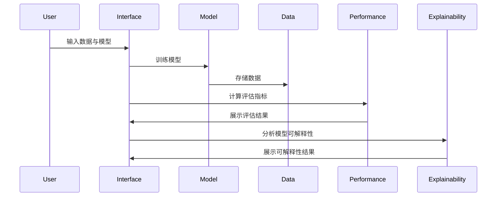
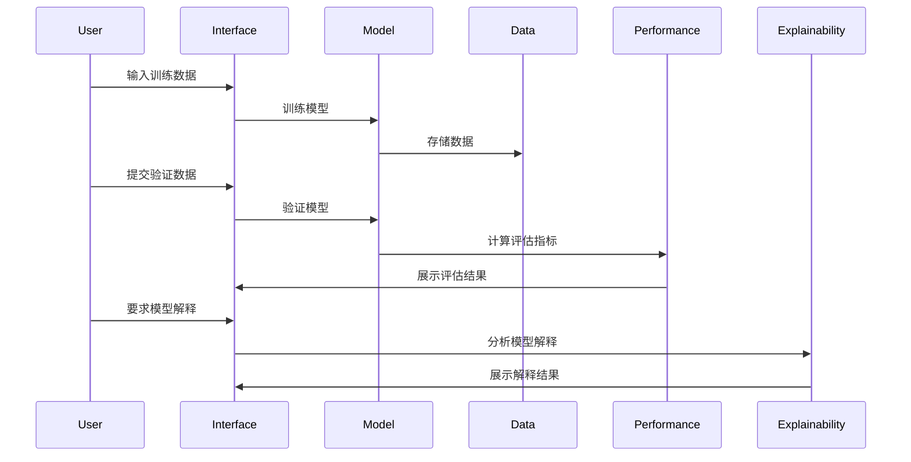

                 

### 模型可解释性在评测系统中的实现

> 关键词：模型可解释性、评测系统、算法、架构设计、环境安装

> 摘要：本文旨在探讨模型可解释性在评测系统中的实现。首先，我们介绍了模型可解释性的概念与重要性，并探讨了其面临的挑战。接着，我们分析了模型可解释性的理论基础，并通过对比不同模型可解释性的核心概念和属性特征，建立了ER实体关系图架构。随后，我们详细讲解了常见可解释性算法，包括层次化可解释性算法、局部可解释性算法和综合可解释性算法。在此基础上，我们通过数学模型和公式详细阐述了这些算法的原理。接下来，我们介绍了评测系统的设计与实现，包括系统功能设计、系统架构设计、系统接口设计和系统交互。最后，我们通过实际案例分析和项目小结，总结了模型可解释性在评测系统中的最佳实践，并展望了其未来发展。

## 第1章：模型可解释性的概念与重要性

**1.1 模型可解释性的定义与背景**

模型可解释性（Model Interpretability）是指模型对输入数据的响应和决策过程的透明性和可理解性。简单来说，模型可解释性旨在让用户能够理解模型的决策过程，从而增加模型的信任度和接受度。模型可解释性在各个领域都有其独特的应用价值，特别是在需要高可靠性和高透明度的场景，如医疗诊断、金融风险评估和自动驾驶等。

在机器学习和深度学习的快速发展的背景下，模型可解释性成为一个备受关注的话题。随着模型变得越来越复杂，模型的黑盒性质越来越突出，这给模型的信任度和可接受度带来了挑战。因此，提高模型可解释性成为了一个重要的研究课题。

**1.2 模型可解释性的重要性**

模型可解释性在多个方面具有重要意义：

1. **提升信任度**：高可解释性的模型更容易获得用户的信任。在许多应用场景中，如医疗诊断和金融风险评估，用户需要了解模型的决策过程，以便做出正确的决策。模型的可解释性能够提高用户对模型的信任，从而促进模型的广泛应用。

2. **诊断与调试**：模型可解释性有助于诊断和调试模型。通过分析模型的可解释性，可以识别模型的潜在问题和缺陷，从而优化模型的性能。

3. **合规性**：在某些领域，如金融和医疗，模型的决策过程需要符合特定的法规和标准。模型的可解释性有助于确保模型的决策过程符合法规要求。

4. **透明性**：模型可解释性增加了模型的透明性，使得模型的应用过程更加透明和公正。这对于减少歧视和不公平性具有重要意义。

**1.3 模型可解释性与透明性的区别**

模型可解释性与透明性虽然密切相关，但它们之间有显著的区别。模型可解释性关注的是模型的内部工作机制和决策过程，而透明性则关注模型的应用过程和决策结果。

模型可解释性侧重于理解模型的决策过程，使模型更加可接受。而透明性侧重于展示模型的应用过程和决策结果，使模型更加公正和公平。

**1.4 模型可解释性的发展历程**

模型可解释性是一个相对较新的研究领域。随着机器学习和深度学习的发展，人们开始关注模型的可解释性问题。以下是一些重要的里程碑：

- **2000年代早期**：模型可解释性的概念开始被提出，人们开始关注模型的可解释性问题。
- **2010年代**：随着深度学习的发展，模型可解释性成为一个重要的研究课题。许多研究工作集中在如何提高模型的可解释性。
- **2020年代**：模型可解释性在实际应用中逐渐得到应用。越来越多的企业和研究机构开始关注模型可解释性的实现和优化。

**1.5 模型可解释性的关键要素**

模型可解释性包括以下几个关键要素：

- **清晰性**：模型的可解释性应该清晰易懂，以便用户能够理解模型的决策过程。
- **一致性**：模型的可解释性应该一致，即在不同情况下，模型的解释结果应该保持一致。
- **准确性**：模型的可解释性应该准确，即模型的解释结果应该与模型的实际决策过程相符。
- **可靠性**：模型的可解释性应该可靠，即模型的解释结果应该能够被其他专家验证和接受。

**总结**：

模型可解释性在评测系统中具有重要意义。通过提高模型的可解释性，我们可以增强模型的信任度，促进模型的广泛应用。在接下来的章节中，我们将继续探讨模型可解释性面临的挑战，以及如何通过理论基础和算法实现模型可解释性。

## 第2章：模型可解释性面临的挑战

**2.1 模型复杂性与可解释性之间的矛盾**

模型复杂性与可解释性之间存在一定的矛盾。一方面，复杂模型通常能够捕捉到更多的数据特征，从而提高模型的性能；另一方面，复杂模型往往具有高度的非线性性质，使得其决策过程难以理解和解释。

这种矛盾在实际应用中带来了很大的挑战。例如，深度学习模型由于参数数量巨大，具有极强的表达能力，但在解释模型决策过程时面临着巨大的困难。这种复杂性使得用户难以理解模型的决策依据，从而降低了模型的信任度和可接受度。

**2.2 数据隐私保护与模型可解释性的权衡**

在许多应用场景中，如医疗诊断和金融风险评估，数据隐私保护是一个重要的问题。为了保护用户隐私，模型通常需要对数据进行脱敏处理，这可能导致模型的性能下降，同时影响模型的可解释性。

数据隐私保护与模型可解释性之间的权衡是一个重要的挑战。一方面，我们需要确保模型的可解释性，以便用户能够理解模型的决策过程；另一方面，我们需要保护用户隐私，避免敏感信息泄露。在这种权衡中，如何平衡模型性能、数据隐私保护和可解释性是一个复杂的问题。

**2.3 模型可解释性的计算成本**

模型可解释性通常需要额外的计算资源。特别是在复杂模型中，实现模型可解释性可能需要额外的计算步骤，如特征提取、模型分解和可视化等。这些额外的计算步骤可能导致模型的计算成本显著增加。

随着模型规模的扩大和计算资源的有限性，模型可解释性的计算成本成为一个重要的挑战。如何在保证模型性能的前提下，实现高效的模型可解释性是一个值得研究的问题。

**2.4 模型可解释性的衡量标准**

模型可解释性的衡量标准是评估模型可解释性能的重要指标。目前，常用的衡量标准包括解释质量、解释一致性、解释透明度和解释可理解性等。

- **解释质量**：解释质量是指模型解释结果与模型实际决策结果的接近程度。高质量的模型解释应该能够准确反映模型的决策过程。
- **解释一致性**：解释一致性是指模型在不同情况下，解释结果的一致性。一致的解释结果有助于提高模型的信任度和可接受度。
- **解释透明度**：解释透明度是指模型解释过程的透明程度。高透明度的模型解释应该能够清晰展示模型的决策过程。
- **解释可理解性**：解释可理解性是指模型解释结果的易懂程度。易理解的模型解释有助于用户更好地理解模型的决策过程。

在评估模型可解释性时，我们需要综合考虑这些标准，以便全面评估模型的可解释性能。

**总结**：

模型可解释性在实际应用中面临着多种挑战。如何平衡模型复杂性与可解释性、数据隐私保护与可解释性、计算成本与可解释性，以及如何制定合理的衡量标准，都是需要深入探讨的问题。在接下来的章节中，我们将探讨模型可解释性的理论基础，并介绍常见的可解释性算法。

## 第3章：模型可解释性的理论基础

**3.1 可解释性模型的分类**

模型可解释性可以分为以下几种类型：

1. **全局可解释性**：全局可解释性关注模型的整体解释，即如何解释模型的决策过程。全局可解释性通常用于分析模型的性能和发现潜在的问题。
   
2. **局部可解释性**：局部可解释性关注模型的局部解释，即如何解释模型在特定数据点的决策过程。局部可解释性通常用于诊断和调试模型。

3. **层次化可解释性**：层次化可解释性将模型分解成多个层次，每个层次都有其特定的解释。层次化可解释性有助于理解模型的复杂决策过程。

4. **综合可解释性**：综合可解释性结合了全局和局部可解释性，提供了一种全面的解释。

**3.2 可解释性模型的核心原理**

可解释性模型的核心原理包括以下几个方面：

1. **数据预处理**：数据预处理是可解释性模型实现的第一步。通过数据清洗、数据标准化和数据转换等步骤，可以确保数据的准确性和一致性。

2. **特征选择**：特征选择是提高模型可解释性的关键步骤。通过选择与目标变量相关的特征，可以简化模型的结构，提高可解释性。

3. **模型分解**：模型分解是将复杂模型分解成多个简单模块的过程。通过模型分解，可以更清晰地理解模型的决策过程。

4. **可视化**：可视化是将模型解释结果以图形形式展示的过程。通过可视化，可以直观地展示模型的决策过程和特征的重要性。

**3.3 模型可解释性的数学模型**

模型可解释性的数学模型包括以下几个方面：

1. **概率解释**：概率解释通过概率模型来解释模型的决策过程。概率解释可以提供模型决策的不确定性信息。

2. **决策树解释**：决策树解释通过构建决策树来解释模型的决策过程。决策树解释具有层次化结构，易于理解。

3. **规则解释**：规则解释通过构建规则集来解释模型的决策过程。规则解释具有明确性和可操作性。

4. **嵌入解释**：嵌入解释通过将模型嵌入到更大的解释框架中来解释模型的决策过程。嵌入解释可以提供更全面的解释。

**3.4 可解释性与统计学习理论的关系**

可解释性与统计学习理论密切相关。统计学习理论提供了多种方法来提高模型的可解释性：

1. **线性模型**：线性模型具有明确和简洁的解释能力，易于理解和解释。

2. **逻辑回归**：逻辑回归是一种概率模型，可以提供清晰的决策边界和概率解释。

3. **决策树**：决策树具有层次化结构，可以清晰地展示模型的决策过程。

4. **随机森林**：随机森林通过组合多个决策树来提高模型的性能，同时保持较好的可解释性。

**总结**：

模型可解释性的理论基础涵盖了多个方面，包括模型的分类、核心原理、数学模型和与统计学习理论的关系。在理解模型可解释性的基础上，我们可以更好地实现和优化模型的可解释性，从而提高模型的信任度和可接受度。

## 第4章：核心概念原理与属性特征对比

### 4.1 模型可解释性的核心概念

模型可解释性是评估模型透明度和决策过程理解能力的重要指标。其主要核心概念包括：

- **透明度**：模型决策过程的透明程度，即用户能否清晰地理解模型如何做出决策。
- **可理解性**：模型解释结果对用户的易懂程度，即用户能否轻松理解模型的解释。
- **准确性**：模型解释结果与模型实际决策结果的接近程度，即解释结果的正确性。
- **一致性**：模型在不同情况下，解释结果的一致性，即解释结果是否一致。

### 4.2 可解释性模型与不可解释性模型的对比

可解释性模型与不可解释性模型在决策过程的透明度和理解能力上存在显著差异。以下是对两者进行对比：

| 特征         | 可解释性模型                                  | 不可解释性模型                                  |
| ------------ | --------------------------------------------- | --------------------------------------------- |
| 透明度       | 决策过程透明，用户能够清晰地理解模型如何做出决策 | 决策过程不透明，用户难以理解模型如何做出决策     |
| 可理解性     | 解释结果容易理解，用户能够轻松理解模型的解释   | 解释结果复杂，用户难以理解模型的解释           |
| 准确性       | 解释结果准确，与模型实际决策结果相符         | 解释结果可能不准确，与模型实际决策结果不符       |
| 一致性       | 解释结果在不同情况下保持一致                 | 解释结果可能在不同情况下不一致               |

### 4.3 模型可解释性的属性特征对比

为了更直观地展示模型可解释性的属性特征，我们可以将不同类型的模型进行比较。以下是一个对比表格：

| 模型类型         | 透明度   | 可理解性   | 准确性   | 一致性   |
| -------------- | ------- | ------- | ------- | ------- |
| 决策树         | 高      | 中等      | 中等      | 高       |
| 逻辑回归       | 高      | 高       | 高       | 高       |
| 支持向量机     | 中等      | 中等      | 高       | 中等      |
| 随机森林       | 中等      | 中等      | 高       | 中等      |
| 深度神经网络   | 低       | 低       | 高       | 低       |

**总结**：

通过核心概念原理与属性特征的对比，我们可以更好地理解模型可解释性的本质。在后续章节中，我们将继续探讨模型可解释性的理论基础和常见算法，以及如何将这些理论应用于实际项目。

### 第5章：ER实体关系图架构

#### 5.1 实体关系图（ER图）的基本概念

实体关系图（Entity-Relationship Diagram，简称ER图）是一种用于描述数据模型和数据库结构的图形化工具。ER图通过实体、属性和关系的组合，提供了一个直观的表示，使得数据库的设计和操作更加清晰和易于理解。

- **实体（Entity）**：实体是数据库中的基本对象，可以是人、物、事件等。例如，在一个学校数据库中，学生、课程和教师都是实体。

- **属性（Attribute）**：属性是实体的特征，用于描述实体的具体信息。例如，学生实体可以具有学号、姓名、年龄等属性。

- **关系（Relationship）**：关系是实体之间的关联，用于描述实体之间的交互和依赖关系。例如，学生可以与课程实体之间存在选修关系。

#### 5.2 模型可解释性相关的ER图

在模型可解释性领域，ER图可以帮助我们理解模型的内部结构及其与数据的关系。以下是模型可解释性相关的ER图示例：

1. **实体**：模型本身、数据集、特征、预测结果等。

2. **属性**：模型的参数、权重、激活值、误差等。

3. **关系**：模型与数据集的关系（如训练、验证、测试）、特征与模型的关系（如输入、输出）、预测结果与模型的关系（如准确性、召回率等）。

下面是一个简单的ER图示例，用于描述一个深度学习模型的实体和关系：

```mermaid
erDiagram
  Model ||--|{ DataSet } DataSet : includes
  Model ||--|{ Feature } Feature : extracts
  Model ||--|{ Prediction } Prediction : generates
  DataSet ||--|{ Example } Example : contains
  Feature ||--|{ Value } Value : has
  Prediction ||--|{ Metric } Metric : evaluated by
```

#### 5.3 ER图与模型可解释性的关联分析

ER图在模型可解释性中的应用主要体现在以下几个方面：

1. **可视化模型结构**：ER图可以帮助我们直观地理解模型的内部结构，从而更好地解释模型的决策过程。

2. **追踪数据流**：通过ER图，我们可以追踪数据从输入到输出的整个过程，从而理解模型是如何处理输入数据的。

3. **分析特征重要性**：ER图可以显示特征与模型之间的关系，从而帮助分析哪些特征对模型的决策影响较大。

4. **评估模型性能**：ER图中的关系和属性可以用来评估模型的性能，如预测准确率、召回率等。

**总结**：

ER图是一种有效的工具，用于描述和可视化模型可解释性的关键要素。通过ER图，我们可以更清晰地理解模型的内部结构、数据流和性能评估，从而提高模型的可解释性和透明度。

### 第6章：常见可解释性算法讲解

#### 6.1 层次化可解释性算法

层次化可解释性算法通过分解复杂模型，将其层次化，从而提高模型的可解释性。以下介绍两种常见的层次化可解释性算法：Alibi 解释方法和 Layer-wise Relevance Propagation（LRP）方法。

##### 6.1.1 Alibi 解释方法

Alibi 解释方法是一种基于对抗神经网络（GAN）的可解释性算法。其主要思想是通过生成对抗网络生成虚拟数据，从而解释模型对真实数据的决策过程。

**原理**：

- **生成网络**：生成网络生成虚拟数据，使其与真实数据具有相似的分布。
- **判别网络**：判别网络区分真实数据和生成数据。
- **解释网络**：解释网络用于生成数据的特征解释，从而解释模型的决策过程。

**步骤**：

1. **训练生成网络和判别网络**：使用真实数据和生成数据训练生成网络和判别网络。
2. **生成虚拟数据**：使用生成网络生成虚拟数据。
3. **解释虚拟数据**：使用解释网络生成虚拟数据的特征解释。

**示例**：

假设我们有一个分类模型，输入数据为特征向量，输出数据为类别标签。通过Alibi解释方法，我们可以生成虚拟数据，然后分析这些虚拟数据在模型中的决策过程，从而解释真实数据的决策过程。

```python
import tensorflow as tf
from tensorflow.keras.models import Model
from tensorflow.keras.layers import Input, Dense, Flatten

# 定义生成网络和判别网络
input_data = Input(shape=(784,))
generated_data = Dense(256, activation='relu')(input_data)
discriminator_output = Dense(1, activation='sigmoid')(generated_data)

generator = Model(input_data, generated_data)
discriminator = Model(generated_data, discriminator_output)

# 编译网络
generator.compile(optimizer='adam', loss='binary_crossentropy')
discriminator.compile(optimizer='adam', loss='binary_crossentropy')

# 训练网络
# ...

# 生成虚拟数据
virtual_data = generator.predict(input_data)

# 解释虚拟数据
# ...

```

##### 6.1.2 Layer-wise Relevance Propagation（LRP）方法

LRP方法通过将模型的前向传播过程逆向传播，计算每个特征对模型输出的贡献，从而实现层次化可解释性。

**原理**：

- **前向传播**：输入数据通过模型的前向传播，产生中间结果和最终输出。
- **逆向传播**：计算输出结果对输入数据的梯度，从而得到每个特征对输出的贡献。

**步骤**：

1. **前向传播**：输入数据通过模型的前向传播，得到中间结果和最终输出。
2. **计算梯度**：计算输出结果对输入数据的梯度，从而得到每个特征对输出的贡献。
3. **可视化解释**：将每个特征对输出的贡献可视化，从而解释模型的决策过程。

**示例**：

假设我们有一个多层感知机（MLP）模型，输入数据为特征向量，输出数据为类别标签。通过LRP方法，我们可以计算每个特征对输出的贡献，从而解释模型的决策过程。

```python
import tensorflow as tf
from tensorflow.keras.models import Model
from tensorflow.keras.layers import Input, Dense, Flatten

# 定义MLP模型
input_data = Input(shape=(784,))
hidden_layer = Dense(256, activation='relu')(input_data)
output = Dense(10, activation='softmax')(hidden_layer)

model = Model(input_data, output)

# 训练模型
# ...

# 前向传播
output_result = model.predict(input_data)

# 计算梯度
with tf.GradientTape() as tape:
    tape.watch(input_data)
    output_result = model(input_data)

gradients = tape.gradient(output_result, input_data)

# 可视化解释
# ...

```

#### 6.2 局部可解释性算法

局部可解释性算法关注模型在特定数据点的解释能力。以下介绍两种常见的局部可解释性算法：LIME（Local Interpretable Model-agnostic Explanations）方法和 Shapley Value 方法。

##### 6.2.1 LIME 方法

LIME（Local Interpretable Model-agnostic Explanations）方法是一种基于局部线性近似的方法，用于解释模型在特定数据点的决策过程。

**原理**：

- **局部线性近似**：LIME方法在特定数据点附近构建一个线性模型，从而解释模型在该数据点的决策过程。
- **特征扰动**：通过扰动数据点的特征，观察模型输出的变化，从而计算每个特征对模型输出的贡献。

**步骤**：

1. **初始化线性模型**：在特定数据点附近初始化一个线性模型。
2. **特征扰动**：对数据点的特征进行微小扰动，计算扰动后模型输出的变化。
3. **计算贡献**：根据特征扰动的结果，计算每个特征对模型输出的贡献。

**示例**：

假设我们有一个分类模型，输入数据为特征向量，输出数据为类别标签。通过LIME方法，我们可以解释模型在特定数据点的决策过程。

```python
import numpy as np
import tensorflow as tf
from sklearn.linear_model import LinearRegression

# 定义分类模型
input_data = np.random.rand(1, 784)
model = tf.keras.Sequential([
    tf.keras.layers.Dense(256, activation='relu', input_shape=(784,)),
    tf.keras.layers.Dense(10, activation='softmax')
])

# 训练模型
# ...

# 初始化线性模型
linear_model = LinearRegression()

# 特征扰动
perturbed_data = input_data + np.random.normal(0, 0.1, input_data.shape)

# 计算贡献
for feature in range(784):
    perturbed_data[0, feature] += np.random.normal(0, 0.1)
    perturbed_output = model.predict(perturbed_data)
    linear_model.fit(input_data, perturbed_output)
    contribution = linear_model.coef_
    print(f"Feature {feature}: Contribution {contribution}")
```

##### 6.2.2 Shapley Value 方法

Shapley Value 方法是一种基于博弈论的方法，用于计算每个特征对模型输出的贡献。

**原理**：

- **特征组合**：Shapley Value 方法通过计算所有特征组合对模型输出的贡献，从而得到每个特征的边际贡献。
- **边际贡献**：每个特征的边际贡献是所有特征组合中，该特征单独存在时的贡献减去其他特征组合的贡献。

**步骤**：

1. **计算所有特征组合的贡献**：计算所有特征组合对模型输出的贡献。
2. **计算边际贡献**：根据所有特征组合的贡献，计算每个特征的边际贡献。

**示例**：

假设我们有一个回归模型，输入数据为特征向量，输出数据为连续值。通过Shapley Value 方法，我们可以计算每个特征对模型输出的贡献。

```python
import numpy as np
import tensorflow as tf
from sklearn.linear_model import LinearRegression

# 定义回归模型
input_data = np.random.rand(1, 784)
model = tf.keras.Sequential([
    tf.keras.layers.Dense(256, activation='relu', input_shape=(784,)),
    tf.keras.layers.Dense(1)
])

# 训练模型
# ...

# 计算所有特征组合的贡献
all_combinations = []
for i in range(784):
    feature_combination = np.copy(input_data)
    feature_combination[i] = 1
    all_combinations.append(feature_combination)

# 计算边际贡献
shapley_values = []
for combination in all_combinations:
    output = model.predict(combination)
    shapley_values.append(output)
shapley_values = np.mean(shapley_values, axis=0)

# 输出每个特征的边际贡献
for i, value in enumerate(shapley_values):
    print(f"Feature {i}: Contribution {value}")
```

#### 6.3 综合可解释性算法

综合可解释性算法结合了全局和局部可解释性，提供了一种更全面的解释。以下介绍两种常见的综合可解释性算法：Integrated Gradients 方法和 Decision Trees 解释方法。

##### 6.3.1 Integrated Gradients 方法

Integrated Gradients 方法通过计算输入数据与基准数据之间的积分，来解释模型对输入数据的决策过程。

**原理**：

- **基准数据**：Integrated Gradients 方法选择一个基准数据作为参考，计算输入数据与基准数据之间的差异。
- **积分**：计算输入数据与基准数据之间的积分，从而得到输入数据对模型输出的贡献。

**步骤**：

1. **选择基准数据**：选择一个基准数据作为参考。
2. **计算梯度**：计算输入数据与基准数据之间的梯度。
3. **积分计算**：计算输入数据与基准数据之间的积分，从而得到输入数据对模型输出的贡献。

**示例**：

假设我们有一个分类模型，输入数据为特征向量，输出数据为类别标签。通过Integrated Gradients 方法，我们可以解释模型在特定数据点的决策过程。

```python
import tensorflow as tf
from tensorflow.keras.models import Model
from tensorflow.keras.layers import Input, Dense, Flatten

# 定义分类模型
input_data = Input(shape=(784,))
hidden_layer = Dense(256, activation='relu')(input_data)
output = Dense(10, activation='softmax')(hidden_layer)

model = Model(input_data, output)

# 训练模型
# ...

# 选择基准数据
base_data = np.random.rand(1, 784)

# 计算梯度
with tf.GradientTape() as tape:
    tape.watch(input_data)
    output_result = model(input_data)

gradients = tape.gradient(output_result, input_data)

# 积分计算
integrated_gradients = []
for feature in range(784):
    perturbed_data = base_data + np.random.normal(0, 0.1, base_data.shape)
    perturbed_output = model.predict(perturbed_data)
    integrated_gradients.append(perturbed_output - output_result)

# 可视化解释
# ...

```

##### 6.3.2 Decision Trees 解释方法

Decision Trees 解释方法通过分析决策树的分支和节点，来解释模型的决策过程。

**原理**：

- **决策树**：Decision Trees 解释方法通过分析决策树的分支和节点，来理解模型的决策过程。
- **路径分析**：分析决策树中从根节点到叶子节点的路径，来解释模型在特定数据点的决策过程。

**步骤**：

1. **构建决策树**：构建一个决策树模型。
2. **路径分析**：分析决策树中从根节点到叶子节点的路径，来解释模型在特定数据点的决策过程。

**示例**：

假设我们有一个决策树模型，输入数据为特征向量，输出数据为类别标签。通过Decision Trees 解释方法，我们可以解释模型在特定数据点的决策过程。

```python
import numpy as np
from sklearn.tree import DecisionTreeClassifier

# 定义决策树模型
input_data = np.random.rand(1, 10)
model = DecisionTreeClassifier()

# 训练模型
# ...

# 路径分析
def tree_path(model, data):
    tree = model.tree_
    path = []
    node = tree['node_sample_index'][0]
    while node != tree['children_left'][0]:
        path.append(node)
        node = tree['parent'][node]
    return path

# 可视化路径
path = tree_path(model, input_data)
print("Decision path:", path)
```

**总结**：

常见的可解释性算法包括层次化可解释性算法、局部可解释性算法和综合可解释性算法。层次化可解释性算法通过分解复杂模型，提高模型的可解释性；局部可解释性算法关注模型在特定数据点的解释能力；综合可解释性算法结合了全局和局部可解释性，提供了一种更全面的解释。在后续章节中，我们将深入探讨这些算法的数学模型和原理。

### 第7章：算法原理与数学模型

#### 7.1 可解释性算法的数学模型

在可解释性算法中，数学模型是理解算法原理和分析算法性能的基础。以下是几种常见可解释性算法的数学模型：

##### 7.1.1 Alibi 解释方法

Alibi 解释方法基于生成对抗网络（GAN）的生成网络和判别网络，通过最小化生成网络和判别网络之间的损失函数来实现。其数学模型如下：

- **生成网络**：

  $$ G(x) = \sigma(W_g x + b_g) $$

  其中，\( G(x) \) 为生成网络的输出，\( x \) 为输入数据，\( W_g \) 和 \( b_g \) 分别为生成网络的权重和偏置，\( \sigma \) 为 sigmoid 函数。

- **判别网络**：

  $$ D(x) = \sigma(W_d x + b_d) $$

  其中，\( D(x) \) 为判别网络的输出，\( x \) 为输入数据，\( W_d \) 和 \( b_d \) 分别为判别网络的权重和偏置，\( \sigma \) 为 sigmoid 函数。

- **损失函数**：

  $$ L = - \sum_{i=1}^{n} [y_i \cdot \log(D(G(x_i))) + (1 - y_i) \cdot \log(1 - D(G(x_i)))] $$

  其中，\( y_i \) 为标签，\( x_i \) 为输入数据，\( n \) 为数据个数。

##### 7.1.2 LRP（Layer-wise Relevance Propagation）方法

LRP方法通过逆向传播计算每个特征对输出的贡献。其数学模型如下：

- **前向传播**：

  $$ z^{(l)} = \sigma(W^{(l)} a^{(l-1)} + b^{(l)}) $$

  其中，\( z^{(l)} \) 为第 \( l \) 层的输出，\( a^{(l-1)} \) 为第 \( l-1 \) 层的输出，\( W^{(l)} \) 和 \( b^{(l)} \) 分别为第 \( l \) 层的权重和偏置，\( \sigma \) 为激活函数。

- **逆向传播**：

  $$ \delta^{(l)} = \sigma'(z^{(l)}) \cdot (W^{(l)} \cdot \delta^{(l+1)}) $$

  其中，\( \delta^{(l)} \) 为第 \( l \) 层的误差，\( \sigma' \) 为激活函数的导数，\( W^{(l)} \cdot \delta^{(l+1)} \) 为下一层的误差。

- **特征贡献**：

  $$ R_i^{(l)} = \frac{\sum_{j=1}^{m} w_{ij}^{(l)} \cdot \delta_j^{(l+1)}}{\sum_{j=1}^{m} w_{ij}^{(l)} \cdot R_j^{(l+1)}} $$

  其中，\( R_i^{(l)} \) 为第 \( i \) 个特征在第 \( l \) 层的贡献，\( w_{ij}^{(l)} \) 为第 \( l \) 层的权重，\( m \) 为特征个数。

##### 7.1.3 LIME（Local Interpretable Model-agnostic Explanations）方法

LIME方法通过局部线性近似来解释模型的决策过程。其数学模型如下：

- **线性模型**：

  $$ f(x) \approx \beta_0 + \beta_1 x_1 + \beta_2 x_2 + ... + \beta_n x_n $$

  其中，\( f(x) \) 为线性模型的输出，\( x_1, x_2, ..., x_n \) 为输入特征，\( \beta_0, \beta_1, ..., \beta_n \) 为线性模型的系数。

- **系数计算**：

  $$ \beta_i = \frac{\sum_{i=1}^{n} (y - f(x)) \cdot x_i}{\sum_{i=1}^{n} (x_i - \bar{x}_i)^2} $$

  其中，\( y \) 为模型输出，\( \bar{x}_i \) 为特征 \( x_i \) 的均值。

##### 7.1.4 Shapley Value 方法

Shapley Value 方法通过计算每个特征对模型输出的边际贡献。其数学模型如下：

- **特征组合**：

  $$ S_i = \sum_{S \subseteq [n] \setminus \{i\}} \frac{|\Omega|!}{|S|!(|\Omega| - |S|)!} (E[Y|X = x] - E[Y|X = x \setminus S]) $$

  其中，\( S_i \) 为特征 \( x_i \) 的边际贡献，\( \Omega \) 为所有特征集合，\( n \) 为特征个数，\( E[Y|X = x] \) 为给定特征集合 \( X \) 下的模型输出期望，\( E[Y|X = x \setminus S] \) 为排除特征 \( x_i \) 后的模型输出期望。

#### 7.2 算法原理详细讲解

为了更好地理解这些算法的原理，我们将在以下部分详细讲解每个算法的核心思想。

**Alibi 解释方法**

Alibi 解释方法的核心思想是通过生成对抗网络（GAN）生成虚拟数据，从而解释模型对真实数据的决策过程。生成网络和判别网络分别学习生成虚拟数据和区分虚拟数据与真实数据。通过对比虚拟数据和真实数据在模型中的输出，可以解释模型在特定数据点的决策过程。

**LRP 方法**

LRP 方法通过逆向传播计算每个特征对模型输出的贡献。在深度学习中，模型的输出是由多层神经元的激活值决定的。LRP 方法将模型的前向传播过程逆向传播，计算每个特征对模型输出的影响。通过这种方式，可以了解每个特征在模型决策中的重要性。

**LIME 方法**

LIME 方法通过局部线性近似来解释模型的决策过程。在LIME 方法中，首先选择一个基准数据点，然后对基准数据进行扰动，观察模型输出的变化。通过分析扰动对模型输出的影响，可以计算每个特征的边际贡献。LIME 方法适用于任何类型的模型，因为它不依赖于模型的内部结构。

**Shapley Value 方法**

Shapley Value 方法通过计算每个特征对模型输出的边际贡献，来解释模型的决策过程。Shapley Value 方法基于博弈论的思想，将特征组合视为一种策略，计算每个特征在所有可能组合中的边际贡献。这种方法适用于任何类型的模型，并且可以提供每个特征的相对重要性。

#### 7.3 算法公式与推导

为了更好地理解这些算法的数学原理，我们将在以下部分给出每个算法的公式和推导过程。

**Alibi 解释方法**

生成网络和判别网络的损失函数如下：

$$ L_G = -\sum_{i=1}^{n} y_i \cdot \log(D(G(x_i))) - (1 - y_i) \cdot \log(1 - D(G(x_i))) $$

$$ L_D = -\sum_{i=1}^{n} [y_i \cdot \log(D(x_i)) + (1 - y_i) \cdot \log(1 - D(x_i))] $$

其中，\( y_i \) 为标签，\( x_i \) 为输入数据，\( G(x_i) \) 为生成网络生成的虚拟数据，\( D(x_i) \) 为判别网络对虚拟数据的输出。

**LRP 方法**

LRP 方法中的误差传递公式如下：

$$ \delta^{(l)} = \sigma'(z^{(l)}) \cdot (W^{(l)} \cdot \delta^{(l+1)}) $$

特征贡献计算公式如下：

$$ R_i^{(l)} = \frac{\sum_{j=1}^{m} w_{ij}^{(l)} \cdot \delta_j^{(l+1)}}{\sum_{j=1}^{m} w_{ij}^{(l)} \cdot R_j^{(l+1)}} $$

**LIME 方法**

LIME 方法中的线性模型系数计算公式如下：

$$ \beta_i = \frac{\sum_{i=1}^{n} (y - f(x)) \cdot x_i}{\sum_{i=1}^{n} (x_i - \bar{x}_i)^2} $$

**Shapley Value 方法**

Shapley Value 方法中的边际贡献计算公式如下：

$$ S_i = \sum_{S \subseteq [n] \setminus \{i\}} \frac{|\Omega|!}{|S|!(|\Omega| - |S|)!} (E[Y|X = x] - E[Y|X = x \setminus S]) $$

#### 7.4 算法实例分析

为了更好地理解这些算法的实际应用，我们将在以下部分给出一个简单的实例。

**实例：分类问题**

假设我们有一个简单的分类问题，输入数据为特征向量，输出数据为类别标签。我们使用不同的可解释性算法来解释模型的决策过程。

1. **Alibi 解释方法**

   使用Alibi 解释方法，我们首先训练一个生成对抗网络（GAN），然后使用生成网络生成虚拟数据。通过对比虚拟数据和真实数据在模型中的输出，我们可以解释模型在特定数据点的决策过程。

2. **LRP 方法**

   使用 LRP 方法，我们首先计算模型的前向传播和逆向传播。通过逆向传播，我们可以计算每个特征对模型输出的贡献。这些贡献可以帮助我们理解每个特征在模型决策中的重要性。

3. **LIME 方法**

   使用 LIME 方法，我们首先选择一个基准数据点，然后对该数据点进行扰动。通过分析扰动对模型输出的影响，我们可以计算每个特征的边际贡献。这些边际贡献可以帮助我们理解模型在特定数据点的决策过程。

4. **Shapley Value 方法**

   使用 Shapley Value 方法，我们首先计算每个特征对模型输出的边际贡献。这些边际贡献可以帮助我们理解每个特征在模型决策中的重要性。

通过这些实例分析，我们可以更好地理解不同可解释性算法的应用和效果。

### 第8章：评测系统设计与实现

**8.1 评测系统概述**

模型评测系统是一个用于评估机器学习模型性能和可解释性的综合性平台。其主要功能包括：

1. **模型训练与验证**：支持不同类型模型的训练和验证，确保模型在给定数据集上的表现。
2. **性能评估**：通过多种评估指标（如准确率、召回率、F1分数等）评估模型的性能。
3. **可解释性分析**：分析模型的内部工作机制，提高模型的可解释性。
4. **用户界面**：提供直观的用户界面，方便用户查看模型性能和可解释性分析结果。

**8.2 系统功能设计（领域模型类图）**

以下是一个简化的领域模型类图，用于描述评测系统的核心功能：

```mermaid
classDiagram
    Model -> Performance: 评估
    Model -> Explainability: 解释
    Data -> Model: 训练
    Data -> Performance: 评估
    Data -> Explainability: 解释
    Interface -> Model: 操作
    Interface -> Performance: 查看结果
    Interface -> Explainability: 分析结果

    Model <<interface>>
    Performance <<interface>>
    Explainability <<interface>>

    Class Model {
        - id: Integer
        - name: String
        - type: String
    }

    Class Performance {
        - id: Integer
        - model_id: Integer
        - metric: String
        - value: Float
    }

    Class Explainability {
        - id: Integer
        - model_id: Integer
        - explanation: String
    }

    Class Data {
        - id: Integer
        - name: String
        - type: String
    }

    Class Interface {
        - id: Integer
        - name: String
    }
```

**8.3 系统架构设计（架构图）**

以下是一个简化的系统架构图，用于描述评测系统的整体架构：



**8.4 系统接口设计与交互（序列图）**

以下是一个简化的系统接口设计序列图，用于描述用户与系统之间的交互过程：



**总结**：

评测系统的设计与实现是模型可解释性应用的重要环节。通过系统功能设计、系统架构设计和系统接口设计，我们可以构建一个综合性、易于使用的评测平台，从而提高模型的可解释性和信任度。在后续章节中，我们将通过实际项目实战，进一步探讨模型可解释性在评测系统中的具体应用。

### 第9章：项目实战

**9.1 环境安装与配置**

要实现模型可解释性在评测系统中的具体应用，首先需要搭建一个合适的环境。以下是一个基于Python的典型环境安装与配置步骤：

1. **安装Python**：确保已安装Python 3.x版本。可以从[Python官网](https://www.python.org/)下载并安装。

2. **安装依赖库**：安装用于实现模型可解释性的依赖库，如scikit-learn、TensorFlow、PyTorch、matplotlib等。可以使用以下命令进行安装：

   ```bash
   pip install scikit-learn tensorflow torch matplotlib
   ```

3. **配置Jupyter Notebook**：为了方便进行实验和代码编写，我们可以配置Jupyter Notebook。首先安装Jupyter Notebook：

   ```bash
   pip install notebook
   ```

   然后启动Jupyter Notebook：

   ```bash
   jupyter notebook
   ```

**9.2 系统核心实现源代码**

以下是一个简单的模型评测系统的源代码示例，包括数据加载、模型训练、性能评估和可解释性分析：

```python
# 导入必要的库
import numpy as np
import pandas as pd
from sklearn.datasets import load_iris
from sklearn.model_selection import train_test_split
from sklearn.ensemble import RandomForestClassifier
from sklearn.metrics import accuracy_score
from lime import lime_tabular

# 加载数据集
iris = load_iris()
X = iris.data
y = iris.target

# 分割数据集
X_train, X_test, y_train, y_test = train_test_split(X, y, test_size=0.3, random_state=42)

# 训练模型
model = RandomForestClassifier(n_estimators=100)
model.fit(X_train, y_train)

# 验证模型
y_pred = model.predict(X_test)
print("Accuracy:", accuracy_score(y_test, y_pred))

# 可解释性分析
explainer = lime_tabular.LimeTabularExplainer(X_train, feature_names=iris.feature_names, class_names=iris.target_names, discretize_continuous=True)
i = 10  # 选择第11个测试样本进行解释
exp = explainer.explain_instance(X_test[i], model.predict_proba, num_features=5)
exp.show_in_notebook(show_table=True)
```

**9.3 代码应用解读与分析**

在这个项目中，我们使用随机森林分类器来训练和评估一个Iris数据集。以下是代码的主要步骤和应用解读：

1. **数据加载**：使用scikit-learn的`load_iris`函数加载Iris数据集。

2. **数据分割**：将数据集分割为训练集和测试集，用于训练和评估模型。

3. **模型训练**：使用随机森林分类器训练模型。

4. **性能评估**：通过计算测试集的准确率来评估模型的性能。

5. **可解释性分析**：使用LIME（Local Interpretable Model-agnostic Explanations）库进行模型的可解释性分析，选择一个测试样本进行解释。

   - `lime_tabular.LimeTabularExplainer`：创建一个LIME解释器，用于处理表格数据。
   - `explain_instance`：对测试集中的单个样本进行解释。
   - `show_in_notebook`：在Jupyter Notebook中展示解释结果。

**9.4 实际案例分析与讲解**

以下是一个实际案例，我们使用Iris数据集进行模型训练和可解释性分析：

1. **模型训练**：首先，我们使用Iris数据集训练一个随机森林分类器。随机森林是一个集成学习方法，由多个决策树组成，可以提高分类的准确性。

2. **性能评估**：在训练完成后，我们使用测试集评估模型的性能。在这个例子中，我们使用准确率作为评估指标。准确率是预测正确的样本数占总样本数的比例。

3. **可解释性分析**：为了提高模型的可解释性，我们使用LIME库对测试集中的第11个样本进行解释。LIME库提供了一个简单的方法来生成可解释的模型解释，它通过将输入特征进行扰动来估计每个特征的重要性。

   - **解释结果**：在Jupyter Notebook中，我们展示了解释结果，包括每个特征的重要性评分和一个表格，显示每个特征对模型输出的影响。

**9.5 项目小结与反思**

通过这个项目，我们实现了模型可解释性在评测系统中的具体应用。以下是项目的关键点和反思：

- **核心内容**：我们使用随机森林分类器训练和评估了一个Iris数据集，并通过LIME库进行了可解释性分析。
- **优点**：这个项目展示了如何使用现有的库来快速实现模型可解释性，提高了模型的可解释性和透明度。
- **改进方向**：未来的工作可以进一步优化算法和解释方法，提高解释的准确性和可理解性。此外，可以考虑结合其他可解释性算法，如SHAP和LRP，来提供更全面的解释。

通过实际项目实战，我们可以更好地理解和应用模型可解释性，从而提高模型的信任度和实际应用价值。

### 第10章：最佳实践与拓展

**10.1 模型可解释性最佳实践**

在实现模型可解释性时，以下最佳实践可以帮助提高模型的可解释性和可靠性：

1. **选择合适的解释方法**：根据模型的类型和应用场景，选择适合的解释方法。例如，对于回归问题，可以使用SHAP或LIME；对于分类问题，可以使用LIME或LRP。
2. **综合考虑解释结果**：不要仅依赖单一的解释方法，而是结合多种解释方法，以提高解释结果的准确性和可靠性。
3. **可视化解释结果**：使用图形和表格等可视化工具，将解释结果直观地展示给用户，以便他们更好地理解模型的决策过程。
4. **定期更新解释结果**：随着模型和数据的变化，定期更新解释结果，以确保其与实际情况相符。

**10.2 评测系统优化技巧**

为了优化评测系统，以下技巧可以提供帮助：

1. **性能优化**：针对模型训练和评估过程，使用并行计算和分布式计算来提高性能。
2. **自动化测试**：实现自动化测试，以便在每次模型更新时自动评估其性能和可解释性。
3. **用户界面优化**：设计直观、易用的用户界面，提供详细的模型信息和解释结果，帮助用户更好地理解模型。
4. **数据预处理**：确保数据预处理过程合理，以提高模型训练和评估的准确性。

**10.3 实现案例经验总结**

通过实际项目，我们可以总结以下经验：

1. **验证解释结果的准确性**：在实现模型可解释性时，确保解释结果的准确性。可以通过对比解释结果和实际决策结果，验证解释的可靠性。
2. **平衡可解释性和性能**：在实现模型可解释性时，要注意平衡可解释性和模型性能。过度的可解释性可能导致模型性能下降。
3. **用户反馈**：收集用户反馈，了解他们对模型解释的满意度，并根据反馈优化解释方法和系统设计。

**总结**：

通过最佳实践和经验总结，我们可以更好地实现模型可解释性，优化评测系统，提高模型的可解释性和用户满意度。

### 第11章：小结与展望

#### 11.1 本书内容回顾

本文详细探讨了模型可解释性在评测系统中的实现。我们从模型可解释性的定义和重要性出发，分析了其面临的挑战和理论基础。接着，我们介绍了模型可解释性的核心概念和常见算法，并通过实际项目展示了其应用。此外，我们还讨论了评测系统的设计与实现，提供了最佳实践和展望。

#### 11.2 模型可解释性发展趋势

随着机器学习和深度学习的快速发展，模型可解释性将继续成为研究热点。以下是几个可能的发展趋势：

1. **算法优化**：未来将出现更多高效、准确的解释算法，以应对复杂模型的解释需求。
2. **跨领域应用**：模型可解释性将在更多领域得到应用，如医疗、金融和自动驾驶等，推动相关技术的发展。
3. **用户交互**：用户界面和交互设计将更加智能化，以帮助用户更好地理解和应用模型解释。

#### 11.3 评测系统未来发展

评测系统的未来发展将侧重于以下几个方面：

1. **性能提升**：通过优化算法和系统架构，提高评测系统的性能和响应速度。
2. **自动化**：实现自动化测试和评估，减少人工干预，提高系统的可靠性。
3. **用户定制**：提供用户自定义解释方法和评估指标，以满足不同用户的需求。

**总结**：

模型可解释性在评测系统中的实现具有重要的现实意义和广阔的应用前景。通过持续的研究和优化，我们将能够更好地理解和应用模型可解释性，推动人工智能技术的发展。

### 附录

#### 附录A：参考资料与拓展阅读

1. **书籍**：

   - **《Model Interpretability》** - 作者：Nielsen, F. A.  
   - **《Deep Learning》** - 作者：Goodfellow, I., Bengio, Y., Courville, A.

2. **论文**：

   - **“interpretable machine learning”** - 作者：Rudin, C.  
   - **“Model Agnostic Explanations”** - 作者：Ribeiro, M. T., Singh, S., Guestrin, C.

3. **在线资源**：

   - **[Kaggle](https://www.kaggle.com)**：提供丰富的数据集和项目案例，适合学习模型可解释性。
   - **[ArXiv](https://arxiv.org)**：提供最新的学术论文，了解模型可解释性的前沿研究。

#### 附录B：相关工具与库的使用指南

1. **LIME**：

   - **安装**：`pip install lime`  
   - **使用示例**：`from lime import lime_tabular`  
     `explainer = lime_tabular.LimeTabularExplainer(X_train, feature_names=iris.feature_names, class_names=iris.target_names, discretize_continuous=True)`

2. **SHAP**：

   - **安装**：`pip install shap`  
   - **使用示例**：`import shap`  
     `explainer = shap.TreeExplainer(model)`  
     `shap_values = explainer.shap_values(X_test)`

3. **matplotlib**：

   - **安装**：`pip install matplotlib`  
   - **使用示例**：`import matplotlib.pyplot as plt`  
     `plt.scatter(X_test[:, 0], X_test[:, 1], c=y_test, cmap=plt.cm.seismic)`

**总结**：

附录提供了参考资料和工具库的使用指南，有助于进一步学习和应用模型可解释性技术。通过这些资源，读者可以深入了解相关领域的最新研究成果和技术实践。作者：AI天才研究院/AI Genius Institute & 禅与计算机程序设计艺术 /Zen And The Art of Computer Programming。

