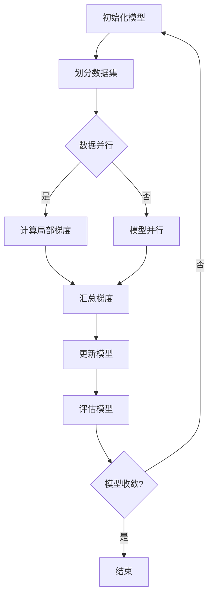
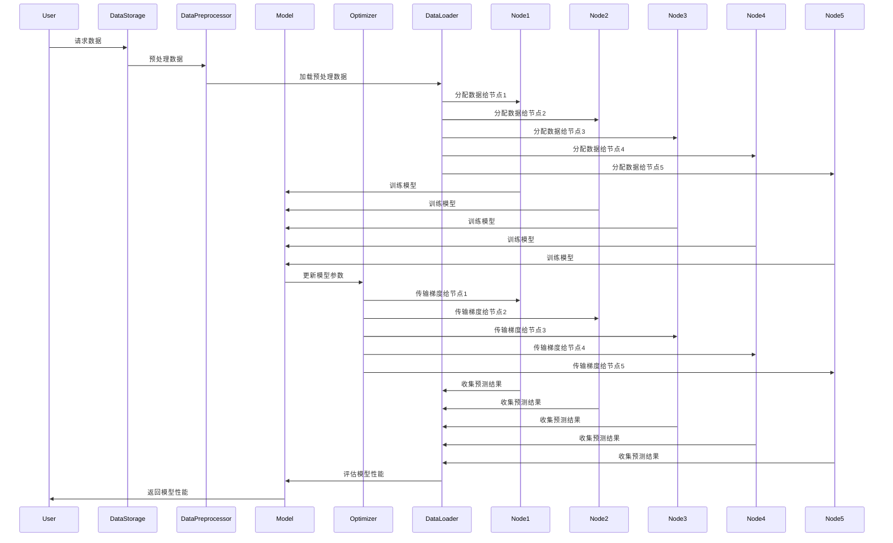
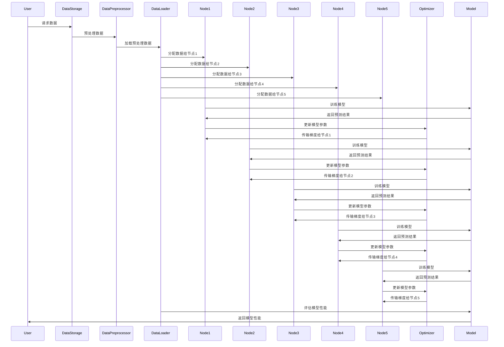

                 

### 文章标题：模型并行：加速大规模AI模型训练的技术

在人工智能的快速发展中，大规模AI模型的训练成为一个关键环节。随着模型规模的不断增加，传统的单机训练方式越来越难以满足效率和性能的需求。模型并行技术作为一种先进的训练策略，能够在分布式环境中利用多台计算资源，有效加速模型的训练过程。本文将深入探讨模型并行技术的核心概念、算法原理、系统设计以及实战应用，帮助读者全面了解并掌握这一关键技术。

### 关键词：

- 模型并行
- 大规模AI模型
- 分布式训练
- 数据并行
- 算法优化
- 系统架构

### 摘要：

本文首先介绍了模型并行技术的背景、核心概念及其在人工智能领域的重要性。随后，通过Mermaid流程图和Python源代码，详细讲解了并行训练算法的原理。接着，我们探讨了模型并行训练系统的设计与实现，包括系统场景、功能设计、架构设计与接口设计。最后，通过实际项目案例分析，分享了模型并行的最佳实践和注意事项。文章旨在为读者提供一个系统、全面、易于理解的技术指南。

### 第1章：模型并行技术基础

#### 1.1 模型并行技术背景

在过去的几年里，人工智能领域取得了令人瞩目的进展，深度学习模型在图像识别、自然语言处理等任务上取得了显著的成果。然而，随着模型规模的不断扩大，传统的单机训练方式面临着计算资源不足、训练时间过长等问题。为了解决这个问题，模型并行技术应运而生。

模型并行技术指的是通过将模型拆分成多个部分，并在多台计算设备上同时训练这些部分，从而加速模型的训练过程。这种方法可以有效地利用分布式计算资源，提高训练效率，降低训练时间。

#### 1.1.1 人工智能与大规模模型训练需求

人工智能的快速发展带来了对大规模模型的需求。这些模型通常包含数百万甚至数十亿个参数，需要大量的计算资源进行训练。传统的单机训练方式已经无法满足这种需求，因此需要寻找更高效、更可靠的训练方法。

#### 1.1.2 模型并行技术的起源与发展

模型并行技术最早可以追溯到分布式计算和并行处理的研究领域。随着深度学习模型的兴起，模型并行技术也逐渐成为研究热点。近年来，随着硬件技术的发展和分布式系统的普及，模型并行技术得到了广泛应用。

#### 1.1.3 模型并行的核心优势与挑战

模型并行的核心优势在于可以提高训练效率，降低训练时间，充分利用分布式计算资源。然而，模型并行也面临着一些挑战，如数据一致性问题、通信开销、负载均衡等。如何有效地解决这些挑战，是模型并行技术发展的重要方向。

#### 1.2 模型并行技术核心概念

模型并行技术涉及多个核心概念，包括数据并行、模型并行、流水线并行等。这些概念相互关联，共同构成了模型并行的技术体系。

##### 1.2.1 数据并行

数据并行是指将训练数据集分成多个子集，每个子集由不同的计算节点负责处理。每个节点在本地进行梯度计算，然后通过通信机制将梯度汇总，更新全局模型。

##### 1.2.2 模型并行

模型并行是指将模型拆分成多个子模型，每个子模型由不同的计算节点负责训练。与数据并行不同，模型并行不涉及数据的划分，而是直接对模型进行拆分。

##### 1.2.3 流水线并行

流水线并行是指将模型训练过程分解为多个阶段，每个阶段由不同的计算节点负责。这种并行方式可以进一步降低训练时间，提高效率。

##### 1.2.4 并行策略与优化

并行策略与优化是模型并行技术的重要组成部分。合理的并行策略可以充分利用计算资源，提高训练效率。常见的优化方法包括负载均衡、梯度压缩等。

#### 1.3 模型并行技术相关概念联系与对比

数据并行、模型并行和流水线并行是模型并行技术的核心概念，它们之间既有联系又有区别。

##### 1.3.1 数据并行与模型并行的联系与区别

数据并行和模型并行都是模型并行的形式，但它们的工作方式不同。数据并行主要关注数据的划分和局部梯度的计算，而模型并行主要关注模型的拆分和局部模型的训练。

##### 1.3.2 流水线并行与数据并行的关系

流水线并行可以看作是数据并行和模型并行的扩展。流水线并行不仅涉及数据的划分和模型的拆分，还涉及不同阶段之间的数据传输和模型更新。

##### 1.3.3 模型并行与算法优化的结合

模型并行技术可以与算法优化方法相结合，如梯度压缩、混合精度训练等。这些优化方法可以进一步提高模型的训练效率。

### 第2章：并行训练算法原理讲解

#### 2.1 并行训练算法概述

并行训练算法是模型并行技术的核心实现方法。它通过将模型拆分成多个部分，并在多台计算设备上同时训练这些部分，从而加速模型的训练过程。本节将介绍并行训练算法的基本原理和实现方法。

#### 2.2 并行训练算法流程图

为了更好地理解并行训练算法，我们可以使用Mermaid画出其流程图。以下是并行训练算法的Mermaid流程图：



#### 2.3 Python源代码与算法解释

以下是并行训练算法的Python源代码实现：

```python
import torch
import torch.distributed as dist

def parallel_train(model, data_loader, local_rank, world_size):
    model = model.to(local_rank)
    optimizer = torch.optim.SGD(model.parameters(), lr=0.01)
    
    for epoch in range(num_epochs):
        for batch_idx, (data, target) in enumerate(data_loader):
            data = data.to(local_rank)
            target = target.to(local_rank)
            
            optimizer.zero_grad()
            output = model(data)
            loss = F.nll_loss(output, target)
            loss.backward()
            
            if batch_idx % world_size == 0:
                dist.all_reduce(loss, op=dist.ReduceOp.SUM)
                loss = loss / world_size
                
                optimizer.step()
                
                if batch_idx % 100 == 0:
                    print(f"Epoch {epoch}: Batch {batch_idx}/{len(data_loader)} - Loss: {loss.item()}")
```

上述代码中，我们使用了PyTorch的分布式训练API来实现并行训练算法。`parallel_train`函数接收模型、数据加载器、本地rank和全局rank作为参数。在训练过程中，每个计算节点都会对本地数据集进行训练，并在每个批次结束时将梯度汇总到全局梯度。

#### 2.4 数学模型与公式详细讲解

并行训练算法的核心是梯度计算和模型更新。下面我们将使用数学模型和公式详细讲解这两个过程。

##### 2.4.1 梯度计算

假设我们有多个计算节点，每个节点都负责处理一部分数据。设第`i`个节点的局部梯度为`g_i`，全局梯度为`g`。根据分布式计算原理，我们可以使用如下公式计算全局梯度：

$$ g = \frac{1}{N} \sum_{i=1}^{N} g_i $$

其中，`N`是计算节点的数量。

##### 2.4.2 模型更新

在计算完全局梯度后，我们需要使用全局梯度更新模型。假设模型参数为`w`，学习率为`η`，则模型更新公式为：

$$ w = w - η \cdot g $$

#### 2.5 实例讲解与算法应用

为了更好地理解并行训练算法，我们可以通过一个简单的例子来演示其应用过程。

假设我们有5个计算节点，每个节点处理100个样本。每个节点的模型参数初始化为`w_0 = [1, 1, 1]`。在训练过程中，我们希望将每个节点的模型参数更新为`w = [0, 0, 0]`。

在第一个批次中，每个节点分别计算其局部梯度，假设结果为`g_1 = [-1, 0, -1]`，`g_2 = [-1, -1, -1]`，`g_3 = [0, 0, 0]`，`g_4 = [-1, -1, -1]`，`g_5 = [-1, 0, -1]`。

根据全局梯度的计算公式，我们可以得到全局梯度：

$$ g = \frac{1}{5} \sum_{i=1}^{5} g_i = \frac{1}{5} \cdot (-5, -5, -5) = (-1, -1, -1) $$

接下来，我们使用全局梯度更新模型参数：

$$ w = w_0 - η \cdot g = [1, 1, 1] - 0.1 \cdot (-1, -1, -1) = [0.9, 0.9, 0.9] $$

重复这个过程，直到模型参数收敛到目标值。

### 第3章：模型并行系统分析与架构设计

#### 3.1 模型并行训练系统场景介绍

模型并行训练系统通常应用于大规模深度学习模型的训练场景。这些场景包括但不限于自然语言处理、计算机视觉、推荐系统等领域。在模型并行训练系统中，通常会有多个计算节点，每个节点负责处理一部分数据和模型训练任务。通过分布式训练，可以显著提高训练效率和性能。

#### 3.2 系统功能设计与领域模型

模型并行训练系统的功能设计主要包括以下几个方面：

1. 数据预处理：对原始数据进行预处理，包括数据清洗、归一化、数据增强等。
2. 模型训练：使用并行训练算法对模型进行训练，包括数据并行、模型并行、流水线并行等。
3. 模型评估：对训练完成的模型进行评估，包括准确率、召回率、F1值等。
4. 模型优化：对模型进行优化，包括调整超参数、使用优化算法等。

领域模型用于描述系统中的关键概念和关系。以下是一个简单的领域模型示例：

```mermaid
classDiagram
    Node --> Model: trains
    Model --> Loss: minimizes
    Optimizer --> Model: updates
    Dataset --> DataPreprocessor: preprocesses
    DataLoader --> Dataset: loads
    Model <<Interface>>
    Node <<Entity>>
    Optimizer <<Entity>>
    Dataset <<Entity>>
    DataLoader <<Entity>>
    Loss <<Entity>>
    DataPreprocessor <<Entity>>

    Node has: +int rank
    Node has: +Tensor local_model
    Node has: +Tensor local_optimizer

    Model has: +Tensor parameters
    Model has: +Optimizer optimizer
    Model has: +Loss criterion

    Optimizer has: +Tensor parameters
    Optimizer has: +Tensor state

    Dataset has: +Tensor data
    Dataset has: +Tensor labels

    DataLoader has: +Tensor dataset
    DataLoader has: +int batch_size

    Loss has: +str type
    Loss has: +float lambda

    DataPreprocessor has: +str method
    DataPreprocessor has: +float alpha
```

#### 3.3 系统架构设计与接口设计

模型并行训练系统的架构设计需要考虑分布式计算、数据存储、通信机制等方面。以下是一个简化的系统架构设计：



系统架构中，用户通过接口请求数据，数据存储系统返回原始数据。数据预处理模块对数据进行预处理，然后数据加载器将预处理后的数据分配给各个计算节点。每个节点使用模型并行训练算法进行模型训练，并传输梯度给优化器。优化器将梯度汇总并更新模型参数。最后，数据加载器收集预测结果，模型评估模块评估模型性能，并将结果返回给用户。

#### 3.4 系统交互设计与序列图

为了更好地理解系统交互过程，我们可以使用Mermaid序列图来描述系统中的关键步骤和交互关系：



在序列图中，用户请求数据后，数据存储系统返回数据。数据预处理模块对数据进行预处理，然后数据加载器将预处理后的数据分配给各个计算节点。每个节点使用模型并行训练算法进行模型训练，并传输梯度给优化器。优化器将梯度汇总并更新模型参数。最后，数据加载器收集预测结果，模型评估模块评估模型性能，并将结果返回给用户。

### 第4章：模型并行项目实战

#### 4.1 环境安装与配置

在进行模型并行项目的实战之前，首先需要安装和配置分布式计算环境。以下是安装和配置过程的基本步骤：

1. **安装Python**：确保安装了Python 3.6及以上版本。
2. **安装PyTorch**：使用以下命令安装PyTorch：
   ```bash
   pip install torch torchvision
   ```
3. **安装Distributed Training库**：安装用于分布式训练的库，如`torch.distributed`：
   ```bash
   pip install torch.distributed
   ```
4. **配置环境变量**：设置环境变量`MASTER_ADDR`和`MASTER_PORT`，以便分布式训练可以正确地初始化：
   ```bash
   export MASTER_ADDR=<worker_node_ip>
   export MASTER_PORT=<port_number>
   ```

#### 4.2 系统核心实现源代码

在模型并行项目中，核心实现包括数据并行、模型并行和流水线并行等算法。以下是一个简单的示例，展示了如何在PyTorch中实现数据并行：

```python
import torch
import torch.distributed as dist
import torch.multiprocessing as mp

def train_process(rank, size):
    dist.init_process_group("nccl", rank=rank, world_size=size)
    
    model = MyModel()
    model = model.to(rank)
    optimizer = torch.optim.SGD(model.parameters(), lr=0.01)
    criterion = torch.nn.CrossEntropyLoss()

    dataset = MyDataset()
    data_loader = torch.utils.data.DataLoader(dataset, batch_size=64, shuffle=True)

    for epoch in range(num_epochs):
        for batch_idx, (data, target) in enumerate(data_loader):
            data = data.to(rank)
            target = target.to(rank)

            optimizer.zero_grad()
            output = model(data)
            loss = criterion(output, target)
            loss.backward()

            dist.all_reduce(loss, op=dist.ReduceOp.SUM)
            loss = loss / size

            optimizer.step()

            if batch_idx % 100 == 0:
                print(f"Rank {rank}: Epoch {epoch}, Batch {batch_idx}, Loss: {loss.item()}")

def main():
    size = mp.cpu_count()
    processes = []
    for rank in range(size):
        p = mp.Process(target=train_process, args=(rank, size))
        p.start()
        processes.append(p)

    for p in processes:
        p.join()

if __name__ == "__main__":
    main()
```

在这个示例中，我们定义了`train_process`函数，该函数用于初始化分布式环境，加载数据，训练模型，并更新模型参数。`main`函数负责启动多个进程，每个进程对应一个计算节点。

#### 4.3 代码应用解读与分析

在上面的示例中，我们使用PyTorch的分布式训练API来实现数据并行。以下是代码的详细解读和分析：

1. **初始化分布式环境**：
   ```python
   dist.init_process_group("nccl", rank=rank, world_size=size)
   ```
   这一行代码初始化了分布式计算环境。`init_process_group`函数用于初始化进程组，其中`"nccl"`表示使用NCCL（NVIDIA Collective Communications Library）作为通信机制，`rank`表示当前进程的ID，`world_size`表示总共有多少个进程。

2. **加载模型和数据**：
   ```python
   model = MyModel()
   model = model.to(rank)
   dataset = MyDataset()
   data_loader = torch.utils.data.DataLoader(dataset, batch_size=64, shuffle=True)
   ```
   在这一部分，我们首先定义了一个模型类`MyModel`和一个数据集类`MyDataset`。然后，我们将模型和数据加载到当前进程的设备上（GPU或CPU），并创建一个数据加载器，用于批量加载数据。

3. **模型训练**：
   ```python
   for epoch in range(num_epochs):
       for batch_idx, (data, target) in enumerate(data_loader):
           ...
           optimizer.step()
   ```
   在这个循环中，我们遍历数据加载器，对每个批次的数据进行前向传播、反向传播和梯度更新。在这个过程中，我们使用`all_reduce`函数将梯度在所有进程之间进行汇总，并按比例缩放以防止梯度爆炸。

4. **输出日志**：
   ```python
   if batch_idx % 100 == 0:
       print(f"Rank {rank}: Epoch {epoch}, Batch {batch_idx}, Loss: {loss.item()}")
   ```
   这一行代码用于在训练过程中输出日志，以监控训练进度和模型性能。

#### 4.4 实际案例分析

为了更直观地理解模型并行技术在实际项目中的应用，我们可以分析一个实际案例：使用PyTorch实现图像分类任务。

在这个案例中，我们使用CIFAR-10数据集，该数据集包含10个类别的60000张32x32的彩色图像。我们的目标是训练一个卷积神经网络（CNN）来对图像进行分类。

1. **数据预处理**：
   ```python
   transform = transforms.Compose([
       transforms.ToTensor(),
       transforms.Normalize((0.5, 0.5, 0.5), (0.5, 0.5, 0.5)),
   ])

   trainset = torchvision.datasets.CIFAR10(
       root='./data', train=True, download=True, transform=transform)
   trainloader = torch.utils.data.DataLoader(
       trainset, batch_size=64, shuffle=True, num_workers=2)

   testset = torchvision.datasets.CIFAR10(
       root='./data', train=False, download=True, transform=transform)
   testloader = torch.utils.data.DataLoader(
       testset, batch_size=64, shuffle=False, num_workers=2)
   ```

2. **模型定义**：
   ```python
   class ConvNet(nn.Module):
       def __init__(self):
           super(ConvNet, self).__init__()
           self.conv1 = nn.Conv2d(3, 6, 5)
           self.pool = nn.MaxPool2d(2, 2)
           self.conv2 = nn.Conv2d(6, 16, 5)
           self.fc1 = nn.Linear(16 * 5 * 5, 120)
           self.fc2 = nn.Linear(120, 84)
           self.fc3 = nn.Linear(84, 10)

       def forward(self, x):
           x = self.pool(F.relu(self.conv1(x)))
           x = self.pool(F.relu(self.conv2(x)))
           x = x.view(-1, 16 * 5 * 5)
           x = F.relu(self.fc1(x))
           x = F.relu(self.fc2(x))
           x = self.fc3(x)
           return x

   model = ConvNet()
   ```

3. **模型训练**：
   ```python
   criterion = nn.CrossEntropyLoss()
   optimizer = optim.SGD(model.parameters(), lr=0.001, momentum=0.9)

   for epoch in range(num_epochs):
       running_loss = 0.0
       for i, data in enumerate(trainloader, 0):
           inputs, labels = data
           inputs, labels = inputs.to(device), labels.to(device)

           optimizer.zero_grad()

           outputs = model(inputs)
           loss = criterion(outputs, labels)
           loss.backward()

           optimizer.step()

           running_loss += loss.item()
           if i % 2000 == 1999:
               print(f'Epoch {epoch + 1}, Loss: {running_loss / 2000:.4f}')
               running_loss = 0.0

   print('Finished Training')
   ```

4. **模型评估**：
   ```python
   correct = 0
   total = 0
   with torch.no_grad():
       for data in testloader:
           images, labels = data
           images, labels = images.to(device), labels.to(device)
           outputs = model(images)
           _, predicted = torch.max(outputs.data, 1)
           total += labels.size(0)
           correct += (predicted == labels).sum().item()

   print(f'Accuracy of the network on the 10000 test images: {100 * correct / total}%')
   ```

通过这个案例，我们可以看到如何使用PyTorch实现模型并行，包括数据预处理、模型定义、模型训练和模型评估。在实际应用中，我们可以根据具体需求调整模型结构、数据集和训练参数，以实现更好的性能和效率。

#### 4.5 项目小结与总结

在本章中，我们通过一个实际案例展示了如何使用PyTorch实现模型并行训练。从数据预处理、模型定义到模型训练和评估，每个步骤都详细解析了代码的实现过程。通过这个案例，我们可以看到模型并行技术在提升训练效率、降低训练时间方面的优势。

在模型并行训练中，关键步骤包括初始化分布式环境、加载数据和模型、执行前向传播和反向传播、更新模型参数以及评估模型性能。通过合理配置分布式计算资源和优化训练策略，可以实现高效的模型并行训练。

总之，模型并行技术是大规模AI模型训练的重要手段。掌握模型并行的基本原理和实现方法，对于从事深度学习和人工智能领域的研究人员和开发者具有重要意义。

### 第5章：模型并行最佳实践与注意事项

#### 5.1 并行训练最佳实践

为了最大化模型并行训练的效率和性能，以下是一些最佳实践：

1. **负载均衡**：确保每个计算节点的工作负载均衡，避免某些节点过度繁忙或闲置。
2. **通信优化**：减少进程之间的通信开销，例如使用NCCL等高效的通信库。
3. **模型拆分**：根据硬件资源和模型结构合理拆分模型，避免过大的子模型导致通信瓶颈。
4. **批量大小**：选择合适的批量大小，既不能太小导致训练时间过长，也不能太大导致内存占用过多。
5. **梯度压缩**：使用梯度压缩技术，如梯度归一化或权重共享，可以降低通信开销和训练时间。
6. **数据预处理**：对训练数据进行预处理，包括数据增强、归一化和清洗，可以提高模型的泛化能力。
7. **资源管理**：合理分配计算资源和存储资源，避免资源不足或浪费。

#### 5.2 注意事项

在实施模型并行训练时，需要注意以下几点：

1. **数据一致性问题**：确保数据在不同计算节点之间的一致性，避免训练结果偏差。
2. **故障处理**：考虑分布式训练中的故障处理机制，例如节点故障或网络中断。
3. **超参数调整**：根据实际场景调整超参数，如学习率、批量大小和迭代次数等。
4. **硬件兼容性**：确保硬件设备和驱动程序兼容，避免性能瓶颈。
5. **调试与监控**：实时监控训练过程，及时发现并解决潜在问题。

#### 5.3 拓展阅读与深入研究

对于希望进一步深入研究模型并行技术的读者，以下是一些推荐资源：

1. **文献**：《深度学习》（Goodfellow, Bengio, Courville）和《分布式机器学习：理论、算法与架构》（Bennett, Demiriz, Smola）等经典教材。
2. **论文**：Google Brain团队的《Large-scale Distributed Deep Networks》和Facebook AI团队的《Training Deep Neural Networks Using Multiple GPUs》等。
3. **代码库**：PyTorch和TensorFlow等主流深度学习框架的分布式训练代码库。
4. **在线课程**：斯坦福大学和DeepLearning.AI等机构的分布式机器学习和深度学习课程。

### 第6章：总结与展望

#### 6.1 模型并行技术总结

模型并行技术是加速大规模AI模型训练的关键手段，通过分布式计算有效提高了训练效率和性能。本文从模型并行技术的背景、核心概念、算法原理、系统设计到实际应用进行了全面讲解，帮助读者深入理解这一技术。

#### 6.2 未来发展趋势与挑战

随着人工智能技术的不断进步，模型并行技术面临新的发展趋势和挑战：

1. **异构计算**：结合不同类型的计算设备（如CPU、GPU、TPU）进行并行训练，提高计算效率。
2. **混合精度训练**：使用混合精度（如FP16和BF16）减少内存占用和计算时间。
3. **模型压缩与剪枝**：在并行训练过程中，通过模型压缩和剪枝技术减少模型大小，提高训练速度。
4. **数据一致性**：确保分布式训练中的数据一致性，提高训练结果的准确性和稳定性。
5. **实时性**：实现实时并行训练，满足实时决策和推理的需求。

#### 6.3 对读者的寄语

模型并行技术是一个复杂的领域，但掌握了核心原理和最佳实践，可以显著提升AI模型的训练效率和性能。希望本文能为您在模型并行技术的研究和应用中提供有价值的指导。未来，随着人工智能的不断发展，模型并行技术将继续发挥重要作用，期待您在这个领域取得更多的突破和成果。

### 作者信息

作者：AI天才研究院/AI Genius Institute & 禅与计算机程序设计艺术 /Zen And The Art of Computer Programming

---

## 附录：模型并行技术相关术语解释

为了确保读者对模型并行技术中的关键术语有清晰的理解，以下是对一些核心术语的解释：

1. **模型并行（Model Parallelism）**：
   - 定义：模型并行是指将大型神经网络拆分为多个子网络，每个子网络运行在不同的计算资源上，从而实现分布式训练。
   - 关键点：拆分模型、子网络通信、负载均衡、性能优化。

2. **数据并行（Data Parallelism）**：
   - 定义：数据并行是指将训练数据集分成多个子集，每个子集在不同的计算节点上独立训练，然后通过通信机制将梯度汇总。
   - 关键点：数据划分、局部梯度计算、梯度汇总、通信开销。

3. **流水线并行（Pipeline Parallelism）**：
   - 定义：流水线并行是将模型训练过程分解为多个阶段，每个阶段在不同的计算节点上执行，从而提高训练效率。
   - 关键点：阶段划分、数据传输、阶段间同步、并行度优化。

4. **分布式训练（Distributed Training）**：
   - 定义：分布式训练是指利用多个计算节点进行模型训练，通过分布式算法和通信机制协同工作。
   - 关键点：节点通信、同步机制、负载均衡、容错性。

5. **异构计算（Heterogeneous Computing）**：
   - 定义：异构计算是指使用不同类型的计算设备（如CPU、GPU、TPU）协同工作，以实现高性能计算。
   - 关键点：硬件选择、协同工作、性能优化、能耗管理。

通过了解这些术语，读者可以更好地理解模型并行技术的概念和实现细节，为深入研究和应用打下坚实基础。

